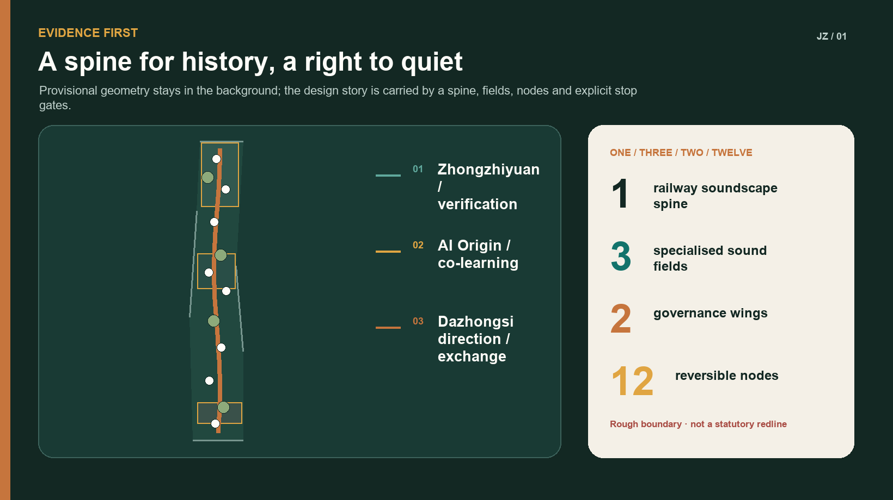
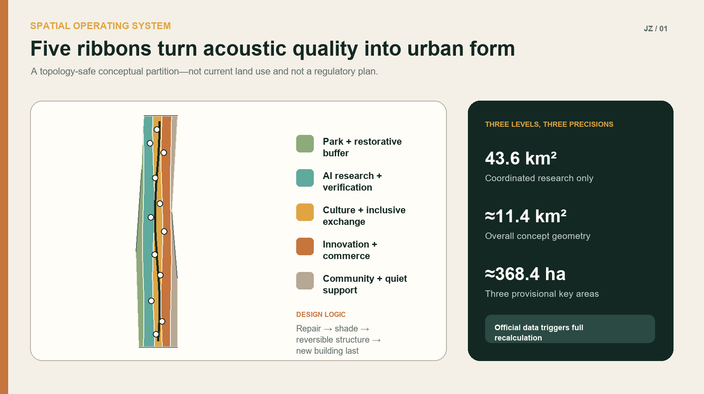
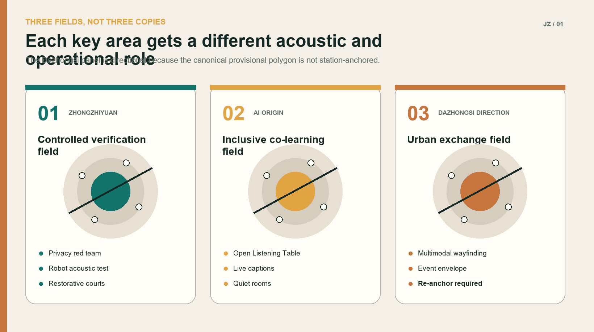
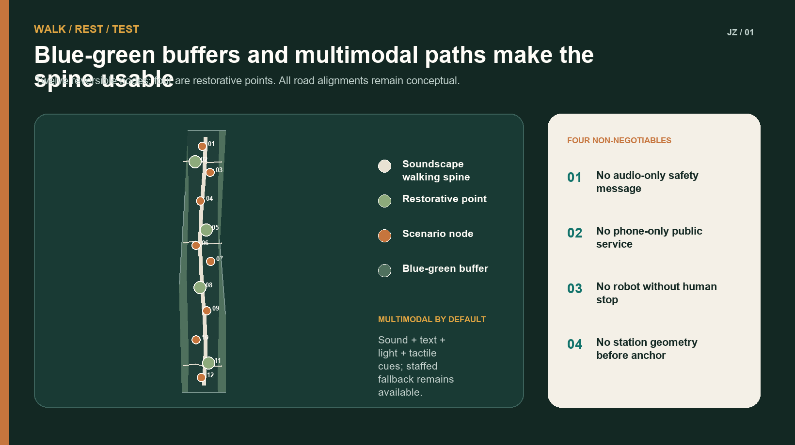
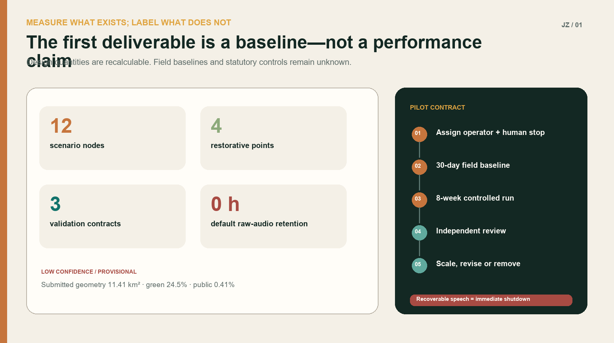

# JING-ZHANG SONIC COMMONS

> A belt where history can be heard and quiet can still be found.

## Design Basis and Source List

This proposal treats soundscape as the acoustic environment as perceived, understood and shaped by people in context—not merely as a decibel-reduction exercise. Railway memory, conditions for focused work, the vitality of commerce and public events, multimodal information for Deaf and hard-of-hearing people, and the safe acoustic interaction of robots and public alerts usually sit in separate cultural, transport, industrial and governance systems. JING-ZHANG SONIC COMMONS brings them into one spatial and operating protocol [standard:PROJECT-OFFICIAL-ANNOUNCEMENT] [standard:PROJECT-AGENT-OPEN-CALL-TASKBOOK] [source:ISO-SOUNDSCAPE].

The public package currently contains only a rough provisional overall boundary and three provisional key-area geometries. `geometry/site_boundary.geojson` preserves the repository geometry of `PROV-SITE-001`; `geometry/key_areas.geojson` preserves the three canonical provisional features. They support concept generation, visual explanation and intake checks only. They are not statutory redlines, parcels or engineering coordinates. In particular, `PROV-KEY-003` is not anchored to Dazhongsi Station and its footprint includes the Beijing North Railway Station vicinity. Every reference to station integration or four-quadrant connectivity is therefore directional. No exact bridge, entrance or connection is located from this polygon. All spatial layers and area-sensitive metrics must be recalculated when official polygons, station anchors or road redlines arrive [source:BOUNDARY-SOURCE] [source:KEY-AREA-SOURCE] [data:geometry/key_areas.geojson#PROV-KEY-003].

No site visit, acoustic survey, resident interview or property-owner confirmation has been completed for this submission. Personas are hypotheses to be tested. Scenario thresholds are proposed pilot gates, not locally validated needs. Phase 0 establishes baselines and participation before any claim of noise, health or economic performance [source:WHO-NOISE] [source:CHINA-NOISE-LAW] [depth:existing_conditions_diagnosis].

Global cases provide mechanisms, not imported forms or controls:

| Case | Transferable mechanism | Translation here | What is not copied |
| --- | --- | --- | --- |
| one-north, Singapore | Innovation mixed with living, learning and civic amenities | Three sound fields support research, daily life and public culture | Its development intensity and governance system |
| Barcelona 22@ | Industrial renewal linking technology, creativity and knowledge | Railway heritage becomes an interface for open innovation | Local ownership or renewal-unit assumptions |
| Paris-Saclay | Research cluster planned with everyday amenities and natural systems | Quiet, walking and test environments share one framework | Its scale targets as local controls |
| Smart Kalasatama, Helsinki | Small agile pilots, co-creation and test-to-scale methods | Start with four reversible nodes and expand only after review | Permanent smart-equipment deployment as a default |
| SONYC, New York | Machine learning for urban acoustic classification | Edge-only non-speech features plus a privacy red team | Collection of short raw-audio snippets |
| NYC Noise App | Measures level/type without recording sound; data is not direct enforcement | Voluntary diagnosis, never automatic penalties | Smartphone readings as a substitute for professional monitoring |

All sources are listed in `sources.json`. Only the public ISO abstract is used. Chinese environmental law and standards set compliance directions but do not replace confirmation of functional zones, environmental review or professional acoustic design [source:GB3096] [standard:MOHURD-URBAN-DESIGN-MEASURES].

## Three-Level Scope Framework

The unifying structure is “one spine, three fields, two wings, twelve nodes.” A Railway Soundscape Spine connects walking, cultural interpretation and quiet transitions along the provisional overall extent. The three fields specialise in verification at Zhongzhiyuan, inclusive co-learning at the Beijing AI Origin Community, and urban exchange in the Dazhongsi direction. A research–standards–privacy wing and a scenario–service–operations wing support twelve nodes built from reversible furniture, wayfinding, planting and, only when approved, equipment [data:geometry/roads.geojson#ROAD-SPINE-001] [data:geometry/public_space.geojson#NODE-01] [depth:three_level_scope_framework].

The three scales do not borrow precision from one another:

1. **43.6 km² coordinated study scope:** ecosystem, cross-district walking, public service, source-noise coordination and case mechanisms only; no land-use polygons or area metrics.
2. **Approximately 11.4 km² overall design scope:** conceptual land use, buildings, roads, green space, public space and phasing within the repository provisional boundary. Their areas describe submitted geometry, not official areas.
3. **Approximately 368.4 ha across three key areas:** differentiated actions, industry tests and operating contracts. Rough rectangles must not be read as parcels, station extents or ownership boundaries.

Any conclusion that exceeds these precision levels returns to `assumptions.json`. Official data, field evidence and statutory processes prevail if they conflict with this concept [source:SITE-PACKAGE] [metric:site_area_sqm].

## Coordinated-Scope Industry and Future-City Research

### Industry proposition

Acoustic AI is more than a sensor rollout. It links machine listening, edge inference, privacy engineering, robot interaction, inclusive information, multimodal models, cultural computing and city operations. The innovation belt can offer three public validation assets: controlled and revocable real-world settings, open test protocols, and auditable evidence of social acceptability. Companies receive governed questions, time-boxed sites and reproducible methods—not unconsented data [source:SONYC-NYU] [source:HELSINKI-KALASATAMA].

### Future-city proposition

A high-quality innovation district needs both exchange intensity and capacity for recovery. Constant meetings, traffic, events and device prompts can exclude people who need focused work, care for children, experience sensory sensitivity or access information differently. The proposal therefore avoids blanket silence and creates four experience levels: natural/restorative, everyday social, innovation display and controlled verification. These are design categories, not statutory acoustic function zones, and they carry no dB promise until a field baseline and competent authority confirm the applicable controls [source:WHO-NOISE] [source:BEIJING-14FYP].

### Coordination agenda

- Coordinate with road, rail, construction and social-activity noise control; individual headphones do not replace source prevention.
- Connect universities, laboratories, companies and independent test bodies around reproducible technical and lived-experience evidence.
- Link culture, landscape, transport, disability service and community work; every essential audible message has a visual or tactile equivalent.
- Apply data protection, cyber security and ethics review; no voice recording, identity inference or emotion-based public-service decisions by default.
- Explore quiet routes and event-day coordination beyond the site, without drawing exact alignments before an official coordinated boundary exists.

## Overall-Scope Urban Renewal and Urban Design at Regulatory-Plan Depth

### Railway Soundscape Spine

The spine is not a corridor of continuous music. Tactile paving, low-level signs, readable history, planted acoustic buffers, quiet stopping points and a few directional sound devices build a sequence. Active emitters remain off by default and operate only within an approved time, footprint and staffed procedure. Night operation stays low-stimulation. Safety information uses sound, light, text and tactile cues together [data:geometry/roads.geojson#ROAD-SPINE-001] [standard:MOHURD-CONTROL-DETAILED-PLANNING].

### Three sound fields

- **Zhongzhiyuan verification field:** laboratories, open evaluation, low-speed robot tests and restorative courtyards sit nearby, but closable test rooms and time windows isolate experiments.
- **AI Origin co-learning field:** public lessons, captioned exchange, auditory–tactile wayfinding and quiet collaboration rooms offer both expression and an easy exit.
- **Dazhongsi-direction urban exchange field:** rules for transit transition, event acoustic envelopes and multimodal wayfinding are proposed. No exact bridge, entrance or quadrant is drawn before the station anchor is official.

### Two governance wings

The research wing maintains baselines, privacy protocols, model cards, test logs and independent review. The operations wing manages bookings, time windows, accessible services, complaints and the annual programme. Equipment procurement follows—not precedes—assignment of an accountable role and a shutdown procedure. Automated classifications are advice only, reviewed by named human roles and never linked to automatic enforcement [data:geometry/constraints.geojson#CTRL-PRIVACY-001] [depth:overall_spatial_structure].

### Renewal approach

The order is: retain and repair existing public space; add trees, shade, seating and legible wayfinding; improve reflection and comfort with demountable elements; consider new buildings last. Concept building footprints express functional relationships around key areas and nodes, not demolition decisions. Existing-building surveys, ownership, daylight, fire and heritage controls are unavailable [data:geometry/buildings.geojson#BLDG-01] [metric:building_footprint_area_sqm].

## Detailed Design of the Three Key Areas

### Zhongzhiyuan AI Independent-Innovation Accelerator: controlled verification field

An “outside quiet, inside test” arrangement places a continuous shaded walk and four restorative points around shared laboratory courtyards. Controlled test rooms open only by booking. The three industrial validation contracts begin here, with data practices, equipment limits and accountable staff displayed on site. Robot routes share space by time, not by assumption; any collision or near miss stops the run for review [data:geometry/key_areas.geojson#PROV-KEY-001] [data:geometry/buildings.geojson#BLDG-01].

### Beijing AI Origin Community: inclusive co-learning field

An Open Listening Table anchors public release events with live captions, text, referral to sign-language support and tactile maps. Quiet rooms and discussion areas are offset so that choosing a low-stimulation space never requires explanation. University transfer, community service and public demonstrations share one booking and exit protocol. Residents are not default test subjects [data:geometry/key_areas.geojson#PROV-KEY-002] [standard:PROJECT-AGENT-OPEN-CALL-TASKBOOK].

### Dazhongsi AI Industry Cluster: urban exchange field (directional)

The taskbook requests station integration and four-quadrant connectivity, but `PROV-KEY-003` is not anchored to Dazhongsi Station. The proposal sets only portable rules: continuous visual–auditory–tactile guidance between future station anchors and public space; acoustic-envelope simulation before commercial or roadshow approval; and gradual transition from traffic edges through active ground floors, planting and public passages. All three must be relocated once official geometry arrives [data:geometry/key_areas.geojson#PROV-KEY-003] [source:KEY-AREA-SOURCE].

### Shared landmarks with distinct local roles

1. **Centennial Soundprint Stele:** abstract waveform, Braille and a tactile rail section tell history without default use of identifiable voice recordings.
2. **Open Listening Table:** publishes non-speech test methods, model limits and exit routes; it doubles as a release and public-review platform.
3. **Quiet Kilometre:** a brand for continuous low-stimulation walking, not an exact length claim. Its alignment and length await official geometry.
4. **Forum of Many Voices:** a multimodal event ground active only in approved windows and restored to an unamplified public space at other times.

The identity combines a rail cross-section with an open waveform: two parallel rail lines hold an unfinished wave, representing both sound and the right to quiet. Jing-Zhang Copper, Teal and Paper Grey are the core colours. No third-party mark or historic photograph is used.

## AI Ecosystem, Personas and Scenario Design

### Personas as hypotheses to validate

| Persona | Possible need | Possible harm | Response |
| --- | --- | --- | --- |
| Sensory-sensitive developer | Predictable quiet and low-stimulation travel | Persistent prompts and event takeover | Quiet routes, calm hours, exit without explanation |
| Deaf or hard-of-hearing visitor/resident | Information not dependent on hearing | Audio-only alarms and tours | Captions, light, tactile maps and staffed help |
| Neighbouring resident | Rest, walking and accountable event management | Night amplification or involuntary data capture | Time limits, public contact, zero default recording |
| Child and caregiver | Safety, legibility and places to pause | Misclassification or robot conflict | Low speed, clear sightlines, human supervision |
| Night/service worker | Night safety and recovery | “Vitality” overriding rest and labour rights | Calm night route, rest points, no algorithmic scheduling |
| Performer/event operator | Predictable permission and technical conditions | Last-minute conflict from vague rules | Acoustic-envelope preview and visible conditions |
| Robot operator/maintainer | Reproducible tests and clear safety limits | Over-automation and ambiguous liability | Enclosed test, human emergency stop, incident log |

### Twelve scenario cards

| No. and scenario | Spatial carrier | Limited AI role | Human control and stop condition |
| --- | --- | --- | --- |
| 01 Railway soundscape guide | Stele and spine | User-selected text or synthetic-voice interpretation | Editorial review, one-tap mute, no uncleared recordings |
| 02 Privacy-first acoustic condition monitor | Controlled nodes | Edge-level and non-speech category summaries | No raw retention by default; recoverable speech stops all use |
| 03 Quiet-route suggestion | Walking network | Combines staffed audits with aggregate conditions | Advice only; humans confirm access and construction changes |
| 04 Event acoustic-envelope preview | Forum | Predicts coverage, reflection and sensitive-time risk | Operator approval; exceedance triggers downgrade or closure |
| 05 Low-speed robot acoustic safety | Zhongzhiyuan test room | Evaluates alert legibility and device signature | Independent safety stop; collision/near miss halts test |
| 06 Multimodal emergency messaging | Three key areas | Drafts consistent sound, text, light and haptic versions | Emergency owner approves; inconsistency blocks launch |
| 07 Accessible wayfinding | Origin Community and transit transitions | User-selected multimodal route | Static signs and staffed alternative always available |
| 08 Plain-language public service | Service point | Converts public procedures into clear text and captions | Staff verify; never decides eligibility or rights |
| 09 Calm-hour coordination | Restorative points | Summarises bookings, events and staffed audits | Operator publishes; no persona-based exclusion |
| 10 Quiet-room booking | Origin Community | Recommends available room/time | Fair queue; no conversation or performance analysis |
| 11 Acoustic feedback triage | Service point | Clusters voluntarily submitted text/location | Human review; no automatic sanction or personal exposure |
| 12 Community soundwalk audit | Seasonal route | Organises consented anonymous observations | Consent, minimal records, published deletion/correction route |

### Three industrial validation contracts

**V1 Non-speech machine listening and privacy red team.** A designated public-space operator owns the site procedure; an independent acoustic/privacy team tests it; the company provides offline-inspectable edge devices. A 30-day professional and staffed baseline precedes an eight-week controlled run. Proposed process gates are zero default raw-audio retention, a public data card for every device, and human-explainable samples. Recoverable speech, unnotified collection or outbound raw data triggers immediate shutdown, log preservation and independent review. Accuracy targets remain unknown until the baseline exists [metric:raw_audio_retention_hours] [metric:field_acoustic_baseline].

**V2 Robot acoustic interaction and pedestrian perception.** The site operator, robot operator and independent safety officer share responsibility. Work begins in an enclosed room before any time-separated low-speed route. Resources include physical barriers, emergency stop, observers and an accessible feedback channel. Proposed success requires zero collisions, review of every near miss and a non-audio equivalent for Deaf and sensory-sensitive participants. A collision, failed emergency stop or route departure halts the pilot.

**V3 Multimodal public-message consistency.** The public-service or emergency accountable role decides content. AI drafts candidates; language and accessibility specialists conduct two-person review. Only non-emergency exercises are tested; there is no connection to live command. Sound, text, light and haptic messages must pass a human check for meaning, direction and timing. Conflict between channels, an untraceable model source or a missing accountable role blocks launch.

## Land Use, Buildings and Disaster Resilience

Five continuous ribbons follow the soundscape spine: park/green, research, culture/public service, commercial service and community support. Within the provisional boundary they form a gap-free, overlap-free topological partition that demonstrates relationships and recalculation—not current land use or a regulatory plan. Codes use the repository subset of national land-use classifications [data:geometry/land_use.geojson#LU-01] [standard:MNR-LAND-USE-CLASSIFICATION-GUIDE].

The building strategy is “repair first, small infill, open ground floors, demountable equipment.” Concept footprints include test rooms, an open release hall, service points, cultural display and transit-transition facilities. Height, FAR, density, setbacks and statutory green ratios are unknown until planning, daylight, fire, ownership and heritage controls are supplied [metric:floor_area_ratio] [depth:building_massing_guidance].

Disaster safety never depends on AI. Egress signs, emergency lighting, fire access and staffed broadcasting remain independent. Soundscape elements do not obstruct passage when power fails; furniture stays clear of egress. Multimodal information may improve access but cannot replace statutory alarms. Trees, bioswales and permeable surfaces are directional heat/rain strategies only because pipe, level and sponge-city controls are missing [data:geometry/green_space.geojson#GREEN-01] [depth:disaster_prevention_and_resilience].

## Integrated Transport, Municipal Systems and Public Services

Walking and cycling continuity form the transport skeleton. Concept roads comprise the soundscape spine, three cross-links and node branches; they are neither existing roads nor redlines. Dazhongsi station connections must be redrawn after an official anchor. Bridges, underpasses, vehicle circulation and signals require transport studies [data:geometry/roads.geojson#ROAD-CONNECT-03] [depth:transport_and_walkability].

Municipal principles are limited but firm: low-power and replaceable equipment; safe local fallback during network loss; no sensor link to automatic enforcement; no raw audio by default; and an owner, purpose, retention period and deletion record for every dataset. Power, telecoms, drainage, sanitation and fire capacities are unknown and carry no promise here.

Public services use three fallbacks: a staffed lightweight point, static information and optional AI. People without a smartphone, unable to use a model or declining processing can still obtain navigation, appeal, booking and emergency assistance. Publishing that a model has classified a complaint never counts as resolution [standard:MOHURD-URBAN-DESIGN-MEASURES] [depth:municipal_and_public_service_system].

## Blue-Green Space, Public Realm and Urban Character

Continuous shade, rain gardens, soft edges and four restorative quiet points form a green acoustic buffer. “Nature sounds” are not faked through looped playback. With no official water or level data, no watercourse is relocated; only conceptual green areas are encoded [data:geometry/green_space.geojson#GREEN-01] [metric:green_ratio].

Public space follows “hear—understand—choose—exit.” Entrances disclose active events and equipment. Information is visible and tactile. People choose a lively or calm path, and leaving requires no explanation. Seats do not all face a stage; quiet points retain passive safety without mandatory interaction. Night lighting is restrained and continuous, while active emitters stay off [data:geometry/public_space.geojson#PUBLIC-COMMONS-01] [depth:public_space_and_landscape].

The cultural narrative has four chapters: **Steam, Mountains and Rivers** on railway engineering; **Signals and Computation** on Zhongguancun's technical evolution; **Everything Can Be Heard** on machine perception and its limits; and **Keeping Quiet** on the right not to be listened to or disturbed. Public text, original graphics and synthetic audio come first. Historic photos, archives and personal voices remain outside the package until cleared [source:AGENT-TASKBOOK].

## Priority Projects, Policy Tools and Phasing

### Project package

| Project | Minimum delivery | Accountable role | Scale-up gate |
| --- | --- | --- | --- |
| Baseline and public map | Professional method, staffed observations, data note | Authority-designated planning/environment role | Sources and uncertainty publicly explainable |
| Four reversible nodes | Furniture, signs, planting, equipment-free operation | Public-space operator | Published use and disturbance thresholds met |
| Privacy-first listening sandbox | Enclosed test, edge device, red-team report | Site + company + independent reviewer | Zero unnotified capture and independent clearance |
| Inclusive co-learning service | Captions, tactile map, staffed service | Public-service operator | Co-acceptance by Deaf and sensory-sensitive participants |
| Annual Jing-Zhang Urban Soundscape Week | Exhibition, forum, open test and quiet day | Approved event organiser | Time, capacity and environmental conditions respected |

### Policy tools

Four proposals can support later management: a Soundscape and Quiet Impact Note for block design; a Data and Exit Card for public-space AI equipment; an Acoustic Envelope Preview before temporary events; and Reversible Permission with expiry review for pilots. They are proposed mechanisms, not adopted government policy. Competent authorities retain decisions under planning, construction, noise and data rules [source:CHINA-NOISE-LAW] [source:GB3096].

### Phasing and annual operation

- **Phase 0 (0–6 months):** obtain official geometry, existing-condition and regulatory data; complete site work, acoustic baseline, accessibility audit, stakeholder participation and accountability assignment. No accountable role means no equipment.
- **Phase 1 (6–18 months):** build four reversible nodes that work without permanent sensors; complete V1–V3 in enclosed settings. Failure returns the place to an equipment-free version.
- **Phase 2 (18–36 months):** extend independently cleared mechanisms only, reaching twelve nodes after transport, municipal, fire and heritage studies.
- **Phase 3 (36+ months):** a repeating cycle of spring soundwalk audit, summer controlled tests, autumn Urban Soundscape Week and winter public ledger/budget.

The annual ledger publishes operating nodes, purposes, shutdowns, unresolved complaints, raw-audio retention, human-review samples, accessibility failures and the next deletion list. It publishes governance evidence, not personal routes or voices.

## Metrics, Area Recalculation and Compliance

`metrics.json` separates design quantities recalculated from submitted layers, field baselines that do not yet exist, and controls that require statutory data. Provisional site area, concept building footprint, concept green ratio and concept public-space ratio belong to the first class. They carry low confidence and cannot become planning controls. Acoustic baselines, use counts and performance are unknown. FAR, height and road redlines are also unknown [metric:site_area_sqm] [metric:field_acoustic_baseline] [metric:floor_area_ratio].

Verifiable design commitments are twelve scenario nodes, four restorative points, three industrial validation scenarios, a four-season operation cycle, and a default raw-audio retention target of zero hours. Zero is a proposed policy, not measured performance. Any professional calibration that genuinely requires brief raw audio needs separate approval, a narrow scope and exclusion from default public operation [metric:soundscape_node_count] [metric:raw_audio_retention_hours].

`compliance_matrix.json` covers call requirements 1.3.1–1.5.3.3 and agent.1–agent.6. `standard_matrix.json` distinguishes mandatory bases from the missing architectural-design-depth document. `design_depth_matrix.json` connects narrative, drawings, GeoJSON, metrics, assumptions and checks. “Addressed/complete” means the submission contains the relevant design expression—not approval or a specialist finding [standard:PROJECT-OFFICIAL-ANNOUNCEMENT] [depth:metrics_and_compliance].

## Risks, Copyright and Compliance

1. **Geometry:** all boundaries are rough and provisional; the Dazhongsi key-area placeholder is not station-anchored. Official data triggers full recalculation.
2. **Evidence:** no site visit, interview or measurement; personas and thresholds are hypotheses, not claimed local endorsement.
3. **Privacy:** machine listening can capture speech or enable identity and behaviour monitoring. No voice recording, voiceprint/facial identification or raw-audio release by default; recoverable speech triggers shutdown.
4. **Safety:** robots, amplification and public messages can collide, mislead or disturb. Statutory systems stay independent, AI remains assistive and named humans can stop operation.
5. **Equity:** audio-only or phone-only access excludes Deaf, sensory-sensitive and digitally underserved people. Visual, tactile or staffed alternatives accompany every essential service.
6. **Delivery:** operators, budget, ownership, utilities and approvals are unconfirmed. Until confirmed, only reversible public-space actions that work without equipment proceed.

The Chinese and English narratives, original graphics, design GeoJSON, offline pages and PDFs were created in this AI-assisted work. Repository provisional geometry retains its source attributes. No external map, photograph, logo, remote font, personal recording or third-party interface is embedded. Operating-system fonts are rasterised into outputs; no font file is distributed. See `report/copyright_statement.md`. This is an open-call concept, not a statutory plan, engineering drawing, acoustic report, environmental impact assessment, government commitment or procurement recommendation.

## References

- Haidian District Government and the Haidian Branch of Beijing Municipal Commission of Planning and Natural Resources: official call and task requirements [source:OFFICIAL-ANNOUNCEMENT].
- Project repository: agent taskbook, site package, source registry, standards and provisional geometry [source:SITE-PACKAGE] [source:AGENT-TASKBOOK].
- Public abstract of ISO 12913-1:2014 for the soundscape framework [source:ISO-SOUNDSCAPE].
- World Health Organization background on environmental noise and health [source:WHO-NOISE].
- Law of the People's Republic of China on Noise Pollution Prevention and Control and GB 3096—2008 [source:CHINA-NOISE-LAW] [source:GB3096].
- Beijing's 14th Five-Year ecological-environment plan on source-based noise control [source:BEIJING-14FYP].
- Official/project sources for one-north, Barcelona 22@, Paris-Saclay, Smart Kalasatama, SONYC and NYC Noise App as mechanism cases only [source:ONE-NORTH-JTC] [source:BARCELONA-22] [source:PARIS-SACLAY].
