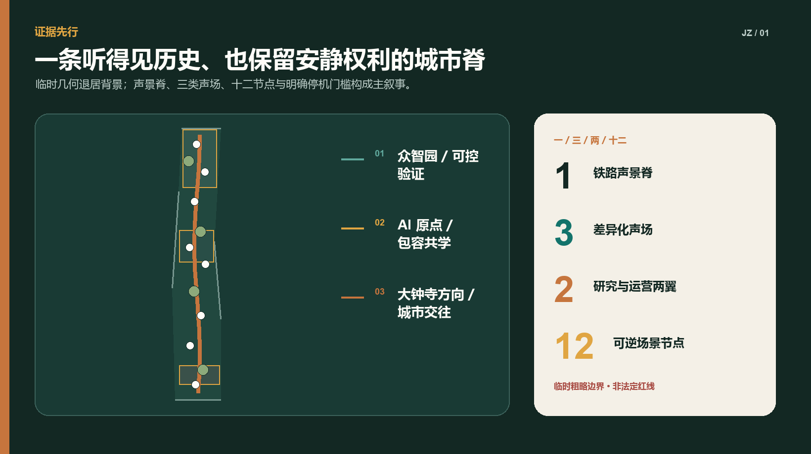
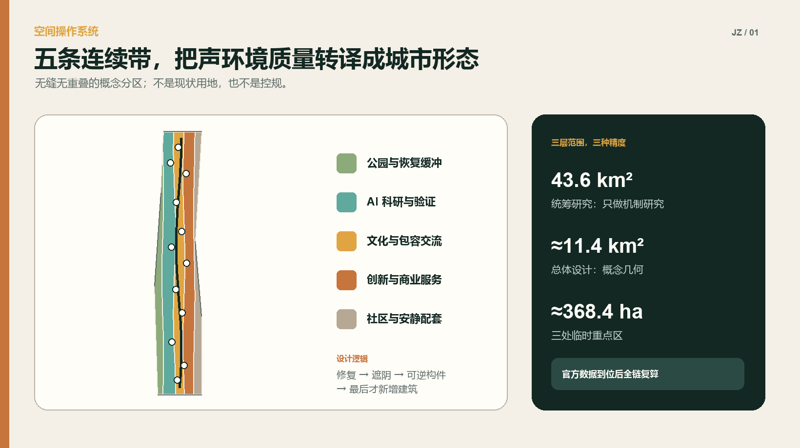
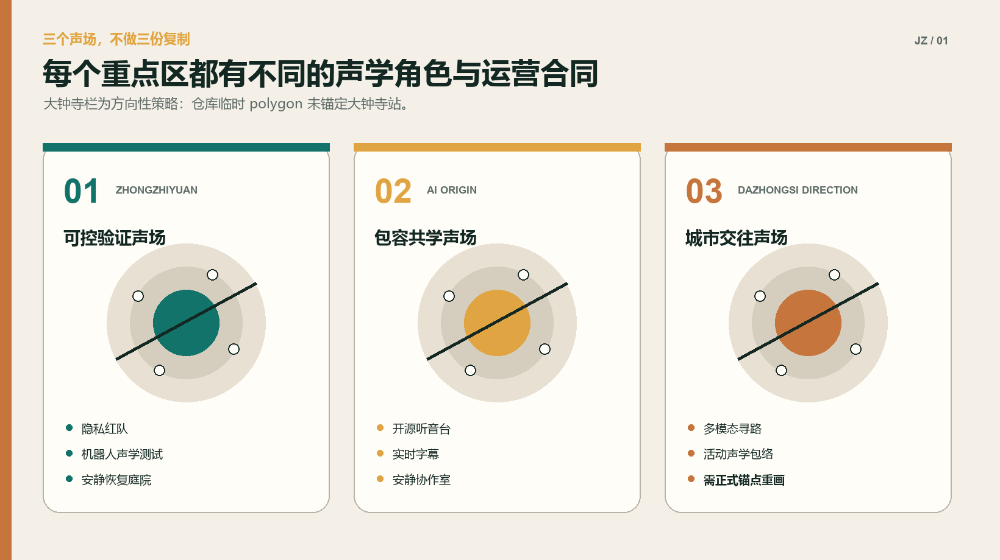
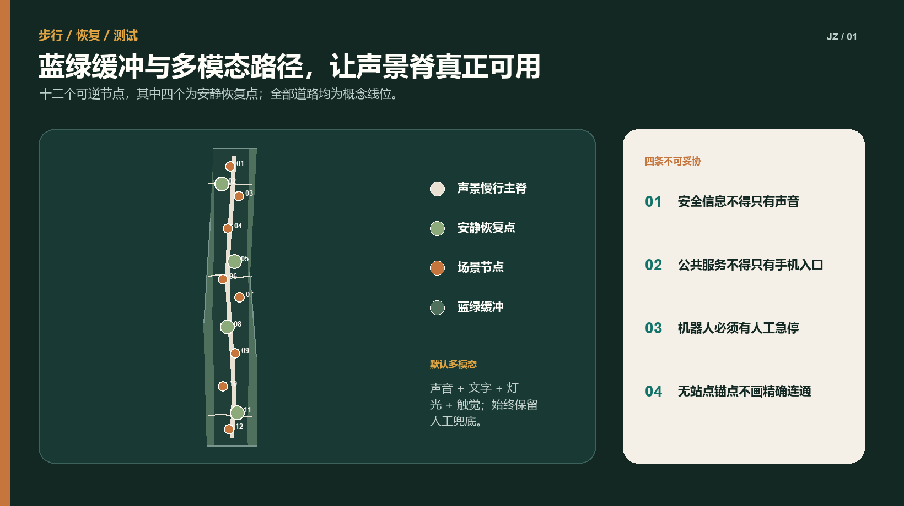
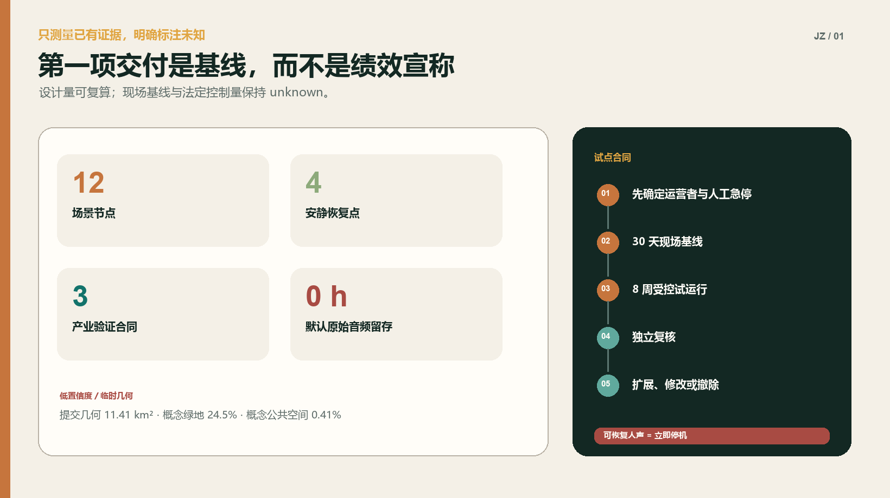

# 京张声景公地 / JING-ZHANG SONIC COMMONS

> 让创新带既听得见历史，也容得下安静。

## 设计依据与资料清单

本方案把“声景”理解为人在具体场所中感知、理解和共同塑造的声环境，而不只是把分贝压低。京张铁路的历史辨识度、研发社区的专注需求、商业与公共活动的活力、听障人士的多模态信息获取，以及机器人与公共广播的安全声学，原本分散在文化、交通、产业和治理系统中；“京张声景公地”把它们整合为一套城市空间与运营协议 [standard:PROJECT-OFFICIAL-ANNOUNCEMENT] [standard:PROJECT-AGENT-OPEN-CALL-TASKBOOK] [source:ISO-SOUNDSCAPE]。

当前公开包只有临时粗略总体范围和三处临时重点区。`geometry/site_boundary.geojson` 保持仓库 `PROV-SITE-001` 的几何不变，`geometry/key_areas.geojson` 保持三处 canonical provisional geometry 不变。它们只用于概念生成、图面表达和 intake 自检，不是法定红线、地块或工程定位依据。尤其 `PROV-KEY-003` 的几何中心不在大钟寺站，且包含北京北站附近范围；本方案凡提到“大钟寺站、四象限或站城关系”均是任务书层面的方向性响应，不据此绘制精确连通工程。官方 polygon、站点锚点或道路红线发布后，全部空间图层和面积指标必须整链复算 [source:BOUNDARY-SOURCE] [source:KEY-AREA-SOURCE] [data:geometry/key_areas.geojson#PROV-KEY-003]。

本次工作没有现场踏勘、声学实测、居民访谈或产权单位确认。用户画像是待验证的设计假设，场景阈值是建议的试点门槛，不代表当地需求已经确认。首期工作首先建立基线和参与机制，而不是宣称实现降噪、健康或产业绩效 [source:WHO-NOISE] [source:CHINA-NOISE-LAW] [depth:existing_conditions_diagnosis]。

参考案例只提取机制，不复制形态：

| 案例 | 可借鉴机制 | 本方案的转译 | 不直接照搬之处 |
| --- | --- | --- | --- |
| 新加坡 one-north | 工作、生活、学习与公共设施混合的创新生态 | 三类声场同时服务研发、日常和公共文化 | 不套用其开发强度与治理制度 |
| Barcelona 22@ | 老工业区更新与技术、创意、知识产业协同 | 铁路遗产成为开放创新的公共界面 | 不推定本地权属或更新单元 |
| Paris-Saclay | 科研集群与生活配套、自然系统共同规划 | 把安静、慢行与创新测试放在同一空间框架 | 不引用其规模指标作为本地指标 |
| Helsinki Smart Kalasatama | 小规模敏捷试点、居民共创、可扩展测试 | 先做四个可逆节点，达标后再扩展 | 不把“智慧”当成永久设备铺设 |
| SONYC, New York | 机器学习辅助城市声环境识别 | 只处理非语音特征并设置隐私红队 | 不沿用原始音频片段采集方式 |
| NYC Noise App | 测分贝与类型但不录音，数据不直接执法 | 公众自愿测量、结果用于诊断而非自动处罚 | 不用单次手机测量替代专业监测 |

以上来源列于 `sources.json`；其中 ISO 仅引用公开摘要，中国法律与环境标准用于说明合规方向，不能替代声环境功能区确认、环评、施工图或专业声学报告 [source:GB3096] [standard:MOHURD-URBAN-DESIGN-MEASURES]。

## 三层范围工作框架

方案以“一脊、三场、两翼、十二节点”为统一结构：一条“铁路声景脊”沿临时总体范围组织连续步行、文化叙事与静音过渡；三类声场分别承担众智园的验证、AI 原点社区的共学和大钟寺方向的城市交往；两翼分别是“研究—标准—隐私治理翼”和“场景—服务—运营翼”；十二节点以可逆家具、导视、绿化和经批准的设备落位 [data:geometry/roads.geojson#ROAD-SPINE-001] [data:geometry/public_space.geojson#NODE-01] [depth:three_level_scope_framework]。

三层范围不混用精度：

1. **43.6 平方公里统筹研究范围**：只提出生态链、跨区慢行、公共服务、噪声源协同和案例机制，不输出用地 polygon 或面积指标。
2. **约 11.4 平方公里总体设计范围**：在仓库临时边界内形成概念用地、建筑、道路、绿地、公共空间和分期图层；其面积是“提交几何面积”，不是官方面积。
3. **约 368.4 公顷三处重点区**：给出差异化空间动作、产业验证与运营合同；临时矩形不得被读成地块、站点或产权边界。

任何越过这三层精度边界的判断都必须回到 `assumptions.json`。如果补充数据与本方案冲突，以官方数据、现场证据和法定程序优先 [source:SITE-PACKAGE] [metric:site_area_sqm]。

## 统筹研究范围产业与未来城市研究

### 产业判断

声学 AI 不应被缩窄为“装传感器”。它连接机器听觉、端侧推理、隐私计算、机器人交互、无障碍信息、多模态大模型、文化计算和城市运维。创新带可提供三类公共验证条件：受控且可撤销的真实空间、公开的测试协议、可审计的社会接受度。企业得到的不是未经授权的数据，而是合规问题、测试时段、受控场地和公开评测方法 [source:SONYC-NYU] [source:HELSINKI-KALASATAMA]。

### 未来城市判断

高品质创新城区既需要交流强度，也需要恢复能力。连续高刺激的会议、交通、活动与设备提示音会排斥需要安静工作、照护儿童、感官敏感或听觉受限的人。方案因此不追求全域“静音”，而是建立四级体验：自然与恢复声场、日常交往声场、创新展示声场、受控验证声场。四级不是声环境功能区，也不预设 dB 数字；现场基线和主管部门确认后才可转译为时段、设备和工程要求 [source:WHO-NOISE] [source:BEIJING-14FYP]。

### 协同研究清单

- 与道路、铁路、施工和社会生活噪声治理衔接，避免把源头治理责任转给个体降噪设备。
- 与高校、实验室、企业和第三方检测机构共同建立“可复现实验 + 人的体验”双证据。
- 与文化、园林、交通、残障服务和社区工作协同，任何听觉信息都提供视觉或触觉冗余。
- 与数据保护、网络安全和伦理审查协同，默认不录人声、不做身份识别、不以情绪推断影响公共服务。
- 与周边街区建立安静路线和活动日声环境联动，但在官方统筹边界发布前不落精确线路。

## 总体设计范围城市更新与控规深度城市设计

### 一条铁路声景脊

声景脊不是一条连续播放音乐的“音响走廊”，而是以路面触感、低位导视、可读历史文本、植被声屏障、安静停留点和少量定向声装置组织的公共空间序列。所有主动发声装置默认关闭，只有在批准的活动时段、明确覆盖范围和人工值守下启用。夜间保持低刺激，关键安全信息用声音、灯光、文字与触觉共同表达 [data:geometry/roads.geojson#ROAD-SPINE-001] [standard:MOHURD-CONTROL-DETAILED-PLANNING]。

### 三类声场

- **众智园验证声场**：把实验室、开源评测、机器人低速测试与静音恢复庭院相邻布置，用可关闭的测试舱和限定时段隔离验证活动。
- **AI 原点共学声场**：围绕公开课、成果发布、字幕化交流、听觉—触觉导览和安静协作室，形成“可表达也可退出”的学习环境。
- **大钟寺方向城市交往声场**：提出站城过渡、商业活动声学包络和多模态寻路的方向性策略；在正式站点锚点前不输出连桥、出入口或四象限精确位置。

### 两翼治理

“研究治理翼”维护基线方法、隐私协议、模型卡、测试日志和第三方复核；“场景运营翼”管理空间预约、活动时段、无障碍服务、投诉响应和年度项目。设备采购不得先于责任主体和停机流程确定。所有自动识别只给出建议标签，由具名岗位复核，不触发自动执法 [data:geometry/constraints.geojson#CTRL-PRIVACY-001] [depth:overall_spatial_structure]。

### 城市更新方式

更新优先级依次为：保留与修复现状公共空间；增加树阵、遮阴、坐凳和清晰导视；用可拆装构件改善声反射与停留；最后才考虑新增建筑。概念建筑基底集中在重点区内部和声景节点周边，表达功能关系而非拆建判断；现状建筑调查、产权、日照、消防和文保信息未提供，不能据本图层实施 [data:geometry/buildings.geojson#BLDG-01] [metric:building_footprint_area_sqm]。

## 重点区域详细设计

### 众智园 AI 自主创新加速区：可控验证声场

空间采用“外静内测”的嵌套组织：外围连续绿荫慢行和四处安静恢复点承接日常；中部共享实验院落连接实验室、孵化器与评测室；受控测试舱只在预约时段开放。三个产业验证场景在这里首试，但测试数据、设备边界与责任人必须现场公示。机器人路线与普通慢行分时共享，遇到近失事件立即停运复盘 [data:geometry/key_areas.geojson#PROV-KEY-001] [data:geometry/buildings.geojson#BLDG-01]。

### 北京 AI 原点社区：包容共学声场

以“开源听音台”为公共核心：发布活动默认实时字幕，讲解同时提供文字、手语转介和触觉地图；安静协作室与开放讨论区错位布置，用户可以不解释原因地选择低刺激空间。高校成果转化、社区服务和公众体验共用一套预约与退出机制，不把居民当作默认测试对象 [data:geometry/key_areas.geojson#PROV-KEY-002] [standard:PROJECT-AGENT-OPEN-CALL-TASKBOOK]。

### 大钟寺 AI 产业聚集区：城市交往声场（方向性）

任务书要求回应大钟寺站一体化与四象限连通，但现有 `PROV-KEY-003` 未锚定大钟寺站。本方案只提出三条可迁移规则：从站点到公共空间设置连续视觉—听觉—触觉寻路；商业和路演活动先模拟声学包络再审批；交通噪声界面以建筑首层、绿化和公共廊道形成渐进过渡。上述规则待正式 polygon 和站点关系确定后重新落位 [data:geometry/key_areas.geojson#PROV-KEY-003] [source:KEY-AREA-SOURCE]。

### 三处共用但不复制的地标

1. **百年声纹碑**：以抽象波形、盲文和可触摸铁路断面讲述历史；不用真实人物录音作为默认内容。
2. **开源听音台**：公开非语音测试方法、模型限制和退出方式，也是成果发布与公众审阅台。
3. **静默一公里**：不是精确长度承诺，而是一类连续低刺激步行体验的品牌；实际长度待正式边界和测量确认。
4. **万声会场**：只在经批准时段运行的多模态公共活动场，日常恢复为无扩声开放空间。

地标 Logo 由“铁路断面 + 声波留白”构成：两条平行轨线夹持一段不闭合波形，既表示声音，也表示选择安静的权利。主色为京张铜、松石绿和纸墨灰；不得使用第三方商标或历史照片。

## AI 创新生态、人才画像与 AI+ 场景

### 用户画像：待验证的设计假设

| 画像 | 可能需求 | 可能受伤害方式 | 设计响应 |
| --- | --- | --- | --- |
| 感官敏感的研发人员 | 可预期的安静、低刺激通勤 | 持续提示音与活动占用 | 安静路线、低刺激时段、无需解释的退出权 |
| 听障访客或居民 | 不依赖听觉获得信息 | 只有声音的警报与导览 | 字幕、灯光、触觉地图与人工协助 |
| 周边居民 | 休息、散步、可追责的活动管理 | 夜间扩声、被动成为数据源 | 时段边界、公开联系人、零默认录音 |
| 儿童与照护者 | 安全、可读、可停留 | 设备误识别、机器人冲突 | 低速分时、清晰视线、人工看护 |
| 夜班与服务人员 | 夜间安全和恢复 | “活力”压过休息与劳动权益 | 夜间低刺激、休息点、非算法排班建议 |
| 表演者与活动运营者 | 可预测的许可与技术条件 | 模糊规则导致临时冲突 | 活动声学包络预演、可见审批条件 |
| 机器人运营与维护团队 | 可复现测试和安全边界 | 过度自动化、责任不清 | 封闭测试、人工急停、事件日志 |

### 十二张场景卡

| 编号与场景 | 空间载体 | AI 的有限角色 | 人工控制与停止条件 |
| --- | --- | --- | --- |
| 01 铁路声景导览 | 百年声纹碑、声景脊 | 根据用户选择生成文字/合成语音讲解 | 内容审核；用户一键静音；不用未授权录音 |
| 02 隐私优先声况监测 | 受控节点 | 端侧输出声级与非语音类别摘要 | 默认不存原始音频；可恢复人声即全线停用 |
| 03 安静路线建议 | 慢行网络 | 结合人工巡查与聚合声况推荐低刺激路线 | 只作建议；无障碍与施工信息由人工确认 |
| 04 活动声学包络预演 | 万声会场 | 预测覆盖、反射与敏感时段风险 | 运营者审批；超出批准范围立即降级或停场 |
| 05 机器人低速声学安全 | 众智园测试舱 | 分析提示音可辨性和设备声学特征 | 独立安全员急停；发生碰撞/近失即停 |
| 06 多模态应急提示 | 三处重点区 | 生成声音、文字、灯光、触觉的一致版本 | 应急责任人批准；任一渠道不一致不得上线 |
| 07 无障碍寻路 | 原点社区、交通过渡 | 提供个性化多模态路线 | 用户自选；人工服务和静态导视常备 |
| 08 公共服务简明表达 | 服务驿站 | 将公开流程转为简明文本和字幕 | 工作人员复核；不自动作资格或权益决定 |
| 09 低刺激时段协调 | 安静恢复点 | 汇总预约、活动和人工巡查信息 | 运营者发布；不根据个人画像限制进入 |
| 10 安静协作空间预约 | 原点社区 | 推荐可用房间与时段 | 公平排队；不分析对话内容与绩效 |
| 11 声环境反馈分诊 | 服务驿站 | 对自愿提交的文字/位置进行主题归类 | 人工复核与回访；不自动处罚或公开个人 |
| 12 社区声漫步审计 | 全线四季路线 | 辅助整理匿名观察与改进清单 | 知情同意、最小化记录、公开删改机制 |

### 三个产业验证合同

**V1 非语音机器听觉与隐私红队。** 指定公共空间运营方负责场地，第三方声学/隐私团队负责测试，企业提供可离线检查的边缘设备。先做 30 天人工与专业仪器基线；随后在封闭或明确告知时段运行 8 周。成功门槛是原始音频默认留存为 0、公开数据说明覆盖 100% 设备、抽样结果均可由人工解释；任何可恢复语音、未告知采集或数据外发均触发立即停机、封存日志和独立复核。性能准确率不在没有基线时预设 [metric:raw_audio_retention_hours] [metric:field_acoustic_baseline]。

**V2 机器人声学交互与行人感知。** 场地运营方、机器人运营方和独立安全员共同负责，先在封闭测试舱进行，再进入分时低速路线。资源包括物理隔离、急停、观察员和可访问的反馈界面。成功条件是测试期零碰撞、所有近失均复盘、听障与感官敏感参与者可获得非声音等效提示；任何碰撞、急停失效或路线越界立即停止。

**V3 多模态公共提示一致性。** 公共服务/应急责任岗位决定内容，AI 只生成候选版本，语言与无障碍专家进行双人复核。先以非紧急演练测试理解度，不接入真实应急指挥。成功条件是声音、文字、灯光和触觉在含义、方向和时序上通过人工一致性检查；任一通道冲突、模型无法解释来源或人工岗位空缺时不得上线。

## 用地、建筑规模与拆改留方案

概念用地采用五条随声景脊起伏的连续带：公园绿地、科研、文化与公共服务、商业服务、社区配套。它们在临时边界内形成无缝、无重叠的拓扑分区，用来证明结构关系和面积复算方法，不替代国土空间用地现状或控规。`land_use_code` 使用仓库允许的国土空间用途子集 [data:geometry/land_use.geojson#LU-01] [standard:MNR-LAND-USE-CLASSIFICATION-GUIDE]。

建筑策略是“修复优先、小体量补缺、首层开放、设备可拆”。概念建筑包括实验舱、开源发布厅、社区服务点、文化展示和交通过渡设施；高度、容积率、密度、退线和绿地率均保持 unknown，待控规、日照、消防、产权和文保条件到位后确认 [metric:floor_area_ratio] [depth:building_massing_guidance]。

防灾不依赖 AI：疏散标识、应急照明、消防通道和人工广播保持独立；声景设施断电后不阻挡通行，家具不侵占疏散宽度。多模态提示可增强信息可达性，但不能替代法定报警与应急系统。雨洪和热环境采用树阵、下凹绿地与可渗铺装的方向性策略，尚无管线、竖向和海绵指标，必须专项复核 [data:geometry/green_space.geojson#GREEN-01] [depth:disaster_prevention_and_resilience]。

## 交通、轨道、市政与公共服务设施

交通系统以步行和自行车连续性为骨架，概念道路只包括一条声景脊、三条重点区横向连接和若干节点支路，不表示现状道路或红线。大钟寺站接驳待正式站点锚点后重画；任何桥梁、地下通道、机动车组织和信号方案均需交通专项 [data:geometry/roads.geojson#ROAD-CONNECT-03] [depth:transport_and_walkability]。

市政方面只提出接口原则：设备低功耗、可断电、可替换；网络中断时本地安全功能不失效；传感器不接入执法系统；原始音频默认不产生或不留存；所有数据设置责任人、用途、保存期和删除记录。电力、通信、排水、环卫和消防容量没有底数，不作容量承诺。

公共服务采用“有人值守的轻量驿站 + 静态信息 + 可选 AI”三级兜底。没有手机、不会使用模型或拒绝数据处理的人仍可获得导览、申诉、预约与应急帮助。投诉和反馈入口公布办理岗位与预计时限，不把“已被模型分类”当作处理完成 [standard:MOHURD-URBAN-DESIGN-MEASURES] [depth:municipal_and_public_service_system]。

## 蓝绿空间、公共空间与城市风貌

蓝绿系统以连续树荫、雨水花园、软质边界和四处安静恢复点形成声景缓冲；“自然声”不通过循环播放伪造。没有官方水系和竖向数据，因此不绘制水体改线，只在 `green_space.geojson` 表达概念绿地 [data:geometry/green_space.geojson#GREEN-01] [metric:green_ratio]。

公共空间按“听见—理解—选择—退出”设计：入口先说明当前活动与设备状态；导视同时可视、可触；用户可以选择热闹或安静路线；退出不需要提供原因。座椅避免全部面向舞台，安静点保持视线安全但不承受强制互动。夜间照明克制、连续，主动声装置默认关闭 [data:geometry/public_space.geojson#PUBLIC-COMMONS-01] [depth:public_space_and_landscape]。

文化叙事采用四章：**蒸汽与山河**讲铁路工程；**电波与计算**讲中关村技术变迁；**万物可听**讲机器感知的机会与边界；**保留安静**把不被监听、不被打扰写入未来城市文明。叙事材料优先使用公开文本、原创图形和合成声音；历史照片、档案、个人声音在清权前不进入成果 [source:AGENT-TASKBOOK]。

## 更新项目清单、实施政策与分期计划

### 项目包

| 项目 | 最小交付 | 责任角色 | 放大条件 |
| --- | --- | --- | --- |
| 声景基线与公众地图 | 专业测量方案、人工观察、数据说明 | 组织方指定规划/环保责任单位 | 数据来源与误差可公开解释 |
| 四个可逆声景节点 | 家具、导视、绿化、无设备版本 | 公共空间运营方 | 使用与干扰反馈达到公开门槛 |
| 隐私优先听觉沙盒 | 封闭测试、边缘设备、红队报告 | 场地、企业、第三方联合 | 零未告知采集且通过独立复核 |
| 包容共学服务 | 字幕、触觉地图、人工服务 | 公共服务运营方 | 听障及感官敏感参与者共同验收 |
| 年度京张城市声景周 | 展览、论坛、开放测试、安静日 | 经批准的活动主办方 | 不突破时段、容量与环境要求 |

### 政策工具

提出四项可嵌入后续管理的工具：街区设计项目附“声景与安静影响说明”；公共空间 AI 设备附“数据与退出卡”；临时活动先做“声学包络预演”；试点采用“可逆许可 + 到期复核”。它们是建议制度，不代表政府已采纳。法定噪声、规划、建设和数据管理要求仍由有权部门决定 [source:CHINA-NOISE-LAW] [source:GB3096]。

### 分期与年度运营

- **0 期（0–6 个月）**：取得官方 geometry、现状与控规资料；完成踏勘、声学基线、无障碍审计、利益相关方参与和责任确认。没有责任主体就不装设备。
- **1 期（6–18 个月）**：建设四个无永久传感器也能运行的可逆节点，完成 V1–V3 封闭测试。未达门槛则撤除或回到无设备版本。
- **2 期（18–36 个月）**：只把通过独立复核的机制扩展到十二节点，补足交通、市政、消防和文保专项。
- **3 期（36 个月以后）**：形成春季声漫步审计、夏季受控测试、秋季城市声景周、冬季公开账本与来年预算的循环。

年度账本至少公开：运行节点、设备用途、停机次数、未解决投诉、原始音频留存情况、人工复核抽样、无障碍问题和下一年度删减清单。公开的是汇总与治理证据，不是个人轨迹或声音。

## 指标体系、面积复算与合规矩阵

`metrics.json` 把指标分成三类：可由提交图层复算的“设计量”，必须现场获得的“基线量”，以及必须由法定资料确认的“控制量”。临时总体范围面积、概念建筑基底、概念绿地率和概念公共空间率属于第一类，均标注低置信度且不能转为控规结论；声环境基线、使用人数和声学绩效属于第二类，当前为 unknown；容积率、高度和道路红线属于第三类，当前为 unknown [metric:site_area_sqm] [metric:field_acoustic_baseline] [metric:floor_area_ratio]。

核心可核验承诺是：十二个场景节点、四个安静恢复点、三个产业验证场景、四季运营循环、原始音频默认留存 0 小时。这里“0 小时”是设计政策目标，不是当前系统绩效；任何确需短时原始音频的专业校准必须另行审批、明确范围并不进入默认公共运营 [metric:soundscape_node_count] [metric:raw_audio_retention_hours]。

`compliance_matrix.json` 覆盖公告 1.3.1–1.5.3.3 和 agent.1–agent.6；`standard_matrix.json` 区分强制依据与缺失的建筑工程设计文件；`design_depth_matrix.json` 连接正文、图纸、GeoJSON、指标、假设和自检。矩阵的 “addressed/complete” 只表示本提交提供了相应设计表达，不表示获得审批或专业专项结论 [standard:PROJECT-OFFICIAL-ANNOUNCEMENT] [depth:metrics_and_compliance]。

## 风险、版权与合规说明

1. **几何风险**：总体和重点区均为临时粗略几何；大钟寺临时重点区未锚定大钟寺站。正式数据触发全链复算。
2. **证据风险**：未踏勘、未访谈、未测量；画像与阈值是待验证假设，不宣称代表居民或企业。
3. **隐私风险**：机器听觉可能捕获人声、推断身份或形成行为监控。默认不录人声、不做人脸/声纹识别、不发布原始音频；可恢复语音即停机。
4. **安全风险**：机器人、活动扩声和公共提示可能造成碰撞、误导或干扰。法定系统独立，AI 只作辅助，具名岗位可急停。
5. **公平风险**：仅听觉或仅手机入口会排斥听障者、感官敏感者和数字弱势群体。每个关键服务均提供视觉、触觉或人工替代。
6. **实施风险**：责任主体、预算、产权、市政和审批尚未确认。未确认前只实施可逆、无设备也可运行的公共空间动作。

以上风险与对应触发条件已同步到 `assumptions.json`、`self_check.json` 和设计深度矩阵；风险被披露不等于风险已经消除 [source:SOURCE-REGISTRY] [depth:risk_missing_data]。

正文、英文译稿、原创图形、GeoJSON 设计层、离线网页与 PDF 均由本次 AI 协作生成；临时边界来自主仓库并保持原始属性。图中不使用外部地图、照片、Logo、远程字体、个人声音或第三方 UI。渲染使用操作系统字体但不分发字体文件；详细声明见 `report/copyright_statement.md`。本方案为开源征集概念成果，不是法定规划、工程图、声学报告、环境影响评价、政府承诺或采购建议。

## 参考资料

- 北京市海淀区政府与北京市规划和自然资源委员会海淀分局：官方征集公告与任务要求 [source:OFFICIAL-ANNOUNCEMENT]。
- 项目仓库：智能体任务书、site package、source registry、standards 与 provisional geometry [source:SITE-PACKAGE] [source:AGENT-TASKBOOK]。
- ISO 12913-1:2014 公开摘要：声景概念与框架 [source:ISO-SOUNDSCAPE]。
- 世界卫生组织：环境噪声与健康背景 [source:WHO-NOISE]。
- 《中华人民共和国噪声污染防治法》与 GB 3096—2008 [source:CHINA-NOISE-LAW] [source:GB3096]。
- 北京市“十四五”时期生态环境保护规划中的噪声源头防控方向 [source:BEIJING-14FYP]。
- one-north、Barcelona 22@、Paris-Saclay、Smart Kalasatama、SONYC 与 NYC Noise App 的官方/项目方公开资料，作为机制案例而非本地控制依据 [source:ONE-NORTH-JTC] [source:BARCELONA-22] [source:PARIS-SACLAY]。
