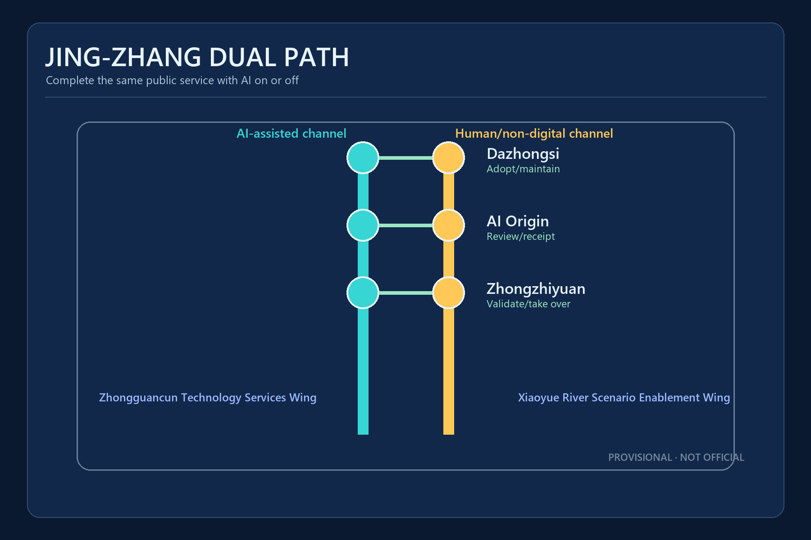
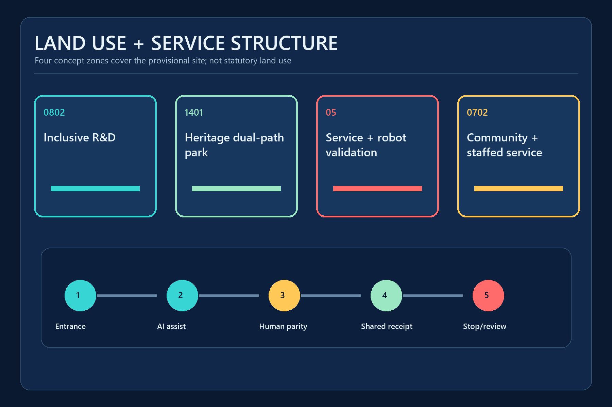
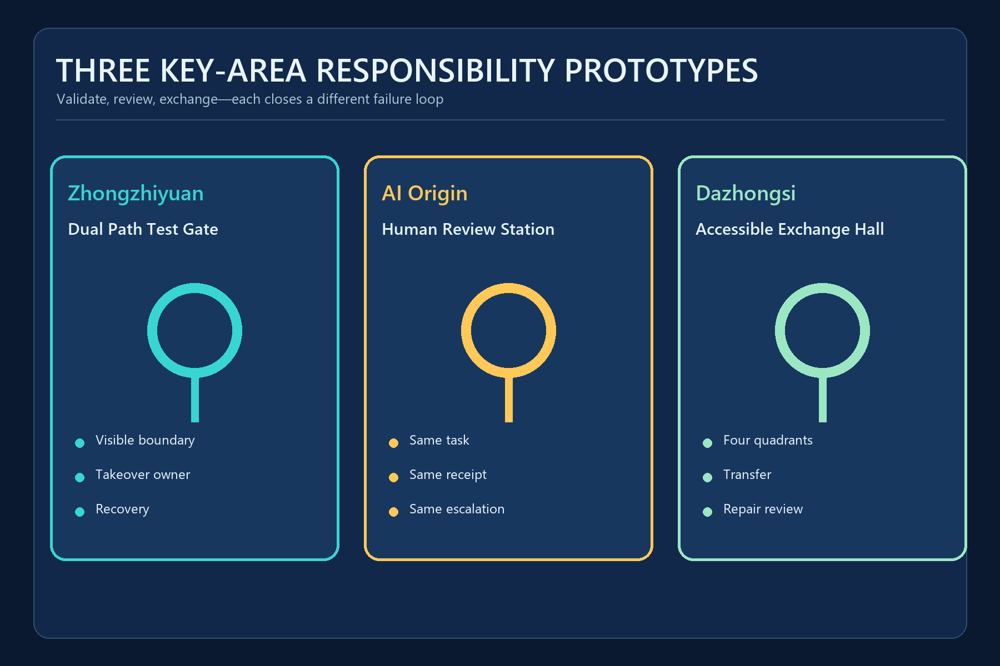
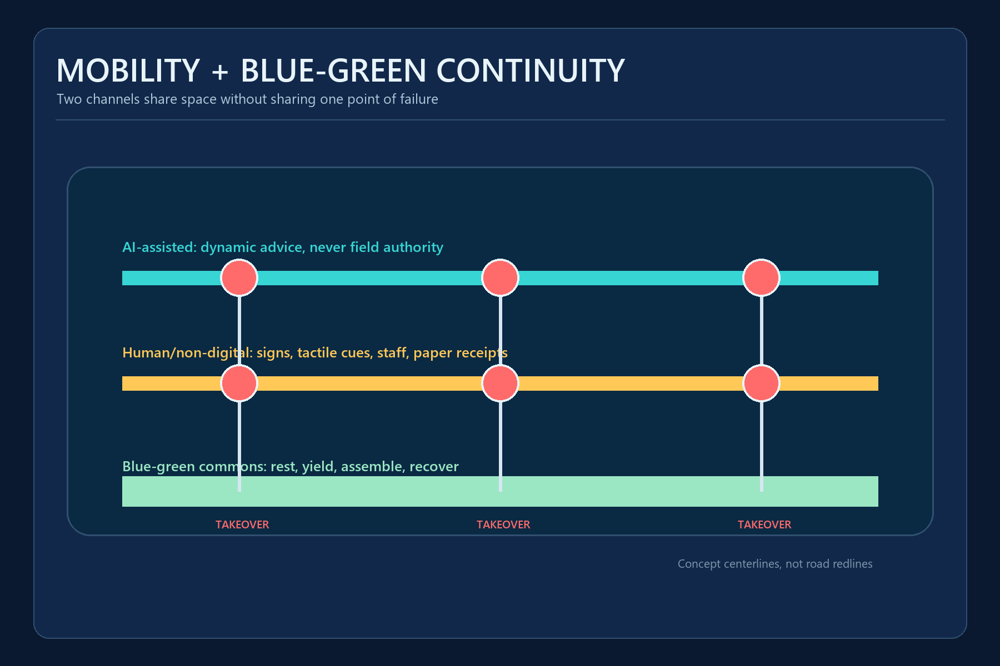
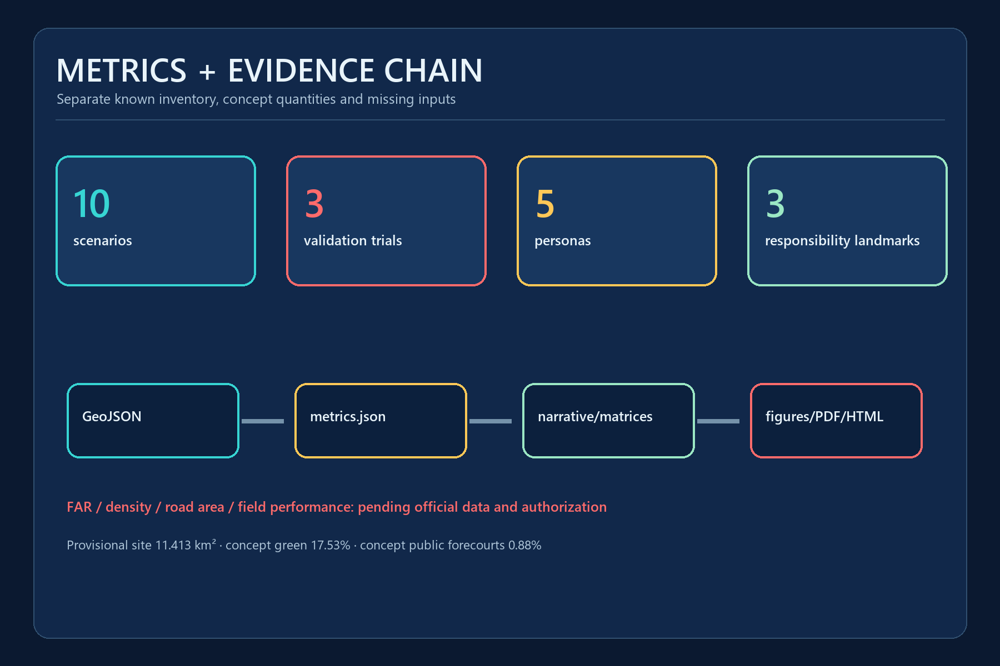

# JING-ZHANG DUAL PATH / 京张双通道

> Everyone can complete the same public service with AI on or off. Every spatial move is conceptual; provisional geometry is not an official boundary.

## Design Basis and Source List
JING-ZHANG DUAL PATH tests whether a person can complete a public service, not whether the AI appears advanced. The official announcement defines the three scope levels, three key areas and design tasks; the repository registry defines how far each source can support a claim. [source:OFFICIAL-ANNOUNCEMENT] [standard:PROJECT-OFFICIAL-ANNOUNCEMENT]

The overall and key-area polygons are provisional constraints supplied by the repository for generation, visualization and intake checks. They are not official planning boundaries and cannot support statutory land use, road, ownership, height or demolition conclusions. [source:BOUNDARY-SOURCE] [assumption:A-PROVISIONAL-BOUNDARY-002]

Article 39 of the Barrier-Free Environment Construction Law is used only for the listed medical, social-security, financial and living-payment services. The broader dual-path protocol is a voluntary design proposal, not a claim of universal statutory duty. [source:DATA-SRC-BARRIER-FREE-ENVIRONMENT-LAW] [standard:BARRIER-FREE-ENVIRONMENT-LAW] [assumption:A-HUMAN-SERVICE-SCOPE-005]

## Three-Level Scope Framework
The 43.6 km2 Coordinated Research Area frames inclusive AI industry and public-service interfaces; the provisional Overall Design Area recalculates to about 11.413 km2; the three key areas host detailed protocol prototypes. Every geometry-sensitive result must be regenerated when official polygons arrive. [source:SITE-PACKAGE] [depth:three_level_scope_framework] [metric:site_area_sqm]

Responsibility becomes more specific at each level: the research layer selects services that need equivalent channels; the overall layer organizes the continuous access spine and Two Wings; the key-area layer names entrances, takeover owners, receipts and stop conditions. [source:AGENT-TASKBOOK] [standard:PROJECT-AGENT-OPEN-CALL-TASKBOOK]

## Coordinated Research Area: Industry and Future City Research
A world-class AI ecosystem should demonstrate that new services do not exclude people who cannot scan a code, maintain a connection or proceed without human assistance. The Service Completion Parity Protocol publishes the task entrance, both channels, shared receipt, takeover owner and stop conditions. [depth:existing_conditions_diagnosis] [source:PROCESSED-FACT-PACK]

Six case-study lanes guide later research: assistive-technology co-creation, accessible transport information, low-speed autonomy sandboxes, staffed public-service fallback, multisensory heritage interpretation and shared-path robot rules. They transfer mechanisms only and do not prove local deployment or performance. [source:SOURCE-REGISTRY] [assumption:A-FIELD-BASELINE-004]

The ecosystem follows research, validation, adoption and review. Zhongzhiyuan tests devices and takeover; AI Origin tests public service and co-creation; Dazhongsi tests mobility, commerce and maintenance adoption. [standard:MOHURD-URBAN-DESIGN-MEASURES] [depth:overall_spatial_structure]

## Overall Design Area: Urban Renewal and Regulatory-Plan-Level Urban Design
The spatial structure is one heritage access spine, two equivalent service channels, Three Zones and Two Wings, and a multi-node feedback loop. The two conceptual service centerlines total about 16.71 km; this is neither an existing road nor an approved engineering alignment. [data:geometry/roads.geojson#ROAD-AI-001] [metric:dual_path_length_m]

Renewal starts with reversible, low-disturbance components: signs, tactile guidance, movable desks, temporary stops, staffed counters and public status boards. Without ownership, building surveys and formal controls, the proposal sets no demolition boundary, FAR, height or construction total. [standard:MOHURD-CONTROL-DETAILED-PLANNING] [depth:development_intensity_controls] [assumption:A-CONTROLS-001]

Four topology-complete concept zones use repository land-use codes for inclusive R&D, heritage commons, service/robotics validation and community support. [standard:MNR-LAND-USE-CLASSIFICATION-GUIDE] [depth:land_use_layout]

## Detailed Design of Key Areas
**Zhongzhiyuan** hosts the Dual Path Test Gate. A robot or shuttle enters only when its operating boundary, takeover owner, stop conditions and recovery route are visible; normal walking and human delivery remain available. [data:geometry/public_space.geojson#PUBLIC-DP-001] [depth:three_key_area_detailed_design]

**Beijing AI Origin Community** hosts the Human Review Station. Digital and staffed desks share one service catalogue, receipt identifier and escalation queue. AI may help prepare materials but cannot decide identity, eligibility, benefits, law or health. [source:DATA-SRC-BARRIER-FREE-ENVIRONMENT-LAW] [data:geometry/buildings.geojson#BLDG-DP-002]

**Dazhongsi** hosts the Accessible Exchange Hall, joining the four station quadrants, bicycle parking, service robots, commerce and repair receipts. Station exits, ownership and heritage constraints still require official data and field review. [assumption:A-ROAD-REDLINE-003] [depth:traffic_rail_slow_parking]

## AI Innovation Ecosystem, Personas, and AI+ Scenarios
The proposal treats five priority personas as co-design and acceptance partners. It records 5 personas, 10 scenario cards and 3 industrial validation scenarios. [metric:persona_count] [metric:scenario_count] [metric:industrial_validation_scenario_count]

**Five personas**

- Wheelchair user: continuous ramps, verified lift status and non-detouring assistance
- Blind or low-vision person: tactile and audio cues that staff can repeat consistently
- Deaf or hard-of-hearing person: text, visual alerts and bookable sign-language support
- Older person with low digital literacy: completion without a smartphone or QR code
- Caregiver with a child: wide paths, rest points and predictable transfer rules

**Ten scenario cards**

| ID | Scenario and area | AI-assisted channel | Human/non-digital channel | Stop condition |
|---|---|---|---|---|
| S01 | Accessible wayfinding and human accompaniment · Belt-wide | Multimodal navigation proposes low-gradient, low-transfer and quiet routes | Tactile guidance, printed route cards and staff accompaniment | Switch to staff support on a route break, location drift or user request |
| S02 | Low-speed autonomous shuttle (industrial validation) · Zhongzhiyuan | Booking, dispatch and accessible boarding support | Timetabled accessible minibus and on-site dispatcher | Stop on geofence breach, lost link, severe weather or takeover request |
| S03 | Continuous wheelchair and vision-access audit · Heritage access spine | Detects temporary barriers and drafts work orders for human confirmation | Scheduled checklist, phone reporting and physical protection | Never auto-close a case when obstacle classification is uncertain |
| S04 | Equivalent station transfer · AI Origin/Dazhongsi | Re-routes transfers using verified lift status | Staff guidance, fixed accessible detour map and help points | Downgrade to staff confirmation when status data is stale |
| S05 | Dual-counter public service (industrial validation) · Beijing AI Origin Community | Voice, text and plain-language assistance for document preparation | On-site guidance, human handling and paper receipt | Identity, eligibility and legal judgments remain with authorized staff |
| S06 | Severe-weather and emergency evacuation · Belt-wide | Aggregates public alerts and drafts evacuation assistance suggestions | Public address, lights, staff and physical assembly points | Emergency command prevails; AI cannot independently order evacuation |
| S07 | Multisensory Jing-Zhang heritage guide · Heritage access spine | Produces source-bound interpretation for language, sensory and cognitive preferences | Relief maps, braille, plain text and scheduled human tours | Unsourced historical content cannot be displayed as fact |
| S08 | Shared-path service robot trial (industrial validation) · Zhongzhiyuan | Low-speed delivery, yielding and visible intent signalling | Human delivery and manual robot recovery | Stop for blind spots, crowding, vulnerable-user discomfort or geofence breach |
| S09 | Inclusive employment and training navigation · Two Wings | Creates explainable matches from published role requirements | Advisor interview, telephone and printed course directory | No automated rejection, ranking or inference of health or disability |
| S10 | Public-space repair and review · Dazhongsi | Classifies multi-channel reports and flags recurring failures | Phone, paper log, service desk and public ticket number | A case cannot auto-close before field verification |

The three AI pilgrimage landmarks are public responsibility interfaces, not spectacle devices:
- Dual Path Test Gate (Zhongzhiyuan): publishes trial boundary, takeover owner and stop conditions
- Human Review Station (AI Origin): digital and staffed desks share one public receipt identifier
- Accessible Exchange Hall (Dazhongsi): joins mobility, public service, commerce and repair across four quadrants

All three remain conceptual until official boundaries, site conditions and operating responsibility are confirmed. [metric:landmark_count] [assumption:A-FIELD-BASELINE-004]

## Land Use, Building Scale, and Retain-Renovate-Demolish Strategy
Four shared-edge land-use polygons cover the provisional site without gaps. They express functional relationships and do not replace existing or statutory land-use records. [data:geometry/land_use.geojson#LU-001] [standard:MNR-LAND-USE-CLASSIFICATION-GUIDE]

Three service-building footprints compare entrances, waiting, staffed desks and equipment recovery. Their areas are reproducible concept quantities, not an existing-building survey or development commitment. [data:geometry/buildings.geojson#BLDG-DP-001] [metric:building_footprint_area_sqm]

Retain-renovate-demolish decisions follow verification of ownership, structure, fire, daylight, accessibility, heritage and use. Height, massing, character and FAR remain pending official data. [depth:retain_renovate_demolish] [depth:height_massing_character] [standard:MOHURD-ARCH-DESIGN-DEPTH-2016]

## Transport, Rail, Municipal Infrastructure, and Public Services
Two parallel service lines and three key-area cross-connections organize mobility. AI navigation is advisory; fixed signs, tactile information, staff help and offline detour maps remain available. Missing exits, lifts, redlines and verified accessibility networks prevent claims about current performance. [data:geometry/roads.geojson#ROAD-HUMAN-001] [assumption:A-ROAD-REDLINE-003]

New infrastructure follows minimum data, edge processing and explicit shutdown. Face recognition is not the default entrance. During a network failure, services return to physical signs, staff and paper receipts; authorized people issue life-safety commands. [depth:municipal_new_infrastructure] [assumption:A-FIELD-BASELINE-004]

Staffed fallback under Article 39 is cited only for its listed services. The older-adult policy is background for parallel traditional and smart channels, not evidence of local implementation. [standard:ELDERLY-SMART-TECH-PLAN-2020-45] [source:DATA-SRC-ELDERLY-SMART-TECH-PLAN-2020-45]

## Blue-Green Network, Public Space, and Urban Character
The concept green spine is derived from the two design centerlines and temporarily recalculates to 17.53% of the provisional site; three public-service forecourts account for about 0.88%. These are design quantities, not current green-space or approved control indicators. [metric:green_ratio] [metric:public_space_ratio] [data:geometry/green_space.geojson#GREEN-DP-001]

The visual language makes responsibility visible: cyan for AI assistance, gold for the human/non-digital channel and coral only for stop and risk. Tactile, audio and text encodings provide redundancy, so color is never the sole carrier. [depth:blue_green_public_space] [standard:MOHURD-URBAN-DESIGN-MEASURES]

Railway culture becomes two tracks arriving together: technical progress and human dignity. Zhongguancun culture contributes open verification; AI culture contributes uncertainty disclosure, exit and a durable receipt. [source:AGENT-TASKBOOK]

## Renewal Projects, Implementation Policy, and Phasing
The near-term package contains tabletop exercises, field baselines, accessibility co-design and stop-condition drills for all three responsibility nodes. Equipment cannot enter public space before an operator, takeover owner, insurance, complaint and recovery path are named. [data:geometry/phasing.geojson#PHASE-DP-001] [depth:renewal_project_list]

The mid-term phase connects verified signs, tactile guidance, rest points and staff help, then tests low-speed shuttles and service robots in small reversible pilots. Belt-wide extension waits for official polygons, roads, ownership, controls and utilities. [depth:phasing_implementation] [assumption:A-PROVISIONAL-BOUNDARY-002]

The operating calendar combines one public audit, four seasonal scenario weeks, monthly access walks and continuing developer maintenance sessions. Participation volume is not treated as evidence of service effectiveness. [source:AGENT-TASKBOOK] [standard:PROJECT-AGENT-OPEN-CALL-TASKBOOK]

## Metrics, Area Recalculation, and Compliance Matrix
The structured layer records 16 metrics. Provisional areas, concept quantities and inventory counts are reproducible; FAR, building density, road area and field performance remain unknown. The three provisional key areas total about 369.3 ha. [metric:key_area_count] [metric:key_areas_total_area_sqm]

Every known value has source files and a formula; every unknown gives the missing input and trigger. GeoJSON is the spatial authority layer; figures, PDFs and HTML explain but cannot create boundaries or metrics. [depth:metrics_recalculation] [source:SOURCE-REGISTRY]

The compliance matrix covers announcement clauses 1.3-1.5 and agent.1-agent.6. A machine PASS means review-ready packaging, not approval, selection or constructability. [standard:MOHURD-CONTROL-DETAILED-PLANNING]

## Risk, Copyright, and Compliance
The primary communication risk is mistaking provisional polygons, concept buildings or design targets for current or official planning facts. Every visual de-emphasizes provisional boundaries and repeats the non-official, non-precise and recalculation status. [depth:risk_missing_data] [assumption:A-PROVISIONAL-BOUNDARY-002]

The operational risk is harming vulnerable users or shifting exit costs to the public. Any pilot requires authorization, field verification, real-user co-design, privacy and safety review, immediate human takeover and physical restoration. [assumption:A-FIELD-BASELINE-004]

OpenAI Codex generated the narrative, derived diagrams, GeoJSON design layers, HTML and PDFs from public or cleared repository inputs. Peer text, images and geometry were not reused. Font software is referenced or embedded for PDF output and is not redistributed as a standalone asset. [source:SITE-PACKAGE]

## References
- Beijing Municipal Commission of Planning and Natural Resources, Haidian Branch: official announcement for tasks, textual scopes and approximate areas, not precise polygons. [source:OFFICIAL-ANNOUNCEMENT]
- Repository site package, source registry and provisional geometry for package contracts, temporary generation and limitations. [source:SITE-PACKAGE] [source:BOUNDARY-SOURCE]
- Barrier-Free Environment Construction Law, Article 39, cited only within the listed service contexts. [source:DATA-SRC-BARRIER-FREE-ENVIRONMENT-LAW]
- State Council General Office document No. 45 (2020), used only as background for parallel traditional and smart channels. [source:DATA-SRC-ELDERLY-SMART-TECH-PLAN-2020-45]
