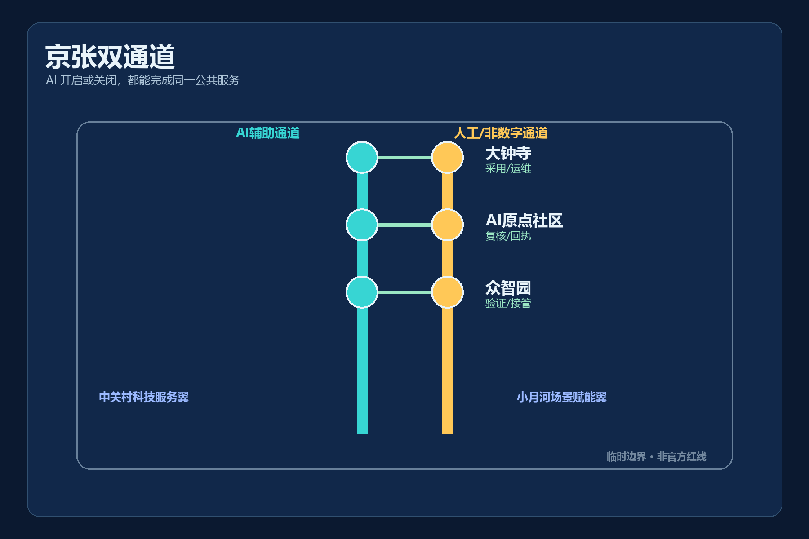
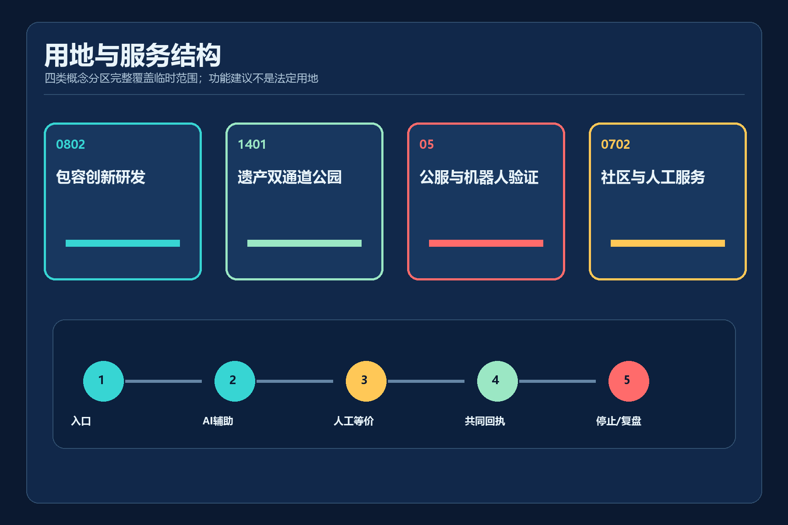
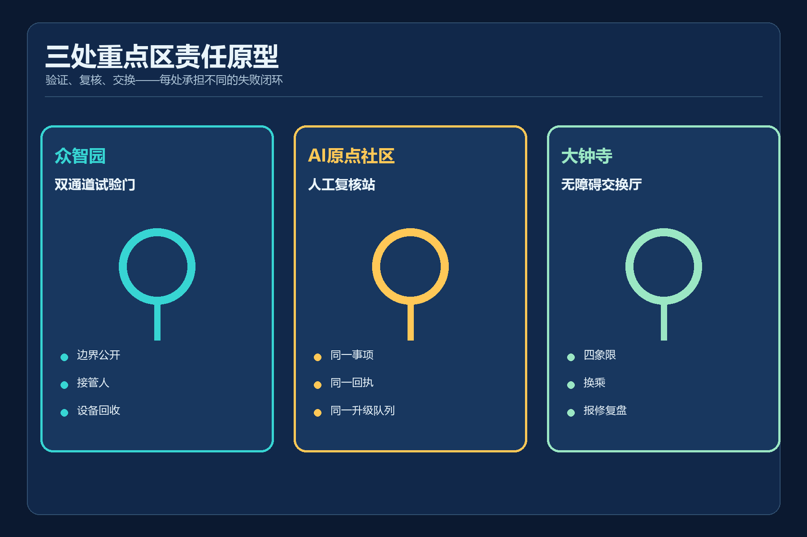
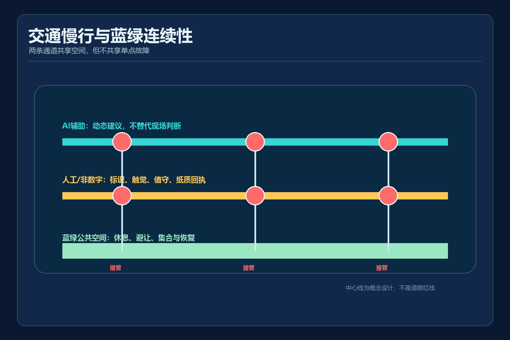
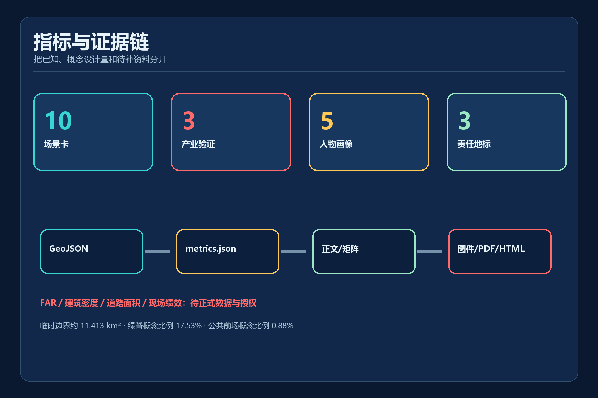

# 京张双通道 / JING-ZHANG DUAL PATH

> AI 开启或关闭时，人人都能完成同一公共服务。所有空间落地均为概念建议，临时边界不是官方红线。

## 设计依据与资料清单
“京张双通道”把公共服务是否可完成，而不是 AI 是否先进，作为设计的第一项验收。官方公告确定三层范围、三处重点区和设计任务；仓库来源登记表决定每项资料可支撑到何种结论。[source:OFFICIAL-ANNOUNCEMENT] [standard:PROJECT-OFFICIAL-ANNOUNCEMENT]

当前总体边界和三处重点区均为仓库提供的临时约束范围，只用于生成、展示和 intake 自检。它们不是官方红线，也不能支撑法定用地、道路红线、权属、建筑高度或拆改留结论。[source:BOUNDARY-SOURCE] [assumption:A-PROVISIONAL-BOUNDARY-002]

《无障碍环境建设法》第39条仅在医疗、社会保障、金融、生活缴费等列举事项的公共服务场所要求保留现场指导和人工办理，本方案严格保留这一适用边界。对其他场景，“双通道”是主动提出的设计协议，不冒充普遍法律义务。[source:DATA-SRC-BARRIER-FREE-ENVIRONMENT-LAW] [standard:BARRIER-FREE-ENVIRONMENT-LAW] [assumption:A-HUMAN-SERVICE-SCOPE-005]

## 三层范围工作框架
统筹研究范围约43.6平方公里，用于研究包容性 AI 产业、辅助技术、低速自主移动和公共服务接口的协同；总体设计范围采用临时几何复算约 11.413 平方公里；三个重点区承担协议原型和详细设计。面积只是临时 intake 读数，官方 polygon 到位后整包重算。[source:SITE-PACKAGE] [depth:three_level_scope_framework] [metric:site_area_sqm]

三层之间不是“大图缩小”，而是责任逐级落位：研究层回答何种服务值得双通道；总体层组织连续可达脊、两翼和公共服务网络；重点区层明确入口、接管人、回执和停止条件。每层都保持概念建议属性。[source:AGENT-TASKBOOK] [standard:PROJECT-AGENT-OPEN-CALL-TASKBOOK]

## 统筹研究范围产业与未来城市研究
世界级 AI 生态不应只以企业数量衡量，还应能证明新服务没有把无法扫码、无法稳定联网或需要人工协助的人排除在外。方案提出“服务同等完成协议”：每个 AI+ 服务必须公开任务入口、AI 通道、人工/非数字通道、共同回执、接管责任和停止条件。[depth:existing_conditions_diagnosis] [source:PROCESSED-FACT-PACK]

六类可迁移案例方向为：辅助技术共创、无障碍交通信息、低速自主移动沙盒、公共服务人工兜底、多感官文化解释和服务机器人共路规则。案例仅用于提取机制，不据此声称海淀已有部署或绩效。[source:SOURCE-REGISTRY] [assumption:A-FIELD-BASELINE-004]

产业链按“研发-验证-采用-复盘”组织：众智园验证设备和接管；AI原点社区验证公共服务与共创；大钟寺验证交通、商业和运维采用；两翼分别提供技术/资本服务与真实场景反馈。任何场地试验都必须先取得授权、完成基线、用户共创和专业审查。[standard:MOHURD-URBAN-DESIGN-MEASURES] [depth:overall_spatial_structure]

## 总体设计范围城市更新与控规深度城市设计
总体结构为“一条遗产可达脊、两套等价服务通道、三区两翼、多节点反馈环”。AI 辅助线和人工/非数字线在三个重点区通过横向连接共享入口与回执，概念线总长约 16.71 公里；该长度来自设计中心线，不是现状道路或获批工程线位。[data:geometry/roads.geojson#ROAD-AI-001] [metric:dual_path_length_m]

更新策略优先使用可逆、低扰动构件：信息牌、触觉导向、可移动服务台、临时停靠点、人工值守台和公开状态板。没有权属、建筑普查和正式控规时，不画确定拆除范围，不设定 FAR、高度或建设总量。[standard:MOHURD-CONTROL-DETAILED-PLANNING] [depth:development_intensity_controls] [assumption:A-CONTROLS-001]

用地采用仓库枚举代码形成完整拓扑分区，分别承载包容创新研发、遗产公园、公共服务/机器人验证和社区配套。分区表达功能关系而非现状调查或法定调整。[standard:MNR-LAND-USE-CLASSIFICATION-GUIDE] [depth:land_use_layout]

## 重点区域详细设计
**众智园 AI 自主创新加速区**设置“双通道试验门”：机器人和接驳设备只有在显示运行边界、人工接管人、当日停止条件和回收路径后才进入测试。前场同时保留普通步行与人工配送，不要求公众参与试验。[data:geometry/public_space.geojson#PUBLIC-DP-001] [depth:three_key_area_detailed_design]

**北京 AI 原点社区**设置“人工复核站”：数字台和人工台使用同一事项目录、同一公开回执编号和同一升级队列。AI 可辅助材料准备，不作身份、资格、福利、法律或医疗决定。[source:DATA-SRC-BARRIER-FREE-ENVIRONMENT-LAW] [data:geometry/buildings.geojson#BLDG-DP-002]

**大钟寺 AI 产业聚集区**设置“无障碍交换厅”：把站区四象限、非机动车停放、服务机器人、商业服务和报修回执放在同一公共界面中。具体站口、产权和文保关系仍待官方资料与现场核验。[assumption:A-ROAD-REDLINE-003] [depth:traffic_rail_slow_parking]

## AI 创新生态、人才画像与 AI+ 场景
双通道面向五类首要使用者，并把他们作为共创和验收主体，而不是被动标签。当前记录 5 类人物画像、10 张场景卡和 3 个产业测试验证场景。[metric:persona_count] [metric:scenario_count] [metric:industrial_validation_scenario_count]

**五类人物画像**

- 轮椅使用者：需要连续坡道、电梯状态和不绕远的人工协助
- 视障人士：需要触觉、声音和可被工作人员复述的同一信息
- 听障人士：需要文字、视觉告警和手语服务预约
- 低数字素养老年人：需要无需手机、无需扫码、可现金或人工完成
- 携童照护者：需要宽通道、休息点和可预测的接驳规则

**十张场景卡**

| ID | 场景与区域 | AI 通道 | 人工/非数字通道 | 停止条件 |
|---|---|---|---|---|
| S01 | 无障碍寻路与人工陪行 · 全线 | 多模态导航给出低坡度、少换乘和安静路径 | 触觉导向、纸质路径卡和服务员陪行 | 路径中断、定位漂移或用户要求即切换人工 |
| S02 | 低速自主接驳（产业验证） · 众智园 | 预约、调度和无障碍上下客辅助 | 固定班次无障碍小巴与现场调度员 | 越界、失联、恶劣天气或人工接管请求立即停运 |
| S03 | 轮椅与视障连续通行巡检 · 遗产可达脊 | 识别临时障碍并生成待人工确认的工单 | 固定巡检表、电话报障和现场围护 | 不确定障碍类别时禁止自动闭单 |
| S04 | 轨道站区等价换乘 · 原点社区/大钟寺 | 按电梯状态动态重排换乘路径 | 站员引导、固定无障碍绕行图和求助点 | 状态源过期即降级为人工确认 |
| S05 | 公共服务双柜台（产业验证） · AI原点社区 | 语音、文字和简明语言辅助材料准备 | 现场指导、人工办理和纸质回执 | 身份、资格或法律判断一律交由授权人员 |
| S06 | 极端天气与应急撤离 · 全线 | 汇总公开预警并生成辅助疏散建议 | 广播、灯光、工作人员和实体集合点 | 应急指挥口令优先，AI不得自主发布疏散命令 |
| S07 | 京张遗产多感官导览 · 遗产可达脊 | 按语言、感官和认知偏好生成可核验讲解 | 浮雕图、盲文、简明文本和定时人工讲解 | 缺少来源的历史内容不得展示为事实 |
| S08 | 服务机器人共路测试（产业验证） · 众智园 | 低速配送、避让和可见意图提示 | 人工配送与机器人推行回收 | 盲区、拥挤、弱势使用者不安或越界即停止 |
| S09 | 包容就业与培训导航 · 两翼 | 基于公开岗位要求生成可解释匹配建议 | 职业顾问面谈、电话和线下课程目录 | 不得自动拒绝、排名或推断健康与残障状态 |
| S10 | 公共空间报修与复盘 · 大钟寺 | 归类多渠道报修并提示重复问题 | 电话、纸质登记、现场服务台和公开编号 | 未完成现场核验不得自动结案 |

三处概念性 AI 朝圣地标不是炫技装置，而是公开责任的空间界面：
- 双通道试验门（众智园）：显示试验边界、人工接管人和当日停止条件
- 人工复核站（AI原点社区）：同一事项的数字台与人工台共享公开回执编号
- 无障碍交换厅（大钟寺）：交通、服务、商业与报修在四象限汇合

地标总数为三处，均需在正式边界、现场条件和运营责任确认后深化。[metric:landmark_count] [assumption:A-FIELD-BASELINE-004]

## 用地、建筑规模与拆改留方案
土地利用以四个共享边界分区覆盖临时总体范围，不留未分类缝隙。公共服务与研发分区面向功能兼容性讨论，不能替代现行法定用地性质。[data:geometry/land_use.geojson#LU-001] [standard:MNR-LAND-USE-CLASSIFICATION-GUIDE]

三个服务建筑基底只是用于比较入口、等候、人工台和设备回收关系的概念原型；其面积可从 GeoJSON 复算，但不是现状建筑普查或建设规模承诺。[data:geometry/buildings.geojson#BLDG-DP-001] [metric:building_footprint_area_sqm]

拆改留采用“先核验、后分类”：确认权属、结构、消防、日照、无障碍、文保和使用状态前，只提出保留优先、可逆加装、低扰动更新原则。建筑高度、体量、风貌与 FAR 均保持待正式资料补齐。[depth:retain_renovate_demolish] [depth:height_massing_character] [standard:MOHURD-ARCH-DESIGN-DEPTH-2016]

## 交通、轨道、市政与公共服务设施
交通系统以两条并行服务线和三条重点区横向连接组织；AI 导航只能提供建议，固定标识、触觉信息、人工求助和可离线读取的绕行图必须同时存在。站口、电梯、道路和真实无障碍网络缺失，因此不输出现状达标率。[data:geometry/roads.geojson#ROAD-HUMAN-001] [assumption:A-ROAD-REDLINE-003]

市政与新基建采用“最小数据、边缘处理、明确关停”：感知设备不以人脸识别作为默认入口；公共网络中断时服务回到实体标识、人工值守和纸质回执；涉及生命安全的指令由授权人员发布。[depth:municipal_new_infrastructure] [assumption:A-FIELD-BASELINE-004]

公共服务双柜台仅在法律明确列举事项中引用现场指导和人工办理要求；其他场景以自愿设计承诺表达。老年人传统服务与智能服务并行的政策文本只作全国背景，不推定海淀已经落实。[standard:ELDERLY-SMART-TECH-PLAN-2020-45] [source:DATA-SRC-ELDERLY-SMART-TECH-PLAN-2020-45]

## 蓝绿空间、公共空间与城市风貌
双通道绿脊由设计中心线形成概念支持带，临时复算面积比例约 17.53%；三个公共服务前场约占临时总体面积 0.88%。这些是概念设计量，不是现状绿地率或已批控规指标。[metric:green_ratio] [metric:public_space_ratio] [data:geometry/green_space.geojson#GREEN-DP-001]

公共空间采用“看得见的责任”风貌：青色表示 AI 辅助，金色表示人工/非数字通道，珊瑚色只用于停止与风险；触觉、声音和文字编码互为冗余，不让颜色成为唯一信息载体。[depth:blue_green_public_space] [standard:MOHURD-URBAN-DESIGN-MEASURES]

京张铁路文化被转译为双轨同时到站：技术进步与人的尊严必须同步抵达。中关村创新文化对应公开验证和可复现；AI 新文化对应承认不确定、允许退出和留下回执。[source:AGENT-TASKBOOK]

## 更新项目清单、实施政策与分期计划
近期项目包包括三处责任节点的桌面推演、现场基线、无障碍共创和停止条件演练；任何设备进入公共空间前必须明确运营人、接管人、保险、投诉和恢复路径。[data:geometry/phasing.geojson#PHASE-DP-001] [depth:renewal_project_list]

中期在核验后的路段连续化实体标识、触觉导向、休息点和人工求助网络，并以小规模、可撤回试验验证低速接驳与服务机器人。远期只有在 official polygon、道路、权属、控规和市政资料齐备后才扩展到总体范围。[depth:phasing_implementation] [assumption:A-PROVISIONAL-BOUNDARY-002]

年度运营采用“一次公开审计、四季场景周、每月无障碍走查、持续开发者维护会”。每次活动发布问题清单和关闭理由，不把参与人数、试验次数或讨论热度等同于服务有效性。[source:AGENT-TASKBOOK] [standard:PROJECT-AGENT-OPEN-CALL-TASKBOOK]

## 指标体系、面积复算与合规矩阵
结构化层记录 16 项指标，其中临时面积、概念设计量和清单计数可复算；FAR、建筑密度、道路面积和现场性能保持 unknown。临时重点区总面积约 369.3 公顷，数量为三处。[metric:key_area_count] [metric:key_areas_total_area_sqm]

每个 known 值都指向源文件和公式；每个 unknown 值都说明缺失资料和重算触发条件。GeoJSON 是空间权威层，图件、PDF 和 HTML 只负责解释，不反向创造边界或指标。[depth:metrics_recalculation] [source:SOURCE-REGISTRY]

合规矩阵覆盖公告 1.3、1.4、1.5 和 agent.1-agent.6；标准矩阵和设计深度矩阵分别定位专业依据与 formal 深度。机器 PASS 只表示包可进入评审，不表示方案获批、入选或可施工。[standard:MOHURD-CONTROL-DETAILED-PLANNING]

## 风险、版权与合规说明
首要风险是读者把 provisional polygon、概念建筑或设计目标误读为现状和正式规划。所有图面用低对比虚线表示临时边界，正文和 HTML 重复声明非官方、非精确、需重算。[depth:risk_missing_data] [assumption:A-PROVISIONAL-BOUNDARY-002]

第二类风险是技术试验伤害弱势使用者或把退出成本转嫁给公众。任何试验必须经过授权、现场核验、真实使用者共创、隐私与安全评估，并配置可立即执行的人工接管和物理恢复方案。[assumption:A-FIELD-BASELINE-004]

全部正文、图表、GeoJSON 派生设计、HTML 和 PDF 由 OpenAI Codex 基于仓库公开/清权资料生成；字体只在 PDF 中嵌入或引用系统字体，不随包再分发。未使用同业文本、图像或几何。许可与来源详见版权声明。[source:SITE-PACKAGE]

## 参考资料
- 北京市规划和自然资源委员会海淀分局：资格预审公告，用于任务、文字范围和约面积，不用于精确 polygon。[source:OFFICIAL-ANNOUNCEMENT]
- 仓库 site package、来源登记与 provisional geometry，用于提交契约、临时生成和限制披露。[source:SITE-PACKAGE] [source:BOUNDARY-SOURCE]
- 《中华人民共和国无障碍环境建设法》第39条，仅按正文列举服务事项引用。[source:DATA-SRC-BARRIER-FREE-ENVIRONMENT-LAW]
- 国办发〔2020〕45号，仅作传统与智能服务并行的背景参照。[source:DATA-SRC-ELDERLY-SMART-TECH-PLAN-2020-45]
