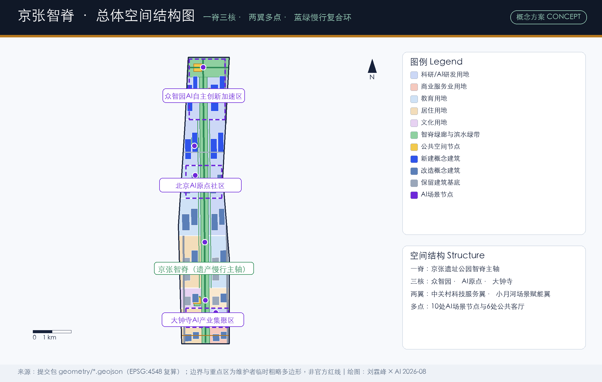
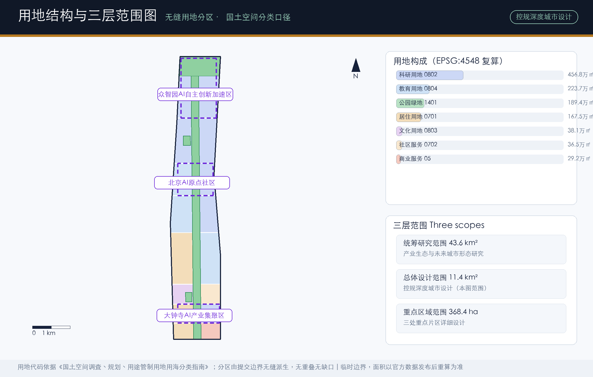
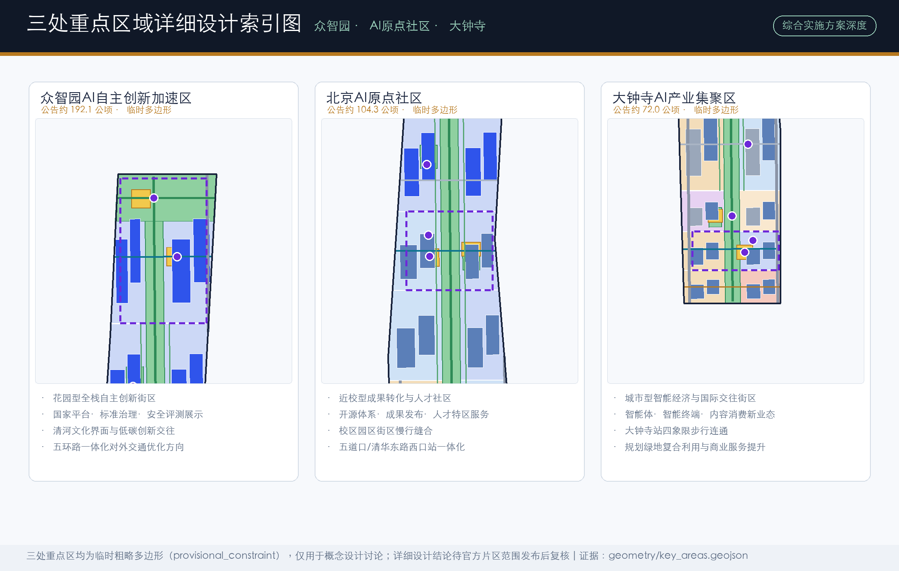
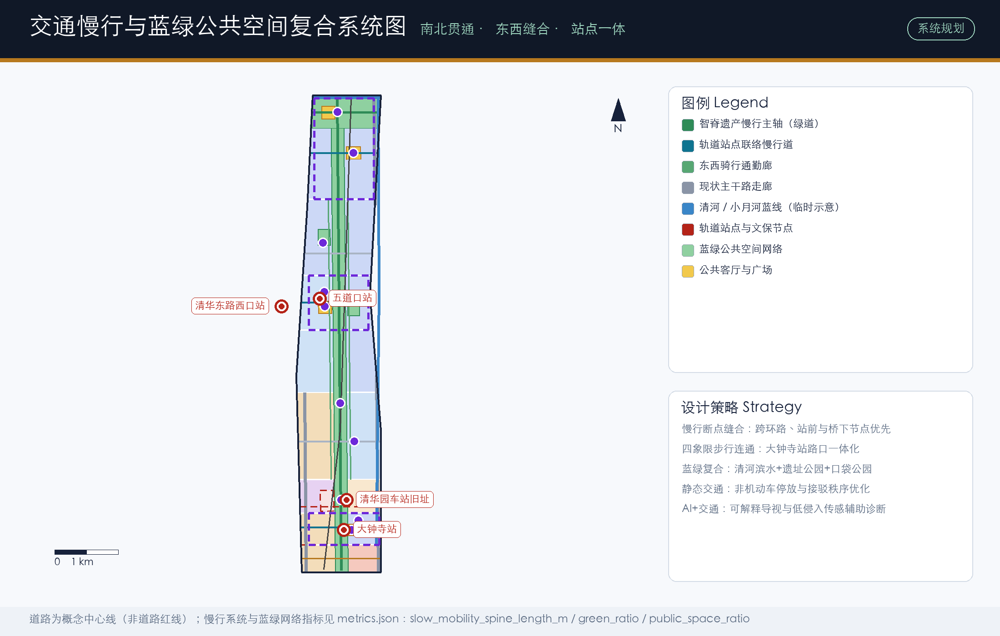
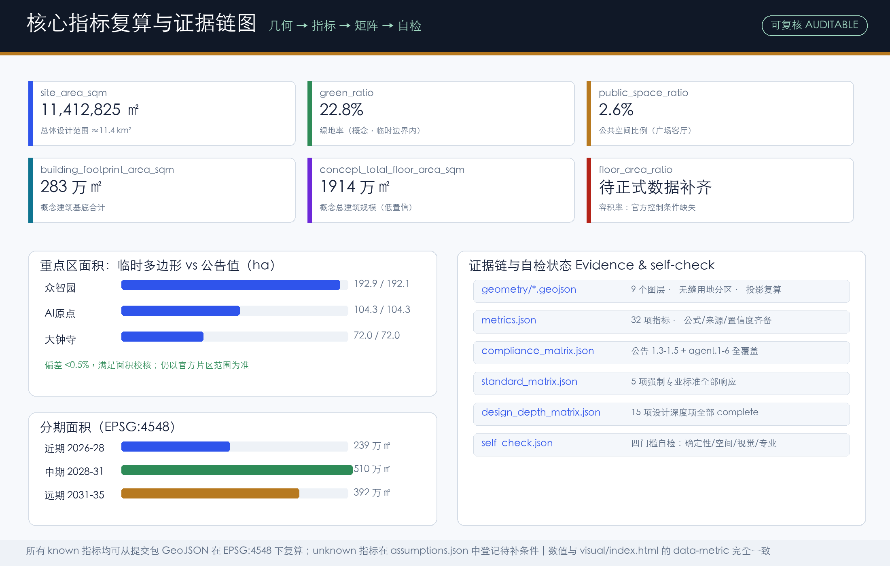

# Jing-Zhang AI Spine: Urban Design Proposal for the Centennial Jing-Zhang AI Innovation Belt

## Design Basis and Source List

This proposal takes the official pre-qualification announcement issued by the Haidian Branch of the Beijing Municipal Commission of Planning and Natural Resources as its primary basis, layered with the Agent-facing open-call taskbook, forming a three-tier basis structure: the announcement defines tasks, the taskbook defines methods, and the site package defines data [source:OFFICIAL-ANNOUNCEMENT] [source:AGENT-TASKBOOK]. The announcement specifies the three scope levels, the three key areas, and the required deliverable depths; the taskbook specifies the three positionings, five functions, three areas with two wings, and six Agent tasks, and requires all spatial proposals to be phrased as concept recommendations.

From a public affairs perspective, the organizer structure (Beijing DRC, the municipal planning commission, and the Haidian District Government as sponsors, with the Zhongguancun Science City Administrative Committee as executor) requires the proposal to answer three governance levels at once: the municipal "global AI industry highland" strategy, the district-level "1+X+1" modern industry system, and the park-level "three areas and two wings" spatial organization [source:OFFICIAL-ANNOUNCEMENT] [source:HAIDIAN-1X1]. Every chapter therefore separates strategic alignment judgments, spatial design moves, and governance conditions pending confirmation, so that concept design is never misread as an administrative conclusion.

Source usage strictly follows the grading in the public source registry: the announcement and taskbook serve as formal task bases; the three MOHURD/MNR standard snapshots serve as professional standard bases; provisional boundaries and key-area polygons serve only as concept generation and display constraints; the elderly smart-technology policy serves as background only [source:SOURCE-REGISTRY]. Complete sources, licenses, and limitations are recorded in `sources.json`; generation methods and data gaps are registered item by item in `assumptions.json` [source:SITE-PACKAGE].

A dedicated statement: as of completion, the qualification package remains password-protected and no official redline polygon with a verifiable coordinate system has been published through public channels. All spatial layers of this proposal are generated from the maintainer-registered provisional rough boundary, with areas recalculated under EPSG:4548 for concept discussion only [data:geometry/site_boundary.geojson#SITE-001] [metric:site_area_sqm]. Once official data is released, land use, buildings, roads, green space, public space, phasing, and all area metrics must be recalculated as a whole.

## Three-Level Scope Framework

Work depth follows the three official scopes: the coordinated research area (~43.6 km2) answers how Haidian's AI industry ecosystem and future urban form should be organized; the overall design area (~11.4 km2) answers how urban renewal around the Jing-Zhang Heritage Park reaches regulatory-plan urban design depth; the key detailed design areas (~368.4 ha) answer how Zhongzhiyuan, the AI Origin Community, and Dazhongsi reach comprehensive-implementation depth [source:OFFICIAL-ANNOUNCEMENT] [depth:three_level_scope_framework].

The three levels are not parallel but transitive: the functional structure set by the research level (one spine, three cores, two wings) is translated into land-use zoning and renewal projects at the overall design level, and into concrete building, transport, and public-space moves at the key-area level. The submitted boundary corresponds to the overall design area, with a provisional area of about 11.413 million sqm, consistent with the announced ~11.4 km2 [metric:site_area_sqm] [data:geometry/site_boundary.geojson#SITE-001]. The three key areas are expressed as an independent layer with a combined provisional area of about 3.693 million sqm, deviating less than 0.5% from the announced 368.4 ha, yet remaining provisional polygons [data:geometry/key_areas.geojson#PROV-KEY-001] [metric:key_area_total_sqm].

Using a provisional boundary implies two methodological commitments. First, all area and ratio metrics express structural relationships and design intent only, never statutory bases. Second, the proposal separates judgments that depend on boundary precision from those that do not: spatial structure, scenario systems, cultural narrative, and operating mechanisms belong to the latter; development intensity, demolition-retention conclusions, and engineering feasibility belong to the former and are uniformly downgraded to pending items [depth:development_intensity_controls].

## Coordinated Research Area: Industry and Future City Research

**Overall concept and naming system (agent.1).** The proposal is named "Jing-Zhang AI Spine" (JZ-Spine). "Spine" carries three meanings: the historical backbone of the Jing-Zhang Railway, the first trunk railway independently built by China; the physical spatial backbone along the heritage park; and the industrial backbone carrying full-stack AI self-reliant innovation. The naming system extends downward into "one spine, three cores": Zhiyuan Core (Zhongzhiyuan AI Acceleration Area), AI Origin (Beijing AI Origin Community), and Zhihui Core (Dazhongsi AI Industry Cluster); facility-level names include "Spine Living Rooms" (public spaces), "Spine Stations" (service facilities), and "Spine Scenario Cards" (operating units) [source:AGENT-TASKBOOK].

The logo direction fuses a rail cross-section with neural synapses: twin rail lines gradient northward into a network of nodes and links, using rail slate grey, AI indigo, and Jing-Zhang bronze as the primary palette, with a badge variant for international communication. Fonts should be open-source commercially usable CJK plus a sans-serif Latin face; all visual elements must be original or rights-cleared, with no corporate trademarks or portraits. This direction is a concept recommendation for professional teams to deepen [standard:PROJECT-AGENT-OPEN-CALL-TASKBOOK].

**Spatial translation of the three positionings and five functions.** "Centennial Jing-Zhang Cultural Belt" lands on the spine's cultural narrative and station-memory nodes; "Urban AI Life Experience Belt" lands on twelve scenario cards and public experience routes; "AI Integrated Innovation Belt" lands on the three cores' industrial functions and the two-wing synergy loop [source:AGENT-TASKBOOK]. The five functions form a closed loop of "origin - translation - clustering - service - governance": the full-stack AI self-reliant system anchors Zhongzhiyuan; the world-class AI innovation ecosystem anchors the Origin Community; AI+ scenario empowerment runs along the Xiaoyuehe wing and the spine; the intelligent AI vibrant city rests on slow mobility and public space; and global AI-governance discourse rests on standards governance and open-source community events [depth:overall_spatial_structure].

**Global case studies (agent.2).** Seven comparable innovation ecosystems were studied to extract transferable spatial and operating mechanisms rather than copied forms:

| Case | Key lesson | Transfer into this proposal |
| --- | --- | --- |
| Kendall Square, Boston | Dense mixing of university research, corporate HQs, and public space | Campus-park-block slow-mobility stitching and the tech-transfer street in the Origin Community |
| King's Cross Knowledge Quarter, London | Railway heritage renewed into a knowledge-economy engine | Qinghuayuan Station Memory Plaza and the heritage activation path |
| one-north, Singapore | Government-led functional mixing and test-sandbox legislation | Application-based opening mechanism for industrial test scenarios |
| Marunouchi-Otemachi, Tokyo | Public-private contiguous renewal around a hub | Multi-stakeholder coordination for four-quadrant connectivity at Dazhongsi |
| Werksviertel, Munich | Incremental cultural translation of industrial relics | Graded retain-renovate-rebuild renewal strategy |
| Cornell Tech, Roosevelt Island | Open courses, incubation, and island branding | Open-source release hall and developer community operations |
| Mountain View-Palo Alto corridor | Chain distribution of innovation factors along a transport corridor | Anchor layout along the Spine with three cores |

The shared conclusion: competition among innovation districts in the AI era has shifted from space supply to ecosystem operation plus institutional supply, so this proposal places event systems, scenario-opening mechanisms, and governance dialogue on equal footing with physical space [standard:MOHURD-URBAN-DESIGN-MEASURES].

**Future urban form judgment.** AI's impact on the city materializes as three spatial responses: first, the composite layout of "compute-data-scenario" new infrastructure with conventional municipal systems (edge-compute stations, data-element showroom); second, highly mixed land use integrating work, life, learning, and socializing (R&D land accounts for about 40% within the provisional boundary) [metric:land_use_area_0802_sqm]; third, a perceptible, interactive slow-mobility and public-space system (the Spine's main axis measures about 9.64 km provisionally) [metric:slow_mobility_spine_length_m]. These ratios are concept structures within the provisional boundary and will be recalculated against official boundaries.

## Overall Design Area: Urban Renewal and Regulatory-Plan-Level Urban Design

The overall design area takes urban renewal as the main lever and organizes five layers at regulatory-plan urban design depth: structure, land use, capacity, facilities, and character [standard:MOHURD-CONTROL-DETAILED-PLANNING] [depth:land_use_layout].

**Spatial structure.** "One Spine, Three Cores, Two Wings, Multiple Nodes": the Spine green corridor (the continuous heritage-park segment) is the north-south public main axis linking the three cores; the east and west wings connect directionally to the Zhongguancun technology service wing and the Xiaoyuehe scenario empowerment wing; the nodes are ten AI scenario nodes and six civic living rooms [data:geometry/green_space.geojson#GREEN-001] [data:geometry/public_space.geojson#PUBLIC-001].

**Land-use structure.** The zoning partition is derived seamlessly from the submitted boundary with no overlaps and no gaps, using national land-use classification codes: R&D land ~4.568 million sqm (~40%), education ~2.237 million sqm, park green ~1.894 million sqm, residential ~1.675 million sqm, and culture, community service, and commercial services ~1.049 million sqm combined [data:geometry/land_use.geojson#LU-001] [metric:land_use_area_1401_sqm]. The high share of R&D and education land answers the spatial demand of full-stack AI self-reliant innovation; retaining residential and community-service land reflects the public-affairs stance of low-disturbance, organic renewal - renewal is not premised on mass relocation.

**Capacity and intensity.** Concept building footprints total about 2.825 million sqm with a concept building density of about 24.8%; the concept gross floor area extrapolated from floor assumptions is about 19.14 million sqm, for magnitude discussion only [metric:building_footprint_area_sqm] [metric:concept_total_floor_area_sqm]. Statutory controls on FAR, building height, density, green ratio, and setbacks are not public; this proposal registers them uniformly as pending official data and never substitutes concept values for approved indicators [metric:floor_area_ratio] [depth:development_intensity_controls].

**Renewal framework.** Renewal objects are classified into retain, renovate, and new-build categories on the concept building-footprint layer: roughly 40% retained (sound existing stock and heritage-related buildings), 40% renovated (functional replacement and facade renewal), and 20% new-build (concentrated on potential plots in Zhongzhiyuan and the northern corridor) [data:geometry/buildings.geojson#BLDG-001] [depth:retain_renovate_demolish]. This classification is a concept recommendation; plot-level decisions require existing-building surveys, ownership verification, and regulatory conditions.

## Detailed Design of Key Areas

Each key area is developed through seven elements - positioning, spatial structure, building renewal, transport and slow mobility, public space, AI scenarios, and implementation risk - reaching comprehensive-implementation urban design depth at concept level [depth:three_key_area_detailed_design]. All three provisional polygons deviate less than 0.5% from announced areas, with precise extents pending official release [data:geometry/key_areas.geojson#PROV-KEY-001].

**Zhongzhiyuan AI Acceleration Area (Zhiyuan Core, ~192.1 ha announced).** Positioned as a garden-style full-stack self-reliant innovation district hosting the national AI platform and standards-governance functions. Spatially, the Spine park segment serves as the public frontage, the west side hosts full-stack R&D, the east side hosts standards governance and industry showcase, and the north connects to the Qinghe waterfront ecological zone, forming a low-carbon innovation exchange environment [data:geometry/key_areas.geojson#PROV-KEY-001]. Building renewal combines new-build and renovation (concept), with character guidance of low-rise R&D courtyards plus occasional point towers; exact heights await control conditions. The anchor AI scenario is the "AI Safety Governance Sandbox", translating standards-setting, safety evaluation, and red-team testing into visitable, bookable, and supervisable collaboration nodes [source:AGENT-TASKBOOK]. Implementation risk: the 5th Ring Road integration for external access depends on municipal transport programs; only directional suggestions are made here.

**Beijing AI Origin Community (AI Origin, ~104.3 ha announced).** Positioned as a campus-adjacent tech-transfer and talent community, organizing the "incubate-launch-transfer" spatial chain around the original innovation capacity of Tsinghua, Peking University, and CAS [data:geometry/key_areas.geojson#PROV-KEY-002]. Core moves include slow-mobility stitching of campus, park, and blocks (east-west connectors joining the Spine), the open-source release hall and maker courtyard, mixed layout of talent apartments and launch functions, and TOD design directions for Wudaokou and Qinghua East Road West stations [data:geometry/roads.geojson#ROAD-003] [data:geometry/public_space.geojson#PUBLIC-004]. The renewal mode emphasizes low-disturbance, incremental change that preserves community fabric. Implementation risk: campus boundaries and ownership are complex, requiring a standing consultation mechanism with universities.

**Dazhongsi AI Industry Cluster (Zhihui Core, ~72.0 ha announced).** Positioned as an urban smart-economy and international exchange district, leveraging leading enterprises and focusing on AI-native new business forms such as agents, smart terminals, and content consumption [data:geometry/key_areas.geojson#PROV-KEY-003]. Core moves include the four-quadrant pedestrian connectivity concept at the Dazhongsi station crossing, the station-front international roadshow living room, the data-element showroom, composite reuse of planned green space, and retail service quality upgrades [data:geometry/public_space.geojson#PUBLIC-001]. Transport organization prioritizes rail-station interchange and non-motorized parking order. Implementation risk: four-quadrant connectivity involves road redlines and rail engineering conditions; no engineering feasibility conclusion is made, only spatial organization references [data:geometry/constraints.geojson#CONS-REG-001].

## AI Innovation Ecosystem, Personas, and AI+ Scenarios

**Personas (agent.3, six types).** Six personas map needs to space: open-source developers (release, collaboration, reputation -> release hall and night collaboration spaces); startup teams (low-cost offices, compute access, testbeds -> shared test fields and edge-compute stations); international visitors of leading enterprises (showcase, business, recruiting -> Dazhongsi roadshow living room); nearby residents (commuting, leisure, low-disturbance renewal -> spine slow-mobility loop and embedded community services); university faculty and students (tech transfer, cross-campus collaboration -> transfer street and campus slow-mobility stitching); short-term visiting international AI researchers (exchange, temporary work, urban experience -> waterfront international living room and event systems). Personas derive only from public industry and demographic common knowledge and contain no personal data [standard:GENERATIVE-AI-INTERIM-MEASURES].

**Scenario cards (twelve, four of them industrial test-and-verification scenarios).** Each card states its spatial carrier, users, data boundary, and operator, all mapped to the scenario-node layer [data:geometry/public_space.geojson#NODE-01] [metric:scenario_node_count]:

| No. | Scenario card | Spatial carrier | Type and data boundary |
| --- | --- | --- | --- |
| S01 | Open-source release hall | AI Origin NODE-01 | Public experience; aggregate statistics only, no personal trajectories |
| S02 | AI safety governance sandbox | Zhongzhiyuan NODE-02 | Industrial test; evaluation data under license agreements |
| S03 | Edge-compute station | Northern corridor NODE-03 | Industrial test; compute services separately licensed |
| S04 | AI slow-mobility navigation corridor | Spine NODE-04 | Public experience; low-intrusion sensing plus human review |
| S05 | Dazhongsi international roadshow living room | Dazhongsi NODE-05 | Public experience; enterprise cases rights-cleared |
| S06 | Qinghe low-carbon innovation corridor | Qinghe waterfront NODE-06 | Public experience; open environmental monitoring data |
| S07 | Campus tech-transfer street | Origin Community NODE-07 | Industry service; research outputs under authorization |
| S08 | Data-element showroom | Dazhongsi NODE-08 | Industrial test; compliant, authorized, auditable by design |
| S09 | AI daily-life service avenue | Central blocks NODE-09 | Public experience; human channels retained in health, education, legal |
| S10 | Jing-Zhang memory AR route | Spine NODE-10 | Public experience; no facial recognition |
| S11 | Low-speed unmanned delivery pilot corridor | East cycling corridor | Industrial test; limited segments and hours, retractable |
| S12 | Urban-governance agent open drill day | All public space | Public governance; results published and open to public questioning |

**Privacy and human-review boundaries.** All scenarios follow data minimization, public sources, explainability, and human review. Content-generation services serving the public are framed only within Article 2 of the Interim Measures for Generative AI Services as background reference, with no case-specific compliance conclusion [standard:GENERATIVE-AI-INTERIM-MEASURES]. Scenarios involving public-service venues for medical care, social security, finance, or living payments retain on-site human service channels, echoing the enumerated contexts of Article 39 of the Barrier-Free Environment Construction Law [standard:BARRIER-FREE-ENVIRONMENT-LAW]. High-frequency elderly services keep traditional channels in parallel as an inclusive design principle (policy background reference, not a local implementation fact) [standard:ELDERLY-SMART-TECH-PLAN-2020-45].

## Land Use, Building Scale, and Retain-Renovate-Demolish Strategy

The land-use layout follows a "green spine in the middle, mixed functions on both sides" pattern: the Spine green corridor runs north-south; the west side emphasizes residential, education, and culture; the east side emphasizes R&D and commercial services - forming a daily structure of "living west, innovating east, sharing the middle" [data:geometry/land_use.geojson#LU-001] [standard:MNR-LAND-USE-CLASSIFICATION-GUIDE].

Building scale and demolition-retention follow three rules. First, all building footprints are concept design quantities (low confidence), reproducible from the layer but not construction conclusions [metric:building_footprint_area_sqm]. Second, the retain/renovate/new-build classification expresses renewal intent rather than an implementation list; formal conclusions await existing-building surveys, ownership verification, and regulatory conditions [depth:retain_renovate_demolish]. Third, height, massing, and character guidance only states zonal tendencies - the Spine frontage is landscape-controlled, the three cores allow moderate clustering, and areas near Qinghe and heritage nodes are strictest - with exact values pending official controls [depth:height_massing_character].

For character guidance, the proposed keynote is "the structural aesthetics of railway industrial heritage plus the material expression of low-carbon technology": retained buildings strengthen brick-and-steel narratives; new buildings adopt photovoltaic roofs, timber-steel hybrid structures, and other low-carbon expressions; roofscapes combine fifth-facade greening with rail-viewing corridors. This guidance is an urban design concept recommendation [standard:MOHURD-URBAN-DESIGN-MEASURES].

## Transport, Rail, Municipal Infrastructure, and Public Services

The transport strategy follows "north-south through, east-west stitching, station-integrated" [depth:traffic_rail_slow_parking]. North-south movement relies on the Spine heritage slow-mobility axis (~9.64 km provisionally) plus two cycling commuter corridors, closing the heritage park's slow-mobility gaps; east-west stitching relies on five connector walkways at Dazhongsi, Chengfu-Zhichun Road, Wudaokou, Shuangqing Road, and Zhongzhiyuan, re-stitching urban fabric split by the railway and arterials [data:geometry/roads.geojson#ROAD-001] [metric:slow_mobility_spine_length_m]. Rail-station integration focuses on three nodes - Dazhongsi four-quadrant connectivity, Wudaokou, and Qinghua East Road West - all concept organization schemes with engineering conditions pending [data:geometry/constraints.geojson#CONS-REG-001].

For municipal and new infrastructure, three fusion paths are proposed: distributed energy integrated with rooftop PV and storage; edge-compute stations co-built and shared with public service facilities (community centers, stations, restrooms); and compliant pilots of data-element infrastructure with government-service scenarios [depth:municipal_new_infrastructure]. Road, pipeline, fire, and flood-control engineering data are not public; all facility layouts are concept recommendations requiring professional verification before implementation [data:geometry/roads.geojson#ROAD-006].

Public services follow a dual system of "talent life services plus innovation platform services": the former retains and patches community service, education, health, and sports functions (corresponding to retained 0702 and 0804 land); the latter comprises four platform node types - open-source release, standards governance, data elements, and international roadshows - mapped one-to-one to the scenario-node layer [data:geometry/public_space.geojson#NODE-02].

## Blue-Green Network, Public Space, and Urban Character

The blue-green system comprises "one corridor, one belt, multiple points": the Spine central green corridor (continuous heritage-park segment) with about 1.894 million sqm of park green land, the Qinghe waterfront green belt, and three pocket parks (station memory, Wudaokou maker garden, northern rain garden) [data:geometry/green_space.geojson#GREEN-001] [metric:green_ratio]. The public-space system comprises six "Spine Living Rooms": Dazhongsi four-quadrant plaza, Qinghuayuan Station Memory Plaza, Wudaokou Open-Source Plaza, AI Origin Maker Courtyard, Zhongzhiyuan AI Showcase Living Room, and Qinghe International Waterfront Living Room - about 292,000 sqm provisionally [data:geometry/public_space.geojson#PUBLIC-001] [metric:public_space_ratio].

**AI pilgrimage landmarks and honor display system (agent.4).** Four conceptual landmark nodes are proposed: first, "Jing-Zhang Zero", a centennial rail landmark at Qinghuayuan Station Memory Plaza, overlaying the 1909 origin narrative of the independently built Jing-Zhang Railway with an "AI Year Zero" plaque, forming a spiritual anchor from industrial to intelligent self-reliance; second, the "Light Rail" spine light-art corridor (concept), visualizing real-time open-source community contribution data as a night-time ribbon of light; third, the "Open-Source Gate" portal at the south entrance of the AI Origin Community, engraved with the names of global open-source contributors; fourth, the "Jing-Zhang AI Innovators Walk of Fame", embedding annual innovator and scenario-list plaques along the Spine pavement as the ground carrier of the honor display system [source:AGENT-TASKBOOK]. All four landmarks are concept recommendations subject to professional design and rights clearance, involve no unauthorized corporate logos or portraits, and avoid entertainment-driven or influencer-style treatments.

**Cultural fusion narrative (agent.5).** The narrative mainline is "From 35 km/h to the Intelligent Age": the 1909 Jing-Zhang Railway under Zhan Tianyou represents the industrial era's backbone of self-reliance; Zhongguancun since the 1980s represents the information era's innovation backbone; today's AI innovation belt should become the intelligent era's cultural backbone. Spatial carriers include the timeline pavement of Station Memory Plaza, rail-pattern wayfinding along the Spine, and industrial-relic display points on the Qinghe frontage. The signage system is bilingual with a unified rail-pattern motif, distinct from yet echoing the belt's logo system; all fonts and graphics must be rights-cleared [standard:MOHURD-URBAN-DESIGN-MEASURES].

## Renewal Projects, Implementation Policy, and Phasing

The renewal project list is organized into three phases - near-term launch, mid-term upgrade, long-term completion - with phase extents mapped to the layer and areas recalculated: near-term ~2.393 million sqm, mid-term ~5.096 million sqm, long-term ~3.923 million sqm [data:geometry/phasing.geojson#PHASE-001] [metric:phase_1_area_sqm] [depth:phasing_implementation].

| No. | Project | Type | Phase | Key dependencies |
| --- | --- | --- | --- | --- |
| JZ-01 | Spine slow-mobility gap-closing works | Public space / transport | Phase 1 | Road redlines, under-bridge space, traffic review |
| JZ-02 | Qinghuayuan Station Memory Plaza and heritage display | Culture / public space | Phase 1 | Official heritage extents, conservation approval |
| JZ-03 | Dazhongsi four-quadrant pedestrian connectivity concept | Rail integration | Phase 1 | Rail engineering conditions, redlines, multi-party agreement |
| JZ-04 | Campus tech-transfer street and open-source release hall | Renewal / industry service | Phase 2 | Campus boundaries, ownership, tenant mix negotiation |
| JZ-05 | Wudaokou - Qinghua East Road West interchange upgrade | Transport / slow mobility | Phase 2 | Station ridership, municipal pipeline data |
| JZ-06 | Edge-compute station co-build pilot with public services | New infrastructure | Phase 2 | Energy, safety assessment, operating entity |
| JZ-07 | Zhongzhiyuan Qinghe innovation frontage and waterfront living room | Blue-green / showcase | Phase 3 | River blue line, ecology and flood conditions |
| JZ-08 | Global AI Week public experience route | Operations / brand | Phase 3 rolling | Event permits, public safety, rights clearance |

**Long-term operation system (agent.6).** The annual event system is proposed as "one week, one festival, one forum, one monthly": Jing-Zhang AI Innovation Week (annual flagship linking global developers), the Open-Source Developer Festival (community brand), the Jing-Zhang Forum (AI-governance dialogue echoing the global discourse positioning), and monthly Scenario Open Days (public booking to experience test scenarios) [source:AGENT-TASKBOOK]. For operations, a "Spine Community Co-governance Committee" is recommended (six parties: government, park, universities, enterprises, residents, developers), together with application-based scenario opening and an annual scenario list, forming an "experience-feedback-iterate-communicate" loop; brand assets settle into a long-term combination of the naming system, event IPs, scenario cards, and honor walls. All events and mechanisms are concept recommendations and do not constitute confirmed government arrangements [depth:renewal_project_list].

Implementation policy suggestions cover: renewal coordination entities and district balancing mechanisms, lightweight permit channels for public-space operations, sandbox-style supervision for scenario testing, upfront data governance and privacy impact assessment, and normalized public participation channels. Policy uncertainty is among the largest implementation variables and is registered in the risk chapter [depth:risk_missing_data].

## Metrics, Area Recalculation, and Compliance Matrix

Metrics are managed in three tiers: spatially recalculated metrics (computed directly from package geometry under EPSG:4548), pending control metrics (official control conditions missing, registered as pending), and operating performance metrics (event participation, scenario usage, talent services, calibrated by operating data) [depth:metrics_recalculation].

Core recalculated metrics and their design meanings: the overall design area's provisional area of ~11.413 million sqm constrains all spatial allocation [metric:site_area_sqm]; the green ratio of ~22.8% supports the "garden district" ambition and daily talent life quality [metric:green_ratio]; the public-space ratio of ~2.6% corresponds to the capacity of six civic living rooms [metric:public_space_ratio]; the concept building density of ~24.8% expresses a "medium-intensity, high-mix" renewal orientation [metric:building_density]. Key-area areas deviate less than 0.5% from announced values but remain provisional polygons [metric:key_area_zhongzhiyuan_sqm]. FAR, height, setback, and statutory green-ratio indicators await official control conditions [metric:floor_area_ratio].

For compliance coverage: every task in announcement sections 1.3, 1.4, and 1.5 (including the mandatory detailed design of three key areas) and every Agent taskbook task agent.1-agent.6 is mapped to chapters, layers, metrics, and drawings, fully recorded in the compliance matrix; all five mandatory professional standards are addressed, with one architectural-depth regulation registered as a data gap pending its official file, recorded in the standard matrix; all fifteen design-depth items are complete, recorded in the design-depth matrix [standard:PROJECT-OFFICIAL-ANNOUNCEMENT] [depth:metrics_recalculation].

## Risk, Copyright, and Compliance

This proposal consists entirely of open co-creation concept recommendations and reference schemes. It does not replace formal planning, does not constitute a government-approved conclusion, and claims no official approval, final ownership, construction scale, or implementation commitment [source:AGENT-TASKBOOK]. Eight risk dimensions (data privacy, implementation complexity, public acceptance, operations cost, policy uncertainty, spatial dispute, technology maturity, equity and inclusion) are scored in `risk.json` with mitigation and human-review paths; policy uncertainty and implementation complexity rank highest and require joint review by planning, transport, data-security, and legal-compliance professionals [depth:risk_missing_data].

The pending-data checklist includes: official precise boundary and key-area polygons, regulatory control conditions (FAR, height, density, green ratio, setbacks), road redlines, heritage control lines, existing-building surveys, ownership, municipal pipelines, and engineering conditions. These gaps are registered in `assumptions.json` with recalculation paths once official data arrives [data:geometry/constraints.geojson#CONS-HERITAGE-001].

For copyright: all text, geometry, figures, PDFs, and HTML are generated by the declaring AI agent or based on rights-cleared public sources, with sources and licenses itemized in `sources.json` and `report/copyright_statement.md`; no unauthorized trademarks, fonts, images, portraits, or corporate logos are used; open-source commercially usable fonts are recommended for visual identity; HTML deliverables are fully offline with no remote resources, scripts, or tracking code [source:SITE-PACKAGE].

## References

- Haidian Branch, Beijing Municipal Commission of Planning and Natural Resources: Pre-qualification Announcement of the Centennial Jing-Zhang AI Innovation Belt International Urban Design Call, 2026-05-09.
- Excerpt of the Agent-facing Open-Call Taskbook for the Centennial Jing-Zhang AI Innovation Belt (user-provided cleared document), 2026-05-18.
- Beijing Municipal Science & Technology Commission / Zhongguancun Administrative Committee: "Three Areas and Two Wings" for a World-Class AI Cluster, 2026-04-03.
- Haidian District People's Government: "1+X+1" Modern Industry System Layout, 2026-03-02.
- Ministry of Housing and Urban-Rural Development: Urban Design Management Measures, 2017.
- Ministry of Housing and Urban-Rural Development: Measures for the Preparation and Approval of Regulatory Detailed Planning of Cities and Towns.
- Ministry of Natural Resources: Guide to Land Use and Sea Use Classification for Territorial Spatial Survey, Planning and Control, 2023.
- Cyberspace Administration of China et al.: Interim Measures for the Management of Generative AI Services, 2023.
- Barrier-Free Environment Construction Law of the People's Republic of China, 2023.
- Project repository site package: `brief/site-package/` and `data/source_registry.json` (including the provisional boundary basis note).
