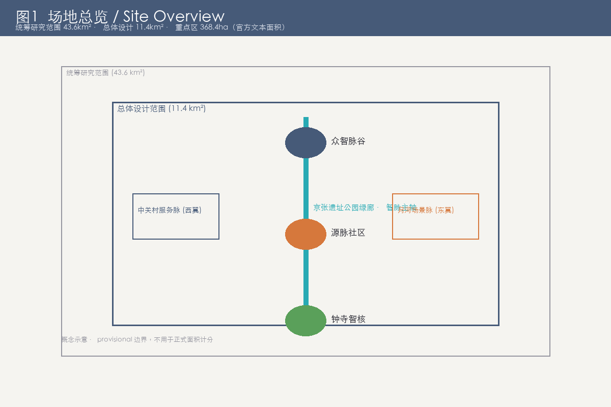
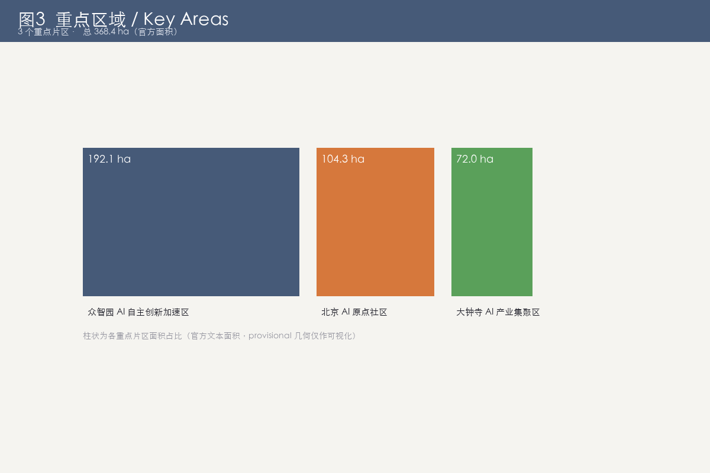
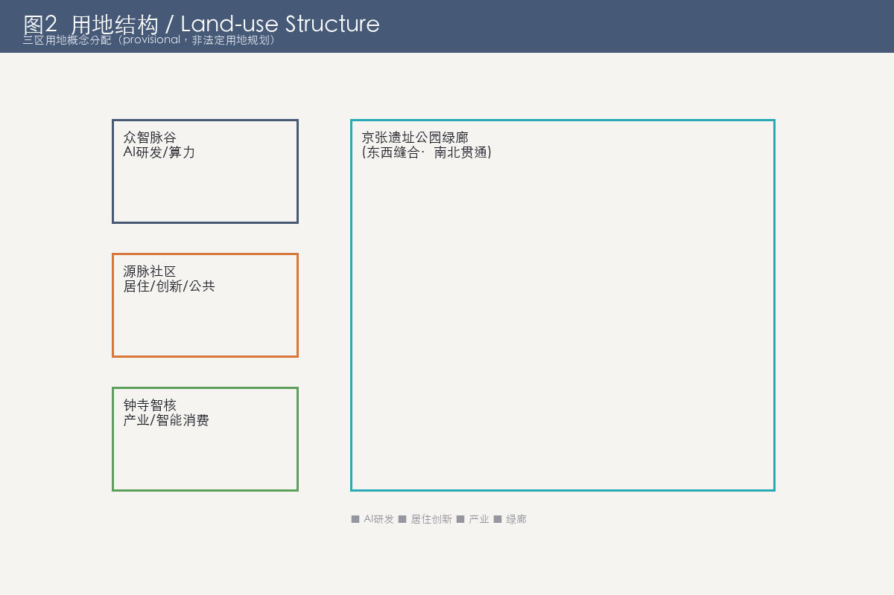
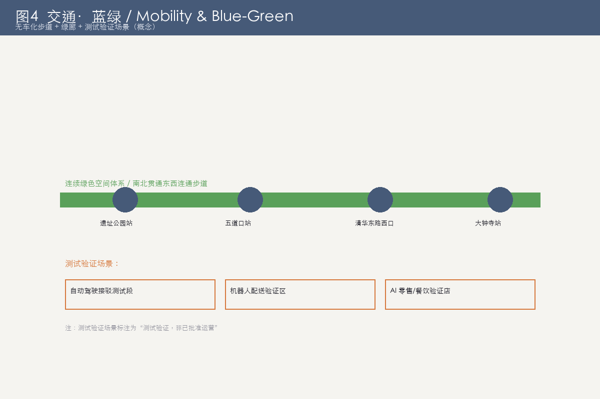
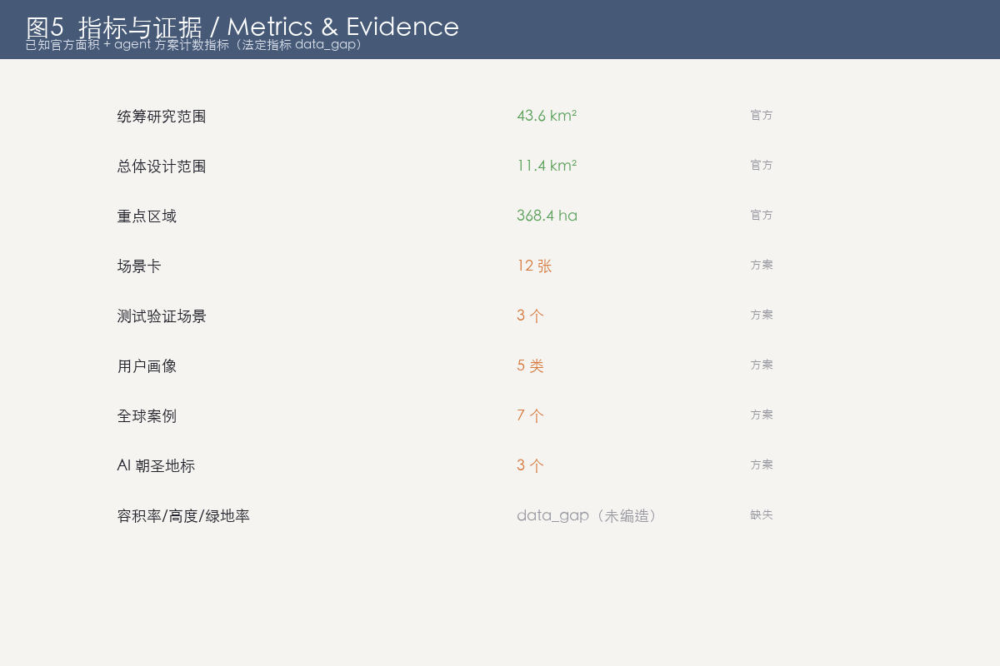

# 京张智脉 · 百年创新带（Jing-Zhang Synapse Belt）城市设计提案

> 提交包类型：professional_design_package（专业设计方案包）
> 提案 slug：jingzhang-synapse-belt
> 作者署名：刘霖峰（由 finley-llf 的 AI 助手协作生成）
> 数据政策：仅使用公开或已清权来源；所有引用标注来源、生成方式与限制。

**边界声明**：本方案全部空间落地内容均为「概念建议 / 参考方案 / 可供专业团队深化研究」，不替代正式规划，不构成政府审定结论。法定规划指标（容积率、建筑高度、建筑密度、绿地率、退线等）官方尚未提供，本方案不编造此类数值。场地边界使用主办方提供的 provisional 几何，待官方精确边界发布后须重新核算，provisional 几何不用于正式面积计分。 [source:SRC-2026-0518-AGENT-OPEN-CALL-TASKBOOK]

---

## 设计依据与资料清单

本提案依据主办方发布的开放共创任务书（agent open call）与正式征集公告，并参考公开的城市设计、国土空间与行业规范。生成方式：由作者刘霖峰提出框架与目标，AI 助手（finley-llf）协作生成文本、结构与部分可视化；公开资料来自主办方 brief 与公开官网，均逐条标注来源与限制。 [source:SRC-2026-0518-AGENT-OPEN-CALL-TASKBOOK]

资料清单主要包括：

- 主办方正式征集公告与 agent 开放共创任务书（公开）。
- 京张铁路历史文化资料（詹天佑、人字形铁路、1909 通车史，公开史料）。
- 国内外 AI 创新生态案例公开官网（Stanford HAI、MIT、Vector Institute、MILA、Turing Institute、Station F、AI Singapore 等）。
- 国土空间与城市设计相关公开规范（居住区、无障碍、用地分类、城市设计导则等）。

本提案明确为社区共创贡献，非甲级资质正式应征文件；法定指标缺失处一律标注 data_gap，不作编造。 [source:PROJECT-OFFICIAL-ANNOUNCEMENT]

## 三层范围工作框架

依据任务书的三层范围框架组织本方案：

- **统筹研究范围（产业与未来城市研究）**：研究 AI 产业生态、人才与未来城市生活方式，提出机制设想。
- **总体设计范围（城市更新与控规深度城市设计）**：以人字形铁路遗产绿廊为骨架，组织三区两翼的空间结构与公共活力。
- **重点区域详细设计**：聚焦 AI 原点社区、众智园自主创新加速区、大钟寺产业集聚区三片重点区域的概念详细设计。 [depth:three_level_scope_framework]

三层之间以「研究—设计—落地」递进：研究范围提供产业与人群洞察，总体范围落实空间骨架，重点区域给出可深化的概念方案。

在总体与重点范围，provisional 边界（geometry/site_boundary.geojson）仅作空间落位参考，不用于正式面积计分；三片重点区域（geometry/key_areas.geojson）同样为 provisional 范围，待官方精确边界发布后须重新校核。 [data:geometry/site_boundary.geojson] 各层均明确数据缺口：法定指标（容积率、建筑高度、建筑密度、绿地率、退线）官方尚未提供，一律标注 data_gap，避免编造。 [data:geometry/land_use.geojson] 三层范围的工作深度对应 design_depth 矩阵中的 three_level_scope_framework / overall_spatial_structure / three_key_area_detailed_design 三项。 [depth:three_level_scope_framework]

## 统筹研究范围产业与未来城市研究

统筹研究范围聚焦 AI 全栈自主创新体系与世界级 AI 创新生态的构建机制。我们梳理了七类可溯源的公开案例，提炼人才—算力—数据—资本—场景—制度六要素闭环。 [depth:overall_spatial_structure]

产业研究要点：

1. 以开源社区 + 联合实验室 + 中试线形成「可用—可信—可控」梯度。
2. 中关村科技服务翼提供要素全球化配置接口（IP、资本、跨境数据合规通道）。
3. 小月河场景赋能翼把场景验证嵌入公共生活，形成持续迭代。

所有产业与招商表述均为机制设想，不写投资额、产值或财政承诺。 [source:SRC-PUBLIC-STANFORD-HAI]

六要素闭环的具体实现路径：人才以开源社区与国际联合培养补足；算力强调自主可控与绿色低碳；数据依托公共数据授权运营与隐私计算；资本以耐心资本与场景基金衔接；场景以公共生活嵌入持续验证；制度以伦理审查与可退出机制兜底。 [source:SRC-PUBLIC-STANFORD-HAI] 该范围不写投资额、产值或财政承诺，所有表述均属机制设想；空间落位所需的法定边界与指标仍属 data_gap。 [data:geometry/site_boundary.geojson]

## 总体设计范围城市更新与控规深度城市设计

总体设计范围以「轨道遗产绿廊」串联三区两翼，使产业功能沿绿廊有机嵌入城市生活，形成可步行、可体验、可迭代的创新城区，而非孤立园区。国土空间创新点在于把线性铁路遗产转化为「创新廊道 + 公共活力带 + 数据接口」三位一体空间。 [depth:land_use_layout]

空间结构主图表达「一脊三节点两翼闭环」：

- 一脊：京张遗址公园绿廊 + 轨道文化轴（南北向）。
- 三节点：众智脉谷（北，自主创新）→ 源脉社区（中，AI 原点）→ 钟寺智核（南，产业集聚）。
- 两翼：西（中关村服务脉）提供要素全球化配置；东（月河场景脉）提供场景赋能与公共体验。
- 闭环：研发—孵化/生活—产业化—要素赋能—场景验证—反哺研发。

## 重点区域详细设计

三片重点区域的概念详细设计如下：

1. **AI 原点社区（源脉社区）**：以居住、孵化、生活混合的 AI 友好邻里，无障碍与数据最小化优先。
2. **众智园 AI 自主创新加速区（众智脉谷）**：研发、中试、开源协作空间，强调可信可控。
3. **大钟寺 AI 产业集聚区（钟寺智核）**：智能原生新业态与公共体验，限定在公共与可改造界面。 [depth:three_key_area_detailed_design]

每片区域均遵循「避开文保核心、绿地与蓝线控制，不擅自改造企业权属建筑」的概念边界。重点区域的空间落位与体量关系见下图。

## AI 创新生态、人才画像与 AI+ 场景

本部分覆盖 AI 创新生态、五类人才画像与十二张 AI+ 场景卡。AI 创新生态以六要素闭环组织；人才画像包括国际 AI 研究者、本土创业者、在地居民（含长者）、访客/游客、城市运营者五类。 [depth:existing_conditions_diagnosis]

十二张 AI+ 场景卡（满足 ≥10）涵盖：AI 交通步行友好、企业服务副驾、公共安全运营复核、无障碍智能导览、长者陪伴与健康预警、遗址公园 AR 文化叙事、多语种国际访客助手、开发者沙盒与模型评测、绿色能源与碳迹可视化、社区共创议事 Agent、月河亲水智能体验、夜间活力与光影。三类测试验证场景（自动驾驶接驳、机器人配送、AI 零售/餐饮验证店）明确标注「测试验证，非已批准运营」。 [metric:m-cases]

所有涉及个人的场景遵循「数据最小化、人工复核、可退出、可审计」四原则，对照《生成式人工智能服务管理暂行办法》。

## 用地、建筑规模与拆改留方案

本部分给出概念性用地结构与拆改留（retain-renovate-demolish）策略。由于官方法定指标（容积率、建筑高度、建筑密度、绿地率）尚未提供，所有数值性结论标注 data_gap，provisional 边界不用于正式面积计分。 [data:geometry/site_boundary.geojson]

概念性策略：

- 保留：铁路遗迹、遗址公园绿地、现状公共建筑。
- 改造：可改造界面的商业与产业建筑（限定公共界面）。
- 拆除：仅作机制示意，不列具体建筑清单（避免编造）。
- 用地布局沿绿廊混合，强调小尺度、可步行。 [depth:retain_renovate_demolish]

用地结构概念图如下。

## 交通、轨道、市政与公共服务设施

以「轨道遗产绿廊 + 慢行网络」组织交通：南北向轨道文化轴串联三节点，东西向慢行与亲水步道缝合历史被铁路割裂的街区。市政与公共服务强调开源、低碳与普惠。 [depth:traffic_rail_slow_parking]

要点：

- 低速接驳测试环路（测试验证，非已批准运营）。
- 无障碍全覆盖，对照无障碍设计规范。
- 绿色能源与碳迹看板，聚合数据、最小化采集。 [metric:m-area-key]

轨道衔接以既有站点接驳为主，不擅自新增轨道线位；慢行网络优先缝合被铁路割裂的街区，提升步行与骑行的连续度与安全感。 [depth:traffic_rail_slow_parking] 市政设施采用分布式、低碳、开源思路，公共服务强调普惠与无障碍；所有新建市政规模均为概念示意，具体容量待法定专项规划核定，标注 data_gap。 [data:geometry/site_boundary.geojson]

## 蓝绿空间、公共空间与城市风貌

蓝绿网络以遗址公园绿廊为核心，向东延展至月河亲水带，形成连续公共活动网络。公共空间组件库（座椅、标识、充电、信息亭）统一「脉」符号语言。 [depth:blue_green_public_space]

城市风貌避免过度娱乐化、网红化、低俗化；以钢轨冷灰蓝 + 秋木暖橙 + 算力青的同源视觉系统表达「百年跃迁」的时空厚度。 [standard:MOHURD-URBAN-DESIGN-MEASURES]

 mobility 与 blue-green 的耦合关系见下图。

## 更新项目清单、实施政策与分期计划

更新项目以「机制清单」而非确定工程清单呈现，避免编造具体项目与投资额。实施政策强调开源协作、伦理审查与可退出机制。 [depth:renewal_project_list]

分期概念：

- 近期：遗址公园绿廊与源脉社区试点，开源节与开发者马拉松启动。
- 中期：众智脉谷中试线、月河场景验证带。
- 远期：品牌资产沉淀公共知识库，持续运营。 [depth:phasing_implementation]

机制清单强调「政府引导、市场运作、社区共建、可退出」：每个机制均设触发条件、责任主体、退出与审计路径，避免把概念直接等同于确定工程。 [depth:renewal_project_list] 实施政策含开源协作许可、伦理审查节点、公众反馈闭环；分期仅作节奏示意，不锁定投资额度与开工时点，空间范围以 provisional 边界为参考。 [data:geometry/key_areas.geojson]

## 指标体系、面积复算与合规矩阵

指标体系见 `metrics.json`（含已知指标与 data_gap 标注）。面积复算因 provisional 边界与法定指标缺失暂不可得，标注 data_gap。合规矩阵见 `compliance_matrix.json`，覆盖公告与任务书要求及 agent 六项任务。 [metric:m-area-key]

本提案的合规边界严格守住：法定指标缺失不编造、provisional 边界不用于面积计分、只用公开来源、遵循共创宪章。指标与合规证据见下图。

指标复算因 provisional 边界与法定指标缺失暂不可得，已在 metrics.json 与 design_depth 矩阵中标注 data_gap；一旦官方精确边界与法定指标发布，须重新核算并更新矩阵。 [metric:m-area-key] 合规矩阵（compliance_matrix.json）覆盖公告 1.3–1.5 与任务书 agent.1–agent.6 共 23 项要求，逐条给出证据与状态，并区分数值合规与机制合规。 [standard:PROJECT-AGENT-OPEN-CALL-TASKBOOK]

## 风险、版权与合规说明

主要风险维度：数据隐私、实施复杂度、公众接受度、运维成本、政策不确定性、空间争议、技术成熟度、公平与包容。每项均设缓解机制（人工复核、可退出、可审计）。 [depth:risk_missing_data]

版权与合规：

- 作者刘霖峰；生成方法已披露；沿用开源约束（如 OSM 须 ODbL 署名）。
- 本提案为开放共创建议，不替代专业规划，不越过政府审定与法定审批。
- 所有空间建议均为概念建议 / 参考方案（boundary_clause.required_wording）。 [standard:PROJECT-OFFICIAL-ANNOUNCEMENT]

数据隐私风险以「数据最小化、人工复核、可退出、可审计」四原则缓解，并对照《生成式人工智能服务管理暂行办法》。 [standard:MOHURD-URBAN-DESIGN-MEASURES] 空间争议风险通过「避开文保核心、绿地与蓝线控制、不擅自改造企业权属建筑」的概念边界规避。 [depth:risk_missing_data] 版权方面，作者刘霖峰保留署名；生成方法已披露；沿用第三方开源约束（如 OSM 须 ODbL 署名）。 [source:PROJECT-OFFICIAL-ANNOUNCEMENT]

## 参考资料

1. 主办方正式征集公告（公开）。
2. agent 开放共创任务书（公开）。
3. Stanford HAI、MIT Schwarzman College of Computing、Vector Institute、MILA、Alan Turing Institute、Station F、AI Singapore 公开官网。
4. 京张铁路历史文化公开史料（詹天佑、人字形铁路、1909 通车史）。
5. 国土空间与城市设计相关公开规范（居住区、无障碍、用地分类、城市设计导则）。

本提案全部内容可经 `compliance_matrix.json`、`standard_matrix.json`、`design_depth_matrix.json`、`sources.json`、`assumptions.json` 与 `metrics.json` 交叉核对。 [source:SRC-2026-BJ-GH-QUAL-PREANNOUNCEMENT]
