# Fold Jingzhang

*Centennial Jing-Zhang AI Innovation Belt Urban Design · Open Call Submission · drafted with FoldWeaver-v1 AI agent assistance*

**Jingzhang Digital-Intelligent Folding Belt**

This proposal elevates the ~9 km Jingzhang Railway heritage corridor, running from the 2nd to the 5th Ring Road in Haidian, from a "physical transport line" into a "data-element circulation line" and a "carrier of time-space memory": the heritage park forms the fold belt itself (physical layer), a 1+3+N digital-twin base forms the editable city (digital layer), and 7 time-space fold nodes anchored to the plan heritage list (pending registry) form the experience interface (experience layer) — together a "computable, perceivable, editable" urban renewal demonstration belt. All rigid conclusions are benchmarked against the *HD00-1601 et al. Block Regulatory Detailed Plan (2024–2035)* [source:REGULATORY-PLAN-HD00-1601], industry facts against the official "Three Zones, Two Wings" release [source:THREE-ZONES-TWO-WINGS-RELEASE], and tasks against the open-call announcement and the agent-facing taskbook [source:OFFICIAL-ANNOUNCEMENT] [source:AGENT-TASKBOOK].

## Design Basis and Source Inventory

The primary basis of this formal submission is the official prequalification announcement issued by the Haidian Branch of the Beijing Municipal Commission of Planning and Natural Resources [source:OFFICIAL-ANNOUNCEMENT], with the maintainer-registered provisional boundaries, key areas, enums, metrics and source lists in `brief/site-package/` as machine-readable basis [source:SITE-PACKAGE]. Before generating the design, the agent read `design_brief.json`, `sources.json`, `enums/`, `data/source_registry.json` and `data/processed/agent_fact_pack.md`; every design judgement is decomposed into traceable sources, recalculable metrics, verifiable layers and human-reviewable assumptions [depth:existing_conditions_diagnosis].

Compared with other entries, this proposal additionally obtained and cites two key documents (both are **participant-submitted evidence pending source-registry review**: until data/source_registry.json contains the corresponding approved_formal records, this proposal does not claim formally verified registration for them and relies on fair quotation of publicly obtained texts):

1. **Regulatory plan (participant-submitted, pending registry)**: *Regulatory Detailed Plan (Block Level) for HD00-1601 et al. Blocks along the Jingzhang Railway Heritage Park (AI Innovation Block Key Area), Haidian District, Beijing (2024–2035)* (prepared by CAUPD, qualification no. 21110023) [source:REGULATORY-PLAN-HD00-1601]. Its rigid controls — a 16.7 km² planning area (Chengfu Road to the north, Xizhimenwai Street to the south, Zhongguancun Street to the west, Xinjiekouwai Street to the east; 9 blocks), a 24.08 million sqm total floor-area ceiling, ~364,000 permanent residents, ~397,000 jobs, the plan structure "one belt, one axis, two centers, multiple nodes", 75 dominant-function zones, 6 baseline height classes, and 13 immovable heritage sites — take precedence over any competition narrative; every spatial conclusion of this proposal is checked item by item (see `[source:Regulatory Plan Art. N]` annotations throughout).
2. **Official "Three Zones, Two Wings" release**: Haidian's official release on the centennial Jingzhang AI innovation belt, defining Xuebeiyuan AI Acceleration Zone (north), Beijing AI Origin Community (center), Dazhongsi AI Industry Cluster (south), the Zhongguancun tech-services wing (west) and the Xiaoyue River scenario wing (east), together with all industry facts [source:THREE-ZONES-TWO-WINGS-RELEASE].

Usage boundaries of the source registry [source:SOURCE-REGISTRY]:

- `data/source_registry.json` registers the usability of public, cleared and provisional materials; the agent must not upgrade background-only or provisional-only materials into official boundaries, formal plan bases, formal scoring basis or government implementation commitments.
- `data/processed/agent_fact_pack.md` is a reading-navigation layer, not a new authority [source:PROCESSED-FACT-PACK]; factual judgements return to registered primary materials, and full source relations are kept in `sources.json`.
- Parts 2 and 3 of the regulatory plan (drawings and block charts) are image-based and could not be text-extracted; the resulting parcel-level precision limit is registered in `assumptions.json`. This proposal cites only textual clauses and never fabricates chart geometry [source:REGULATORY-PLAN-HD00-1601].

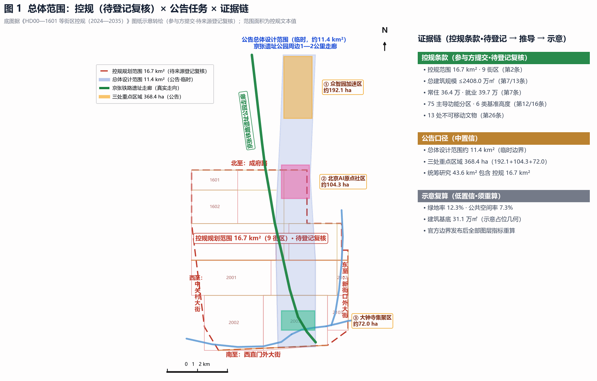

Because official `SITE_BOUNDARY` and `KEY_AREA` geometry has not been published, this proposal uses provisional boundaries derived from `brief/site-package/geometry/provisional_boundaries.geojson` [source:BOUNDARY-SOURCE] [source:KEY-AREA-SOURCE]. `geometry/site_boundary.geojson` and `geometry/key_areas.geojson` are marked `provisional_constraint`, `official_boundary=false`; they serve generation, self-check, visualization and design discussion only — never as official redlines, approval basis or precise-area basis. This organizer data gap does not block content scoring; all layers and metrics will be recalculated once official geometry is published. The provisional boundary has been cross-checked against the regulatory plan's four boundary roads and 9 block codes; the area-caliber difference (11.4 km² overall design area vs 16.7 km² regulatory area) is registered in `assumptions.json` [data:geometry/site_boundary.geojson#SITE-001] [metric:site_area_sqm].

This proposal was prepared by Beijing Xinrui Jinshi Digital Intelligence Technology Co., Ltd. with assistance from the AI Agent "FoldWeaver-v1", under full human-expert supervision and confirmation. It is a conceptual recommendation only and does not represent the company's officially reviewed conclusions or a legally binding planning document.

## Three-Level Scope Framework

The proposal is organized along the announcement's three levels, with the nested calibers disclosed: 43.6 km² strategic research scope (AI industry ecology, positioning, future urban form) ⊃ ~37 km² comprehensive planning scope (official release caliber) ⊃ 16.7 km² regulatory key area (plan benchmark, pending registry) ⊃ ~11.4 km² overall design area (announcement task caliber, 1–2 km around the heritage park) ⊃ 368.4 ha of three key detailed-design areas [source:OFFICIAL-ANNOUNCEMENT] [source:REGULATORY-PLAN-HD00-1601]. Caliber differences are registered in `assumptions.json`. Every mandatory task of announcement 1.3/1.4/1.5 and agent.1–agent.6 is mapped in `compliance_matrix.json` to sections, layers, metrics, drawings and HTML evidence [depth:three_level_scope_framework] [standard:PROJECT-OFFICIAL-ANNOUNCEMENT].

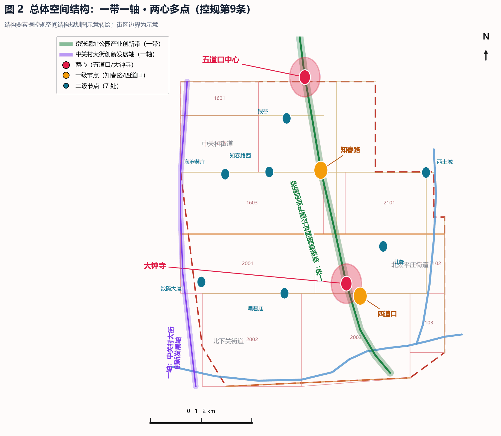

The overall concept is the **Jingzhang Digital-Intelligent Folding Belt**: one "fold" presses the 1909 railway heritage and the 2035 AI district into the same spatial coordinate — the physical layer keeps the railway fabric and implants modular, detachable "AI urban plug-ins"; the digital layer builds an "editable city base" linking the three zones into a data-assetization test belt; the experience layer overlays centennial railway scenes and future AI visions onto plan heritage anchors (pending registry) via AR/MR. "Folding" is not a formal metaphor but the operating mechanism by which data elements circulate, register, trade and feed back in physical space (see the Jingzhang Data Covenant section).

| Level | Design question | Proposal answer | Data anchor |
| --- | --- | --- | --- |
| Strategic research scope | How to organize AI industry ecology and future urban form | "university sourcing – open-source collaboration – enterprise conversion – public experience – global communication" innovation chain + the Folding Belt three-layer fold structure | compliance_matrix.json, standard_matrix.json |
| Overall design area | How industry, renewal, transport and character land on the map | Land-use, building, road, green, public-space and phasing layers plus the data-node network | [data:geometry/land_use.geojson#LU-001], [data:geometry/roads.geojson#ROAD-001] |
| Key areas | How the three zones reach detailed-design depth | Positioned as Data Origin / Fold Hub / Exchange Port, overlaid with 7 fold nodes | [data:geometry/key_areas.geojson#PROV-KEY-001], [data:geometry/public_space.geojson#FOLD-001] |

## Strategic Research: Industry and Future Urban Form

The core task at this level is building a world-class AI innovation ecosystem. Per the official release, Haidian already hosts 2,000+ AI enterprises, 26 unicorns, 130 registered foundation models, an AI core industry exceeding RMB 350 billion, 95,000 AI R&D talents, and 30+ universities and institutes nearby [source:THREE-ZONES-TWO-WINGS-RELEASE]. The regulatory plan further registers 9 existing higher-education institutions (8 universities including UCAS, Beijing Open University, CUFE, BJTU, Capital University of Physical Education, CUPL, BUPT and BNU, plus 1 secondary vocational school), some earmarked for relocation to Yanqing and Xiong'an; the vacated campus space will fill regional gaps — the plan source (pending registry) of the Folding Belt's "opportunity-space inventory" [source:REGULATORY-PLAN-HD00-1601] (Arts. 6, 42).

The Folding Belt organizes these facts into a "one spine, two faces" fold structure: the three zones form the longitudinal spine (data elements originate → process → circulate), while the two wings form the east-west unfolding faces (service enablement × scenario validation) [depth:overall_spatial_structure] [standard:PROJECT-AGENT-OPEN-CALL-TASKBOOK]:

| Key zone | Official positioning and facts | the Folding Belt theme | Functional overlay |
| --- | --- | --- | --- |
| North · Xuebeiyuan AI Acceleration Zone | Dongsheng Science Park Xuebeiyuan campus, 238,300 sqm GFA, opened July 2026, NSFC signed in; national computing base, AI chips, foundational algorithm platforms, 1,200 sqm exhibition space, AI go-global service platform [source:THREE-ZONES-TWO-WINGS-RELEASE] | **Data Origin** | Urban data sandbox, edge-computing cluster, vertical-model training ground, Algorithm Contribution Index HQ (computing × data dual base) |
| Center · Beijing AI Origin Community | Wudaokou core, ringed by Tsinghua–Peking–CAS; 320+ AI firms, >74% industry concentration, >70% young R&D staff; "5+5" rent and computing subsidies, 15-minute talent living circle [source:THREE-ZONES-TWO-WINGS-RELEASE] | **Fold Hub** | Editable-city demonstration zone, AR/MR time-space narrative nodes, developer co-creation community, smart-station network |
| South · Dazhongsi AI Industry Cluster | Riding on leading platforms such as Douyin; agents, AI content consumption, smart terminals, digital cultural creativity; commercial testing and mass-production incubation [source:THREE-ZONES-TWO-WINGS-RELEASE] | **Exchange Port** | Data-asset registration and trading platform, AI-native business scenarios, industry testbeds, digital-twin showcase |
| West wing · Zhongguancun Tech-Services | Global factor connector: VC, IP, cross-border commerce, legal, IPO coaching | Service face | Business and legal interface of the Data Covenant: data-asset registration, compliance review, cross-border data-flow consulting |
| East wing · Xiaoyue River Scenario | Smart-city testbed: embodied AI, AI healthcare, digital film production, smart tourism pilots | Scenario face | Field-application outlet for data elements: adaptive public space, affective computing, AI guides tested first along the waterfront |

The three positionings and five functions are each grounded in the Folding Belt mechanisms and spaces, closing the functional loop [standard:PROJECT-AGENT-OPEN-CALL-TASKBOOK]:

| Official requirement | the Folding Belt mechanism response | Spatial anchor |
| --- | --- | --- |
| Positioning: centennial Jingzhang culture belt | 7 fold nodes + time-space narrative co-creation | Heritage corridor and Art. 26 anchors |
| Positioning: urban AI living-experience belt | 10 AI scenario cards + public experience route | Belt, community lounges, Xiaoyue waterfront |
| Positioning: AI-fusion innovation belt | Jingzhang Data Covenant + 1+3+N digital-twin base | Three zones + two wings |
| Function: full-stack indigenous AI system | Computing × data dual base, sovereign-model testbed | Xuebeiyuan Data Origin |
| Function: world-class AI innovation ecosystem | Open-source hall, tech-transfer posts, international roadshow lounge | Origin Community, Dazhongsi |
| Function: new AI+ scenario-enablement paradigm | Scenario–space–operation mapping and test-validation grounds | Xiaoyue River wing first |
| Function: intelligent AI vitality city | Adaptive public space, demand-responsive transit, affective computing | Whole design area |
| Function: global AI-governance voice | Data-covenant compliance, algorithm audit, standards workshops | Xuebeiyuan, covenant platform |

The naming system serves the identity of "centennial Jingzhang culture belt, urban AI living-experience belt, AI-fusion innovation belt": full Chinese name 京张数智折叠带, English Jingzhang Digital-Intelligent Folding Belt; the logo overlays data flows and folded surfaces on railway-track lines, forming a "physical track × digital fold" composite symbol. The master visual uses a "center-seam fold, two eras facing each other" composition — the left half a yellowed 1909 engineering blueprint (steam locomotive, old platform, water-tower silhouettes), the right half a deep-blue digital twin (AI light-particle train, edge-node nebula), with one railway crossing the seam to complete the time travel (see `assets/figures/cover.png`). Our future-urban-form conclusion: AI changes not only industrial efficiency but "how time is used" — commuting, collaboration, consumption and learning are compressed into one slow-mobility corridor; that is the urban meaning of "folding". Content on global AI events and developer-community operation is conceptual suggestion for professional teams, not a government commitment.

### Global AI Ecosystem Case Studies and the Eight-Factor Mechanism

As required by the taskbook, six public global AI-ecosystem cases are reviewed for transferable mechanisms (qualitative facts from published sources, cited as method references rather than data):

| Case | Publicly documented ecosystem mechanism | Transfer design for the Folding Belt |
| --- | --- | --- |
| Silicon Valley (Stanford–industry–VC loop) | University origin + venture-capital density + failure-tolerant startup culture | Origin Community "campus-origin → open-source → enterprise" chain + west-wing VC interface |
| Toronto–Waterloo corridor (Vector Institute) | National institute anchor + university cluster + co-located corporate labs | Xuebeiyuan national computing base and foundational research platforms |
| London King's Cross Knowledge Quarter | Industrial-heritage renewal + tech HQs + design colleges + public open space | Heritage-corridor reuse, fold-node AR narration, garden-type innovation blocks |
| Tel Aviv innovation circle | Dense small-startup scene + cybersecurity vertical + international capital channel | Dazhongsi agent vertical cluster + AI go-global service platform link |
| Singapore One-North | National AI strategy coordination + regulatory sandbox + public-private data partnership | Data Covenant L3 sandbox and four-part compliance baseline |
| Shenzhen Nanshan | Complete hardware supply chain + open scenarios + rapid production validation | Smart-terminal test ground, foundation-model commercial testing and incubation |

Eight-factor guarantee mechanism (land, space, industry, capital, talent, computing, data, scenario): land and space — the 75 plan dominant-function zones serve as the inventory ledger for identifying underused opportunity space, with vacated university land first filling three-facility gaps (Arts. 6, 42) [source:REGULATORY-PLAN-HD00-1601]; industry — vertical division across the three zones (foundational algorithms → open-source ecosystem → agent commercialization); capital — west-wing full-chain VC, IP and IPO-coaching interface (mechanism suggestion, not a funding commitment); talent — 15-minute living circle, young R&D community, tech-transfer posts; computing — Xuebeiyuan national base + edge stations; data — the covenant's three-tier lists; scenario — Xiaoyue River wing and the three industry test-validation grounds. The AI innovation-ecosystem map is the coupled network of "three zones and two wings × eight factors × data covenant"; all mechanisms are conceptual suggestions.

### Haidian–Beijing–Beijing-Tianjin-Hebei AI Innovation Synergy (cooperation suggestions)

The Jingzhang Digital-Intelligent Folding Belt does not operate as a closed system but as an **exchangeable node** in the Haidian–Beijing–Beijing-Tianjin-Hebei innovation network. The table below itemizes the proposed exchangeable research, computing, capital, talent and scenario resources, the corresponding Jingzhang spatial interfaces, and the current evidence status. **All entries are cooperation suggestions; none constitutes or implies any signed arrangement or government commitment.** "Public positioning" means only that the parties' public planning scopes are complementary; formal collaboration mechanisms await promotion by the organizer and the relevant bodies.

| Counterpart | Exchangeable resources (research/computing/capital/talent/scenario) | Jingzhang spatial interface | Evidence status |
| --- | --- | --- | --- |
| Zhongguancun Science City (Haidian) | Research: university labs network; capital: VC & IP services; talent: young R&D community | Origin Community tech-transfer street; west-wing Zhongguancun tech-service wing | Public positioning; suggestion |
| Beiwei Community (northern Haidian) | Computing: regional facility mutual backup; scenario: smart-city scenario mutual recognition | Xuebeiyuan data sandbox & L3 covenant pilot | Public info to verify; suggestion |
| Future Science City (Changping) | Research: energy research & corporate labs; talent: engineers | Heritage-park innovation-belt R&D exchange carriers | Public positioning; suggestion |
| Huairou Science City | Research: large-scale facilities & fundamental-research data | 1+3+N twin base with reserved science-data interface | Public positioning; suggestion |
| Beijing E-Town (BDA) | Scenario: smart manufacturing, vehicle-road & autonomous delivery testing; industry: agent manufacturing support | Dazhongsi agent cluster + demand-responsive transit test mutual recognition (AI+06) | Public positioning; suggestion |
| Beijing-Tianjin-Hebei (Tianjin/Hebei & Zhangjiakou) | Computing: green-power computing; scenario: manufacturing & tourism hinterland; talent: vocational education | Jingzhang railway culture line extending to Zhangjiakou via the Jingzhang HSR (same-origin line, event-based linkage) | Public positioning; suggestion |

The synergy mechanism is managed dynamically as "resource list + spatial interface + evidence status": each cooperation requires counterparty confirmation and compliance assessment before occurring, and must be registered under the regional-synergy entry in assumptions.json; until registered, all items are stated as cooperation suggestions and must not be written into formal agreements or commitment conclusions.

## Overall Design Area: Urban Renewal at Regulatory-Plan Depth

The overall design area must reach the urban-design depth of a regulatory detailed plan. This proposal aligns directly with the plan structure "one belt, one axis, two centers, multiple nodes" (Art. 9) [source:REGULATORY-PLAN-HD00-1601] [standard:MOHURD-CONTROL-DETAILED-PLANNING] [depth:overall_spatial_structure]:

| Plan structure | Content | the Folding Belt alignment |
| --- | --- | --- |
| One belt | Jingzhang Railway Heritage Park industry-innovation belt | The fold belt itself — physical heritage corridor × digital data corridor |
| One axis | Zhongguancun Street innovation axis | Service-interface corridor of the Data Covenant (west wing) |
| Two centers | Wudaokou center, Dazhongsi center | Wudaokou = Fold Hub core; Dazhongsi = Exchange Port core |
| Multiple nodes | Zhichun Road, Sidaokou (tier 1); Haidian Huangzhuang, Digital Building, Zaojunmiao, Zhichun Rd West, Yingu, Xitucheng, BUPT (tier 2) | Anchor pool for edge nodes and fold nodes |

The renewal framework responds to the official "nearly 10 million sqm of stock space + 1 million sqm renewal carrier" caliber [source:THREE-ZONES-TWO-WINGS-RELEASE]: underused space is identified against the 75 dominant-function zones (26 residential-led, 16 culture/education-led, 17 mixed-use, 6 green/water-led, etc.; Art. 12); renewal intensity never exceeds the five-tier baseline intensity zoning (Art. 14); building heights strictly observe the six baseline height classes of 36/45/60/80/100 m (Art. 16). `geometry/land_use.geojson` covers the design boundary completely without overlaps [data:geometry/land_use.geojson#LU-001] [depth:land_use_layout]; `geometry/buildings.geojson` expresses renewal building footprints [data:geometry/buildings.geojson#BLDG-001] [metric:building_footprint_area_sqm]; intensity control is governed by [depth:development_intensity_controls].

### Jingzhang Data Covenant and Algorithm Contribution Index (plan source, pending registry: Art. 82)

Article 82 of the regulatory plan explicitly calls to "explore reform paths for market-based allocation of data elements" [source:REGULATORY-PLAN-HD00-1601]. The Folding Belt deepens this plan clause (pending registry) into an implementable "Jingzhang Data Covenant":

- **Three-tier public-data authorization list**: L1 open tier (anonymized aggregate city-operation data, no authorization needed), L2 authorized tier (district-level sensing data, application after enterprise KYC), L3 sandbox tier (sensitive-scenario data, usable-but-invisible inside the Xuebeiyuan data sandbox only); target coverage at [metric:data_covenant_coverage_ratio].
- **Algorithm Contribution Index**: enterprises and developers trade city-optimizing algorithms for data-use rights; index = model invocation frequency × scenario weight × effect score × fairness-correction coefficient (baseline and formula at [metric:algorithm_contribution_index]); top contributors receive a spatial reward ladder (testbed priority → showcase slots → rent-reduction recommendations).
- **Fairness correction and anti-concentration clause**: allocation never follows call frequency alone — the correction coefficient up-weights open-source contributions and public-value scenarios (accessibility, elder-friendly, child-friendly, vulnerable-group benefits) and applies scale-decay correction to large players; a **small-team reserve quota** reserves no less than 30% of each round's space and data rewards for teams under 50 people and independent developers; rankings are independently reviewed by the quarterly committee and published with an objection window and appeal channel (see the concept-stage governance table); no actor may lock in ranking through data or space advantages, preventing public data and space opportunities from concentrating in large enterprises.
- **Compliance floor**: enterprise KYC, data de-identification, purpose registration and auditable logs are all indispensable; the index is an operational proposal, not government approval or commitment.

### 1+3+N Digital-Twin Architecture (aligned with Art. 82 intelligent-city system)

"1" city-level data lake (Xuebeiyuan, on the national computing base); "3" district edge nodes (one per zone, local real-time computing and privacy de-identification); "N" street-level pluggable AI models and sensing nodes (modular temporary facilities, exempt from height zoning, marked detachable). Open APIs with de-identification-first interfaces; node locations at [data:geometry/public_space.geojson#DATA-001] [metric:data_nodes_count]. All edge nodes and sensors avoid the plan's underground no-build zones (heritage protection areas and class-1 construction-control belts) [source:REGULATORY-PLAN-HD00-1601].

## Key Area Detailed Design

The three key areas reference provisional boundaries [data:geometry/key_areas.geojson#PROV-KEY-001], [data:geometry/key_areas.geojson#PROV-KEY-002], [data:geometry/key_areas.geojson#PROV-KEY-003], with depth governed by [depth:three_key_area_detailed_design] and compliance items 1.5.3.1–1.5.3.3. **Caliber note**: Xuebeiyuan lies outside the regulatory-plan area (which ends at Chengfu Road) and is treated at strategic-research level; regulatory-depth design covers only Wudaokou (Origin Community) and Dazhongsi. The announcement's "Zhongzhiyuan AI Acceleration Zone" (item 1.5.3.1) and the official release's "Xuebeiyuan AI Acceleration Zone" are the same zone; this proposal uses "Xuebeiyuan (announcement caliber: Zhongzhiyuan)".

| Key zone | Positioning | Spatial actions | AI industry & operation scenarios | Evidence |
| --- | --- | --- | --- | --- |
| Xuebeiyuan AI Acceleration Zone | Data Origin · garden-style full-stack innovation block | Strengthen Qinghe interface, industry showcase, low-carbon exchange; concentrated sandbox and computing base | Urban data sandbox, sovereign-model testing, standards workshops, safety-governance showcase | [data:geometry/key_areas.geojson#PROV-KEY-001] |
| Beijing AI Origin Community | Fold Hub · near-campus tech-transfer and talent community | Slow-mobility stitching of campus–park–blocks; editable-city demonstration zone; Qinghuayuan Station main fold node | Open-source community, achievement launches, talent-zone services, AR/MR time-space narratives | [data:geometry/key_areas.geojson#PROV-KEY-002] |
| Dazhongsi AI Industry Cluster | Exchange Port · urban intelligent-economy and international-exchange block | Dazhongsi station integration, four-quadrant pedestrian connection, data-asset trading carrier renewal | Data-asset registration/trading, agent & smart-terminal showcase, international roadshows | [data:geometry/key_areas.geojson#PROV-KEY-003] [metric:key_area_count] |

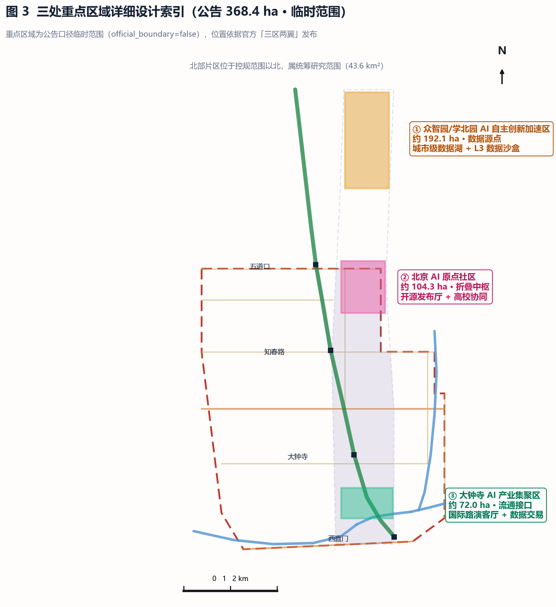

### 7 Time-Space Fold Nodes (all anchored to the plan heritage list and key areas)

Per the immovable-heritage list of Art. 26, the spatial structure of Art. 9 and the tier-2 key-area controls of Arts. 21–23 (heritage-park frontage, South Long River frontage, Xizhimen hub), all 7 fold nodes are re-anchored to plan-registered assets (pending registry); the scaffold's fictional nodes (old platform, water tower, switches) are discarded. National- and municipal-level heritage sites allow AR/MR "experience overlay" only — no physical alteration whatsoever (including sensor installation) — and protection areas and construction-control belts are strictly observed [source:REGULATORY-PLAN-HD00-1601]:

| ID | Anchor | Protection level | History layer | Future layer (AR/MR overlay) | Location |
| --- | --- | --- | --- | --- | --- |
| FOLD-001 | Qinghuayuan Railway Station site | Beijing municipal heritage | 1910 Jingzhang Railway Qinghuayuan Station, built under Zhan Tianyou | **Main fold node**: "AI guide Zhan Tianyou" — an LLM revives the historical narrator; first stop of the time-travel route | [data:geometry/public_space.geojson#FOLD-001] |
| FOLD-002 | Gaoliang Sluice | National heritage | Yuan-dynasty Tonghui River sluice, canal artery | Water wisdom across eras: AR overlay of canal water systems and contemporary sponge-city data | [data:geometry/public_space.geojson#FOLD-002] |
| FOLD-003 | Yuan Dadu city-wall ruins | National heritage | Yuan-dynasty northern wall, an 800-year-old city outline | Wall time-section: MR show of urban-boundary growth | [data:geometry/public_space.geojson#FOLD-003] |
| FOLD-004 | CARS research railway | Ungraded heritage | New China's railway research test line | Unique "data folding" asset: track × research history, experimental-data visualization gallery | [data:geometry/public_space.geojson#FOLD-004] |
| FOLD-005 | Dahui Temple | National heritage | Ming-dynasty temple, painted-sculpture treasury | Digital-sculpture research display (remote projection, no contact with the monument) | [data:geometry/public_space.geojson#FOLD-005] |
| FOLD-006 | Wudaokou center | Plan "two centers" | Contemporary youth-culture landmark | Fold Hub lounge: developer co-creation, premieres, night-time data carpet | [data:geometry/public_space.geojson#FOLD-006] |
| FOLD-007 | Xizhimen hub | Plan tier-2 key area | Centennial Jingzhang origin gateway | South portal of the fold: arrival ritual, city-data overview screen | [data:geometry/public_space.geojson#FOLD-007] |

Fold-node count at [metric:fold_nodes_count]; AR/MR experience points at [metric:ar_mr_experience_points]. Node coordinates are now schematically calibrated to the actual heritage sites: FOLD-001/006 sit at the northern edge of the provisional design corridor, while FOLD-002/003/004/005/007 lie within the 16.7 km² plan area (pending registry) (FOLD-003 Yuan Capital Wall and FOLD-005 Dahui Temple fall outside the provisional corridor, inside the wider study area). All nodes use the 16.7 km² plan area (pending registry) as the spatial benchmark and are linked across scopes by the data covenant, unconstrained by the provisional corridor; siting follows the "north–south through, east–west integrated" public-space requirement of the tier-2 key area along the heritage park (Art. 21) [source:REGULATORY-PLAN-HD00-1601].

### Fold-Node Scene Renderings (illustrative)

The following scenes follow the "center-seam fold, two eras facing each other" visual system: the left half shows the 1909 history layer in silhouette, the right half the 2035 future layer as an AR/MR concept. These renderings express design intent only — they are not site photographs; all experiences are digital overlays with no physical alteration of heritage [depth:three_key_area_detailed_design].

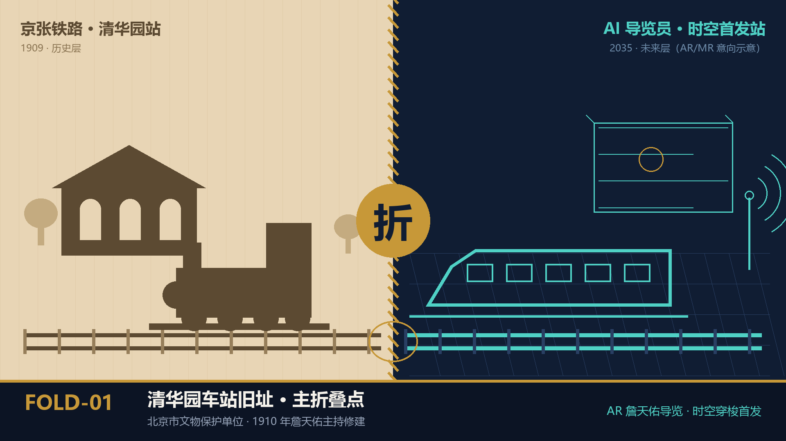

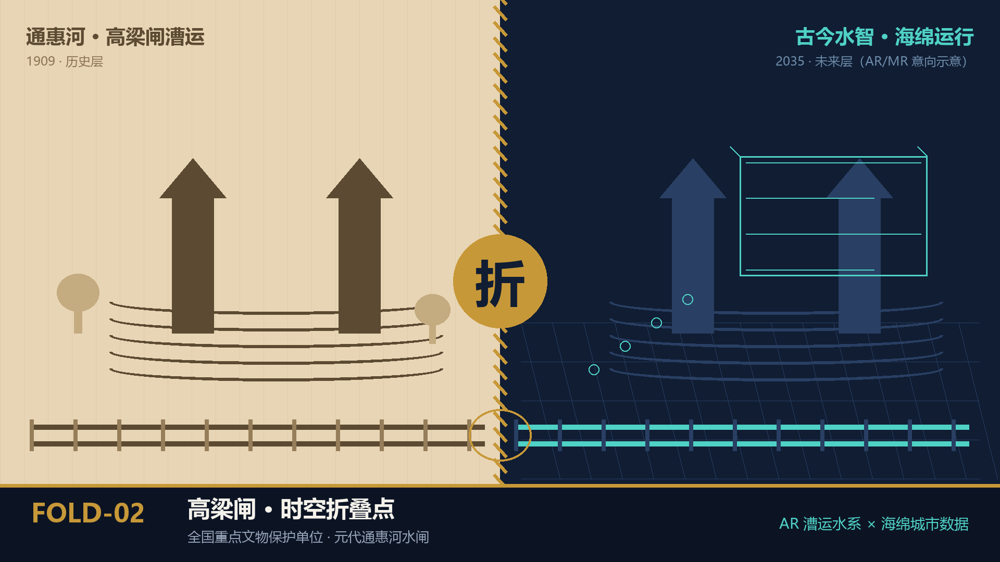

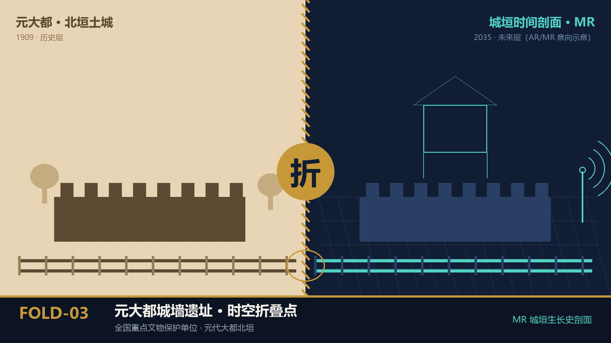

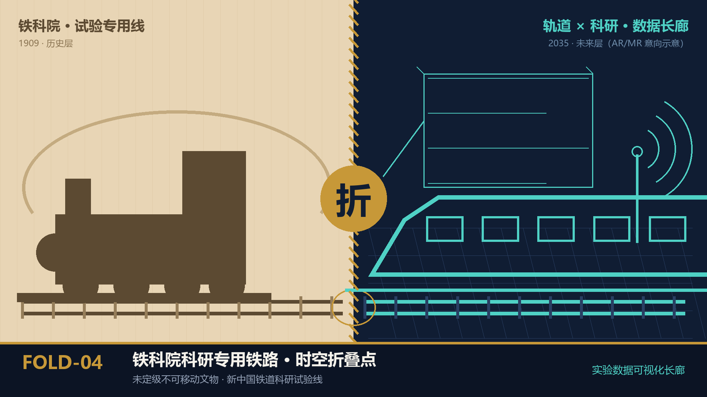

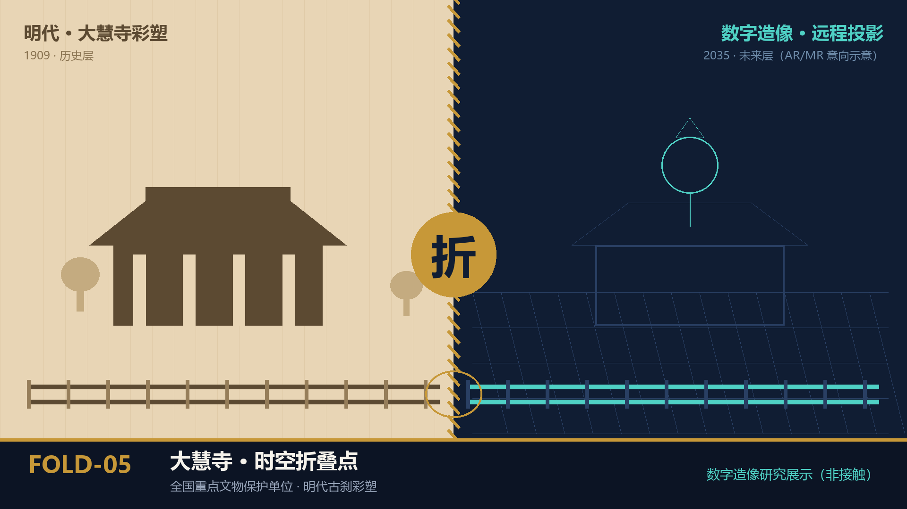

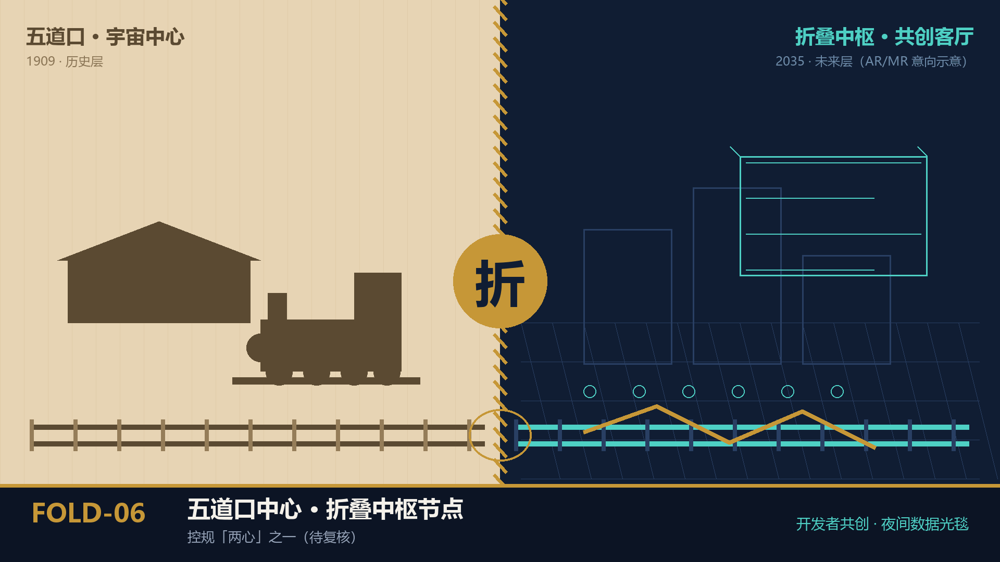

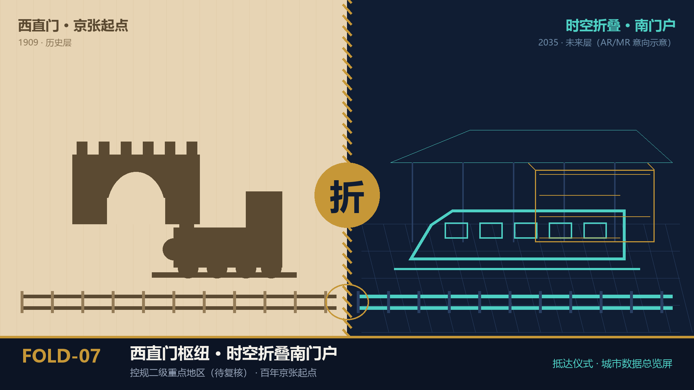

## Video Demo

Videos are organized into two categories: "Data-Flow Video" and "AI-Empowerment Video". Master specification: MP4 container (H.264 codec), resolution ≥ 1920×1080 (1080p), frame rate ≥ 30fps, AAC audio (44.1kHz, bitrate ≥ 128kbps), single file ≤ 200MB. Each video carries a standardized caption (unique identifier, exact duration, ≤150-word content summary, key timestamp markers) placed below the player. Both master clips have been delivered and registered in manifest.json.

### Data-Flow Video

- **Identifier**: VID-DATA-01; **Duration**: 00:30; **File**: `assets/media/vid-data-01-data-flow.mp4` (MP4 · H.264 High · 1920×1080 · 30fps · AAC 44.1kHz 128kbps · 7.2MB)
- **Content summary** (≤150 words): demonstrates the "sense-decide-act-feedback" data loop — sensing at 12 data nodes flows into the 1+3+N digital-twin base, is authorized through the Jingzhang Data Covenant three-tier lists and measured by the Algorithm Contribution Index, drives the 10 AI+ operation scenarios, and returns operational data to the base for iteration.
- **Key timestamps**: 00:00 opening — the city awakens in blue-hour light with three-tier scope orientation; 00:08 12 data nodes pulse into activation, data streams flow into the digital-twin base; 00:15 3D model assembles layer by layer and authorization halos unfold in the operations hall; 00:22 ten AI scenarios flash by (autonomous driving, AR wayfinding, etc.); 00:27 data streams converge back into a closed loop; 00:30 closing — the city's night settles.

### AI-Empowerment Video

- **Identifier**: VID-AI-01; **Duration**: 00:30; **File**: `assets/media/vid-ai-01-ai-empowerment.mp4` (MP4 · H.264 High · 1920×1080 · 30fps · AAC 44.1kHz 128kbps · 7.2MB)
- **Content summary** (≤150 words): an AR/MR experience walkthrough along the 7 time-space fold nodes — the 1909 history layer and the 2035 future layer overlay on the center-seam folding interface, with AI guides reviving historical narratives; heritage sites receive experiential overlays only, with no physical alteration; the video also connects the on-site empowerment effects of the 10 AI+ operation scenarios.
- **Key timestamps**: 00:00 opening — aged rails glow golden and unfold like origami into a luminous passage; 00:08 the seam of time-space opens, center-seam fold of two eras (1909 steam locomotive × 2035 maglev); 00:14 seven cultural anchors flash as AR holograms above the green corridor; 00:18 a 1909 engineer's hologram narrates history in the station hall; 00:22 rapid scene shifts — data-governance hall, laboratories, roadshow lounge; 00:27 the digital-twin base hovers in the night sky, seven anchors join into a star network; 00:30 closing — the glow fades into ten thousand household lights.

## AI Innovation Ecosystem, Talent Profiles and AI+ Scenarios

The proposal builds spatial-demand profiles for AI talent and enterprises — R&D offices, open-source collaboration, launches, enterprise services, housing, social learning, consumption, sports and international exchange — aligned with Art. 83 ("innovation cluster focused on AI, internet services and new media" and "smart, efficient, city-green interwoven, vitality-shared urban innovation blocks") [source:REGULATORY-PLAN-HD00-1601]. AI+ scenarios land on concrete layers with governance boundaries: public-space scenarios reference [data:geometry/public_space.geojson#PUBLIC-001], slow-mobility scenarios [data:geometry/roads.geojson#ROAD-001], open-space scenarios [data:geometry/green_space.geojson#GREEN-001] and [metric:public_space_ratio], [metric:green_ratio].

| User profile | Typical needs | Spatial response | Self-check boundary |
| --- | --- | --- | --- |
| Open-source developers (>70% young R&D staff in the Origin Community [source:THREE-ZONES-TWO-WINGS-RELEASE]) | Release, collaboration, testing, reputation | Fold Hub open-source launch hall, public code wall, night collaboration space | No personal trajectory collection; activity data aggregated only |
| Startup teams | Low-cost offices, computing access, testbeds | Xuebeiyuan shared testbed, edge-computing service points, standards & governance consulting | Computing and data services require separate authorization |
| Leading-enterprise visitors | Showcase, business, international reception, recruitment | Dazhongsi international roadshow lounge, rail-station connections, public space around key enterprises | Enterprise logos and cases must be rights-cleared |
| Nearby residents (plan baseline (pending registry) [metric:population_baseline]) | Commuting, leisure, community services, low-disturbance renewal | Heritage-park slow loop, community-lounge embedding, graded night lighting and events | Resident profiles never used for commercial recommendation |
| University faculty and students (9 plan-registered universities) | Tech transfer, cross-campus collaboration, daily slow mobility | Campus–park slow stitching, tech-transfer stations, AI education experience points | Campus data and research results require authorization |

| Scenario card | Spatial carrier | Description |
| --- | --- | --- |
| 01 Urban data sandbox | Xuebeiyuan | Vertical-model training on the national computing base; public-data authorization pilot (Covenant L3) |
| 02 Open-source launch hall | Beijing AI Origin Community | Launches, code-contribution showcase and mini-roadshows for universities, communities and startups |
| 03 Edge-computing station | Nodes across the overall design area | 1+3+N street-level node prototype combined with public services and low-carbon energy |
| 04 AI slow-mobility navigation | Heritage-park vitality belt | Explainable wayfinding and low-intrusion sensing for breakpoints, crowding and accessibility |
| 05 Dazhongsi international roadshow lounge | Dazhongsi AI Industry Cluster | Showcase, negotiation, media launch and international exchange for agent/terminal/content firms |
| 06 Demand-responsive & autonomous bus feeder | Rail stations and corridor nodes | Implements the plan's characteristic-bus clause (Art. 52) with AI-dispatched micro-circulation feeders, and reserves a vehicle-road coordination interface for unmanned delivery vehicles (pilot-testing nature) [source:REGULATORY-PLAN-HD00-1601] |
| 07 Adaptive public space | Xiaoyue River wing first | Plazas and streets auto-adjust lighting, seating and functions by footfall, weather and events; target ratio at [metric:adaptive_public_space_ratio] |
| 08 AI historical narration | 7 fold nodes | LLM-revived historical figures such as Zhan Tianyou as AI guides telling the centennial Jingzhang story |
| 09 Affective-computing public space | East-wing waterfront + community lounges | Senses crowd comfort **only via voluntary anonymous questionnaires, physical comfort buttons, and non-individual environmental/footfall statistics**, dynamically tuning environmental parameters, linked to AI+ elderly care (**no emotion inference from cameras, microphones, gait, voiceprints or other biometrics**) |
| 10 Embodied AI & AI healthcare pilots | Xiaoyue River waterfront | Echoing the official "smart-city testbed" positioning: AI+ livelihood, culture/entertainment and elderly-care applications [source:THREE-ZONES-TWO-WINGS-RELEASE] |

Three of these form the taskbook-required industry test-validation scenarios: card 01 Urban Data Sandbox (foundation-model and data-layer testing), card 05 Dazhongsi International Roadshow Lounge (agent and smart-terminal commercial validation), and card 10 Embodied AI & AI Healthcare Pilots (waterfront field validation); all three are test-validation in nature, not approved operations.

### Scenario Illustrations for the 10 AI+ Operation Links (Concept)

The following ten illustrations correspond one-to-one with the table above, drawn in the Fold Jingzhang visual system (deep-blue digital layer, gold fold glyph, teal data streams). Each card uses leader-line callouts to explain key spatial elements and AI functionality, with a bottom operation-flow strip expressing the "sense–decide–act–feedback" loop. These are concept illustrations, not site photographs; all AI uses respect the ethics and data-governance boundary, and heritage sites receive experience-overlay only with no physical alteration [depth:three_key_area_detailed_design].

| Link | Spatial carrier | Scenario illustration |
| --- | --- | --- |
| AI+01 Urban Data Sandbox | Xuebeiyuan | 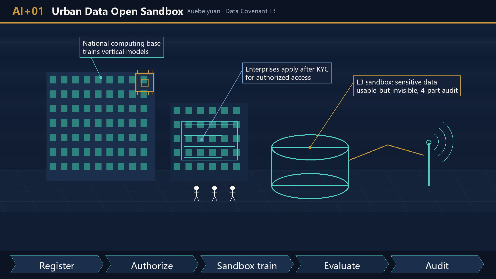 |
| AI+02 Open-Source Release Hall | Beijing AI Origin Community | 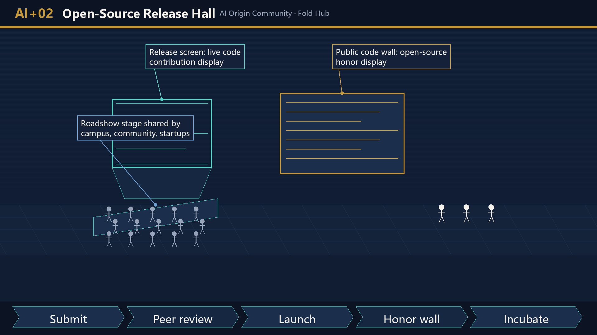 |
| AI+03 Edge-Computing Service Station | Corridor nodes | 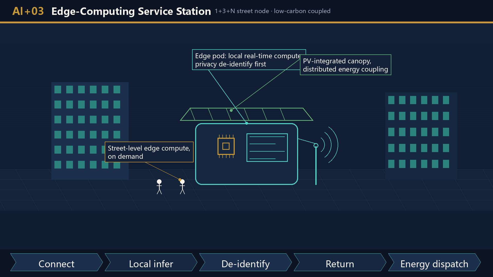 |
| AI+04 AI Slow-Mobility Navigation | Heritage park vitality belt | 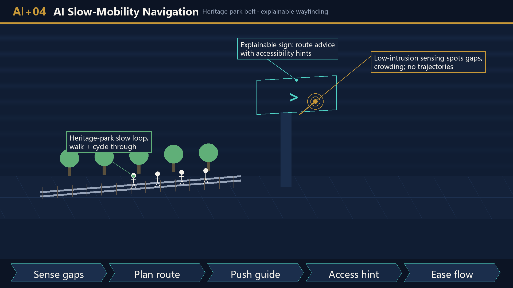 |
| AI+05 Dazhongsi Intl Roadshow Lounge | Dazhongsi AI industry cluster | 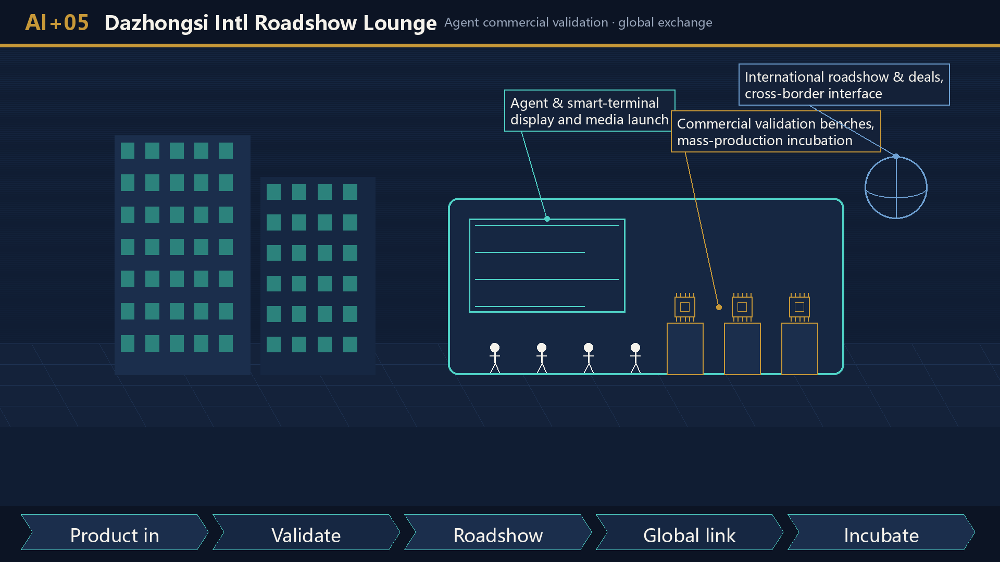 |
| AI+06 Demand-Responsive & Autonomous Shuttle | Rail stations & corridor nodes | 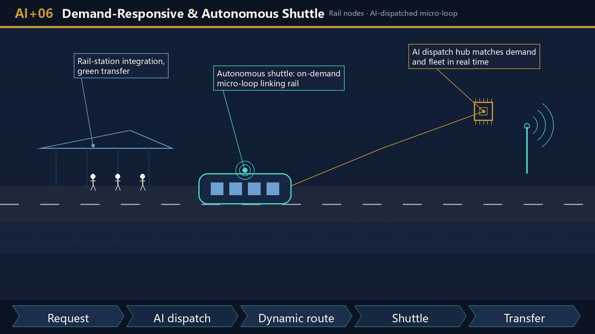 |
| AI+07 Adaptive Public Space | Xiaoyuehe scenario wing | 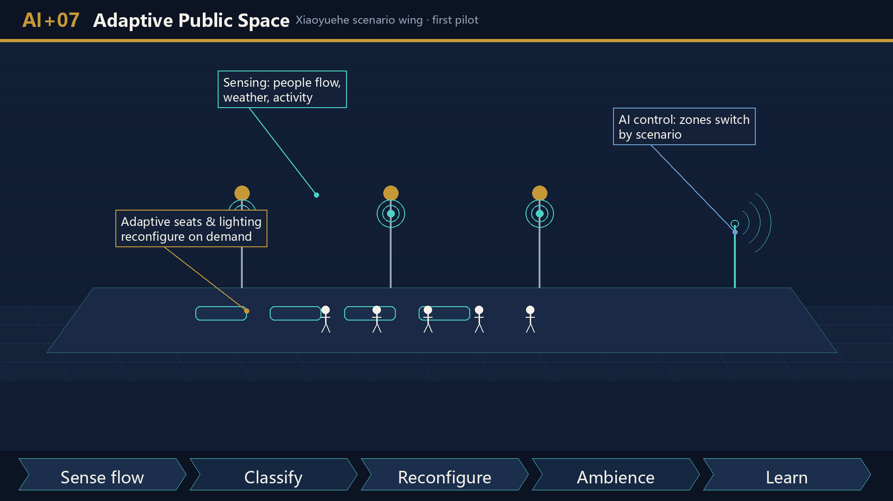 |
| AI+08 AI Historical Narrative | 7 time-space fold nodes | 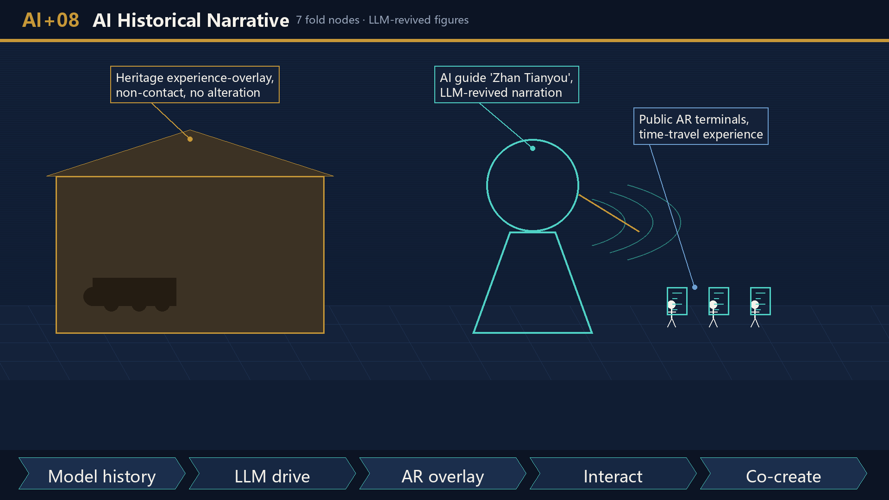 |
| AI+09 Affective-Computing Public Space | East waterfront + community lounge | 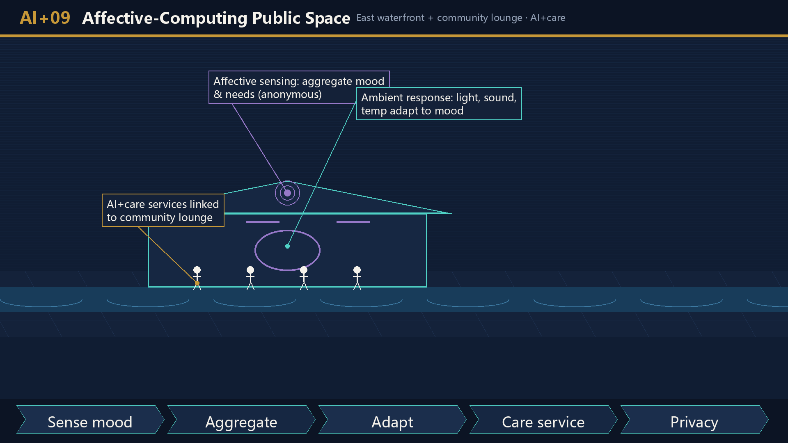 |
| AI+10 Embodied AI & AI-Medical Pilot | Xiaoyuehe waterfront | 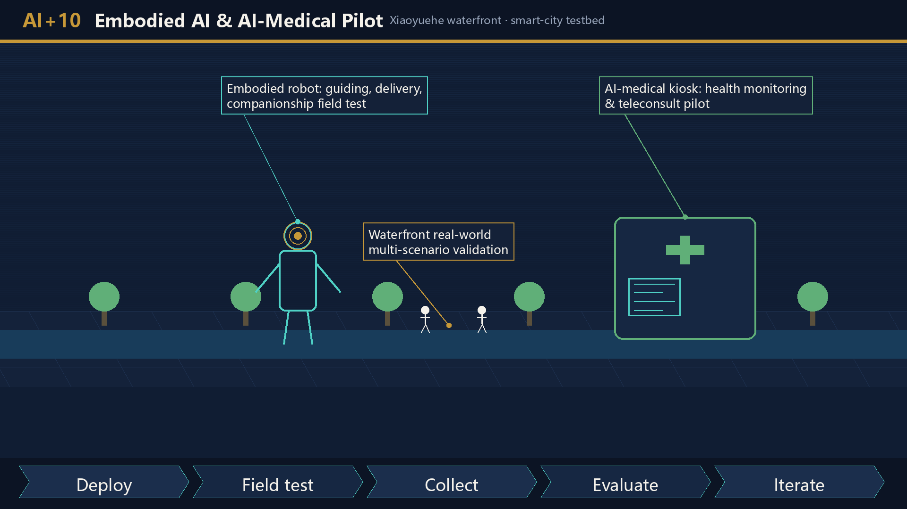 |

> **Benchmarking & optimization**: this scenario system was refined through international AI-district benchmarking (see `assets/media/comparative-analysis.md`), building differentiated advantages on heritage–innovation, data-element covenant and spatial editability.

### Originality Differentiation Matrix (item-by-item against international references)

To prevent benchmarking references from being misread as the source of this proposal's originality, the table below contrasts the four core mechanisms with the closest international practices, clarifying **which elements are borrowed and which are first-time combinations or original designs for the Jingzhang site** (comparison facts are mechanism-level summaries from public sources; full benchmarking in `assets/media/comparative-analysis.md` §0):

| Original mechanism | Closest international practice | First combination / original contribution of this proposal | Boundary statement (non-original parts) |
| --- | --- | --- | --- |
| Three-layer fold (heritage × digital-twin × experience layers) | Heritage regeneration with commercial inserts (e.g. King's Cross); standalone park digital twins | **First compression of the heritage fabric, a 1+3+N digital base and AR/MR experiences at 7 heritage anchors into one spatial coordinate system**, forming a "computable, perceivable, editable" three-in-one renewal paradigm; the layers are interfaces to each other, not parallel strata | Heritage regeneration and digital-twin components are mature practices; originality lies only in the three-layer coupling structure and coordinate-alignment method |
| Jingzhang Data Covenant three-tier list (L1/L2/L3) | Data trusts, data exchanges, regulatory sandboxes (each a single mechanism) | **First operationalization of a plan clause (Art. 82, pending registry) into an open/authorized/sandbox three-tier authorization list directly coupled to a spatial reward ladder (test-ground priority → showcase slots → rent-relief suggestions)**, closing the loop between data governance and spatial incentives | Tiered data authorization and sandboxes are established practice; originality lies in the implementable coupling of "plan clause → three-tier list → spatial incentives" |
| Algorithm Contribution Index + 30% small-team quota | Developer incentive programs, open-source leaderboards, innovation vouchers | **First "algorithms-for-data-access" allocation formula (call frequency × scenario weight × effect score × fairness correction) with a fixed 30% small-team quota, public-value weighting, scale-attenuation for incumbents, quarterly independent review and appeal channels**, turning equitable allocation of public data and spatial opportunity into auditable rules | Contribution metering borrows from open-source conventions; originality lies in the fairness-correction structure and the institutionalized anti-concentration clauses |
| Seven fold nodes under a zero-physical-intervention narrative system | Heritage digitization and AR guides (standalone applications) | **First anchoring of all fold nodes to the plan's heritage list at real positions under a unified zero-physical-intervention rule (no sensors inside protection zones, no nodes in no-build areas), translating heritage constraints into experiential assets via the "center-seam fold, two eras facing" visual language**; the heritage list becomes narrative capital rather than a limiting condition | AR/MR guiding is a mature application; originality lies in the trinity of heritage iron-rule × real coordinates × dual-era visual language |

**Boundary of the originality claim**: this proposal claims no invention of any single technology (digital twins, data sandboxes, AR guides, contribution metering); the originality claim is limited to **the combination, coupling interfaces and governance-oriented articulation of these four mechanisms on the Jingzhang site**, all of which are concept-stage design proposals, not delivered results.

### Closed Loops and Compliance Requirements for the 10 AI+ Operation Links

The table below resolves each of the 10 operation links into a verifiable "sense–decide–act–feedback" loop: it specifies the perceptual data source, decision actor, execution carrier and feedback channel, annotates the corresponding Data-Covenant tier (L1/L2/L3, plan basis Art. 82, pending registry) and the landing layer, and gives operational KPIs. All links are advisory operational suggestions — not government investment, approval or revenue commitments.

| Link | Sense (data source · tier) | Decide | Act (carrier · layer) | Feedback | Compliance / KPI |
| --- | --- | --- | --- | --- | --- |
| AI+01 Data Sandbox | enterprise-authorized data · L3 | sandbox admission + use registration | Xuebeiyuan compute base · [key_areas] | model results feed back to L1 aggregation | enterprise KYC, anonymization, audit log; KPI: registered_scenarios / API calls |
| AI+02 Open-Source Hall | community submissions · L1 | content review + scheduling | Origin-community hall · [buildings] | contribution feedback + credits | rights clearance; KPI: sessions, contributors |
| AI+03 Edge Station | node sensing · L2 | dynamic dispatch | street-layer light-pole/cabinet nodes · [public_space] | energy/uptime reporting | not height-zoned, off forbidden zones; KPI: uptime, anonymized volume |
| AI+04 AI Slow-Mobility | slow-mobility/congestion/accessibility sensors · L2 | explainable guidance | heritage vitality belt · [roads] | detour rate / satisfaction | anonymization ahead; KPI: gap-clearance rate |
| AI+05 Roadshow Lounge | enterprise listing · L1/L2 | commercial vs non-commercial triage | Dazhongsi quadrants · [public_space] | deal feedback | content filter, no over-commercialization; KPI: sessions, conversion |
| AI+06 Demand-Response Transit | OD demand · L2 | micro-loop dispatch | corridor nodes · [roads][phasing] | occupancy/headway feedback | plan basis Art. 52 (pending registry) characteristic bus; KPI: headway, connection |
| AI+07 Adaptive Public Space | flow/weather/activity · L1 | parameter adaptation | Xiaoyuehe waterfront · [green_space] | usage-linked tuning | 30% target; KPI: adaptive_public_space_ratio |
| AI+08 AI Historical Narration | visitor location/history DB · L1 | content routing + guide dispatch | 7 fold nodes · [public_space] | completion/likes loop | heritage overlay only, content clearance; KPI: narration reach |
| AI+09 Affective Public Space | group-emotion sensing · L1 | ambient-parameter tuning | east-wing waterfront · [green_space] | comfort feedback | no personal profiling (group-level); KPI: comfort score |
| AI+10 Embodied & Medical Pilot | trial-run data · L2/L3 | test admission + medical compliance | Xiaoyuehe · [key_areas] | results fed back | medical compliance ahead, test-validation only; KPI: pilot count |

**Common loop rules**: all sensed data is anonymized at the edge tier (within L2) before rising to L1 aggregation or the L3 sandbox; feedback channels connect to service providers to form the "experience—data—optimize—re-experience" positive loop. Every link traces back to a `geometry/` layer and a Data-Covenant compliance requirement, checkable item-by-item via the compliance matrix.

### Concept-Stage Governance Table (AI+06 / AI+09 / AI+10 / Algorithm Contribution Index)

The table below provides operational governance design for the four high-sensitivity links involving mobility safety, affect sensing, medical health and resource allocation. **All performance and deployment capabilities listed are to-be-tested items**: this proposal only sets out a governance framework and process design; flow diagrams must not be read as evidence of full deployment readiness. Before any link enters an on-site pilot, data-protection and ethics impact assessment, accessibility testing, safety review, public notice and independent professional sign-off must be completed.

| Governance item | AI+06 Demand-Response Transit & Shuttle | AI+09 Affective Public Space | AI+10 Embodied & Medical Pilot | Algorithm Contribution Index (allocation) |
| --- | --- | --- | --- | --- |
| Currently permitted data sources | existing dispatch-system operating data; aggregated passenger counts after stop-side notice | **ONLY**: ① voluntary anonymous questionnaires (no identification); ② physical comfort buttons on site (aggregate counts, no individual tag); ③ environmental sensing that forms no individual record (temperature/humidity, noise, illuminance) and count-only footfall (person-times, no individual recognition) | trial data within the scope of signed volunteer informed consent | aggregated statistics of platform model-call logs |
| Collection prohibited | unauthorized roadside imagery; individual school-route trajectories | **emotion inference from cameras/microphones/gait/voiceprints/faces and any other biometrics; individual-level emotion data; individual mental-health inference; medical inference** | clinical records entering city systems; health monitoring without consent | personal attributes irrelevant to contribution (gender, ethnicity, household status, etc.) |
| Inference prohibited | individual travel-identity profiling; rider-status inference beyond accounts | individual mental-health status; employment/credit linkage | diagnostic conclusions without licensed confirmation | social-graph contribution prediction; cross-scenario profile merging |
| Minimal dataset | aggregated OD matrix (≥50), headway, section flow | group density and aggregated comfort (no individual records) | trial data under volunteer informed consent, anonymized on site | three aggregated values: call count, scenario weight, effect score |
| Human review | manual takeover of dispatch anomalies and safety events (remote safety operator onboard) | operator confirms parameter changes | all outputs reviewed by licensed physicians; AI advisory only | quarterly committee confirms ranking and rewards |
| Public opt-out | stop-side notice + one-touch switch to human-driven service | entrance notice + physical opt-out button (exits sensing) | volunteers may withdraw in writing anytime with data deletion | enterprises may exit the ranking for a fixed base quota |
| Misjudgment fallback | dispatch failure reverts to manual scheduling and existing bus lines | failed tuning restores default comfort within 30s | AI–physician disagreement forces the manual pathway with logging | anomalous index movement triggers review and suspends allocation |
| Retention | aggregated OD 12 months; no individual-level storage | aggregated metrics 6 months; raw sensing deleted same day | trial data for pilot + 6 months, then deleted | contribution records 24 months, then aggregated stats only |
| Appeals | operator hotline + district transport referral | venue manager, on-site and online channels | pilot ethics committee + hospital complaint channel | committee reconsideration + public-notice objection window |
| Fairness correction | coverage tilts to older estates and accessibility needs | parameter policy published; public comment before major changes | open, published pilot recruitment | see "inclusive service matrix": open-source/public-value weighting + small-team reserve |
| Stop conditions | major safety incident or two consecutive months below headway target | negative feedback above threshold or upheld complaint | ethics-committee majority veto or unlicensed medical act | data fraud or unresolved allocation dispute freezes the index |

The governance table executes jointly with the "ethics and data governance" boundary and the covenant's three-tier lists: prohibitions enter the covenant negative list, retention terms enter the data life-cycle clause, and stop conditions enter each link's operations plan. All governance design is a concept-stage suggestion; formal implementation follows the laws, regulations and competent-authority requirements in force at the time.

### Inclusive Service Matrix (concept stage)

Inclusion goes beyond "user personas + technical responses": the table below provides equivalent service paths for children, older adults, persons with disabilities, people with low digital literacy, and those unwilling to use smart terminals — **every AI scenario has an offline equivalent reachable without a smart terminal**, with AI and offline channels maintained as mutual backups of equal standing. Accessibility compliance is verified by manual inspection and participatory testing with users with disabilities; **machine vision or AI assessment must not replace human verification**.

| Group \ Service | Wayfinding (AI+04/08) | Transit (AI+06) | Event booking (annual activity system) | Public-space tuning (AI+07/09) |
| --- | --- | --- | --- | --- |
| Children | parent-led paper exploration maps + fold-node stamp booklets | fixed-shuttle service (no booking needed) | guardian booking + on-site waitlist | physical play equipment fixed on during activity hours |
| Older adults | on-site docents (weekends full coverage) + large-print guide leaflets | one-touch phone booking + hail-and-ride shuttles | community-hall manual desk + phone booking | default comfort parameters with elder lighting and seating |
| Persons with disabilities | tactile maps + sign-language video terminals + Braille signage | accessible-vehicle phone booking + standardized driver assistance | priority on-site window + companions exempt from booking | accessibility parameter tier (ramp alerts, caption screens) via manual trigger |
| Low digital literacy | staffed inquiry kiosks | full transit-card/cash compatibility | community-volunteer booking assistance | service desk collecting tuning suggestions |
| Smart-terminal-unwilling | non-digital signage retained at all fold nodes | posted route maps + paper timetables | walk-up registration with no vacancy barrier | suggestion box + quarterly on-site forums feeding the tuning agenda |

Execution requirements: ① each operations plan must include an "offline equivalent path" section with budget and staffing; ② each path undergoes at least annual participatory acceptance with the group concerned; ③ offline-channel usage data never enters personal profiles and is counted as service volume only.

### Participatory Co-Design Plan (concept-stage method, not existing evidence)

This proposal is at concept stage: **no on-site public co-design or user testing has been conducted yet, and no participatory outcomes are claimed**. To let the public-interest design be validated by real people at pilot stage, an executable, verifiable co-design plan is pre-registered as a precondition for P1/P2 pilot initiation — not as an existing commitment:

| Participation link | Target groups | Method | Output & verification | Trigger point |
| --- | --- | --- | --- | --- |
| Slow-mobility & accessibility breakpoint walkthrough | Disabled people, older people, children & parents | Participatory walkthrough + accessibility diary (manual records, no personal trajectories) | Revised breakpoint list, co-signed by disabled users and accessibility experts | Before JZ-01 slow-mobility pilot initiation |
| Demand-responsive transit commuter survey | Corridor residents, commuters, low-digital-literacy groups | Voluntary anonymous questionnaire + paper forms at community lounges + phone interviews | Route/headway proposal; original anonymous records archived for audit | Before AI+06 field pilot (must precede any data collection) |
| Public-space tuning preference workshop | Nearby residents, event organizers | Offline workshop voting + parameter preference cards (group-level, no personal profiles) | AI+07/09 tuning-parameter baseline; minutes published | Before AI+07/09 field deployment |
| Heritage narrative co-creation | Heritage volunteers, railway-culture researchers, nearby schools | Narrative-script co-creation workshop + rights-clearance review | Cleared AR/MR narrative scripts; co-creator attribution and license records | Before JZ-06 heritage experience enters content production |
| Offline-equivalent-path acceptance | Representatives of the five inclusive groups | Annual participatory acceptance (see inclusion matrix) | Acceptance report and rectification list | At least annually after each offline path opens |

Compliance boundaries of co-design: ① all participation is **voluntary, informed and withdrawable** — no default opt-ins, no biometric capture, no personal profiles; ② outputs (breakpoint lists, route proposals, parameter baselines, narrative scripts) serve design calibration only and constitute no government approval or implementation commitment; ③ before any on-site recruitment, a public-notice plan and the necessary ethics/safety assessment must be completed (see condition-triggered items); ④ participation records are kept minimal and anonymized after acceptance.

**Minimum viable execution parameters (recommended values, not commitments)**: so that the table above can be converted directly into execution plans at pilot initiation, the minimum viable scale and suggested responsible actors for each link are pre-registered —

| Participation link | Minimum viable sample | Venue & materials | Suggested responsible actor | Relative phasing |
| --- | --- | --- | --- | --- |
| Slow-mobility & accessibility breakpoint walkthrough | ≥12 people (4 disabled, 4 older, 4 children & parents), two half-day sessions | Heritage-park pilot segment; experience diaries, fold-node stamp booklet, first-aid and escort staffing | Implementation team + local disability/elderly associations for invitation | P1 (one month before JZ-01 initiation) |
| Demand-responsive transit commuter survey | ≥200 valid anonymous questionnaires (half online, half offline) | Community lounges + anonymous online form; questionnaire passes a light ethics review | Implementation team + sub-district communities for distribution | P1 (before any AI+06 data collection) |
| Public-space tuning preference workshop | ≥20 people × 2 sessions (residents and event organizers separately) | Xiaoyuehe waterfront on site or community lounge; parameter preference cards, voting stickers | Implementation team + residents' committees | P2 (before AI+07/09 deployment) |
| Heritage narrative co-creation | ≥10 people (heritage volunteers, researchers, school teachers & students) | Qinghuayuan Station site or online; script templates, rights-clearance review forms | Implementation team + heritage-authority guidance | P2 (before JZ-06 content production) |
| Offline-equivalent-path acceptance | ≥3 people per group, annually | Each offline path on site; acceptance checklist (below) | Implementation team + third-party accessibility experts on sample checks | Annually from P1 |

**Participatory accessibility acceptance checklist (recommended items)**: each annual acceptance of an offline-equivalent path covers at least — ① physical accessibility (slope, width, tactile-path continuity, manually measured); ② information accessibility (signage font size/contrast, Braille, sign-language video usability, tested on site by the corresponding groups); ③ service accessibility (staffed window / phone line tested for connection and response); ④ exit and appeal channels (suggestion box and published contact findable on site). Acceptance is performed and signed jointly by disabled users and accessibility experts — **machine vision or AI assessment never substitutes for human verification**; the physical environment references public technical standards such as the *Code for Accessibility Design* as method references only (not a compliance certification).

**Feedback loop for participation outputs**: every co-design output must receive a published disposition record within 30 days — breakpoint lists → revise JZ-01 stitching priorities and the slow-mobility layer; commuter questionnaires → revise AI+06 route/headway proposals (with reasons recorded for any unadopted item); parameter workshops → written into the AI+07/09 tuning-parameter baseline with the source session annotated; narrative scripts → enter the JZ-06 content library after rights clearance with co-creator attribution kept; acceptance issues → enter the next year's rectification list and are closed out item by item in the annual operations report. All feedback records are public operational documents, subject to quarterly review-committee spot checks.

**Participation support and incentive boundaries**: participant transport and lost-work subsidies, accessibility escorts, sign-language interpretation and childcare are listed as recommended budget items of each pilot's operations budget (not a government investment commitment); participation carries no commercial-conversion conditions; authorship of co-created content remains with its creators, and the scope of authorization is recorded in written license forms.

### Consistency Check: Alignment with the Action Plan on Deepening Smart-City Development and Advancing Whole-Territory Digital Transformation (participant-submitted, pending registry)

This section reports the **consistency-check result** between the Folding Belt scenario design and the *Action Plan on Deepening Smart-City Development and Advancing Whole-Territory Digital Transformation* (five ministries: NDRC, National Data Administration, Ministry of Finance, MOHURD, MNR; November 2025): after item-by-item comparison, the 10 AI+ operation links are directionally consistent with the Action Plan across five dimensions — scenario classification, general principles, urban digital base (infrastructure / data resources / intelligent hub), scenario structure, and operation mechanism [source:DIGITAL-RENEWAL-GUIDELINE]. **This document is participant-submitted and pending source-registry review, so the check is only the participant's self-review against the public text — it is not an organizer-verified consistency conclusion and does not claim "full alignment" with the Action Plan.**

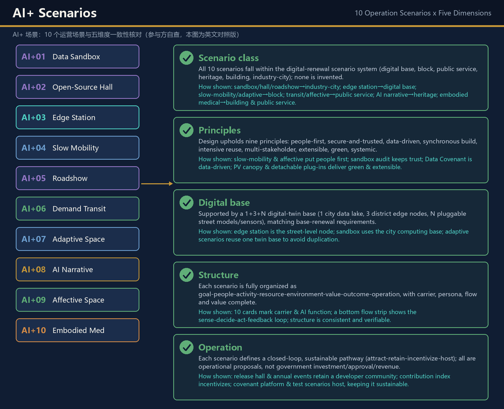

| Check dimension | Consistency-check conclusion (participant self-review) |
| --- | --- |
| Scenario classification | All 10 links fall within the Action Plan's digital-renewal scenario system (digital base, comprehensive block, public-service facilities, heritage, existing building, industry-city integration); no off-standard invented scenario |
| General principles | Link design follows the Action Plan's principles: people-first, secure-and-trusted, data-driven, synchronous build, intensive reuse, multi-stakeholder, extensible upgrade, green low-carbon, systemic coordination |
| Digital base | The 1+3+N digital-twin base, edge-computing nodes and Data Covenant match the Action Plan's renewal requirements for the urban digital base (infrastructure, data resources, intelligent hub) |
| Scenario structure | Each link is organized as "goal–people–activity–resource–environment–value–outcome–operation," consistent with the Action Plan's recommended scenario organization |
| Operation mechanism | Each link defines an operation loop and sustainable pathway; all are operational proposals only and do not constitute government investment, approval or revenue commitments |

**Check conclusion**: the Folding Belt scenario system is directionally consistent, structurally compatible and operationally connectable with the national digital-transformation Action Plan, and can serve as a conceptual reference for applying the Action Plan to AI-innovation-district scenarios (the document is participant-submitted and pending registry; this is a participant self-review and not an organizer-verified consistency finding). All AI uses also respect this proposal's "Ethics and Data Governance" boundary.

### Ethics and Data Governance

Sensing data is processed locally (de-identified inside district edge nodes before uplink); public notice and opt-out mechanisms (scenario nodes disclose collection scope and purpose, with physical opt-out channels); algorithm auditing and bias detection (fairness assessment inside the Algorithm Contribution Index review). Urban agents may assist in identifying slow-mobility breakpoints, public-space heat, facility maintenance, enterprise-service demand and event-safety risks, but cannot replace planning approval, cannot output unauthorized personal profiles, and cannot claim government implementation commitments. All AI scenario nodes enter structured layers or the compliance matrix so reviewers can verify their relation to industry, space and public interest.

## Land Use, Building Scale and Retain-Renovate-Demolish Plan

Land use follows public standards for territorial-space survey, planning and use-control classification [standard:MNR-LAND-USE-CLASSIFICATION-GUIDE], forming complete, closed, seamless zoning [data:geometry/land_use.geojson#LU-001]. Buildings are classified as retained / renovated / renewed / new; height, massing, interface and character controls are governed by [depth:height_massing_character]; the retain-renovate-demolish method is governed by [depth:retain_renovate_demolish] and aligned with the plan's "retain, renovate, demolish, supplement" strategy (Art. 84) [source:REGULATORY-PLAN-HD00-1601]. Over 50% of stock residential land is pre-2000 old residential compounds (Art. 39); their plan renewal path (pending registry) is multi-channel advancement by district platforms and central/SOE vehicles, green-building retrofitting and smart-community upgrading, with which the Folding Belt's AI+ elderly-care and adaptive public-space scenarios are packaged first.

**Scale ceiling check**: under no scenario may total floor area exceed the plan ceiling of 24.08 million sqm [metric:total_floor_area_ceiling_sqm] (Arts. 7/13); the plan FAR baseline is 14,632 sqm/ha (~1.463, 24.08 million sqm ÷ 1645.6 ha urban construction land, formula and plan basis annotated) [metric:statutory_floor_area_intensity]; building footprint ratio within the submitted site [metric:floor_area_ratio]. Population and employment simulation baselines use plan-text values (pending registry): ~364,000 residents [metric:population_baseline] and ~397,000 jobs [metric:employment_baseline]. For parcel-level height, intensity and setback indicators — unreadable because the plan charts are not digitized — all conclusions are marked "subject to confirmation of official chart conditions" and never presented as approved values (registered in `assumptions.json`).

## Transport, Rail, Municipal and Public-Service Facilities

Transport aligns with plan clauses: rail-station integration control (Art. 36) and rail micro-centers (appropriately higher development intensity and mixed use, Art. 37), the "rail + green transfer" system (Art. 51), and demand-responsive/autonomous characteristic buses (Art. 52, embedded in scenario card 06) [source:REGULATORY-PLAN-HD00-1601] [depth:traffic_rail_slow_parking]. Focus covers the North 5th Ring Road, heritage-park ring-road crossings, Wudaokou, Qinghua East Road West Entrance, Dazhongsi station and links around key enterprises; road and slow-mobility layers stay inside the submitted boundary and are cross-checked with public space, green space and industry nodes [data:geometry/roads.geojson#ROAD-001] [data:geometry/public_space.geojson#PUBLIC-001].

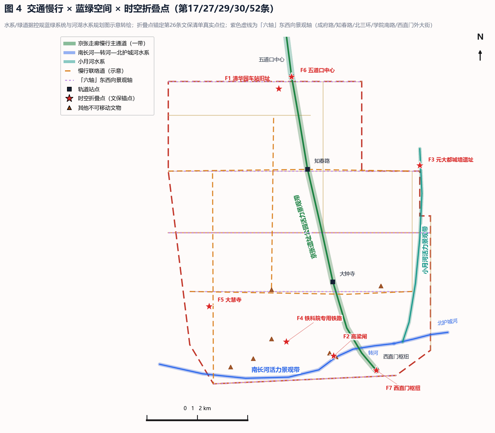

Municipal and public-service facilities implement the plan's special coordination: storm-sewage separation (100% storm-drain coverage in built-up areas by 2035, Art. 58), distributed PV (Art. 60), and multi-network fused 5G (Art. 63), integrated with the Folding Belt new infrastructure (distributed energy, edge computing, edge nodes) [depth:municipal_new_infrastructure]. Sponge-city management follows the plan annual-runoff-capture zoning (≥85% along waterfronts and the heritage-park corridor, 75–85% in transition zones, 65–75% in general built-up areas, per Art. 67 and the sponge-city plan map); the Folding Belt stormwater detention nodes are sited first where the ≥85% zone meets blue-green corridors. Facility standards, service radii, operation models and phasing logic are stated; missing engineering data — pipelines, energy, drainage, flood control (South Long River–Zhuan River and North Moat at 100-year, Tucheng Gou at 50-year, Art. 27), fire protection — are listed as preconditions for formal deepening [data:geometry/constraints.geojson#CONSTRAINTS].

## Blue-Green Space, Public Space and Urban Character

Blue-green space implements the plan "three belts, six axes, multiple corridors and centers" landscape structure: the three vitality landscape belts of the Jingzhang Railway Heritage Park, South Long River and Xiaoyue River (Art. 17) [source:REGULATORY-PLAN-HD00-1601] [depth:blue_green_public_space]. With the heritage-park vitality belt as the backbone, the proposal delivers a north–south through, east–west connected system of walkways, bikeways and green space, identifying slow-mobility breakpoints, ring-road crossings and the park's north/south gateway nodes [data:geometry/green_space.geojson#GREEN-001] [data:geometry/public_space.geojson#PUBLIC-001]. Recalculable green and public-space ratios are given at [metric:green_ratio] and [metric:public_space_ratio] respectively.

Public space implements the plan garden-city scenes (Art. 33), 8 community lounges (5-minute walking circles, Art. 38), the four-tier recreation system (specialty parks, composite public spaces, community parks, pocket parks, Art. 29) and the three-level greenway network (city–district–community, Art. 30); the Folding Belt adaptive public spaces are tested first at community lounges and pocket parks. Urban character follows the four plan character zones (innovation core, university research, livable residential, waterfront vitality, pending registry) and five street-type controls, fusing Jingzhang railway culture, Zhongguancun innovation culture and AI innovation culture [standard:MOHURD-URBAN-DESIGN-MEASURES]. The AI pilgrimage-landmark system = 7 fold nodes + the "折" (fold) visual symbol + the Algorithm Contribution honor wall (names displayed only with consent); all brands, fonts, images, portraits and enterprise logos are rights-cleared; character controls distinguish plan controls (pending registry), design suggestions and to-be-confirmed conditions, with no pseudo-precise control lines.

AI public-space component library (modular, detachable, reusable "AI city plug-ins"): ① edge-computing stations (street-level node cabins); ② detachable AR guide pillars (fold-node narrative terminals, never intruding into heritage control belts); ③ adaptive seating and lighting units (adjusting to footfall and weather); ④ public code-contribution walls (open-source honor interface); ⑤ Data Covenant service kiosks (authorization applications, purpose registration, audit queries); ⑥ slow-mobility information signs (explainable wayfinding and accessibility hints). All components use temporary-facility status, standardized interfaces and a unified style manual, ready for professional teams to deepen into a construction-grade product family.

## Renewal Project List, Implementation Policy and Phasing

The project list aligns with the plan's implementation strategy and adaptive provisions (Arts. 84–88: floor management for the three major facility types, green plazas and water areas; park green plazas may shift position and shape within dominant-function zones; branch-road alignments may be optimized) [source:REGULATORY-PLAN-HD00-1601] [depth:renewal_project_list] [depth:phasing_implementation]; phasing geometry at [data:geometry/phasing.geojson#PHASE-001].

| ID | Project | Type | Key dependencies | Evidence |
| --- | --- | --- | --- | --- |
| JZ-01 | Heritage-park slow-mobility breakpoint stitching | Public space / transport | Road redlines, under-bridge space, traffic review | [data:geometry/roads.geojson#ROAD-001] |
| JZ-02 | Xuebeiyuan data sandbox & Qinghe innovation interface | New infrastructure / blue-green | Computing-base carrier, river blue line, ecology & flood control | [data:geometry/green_space.geojson#GREEN-001] |
| JZ-03 | Origin Community Fold Hub & near-campus tech-transfer street | Urban renewal / industry services | Campus boundary, ownership, ground-floor uses | [data:geometry/buildings.geojson#BLDG-001] |
| JZ-04 | Dazhongsi station four-quadrant pedestrian connection & data-asset trading lounge | Rail integration / slow mobility | Rail station, intersections, municipal pipelines | [data:geometry/public_space.geojson#PUBLIC-001] |
| JZ-05 | 1+3+N digital-twin base & edge-computing nodes | New infrastructure / public services | Energy, computing, security, operating entities | [data:geometry/public_space.geojson#DATA-001] |
| JZ-06 | AR/MR experience works at 7 fold nodes | Culture-tech / operation | Heritage-authority approval (overlay only), site & event safety authorization, content clearance | [data:geometry/public_space.geojson#FOLD-001] |
| JZ-07 | Jingzhang Data Covenant operation platform | Data elements / governance | Art. 82 implementation path, enterprise KYC and audit | [metric:data_covenant_coverage_ratio] |
| JZ-08 | Global AI Week public route | Operation / branding | Public-space permits, event safety, copyright clearance | [data:geometry/phasing.geojson#PHASE-001] |

Phasing is distinguished from the 100-day competition period: near-term pilots (JZ-01, JZ-06, JZ-08 — lightweight facilities and operations first), mid-term renewal (JZ-02–JZ-05 — pending official charts, municipal, transport and ownership conditions), long-term governance (JZ-07 — iterative Data Covenant operation). Three operating mechanisms: data-asset registration and trading (AI firms trade algorithm contributions for data-use rights), the Urban Algorithm Contribution Index (city-optimizing models receive policy or spatial rewards), and time-space narrative co-creation (open historical-data interfaces encouraging AI games, films and art on Jingzhang history) — all operational proposals with explicit responsibility boundaries, conversion paths and risks, not government event commitments.

### Renewal Project Implementation Deepening

On top of the project list, each project is specified by spatial action, plan-clause linkage, phase and core compliance constraint, moving projects from "card level" to "implementable level." Phases are near-term pilot (P1), mid-term renewal (P2) and long-term governance (P3), consistent with phasing.geojson.

| ID | Spatial action (deepened) | Plan linkage | Phase | Core constraint / risk control |
| --- | --- | --- | --- | --- |
| JZ-01 | Stitch walk/cycle gap, activate under-bridge space, review crossing widths; wayfinding guides N-S flows | Art. 21 corridor "N-S through" slow-mobility | P1 | Traffic review only until redlines released; no permanent works |
| JZ-02 | L3 sandbox on the national compute base; Qinghe blue-green interface; flood/eco corridor | Art. 82 + river/blue-green clauses | P2 | Implement after river blue-line and 100/50-yr flood conditions confirmed |
| JZ-03 | Campus–park–block slow-mobility stitch, ground-floor tech-transfer street, fold-hub lounge | Art. 9 two centers; Art. 14 intensity | P2 | Ground-floor use guidance only until campus boundary/ownership confirmed |
| JZ-04 | Dazhongsi four-quadrant connection, data-asset trading carrier renewal, crossing islands | Art. 9 two centers; Arts. 21–23 key areas | P2 | Station/pipeline conditions confirmed by owner entities |
| JZ-05 | Edge nodes reuse light-poles/cabinets, street-level adapter prototype | Art. 82 operation system | P2 | Modal facilities not height-zoned; off forbidden basement areas |
| JZ-06 | AR/MR overlay works at 7 fold nodes, narration co-creation platform | Art. 26 list + Arts. 21–23 | P1 | National/municipal heritage overlay only, zero physical change; ahead of implementation, obtain heritage approval and site & event safety authorization, and re-verify the no-physical-intervention boundary per approval conditions |
| JZ-07 | Data Covenant platform (3-tier list, enterprise KYC, audit log) | Art. 82 market-based data | P3 | Advisory index, not government approval |
| JZ-08 | Global AI Week public route facilities (temporary pavilions, modular seating, evacuation) | Art. 88 adaptive provisions | P1 | Safety & rights clearance ahead; removable facilities |

### Three Key-Area Design Deepening

Supplementary to the "Key Area Detailed Design" positioning:

**(1) Xuebeiyuan AI Independent-Innovation Accelerator (Data Origin)**: garden-type layout; the Qinghe waterfront is the public interface; "computing & data sandbox" clusters at the industry core, ringed by R&D and talent-apartment transition belts. Key controls: L3 sandbox data usable-not-visible; strong ecology and flood mitigation; low-carbon rotating exchange spaces regulate microclimate.

**(2) Beijing AI Origin Community (Fold Hub)**: the Qinghuayuan Station site forms the narrative start at the main fold node; a near-campus slow-mobility spine hosts a tech-transfer street; block-level shared lounges carry developer co-creation. Key controls: no physical intervention with heritage; AR/MR overlay only; before campus boundary is confirmed, ground-floor use guidance substitutes for spatial demolition.

**(3) Dazhongsi AI Industry Cluster (Exchange Port)**: four-quadrant pedestrian connection centered on the station; the data-asset trading carrier reshapes the city-type intelligent-economy front; the station plaza serves global exchange and circulation. Key controls: rail integration preserves the station building; crossing slow-mobility safety outranks vehicle throughput.

Three-area depth is bound by [depth:three_key_area_detailed_design] with geometry at [data:geometry/key_areas.geojson]; Xuebeiyuan is a strategic-study-scope object, its regulatory-depth placement consistent with A-SCOPE-NESTED-001.

### Annual Event System, Brand Communication and Conversion Pathways (operational suggestions)

| Season | Event brand (proposed) | Content design | Conversion pathway |
| --- | --- | --- | --- |
| Spring | Jingzhang Data Covenant Open Day | L2 authorization intake, data-element compliance training, enterprise KYC service week | Enterprise users → covenant members |
| Summer | Fold-Jingzhang Global AI Innovation Week | Developer conference, fold-node AR narration season, test-validation open week | Developers → open-source projects → startup onboarding |
| Autumn | Algorithm Contribution Index Annual Review | Annual index release, honor-wall unveiling, showcase of deployed city algorithms | High contributors → testbed priority and showcase slots |
| Winter | Centennial Jingzhang Narration Season | 1909 opening commemoration, AI historical-narration co-creation, public time-travel month | Participants → content co-creators → communication nodes |
| Recurring | Monthly open-source launch roadshows + quarterly scenario open days | Premieres, mini-roadshows, booked scenario visits | Audience → community members → contributors |

The brand and communication visual system reuses the "折" symbol and center-seam fold composition, extended into four seasonal color variants under one identity. International communication runs through an English annual ecosystem report, international fold-node tours, open-sourced case libraries and twinning exchanges with global innovation districts (conceptual suggestions); all follow-up conversion paths for talent, enterprises and developers are listed in the right-hand column, closing the long-term loop of "event attraction → community retention → index incentive → spatial carrying", without constituting government event arrangements or investment commitments.

### Implementation and Operation Landing Path

**Phased implementation sequence** (aligned with plan Arts. 84–88, phases consistent with phasing.geojson): P1 near-term pilots focus on lightweight, reversible, low-intervention targets — JZ-01 slow-mobility stitching, JZ-06 fold-node AR/MR overlay, JZ-08 event-week temporary facilities — validating "experience as operation"; P2 mid-term renewal awaits official charts, municipal, transport and ownership conditions for JZ-02–JZ-05 spatial works and node-network rollout; P3 long-term governance centers on the JZ-07 Data Covenant platform, iterating as the data-element institution matures. The P1→P2→P3 progression depends on "condition maturity" rather than fixed durations, avoiding irreversible works before plan charts and ownership are confirmed.

**Land mixed-use and function conversion (positive-list management)**: facing ~10 million sqm of stock space and the 100万 sqm renewal carrier, function conversion follows the national urban-renewal "positive list" — only converting low-efficiency industrial, warehousing and old offices toward encouraged directions (sci-tech, cultural-creative, public services, affordable housing), never toward negative directions such as high-density housing or excess height. Mixed use uses the 75 dominant-function zones as its ledger; new functions must not conflict with the dominant function, and height/intensity strictly respect the 6 base height classes and tier-5 intensity zones.

**Renewal project library "entry–exit" management**: the project library is the implementation handle; JZ-01–JZ-08 register condition maturity (preconditions, suggested responsible entities, phase flags); projects meeting plan-chart, ownership, municipal and heritage-approval preconditions are flagged "implementable" to exit into the implementation sequence, while unqualified ones stay in-libary with pending items noted (per assumptions such as A-REGPLAN-DRAWINGS-001). The library rolls forward across the 5-year transition, closing a "reserve–convert–implement" loop.

**CIM digital base and physical-examination assessment**: the 1+3+N digital-twin base connects to CIM, building a full-cycle "planning–construction–operation" digital archive; annual physical-examination assessment supports renewal-action adjustment — examination feedback (slow-mobility gaps, public-space heat, covenant coverage, adaptive-space share, Algorithm Contribution Index) feeds back into library prioritization and spatial-design iteration, operationalizing the Art. 83 intelligent-city-operation monitoring orientation.

## Alignment with the National 15th Five-Year Urban-Renewal Plan and Policies

This section aligns the Folding Belt with the national 15th Five-Year Urban-Renewal Plan, the national guiding opinion on sustained urban-renewal action, and the national urban-renewal planning guide, keeping the proposal consistent with the country's top-level urban-renewal guidance in guiding thought, strategic objectives, key tasks and implementation requirements [source:CITY-RENEWAL-15TH-PLAN] [source:CITY-RENEWAL-ACTION-OPINION] [source:CITY-RENEWAL-PLANNING-GUIDE].

### Key-Domain Alignment

| National key domain | Core requirement | the Folding Belt alignment design |
| --- | --- | --- |
| Spatial-layout optimization | Structural optimization, functional improvement, mixed land development and lawful use conversion, positive list | Plan "belt-axis-two-centers-nodes" structure; low-efficiency opportunity spaces identified from the 75 dominant-function zones; use conversion per positive list |
| Heritage protection & inheritance | Survey-before-build, "no more demolition of the old town", no fake-rebuild, activation without over-commercialization | All 7 fold nodes anchored to the plan heritage list (pending registry), AR/MR experience-overlay only with no physical change; AI narration is "protection through use", commercialization strictly limited |
| Infrastructure renewal | Underground pipelines & lifeline safety, dual-use (normal/emergency), new urban infrastructure, CIM digital base | 1+3+N digital-twin base links to CIM; edge stations reuse existing poles (intensive reuse); flood control per plan 100-/50-year standards |
| Eco-environment improvement | Restore urban ecosystems, sponge city, green low-carbon transition, slow mobility | "Three belts, six axes" blue-green structure; runoff-capture zoning; PV integration; connected green slow-mobility |
| Industrial transformation | Cultivate new quality productive forces, old-factory conversion, first-launch/silver/low-altitude/experience economies | Three-zone vertical division (algorithms–open source–agents); Dazhongsi stock renewal with new formats; 10 AI+ scenarios map to new productive forces and experience economy |

### Implementation Pathway, Phased Goals and Timeline

Following the national three-tier "special plan → district programming → project implementation plan" system and the "survey-first, no renewal without survey" loop, the Folding Belt pathway is divided into four phases (a conceptual time frame; actual delivery follows official plans):

| Phase | Timeline | Phased goal | Linked projects |
| --- | --- | --- | --- |
| Survey & programming | Near term (deepening) | Complete district survey, problem list and renewal-object identification; form district programming and a project pool | All JZ projects pooled; provisional boundary pending official release |
| Pilot demonstration | 2026–2027 | Lightweight facilities and operations first, forming replicable experience | JZ-01 slow-mobility stitching, JZ-06 fold-node experience, JZ-08 event route |
| Focused renewal | 2028–2030 | Carrier renewal after official plan charts, municipal, transport and tenure conditions are confirmed, meeting the plan's 2030 goal | JZ-02 data sandbox, JZ-03 fold hub, JZ-04 Dazhongsi, JZ-05 digital base |
| Long-term operation | 2031–2035 | Iterate the Data Covenant operation, aligning with the 2035 modern people's-city vision | JZ-07 covenant platform, annual event system |

### Policy Support, Funding Assurance and Monitoring-Evaluation

- **Policy support**: builds on national urban-renewal land policy (mixed development, lawful use conversion with a positive list, low-efficiency stock activation, a transition-period policy of up to 5 years) and the housing full-lifecycle safety system; the Folding Belt's detachable "AI city plug-ins" are managed as temporary facilities, fitting the conversion and mixed-use orientation.
- **Funding assurance**: references the national diversified financing framework — central budgetary investment and central fiscal support, local-government special bonds (no illegal borrowing), institutional credit, infrastructure REITs and asset-backed securities, the new government-social-capital cooperation mechanism, and the "beneficiary pays" government/market/resident cost-sharing mechanism. All the Folding Belt funding paths are mechanism proposals only, not investment commitments or financing arrangements.
- **Monitoring & evaluation**: aligns with the national "survey-identify, renew-solve, evaluate-effect, consolidate-improve" loop and the plan's dynamic monitoring, mid-term and final evaluation requirements; the Folding Belt uses the CIM digital base to support the city-survey evaluation platform, with the algorithm contribution index and scenario-usage frequency as operational dynamic-monitoring indicators, and manages the project pool via "entry–exit–dynamic adjustment".

## Metric System, Area Recalculation and Compliance Matrix

Metrics fall into three classes [depth:metrics_recalculation]: (1) directly recalculable from submitted geometry (boundary area, green/public-space ratios, building footprint, key-area count, fold/data-node counts); (2) supported by plan documents (pending registry) (floor-area ceiling, FAR baseline, population and employment baselines — all from the regulatory plan); (3) calibrated in operation (Algorithm Contribution Index, covenant coverage, adaptive-space ratio, scenario usage frequency). **Class-3 metrics are explicitly flagged in metrics.json with `value_type: design_target_not_measured / operational_metric_not_measured`: they are design targets or operational metrics, not measured results and not performance commitments**; each carries a validation method and first-validation checkpoint (quarterly statistics after pilot-segment opening / data-covenant platform launch), and neither text nor figures may present them as achieved performance before that checkpoint. All known metrics are reproducible from GeoJSON or registered sources; full values, formulas and confidence levels live in `metrics.json`; `scripts/spatial_review.py` and `scripts/visual_review.py` outputs serve as formal self-evidence.

**Evidence-grade note (interim convention while source registration is pending)**: until registration in `data/source_registry.json` is completed, the external documents cited here — the regulatory plan, the Three-Zones-Two-Wings release, the digital-transformation Action Plan and the city-renewal planning guide — are all **participant-submitted, needs-review evidence**, not registered approved_formal evidence (direct URLs, issuing bodies, document numbers and dates for each are now recorded in sources.json for the organizers' source-registration review). Accordingly, items marked "plan clause" or "pending registry" in the table and figures carry confidence only with respect to the participant's internal verification of readable, publicly obtained text; it does not mean the source has passed the organizers' source-registration review. The confidence grading in Figs. 1 and 5 and in the text is understood under this interim convention and will be unified to registration status once review is complete.

| Metric | Value / status | Class | Basis |
| --- | --- | --- | --- |
| Overall design area [metric:site_area_sqm] | ~11.413 million sqm (provisional) | 1 | [data:geometry/site_boundary.geojson#SITE-001] |
| Building footprint [metric:building_footprint_area_sqm] | ~0.311 million sqm | 1 | [data:geometry/buildings.geojson#BLDG-001] |
| Green ratio [metric:green_ratio] / public-space ratio [metric:public_space_ratio] | 12.3% / 7.3% | 1 | [data:geometry/green_space.geojson#GREEN-001] |
| Key-area count [metric:key_area_count] | 3 | 1 | [data:geometry/key_areas.geojson#PROV-KEY-001] |
| Fold nodes [metric:fold_nodes_count] / data nodes [metric:data_nodes_count] | 7 / 12 | 1 | [data:geometry/public_space.geojson#FOLD-001] |
| Plan floor-area ceiling [metric:total_floor_area_ceiling_sqm] | 24.08 million sqm | 2 | Plan Arts. 7/13 [source:REGULATORY-PLAN-HD00-1601] |
| Plan FAR baseline [metric:statutory_floor_area_intensity] | 14,632 sqm/ha (derived) | 2 | Plan Art. 7 |
| Building footprint ratio [metric:floor_area_ratio] | ~2.72% | 1 | [data:geometry/buildings.geojson#BLDG-001] |
| Population [metric:population_baseline] / employment [metric:employment_baseline] baselines | 364k / 397k | 2 | Plan Art. 7 |
| Algorithm Contribution Index [metric:algorithm_contribution_index] | Calibrated in operation | 3 | Plan Art. 82 implementation proposal |

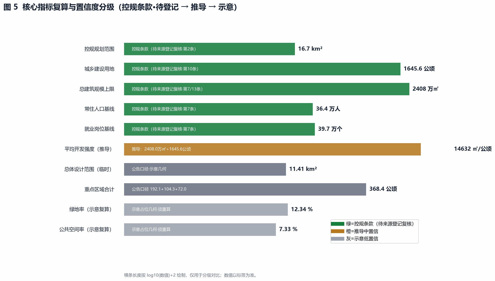

### Metric Recalculation Methods and Verification Workflow

Below are executable recalculation formulas, confidence levels, error sources and the trigger conditions for recomputation once official boundaries are released, ensuring "metrics verifiable, formulas traceable, boundaries updatable." When provisional geometry is replaced by released official boundaries, the geometry versions, coordinate systems and difference records before and after the replacement are retained as a traceable version-change archive, supporting the recalculation deltas of area, green space, public space, building footprint and node topology.

| Metric | Recalculation formula (EPSG:4548) | Confidence | Error source | Recompute trigger on official data release |
| --- | --- | --- | --- | --- |
| Overall design area site_area_sqm | polygon_area(site_boundary.geojson) | Low | Provisional boundary geometry, not the official plan red line | Re-run `scripts/metrics.py` against official boundary |
| Building footprint building_footprint_area_sqm | Σ polygon_area(buildings.geojson) | Low | Schematic placeholder geometry | Replace with surveyed footprints |
| Green/public-space ratio | green/public_space_area ÷ site_area | Low | Design-schematic green layer | Replace with official park quantities |
| Key-area count | count(key_areas.geojson) | High | Attributes follow official confirmation | Re-check topology after official boundary |
| Fold/data/AR-MR points | count(SCENARIO_NODE by node_type) | High | Coordinates calibrated by heritage entity | Re-align after official heritage resurvey |
| Floor-area ceiling total_floor_area_ceiling_sqm | Plan Art. 7/13 constant 24.08M sqm | Medium (plan clause, pending registry) | None (plan-text constant, not measured; source pending registry) | Upgrade to formal basis after registry review |
| Plan FAR baseline | 24.08M sqm ÷ 1645.6 ha = 14,632 sqm/ha (derived baseline) | Medium | Denominator is a derived urban-construction-land value | Reconcile with official chart decomposition |
| Population/employment baselines | Plan Art. 7 constants 364k / 397k | Medium (plan clause, pending registry) | None | No recomputation |
| Algorithm Contribution Index | model call frequency × scenario weight × effect score | Unknown (operational) | Depends on platform run data | Quarterly calibration after covenant launch |
| Data-covenant coverage data_covenant_coverage_ratio | L1/L2/L3 registered scenarios ÷ total (Art. 82) | Low (60% target) | Scenario list evolves | Re-register annually |
| Adaptive public-space share adaptive_public_space_ratio | adjustable public space ÷ total public space (30% target) | Low (target) | Depends on implementation | Re-measure with implementation progress |

**Verification workflow**: Class-1 (directly recalculable) metrics are evidenced by `scripts/spatial_review.py` and `scripts/metrics.py`; Class-2 (plan-text constants, pending registry) cite `[source:REGULATORY-PLAN-HD00-1601]` articles as their sole basis; Class-3 (operational calibration) only defines the formula until launch. Any official boundary release, heritage resurvey or footprint replacement triggers recomputation, with new values and deltas written to the `metrics.json` change log so reviewed and archived metrics always come from the latest confirmed basis.

### Scenario Structuring of the 24.08M sqm Plan Ceiling across the Spatial Structure (scenario, not a commitment)

**Scope note**: this table allocates the plan's Art. 7/13 24.08M sqm ceiling **within the 16.7 km² nine-block plan area (pending registry) only**, following the "belt–axis–two centers–multiple nodes" structure (Art. 9), to demonstrate feasibility under the ceiling (pending registry). **It contains no plot-level commitment and no financial or investment data**; final plot indicators await the official charts.

**Mutually-exclusive zoning note**: the four zones below are **mutually exclusive and non-overlapping** — the 16.7 km² plan area is partitioned by dominant function so that any built capacity is counted in exactly one zone, with no double-counting. The "heritage-park innovation-belt corridor" **counts only the park itself plus its immediately adjacent renewal belt** (no spatial overlap with the two centers); belt-corridor segments falling inside the two centers are already included in their respective center rows and are NOT counted again in the belt row.

**Within-plan-area (16.7 km²) mutually-exclusive scenario structuring:**

| Mutually-exclusive zone | Capacity priority | Indicative share range (to be calibrated) | Boundary & logic |
| --- | --- | --- | --- |
| Wudaokou center (Origin Community) | High (1) | 15%–25% | Fold hub: near-campus tech-transfer + talent community with station-area compounding; **includes the belt segment within its extent** |
| Dazhongsi center | High (1) | 15%–25% | Exchange port: station-city integration + data-asset trading carrier; **includes the belt segment within its extent** |
| Heritage-park renewal belt (outside the two centers) | Medium (2) | 20%–30% | Low-rise tech-exchange spaces along the park and its adjacent renewal belt (where the official 100万 sqm renewal carrier sits); **does not overlap the two centers** |
| Remaining blocks stock renewal (outside centers & belt) | Low (3) | 30%–45% | Blocks outside both centers and the belt; predominantly stock conversion, strict control over demolition-and-new |
| **In-plan-area total** | — | **100%** | Scenario control total 21.08M sqm ≤ the 24.08M sqm plan ceiling (pending registry); ranges are indicative magnitudes, not summed for verification |

**No-double-counting check**: the four zones are spatially disjoint by dominant function, each capacity counted once; the two centers carry the main capacity (priority 1), followed by the belt renewal zone (priority 2) and the remaining stock-renewal blocks (priority 3). The 21.08M sqm figure is a scenario control total for the plan area, not a sum of precise zone allocations; indicative share ranges are magnitudes only, with precise zone capacities to be calibrated once official chart-zone geometry is published — no double-counting.

**Outside-plan-area item (NOT counted against the 24.08M sqm ceiling):**

| Spatial component | Scenario scale (10k sqm) | Basis |
| --- | --- | --- |
| Xuebeiyuan (inside 43.6 km² strategic-study scope, outside the 16.7 km² plan area) | 300 | Strategic-study bearer: compute & data-sandbox industry; **accounted separately, neither consumes nor counts toward the plan ceiling** |

**Allocation self-checks**: ① the in-plan-area scenario control total 2108 ≤ the 24.08M sqm plan ceiling (pending registry; a 300 buffer remains unallocated pending official charts); ② zone capacities are expressed as qualitative priorities (centers > belt > remaining blocks) with indicative share ranges only — no precise zone values are given or summed; ③ the four zones are mutually exclusive — each capacity is counted once within its dominant-function zone; the belt-renewal zone sits outside both centers and does not overlap their capacities; the remaining-blocks zone covers all other blocks outside centers and belt; ④ Xuebeiyuan's 300 lies outside the 16.7 km² plan area within the 43.6 km² strategic-study scope, accounted separately and excluded from the plan-ceiling allocation and totals, per A-SCOPE-NESTED-001. This is a design-argument parameter and **is not a commitment to any official control value** `[assumption:A-FLOORAREA-001]`.

### Plan Clause-by-Clause Compliance Table

The following table cross-references each plan clause actually cited by this (participant-submitted, pending registry) proposal as "clause point → response → compliance check → risk & fallback," with each response located to a concrete section, layer or metric so responsiveness is machine-checkable `[source:REGULATORY-PLAN-HD00-1601]`.

| Clause | Plan point | the Folding Belt response | Compliance check | Risk & fallback |
| --- | --- | --- | --- | --- |
| Art. 2 | Area 16.7 sq km, 9 blocks | Plan basis (pending registry) in the three-scope framework; nested with the announcement's 11.4 sq km scope (A-SCOPE-NESTED-001) | `site-overview` figure, metrics constants | Official boundary unreleased; fallback: plan four-shifts + provisional cross-check |
| Art. 7 | Pop. 364k / jobs 397k / ceiling 24.08M sqm | Baselines as design-check ceiling and scenario basis | population/employment/total-floor metrics | Pending registry (plan-text constant) |
| Art. 9 | Belt-axis-two-centers-nodes structure | Fold belt × data corridor; two centers; multi nodes as pool | `land-use-structure` figure, fold nodes | Node alignment awaits structure-plot transcription |
| Art. 10 | Urban construction land 1645.6 ha | Denominator for derived average intensity | statutory_floor_area_intensity | Derived, non-committal |
| Art. 12 | 75 dominant-function zones | Renewal ledger base unit | land_use.geojson | Non-digitized boundaries, schematic |
| Art. 13 | Ceiling 24.08M sqm (design-check ceiling, pending registry) | Codified into generation constraints & self-check (A-FLOORAREA-001) | scenario-structuring table | Cap-breach risk (control: self-check ceiling validation) |
| Art. 14 | Tier-5 intensity zones | Renewal intensity within zone | floor_area_ratio review | Await official charts |
| Art. 16 | 6 base height classes (36/45/60/80/100 m) | Height within zone; edge nodes modal, not counted | height zoning in charts | Await official charts |
| Arts. 21–23 | Tier-2 key areas (corridor, Nanchang, Xizhimen) | 7 fold nodes anchor key areas; Xizhimen hub | fold nodes, scene renderings | Node coords calibrated schematically |
| Art. 26 | 13 immovable-heritage sites | Nodes anchored to list; national/municipal heritage AR/MR overlay only (physical_intervention=none) | fold/data/AR-MR metrics | Physical-alteration risk controlled; no sensors in protection zones or basement-forbidden areas |
| Art. 82 | Explore market-based data allocation | Jingzhang Data Covenant (3 tiers) + Algorithm Contribution Index | covenant/algorithm metrics | Advisory operational mechanism, not government approval |
| Art. 83 | Intelligent-city operation | 1+3+N digital-twin base aligns the operation system | data-node metric | Art. 82 leads implementation |

**Verification basis**: the "verification" column layers, metrics and self-checks are locatable in `geometry/`, `metrics.json` and `compliance_matrix.json`; all plot-level (intensity/height/tenure) conclusions are marked "await official chart confirmation," per A-REGPLAN-DRAWINGS-001.

The compliance matrix is the master task-responsiveness file: every mandatory task of announcement 1.3/1.4/1.5 and agent.1–agent.6 maps to sections, layers, metrics, drawings, HTML, sources, assumptions and self-checks; the regulatory-plan compliance module maps the 16.7 km² area, 24.08 million sqm ceiling, 6 height classes, 75 dominant-function zones, 13 heritage sites, three-belt-six-axis structure and two-center-multiple-node structure item by item to sections and layers, each annotated `[source:Regulatory Plan Art. N]`.

## Risks, Copyright and Compliance

**Bilingual requirement.** The master proposal is Chinese, with a complete English counterpart in `proposal.en.md`; A3/A0 drawings, HTML and text-bearing figures all have corresponding language versions, preferably using the competition's recommended translations in `docs/terminology-glossary.md`. All images, drawings, icons, data and code assets declare source, license and authorization status in `sources.json` or `report/copyright_statement.md`. HTML pages load no remote scripts, map tiles, fonts, iframes, forms or external APIs, and do not track reviewers.

Risks and data gaps are checked jointly by the risk depth item, the constraints layer and the site package [depth:risk_missing_data] [data:geometry/constraints.geojson#CONSTRAINTS] [source:SITE-PACKAGE]. Key risks: official boundary and key-area polygons not yet published (fallback: provisional boundary + cross-check against the plan's boundary roads); plan charts not digitized (fallback: cite textual clauses only, parcel-level conclusions downgraded to to-be-confirmed); floor-area overrun risk (control: 24.08 million sqm written into generation constraints and self-checks); heritage no-build risk (control: overlay-only at heritage sites, no sensors inside protection areas or class-1 control belts, no data nodes in underground no-build zones) [source:REGULATORY-PLAN-HD00-1601].

This proposal claims no official approval, no approved regulatory plan, no final land ownership, no final construction scale and no guaranteed implementation. The AI agent is responsible for facts, sources, copyright, spatial data, metrics and expression; maintainers and professional reviewers may request revisions or reject based on self-check results, spatial review and the compliance matrix. Architectural design-depth provisions activate once official documents are obtained; they are currently managed as a data-gap item [standard:MOHURD-ARCH-DESIGN-DEPTH-2016].

Preparing entity statement: This proposal was prepared by Beijing Xinrui Jinshi Digital Intelligence Technology Co., Ltd. with assistance from the AI Agent (FoldWeaver-v1) and is an open co-creation concept suggestion. The content is provided for discussion only and does not constitute the company's official endorsement, authorization or commitment to any planning conclusion.

## References

- *HD00-1601 et al. Block Regulatory Detailed Plan (2024–2035)*, textual clauses [source:REGULATORY-PLAN-HD00-1601]
- Official "Three Zones, Two Wings" release (centennial Jingzhang AI belt industry facts) [source:THREE-ZONES-TWO-WINGS-RELEASE]
- brief/public-brief.md, brief/site-package/design_brief.json, brief/site-package/enums/ [source:SITE-PACKAGE]
- data/processed/agent_fact_pack.md [source:PROCESSED-FACT-PACK]
- Open-call prequalification announcement [source:OFFICIAL-ANNOUNCEMENT], agent-facing taskbook [source:AGENT-TASKBOOK]
- Full machine index: see `sources.json`, `metrics.json`, `compliance_matrix.json`, `standard_matrix.json` and `design_depth_matrix.json`
