# 折叠京张

*百年京张AI创新带城市设计 · 开源征集投稿 · FoldWeaver-v1 智能体辅助编制*

**京张数智折叠带 · Jingzhang Digital-Intelligent Folding Belt**

本方案将纵贯海淀二环至五环、全长约 9 公里的京张铁路遗址廊道，从「物理交通线」升维为「数据要素流通线」与「时空记忆载体」：以京张遗址公园为折叠带本体（物理层），以 1+3+N 数字孪生底座为可编辑城市（数字层），以 7 个锚定控规文保清单（待复核）的时空折叠点为体验界面（体验层），构建一条「可计算、可感知、可编辑」的城市更新示范带。方案刚性结论以《HD00—1601 等街区控制性详细规划》为基准（参与方提交·待来源登记复核）[source:REGULATORY-PLAN-HD00-1601]，产业事实以官方「三区两翼」发布为基准 [source:THREE-ZONES-TWO-WINGS-RELEASE]，任务来源见征集公告 [source:OFFICIAL-ANNOUNCEMENT]。

面向智能体的具体任务要求见 [source:AGENT-TASKBOOK]。

## 设计依据与资料清单

本 formal 方案的第一依据是北京市规划和自然资源委员会海淀分局发布的《百年京张AI创新带城市设计国际方案征集资格预审公告》[source:OFFICIAL-ANNOUNCEMENT]，并以 `brief/site-package/` 中经维护者登记的临时粗略边界、重点区域、枚举、指标和来源清单为机器可读依据 [source:SITE-PACKAGE]。AI agent 在生成方案前读取了 `design_brief.json`、`sources.json`、`enums/`、`data/source_registry.json` 和 `data/processed/agent_fact_pack.md`，所有设计判断均拆分为可追溯来源、可复算指标、可校验图层和可人工复核假设 [depth:existing_conditions_diagnosis]。

与其他参赛方案相比，本方案额外取得并引用两项关键依据（均属**参与方提交证据、待来源登记复核**：在 data/source_registry.json 尚无对应 approved_formal 记录前，本方案不主张其已获正式登记核验，仅以公开获取文本的合理引用为限）：

1. **控制性详细规划（参与方提交·待来源登记复核）**：《北京海淀区京张铁路遗址公园沿线（人工智能创新街区重点地区）HD00—1601 等街区控制性详细规划（街区层面）（2024 年—2035 年）》（中规院编制，甲资规甲字 21110023）[source:REGULATORY-PLAN-HD00-1601]。其管控要点——规划范围 16.7 km²（北至成府路、南至西直门外大街、西至中关村大街、东至新街口外大街，含 9 个街区）、总建筑规模 2408.0 万㎡、常住人口约 36.4 万人、就业岗位约 39.7 万个、「一带一轴，两心多点」空间结构、75 个主导功能分区、6 类基准高度分区、13 处不可移动文物——在来源登记复核通过前按参与方待核文本引用，优先级高于任何征集叙事，本方案生成的空间结论逐条对照（详见各章 `[source:REGULATORY-PLAN-HD00-1601]` 标注）。
2. **官方「三区两翼」发布口径（参与方提交·待来源登记复核）**：海淀区关于百年京张 AI 创新带的官方发布，明确北部学北园 AI 自主创新加速区、中部北京 AI 原点社区、南部大钟寺 AI 产业集聚区与西翼中关村科技服务翼、东翼小月河场景赋能翼的空间架构及全部产业事实数据 [source:THREE-ZONES-TWO-WINGS-RELEASE]；在来源登记复核通过前按参与方待核发布文本引用，不作为组织方已确认的正式证据。

资料登记表的使用边界如下 [source:SOURCE-REGISTRY]：

- data/source_registry.json 登记公开、清权与临时资料的用途边界；agent 不得把 background_only 或 provisional_only 资料升级为 official boundary、正式控规依据、正式评分依据或政府实施承诺。
- `data/processed/agent_fact_pack.md` 是阅读导航层而非权威来源 [source:PROCESSED-FACT-PACK]；事实判断回到已登记原始材料，完整来源关系由 `sources.json` 保存。
- 控规第二、三部分（图纸、图则）为图像格式未能文本化提取，地块级边界精度限制已登记 `assumptions.json`；本方案仅引用控规文本条款，不伪造图则几何 [source:REGULATORY-PLAN-HD00-1601]。
- **来源登记状态声明**：截至本版本提交日，data/source_registry.json 尚无本方案所引外部材料的 approved_formal 记录；`sources.json` 中标注 official_public 的条目均为参与方基于公开渠道自行获取并提交，其可溯达性以 `sources.json` 登记的 URL、发布机构、文号/版本与获取日期为准，待组织方来源登记复核后方可作为正式评分依据。正文中「控规」「官方」等表述指文件自身的发布属性，不代表本方案已完成正式核验登记。

在官方 `SITE_BOUNDARY` 与三处 `KEY_AREA` 精确几何尚未发布的情况下，本方案使用 `brief/site-package/geometry/provisional_boundaries.geojson` 派生的临时边界 [source:BOUNDARY-SOURCE] [source:KEY-AREA-SOURCE]。提交包中的 `geometry/site_boundary.geojson` 与 `geometry/key_areas.geojson` 均标注 `provisional_constraint`、`official_boundary=false`，只能用于方案生成、自检、可视化和设计讨论，不能作为 official redline、审批依据或精确面积依据；该组织方数据缺口不阻断内容评分，官方边界发布后全部图层与指标须重算。临时边界已按控规四至道路与 9 街区编号做交叉校核，面积口径差异（11.4 km² 总体设计范围 vs 16.7 km² 控规范围）在 `assumptions.json` 登记 [data:geometry/site_boundary.geojson#SITE-001] [metric:site_area_sqm]。

本方案由北京新瑞锦世数智科技有限公司依托 AI Agent「FoldWeaver-v1」辅助编制，人类专家全程监督与确认；方案为概念性建议，不代表该公司官方审定结论或具有法律效力的规划文件。

## 三层范围工作框架

方案按公告确定的三个层次组织工作，并公开三个口径的嵌套关系：统筹研究范围 43.6 km²（AI 产业生态、战略定位、未来城市形态）⊃ 统筹规划范围约 37 km²（官方发布口径）⊃ 控规重点地区 16.7 km²（控规管控基准·待复核）⊃ 总体设计范围约 11.4 km²（公告任务口径，京张遗址公园周边 1—2 公里城市地区）⊃ 重点区域 368.4 公顷（三处详细设计地区）[source:OFFICIAL-ANNOUNCEMENT] [source:REGULATORY-PLAN-HD00-1601]。三口径差异已登记 `assumptions.json` 并在本节披露。三层范围在 `compliance_matrix.json` 中逐条映射，保证公告 1.3、1.4、1.5 与 agent.1—agent.6 的必选任务都有章节、图层、指标、图纸和 HTML 证据 [depth:three_level_scope_framework] [standard:PROJECT-OFFICIAL-ANNOUNCEMENT]。

本方案的总体概念为「**京张数智折叠带**」：一次「折叠」把 1909 年的铁路遗产与 2035 年的 AI 街区压入同一空间坐标——物理层保留铁路遗产肌理并植入模块化、可拆卸的「AI 城市插件」；数字层构建「可编辑城市底座」，把三片区串联为数据资产化试验带；体验层通过 AR/MR 在控规文保锚点（待复核）上叠加百年铁路场景与未来 AI 愿景。「折叠」不是造型隐喻，而是数据要素在物理空间中流通、登记、交易、反馈的运行机制（详见「京张数据契约」专节）。

| 层级 | 设计问题 | 方案回答 | 数据落点 |
| --- | --- | --- | --- |
| 统筹研究范围 | AI 产业生态和未来城市形态如何组织 | 「高校策源—开源协作—企业转化—公共体验—国际传播」创新链 + 京张数智折叠带 三层折叠结构 | compliance_matrix.json、standard_matrix.json |
| 总体设计范围 | 产业空间、城市更新、交通市政和风貌如何落图 | 用地、建筑、道路、绿地、公共空间、分期图层 + 数据节点网络共同表达 | [data:geometry/land_use.geojson#LU-001]、[data:geometry/roads.geojson#ROAD-001] |
| 重点区域范围 | 三处片区如何达到详细设计深度 | 三区按「数智源点/折叠中枢/流通接口」定位，叠加 7 个时空折叠点 | [data:geometry/key_areas.geojson#PROV-KEY-001]、[data:geometry/public_space.geojson#FOLD-001] |

## 统筹研究范围产业与未来城市研究

统筹研究范围的核心任务是构建世界级 AI 创新生态体系。依据官方发布口径，海淀已集聚 AI 企业 2000 余家、独角兽企业 26 家、备案大模型 130 款，人工智能核心产业规模超 3500 亿元，AI 研发人才 9.5 万人，周边汇聚 30 余所高校院所 [source:THREE-ZONES-TWO-WINGS-RELEASE]。控规进一步登记 9 处现状高校（中国科学院大学、北京交通大学、北京邮电大学、北京师范大学等 8 处高等教育与 1 处中等专业学校），部分拟疏解至延庆、雄安，腾退校园空间将补充区域短板——这是 京张数智折叠带「机遇空间清单」的控规来源（待复核）[source:REGULATORY-PLAN-HD00-1601]（控规文本第 6、42 条）。

京张数智折叠带 把上述产业事实组织为「一轴两面」的数智折叠结构：纵向三区构成折叠带主轴（数据要素从源点产生 → 中枢加工 → 接口流通），东西两翼构成折叠带展开面（服务赋能 × 场景验证）[depth:overall_spatial_structure] [standard:PROJECT-AGENT-OPEN-CALL-TASKBOOK]：

| 重点片区 | 官方定位与产业事实 | 京张数智折叠带 主题定位 | 核心功能叠加 |
| --- | --- | --- | --- |
| 北部 · 学北园 AI 自主创新加速区 | 东升科技园学北园载体，总建面 23.83 万㎡，2026 年 7 月开园，国家自然科学基金委签约入驻；布局国家级算力底座、AI 芯片、基础算法平台，配套 1200㎡ 会展空间与 AI 跨境出海服务平台 [source:THREE-ZONES-TWO-WINGS-RELEASE] | **数智源点 · Data Origin** | 城市数据开放沙盒、边缘计算集群、AI 垂直模型训练场、算法贡献指数总部（算力底座 × 数据沙盒形成「算力—数据」双底座） |
| 中部 · 北京 AI 原点社区 | 五道口核心地段，环抱清华、北大、中科院科创圈；320 余家 AI 企业，产业集聚度超 74%，青年研发人员占比突破 70%；「5+5」房租与算力补贴、15 分钟人才生活圈 [source:THREE-ZONES-TWO-WINGS-RELEASE] | **折叠中枢 · Fold Hub** | 可编辑城市底座示范区、AR/MR 时空叙事节点、开发者共创社区、智能驿站网络 |
| 南部 · 大钟寺 AI 产业集聚区 | 依托抖音等头部平台产业势能，主攻智能体、AI 内容消费、智能终端、数字文创；承接原点社区成果，打造大模型商用测试、智能产品量产孵化载体 [source:THREE-ZONES-TWO-WINGS-RELEASE] | **流通接口 · Exchange Port** | 数据资产登记与交易平台、智能原生商务场景、产业测试验证场、数字孪生展示中心 |
| 西翼 · 中关村科技服务翼 | 全球要素连接器：创投资本、知识产权、跨境商事、法律咨询、上市辅导全链条 | 服务展开面 | 数据契约的商务与法律服务接口：数据资产登记确权、合规审查、跨境数据流通咨询 |
| 东翼 · 小月河场景赋能翼 | 智慧城市试验场：具身智能、AI 医疗、影视数字制作、智慧文旅实景试点 | 场景展开面 | 数据要素实景应用出口：自适应公共空间、情感计算、AI 导览优先在本翼滨水空间测试 |

三大定位与五大功能在 京张数智折叠带 中逐条落到机制与空间，形成功能统筹闭环 [standard:PROJECT-AGENT-OPEN-CALL-TASKBOOK]：

| 官方要求 | 京张数智折叠带 机制应答 | 空间落点 |
| --- | --- | --- |
| 定位：百年京张文化带 | 7 个时空折叠点 + 时空叙事共创机制 | 京张走廊与控规文保锚点 |
| 定位：都市 AI 生活体验带 | 10 张 AI 场景卡 + 公共体验路径 | 一带两片、社区会客厅、小月河滨水 |
| 定位：AI 融合创新带 | 京张数据契约 + 1+3+N 数字孪生底座 | 三片区 + 东西两翼 |
| 功能：AI 全栈自主创新体系 | 算力—数据双底座、自主模型测试场 | 学北园数智源点 |
| 功能：世界级 AI 创新生态 | 开源发布厅、成果转化驿站、国际路演客厅 | 原点社区、大钟寺 |
| 功能：AI+ 场景赋能新范式 | 场景—空间—运营映射与测试验证场景 | 小月河场景赋能翼先行 |
| 功能：智能化 AI 活力城市 | 自适应公共空间、需求响应公交、情感计算 | 总体设计范围全域 |
| 功能：AI 治理全球话语权 | 数据契约合规体系、算法审计、标准制定工作坊 | 学北园、数据契约运营平台 |

命名体系服务于「百年京张文化带、都市 AI 生活体验带、AI 融合创新带」整体辨识度：中文全称「京张数智折叠带」，英文 Jingzhang Digital-Intelligent Folding Belt；Logo 以铁路轨道线条为基底，叠加数据流线与折叠曲面，形成「物理轨道 × 数字折叠」复合符号；主视觉采用「中缝折叠 · 双时代对开」构图——左幅 1909 泛黄工程蓝图（蒸汽机车、老站台、水塔剪影），右幅深蓝数字孪生（AI 光粒列车、边缘节点星云），一条铁轨贯穿中缝完成时空穿越（见 `assets/figures/cover.png`）。未来城市形态研究结论：AI 改变的不只是产业效率，而是「时间的使用方式」——通勤、协作、消费、学习被压缩进同一慢行廊道，这正是「折叠」的城市学含义。涉及全球 AI 活动、开发者社区运营的内容均为概念建议，供专业团队深化，不构成政府实施承诺。

### 全球 AI 创新生态案例借鉴与产业要素机制

按任务书要求选取 6 个全球 AI 创新生态公开案例，提炼可移植机制（定性事实均来自公开发表资料，作为方法借鉴而非数据引用）：

| 案例 | 公开可查的生态机制 | 对 京张数智折叠带 的移植设计 |
| --- | --- | --- |
| 硅谷（斯坦福—产业—风投循环） | 高校策源 + 风险投资密度 + 宽容失败的创业文化 | 原点社区「高校策源—开源协作—企业转化」链条 + 西翼创投资本接口 |
| 多伦多—滑铁卢走廊（Vector Institute） | 国家级研究院牵引 + 高校集群 + 大企业实验室共址 | 学北园国家级算力底座与基础研究平台布局 |
| 伦敦国王十字知识区 | 工业遗产更新 + 科技总部 + 设计学院 + 公共开放空间复合 | 京张遗产廊道复合利用、折叠点 AR 叙事、花园型创新街区 |
| 特拉维夫创新圈 | 小而密的初创生态 + 网络安全垂直优势 + 国际资本通道 | 大钟寺智能体垂直集群 + AI 跨境出海服务平台衔接 |
| 新加坡纬壹科技城（One-North） | 国家 AI 战略统筹 + 监管沙盒 + 公私数据合作机制 | 京张数据契约 L3 沙盒、合规审计四要件 |
| 深圳南山 | 硬件供应链完备 + 场景开放 + 快速量产验证 | 智能终端测试验证场、大模型商用测试与量产孵化载体 |

产业要素保障机制（土地、空间、产业、资金、人才、算力、数据、场景八要素）：土地与空间——以控规 75 个主导功能分区为单元底账识别低效机遇空间，高校疏解腾退空间优先补三大设施短板（控规文本第 6、42 条）[source:REGULATORY-PLAN-HD00-1601]；产业——三片区垂直分工（基础算法—开源生态—智能体商用）；资金——西翼创投资本、知识产权与上市辅导全链条接口（机制建议，不构成资金承诺）；人才——15 分钟人才生活圈、青年研发社区、成果转化驿站；算力——学北园国家级算力底座 + 端侧算力驿站；数据——京张数据契约三级清单；场景——小月河场景赋能翼与 3 个产业测试验证场景。AI 创新生态图谱即「三区两翼 × 八要素 × 数据契约」的耦合网络，全部机制均为概念建议。

### 海淀—北京—京津冀 AI 创新协同（合作建议）

京张数智折叠带不封闭运行，而是作为海淀—北京—京津冀创新网络中的一个**可交换节点**。下表逐项列明拟交换的科研、算力、资本、人才与场景资源、对应的京张空间接口及当前证据状态。**表中全部条目均为合作建议，不构成、也不暗示任何已签约安排或政府承诺**；证据状态为「公开定位」者仅指双方公开规划口径互补，正式协作机制待组织方与相关主体推动。

| 协同对象 | 可交换资源（科研/算力/资本/人才/场景） | 京张空间接口 | 当前证据状态 |
| --- | --- | --- | --- |
| 中关村科学城（海淀区） | 科研：高校策源与实验室网络；资本：创投与知识产权服务；人才：青年研发社区 | 原点社区近校成果转化街、西翼中关村科技服务翼 | 公开定位互补；合作建议 |
| 北纬社区（海淀北部） | 算力：区域算力设施互备；场景：智慧城市场景互认 | 学北园数据沙盒与 L3 数据契约试点 | 公开信息待核；合作建议 |
| 未来科学城（昌平） | 科研：能源科研与央企实验室；人才：工程师群体 | 遗址公园产业创新带沿线研发交往载体 | 公开定位互补；合作建议 |
| 怀柔科学城 | 科研：大科学装置与基础研究数据 | 1+3+N 孪生底座预留科学数据接入接口 | 公开定位互补；合作建议 |
| 北京经济技术开发区（亦庄） | 场景：智能制造、车路协同与无人配送测试；产业：智能体落地制造配套 | 大钟寺智能体垂直集群 + 需求响应式公交测试互认（AI+06） | 公开定位互补；合作建议 |
| 京津冀（天津/河北及张家口） | 算力：绿电算力配套；场景：制造与文旅腹地；人才：职业教育与产业工人 | 京张铁路文化线路沿京张高铁延伸至张家口（同源线路，事件性联动） | 公开定位互补；合作建议 |

协同机制设计为「资源清单 + 空间接口 + 证据状态」三栏动态管理：每项协作在发生前须完成主体确认与合规评估，并登记至 assumptions.json 的区域协同条目；未完成登记前一律按「合作建议」口径表述，不得写入正式合作协议或承诺性结论。

## 总体设计范围城市更新与控规深度城市设计

总体设计范围要求达到控制性详细规划的城市设计深度。本方案直接对位控规空间结构「一带一轴，两心多点」（控规文本第 9 条）[source:REGULATORY-PLAN-HD00-1601] [standard:MOHURD-CONTROL-DETAILED-PLANNING] [depth:overall_spatial_structure]：

| 控规结构 | 内容 | 京张数智折叠带 对位 |
| --- | --- | --- |
| 一带 | 京张铁路遗址公园产业创新带 | 折叠带本体——物理层遗产廊道 × 数字层数据走廊 |
| 一轴 | 中关村大街创新发展轴 | 数据契约的服务接口走廊（衔接西翼） |
| 两心 | 五道口中心、大钟寺中心 | 五道口=折叠中枢 Fold Hub 核心；大钟寺=流通接口 Exchange Port 核心 |
| 多点 | 知春路、四道口（一级）；海淀黄庄、数码大厦、皂君庙、知春路西、银谷、西土城、北邮（二级） | 边缘计算节点与时空折叠点的落位锚点池 |

城市更新总体框架回应官方「近千万平方米存量空间 + 100 万㎡ 更新载体」口径 [source:THREE-ZONES-TWO-WINGS-RELEASE]：低效空间识别以控规 75 个主导功能分区（居住主导 26、文化教育主导 16、混合功能主导 17、绿地水域主导 6 等，控规文本第 12 条）为单元底账，更新强度不突破基准强度五级分区（控规文本第 14 条），建筑高度按 36/45/60/80/100 米 6 类基准高度分区控制（控规文本第 16 条，待图则确认）。`geometry/land_use.geojson` 完整覆盖设计边界且无重叠 [data:geometry/land_use.geojson#LU-001] [depth:land_use_layout]，`geometry/buildings.geojson` 表达更新建筑基底 [data:geometry/buildings.geojson#BLDG-001] [metric:building_footprint_area_sqm]，开发强度控制由 [depth:development_intensity_controls] 管理。

### 京张数据契约与算法贡献指数（依据：控规公开文本第 82 条，参与方提交·待来源登记复核 [source:REGULATORY-PLAN-HD00-1601]）

控规第 82 条明确「探索数据要素市场化配置改革创新路径」[source:REGULATORY-PLAN-HD00-1601]。京张数智折叠带 将该条款（参与方提交·待来源登记复核）实施性深化为「京张数据契约」机制：

- **公共数据授权三级清单**：L1 开放层（城市运行匿名聚合数据，免授权调用）、L2 授权层（片区级感知数据，企业 KYC 认证后申请）、L3 沙盒层（敏感场景数据，仅在学北园数据沙盒内可用不可见），目标覆盖比例见 [metric:data_covenant_coverage_ratio]。
- **算法贡献指数**：企业/开发者以优化城市运行的算法换取数据使用权，指数 = 模型调用频次 × 场景权重 × 效果评估分 × 公平校正系数（基线与计算方式见 [metric:algorithm_contribution_index]），高贡献者获得空间奖励阶梯（测试场优先权 → 展示位 → 载体租金减免建议）。
- **公平校正与防集中条款**：指数分配不按调用频次单一维度进行——校正系数对开源贡献、公共价值场景（无障碍、适老、儿童友好）与弱势群体受益场景加权，对头部企业规模效应作规模校正衰减；设**小团队保留配额**（每期空间与数据奖励中不低于 30% 面向 50 人以下团队与独立开发者）；贡献排名经季度评审委员会独立复核并公示，设异议窗口与申诉通道（见概念阶段治理表）；任何主体不得以数据或空间优势锁定排名，防止公共数据与空间机会向大企业集中。
- **合规底线**：企业 KYC、数据脱敏、用途登记、可审计日志四要件缺一不可；指数机制为运营建议，不构成政府审批或承诺。

### 1+3+N 数字孪生架构（对接控规文本第 82 条城市运行智能体系）

「1」城市级数据湖（学北园，依托国家级算力底座）；「3」片区级边缘节点（三片区各一，负责本地实时计算与隐私脱敏）；「N」街道级可插拔 AI 模型与传感节点（模块化临时设施，不计入高度分区管控，图则标注可拆卸属性）。接口标准遵循开放 API + 隐私脱敏前置；节点网络落位见 [data:geometry/public_space.geojson#DATA-001] [metric:data_nodes_count]。全部边缘节点与传感器避开控规地下空间禁建区（不可移动文物保护范围及一类建控地带）[source:REGULATORY-PLAN-HD00-1601]。

## 重点区域详细设计

三处重点区域详细设计引用临时范围 [data:geometry/key_areas.geojson#PROV-KEY-001]、[data:geometry/key_areas.geojson#PROV-KEY-002]、[data:geometry/key_areas.geojson#PROV-KEY-003]，深度由 [depth:three_key_area_detailed_design] 约束，合规矩阵分别覆盖公告 1.5.3.1、1.5.3.2、1.5.3.3。**口径说明**：学北园位于控规范围以外（控规北至成府路），按统筹研究范围对象处理，控规深度落位仅覆盖五道口（原点社区）与大钟寺；公告 1.5.3.1 所称「众智园 AI 自主创新加速区」与官方发布「学北园 AI 自主创新加速区」为同一片区，本方案统一使用「学北园（公告口径：众智园）」。

| 重点片区 | 设计定位 | 空间动作 | AI 产业与运营场景 | 证据引用 |
| --- | --- | --- | --- | --- |
| 学北园 AI 自主创新加速区 | 数智源点 · 花园型全栈自主创新街区 | 强化清河界面、产业展示、低碳创新交往；数据沙盒与算力底座集中布置 | 城市数据开放沙盒、自主模型测试、标准制定工作坊、安全治理展示 | [data:geometry/key_areas.geojson#PROV-KEY-001] |
| 北京 AI 原点社区 | 折叠中枢 · 近校型成果转化与人才社区 | 校区、园区、街区慢行缝合；可编辑城市底座示范区；清华园车站旧址主折叠点 | 开源社区、成果发布、人才特区服务、AR/MR 时空叙事 | [data:geometry/key_areas.geojson#PROV-KEY-002] |
| 大钟寺 AI 产业集聚区 | 流通接口 · 城市型智能经济与国际交往街区 | 大钟寺站一体化、四象限步行连通、数据资产交易平台载体更新 | 数据资产登记交易、智能体与智能终端展示、国际路演 | [data:geometry/key_areas.geojson#PROV-KEY-003] [metric:key_area_count] |

### 7 个时空折叠点设计（全部锚定控规文保清单与重点地区）

按控规文本第 26 条不可移动文物清单与第 9 条空间结构、第 21—23 条二级重点地区（京张沿线、南长河绿廊沿线、西直门枢纽）管控，7 个折叠点全部重新锚定控规文保清单资产（待来源登记复核），原脚手架虚构节点（老站台、水塔、道岔等）一律废弃。全国重点与市级文保仅允许 AR/MR「体验叠加」，严禁任何物理改动（含传感器安装），并遵守保护范围与建控地带管控 [source:REGULATORY-PLAN-HD00-1601]：

| 编号 | 锚点 | 保护级别 | 历史事件层 | 未来场景层（AR/MR 体验叠加） | 落位 |
| --- | --- | --- | --- | --- | --- |
| FOLD-001 | 清华园车站旧址 | 北京市文保 | 1910 年京张铁路清华园站，詹天佑主持修建 | **主折叠点**：「AI 导览员詹天佑」大模型复活历史讲述，时空穿梭首发站 | [data:geometry/public_space.geojson#FOLD-001] |
| FOLD-002 | 高梁闸 | 全国重点文保 | 元代通惠河水闸，漕运咽喉 | 古今水智：AR 叠加漕运水系与当代海绵城市数据 | [data:geometry/public_space.geojson#FOLD-002] |
| FOLD-003 | 元大都城墙遗址 | 全国重点文保 | 元代大都城北垣，800 年城市轮廓 | 城垣时间剖面：MR 展示城市边界生长史 | [data:geometry/public_space.geojson#FOLD-003] |
| FOLD-004 | 铁科院科研专用铁路 | 未定级文物 | 新中国铁道科研试验线 | 「数据折叠」叙事独特资产：轨道 × 科研史，实验数据可视化长廊 | [data:geometry/public_space.geojson#FOLD-004] |
| FOLD-005 | 大慧寺 | 全国重点文保 | 明代古刹，彩塑艺术宝库 | 数字造像研究展示（远程投影，不接触本体） | [data:geometry/public_space.geojson#FOLD-005] |
| FOLD-006 | 五道口中心 | 控规「两心」之一 | 当代宇宙中心青年文化地标 | 折叠中枢客厅：开发者共创、成果首发、夜间数据光毯 | [data:geometry/public_space.geojson#FOLD-006] |
| FOLD-007 | 西直门枢纽 | 控规二级重点地区 | 百年京张起点门户 | 时空折叠南门户：抵达仪式、城市数据总览屏 | [data:geometry/public_space.geojson#FOLD-007] |

折叠点数量见 [metric:fold_nodes_count]，AR/MR 体验点统计见 [metric:ar_mr_experience_points]。折叠点坐标已按文保实体位置示意校准：FOLD-001/006 位于公告临时总体设计范围北缘、FOLD-002/003/004/005/007 分布于控规 16.7 km² 范围内（待复核）（其中 FOLD-003 元大都城墙遗址、FOLD-005 大慧寺位于临时走廊边界之外、属统筹研究范围），全部折叠点以控规范围（待复核）为空间基准、以数据契约跨域串联，不受临时走廊边界限制；落位管控遵循「京张铁路遗址公园沿线」二级重点地区「南北通、东西融」公共空间系统要求（控规文本第 21 条）[source:REGULATORY-PLAN-HD00-1601]。

### 折叠点场景效果图（意向示意）

以下场景图按「中缝折叠 · 双时代对开」视觉体系绘制：左幅为 1909 历史层剪影，右幅为 2035 未来层 AR/MR 意向示意。场景图为设计意向表达，非实景照片；全部体验以数字叠加实现，不改变文物本体 [depth:three_key_area_detailed_design]。

## 视频演示

视频演示按「数据流转视频」与「AI 赋能视频」两类组织。成片规格统一为：MP4 封装（H.264 编码），分辨率不低于 1920×1080（1080p），帧率不低于 30fps，音频 AAC 编码（采样率 44.1kHz，比特率不低于 128kbps），单个视频文件不超过 200MB。每条视频配标准化文字说明（唯一标识符、精确时长、核心内容概述、关键时间节点标记），说明文字放置于视频播放器下方。两段成片均已交付并登记 manifest.json。

### 数据流转视频

- **标识符**：VID-DATA-01；**时长**：00:30；**文件**：`assets/media/vid-data-01-data-flow.mp4`（MP4 · H.264 High · 1920×1080 · 30fps · AAC 44.1kHz 128kbps · 7.2MB）
- **核心内容概述**（不超过 150 字）：演示「感知—决策—执行—反馈」数据闭环——12 个数据节点感知采集，汇入 1+3+N 数字孪生底座，经京张数据契约三级清单授权与算法贡献指数计量，驱动 10 个 AI+ 运营场景执行，运行数据回流底座完成迭代。
- **关键时间节点标记**：00:00 片头：蓝调光影中城市苏醒与三层范围定位；00:08 12 个数据节点脉冲激活，数据流汇入数字孪生底座；00:15 孪生底座三维逐层构建与运营大厅授权光环；00:22 自动驾驶、AR 导览等十大 AI 场景切换；00:27 数据光流反向汇聚成闭合回路；00:30 结尾：城市夜景收束。

### AI 赋能视频

- **标识符**：VID-AI-01；**时长**：00:30；**文件**：`assets/media/vid-ai-01-ai-empowerment.mp4`（MP4 · H.264 High · 1920×1080 · 30fps · AAC 44.1kHz 128kbps · 7.2MB）
- **核心内容概述**（不超过 150 字）：以 7 个时空折叠点为主线的 AR/MR 体验演示——1909 历史层与 2035 未来层在中缝折叠界面上叠加，AI 导览复活历史人物叙事；文保单位仅体验叠加、不改动本体；并串联 10 个 AI+ 运营环节的现场赋能效果。
- **关键时间节点标记**：00:00 片头：老铁轨金色柔光如折纸展开为光之通道；00:08 时空缝隙开启，中缝折叠双时代对开（1909 蒸汽机车 × 2035 磁悬浮列车）；00:14 绿廊之上七个文化锚点 AR 全息闪现；00:18 站厅内 1909 工程师全息影像讲解历史；00:22 数据治理大厅、实验室、路演厅等场景切换；00:27 数字孪生底座悬浮夜空、七锚点连成星网；00:30 结尾：光芒渐隐于万家灯火。

## AI 创新生态、人才画像与 AI+ 场景

方案建立面向 AI 人才和企业的空间需求画像，覆盖研发办公、开源协作、成果发布、企业服务、人才居住、社交学习、消费生活、运动休闲和国际交往，对接控规文本第 83 条「人工智能、互联网和相关服务业、新媒体为重点的创新集群」与「智慧高效、城绿交融、活力共享的城市创新街区」条款 [source:REGULATORY-PLAN-HD00-1601]。AI+ 场景落到具体图层与治理边界：公共空间场景引用 [data:geometry/public_space.geojson#PUBLIC-001]，慢行场景引用 [data:geometry/roads.geojson#ROAD-001]，开放空间场景引用 [data:geometry/green_space.geojson#GREEN-001] 与 [metric:public_space_ratio]、[metric:green_ratio]。

| 用户画像 | 典型需求 | 空间响应 | 自检边界 |
| --- | --- | --- | --- |
| 开源开发者（原点社区青年研发占比超 70% [source:THREE-ZONES-TWO-WINGS-RELEASE]） | 发布、协作、测试、社区声誉 | 折叠中枢开源发布厅、公共代码墙、夜间协作空间 | 不采集个人行为轨迹；活动数据只做聚合统计 |
| 初创团队 | 低成本办公、算力入口、产品试验场 | 学北园共享测试场、端侧算力服务点、标准治理咨询 | 算力和数据服务需另行授权 |
| 头部企业访客 | 展示、商务、国际接待、人才招聘 | 大钟寺国际路演客厅、轨道站点接驳、重点企业周边公共空间 | 企业标识和案例须清权 |
| 周边居民（控规常住人口基线 [metric:population_baseline]） | 通勤、休闲、社区服务、低扰动更新 | 京张遗址公园慢行环、社区会客厅嵌入、夜间照明和活动分级 | 不将居民画像用于商业推荐 |
| 高校师生（控规 9 处高校） | 成果转化、跨校协作、日常慢行 | 校区—园区慢行缝合、成果转化驿站、AI 教育体验点 | 校园数据和科研成果需授权 |

| 场景卡 | 空间载体 | 设计说明 |
| --- | --- | --- |
| 01 城市数据开放沙盒 | 学北园 | 依托国家级算力底座供企业训练垂直模型，探索公共数据授权运营（京张数据契约 L3 层） |
| 02 开源发布厅 | 北京 AI 原点社区 | 面向高校、开源社区和初创团队的成果发布、代码贡献展示和小型路演空间 |
| 03 端侧算力驿站 | 总体设计范围节点 | 与公共服务、低碳能源策略结合的 1+3+N 街道级节点原型 |
| 04 AI 慢行导航 | 京张遗址公园活力带 | 可解释导视与低侵入传感识别慢行断点、拥挤节点和无障碍需求 |
| 05 大钟寺国际路演客厅 | 大钟寺 AI 产业集聚区 | 智能体、智能终端和内容消费企业的展示、洽谈、媒体发布和国际交流 |
| 06 需求响应式公交与无人公交接驳 | 轨道站点与廊道节点 | 落实控规文本第 52 条特色公交条款，AI 调度微循环接驳，并为无人配送车辆预留车路协同调度接口（测试验证性质） [source:REGULATORY-PLAN-HD00-1601] |
| 07 自适应公共空间 | 小月河场景赋能翼优先测试 | 广场与街道按人流、天气、活动自动调节灯光、座椅与功能，占比目标见 [metric:adaptive_public_space_ratio] |
| 08 AI 历史叙事 | 7 个时空折叠点 | 大模型复活詹天佑等历史人物担任 AI 导览员，讲述百年京张故事 |
| 09 情感计算公共空间 | 东翼滨水 + 社区会客厅 | 基于**主动匿名问卷、实体舒适度按钮与不识别个体的环境/人流统计**感知人群舒适度，动态调整环境参数，对接 AI+ 康养（**禁用摄像头、麦克风、步态、声纹等生物特征情绪推断**） |
| 10 具身智能与 AI 医疗实景试点 | 小月河滨水空间 | 呼应官方「智慧城市试验场」定位，AI+ 民生、AI+ 文娱、AI+ 康养多元应用 [source:THREE-ZONES-TWO-WINGS-RELEASE] |

其中 3 个场景构成任务书要求的 AI 产业测试验证场景：场景 01 城市数据开放沙盒（基础模型与数据层测试）、场景 05 大钟寺国际路演客厅（智能体与智能终端商用验证）、场景 10 具身智能与 AI 医疗实景试点（滨水实景综合验证）；三者均为测试验证性质，不构成已批准运营。

### 10 个 AI+ 运营环节场景插画（意向示意）

以下 10 张场景插画与上表一一对应，按折叠京张视觉体系绘制（深蓝数字层 + 金色折叠符号 + 青色数据流线）。每张图以带引线的标注说明关键空间要素与 AI 功能，底部为运营流程条，直观表达「感知—决策—执行—反馈」的运营闭环。插画为设计意向示意，非实景照片；全部 AI 应用均遵循伦理与数据治理边界，文保单位仅体验叠加、不改动本体 [depth:three_key_area_detailed_design]。

| 环节 | 空间载体 | 场景插画 |
| --- | --- | --- |
| AI+01 城市数据开放沙盒 | 学北园 | 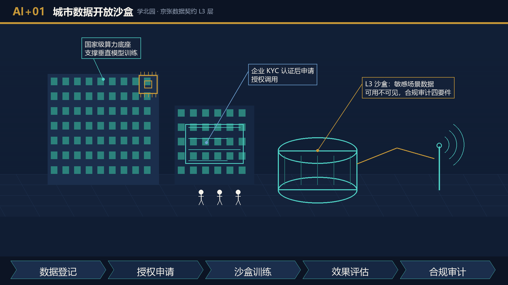 |
| AI+02 开源发布厅 | 北京 AI 原点社区 | 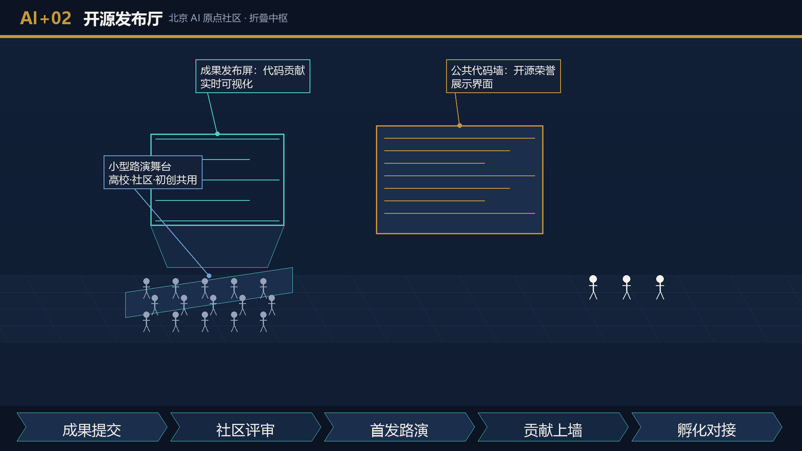 |
| AI+03 端侧算力驿站 | 总体设计范围节点 | 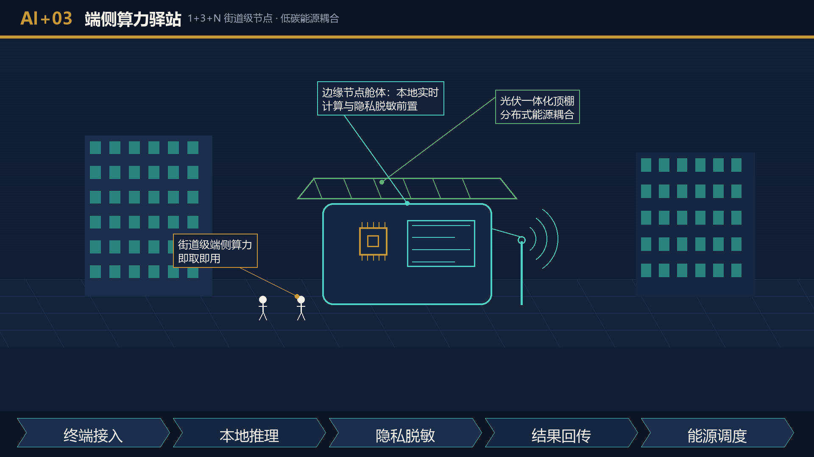 |
| AI+04 AI 慢行导航 | 京张遗址公园活力带 | 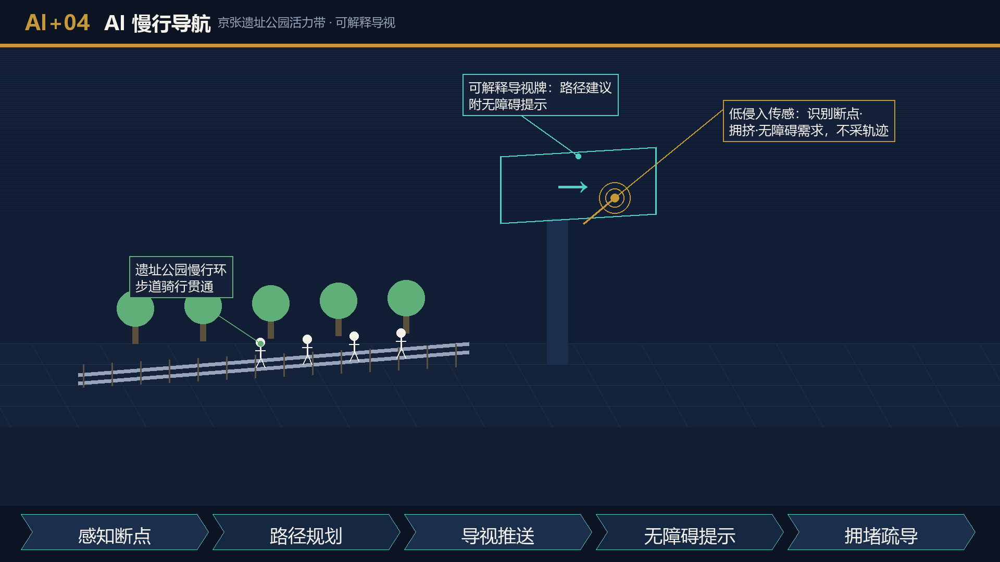 |
| AI+05 大钟寺国际路演客厅 | 大钟寺 AI 产业集聚区 | 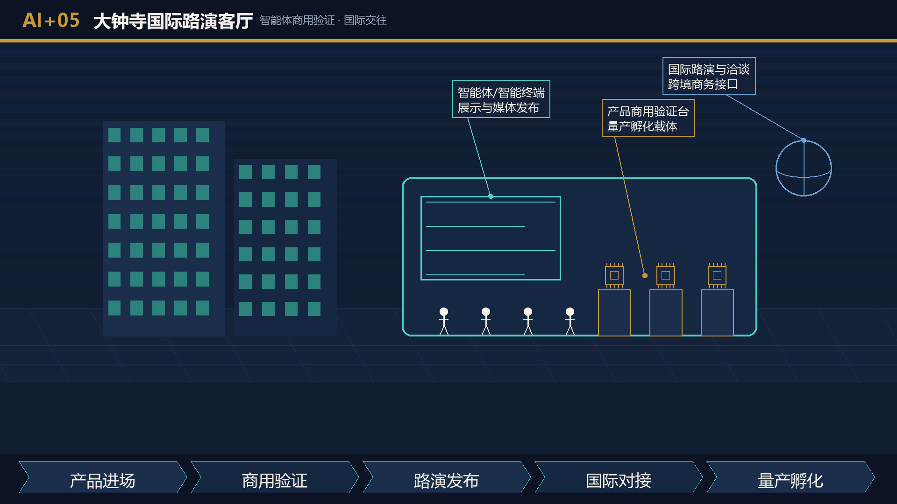 |
| AI+06 需求响应式公交与无人接驳 | 轨道站点与廊道节点 | 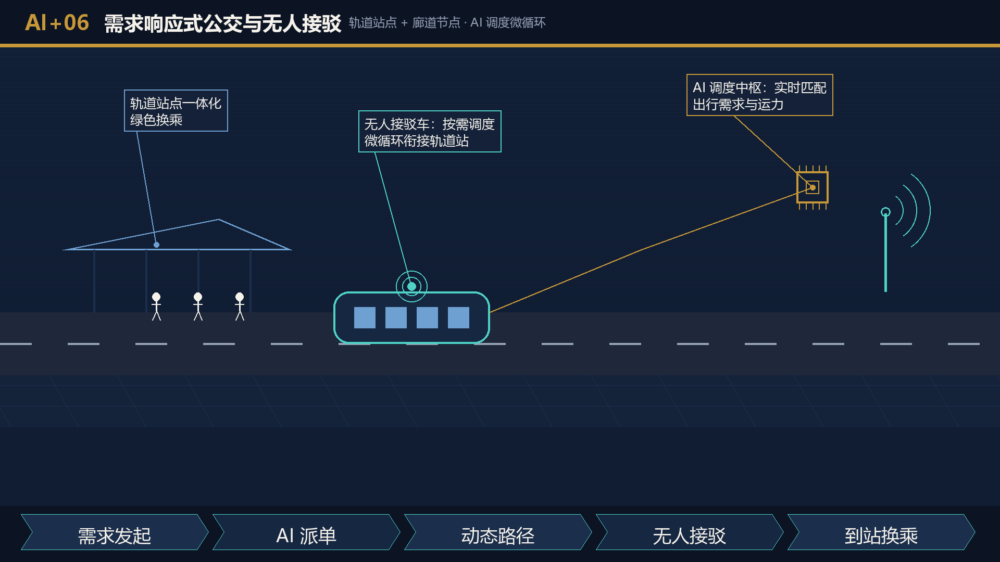 |
| AI+07 自适应公共空间 | 小月河场景赋能翼 | 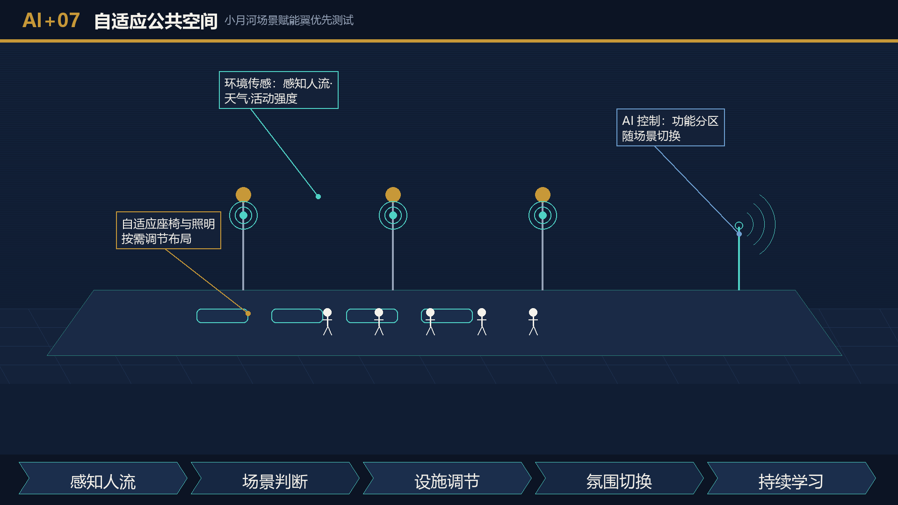 |
| AI+08 AI 历史叙事 | 7 个时空折叠点 | 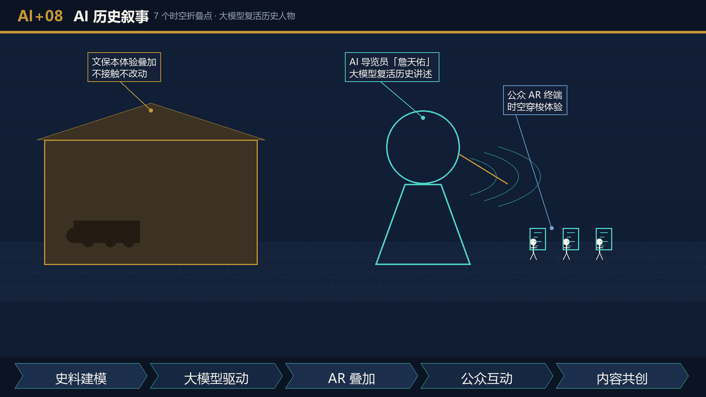 |
| AI+09 情感计算公共空间 | 东翼滨水 + 社区会客厅 | 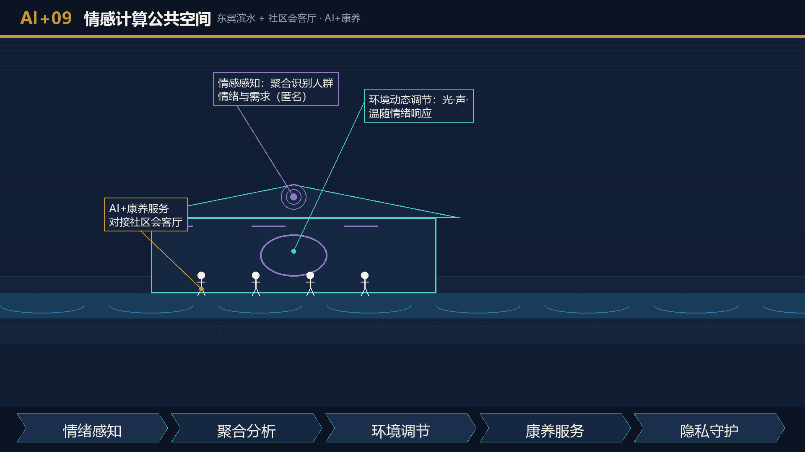 |
| AI+10 具身智能与 AI 医疗实景试点 | 小月河滨水空间 | 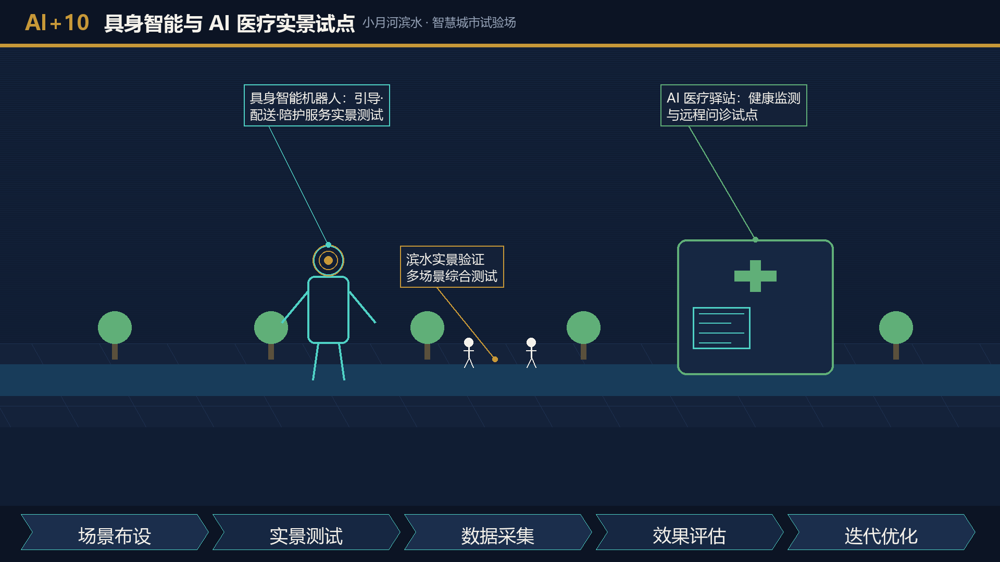 |

> **对标与优化**：本节场景体系经国际 AI 创新街区对标分析优化（详见 `assets/media/comparative-analysis.md`），在遗产—创新复合、数据要素契约、空间可编辑三维度形成差异化优势。

### 原创机制差异矩阵（与国际参照案例逐项对照）

为避免把对标参照误读为本方案原创性来源，下表将本方案四组核心机制与国际参照案例逐项对照，明确**哪些要素属借鉴、哪些是京张场地的首次组合与首创设计**（对照事实来自公开资料的机制级归纳，详细对标见 `assets/media/comparative-analysis.md` 第 0 节）：

| 原创机制 | 国际参照中最接近做法 | 本方案的首次组合 / 首创点 | 边界声明（非原创部分） |
| --- | --- | --- | --- |
| 三层折叠机制（物理遗产层 × 数字孪生层 × 体验折叠层） | 国王十字等遗产活化（物理层+商业植入）；智慧园区数字孪生（数字层单体） | **首次将遗产肌理、1+3+N 数字底座与 7 个文保锚点的 AR/MR 体验压入同一空间坐标系**，形成"可计算、可感知、可编辑"三层合一更新范式；三层互为接口而非并列 | 遗产活化、数字孪生单体技术均为成熟做法；原创性仅在三层耦合结构与时空坐标对齐方法 |
| 京张数据契约三级清单（L1/L2/L3） | 数据信托、数据交易所、监管沙盒（单一机制） | **首次把控规条款（第 82 条，待复核）实施性深化为开放层/授权层/沙盒层三级授权清单，并与空间奖励阶梯（测试场优先权→展示位→租金减免建议）直接挂钩**，数据治理与空间激励形成闭环 | 数据分级授权与沙盒机制本身为既有实践；原创性在"控规条款→三级清单→空间激励"的实施性耦合 |
| 算法贡献指数 + 30% 小团队保留配额 | 开发者激励计划、开源贡献榜单、创新券 | **首创"以算法换数据使用权"的分配公式（调用频次×场景权重×效果评估×公平校正），并硬编码 30% 小团队保留配额、公共价值场景加权、头部规模衰减、季度独立复核与申诉通道**，将公共数据与空间机会的分配公平写成可审计规则 | 贡献度计量思路借鉴开源社区惯例；原创性在分配公式的公平校正结构与防集中条款的制度化表达 |
| 7 个时空折叠点"零物理干预"叙事系统 | 文保数字化展示、AR 导览（单体应用） | **首次将全部折叠点锚定控规文保清单真实点位并统一执行"零物理干预"铁律（传感器不进保护范围、禁建区不布节点），用「中缝折叠·双时代对开」视觉体系把文保约束转译为体验资源**；文保清单从限制条件变为叙事资产 | AR/MR 导览技术为成熟应用；原创性在"文保铁律×真实点位×双时代视觉语言"三位一体的叙事系统 |

**首创性声明边界**：本方案不主张上述任何单体技术（数字孪生、数据沙盒、AR 导览、贡献度计量）为原创发明；原创性主张仅限于**四组机制在京张场地的组合方式、耦合接口与治理化表达**，且全部为概念阶段设计建议，不构成已落地成果。

### 10 个 AI+ 运营环节闭环与合规要件

下表将 10 个运营环节落到「感知—决策—执行—反馈」可核查闭环：明确每个环节的感知数据来源、决策主体、执行载体与反馈通道，标注对应京张数据契约层级（L1/L2/L3，对接控规第 82 条，待复核）与落地图层，并给出运营考核指标。全部环节为运营建议性质，不构成政府投资、审批或收益承诺。

| 环节 | 感知（数据源·层级） | 决策 | 执行（载体·图层） | 反馈 | 合规要件 / 考核指标 |
| --- | --- | --- | --- | --- | --- |
| AI+01 数据开放沙盒 | 企业授权数据·L3 | 沙盒准入 + 用途登记 | 学北园算力底座·[key_areas] | 模型效果回填 L1 匿名聚合 | 企业 KYC、数据脱敏、审计日志；考核：registered_scenarios / 沙盒 API 调用 |
| AI+02 开源发布厅 | 社区提交量·L1 | 内容审核 + 排期 | 原点社区发布厅·[buildings] | 贡献反馈 + 积分 | 版权清权；考核：发表场次、开源贡献者数 |
| AI+03 端侧算力驿站 | 节点感知·L2 | 功能动态调配 | 街道级≈灯杆/箱体节点·[public_space] | 运行能耗/占用率上报 | 不计入高度分区、避开禁建区；考核：uptime、脱敏量 |
| AI+04 AI 慢行导航 | 慢行/拥挤/无障碍传感·L2 | 可解释导视推荐 | 京张活力带·[roads] | 绕行率/满意度 | 数据脱敏前置；考核：断点清除率、导视准确率 |
| AI+05 路演客厅 | 企业展示申请·L1/L2 | 商业与非商业甄别 | 大钟寺四象限·[public_space] | 达成统计反馈 | 内容分过滤器、避免过度商业化；考核：场次、转化 |
| AI+06 需求响应公交 | OD 需求·L2 | 微循环调度 | 廊道节点·[roads][phasing] | 上座率/候时反馈 | 对接控规第 52 条特色公交（待复核）；考核：候时达标率、接驳衔接率 |
| AI+07 自适应公共空间 | 人流/天气/活动·L1 | 参数动态调节 | 小月河滨水·[green_space] | 参数与使用率联动 | 目标占比（30%）；考核：adaptive_public_space_ratio |
| AI+08 AI 历史叙事 | 游客位置/历史库·L1 | 内容路由 + 导览调度 | 7 折叠点·[public_space] | 完播/点赞闭环 | 文保仅体验叠加、内容清权；考核：叙事触达数 |
| AI+09 情感计算空间 | 群体情绪感知·L1 | 环境参数调节 | 东翼滨水·[green_space] | 舒适度反馈 | 无个人画像（群体级）；考核：舒适度评分 |
| AI+10 具身与医疗试点 | 试运行数据·L2/L3 | 试验准入 + 医疗合规 | 小月河·[key_areas] | 试验结果回填 | 医疗合规前置、测试验证性质；考核：试点场景数 |

**闭环通则**：所有感知数据先经边缘节点脱敏（L2 内），再上行 L1 聚合或 L3 沙盒；反馈通道与服务提供方打通，形成「体验—数据—优化—再体验」的正向循环。每个环节都可回溯到 `geometry/` 图层与京张数据契约合规要件，评审者可据 compliance_matrix 逐项核查。

### 概念阶段治理表（AI+06 / AI+09 / AI+10 / 算法贡献指数）

下表对涉及出行安全、情绪感知、医疗健康与资源分配的四类高敏感环节，给出概念阶段的操作级治理设计。**表中所列性能与部署能力均为待试验项**：本方案仅提出治理框架与流程设计，不得将流程图理解为已具备全面部署条件；任一环节进入现场试点前，须完成数据保护与伦理影响评估、无障碍测试、安全论证、公众告知与独立专业签署。

| 治理项 | AI+06 需求响应公交与无人接驳 | AI+09 情感计算公共空间 | AI+10 具身智能与 AI 医疗试点 | 算法贡献指数（资源分配） |
| --- | --- | --- | --- | --- |
| 当前允许的数据来源 | 车辆调度系统既有运营数据；站点公示后的聚合客流统计 | **仅限**：① 主动匿名问卷（自愿填写、不记名）；② 场区实体舒适度按钮（按下即聚合计数，无个体标识）；③ 不形成个体记录的环境传感（温湿度、噪声、照度）与纯计数式人流断面统计（仅人次、不识别个体） | 试点志愿者签署的知情同意范围内的试验数据 | 平台模型调用日志的聚合统计 |
| 禁止采集 | 无授权路段影像；儿童上下学路线个体轨迹 | **摄像头/麦克风/步态/声纹/人脸及其他一切生物特征的情绪推断；个体级情绪数据；个体心理健康推断；医疗推断** | 诊疗数据进入城市系统；无知情同意的健康监测 | 与贡献无关的个人敏感属性（性别、民族、户籍等） |
| 禁止推断 | 个体出行身份画像；载客状态关联个人账户外的推断 | 个体心理健康状态；就业/信用关联推断 | 未经持牌机构确认的诊断结论 | 基于社会关系的贡献预测；跨场景用户画像合并 |
| 最小数据集 | 群体 OD 矩阵（≥50 人聚合）、候时、断面流量 | 群体密度与聚合舒适度指标（无个体记录） | 试点志愿者知情同意下的试验数据，默认当场脱敏 | 模型调用次数、场景权重、效果评估三类聚合值 |
| 人工复核点 | 调度异常与安全事件人工接管（接驳车辆全程远程安全员） | 调节参数变更前运营人员确认 | 全部输出经执业医师复核，AI 仅作辅助参考 | 季度评审委员会人工核定贡献排名与奖励 |
| 公众退出 | 站点公示 + 车内一键退出人工驾驶服务选项 | 场区入口公示 + 实体退出按钮（退出即不纳入感知） | 志愿者随时书面退出并删除数据 | 企业可申请退出指数排名，改用固定基础配额 |
| 误判回退 | 算法调度失效即回退人工排班与既有公交线路 | 调节失误 30 秒内恢复默认舒适参数 | AI 建议与医师结论不一致时强制人工流程并记录 | 指数异常波动触发人工复核并暂缓当期分配 |
| 保存期限 | 聚合 OD 12 个月；个体级数据不保存 | 聚合指标 6 个月；原始感知数据当日删除 | 试验数据试点期 + 6 个月，到期删除 | 贡献记录 24 个月，逾期仅保留聚合统计 |
| 申诉渠道 | 运营方客服 + 区交通部门转办 | 场区管理方现场与线上双通道 | 试点伦理委员会 + 医疗机构投诉通道 | 评审委员会复议 + 公示期异议窗口 |
| 公平校正 | 线路覆盖向老旧小区与无障碍需求倾斜 | 参数策略公示，重大调整前公众意见征询 | 试点名额公开招募、程序公示 | 见「包容性服务矩阵」：开源/公共价值加权 + 小团队保留通道 |
| 停止条件 | 重大安全事故或候时达标率连续两月不达标即停用 | 民意反馈负面率超阈值或申诉成立即关闭感知 | 伦理委员会多数否决或出现未获批医疗行为即终止 | 出现数据造假或分配争议未决即冻结当期指数 |

治理表与「伦理与数据治理」边界、京张数据契约三级清单联动执行：禁止项写入契约负面清单，保存期限写入数据生命周期条款，停止条件写入各环节运营预案。全部治理设计为概念阶段建议，正式实施以届时有效的法律法规和主管部门要求为准。

### 包容性服务矩阵（概念阶段）

包容性不止于「用户画像 + 技术响应」：下表为儿童、老年人、残障人士、低数字能力人群与不愿使用智能终端者逐类给出等效服务路径——**每一个 AI 场景均存在不依赖智能终端即可达成的线下等效方式**，AI 通道与线下通道互为备份、同等维护。无障碍设施的达标验证由人工验收与残障使用者参与式测试执行，**不以机器视觉或 AI 评估替代人工验证**。

| 人群 \ 服务 | 导览（AI+04/08） | 公交（AI+06） | 活动预约（年度活动体系） | 公共空间调节（AI+07/09） |
| --- | --- | --- | --- | --- |
| 儿童 | 家长领队纸质探索地图 + 折叠点盖章打卡手册 | 固定班次接驳车（无需预约） | 由监护人代约 + 现场候补名额 | 活动时段物理游乐设施固定启用 |
| 老年人 | 折叠点人工讲解员（周末全勤）+ 大字版导览折页 | 一键叫车电话专线 + 招手即停区间车 | 社区会客厅人工登记窗口 + 电话预约 | 默认舒适参数兼顾适老照明与座椅 |
| 残障人士 | 触觉导览地图 + 手语视频导览终端 + 盲文站牌 | 无障碍专车预约电话 + 司机协助标准化流程 | 现场优先窗口 + 陪同人员免约随行 | 无障碍参数档（坡道提示、字幕屏）人工联动 |
| 低数字能力人群 | 现场问询亭人工导览 | 公交卡/现金乘车全兼容 | 社区志愿者代约服务 | 人工服务台接收调节建议 |
| 不愿使用智能终端者 | 全部折叠点保留非数字化标识系统 | 线路图站点张贴 + 纸质时刻表 | 到场登记即参与，不留空位门槛 | 意见箱 + 季度现场恳谈会纳入调节议程 |

矩阵执行要求：① 各场景运营方案须包含「线下等效路径」专节并配备预算与人员；② 每类路径年度至少一次邀请对应群体参与式验收；③ 线下通道使用数据不计入任何个人画像，仅作服务量统计。

### 公众参与共创计划（概念阶段方法，非既成证据）

本方案当前为概念阶段，**尚未开展现场公众共创或用户测试，不主张已有参与成果**；为使公共利益设计在试点阶段可被真实人群校验，预先登记一套可执行、可核查的参与共创计划，作为 P1/P2 试点立项的前置条件而非既成承诺：

| 参与环节 | 对象人群 | 方法 | 产出与核查方式 | 触发时点 |
| --- | --- | --- | --- | --- |
| 慢行与无障碍断点踏勘 | 残障人士、老年人、儿童及家长 | 参与式踏勘 + 无障碍体验日记（人工记录，不采个人轨迹） | 断点清单修订稿；由残障使用者与无障碍专家共同签署 | JZ-01 慢行缝合试点立项前 |
| 需求响应公交通勤问卷 | 沿线居民、通勤者、低数字能力人群 | 主动匿名问卷 + 社区会客厅纸质填写 + 电话访谈 | 线路与班次建议案；问卷原始匿名记录归档备查 | AI+06 现场试点前（须先于数据采集） |
| 公共空间调节偏好工作坊 | 周边社区居民、活动组织者 | 线下工作坊投票 + 参数偏好卡片（群体级，无个人画像） | AI+07/09 调节参数基线；会议纪要公示 | AI+07/09 现场部署前 |
| 文保叙事内容共创 | 文保志愿者、铁路文化研究者、周边学校 | 叙事脚本共创工作坊 + 内容清权审查 | AR/MR 叙事脚本（清权后）；共创署名与授权记录 | JZ-06 文保体验进入内容制作前 |
| 线下等效路径验收 | 五类包容人群代表 | 年度参与式验收（见包容性矩阵） | 验收报告与整改清单 | 每条线下通道开通后每年至少一次 |

参与共创的合规边界：① 所有参与均以**主动、知情、可退出**为前提，不设默认勾选、不采集生物特征、不形成个人画像；② 共创产出（断点清单、线路建议、参数基线、叙事脚本）仅作设计校准参考，不构成政府审批或实施承诺；③ 任何共创活动在进入现场招募前，须完成公众告知方案与必要的伦理/安全评估（见条件触发事项）；④ 参与记录按最小化保存，验收后即匿名化归档。

**最小可行执行参数（建议值，非承诺）**：为使上表在试点立项时可直接转为执行方案，预先登记各环节的最小可行规模与责任主体建议——

| 参与环节 | 最小可行样本 | 场地与材料 | 责任主体建议 | 相对分期 |
| --- | --- | --- | --- | --- |
| 慢行与无障碍断点踏勘 | ≥12 人（残障 4、老年 4、儿童及家长 4），半日×2 次 | 遗址公园试点段；体验日记表、折叠点盖章手册、急救与陪护配置 | 实施团队 + 属地残联/老龄协会协作邀请 | P1（JZ-01 立项前 1 个月） |
| 需求响应公交通勤问卷 | ≥200 份有效匿名问卷（线上线下各半） | 社区会客厅 + 线上匿名表单；问卷经伦理简审 | 实施团队 + 街道社区协助投放 | P1（AI+06 数据采集前） |
| 公共空间调节偏好工作坊 | ≥20 人×2 场（居民、活动组织者分场） | 小月河滨水现场或社区会客厅；参数偏好卡片、投票贴 | 实施团队 + 社区居委会 | P2（AI+07/09 部署前） |
| 文保叙事内容共创 | ≥10 人（文保志愿者、研究者、学校师生） | 清华园车站旧址现场或线上；脚本模板、清权审查表 | 实施团队 + 文保部门指导 | P2（JZ-06 内容制作前） |
| 线下等效路径验收 | 每类人群 ≥3 人，年度 | 各线下通道现场；验收清单（见下） | 实施团队 + 第三方无障碍专家抽验 | P1 起每年 |

**无障碍参与式验收清单（建议项）**：每条线下等效路径年度验收至少覆盖——① 通道物理可达性（坡度、宽度、盲道连续性，人工实测）；② 信息可达性（标识字号/对比度/盲文/手语视频可用性，由对应人群现场试用）；③ 服务可达性（人工窗口/电话专线实测接通与响应）；④ 退出与申诉通道（现场可找到意见箱与公示联系方式）。验收由残障使用者与无障碍专家共同执行并签署记录，**不以机器视觉或 AI 评估替代人工验证**；无障碍物理环境参照《无障碍设计规范》等公开技术标准作方法参考（非合规认证）。

**参与产出反哺闭环**：共创产出须在 30 日内形成处置记录并公开——断点清单→修订 JZ-01 断点缝合优先级与慢行图层；通勤问卷→修订 AI+06 线路与班次建议案（未采纳项逐条说明理由）；参数工作坊→写入 AI+07/09 调节参数基线并标注来源场次；叙事脚本→经清权审查后进入 JZ-06 内容库并保留共创署名；验收问题→进入下一年度整改清单并在年度运营报告中逐项销号。反哺记录全部为运营期公开文档，接受季度评审委员会抽查。

**参与保障与激励边界**：参与者交通与误工补贴、无障碍陪护、手语翻译、儿童看护等保障经费列入各试点项目运营预算建议项（不构成政府投资承诺）；参与不附加任何商业转化条件，共创内容署名权归创作者，授权范围以书面授权书记录为准。

### 一致性核对：与《深化智慧城市发展 推进全域数字化转型行动计划》的对齐结论（参与方提交·待来源登记复核）

本节给出 京张数智折叠带 场景设计与《深化智慧城市发展 推进全域数字化转型行动计划》（国家发展改革委、国家数据局、财政部、住房城乡建设部、自然资源部五部门，2025 年 11 月）的**一致性核对结果**：经逐项比对，10 个 AI+ 运营环节在场景分类、总体原则、城市数字底座（基础设施/数据资源/智能中枢）、场景结构与运营机制五个维度均与该行动计划方向一致 [source:DIGITAL-RENEWAL-GUIDELINE]；**该文件为参与方提交、待来源登记复核材料，以下核对仅为参与方就公开文本的自查比对，不构成组织方已核验的一致性结论，也不代表「与该行动计划完全一致」**。

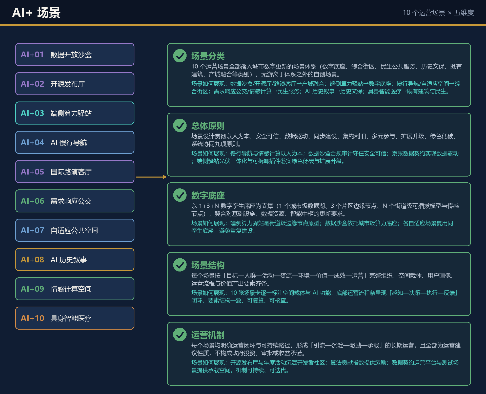

| 核对维度 | 一致性核对结论（参与方自查） |
| --- | --- |
| 场景分类 | 10 个 AI+ 环节全部可落入行动计划确立的城市数字更新场景体系（数字底座、综合街区、民生公共服务、历史文保、既有建筑、产城融合等类别），无游离于标准体系之外的自创场景 |
| 总体原则 | 环节设计贯彻行动计划倡导的总体原则：以人为本、安全可信、数据驱动、同步建设、集约利旧、多元参与、扩展升级、绿色低碳、系统协同 |
| 数字底座 | 1+3+N 数字孪生底座、边缘算力节点与京张数据契约，与行动计划对城市数字底座（基础设施、数据资源、智能中枢）的更新要求一致 |
| 场景结构 | 各环节按「目标—人群—活动—资源—环境—价值—成效—运营」结构组织，与行动计划推荐的场景组织方式一致 |
| 运营机制 | 各环节均明确运营闭环与可持续路径，且全部为运营建议性质，不构成政府投资、审批或收益承诺 |

**核对结论**：京张数智折叠带 场景体系与《深化智慧城市发展 推进全域数字化转型行动计划》方向一致、结构兼容、机制可对接，可作为行动计划在 AI 创新街区场景下的概念性落地参考（该文件为参与方提交、待来源登记复核材料，结论按参与方自查口径理解，登记复核通过前不作为正式一致性认定）。所有 AI 应用同时遵循本方案「伦理与数据治理」边界。

### 伦理与数据治理

感知数据本地化处理（片区边缘节点内脱敏后才可上行）、公众告知与退出机制（场景节点公示数据采集范围与用途，提供实体退出通道）、算法审计与偏见检测（算法贡献指数评审含公平性评估）。城市智能体可辅助识别慢行断点、公共空间热力、设施维护、企业服务需求和活动安全风险，但不能替代规划审批、不能输出未经授权的个人画像、不能声称获得官方实施承诺。所有 AI 场景节点进入结构化图层或合规矩阵，便于评审者核查其与产业、空间和公共利益的关系。

## 用地、建筑规模与拆改留方案

用地方案依据国土空间调查、规划、用途管制分类公开标准表达 [standard:MNR-LAND-USE-CLASSIFICATION-GUIDE]，形成完整、闭合、无缝的用地分区 [data:geometry/land_use.geojson#LU-001]。建筑方案区分保留、改造、更新、新建对象，高度、体量、界面和风貌控制由 [depth:height_massing_character] 管理，拆改留方法由 [depth:retain_renovate_demolish] 管理并对齐控规文本第 84 条「留改拆补多种更新方式」实施策略 [source:REGULATORY-PLAN-HD00-1601]。存量居住用地中 2000 年以前建成的老旧小区占比超 50%（控规文本第 39 条），综合整治以区属部门和央、国企平台多渠道推进、绿建化改造与智慧社区建设为控规路径（待复核），京张数智折叠带 的 AI+ 康养、自适应公共空间场景优先与老旧小区改造打包实施。

**规模上限校核**：方案任何情景下总建筑规模不突破控规 2408.0 万㎡ 总量上限 [metric:total_floor_area_ceiling_sqm]（控规文本第 7、13 条，参与方提交·待来源登记复核）；容积率基线约 1.46（2408.0 万㎡ ÷ 城乡建设用地 1645.6 公顷推导，标注推导公式与控规依据）[metric:statutory_floor_area_intensity]；提交范围内建筑基底占地比例 [metric:floor_area_ratio]。人口与岗位模拟基数采用控规文本值（待复核）：常住人口约 36.4 万人 [metric:population_baseline]、就业岗位约 39.7 万个 [metric:employment_baseline]。凡涉及具体地块的建筑高度、开发强度、退线等指标，因控规图则未数字化，统一写为「待正式图则条件确认」，不以推测值冒充审定指标（登记 `assumptions.json`）。

## 交通、轨道、市政与公共服务设施

交通方案对接控规条款：轨道站点一体化管控（控规文本第 36 条）与轨道微中心（适当提高开发强度、鼓励用地混合，控规文本第 37 条）、「轨道交通 + 绿色换乘」体系（控规文本第 51 条）、需求响应式公交与无人公交特色公交（控规文本第 52 条，已纳入场景卡 06）[source:REGULATORY-PLAN-HD00-1601] [depth:traffic_rail_slow_parking]。重点覆盖北五环、京张遗址公园跨环路节点、五道口、清华东路西口、大钟寺站及重点企业周边联系；道路和慢行图层保持在提交边界内，与公共空间、绿地、产业节点相互校核 [data:geometry/roads.geojson#ROAD-001] [data:geometry/public_space.geojson#PUBLIC-001]。

市政与公共服务设施落实控规专项统筹：雨污分流（2035 年城市集中建设区雨水管渠覆盖率 100%，控规文本第 58 条）、分布式光伏（控规文本第 60 条）、多网融合 5G（控规文本第 63 条），并与 京张数智折叠带 新型基础设施（分布式能源、端侧算力、边缘节点）融合布局 [depth:municipal_new_infrastructure]。海绵城市按控规年径流总量控制率分区管控（滨水与遗址公园沿线 ≥85%、过渡区 75%—85%、一般建成区 65%—75%，控规文本第 67 条及海绵城市规划图），京张数智折叠带 雨洪调蓄节点优先布置在 ≥85% 管控分区与蓝绿廊道交汇处。设施标准、服务半径、运营模式和分期逻辑在正文说明；管线、能源、排水、防洪（南长河—转河、北护城河 100 年一遇，土城沟 50 年一遇，控规文本第 27 条）、消防等工程资料缺失部分列为正式深化前置条件 [data:geometry/constraints.geojson#CONSTRAINTS]。

## 蓝绿空间、公共空间与城市风貌

蓝绿空间落实控规「三带六轴、多廊多中心」景观格局：三带即京张铁路遗址公园、南长河、小月河三条活力景观带（控规文本第 17 条）[source:REGULATORY-PLAN-HD00-1601] [depth:blue_green_public_space]。方案以遗址公园活力带为骨架，提出南北贯通、东西连通的步道、骑行道和绿色空间体系，识别慢行断点、上跨环路节点与公园南北端景观节点 [data:geometry/green_space.geojson#GREEN-001] [data:geometry/public_space.geojson#PUBLIC-001]。绿地与公共空间占比可复算指标分别为 [metric:green_ratio] 与 [metric:public_space_ratio]。

公共空间落实控规花园城市场景（控规文本第 33 条）、8 处社区会客厅（5 分钟步行生活圈，控规文本第 38 条）、四类游憩体系（专类公园、复合公共空间、社区公园、游园，控规文本第 29 条）与三级绿道网络（市级—区级—社区级，控规文本第 30 条）；京张数智折叠带 自适应公共空间优先选择社区会客厅与游园节点测试。城市风貌执行控规四类风貌分区（创新核心、高校科研、宜居生活、滨水活力）与街道五类管控，融合京张铁路历史文化、中关村创新文化和 AI 创新文化 [standard:MOHURD-URBAN-DESIGN-MEASURES]。AI 朝圣地标体系 = 7 个时空折叠点 + 「折」字视觉符号 + 算法贡献荣誉墙（贡献者姓名上墙须本人授权）；所有品牌、字体、图像、肖像和企业标识均有清权来源，风貌控制分清官方管控、设计建议和待确认条件，不给出伪精确控制线。

AI 公共空间组件库（模块化、可拆卸、可复用的「AI 城市插件」）：① 端侧算力驿站（街道级边缘节点舱体）；② 可拆卸 AR 导览柱（折叠点叙事终端，不侵入文保管控范围）；③ 自适应座椅与照明单元（按人流天气调节）；④ 公共代码贡献墙（开源荣誉展示界面）；⑤ 数据契约服务亭（授权申请、用途登记、审计查询）；⑥ 慢行信息牌（可解释导视与无障碍提示）。全部组件采用临时设施属性、标准化接口与统一样式手册，可供专业团队深化为施工图级产品族。

## 更新项目清单、实施政策与分期计划

实施项目清单与控规文本第 84—88 条实施策略和适应性规定衔接（三大设施、绿地广场与水域下限管理；公园绿地广场可在主导功能分区内调整位置形状；支路街坊路可优化线位）[source:REGULATORY-PLAN-HD00-1601] [depth:renewal_project_list] [depth:phasing_implementation]，分期空间证据为 [data:geometry/phasing.geojson#PHASE-001]。

| 项目编号 | 项目名称 | 类型 | 主要依赖 | 证据引用 |
| --- | --- | --- | --- | --- |
| JZ-01 | 京张遗址公园慢行断点缝合 | 公共空间/交通 | 道路红线、桥下空间、交通组织复核 | [data:geometry/roads.geojson#ROAD-001] |
| JZ-02 | 学北园数据沙盒与清河创新界面 | 新基建/蓝绿空间 | 算力底座载体、河道蓝线、生态和防洪条件 | [data:geometry/green_space.geojson#GREEN-001] |
| JZ-03 | 原点社区折叠中枢与近校成果转化街 | 城市更新/产业服务 | 校区边界、权属、首层业态 | [data:geometry/buildings.geojson#BLDG-001] |
| JZ-04 | 大钟寺站四象限步行连通与数据资产交易客厅 | 轨道一体化/慢行 | 轨道站点、道路交叉口、市政管线 | [data:geometry/public_space.geojson#PUBLIC-001] |
| JZ-05 | 1+3+N 数字孪生底座与端侧算力节点 | 新基建/公共服务 | 能源、算力、安全和运营主体 | [data:geometry/public_space.geojson#DATA-001] |
| JZ-06 | 7 个时空折叠点 AR/MR 体验工程 | 文化科技/运营 | 文保部门审批（仅限体验叠加）、场地与活动安全授权、内容清权 | [data:geometry/public_space.geojson#FOLD-001] |
| JZ-07 | 京张数据契约运营平台 | 数据要素/治理 | 控规文本第 82 条实施路径、企业 KYC 与审计机制 | [metric:data_covenant_coverage_ratio] |
| JZ-08 | 全球 AI 活动周公共路线 | 运营/品牌 | 公共空间许可、活动安全、版权清权 | [data:geometry/phasing.geojson#PHASE-001] |

分期与 100 天征集设计周期区分：近期试点（JZ-01、JZ-06、JZ-08，轻量设施与运营活动先行）、中期更新（JZ-02—JZ-05，待正式控规图则、市政、交通和权属条件确认）、长期治理（JZ-07，数据契约运营机制迭代）。运营机制三项：数据资产登记与交易（AI 企业以贡献算法换取数据使用权）、城市算法贡献指数（优化城市运行的模型获得政策或空间奖励）、时空叙事共创（开放历史数据接口，鼓励开发者创作京张历史 AI 游戏、影视、艺术内容）——均为运营建议，责任边界、转化路径和风险在正文中明示，不构成政府活动安排。

### 更新项目实施深化说明

在项目清单之上，为每个项目明确空间动作、与控规条款的衔接、实施阶段与核心合规约束，使项目从「卡片级」落到「可实施级」。阶段分为近期试点（P1）、中期更新（P2）、长期治理（P3），与 phasing.geojson 一致。

| 编号 | 空间动作（深化） | 控规衔接 | 阶段 | 核心约束 / 风险控制 |
| --- | --- | --- | --- | --- |
| JZ-01 | 贯通步行骑行断点、激活桥下空间、复核道口慢行通行宽度；以标识系统引导南北向人流 | 第 21 条京张沿线重点地区「南北通」慢行要求 | P1 | 道路红线未发布前仅作交通组织复核，不停工改造 |
| JZ-02 | 依托国家级算力底座布置 L3 数据沙盒、强化清河蓝绿界面与滨水交往；防洪与生态廊道衔接 | 第 82 条数据要素 + 河湖水系/蓝绿系统条款 | P2 | 河道蓝线、100/50 年一遇防洪条件确认后再实施 |
| JZ-03 | 校区—园区—街区慢行缝合、首层业态植入近校成果转化街、折叠中枢公共客厅 | 第 9 条两心之一；第 14 条基准强度 | P2 | 校区边界、权属未明确前仅作首层业态引导 |
| JZ-04 | 大钟寺站四象限步行连通、数据资产交易载体更新、交叉口慢行安全岛 | 第 9 条两心之一；第 21—23 条重点地区 | P2 | 轨道站点与管线条件由产权单位确认 |
| JZ-05 | 1+3+N 端侧算力节点复用灯杆/箱体集约利旧、街道级适配器原型 | 第 82 条城市运行智能体系 | P2 | 节点为临时模块不计入高度分区；避开地下空间禁建区 |
| JZ-06 | 7 折叠点 AR/MR 体验叠加工程、时空叙事内容共创平台 | 第 26 条文保清单 + 第 21—23 条重点地区 | P1 | 全国重点/市级文保仅体验叠加，物理改动 zero；实施前须取得文保审批、场地与活动安全授权，并按批准条件复核无物理干预边界 |
| JZ-07 | 京张数据契约运营平台（三级清单、企业 KYC、可审计日志） | 第 82 条数据要素市场化配置 | P3 | 指数为运营建议，不构成政府审批或承诺 |
| JZ-08 | 全球 AI 活动周公共路线设施（临时展亭、可拆装座椅、安全疏散） | 第 88 条适应性规定 / 公共空间许可 | P1 | 活动安全、版权清权前置；临时设施可拆装 |

### 三大重点片区设计深化

在「重点区域详细设计」定位之上，补充各片区的空间组织与关键控制要素：

**（1）学北园 AI 自主创新加速区（数智源点）**：花园型布局，清河界面为面向滨水的公共界面，「算力与数据沙盒」集中布置于产业组团核心，外围为院校研发与人才公寓过渡带。关键控制：L3 沙盒仅数据可用不可见，强化生态与防洪消解；低碳转动式交往空间控制园区微气候。

**（2）北京 AI 原点社区（折叠中枢）**：以清华园车站旧址为主折叠点形成时空叙事起点，沿近校慢行主轴布置成果转化街，街区级共享客厅承担开发者共创。关键控制：文保单位物理不干预，AR/MR 场景仅数字叠加；校区边界未明确前以首层业态引导替代空间拆改。

**（3）大钟寺 AI 产业聚集区（流通接口）**：大钟寺站为核心的四象限步行连通，数据资产交易载体重塑城市型智能经济界面，站前广场承担国际交往与集散。关键控制：轨道一体化改造与站房保一致，交叉口慢行安全优先于机动车效率。

三片区深度由 [depth:three_key_area_detailed_design] 约束，空间证据见 [data:geometry/key_areas.geojson]；学北园为统筹研究范围对象，控规深度落位与 A-SCOPE-NESTED-001 口径一致。

### 年度活动体系、品牌传播与转化路径（运营建议）

| 时段 | 活动品牌（建议名） | 内容设计 | 转化路径 |
| --- | --- | --- | --- |
| 春季 | 京张数据契约开放日 | L2 授权清单集中受理、数据要素合规培训、企业 KYC 服务周 | 企业用户 → 数据契约注册会员 |
| 夏季 | 折叠京张全球 AI 创新周 | 开发者大会、折叠点 AR 叙事季、产业测试验证场景开放周 | 开发者 → 开源项目 → 初创团队入驻对接 |
| 秋季 | 算法贡献指数年度评审 | 年度指数发布、荣誉墙揭幕、优秀算法城市部署展示 | 高贡献团队 → 测试场优先权与展示位 |
| 冬季 | 京张百年叙事季 | 1909 通车纪念、AI 历史叙事内容共创、公众时空穿越体验月 | 公众参与者 → 内容共创者 → 传播节点 |
| 常态 | 月度开源发布厅路演 + 季度场景开放日 | 成果首发、小型路演、场景体验预约 | 观众 → 社区成员 → 贡献者 |

品牌与传播视觉系统沿用「折」字符号与中缝折叠构图，活动主视觉按季节变体延展（同一符号体系、四套色彩）。国际传播以英文年度生态报告、折叠点国际导览、案例库开源发布和与全球创新街区结对交流为通道（概念建议）；人才、企业、开发者的后续转化路径全部落入上表右列，形成「活动引流—社区沉淀—指数激励—空间承载」的长期运营闭环，不构成政府活动安排或招商承诺。

### 实施与运营落地路径

**分期实施时序**（与控规第 84—88 条实施策略衔接，阶段与 phasing.geojson 一致）：P1 近期试点聚焦轻量、可逆、低干预对象——JZ-01 慢行缝合、JZ-06 折叠点 AR/MR 体验叠加、JZ-08 活动周临时设施，验证「体验即运营」；P2 中期更新待正式控规图则、市政、交通与权属条件确认后推进 JZ-02—JZ-05 的空间改造与节点网络铺装；P3 长期治理以 JZ-07 数据契约运营平台为主，随数据要素制度成熟持续迭代。P1→P2→P3 递进依赖「条件成熟度」而非固定时长，避免在控规图则与权属未明确前提早启动不可逆工程。

**土地混合利用与功能转换（正面清单管理）**：面向近千万㎡存量空间与 100 万㎡ 更新载体，功能转换遵循国家城市更新政策「正面清单」原则——仅允许从低效工业、仓储、旧办公向科创、文创、公共服务、保障性住房等鼓励方向转换，禁止向高密住宅、超标高度等负面方向突破。混合利用以控规 75 个主导功能分区为底账，新功能不得与主导功能冲突，高度与强度按 6 类基准高度分区与五级强度分区控制（待图则确认）。

**更新项目库「入库—出库」管理**：以项目库为实施抓手，JZ-01—JZ-08 登记条件成熟度（前置条件、责任主体建议、阶段标记）；满足控规图则、权属、市政、文保审批前置条件的项目标记「可实施」出库进入实施序列，未满足者保持在库并注明待确认事项（对应 assumptions.json 的 A-REGPLAN-DRAWINGS-001 等假设）。项目库与 5 年过渡期滚动衔接，形成「储备—转化—实施」闭环。

**CIM 数字底座与体检评估**：1+3+N 数字孪生底座对接 CIM，形成「规划—建设—运营」全周期数字档案；以年度体检评估支撑更新动作调整——体检反馈（慢行断点、公共空间热力、数据契约覆盖、自适应公共空间占比、算法贡献指数）反哺项目库优先级与空间设计迭代，落实控规第 83 条城市运行智能体系的常态化监测导向。

## 与《城市更新"十五五"规划》及国家城市更新政策对齐

本节将 京张数智折叠带 与《城市更新"十五五"规划》、国家持续推进城市更新行动相关文件及《城市更新规划编制导则》对齐，确保方案在指导思想、战略目标、重点任务与实施要求上与国家城市更新顶层设计一致 [source:CITY-RENEWAL-15TH-PLAN] [source:CITY-RENEWAL-ACTION-OPINION] [source:CITY-RENEWAL-PLANNING-GUIDE]。

### 重点领域对齐

| 国家规划重点领域 | 规划核心要求 | 京张数智折叠带 对齐设计 |
| --- | --- | --- |
| 城市空间布局优化 | 结构优化、功能完善、土地混合开发与用途合理转换、正面清单 | 「一带一轴两心多点」控规结构对位（待复核）；75 个主导功能分区底账识别低效机遇空间；功能转换与混合利用按正面清单管理 |
| 历史文化保护传承 | 先调查后建设、老城不能再拆、拆真建假禁止、活化利用避免过度商业化 | 7 个时空折叠点全部锚定控规文保清单，仅 AR/MR 体验叠加、不改动本体；AI 历史叙事属「以用促保」活化利用，严控商业化 |
| 基础设施更新改造 | 地下管网与生命线安全工程、平急两用、新型城市基础设施、CIM 数字底座 | 1+3+N 数字孪生底座对接 CIM；端侧算力驿站复用既有灯杆挂载（集约利旧）；市政与防洪按控规 100 年/50 年一遇设防 |
| 生态环境治理改善 | 修复城市生态系统、海绵城市、绿色低碳转型、慢行交通 | 三带六轴蓝绿格局；年径流总量控制率分区管控；分布式光伏一体化；绿色慢行系统贯通 |
| 产业结构转型升级 | 培育新质生产力、老旧厂区功能转换、发展首发/银发/低空/体验经济 | 三片区垂直分工（基础算法—开源生态—智能体商用）；大钟寺老旧载体更新植入新业态；10 个 AI+ 场景对应新质生产力与体验经济 |

### 实施路径、阶段目标与时间节点

按国家「专项规划—片区策划—项目实施方案」三级实施体系与「体检先行、无体检不更新」闭环，京张数智折叠带 实施路径划分为四个阶段（均为概念建议的时间框架，具体以官方实施计划为准）：

| 阶段 | 时间节点 | 阶段目标 | 对应项目 |
| --- | --- | --- | --- |
| 体检与策划 | 近期（方案深化期） | 完成片区体检、问题清单与更新对象识别，形成片区策划与项目库 | 全部 JZ 项目入库、临时边界待官方发布 |
| 试点示范 | 2026—2027 | 轻量设施与运营活动先行，形成可复制经验 | JZ-01 慢行缝合、JZ-06 折叠点体验、JZ-08 活动路线 |
| 重点更新 | 2028—2030 | 待正式控规图则、市政、交通与权属条件确认后推进载体更新，衔接规划 2030 年目标 | JZ-02 数据沙盒、JZ-03 折叠中枢、JZ-04 大钟寺、JZ-05 数字底座 |
| 长效运营 | 2031—2035 | 数据契约运营机制迭代，衔接规划 2035 年建成现代化人民城市愿景 | JZ-07 数据契约平台、年度活动体系 |

### 政策支持、资金保障与监督评估机制

- **政策支持**：依托国家城市更新用地政策（土地混合开发、用途依法合理转换正面清单、存量低效用地盘活、不超过 5 年过渡期政策）与房屋全生命周期安全管理制度；京张数智折叠带 的可拆卸 AI 城市插件按临时设施属性管理，契合功能转换与混合利用导向。
- **资金保障**：参照国家多元化投融资框架——中央预算内投资与中央财政支持、地方政府专项债券（严禁违法违规举债）、金融机构信贷、基础设施 REITs 与资产证券化、政府与社会资本合作新机制、「谁受益谁出资」的政府/市场/居民合理共担机制。京张数智折叠带 全部资金路径均为机制建议，不构成投资承诺或融资安排。
- **监督评估**：对齐国家「体检发现问题—更新解决问题—评估更新效果—推动巩固提升」闭环与规划实施的动态监测、中期评估、总结评估要求；京张数智折叠带 以 CIM 数字底座支撑城市体检评估信息平台，算法贡献指数与场景使用频次作为运营期动态监测指标，项目库按「入库—出库—动态调整」管理。

## 指标体系、面积复算与合规矩阵

指标体系分三类 [depth:metrics_recalculation]：第一类可由提交几何直接复算（边界面积、绿地与公共空间比例、建筑基底、重点区数量、折叠点与数据节点数量）；第二类需控规文本支撑（总建筑规模上限、容积率基线、人口与岗位基线，均引自控规，参与方提交·待来源登记复核）；第三类需运营校准（算法贡献指数、数据契约覆盖率、自适应空间占比、场景使用频次，正式运营后持续校准）。**第三类指标在 metrics.json 中均以 `value_type: design_target_not_measured / operational_metric_not_measured` 显式标注为设计目标值或运营期指标，当前不是实测结果、不构成绩效承诺**；每项均附验证方法与首次验证时点（试点段投用/数据契约平台上线后按季度统计），在该时点前正文与图件不得将其表述为已达成绩效。所有 known 指标可从 GeoJSON 或登记来源复算，完整数值、公式、置信度保存在 `metrics.json`；`scripts/spatial_review.py` 与 `scripts/visual_review.py` 结果为 formal 自证证据。

**证据等级说明（来源待复核期间的临时口径）**：在 `data/source_registry.json` 完成正式登记前，本方案引用的控规、三区两翼发布、《深化智慧城市发展推进全域数字化转型行动计划》、城市更新规划编制导则等外部文件均属**参与方提交、needs-review/待复核证据**，并非已登记的 approved_formal 正式证据（各文件直达链接、发布机构、文号与日期已在 sources.json 逐条补齐，供组织方来源登记审核）。因此下表与图件中标注为「控规」「待登记复核」的项目，其置信度仅指**参与方就公开获取文本的可读引用而言的内部校核置信度**，不表示该来源已获组织方来源登记审核通过；图 1、图 5 及正文中的相关置信度分级亦按此临时口径理解，登记审核完成后统一以登记状态为准。

| 指标 | 数值/状态 | 类别 | 依据 |
| --- | --- | --- | --- |
| 总体设计范围面积 [metric:site_area_sqm] | 约 1141.3 万㎡（provisional） | 一 | [data:geometry/site_boundary.geojson#SITE-001] |
| 建筑基底面积 [metric:building_footprint_area_sqm] | 约 31.1 万㎡ | 一 | [data:geometry/buildings.geojson#BLDG-001] |
| 绿地率 [metric:green_ratio] / 公共空间比例 [metric:public_space_ratio] | 12.3% / 7.3% | 一 | [data:geometry/green_space.geojson#GREEN-001] |
| 重点区域数量 [metric:key_area_count] | 3 | 一 | [data:geometry/key_areas.geojson#PROV-KEY-001] |
| 时空折叠点 [metric:fold_nodes_count] / 数据节点 [metric:data_nodes_count] | 7 / 12 | 一 | [data:geometry/public_space.geojson#FOLD-001] |
| 总建筑规模上限 [metric:total_floor_area_ceiling_sqm] | 2408.0 万㎡ | 二 | 控规文本第 7、13 条（待复核）[source:REGULATORY-PLAN-HD00-1601] |
| 容积率基线 [metric:statutory_floor_area_intensity] | 14632 ㎡/ha（约 1.463 万㎡/ha） | 二 | 控规文本第 7 条（待复核） |
| 建筑基底占地比例 [metric:floor_area_ratio] | 约 2.72% | 一 | [data:geometry/buildings.geojson#BLDG-001] |
| 人口 [metric:population_baseline] / 岗位 [metric:employment_baseline] 基线 | 36.4 万 / 39.7 万 | 二 | 控规文本第 7 条 |
| 算法贡献指数 [metric:algorithm_contribution_index] | 运营期校准 | 三 | 控规文本第 82 条实施建议 |

合规矩阵是任务响应性主控文件：公告 1.3、1.4、1.5 与 agent.1—agent.6 每条必选任务对应报告章节、图层、指标、图纸、HTML 页面、来源、假设和自检项；控规合规模块将 16.7 km² 范围、2408 万㎡ 上限、6 类高度分区、75 主导功能分区、13 处文保、三带六轴、两心多点逐条映射到章节与图层，每条标注 `[source:REGULATORY-PLAN-HD00-1601]`。

### 指标复算方法与验证流程

以下给出核心指标的可执行复算口径、置信度与误差说明，以及在官方边界发布后的重算触发条件，确保「指标可核查、口径可追溯、边界可更新」。官方边界发布并替换 provisional 几何时，保留替换前后的几何版本、坐标系与差异记录，形成可追溯的版本变更档案，供面积、绿地、公共空间、建筑基底与节点拓扑的复算差异核对。

| 指标 | 复算口径（EPSG:4548） | 置信度 | 误差来源 | 官方数据发布后重算触发 |
| --- | --- | --- | --- | --- |
| 总体设计范围面积 site_area_sqm | polygon_area(site_boundary.geojson) | 低 | 边界为公告口径临时示意几何，非控规正式红线 | 以官方边界重跑 `scripts/metrics.py` 面积随边界自动更新 |
| 建筑基底面积 building_footprint_area_sqm | Σ polygon_area(buildings.geojson) | 低 | 示意占位几何，非现状实测 | 以实测建筑基底替换后重算 |
| 绿地率 / 公共空间比例 green_ratio / public_space_ratio | green/public_space_area ÷ site_area | 低 | 绿地图层为设计示意，非竣工验收实测 | 以官方公园方案绿量替换 |
| 重点区域数量 key_area_count | count(key_areas.geojson) | 高 | 边界属性随官方确认 | 官方边界确认后重检拓扑 |
| 折叠点/数据节点/AR-MR 点 | count(SCENARIO_NODE by node_type) | 高 | 坐标按文保实体示意校准 | 文保坐标正式复测后重校 |
| 总建筑规模上限 total_floor_area_ceiling_sqm | 读控规文本第 7/13 条常量 2408.0 万㎡ | 中（控规条款·待登记复核） | 无（文本约束，非测量量；来源待登记复核） | 登记复核通过后升级为正式依据 |
| 平均开发强度 statutory_floor_area_intensity | 2408.0万㎡ ÷ 1645.6公顷 = 14632 ㎡/ha（约 1.463 万㎡/ha，推导基线） | 中 | 分母为城乡建设用地推导值 | 以官方图则用地分解复核 |
| 人口/岗位基线 population/employment_baseline | 读控规文本第 7 条常量 36.4 万 / 39.7 万 | 中（控规条款·待登记复核） | 无（来源待登记复核） | 登记复核通过后升级为正式依据 |
| 算法贡献指数 algorithm_contribution_index | 运营期：模型调用频次 × 场景权重 × 效果评估分 | 未知（运营期） | 依赖平台运行数据 | 数据契约上线后按季度校准 |
| 数据契约覆盖率 data_covenant_coverage_ratio | 已登记 L1/L2/L3 场景数 ÷ 场景总数（控规第 82 条，待复核） | 低（目标值 60%） | 场景清单逐年演进 | 每年随项目库更新重登记 |
| 自适应公共空间占比 adaptive_public_space_ratio | 可调公共空间面积 ÷ 公共空间总面积（目标 30%） | 低（目标值） | 依赖实施认定 | 实施进度后逐年复测 |

**验证流程**：所有「类别一（可直接复算）」指标由 `scripts/spatial_review.py` 与 `scripts/metrics.py` 输出正式自证证据；「类别二（控规文本常量）」指标以 `[source:REGULATORY-PLAN-HD00-1601]` 条款（参与方提交·待来源登记复核）为依据；「类别三（运营校准）」指标仅定义计算口径，正式上线后校准。任何一次官方边界发布、文保坐标复测、实测建筑基底替换都会触发对应指标的重新计算，并将新值与差异写入 `metrics.json` 变更记录，确保评审与归档阶段的指标均来自最近的确定口径。

### 2408 万㎡ 总量到空间结构的情景落位（方案情景，非承诺值）

**口径声明**：下表仅针对控规范围（16.7 km²，九街区，待来源登记复核）将控规公开文本第 7/13 条 2408.0 万㎡ 总量按「一带一轴，两心多点」（第 9 条）结构落到街区与重点片区的情景测算，用于论证方案情景在总量上限（待登记复核）内的可行性；**不含任何地块级指标承诺、不含财务或投资数据**，地块最终指标以官方图则为准。**完整情景口径（定性优先序、指示性区间、约束条件、触发重算规则）见 `metrics.json → floor_area_scenario_allocation`**。

**分区互斥声明**：下表四个分区**互斥、不重叠**——按主导功能在空间上互不重叠地切分 16.7 km² 控规范围，任何建设容量只计入一个分区，不重复计量。「京张遗址公园产业创新带」**仅统计遗址公园本体及其两侧紧邻的更新改造带**（不再与两心空间范围叠加）；两心范围内的遗址公园路段容量已含在对应「两心」行内，不在「一带」行重复计入。分区面积不单独给定（待官方图则主导功能分区几何），分摊以各分区主导功能定位 × 对应强度五级分区（第 14 条）× 6 类基准高度（第 16 条）为约束逻辑，而非由分区面积 × 固定容积率推出的伪精确值。

**控规范围内（16.7 km²）互斥分区情景落位：**

| 互斥空间分区 | 容量优先序 | 指示性占比区间（待校准） | 分区边界与测算逻辑 |
| --- | --- | --- | --- |
| 五道口中心（原点社区） | 高（1） | 15%–25% | 折叠中枢：近校成果转化 + 人才社区，叠加轨道站点高强度复合；**含其范围内遗址公园路段容量** |
| 大钟寺中心 | 高（1） | 15%–25% | 流通接口：站城一体化 + 数据资产交易载体；**含其范围内遗址公园路段容量** |
| 遗址公园沿线更新带（两心以外） | 中（2） | 20%–30% | 遗址公园本体及两侧紧邻更新带的低矮科创交往空间（官方口径 100万㎡ 更新载体落位带）；**与两心不重叠** |
| 其余街区存量更新（两心与一带以外） | 低（3） | 30%–45% | 两心及遗址公园沿线以外的其余街区，以存量改造为主，拆旧建新严格控制 |
| **控规范围内合计** | — | **100%** | 情景总量控制值 2108 万㎡ ≤ 2408 万㎡ 总量上限（待复核）；区间为定性量级参考，不作求和验证 |

**不重复计量校核**：四分区按主导功能在空间上互斥，任一容量只计入一个分区；两心为容量主要承载（优先序 1），遗址公园沿线更新带次之（优先序 2），其余街区以存量改造为主（优先序 3）。2108 万㎡ 为控规范围内方案情景总量控制值（非分区精确分摊之和）；指示性占比区间仅为量级参考，分区精确容量待官方图则主导功能分区几何发布后校准，无重复计入。

**控规范围外单列（不计入 2408 万㎡ 总量）：**

| 空间组成 | 情景规模（万㎡） | 口径 |
| --- | --- | --- |
| 学北园（统筹研究范围 43.6 km² 内、16.7 km² 控规范围外） | 300 | 统筹研究承载：算力与数据沙盒产业，**单列核算，不占用、不计入控规总量** |

**情景自检规则**：① 控规范围内方案情景总量控制值 2108 万㎡ ≤ 2408 万㎡ 总量上限（待复核，余量 300 万㎡ 作为弹性缓冲，待官方图则细化后校准）；② 分区容量以定性优先序表达（两心 ＞ 遗址公园沿线 ＞ 其余街区）并附指示性占比区间，不给定分区精确值、不作求和验证，符合「两心多点」结构逻辑；③ 各分区分别受对应街区强度五级分区（第 14 条）与 6 类基准高度分区（第 16 条）约束，遗址公园沿线带的低矮科创空间不突破其所在分区强度上限；④ 学北园 300 万㎡ 位于 16.7 km² 控规范围之外，属统筹研究范围（43.6 km²）承载，单列核算、不参与 2408 万㎡ 总量的分配与合计，与 A-SCOPE-NESTED-001 口径一致。该情景落位为设计论证参数，**不构成对官方审批的控制值承诺** `[assumption:A-FLOORAREA-001]`。

### 控规条款逐条对照表

下表将控规文本本方案实际引用的条款（参与方提交、待来源登记复核），按「条款原文要点 → 方案响应 → 对照方式 → 风险与回退」逐条核对。响应均落位到具体章节、图层或指标，确保任务响应性可机器复核 `[source:REGULATORY-PLAN-HD00-1601]`。

| 条款 | 控规要点 | 京张数智折叠带 响应 | 对照方式 | 风险与回退 |
| --- | --- | --- | --- | --- |
| 第 2 条 | 规划范围 16.7 km²、9 街区 | 三层范围框架中作为基准（待复核）；与公告 11.4 km² 总体设计范围作嵌套关系（A-SCOPE-NESTED-001） | `site-overview` 图、metrics.total_floor 引用范围常量 | 官方正式边界未发布；回退：控规四至 + provisional 边界交叉校核 |
| 第 7 条 | 常住 36.4 万 / 就业 39.7 万 / 总建筑规模上限 2408.0 万㎡ | 人口、岗位、总量基线作为设计校核上限与情景测算基准 | [metric:population_baseline] [metric:employment_baseline] [metric:total_floor_area_ceiling_sqm] | 来源待登记复核；情景落位仅为论证参数 |
| 第 9 条 | 「一带一轴，两心多点」空间结构 | 折叠带×数据走廊对位一带一轴；五道口/大钟寺对位两心；多点作 1+3+N 节点与折叠点锚池 | `land-use-structure` 图、`fold_nodes` 落位 | 多点具体落位点按公告景观轴校准，待官方结构图转绘核对 |
| 第 10 条 | 城乡建设用地 1645.6 公顷 | 用于推导平均强度分母 | metrics.statutory_floor_area_intensity | 推导值，非承诺；以官方图则用地分解复核 |
| 第 12 条 | 75 个主导功能分区（居住26/文教16/混合17/绿地水域6等） | 城市更新底账单元，拆改留分类以此分区为底账 | [data:geometry/land_use.geojson] | 分区边界为图像未数字化，地块级按示意处理 |
| 第 13 条 | 总建筑规模上限 2408.0 万㎡（设计校核上限·待登记复核） | 写入生成约束与自检（A-FLOORAREA-001），任何情景不突破 | `2408 万㎡ 情景落位` 小节 | 突破风险（控制：自检脚本校验总量上限） |
| 第 14 条 | 基准强度五级分区 | 更新强度不突破对应五级分区 | [metric:floor_area_ratio] 复核 | 图则未数字化，地块级强度结论标注「待正式图则」 |
| 第 16 条 | 36/45/60/80/100 米 6 类基准高度分区 | 建筑高度按分区控制（待图则确认）；1+3+N 边缘节点为临时模块不计入高度 | 高度分区在图则 | 地块级高度待图则确认 |
| 第 21—23 条 | 二级重点地区：京张沿线、南长河绿廊沿线、西直门枢纽 | 7 折叠点锚定二级重点地区；FOLD-007 西直门枢纽 | `fold_nodes` 落位、折叠点场景图 | 折叠点坐标按文保实体示意校准 |
| 第 26 条 | 13 处不可移动文物 | 折叠点全部锚定文保清单；全国重点/市级文保仅 AR/MR 体验叠加（physical_intervention=none） | [metric:fold_nodes_count][metric:ar_mr_experience_points] | 文保改动物理风险（控制：传感器不进保护范围与一类建控地带、地下空间禁建区不布节点） |
| 第 82 条 | 探索数据要素市场化配置 | 「京张数据契约」三级清单 + 算法贡献指数 + 智慧城市条款落位 | [metric:data_covenant_coverage_ratio][metric:algorithm_contribution_index] | 指数为运营建议，不构成政府审批或承诺 |
| 第 83 条 | 智慧城市运行（配套条款） | 1+3+N 数字孪生底座对接城市运行智能体系 | [metric:data_nodes_count] | 以第 82 条为主实施，第 83 条作体系支撑 |

**核验口径**：以上「验证方式」所指图层、指标与自检项均可在 `geometry/`、`metrics.json`、`compliance_matrix.json` 中定位复核；涉及地块级（强度/高度/权属）的结论一律标注「待正式图则条件确认」，符合 A-REGPLAN-DRAWINGS-001 假设登记。

## 风险、版权与合规说明

**要求双语言。** 方案主文件为中文，`proposal.en.md` 提供完整对照译文；A3/A0、HTML 和含文字图件均提供对应语言副本，并优先使用 `docs/terminology-glossary.md` 的赛事推荐译法。所有图片、图纸、图标、数据和代码资产在 `sources.json` 或 `report/copyright_statement.md` 中说明来源、许可和授权状态。HTML 页面不加载远程脚本、远程地图瓦片、远程字体、iframe、表单或外部 API，不跟踪评审者行为。

风险与缺资料清单由风险深度项、约束图层和场地包共同校核 [depth:risk_missing_data] [data:geometry/constraints.geojson#CONSTRAINTS] [source:SITE-PACKAGE]，关键风险包括：官方边界与重点区 polygon 未发布（回退：provisional 边界 + 控规四至交叉校核）；控规图则未数字化（回退：仅引用文本条款，地块级结论降级为待确认）；建筑规模突破风险（控制：2408 万㎡ 写入生成约束与自检）；文保禁建风险（控制：文保单位仅体验叠加，传感器不进入保护范围与一类建控地带，地下空间禁建区不布置数据节点）[source:REGULATORY-PLAN-HD00-1601]。

本方案不声称官方批准、审定控规、最终土地权属、最终建设规模或保证实施。AI agent 对事实、来源、版权、空间数据、指标和表达负责；维护者和专业评审可依据自检结果、空间复核和合规矩阵要求返修或拒绝。建筑专业深度规定待取得官方文件后启用，当前作为缺资料清单管理 [standard:MOHURD-ARCH-DESIGN-DEPTH-2016]。

编制单位声明：本方案由北京新瑞锦世数智科技有限公司通过 AI Agent（FoldWeaver-v1）辅助编制，属开放共创概念建议。方案内容仅供讨论，不构成该公司对任何规划结论的官方背书、授权或承诺。

## 参考资料

- 《HD00—1601 等街区控制性详细规划（街区层面）（2024 年—2035 年）》文本条款 [source:REGULATORY-PLAN-HD00-1601]
- 官方「三区两翼」发布口径（百年京张 AI 创新带产业事实）[source:THREE-ZONES-TWO-WINGS-RELEASE]
- brief/public-brief.md、brief/site-package/design_brief.json、brief/site-package/enums/ [source:SITE-PACKAGE]
- data/processed/agent_fact_pack.md [source:PROCESSED-FACT-PACK]
- 征集资格预审公告 [source:OFFICIAL-ANNOUNCEMENT]、面向智能体任务书 [source:AGENT-TASKBOOK]
- 完整机器索引：见 `sources.json`、`metrics.json`、`compliance_matrix.json`、`standard_matrix.json` 与 `design_depth_matrix.json`
