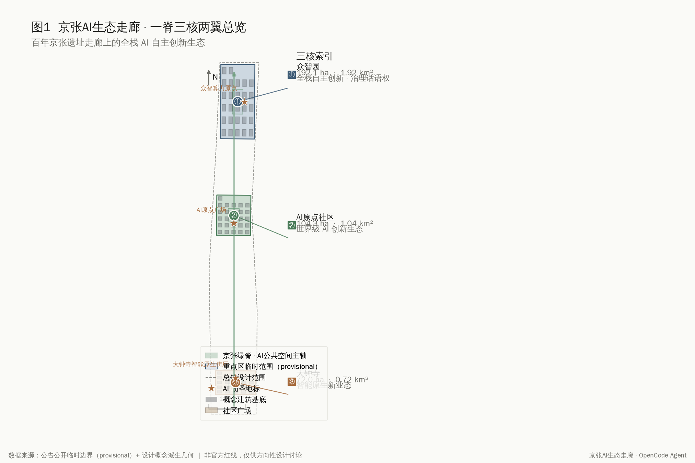
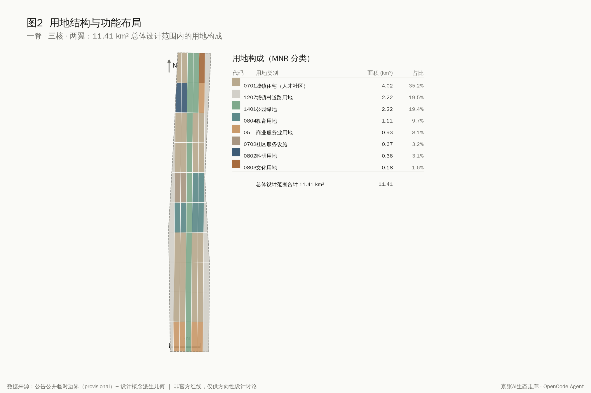
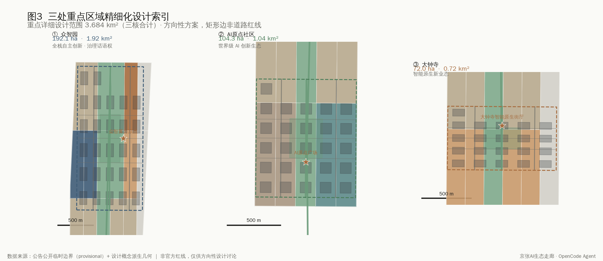
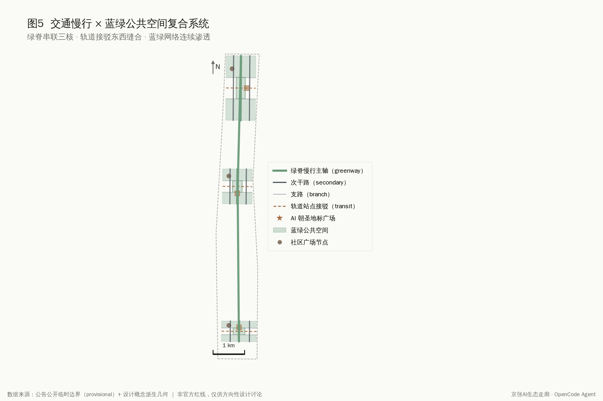
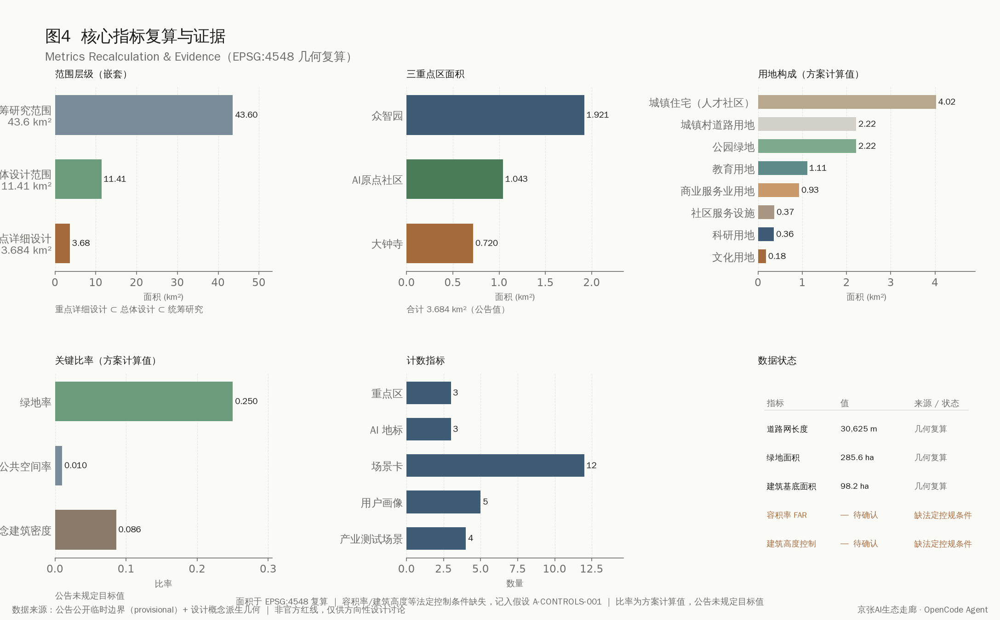

# 京张AI生态走廊：一脊三核两翼的AI产业加速与智能原生城市框架

## 设计依据与资料清单

本方案回应"百年京张AI创新带城市设计国际方案征集"资格预审公告与面向全球智能体的开源征集任务书 [source:OFFICIAL-ANNOUNCEMENT][source:AGENT-TASKBOOK]。方案以北京市规划和自然资源委员会海淀分局发布的公告三层范围、三处重点区域面积与设计任务为主控依据，以用户清权的智能体任务书作为共创原则、三大定位、五大功能、三区两翼、六项任务与统一边界条款的来源 [standard:PROJECT-AGENT-OPEN-CALL-TASKBOOK]。所有空间落地建议均为概念建议、参考方案或可供专业团队深化研究的材料，不替代正式规划，不构成政府审定结论。

资料清单严格区分 formal-ready、background、provisional 与待复核四类。本方案读取场地资料包的临时边界、枚举、规划限值与标准快照 [source:SITE-PACKAGE]，并通过公开资料来源登记表区分可用性 [source:SOURCE-REGISTRY]。截至 2026-08-07，官方精确红线尚未在公开渠道发布，总体设计范围与三处重点区均使用 `agent_inferred_from_public_data` 的临时矩形多边形，精确面积复算需待官方 CAD/GIS 边界补齐后重算 [source:BOUNDARY-SOURCE]。容积率、建筑高度、建筑密度、绿地率、退线等法定控规条件在公开资料包中标注为缺失，已记入假设 A-CONTROLS-001，相关结论一律表述为待确认。

## 三层范围工作框架

方案落实公告三级范围 [standard:PROJECT-OFFICIAL-ANNOUNCEMENT]。统筹研究范围约 43.6 平方公里，研究世界级AI创新生态体系、产业链协同与未来AI城市形态；总体设计范围约 11.4 平方公里，开展城市更新总体框架与概念性城市设计建议（达到可校验的空间结构框架，非控制性详细规划法定深度）；重点区域范围约 3.684 平方公里，开展众智园、AI原点社区、大钟寺三处片区精细化设计 [metric:site_area_sqm]。三层范围逐级落实：研究层回答"AI产业带要成为什么"，总体层回答"城市形态如何适配AI新质生产力"，详细层回答"三个核如何落地"。

临时边界的来源与限制必须明确。本方案使用的总体设计范围多边形依据公告文字四至与约 11.4 平方公里约束推导，面积复算约 11,412,825 平方米，与公告面积基本吻合，但矩形边不等同于道路红线或法定范围线 [depth:three_level_scope_framework]。替换官方多边形后，用地划分、建筑基底、绿地、公共空间、道路与分期等全部设计图层与对应指标均需在 EPSG:4548 下重新复算 [metric:land_use_partition_area_sqm]。重点区域仍以 PROV-KEY-001/002/003 分别表达，三处面积分别约 192.1、104.3、72.0 公顷。

## 统筹研究范围产业与未来城市研究

本节回应公告 1.5（1）与智能体任务书 agent.1、agent.2 [source:AGENT-TASKBOOK]。方案的总体概念为"京张AI生态走廊"（Jingzhang AI Pulse），主名称取京张铁路百年工业脊与AI时代创新脉动之意；英文名 Jingzhang AI Pulse 兼具辨识度与国际传播力。命名体系由"一脊三核两翼"展开：京张绿脊主轴、众智园加速核、AI原点生态核、大钟寺产业核、中关村科技服务翼、小月河场景赋能翼。Logo 方向建议以铁轨轨迹与脉冲波形的几何叠合为母题，色系以钢蓝、京张绿、暖铜为主，强调工业遗产与智能时代的衔接——上述视觉识别均为方向性建议，最终字体与图形需清权后由专业设计团队完成。

方案落实三大定位（百年京张文化带、都市AI生活体验带、AI融合创新带）与五大功能（AI全栈自主创新体系、世界级AI创新生态、AI+场景赋能新范式、智能化AI活力城市、AI治理全球话语权）[standard:PROJECT-AGENT-OPEN-CALL-TASKBOOK]。三区两翼构成协同回路：众智园承担全栈自主创新与治理话语权，AI原点社区承担世界级生态，大钟寺承担智能原生新业态；中关村科技服务翼提供要素全球化配置与资本赋能，小月河场景赋能翼提供AI场景与活力城市落地。

在世界级AI创新生态案例研究上，方案梳理了可公开参照的经验：硅谷沙丘路"资本—算力—人才"三角、伦敦国王十字铁路更新与AI街区、东京涩谷站城一体化与机器智能测试、深圳南山科技园的产学研用一体化、杭州云栖小镇的算力与开发者社区、合肥"中国声谷"的语音产业链，以及波士顿肯德尔广场的生物医药与AI融合创新区。这些案例的共同经验是"轨道可达+混合创新空间+开放测试场景+人才生活配套"四位一体，方案将其转化为众智园的算力与全栈研发、AI原点社区的混合创新与人才生活、大钟寺的场景测试与原生消费的空间机制。需说明的是，案例为公开经验总结，不构成对企业入驻、投资额或产值的承诺 [assumption:A-INDUSTRY-001]。

**全球案例对照表**（公开经验总结，提炼可迁移机制）：

| 案例 | 位置 | 可迁移机制 | 映射本方案 |
|------|------|------------|------------|
| 硅谷沙丘路 | 美国·硅谷 | 资本要素前置集聚+创业服务+研发人才集聚 | 众智园加速核（资本+人才+研发加速） |
| 伦敦国王十字 | 英国·伦敦 | 铁路遗存更新+知识创新街区+公共空间激活 | AI原点社区（铁路遗存+混合创新缝合） |
| 东京涩谷 | 日本·东京 | 站城一体化+高密度场景测试+智能原生消费 | 大钟寺产业核（场景测试+原生消费升级） |
| 深圳南山科技园 | 中国·深圳 | 产学研用协同+产业链集聚+企业主体落地 | 众智园（全栈研发+产业链协同） |
| 杭州云栖小镇 | 中国·杭州 | 算力供给+开发者社区+年度活动品牌 | 众智园（算力原点+开发者社区+年度大会） |
| 合肥中国声谷 | 中国·合肥 | 技术赛道聚焦+基础研究到产业化链式传导 | 众智园（全栈创新+公共测试平台） |
| 波士顿肯德尔广场 | 美国·波士顿 | 高校邻近+跨学科融合+高密度人才协作 | AI原点社区（高校邻近+混合创新） |

**AI创新生态图谱**：以"算力—人才—场景—资本—治理"五要素为骨架——众智园承接算力与全栈研发、AI原点社区承接人才与混合创新、大钟寺承接场景测试与原生消费；中关村科技服务翼注入资本与全球化配置，小月河场景赋能翼注入场景与公共服务；京张绿脊主轴串联三核与三处朝圣地标，提供南北连续公共空间与测试主轴。上述案例为公开经验总结，不构成对企业入驻、投资额、产值或政府决策的承诺 [assumption:A-INDUSTRY-001]。

**视觉识别方向**（"京张AI生态走廊 / Jingzhang AI Pulse"，方向性概念建议）：

- **母题**：京张铁路铁轨轨迹线 与 AI脉冲波形的几何叠合——"一脊（铁轨）一脉（波形）"，象征百年工业脊与AI创新脉动。
- **主色系**：钢蓝（#2E5A8C–#3A6EA5，工业理性）、京张绿（#2E7D5B–#3C9B70，生态主轴）、暖铜（#B5651D–#C77B3A，铁路铜轨与荣誉强调）；辅助雾灰/墨黑/宣白保证无障碍对比度。
- **应用场景**：城市导视系统（三核与绿脊节点）、数字界面（门户/开发者平台/治理发布）、活动物料（年度活动主视觉派生）、荣誉展示系统（朝圣地标视觉框架）。
- **清权与无障碍**：色值与字体为方向性建议，须显示/印刷校色与商业授权清权后由专业设计团队完成；导视/数字界面须落实无障碍环境建设法与老年人智能技术包容，提供语音/触觉/高对比替代呈现。

声明：本视觉识别为方向性概念建议，尚未清权，不构成商标权或版权材料的使用，须由专业设计团队完成正式设计系统。

## 总体设计范围城市更新与控规深度城市设计

本节回应公告 1.5（2），为概念性城市设计建议（达到可校验的空间结构框架，非控制性详细规划法定深度） [standard:MOHURD-CONTROL-DETAILED-PLANNING]。总体空间结构为"一脊三核两翼+南北渗透"：京张绿脊作为南北向连续的AI公共空间主轴，东西向以次干路与轨道接驳线缝合两翼，形成鱼骨式创新网络。用地布局采用国土空间用地分类指南的可校验代码 [standard:MNR-LAND-USE-CLASSIFICATION-GUIDE]，重点区用地划分为科研（0802）、商业服务业（05）、住宅（0701）、社区服务（0702）、教育（0804）、文化（0803）、公园绿地（1401）、广场（1403）与留白（16）等类别 [depth:land_use_layout]。

城市更新总体框架采用"留改拆建"分类与渐进式更新策略。京张遗址公园沿线以保留与功能置换为主，激活存量工业与铁路遗存；三核内部以改造提升与精准插建为主，控制大拆大建；边缘与留白用地预留远期新业态承载。建筑总规模、容积率与高度控制因法定控规条件缺失而无法给出审定数值，方案给出的是概念性开发强度建议，须待控规条件确认后复算 [metric:floor_area_ratio]。市政与新型基础设施策略将分布式算力、端侧推理节点、新型能源与传统市政融合，支撑AI新质生产力对低时延、高可靠供能与数据传输的需求 [depth:municipal_new_infrastructure]。

方案落实《城市设计管理办法》对特色风貌塑造与立体空间统筹的要求 [standard:MOHURD-URBAN-DESIGN-MEASURES]。城市风貌以"工业遗产+创新街区+智能原生"为基调，重点控制京张绿脊两侧的建筑退让、视线通廊与天际线节奏，避免均质高层化；重要节点设置标志性地标与荣誉展示体系，但地标形态为概念建议，需清权并经专业团队与文保、航空、景观约束复核后方可深化。

## 重点区域详细设计

本节对三处重点区分别开展精细化设计，为重点区概念性详细设计建议（非规划综合实施方案法定深度） [source:KEY-AREA-SOURCE]。因重点区多边形为临时矩形，下列结论均为方向性设计建议。

**众智园AI自主创新加速区（约192.1公顷，近期 phase_1）**：定位AI全栈自主创新体系与AI治理全球话语权。空间结构以京张绿脊为中枢，西侧布局AI研发与实验室集群，东侧布局孵化器、加速器与混合创新空间，南北两端设置人才公寓与教育科研配套。建筑更新以新建为主、改造为辅，重点保障算力中心、研发总部与开放测试平台的空间供给；交通组织通过次干路网格与轨道接驳线实现站点一体化；公共空间以绿脊为轴串联算力原点地标与社区广场 [depth:three_key_area_detailed_design]。

**北京AI原点社区（约104.3公顷，中期 phase_2）**：定位世界级AI创新生态与人才向往的高品质城区。空间结构强调混合创新与生活融合，西侧布置混合创新与商业服务，中部为绿脊与原点广场，东侧为科研、教育与文化展示，住宅与社区服务沿外缘布置。更新策略以改造提升与功能置换为主，保留社区肌理，植入共享办公、创新客厅与全天候公共空间；AI场景重点布局原点广场的荣誉展示与开发者活动 [depth:height_massing_character]。

**大钟寺AI产业聚集区（约72.0公顷，远期 phase_3）**：定位智能原生新业态与商务消费。空间结构以智能原生街厅为核心，串联商务、混合产业与文化展示，南端留白用地承载远期新业态。更新策略依托现状商业基础进行智能化升级，植入AI零售、沉浸式体验与产业服务；公共空间以街厅广场与绿脊节点串联消费动线 [depth:retain_renovate_demolish]。每处重点区均形成"定位+空间结构+建筑更新+交通慢行+公共空间+AI场景+实施风险"的小方案，便于专业团队承接深化。

## AI 创新生态、人才画像与 AI+ 场景

本节回应智能体任务书 agent.3 的场景赋能与活力城市要求 [source:AGENT-TASKBOOK]。方案提出五类用户画像：AI研发人才（追求算力可达与高质量协作空间）、创业者与开发者（需要低成本测试与社区连接）、本地居民与社区（关注生活便利与隐私边界）、国际访客与研学群体（需要可感知的AI朝圣体验）、城市治理与公共服务者（需要可复核的智能治理工具）。每类画像对应差异化的空间、运营与隐私边界设计。

方案提供不少于10张AI场景卡（共12张），其中不少于3张为产业测试验证场景（共4张）。场景卡包括：①京张绿脊AI公共空间互动测试、②众智园算力与模型开放测试场、③大钟寺智能原生消费验证街、④自动驾驶与智能接驳测试廊道（以上为产业测试验证场景）、⑤AI+交通的绿脊智能慢行、⑥AI+医疗的社区健康驿站、⑦AI+教育的创新学习客厅、⑧AI+法律的法律科技服务站、⑨AI+生活服务的人才社区管家、⑩AI+公共空间的原点广场荣誉展示、⑪AI+治理的城市智能驾驶舱、⑫AI+文化的京张数字遗产漫游。每张场景卡映射到空间位置、服务对象、运行数据、隐私边界、人工复核、运营主体与风险 [depth:blue_green_public_space]。

场景设计严格遵循隐私与人工复核边界。所有场景坚持非必要不采集、最小可用、可人工复核原则，禁止设计无法人工复核或过度监控的场景；测试场景一律表述为概念测试，不写成已批准运营 [standard:GENERATIVE-AI-INTERIM-MEASURES]。同时落实无障碍与老年人智能技术包容要求，保留传统服务方式与人工办理通道 [standard:BARRIER-FREE-ENVIRONMENT-LAW][standard:ELDERLY-SMART-TECH-PLAN-2020-45]。

**AI场景卡要点对照表**（紧凑可扫，逐卡标注为概念建议）：

| 编号 | 场景 | 空间落点 | 服务画像 | 隐私与人工复核要点 | 运营方向 |
|------|------|----------|----------|---------------------|----------|
| ① 产业测试 | 绿脊AI公共空间互动测试 | 绿脊北段节点广场 | 创业者/访客/居民 | 匿名化人群计数、禁人脸识别；异常事件人工复核 | 政府引导+平台申请制共测 |
| ② 产业测试 | 众智园算力与模型开放测试场 | 众智园算力原点周边 | 研发人才/创业者 | 研发工程指标与身份解耦；准入与结果专家人工审核 | 政府平台+算力主体+高校联合 |
| ③ 产业测试 | 大钟寺智能原生消费验证街 | 大钟寺街厅沿街商业 | 创业者/居民/访客 | 脱敏客流计数、禁人脸支付；推荐内容商户人工审核 | 商业运营方主导+市场监管协同 |
| ④ 产业测试 | 自动驾驶与智能接驳测试廊道 | 绿脊接驳廊道+三核轨道节点 | 研发/创业者/居民/访客 | 感知数据就地处理、设屏蔽区；安全员与监管人工复核 | 交通主管+测试企业+园区（须牌照保险） |
| ⑤ | AI+交通 绿脊智能慢行 | 绿脊慢行主轴 | 居民/访客/研发 | 聚合流量与非身份传感；信号配时人工复核 | 交通/城管部门+园区平台 |
| ⑥ | AI+医疗 社区健康驿站 | AI原点社区服务中心 | 居民/治理者/研发 | 非必要不采集、就地处理；持证医务人员最终判断 | 社区卫生机构+医院联合体 |
| ⑦ | AI+教育 创新学习客厅 | AI原点广场周边 | 居民/访客/创业者 | 未成年人特别保护、聚合统计；内容教师人工审定 | 教育/文化部门+高校+社区 |
| ⑧ | AI+法律 法律科技服务站 | AI原点社区服务节点 | 居民/创业者/治理者 | 本地化指引、最小留存；执业律师人工复核 | 司法/法律援助+法律科技企业 |
| ⑨ | AI+生活服务 人才社区管家 | 众智园/AI原点生活节点 | 研发/创业者/居民 | 住户可选参与、禁视频采集；报修投诉物业人工优先 | 物业+社区组织+平台 |
| ⑩ | AI+公共空间 原点广场荣誉展示 | AI原点广场 | 访客/研发/创业者/居民 | 公开内容不识别观众；荣誉名单组委会人工审定清权 | 政府引导+园区+开发者社区共办 |
| ⑪ | AI+治理 城市智能驾驶舱 | 三核联动中枢（概念性） | 治理者/居民 | 脱敏运行统计、禁个人追踪；预警调度值班官员决策 | 政府主导+平台+专家复核（须法定授权） |
| ⑫ | AI+文化 京张数字遗产漫游 | 绿脊铁路遗存节点 | 访客/居民/研发 | 公开文化内容不识别个人；叙事文保专家人工审定 | 文物/文化部门+文化科技企业 |

声明：全部场景为概念测试/概念建议，非已运营；坚持可人工复核、隐私最小化与无障碍/老年人包容，测试运行须以生成式AI暂行办法、知情同意与文保/交通/卫健专项审批为前置条件 [standard:GENERATIVE-AI-INTERIM-MEASURES]。

## 用地、建筑规模与拆改留方案

本节落实用地布局、建筑规模与拆改留分类 [standard:MNR-LAND-USE-CLASSIFICATION-GUIDE]。用地划分为 69 个无缝单元，覆盖总体设计范围临时边界，主要构成为城镇住宅约 4.02 平方公里、城镇村道路约 2.22 平方公里、公园绿地约 2.22 平方公里（含京张绿脊）、教育约 1.11 平方公里、商业服务业约 0.93 平方公里、社区服务约 0.37 平方公里、科研约 0.36 平方公里、文化约 0.18 平方公里 [metric:land_use_partition_area_sqm]。用地分类采用可校验的国土空间用地用海分类代码，相邻单元共享坐标、无缝拼接 [depth:land_use_layout]。

建筑基底为概念性建议层，共布置 74 处建筑基底，涵盖AI研发、实验室、孵化器、办公、混合功能、教育、住宅、人才公寓、社区服务、商业、文化、交通接驳与现状保留等类型 [metric:building_footprint_area_sqm]。概念建筑密度约 0.086，为设计讨论量级，非控规建筑密度。拆改留分类遵循"绿脊沿线留改为主、三核内部改造插建为主、留白远期承载新业态"的原则，具体地块拆改留结论须待权属与现状建筑测绘后由专业团队确认 [assumption:A-DESIGN-001]。

所有面积、比例与规模均可从 `geometry/*.geojson` 与 `metrics.json` 在 EPSG:4548 下复算。容积率与建筑高度因法定控规条件缺失而无法给出审定值，方案仅给出方向性强度建议并明确标注为待确认 [metric:building_height_control_m]。

## 交通、轨道、市政与公共服务设施

本节回应公告 1.5（2）交通轨道市政配套要求 [depth:traffic_rail_slow_parking]。道路系统形成"次干路+支路+绿脊慢行+轨道接驳"的多层级网络：次干路承担三核内部南北向贯通，支路加密地块微循环，绿脊慢行主轴承担步行、骑行与智能接驳，轨道接驳线缝合东西两翼。概念道路网总长约 30,625 米，为方向性供给量级，道路红线须以官方控规为准 [metric:road_network_length_m]。

轨道站点一体化是东西缝合的关键。方案建议在大钟寺站、五道口/清华东路西口、众智园周边轨道节点设置 transit_connection 接驳廊道，实现站点—绿脊—片区的无缝步行换乘。慢行系统重点打通京张铁路割裂带来的断点，通过绿脊与新增过街通道实现东西连续渗透。停车与非机动车组织遵循"地下集中+地面共享+智能调度"方向，具体规模待控规确认。

新型基础设施将分布式算力、端侧推理、新型能源与传统市政融合 [depth:municipal_new_infrastructure]。公共服务设施配置创新服务平台、人才生活服务、社区健康驿站、法律科技服务站等，并预留新型基础设施廊道。所有市政容量、能源负荷与工程可行性结论均待专业测算确认，本方案不给出工程测算值。

## 蓝绿空间、公共空间与城市风貌

本节回应公告京张遗址公园活力带要求与智能体任务书 agent.4 的AI公共空间、智能原生新业态与朝圣地标设计 [source:AGENT-TASKBOOK]。京张绿脊作为南北连续的AI公共空间主轴，串联三核与三处AI朝圣地标：众智算力原点（众智园）、AI原点广场（AI原点社区）、大钟寺智能原生街厅（大钟寺）[metric:ai_landmark_count]。绿脊既是工业遗产文化的展示载体，也是AI场景的开放测试与公共体验空间。

蓝绿系统以京张绿脊为骨架，叠加清河、小月河蓝绿空间与节点绿地，形成连续渗透的网络 [depth:blue_green_public_space]。公共空间组件库提供绿脊节点、街厅广场、创新客厅、荣誉展示墙、智能慢行驿站等可组合单元，供专业团队按场地条件深化。东西缝合与南北贯通的策略通过绿脊主轴与东西向次干路、接驳廊道共同实现。

城市风貌与朝圣地标设计坚持专业、克制、可传播的原则。地标形态为概念建议，需经文保、绿地、蓝线、交通安全约束复核，并完成字体、图像、企业标识清权后方可深化 [standard:MOHURD-URBAN-DESIGN-MEASURES]。方案明确避免过度娱乐化、网红化或低俗化地标，所有导视、Logo、符号系统与一带整体Logo系统区分，不混淆文化标识系统与品牌系统 [assumption:A-DESIGN-001]。

**公共空间组件库**（同一母题、可组合、可派生，尺度为方向性概念建议）：

- **绿脊节点广场**（PC-01）：公共空间主轴上的节点性集散与活动广场，承担人流集散、节庆与开放测试展示；可与荣誉展示墙、智能慢行驿站串联形成节点序列。
- **智能原生街厅广场**（PC-02）：三核（尤以大钟寺）街厅式公共空间，串联商业、产业与文化展示界面；形成"街厅—广场—客厅"序列。
- **创新客厅**（PC-03）：全天候公共创新交往空间，承载学习、路演、社区议事与开发者轻社交；可嵌入人才公寓与社区节点。
- **荣誉展示墙**（PC-04）：对开发者、人才、企业贡献的荣誉展示与公共叙事载体；展示名单须经本人/机构同意与清权后使用，禁止未授权展示。
- **智能慢行驿站**（PC-05）：绿脊慢行主轴服务驿站，提供休憩、换乘、导引、急救与无障碍支持；沿主轴等距串联并与轨道接驳衔接。
- **数字遗产漫游节点**（PC-06）：京张铁路遗存文化叙事与数字体验节点，承载AI+文化公共漫游；数字遗产素材须经文保与版权清权。
- **算力展示与开放测试平台界面**（PC-07）：众智园算力原点的公共展示与开放测试对外界面，可感知"算力可达"的朝圣体验。

**三处 AI 朝圣地标**（形态为概念建议，须清权并经文保/航空/景观约束复核）：

- **众智算力原点**（LM-01，众智园）：以算力基础设施的公共可感知界面为母题，体现"算力可达"朝圣体验；形态克制、可识别、可传播，避免过度娱乐化；承载开发者/人才/企业贡献展示（与PC-04联动）。
- **AI原点广场**（LM-02，AI原点社区）：以铁路遗存与社区生活缝合的广场为母题，体现"世界级生态与人才向往"朝圣体验；强调公共性、可达性与社区友好；承载年度开发者活动与社区叙事。
- **大钟寺智能原生街厅**（LM-03，大钟寺）：以街厅式公共空间串联商业、产业与文化展示，体现"智能原生新业态"朝圣体验；依托现状商业基础克制升级，保留传统商业与人工服务。

声明：组件与地标形态为概念建议，尺度与定址为方向性；须待官方控规、文保/绿地/蓝线/航空约束与清权后由专业团队深化，并落实无障碍与老年人智能技术包容要求 [assumption:A-DESIGN-001]。

## 更新项目清单、实施政策与分期计划

本节回应公告更新项目清单、实施政策与分期要求，以及智能体任务书 agent.6 的全球AI创新活动体系与长期运营设计 [source:AGENT-TASKBOOK]。更新项目清单按三核三期组织：近期（phase_1）聚焦众智园算力与全栈研发集群、绿脊北段公共空间；中期（phase_2）聚焦AI原点社区混合创新与人才生活、原点广场；远期（phase_3）聚焦大钟寺智能原生新业态与街厅、南端留白承载 [data:geometry/phasing.geojson#PH-ZZY]。每个项目记录类型、空间位置、依赖条件、实施主体建议、政策建议方向与运营维护机制。

实施政策建议方向包括：盘活存量工业与铁路遗存的用途兼容政策、人才公寓与混合创新空间的供给机制、AI场景开放测试的沙盒与数据合规框架、开发者社区与活动的长期运营支持。所有政策、招商、资金安排均表述为概念建议，不构成已确定政府决策 [standard:PROJECT-AGENT-OPEN-CALL-TASKBOOK]。

全球AI创新活动体系提出年度活动框架：京张AI开发者大会、AI原点创新马拉松、大钟寺智能原生消费季、京张数字遗产节等。开发者社区运营建议采用开放社区+荣誉展示+人才转化的机制，建立从活动体验到人才、企业、开发者落地的转化路径。国际传播与招引转化须区分投稿、评审、入选与落地状态，不得把概念活动写成已确定安排。

**项目级实施矩阵**（三核三期，牵头/工期/资源/KPI均为方向性建议，不写精确数值）：

| 项目 | 期次 | 重点区 | 前置依赖 | 牵头/协作方向 | 资源类型 | KPI 方向 |
|------|------|--------|----------|---------------|----------|----------|
| 众智园算力与全栈研发集群 | 近期 | 众智园 | 控规补齐、能耗测算、数据合规框架 | 政府平台+算力主体+高校联合 | 存量盘活+财政+社会资本 | 算力可达性、入驻主体数、研发产出 |
| 绿脊北段公共空间与众智算力原点 | 近期 | 绿脊 | 文保/绿地复核、清权、组件库深化 | 政府引导+园区运营 | 财政为主+社会资本 | 公共空间供给、活动频次、无障碍覆盖 |
| 众智园算力与模型开放测试场（产业测试） | 近期 | 众智园 | 安全评测、模型价值观评测、专家委员会 | 政府平台+算力主体+高校 | 平台投入+财政补贴+社会资本 | 测试主体数、评测通过率、安全事件 |
| AI原点社区混合创新与人才生活 | 中期 | AI原点社区 | 控规补齐、权属测绘、人才公寓供给机制 | 政府平台+社区组织+产业主体 | 存量盘活+财政+社会资本 | 人才安居、创新空间供给、社区满意度 |
| AI原点广场与荣誉展示系统 | 中期 | AI原点社区 | 社区协调、文保复核、荣誉对象清权 | 政府引导+园区+开发者社区 | 财政+社会资本赞助 | 活动频次、参与人次（脱敏）、社区认同 |
| 大钟寺智能原生新业态与街厅 | 远期 | 大钟寺 | 控规补齐、文保复核、商业协调、消费权益框架 | 商业运营方主导+平台+市场监管 | 社会资本为主+财政引导 | 升级商户数、新业态供给、消费者满意度 |
| 大钟寺智能原生消费验证街（产业测试） | 远期 | 大钟寺 | 商户消费者同意机制、隐私最小化、争议处理 | 商业运营方+平台+市场监管 | 社会资本+财政引导 | 验证场景数、参与商户数、投诉处理时效 |
| 京张绿脊AI公共空间互动测试廊道（产业测试·跨期） | 跨期 | 绿脊 | 文保/绿地复核、可回退机制、公共安全评估 | 政府引导+创新团队申请制共测 | 财政+社会资本 | 测试产品数、互动脱敏事件数、社区接受度 |
| 自动驾驶与智能接驳测试廊道（产业测试·跨期） | 跨期 | 绿脊+轨道节点 | 交通审批、法定牌照保险、安全员接管机制 | 交通主管+测试企业+园区 | 社会资本+财政引导 | 测试里程（脱敏）、接管次数、无障碍接驳覆盖 |

**年度活动与运营**（方向性建议，非已确定安排）：

- **京张AI开发者大会**：凝聚全球开发者社区、发布开放测试成果与算力/模型能力，落点众智园算力原点/绿脊北段。
- **AI原点创新马拉松**：以赛代聚，吸引创业者与开发者，形成从活动到人才/企业的转化入口，落点AI原点广场/创新客厅。
- **大钟寺智能原生消费季**：验证智能原生消费新业态，连接商户、消费者与创新团队，落点大钟寺智能原生街厅。
- **京张数字遗产节**：以AI+文化叙事激活京张铁路遗产，提升国际可传播性与社区文化认同，落点绿脊铁路遗存节点。

**转化 KPI 方向**（方向性、概念性，不伪造精确数值）：活动→体验（场次、脱敏人次、社区/国际参与比例）→人才（登记/安居转化、开发者社区活跃度）→企业（初创/入驻主体数、加速器出营数）→开发者（开放平台开发者数、测试申请数、开源贡献）→场景落地（开放测试场景数、验证通过率、可控安全事件数）。

**治理架构方向**：政府引导（规划、监管、公共政策）+ 平台运营（日常运营与测试管理）+ 社区参与（居民与开发者共治）+ 专家复核（技术、安全、伦理与文化审定）的四元结构；对算力/模型安全、场景准入、荣誉展示、AI生成内容与数字遗产叙事设人工复核节点，禁止纯自动决策。

声明：全部项目、政策、招商、资金、活动与KPI均为概念建议方向，不构成已确定政府决策或承诺；国际传播须区分投稿/评审/入选/落地状态 [standard:PROJECT-AGENT-OPEN-CALL-TASKBOOK]。

## 指标体系、面积复算与合规矩阵

本节说明指标体系、面积复算与合规矩阵覆盖情况 [depth:metrics_recalculation]。核心指标包括场地面积约 11,412,825 平方米、绿地率约 0.250、公共空间率约 0.010、概念建筑密度约 0.086、概念道路网总长约 30,625 米、重点区数量 3、AI朝圣地标 3、场景卡 12、用户画像 5、产业测试场景 4 [metric:green_ratio][metric:public_space_ratio]。所有指标均可在 EPSG:4548 下从几何图层复算，公式与来源记录于 `metrics.json`。

绿地率约 0.250 体现了京张绿脊与走廊绿带作为连续公共空间主轴对人才生活与创新交往的支撑；公共空间率受临时矩形边界与广场尺度影响偏低，实际广场与节点绿地随官方边界补齐后会调整；概念建筑密度 0.086 为设计讨论量级，反映"留改为主、控制大拆大建"的更新取向 [metric:building_footprint_ratio]。容积率与建筑高度因法定控规条件缺失而标注为待确认，已在假设 A-CONTROLS-001 中记录 [assumption:A-CONTROLS-001]。

合规矩阵覆盖公告 1.3、1.4、1.5 全部任务与智能体任务书 agent.1 至 agent.6 全部六项 [depth:risk_missing_data]。标准矩阵覆盖全部五项强制标准（公告、任务书、城市设计管理办法、控规办法、用地分类指南），建筑深度规定因官方文件未取得而标注为 data_gap。设计深度矩阵覆盖现状诊断、三层框架、空间结构、用地布局、开发强度、高度体量风貌、拆改留、交通慢行停车、市政新基建、蓝绿公共空间、三核详细设计、更新项目清单、分期实施、指标复算、风险缺资料等全部必选项，状态为 complete（概念深度）。

## 风险、版权与合规说明

方案严格遵循公开资料与清权边界 [source:SOURCE-REGISTRY]。所有数据来自公开公告、用户清权任务书、公开政策与由公开数据派生的临时几何，未使用秘密地图、非公开表格、个人隐私数据或商业图源。临时边界为 `agent_inferred_from_public_data` 派生，明确标注为 provisional_rough，不得作为官方红线或精确面积依据 [standard:PROJECT-OFFICIAL-ANNOUNCEMENT]。

版权与授权方面，方案的 Logo、字体、图像、人物与企业标识均为方向性建议，最终使用须经清权；引用的全球案例为公开经验总结，不构成对具体企业商标或版权材料的使用 [depth:risk_missing_data]。AI生成内容遵循生成式人工智能服务管理暂行办法的相关要求，方案中任何AI场景均坚持可人工复核与隐私最小化原则 [standard:GENERATIVE-AI-INTERIM-MEASURES]。

待补资料与专业复核需求包括：官方精确红线、控规法定控制条件（容积率、高度、密度、绿地率、退线）、现状建筑与权属测绘、文保与蓝线绿线范围、市政容量与工程可行性测算。上述缺口的相应结论须待官方资料补齐后由专业团队复核复算 [assumption:A-BOUNDARY-001]。

## 参考资料

本方案的主要判断依据来自下列公开与清权材料，完整机器索引以 `sources.json` 与三个矩阵文件为准 [source:SITE-PACKAGE]。

1. 北京市规划和自然资源委员会海淀分局，百年京张AI创新带城市设计国际方案征集资格预审公告（2026-05-09）。
2. 面向全球智能体开展百年京张AI创新带城市设计开源征集任务书摘录（用户清权）。
3. 住房和城乡建设部，城市设计管理办法；城市、镇控制性详细规划编制审批办法。
4. 自然资源部，国土空间调查、规划、用途管制用地用海分类指南。
5. 国家网信办等七部门，生成式人工智能服务管理暂行办法；无障碍环境建设法；国办发〔2020〕45号。
6. 场地资料包：临时边界、枚举、规划限值、标准快照与来源登记表。
7. 公开经验参照：硅谷沙丘路、伦敦国王十字、东京涩谷、深圳南山、杭州云栖小镇、合肥中国声谷、波士顿肯德尔广场等AI创新区公开资料。
