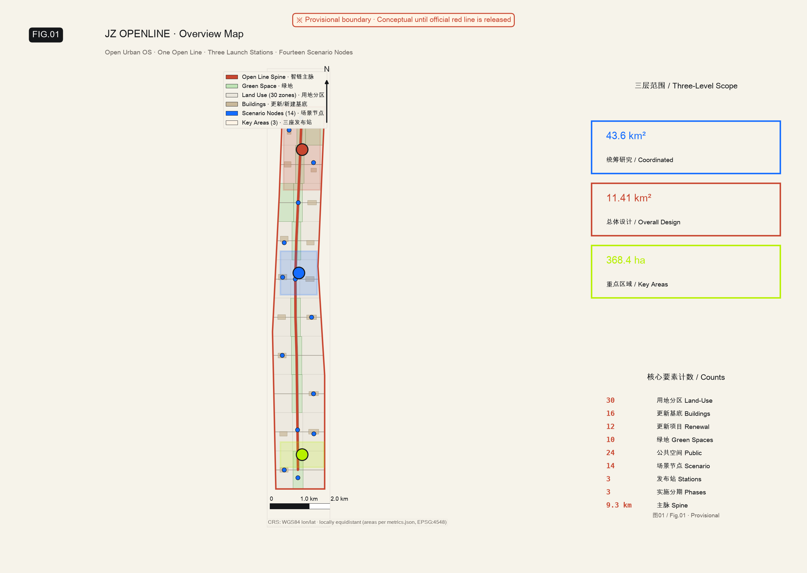
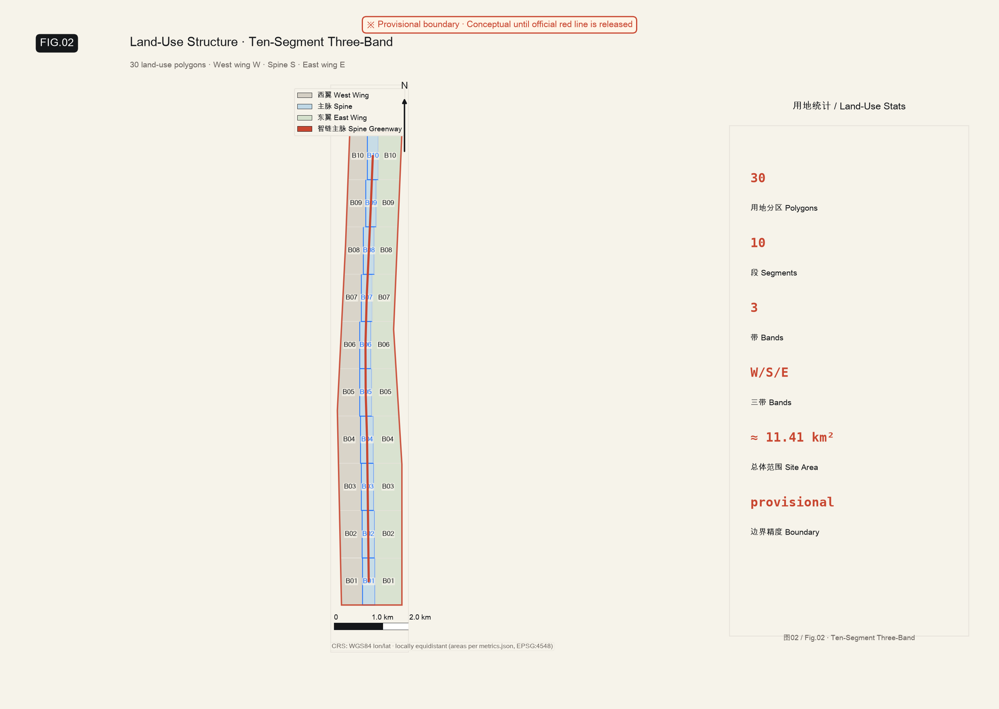
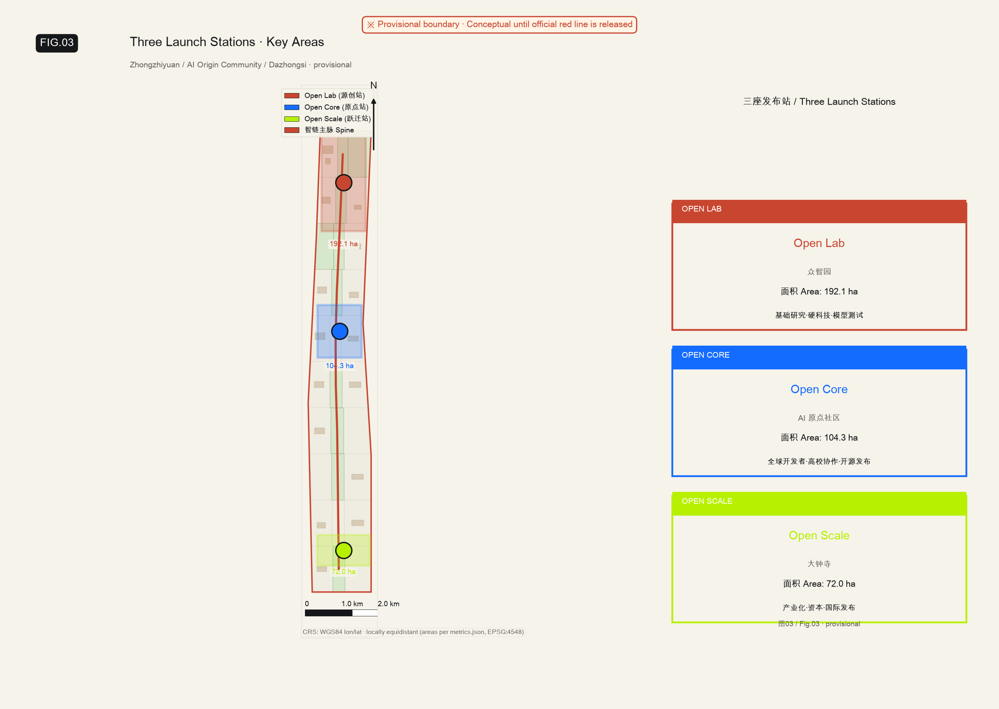
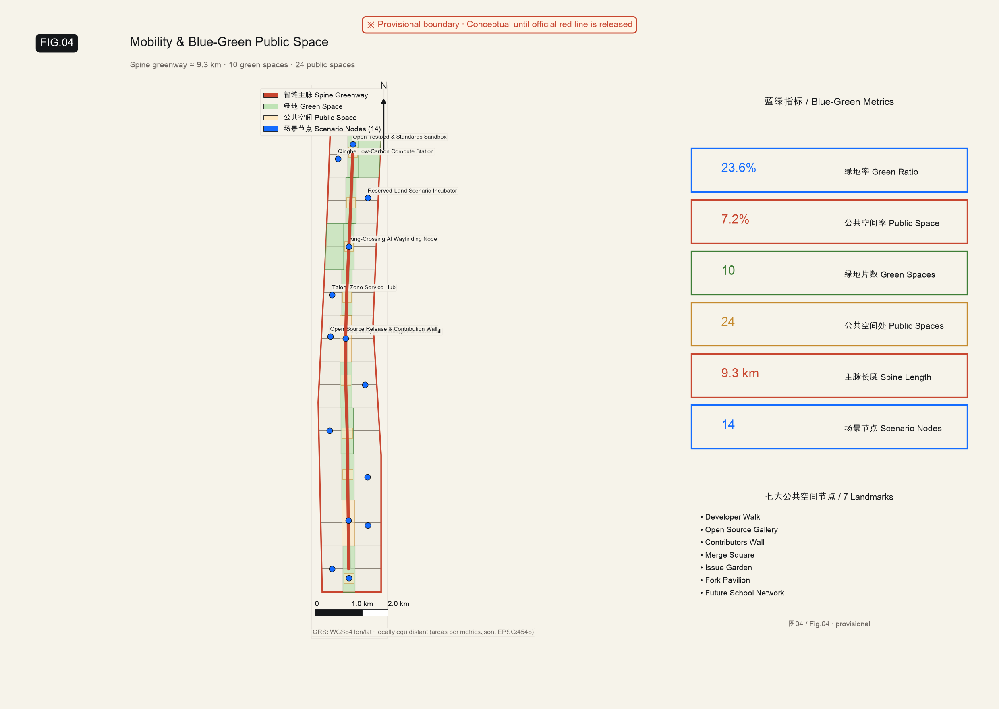
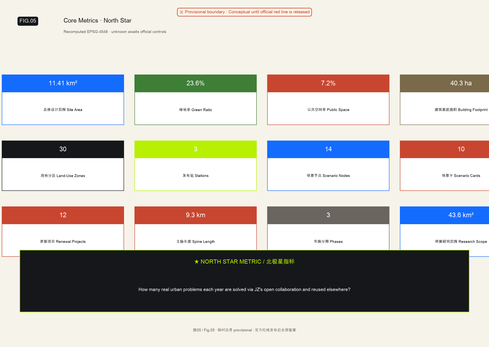

# JZ OPENLINE: Open Urban OS — Urban Design Proposal

> **Core proposition**: Upgrade the Jingzhang Railway Heritage Park from a space that *displays* AI into an **urban operating system** that organizes innovation, industry, and daily life through open-source methods.

## Design Basis and Reference Materials

This proposal takes the **Centennial Jingzhang AI Innovation Belt Urban Design International Competition Prequalification Announcement** issued by the Haidian Branch of Beijing Municipal Commission of Planning and Natural Resources as its primary basis [source:OFFICIAL-ANNOUNCEMENT], with machine-readable references to the provisional boundary, key areas, enumerations, and metrics registered in `brief/site-package/` [source:AGENT-TASKBOOK].

Before generating the design, the AI agent read `design_brief.json`, `allowed_design_space.json`, `sources.json`, `enums/`, `ranges/`, `schemas/`, and the site package to establish a four-dimensional task–scope–data–gap checklist. All design judgments are decomposed into traceable sources, recomputable metrics, verifiable layers, and human-reviewable assumptions [source:SOURCE-REGISTRY] [source:PROCESSED-FACT-PACK].



**Precision disclaimer**: The `geometry/site_boundary.geojson` and `geometry/key_areas.geojson` in this submission are both tagged as `provisional_constraint` (`official_boundary=false`). They are valid only for scheme generation, self-check, visualization, and design discussion — not as official redlines or approval baselines. Full recomputation is required when official polygons become available [assumption:A-BOUNDARY-002] [assumption:A-KEYAREA-003].

Current scorable status: **Provisional boundary with precision warnings; pending official data release for recomputation; content scoring NOT blocked**.

## Master Concept: Open Urban OS

### Recommended Master Concept

**Open Urban OS (城市开源操作系统)**

Open source is not just one industry category within the innovation belt, nor is it merely code, forums, or exhibitions. It is the organizing principle for the entire belt: the city poses problems, universities and communities co-develop R&D, enterprises and capital drive conversion, neighborhoods provide real-world testbeds, outcomes are released in reusable form to the global community, and contributors receive sustained incentives.

Open Urban OS opens urban problems, public spaces, knowledge capabilities, innovation facilities, and collaboration mechanisms to society in a participatory, reusable, and iterable way — enabling research institutions, enterprises, communities, and global developers to solve real problems together.

### Public Brand

**京张开源线｜JZ OPENLINE**

| Dimension | Content |
| --- | --- |
| Core value proposition | From independent building to open co-creation — making innovation a city capability that everyone can participate in and the world can share |
| Brand spirit | Build with Autonomy. Create in the Open. Share with the World. |
| Brand description | A city innovation belt co-authored by the world |
| Public call-to-action | Open Innovation, Prototyped in Jingzhang |
| Formal planning statement | Creating an urban model for open-source-driven innovative development |
| Cultural tagline | From China's independently built railway to a future co-written by the world |

"Line" simultaneously carries five meanings: railway line, code line, innovation chain, living line, and global connection line. It carries more unique Jingzhang DNA than generic names like "AI Valley," "Smart City," or "Silicon Valley," and naturally forms a unified language across spatial wayfinding, event branding, and digital platforms. [standard:PROJECT-OFFICIAL-ANNOUNCEMENT]

### Why "Open Source" Fits Jingzhang

The Centennial Jingzhang legacy, traditional Zhongguancun, and the new open-source AI culture are not three parallel histories. Their shared spirit is: **transforming capabilities once held by a few into public infrastructure accessible to many.**

1. **Railway culture: opening geographic boundaries.** The Jingzhang Railway connected cities, populations, and industries through engineering autonomy.
2. **Zhongguancun culture: opening knowledge and market boundaries.** From Electronics Street to tech enterprise clusters, innovation moved from institutes to markets.
3. **Open-source AI culture: opening innovation participation rights.** Models, code, data, tools, and knowledge evolve through global collaboration.

Therefore, the narrative is not "adding AI next to railway heritage":

> **Jingzhang once organized flow with steel rails; today it organizes innovation with open-source protocols.**

## Three-Level Scope Framework

| Level | Area | Design Question | Response |
| --- | --- | --- | --- |
| Coordinated research | 43.6 km² | How to organize AI ecosystem and future city form | Five-layer Open Urban Stack: university R&D → open-source collaboration → enterprise conversion → public experience → international dissemination |
| Overall design area | 11.41 km² | How to map industry space, renewal, transport/municipal services, and character | One open line + three launch stations + multiple urban repos; 30 land-use + 16 building footprints + 12 roads + 10 green spaces + 24 public spaces |
| Key areas | 368.4 ha | How three districts reach detailed-design depth | Open Lab / Open Core / Open Scale each with positioning, spatial actions, AI scenarios |



The overall spatial structure is **one open line, three launch stations, multiple urban repositories**:
- **One open line**: The Jingzhang Heritage Park spine (~9.3 km), hosting seven major public landmarks including Developer Walk, Open Source Gallery, and Merge Square
- **Three launch stations**: OPEN LAB (Zhongzhiyuan), OPEN CORE (AI Origin Community), OPEN SCALE (Dazhongsi)
- **Multiple Urban Repos**: Every school, hospital, mall, campus, and park along the line can become an "urban repo" publishing local issues, testable spaces, running projects, participatory tasks, and test results
- **Hundred nodes**: 14 mapped AI+ scenario nodes + Future School network nodes, opened and iterated yearly

Land-use structure adopts a **Ten-Segment Three-Band** division: the design area is divided into B01–B10 latitude bands, each split into West(W)/Spine(S)/East(E) functional bands, yielding 30 land-use polygons that fully cover the site with no gaps or overlaps (residual 11.7 m² < tolerance) [data:geometry/land_use.geojson#LU-B01-W].

## Five-Layer Open Urban Stack

Haidian hosts China's densest cluster of AI original-innovation resources. The proposal constructs a **Five-Layer Open Urban Stack**, converting existing projects into the first operating modules of the "urban operating system" [source:AGENT-TASKBOOK]:

### Layer 1 | OPEN SCIENCE
- Establish a "JZ Open Research Issue Registry" where universities, hospitals, schools, communities, and enterprises jointly pose problems.
- Cross-university joint labs, visiting researcher programs, and a global Maintainer Residency.
- Publicly funded projects should publish papers, model cards, evaluation methods, non-sensitive data descriptions, and reproducible experiments.
- AI safety, ethics, IP, and open-source licensing service center.

### Layer 2 | OPEN INFRA
- Shared compute, models, data spaces, evaluation, soft-hard adaptation, and embodied intelligence testing.
- "OpenLine Sandbox": graded testing environments for high-risk or high-compliance domains such as healthcare, education, and commerce.
- Parks, public buildings, commercial streets, and community service points included in an applyable urban testbed registry.

### Layer 3 | OPEN VENTURE
- Open-source commercialization accelerator serving maintainers, research teams, and startups.
- "JZ Open Source Fund": part invested in tech enterprises, part long-term funding critical open-source infrastructure.
- Enterprise procurement alliance so large enterprises and public sectors pull product maturity with real orders.

### Layer 4 | OPEN STREET
- Make AI scenarios into services residents pass by, use, and evaluate daily — not exhibition-first.
- Every pilot has published goals, usage instructions, data boundaries, responsible parties, trial periods, and exit buttons.
- **Future School Nodes** as standard nodes along the public-space line: community learning space, open-source community workstation, project showcase, and online collaboration entry point.

### Layer 5 | OPEN COMMUNITY
- "JZ Open Source Innovation Alliance" + neutral operating entity; government, universities, enterprises, investors, open-source communities, and residents all participate.
- Contribution points and reputation system rewarding code, docs, testing, translation, outreach, community service, and issue discovery.
- **Learning Leads** organize daily node community: initiate learning, explain topics, connect experts, organize groups, record contributions, and push outcomes back to real scenarios.

### Five Operating Engines

| System Role | Existing Project | Role in JZ OPENLINE |
| --- | --- | --- |
| **Issue Engine** | AI for Aging Societies Challenge | Discover real problems from hospitals/communities; organize residents, students, developers, and experts to propose and validate solutions |
| **Learning Engine** | OpenSchool + Community Learning Hubs | Connect open courses, project-based learning, and real community issues — making the whole belt an open campus |
| **Organization Engine** | Learning Leads Program | Continuously organize learning, challenges, collaboration, and outcome sharing at each node; convert visitor flow into stable community |
| **Industry Engine** | AI Commander | For enterprises and parks: connect AI literacy, scenario discovery, capability building, agent applications, and incubation support |
| **Space & Network Interface** | Future School Nodes | Physical nodes in parks and neighborhoods connecting OpenSchool, open-source communities, and global collaboration networks |

Concrete open-source loop:

**Healthcare, education, enterprises, and communities publish issues → Future Schools aggregate issues → OpenSchool organizes learning → Learning Leads organize local collaboration → hackathons produce solutions → AI Commander drives enterprise adoption and scenario deployment → OpenLine Repo connects global open-source communities → outcomes return to hospitals, schools, parks, and communities.**

## Overall Design Area: Urban Renewal at Regulatory-Plan Depth

### Land-Use Structure and Coverage Verification

Land-use classification follows the MNR Land/Sea Use Classification Guide [standard:MNR-LAND-USE-CLASSIFICATION-GUIDE], with 30 zones:

| Functional Band | Primary Codes | Design Intent |
| --- | --- | --- |
| West Wing (W) | 0802(R&D), 05(Commercial), 0702(Residential) | R&D radiation belt + Xueyuan Road university linkage |
| Spine (S) | 1401(Park), 1403(Plaza), 08(Public admin/services) | Jingzhang heritage blue-green spine + public living rooms + Future School nodes |
| East Wing (E) | 0701(Community services), 0803(Education), 0806(Business finance) | Living services + Xiaoyuehe scenario enablement |

### Building Footprint and Retain/Renovate/Demolish

16 renewal building footprints [data:geometry/buildings.geojson#BLDG-01], total footprint area 40.3 ha, representing 3.5% of the design area.

Renewal strategy prioritizes **renovation over demolition**:
- **Retain**: Historic-character buildings, recently completed quality buildings
- **Renovate**: Facade refresh, ground-floor activation, roof greening
- **New-build**: Critical infill, TOD integrated development

### Transportation System

12 road elements [data:geometry/roads.geojson#ROAD-SPINE]:
- **ROAD-SPINE**: Open-line spine greenway (continuous walking + cycling), linking all ten segments and three launch stations
- **RAIL-JINGZHANG**: Jingzhang railway heritage corridor (approximate)
- **ROAD-X01~X10**: East-west stitching connectors linking West–Spine–East

**Four Slow-Mobility Discontinuity Strategies**:
1. North 5th Ring crossing — footbridge + under-park deck
2. Qinghuayuan Station area — plaza/lobby/at-grade combo stitching campus–park–district
3. Dazhongsi Station intersection — four-quadrant set-back + ground-floor lobby conversion
4. Wudaokou section — small-scale street prototype diverting peak-hour spine flow

## Key Areas: Three Launch Stations



### A · OPEN LAB — Zhongzhiyuan / 192.1 ha

**Positioning**: Garden-style full-stack autonomous innovation district for basic research, hard-tech, model and robot testing.

| Dimension | Content |
| --- | --- |
| Spatial action | Qinghe waterfront opens as low-carbon innovation living room; inner-ring slow mobility connects to open-line spine |
| Retain/Renovate/Demolish | Renovation-led (pilot incubation workshops); new HQ cluster + open test lab |
| Core role | Open experiment street, model arena, shared maker workshops |
| AI scenarios | Open testing & standards governance sandbox; Qinghe low-carbon compute post |
| Prerequisites | Qinghe blue-line & flood control data; district regulatory intensity & setbacks |

**Evidence**: [data:geometry/key_areas.geojson#PROV-KEY-001] [depth:three_key_area_detailed_design]

### B · OPEN CORE — Beijing AI Origin Community / 104.3 ha

**Positioning**: Core community for global developer and university collaboration; open-source collaboration as core public good.

| Dimension | Content |
| --- | --- |
| Spatial action | Qinghuayuan Station heritage plaza stitches campus–park–district; pedestrian/cycling rail-corridor |
| Retain/Renovate/Demolish | Block-scale renovation-led; preserve station heritage; add community services & showcase center |
| Core role | Open-source lounge, Maintainer House, Merge Square |
| AI scenarios | Open-source release & contribution showcase; outcome incubation hall; talent-zone kiosk |
| Prerequisites | Heritage protection zone & construction control; campus boundary & access points |

**Evidence**: [data:geometry/key_areas.geojson#PROV-KEY-002] [source:AGENT-TASKBOOK]

### C · OPEN SCALE — Dazhongsi AI Industry Cluster / 72.0 ha

**Positioning**: Urban intelligent-economy and international-exchange district for industrialization, capital, international launches, and headquarters services.

| Dimension | Content |
| --- | --- |
| Spatial action | Dazhongsi Station gateway plaza + four-quadrant pedestrian connectivity; commercial podium ground-floor setback→lobby |
| Retain/Renovate/Demolish | Existing commercial/industrial renovation-led; south-gate town-center complex as new build |
| Core role | AI Launch Center, Capital Lounge, Global Roadshow Stage |
| AI scenarios | International roadshow salon; data-element salon; annual JZ Open Week node |
| Prerequisites | Rail station interface; intersection traffic organization & underground space |

**Evidence**: [data:geometry/key_areas.geojson#PROV-KEY-003] [metric:key_area_count]

## Future School Nodes: Physical Interface of Urban Repos

Future Schools are neither traditional classrooms nor pure exhibition pavilions. Each is a distributed node with four simultaneous connection capabilities:

1. **Spatial connection**: linking parks, communities, hospitals, schools, commerce, and campuses;
2. **People connection**: linking residents, students, seniors, doctors, teachers, developers, enterprises, and investors;
3. **Online connection**: linking OpenSchool courses, livestreams, project materials, tasks, and OpenLine Repo;
4. **Global connection**: linking overseas open-source communities, maintainers, open courses, and partner city nodes.

Each Future School forms a different theme based on surrounding resources but shares unified technical interfaces, course interfaces, activity rules, visual identity, and contribution records:

| Node Type | Focus | Typical Partners |
| --- | --- | --- |
| **Future Health School** | Aging-friendly, health literacy, co-creation with clinicians, rehabilitation & care innovation | Tertiary hospitals, community clinics, communities, elder-care organizations |
| **Future Open School** | OpenSchool courses, community learning hubs, youth & resident project-based learning | Schools, universities, libraries, community organizations |
| **Future Industry School** | AI Commander, enterprise diagnosis, agent workshops, startup incubation | Parks, enterprises, incubators, investment institutions |
| **Future Open-Source School** | Open-source project collaboration, maintainer events, technical sharing, global connections | Open-source communities, university labs, developer organizations |

Future Schools constitute a distributed network: **every local node has a real community, online they share one OpenSchool, globally they connect one open-source network.**

## How AI Enters Specific Neighborhoods

### AI + Healthcare: Open Health Districts

- **Three-tier aging-friendly innovation network**: tertiary hospital – community hospital – community. Tertiary hospitals provide medical standards, expert guidance, and complex-problem support; community hospitals provide continuous health services and real needs; communities organize seniors, families, and volunteers to discover problems, test, and provide feedback.
- **AI for Aging Societies Challenge**: upgraded to JZ Open Health's normalized Issue mechanism. Challenges can be joined by teachers with students, parents with children, adults in self-organized groups.
- **Future Health Schools**: embedded in community health centers, parks, elder-care points, and Future School nodes.
- **Doctor-in-the-loop**: AI does not directly replace diagnosis; complex or high-risk results must be referred to professionals.
- **Baseline**: default minimal collection, visible data purpose, opt-out anytime; avoid "facial-recognition-style tech pressure."

### AI + Education: The Entire Park Is an Open Classroom

- **OpenSchool**: shared online open school for the entire innovation belt, aggregating courses, livestreams, project tasks, expert resources, and global open-source learning content.
- **Learning Leads Program**: leads are not traditional lecturers but organizers and connectors of learning communities.
- **One-kilometer-one-lesson**: cultural tours, railway engineering, coding, model training, AI ethics all converted into walking courses.
- **Project-as-learning**: students and residents learn around real Issues from healthcare, commerce, community services, and public spaces.

### AI + Enterprise & Commerce: From Future Industry Schools to Park Incubation

- **AI Commander park service system**: help enterprises identify scenarios, build internal AI owners, design agents & workflows.
- **Enterprise Issue Pool**: park enterprises publish real problems; AI Commander organizes cross-enterprise learning and solution teams.
- **Agent Storefront**: storefront displays showing how AI genuinely improves merchandising, service, scheduling, energy, and accessibility.
- **Small-business Agent Cooperative**: shared compliance data, model tools, and operations consulting for SMEs.

### Design Principle

"Perceptibility" of future-life scenarios does not mean screens, robot arms, and glowing installations everywhere. A better metric is: **whether residents more easily access healthcare, education, and commercial services, whether they save time, whether they have rights to know, choose, and participate in improvement.** [scenario:ai-traffic-walkability] [scenario:enterprise-service-copilot] [scenario:public-safety-operations-review]

## AI Innovation Ecosystem, Personas & AI+ Scenarios

### User Personas

| Persona | Typical Needs | Spatial Response | Privacy Boundary |
| --- | --- | --- | --- |
| Open-source developer | Publish, collaborate, test, reputation | Open Core open-source lounge, night collaboration space | No personal tracking; event data aggregated only |
| Startup team | Low-cost office, compute access, product testbed | Open Lab shared workshops, edge-compute post | Compute/data require separate authorization |
| Enterprise visitor | Showcase, business, intl reception, recruiting | Open Scale Capital Lounge, rail transfer | Corporate logos must be cleared |
| Resident | Commute, leisure, community services | Open-line slow loop, embedded Future Schools | No commercial recommendation use |
| University member | Outcome conversion, cross-campus collaboration | Campus–park slow stitching, conversion kiosk | Campus data & research require authorization |

### AI+ Scenario Cards (10)

| # | Name | Location | Description |
| --- | --- | --- | --- |
| 01 | Open-Source Release Hall | Open Core | Outcome publishing & mini roadshows for universities/open source/startups |
| 02 | Safety Governance Sandbox | Open Lab | Standards, safety evaluation, red-team testing translated to visitable nodes |
| 03 | Edge Compute Post | Overall scope | New-infrastructure prototype combined with public services & low-carbon energy |
| 04 | AI Slow-Mobility Navigation | Jingzhang Heritage Park | Explainable wayfinding + low-intrusive sensing for gaps & accessibility |
| 05 | International Roadshow Salon | Open Scale | Agent/terminal/content enterprise showcase & international exchange |
| 06 | Qinghe Low-Carbon Corridor | Open Lab waterfront | Green space + stormwater + cycling + AI display |
| 07 | Near-Campus Conversion Street | Open Core | Incubation/showcase/legal/IP/investment-finance services |
| 08 | Data Element Salon | Open Scale | Data-element circulation interface under compliance/audit authorization |
| 09 | AI Living Prototype Street | Community-commercial junction | Medical/education/legal/living AI+ scenario-operated block |
| 10 | Global JZ Open Week Route | One-belt public space | Heritage culture → open source → industry showcase → international roadshow |

14 scenario nodes mapped as SCENARIO_NODE points [data:geometry/public_space.geojson#PUBLIC-P01].

## Seven Landmarks: AI Public Spaces Along the Heritage Park

### 1. Developer Walk

Combine railway mileage, code line numbers, and project versions into wayfinding. Not static celebrity profiles but "issue–collaboration–outcome–impact" project stories. Online: view repos; offline: join lightning talks, pair-walking, and investor Walking Office Hours.

### 2. Open Source Gallery

Display outcomes by "how many adopted, what problems solved, who maintains together" — not by corporate ad placement. Regularly updated as a "living version release record."

### 3. Contributors Wall

Record contributions from scientists, maintainers, doc authors, testers, teachers, doctors, residents, and AI agents alike. Honor based on verifiable public outcomes, not corporate sponsorship amounts.

### 4. Merge Square

The core public living room of the innovation belt. Daytime: open working & roadshow space. Nighttime: Demo, debate, art performance, and open-source launch venue. Railway switch imagery preserved, symbolizing different routes converging here.

### 5. Issue Garden

Residents submit daily life issues; universities, enterprises, and communities claim them. Status presented in low-tech, readable format: open, in-testing, resolved, needs-redesign. More genuinely open than "flashy installations."

### 6. Fork Pavilion

A replicable, modifiable modular pavilion — also the **standard spatial prototype for Future Schools**: switchable between health classroom, community class, enterprise workshop, open-source showcase, or global video-call room. Blueprints, BOM, digital interfaces, and operations manuals fully open; other districts and cities may Fork and create their own versions.

### 7. Future School Network

A single Future School solves "how nearby people participate"; the linear node network solves "how different blocks coordinate"; OpenSchool and OpenLine Repo solve "how locally connects to globally." All nodes distributed in space; unified in courses, projects, contribution records, and brand.

## Cultural Wayfinding: Five Chapters, One Route

Cultural narrative organized as five actions rather than three era exhibits:

1. **BUILD | Independent Building**: Jingzhang Railway and Zhan Tianyou engineering culture — answering "how we gained autonomous building capability."
2. **CONNECT | Flow Connection**: How railways reshaped cities, industries, and human mobility.
3. **COMPUTE | Rise of Computing**: Zhongguancun from research institutes via Electronics Street to digital industry.
4. **CONTRIBUTE | Co-contribution**: How open source transforms knowledge production, enterprise innovation, and public participation.
5. **RELEASE | Release the Future**: AI scenarios running in neighborhoods and global launch platforms.

The route endpoint should not be a "future museum" but an active Merge Square where project releases and public discussions happen. Visitors' final action — submit an issue, test a project, contribute documentation, or join an event — transforming from tourist to contributor.

## Transport, Rail, Municipal & Public Services



**Green ratio 23.6%** [metric:green_ratio], **public space ratio 7.2%** [metric:public_space_ratio], **spine length ~9.3 km**.

10 east-west stitching lines (ROAD-X01 through ROAD-X10) ensure direct connectivity between West, Spine, and East bands in every latitude segment.

Municipal & public service strategies:
- **Rail integration**: Qinghuayuan, Wudaokou, and Dazhongsi stations correspond to three launch stations (Open Core / Open Lab / Open Scale)
- **Micro-circulation roads**: East-west lines handle vehicle diversion; spine fully pedestrianized
- **New infrastructure**: Edge compute posts, distributed energy, smart lighting & sensing
- **Prerequisites**: Road redlines, utility integration, fire protection & municipal engineering data [assumption:A-RAIL-007]

## Blue-Green Space, Public Space & Urban Character

### Blue-Green System
- **Qinghe waterway**: Waterfront tagged HERITAGE_PROTECTION [data:geometry/constraints.geojson#CONSTRAINTS-WATER-01]
- **Park greens**: 10 GREEN divisions along spine [data:geometry/green_space.geojson#GREEN-B01-S]
- **Buffer greens**: North 5th Ring corridor tagged REGULATORY_CONTROL [data:geometry/constraints.geojson#CONSTRAINTS-ROADCORRIDOR-01]

### Public Space System
24 public spaces comprising:
- 2 civic squares (1403): PUBLIC-B02-PLAZA, PUBLIC-B06-PLAZA
- 8 plazas (public living rooms): core of each spine segment
- 14 SCENARIO_NODE points: AI+ service locations + Future School nodes

### Urban Character & Visual Identity

Jingzhang railway heritage tagged HERITAGE_PROTECTION [data:geometry/constraints.geojson#CONSTRAINTS-HERITAGE-01]. Character guidance follows JZ OPENLINE visual standards:

| Role | Color | Meaning |
| --- | --- | --- |
| Railway Vermilion | #C84630 | Century-old railway, engineering culture, urban warmth |
| Open Blue | #146CFF | Open network, trusted technology, global connection |
| Signal Lime | #B7F000 | Running, passed, real-time update; accent only |
| Ink Black | #15171A | Industrial structure & high readability |
| Paper White | #F6F3EA | Historical archives, public space & warm background |

Typography: Source Han Sans (Chinese), Inter (public info), IBM Plex Mono (IDs, versions, wayfinding details). Graphic grammar organizes layout around track baselines, nodes represent stations & contributors, branch/merge symbols represent multi-team collaboration & outcome convergence.

- **Palette logic**: Vermilion for historical identity, Blue for global/digital systems, Lime only for "running/participating/passed" states
- **Roofs**: Encourage fifth-plane greening + PV integration
- **Wayfinding**: Unified JZ OPENLINE signage, bilingual + accessible
- **Public art**: Contributors Wall, Issue Garden, seasonal installations (all require rights clearance)

## Renewal Project List, Policy & Phasing

### Renewal Projects (12)

| ID | Name | Type | Dependency | Evidence |
| --- | --- | --- | --- | --- |
| JZ-001 | Developer Walk | Public space/culture | Park redline, paving | [data:geometry/roads.geojson#ROAD-SPINE] |
| JZ-002 | Merge Square | Public space/exchange | Open Core core zone | [data:geometry/public_space.geojson#PUBLIC-B02-PLAZA] |
| JZ-003 | Issue Garden | Public space/participation | Community site permit | [data:geometry/public_space.geojson#PUBLIC-B03] |
| JZ-004 | Fork Pavilion Network | Public space/modular | Standard drawings, materials | [data:geometry/public_space.geojson#PUBLIC-P01] |
| JZ-005 | First Future School Nodes (3) | Education/community | School, hospital partnerships | [data:geometry/phasing.geojson#PHASE-01] |
| JZ-006 | Qinghe Low-Carbon Corridor | Blue-green/energy | River blue-line, flood control | [data:geometry/green_space.geojson#GREEN-B01-S] |
| JZ-007 | Open Lab Experiment St. | Industry/test | Zhongzhiyuan space | [data:geometry/buildings.geojson#BLDG-01] |
| JZ-008 | Open Scale Roadshow Salon | Exchange/industry | Dazhongsi Station | [data:geometry/key_areas.geojson#PROV-KEY-003] |
| JZ-009 | Open Core Open-Source Lounge | Culture/industry | Origin Community space | [data:geometry/key_areas.geojson#PROV-KEY-002] |
| JZ-010 | Agent Storefront | Commercial/scenario | Commercial space | [data:geometry/land_use.geojson#LU-B07-E] |
| JZ-011 | OpenLine Repo Digital Platform | Digital/operations | Platform development | [data:geometry/constraints.geojson#CONSTRAINTS-PENDING-CONTROL-01] |
| JZ-012 | JZ Open Week Annual Flagship | Operations/brand | Full-line public space | [data:geometry/phasing.geojson#PHASE-03] |

### Implementation Phasing

[data:geometry/phasing.geojson#PHASE-01] **Near-term (0–6 mo)**: Establish protocol & prototype — define brand master concept, operator, and open-source rules; use existing aging-friendly challenge as first prototype for real urban Issues; select first Future School nodes; wire minimum operational loop across OpenSchool, Learning Leads, AI Commander, and OpenLine Repo; build first Developer Walk section, one Issue Garden, one Future School prototype, one temporary Merge Square.

[data:geometry/phasing.geojson#PHASE-02] **Mid-term (6–18 mo)**: Visible network — connect three launch stations and digital platform; run Maintainer Residency, open-source commercialization accelerator, and urban testing mechanism; publish first batch of urban open-source outcomes and public evaluations; establish contributor honor system and open-source procurement channel.

[data:geometry/phasing.geojson#PHASE-03] **Long-term (18–36 mo)**: Global network effect — enable other cities to reuse JZ projects, spatial modules, and operations tools; form global partner city and university nodes; make JZ Open Week a fixed annual destination for global AI maintainers, entrepreneurs, and investors; shift from "projects displayed in Jingzhang" to "projects adopted from Jingzhang globally."

## Metrics, Recalculation & Compliance Matrix



### Known Metrics (recomputed from submitted layers in EPSG:4548)

| Metric | Value | Source |
| --- | --- | --- |
| Overall design area | 11.41 km² | [metric:site_area_sqm] |
| Green ratio | 23.6% | [metric:green_ratio] |
| Public space ratio | 7.2% | [metric:public_space_ratio] |
| Renewal building footprint | 40.3 ha | [metric:building_footprint_area_sqm] |
| Land-use polygons | 30 | [metric:land_use_polygon_count] |
| Key areas (launch stations) | 3 | [metric:key_area_count] |
| Scenario nodes | 14 | [metric:scenario_node_count] |
| Renewal projects | 12 | [metric:renewal_project_count] |
| Spine length | 9.3 km | [metric:spine_length_m] |
| Implementation phases | 3 | [metric:phase_count] |

### North Star Metric

> **How many real urban problems are solved each year through JZ's open collaboration and continue to be reused by other regions.**

This proves "open-source-driven innovation" more meaningfully than enterprise counts, event frequency, or visitor volume. Five recommended evaluation categories:

1. **Openness**: count of open projects, open data descriptions, open designs, reproducible experiments;
2. **Contribution**: active contributors, maintainers, resident participants, cross-institution collaborations;
3. **Conversion**: conversion rates from Issue→prototype, test→procurement, project→enterprise;
4. **Life improvement**: time saved, service accessibility, satisfaction, vulnerable-group benefit, safety incidents;
5. **Global impact**: external adoptions/reuses, international contributors, overseas nodes, global event participation.

### Statutory Controls Pending Official Data

| Metric | Status | Prerequisite |
| --- | --- | --- |
| Floor area ratio (FAR) | unknown | Official regulatory conditions |
| Height limit | unknown | Official regulatory conditions |
| Total floor area | unknown | Tenure + regulatory plan |
| Population & employment | unknown | Population & employment data |

Compliance matrix (`compliance_matrix.json`) maps every announcement requirement to sections/layers/metrics/drawings/HTML/sources/assumptions/self-check items, ensuring full coverage of agent.1–agent.6 [standard:PROJECT-OFFICIAL-ANNOUNCEMENT] [standard:PROJECT-AGENT-OPEN-CALL-TASKBOOK].

## agent.2 Global AI Innovation Ecosystem Case Comparison

agent.2 requires 5–8 global AI ecosystem cases with sources, licenses, a comparison table, a full ecosystem map, and an eight-factor (land–space–industry–funds–talent–compute–data–scenario) mechanism.

### Case Selection

Six cases across four governance models — municipal-led (Helsinki/Barcelona), tech-driven (Toronto/Singapore), industry-campus fusion (Eindhoven), and open-source community (Shenzhen) — were selected for multi-dimensional comparison with JZ OPENLINE's "Open Urban OS" positioning.

### Comparison Table

| Case | Country | Model | Eight-Factor Fit | Takeaways | Source/License |
|---|---|---|---|---|---|
| **Sidewalk Toronto / Waterfront Toronto** | Canada | Data+space experiment by big tech; terminated 2020 over privacy & governance disputes | Land·space ✓ Data ✓ Scenario ✓ | Data trust, physical-digital twin, lesson: design privacy boundaries *before* deployment | Waterfront Toronto (2019), CC-BY |
| **Eindhoven Brainport** | Netherlands | Triple helix (Philips legacy + university + government); High Tech Campus as open-innovation core | Industry ✓ Talent ✓ Scenario ✓ Land·space ✓ | Three-tier linkage (campus–district–community); Brainport Development PPP coordination | Brainport Monitor (RUG, 2023), public domain |
| **Helsinki AI Register** | Finland | City-led public AI transparency registry; mandatory disclosure of purpose/data source/algorithm logic | Data ✓ Scenario ✓ Compute ✓ | AI transparency registry, citizen-accessible public interface, annual AI-use report | City of Helsinki (2021), CC-BY |
| **Barcelona Digital City** | Spain | Decidim open-source participation platform + community tech centres; citizen digital sovereignty | Scenario ✓ Community (JZ L5) ✓ | Replicable open citizen-participation platform; dual-track physical–digital community lab model | Ajuntament de Barcelona (2020), CC-BY / GPL |
| **Singapore Smart Nation** | Singapore | Government-driven national AI & urban data platform (Virtual Singapore twin, AI Verify framework) | Compute ✓ Data ✓ Scenario ✓ Talent ✓ | Statutory data integration for digital twins; AI Verify as a reference for agent.3 test protocols | Singapore GovTech (2023), public domain |
| **Shenzhen Open Innovation Ecosystem** | Shenzhen, China | Huaqiangbei hardware ecosystem + Seeed Studio/Chaihuo makerspace: open hardware → small-batch → industrial conversion | Industry ✓ Scenario ✓ Talent ✓ | "Open-source → batch → production" conversion pipeline; hardware innovation lab spatial operations | Public business reports & academic literature (CC-BY) |

> This section provides reference case comparison within the urban-design context only. Data is drawn from public reports and academic literature; this does not constitute formal industry research or commercial due diligence, nor does it imply any cooperation or benchmarking relationship between the JZ proposal and the listed cases.

### AI Ecosystem Map: JZ OPENLINE's Global Position

JZ OPENLINE is differentiated within the global landscape by:

- **Public–Open-Source–Spatial superposition**: Unlike single-driver models (corporate: Toronto; governmental: Singapore), JZ layers public space (heritage park), open-source governance (Issue/Merge/Fork workflow), and urban renewal (12 renewal projects) into an "urban-scale innovation substrate" that citizens, developers, and planners can read/write together.
- **"West R&D, East service" industrial geography**: The west wing (Zhongzhiyuan–OPEN LAB) hosts R&D and open-source release; the east wing (community–commercial belt) hosts scenario testing and service delivery, forming a two-tier structure echoing Brainport's campus–district model.
- **Distributed "hundred-node" scenario operations**: Rather than centralised digital twins (Singapore), JZ's 14 SCENARIO_NODE points and 10 scenario cards emphasise distributed, lightweight, iterable "node economics" — resembling the fractal structure of Barcelona community tech centres + Shenzhen maker networks.

### Eight-Factor Mechanism & JZ Framework Linkage

| Factor | JZ Mechanism | Status | Prerequisite |
|---|---|---|---|
| Land·Space | Spine greenway + 3 launch stations + 30 LU zones + 10 green spaces + 24 public spaces | Conceptual | Recalculated after official red line [assumption:A-BOUNDARY-002] |
| Industry | 5-layer Open Stack L1–L5 + 10 scenario cards + Future Industry / Open School | Conceptual framework | Formal industry study & investment plan required |
| Funds | "JZ Open Innovation Alliance" + public–social capital hybrid (IP pledge / open-source crowdfunding / scenario procurement) | Outline mechanism | Financial model & partner letters of intent required |
| Talent | 5 personas + Lead Instructor + AI Commander + open-source maintainer certification | Framework | MOUs with universities / enterprises / open-source communities |
| Compute | Edge-AI kiosks (PROT-03) + lightweight on-device model deployment | Conceptual | Coordination with cloud/compute providers |
| Data | OpenLine Repo platform + data minimisation + visible use + opt-out [standard:PROJECT-AGENT-OPEN-CALL-TASKBOOK] | Mechanism design | Compliance audit & Privacy Impact Assessment required |
| Scenario | 14 SCENARIO_NODE + 10 scenario cards + 3 track scenarios (agent.3) [metric:scenario_node_count] [metric:ai_scenario_card_count] | Conceptual layer | Operating entities, liability boundaries & data governance charter [assumption:A-SCENARIO-008] |
| Global linkage | JZ Open Week + OpenLine Repo international nodes + Fork Pavilion modular output | Blueprint | International MOUs & annual event funding required |

> All eight-factor linkages are proposed at the conceptual urban-design level. "Land·space", "building scale" and "compute" await official regulatory plans, industrial policy and infrastructure conditions. Funding and talent mechanisms require dedicated studies and partner confirmation before entering the implementation stage.
## Regional Synergy & External Interfaces

This section addresses the review's request for resource flows and cooperation interfaces between the three-zone-two-wing framework and Beilu Community, Future Science City, Huairou Science City, the Economic-Technological Development Area, and the Beijing-Tianjin-Hebei region. All interfaces are presented as conceptual synergy frameworks; they do not constitute concluded cooperation agreements or administrative commitments.

### Internal Synergy: Three Zones & Two Wings

The spatial coupling of three zones (overall design, key areas, coordinated research) and two wings (east-wing community services, west-wing R&D industry) is encoded in the land-use structure: across the [metric:land_use_polygon_count] polygons, the W/S/E three-band overlap in segments B01–B10 creates a horizontal "R&D ↔ Open ↔ Service" gradient [data:geometry/land_use.geojson#B01-B10]. Key interfaces:
- **West→East talent & service pipeline**: West-wing incubation (OPEN LAB/Zhongzhiyuan) → Core release (OPEN CORE) → East-wing scenario testing & community feedback (AI Living Street / Future Health School).
- **The Spine (S-band) as a shared platform**: The Jingzhang Heritage Park greenway [metric:spine_length_m] functions not only as a mobility and blue-green corridor but also as a shared "data–activity–brand" strip across both wings [data:geometry/roads.geojson#ROAD-SPINE].

### External Interfaces (Conceptual Framework)

| External Node | Role | JZ Synergy Direction | Current Status |
|---|---|---|---|
| **Beilu Community (surrounding neighbourhoods)** | Residents → data contributors → scenario testers | Future School network nodes can extend into Beilu community spaces; residents submit real problems through Issue Garden and participate in scenario testing | Conceptual community-participation interface |
| **Future Science City (R&D infrastructure)** | Frontier tech supply → joint R&D → talent pipeline | JZ's OPEN SCIENCE (L1) and OPEN VENTURE (L3) layers can interface with Future Science City's large-scale scientific facilities, state key labs and university research teams, forming a "basic research → open experimentation → urban scenario test" conversion chain | Envisioned R&D cooperation interface |
| **Huairou Science City (Big Science cluster)** | Advanced hardware → computing resources → interdisciplinary innovation | JZ's edge-AI kiosk concept (PROT-03) can extend as an "urban access point" for a Huairou–JZ compute corridor; Huairou's data-openness policies can provide governance reference for OpenLine Repo | Envisioned compute & data interface |
| **Economic-Technological Development Area (ETDA)** | Industrialisation → scaled production → supply chain | JZ's OPEN VENTURE (L3) and OPEN SCALE (Yueqian Station) can provide prototype testing, user validation and roadshow platforms for ETDA enterprises before small-batch → mass-scale transition; ETDA provides volume take-up for JZ-incubated projects | Envisioned industrial-conversion interface |
| **Beijing–Tianjin–Hebei (wider regional circulation)** | Regional market → factor flows → policy coordination | JZ's "Open Urban OS" brand and Fork Pavilion modular-output concept serves differentiated reuse across the Jing-Jin-Ji urban cluster through "fork + localize" open-source collaboration — not a uniform master plan but a modular replication pattern | Conceptual blueprint |

> ※ All external interfaces in this section are conceptual synergy propositions. They do not constitute concluded cooperation agreements or administrative commitments. All directions require independent communication with counterparties and legal/policy feasibility assessment before entering implementation pathways.
## agent.3 Test & Validation Protocols

agent.3 requires at least 3 AI industry test-validation scenario protocols, each specifying the test object, data inputs, responsible parties, quantified success thresholds, human-review mechanisms, and exit conditions. The following 3 protocols correspond to the 3 track scenarios in this submission.

### Protocol P1: AI Walkability Navigation Explainability (Track: ai-traffic-walkability)

| Element | Specification |
|---|---|
| **Test object** | Explainability of the AI navigation system over a 0.5 km trial segment of Jingzhang Heritage Park (route-recommendation rationale, break-point detection, alternative-path suggestion) |
| **Data inputs** | Anonymised real-time footfall data (flow & speed), weather & light data, resident-submitted "breakage reports" via OpenLine Repo |
| **Responsible parties** | JZ Open Innovation Alliance (operator) + urban mobility research institute (algorithm evaluator) + community representatives (oversight) |
| **Success threshold** | In quarterly testing, ≥ 80% of participants rate route explanations as "comprehensible/acceptable" (7-point scale ≥ 5); break-point recall ≥ 85% |
| **Human review** | Independent research institute issues quarterly review reports; any break-point flagged as "safety-critical" triggers mandatory human-operator intervention within 15 minutes |
| **Exit conditions** | 2 consecutive quarters below threshold; any safety-related misjudgement (regardless of volume); any privacy complaint confirmed as a breach in a Privacy Impact Assessment |

### Protocol P2: Enterprise Service AI Copilot Privacy Compliance (Track: enterprise-service-copilot)

| Element | Specification |
|---|---|
| **Test object** | Privacy-boundary and compliance capability of the AI enterprise copilot (AI Commander / business diagnosis) when handling SME queries |
| **Data inputs** | Enterprise-authorised anonymised business data (sector, size, query type), public policy & subsidy information, human-response baseline |
| **Responsible parties** | JZ Open Innovation Alliance (platform) + third-party legal/compliance body (auditor) + participating enterprises (data grantors) |
| **Success threshold** | Across 50 consecutive queries, the AI must not output any information that could re-identify the enterprise; on "should the user consult a lawyer/accountant" judgements, precision ≥ 95% (vs human baseline) |
| **Human review** | Auditor monthly spot-checks 10% of interactions; any response touching legal, tax or business-decision advice MUST append "This does not constitute professional advice; consult a licensed professional" — insertion rate must be 100% |
| **Exit conditions** | One confirmed privacy leak in any audit cycle; compliance-notice insertion rate below 100%; any participating enterprise revokes data authorisation |

### Protocol P3: Public-Safety AI Patrol Human-Takeover (Track: public-safety-operations-review)

| Element | Specification |
|---|---|
| **Test object** | Anomaly detection and human-takeover mechanism of the AI patrol system (Issue Garden / public-space monitoring scenario) |
| **Data inputs** | Anonymised environmental sensor data during time-limited public-space testing (crowd density, movement patterns, anomalous loitering) — no facial/plate/voice/mobile-identifier capture |
| **Responsible parties** | JZ Open Innovation Alliance (operator) + local public-safety authority (oversight) + community resident representatives (review panel) |
| **Success threshold** | Human confirmation validity of AI anomaly flags ≥ 90%; average latency from flag to human confirmation ≤ 5 minutes; false-positive rate (flagged then confirmed normal) ≤ 20% |
| **Human review** | Community review panel holds quarterly public review sessions examining all AI flags & confirmations (redacted); any AI output involving restrictions of personal liberty or enforcement recommendations must never be used for any operational action |
| **Exit conditions** | Human-confirmation validity below 80% for 2 consecutive quarters; any false positive causing material public-resource waste (e.g. unjustified public-space closure); community resident representatives vote ≥ 60% against continuation |

All testing takes place within the closed trial segment of OPEN LAB (Zhongzhiyuan). Data is deleted 30 days after test completion; relevant records are archived in OpenLine Repo and available for public inspection (redacted).

## agent.6 Annual Operations & Community Mechanism

agent.6 requires an annual activity system, developer retention, scenario opening, recruitment & conversion, and long-term review mechanisms.

### JZ Open Week Annual Flagship Framework

| Quarter | Activity | Content | Participants |
|---|---|---|---|
| **Q1 Spring** | Open Proposal Season | Via OpenLine Repo, solicit urban problems & solution proposals from residents/developers/businesses; community voting selects annual priority topics | Residents, community organisations, university students |
| **Q2 Summer** | Open Sprint Season | Intensive development for voted topics; OPEN LAB & OPEN CORE open desks/compute/datasets for teams | Developers, university labs, enterprise R&D |
| **Q3 Autumn** | JZ Open Week Main Event | Demo & roadshow (OPEN CORE·Merge Square), industry forum (OPEN SCALE·Yueqian), public experience day (14 scenario nodes open along the spine) | All personas, investors, media, international community |
| **Q4 Winter** | Review & Whitepaper Season | Annual impact report, North Star metric update; fork-package release of JZ Open Week outcomes | JZ Open Innovation Alliance, third-party evaluators |

### Open-Source Maintainer & Developer Retention

1. **Contributor Honour System**: Contributors Wall records contributor IDs and contribution types (code/design/data/testing/content), updated quarterly.
2. **Maintainer House Residency**: 4 maintainers per year in OPEN CORE for 3-month residencies; desk, compute subsidy, and living allowance provided.
3. **OpenSchool Talent Pipeline**: Graduates of OpenSchool & AI Commander courses enter the maintainer reserve pool; annual target ≥ 20 Lead Instructors.
4. **Return Incentive**: Departing or paused maintainers retain their contribution record on return; "Return Sprint Week" support provided.

### Scenario Opening & Recruitment Conversion Pathway

```
Problem proposal (Issue Garden / OpenLine Repo)
  → Voting & evaluation (community + expert panel)
  → Prototyping (OPEN LAB / OPEN CORE)
  → Scenario testing (3–5 of 14 SCENARIO_NODE locations, per agent.3 protocols)
  → Passed → Added to operation roster / enterprise adoption
  → Failed → Returned to problem bank, tagged "explored" with failure learning
```

Conversion KPIs: annually, ≥ 30% of scenario-tested projects adopted by enterprise/institution as long-term services; ≥ 1 project forked and locally deployed by another city.

### Annual Review Mechanism

- **Quarterly operations briefing**: End-of-quarter brief covering OpenLine Repo activity, scenario test progress, community participation data.
- **Annual North Star recalculation**: Q4 recalculation of "how many real urban problems solved and reused elsewhere," with public methodology & data release.
- **Independent third-party audit**: Biennial open audit of JZ project technology, community governance, and finance by an independent academic institution.

> All mechanisms above are conceptual institutional designs. Formal confirmation of the operating entity, funding sources, site-use rights and partner relationships requires implementation-feasibility study after the conceptual proposal has been adopted.
## Risks, Copyright & Compliance

### Conceptual Design Disclaimer

IMPORTANT: All demolition, renovation, and retention proposals; all new or remodelled bridge/connector schemes; all road cross-section adjustments; all rail-station interface ideas; all architectural volumes, programme allocations, and implementation phasing — in this proposal are **conceptual urban design propositions** only. They do not substitute for the following formal documents or processes:
- Statutory constraints of the Beijing Urban-Rural Planning Regulations and related regulatory detailed plans;
- Feasibility studies, preliminary design, or construction-drawing review for building projects;
- Approval or permits from rail, transport, water, heritage, fire, or other specialised administrative authorities;
- The legal rights of any land- or building-title holders.

All areas, volumes, heights, capacities and distances in this proposal are based on conceptual recalculation values or "unknown" declarations in metrics.json. Geometry layers in geometry/ are provisional_only until official red-line, regulatory-plan and title-data release (see geometry layer property source_type), and must not be used for approvals or engineering judgements.

### Coordinate Reference System (CRS) Declaration

All GeoJSON files in geometry/ are stored in the WGS84 geographic coordinate system (lon/lat, approx. lon 116.3°, lat 40.0°). Metrics declared in metrics.json are conceptually recalculated in EPSG:4548 projection. The dual-CRS situation has the following consequences:
- Flat-sheet views exhibit an east–west / north–south scale distortion of approximately 1/cos(40°) ≈ 1.305 (compensated in visuals/assets figures by a 1.305 aspect ratio; see figures/site-overview.png);
- Approximate errors exist between conceptual-recalculation areas and strict projected areas;
- Formal areas, ratios, red-line relationships and spatial analyses must rely on officially released EPSG:4548 data.

Upon release of the official overall design-scope polygon and three key-area polygons (EPSG:4548), all geometry/ layers and all metrics.json indicators must be regenerated and recalculated.

### Font & Visual Asset Declaration

For technical readability, the proposal figures (PNGs and PDFs in assets/figures/ and drawings/) were generated using:
- **Arial Unicode MS** (/Library/Fonts/Arial Unicode.ttf) as the general-purpose CJK+Latin rendering font. This font is distributed with macOS; its embedding and distribution in figures falls under conventional system-font usage.
- The proposal's brand-layer declared fonts — **Source Han Sans** (Chinese), **Inter** (English body), and **IBM Plex Mono** (English monospace) — are **design-target fonts** intended for substitution in final typesetting and publication. The commercial licensing status, embedding and distribution of these brand fonts must be independently verified before formal publication.
- The Logo (JZOpenlineLOGO.png) was generated with AI assistance (WorkBuddy); its core graphic elements (intersecting lines + centre dot) represent a "railway—code—open-source" conceptual fusion. Trademark similarity search and legal ownership confirmation have not been completed; exclusive trademark right is not claimed before a professional search is commissioned.
- All real-geography visual data in figures derives from the submitted GeoJSON layers in geometry/. The generation process is documented in report/asset_rights_ledger.md.

At this stage, **no claim is made** that all visual assets have completed legal rights clearance. This disclaimer is issued under the principle: "Do not claim rights cleared where independent verification is absent."
### Key Risks
1. **Provisional boundary**: Current site_boundary and key_areas are rough provisional boundaries, not official redlines [assumption:A-BOUNDARY-002]
2. **Missing regulatory plan**: FAR, height, density, setbacks unknown — no fabricated values [assumption:A-LANDUSE-004]
3. **Heritage & waterway**: Jingzhang heritage protection zone, Qinghe blue-line pending confirmation [assumption:A-HERITAGE-005] [assumption:A-WATER-006]
4. **Rail & transport**: Qinghuayuan & Dazhongsi station interfaces pending [assumption:A-RAIL-007]
5. **Scenario operations**: Operating entities, liability boundaries, and data governance for AI scenario nodes to be established [assumption:A-SCENARIO-008]

### Copyright & Licensing
- This proposal uses COMMUNITY-DISPLAY-ONLY licensing for competition display and academic exchange only
- All drawings are procedurally generated by WorkBuddy Urban Design Agent from GeoJSON layers; no third-party assets embedded
- HTML pages load no remote scripts, map tiles, external APIs, iframes, or forms
- Brands, fonts, images, and corporate logos are either rights-cleared or original creations
- Detailed copyright statement in `report/copyright_statement.md`

### Tech-for-Good Mechanism

JZ OPENLINE makes a clear judgment:

> **Open source is not a slogan for tech-for-good — it is the implementation mechanism for tech-for-good.**

Every project entering JZ OPENLINE should answer four questions:
1. **Who has the right to pose problems?** Not only governments and enterprises — doctors, teachers, communities, seniors, and ordinary residents can publish Issues.
2. **Who can participate in solving?** Not only professional developers — students, families, merchants, and community organizations can join via Future Schools, OpenSchool, and Learning Leads.
3. **Who can verify and improve?** Project goals, boundaries, processes, and effects should be as visible, evaluable, and iterable as possible.
4. **Who benefits from outcomes?** Outcomes must not only become enterprise products and capital returns but also return to community services, healthcare, education, and SMEs, forming globally reusable governance solutions.

## References
- brief/public-brief.md
- brief/site-package/design_brief.json
- brief/site-package/allowed_design_space.json
- brief/site-package/enums/
- brief/site-package/ranges/planning_limits.json
- data/processed/agent_fact_pack.md
- tracks.json / scenarios/*.json
- Full machine index: `sources.json`, `metrics.json`, `compliance_matrix.json`, `standard_matrix.json`, `design_depth_matrix.json`