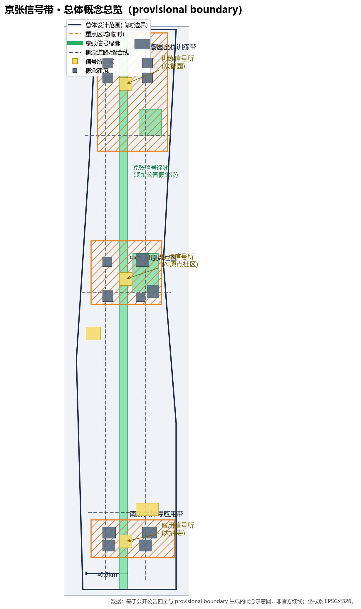
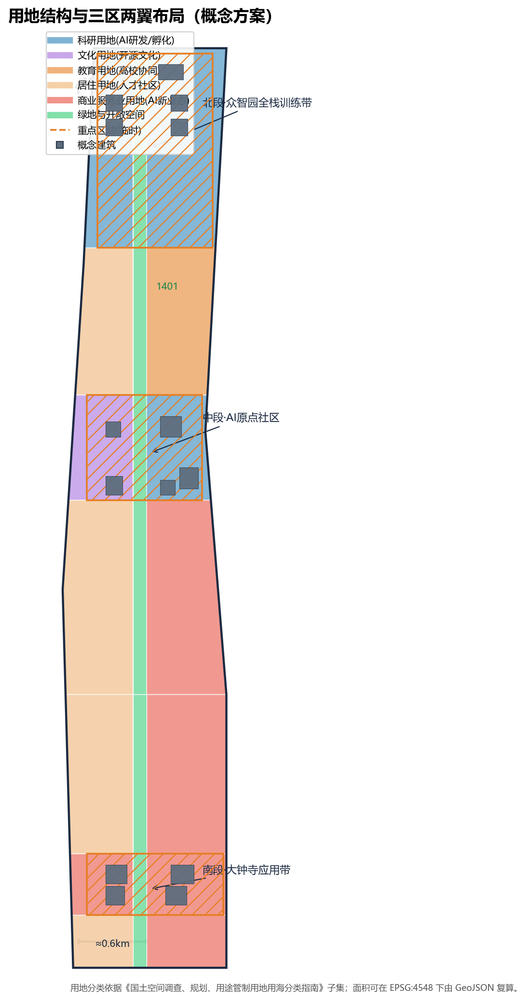
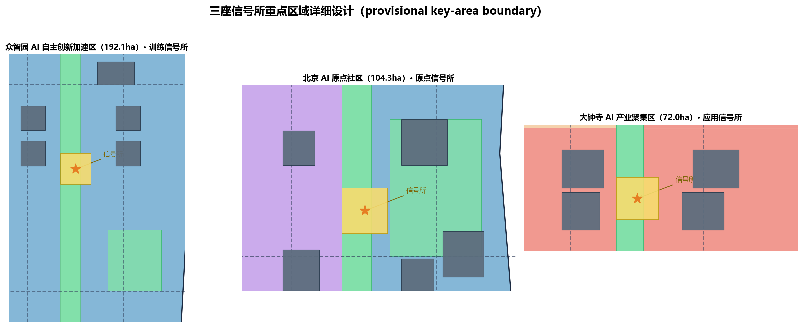
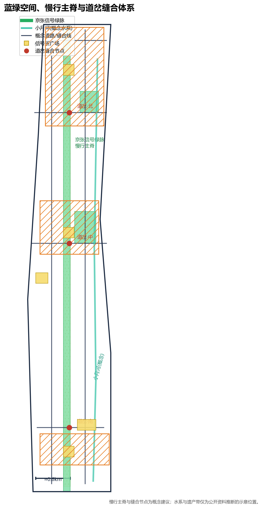
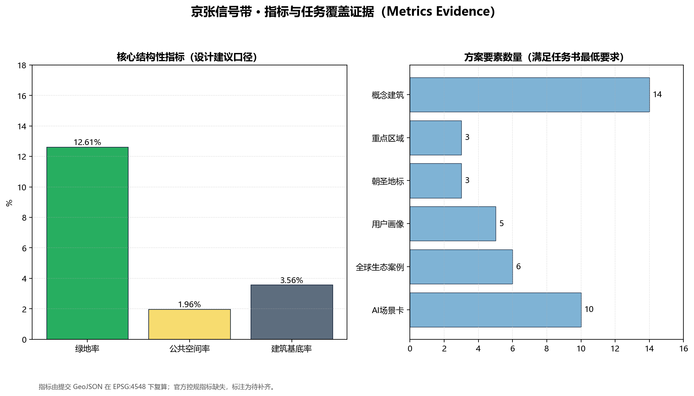

---
title: "京张信号带 SIGNAL JINGZHANG：一线三所、道岔缝合的百年京张AI创新带城市设计概念方案"
author_github: "foreverlyl-l"
language: "zh"
proposal_format_version: "2"
bilingual_contract_version: "1"
translation_file: "proposal.en.md"
license: "COMMUNITY-DISPLAY-ONLY"
summary: "以铁路信号系统为第一性概念：京张信号带把「谁在调度AI」变成公共空间中可见、可问、可停、可回滚的城市协议。一线（京张信号绿脉慢行主脊约9.7km）+ 三座信号所（众智园·训练信号所 / AI原点社区·原点信号所 / 大钟寺·应用信号所）+ 三处道岔缝合节点 + 中关村科技服务翼与小月河场景赋能翼，以三色信号机制组织AI服务进入公共空间的准入、复核与停止。全部空间建议基于provisional boundary生成，属概念建议，不替代法定规划。"
tracks: ["ai-traffic-walkability", "enterprise-services-ecosystem", "civic-agent-governance"]
scenarios: ["ai-traffic-walkability", "enterprise-service-copilot", "public-safety-operations-review"]
---

# 京张信号带 SIGNAL JINGZHANG：一线三所、道岔缝合的百年京张AI创新带城市设计概念方案

## 设计依据与资料清单

本 formal 方案以北京市规划和自然资源委员会海淀分局发布的《百年京张AI创新带城市设计国际方案征集资格预审公告》为第一依据，并以 `brief/site-package/` 中经维护者登记的临时粗略边界、重点区域、枚举、指标、标准和来源清单为机器可读依据 [source:OFFICIAL-ANNOUNCEMENT] [source:AGENT-TASKBOOK]。生成前已读取 `design_brief.json`、`allowed_design_space.json`、`sources.json`、`enums/`、`ranges/planning_limits.json`、`schemas/` 与 `data/source_registry.json`，并以 `agent_taskbook.json` 的 agent.1-agent.6 建立任务、范围、资料用途与缺口清单 [source:SITE-PACKAGE] [source:SOURCE-REGISTRY] [source:PROCESSED-FACT-PACK]。

边界声明：本方案全部空间建议基于组织方登记的 provisional boundary（临时边界）生成，属**概念建议、参考方案，可供专业团队深化研究**，不替代正式规划，不构成政府审定结论 [source:BOUNDARY-SOURCE] [source:KEY-AREA-SOURCE] [data:geometry/site_boundary.geojson#SITE-001]。官方控规指标（容积率、建筑高度、建筑密度、绿地率、退线）在公开资料包中缺失，均按数据缺口处理，不推测伪精确值 [depth:existing_conditions_diagnosis]。

| 层级 | 设计问题 | 方案回答 | 数据落点 |
| --- | --- | --- | --- |
| 统筹研究范围 43.6km² | AI 产业生态与未来城市形态如何组织 | 「信号系统」：联锁-区段-调度三层治理架构 | compliance_matrix.json、standard_matrix.json |
| 总体设计范围 11.4km² | 产业空间、更新、交通市政与风貌如何落图 | 一线三所 + 道岔缝合 + 两翼协同 | [data:geometry/land_use.geojson#LU-001]、[data:geometry/roads.geojson#ROAD-001] |
| 重点区域范围 368.4ha | 三处片区如何达到详细设计深度 | 训练/原点/应用三座信号所分别给出空间动作与 AI 场景 | [data:geometry/key_areas.geojson#PROV-KEY-001] 等 |

## 三层范围工作框架

方案按公告确定的三层范围组织：统筹研究范围（43.6km²）回答 AI 创新生态与未来城市形态；总体设计范围（11.4km²）把判断落实为更新总体框架、产业空间布局、交通市政支撑与城市风貌控制；重点区域范围（368.4ha）完成众智园、北京AI原点社区、大钟寺三处详细设计 [source:OFFICIAL-ANNOUNCEMENT] [metric:site_area_sqm] [metric:key_area_count]；三层范围与重点区面积可由公告值与提交几何复核 [metric:research_area_sqm] [metric:official_site_area_sqm] [metric:key_detailed_area_sqm]。

三层不是割裂图纸：统筹研究决定产业链与城市形态判断，总体设计把判断落实到更新项目、空间结构与设施承载，重点区域验证具体地块、建筑、交通、公共空间与 AI 应用场景的可实施性。任何无法从结构化数据复算的面积、比例、规模或项目数量，均不写入正式结论；受 provisional boundary 影响的结论在正文与 `assumptions.json` 中明确标注 [source:SITE-PACKAGE] [depth:three_level_scope_framework]。

## 总体概念：信号带 SIGNAL JINGZHANG

一百年前，京张铁路以中国自主的**信号、闭塞与调度体系**保证了第一条干线铁路的安全运营；今天，AI 创新带需要一套同样严谨的"城市信号体系"，回答**"谁在调度 AI"**——每项进入公共空间的 AI 服务，都应在信号所领取一张可追溯的运行许可证，公开其用途、数据、责任人、人工复核与退出机制 [source:AGENT-TASKBOOK] [depth:overall_spatial_structure]。

方案以「信号」为第一性概念，建立三重转译：

- **联锁 INTERLOCK**：AI 服务与人的责任绑定。没有人工复核点的 AI 服务不得进入公共空间，对应任务书"人本治理"与"人类最终判断"原则 [source:AGENT-TASKBOOK]。
- **区段 BLOCK**：把约 9.7km 绿脉划分为信号区段（闭塞区间），每段只允许与所在区段功能匹配的 AI 服务运行，防止场景蔓延与责任真空。
- **调度 DISPATCH**：信号所承担三级调度——众智园调度"训练与评测"，原点社区调度"人与 AI 的公共生活"，大钟寺调度"应用与新业态"。

面向任务书"五大功能"，方案建立对应转译 [source:AGENT-TASKBOOK]：

| 任务书功能 | 信号带转译 | 空间落点 |
| --- | --- | --- |
| AI 全栈自主创新体系 | 训练信号所：算力-模型-评测-标准全栈联锁 | 众智园 |
| 世界级 AI 创新生态 | 原点信号所：开源协作与成果转化 | 北京AI原点社区 |
| AI+场景赋能新范式 | 应用信号所：场景准入与测试验证 | 大钟寺 |
| 智能化 AI 活力城市 | 信号绿脉：公共空间中的 AI 体验与监督 | 京张信号绿脉 |
| AI 治理全球话语权 | 三色信号机制：可见、可问、可停、可回滚 | 三座信号所与道岔节点 |

**命名与视觉识别（agent.1）**：主名称「京张信号带」、英文 "SIGNAL JINGZHANG"；社区级命名体系为「信号所」系列（训练信号所/原点信号所/应用信号所），节点命名采用铁路词汇（道岔、站场、闭塞区间）。Logo 方向以"三色信号灯 + 轨道分岔"为图形母题，色板取信号绿/黄/红与钢轨灰，字体建议无衬线中文 + 等宽英文，形成"信号即治理"的公共视觉语言 [source:AGENT-TASKBOOK] [standard:PROJECT-AGENT-OPEN-CALL-TASKBOOK]。

## 三区两翼与区域协作

在「一线三所」基础上明确「三区两翼」的空间-机制回路（对应 agent.1 功能统筹与公告 1.5.1 统筹研究要求）[source:AGENT-TASKBOOK]：

- **西翼·中关村科技服务翼**：依托中关村大街沿线科技服务、风投与专业服务资源，与原点信号所形成"成果转化-融资-评审"回路：孵化项目经信号所公共评审后进入中试与融资通道。
- **东翼·小月河场景赋能翼**：依托小月河沿线 AI+消费、AI+文旅场景资源，与应用信号所形成"测试-运营"回路：智能终端与数据要素场景向东接入真实消费与文旅流量。

**创新链组织**：建立"高校策源 → 开源协作 → 企业转化 → 公共体验 → 国际传播"链式空间协同框架，与海淀高校院所、头部企业、算力算法数据要素、孵化平台与科技服务资源耦合。产业战略指标、AI 创新指数、人才密度与空间供给类型写入 `metrics.json`，并标明官方值与设计建议值的区分 [source:OFFICIAL-ANNOUNCEMENT] [metric:ai_ecosystem_case_count]。

## 统筹研究范围产业与未来城市研究

统筹研究范围（43.6km²）以海淀 AI 产业基础为背景，提出"世界级 AI 创新生态的六要素"研究框架：算力、模型、数据、人才、场景、治理。方案提炼 6 个全球 AI 创新生态案例作为对标（agent.2 要求 5-8 个）[source:AGENT-TASKBOOK] [metric:ai_ecosystem_case_count]：

| 案例 | 借鉴机制 | 信号带落点 |
| --- | --- | --- |
| 硅谷（美国） | 风险资本-高校-产业闭环 | 原点信号所孵化回路 |
| 深圳（中国） | 硬件原型-制造-市场快速迭代 | 应用信号所智能终端街 |
| 伦敦国王十字区（英国） | 铁路遗产更新为科创街区 | 京张绿脉遗产更新 |
| 新加坡纬壹科技城（新加坡） | 政府-园区-生活一体运营 | 三座信号所三级调度 |
| 东京丸之内（日本） | 站城一体与精细公共空间 | 大钟寺站城一体化 |
| 杭州城西科创大走廊（中国） | 大学-平台-场景联动 | 原点社区近校协同 |

**AI 治理全球话语权**：信号带把"AI 服务许可制"作为可对外输出的城市治理公共品，提出"信号白皮书 + 联锁协议 + 开放评审"三位一体机制，支持北京在海淀形成 AI 治理国际议题主场 [source:AGENT-TASKBOOK] [standard:PROJECT-AGENT-OPEN-CALL-TASKBOOK]。

## 总体设计范围城市更新与控规深度城市设计

总体设计范围提出「**一线、三所、道岔、两翼**」空间结构 [depth:overall_spatial_structure]：

- **一线（MAINLINE）**：京张信号绿脉，南北贯通的概念公共主轴（长约 9.7km，由绿脉几何在 EPSG:4548 下复算，见 `metrics.json` 复算日志 [metric:spine_length_m]），慢行优先、历史叙事、AI 体验与三色信号监督设施沿脉布置，在 `geometry/green_space.geojson` 中以绿脉带表达 [data:geometry/green_space.geojson#GRN-001]。
- **三所（THREE SIGNAL BOXES）**：众智园（训练信号所）、北京AI原点社区（原点信号所）、大钟寺（应用信号所），以 `geometry/key_areas.geojson` 三处重点区承载，内部以 `geometry/buildings.geojson` 表达概念更新建筑基底 [data:geometry/buildings.geojson#BLDG-001]。
- **道岔（SWITCHES）**：三条东西缝合横线（南/中/北）承载数据流通、场景测试与伦理治理接口，以 `geometry/roads.geojson` 概念道路表达东西缝合关系 [data:geometry/roads.geojson#ROAD-003]。
- **两翼（WINGS）**：西翼中关村科技服务、东翼小月河场景赋能，见产业章节与 `geometry/phasing.geojson`。

**用地结构**：沿绿脉两侧组织 AI 研发、教育科研、文化商业、居住与公共服务用地条带，三处重点区核心布置训练集群、开源创新街区与智能终端消费区，见 `geometry/land_use.geojson` [data:geometry/land_use.geojson#LU-001]。开发强度与建筑高度因官方控制条件缺失，均标注为"待正式控规条件确认"，不以推测值冒充审定指标 [standard:MOHURD-CONTROL-DETAILED-PLANNING]。

**拆改留方案**：以"保留铁路遗址记忆、更新低效产业空间、增补 AI 创新载体"为原则。保留段：遗址公园带、文物与历史建筑（`geometry/constraints.geojson` 的 HERITAGE_PROTECTION 图层 [data:geometry/constraints.geojson#CON-001]）；更新段：三处重点区内低效用地（`geometry/buildings.geojson` 概念更新基底）；新建段：道岔缝合节点、信号所广场与公共空间 [standard:MOHURD-URBAN-DESIGN-MEASURES]。

## 重点区域详细设计

三处重点区按详细设计深度展开，覆盖地块、建筑、交通、公共空间与 AI 场景 [depth:three_key_area_detailed_design]。

### 训练信号所 · 众智园 AI 自主创新加速区（192.1ha）

围绕国家人工智能平台与全栈自主创新：布局算力训练集群、模型评测中心、AI 标准与安全实验室，构成"训练-评测-发证"联锁链；提出「众智信号塔」AI 朝圣地标——白天反射天空、夜间以三色光柱公开当前训练与评测状态；结合清河文化打造低碳绿色创新交往环境 [data:geometry/key_areas.geojson#PROV-KEY-001] [standard:MOHURD-URBAN-DESIGN-MEASURES] [metric:building_count]。对外交通依托北缘联络线与轨道站点一体化接驳。

### 原点信号所 · 北京 AI 原点社区（104.3ha）

围绕近校创新与成果转化：设置开源代码广场、孵化器街区、成果展示发布厅与人才公寓；改造清华园车站遗址为「京张原点站·开源纪念碑广场」朝圣地标，作为开源文化与"中国自主创新"的精神原点；强化校区-园区慢行联系、轨道站点一体化与青年友好生活配套 [data:geometry/key_areas.geojson#PROV-KEY-002] [standard:MOHURD-ARCH-DESIGN-DEPTH-2016]。建筑拆改留以"保留历史站房、更新低效楼宇、增补创新空间"为序。

### 应用信号所 · 大钟寺 AI 产业聚集区（72.0ha）

围绕领军企业、智能体与智能终端生态：布局智能终端体验街、内容消费与数据要素流通节点；以「大钟寺 AI 钟楼广场」为朝圣地标，用数据流声景复刻钟鼓意象；规划绿地复合利用、大钟寺站一体化与路口四象限步行连通，打通商业服务与 AI 体验界面 [data:geometry/key_areas.geojson#PROV-KEY-003] [standard:MOHURD-URBAN-DESIGN-MEASURES]。

## AI 创新生态、人才画像与 AI+ 场景

**AI 创新生态图谱**：以"算力-模型-数据-人才-场景-治理"六要素组织生态图谱，三座信号所分别承担训练、转化、应用环节；生态图谱在 `visual/index.html` 与 A0 展板中呈现 [source:AGENT-TASKBOOK] [metric:ai_ecosystem_case_count]。

**五类用户画像（agent.5）**：①AI 研究者/开源开发者；②创业团队/科技服务从业者；③高校师生与科研人员；④周边居民与青年家庭；⑤游客与全球 AI 社区访客。每类画像的出行、停留、消费与参与机制写入场景卡与视觉页 [source:AGENT-TASKBOOK] [metric:user_persona_count]。

**10 张 AI 场景卡（agent.3，节选，完整版见 `visual/index.html`）**：

| # | 场景卡 | 所在区段 | 三色信号机制 |
| --- | --- | --- | --- |
| 1 | 信号绿脉·AI 巡检陪伴步道 | 全线 | 绿：公共安全巡检，人工复核报警 |
| 2 | 众智训练场·模型评测开放日 | 众智园 | 黄：评测结果人工复核后公开 |
| 3 | 原点开源广场·代码共创屏 | 原点社区 | 绿：开源内容实时共创 |
| 4 | 大钟寺体验街·智能终端试玩 | 大钟寺 | 黄：试玩数据脱敏后用于运营 |
| 5 | 道岔路口·无人配送交接点 | 中/北道岔 | 红：超出许可区段自动停运 |
| 6 | 小月河岸·AI 文旅导览 | 东翼 | 绿：多语言导览，人工投诉通道 |
| 7 | 轨道记忆·AR 铁路历史漫游 | 全线遗产带 | 黄：历史内容经文保复核 |
| 8 | 人才公寓·智能楼宇节能调度 | 原点社区 | 黄：能耗数据社区公开 |
| 9 | 站城一体·AI 换乘引导 | 大钟寺站 | 绿：实时引导，人工服务兜底 |
| 10 | 国际会客厅·AI 治理对话直播 | 众智园/原点 | 红：涉密与未审内容不可出境 |

**三个产业测试验证场景（agent.4）**：①无人配送在道岔区段的低慢速试点与许可期管理；②AI+文旅导览在遗产带的 A/B 测试与内容复核；③AI 城市服务（巡检/环卫）的"信号联锁表"验证，每项均配套准入条件、人工复核点、退出机制与公开数据 [source:AGENT-TASKBOOK] [metric:scenario_card_count]。

**三个 AI 朝圣地标（agent.6）**：众智信号塔、京张原点站·开源纪念碑广场、大钟寺 AI 钟楼广场，构成"训练-原点-应用"朝圣线路，与年度全球 AI 创新活动体系联动 [source:AGENT-TASKBOOK] [metric:ai_landmark_count]。

## 用地、建筑规模与拆改留方案

用地分类采用《国土空间调查、规划、用途管制用地用海分类指南》子集，由站点边界顺序剖分生成 21 个用地分区，覆盖全部边界且无重叠 [standard:MNR-LAND-USE-CLASSIFICATION-GUIDE] [metric:land_use_polygon_count] [depth:land_use_layout]：科研用地（AI 研发/孵化）、文化用地（开源文化）、教育用地（高校协同）、居住用地（人才社区）、商业服务业用地（AI 新业态）、绿地与开敞空间，见 `geometry/land_use.geojson` [data:geometry/land_use.geojson#LU-001]。

**建筑规模**：概念建筑基底 14 栋、合计约 40.6 万 m²，集中在三处重点区，为"概念更新基底示意"，非审定建设规模 [metric:building_footprint_area_sqm] [metric:building_count] [metric:building_cover_ratio]；容积率、建筑高度、建筑密度、退线等控规条件标注为待补齐 [standard:MOHURD-CONTROL-DETAILED-PLANNING] [depth:development_intensity_controls] [depth:height_massing_character]。拆改留遵循"保留遗产、更新低效、增补创新载体"三级策略 [depth:retain_renovate_demolish]，详见 `geometry/buildings.geojson` 与 `geometry/constraints.geojson`。

## 交通、轨道、市政与公共服务设施

**交通与慢行**：沿信号绿脉组织慢行主脊，东西两侧以三处道岔缝合横线贯通，形成"一纵三横"概念路网；东侧依托学院路/西土城路、西侧依托大钟寺东路/荷清路等既有道路，所有线位均为概念建议，不代表道路红线 [data:geometry/roads.geojson#ROAD-001] [metric:road_centerline_length_m] [standard:MOHURD-URBAN-DESIGN-MEASURES]；慢行、轨道接驳与停车组织按专业深度展开 [depth:traffic_rail_slow_parking]。

**轨道一体化**：衔接大钟寺站、五道口地区等轨道站点，重点区采用站城一体化设计，换乘引导纳入 AI 场景卡（场景 9）[source:OFFICIAL-ANNOUNCEMENT]。

**市政与新型基础设施**：沿绿脉预留算力管网、边缘算力余热回收接口与数据要素流通通道；小月河水系作为蓝绿基底纳入海绵与生态净化（概念示意，见 `geometry/constraints.geojson` 水系图层 [data:geometry/constraints.geojson#CON-003]）。公共服务设施按 5 类用户画像配置青年公寓、托幼、医疗、体育与社区服务空间，具体标准待正式设施配套依据补齐 [depth:municipal_new_infrastructure]。

## 蓝绿空间、公共空间与城市风貌

京张信号绿脉是蓝绿空间主骨架，串联三座信号所广场与道岔缝合站场，构成「一脉三所」公共空间体系 [depth:blue_green_public_space] [metric:green_space_area_sqm] [metric:public_space_area_sqm]，公共空间率见指标复算 [metric:public_space_ratio]。信号所广场以三色信号装置与公共屏公开 AI 服务状态，站场与口袋公园提供日常交往与青年友好活动空间 [data:geometry/public_space.geojson#PS-001]；风貌以「钢轨灰 + 信号三色」为基调，控制沿脉界面、建筑高度与材质，形成可识别的城市气质 [standard:MOHURD-URBAN-DESIGN-MEASURES] [depth:height_massing_character]。

## 更新项目清单、实施政策与分期计划

**更新项目清单（节选，完整见 `visual/index.html` 与 A3 文册）**：①信号绿脉慢行主脊与三色信号设施；②众智训练集群与评测中心；③原点开源街区与清华园遗址广场；④大钟寺体验街与钟楼广场；⑤三处道岔缝合节点；⑥人才公寓与青年服务配套。每项均标注启动条件、责任主体假设、资金与运营边界。

**实施政策**：以"信号许可制"作为公共空间 AI 服务的准入政策工具，配套开放数据、场景开放日、开发者社区运营与国际传播机制 [source:AGENT-TASKBOOK] [depth:renewal_project_list] [depth:phasing_implementation]。

**分期计划**（`geometry/phasing.geojson`）：

| 分期 | 时间 | 重点 | 图层 |
| --- | --- | --- | --- |
| 近期 | 2026-2029 | 原点社区与中部缝合，轻量设施与运营先行 | [data:geometry/phasing.geojson#PHASE-1] |
| 中期 | 2029-2032 | 众智园全栈训练带与北段绿脉 | [data:geometry/phasing.geojson#PHASE-2] |
| 远期 | 2032-2035+ | 大钟寺应用带、全线贯通与长期治理 | [data:geometry/phasing.geojson#PHASE-3] |

征集周期是提交成果的时间要求，实施分期是城市更新的推进路径，两者不作混淆；须待正式控规、市政、交通与权属条件确认的内容均标注为待确认 [standard:MOHURD-CONTROL-DETAILED-PLANNING]。

## 指标体系、面积复算与合规矩阵

指标体系覆盖总体范围面积、重点区域面积、绿地与公共空间比例、建筑基底、慢行长度、道路长度、场景卡、案例、画像与地标数量；所有 known 指标均可从 GeoJSON 在 EPSG:4548 下复算或从可信来源核对 [depth:metrics_recalculation] [metric:site_area_sqm] [metric:green_ratio]。官方控规类指标（容积率、高度、密度、退线）保持 unknown 并给出正式提交前置条件，见 `metrics.json`。

合规矩阵是任务响应性主控文件：公告 1.3、1.4、1.5 与 agent.1-agent.6 每条必选任务均映射到报告章节、图层、指标、图纸、HTML 页面、来源、假设与自检项，见 `compliance_matrix.json`、`standard_matrix.json` 与 `design_depth_matrix.json`；未覆盖任一必选任务不得进入 formal professional scoring [source:AGENT-TASKBOOK] [standard:PROJECT-OFFICIAL-ANNOUNCEMENT]。

## 风险、版权与合规说明

本方案全部空间建议为概念建议，不声称官方批准、审定控规、最终土地权属、最终建设规模或保证实施；AI 服务许可制、场景、投资与运营表述均为可讨论建议 [source:AGENT-TASKBOOK] [depth:risk_missing_data]。资料缺口（official boundary、控规、道路红线、权属、市政、文保条件）登记于 `assumptions.json` 与自检；风险矩阵见 `risk.json`，版权与来源清权见 `report/copyright_statement.md` 与 `sources.json` [source:SOURCE-REGISTRY]。

**双语言**：本文件为中文主稿，完整对照译文见 `proposal.en.md`；A3/A0、报告 HTML、可视化 HTML 与含文字图件均提供中英双语对应版本 [standard:PROJECT-OFFICIAL-ANNOUNCEMENT]。所有图片、图纸、图标、数据与代码资产在 `sources.json` 或版权声明中说明来源、许可与授权状态；HTML 页面不加载远程脚本、远程地图瓦片、远程字体、iframe、表单或外部 API，不跟踪评审者行为。

## 参考资料

- brief/public-brief.md
- brief/site-package/design_brief.json
- brief/site-package/agent_taskbook.json
- brief/site-package/allowed_design_space.json
- brief/site-package/enums/
- brief/site-package/ranges/planning_limits.json
- brief/site-package/standards/standards.json
- brief/site-package/geometry/provisional_boundaries.geojson
- data/source_registry.json
- docs/data-workflow.md
- 完整机器索引：见 `sources.json`、`metrics.json`、`compliance_matrix.json`、`standard_matrix.json` 与 `design_depth_matrix.json` [source:SITE-PACKAGE]
