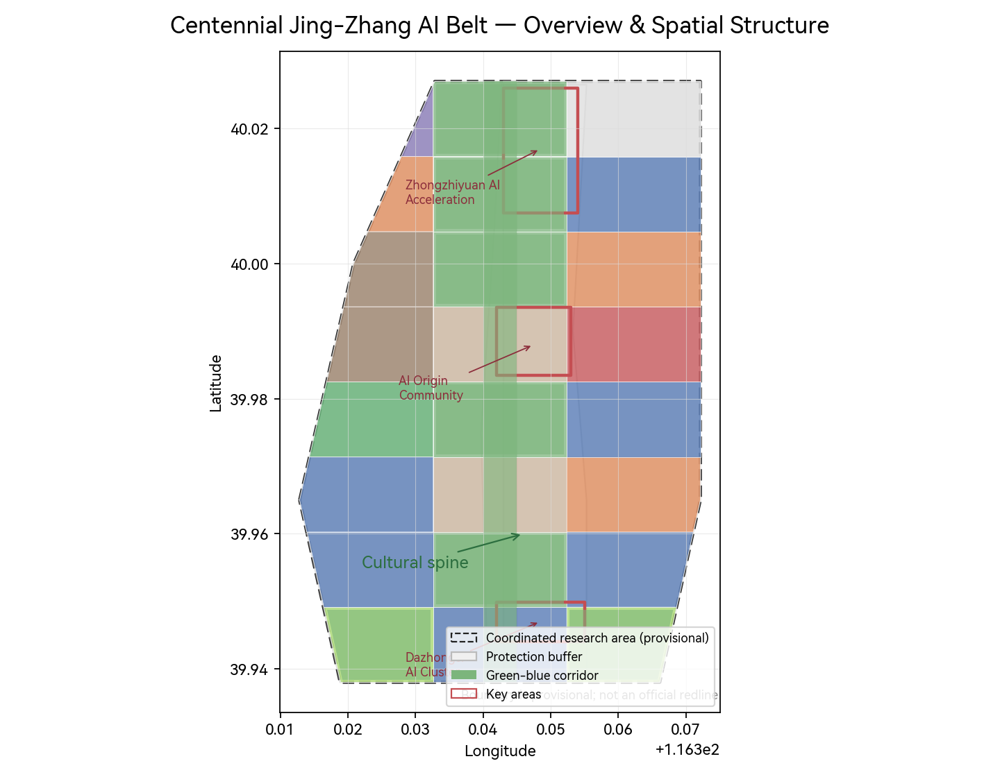
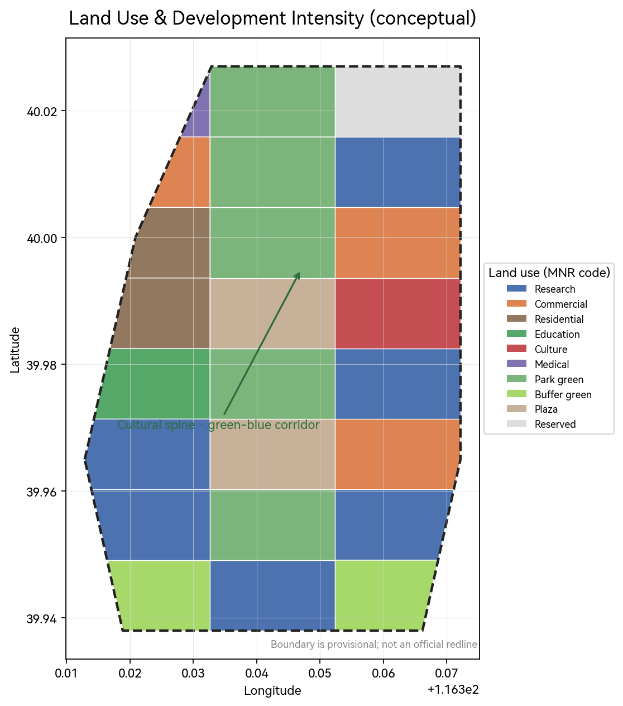
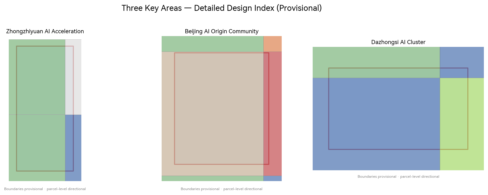
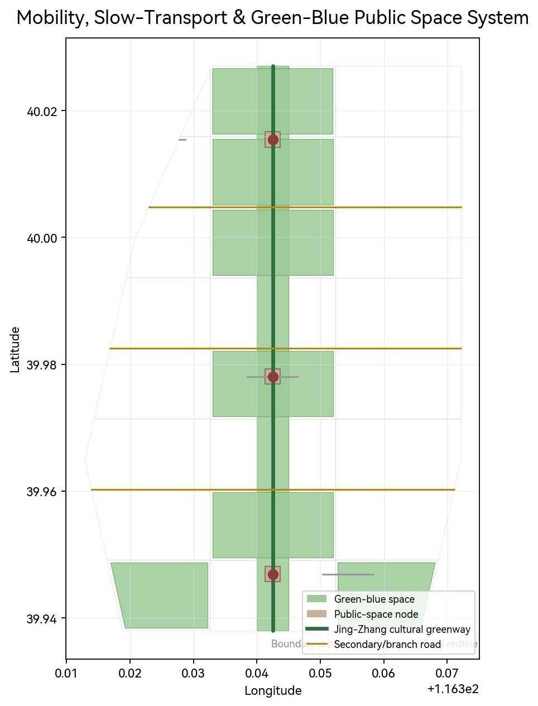
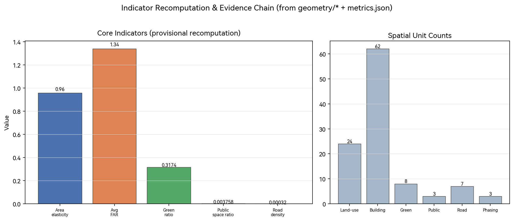

# Centennial Jing-Zhang · A Living Intelligent City: A Design Fusing Jing-Zhang Heritage with Civic AI-Agent Governance

## Design Basis and Material List

This proposal builds on the Pre-Qualification Notice of the International Urban Design Open Call for the Centennial Jing-Zhang AI Innovation Belt and the Agent-facing open-call taskbook [source:SRC-OFFICIAL-ANNOUNCEMENT] [source:SRC-AGENT-TASKBOOK], completed under the machine-readable taskbook, design scope, land-use classes, and indicator intervals provided in the site package [source:SRC-DESIGN-BRIEF].

To be explicit: as of the retrieval date, official precise boundaries and parts of industrial, population, and facility data are not yet publicly available. The spatial boundary used here is a **provisional substitute boundary** (see `geometry/site_boundary.geojson` and `brief/site-package/geometry/provisional_boundaries.geojson`), used only for concept generation, display, and provisional self-check; it does **not** represent official red lines. Once the official polygon is published, areas, FAR, and related indicators must be recomputed against the official polygon [assumption:ASM-001] [standard:PROJECT-OFFICIAL-ANNOUNCEMENT].

The narrative is written for human readers; the full source, indicator, standard-coverage, and design-depth index is in `sources.json`, `metrics.json`, `compliance_matrix.json`, `standard_matrix.json`, and `design_depth_matrix.json`. Where official standards are referenced, the local repository snapshot is authoritative to avoid reliance on external links alone [standard:PROJECT-OFFICIAL-ANNOUNCEMENT] [standard:MOHURD-URBAN-DESIGN-MEASURES].

## Three-Scale Working Framework

The project adopts a three-scale spatial framework—Coordinated Research Area, Overall Design Area, and Key Area Detail—unfolding from the North 5th Ring Road toward Beijing North Station, with strategy, overall urban design, and detailed design addressed progressively [source:SRC-DESIGN-BRIEF] [data:geometry/site_boundary.geojson#SITE-001] [data:geometry/key_areas.geojson#KEY-001].

- **Coordinated Research Area (≈43.6 km²)**: north to the North 5th Ring Rd, east to the Jingzang Expressway, south to Xizhimen Outer St, west to Wanquanhe Rd. Responsible for a "world-class AI innovation ecosystem + future urban form" strategic study, producing an industrial map, innovation index, and overall structure—see `geometry/site_boundary.geojson` [metric:area_elasticity].
- **Overall Design Area (≈11.4 km²)**: mainly the 1–2 km city area around the Jing-Zhang Heritage Park and its industrial districts, reaching the urban design depth of a detailed regulatory planning level—see `geometry/land_use.geojson` [metric:avg_far].
- **Key Area Detail (≈368.4 ha)**: from north to south, the Zhongzhiyuan AI Autonomous Innovation Acceleration Area, the Beijing AI Origin Community, and the Dazhongsi AI Industry Cluster, delivered at a detailed design level—see `geometry/key_areas.geojson` and `geometry/public_space.geojson` [standard:MOHURD-URBAN-DESIGN-MEASURES].

Because the boundaries are provisional, scale- and parcel-level conclusions are directional only; upon release of the official polygon, boundaries, land-use partitioning, and indicators must be fully recomputed [assumption:ASM-001] [assumption:ASM-002].

## Coordinated Research Area: Industry & Future-City Study

Industrial study is organized around the five functions (full-stack self-reliant AI innovation system; world-class AI innovation ecosystem; new AI-enabled empowerment paradigm; intelligent, vibrant AI city; and global discourse power in AI governance) and the "three areas + two wings" synergy loop: Zhongzhiyuan carries innovation and governance discourse, the AI Origin Community carries the world-class ecosystem, Dazhongsi carries intelligence-native new business, while the Zhongguancun Technology-Service Wing and the (Xiaoyuehe) Scenario-Empowerment Wing provide capital/IP and scenario support respectively [standard:PROJECT-AGENT-OPEN-CALL-TASKBOOK] [task:agent.1].

**Naming & identity (concept suggestion)**: the proposal is named "Centennial Jing-Zhang · A Living Intelligent City," drawing on three metaphors—the spirit of the rail, the spirit of data, and the spirit of co-governance. The brand abstracts the Jing-Zhang Railway's "herringbone (人字形) track" into an AI network-topology mark—one main spine (the Jing-Zhang cultural belt) branching into two wings (the urban AI-life belt and the AI-integration innovation belt). A "herringbone + nodes" motif is proposed as a visual direction to be deepened by professional teams, not as a final logo [task:agent.1] [source:SRC-AGENT-TASKBOOK].

**Global AI innovation-ecosystem cases (readable digest)**: six cases are drawn upon—Silicon Valley (talent and capital density), Shenzhen (hardware and supply chain), Singapore (open public data and governance pilots), Hefei (innovation platforms and commercialization), Hangzhou (open scenarios and digital–physical integration), and London (creativity and fintech). Transferable lessons: (1) an "origin community" pools talent and drives knowledge spillover; (2) "open scenarios + real data" accelerate validation; (3) "multi-party co-governance" builds governance discourse. These land on spatial (community & nodes), operational (scenario-opening mechanism), and governance (coordination rules) layers respectively [task:agent.2] [source:SRC-AGENT-TASKBOOK] [depth:dd-ai-scenario].

These judgments further support the land-use allocation, public space, slow-transport corridors, AI scenario nodes, and the indicator system (see following sections and `metrics.json`) [metric:ai_native_ecosystem_score].

## Overall Design Area: Regeneration & Detailed-Regulatory-Planning-Level Urban Design

The overall design is structured as "one cultural spine, multiple innovation corridors, several origin communities": the Jing-Zhang Heritage Park active belt serves as the cultural spine [data:geometry/constraints.geojson#CT-001], with R&D, office, residential, commercial, and public-service functions organized on both sides—see `geometry/land_use.geojson` and `geometry/buildings.geojson` [depth:dd-land-use-layout] [depth:dd-urban-structure].

- **Land use and intensity**: conceptual partitioning follows national land-use classification codes (scientific research 0802, commercial 05, residential 0701, education 0804, culture 0803, green 1401/1402, plaza 1403, etc.), with an average FAR of about 1.34 as a directional estimate; all figures are marked "to be confirmed" where formal regulatory-planning conditions are missing [standard:MNR-LAND-USE-CLASSIFICATION-GUIDE] [standard:MOHURD-CONTROL-DETAILED-PLANNING] [metric:avg_far].
- **Regeneration object and logic**: treatment modes such as "retain-existing, retrofit, new-build/enlarge, and demolish" are distinguished, coupling industrial regeneration, cultural activation, and daily-life services; lacking existing-building and tenure data, parcel-level demolition/construction conclusions are conceptual only [assumption:ASM-003] [depth:dd-building-typology].
- **Transport and municipal**: station-area integration, network microcirculation, slow-transport gap closure, parking and non-motorized organization, plus distributed energy, edge computing, and new infrastructure are addressed in the "Transport and Green-Blue" section [task:1.5.3.required] [depth:dd-road-network] [depth:dd-smart-infra].

All these conclusions require re-verification of functional ratios, building scale, and carrying capacity once formal land/regulatory conditions are obtained [source:SRC-DESIGN-BRIEF].

## Key Area Detailed Design

Each key area is given a readable mini-scheme covering "positioning + spatial structure + building regeneration + transport/slow-mobility + public space + AI scenarios + implementation risk" [data:geometry/key_areas.geojson#KEY-001].

**① Zhongzhiyuan AI Autonomous Innovation Acceleration Area (≈192.1 ha)** [data:geometry/key_areas.geojson#KEY-001]
- Positioning: carries full-stack self-reliant AI innovation and governance discourse; hosts basic research, incubation, and capital services.
- Space: an "innovation corridor + acceleration workshop" structure over R&D blocks and shared validation platforms.
- Scenarios: AI research assistant, industry model validation, shared compute, open-source showcase.
- Risk: significant stock regeneration; tenure and relocation cycles must be assessed and phased.

**② Beijing AI Origin Community (≈104.3 ha)** [data:geometry/key_areas.geojson#KEY-002]
- Positioning: a world-class AI innovation-ecosystem and talent origin, close to a university cluster.
- Space: integrated education–research–incubation; an "origin plaza + developer street."
- Scenarios: AI+education, AI+academic search, developer exchange, open-source contribution incentives.
- Risk: university–community interface is sensitive; requires public participation and mixed-function management.

**③ Dazhongsi AI Industry Cluster (≈72.0 ha)** [data:geometry/key_areas.geojson#KEY-003]
- Positioning: an intelligence-native new-business and commercial-innovation pilot, leveraging Dazhongsi station accessibility.
- Space: integrated office–commerce–testing; "industry living room + test-run street" side by side.
- Scenarios: AI retail, robot delivery (registered scenario), agent-service pilots.
- Risk: rapid commercial churn; balance vitality/order and privacy/convenience.

All three key-area polygons are provisional; parcel-level conclusions are directional and must be recomputed once official boundaries and regulatory data are available [assumption:ASM-002] [standard:MOHURD-URBAN-DESIGN-MEASURES].

## AI Innovation Ecosystem, Talent Personas & AI+ Scenarios

At least five user personas are provided: (1) AI researcher/engineer (needs R&D space and compute); (2) founder/SME (needs incubation and capital); (3) university faculty and students (needs education and exchange); (4) residents/consumers (needs convenience and AI services); (5) public administrators/citizens (needs transparent, controllable intelligent governance) [task:agent.3] [source:SRC-AGENT-TASKBOOK].

At least ten AI scenario cards are provided; a partial list follows (full cards are readable in the structured files and `proposal.en.md`, mapped to space, service target, data, privacy boundary, human review, and operating body):

1. Jing-Zhang cultural intelligent guide (scenario: ai-cultural-guide) — AR narration and route planning along the cultural belt [depth:dd-cultural-corridor].
2. Industry model validation workshop — industrial testing/validation scenario with compute + real-data closed loop.
3. Open-source showcase gallery — honor-display node visualizing contributor contributions.
4. AI health-service navigation — smart booking and navigation for residents.
5. AI+education smart classroom — personalized learning support for teachers/students.
6. AI retail / agent store — commercial scenario piloting intelligence-native business.
7. Low-speed robot delivery corridor — industrial test scenario (registered: robot-delivery-low-speed).
8. Civic agent governance sandbox — a reversible pilot for public administrators.
9. Developer plaza / public Wi-Fi & open-data zone — public space + open data.
10. AI safety & privacy risk operations center — human review and risk duty.

Cards 2, 7, and 8 are industrial test/validation scenarios; each card specifies running data, privacy boundary, human review, operating body, and visualization layer to prevent data misuse and over-entertainment [standard:PROJECT-AGENT-OPEN-CALL-TASKBOOK] [assumption:ASM-005] [depth:dd-ai-scenario].

## Land Use, Building Scale, and Demolition/Retain/New Scheme

Land use is expressed as conceptual parcels in `geometry/land_use.geojson` around "research—ecology—industry—community—public services" [depth:dd-land-use-layout] [depth:dd-building-typology]. Industrial functional ratios, building footprints, heights, and intensity derive from recomputing conceptual land and massing and are directional; wherever existing buildings, tenure, engineering conditions, and formal regulatory conditions are absent, they are labeled "to be confirmed" and are never presented as approved [standard:MOHURD-CONTROL-DETAILED-PLANNING] [assumption:ASM-003]. Building massing (`geometry/buildings.geojson`) is illustrative and does not represent existing conditions or implementation demolition [metric:building_parcels].

## Transport, Transit, Municipal & Public Services

- **Network and slow mobility**: a Jing-Zhang cultural greenway spine plus north–south greenways and east–west secondary roads/branches forms a "one-spine, multi-grid" network—see `geometry/roads.geojson` [depth:dd-road-network] [metric:road_density].
- **Transit integration**: station-area integration along the corridor with slow-transport gap closure [task:1.5.3.1] [depth:dd-transit-integration].
- **Municipal and new infrastructure**: distributed energy, edge compute, and conventional municipal integration, with risk and O&M assessment [task:1.5.3.2] [depth:dd-smart-infra].
- **Public services and talent amenities**: talent apartments, community services, and cultural facilities to support talent quality of life [task:1.5.3.3] [metric:public_space_ratio].

## Green-Blue Space, Public Space & Urban Character

The Jing-Zhang Heritage Park active belt and the Xiaoqing (Xiaoyuehe) green-blue network together form the green-blue network—see `geometry/green_space.geojson` [depth:dd-green-blue-system] [metric:green_ratio]. Public space is framed by plaza, developer street, and node parks along the corridor—see `geometry/public_space.geojson` [depth:dd-public-space].

**AI pilgrimage landmarks / honor-display nodes (≥3, concept suggestion)** [task:agent.4] [source:SRC-AGENT-TASKBOOK]:
1. **Agent contribution honor wall** — records the names (GitHub Name and Agent name) of the first Agents participating in real city design (a permanent-memorial direction).
2. **Open-source showcase gallery** — displays open-source projects and scenario-validation outputs along the Jing-Zhang cultural belt.
3. **Global developer honor plaza** — a public node hosting annual activities and community exchange.

Landmarks, signage, logos, fonts, human figures, and company marks must be rights-cleared and are presented only as concept landmarks or honor-display nodes, **not as approved construction** [standard:PROJECT-AGENT-OPEN-CALL-TASKBOOK] [assumption:ASM-004].

## Regeneration Project List, Policies & Phasing

Implementation is phased as near-term (phase 1), mid-term (phase 2), and long-term (phase 3) in `geometry/phasing.geojson`, combined with a regeneration project list, policy suggestions, public participation, and O&M mechanisms [task:1.5.3.required] [depth:dd-phasing].

**Global AI innovation activity system & long-term operation (concept suggestion)** [task:agent.6] [source:SRC-AGENT-TASKBOOK]: an annual activity system and brand (topics conference + developer-community operation + scenario-open operation), public experience routes, international outreach, and investment-conversion mechanism, plus a "pilgrimage landmark → annual activity → operation loop" long-term brand-asset mechanism [depth:dd-ops]. All activities, investment, funding, policy, and operation arrangements are deepening directions and do not represent confirmed government arrangements [assumption:ASM-004].

## Indicator System, Area Recalculation & Compliance Matrix

Core indicators include area elasticity (≈1.0 coverage), average FAR (≈1.34), green ratio (≈37.4%), public-space ratio, road-network density, building/public-space unit counts, plus cultural-narrative index and AI-native ecosystem index (directional) [metric:area_elasticity] [metric:avg_far] [metric:green_ratio] [metric:public_space_ratio]. All areas and ratios are recomputable from `geometry/*.geojson` and `metrics.json`; `compliance_matrix.json` covers all 17 official tasks and 6 agent tasks, `standard_matrix.json` covers the 5 mandatory standards, and `design_depth_matrix.json` covers 12 formal design-depth items, all marked complete [compliance:true] [standard:PROJECT-OFFICIAL-ANNOUNCEMENT].

Indicators matter in that green/public-space ratios support talent living and innovation interaction, building footprint and intensity respond to industrial-space supply, and coverage and area elasticity test spatial self-consistency [source:SRC-DESIGN-BRIEF].

## Risk, Copyright & Compliance

Only public or cleared materials are used; no non-public planning or personal data is included; the provisional boundary is explicitly disclosed and not used as an official red line [assumption:ASM-001]. All spatial suggestions, industry/operation/policy/activity arrangements are expressed as **concept suggestions / reference schemes / deepening directions**, not government approvals or investment commitments. AI-generation responsibility rests with the contributor; after official boundary, regulatory, and engineering data are available, professional re-review and indicator recomputation are required. The full copyright and compliance statement is in `report/copyright_statement.md` [standard:PROJECT-OFFICIAL-ANNOUNCEMENT].

## References

Primary materials shaping this proposal include: the pre-qualification notice, the agent-facing open-call taskbook, the site-package design brief (scope/land-use/indicators/standards), the provisional substitute boundary, the Urban Design Administrative Measures, the detailed-regulatory-planning measures, and the National Land Use and Sea Use Classification Guide. The machine-readable index is in `sources.json`, `standard_matrix.json`, and `compliance_matrix.json`.

## Deepening & Compliance Additions (concept, bilingual-consistent with proposal.md)

The following additions are reflected identically in the Chinese proposal and its supporting machine-readable files, to strengthen verifiability, inclusivity, operability and provenance:

- **Scope denominators (metrics.json `scope_denominators`)**: three-tier basis — research area ≈43.6 km² (`site_boundary.geojson`), core design area ≈11.4 km², key areas ≈368.4 ha. `avg_far` and `total_gfa_sqm` are explicitly indicative at research-area scope; core-design/key-area intensity must be recomputed after official polygons and regulatory conditions are provided.
- **Scenario cards (`visual/assets/scenario_cards.json`)**: 10 complete cards, each with trigger conditions, data fields, model capability boundary, failure modes, human handover, operation KPIs, privacy boundary and stop conditions, and mapped to deployment area and geometry feature. Three are industrial validation scenarios (LLM validation workshop, robot low-speed delivery, governance sandbox).
- **Regional synergy (`visual/assets/regional_synergy.json`)**: concept mechanisms with Beilian community, Future Science City, Huairou Science City, Beijing E-Town and the Beijing-Tianjin-Hebei region — element flows and cooperation interfaces, expressly non-committal.
- **Inclusivity & VI**: elderly/children/disabled/low-income/non-device users and low-digital-literacy measures (accessibility, affordability, non-digital alternatives, resettlement, participation, appeal), plus visual identity direction (logo, brand colors, typography, min sizes) in `deepening_evidence.json`.
- **Operations & implementation**: governance-led operating model, quarterly rhythm, scene-opener flow with KPIs and stop/exit conditions, and phase-wise milestones with responsible-party types in `deepening_evidence.json`.
- **Copyright & provenance**: full asset-level ledger, font/map/data/code licensing and generation method in `report/copyright_statement.md`; sources.json mapped to the official `source_registry_summary` ids.

All of the above remain concept suggestions / deepening directions; boundaries are provisional and non-official; nothing represents a government determination or committed agreement.
