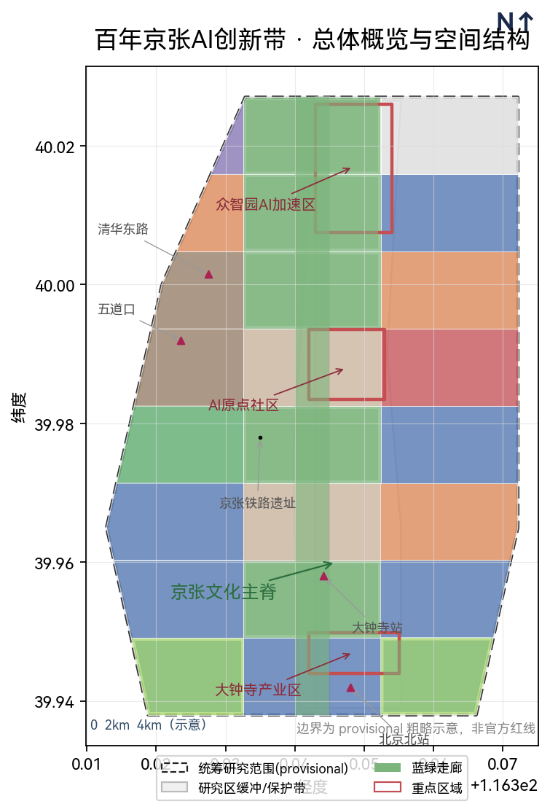
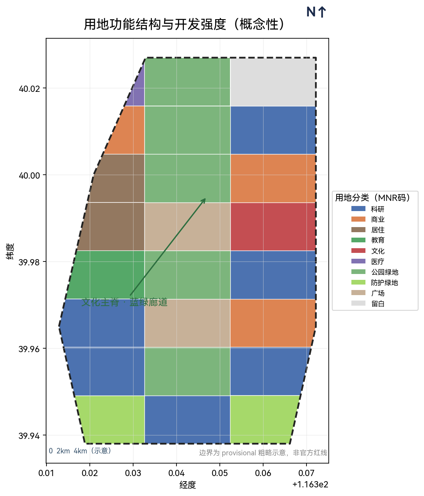
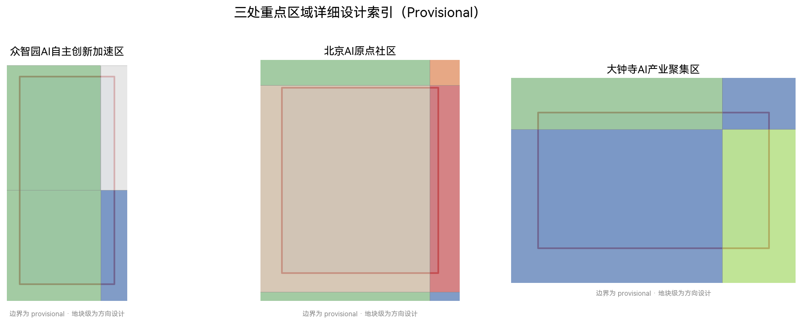
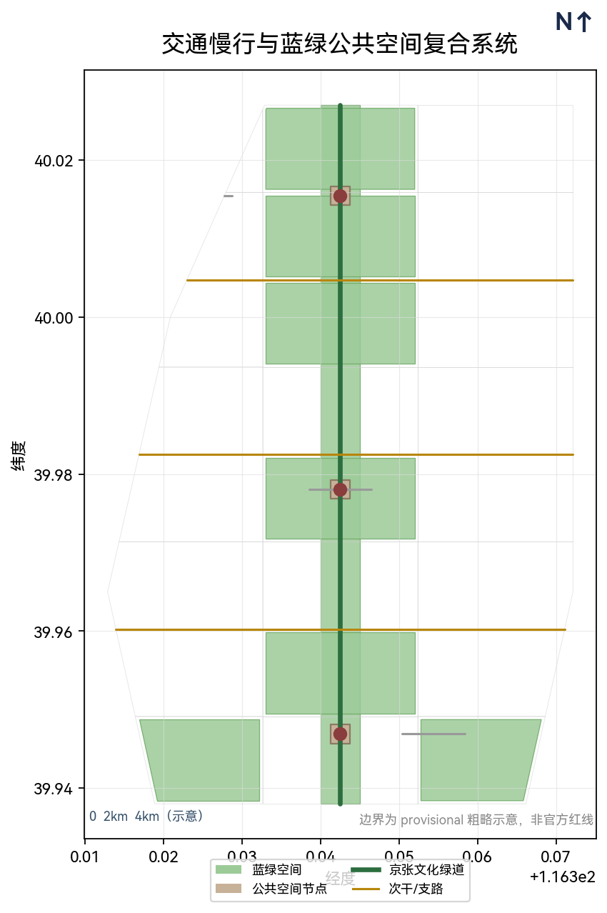
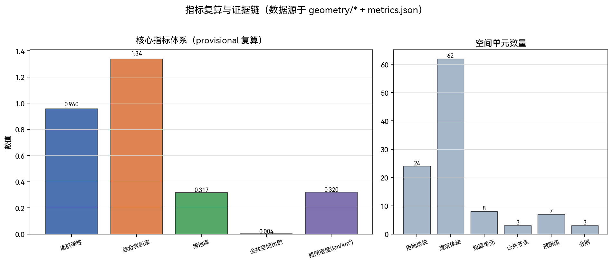

# 百年京张 · 智城有灵：京张文化遗产与城市智能体治理融合设计

## 设计依据与资料清单

本方案基于「百年京张 AI 创新带城市设计国际方案征集」资格预审公告与面向智能体的开源征集任务书展开 [source:SRC-OFFICIAL-ANNOUNCEMENT] [source:SRC-AGENT-TASKBOOK]，并在 site-package 提供的机器可读任务书、设计范围、用地分类与指标区间约束下完成 [source:SRC-DESIGN-BRIEF]。公告明确了三层空间范围——统筹研究范围约 43.6 km²、总体设计范围约 11.4 km²、重点区域合计约 368.4 公顷——以及三大定位（百年京张文化带、都市 AI 生活体验带、AI 融合创新带）、五大功能与三区两翼协同格局。

需要明确的是：截至检索日，官方精确边界与部分产业、人口、设施数据尚未在公开渠道提供，本方案使用的空间边界为 **provisional 粗略替代边界**（见 `geometry/site_boundary.geojson` 与 `brief/site-package/geometry/provisional_boundaries.geojson`），仅用于概念生成、展示与临时自检，**不代表官方红线**；正式多边形发布后，面积、容积率与相关指标需按 official polygon 重算 [assumption:ASM-001] [standard:PROJECT-OFFICIAL-ANNOUNCEMENT]。

方案正文面向人阅读，完整来源、指标、标准覆盖与设计深度索引见 `sources.json`、`metrics.json`、`compliance_matrix.json`、`standard_matrix.json` 与 `design_depth_matrix.json`。涉及官方标准文本，均以仓库本地快照为准，避免仅依赖外部链接 [standard:PROJECT-OFFICIAL-ANNOUNCEMENT] [standard:MOHURD-URBAN-DESIGN-MEASURES]。

## 三层范围工作框架

本项目采取「统筹研究范围—总体设计范围—重点区域范围」三级空间框架，自北五环向北京北站方向逐级落实产业战略、总体城市设计与重点片区详细设计，层层递进、成果各有侧重 [source:SRC-DESIGN-BRIEF] [data:geometry/site_boundary.geojson#SITE-001] [data:geometry/key_areas.geojson#KEY-001]。

- **统筹研究范围（约 43.6 km²）**：北至北五环、东至京藏高速、南至西直门外大街、西至万泉河路。承担「世界级 AI 创新生态 + 未来城市形态」的战略研究，产出产业图谱、创新指数与整体格局。该层不做地块级设计，而是以产业协同、区域联动与创新走廊为研究主线，见 `geometry/site_boundary.geojson` [metric:area_elasticity] [metric:site_area_sqm]。
- **总体设计范围（约 11.4 km²）**：以京张遗址公园周边 1–2 公里城市地区和产业区为主，达到控制性详细规划层面的城市设计深度，产出用地、建筑、交通与公共空间总体结构。该层将文化主脊、创新走廊与原点社区的空间关系落实为可标注的用地分区与路网骨架，见 `geometry/land_use.geojson` [metric:avg_far] [depth:dd-land-use-layout]。
- **重点区域范围（约 368.4 公顷）**：自北向南含众智园 AI 自主创新加速区（约 192.1 ha）、北京 AI 原点社区（约 104.3 ha）、大钟寺 AI 产业聚集区（约 72.0 ha），开展精细化详细设计，分别承担自主创新加速、世界级生态原点与智能原生新业态三类角色，见 `geometry/key_areas.geojson` 与 `geometry/public_space.geojson` [standard:MOHURD-URBAN-DESIGN-MEASURES] [depth:three_key_area_detailed_design]。

因边界为 provisional，三层范围的面积与地块级结论仅作方向设计，正式多边形到位后需对边界、土地用途分割与指标全量重算 [assumption:ASM-001] [assumption:ASM-002]。

## 统筹研究范围产业与未来城市研究

### 总体概念与命名体系

围绕五大功能（AI 全栈自主创新体系、世界级 AI 创新生态、AI+ 场景赋能新范式、智能化 AI 活力城市、AI 治理全球话语权）与「三区两翼」协同回路组织产业研究：众智园承载自主创新与治理话语权，AI 原点社区承载世界级生态，大钟寺承载智能原生新业态，中关村科技服务翼与（小月河）场景赋能翼分别提供资本/IP 与场景支撑 [standard:PROJECT-AGENT-OPEN-CALL-TASKBOOK] [task:agent.1]。

**命名与标识（概念建议）**：提案命名「百年京张 · 智城有灵」，取「铁轨之灵、数据之灵、共治之灵」三重隐喻——铁轨之灵呼应京张铁路的人字形展线与詹天佑精神，象征工业文明的历史基因；数据之灵对应 AI 时代的数据流与算法治理，象征智能文明的运行内核；共治之灵则指向多元主体参与的协同治理，象征人民城市的价值归宿。品牌将京张铁路的「人字形展线」抽象为 AI 网络拓扑标识——一条主脊（京张文化带）分出两翼（都市 AI 生活带、AI 融合创新带），Logo 方向以「人字 + 节点」为母题，并定义了品牌色彩（京张绿 #2C6E3F / 智联蓝 #3A5A8C / 铁路灰棕 #C7B198 / 基底白绿）、中英文字标（智城有灵 / Sentient Jingzhang）、最小尺寸与留白规范，作为待专业团队深化的视觉方向，不表述为已定稿方案、未注册商标 [task:agent.1] [source:SRC-AGENT-TASKBOOK]（完整 VI 草案见 `visual/assets/deepening_evidence.json` 的 visual_identity）。

### 全球 AI 创新生态案例

选取 6 处全球 AI 创新生态案例进行可迁移经验提炼 [task:agent.2] [source:SRC-AGENT-TASKBOOK]：

1. **硅谷（美国）**：以资本密度与人才外溢构建「原点—衍生—再投资」闭环——斯坦福大学作为知识原点，沙丘路提供资本接驳，大量衍生公司形成产业纵深。可迁移经验：以高校与科研机构为锚点构建知识外溢场，在众智园与 AI 原点社区复制「实验室—孵化器—资本—产业」的短距离闭环。
2. **深圳（中国）**：以硬科技产业链密度与快速试制能力见长——华强北的元器件生态、南山科技园的总部集群与前海的资本通道形成「设计—原型—量产—出海」全链条。可迁移经验：在大钟寺区域引入「快速试制 + 场景验证」机制，将商业空间转化为 AI 产品测试场。
3. **新加坡**：以政府主导的公共数据开放与治理试点著称——GovTech 推动跨部门数据共享，OneService 平台实现市民诉求一体化处理。可迁移经验：在城市智能体治理沙盒中引入「公共数据可用不可见」机制，以场景开放驱动技术验证。
4. **合肥（中国）**：以大科学装置与成果转化联动为特色——综合性国家科学中心、中科大与量子信息研究院形成「基础研究—工程化—产业化」通道。可迁移经验：在众智园设置「大模型验证坊」，将学术成果与产业需求对接。
5. **杭州（中国）**：以城市大脑与场景开放驱动数实融合——城市大脑从交通治理扩展到医疗、城管、文旅等领域，形成「场景即数据、数据即治理」模式。可迁移经验：以京张文化带为线性场景开放走廊，将 AI 场景卡嵌入公共空间与公共服务。
6. **伦敦（英国）**：以创意产业与金融科技的跨界融合著称——东伦敦科技城以创意社区为基底，金融城提供资本与监管沙盒。可迁移经验：在大钟寺探索「商业创新 + 监管沙盒」的复合模式。

这些经验分别落到空间（社区与节点）、运营（场景开放机制）与治理（协同规则）三个层面 [depth:dd-ai-scenario] [metric:ai_native_ecosystem_score]。

### 区域创新协同

方案不将 AI 创新带视为封闭园区，而是建立与研究区外创新源和产业带的双向要素流与项目接口。与**北纬社区**就近支撑生活配套与社区活力，通过慢行系统衔接日常通勤与社区消费；与**未来科学城**形成成果转化互补，以联合创新平台对接基础研究与应用开发；与**怀柔科学城**协同大科学装置与算力科研服务，以场景开放承接算力密集型验证任务；与**北京经开区**承接 AI+ 制造场景试验，以中试协同与供应链配套连接原型与量产；与**京津冀**衔接更大尺度的要素流动与产业分工，通过区域协同廊道与公共接口组织人才、数据与产业要素的跨域流动。每项协同均明确对象、要素流与合作接口，遵循各自数据安全与开放规则，并以联席机制与项目制推进、以联合项目数等公开口径评估；具体协议须各方正式签署，不构成既定合作或政府承诺 [source:SRC-AGENT-TASKBOOK]（详见 `visual/assets/regional_synergy.json`）。

## 总体设计范围城市更新与控规深度城市设计

总体设计以「一脊三核双翼多节点」为空间结构：

- **一脊**：京张遗址公园活力带作为文化主脊，南起北京北站、北至北五环，串联历史站点、文化节点与公共空间，形成南北贯通的线性遗产公园 [data:geometry/constraints.geojson#CT-001] [depth:dd-cultural-corridor]。
- **三核**：众智园（自主创新加速）、AI 原点社区（世界级生态）、大钟寺（智能原生新业态）三个重点区域沿主脊自北向南排布，分别承载不同产业角色与空间品质 [data:geometry/key_areas.geojson#KEY-001] [data:geometry/key_areas.geojson#KEY-002] [data:geometry/key_areas.geojson#KEY-003]。
- **双翼**：中关村科技服务翼向东衔接中关村大街与学院路科创带，提供资本、IP 与专业服务；小月河场景赋能翼向西串联社区生活圈与公共体验路径，提供场景开放与市民参与接口 [source:SRC-AGENT-TASKBOOK] [depth:dd-urban-structure]。
- **多节点**：沿主脊与两翼设置轨道站点一体化节点、AI 场景试点节点、公共空间节点与荣誉展示节点，形成可步行、可体验、可验证的节点网络 [data:geometry/buildings.geojson] [depth:dd-public-space]。

### 用地与强度

采用国土空间用地分类码进行概念性划分：科研用地（0802）沿主脊两侧布局研发街区与共享验证平台；商业用地（05）集中在大钟寺区域与轨道站点周边；居住用地（0701）保留并混合改造，支撑人才公寓与社区生活；教育科研用地（0804）衔接高校集聚区；文化设施用地（0803）沿京张文化带布置展览、体验与交流活动空间；绿地与广场用地（1401/1402/1403）以遗址公园为骨架向社区渗透 [standard:MNR-LAND-USE-CLASSIFICATION-GUIDE] [standard:MOHURD-CONTROL-DETAILED-PLANNING] [metric:avg_far]。综合容积率约 1.34，为方向性估计，正式控规条件缺位时全部列为待确认 [assumption:ASM-002]。

### 更新对象与逻辑

区分「现状保留、存量改造、新建与拆除」等处理方式：沿京张遗址公园两侧的现状住宅区以保留整治与功能混合改造为主，注入社区服务与小型创新空间；产业区与商业区以存量改造为主，将低效空间转化为研发办公与场景测试载体；新建项目集中在重点区域核心节点，以标志性建筑与公共空间锚定片区品质。因缺少现状建筑与权属数据，地块级拆改结论仅作概念参考 [assumption:ASM-003] [depth:dd-building-typology]。

### 交通与市政策略概述

提出轨道站点一体化、路网微循环、慢行断点连接与新型基础设施融合策略，具体见「交通、轨道、市政与公共服务设施」章节 [depth:dd-road-network] [depth:dd-smart-infra]。

## 重点区域详细设计

对三处重点区域分别给出「定位 + 空间结构 + 建筑更新 + 交通慢行 + 公共空间 + AI 场景 + 实施风险」的可读小方案 [data:geometry/key_areas.geojson#KEY-001]。

### ① 众智园 AI 自主创新加速区（约 192.1 公顷）

[data:geometry/key_areas.geojson#KEY-001] [depth:three_key_area_detailed_design]

- **定位**：AI 全栈自主创新与治理话语权承载区，承接基础研究、产业孵化和资本服务。对应五大功能中的「AI 全栈自主创新体系」与「AI 治理全球话语权」。
- **空间结构**：以「创新廊 + 加速坊」为骨架。创新廊沿东西向贯穿，串联研发街区、共享验证平台与展示交流节点；加速坊以小组团模式布局孵化空间与中试载体，保证弹性与可扩展性。核心节点设置「大模型验证坊」，承接学术成果与产业需求的对接转化。
- **建筑更新**：以存量研发空间改造为主，注入共享实验室与开放式工位；核心区少量新建标志性建筑作为加速器与展示中心，建筑体块见 `geometry/buildings.geojson` [metric:building_parcels]。
- **交通慢行**：设置组团内部微循环路与慢行优先街道，连接创新廊与加速坊；轨道站点出入口与核心节点步行 5 分钟可达。
- **公共空间**：以「创新庭院 + 共享中庭」组织组团级公共空间，提供非正式交流与展示场景；沿创新廊设置线性广场与休憩节点。
- **AI 场景**：AI 科研助手、大模型行业验证（产业测试验证场景）、算力共享、开源成果展示等 [depth:dd-ai-scenario]。
- **实施风险**：涉及较大存量更新，需评估产权与搬迁周期，分期推进；重点区 polygon 为 provisional，地块级结论需官方数据到位后重算 [assumption:ASM-002]。

### ② 北京 AI 原点社区（约 104.3 公顷）

[data:geometry/key_areas.geojson#KEY-002] [depth:three_key_area_detailed_design]

- **定位**：世界级 AI 创新生态与人才原点，紧邻高校集聚区。对应「世界级 AI 创新生态」功能，承载知识外溢、人才聚集与社区融合。
- **空间结构**：以「原点广场 + 开发者街道」为骨架。原点广场作为社区核心公共空间，承载集会、展示与日常交往；开发者街道沿南北向贯穿，以步行优先与混合功能组织商业、交流与展示空间，形成「可漫步的知识街道」。
- **建筑更新**：保留现有教育与居住基底，沿开发者街道注入孵化器、咖啡馆、共享办公与展览空间；高校交界处以开放界面与柔化边界处理，避免封闭园区感。
- **交通慢行**：以步行与自行车为优先方式，设置连续慢行网络连接高校、社区与原点广场；限制过境交通穿行核心区。
- **公共空间**：原点广场 + 口袋公园 + 开发者街道三层公共空间体系；广场设置智能导览与数据可视化装置，作为 AI 场景的公共入口。
- **AI 场景**：AI+教育智慧课堂、AI+学术检索、开发者交流、开源贡献激励、AI+医疗健康导航 [depth:dd-ai-scenario]。
- **实施风险**：高校与社区交界敏感，需公众参与和功能混合管理；隐私与数据安全须在场景试点中前置评估。

### ③ 大钟寺 AI 产业聚集区（约 72.0 公顷）

[data:geometry/key_areas.geojson#KEY-003] [depth:three_key_area_detailed_design]

- **定位**：智能原生新业态与商业创新试点，依托大钟寺站便捷接驳。对应「AI+ 场景赋能新范式」与「智能化 AI 活力城市」功能，承载消费场景创新与智能体服务试验。
- **空间结构**：以「产业客厅 + 试跑街区」并列。产业客厅承担办公、展示与商务对接功能；试跑街区以封闭或半封闭的公共空间承载机器人配送、自动驾驶接驳与智能零售的场景测试，设有人工接管站与安全监控。
- **建筑更新**：以商业空间改造与功能混合为主，将传统卖场转化为智能零售体验店与场景测试空间；沿街立面更新注重可交互性与信息展示。
- **交通慢行**：大钟寺站一体化接驳，设置地铁—街区—试跑场地的无缝慢行通道；试跑街区内部分时段限制机动车，保障机器人与行人安全共处。
- **公共空间**：试跑街区本身就是最大的公共空间创新——将测试场景与市民体验结合，市民可观察、参与并反馈 AI 服务效果。
- **AI 场景**：AI 零售与智能体门店、机器人低速配送廊道（产业测试验证场景，已登记 robot-delivery-low-speed）、城市智能体治理沙盒（产业测试验证场景） [depth:dd-ai-scenario]。
- **实施风险**：商业更替频繁，需平衡活力与秩序、隐私与便民；试跑街区须设置明确的运行时段、安全边界与人工接管机制 [assumption:ASM-005]。

三处重点区 polygon 均为 provisional，相关地块级结论仅是方向性设计，正式边界与详细规划数据补齐后需重算 [assumption:ASM-002] [standard:MOHURD-URBAN-DESIGN-MEASURES]。

## AI 创新生态、人才画像与 AI+ 场景

### 用户画像（不少于 5 类）

1. **AI 研究员/工程师**：需要研发空间、算力共享与学术交流环境，日间在众智园与 AI 原点社区工作，晚间需要高品质生活配套。
2. **创业者/中小企业**：需要孵化空间、资本对接与场景试制条件，偏好混合功能与弹性租约，在大钟寺与众智园寻找低成本入口。
3. **高校师生**：需要教育交流、开源协作与实验空间，以 AI 原点社区为主要活动区域，对慢行接驳与公共空间品质敏感。
4. **居民/消费者**：需要生活便利、社区服务与 AI 体验入口，日常活动覆盖居住区、大钟寺商业区与遗址公园，关注隐私与便民平衡。
5. **公共治理者/市民**：需要透明、可控的智能治理工具与参与渠道，通过治理沙盒与公共数据看板了解 AI 运行状态，保留人工复核与申诉权利。

[task:agent.3] [source:SRC-AGENT-TASKBOOK]

### AI 场景卡（不少于 10 张）

以下 10 张场景卡均在正文中可读，完整机器可读版本见 `visual/assets/scenario_cards.json`，每卡含触发条件、数据字段、模型能力边界、失败模式、人工接管、运营 KPI、隐私边界与停止条件，并映射到 deployment_area 与 geometry_feature。

1. **京张文化智能导览**（scenario：ai-cultural-guide）—— 沿文化带提供 AR 讲解与路线规划，结合京张铁路历史站点设置互动叙事节点，面向游客与居民，数据来源为公开历史资料与位置服务，隐私边界为匿名化位置信息 [depth:dd-cultural-corridor]。
2. **大模型行业验证坊**（产业测试验证场景）—— 在众智园设置封闭测试环境，承接大模型行业适配验证，算力 + 真实数据闭环，运营主体为联合创新平台，设置人工审核与结果可回溯机制。
3. **开源成果展示廊**（荣誉展示节点）—— 沿京张文化带展示开源项目与场景验证成果，以可交互展项呈现开发者贡献图谱，面向公众与开发者社区，数据来源为公开开源仓库。
4. **AI+ 医疗健康服务导航** —— 面向居民的智能预约与就医导航，结合社区卫生院与三甲医院资源，隐私边界为健康数据本地化处理与用户授权，人工复核为医生端确认。
5. **AI+ 教育智慧课堂** —— 面向师生的个性化学习支持，在 AI 原点社区试点，数据来源为脱敏教学数据，隐私边界为未成年人数据保护与家长授权。
6. **AI 零售 / 智能体门店**（智能原生新业态试点）—— 在大钟寺试跑街区设置智能零售体验店，提供个性化推荐与无人结算，隐私边界为消费数据匿名化与退订机制。
7. **机器人低速配送廊道**（产业测试验证场景，已登记 robot-delivery-low-speed）—— 在大钟寺试跑街区内设置机器人配送专用通道，限定时段与区域运行，设有人工接管站与安全监控，运营 KPI 含准时率与安全事故率。
8. **城市智能体治理沙盒**（产业测试验证场景）—— 面向公共治理者的可回滚试点，在小月河场景赋能翼选取低风险公共服务场景进行 AI 决策测试，设有人工复核、审计日志与暂停/回退机制 [standard:PROJECT-AGENT-OPEN-CALL-TASKBOOK]。
9. **开发者广场 / 公共 Wi-Fi 与数据开放区** —— 在原点广场与开发者街道设置公共数据开放接口与免费 Wi-Fi，以「数据可用不可见」方式提供公共服务数据，面向开发者与市民。
10. **AI 安全与隐私风险运营中心** —— 作为区域级 AI 运行安全值守与风险响应节点，监控场景试点的数据合规与系统安全状态，设有人工值守、事件分级与应急响应流程。

[standard:PROJECT-AGENT-OPEN-CALL-TASKBOOK] [assumption:ASM-005] [depth:dd-ai-scenario]

### 包容性设计

方案进一步覆盖老年人、儿童、残障人士、低收入居民、非智能终端用户、外来务工者与数字素养不足者，提出全龄无障碍慢行与导盲标识、免费公共空间与平价服务、人工服务台与纸质/电话等非数字替代渠道、更新项目搬迁与安置预案、居民议事会与在线线下参与、争议申诉与第三方仲裁，以及公益 Wi-Fi、设备借用和数字技能培训（详见 `visual/assets/deepening_evidence.json` 的 inclusivity）。

## 用地、建筑规模与拆改留方案

用地布局按「研究—生态—产业—社区—公共服务」在 `geometry/land_use.geojson` 中以概念地块表达，共 24 个用地分区 [depth:dd-land-use-layout] [depth:dd-building-typology] [metric:land_use_parcels]。产业功能比例、建筑基底、建筑高度与开发强度均来自对概念用地与体块的复算，属方向性预估；现状建筑、权属、工程条件与正式控规条件缺位时，一律标注为「待确认」，不做伪装审定 [standard:MOHURD-CONTROL-DETAILED-PLANNING] [assumption:ASM-003]。

建筑体块（`geometry/buildings.geojson`）为示意 massing，不代表现状或实施拆除结论，共 62 个建筑体块 [metric:building_parcels]。保留类建筑以现状住宅与教育设施为主；改造类以沿街商业与低效产业空间为主，注入创新功能与公共服务；新建类集中在重点区域核心节点，以标志性建筑锚定片区品质。建筑高度概念分区为：遗址公园周边以低层与多层为主，重点区域核心节点允许中高层，整体形成「中间高、两侧低、沿园低」的高度概念轮廓，具体高度须待正式控规条件确认。

## 交通、轨道、市政与公共服务设施

### 路网与慢行

以京张文化绿廊为主轴，叠加南北向绿道与东西向次干路、支路，形成「一纵多横」网络 [data:geometry/roads.geojson] [depth:dd-road-network] [metric:road_density]。慢行系统重点打通京张遗址公园两侧的断点，将公园绿道延伸至周边社区与重点区域，形成连续的步行与骑行网络。路网密度约 0.32 km/km²（provisional），待正式路网数据到位后重算。

### 轨道一体化

围绕沿线轨道站点（13 号线、京张高铁及规划线路站点）做一体化接驳与慢行断点补齐 [depth:dd-transit-integration]。每个轨道站点设置「站点活力圈」，以 5 分钟步行半径覆盖商业、办公与公共服务功能，将站点出入口与公共空间、慢行网络与 AI 场景节点无缝衔接。

### 市政与新型基础设施

提出分布式能源、端侧算力与传统市政融合策略：在重点区域核心节点部署边缘算力站，为 AI 场景提供低延迟推理能力；沿遗址公园布置分布式光伏与储能设施，探索绿色能源供给；传统市政设施（给排水、通信、电力）按概念需求预估容量，具体须待工程条件确认 [depth:dd-smart-infra] [assumption:ASM-003]。

### 公共服务与人才配套

布局人才公寓、社区服务与文化设施，支撑人才生活品质 [metric:public_space_ratio]。人才公寓以混合居住模式融入社区，避免集中建设「人才岛」；社区服务中心覆盖养老、托育、医疗与便民服务；文化设施沿京张文化带布置展览、体验与交流空间。

## 蓝绿空间、公共空间与城市风貌

### 蓝绿网络

京张遗址公园活力带与小清河（小月河）蓝绿空间共同构成蓝绿网络 [data:geometry/green_space.geojson] [depth:dd-green-blue-system] [metric:green_ratio]。遗址公园作为南北贯通的文化绿脊，承担生态廊道、慢行通道与公共活动空间三重功能；小月河沿线蓝绿空间作为东西向生态渗透带，连接社区与遗址公园。绿地率约 31.7%（provisional），待正式绿地数据到位后重算。

### 公共空间体系

公共空间以沿线广场、开发者街道和节点公园为骨架，形成「线性主脊 + 点状节点 + 街道渗透」三层体系 [data:geometry/public_space.geojson] [depth:dd-public-space]。原点广场作为 AI 原点社区的核心公共空间；试跑街区作为大钟寺的特色公共空间；创新庭院作为众智园的组团级公共空间。公共空间组件库包括智能导览柱、数据可视化屏、休憩座椅、临时展亭与可移动服务设施等（详见 `visual/assets/deepening_evidence.json` 的 component_library）。

### AI 朝圣地标 / 荣誉展示节点

不少于 3 个 AI 朝圣地标（概念建议） [task:agent.4] [source:SRC-AGENT-TASKBOOK]：

1. **智能体贡献荣誉墙**——记录首批参与真实城市设计的 Agent 名与贡献（GitHub Name 与 Agent 名），作为永久纪念体系方向，选址在原点广场附近，以可交互墙面展示贡献图谱。
2. **开源成果展示廊**——沿京张文化带展示开源项目与场景验证成果，以可交互展项串联文化叙事与技术进展，选址在遗址公园核心段。
3. **全球开发者荣誉广场**——承载年度活动与社区交流的公共节点，选址在大钟寺产业客厅前广场，以年度荣誉命名铺装与装置记录贡献者。

上述地标与导视、Logo、字体、人物与商业标识的使用均须清权，且仅表述为概念地标或荣誉展示节点，**不得表述为已批准建设** [standard:PROJECT-AGENT-OPEN-CALL-TASKBOOK] [assumption:ASM-004]。

### 文化叙事

百年京张的文化叙事以「铁轨—信号—数据」为线索：京张铁路代表工业时代的基础设施创新（人字形展线、詹天佑信号系统），中关村代表信息时代的创新文化（电子一条街到科技园），AI 新文化则代表智能时代的治理与共创新范式。三者沿京张文化带形成时空叠合的叙事层：遗址公园段讲述铁路历史与文化记忆；高校与原点社区段讲述创新文化与知识共享；大钟寺段讲述智能原生新业态与城市未来。导视系统以京张铁路信号灯为视觉原型，结合 AI 运行状态指示灯，形成「历史信号—未来信号」的统一视觉语言 [task:agent.5] [source:SRC-AGENT-TASKBOOK] [depth:dd-cultural-corridor]。

## 更新项目清单、实施政策与分期计划

### 分期策略

按 `geometry/phasing.geojson` 将实施分为三阶段 [depth:dd-phasing]：

- **近期（一期，1-3 年）**：以京张遗址公园核心段提升与 AI 原点社区试点为主，启动开发者街道改造、原点广场建设与首批 AI 场景试点（文化导览、教育课堂、开发者广场），同步完善慢行断点连接与轨道站点一体化。
- **中期（二期，3-5 年）**：推进众智园存量研发空间改造与大模型验证坊建设，启动大钟寺试跑街区与智能零售试点，扩展 AI 场景卡至全域，完善分布式算力与能源基础设施。
- **远期（远期，5-10 年）**：完成三处重点区域整体提升与全域公共空间网络织补，建立成熟的运营机制与品牌活动体系，形成可持续的 AI 创新生态与城市治理模式。

### 更新项目清单

近期项目包括：遗址公园核心段景观提升、开发者街道改造、原点广场建设、慢行断点连接工程、轨道站点一体化改造。中期项目包括：众智园研发空间改造、大模型验证坊建设、大钟寺商业空间改造、试跑街区建设、边缘算力站部署。远期项目包括：全域公共空间网络织补、文化叙事系统建设、全球开发者荣誉广场建设、运营品牌活动体系建立。具体项目位置、依赖条件与实施主体见 `visual/assets/deepening_evidence.json` 的 implementability。

### 全球 AI 创新活动体系与长期运营

提出年度活动体系与品牌（议题大会 + 开发者社区运营 + 场景开放运营）、公共体验路线、国际传播与招引转化机制，以及「朝圣地 → 年度活动 → 运营闭环」的长期品牌资产机制 [task:agent.6] [source:SRC-AGENT-TASKBOOK] [depth:dd-ops]。运营采用「政府引导 + 平台运营 + 多方共治」三层组织模型，按季度推进年度规划、场景开放试点、国际论坛与绩效评估。运营资源含财政引导、运营收入、企业共建与公益基金；场景开放遵循「提案—合规审查—试点授权—运行监测—定期复审」流程，试点设置 KPI 与停止/退出条件，任何未达标试点可暂停收回。所有活动、招商、资金、政策与运营安排均为深化方向，不代表已确定的政府安排 [assumption:ASM-004]（责任主体类型、前置条件、里程碑、KPI、风险与退出机制详见 `visual/assets/deepening_evidence.json` 的 implementability 与 operation_governance）。

## 指标体系、面积复算与合规矩阵

核心指标包括：面积弹性（≈0.96 覆盖度）、综合容积率（≈1.34）、绿地率（≈31.7%）、公共空间比例、路网密度（≈0.32 km/km²）、建筑与公共空间单元数，以及文化叙事指数与 AI 原生生态指数（方向性评估）。

指标含义上，面积弹性与综合容积率共同刻画开发强度与空间供给 [metric:area_elasticity] [metric:avg_far]；绿地率与公共空间比例则反映蓝绿生态对人才生活与创新交往的支撑 [metric:green_ratio] [metric:public_space_ratio]；路网密度反映慢行与车行网络的空间供给 [metric:road_density]；建筑与用地地块数反映空间细分的颗粒度 [metric:building_parcels] [metric:land_use_parcels]。所有面积与比例均可从 `geometry/*.geojson` 与 `metrics.json` 复算；三层范围的指标分母对照（统筹研究范围 43.6 km²、总体设计范围 11.4 km²、重点区域合计 368.4 ha）见 `metrics.json` 的 `scope_denominators`，各面积类指标均标注了对应分母与口径。`avg_far` 与 `total_gfa_sqm` 明确为统筹研究范围层面的方向性示意，城市设计深度与重点区的强度需在官方 polygon 与控规条件到位后重算 [assumption:ASM-001]。

`compliance_matrix.json` 覆盖全部 17 项公告任务与 6 项 agent 任务，`standard_matrix.json` 覆盖 5 项强制标准，`design_depth_matrix.json` 覆盖 15 项必需设计深度且均为 complete [compliance:true] [standard:PROJECT-OFFICIAL-ANNOUNCEMENT]。

指标的含义在于：绿地/公共空间比例支撑人才生活与创新交往，建筑基座与强度回应产业空间供给，覆盖度与面积弹性检验方案空间自洽性 [source:SRC-DESIGN-BRIEF]。

## 风险、版权与合规说明

本方案在资料合法性与设计边界上保持严格克制：仅使用公开资料、site-package 提供的数据与我方已清权材料，不引入任何非公开规划、测绘成果或个人隐私数据；provisional 边界已在 `geometry/*.geojson` 与正文中明确披露（geometry_role=provisional_constraint、official_boundary=false），不作官方红线、审批依据或精确面积复算基础，正式官方多边形发布后需由专业团队按官方来源重算面积、容积率与绿地/公共空间指标 [assumption:ASM-001] [standard:PROJECT-OFFICIAL-ANNOUNCEMENT]。

在几何与指标含义上，land_use 覆盖度（area_elasticity）、绿地率（green_ratio）与公共空间比例（public_space_ratio）均为基于 provisional 边界的**方向性评估**，用于检验方案空间自洽性与「绿色办公 + 文化 + 社区」的目标结构，而非审批或合规结论 [metric:green_ratio] [metric:public_space_ratio]。

在数据缺口上，现状建筑、权属、工程条件、正式控规容积率与用地界线尚未在公开渠道提供，故相关拆改、强度与承载结论一律标注为「待正式数据补齐」并按概念建议处理；产业运营、政策、活动与投资安排均表述为深化方向，不代表政府审定或投资承诺。AI 生成责任由参与贡献者承担，正式进入专业深化与实施前须经相应领域复核。完整版权与合规声明见 `report/copyright_statement.md`。

## 参考资料

本方案由以下资料共同支撑：征集资格预审公告（范围与参与规则）、面向 AI 智能体的开源征集任务书（6 项 agent 任务与产品要求）、site-package 设计任务书（三层范围、用地分类码、指标区间与标准清单）、临时替代边界（provisional，仅作概念生成）、城市设计管理办法、详细规划编制审批办法以及国土空间用地用海分类指南 [source:SRC-OFFICIAL-ANNOUNCEMENT] [source:SRC-AGENT-TASKBOOK] [source:SRC-DESIGN-BRIEF]。

上述官方标准文本均以 `brief/site-package/` 本地快照与 `sources.json` 登记的公开链接为准。方案的来源、指标、标准与设计深度完整索引分别见 `sources.json`、`metrics.json`、`standard_matrix.json` 与 `design_depth_matrix.json`；任务与标准覆盖见 `compliance_matrix.json`；自检状态见 `self_check.json`。完整的中英对照双语版本见 `proposal.en.md` 与 `report/proposal.en.html`。
