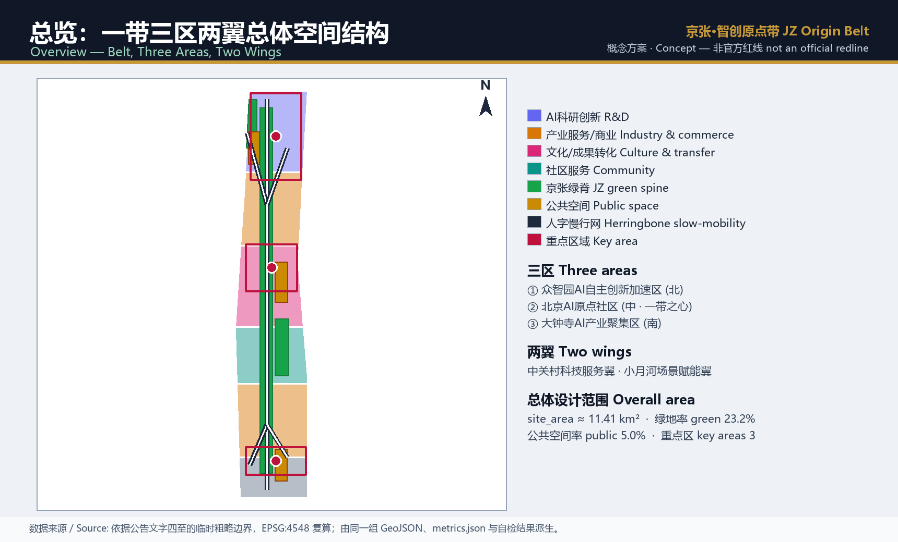
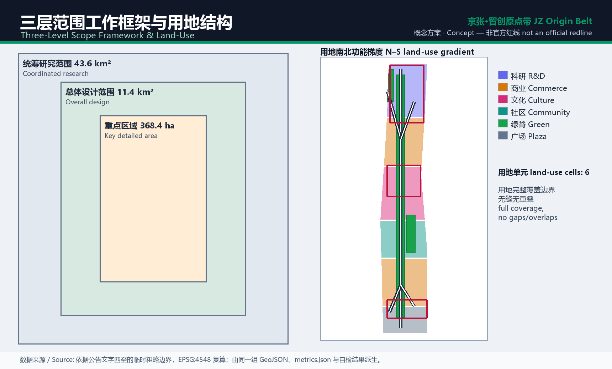
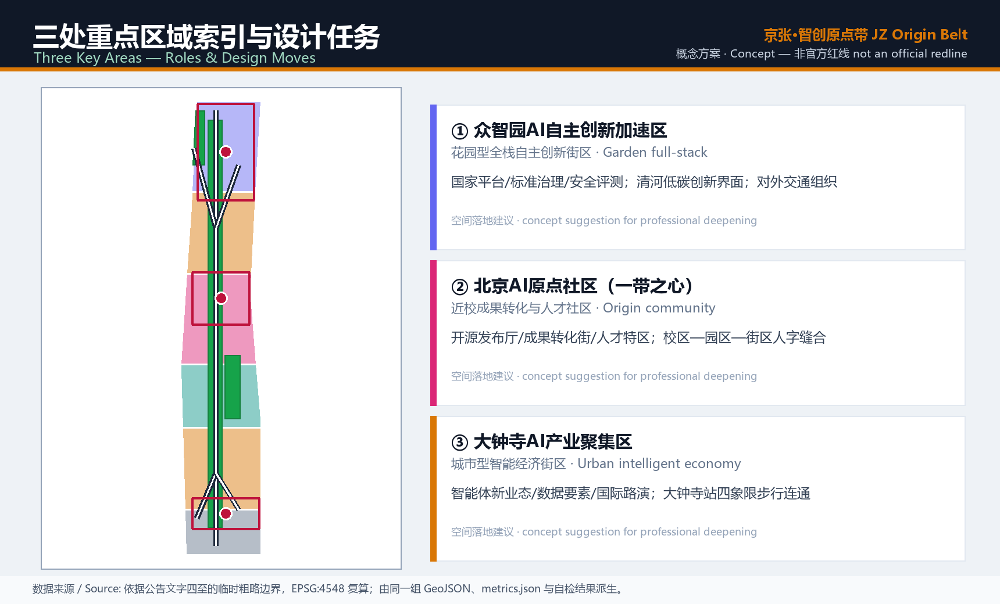
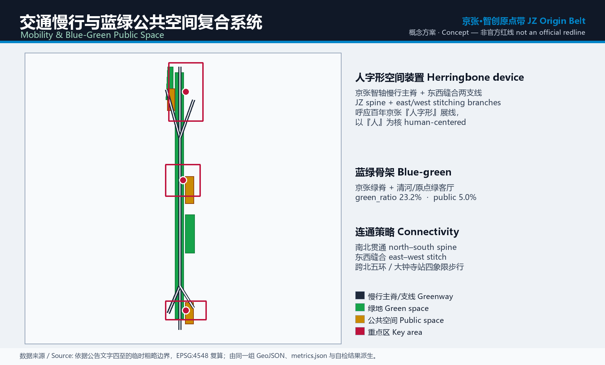
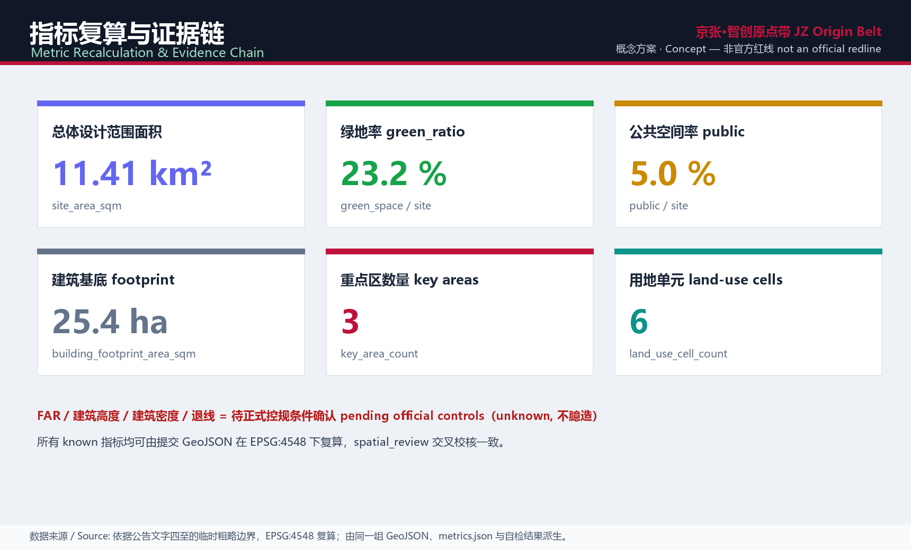

# JZ Origin Belt — Concept Urban Design for the Centennial Jing-Zhang AI Innovation Belt

## Design Basis and Source List

The primary basis is the official pre-qualification announcement issued by the Haidian branch of the Beijing Municipal Commission of Planning and Natural Resources, complemented by the agent-facing open-call taskbook for the co-creation charter, the three-areas/two-wings structure and the six required tasks [source:OFFICIAL-ANNOUNCEMENT] [source:AGENT-TASKBOOK]. Every spatial judgment first returns to the provisional boundary, key areas, land-use enums, metric ranges and source registry under `brief/site-package/`, and only then becomes readable design. Source-use limits follow the registry strictly: formal-ready material supports formal arguments, background and provisional material is for discussion only [source:SOURCE-REGISTRY].

There is no official precise boundary in the repository yet, so `geometry/site_boundary.geojson` and `geometry/key_areas.geojson` are labelled `provisional_constraint`, `official_boundary=false`, used only for generation, self-check, visualization and discussion. This organizer data gap does not block content scoring, but land use, buildings, roads, green space, public space, phasing and metrics must be recomputed once an official redline arrives [depth:existing_conditions_diagnosis]. Boundary and area readings return to the overall-scope layer and recomputation [data:geometry/site_boundary.geojson#SITE-001] [metric:site_area_sqm].

## Three-Level Scope Framework

The work follows the announcement's three nested scopes. The coordinated research area (~43.6 km²) answers the AI industry ecosystem, positioning and future city form; the overall design area (~11.4 km²) sets the urban-renewal frame, land-use structure, transport/municipal support and character; the key detailed-design area (~368.4 ha) delivers detailed design for three sub-areas [source:PROCESSED-FACT-PACK]. The three scopes form one judgment chain — research sets direction, the overall level sets structure, the key level verifies feasibility [depth:three_level_scope_framework] [depth:overall_spatial_structure].

The overall concept is named the "JZ Origin Belt". "Origin" carries two meanings: the Beijing AI Origin Community as an innovation origin, and the historic starting point of the Jing-Zhang railway as a cultural origin. Spatially it forms "one spine, three cores, two wings, herringbone stitching": the Jing-Zhang heritage park green spine, the three cores of Zhongzhiyuan / AI Origin Community / Dazhongsi, and the Zhongguancun service wing plus the Xiaoyuehe scenario wing, stitched east-west by a slow-mobility network derived from the herringbone switchback [data:geometry/site_boundary.geojson#SITE-001] [data:geometry/key_areas.geojson#PROV-KEY-002].

## Coordinated Research Area: Industry and Future City Research

The core task here is a world-class AI innovation ecosystem. The proposal organizes Haidian universities, leading firms, compute/algorithm/data factors, incubators and technology services into the "five functions": full-stack autonomous innovation, a world-class ecosystem, AI+ scenario empowerment, an intelligent vibrant city, and global AI-governance discourse — each carried by specific parts of the three areas and two wings [source:AGENT-TASKBOOK] [standard:PROJECT-AGENT-OPEN-CALL-TASKBOOK]. Naming and identity go beyond slogans: the brand centers on an "origin" mark and a "herringbone" trace, extensible to wayfinding, events and digital interfaces.

Future-city research answers how AI reshapes work, life, learning, mobility and public services. Rather than abstract vision, it places AI mobility, continuous green space, innovation-service facilities and an international living atmosphere into locatable zones, corridors and nodes that connect back to a verifiable spatial structure [standard:MOHURD-URBAN-DESIGN-MEASURES] [data:geometry/public_space.geojson#PUBLIC-001]. Any global event, developer community, open scenario or pilgrimage route is worded as a concept suggestion for professional teams to deepen, never a confirmed government arrangement.

## Overall Design Area: Urban Renewal and Regulatory-Plan-Level Urban Design

The overall design area must reach control-detailed-planning urban-design depth. The proposal offers a "one spine, three cores" renewal structure: identifying inefficient and severed spaces, forming a renewal project list, industry-function ratios and spatial-organization suggestions, with a qualitative capacity assessment [standard:MOHURD-CONTROL-DETAILED-PLANNING] [depth:land_use_layout]. `geometry/land_use.geojson` forms a north-south gradient of R&D, industry service, culture, community and commerce, fully covering the boundary without gaps or overlaps; `geometry/buildings.geojson` expresses indicative footprints in the key areas [data:geometry/land_use.geojson#LU-003] [data:geometry/buildings.geojson#BLDG-001].

Intensity and building controls follow an evidence-proportional rule. Total floor area, FAR, height, density, green ratio, setbacks and road redlines are marked pending where official controls are absent, never faked; recomputable indicators such as footprint area stay consistent with the layers [depth:development_intensity_controls] [metric:building_footprint_area_sqm]. Transport, rail, municipal and support facilities receive spatial layout and implementation paths here, with engineering conclusions left to professional deepening.

## Detailed Design of Key Areas

Detailed design of the three key areas is mandatory, each with a clear role and spatial moves [depth:three_key_area_detailed_design] [data:geometry/key_areas.geojson#PROV-KEY-001]. Zhongzhiyuan is a "garden-type full-stack innovation district" around national platforms, standards, safety evaluation, industry display and a low-carbon Qinghe interface; the AI Origin Community, as the "heart of the belt", centers on campus-adjacent transfer, open-source release, a talent zone and campus-park-street herringbone stitching; Dazhongsi is an "urban intelligent-economy district" around agent-native business, data factors, global demos and four-quadrant pedestrian connection at Dazhongsi station.

The spatial moves connect to layers and public-space evidence rather than "demonstration-zone" slogans [data:geometry/public_space.geojson#PUBLIC-002] [source:KEY-AREA-SOURCE]. The design covers functions, building scale and form, retain/renovate/demolish classification, public-space systems, transport organization and implementation projects; because the boundary is provisional, sub-area conclusions are discussable reference schemes to be recomputed after an official redline.

## AI Innovation Ecosystem, Personas, and AI+ Scenarios

The proposal builds spatial-demand personas for AI talent and firms across R&D, open collaboration, release, enterprise service, housing, learning, consumption and international exchange [source:AGENT-TASKBOOK]. AI+ scenarios span mobility, service, consumption, healthcare, education, law and daily life; each states its audience, location, data source, privacy boundary, human-review mechanism and operator, landing on public-space, mobility and green layers rather than staying conceptual [data:geometry/public_space.geojson#PUBLIC-001] [metric:public_space_ratio]. Governance follows data minimization, public sourcing, explainability and human review, avoiding designs that cannot be human-reviewed or that over-monitor.

Ten scenario cards cover: open-source release hall, safety-governance sandbox, edge-compute station, AI slow-mobility copilot, Dazhongsi global demo lounge, Qinghe low-carbon loop, campus-transfer street, data-element parlor, life-service street and the global AI week route. Five personas (open-source developer, startup team, enterprise visitor, resident, campus staff/student) and three testable validation scenarios (agent sandbox, edge-compute station, slow-mobility diagnosis) are provided [depth:blue_green_public_space].

## Land Use, Building Scale, and Retain-Renovate-Demolish Strategy

Land use follows the verifiable national land-use classification codes, forming a complete, closed, seamless zoning without invented categories [standard:MNR-LAND-USE-CLASSIFICATION-GUIDE] [data:geometry/land_use.geojson#LU-001]. The north-south gradient sequences R&D (0802), commerce (05), culture (0803), community service (0702) and plaza (1403), with the green spine as park land (1401). Buildings are classified as retain, renovate, renew, new-build or pending, with suggested levels for footprint, function and massing; where existing and ownership data is missing, only methods and a to-be-calibrated list are given.

Scale and intensity indicators stay consistent with `metrics.json` and the layers: recomputable footprint area is stated honestly, while FAR, height, density, green ratio and setbacks are marked unknown or pending without fabricated precision [depth:height_massing_character] [depth:retain_renovate_demolish]. Retain-renovate-demolish is a method and classification frame, not a parcel-level conclusion.

## Transport, Rail, Municipal Infrastructure, and Public Services

Transport responds to station integration, micro-circulation, slow-mobility breaks, external transport, parking and non-motorized parking, focusing on the North 5th Ring, the park's ring-road crossings, Wudaokou, Tsinghua East Road West and Dazhongsi station [depth:traffic_rail_slow_parking] [data:geometry/roads.geojson#ROAD-001]. The slow-mobility network uses the "JZ spine" plus two herringbone stitching branches to link the three cores and public spaces, kept inside the submitted boundary and cross-checked with green and public space. As the boundary is provisional, transport conclusions are provisional discussion, with redlines and alignments left to deepening.

Municipal and public services cover AI industry facilities, innovation-service platforms, talent life services, new infrastructure, distributed energy and edge compute, integrated with conventional utilities [depth:municipal_new_infrastructure] [data:geometry/constraints.geojson#CON-RAIL-001]. Facility types, layout and phasing logic are described; pipeline, energy, drainage, flood and fire data, where missing, are listed as prerequisites for formal deepening rather than approved capacities.

## Blue-Green Network, Public Space, and Urban Character

The blue-green system uses the Jing-Zhang heritage park "green spine" as its skeleton, coordinating Qinghe, Xiaoyuehe and the travel demand of nearby universities, firms and communities into north-south and east-west paths, identifying slow-mobility breaks, ring-road crossings and park end nodes [depth:blue_green_public_space] [data:geometry/green_space.geojson#GREEN-001]. Green and public-space ratios are explained for design meaning in prose, with full values in the metrics file; the green spine and Origin Plaza form the everyday civic living room [metric:green_ratio] [data:geometry/public_space.geojson#PUBLIC-001].

Urban character fuses Jing-Zhang railway heritage, Zhongguancun innovation culture and new AI culture, using resources such as Tsinghuayuan station to guide tone, interfaces and public art [standard:MOHURD-URBAN-DESIGN-MEASURES]. Wayfinding, cultural symbols, international narrative, three AI pilgrimage landmarks (Origin Monument, Herringbone Hub, Dazhongsi Smart Core) and an honor-display system all require cleared sources; character controls separate official control, design suggestion and pending conditions, avoiding pseudo-precise control lines without heritage or regulatory basis.

## Renewal Projects, Implementation Policy, and Phasing

Implementation forms a reviewable renewal project list stating location, type, function, dependencies, phase and evaluation metrics; policy suggestions cover renewal coordination, space supply, operating mechanisms, industry service, public participation and data governance [depth:renewal_project_list] [data:geometry/phasing.geojson#PHASE-001]. Where ownership, funding and approval paths are missing, projects are written as implementation risks rather than delivery promises.

| ID | Project | Type | Key dependency | Evidence |
| --- | --- | --- | --- | --- |
| JZ-01 | Park slow-mobility break stitching | Public space / transport | Redlines, under-bridge space | [data:geometry/roads.geojson#ROAD-002] |
| JZ-02 | Zhongzhiyuan Qinghe interface | Blue-green / display | Blue line, ecology, flood | [data:geometry/green_space.geojson#GREEN-002] |
| JZ-03 | Origin campus-transfer street | Renewal / service | Campus edge, ownership | [data:geometry/buildings.geojson#BLDG-002] |
| JZ-04 | Dazhongsi four-quadrant walk | Rail integration / slow | Station, junction, utilities | [data:geometry/public_space.geojson#PUBLIC-003] |
| JZ-05 | AI service & edge-compute nodes | New infra / service | Energy, compute, operator | [data:geometry/phasing.geojson#PHASE-002] |
| JZ-06 | Global AI week public route | Operation / brand | Permits, event safety | [depth:phasing_implementation] |

Phasing distinguishes the "competition design cycle" from the "implementation path": near-term light facilities, events and service platforms pilot in the Origin Community; mid-term advances Zhongzhiyuan renewal; long-term covers Dazhongsi and the south gateway. Annual events, developer community, scenario open days and international communication all state audience, cadence, responsibility and conversion, never presented as confirmed arrangements.

## Metrics, Area Recalculation, and Compliance Matrix

Metrics split into three classes: geometry-recomputable spatial metrics (area, green ratio, public-space ratio, footprint, land-use cell count), control metrics needing official regulation (FAR, height, density, setback, redline), and performance metrics needing operational calibration (AI innovation index, talent density, scenario usage) [depth:metrics_recalculation] [metric:site_area_sqm]. The first class is recomputed and matches the spatial review, the second is marked pending, the third is long-term calibration, avoiding writing vision as approved controls [metric:public_space_ratio] [metric:green_ratio].

The compliance matrix is the master file for task responsiveness: announcement 1.3, 1.4, 1.5 and agent.1–agent.6 each map to sections, layers, metrics, drawings, HTML, sources, assumptions and self-check items [standard:PROJECT-OFFICIAL-ANNOUNCEMENT]. Missing any mandatory task blocks formal professional scoring; this package cross-checks coverage through the spatial, visual and professional self-checks.

## Risk, Copyright, and Compliance

**Bilingual required.** The primary file is Chinese with a complete English counterpart `proposal.md`; A3/A0, HTML and text-bearing figures carry matching language versions, with figures labelled bilingually. Risk and missing-data lists are cross-checked by the risk depth item, constraint layers and the site package [depth:risk_missing_data] [data:geometry/constraints.geojson#CON-ROAD-001]. Gaps in official boundary, key-area redlines, regulation, roads, parcels, buildings, utilities and heritage enter `assumptions.json` and the risk section, with conclusions downgraded to pending; full professional checks live in the standard matrix [source:SITE-PACKAGE].

This proposal claims no official approval, approved regulation, final ownership, final construction scale or guaranteed implementation. All images, drawings, data and code are AI-generated or use cleared public sources documented in `sources.json` and `report/copyright_statement.md`; the HTML loads no remote scripts, tiles, fonts, iframes, forms or external APIs. The AI agent is responsible for facts, sources, copyright, spatial data, metrics and expression, and maintainers and reviewers may request revision or rejection based on the self-check, spatial review and compliance matrix.

## References

- brief/public-brief.md and brief/site-package/design_brief.json
- brief/site-package/allowed_design_space.json, enums/, ranges/planning_limits.json
- brief/site-package/standards/standards.json and its local reference snapshots
- data/source_registry.json and the data/processed/ navigation files
- Full machine indexes: sources.json, metrics.json, compliance_matrix.json, standard_matrix.json, design_depth_matrix.json
- Bibliographic entry follows the site-package registration; full provenance and licensing are in the structured source list [source:SITE-PACKAGE]
