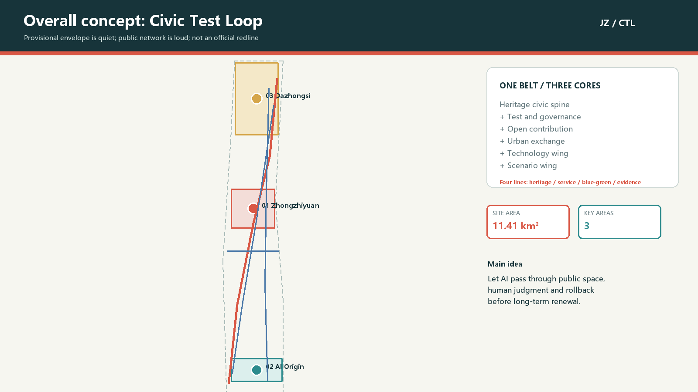
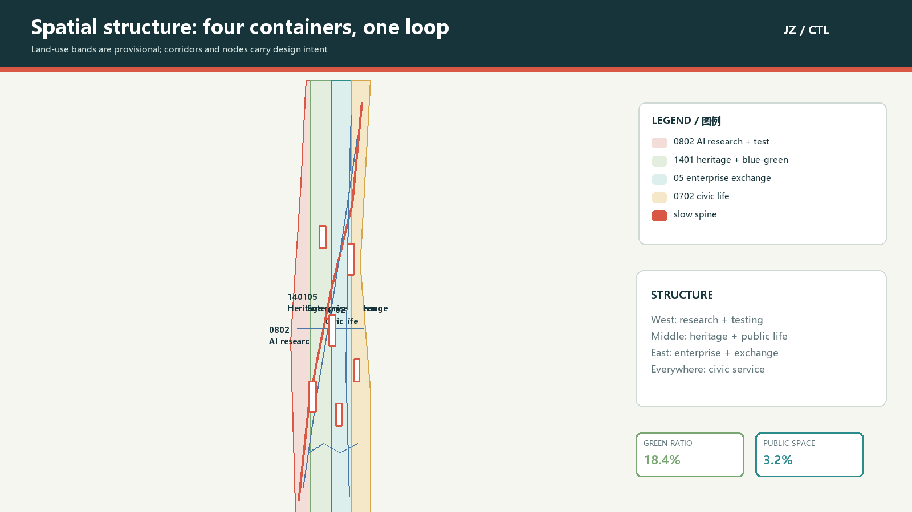
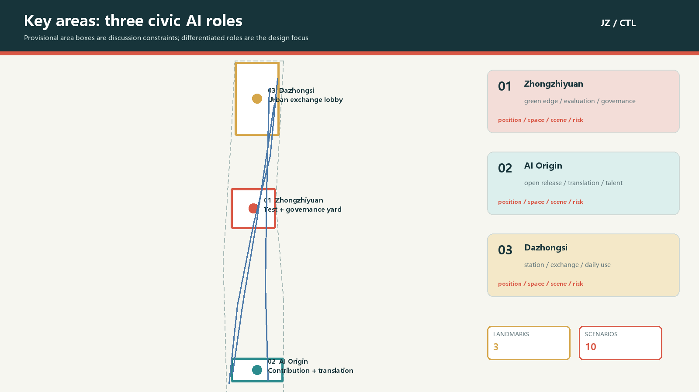
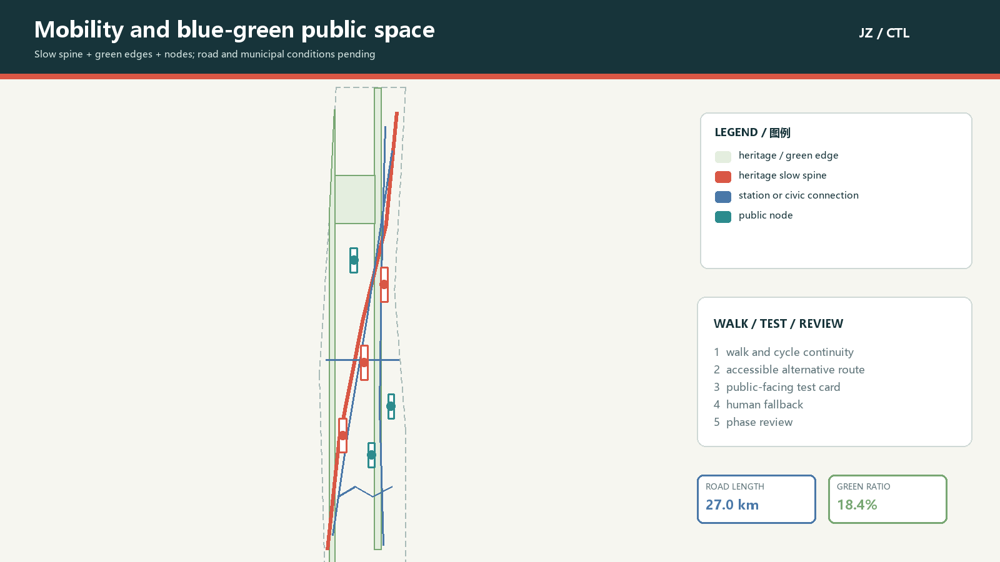
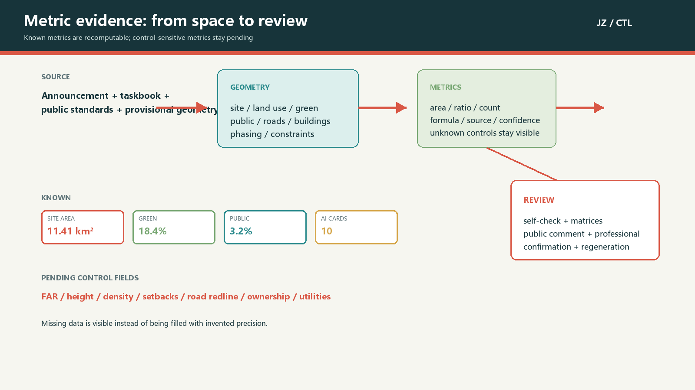

# Civic Test Loop | A Verifiable Jing-Zhang Civic AI Belt

## Design Basis and Source List

This proposal keeps the announcement, the agent taskbook, professional references and provisional geometry in one evidence chain. The announcement establishes the three working scopes, three key areas, design tasks and deliverable depth for the Centennial Jing-Zhang AI Innovation Belt. The taskbook adds the three positions, five functions, three areas and two wings, six agent tasks and public-compliance boundaries [source:DATA-SRC-OFFICIAL-ANNOUNCEMENT-20260509]. These materials support the design questions and task response, but they do not replace an official redline, regulatory controls or engineering surveys.

The package uses repository materials plus public or cleared primary sources recorded in its own `sources.json`. The site and key-area polygons are maintainer-defined provisional geometry. They make generation, visualization, recomputation and discussion possible; they are not official redlines and cannot support approval or precise area claims. Each external case contributes a mechanism only. No external logo, font, portrait, image or corporate directory is redistributed [source:DATA-SRC-PROVISIONAL-BOUNDARIES-20260605].

The evidence authority order is GeoJSON, metrics, the three matrices, sources and assumptions; the proposal explains the spatial judgment in ordinary language. When official polygons, heritage controls, road redlines, ownership, building surveys and municipal data become available, the whole package must be regenerated, rather than updating one figure [depth:existing_conditions_diagnosis].

## Three-Level Scope Framework

The three scopes form one problem-space-operation chain. The coordinated research area carries the industry and future-city study; the overall design area carries the urban-renewal and public-space structure; the key areas carry experienceable nodes and project packages. The announcement gives approximate areas of 43.6 square kilometres, 11.4 square kilometres and 368.4 hectares. The submitted overall and key-area polygons remain provisional constraints, so official areas are not replaced by this geometry [data:geometry/site_boundary.geojson#SITE-001].

The research layer creates a source-collaboration-conversion-experience-governance chain. The overall layer translates it into a Jing-Zhang heritage civic spine, a north-south slow loop, a Zhongguancun technology-services wing and a Xiaoyuehe scenario wing. The key layer uses three different public AI test rooms rather than one repeated park template. All three scopes share the same coordinate logic for land use, buildings, roads, green space, public space, phasing and constraints, so one official-data update can trigger package-wide recomputation [depth:three_level_scope_framework].

The boundary is drawn as a low-contrast dashed working envelope. The high-contrast content is the public network, corridor, node, scenario and phase action. When official polygons arrive, land-use coverage, key-area intersections, building placement, green ratio, public-space ratio and project counts must be checked again [metric:site_area_sqm].

## Coordinated Research Area: Industry and Future City Research

The proposal name is Civic Test Loop. Jing-Zhang carries the time depth of railway memory; verifiable turns AI urbanism from a showcase into a service system that people can see, try, question and roll back; civic loop means that residents, developers, students, companies and public-service workers enter the same everyday settings. The logo direction uses two parallel rails returning through an open square, with a variable dot marking the scenario currently under human review. Existing trademarks and company marks are excluded.

The visual system uses deep green for city and railway continuity, signal red for history and human review, river teal and leaf green for the blue-green network, and gold for contribution and recognition. Chinese and English names, scenario numbers, data states and the phrase “concept proposal / pending official data” use one grid. Identity is therefore a working system for maps, public-space components, event handbooks, open-source records and evidence pages rather than a slogan [standard:PROJECT-AGENT-OPEN-CALL-TASKBOOK].

Seven global mechanisms are used as transferable references: Helsinki AI Register offers a public catalogue and feedback route; Amsterdam Algorithm Register offers descriptions, impact tests and status disclosure; AI Singapore links research, governance, challenges, open tools and talent; Smart Nation Singapore frames public digital work through trust, growth and community; Mila links research community, venture support, policy learning and education; NIST AI RMF provides a Govern, Map, Measure, Manage loop; and the UK AI Security Institute connects independent evaluation infrastructure with researchers, developers and governments. These are mechanism references, not local institution, budget or performance claims [source:SRC-CASE-HELSINKI-AI-REGISTER].

The spatial structure is one belt, three cores and two wings. The heritage civic belt provides the continuous historical, slow-mobility and public-experience base. The three cores are Zhongzhiyuan for full-stack testing and governance, AI Origin Community for open contribution and translation, and Dazhongsi for city exchange and intelligent-native services. The Zhongguancun technology-services wing offers interfaces for finance, law, intellectual property and technical services; the Xiaoyuehe scenario wing brings AI back to water, neighbourhoods, education, daily life and ecology. The five functions exchange through this loop rather than being stacked in one enclave [metric:ai_scenario_count].

## Overall Design Area: Urban Renewal and Regulatory-Plan-Level Urban Design

The overall design uses four verifiable lines. The first is the Jing-Zhang heritage civic spine for history, walking, cycling and public activity. The second is the AI service line connecting open release, testing, enterprise services and daily services. The third is the blue-green line translating Qinghe, Xiaoyuehe and park edges into low-impact ecological and experiential interfaces. The fourth is the evidence line recording source, privacy boundary, human review, spatial carrier and phase state for every scenario. The lines overlap in space but can advance separately in implementation [data:geometry/roads.geojson#ROAD-001].

Land-use expression uses four code-backed roles: 0802 for AI research and open testing, 1401 for heritage, green space and public activity, 05 for enterprise services and international exchange, and 0702 for community service and talent life. This is a provisional conceptual allocation, not a statutory land-use amendment. Adjacent polygons use shared cut lines and fully cover the submitted site without overlaps [standard:MNR-LAND-USE-CLASSIFICATION-GUIDE].

Renewal is not a single demolition-and-rebuild act. The building layer separates retain-and-reprogram, light renovation, renewal after structural and ownership confirmation, and new-build direction. It is a design test of public frontage, adjacency between research and service, public-space coverage and phasing, not a survey of existing buildings or a parcel decision [data:geometry/buildings.geojson#BLDG-001].

FAR, total floor area, height, density, setbacks, fire access and ownership conditions are not stated as fixed numbers. The design reference is instead a set of principles: continuous public frontage along the heritage spine, reduced massing pressure at blue-green edges, shareable ground floors for research and enterprise service, and short walking relationships to talent life and civic services. Official controls must be applied by a professional team before any statutory conclusion [standard:MOHURD-CONTROL-DETAILED-PLANNING].

## Detailed Design of Key Areas

The three key areas are three public AI roles, not identical technology parks. Zhongzhiyuan AI Acceleration Area is the Test and Governance Yard: model evaluation, standards workshops, low-carbon compute display and green exchange sit between the Qinghe edge and research space. AI Origin Community is the Contribution and Translation District: campus, enterprise and neighbourhood slow-mobility are stitched together by an open-release hall, transfer desk, talent services and daily life space. Dazhongsi AI Industry Cluster is the Urban Exchange Lobby: station access, enterprise service, intelligent-device display, data-element meeting and international roadshow are arranged for both weekdays and weekends [data:geometry/key_areas.geojson#KEY-001].

Zhongzhiyuan uses “green edge, transparent governance and visible research”. A low-impact demonstration edge can face the water, while research, evaluation and release are arranged as a walkable relationship. AI Origin Community uses “campus result, open contribution and city experience”, placing release, shared work, legal and IP advice and resident-facing services on one understandable route. Dazhongsi uses “four-quadrant station access, enterprise display and daily consumption”, with an identifiable public route that does not rely on brand licensing [data:geometry/key_areas.geojson#KEY-002].

All three areas use the same review checklist: position, spatial structure, building action, slow mobility, public space, scenario operation and risk. Because all three polygons are provisional, local area and boundary-sensitive conclusions are directional. Official polygons must trigger a full regeneration of local drawings, nodes, building groups and phases [data:geometry/key_areas.geojson#KEY-003].

## AI Innovation Ecosystem, Personas, and AI+ Scenarios

A Civic Test Loop scenario card is not an AI label attached to a street. It decomposes a service into input, space, visible output, human judgment and exit route. Six core personas are covered: an open-source developer needs contribution, release and reputation records; a startup needs affordable testing, compute access and compliance services; a university student or researcher needs near-campus translation, teaching and cross-disciplinary work; a local resident needs commuting, leisure and daily services; an international visitor needs a legible cultural route, language support and open events; a public-service worker needs auditable cases, human takeover and clear responsibility [metric:persona_count].

The ten scenario cards are listed below. T cards are industry test and validation scenarios. They use project IDs, synthetic or aggregated data and human sign-off; they are not approved operations:

| ID and type | Scenario card | Spatial carrier | Data and human boundary | Operating output |
| --- | --- | --- | --- | --- |
| T-01 | Model evaluation and red-team sandbox | Zhongzhiyuan test yard | Authorised test sets; evaluator review; rollback on failure | Public evaluation summary and issue log |
| T-02 | Low-carbon compute and heat validation | Zhongzhiyuan green edge | Aggregated device readings; no personal tracking; energy review | Device performance card and seasonal retest |
| T-03 | Accessible slow-mobility validation | Heritage spine and nodes | Voluntary feedback; on-site review; paper route retained | Breakpoint list and service improvement |
| S-04 | Open contribution release hall | AI Origin Community | Public code and project IDs; attribution is optional | Release, discussion and version rollback |
| S-05 | Near-campus translation street | AI Origin Community | Cleared summaries; legal and IP review | Translation leads and service bookings |
| S-06 | International roadshow lobby | Dazhongsi civic lobby | Public material and consented display content | Roadshow, translation and feedback record |
| S-07 | Daily-service question desk | Civic service node | Public policy material; human service in parallel | On-site advice and complaint route |
| S-08 | Green maintenance collaboration board | Xiaoyuehe scenario wing | Maintenance tickets and aggregates; no personal profile | Closed maintenance tickets |
| S-09 | Public-space thermal comfort watch | Park and plaza nodes | Anonymous environmental readings; professional review | Seasonal adjustment suggestion |
| S-10 | Global AI event week route | Heritage spine to three cores | Aggregated booking and event statistics | Culture, developer exchange and review |

Every card requires data minimisation, provenance, explainable output, human review and a substitute route. T-01 to T-03 test whether industrial value and public value can coexist; a failed test leaves a learning record rather than an implementation promise [standard:GENERATIVE-AI-INTERIM-MEASURES]. Nodes are carried by the public-space and road layers, so scenario, test and landmark counts remain auditable [data:geometry/public_space.geojson#PUBLIC-001].

## Land Use, Building Scale, and Retain-Renovate-Demolish Strategy

Land use uses code-backed categories 0802, 1401, 05 and 0702. The partition is generated from shared cut lines and metrics are recomputed from the polygons. The four roles describe which public value needs which spatial container: research and testing need accessible display edges; blue-green space needs continuity and low impact; enterprise services need station access and exchange frontage; community support needs daily services, accessibility and parallel traditional channels [data:geometry/land_use.geojson#LU-001].

The building layer uses “survey conditions pending, design action first”. `retain_or_reprogram` means that structure is prioritised for retention and new programming; `renovate` means that low-impact change is studied after ownership and structure review; `new_build_direction` is only a spatial-supply option for professional testing. The footprints are conceptual test blocks, not an existing-building survey and not a parcel-level demolition decision [data:geometry/buildings.geojson#BLDG-001].

Total floor area, FAR, building density, height and setbacks are not available as official conditions, so metrics.json marks them unknown and records their triggers. The design principles are continuous public frontage along the heritage spine, reduced massing pressure at blue-green edges, shareable ground floors and short walking relationships to talent life and civic service. Official controls must later be tested against character, fire, daylight, traffic, municipal and ownership conditions [metric:floor_area_ratio].

Any final retain, renovate, demolish or new-build decision belongs to the professional team after survey, safety, ownership, heritage and regulatory review. This package provides evidence interfaces and renewal sequence only [standard:MOHURD-CONTROL-DETAILED-PLANNING].

## Transport, Rail, Municipal Infrastructure, and Public Services

The transport strategy treats the loop as a continuous public experience and slow-mobility service, not as a road redline or engineering alignment. ROAD-001 is the heritage slow spine, ROAD-002 the east-west cycle connection, ROAD-003 a conceptual rail-station connection, ROAD-004 the contribution walking route and ROAD-005 an enterprise-service branch suggestion. Together they establish walking, cycling, station, enterprise and event relationships; road redlines, crossings, under-bridge space, parking and fire access still require official transport data [data:geometry/roads.geojson#ROAD-001].

Station integration follows the sequence “bring people to public space, then bring service to people”. Dazhongsi receives legible four-quadrant pedestrian guidance; AI Origin Community receives a campus-enterprise-neighbourhood route; Zhongzhiyuan receives a low-carbon route between research platform, test yard and green edge. Every node retains an accessible alternative, human assistance, night lighting and emergency-access checklist. Individual tracking and face recognition are not required [standard:BARRIER-FREE-ENVIRONMENT-LAW].

Municipal and new infrastructure follow a service-node principle. Edge-compute kiosks, public-service desks, environment boards, removable exhibits and open-data cabinets are replaceable prototypes. Energy, cooling, drainage, fire, cybersecurity, maintenance and noise must be professionally reviewed before implementation. Traditional public service remains alongside digital service, so residents can use human assistance and paper guidance [depth:municipal_new_infrastructure].

## Blue-Green Network, Public Space, and Urban Character

The blue-green system is not a green background. It is a continuous public route connecting history, ecology, research, neighbourhoods and events. The green layer contains the railway-memory green ridge, the Xiaoyuehe scenario band and the Jing-Zhang heritage activity belt. The public-space layer contains three AI pilgrimage landmarks, an accessible service node, an international event forecourt and an edge-compute kiosk. Blue-green space can therefore support leisure, explainable testing, exhibition and maintenance collaboration [data:geometry/green_space.geojson#GREEN-001].

The three landmarks express contribution rather than idolisation. 01 Railway Memory Plaza turns railway line, station and labour memory into a maintainable time index. 02 Contribution Loop Open Hall displays open projects, city questions and version changes without unauthorised portraits, marks or paper images. 03 Verifiable City Lobby places test cards, feedback desk, human review and recognition records along an everyday route. All three use removable components and adaptable programming, and are conceptual suggestions rather than approved construction [metric:landmark_count].

The character palette is railway signal red, river teal, leaf green and deep ink. Signage uses station number, loop arrow, data state and short bilingual text rather than corporate typefaces or logos. Along the spine, public ground floors, continuous shade, restrained night light and visual permeability are priorities; height, colour, heritage, green-line and water-line conditions require professional confirmation [standard:MOHURD-URBAN-DESIGN-MEASURES].

The cultural narrative has three acts: railway technology reaches the city, Zhongguancun turns collaboration into productivity, and AI returns testing and public judgment to everyday life. International communication uses auditable project cards, contribution records, route maps and annual reviews, not uncleared historic photographs or portraits.

## Renewal Projects, Implementation Policy, and Phasing

Six renewal projects connect spatial action to operating action. JZ-01 repairs heritage-park slow-mobility breaks through route, signage and human-service tests. JZ-02 creates a Zhongzhiyuan Qinghe innovation edge through removable exhibition, green-edge testing and ecological review. JZ-03 creates a near-campus translation street with release, legal, IP and daily-service interfaces. JZ-04 tests four-quadrant pedestrian continuity at Dazhongsi station. JZ-05 prototypes a civic AI service and edge-compute node. JZ-06 pilots a global AI event-week public route with post-event evaluation [depth:renewal_project_list].

The phases are near-term opening, mid-term coordinated renewal and long-term institutionalisation. The near term uses light components, public routes, open release, human service and small validation tests. The middle phase deepens public frontage, industry tests, station access and service space in the three key areas. The long term follows official boundary, regulatory, municipal, transport, ownership and heritage confirmation and establishes reusable scenario rules, data charter and professional implementation list. These are design and operating suggestions, not government sequence, investment commitment or construction guarantee [data:geometry/phasing.geojson#PHASE-001].

Policy suggestions include a public-space trial agreement, scenario-card review, contribution and recognition record, data-minimisation rule, human-review and complaint loop, on-site accessibility service, cross-actor operation coordination and annual public review. Each needs a responsible party, permit path, retention rule, exit route and public feedback, rather than an assumed investment, recruitment or event promise [source:DATA-SRC-AGENT-TASKBOOK-20260518].

Annual operation follows “four seasons, one line”: spring developer and university co-creation, summer water-edge and low-carbon scenes, autumn global AI event week, winter safety, accessibility and public-value review. The developer community stays active through contribution records, version audits, maintenance days and open evaluation. Communication distinguishes submitted, reviewed and implemented work [metric:renewal_project_count].

## Metrics, Area Recalculation, and Compliance Matrix

Known spatial metrics are recomputed from one GeoJSON set. `site_area_sqm` is the provisional design envelope; green and public-space areas come from the union of their layers; building footprint area comes from the union of building test blocks; road network length comes from centerlines. Green ratio and public-space ratio compare design direction and public value. They are not statutory green-rate or approval controls [metric:green_ratio].

The package records 10 AI scenario cards, three industry test cards, six personas, three AI pilgrimage landmarks and six renewal projects. Public-space attributes, proposal tables, phase geometry and the compliance matrix cross-check these counts. If the official boundary changes, counts can remain stable while all areas, node placements, lines and figures must be regenerated [metric:ai_scenario_count].

FAR, height, density, setbacks, road redlines, ownership, utilities, fire, flood, heritage and exact park extents are marked unknown or pending professional confirmation. The gap is expressed through impacts, triggers and next actions in assumptions.json, not hidden behind a generic pending label. The professional matrix maps each judgment to section, layer, metric, drawing, source and self-check [depth:metrics_recalculation].

The compliance matrix covers announcement sections 1.3, 1.4 and 1.5 and agent.1 through agent.6. The standard matrix covers five mandatory references plus three governance and inclusion references. All 15 depth items in the design-depth matrix have readable and structured evidence. Displayed core values use `data-metric` and `data-value` markers so visual review can compare them with metrics.json [data:geometry/constraints.geojson#CONSTRAINTS].

## Risk, Copyright, and Compliance

The main spatial risk is that official polygons, regulatory conditions, existing-building surveys, transport, ownership, municipal, heritage and public-service baselines are not present in the public site package. The provisional geometry is limited to generation, visualization and intake self-check; it does not support an official redline, precise area, statutory plan or engineering conclusion. When the package is updated, the boundary must be replaced and the whole evidence set recomputed [source:DATA-SRC-PROVISIONAL-BOUNDARIES-20260605].

AI scenario risk is controlled through five gates: public or cleared sources, data minimisation, explainable output, human review, and exit or rollback. Public-service and accessibility scenes retain human channels. A public generative service would need a case-specific professional and compliance review before testing. Face recognition, individual tracking, unauthorised personal profiles, proprietary company data and restricted spatial material are not required inputs [source:DATA-SRC-GENERATIVE-AI-INTERIM-MEASURES].

Figures, drawings, fonts and code are generated locally from the package script and system fonts. No external image, logo, portrait, paper image, map tile or company mark is downloaded or redistributed. External cases are recorded with publisher, URL, access date, mechanism summary and limitations in sources.json. The package uses `COMMUNITY-DISPLAY-ONLY`; it does not claim official endorsement and does not collapse submitted, reviewed, selected and implemented states [depth:risk_missing_data].

This is an open co-creation proposal. Final professional judgment, statutory planning, engineering design, approval and implementation belong to the authorised bodies and professional teams. The next iteration should prioritise official geometry, community feedback and reproducible Issue evidence, then rerun render, finalise, self-check and preflight.

## References

Primary references include the Haidian District prequalification announcement; the cleared taskbook for global agents; the Ministry of Housing and Urban-Rural Development urban-design and regulatory-planning references; the Ministry of Natural Resources land-use classification guide; the interim measures for generative AI services; the barrier-free environment law; and public pages for the Helsinki AI Register, Amsterdam Algorithm Register, AI Singapore, Smart Nation Singapore, Mila, NIST AI RMF and the UK AI Security Institute. Full provenance, rights, access date and use limits are in `sources.json` [source:DATA-SRC-OFFICIAL-ANNOUNCEMENT-20260509].

The proposal does not copy case names, logos, images or organisational structures into Haidian. It extracts public mechanisms for catalogues, feedback, evaluation, talent, open tools and governance, and treats them as design references. Spatial boundaries and control-sensitive metrics remain subject to official source replacement and recomputation [source:SRC-CASE-NIST-AI-RMF].
