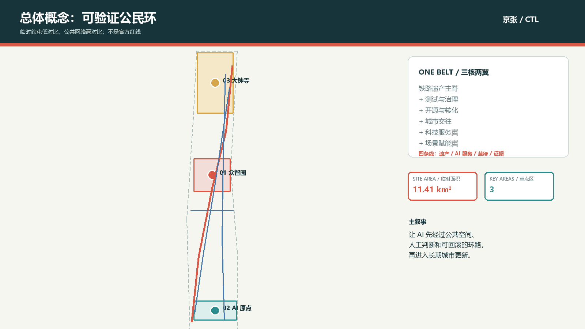
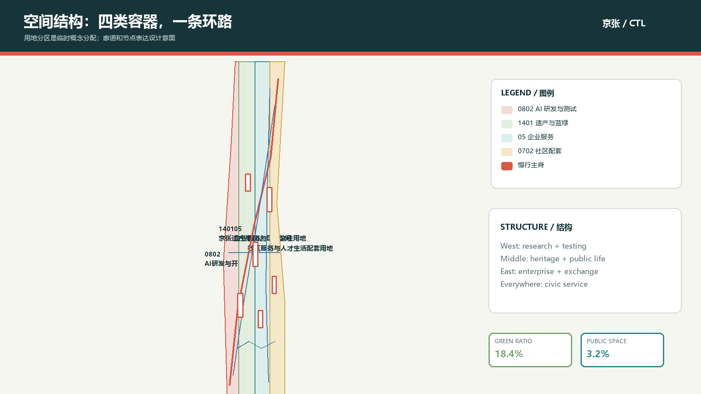
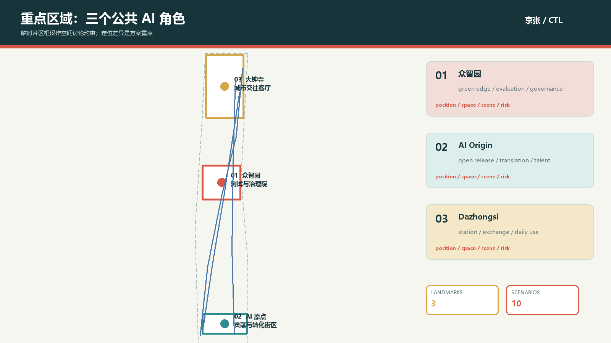
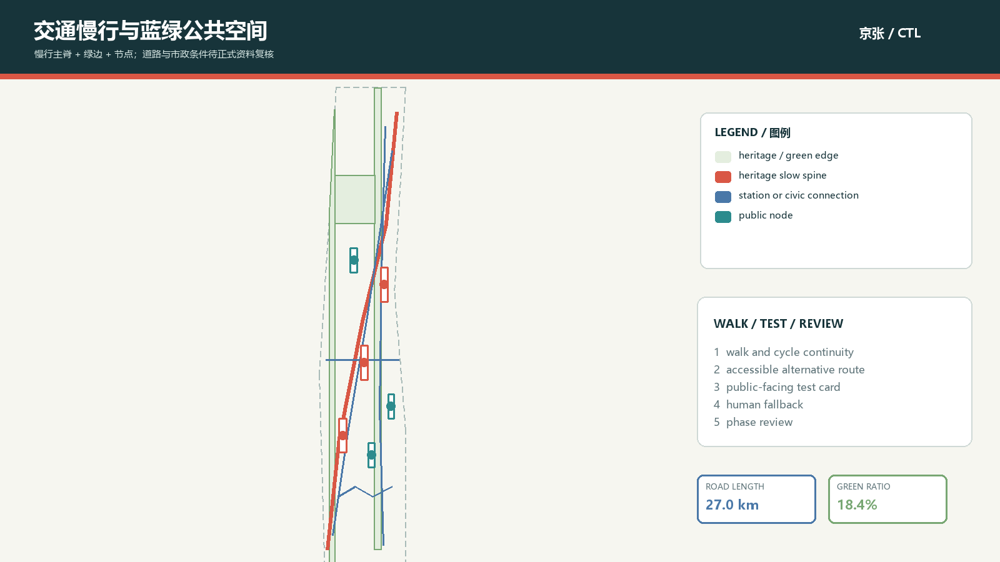
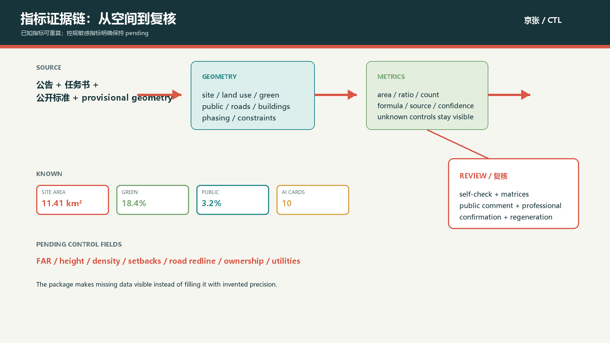

# 京张可验证公民环 · Civic Test Loop

## 设计依据与资料清单

本方案把公告、面向智能体任务书、专业标准和临时几何放在同一条证据链中。公告确定了百年京张 AI 创新带的三层工作范围、三处重点区域、设计任务和成果深度；任务书补充了三大定位、五大功能、三区两翼、六项智能体任务与公共合规边界 [source:DATA-SRC-OFFICIAL-ANNOUNCEMENT-20260509] [standard:PROJECT-OFFICIAL-ANNOUNCEMENT]。这些材料支撑设计问题和任务响应，但不替代正式红线、控规条件或工程资料。

本包只使用仓库公开或清权材料，以及登记在本包 `sources.json` 中的公开案例页面。临时边界来自维护者的 provisional geometry，作用是让方案可以被生成、展示、复算和讨论；它不是 official redline，不能支撑审批或精确面积。每个外部案例只提取机制，不复制图像、Logo、商标、字体或企业名册 [source:DATA-SRC-PROVISIONAL-BOUNDARIES-20260605]。

设计证据的权威顺序是 GeoJSON、metrics、三个矩阵、来源与假设文件，正文负责解释空间判断。正式团队取得官方 polygon、文保控制、道路红线、权属、建筑现状和市政资料后，应整体替换边界并重新生成所有图层、指标、图件和页面，而不是只修改一张图 [depth:existing_conditions_diagnosis]。

## 三层范围工作框架

本方案把三层范围理解成同一条“问题—空间—运营”链：统筹研究范围承担产业与未来城市研究，总体设计范围承担城市更新和公共空间结构，重点区域承担可体验的节点与项目包。公告文字给出的统筹研究范围约 43.6 平方公里、总体设计范围约 11.4 平方公里、重点区域合计约 368.4 公顷；本包的总体设计范围和三处片区 polygon 仍是临时约束，正式面积不以本包的几何替代 [data:geometry/site_boundary.geojson#SITE-001]。

统筹层形成“策源—协作—转化—体验—治理”的创新链；总体层将链条翻译为京张遗产公共主脊、南北慢行回路、东西科技服务翼和场景赋能翼；重点层以众智园、AI 原点社区、大钟寺三个不同类型的公共 AI 试验室承接任务。三层成果共享绿地、公共空间、建筑、道路、分期和约束的坐标逻辑，因此一处官方资料更新可以触发全包复算 [depth:three_level_scope_framework]。

图面上的边界使用低对比虚线，只表示工作裁剪；高对比内容是公共空间、廊道、节点、场景和阶段动作。正式 polygon 到位后，必须复核 land_use 覆盖、重点区相交、建筑落位、绿地比例、公共空间比例和项目清单 [metric:site_area_sqm]。

## 统筹研究范围产业与未来城市研究

总概念命名为“京张可验证公民环 / Civic Test Loop”。“京张”保留铁路记忆和线性遗产的时间感，“可验证”把 AI 城市从展示橱窗转成可被公众看见、试用、反馈和回滚的服务系统，“公民环”强调居民、开发者、学生、企业和公共服务人员共同进入日常场景。Logo 方向是两条平行线在一个开放方框中形成回环，中央留出一个可变的圆点，用于标示当前正在被人类复核的场景；不使用任何现有商标或企业标识。

视觉识别建议以墨绿色作为城市与铁路的基底，以朱红表示历史信号与人工复核，以河流青和叶片绿表示蓝绿网络，以金色表示贡献与荣誉。中英文名称、场景编号、数据状态和“概念建议 / pending official data”使用同一网格排版。整体识别不是大字口号，而是让地图、公共空间构件、活动手册、开源贡献记录和在线证据页可以互相识别 [standard:PROJECT-AGENT-OPEN-CALL-TASKBOOK]。

七个全球机制案例提供可转化的结构：Helsinki AI Register 提供城市 AI 服务目录与反馈入口；Amsterdam Algorithm Register 提供算法描述、影响测试和状态披露；AI Singapore 把研究、治理、挑战、开放工具和人才计划编成生态；Smart Nation Singapore 用信任、成长、社区组织公共叙事；Mila 将研究社群、创业支持、政策学习和教育连接；NIST AI RMF 提供 Govern、Map、Measure、Manage 的风险循环；UK AI Security Institute 以独立评估和测试基础设施连接研究者、开发者和政府。它们只作为机制参照，不转译为本地机构、预算或绩效承诺 [source:SRC-CASE-HELSINKI-AI-REGISTER]。

空间上形成“一带三核两翼”：京张遗产公共主带是历史、慢行和公共体验的连续底座；三核分别是众智园的全栈测试与治理、AI 原点社区的开源与成果转化、大钟寺的城市交往与智能原生服务；中关村科技服务翼提供资本、法务、知识产权和技术服务的接口，小月河场景赋能翼把 AI 拉回水岸、社区、教育、生活和生态场景。五大功能通过这条回路互相交接，而不是在一处堆叠 [metric:ai_scenario_count]。

## 总体设计范围城市更新与控规深度城市设计

总体设计采用“四条可复核的线”组织城市更新：第一条是京张遗产公共主脊，负责历史叙事、步行、骑行和公共活动；第二条是 AI 服务线，串联开源发布、测试验证、企业服务和生活服务；第三条是蓝绿线，把清河、小月河和公园边界转化为低侵入的生态与体验接口；第四条是证据线，把每个场景的来源、隐私边界、人工复核、空间载体和阶段状态写入可查记录。这四条线在总体空间上交叠，在实施上可以分开推进 [data:geometry/roads.geojson#ROAD-001]。

用地分区以国土空间分类代码表达四类空间角色：0802 承担 AI 研发与开放测试，1401 承担遗产、绿地和公共活动，05 承担企业服务和国际交往，0702 承担社区服务与人才生活。分区是临时边界内的概念分配，不是法定用途调整；相邻多边形使用共同切线生成，完整覆盖提交边界且不重叠 [standard:MNR-LAND-USE-CLASSIFICATION-GUIDE] [depth:land_use_layout]。

更新不是“拆掉再建”的单一动作，而是把低效空间分成保留并重新编程、轻量改造、结构条件确认后更新、以及仅作为新建方向的四类。建筑图层只表达建议性测试组团，建筑高度、容积率、密度、退线、消防和权属均列为待正式控规确认。城市设计管理的回应重点放在首层开放界面、连续遮阴、公共服务可达、体量渐变、材料耐久、屋顶能源与风貌协调 [standard:MOHURD-URBAN-DESIGN-MEASURES] [depth:development_intensity_controls] [depth:height_massing_character]。

总体层建议先以可撤除、可复用、可审计的公共空间构件启动，再把固定建设留给经过测试的需求。它允许活动、导视、传感器、服务台、开放数据板和小型展陈先形成反馈，避免把未验证的技术直接固化为永久工程。所有空间动作都应由专业团队在正式边界、文保、市政、交通和权属资料到位后深化 [depth:overall_spatial_structure]。

## 重点区域详细设计

三处重点区不是同质化的园区模板，而是三个不同的公共 AI 角色。众智园 AI 自主创新加速区是“测试与治理院”：把模型评测、标准工作坊、低碳算力展示和绿色交往放在清河界面与研发空间之间，形成可预约、可旁观、可复盘的产业测试节点。北京 AI 原点社区是“贡献与转化街区”：以校区、园区和社区的慢行缝合为底，放入开源发布厅、成果转化驿站、人才服务和日常生活空间。大钟寺 AI 产业聚集区是“城市交往客厅”：以站点接驳、企业服务、智能终端展示、数据要素会客和国际路演为重点，强调工作日与周末都能使用 [data:geometry/key_areas.geojson#KEY-001] [depth:three_key_area_detailed_design]。

众智园的空间动作是“绿边测试、透明治理、可见研发”。建议在临水侧设置低扰动的实验展示界面，在内部形成研发—评估—发布的步行关系，AI 场景不采集个人身份信息，测试记录以项目编号和聚合结果公开。AI 原点社区的空间动作是“校园成果—开源贡献—城市体验”，把发布厅、共享工作、法律与知识产权咨询和居民可进入的公共服务放在同一条慢行路径上。大钟寺的空间动作是“站点四象限—企业展示—日常消费”，把国际交往界面和社区服务放在一条可识别但不依赖品牌授权的公共路径上 [data:geometry/key_areas.geojson#KEY-002]。

建筑、交通、公共空间、AI 场景和实施依赖在三个片区采用同一张检查表：定位、空间结构、建筑更新、慢行组织、公共空间、场景运营和风险。由于三处 polygon 是 provisional，所有局部面积和边界敏感结论都只作方向性参考；官方 polygon 到位后，局部图纸、场景节点、建筑组团与分期面必须整体重算 [data:geometry/key_areas.geojson#KEY-003]。

## AI 创新生态、人才画像与 AI+ 场景

Civic Test Loop 的场景卡不是“把 AI 贴到街道上”，而是把一个服务拆成输入、空间、可见输出、人工判断和退出方式。六类核心画像是：开源开发者，需要贡献、发布和声誉记录；初创团队，需要低成本试验、算力入口和合规服务；高校师生，需要近校成果转化、教学和跨学科协作；周边居民，需要通勤、休闲、生活服务和低扰动更新；国际访客，需要可理解的文化路线、语言支持和开放活动；公共服务人员，需要可审计的工单、人工接管和责任边界 [metric:persona_count]。

十张场景卡如下。T 类为产业测试验证场景，均采用项目编号、合成或聚合数据和人工签核，不代表已经批准运营：

| 编号与类型 | 场景卡 | 空间载体 | 数据与人工边界 | 运营结果 |
| --- | --- | --- | --- | --- |
| T-01 | 模型评测与红队沙盒 | 众智园测试院 | 授权测试集；专业评测员复核；失败结果可回滚 | 公开评测摘要与问题清单 |
| T-02 | 低碳算力与热环境验证 | 众智园清河绿边 | 设备聚合读数；不追踪个人；能源团队复核 | 设备级性能卡与季节复测 |
| T-03 | 无障碍慢行导航验证 | 京张主脊与公共节点 | 参与者主动反馈；现场人员复核；保留纸面路线 | 断点清单与人工服务改进 |
| S-04 | 开源贡献发布厅 | AI 原点社区 | 公开代码与项目编号；贡献者可选择署名 | 发布、讨论、版本回滚 |
| S-05 | 近校成果转化街 | AI 原点社区 | 清权成果摘要；法务和知识产权人员复核 | 转化线索与服务预约 |
| S-06 | 国际路演客厅 | 大钟寺公共客厅 | 公开材料与同意使用的展示素材 | 路演、翻译和反馈记录 |
| S-07 | 生活服务问答台 | 社区公共服务节点 | 公共政策资料；人工服务并行 | 现场咨询与投诉入口 |
| S-08 | 绿地维护协作板 | 小月河场景赋能翼 | 设施工单与聚合观察；不生成个人画像 | 维护工单闭环 |
| S-09 | 公共空间热舒适观察 | 公园和广场 | 匿名环境读数；规划与园林人员复核 | 季节性空间调整建议 |
| S-10 | 全球 AI 活动周路线 | 遗产主脊—三核 | 预约和活动统计按聚合发布 | 文化体验、开发者交流和复盘 |

每张卡都要求数据最小化、来源登记、可解释输出、人工复核和退出/替代服务。T-01 至 T-03 用来验证产业与公共价值是否同时成立，失败时只留下学习记录，不把试验结果当成实施承诺 [standard:GENERATIVE-AI-INTERIM-MEASURES]。场景节点以公共空间和道路图层承载，场景数量、测试数量和地标数量可由包内指标复核 [data:geometry/public_space.geojson#PUBLIC-001]。

## 用地、建筑规模与拆改留方案

用地表达采用 0802、1401、05、0702 等可校验代码，分区面由同一条切分边生成，指标从 GeoJSON 面积重算。四类用地不是对法定规划的替换，而是描述“什么样的公共价值需要什么样的空间容器”：研发与开放测试需要可进入的展示边界，蓝绿空间需要连续和低扰动，企业服务需要站点可达与国际交往界面，社区配套需要生活服务、无障碍和传统渠道并行 [data:geometry/land_use.geojson#LU-001]。

建筑层采用“现状属性待核、设计动作先行”的表达：`retain_or_reprogram` 表示优先保留结构并重新编程，`renovate` 表示在权属和结构调查后研究低扰动更新，`new_build_direction` 只表示供专业团队评估的空间供给方向。图层中的建筑测试组团不是现状建筑普查，也不代表具体地块的拆改决定。它们只用于检验首层公共界面、研发与服务的邻接关系、公共空间覆盖和分期逻辑 [data:geometry/buildings.geojson#BLDG-001]。

总建筑规模、容积率、建筑密度、建筑高度和退线没有正式条件，因此指标文件把这些字段设为 unknown，并给出待补资料与复算触发器。设计参考只提出原则：沿遗产主脊保持连续公共界面，向蓝绿空间降低体量压迫，研发和企业服务组团使用可分期、可共享的首层，人才生活配套与公共服务形成短距离步行关系。正式控规到位后，应逐宗校核风貌、消防、日照、交通、市政和权属 [metric:floor_area_ratio]。

保留、改造、拆除和新建的最终判断必须由专业团队依据现状测绘、结构安全、产权、文保和控规条件作出；本方案只提供四类动作的证据接口和更新项目顺序 [standard:MOHURD-CONTROL-DETAILED-PLANNING] [depth:retain_renovate_demolish]。

## 交通、轨道、市政与公共服务设施

交通策略把“环”理解成连续的公共体验和慢行服务，不把图上的概念线写成道路红线或工程线位。ROAD-001 是京张遗产慢行主脊，ROAD-002 是东西骑行缝合，ROAD-003 是轨道站点接驳概念线，ROAD-004 是贡献回路公共步道，ROAD-005 是产业服务支路建议。它们共同建立三核之间的步行、骑行、轨道接驳和活动关系；道路红线、交叉口、桥下空间、停车与消防通行仍需官方交通资料复核 [data:geometry/roads.geojson#ROAD-001] [depth:traffic_rail_slow_parking]。

站点一体化采用“先把人带到公共空间，再把服务带到人身边”的顺序：在大钟寺形成清晰的四象限步行导视，在 AI 原点社区形成校区—园区—社区的可读路径，在众智园形成研发平台—测试院—水岸绿边的低碳接驳。每个节点保留无障碍替代路线、人工咨询、夜间照明和应急可达的检查项，不使用个体定位或人脸识别作为必要条件 [standard:BARRIER-FREE-ENVIRONMENT-LAW] [standard:ELDERLY-SMART-TECH-PLAN-2020-45]。

市政和新型基础设施采用“服务节点而非设备崇拜”的原则。端侧算力驿站、公共服务问答台、环境观察板、可拆卸展陈和开放数据柜都作为可替换原型，能源、散热、排水、消防、网络安全、维护和噪声条件通过专业复核后再进入实施。传统市政服务和数字服务并行，居民在数字渠道之外仍可获得人工办理和纸面指引 [depth:municipal_new_infrastructure]。

## 蓝绿空间、公共空间与城市风貌

蓝绿系统的核心不是做一张绿色底图，而是用连续的公共路径连接历史、生态、研发、社区和活动。绿色图层包含西侧铁路记忆绿脊、东侧小月河场景绿带和京张遗址公园活力带三个可复核对象；公共空间图层包含三处 AI 朝圣地标、无障碍服务节点、国际活动门廊和端侧算力驿站。它们让蓝绿空间既能休闲，也能承载可解释的测试、展陈和维护协作 [data:geometry/green_space.geojson#GREEN-001] [depth:blue_green_public_space]。

三处 AI 朝圣地标采用“贡献而非偶像”的公共表达：01 铁路记忆广场把百年京张的线路、站点和人的劳动转成可持续更新的时间索引；02 贡献回路开源厅展示开源项目、城市问题和版本迭代，不展示未获授权的人物、商标或论文图片；03 可验证城市客厅把测试卡、反馈台、人工复核和荣誉记录放在日常通行路径上。三处节点都保留可撤除构件和活动调整空间，不把地标写成已批准建设 [metric:landmark_count]。

城市风貌建议使用“铁路信号红、河流青、叶片绿、深墨色”四种基调，并用耐久、可维修、可替换的材料构件表达工业记忆与 AI 新文化。导视以站点编号、环路箭头、数据状态和双语短句组成，不套用企业字体和 Logo。沿主脊的界面以首层开放、遮阴连续、夜间光环境克制和视线可达为优先；具体高度、色彩、文保、绿地和蓝线条件必须由专业团队核验 [standard:MOHURD-URBAN-DESIGN-MEASURES]。

“百年京张—中关村—AI 新文化”的叙事采用三幕：铁路把技术带到城市，园区把协作变成生产力，AI 把测试与公共判断带回日常生活。国际传播使用可核验的项目卡、贡献记录、路线地图和年度复盘，不使用未经许可的旧照片和名人肖像。

## 更新项目清单、实施政策与分期计划

六个更新项目把空间动作和运营动作绑在一起：JZ-01 京张遗址公园慢行断点缝合，先做路径、导视和人工服务验证；JZ-02 众智园清河创新界面，先做可撤除展陈、绿边测试和生态复核；JZ-03 原点社区近校成果转化街，先做发布、法务、知识产权和生活服务接口；JZ-04 大钟寺站四象限步行连通，先做导视、过街和站点公共客厅的交通评估；JZ-05 AI 公共服务与端侧算力节点，先做服务原型和数据治理；JZ-06 全球 AI 活动周公共路线，先做小规模活动和事后评估 [depth:renewal_project_list]。

实施分为三段：近期先行开放，使用轻量设施、公共路线、开源发布、人工服务和小型验证场景形成首轮反馈；中期协同更新，针对三处重点区深化公共界面、产业测试、站点接驳和服务空间；长期制度沉淀，在正式边界、控规、市政、交通、权属和文保条件明确后，形成可复制的场景开放规则、数据治理章程和专业实施清单。三段是工作建议，不是政府时序、投资承诺或建设保证 [data:geometry/phasing.geojson#PHASE-001] [depth:phasing_implementation]。

政策建议包括公共空间试用协议、场景卡审查表、贡献与荣誉记录规则、开放数据最小化规则、人工复核与投诉闭环、无障碍现场服务、跨主体运营协调和年度公开复盘。每一项政策都需要明确责任主体、许可条件、数据留存、退出机制和公众反馈，不把招商、资金、活动或产业指标写成已确定安排 [source:DATA-SRC-AGENT-TASKBOOK-20260518]。

年度运营采用“四季一线”：春季做开发者与高校共创，夏季做水岸和低碳场景，秋季做全球 AI 活动周，冬季做安全、无障碍和公共价值复盘。开发者社区通过贡献记录、版本审计、线下维护日和开放评测保持连续；国际传播只发布已提交、已复核和已落地状态的区别，避免把概念建议误解为完成建设 [metric:renewal_project_count]。

## 指标体系、面积复算与合规矩阵

本包的已知空间指标都从同一套 GeoJSON 复算：site_area_sqm 是临时设计边界面积，green_space_area_sqm 和 public_space_area_sqm 分别来自绿地与公共空间 union，building_footprint_area_sqm 来自建筑测试组团 union，road_network_length_m 来自道路中心线长度。绿地比例和公共空间比例用于比较设计方向与公共价值，不是法定绿地率或审批控制值 [metric:green_ratio]。

方案记录 10 张 AI 场景卡、3 张产业测试验证卡、6 类用户画像、3 个 AI 朝圣地标和 6 个更新项目。它们分别由公共空间节点属性、正文表格、分期图层和合规矩阵相互校核；如果未来官方边界改变，数量型指标可以保留，但所有面积、节点落位、线路和图面都需要重算 [metric:ai_scenario_count]。

容积率、建筑高度、建筑密度、退线、道路红线、权属、管线、消防、雨洪、文保和公园精确范围被标为 unknown 或 pending professional confirmation。这样的缺口不是用一句“待定”掩盖，而是通过 assumptions.json 写出影响、触发器和下一步；专业标准矩阵把每一项判断挂到章节、图层、指标、图纸、来源和自检 [depth:metrics_recalculation]。

compliance_matrix.json 覆盖公告 1.3、1.4、1.5 及 agent.1 至 agent.6；standard_matrix.json 覆盖五条 mandatory 标准和三条治理/包容性参照；design_depth_matrix.json 的 15 个深度项均有正文和结构化证据。页面中的核心数值带有 `data-metric` 与 `data-value`，用于与 metrics.json 自动比对 [data:geometry/constraints.geojson#CONSTRAINTS]。

## 风险、版权与合规说明

本包的最大空间风险是官方 polygon、控规条件、现状建筑、道路交通、权属、市政、文保和公共服务底数尚未进入公开 site package。临时几何的作用止于生成、展示和 intake 自检；它不支持官方红线、精确面积、法定规划或工程可行性。资料包更新后，应从 site boundary 开始替换并整体复算 [source:DATA-SRC-PROVISIONAL-BOUNDARIES-20260605]。

AI 场景的风险通过五道门控制：公开或清权来源、最小化数据、可解释输出、人工复核、可退出与可回滚。公共服务和无障碍场景保留人工通道；公开生成式服务在进入试验前需要由专业与合规人员判断适用范围、投诉处置和内容管理。任何人脸识别、个体追踪、未经授权的个人画像、未获清权的企业资料和受限空间资料都不作为必要条件 [source:DATA-SRC-GENERATIVE-AI-INTERIM-MEASURES]。

图纸、图件、字体和代码均由本地生成脚本和系统字体完成，没有下载或再分发外部图片、Logo、人物肖像、论文图像、地图瓦片或企业商标。外部案例仅保留发布机构、URL、获取日期、机制摘要和限制，完整记录在 `sources.json`；版权与再利用说明见 `report/copyright_statement.md`。本包采用 `COMMUNITY-DISPLAY-ONLY`，不声明官方背书，也不把投稿、评审、入选和实施混为一谈 [depth:risk_missing_data]。

本成果是开放共创建议，最终专业判断、法定规划、工程设计、审批和实施由有权主体与专业团队完成。下一轮迭代应优先吸收官方边界、社区反馈和相关 Issue 的可复核证据，并重新运行 render、finalize、self-check 和 preflight。

## 参考资料

主要依据包括：北京市规划和自然资源委员会海淀分局的征集资格预审公告；面向全球智能体的清权任务书摘录；住建部《城市设计管理办法》与控制性详细规划编制审批办法；自然资源部用地分类指南；国家网信部门生成式人工智能服务管理暂行办法；无障碍环境建设法；以及 Helsinki AI Register、Amsterdam Algorithm Register、AI Singapore、Smart Nation Singapore、Mila、NIST AI RMF 和 UK AI Security Institute 的公开页面。完整来源、许可、获取日期和用途限制在 `sources.json` 中保存 [source:DATA-SRC-OFFICIAL-ANNOUNCEMENT-20260509]。

本方案不把案例的名称、Logo、图像和组织结构直接复制到海淀空间，而只提炼公开的目录、反馈、评测、人才、开放工具和治理机制。当前版本的空间边界与控规敏感指标仍须等待正式资料，并在正式资料到位后重算 [source:SRC-CASE-NIST-AI-RMF]。
