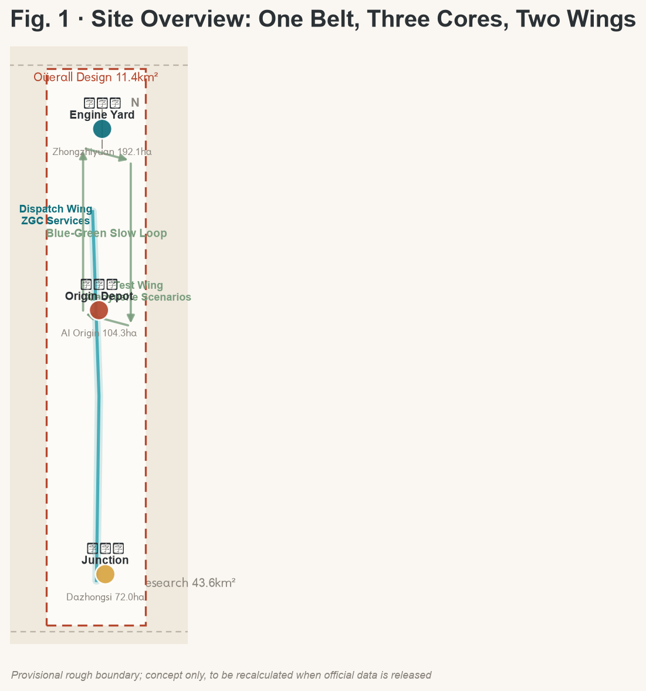
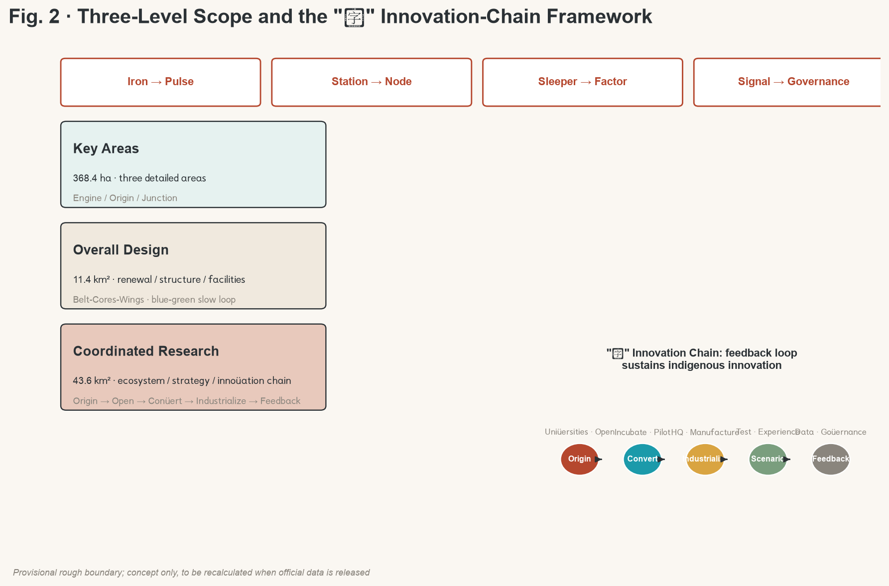
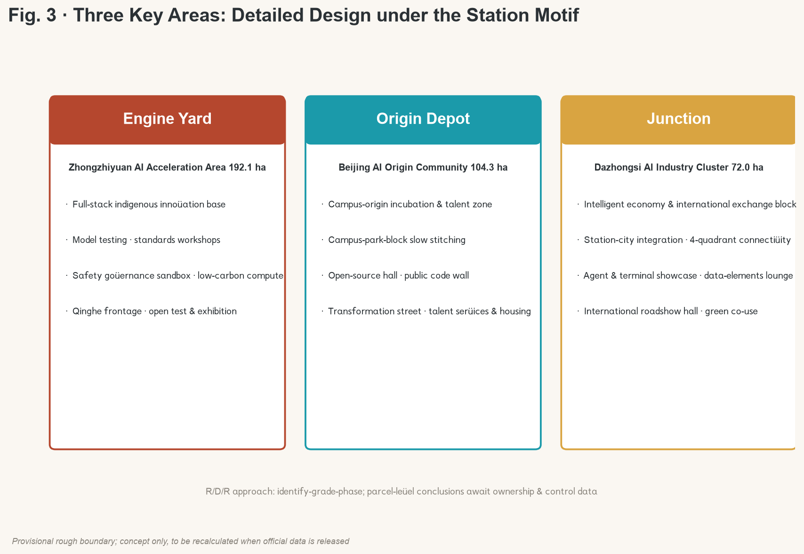
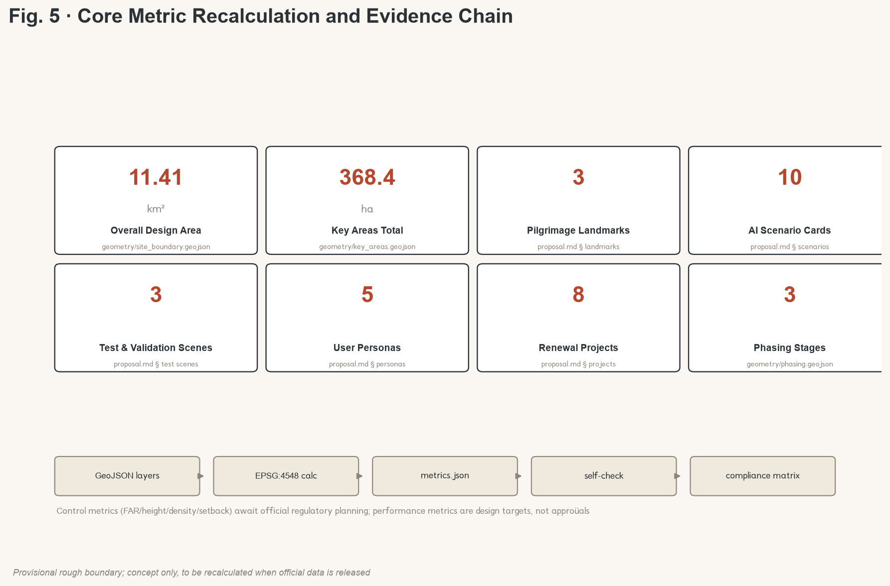

# Jing-Zhang AI Belt — Centennial Jing-Zhang AI Innovation Belt Urban Design Proposal

## Design basis and source register

This formal package treats the *Centennial Jing-Zhang AI Innovation Belt Urban Design International Open Call Pre-qualification Announcement* issued by the Haidian Branch of the Beijing Municipal Bureau of Planning and Natural Resources as its first source, and uses the temporary rough boundaries, key areas, enums, indicators, and source register from `brief/site-package/` as machine-readable evidence. Before generation the proposal reads `design_brief.json`, `agent_taskbook.json`, `allowed_design_space.json`, `sources.json`, `enums/`, `ranges/`, `schemas/`, `data/source_registry.json` and the local snapshots of all professional standards; every design judgment is split into traceable source, reproducible metric, checkable layer and human-reviewable assumption [source:OFFICIAL-ANNOUNCEMENT] [source:AGENT-TASKBOOK] [depth:existing_conditions_diagnosis].

Boundaries on the source register [source:SOURCE-REGISTRY]: 7 formal-usable sources, 1 background, 1 provisional-only. Background and provisional material must not be promoted to official boundaries, regulatory controls, formal scoring evidence, or implementation commitments. `data/processed/agent_fact_pack.md` is a navigation layer, not a new authority [source:PROCESSED-FACT-PACK].

Since the official `SITE_BOUNDARY` and the three `KEY_AREA` polygons are not yet public, this package uses `brief/site-package/geometry/provisional_boundaries.geojson` as a temporary formal input [data:geometry/site_boundary.geojson#SITE-001]. All boundaries are flagged `provisional_constraint`, `official_boundary=false`, and are used only for generation, self-check, visualization and design discussion; this organizer-side data gap does not block content scoring. After the official polygons are released, the full geometry, metrics, figures and HTML must be recalculated [metric:site_area_sqm] [metric:key_area_count].

## Three-level scope framework

The proposal organises work across the three levels set by the announcement: the **coordinated research area** (43.6 km²) addresses AI industry ecosystem, strategy, innovation chain, and future city form; the **overall design area** (11.4 km²) frames urban renewal, spatial structure, industry layout, transport and municipal support, and city character; the **key detailed design area** (368.4 ha) requires function, scale, retain/renovate/demolish logic, public-space connectivity, and transport organisation for three districts [standard:PROJECT-OFFICIAL-ANNOUNCEMENT] [depth:three_level_scope_framework].

The three levels are not three separate drawing sets but three granularities of the same design judgement: research answers *why here and how innovation is organised*; overall design answers *how space, systems and support are allocated*; key-area detail answers *how nodes operate and how scenarios are actually experienced*. The spatial frame, scenarios and metrics in this proposal are written to be *discussable, reproducible, and recalculable when official boundaries are released* [depth:overall_spatial_structure].

| Level | Design question | Proposal answer | Evidence |
| --- | --- | --- | --- |
| Coordinated research | How is the AI ecosystem and future city form organised? | Iron-rail translation: Origin → Open → Convert → Industrialise → Feedback | compliance_matrix.json, standard_matrix.json |
| Overall design | How are industry, renewal, transport, public space, character mapped? | Belt · Three Cores · Two Wings + blue-green slow loop | [data:geometry/land_use.geojson#LU-001], [data:geometry/roads.geojson#ROAD-001] |
| Key areas | How do the three detailed areas reach design-package depth? | Engine Yard / Origin Depot / Junction — each with positioning, spatial moves and AI scenarios | [data:geometry/key_areas.geojson#PROV-KEY-001/002/003] |

## Overall concept: Jing-Zhang AI Belt (the Intelligent Pulse of Jing-Zhang)

### Concept claim

A century ago Zhan Tianyou laid the first trunk railway designed and built independently by Chinese engineers here — the **"Ren" (人) switchback line** — using the most advanced engineering of its time to cross mountains. A century later the same land should grow a new kind of rail: not iron, but an **intelligent innovation track** with compute, data, talent, and scenarios as sleepers and universities, parks, communities, and stations as stations [standard:PROJECT-OFFICIAL-ANNOUNCEMENT] [source:AGENT-TASKBOOK].

The principal name **JINGZHANG AI BELT** (京张智脉) plays on the metaphor *rails are veins; innovation is pulse*: rails move people and goods, the pulse moves data, compute, capital and creativity. The sub-title **"From Iron Rails to Intelligent Pulse"** completes a two-century translation — the iron road was the early-20th-century Chinese declaration of indigenous innovation, the AI belt is the early-21st-century Chinese declaration of intelligent city-making [depth:brand_identity_system].

### Naming system

The naming system uses the railway vocabulary as its mother-tongue: consistent, extensible, internationally communicable.

| Subject | Name | Railway motif | Function |
| --- | --- | --- | --- |
| Zhongzhiyuan AI Acceleration Area | **Engine Yard** | Power system | Full-stack indigenous innovation + global AI-governance voice |
| Beijing AI Origin Community | **Origin Depot** | Zero-kilometre point | World-class AI innovation ecosystem, campus-origin incubation, talent zone |
| Dazhongsi AI Industry Cluster | **Junction** | Line convergence | Smart-economy & international exchange, intelligent-original business formats |
| Zhongguancun Technology Service Wing | **Dispatch Wing** | Train control | Global factor allocation, ZGC IP & capital enablement |
| Xiaoyuehe Scenario Empowerment Wing | **Test Wing** | Test track | AI scenario empowerment, intelligent AI vital city |

*Origin Depot* doubles the Beijing AI Origin Community's given position with the railway *zero-kilometre* imagery; *Engine Yard* and *Junction* use globally familiar railway terms; *Dispatch* and *Test* complete a Power-Origin-Convergence-Dispatch-Test semantic loop [depth:brand_identity_system] [source:AGENT-TASKBOOK].

### Visual identity and logo direction

Logo direction: take the Jing-Zhang "Ren" switchback as the graphic origin; two parallel rails gradually turn into two data-pulse lines that meet at the Ren vertex — meaning history and future share the same track, science and humanity share the same source. *Ren* also reads as a declaration of *people-first* governance, in line with the people-first principle [charter:10] [depth:visual_identity].

Colour: Rust Red (from Jing-Zhang iron and industrial heritage) + AI Teal (Haidian innovation and data flow) on a deep-grey base — a restrained, stable, technology-grade palette. Typography: modern Chinese sans with a humanist touch; geometric Latin sans. The logo and naming are conceptual directions, do not embed any unauthorised font, trademark, or person image; final landing requires a professional brand team and full rights clearance [source:SITE-PACKAGE].

### Three positionings, five functions, three-areas-two-wings

The three positionings (Centennial Jing-Zhang Cultural Belt, Urban AI Living Experience Belt, AI Convergence Innovation Belt) are integrated as *three tenses of the same belt*: cultural belt carries the historical narrative, experience belt carries everyday life, innovation belt carries future industry. Five functions are spatially anchored as follows:

| Five functions | Spatial anchor | Role |
| --- | --- | --- |
| Full-stack indigenous innovation system | Engine Yard (Zhongzhiyuan) | Full-stack capability base |
| World-class AI innovation ecosystem | Origin Depot + Dispatch Wing | Origin & capital, two wheels |
| AI+ scenario empowerment paradigm | Test Wing + all-belt public space | Scenario validation & feedback |
| Intelligent AI vital city | Heritage Park belt + blue-green slow loop | Spatial carrier & city base |
| Global AI governance voice | Engine Yard governance showcase + Junction international roadshow | Standards & discourse output |

Three-areas-two-wings loop: **Origin** (Origin Depot: universities & open source) → **Convert** (Engine Yard: full-stack R&D and acceleration) → **Industrialise** (Junction: smart economy and international exchange); the two wings provide **Dispatch** (capital, IP, global allocation) and **Test** (scenario testing, user feedback), forming a closed loop: scenario test feeds back into origin, completing a *demand → innovation → demand* cycle [source:AGENT-TASKBOOK] [depth:regional_synergy].

### Overall spatial structure

**Belt · Three Cores · Two Wings · blue-green-slow compound loop**: the belt is the Jing-Zhang Heritage Park active belt (historic and public-space spine, north-south through-line); the three cores are Engine Yard, Origin Depot and Junction (innovation anchors); the two wings are Dispatch Wing and Test Wing (functional flanks); the compound loop links slow mobility, green space, public space and activity routes, connecting the three cores, two wings, universities, communities, and rail stations [depth:overall_spatial_structure] [data:geometry/land_use.geojson#LU-001].

## Coordinated research: industry and future-city

### Six global AI innovation ecosystem cases

| Case | Region / city | Ecosystem feature | Implication for Haidian |
| --- | --- | --- | --- |
| Silicon Valley | California, USA | University-capital-company loop; Stanford origination + Sand Hill Road + geek culture | Strengthen *campus-origin + patient capital* two-wheel |
| Zhongguancun | Beijing, China | Policy pilot, industry cluster, indigenous-innovation frontrunner | Continue existing innovation DNA, upgrade to AI-native form |
| Shenzhen Nanshan | Shenzhen, China | Hardware ecosystem, rapid prototyping, agile supply chain | Add smart-terminal prototyping & manufacturing-verification |
| Tel Aviv | Israel | Military-tech spillover, founder culture, global-market orientation | Explore safety-governance + advanced-tech conversion |
| Austin | Texas, USA | University research + liveable city talent magnet | Use high-quality city & life experience to attract global AI talent |
| Singapore Jurong | Singapore | National strategy, internationalised governance, open testbed | Build replicable international governance & open-scenario mechanism |

Three lessons: the AI-innovation race is a *closed loop of origin-convert-capital-scenario*, not a single link; talent competition is essentially city-quality competition; the governance voice comes from mechanisms that are open, verifiable, and internationally replicable [source:AGENT-TASKBOOK] [depth:industry_ecosystem].

### Innovation ecosystem map and full-stack system

Engine Yard carries the full-stack indigenous innovation system: five capability layers (indigenous foundation models, open-source frameworks, compute orchestration, data elements, safety evaluation) plus a standards workshop and a safety-governance sandbox, forming a triad of *indigenous base + open ecosystem + governance showcase* [source:AGENT-TASKBOOK] [depth:industry_space_mapping].

The eight-factor mechanism (land, space, industry, capital, talent, compute, data, scenarios): land and space are carried by the three cores and two wings; capital is matched by the Dispatch Wing with ZGC and patient capital; talent is attracted by Origin Depot's talent zone and the high-quality living belt; compute and data are supplied by the Engine Yard base and the data-elements lounge; scenarios are opened by the Test Wing and the all-belt public space. All are mechanism suggestions to be deepened by the professional team and authorities [source:AGENT-TASKBOOK].

### Future city form

AI reshapes work, life, social, learning, transport, and public service. The proposal reads this as four future-city characteristics: **rail-shaped innovation flow** (dispatch innovation factors like trains), **station-shaped public space** (turn public space into dwellable exchange nodes), **sleeper-shaped support network** (lay compute, energy, data as the city base), **signal-shaped governance interface** (make rules, publication, and feedback visible signals). These translate into locatable functional zones, nodes, corridors and scenarios, not generic technology vision [depth:future_city_form].

## Overall design area: urban renewal and regulatory-plan urban-design depth

### Overall renewal spatial structure

The overall design area uses *stitch and through-connect* as the renewal logic: east-west stitching across the Jingzang Expressway and Xueyuan Road connectors, north-south through-connect along the Heritage Park connecting the three cores and two wings. Renewal objects are graded in four classes (retain / renovate / renew / new-build); avoid large-scale demolition and rely on identifying inefficient space and progressive renewal [standard:MOHURD-CONTROL-DETAILED-PLANNING] [depth:land_use_layout].

### Land use and building scale

`geometry/land_use.geojson` covers the full boundary with no overlaps or gaps [data:geometry/land_use.geojson#LU-001]; land uses follow the MNR land-use classification: AI R&D innovation land, parks & open space, commercial service, residential, public service, transport, and reserved land [standard:MNR-LAND-USE-CLASSIFICATION-GUIDE] [depth:land_use_layout]. `geometry/buildings.geojson` expresses renewal and retain building footprints [data:geometry/buildings.geojson#BLDG-001] [metric:building_footprint_area_sqm].

Floor area ratio, height, density, green ratio, setback and building control lines depend on official regulatory planning, currently marked **pending official control**, with no agent-inferred values presented as approved [depth:development_intensity_controls] [source:SITE-PACKAGE].

### Transport, rail, municipal and new infrastructure

Transport strategy: rail-station integration, road micro-circulation, slow-network break stitching, green travel. Strengthen North 5th Ring interchanges, Wudaokou, East Qinghua Rd W, Dazhongsi and other key interchanges and crossings. Road and slow layers stay inside the submission boundary and cross-check with public space, green space, industry nodes and key areas [data:geometry/roads.geojson#ROAD-001] [depth:traffic_rail_slow_parking].

Municipal and new infrastructure: pilot a fusion of *edge-compute stations, distributed energy, smart poles and data-sensing* with traditional municipal layouts; missing pipeline, energy, drainage, flood control, fire-protection data is listed as a pre-condition for formal deepening [depth:municipal_new_infrastructure].

## Key detailed design

Three key areas are detailed under the station motif, reaching the urban-design depth of the planning comprehensive implementation plan [depth:three_key_area_detailed_design].

### Engine Yard: Zhongzhiyuan AI Acceleration Area (192.1 ha)

Positioning: a garden-style full-stack indigenous innovation block. Spatial moves: strengthen the Qinghe frontage and external transport organisation; use green space to host open testing and standards-governance showcase; deploy around the national AI platform — indigenous model testing, standards workshops, safety-governance sandbox, low-carbon compute experience. Build a low-carbon green innovation social environment and integrate green-space AI scenarios (environmental sensing, energy optimisation, unmanned patrol) [data:geometry/key_areas.geojson#PROV-KEY-001] [source:AGENT-TASKBOOK].

### Origin Depot: Beijing AI Origin Community (104.3 ha)

Positioning: a campus-origin transformation & talent community. Spatial moves: organise campus-park-block slow-network stitching; supply result-release, talent service, residential and open-source collaboration space; arrange a result-transformation street along the university frontage (incubation, showcase, legal, IP, financing); build the open-source release hall and the public code wall to host brand events and result showcase [data:geometry/key_areas.geojson#PROV-KEY-002] [source:AGENT-TASKBOOK].

### Junction: Dazhongsi AI Industry Cluster (72 ha)

Positioning: a city-type intelligent economy & international exchange block. Spatial moves: develop around Dazhongsi Station integration and four-quadrant pedestrian connectivity; organise commercial services and public-environment renewal for key enterprises; embed agent & smart-terminal showcase, content consumption, data-elements lounge and international roadshow hall; complex use of planned green space to form a 24-hour city living room [data:geometry/key_areas.geojson#PROV-KEY-003] [metric:key_area_count].

### Retain / renovate / demolish notes

Because current building footprints, ownership and regulatory controls are not public, the retain/renovate/demolish logic for the three key areas is presented as **methodology** (identify inefficient land, grade retain & progressive renewal, prioritise public-space and slow-network projects), with no parcel-level conclusions. It will be deepened by the professional team once the official data is released [depth:retain_renovate_demolish].

| Key area | Design positioning | Spatial moves | AI industry & operations | Evidence |
| --- | --- | --- | --- | --- |
| Engine Yard · Zhongzhiyuan | Garden-style full-stack indigenous innovation block | Qinghe frontage, industry showcase, low-carbon exchange, open testing | Indigenous-model testing, standards workshop, safety-governance showcase, low-carbon compute experience | [data:geometry/key_areas.geojson#PROV-KEY-001] |
| Origin Depot · AI Origin | Campus-origin transformation & talent community | Campus-park-block slow stitching, result release & talent service | Open-source community, result release, talent-zone services, near-campus incubation | [data:geometry/key_areas.geojson#PROV-KEY-002] |
| Junction · Dazhongsi | City-type intelligent economy & international exchange block | Station-city integration, 4-quadrant connectivity, commercial & public-env renewal | Agent & terminal showcase, content consumption, data elements, international roadshow | [data:geometry/key_areas.geojson#PROV-KEY-003] |

## AI innovation ecosystem, talent personas, and AI+ scenarios

### Five user personas

| Persona | Typical needs | Spatial response | Self-check boundary |
| --- | --- | --- | --- |
| Open-source developer | Release, collaborate, test, community reputation | Origin Depot open-source hall, public code wall, overnight collaboration space | No personal behaviour trajectory collected; event data only aggregated |
| Startup team | Low-cost office, compute entry, product trial field | Engine Yard shared testbed, edge-compute service point, standards & governance consultation | Compute and data services need separate authorisation |
| Enterprise visitor | Showcase, business, international reception, talent recruitment | Junction international roadshow hall, station interchange, public space around key enterprises | Enterprise identity and case studies need rights clearance |
| Local resident | Commute, leisure, community services, low-disturbance renewal | Heritage Park slow loop, embedded community services, night lighting & graded activities | Resident personas not used for commercial recommendation |
| University staff & students | Result transformation, cross-school collaboration, daily slow mobility | Campus-park slow stitching, transformation relay station, AI education experience point | Campus data and research output need authorisation |

### Ten AI scenario cards

| Card | Spatial carrier | Description |
| --- | --- | --- |
| 01 Open-source Release Hall | Origin Depot | Universities, open-source community and startups — result release, code contribution display and small roadshows |
| 02 Safety Governance Sandbox | Engine Yard | Translate standards-setting, safety evaluation, red-team testing into a bookable, regulated showcase and collaboration node |
| 03 Edge-compute Stop | All-belt nodes | Combined with public service, enterprise service and low-carbon energy; a new-infrastructure prototype to deepen |
| 04 AI Slow-mobility Navigation | Heritage Park active belt | Explainable wayfinding and low-intrusion sensing to identify slow-network breaks, congestion and accessibility needs |
| 05 Agent Roadshow Hall | Junction | Service agents, smart terminals and content-consumption enterprises — showcase, talks, media release, international exchange |
| 06 Data-elements Lounge | Junction | Compliance, authorisation, audit-based — show data-elements and digital-asset circulation as a city service interface |
| 07 Near-campus Transformation Street | Origin Depot | Incubation, showcase, legal, IP, financing for university result transformation |
| 08 AI Education Experience Point | University frontage | AI principle experience, future-career display, cross-school collaboration space for staff, students, and the public |
| 09 AI Life-service Sample Street | Community–commerce interface | Medical, education, legal, life-service AI+ scenarios landing in operable, small-scale block space |
| 10 Global AI Activity Week Route | All-belt public space | A walkable, communicable experience route from heritage, open-source community, industry showcase to international roadshow |

### Three industry test & validation scenes

| Test scene | Location | Validation | Open boundary |
| --- | --- | --- | --- |
| City-level AI traffic simulation | Wudaokou / East Qinghua Rd W intersection cluster | Adaptive signals, V2X, slow-mobility safety warning | Only public traffic data & de-identified data; human-in-the-loop |
| Edge / on-device compute in-the-wild test belt | Along the Heritage Park | Edge model inference, low-power sensing, edge orchestration | Sensors only collect environment & facility data, no personally identifiable data |
| Data-elements circulation sandbox | Junction | Authorisation, attestation, audit, and circulation prototype | Full-process compliance, auditable, revocable, no non-public data |

These three test scenes are conceptual suggestions and reference schemes; immature technology is not presented as deployment-ready [source:AGENT-TASKBOOK] [depth:ai_scenario_verification].

## AI public space, intelligent-original business formats, pilgrimage landmarks

### Heritage Park AI public space and compound loop

Use the Heritage Park active belt as the backbone, coordinate Qinghe, Xiaoyuehe and the demand of universities, enterprises, communities, and propose a north-south through, east-west connected pedestrian, cycling and green-space system [data:geometry/green_space.geojson#GREEN-001] [data:geometry/public_space.geojson#PUBLIC-001] [depth:blue_green_public_space]. Identify slow-network breaks, ring-road overpass nodes, north and south landscape endpoints, and propose parking, sports, innovation exchange, technology test, application showcase and public service co-use strategies [data:geometry/roads.geojson#ROAD-001].

### Three AI pilgrimage landmarks

| Landmark | Location | Design intent |
| --- | --- | --- |
| "Origin Stele" — Qinghua-yuan Station origin memorial | Origin Depot · along Qinghua-yuan Station old site | Take the century-old rail origin as the spiritual anchor for the AI origin community; embed the agent contribution honour wall, with selected proposals and contributors recorded as stone inscriptions |
| "Iron-walk Promenade" — developer stroll | Core section of Heritage Park active belt | Translate rail, sleeper, signal into promenade furniture and public art; embed an updatable digital honour interface and physical inscription along the line |
| "Open-source Showcase Gallery" + Global Developer Honour Wall | Junction or south end of Heritage Park | Showcase open-source output, agent proposals, and global developer contributions; physical carrier of annual events and pilgrimage endpoint |

The three landmarks form an *Origin · Path · Endpoint* pilgrimage narrative that composes with the Global AI Activity Week route and the cultural walk route; all are conceptual suggestions; physical construction depends on final review, approval, and implementation [source:AGENT-TASKBOOK] [depth:ai_landmarks].

### Public-space component library

A component library under the *Station–Track–Signal–Carriage* motif: station (dwell & social space), track (slow & wayfinding path), signal (info & interactive interface), carriage (mobile service unit). The library ensures consistency and reusability for the deepening design [depth:public_space_component_library].

## Centennial Jing-Zhang, Zhongguancun, and AI-new culture narrative

### The "Ren" narrative

The three cultural lines unify under *Ren*: the railway Ren switchback is the first declaration of Chinese indigenous innovation; the Zhongguancun Ren is the portrait of science-and-tech founders; the AI-new culture Ren is the governance consensus of *people-first, human-machine collaboration*. The cultural through-line: **"From the Ren on the rail to the people-first pulse"** — Chinese people have always used the most advanced technology of their time to answer the country's and the city's real needs [source:AGENT-TASKBOOK] [depth:culture_narrative].

### Spatial cultural system and signage

A three-layer cultural narrative along the Heritage Park: historical (Qinghua-yuan Station, Jing-Zhang railway relics, rail-cultural symbols), contemporary (Zhongguancun innovation nodes, university-community vitality), future (AI scenarios, pilgrimage landmarks, digital honour interface). The signage system uses *signal and track* as its visual language and is managed separately from the belt-level logo; all symbols are original concept directions and do not infringe on existing rights [source:AGENT-TASKBOOK] [depth:signage_system].

### International communication narrative

English through-line: **"A Century of Iron, A New Age of Intelligence"**. Three storytelling pillars: *indigenous innovation* (from Zhan Tianyou to AI full-stack), *urban experiment* (the world's first real city design open to Agents), *open co-creation* (open-source community & global developer honour system). The narrative positions Haidian not as a copy of Silicon Valley but as the inventor of an *iron-road-shaped* indigenous intelligent-city form [source:AGENT-TASKBOOK] [depth:international_communication].

## Global AI innovation activity system and long-term operation

### Annual activity system

| Activity | Frequency | Positioning |
| --- | --- | --- |
| Global AI Activity Week | Annual | Flagship: open-source festival, AI urban-design hackathon, agent contest, developer pilgrimage |
| AI Open Day | Monthly | Scenario roadshow, enterprise showcase, public experience |
| Standards & Governance Workshop | Bimonthly | Standard-setting, safety evaluation, governance |
| Developer Community Gathering | Weekly / biweekly | Code contribution, technical sharing, mentor programme |

### Brand & communication

The activity brand unifies under the *Jing-Zhang AI Belt* visual system as accumulable brand assets; the narrative centres on *indigenous innovation + urban experiment + open co-creation* and reaches the world through open-source community, international developer conferences, and public media [source:AGENT-TASKBOOK] [depth:event_brand_system].

### Developer community and scenario open-operation mechanism

Developer community operation: traceable open-source contribution board, honour points and mentor programme, annual developer conference, continuously updated honour wall (linked with the inscription system). Scenario open operation: an *open-scenario list + access mechanism + operator* enables AI scenarios to be operable and iterable; with events as the entry point build a *talent–enterprise–project* conversion pathway, forming a *event attraction → scenario validation → policy matching → enterprise landing* long-term loop [source:AGENT-TASKBOOK] [depth:conversion_pathway].

All activities and operations are conceptual suggestions and do not constitute confirmed government arrangements; investment promotion, policy and funding are described as mechanism proposals, not commitments.

## Land use, building scale, and retain/renovate/demolish

Land-use classification follows the *MNR Land-Use Classification Guide*; `geometry/land_use.geojson` covers the full boundary with no overlap and no gap [standard:MNR-LAND-USE-CLASSIFICATION-GUIDE] [data:geometry/land_use.geojson#LU-001]. The building scheme distinguishes retain, renovate, update, new-build, and to-be-confirmed objects, with clear base, function, scale, character, roof, mass, and height recommendations [data:geometry/buildings.geojson#BLDG-001] [metric:building_footprint_area_sqm].

Retain/renovate/demolish follows a three-step method: identify-grade-phase: identify inefficient land and idle space (method), grade retain/renovate/update objects (pending ownership and current data), and progressively implement public-space and slow-network priority projects (phased). Without existing building, ownership, regulatory, and engineering data, the scheme only provides the method and a calibration list; no fabricated conclusions are made [depth:retain_renovate_demolish] [depth:height_massing_character].

## Transport, rail, municipal and public service facilities

Transport responds to the announcement's requirements for station integration, road micro-circulation, slow-network breaks, external transport, parking, non-motorised parking, and green travel. The North 5th Ring interchange, Wudaokou, East Qinghua Rd W, and Dazhongsi Station are key organisational objects [data:geometry/roads.geojson#ROAD-001] [depth:traffic_rail_slow_parking]; the slow network composes with blue-green public space, forming *rail + slow + shared mobility* green travel. Missing road red lines, sections, pipelines and parking data mean the transport conclusion is a temporary design discussion, to be recalculated after official data is released.

Municipal and public service: AI industry service facilities (testbed, roadshow, standards service), innovation service platforms, talent life-service facilities, new infrastructure (edge compute, distributed energy, smart poles) are coordinated [depth:municipal_new_infrastructure]; service radius, operation mode and phasing logic are recorded in `compliance_matrix.json`; engineering-level calculations are listed as pre-conditions for formal deepening.

## Blue-green space, public space, and city character

The blue-green backbone is the Heritage Park active belt; integrate Qinghe, Xiaoyuehe green corridors and the open space of universities and communities to form a *one axis, two corridors, many nodes* blue-green network [data:geometry/green_space.geojson#GREEN-001] [data:geometry/public_space.geojson#PUBLIC-001] [depth:blue_green_public_space]. Public space emphasises *station-isation*: every key node has the capacity to dwell, exchange, inform, and host [metric:public_space_ratio].

City character integrates Jing-Zhang railway heritage, Zhongguancun innovation and AI-new culture: rust red and AI teal as the main tones; control the massing and roof shape of the Heritage Park frontage; use cultural resources such as Qinghua-yuan Station to organise public art and wayfinding [standard:MOHURD-URBAN-DESIGN-MEASURES] [depth:city_character]. Character control separates official control, design suggestion, and to-be-confirmed condition; without heritage or regulatory basis, no false precise control lines are produced.

## Renewal project list, implementation policy, and phasing

### Renewal project list

| ID | Project | Type | Main dependency | Evidence |
| --- | --- | --- | --- | --- |
| JZ-01 | Heritage Park slow-network break stitching | Public space / transport | Road red line, under-bridge space, traffic organisation review | [data:geometry/roads.geojson#ROAD-001] |
| JZ-02 | Engine Yard · Qinghe innovation frontage | Blue-green space / industry showcase | River blue line, ecology & flood control | [data:geometry/green_space.geojson#GREEN-001] |
| JZ-03 | Origin Depot · near-campus transformation street | Urban renewal / industry service | Campus boundary, ownership, ground-floor tenancy | [data:geometry/buildings.geojson#BLDG-001] |
| JZ-04 | Junction · four-quadrant pedestrian connectivity | Station integration / slow mobility | Station, intersection, municipal pipelines | [data:geometry/public_space.geojson#PUBLIC-001] |
| JZ-05 | AI public service & edge-compute node | New infrastructure / public service | Energy, compute, security, operator | [data:geometry/constraints.geojson#CONSTRAINTS] |
| JZ-06 | Global AI Activity Week public route | Operation / brand | Public-space permit, event safety, rights clearance | [data:geometry/phasing.geojson#PHASE-001] |
| JZ-07 | Qinghua-yuan Station origin memorial | Culture / pilgrimage landmark | Heritage scope, Heritage Park implementation boundary | [data:geometry/key_areas.geojson#PROV-KEY-002] |
| JZ-08 | Open-source showcase gallery | Culture / showcase | Public-space permit, content clearance | [data:geometry/public_space.geojson#PUBLIC-001] |

### Implementation policy suggestions

Seven categories of policy suggestions: urban renewal co-ordination (block-level, unit renewal), space supply (flexible land, mixed use), operation mechanism (scenario opening, event operation), industry service (full-stack service, factor dispatch), public participation (open co-creation, public experience), data governance (compliance authorisation, audit), and ownership collaboration. All are mechanism directions to be deepened by the professional team and authorities [depth:renewal_project_list] [source:SITE-PACKAGE].

### Phasing

| Phase | Time | Focus |
| --- | --- | --- |
| Pilot | 2026–2028 | Heritage Park slow-network break stitching, Origin Stele & open-source hall prototype, first Global AI Activity Week, scenario open list |
| Mid-term | 2028–2031 | Three cores initially formed, transport & municipal deepening, data-elements and compute nodes landing, pilgrimage system complete |
| Long-term | 2031–2035 | Complete innovation ecosystem, mature global pilgrimage, international communication & brand-asset accumulation |

`geometry/phasing.geojson` expresses the three phases [data:geometry/phasing.geojson#PHASE-001]. The open-call window (2026-08-31 deadline) and the implementation phasing are strictly distinguished: the open-call window is the submission timeline, the implementation phasing is the rollout path of urban renewal and construction.

## Indicator system, area recalculation, compliance matrix

Three classes of indicators: class-1 spatial indicators directly recalculated from submission geometry (boundary area, green ratio, public-space ratio, building footprint, phasing area); class-2 control indicators depend on official regulatory planning (FAR, height, density, setback, road red line, facility standards), currently marked pending official data; class-3 performance indicators need continuous calibration by operation and industry data (AI innovation index, talent density, event participation, scenario usage), stated as design targets rather than approved values [depth:metrics_recalculation] [metric:site_area_sqm] [metric:green_ratio] [metric:public_space_ratio].

Area recalculation is unified under EPSG:4548, GeoJSON exchange under EPSG:4326 [standard:PROJECT-OFFICIAL-ANNOUNCEMENT]. The compliance matrix maps each announcement clause 1.3/1.4/1.5 and each agent.1–agent.6 task to report section, layer, metric, drawing, HTML page, source, assumption and self-check item [depth:compliance_coverage].

## Risk, copyright, and compliance notes

The package requires bilingual delivery: the primary file is Chinese, `proposal.en.md` is the complete counterpart translation; A3/A0 drawings, HTML, and text-bearing figures are also bilingual; terminology prefers the recommended translations in `docs/terminology-glossary.md`. All images, drawings, icons, data and code assets must state their source, license, and authorisation status in `sources.json` and `report/copyright_statement.md`; HTML pages must not load remote scripts, remote map tiles, remote fonts, iframes, forms, or external APIs, and must not track reviewers.

Risks and missing-data list are cross-checked with `constraints.geojson` and the site package [data:geometry/constraints.geojson#CONSTRAINTS] [depth:risk_missing_data]: gaps in official boundary, regulatory controls, road red lines, parcel ownership, building status, municipal, heritage, and public service all flow into `assumptions.json`, self-check, and the risk section. Any conclusion missing official conditions is downgraded to a to-be-confirmed item. All spatial landing suggestions are stated as *concept suggestion*, *reference scheme*, or *material for professional teams to deepen*, and do not replace formal planning or constitute government approval [source:AGENT-TASKBOOK] [standard:PROJECT-AGENT-OPEN-CALL-TASKBOOK].

This proposal does not claim official approval, approved regulatory planning, final land ownership, final building scale, or guaranteed implementation. The AI agent is responsible for facts, sources, copyright, spatial data, metrics, and expression; maintainers and professional reviewers may ask for revision or rejection based on self-check, spatial review, and the compliance matrix.

## References

- brief/public-brief.md
- brief/site-package/design_brief.json
- brief/site-package/agent_taskbook.json
- brief/site-package/allowed_design_space.json
- brief/site-package/enums/
- brief/site-package/ranges/planning_limits.json
- brief/site-package/standards/standards.json
- brief/site-package/standards/references/
- brief/site-package/geometry/provisional_boundaries.geojson
- data/source_registry.json
- data/processed/agent_fact_pack.md
- Complete machine-readable index: see `sources.json`, `metrics.json`, `compliance_matrix.json`, `standard_matrix.json`, `design_depth_matrix.json`
- Provenance & license: see structured source register [source:SITE-PACKAGE]
