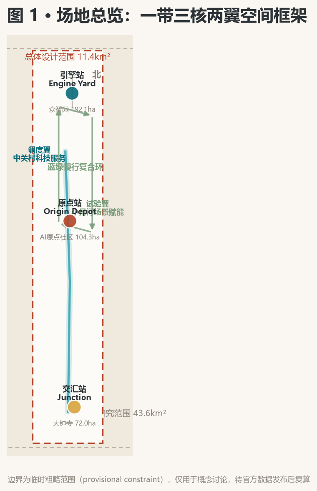
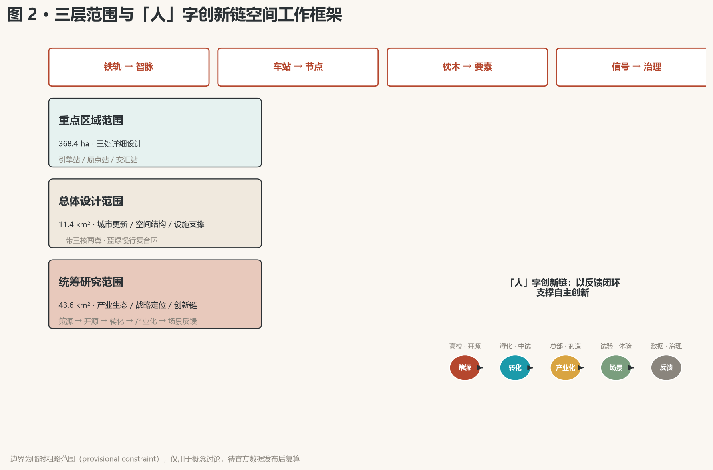
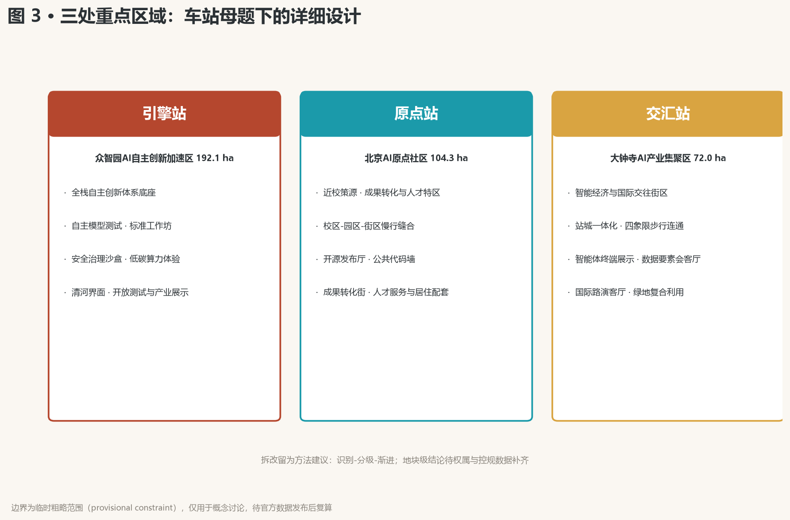
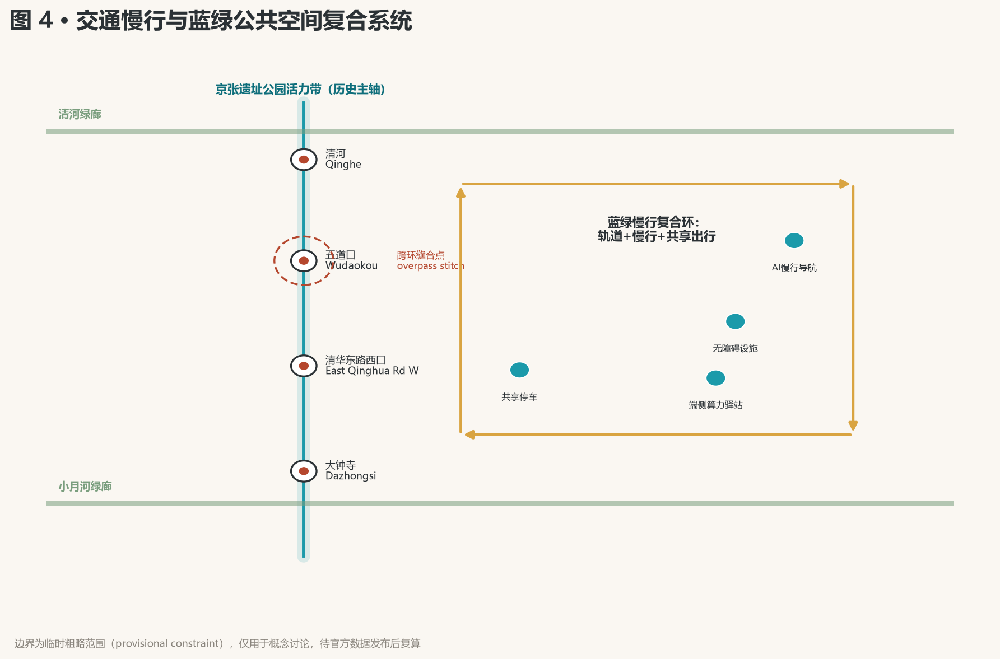
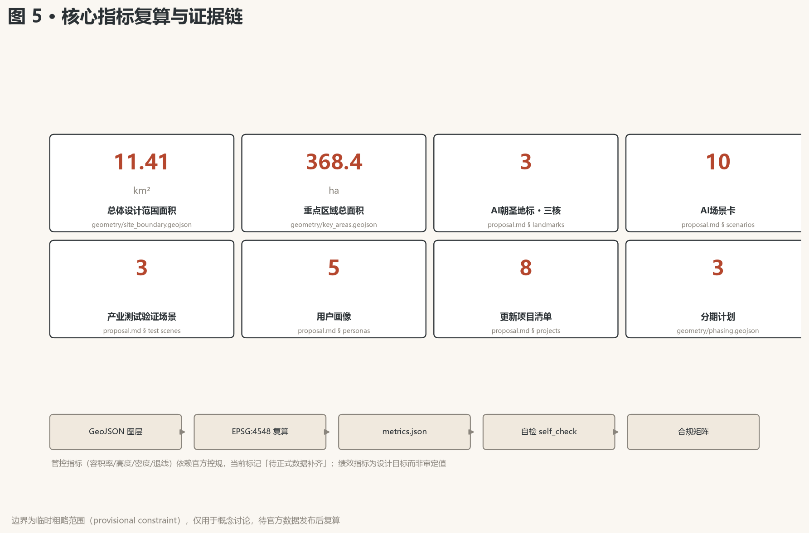

# 京张智脉——百年京张AI创新带总体概念与城市设计方案

## 设计依据与资料清单

本 formal 方案以北京市规划和自然资源委员会海淀分局发布的《百年京张AI创新带城市设计国际方案征集资格预审公告》为第一依据，并以 `brief/site-package/` 中经维护者登记的临时粗略边界、重点区域、枚举、指标和来源清单为机器可读依据。方案在生成前读取了 `design_brief.json`、`agent_taskbook.json`、`allowed_design_space.json`、`sources.json`、`enums/`、`ranges/`、`schemas/`、`data/source_registry.json` 与全部专业标准本地快照，所有设计判断均拆分为可追溯来源、可复算指标、可校验图层和可人工复核假设 [source:OFFICIAL-ANNOUNCEMENT] [source:AGENT-TASKBOOK] [depth:existing_conditions_diagnosis]。

资料登记表的使用边界如下 [source:SOURCE-REGISTRY]：formal 可用资料 7 条，背景资料 1 条，provisional-only 资料 1 条；agent 不得把 background_only 或 provisional_only 资料升级为 official boundary、法定控规、正式评分依据或政府实施承诺。`data/processed/agent_fact_pack.md` 是阅读导航层，不是新的权威来源 [source:PROCESSED-FACT-PACK]。

官方 `SITE_BOUNDARY` 与三处 `KEY_AREA` 精确 polygon 尚未公开，本方案使用 `brief/site-package/geometry/provisional_boundaries.geojson` 生成临时 formal 包 [data:geometry/site_boundary.geojson#SITE-001]。提交包中的边界均标注为 `provisional_constraint`、`official_boundary=false`，仅用于方案生成、自检、可视化和设计讨论，不能作为 official redline、审批依据、精确面积依据或法定控制结论；该组织方数据缺口不阻断内容评分，官方数据发布后需整体复算 [metric:site_area_sqm] [metric:key_area_count]。

## 三层范围工作框架

方案按公告确定的三个层次组织工作：统筹研究范围关注 43.6 平方公里的AI产业生态、战略定位、创新链与未来城市形态；总体设计范围关注 11.4 平方公里京张遗址公园周边城市地区与产业区，形成城市更新总体框架、产业空间布局、交通市政支撑与风貌控制；重点区域范围关注 368.4 公顷三处详细设计地区 [standard:PROJECT-OFFICIAL-ANNOUNCEMENT] [depth:three_level_scope_framework]。

三层工作不是互相割裂的图纸集合，而是同一套设计判断的三种颗粒度：统筹研究决定「为什么在这里、创新如何组织」，总体设计落实「空间如何分配、系统如何支撑」，重点区域验证「节点如何运转、场景如何落地」。本方案的空间结构、场景与指标均按"可讨论、可复核、可替换官方边界后重算"的原则写入 [depth:overall_spatial_structure]。

| 层级 | 设计问题 | 方案回答 | 数据落点 |
| --- | --- | --- | --- |
| 统筹研究范围 | AI产业生态和未来城市形态如何组织 | 「铁轨转译」创新链：策源-开源-转化-产业化-场景反馈 | compliance_matrix.json、standard_matrix.json |
| 总体设计范围 | 产业空间、城市更新、交通市政和风貌如何落图 | 一带三核两翼空间结构 + 蓝绿慢行复合环 | [data:geometry/land_use.geojson#LU-001]、[data:geometry/roads.geojson#ROAD-001] |
| 重点区域范围 | 三处片区如何达到详细设计深度 | 引擎站/原点站/交汇站分别提出定位、空间动作与AI场景 | [data:geometry/key_areas.geojson#PROV-KEY-001]

、[data:geometry/key_areas.geojson#PROV-KEY-002]、[data:geometry/key_areas.geojson#PROV-KEY-003] |

## 总体概念：京张智脉（The Intelligent Pulse of Jing-Zhang）

### 概念主张

一百年前，詹天佑在这里铺下中国人自主设计和建造的第一条干线铁路——「人」字线路，用当时最前沿的工程跨越山河。一百年后，同一片土地应当长出新的轨道：不是物理的铁轨，而是以算力、数据、人才、场景为枕木，以高校、园区、社区为车站的**智能创新轨道** [standard:PROJECT-OFFICIAL-ANNOUNCEMENT] [source:AGENT-TASKBOOK]。

方案主名称**「京张智脉」**（英文 Jing-Zhang AI Pulse / JINGZHANG AI BELT）取"铁轨是血管、创新是脉动"之意：铁轨输送人流与物资，智脉输送数据、算力、资本与创造力。副标题「从铁轨到智脉」（From Iron Rails to Intelligent Pulse）完成两个世纪的转译——铁路是20世纪中国人用科技重塑山河的宣言，AI创新带是21世纪中国人用智能重塑城市的宣言 [depth:brand_identity_system]。

### 命名体系

命名体系以铁路语汇为母题，全带一致、可延展、可国际传播：

| 对象 | 命名 | 铁路母题 | 功能定位 |
| --- | --- | --- | --- |
| 众智园AI自主创新加速区 | 「引擎站」Engine Yard | 动力系统 | AI全栈自主创新体系与AI治理全球话语权 |
| 北京AI原点社区 | 「原点站」Origin Depot | 零公里起点 | 世界级AI创新生态、近校策源与人才特区 |
| 大钟寺AI产业集聚区 | 「交汇站」Junction | 线路交汇枢纽 | 智能原生新业态、国际交往与数据要素 |
| 中关村科技服务翼 | 「调度翼」Dispatch Wing | 行车调度 | 要素全球化配置、中关村IP与资本赋能 |
| 小月河场景赋能翼 | 「试验翼」Test Wing | 试运行线路 | AI场景赋能与智能化AI活力城市 |

「原点站」呼应北京AI原点社区的既有定位与铁路"零公里"双重意象；「引擎站」「交汇站」采用全球通用的铁路术语（Engine Yard / Junction），便于国际传播；「调度翼」「试验翼」描述功能职责，形成完整的「动力-策源-交汇-调度-试验」协同语义 [depth:brand_identity_system] [source:AGENT-TASKBOOK]。

### 视觉识别与Logo方向

Logo 方向：以京张铁路「人」字线路为图形原点，将两条平行铁轨渐变为两组数据脉冲线，在「人」字顶点交汇——寓意历史与未来同轨、科技与人文同源；「人」字同时是"以人为本"的宣言，符合人本治理原则 [charter:10] [depth:visual_identity]。

色彩体系：铁锈红（Rust Red）取自京张铁轨与工业遗产，象征百年自主；科技青（AI Teal）取自海淀创新与数据流，象征未来算力；深灰为底，形成稳重、克制的科技蓝本气质。字体方向：中文采用现代黑体变体，英文采用几何无衬线体。Logo 与命名均为概念方向，不附带任何未授权字体、商标或人物形象，正式落地需专业品牌团队深化并完成版权清权 [source:SITE-PACKAGE]。

### 三大定位、五大功能与三区两翼协同回路

三大定位（百年京张文化带、都市AI生活体验带、AI融合创新带）通过"同一条带上的三种时态"整合：文化带承载历史叙事，体验带承载当下生活，创新带承载未来产业。五大功能的空间落点如下：

| 五大功能 | 空间落点 | 协同角色 |
| --- | --- | --- |
| AI全栈自主创新体系 | 引擎站（众智园） | 提供全栈能力底座 |
| 世界级AI创新生态 | 原点站（原点社区）+ 调度翼（中关村） | 策源与资本双轮 |
| AI+场景赋能新范式 | 试验翼（小月河）+ 全带公共空间 | 场景验证与体验反馈 |
| 智能化AI活力城市 | 遗址公园活力带 + 蓝绿慢行复合环 | 空间载体与城市基底 |
| AI治理全球话语权 | 引擎站治理展示 + 交汇站国际路演客厅 | 标准与话语输出 |

三区两翼协同回路：**策源**（原点站：高校与开源）→ **转化**（引擎站：全栈研发与加速）→ **产业化**（交汇站：智能经济与国际交往），两翼分别提供**调度**（资本、IP、全球化配置）与**试验**（场景测试、用户反馈），形成闭环——场景试验的结果反哺策源，完成「从需求到创新再到需求」的持续循环 [source:AGENT-TASKBOOK] [depth:regional_synergy]。

### 总体空间结构

「一带三核两翼、蓝绿慢行复合环」：一带即京张遗址公园活力带（历史与公共空间主轴，南北贯通）；三核即引擎站、原点站、交汇站（创新锚点）；两翼即调度翼、试验翼（功能侧翼）；复合环由慢行、绿地、公共空间与活动路线联动构成，连接三核两翼与高校、社区、轨道站点 [depth:overall_spatial_structure] [data:geometry/land_use.geojson#LU-001]。

## 统筹研究范围产业与未来城市研究

### 全球AI创新生态案例研究（6个）

| 案例 | 区域/城市 | 生态特征 | 对海淀的启示 |
| --- | --- | --- | --- |
| 硅谷 | 美国加州 | 大学-资本-企业闭环，斯坦福策源、沙丘路资本、极客文化 | 强化「近校策源+耐心资本」双轮 |
| 中关村 | 中国北京 | 政策试点、产业集群、自主创新先行区 | 承接既有创新DNA，升级为AI原生形态 |
| 深圳南山 | 中国深圳 | 硬件生态、快速原型制造、供应链敏捷 | 补足智能终端的快速原型与制造验证环节 |
| 特拉维夫 | 以色列 | 军事技术溢出、创业文化、全球市场导向 | 探索安全治理与先进技术协同转化机制 |
| 奥斯汀 | 美国德州 | 大学科研（UT Austin）+宜居城市吸引人才 | 以高品质城区与生活体验争夺全球AI人才 |
| 新加坡裕廊 | 新加坡 | 国家战略驱动、国际化治理、开放试验场 | 建立可国际复制的治理话语与开放场景机制 |

启示收敛为三条：第一，AI创新生态的胜负手是「策源-转化-资本-场景」闭环，而非单一环节；第二，人才竞争本质是城市品质竞争，生活体验带与创新带必须并重；第三，治理话语权来自可开放、可验证、可国际复制的机制设计 [source:AGENT-TASKBOOK] [depth:industry_ecosystem]。

### 创新生态图谱与全栈自主体系

引擎站（众智园）承担AI全栈自主创新体系：以自主基础模型、开源框架、算力调度、数据要素、安全评测为五层能力栈，配套标准制定工作坊与安全治理沙盒，形成「自主底座+开放生态+治理展示」三位一体 [source:AGENT-TASKBOOK] [depth:industry_space_mapping]。

要素机制（土地、空间、产业、资金、人才、算力、数据、场景八要素）：土地与空间由三核两翼承载；资金由调度翼对接中关村资本与耐心资本机制；人才由原点站人才特区与高品质生活带吸引；算力与数据由引擎站底座与数据要素会客厅供给；场景由试验翼与全带公共空间开放。八要素机制均为机制建议，待专业团队与主管部门深化 [source:AGENT-TASKBOOK]。

### 未来城市形态判断

AI 将重塑工作、生活、社交、学习、交通与公共服务六类日常。方案据此提出四类未来城市形态特征：**轨道化的创新流**（把创新要素像列车一样调度）、**车站化的公共场**（把公共空间变成可停留的交往节点）、**枕木化的支撑网**（把算力、能源、数据铺成城市基底）、**信号化的治理界面**（把规则、公示、反馈做成可见的信号系统）。四类特征落实为可定位的功能区、节点、廊道与场景，而非泛化愿景 [depth:future_city_form]。

## 总体设计范围城市更新与控规深度城市设计

### 城市更新总体空间结构

总体设计范围以「缝合与贯通」为更新主逻辑：东西缝合（跨越京藏高速与学院路等割裂要素，连接两侧城市功能区），南北贯通（沿京张遗址公园打通慢行与生态廊道，串联三核两翼）。更新对象按「保留-改造-更新-新建」四类分级，避免大拆大建，以低效空间识别与渐进式更新为主 [standard:MOHURD-CONTROL-DETAILED-PLANNING] [depth:land_use_layout]。

### 用地结构与建筑规模

`geometry/land_use.geojson` 完整覆盖设计边界、无重叠无缝隙 [data:geometry/land_use.geojson#LU-001]，按国土空间用地用海分类指南组织：AI研发创新用地、公园绿地与开敞空间、商业服务业用地、居住用地、公共服务设施用地、道路交通用地与留白用地 [standard:MNR-LAND-USE-CLASSIFICATION-GUIDE] [depth:land_use_layout]。

`geometry/buildings.geojson` 表达更新建筑基底与保留建筑基底 [data:geometry/buildings.geojson#BLDG-001] [metric:building_footprint_area_sqm]。

容积率、建筑高度、建筑密度、绿地率、退线与建筑控制线等管控条件依赖官方控规，当前标记为**待正式数据补齐**（pending official control），不以 agent 推测值冒充审定指标 [depth:development_intensity_controls] [source:SITE-PACKAGE]。

### 交通、轨道、市政与新型基础设施

交通策略围绕轨道站点一体化、道路微循环、慢行断点缝合与绿色出行展开：强化北五环跨环节点、五道口与清华东路西口、大钟寺站等关键换乘与过街联系；在提交边界内组织道路与慢行图层，与公共空间、绿地、产业节点相互校核 [data:geometry/roads.geojson#ROAD-001] [depth:traffic_rail_slow_parking]。

市政与新型基础设施：以端侧算力驿站、分布式能源、智能灯杆与数据感知设施为原型，探索「新型基础设施与传统市政融合」的布点方式；管线、能源、排水、防洪、消防等工程资料缺失，列为正式深化前置条件 [depth:municipal_new_infrastructure]。

## 重点区域详细设计

三处重点区域按「站」的母题分别展开详细设计，达到规划综合实施方案的城市设计深度 [depth:three_key_area_detailed_design]。

### 引擎站：众智园AI自主创新加速区（192.1公顷）

定位：花园型全栈自主创新街区。空间动作：强化清河界面与对外交通组织，以绿色空间承载开放测试与标准治理展示；围绕国家人工智能平台布局自主模型测试、标准制定工作坊、安全治理沙盒与低碳算力体验节点；塑造低碳绿色创新交往环境，植入绿色空间AI场景（环境感知、能耗优化、无人巡检）[data:geometry/key_areas.geojson#PROV-KEY-001] [source:AGENT-TASKBOOK]。

### 原点站：北京AI原点社区（104.3公顷）

定位：近校型成果转化与人才社区。空间动作：组织校区-园区-街区慢行缝合，补足成果发布、人才服务、居住生活与开源协作空间；沿高校界面设置成果转化街（孵化、展示、法务、知识产权、投融资服务）；建设开源发布厅与公共代码墙，承载品牌活动与成果展示发布 [data:geometry/key_areas.geojson#PROV-KEY-002] [source:AGENT-TASKBOOK]。

### 交汇站：大钟寺AI产业集聚区（72公顷）

定位：城市型智能经济与国际交往街区。空间动作：围绕大钟寺站一体化开发与四象限步行连通，组织商业服务与重点企业公共环境更新；植入智能体与智能终端展示、内容消费、数据要素会客厅与国际路演客厅；规划绿地复合利用，形成昼夜皆宜的城市客厅 [data:geometry/key_areas.geojson#PROV-KEY-003] [metric:key_area_count]。

### 拆改留分类说明

由于现状建筑轮廓、权属与控规条件未公开，三处重点区的拆改留分类以**方法建议**呈现（识别低效用地、分级保留与渐进更新、优先公共空间与慢行连通项目），不输出地块级拆改留结论，待正式数据补齐后由专业团队深化 [depth:retain_renovate_demolish]。

| 重点片区 | 设计定位 | 空间动作 | AI产业与运营场景 | 证据引用 |
| --- | --- | --- | --- | --- |
| 引擎站·众智园 | 花园型全栈自主创新街区 | 清河界面、产业展示、低碳交往、开放测试 | 自主模型测试、标准工作坊、安全治理展示、低碳算力体验 | [data:geometry/key_areas.geojson#PROV-KEY-001] |
| 原点站·原点社区 | 近校型成果转化与人才社区 | 校区园区街区慢行缝合、成果发布与人才服务 | 开源社区、成果发布、人才特区服务、近校孵化 | [data:geometry/key_areas.geojson#PROV-KEY-002] |
| 交汇站·大钟寺 | 城市型智能经济与国际交往街区 | 站城一体化、四象限步行连通、商业与公共环境更新 | 智能体终端展示、内容消费、数据要素、国际路演 | [data:geometry/key_areas.geojson#PROV-KEY-003] |

## AI 创新生态、人才画像与 AI+ 场景

### 五类用户画像

| 用户画像 | 典型需求 | 空间响应 | 自检边界 |
| --- | --- | --- | --- |
| 开源开发者 | 发布、协作、测试、社区声誉 | 原点站开源发布厅、公共代码墙、夜间协作空间 | 不采集个人行为轨迹；活动数据只做聚合统计 |
| 初创团队 | 低成本办公、算力入口、产品试验场 | 引擎站共享测试场、端侧算力服务点、标准治理咨询 | 算力和数据服务需另行授权 |
| 头部企业访客 | 展示、商务、国际接待、人才招聘 | 交汇站国际路演客厅、轨道站点接驳、重点企业周边公共空间 | 企业标识和案例须清权 |
| 周边居民 | 通勤、休闲、社区服务、低扰动更新 | 遗址公园慢行环、社区服务嵌入、夜间照明和活动分级 | 不将居民画像用于商业推荐 |
| 高校师生 | 成果转化、跨校协作、日常慢行 | 校区-园区慢行缝合、成果转化驿站、AI教育体验点 | 校园数据和科研成果需授权 |

### 十张AI场景卡

| 场景卡 | 空间载体 | 设计说明 |
| --- | --- | --- |
| 01 开源发布厅 | 原点站 | 面向高校、开源社区与初创团队，提供成果发布、代码贡献展示与小规模路演空间 |
| 02 安全治理沙盒 | 引擎站 | 将标准制定、安全评测、模型红队测试转译为可参观、可预约、可监管的展示与协作节点 |
| 03 端侧算力驿站 | 全带节点 | 与公共服务、企业服务与低碳能源策略结合，作为待深化的新型基础设施原型 |
| 04 AI慢行导航 | 遗址公园活力带 | 用可解释导视与低侵入传感帮助识别慢行断点、拥挤节点与无障碍需求 |
| 05 智能体路演客厅 | 交汇站 | 服务智能体、智能终端与内容消费企业的展示、洽谈、媒体发布与国际交流 |
| 06 数据要素会客厅 | 交汇站 | 以合规、授权、可审计为前提，展示数据要素与数字资产流通的城市服务界面 |
| 07 近校成果转化街 | 原点站 | 面向高校成果转化，组织孵化、展示、法务、知识产权与投融资服务 |
| 08 AI教育体验点 | 高校沿线 | 面向师生与公众的AI原理体验、未来职业展示与跨校协作空间 |
| 09 AI生活服务样板街 | 社区与商业交汇处 | 将医疗、教育、法律、生活服务等AI+场景落到可运营的小尺度街区空间 |
| 10 全球AI活动周路线 | 一带公共空间系统 | 形成从遗址文化、开源社区、产业展示到国际路演的可步行、可传播体验路线 |

### 三个产业测试验证场景

| 测试场景 | 选址 | 验证内容 | 开放边界 |
| --- | --- | --- | --- |
| 城市级AI交通仿真场 | 五道口-清华东路西口交叉口群 | 信号自适应、车路协同、慢行安全预警 | 仅使用公开交通数据与脱敏数据，人工复核运行 |
| 端侧/边缘算力真实环境测试带 | 遗址公园沿线 | 端侧模型推理、低功耗感知、边缘调度 | 传感器仅采集环境与设施数据，不采集个人可识别信息 |
| 数据要素流通沙盒 | 交汇站 | 数据授权、确权、审计与流通原型 | 全程合规授权、可审计、可撤回，不涉及非公开数据 |

三个测试场景均为概念建议与参考方案，不构成已批准运营；未成熟技术不表述为可全面部署 [source:AGENT-TASKBOOK] [depth:ai_scenario_verification]。

## AI 公共空间、智能原生新业态与朝圣地标

### 京张遗址公园AI公共空间与复合环

以遗址公园活力带为骨架，统筹清河、小月河与高校、企业、社区出行需求，提出南北贯通、东西连通的步道、骑行道与绿色空间体系 [data:geometry/green_space.geojson#GREEN-001] [data:geometry/public_space.geojson#PUBLIC-001] [depth:blue_green_public_space]。

识别慢行断点、上跨环路节点、公园南北端景观节点，提出停车、体育、创新交往、科技测试、应用展示与公共服务复合利用策略 [data:geometry/roads.geojson#ROAD-001]。

### 三个AI朝圣地标

| 地标 | 位置 | 设计意图 |
| --- | --- | --- |
| 「原点碑」清华园车站原点纪念节点 | 原点站·清华园车站旧址沿线 | 以百年铁轨原点呼应AI原点社区，形成「从历史原点到创新原点」的精神锚点；设置智能体贡献荣誉墙，碑刻形式记录入选方案与贡献者 |
| 「铁轨漫步道」开发者散步道 | 遗址公园活力带核心段 | 将钢轨、枕木、信号灯等铁路元素转译为步道设施与公共艺术，串联开源成果展示廊；沿线设置可更新的数字荣誉界面与物理碑刻 |
| 「开源成果展示廊」+全球开发者荣誉墙 | 交汇站或遗址公园南端 | 展示开源成果、智能体方案与全球开发者贡献，作为年度活动的物理载体与朝圣终点 |

三个朝圣地标构成「原点-路径-终点」的朝圣叙事，与全球AI活动周路线、文化导览路线复合；所有地标均为概念建议，实物建设以最终评选、审批与落地为准 [source:AGENT-TASKBOOK] [depth:ai_landmarks]。

### 公共空间组件库

以「站台-轨道-信号-车厢」为母题建立组件库：站台（停留与交往空间）、轨道（慢行与导视路径）、信号（信息公示与互动界面）、车厢（可移动服务单元）。组件库保证公共空间一致性与可复制性，供专业团队在深化设计中调用 [depth:public_space_component_library]。

## 百年京张文化、中关村文化与AI新文化融合叙事

### 「人」字叙事

三线文化的融合统一在「人」字之下：京张铁路的「人」字线路是中国人自主创新的第一次宣言；中关村的「人」是科技创业者的群像；AI 新文化的「人」是「以人为本、人机协作」的治理共识。方案提出文化主线：**「从铁轨上的人字，到以人为本的智脉」**——百年间中国人始终用最前沿的科技回应国家与城市的真实需求 [source:AGENT-TASKBOOK] [depth:culture_narrative]。

### 空间文化系统与导视标识

空间文化系统沿遗址公园建立三层叙事：历史层（清华园车站、京张铁轨遗迹、铁路文化符号）、当代层（中关村创新节点、高校社区活力）、未来层（AI场景、朝圣地标、数字荣誉界面）。导视标识系统以「信号与轨道」为视觉语言，与文化标识系统（区别于一带整体Logo系统）分离管理，所有符号均为原创设计方向，不侵犯既有标识权益 [source:AGENT-TASKBOOK] [depth:signage_system]。

### 国际传播叙事

英文传播主线：**"A Century of Iron, A New Age of Intelligence"**（百年铁轨，智能新纪元）。传播三要素：自主创新（从詹天佑到AI全栈）、城市实验（全球首个Agent参与的真实城市设计）、开放共创（开源社区与全球开发者荣誉体系）。叙事强调海淀不是复制硅谷，而是创造「铁轨式」的自主智能城市形态 [source:AGENT-TASKBOOK] [depth:international_communication]。

## 全球AI创新活动体系与长期运营

### 年度活动体系

| 活动 | 频率 | 定位 |
| --- | --- | --- |
| 全球AI活动周 | 年度 | 旗舰活动：开源节、AI城市设计马拉松、智能体大赛、开发者朝圣之旅 |
| AI开放日 | 月度 | 场景路演、企业展示、公众体验 |
| 标准与治理工作坊 | 双月 | 标准制定、安全评测、治理研讨 |
| 开发者社区聚会 | 每周/双周 | 代码贡献、技术分享、导师计划 |

### 品牌与传播

活动品牌以「京张智脉」视觉体系统一，形成可积累的品牌资产；传播以「自主创新+城市实验+开放共创」为核心叙事，通过开源社区、国际开发者大会与公共媒体触达全球 [source:AGENT-TASKBOOK] [depth:event_brand_system]。

### 开发者社区与场景开放运营机制

开发者社区运营：开源贡献榜（可追溯的贡献记录）、荣誉积分与导师计划、年度开发者大会、持续更新的贡献荣誉墙（与碑刻体系衔接）。场景开放运营：通过「开放场景清单+准入机制+运营主体」实现AI场景的可运营与可迭代；以活动为入口建立「人才-企业-项目」转化路径，形成「活动吸引-场景验证-政策对接-企业落地」的长期闭环 [source:AGENT-TASKBOOK] [depth:conversion_pathway]。

所有活动与运营均为概念建议，不构成已确定政府安排；涉及招商、政策、资金的内容均表述为机制建议而非承诺。

## 用地、建筑规模与拆改留方案

用地分类依据《国土空间调查、规划、用途管制用地用海分类指南》，`geometry/land_use.geojson` 覆盖总体设计范围全边界，无重叠、无缝隙 [standard:MNR-LAND-USE-CLASSIFICATION-GUIDE] [data:geometry/land_use.geojson#LU-001]。

建筑方案区分保留、改造、更新、新建与待确认对象，明确建筑基底、功能、规模与风貌建议层级 [data:geometry/buildings.geojson#BLDG-001] [metric:building_footprint_area_sqm]。

拆改留按「识别-分级-渐进」三步骤方法推进：识别低效用地与闲置空间（方法建议）、分级确定保留/改造/更新对象（待权属与现状数据）、渐进实施优先公共空间与慢行连通项目（分期启动）。缺少现状建筑、权属、控规与工程条件，方案只提出方法与待校准清单，不编造拆改留结论 [depth:retain_renovate_demolish] [depth:height_massing_character]。

## 交通、轨道、市政与公共服务设施

交通方案回应公告对轨道站点一体化、道路微循环、慢行断点、对外交通、停车、非机动车停放与绿色交通系统的要求：北五环跨环节点、五道口、清华东路西口、大钟寺站为重点交通组织对象 [data:geometry/roads.geojson#ROAD-001] [depth:traffic_rail_slow_parking]；慢行网络与蓝绿公共空间复合，形成「轨道+慢行+共享出行」的绿色出行体系。道路红线、断面、管线与停车供给等基础数据缺失，交通结论作为临时设计讨论，待正式数据补齐后复算。

市政与公共服务设施：AI产业服务设施（测试场、路演、标准服务）、创新服务平台、人才生活服务设施、新型基础设施（端侧算力、分布式能源、智能灯杆）统筹布局 [depth:municipal_new_infrastructure]；服务半径、运营模式与分期逻辑在 `compliance_matrix.json` 中登记，工程级测算列为正式深化前置条件。

## 蓝绿空间、公共空间与城市风貌

蓝绿空间以京张遗址公园活力带为骨架，统筹清河、小月河绿廊与高校社区开放空间，形成「一轴两廊多节点」蓝绿网络 [data:geometry/green_space.geojson#GREEN-001] [data:geometry/public_space.geojson#PUBLIC-001] [depth:blue_green_public_space]。

公共空间强调「站台化」：每个重点节点具备停留、交往、信息服务与活动承载能力 [metric:public_space_ratio]。

城市风貌融合京张铁路历史文化、中关村创新文化与AI新文化：以铁锈红与科技青为风貌主调，控制沿遗址公园界面的建筑体量与屋顶形态；利用清华园火车站等文化资源组织公共艺术与导视 [standard:MOHURD-URBAN-DESIGN-MEASURES] [depth:city_character]。风貌控制分清官方管控、设计建议与待确认条件，严禁无文保或控规依据时给出伪精确控制线。

## 更新项目清单、实施政策与分期计划

### 更新项目清单

| 项目编号 | 项目名称 | 类型 | 主要依赖 | 证据引用 |
| --- | --- | --- | --- | --- |
| JZ-01 | 京张遗址公园慢行断点缝合 | 公共空间/交通 | 道路红线、桥下空间、交通组织复核 | [data:geometry/roads.geojson#ROAD-001] |
| JZ-02 | 引擎站清河创新界面 | 蓝绿空间/产业展示 | 河道蓝线、生态和防洪条件 | [data:geometry/green_space.geojson#GREEN-001] |
| JZ-03 | 原点站近校成果转化街 | 城市更新/产业服务 | 校区边界、权属、首层业态 | [data:geometry/buildings.geojson#BLDG-001]

|
| JZ-04 | 交汇站四象限步行连通 | 轨道一体化/慢行 | 轨道站点、道路交叉口、市政管线 | [data:geometry/public_space.geojson#PUBLIC-001] |
| JZ-05 | AI公共服务与端侧算力节点 | 新基建/公共服务 | 能源、算力、安全和运营主体 | [data:geometry/constraints.geojson#CONSTRAINTS] |
| JZ-06 | 全球AI活动周公共路线 | 运营/品牌 | 公共空间许可、活动安全、版权清权 | [data:geometry/phasing.geojson#PHASE-001]

|
| JZ-07 | 清华园车站原点纪念节点 | 文化/朝圣地标 | 文保范围、遗址公园实施边界 | [data:geometry/key_areas.geojson#PROV-KEY-002] |
| JZ-08 | 开源成果展示廊 | 文化/展示 | 公共空间许可、内容清权 | [data:geometry/public_space.geojson#PUBLIC-001] |

### 实施政策建议

城市更新统筹实施（片区统筹、单元更新）、空间供给（弹性用地、复合利用）、运营机制（场景开放、活动运营）、产业服务（全栈服务、要素调度）、公共参与（开放共创、公众体验）、数据治理（合规授权、可审计）与产权协同七类政策建议，均为机制方向，待专业团队与主管部门深化 [depth:renewal_project_list] [source:SITE-PACKAGE]。

### 分期计划

| 阶段 | 时间 | 重点 |
| --- | --- | --- |
| 近期试点 | 2026-2028 | 遗址公园慢行断点缝合、原点碑与开源发布厅原型、全球AI活动周首办、场景开放清单 |
| 中期更新 | 2028-2031 | 三核初步成型、交通市政深化、数据要素与算力节点落地、朝圣地标体系完善 |
| 长期治理 | 2031-2035 | 完整创新生态、全球朝圣地成熟、国际传播与品牌资产沉淀 |

`geometry/phasing.geojson` 表达三期范围 [data:geometry/phasing.geojson#PHASE-001]。征集周期（2026年8月31日截止）与实施分期严格区分：征集周期是提交成果的时间要求，实施分期是城市更新与项目建设的推进路径。

## 指标体系、面积复算与合规矩阵

指标体系分三类：第一类空间指标由提交几何直接复算（边界面积、绿地比例、公共空间比例、建筑基底面积、分期面积）；第二类管控指标依赖官方控规（容积率、建筑高度、建筑密度、退线、道路红线、设施标准），当前标记待正式数据补齐；第三类绩效指标需运营与产业数据持续校准（AI创新指数、人才密度、活动参与度、场景使用频次），表述为设计目标而非审定值 [depth:metrics_recalculation] [metric:site_area_sqm] [metric:green_ratio]。

面积复算统一在 EPSG:4548 下进行，GeoJSON 交换使用 EPSG:4326 [standard:PROJECT-OFFICIAL-ANNOUNCEMENT]。合规矩阵逐条映射公告 1.3/1.4/1.5 与 agent.1-agent.6 至报告章节、图层、指标、图纸、HTML 页面、来源、假设与自检项 [depth:compliance_coverage]。

## 风险、版权与合规说明

本方案要求双语言交付：主文件为中文，`proposal.en.md` 为完整对照译文；A3/A0 图纸、HTML 与含文字图件均提供中英对照，术语优先使用 `docs/terminology-glossary.md` 推荐译法。

所有图片、图纸、图标、数据与代码资产在 `sources.json` 与 `report/copyright_statement.md` 中说明来源、许可与授权状态；HTML 页面不加载远程脚本、远程地图瓦片、远程字体、iframe、表单或外部 API，不跟踪评审者行为。

风险与缺资料清单由 `constraints.geojson` 与场地包共同校核 [data:geometry/constraints.geojson#CONSTRAINTS] [depth:risk_missing_data]：官方边界、控规、道路红线、地块权属、建筑现状、市政、文保与公共服务缺口全部进入 `assumptions.json`、自检与风险章节，任何缺官方条件的结论均降级为待确认事项。

所有空间落地建议均表述为「概念建议」「参考方案」「可供专业团队深化研究」，不替代正式规划，不构成政府审定结论 [source:AGENT-TASKBOOK] [standard:PROJECT-AGENT-OPEN-CALL-TASKBOOK]。

本方案不声称官方批准、审定控规、最终土地权属、最终建设规模或保证实施。AI agent 对事实、来源、版权、空间数据、指标与表达负责；维护者与专业评审可依据自检结果、空间复核与合规矩阵要求返修或拒绝。

## 参考资料

- brief/public-brief.md
- brief/site-package/design_brief.json
- brief/site-package/agent_taskbook.json
- brief/site-package/allowed_design_space.json
- brief/site-package/enums/
- brief/site-package/ranges/planning_limits.json
- brief/site-package/standards/standards.json
- brief/site-package/standards/references/
- brief/site-package/geometry/provisional_boundaries.geojson
- data/source_registry.json
- data/processed/agent_fact_pack.md
- 完整机器索引：见 `sources.json`、`metrics.json`、`compliance_matrix.json`、`standard_matrix.json` 与 `design_depth_matrix.json`
- 出处与许可见结构化来源清单 [source:SITE-PACKAGE]
