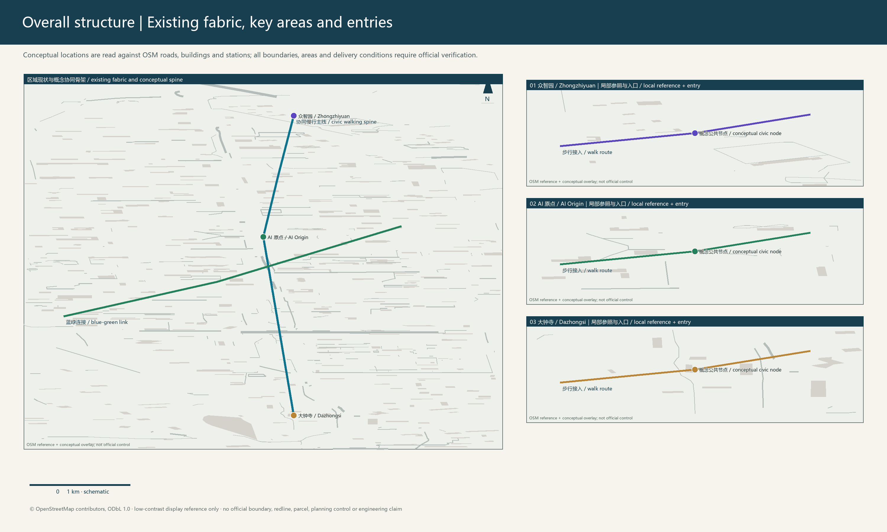
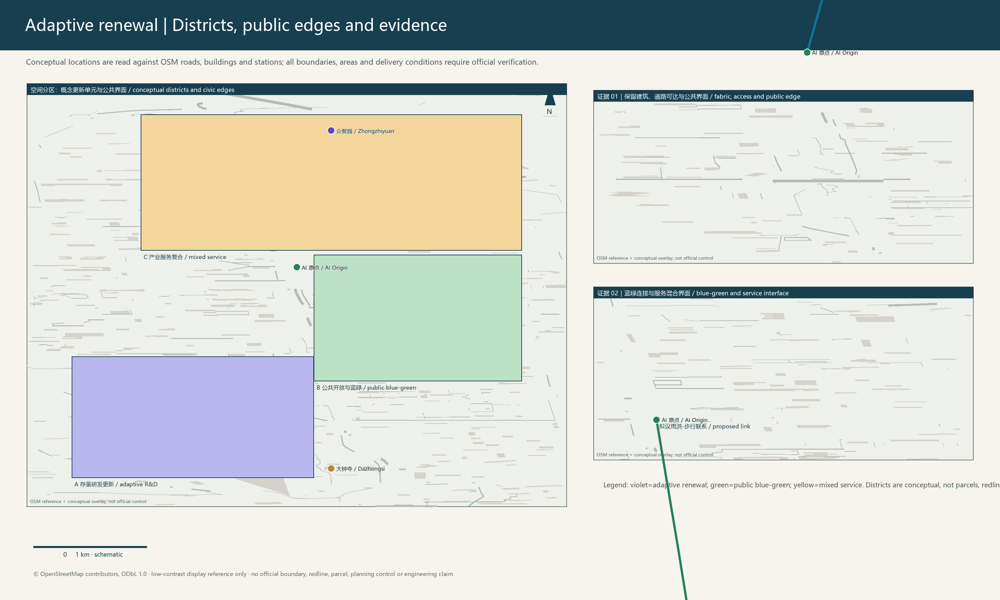
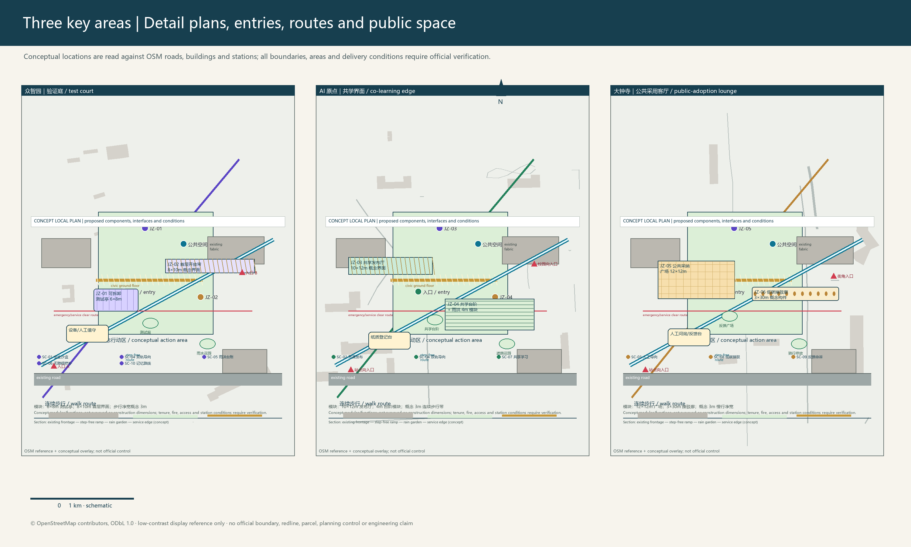
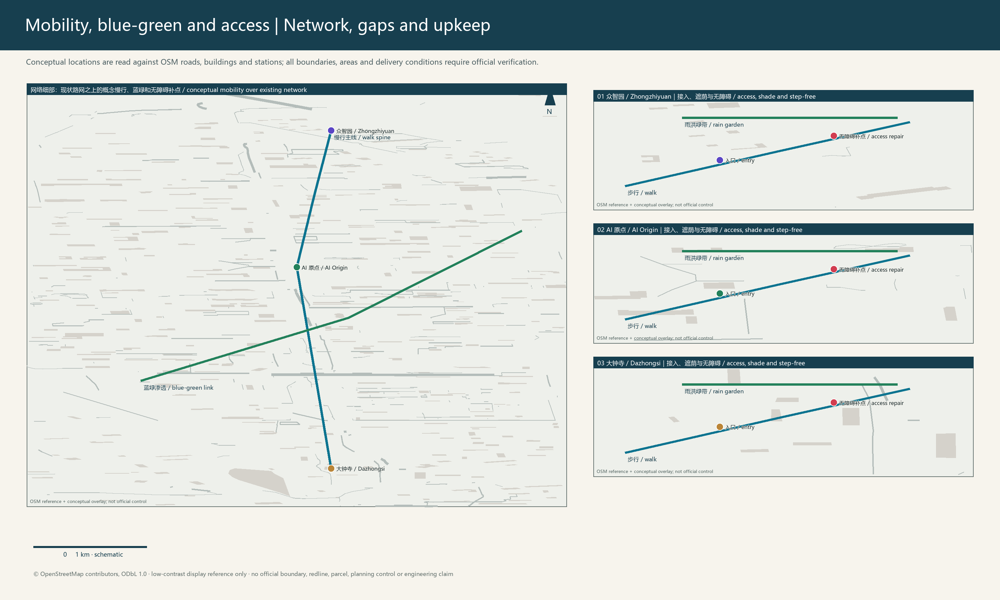
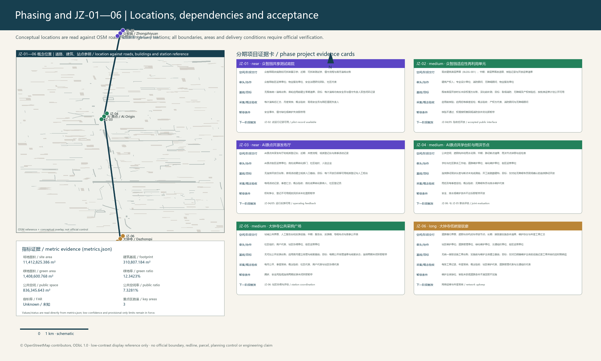
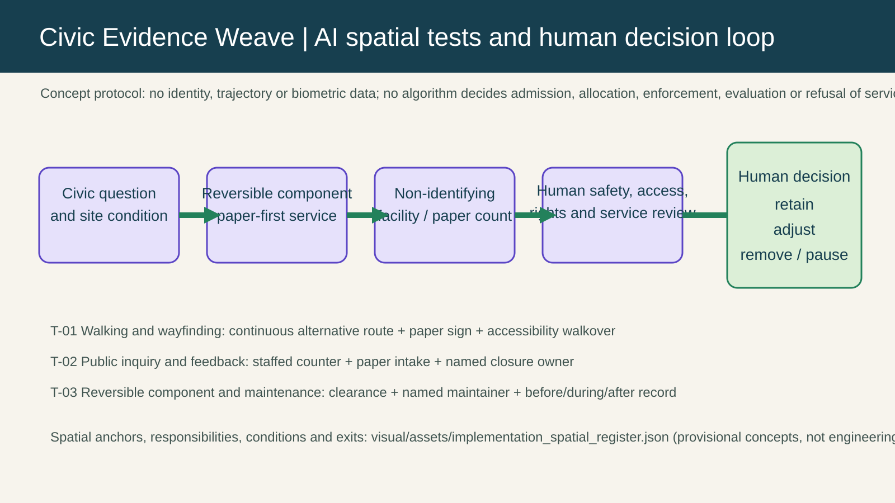
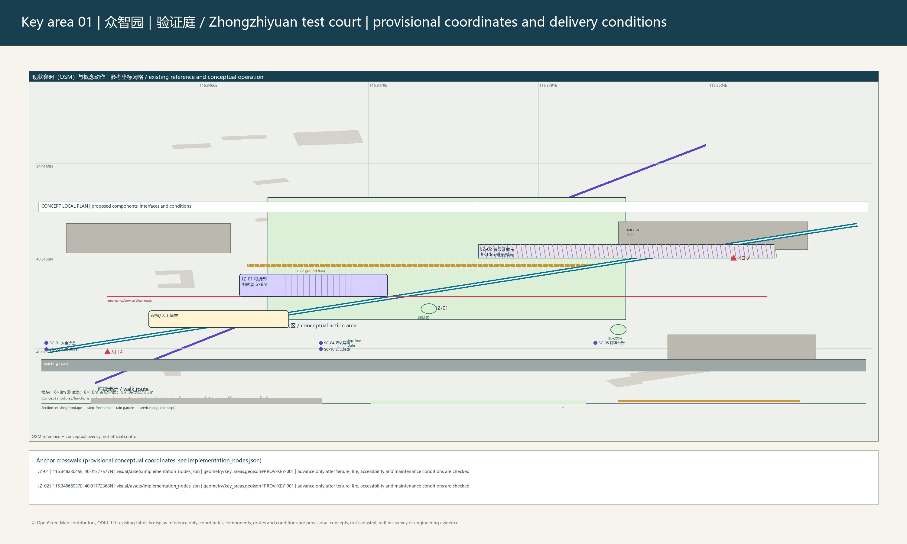
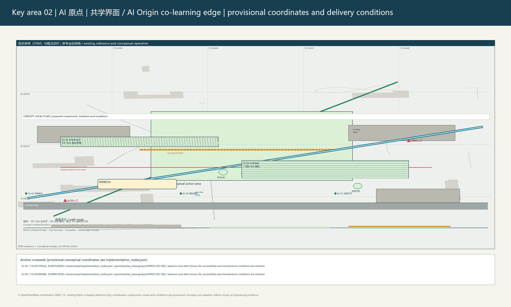
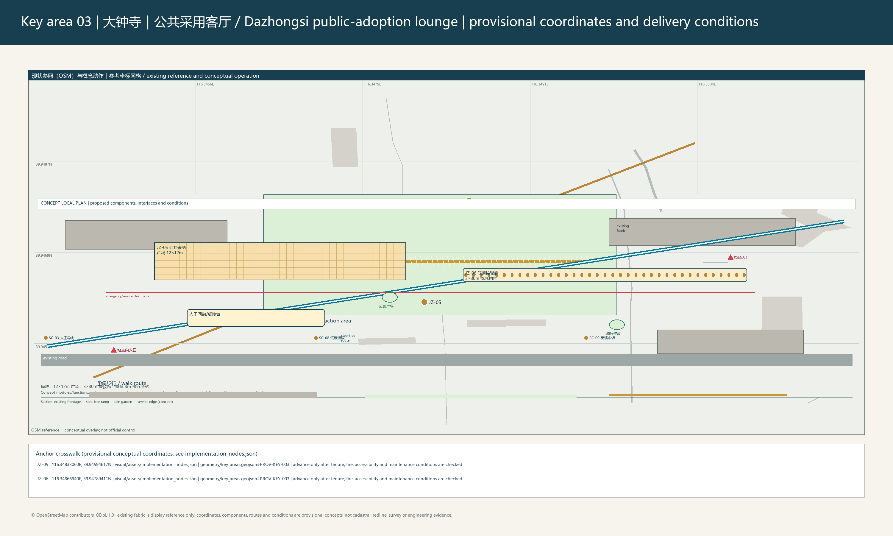

# Zhilian Symbiosis Network: Zero-carbon Collaborative Renewal Framework

## 1. Design basis, existing conditions and evidence boundary

The proposal treats the Jing-Zhang Heritage Park, campuses, industrial space, neighbourhoods and station-city interfaces as existing innovation infrastructure. Its focus is not a new statutory corridor or a promised construction quota, but adaptive reuse, repaired walking gaps, connected blue-green public space and reversible civic facilities. [source:OFFICIAL-ANNOUNCEMENT]

[source:AGENT-TASKBOOK]

[standard:PROJECT-OFFICIAL-ANNOUNCEMENT]

The submitted overall boundary and three key areas are provisional-only geometry. They support concept display and cross-checking, not statutory redlines, ownership, setting-out or approval. Submitted layers support the overall area [data:geometry/site_boundary.geojson#SITE-001], key-area references [data:geometry/key_areas.geojson#PROV-KEY-001] and building-footprint reference [data:geometry/buildings.geojson#BLDG-001]. Official boundaries, controls, road, ownership, fire, utility and heritage material must trigger a package-wide recalculation. [depth:existing_conditions_diagnosis]

[depth:risk_missing_data]

[source:SOURCE-REGISTRY]

## 2. Three-level coordination and overall spatial structure

At the strategic level, the framework links university research, open collaboration, enterprise conversion, civic experience and result return. At the overall-design level, “one spine, three hubs, two loops and multiple nodes” organises space. The spine is Jing-Zhang memory and civic space; the hubs are Zhongzhiyuan, Beijing AI Origin Community and Dazhongsi; the loops are a walking-service loop and a blue-green resilience loop. This is a conceptual method, not an additional control line. [depth:three_level_scope_framework]

[depth:overall_spatial_structure]

[standard:MOHURD-URBAN-DESIGN-MEASURES]

Land use, roads, green space, public space, buildings and phasing jointly express the overall proposal: [data:geometry/land_use.geojson#LU-001], [data:geometry/roads.geojson#ROAD-001], [data:geometry/green_space.geojson#GREEN-001] and [data:geometry/public_space.geojson#PUBLIC-001]. They are concept layers and do not replace engineering or regulatory controls. [depth:land_use_layout]

[depth:traffic_rail_slow_parking]

[depth:municipal_new_infrastructure]

[depth:blue_green_public_space]

## 3. Three key areas and existing-stock renewal

Zhongzhiyuan is a garden innovation-courtyard prototype: reusable building frames, shared ground-floor interfaces, reversible test pavilions, shade, rain gardens and a step-free loop. JZ-01 is a reversible shared test courtyard; JZ-02 proceeds only after ownership, fire, accessibility, structural and equipment checks.

Beijing AI Origin Community is a campus-city stitched-block prototype: continuous walking, pocket space, a shared launch hall and paper wayfinding connect campus, community, green space and station. JZ-03 provides offline registration and IP review; JZ-04 adds co-learning steps, shade and rainwater facilities. Dazhongsi is a station-city civic-living-room prototype: four-quadrant walking links, station frontage, renewed commercial ground floors and mixed green space support commuters, businesses and visitors. JZ-05 provides staffed feedback; JZ-06 advances only with station, road and maintenance confirmation. [data:geometry/key_areas.geojson#PROV-KEY-002]

[data:geometry/key_areas.geojson#PROV-KEY-003]

[depth:three_key_area_detailed_design]

[depth:retain_renovate_demolish]

[depth:height_massing_character]

No height, FAR, coverage, setback or demolition quantity is invented where formal controls are absent. These remain prerequisites for later work. [depth:development_intensity_controls]

[standard:MOHURD-CONTROL-DETAILED-PLANNING]

[standard:MOHURD-ARCH-DESIGN-DEPTH-2016]

## 4. Scenario governance, testing and inclusive service

Ten scenario cards bind AI use to a spatial carrier and human responsibility: the Zhongzhiyuan sandbox uses booking, a safety officer and an emergency stop; the AI Origin launch hall uses offline registration and IP review; Dazhongsi station-city service uses anonymous counts, staffed supervision and static wayfinding fallback. The register also covers dual-track wayfinding, rainwater maintenance, accessibility repair, shared learning, low-carbon transfer, public feedback and Jing-Zhang interpretation. It does not collect individual trajectories or substitute algorithms for public decisions. [standard:PROJECT-AGENT-OPEN-CALL-TASKBOOK]

T-01 tests shade, step-free continuity and paper wayfinding; T-02 tests rainwater facilities and maintenance; T-03 uses de-identified facility data, human review and appeal. A district operator coordinates an annual scenario week, maintenance day, joint review and results-return season with owners, schools, enterprises, communities and specialist maintenance teams.

## 4.1 Taskbook deliverables: global references, spatial translation and long-term public operation

Six global cases are used as checkable organisational and service references, not as development templates to be copied: Mila in Montreal for research-to-startup linkage, Vector in Toronto-Waterloo for talent circulation, Helsinki test environments for public trials, Singapore AI for trusted-deployment ecosystems, Seoul AI Hub for innovation-district demonstration, and the Alan Turing Institute for responsible-innovation networks. They respectively inform local release review, test courtyards, public service, a professional-service wing and human accountability. Each reference retains a public entry point, a local translation and a non-transfer boundary; none is used to infer local funding, firms, policy or partnerships. [source:AGENT-TASKBOOK]

The industry-space translation places research and open review in the AI Origin shared release hall, prototype testing in Zhongzhiyuan's bookable courtyard, service translation at the Dazhongsi station-city public interface, and a rotating clinic in the Zhongguancun Technology Service Wing as a reference carrier for IP, standards and prototype review. All four carriers are conceptual positions for professional teams to deepen; a trial can only be considered after venue permission, rights, maintenance and safety responsibilities are in place. The full case table, spatial mapping, public components, cultural signage and operating pathway are in `visual/assets/taskbook_deliverables.json`. [depth:renewal_project_list]

The three AI pilgrimage landmarks use removable, low-spectacle public interpretation: the Jing-Zhang Time Axis Portal is at a reference position along the heritage-park walking interface and links railway memory to daily public service; the Origin Open Index Table is at a reference position in the AI Origin shared hall and presents consented project abstracts and contribution records; the Dazhongsi Civic Feedback Ribbon is at a reference position on the station-city public interface and indicates staffed service, feedback and maintenance status. They are neither approved buildings nor art works, and they use no unlicensed archive, trademark, portrait or historical image. [standard:PROJECT-AGENT-OPEN-CALL-TASKBOOK]

Honor display does not substitute ranking for public value. A bilingual sign rail, contribution-ledger panel, human inquiry and feedback desk, removable shade-learning table, and quiet rain-garden edge form a maintainable component library. Every component has an update owner, paper fallback, accessibility requirement and removal trigger, allowing property holders, operators and professional teams to replace or stop it during deepening. The library grants no authority to alter any site. [depth:blue_green_public_space]

The cultural storyline proceeds from Jing-Zhang railway engineering memory, through Zhongguancun knowledge production and open collaboration, to an AI culture of human explanation, maintenance and feedback. Arrival, walking-story, open-contribution and service-feedback signs place that storyline on comprehensible everyday routes. The proposed bilingual copy prioritises public service and human judgement rather than using history as technology decoration; cultural, language, accessibility, copyright and site review remain necessary before use. [source:AGENT-TASKBOOK]

“JZ Commons / 京张共识场” is only a working name subject to trademark and naming review. Its reference annual cycle consists of an Open Brief Week in spring, a Responsible Prototype Week in summer, a Jing-Zhang Learning Walk and Contribution Display in autumn, and Maintenance and Evidence Review in winter. The developer community uses open briefs, a paper-first participation route, a rotating IP/standards clinic and named human review. The conversion pathway is limited to “public question -> reversible prototype -> evidence and maintenance review -> professional deepening or public knowledge archive -> pause or remove where conditions fail”; it does not announce investment, recruitment, procurement, policy or confirmed events. [standard:PROJECT-AGENT-OPEN-CALL-TASKBOOK]

## 5. Implementation, metrics and recalculation

JZ-01 to JZ-06 sequence near-term reversible pilots, medium-term renewal and long-term station connection. Each entry states carrier, lead, partners, dependencies, risks, KPI, collection, review and exit; none is a pre-existing commitment by a public authority, owner or operator. [data:geometry/phasing.geojson#PHASE-001]

[depth:renewal_project_list]

[depth:phasing_implementation]

Recalculated indicators are emitted from `metrics.json` as the sole source of truth: overall area, building footprint, and green space are traceable through the adjacent markers rather than duplicated as figures in narrative or drawings. [metric:site_area_sqm] [metric:building_footprint_area_sqm] [metric:green_space_area_sqm] Public space is traced through its own metric record. [metric:public_space_area_sqm]

The green and public-space ratios also read only from the metric file; their provisional boundary, formula, low confidence, and recalculation requirement when formal material arrives are reviewed with the corresponding metric records. [metric:green_ratio] [metric:public_space_ratio]

[metric:public_space_ratio], and three key areas [metric:key_area_count]. FAR, height, road redlines, facility capacity and industry performance remain unknown until official and operating data are available. [depth:metrics_recalculation]

[standard:MNR-LAND-USE-CLASSIFICATION-GUIDE]

## 6. Delivery boundary, risks and rights

The proposal uses minimal demolition, low-impact construction, replaceable components and maintainable civic space. Ownership, fire safety, accessibility, utilities, drainage, traffic, heritage and maintenance responsibility must be confirmed before implementation; otherwise an action remains research or stops. OSM-derived roads, buildings and stations are display context only. Copyright and attribution are recorded in `report/copyright_statement.md`; structured evidence is in the compliance, standard and design-depth matrices. [standard:MOHURD-URBAN-DESIGN-MEASURES]

## Design basis and source inventory

The work starts from the public announcement, taskbook, submitted provisional geometry, and traceable background road-and-building context. These materials have different authority: the announcement and taskbook define the call; provisional boundaries serve only presentation and recalculation; and OSM-derived background helps identify relative road, building, and station relationships. Accordingly, every spatial judgement is provisional, replaceable, and subject to professional verification; no background material is recast as an administrative control. [source:OFFICIAL-ANNOUNCEMENT]

[source:AGENT-TASKBOOK]

The team accordingly separates materials into three uses: evidence that explains the call; background that depicts relative spatial relationships; and control information that must be obtained again before deepening. The overall boundary, key-area extents, roads, and buildings are not ownership or approval findings. Area metrics describe only proportions among this package's geometries for internal comparison. Once official boundary, survey, regulatory-plan, fire-safety, and heritage materials arrive, the constraint layers must be replaced first, then metrics recalculated, boards updated, and the project list adjusted. This sequence prevents temporary data from hardening into design decisions. [data:geometry/site_boundary.geojson#SITE-001] [metric:site_area_sqm]

## Three-level scope framework

The coordinated-research level considers how an innovation network spans campus, industry, community, and rail interfaces; the overall-design level organises the continuity of walking, civic space, and existing-stock renewal; and the key-area level translates common methods into observable, reversible project prototypes. These are connected service relationships rather than additive statutory scales. [depth:three_level_scope_framework]

The three levels distinguish what different actors can address: the coordinated level sets cross-area collaboration and the cultural narrative; the overall level establishes continuity of public space and active travel; and the key-area level tests whether services can be maintained through small-scale projects. Use records from the key areas feed back into the overall level instead of enlarging a single pilot into a corridor-wide conclusion. The three submitted key areas are spatial samples for this feedback mechanism; their number and positions are checkable, but their boundary precision remains subject to later organiser material. [data:geometry/key_areas.geojson#PROV-KEY-001] [metric:key_area_count]

## Coordinated research area: industry and future city

Industry and future-city research does not substitute predicted output value for spatial judgement. It identifies conflicting time-based needs of researchers, students, residents, commuters, and small businesses. Shared releases, paper-and-digital dual-track wayfinding, bookable tests, and public feedback place AI capability in understandable civic-service routines with human review and appeal. [depth:existing_conditions_diagnosis]

Innovation activity must accommodate peak commuting, campus opening hours, neighbourhood quiet periods, and small-business operating rhythms. The proposal therefore does not treat a single "smart" device as the answer; it locates release, learning, display, rest, and feedback at walkable public interfaces. Scenario cards record service users, human responsibility, data minimisation, and exit conditions, enabling operators to compare use across time periods. Judgements on industrial capacity, talent scale, and fiscal inputs remain pending continuous operating data. [standard:PROJECT-AGENT-OPEN-CALL-TASKBOOK]

## Overall design: renewal and regulatory-plan urban design

The overall design begins with relationships among existing roads, buildings, green space, and public space. It prioritises repairing walking discontinuities, improving ground-floor interfaces, and linking stormwater nodes. The depicted land use and spatial networks are conceptual renewal directions; only after formal regulatory planning, ownership, road-redline, and facility-capacity information is available can they become legally effective specialist outputs. [depth:overall_spatial_structure]

[standard:MOHURD-CONTROL-DETAILED-PLANNING]

The design seeks low-conflict connections within the existing network: accessible ground floors, existing green edges, and pedestrian paths form a continuous service chain rather than new large masses overriding the inherited fabric. Land-use layers express functional relationships, building layers identify checkable renewal objects, and phasing layers explain dependencies. They create neither FAR, setback, nor road-redline controls; when formal controls are available, planning, architecture, transport, and municipal disciplines must jointly verify implementability. [data:geometry/land_use.geojson#LU-001] [data:geometry/buildings.geojson#BLDG-001]

## Detailed design for key areas

Each key area follows one control logic: verify existing-stock usability, trial civic service first, and withdraw if conditions fail. Zhongzhiyuan focuses on courtyard-based innovation collaboration, Beijing AI Origin Community on campus-city walking continuity, and Dazhongsi on a station-city civic living room. The three form a comparable pilot set through common accessibility, shade, maintenance, and feedback principles. [depth:three_key_area_detailed_design]

Detailed design remains at the conceptual-plan and node-strategy level. Each prototype identifies entry conditions, reversible components, public-service interfaces, and maintenance responsibility, but does not replace structural, fire-safety, or construction documentation. Zhongzhiyuan first tests the open boundary of its shared courtyard; AI Origin first tests continuous campus-city walking; and Dazhongsi first tests staffed station-front service and static wayfinding. All three use accessibility, shade, stormwater, and human feedback as observable elements for comparative professional assessment in the next stage. [data:geometry/key_areas.geojson#PROV-KEY-002]

## AI ecosystem, talent profile and AI-enabled scenarios

The innovation ecosystem is not a single-enterprise park, but a cooperative network used by researchers, start-up teams, public-service staff, residents, commuters, and visitors. Ten scenario cards constrain algorithmic use through booking, safety officers, offline registration, anonymous aggregation, paper wayfinding, and human appeal, so technical trials remain answerable to everyday order, privacy, and maintenance capacity. [standard:PROJECT-AGENT-OPEN-CALL-TASKBOOK]

The talent profile is not a population forecast but a design tool for roles and responsibilities. Researchers need spaces for exchange, release, and testing; students need accessible learning and display opportunities; residents need quiet, safe, appealable public service; and commuters need clear guidance without compelled data capture. Scenarios use anonymous aggregation and staffed supervision rather than individual trajectories. Each trial should disclose observations, maintenance burden, and reasons for exit so technical capability remains subordinate to public value and daily usability. [depth:renewal_project_list]

## Land use, building scale and retain-renovate-demolish approach

Land-use and building layers identify reusable frames, ground-floor interfaces that can improve, and opportunities to connect public space. The proposal does not derive demolition quantities, building floor area, or new capacity from these layers. Adaptive reuse requires professional structural, fire-safety, equipment, accessibility, and ownership verification; unverified work remains a research recommendation. [depth:retain_renovate_demolish]

Land-use and building representation first serves existing-stock reuse decisions: it identifies interfaces that may open, spaces suited to short-term tests, and areas that must await verification. Building footprints show only a geometry set within the submitted scope and cannot be converted into total floor area or demolition-and-construction quantities. Final retain/renovate/demolish decisions require structural safety, fire evacuation, equipment condition, tenancy, and heritage-impact review jointly confirmed by rights holders and professionals. Unmet prerequisites trigger a project pause or a shift to non-physical service. [metric:building_footprint_area_sqm]

## Transport, rail, utilities and public facilities

The transport strategy prioritises continuous walking, station transfer, and static wayfinding; it avoids inventing road, rail, parking, utility, or drainage engineering where governing data are absent. Stormwater, lighting, communications, and service facilities are expressed only as maintainable layout principles. Pipeline capacity, drainage capacity, rail interfaces, and operating responsibility require joint review with relevant bodies in the next stage. [depth:traffic_rail_slow_parking]

The organisation follows "people before vehicles, continuity before speed": walking-gap repair, shaded rest, crossing prompts, and static wayfinding improve access between station, city, and neighbourhood. Road layers represent existing reference and conceptual connections only; they do not establish right-of-way, lane counts, or parking supply. Municipal systems likewise favour maintainability and replaceability. Power, communications, stormwater and wastewater, fire-safety, and rail interfaces must be checked against specialist material in the next stage, so display drawings do not substitute for engineering coordination. [data:geometry/roads.geojson#ROAD-001]

## Blue-green space, civic space and urban character

Rain gardens, shade, pocket spaces, and continuous walking form a daily blue-green network. Green and public-space areas come from provisional geometry recalculation and express internal proportions, not formal targets. Character work coordinates Jing-Zhang memory, existing interfaces, and replaceable elements without asserting height or massing controls. [depth:blue_green_public_space]

[metric:green_ratio]

Blue-green space is treated as composite civic infrastructure that reduces heat stress, receives rainwater, and supports dwell time. Rain gardens, tree shade, pocket plazas, and active-travel paths are assembled into a continuous experience rather than treating green ratio as an isolated target. Current calculations compare relative layer coverage only and cannot serve as approval indicators; public-space quality also depends on opening hours, lighting, cleaning, and maintenance funds. The character strategy respects Jing-Zhang memory and existing interfaces and avoids rigid form requirements where height and heritage material are absent. [data:geometry/green_space.geojson#GREEN-001] [data:geometry/public_space.geojson#PUBLIC-001]

## Renewal project list, policy and phasing

JZ-01 to JZ-06 proceed in layers: reversible pilots, renewal once conditions mature, and station-city connections requiring multi-party coordination. Each project is a minimum delivery unit defined by spatial carrier, lead role, collaborators, risks, observation metrics, and exit conditions. Annual scenario weeks and maintenance days feed trial results into later adjustment rather than replacing statutory approval. [depth:phasing_implementation]

Phasing follows risk and dependency rather than a simple timetable. Near-term projects select removable, low-impact services maintainable by named actors; medium-term projects require ownership, fire-safety, and accessibility verification; long-term items such as station-city connections require joint confirmation from road, station, and maintenance bodies. Each project has observation metrics, review cycles, and exit conditions. The phasing layer depicts this dependency order and does not represent public investment or an existing construction commitment. [data:geometry/phasing.geojson#PHASE-001]

## Indicators, area recalculation and compliance matrices

### JZ-01—06 acceptance loop

The delivery register binds each project’s spatial reference, phase deliverable, lead role, and collaborators on one project card. Where comparable operational material does not exist, the baseline is explicitly recorded as a data gap and a zero-period log is established through the first event, pre-opening walkover, or maintenance agreement. Concept-module dimensions and provisional-geometry areas are therefore not presented as existing performance. The proposed review thresholds are auditable conditions: JZ-01 requires a dual-signed record for every drill; JZ-02 requires ownership, fire-safety, and accessibility verification before opening; JZ-03 retains paper registration and a staffed counter at every open day; JZ-04 opens only a step-free route confirmed on site; JZ-05 publishes receipt and closure status for each period; and JZ-06 records work orders only for facilities with a named maintainer and responds within the agreed time.

Collection frequency and conceptual acceptance roles are likewise stated per project: after each drill/monthly; pre-opening/quarterly; each event/quarterly; after rain and quarterly; monthly/quarterly; and each work order/annual, respectively. They are checked by a safety officer and duty manager; owner with fire and access advisers; university and community registration staff; access specialist with drainage-maintenance representative; community, merchant, and station-area representatives; and station-area, road, and traffic-maintenance representatives. These are proposed responsibility allocations, not claims of an existing mandate; phase deliverables must be reviewed together with the pause conditions. [data:visual/assets/implementation_register.json]

The indicator system reports only areas, ratios, building footprints, and key-area counts that submitted geometry can recalculate, retaining formulas, units, source files, and confidence in the metrics file. Overall area, green ratio, and public-space ratio must be recalculated together when official boundaries arrive. Compliance, standard, and design-depth matrices audit coverage relationships; they do not perform planning approval or performance assessment. [depth:metrics_recalculation]

[metric:site_area_sqm]

The system separates facts recalculable from submitted geometry from control indicators still awaiting official material. Overall area, building footprint, green space, and public space carry formula, unit, source, and low-confidence disclosures; FAR, building height, road redlines, and facility capacity are explicitly pending. The matrices map call requirements, professional standards, and delivery depth to narrative, layers, and boards for traceability without expanding their evidentiary force. After every boundary replacement, all areas and ratios must be recalculated as one batch. [metric:public_space_ratio] [metric:public_space_area_sqm]

## Risks, rights and compliance

Risk control begins by stating missing materials, unconfirmed delivery conditions, and public judgements that algorithms cannot replace. All OSM-derived background is display reference only and carries the applicable attribution. Every spatial facility requires ownership, fire-safety, heritage, transport, accessibility, utility, drainage, and maintenance responsibility confirmation before implementation. [depth:risk_missing_data]

The risk principle is "disclose first, implement later." For unresolved ownership, fire safety, utilities, drainage, traffic organisation, accessibility, and heritage matters, neither a rendering nor a conceptual name substitutes for professional judgement. OSM-derived roads, buildings, and stations remain display reference with source and licence boundaries in the copyright statement. Every physical facility requires a confirmed maintenance role, service users, and a stop condition; if these conditions cannot be met, it returns to a research recommendation or the pilot is paused. [source:OSM-VISUAL-CONTEXT]

## References

The accompanying structured files retain sources, assumptions, metric formulas, layer attributes, and standard responses. The narrative keeps only evidence markers adjacent to the relevant design judgement, so readers can first understand the spatial logic and then trace its material boundary; new material must likewise undergo source-use and precision-boundary review before entering the proposal.

Readers can trace each nearby marker to a source, layer, metric, or standard record. Source files record licence and applicable scope; geometry files record spatial objects and precision; metric files record formulas and confidence; and matrices record task coverage. This division avoids filling the narrative with machine indexes while allowing subsequent data updates to be independently recalculated. For control material not yet obtained, the reference system records its absence and replacement order rather than treating it as an implicit design fact. [source:SOURCE-REGISTRY]

## Reviewable call supplement (v2.0.1)

This supplement turns the three positions, five functions, three areas and two wings into reviewable conceptual working relationships. It does not present directions in the call as approved spatial controls. The three positions correspond to: a historic-civic base made of walking and public interpretation at the Jing-Zhang Heritage Park; a knowledge-cooperation interface of research, standards and translation advice along the Zhongguancun Technology Service Wing; and a daily verification interface of low-impact trials, stormwater maintenance and non-digital service along the Xiaoyuehe Scenario Wing. The five functions are open research, prototype testing, civic service, cultural interpretation and maintenance feedback. Each must be tied to removable components, a named human responsibility, a paper or in-person fallback, and a pause condition. The three areas are the Zhongzhiyuan shared test courtyard, AI Origin public release hall and Dazhongsi station-city civic interface. The two wings remain conceptual knowledge-service and scenario-verification routes; any external cooperation requires later confirmation of actors, venues, rights and funding. [source:OFFICIAL-ANNOUNCEMENT] [source:AGENT-TASKBOOK]

The proposal uses “智链共生网 / Zhilian Symbiosis Network” as a provisional working name and proposes a non-registered identity direction: two open walking lines surround an index point that may be completed by hand, expressing the meeting of historic memory and contemporary knowledge through civic service. It is not an institutional logo, government identity, or trademark application. Wayfinding, colour, type, and international copy may be made only after cultural, accessibility, rights, and name-clearance review. Regional relations express only an intention for open questions, public knowledge, and professional review to circulate; they do not presume an established partnership with any park, university, enterprise, or public body. [data:visual/assets/taskbook_deliverables.json]

### Five user groups and the scenario-space-operation correspondence

| User group | Principal barrier | Conceptual spatial and service response | Non-digital / appeal safeguard | Observation and pause condition |
| --- | --- | --- | --- | --- |
| Researchers and start-up teams | Unclear trial information and rights boundary | Bookable test table and staffed safety desk at Zhongzhiyuan | Paper registration, human rights explanation and complaint referral | Do not open without venue permission and a completed safety checklist |
| Students and young learners | Lack of a low-threshold learning interface | AI Origin open index table and learning walk | In-person explanation, paper guide and safeguarding rule | Pause activity where no duty staff or clear risk notice is present |
| Residents, older people, carers and non-digital users | Digital exclusion and barriers to routes or feedback | Human inquiry/feedback desk and quiet rain-garden edge | Seated counter, plain-language form, paper comment and closure reply | Do not replace service with digital-only access where a paper or accessible alternative is absent |
| Commuters and visitors | Direction, crowding and language barriers at station-city transfer | Dazhongsi paired static-digital wayfinding | Bilingual static sign, staffed enquiry and low-glare prompt | Do not install or redirect movement without station, road and maintenance confirmation |
| Small merchants and frontline service workers | Event disruption and unclear maintenance responsibility | Removable shade-learning table and public maintenance board | Offline comments, maintenance contact and correction record | Remove components where no maintainer, fire clearance or service coordination is confirmed |

The table collects no identity, trajectory, biometric, or identifiable behavioural data. These user groups test whether space and service provide equivalent access, human explanation, and appeal/correction; they cannot be used for automated scoring, admission ranking, or commercial profiling. Locations, responsibilities, frequencies, and exit conditions for JZ-01–06 remain governed by the delivery register and require on-site verification before they become a next-stage task. [data:visual/assets/taskbook_deliverables.json] [data:visual/assets/implementation_register.json]

### Human-controlled AI scenario operating loop

The proposal neither deploys nor promises an existing AI system. Its operating architecture describes only a minimum loop that a future professional team could review: people first define a civic question and usable spatial conditions; only non-identifying facility status, paper-comment counts, or consented project abstracts may then be recorded; safety, accessibility, rights, and on-site service staff jointly decide whether a reversible trial may proceed; and human-confirmed maintenance, complaint, and pause records enter a public evidence pack. An algorithm cannot independently decide admission, allocation, enforcement, evaluation, or refusal of service. When data quality, rights, site safety, or service continuity is not satisfied, the responsible person must stop, remove, or return the matter to a research recommendation.

“Civic Evidence Weave” is the proposal’s spatial operating prototype, not a product name or an existing platform. A reversible component enters a short trial only when it contains a visible condition card, paper-first service channel, named human reviewer, and removal route together. Its purpose is not to replace public judgement with an algorithm, but to close civic question, spatial condition, non-identifying facility observation, and human decision in one place and one record. It turns testing, service, and upkeep across the three key areas from a list of disconnected activities into a shared process that can retain, adjust, or remove a component. [data:visual/assets/ai_spatial_evaluation_matrix.json] [data:visual/assets/implementation_spatial_register.json]

Three conceptual test protocols check that boundary. T-01, “walking and wayfinding”, is walked before an activity by an accessibility specialist and on-site service staff; it stops where a continuous alternative route is not recorded. T-02, “public inquiry and feedback”, is paper- and in-person-first; no digital comment is collected without a named closure owner. T-03, “removable prototype”, is recorded before opening, during operation, and after removal by a safety officer, rights reviewer, and maintenance representative; a missing record pauses the trial and preserves its reason. A test record can show only whether conditions for that conceptual activity were met. It cannot infer individual capability, area demand, or project performance. [data:visual/assets/taskbook_deliverables.json] [data:visual/assets/implementation_register.json]

The three protocols use one evaluation structure: spatial hypothesis, zero-period check, non-identifying observation, human decision, retain, adjust, and remove/pause. T-01 tests paper-plus-staffed wayfinding and a continuous alternative route; T-02 tests staffed counter, paper intake, and closure responsibility; T-03 tests component clearance, maintenance ownership, and full-cycle records. A professional team may deepen a next iteration within the same provisional conceptual scope only when records show that conditions persist. Any missing element first triggers a pause or return to a research recommendation, not expanded collection or automated decision-making. [data:visual/assets/ai_spatial_evaluation_matrix.json]

### Independent key-area sheets and anchor crosswalk

Three supplementary sheets separate the key areas from the combined panel into individual, A3-reading-scale conceptual details. Each uses its provisional key area as a frame and identifies OSM existing-display reference, the conceptual action area, entries, continuous walking, civic ground-floor edge, fire/service clearance, step-free route, and JZ project locations. The crosswalk below each sheet gives its ID, longitude/latitude, references to `implementation_nodes.json` and `key_areas.geojson`, and conditions that must be checked before a next stage. Coordinates are only for internal cross-checking within this package; they cannot substitute for an existing survey, tenure, road redline, station-city interface, or engineering design. [data:visual/assets/implementation_nodes.json] [data:geometry/key_areas.geojson#PROV-KEY-001]

To avoid a break between what is visible on a board and what can be traced in data, the spatial implementation register places 16 JZ/SC anchors together with three-area entries, continuous step-free routes, fire/service clearances, and action-area boundaries in one provisional GeoJSON. Each element carries its key area, board page, delivery-register reference, conceptual dimensional basis, or check required before a next stage. All elements are replaced and rerendered as a whole once formal survey, tenure, road, station-city, fire, accessibility, drainage, or maintenance material becomes available. The register adds no construction commitment and does not represent a conceptual route as an existing passage or control line. [data:visual/assets/implementation_spatial_register.json]

