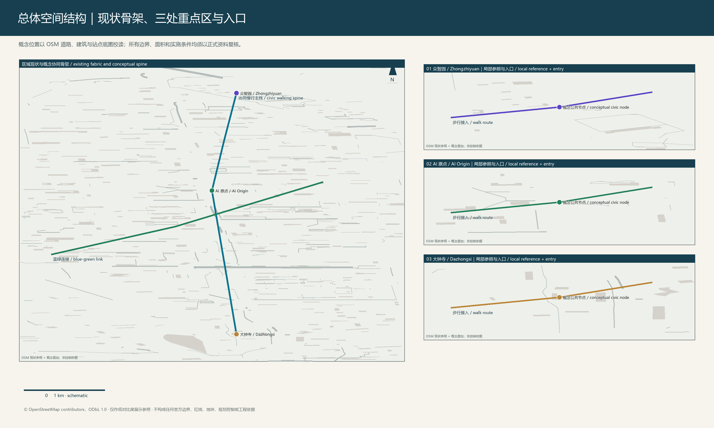
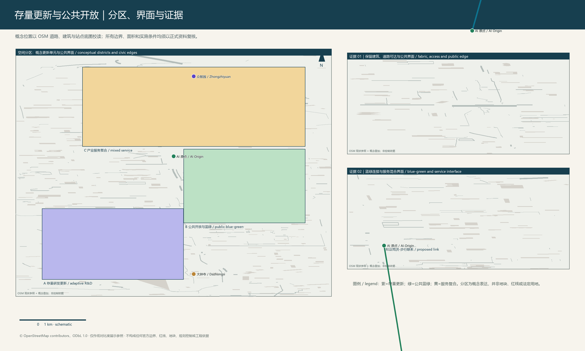
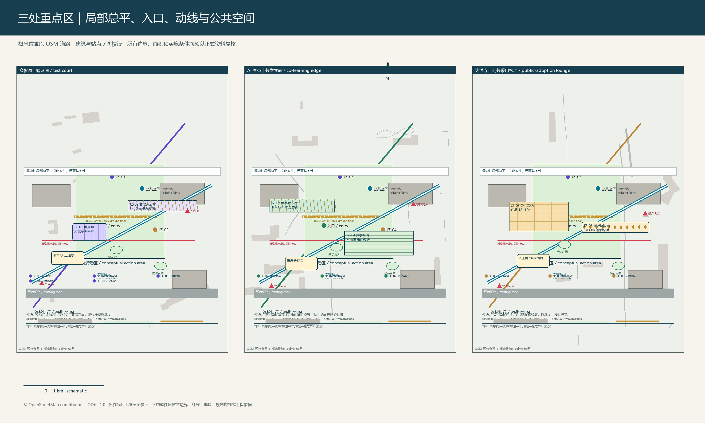
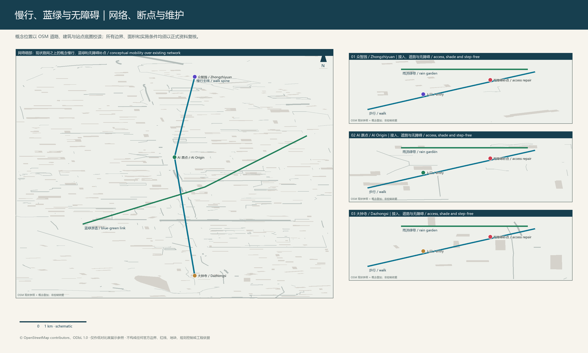
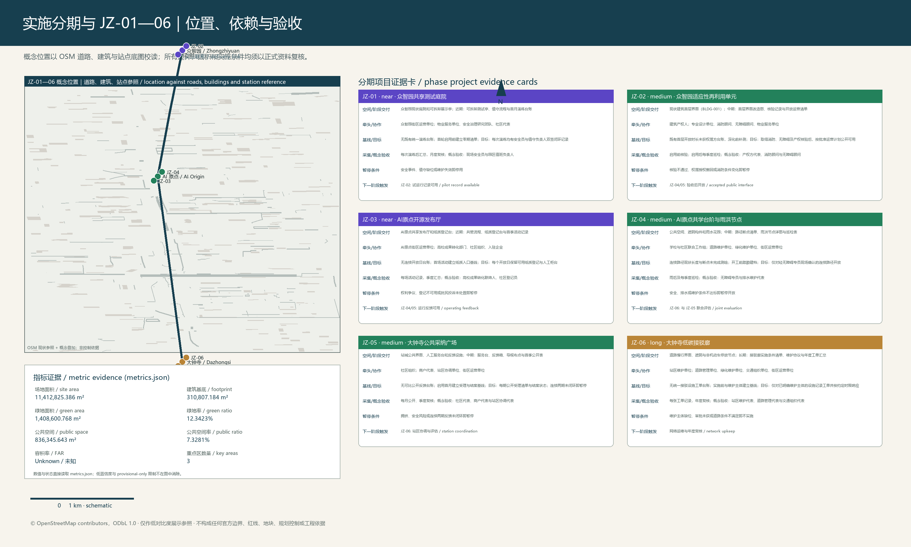
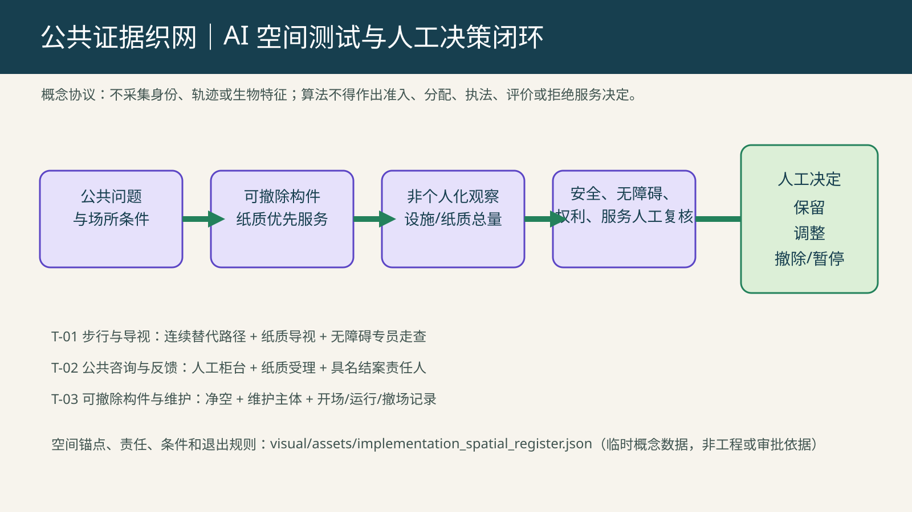
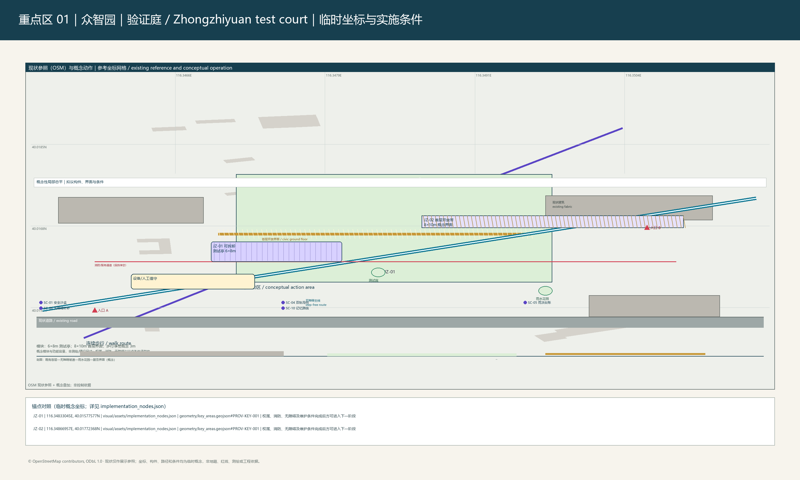
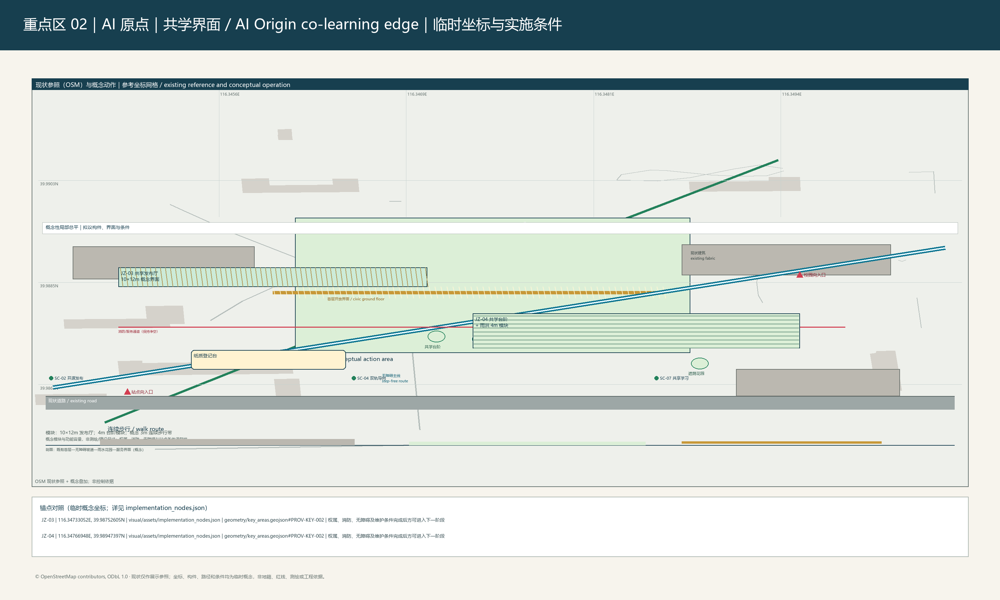
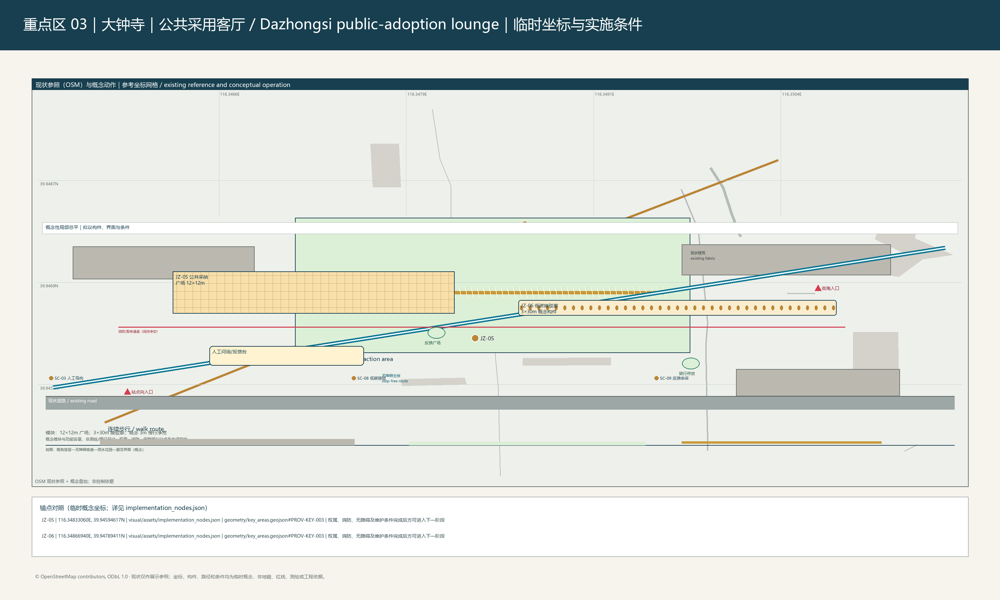

# 智链共生网：百年京张 AI 创新带零碳协同更新框架

## 1. 设计依据、现状判断与证据边界

本方案将京张遗址公园、校园、产业空间、社区与轨道站城界面理解为一套既有的创新基础设施。更新重点不是新增一条法定走廊或承诺建设规模，而是以存量建筑适应性再利用、步行断点修补、蓝绿公共空间连通和可拆卸服务设施，使研发、转化、通勤、居住与公共服务能够在同一日常网络中协同运行。[source:OFFICIAL-ANNOUNCEMENT]

[source:AGENT-TASKBOOK]

[standard:PROJECT-OFFICIAL-ANNOUNCEMENT]

提交包中的总体边界和三处重点区均为 provisional-only 几何。它们可用于概念表达、相互校核和后续替换，却不是法定红线、权属界线、工程放线或审批依据。面积与比例来自所提交图层的投影复算：总体范围 [data:geometry/site_boundary.geojson#SITE-001]、重点区 [data:geometry/key_areas.geojson#PROV-KEY-001]、建筑参照 [data:geometry/buildings.geojson#BLDG-001]。收到官方边界、控规、道路、权属、消防、管线和文保资料后，应同步重算图层、指标、图纸与网页。[depth:existing_conditions_diagnosis]

[depth:risk_missing_data]

[source:SOURCE-REGISTRY]

## 2. 三层协同与总体空间结构

统筹研究层提出“高校策源—开源协作—企业转化—公共体验—成果回流”的创新链；总体设计层以“一脉三核、双环多点”组织空间；重点区层以可实施项目验证方法。“一脉”是京张记忆与公共空间主轴，“三核”为众智园、北京 AI 原点社区和大钟寺，“双环”为步行服务环与蓝绿韧性环。该结构是概念性组织方法，并不增加法定控制线。[depth:three_level_scope_framework]

[depth:overall_spatial_structure]

[standard:MOHURD-URBAN-DESIGN-MEASURES]

总体设计图层以用地、道路、绿地、公共空间、建筑和分期共同表述：用地结构见 [data:geometry/land_use.geojson#LU-001]，慢行与站城接驳见 [data:geometry/roads.geojson#ROAD-001]，蓝绿关系见 [data:geometry/green_space.geojson#GREEN-001]，公共空间见 [data:geometry/public_space.geojson#PUBLIC-001]。它们表达的是本次概念方案的空间关系，不能替代道路红线、设施专项或工程设计。[depth:land_use_layout]

[depth:traffic_rail_slow_parking]

[depth:municipal_new_infrastructure]

[depth:blue_green_public_space]

## 3. 三处重点区与存量更新策略

众智园采用“花园型创新庭院”原型：保留具备继续使用条件的建筑框架，将首层界面转换为共享大厅、展示和公共服务界面；庭院以可拆卸测试亭、遮阴、雨水花园与无障碍环线承接安全治理与开放测试。JZ-01 为可逆的共享测试庭院；JZ-02 仅在权属、消防、无障碍、结构和设备核验完成后进入适应性再利用。

北京 AI 原点社区采用“校城缝合街区”原型：以连续步行、口袋广场、共享发布厅和纸质导视连接校园、社区、绿地与站点。JZ-03 通过线下登记和知识产权复核组织开源发布；JZ-04 以共学台阶、遮阴和雨洪节点补足日常公共空间。大钟寺采用“站城公共客厅”原型：以四象限步行联系、站前界面、商业首层更新和复合绿地服务通勤者、商户与访客；JZ-05 组织人工服务与反馈，JZ-06 在站方协调、道路和维护条件具备后实施低碳接驳廊。[data:geometry/key_areas.geojson#PROV-KEY-002]

[data:geometry/key_areas.geojson#PROV-KEY-003]

[depth:three_key_area_detailed_design]

[depth:retain_renovate_demolish]

[depth:height_massing_character]

不在正式控制资料缺失时虚构高度、容积率、覆盖率、退线或拆建数量；这些事项列为深化前置条件。现有建筑、公共空间和道路图层仅支持更新策略与项目定位，不能形成工程量或审批结论。[depth:development_intensity_controls]

[standard:MOHURD-CONTROL-DETAILED-PLANNING]

[standard:MOHURD-ARCH-DESIGN-DEPTH-2016]

## 4. 场景治理、测试与包容性服务

十张场景卡以具体空间载体和人工责任约束算法使用：众智园安全治理沙盒以预约、现场安全员和安全停机为边界；AI 原点开源发布厅以线下登记和知识产权复核为边界；大钟寺站城服务以匿名客流、站点值守和静态导视兜底为边界。其余场景覆盖纸质与数字双轨导向、雨洪维护、无障碍修补、共学时段、低碳接驳、公共反馈和京张记忆解释；不采集个人轨迹，不以算法替代公共决策。场景、运营人、数据边界、验收口径和退出条件均记录在 `visual/assets/implementation_register.json`。[standard:PROJECT-AGENT-OPEN-CALL-TASKBOOK]

三套测试协议将概念转化为可审查的运营动作：T-01 检查遮阴、无障碍连续性和纸质导视；T-02 检查雨洪设施、替换周期和维护劳动；T-03 以去标识化设施数据和人工申诉处理公共服务情景。年度公开场景周、维护日、联合评审日和成果回流季由街区运营单位协调，产权人、学校、企业、社区与专业维护单位按项目承担责任。

## 4.1 任务书交付：全球案例、空间转译与长期公共运营

六个全球案例被作为可核查的组织与服务参考，而非可直接复制的开发模板：蒙特利尔 Mila 的研究—创业连接、多伦多—滑铁卢 Vector 的人才循环、赫尔辛基测试环境的公共试验、新加坡 AI 的可信部署生态、首尔 AI Hub 的创新区展示，以及 Alan Turing Institute 的负责任创新网络，分别对应本地的发布复核、测试庭院、公共服务、专业服务翼与人工问责机制。每项案例保留公开入口、转译动作和不适用边界；不以其推导本地资金、企业、政策或合作关系。[source:AGENT-TASKBOOK]

产业—空间转译把研究与开放复核放在 AI 原点共享发布厅，把原型测试放在众智园可预约庭院，把服务转译放在大钟寺站城公共界面，并以中关村科技服务翼的轮值诊所作为知识产权、标准与原型评议的参考载体。四类载体均为可供专业团队深化的概念定位，只有在场地许可、权利、维护和安全责任具备后才可能开展相应试行。完整案例表、空间映射、公共构件、文化导视和运营路径见 `visual/assets/taskbook_deliverables.json`。[depth:renewal_project_list]

三个“AI 朝圣地标”均采用可拆卸、低炫耀度的公共解释方式：京张时间轴门廊位于遗址公园步行界面的待核验参考位置，串联铁路记忆与日常公共服务；原点开放索引台位于 AI 原点共享厅的参考位置，展示经同意的项目摘要和贡献记录；大钟寺城市反馈灯带位于站城公共界面的参考位置，提示人工服务、反馈与维护状态。它们不是已获准的建筑或艺术工程，也不使用未经许可的档案、商标、肖像或历史图像。[standard:PROJECT-AGENT-OPEN-CALL-TASKBOOK]

荣誉展示不以排名替代公共价值：双语标识轨、贡献台账板、人工问询与反馈台、可移除遮阴共学桌、安静雨水花园边缘构成可维护组件库。每一组件设有更新责任、纸质兜底、无障碍要点和撤除触发条件，便于产权人、运营方和专业团队在深化阶段替换或停止使用。组件库不构成对任何场地改造的授权。[depth:blue_green_public_space]

文化叙事由“京张铁路的工程记忆—中关村的知识生产与开放协作—AI 新文化的人类解释、维护与反馈”依次展开；抵达、步行故事、开放贡献和服务反馈四类标识把叙事落实在可理解的日常路径上。建议的中英对照文案强调公共服务和人类判断，不将历史作为科技装饰，且须经文化、语言、无障碍、版权和场地审查后方可使用。[source:AGENT-TASKBOOK]

“JZ Commons／京张共识场”仅是待商标与命名核验的年度活动工作名。其参考周期包括春季公开命题周、夏季负责任原型周、秋季京张学习步行与贡献展示、冬季维护与证据复核；开发者社区以公开命题、纸质可参与入口、轮值知识产权／标准诊所和具名人工评议组织。转化路径被限定为“公共问题—可退出原型—证据与维护复核—专业深化或公共知识归档—不满足条件即暂停或撤除”，不包含招商、投资、采购、政策或活动已确定的表述。[standard:PROJECT-AGENT-OPEN-CALL-TASKBOOK]

## 5. 项目实施、指标与复算

JZ-01 至 JZ-06 形成由近及远的实施序列：可逆庭院与发布厅先行；建筑适应性再利用、共学雨洪节点和公共采纳广场在许可与维护条件明确后推进；站城低碳接驳廊须以道路、站点、排水和维护主体条件为前提。每个项目均明确空间载体、牵头方、协作方、依赖、风险、验收 KPI、采集方法、复核周期与退出条件；它们不是对政府、产权人或运营方的既成承诺。[data:geometry/phasing.geojson#PHASE-001]

[depth:renewal_project_list]

[depth:phasing_implementation]

复算指标仅由 `metrics.json` 作为单一真源输出：总体面积、建筑基底与绿地以相邻指标标记追溯，不在正文或图纸中复制数值。 [metric:site_area_sqm] [metric:building_footprint_area_sqm] [metric:green_space_area_sqm] 公共空间另由其指标记录追溯。 [metric:public_space_area_sqm]

绿地率与公共空间率同样只读取指标文件；其临时边界、公式、低置信度与正式资料到位后的复算要求均随指标记录一并审阅。 [metric:green_ratio] [metric:public_space_ratio]

[metric:public_space_ratio]；三处重点区的数量为 3 [metric:key_area_count]。这些值均为临时几何复算值，不能据此形成法定面积、强度或考核承诺。容积率、建筑高度、道路红线、设施容量和产业绩效仍为 unknown，等待正式资料与运营数据。[depth:metrics_recalculation]

[standard:MNR-LAND-USE-CLASSIFICATION-GUIDE]

## 6. 实施边界、风险与权利说明

方案遵循最小拆改、低影响施工、可替换部件和可维护公共空间的原则。每个实体设施均须在实施前补齐权属、消防、无障碍、管线、排水、交通组织、文保和维护责任；条件不成立时保留为研究建议或停止试点。图纸中的空间关系、名称、图标和文字均为投稿方概念表达，背景道路、建筑和站点资料仅作 OSM 衍生的展示参考，版权与署名边界见 `report/copyright_statement.md`。标准与任务覆盖的结构化审计见 `compliance_matrix.json`、`standard_matrix.json`、`design_depth_matrix.json`，不应被误读为任何审批或实施承诺。[standard:MOHURD-URBAN-DESIGN-MEASURES]

## 设计依据与资料清单

本方案以公开公告、任务书、已提交的临时几何和可追溯的背景道路建筑资料为工作起点。资料之间的权威性不同：公告和任务书说明征集目标，临时边界只服务于表达和复算，OSM 衍生背景仅帮助识别道路、建筑与站点的相对关系。因而设计判断始终以“可讨论、可替换、待核验”为原则，不将背景资料转写为行政控制条件。[source:OFFICIAL-ANNOUNCEMENT]

[source:AGENT-TASKBOOK]

设计团队据此把资料用途分为三类：用于解释征集目标的依据、用于表达相对空间关系的背景资料，以及必须在深化前重新取得的控制资料。总体边界、重点区范围、道路和建筑均不被作为权属或报批结论。面积指标只反映本包几何之间的比例，用于比较方案内部取舍；一旦取得正式边界、测绘、控规、消防和文保资料，应先替换约束图层，再复算指标、更新图纸和调整项目清单。该顺序避免由临时数据反向固化设计。 [data:geometry/site_boundary.geojson#SITE-001] [metric:site_area_sqm]

## 三层范围工作框架

统筹研究层讨论创新网络如何跨越校园、产业、社区和轨道界面；总体设计层组织慢行、公共空间和存量更新的连续关系；重点区层把共性方法落到可观察、可退出的项目原型。三层之间不是尺度叠加，而是以同一条公共服务链连接研究、转化、通勤与日常生活。[depth:three_level_scope_framework]

三层框架的价值在于把不同主体能处理的事项区分开来：统筹层提出跨片区协作和文化叙事，总体层明确公共空间与慢行网络的连续性，重点区层通过小尺度项目检验服务是否可维护。研究成果从重点区的使用记录回流总体层，而不是把单个试点放大为全域结论。提交的三处重点区仅作为这种反馈机制的空间样本，其数量和位置可复核，但边界精度仍须由组织方后续资料确认。 [data:geometry/key_areas.geojson#PROV-KEY-001] [metric:key_area_count]

## 统筹研究范围产业与未来城市研究

产业与未来城市研究不以预测产值替代空间判断，而是识别研发人员、学生、社区居民、通勤者和小微商户在不同时间段的使用冲突。方案通过共享发布、纸质与数字双轨导向、可预约测试和公共反馈，把人工智能能力放入可理解的公共服务流程，并保留人工复核与申诉入口。[depth:existing_conditions_diagnosis]

在统筹研究范围内，创新活动需要同时面对高峰通勤、校园开放时段、社区安静需求和小商户经营节奏。方案因此不以单一的“智能化”装置作为答案，而把发布、学习、展示、休憩和反馈安排在可以步行到达的公共界面。场景卡记录服务对象、人工责任、数据最小化和退出条件，使运营方能够比较不同时间段的使用效果。涉及产业容量、人才规模和财政投入的判断均待获得持续运营数据后再评估。 [standard:PROJECT-AGENT-OPEN-CALL-TASKBOOK]

## 总体设计范围城市更新与控规深度城市设计

总体设计以既有道路、建筑、绿地和公共空间的关系为基础，优先修补步行断点、改善首层界面和串联雨洪节点。图层所示用地与空间网络是对更新方向的概念推演；正式控规、权属、道路红线和设施容量到位后，才可转换为具有法定效力的专项成果。[depth:overall_spatial_structure]

[standard:MOHURD-CONTROL-DETAILED-PLANNING]

总体设计强调从既有网络中寻找低冲突的连接：利用可进入的首层、既有绿地边缘和人行路径形成连续服务链，而不是以新建大体量覆盖存量肌理。用地图层用于表达功能关系，建筑图层用于识别可核验的更新对象，分期图层用于说明先后依赖。它们不产生容积率、退线或道路红线；当正式控制条件到位后，应由规划、建筑、交通和市政专业共同校核其可实施性。 [data:geometry/land_use.geojson#LU-001] [data:geometry/buildings.geojson#BLDG-001]

## 重点区域详细设计

三处重点区均以“存量可用性先核验、公共服务先试行、条件不具备即退出”为共同控制逻辑。众智园关注庭院式创新协作，北京 AI 原点社区关注校城步行缝合，大钟寺关注站城公共客厅；三者通过相同的无障碍、遮阴、维护和反馈原则形成可比较的试点组合。[depth:three_key_area_detailed_design]

重点区的详细设计停留在概念总平和节点策略层级：每个原型均说明进入条件、可逆构件、公共服务界面和维护责任，但不替代结构、消防或施工图。众智园优先验证共享庭院的开放边界，AI 原点优先验证校城步行的连续性，大钟寺优先验证站前人工服务与静态导视。三个原型共同采用无障碍、遮阴、雨洪和人工反馈作为可观察要素，以便在下一阶段由专业团队作横向比选。 [data:geometry/key_areas.geojson#PROV-KEY-002]

## AI 创新生态、人才画像与 AI+ 场景

创新生态不是单一企业园区，而是研究者、创业团队、公共服务人员、居民、通勤者和访客共同使用的协作网络。十张场景卡以预约、安全员、离线登记、匿名汇总、纸质导视和人工申诉等机制约束算法使用，使技术试验能够接受日常秩序、隐私和维护能力的检验。[standard:PROJECT-AGENT-OPEN-CALL-TASKBOOK]

人才画像不是人口统计预测，而是对使用角色和责任关系的设计工具。研究者需要可交流的发布与测试空间，学生需要可进入的学习和展示机会，居民需要安静、安全和可申诉的公共服务，通勤者需要明确、非强制的数据化导向。场景采用匿名汇总和人工值守，避免以个人轨迹作为设计正当性。每次试验应公布观察结果、维护负担和退出原因，使技术能力服从公共价值和日常可用性。 [depth:renewal_project_list]

## 用地、建筑规模与拆改留方案

用地和建筑图层用于识别可继续使用的框架、可改善的首层界面及公共空间的连接机会。方案不以现有图层推导拆除数量、建筑面积或新增容量；适应性再利用须在结构、消防、设备、无障碍和产权核验后由专业团队确定，未核验部分保持为研究建议。[depth:retain_renovate_demolish]

用地与建筑的表达首先服务于存量再利用决策：识别哪些界面适合开放、哪些空间适合短期试验、哪些区域必须等待核验。图层中的建筑基底只表示提交范围内的几何集合，不能被换算为总建筑面积或拆建工程量。拆、改、留的最终判断应结合结构安全、消防疏散、设备条件、租赁关系和文保影响，并由产权人与专业机构共同确认。此前未满足的条件将触发项目暂停或改为非实体服务。 [metric:building_footprint_area_sqm]

## 交通、轨道、市政与公共服务设施

交通策略以连续步行、站点接驳和静态导视为先，避免在缺少道路红线、客流和停车资料时虚构工程方案。雨洪、照明、通信和服务设施只提出可维护的布置原则；管线、排水能力、轨道接口和运营责任应在下一阶段由相关单位联合复核。[depth:traffic_rail_slow_parking]

交通组织采取“先人后车、先连续后加速”的原则，通过步行断点修补、遮阴休憩、过街提示和静态导视改善站城与社区之间的可达性。道路图层表达现状参考和概念性连接，不能用作路权、车道数或停车供给的证明。市政设施同样以维护便利和可替换为原则；供电、通信、雨污水、消防和轨道接口均需在下一阶段取得专项资料后复核，避免以展示图替代工程协调。 [data:geometry/roads.geojson#ROAD-001]

## 蓝绿空间、公共空间与城市风貌

蓝绿网络以雨水花园、遮阴、口袋空间和连续步行作为日常可感知的公共基础设施。绿地和公共空间面积来自临时几何复算，反映方案内部的比例关系而非正式指标；风貌表达侧重京张记忆、存量界面和可替换构件的协调，不预设高度和体量控制。[depth:blue_green_public_space]

[metric:green_ratio]

蓝绿空间被视为降低热压力、容纳雨水和支持停留的复合公共基础设施。方案把雨水花园、树荫、口袋广场和慢行路径组合为连续体验，而不是把绿地率作为孤立目标。现有复算值用于比较图层的相对覆盖，不能作为审批指标；公共空间的品质还取决于开放时段、照明、保洁和维护资金。风貌策略尊重京张记忆和既有界面，避免在缺少高度和文保资料时设定刚性形态。 [data:geometry/green_space.geojson#GREEN-001] [data:geometry/public_space.geojson#PUBLIC-001]

## 更新项目清单、实施政策与分期计划

JZ-01 至 JZ-06 按可逆试点、条件成熟后的更新和需多方协调的站城连接分层推进。每个项目以空间载体、牵头角色、协作方、风险、观察指标和退出条件构成最小实施单元；年度场景周和维护日用于把试验结果反馈至后续调整，而非替代法定审批程序。[depth:phasing_implementation]

项目分期以风险和依赖为依据，而非以单纯时间表排列。近期项目优先选择可拆卸、低影响且能由明确主体维护的服务；中期项目需要完成产权、消防和无障碍核验；站城连接等长期事项则需要道路、站点和维护单位的联合确认。每个项目设置观察指标、复核周期和退出条件，年度场景周与维护日将使用反馈转化为下一轮调整依据。分期图层表达这种先后关系，不代表政府投资或既成建设承诺。 [data:geometry/phasing.geojson#PHASE-001]

## 指标体系、面积复算与合规矩阵

### JZ-01—06 项目验收闭环

实施登记将每个项目的空间位置、阶段交付物、牵头与协作角色同一张项目卡绑定。对尚无可比运行资料的项目，基线明确标为“数据缺口”，并在首场活动、启用前踏勘或维护协议生效时建立零期清单；因此不把概念图上的模块尺寸或临时几何面积误作既有绩效。目标均为可审阅的条件阈值：JZ-01 要求每次演练双签闭环，JZ-02 以产权、消防及无障碍核验为开放前提，JZ-03 保留每个开放日的纸质登记和人工柜台，JZ-04 仅开放经现场确认的连续无障碍路径，JZ-05 每期公开受理与结案状态，JZ-06 仅对维护主体明确的设施记录工单并按约定时限响应。

采集频率与概念验收角色同样逐项写入登记：演练后/月度、启用前/季度、每场/季度、雨后及季度、每月/季度、每单/年度分别对应安全员与值班负责人、产权方及消防/无障碍顾问、高校与社区登记员、无障碍专员与排水维护代表、社区/商户/站区代表、站区/道路/交通维护代表。上述角色是方案中的责任分工，不构成对任何机构的既有授权；阶段交付物必须与暂停条件一并复核。 [data:visual/assets/implementation_register.json]

指标体系只报告提交几何可以复算的面积、比例、建筑基底和重点区数量，并把公式、单位、来源和置信度保留在指标文件中。总体面积、绿地率和公共空间率均需在正式边界到位后同步重算；合规、标准和设计深度矩阵用于审计覆盖关系，不承担规划审批或绩效考核功能。[depth:metrics_recalculation]

[metric:site_area_sqm]

指标体系将“能从提交几何复算的事实”与“尚待正式资料确认的控制指标”分开记录。总体面积、建筑基底、绿地和公共空间均有公式、单位、来源和低置信度说明；容积率、建筑高度、道路红线和设施容量则明确留待正式资料补齐。矩阵把公告任务、专业标准和成果深度映射到正文、图层和图纸，便于追溯但不扩大其证据效力。每次替换边界后，所有面积和比例必须在同一批次重新计算。 [metric:public_space_ratio] [metric:public_space_area_sqm]

## 风险、版权与合规说明

风险控制的核心是把尚未取得的资料、尚未确认的实施条件和不能由算法替代的公共判断提前写明。所有 OSM 衍生背景仅作图面参考并按相应许可署名；所有空间设施均应在权属、消防、文保、交通、无障碍和维护责任确认后再进入实施决策。[depth:risk_missing_data]

风险管理以“先披露、后实施”为原则。对于权属、消防、管线、排水、交通组织、无障碍和文保等未确认事项，方案不以效果图或概念名称替代专业结论。背景道路、建筑和站点采用 OSM 衍生资料时仅作为展示参考，并在版权声明中保留来源和许可边界。任何实体设施均需确认维护责任、服务对象和停止条件；如条件不能满足，应退回研究建议或暂停试点，以避免把不确定性转移给使用者。 [source:OSM-VISUAL-CONTEXT]

## 参考资料

本方案的来源、假设、指标公式、图层属性和标准响应分别由随包结构化文件保存，便于复算和独立审阅。正文只保留与设计判断直接相连的证据标记，以确保读者能够先理解空间逻辑，再追溯其资料边界；任何新资料进入方案前也应先经过来源用途和精度边界复核。

阅读者可由正文中的就近标记回溯至来源、图层、指标和标准条目：来源文件说明资料许可与适用范围，几何文件保存空间对象和精度，指标文件保存公式和置信度，矩阵文件保存任务覆盖关系。此种分工既避免把机器索引堆入叙事，也使后续资料更新能够被独立复算。对于尚未取得的控制性资料，参考体系明确其缺口和替换顺序，而不将其默认为设计事实。 [source:SOURCE-REGISTRY]

## 任务书可审阅补充（v2.0.1）

本补充将“三大定位、五大功能、三区两翼”转化为可核验的概念工作关系，而不把公告任务书中的方向表述误称为已经批准的空间控制。三大定位分别对应：以京张遗产公园的步行和公共解释作为创新带的历史—公共底座；以中关村科技服务翼的研究、标准和转化咨询作为知识协作接口；以小月河场景翼的低影响试验、雨洪维护和非数字服务作为日常验证接口。五大功能由研究开放、原型测试、公共服务、文化解释与维护反馈构成；每项均必须落到可撤除构件、人工责任、纸质或现场替代渠道和暂停条件。三区即中智源共享测试院落、AI原点公共发布厅与大钟寺站城公共界面；两翼在本方案中仅作为概念性的知识服务和场景验证路径，其外部协作须由后续主体、场所、权利和资金核实后另行确定。 [source:OFFICIAL-ANNOUNCEMENT] [source:AGENT-TASKBOOK]

方案以“智链共生网 / Zhilian Symbiosis Network”作为临时工作名称，并提出一枚非注册的识别方向：两条不闭合的步行线围合一个可被人工补写的索引点，分别表示历史记忆与当代知识在公共服务中相遇；它不是机构标志、政府标识或商标申请。所有导视、颜色、字体和国际传播文案均须在文化、无障碍、版权及名称检索通过后才可制作。跨区域关系只表达开放问题、公开知识和专业复核可以流动的协作意图，不预设与任何园区、学校、企业或政府主体已建立伙伴关系。 [data:visual/assets/taskbook_deliverables.json]

### 五类使用者与场景—空间—运营对应

| 使用者 | 主要障碍 | 概念性空间与服务响应 | 非数字/申诉保障 | 观察与暂停条件 |
| --- | --- | --- | --- | --- |
| 研究者与初创团队 | 试验信息和权利边界不清 | 中智源可预约测试桌、人工安全台 | 纸质登记、人工权利说明与投诉转介 | 未完成场地许可或安全清单即不开放 |
| 学生与青年学习者 | 缺少可低门槛进入的学习界面 | AI原点开放索引台、学习步行线 | 现场讲解、纸质导览和监护规则 | 无值班人员或未清晰标注风险即暂停活动 |
| 居民、老年人、照护者及非数字使用者 | 数字服务排斥、路径和反馈门槛 | 人工咨询与反馈台、安静雨水花园边 | 坐式柜台、白话表格、纸质意见与结案回告 | 纸质渠道或无障碍替代缺失即不以数字服务替代 |
| 通勤者与访客 | 站城转换中的方向、拥挤和语言障碍 | 大钟寺站城静态—数字成对导视 | 双语静态牌、现场问询和低眩光提示 | 站区、道路或维护方未确认时不得安装或引导改线 |
| 小商户与一线服务人员 | 活动干扰经营、维护责任不明 | 可拆卸遮阴学习桌与公开维护看板 | 线下意见收集、维护联系人与纠错记录 | 无维护主体、消防净空或服务协调即撤除构件 |

该表不采集身份、轨迹、生物特征或可识别行为数据。使用者分类用于检验空间和服务是否提供等效进入、人工解释与申诉纠错，不能用于自动评分、准入排序或商业画像。每项场景与 JZ-01—06 的位置、责任、频率及退出条件仍以实施登记为准，并需在现场核验后才可形成下一阶段任务。 [data:visual/assets/taskbook_deliverables.json] [data:visual/assets/implementation_register.json]

### 人工可控的 AI 场景运行闭环

本方案不部署或承诺任何既有 AI 系统；其运行架构仅描述将来专业团队可审查的最小闭环：首先由人工提出公共问题和可用空间条件；其次只记录不具身份性的设施状态、纸质意见数量或经同意的项目摘要；再由安全、无障碍、权利和现场服务人员共同判断是否可以开展可逆试验；最后把人工确认的维护、投诉和暂停记录汇入公开的证据包。算法不得独立作出准入、分配、执法、评价或拒绝服务决定，任何资料质量、权利、现场安全或服务连续性不满足时，人工责任人必须停止、撤除或退回研究建议。

“公共证据织网”是本方案的空间运行原型，而非一个产品名称或既有平台：同一可撤除构件必须同时具备可见条件卡、纸质优先服务渠道、具名人工复核人和撤除路径，才可进入一次短期试验。其核心不是以算法替代公共判断，而是把公共问题、空间条件、非个人化设施观察和人工决定在同一地点、同一记录中闭合。它使三处重点区的测试、服务和维护不再是分散的活动清单，而成为可保留、可调整、可撤除的共同证据过程。 [data:visual/assets/ai_spatial_evaluation_matrix.json] [data:visual/assets/implementation_spatial_register.json]

三项概念测试协议用于检查这一边界：T-01“步行与导视”在活动前由无障碍专员和现场服务人员走查，未形成连续替代路径即停止；T-02“公共咨询与反馈”以纸质与现场受理为主，未指定结案责任人即不收集数字意见；T-03“可拆卸原型”在开场前、运行中和撤场后分别由安全员、权利审核人和维护代表记录，任一项未完成即暂停并保留原因。测试记录只能说明该次概念活动的条件是否满足，不能推出人群能力、区域需求或项目绩效。 [data:visual/assets/taskbook_deliverables.json] [data:visual/assets/implementation_register.json]

三项协议使用同一评价结构：空间假设、零期核验、非个人化观察、人工决定、保留、调整和撤除/暂停。T-01 检验纸质—人工导视与连续替代路径；T-02 检验人工柜台、纸质受理和结案责任；T-03 检验构件净空、维护主体和全周期记录。只有记录表明条件持续满足时，下一轮才可在同一临时概念范围内被专业团队深化；任何缺项首先触发暂停或退回研究建议，而不是扩大采集或自动化决策。 [data:visual/assets/ai_spatial_evaluation_matrix.json]

### 三区独立详图与锚点对照

三张补充图将每处重点区从合并面板拆为独立、A3 阅读尺度的概念详图。每图以临时重点区为框架，明示 OSM 现状展示参照、概念行动区、入口、连续步行、首层开放界面、消防/服务净空、无障碍路径及 JZ 项目位置；图下方的锚点对照同时列出 ID、经纬度、`implementation_nodes.json` 和 `key_areas.geojson` 引用及进入下一阶段前必须核验的条件。坐标仅用于提交包内部交叉检查，不能替代现状测绘、权属、道路红线、站城接口或工程设计。 [data:visual/assets/implementation_nodes.json] [data:geometry/key_areas.geojson#PROV-KEY-001]

为避免“图上可见、数据中不可回查”的断裂，空间实施登记把 16 个 JZ/SC 锚点以及三处入口、无障碍连续路径、消防/服务净空和行动区边界写入同一临时 GeoJSON。每一要素附带重点区、图纸页、实施登记引用、概念尺寸依据或进入下一阶段的核验条件；它们均随正式测绘、权属、道路、站城、消防、无障碍、排水或维护资料到位而整体替换和重渲染。该登记不增加任何建设承诺，也不将概念路径解释为既有通道或控制线。 [data:visual/assets/implementation_spatial_register.json]

