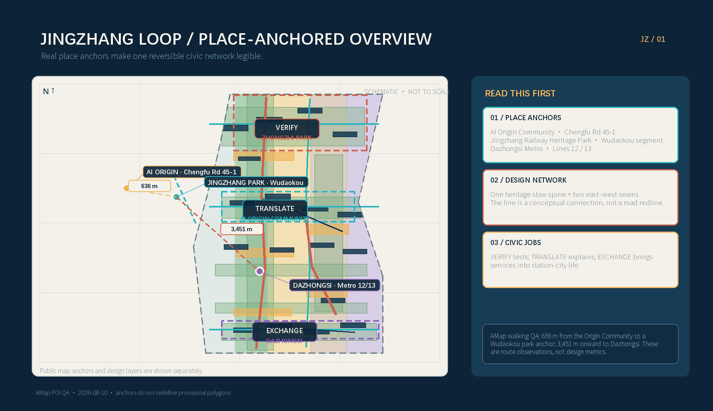
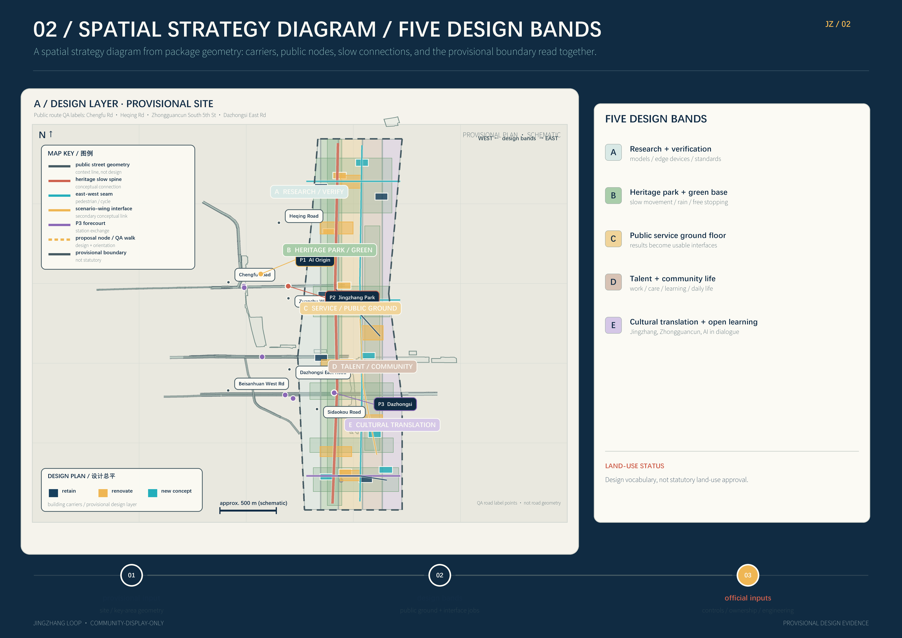
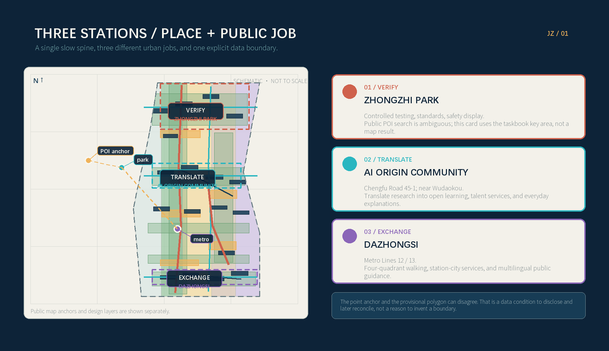
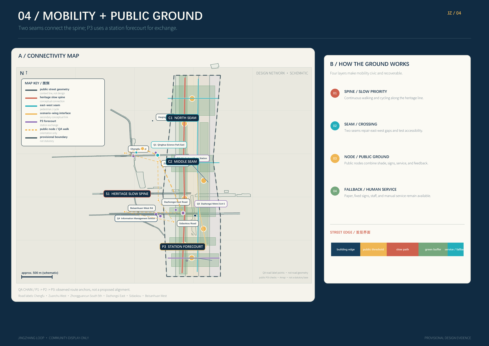
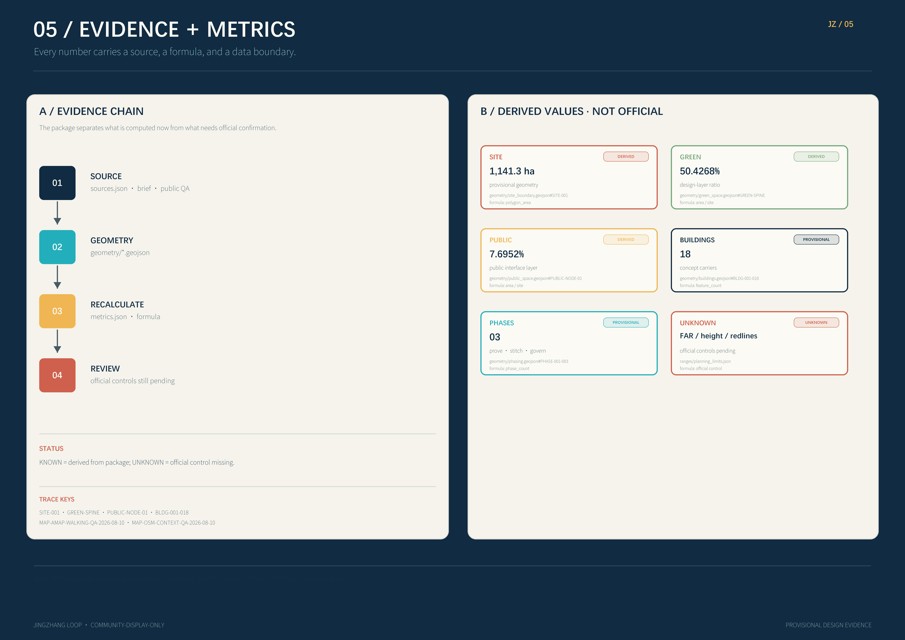

# JINGZHANG LOOP / Reversible AI Civic Interfaces

## Design Basis and Source List

JINGZHANG LOOP treats an AI city as a family of public interfaces rather than a silent technology layer. Each interface must be visible, contestable, optional, and owned by a human steward who can pause or roll it back. The official announcement and the agent taskbook define the response boundary [source:OFFICIAL-ANNOUNCEMENT] [source:AGENT-TASKBOOK]. The site package, source registry, and processed fact pack provide the traceable machine-readable research route [source:SITE-PACKAGE] [source:SOURCE-REGISTRY] [source:PROCESSED-FACT-PACK].

The brief establishes three scales: about 43.6 square kilometres for coordinated research, about 11.4 square kilometres for the overall design area, and about 368.4 hectares for the three key areas. The announced comparison values are [metric:overall_design_announced_area_sqm] and [metric:key_detailed_design_announced_area_sqm]; the submitted provisional polygon recalculates to [metric:site_area_sqm]. That value is derived from [data:geometry/site_boundary.geojson#SITE-001] and is not an official redline.

This package uses public materials and the repository’s provisional geometry. The site, key areas, and constraints are disclosed as non-official and provisional. They support spatial comparison, diagram generation, topology checks, and professional continuation only [source:BOUNDARY-SOURCE] [source:KEY-AREA-SOURCE] [source:SRC-PROVISIONAL-BOUNDARIES-2026]. Official control lines, ownership, planning controls, building conditions, heritage, utilities, fire safety, and flood conditions must replace these inputs before a full package recalculation [depth:existing_conditions_diagnosis] [depth:risk_missing_data].

The workflow is four-part: read the brief and standards; translate industry, space, mobility, blue-green systems, and AI scenarios into structured objects; generate design layers from shared geometry; then verify area, ratios, counts, drawing evidence, and human boundary disclosures. The taskbook’s human-review boundary remains active at every scale [source:SRC-2026-0518-AGENT-OPEN-CALL-TASKBOOK] [source:SRC-2026-BJ-GH-QUAL-PREANNOUNCEMENT].

This map QA uses public POIs as place anchors: AI Origin Community returns Chengfu Road 45-1 near Wudaokou; Jingzhang Railway Heritage Park returns multiple public segments, including a Wudaokou segment and the Qinghua East Road-to-Dazhongsi sequence; and Dazhongsi station returns Metro Lines 12 and 13. The figures show these anchors separately from the provisional key-area polygons because map points do not revise submitted boundaries [source:MAP-AMAP-POI-QA-2026-08-10].

Using the Wudaokou park POI as a representative anchor, the walking observation is about 636 m from AI Origin Community to the park and about 3,451 m onward to Dazhongsi station. Because the park is a linear, multi-segment POI, these are current route observations rather than design metrics or an accessibility audit. They support a “near-neighbor verification before long-spine stitching” mobility narrative without changing submitted geometry [source:MAP-AMAP-WALKING-QA-2026-08-10]. Searching 众智园 returned a same-name POI in Tianjin, so this package does not use that result to define Zhongzhi Park and continues to follow the taskbook and provisional key area [source:MAP-AMAP-POI-QA-2026-08-10] [source:KEY-AREA-SOURCE].

## Three-Level Scope Framework

The three scales form one chain rather than three isolated drawing sets. The coordinated research area asks why Jingzhang needs new AI civic interfaces. The overall design area asks where those interfaces connect and how they can be supported. The key areas ask how a person can use, question, refuse, report, or pause an AI service at a real urban corner [depth:three_level_scope_framework] [depth:overall_spatial_structure].

| Scale | Question | JINGZHANG LOOP response | Evidence |
| --- | --- | --- | --- |
| Coordinated research | How can industry, talent, culture, and future urban life reinforce each other? | A chain of origin, translation, experience, verification, and communication | [source:SRC-2026-BJ-KW-THREE-AREAS-WINGS], [depth:existing_conditions_diagnosis] |
| Overall design | How can renewal, mobility, municipal systems, and character become one network? | One heritage slow spine, two cross-city seams, and three interface stations | [data:geometry/land_use.geojson#LU-001], [data:geometry/roads.geojson#ROAD-RAIL-SPINE] |
| Key areas | How can the strategy become an operable urban experience? | Zhongzhi Park verifies, Beijing AI Origin Community translates, and Dazhongsi exchanges | [data:geometry/key_areas.geojson#PROV-KEY-001], [data:geometry/key_areas.geojson#PROV-KEY-002], [data:geometry/key_areas.geojson#PROV-KEY-003] |

The spatial structure is “one spine, two seams, three stations, four safeguards.” The spine follows Jingzhang heritage and the Jingzhang Relics Park slow network. The two seams are the Zhongguancun technology-service wing and the Xiaoyuehe scenario-enablement wing. The three stations are VERIFY, TRANSLATE, and EXCHANGE. The safeguards are legibility, opt-out, human stewardship, and low-tech fallback. This interprets the taskbook’s three key areas and two wings [source:SRC-2026-BJ-KW-THREE-AREAS-WINGS] without creating a new statutory boundary.

## Coordinated Research Area: Industry and Future City Research

The coordinated research area is organized as an innovation chain with public value: universities and institutes provide questions and methods; open communities provide collaboration; companies provide products that can be tested; residents and visitors provide real feedback; public agencies and professional teams provide rights, safety, and implementation review. The three interfaces have distinct degrees of openness: Zhongzhi Park supports controlled testing, Beijing AI Origin Community translates knowledge into daily life, and Dazhongsi places mature services in a high-frequency urban setting.

The proposed name is “JINGZHANG LOOP / 京张共振场.” The mark is a concept, not an existing company asset: two parallel lines represent railway and data flow, an open square represents a civic interface, and a short gap represents the ability to enter or leave. The palette is deep navy, warm cream, cyan-green, amber, and coral for continuity, readability, blue-green space, experimentation, and risk [source:AGENT-TASKBOOK] [source:SRC-2026-HAIDIAN-1X1].

Five coordinated functions are proposed: open research and safety verification; knowledge translation and learning; enterprise and talent services; blue-green civic experience; and contribution, communication, and annual review. The concept does not claim a confirmed company cluster, event calendar, or government program. Those are proposal-level operating mechanisms.

International cases are used only as mechanism references. Helsinki and Amsterdam suggest a readable AI or algorithm register for each public service [source:CASE-HELSINKI-AI-REGISTER] [source:CASE-AMSTERDAM-ALGORITHM-REGISTER]. Decidim suggests traceable proposals, comments, and responses [source:CASE-BARCELONA-DECIDIM]. Singapore’s Open Government Products suggests small, reusable civic digital products [source:CASE-SINGAPORE-OGP]. Seoul S-Map and Virtual Singapore suggest spatial scenario views before physical change [source:CASE-SEOUL-S-MAP] [source:CASE-VIRTUAL-SINGAPORE]. Barcelona’s superblock work suggests reversible pilots, street reallocation, and public review [source:CASE-BARCELONA-SUPERBLOCK].

## Overall Design Area: Urban Renewal and Regulatory-Plan-Level Urban Design

The overall design translates one spine, two seams, and three stations into five interface bands. The land-use polygons share exact cut lines so the conceptual layer has no gaps or overlaps:

| Layer | Code | Role | Spatial move |
| --- | --- | --- | --- |
| LU-001 | 0802 | Research and innovation services | Place verification, open testing, enterprise services, and small public releases |
| LU-002 | 1401 | Heritage park and blue-green edge | Connect heritage clues, riverside space, park, and slow mobility |
| LU-003 | 05 | Industry services and public ground floor | Put research, translation, display, commerce, and services at walkable edges |
| LU-004 | 0702 | Talent and community life | Provide living, learning, sport, care, convenience, and safe evenings |
| LU-005 | 0803 | Cultural translation and open learning | Provide exhibitions, archives, storytelling, open worktables, and public courses |

These five bands are a design allocation tool, not statutory parcel or land-use approval [standard:MNR-LAND-USE-CLASSIFICATION-GUIDE] [depth:land_use_layout] [data:geometry/land_use.geojson#LU-001]. The building layer contains 18 conceptual carriers [metric:building_carrier_count] marked retain, renovate, or new concept. Each requires ownership, structural, fire, accessibility, heritage, and planning review [data:geometry/buildings.geojson#BLDG-001] [depth:retain_renovate_demolish].

Controls follow a “relationships first, numbers second” rule. Public ground floors, pedestrian continuity, blue-green buffers, interfaces, and views are established first. Floor area ratio, total floor area, height, density, setbacks, green controls, road redlines, and facility standards remain unknown until official planning and engineering inputs arrive [depth:development_intensity_controls] [depth:height_massing_character] [standard:MOHURD-CONTROL-DETAILED-PLANNING]. This preserves room for professional correction instead of presenting guessed controls as approval values.

The character language is railway structure, campus-scale public life, transparent AI interfaces, and a low-carbon riverside base. Large masses stay in the background; public ground floors and crossings form the readable edge. New structures should be repairable, demountable, and reusable. Urban-design coordination, public space, and character return to [standard:MOHURD-URBAN-DESIGN-MEASURES] [depth:overall_spatial_structure].

## Detailed Design of Key Areas

The three key areas share one interface protocol but have three distinct spatial personalities. All three polygons are provisional constraints: [data:geometry/key_areas.geojson#PROV-KEY-001], [data:geometry/key_areas.geojson#PROV-KEY-002], and [data:geometry/key_areas.geojson#PROV-KEY-003]. Their count is checked by [metric:key_area_count].

### Zhongzhi Park: VERIFY

Zhongzhi Park is a garden-like full-stack innovation district. A low-carbon interface faces the Qinghe edge; open test benches, standards workshops, and safety-governance displays sit beside green space; entrances, external connections, and civic services form a public forecourt that can be paused. The AI is not hidden in the background: visitors can see what is being tested, who is responsible, and how to exit.

Retain buildings first and renovate before adding small experimental and public-service volumes. Mobile shade, replaceable exhibition tables, low-energy light, and demountable seating let a test scene return to an ordinary park after an event. Industry-validation scenarios include model red teaming, edge-device interoperability, green-compute observation, and standards co-creation. Each has a human host and a paper or manual substitute [depth:three_key_area_detailed_design] [depth:municipal_new_infrastructure].

### Beijing AI Origin Community: TRANSLATE

The Origin Community is a near-campus district for translation, talent, and results transfer. A results-transfer street stitches campus, innovation parks, and neighborhood life. Publishing rooms, open-source worktables, talent services, shared learning, and everyday amenities are placed at walkable ground floors. Where ownership is unclear, temporary exhibitions and public programs test demand without presupposing demolition.

The key product is not a technology showroom but an understandable daily service: a model-explanation wall, an appointment-based legal and intellectual-property desk, an AI explanation table welcoming children and older people, and a public channel for “I cannot understand, use, or leave this service” feedback. Renovation and new construction require ownership, structure, accessibility, and fire review [depth:retain_renovate_demolish] [source:SRC-2026-BJ-KW-THREE-AREAS-WINGS].

### Dazhongsi: EXCHANGE

Dazhongsi is an urban district for intelligent economy and international exchange. The station is the center of a four-quadrant walking loop. Intelligent terminals, content consumption, commercial services, data-oriented services, and enterprise display are broken into small public interfaces. The station, park, street corners, and ground-floor commerce become an “arrival is exchange” civic room.

AI+ services here address frequent urban life: accessible route guidance, station-city crowd notices, public-space conflict mediation, copyright prompts for content, and multilingual visitor interpretation. Every automated service shows data freshness, its accountable owner, and a human-help route. If the model or sensors fail, a steward can downgrade to fixed signs and manual guidance [depth:traffic_rail_slow_parking] [depth:blue_green_public_space].

## AI Innovation Ecosystem, Personas, and AI+ Scenarios

Six personas cover the people who make, translate, check, maintain, use, or refuse AI: researchers and engineers need compute and quiet collaboration; start-ups need compliance and pilots; operators need observability and human takeover; students and makers need open learning; residents and older people need clear, optional, staffed services; visitors and international teams need multilingual and reproducible stories. These are design personas, not demographic claims [metric:persona_count] [depth:existing_conditions_diagnosis].

Every scenario card answers six questions: who uses it, where it is, which public or synthetic data it uses, who reviews it, when it stops, and how it falls back. Data is public, authorized, or synthetic. No individual trajectory archive, identity inference, emotion inference, or credit label is created [source:AGENT-TASKBOOK] [source:SRC-2026-0518-AGENT-OPEN-CALL-TASKBOOK].

| Card | Location and users | Public or synthetic data | Human review and fallback | Type |
| --- | --- | --- | --- | --- |
| AI-01 Safety model bench | Zhongzhi Park, engineers and observers | Synthetic conflict cases and public standards | Safety host can pause; paper process | Industry validation |
| AI-02 Green-compute window | Zhongzhi Park, visitors and operators | Public energy bands and synthetic loads | Operator checks; fixed display | Industry validation |
| AI-03 Edge-device interoperability | Zhongzhi Park, companies and standards teams | Device self-descriptions and authorized tests | Specialist signs off; manual log | Industry validation |
| AI-04 Standards co-creation | Zhongzhi Park, researchers and reviewers | Public standards and anonymous questions | Facilitator confirms; offline meeting | Industry validation |
| AI-05 Results translation desk | Origin Community, residents and students | Public papers and licensed summaries | Interpreter checks; human Q&A | Public learning |
| AI-06 Open-source contribution wall | Origin Community, developers and visitors | Public code and contributions | Community moderator; physical board | Participation |
| AI-07 Talent service navigator | Origin Community, newcomers and carers | Public service directory | Community worker confirms; front desk | Daily life |
| AI-08 Accessible learning route | Origin Community, people with reduced mobility | Public paths and self-reported facilities | Manual walk-through; fixed signs | Inclusive mobility |
| AI-09 Four-quadrant walking assistant | Dazhongsi, commuters and visitors | Network, stations, public events | On-site steward; road signs | Mobility |
| AI-10 Station crowd notice | Dazhongsi, station staff and public | Anonymous aggregated counts | Station staff confirms; manual broadcast | Safety |
| AI-11 Copyright-clear guide | Dazhongsi, visitors and shops | Licensed content catalog and public map | Content editor; paper guide | Content |
| AI-12 Public-space mediation | All stations, residents and event organizers | Bookings and anonymous feedback | Steward mediates; cancel recommendation | Governance |

The package contains [metric:scenario_card_count] scenario cards, including [metric:industry_validation_scenario_count] industry-validation cards. Spatial anchors connect to public space, roads, and green space [data:geometry/public_space.geojson#PUBLIC-NODE-01] [data:geometry/roads.geojson#ROAD-RAIL-SPINE] [data:geometry/green_space.geojson#GREEN-SPINE]. Comparative cases provide mechanisms only [source:CASE-HELSINKI-AI-REGISTER] [source:CASE-BARCELONA-DECIDIM].

## Land Use, Building Scale, and Retain-Renovate-Demolish Strategy

The land-use layer uses five shared-cut bands and records a code, interface role, and design note for each polygon. It is a conceptual relational layer, not a parcel or approval layer. Green area, public space, and building footprint are recalculated from the submitted geometry [metric:green_space_area_sqm] [metric:public_space_area_sqm] [metric:building_footprint_area_sqm].

Buildings are classified as retain, renovate, or new concept. Retain protects usable structure and memory while improving public ground floors, energy, accessibility, and wayfinding. Renovate indicates a reversible candidate subject to ownership and structural checks. New concept records only massing relationships and civic-interface locations; it does not claim a final floor area, number of floors, or height.

The package contains 18 conceptual building carriers. Its footprint is [metric:building_footprint_area_sqm] and its conceptual coverage is [metric:building_coverage_ratio]. Total floor area, floor area ratio, height, density, and setbacks remain unknown because planning limits, existing-building surveys, ownership, structure, fire safety, and heritage materials are not available [depth:development_intensity_controls] [depth:height_massing_character] [standard:MOHURD-ARCH-DESIGN-DEPTH-2016].

## Transport, Rail, Municipal Infrastructure, and Public Services

Mobility has three layers: the Jingzhang slow spine; rail and bus interchange; and local circulation with service access. The road layer has 8 conceptual centerlines totaling [metric:road_centerline_length_m]. They are not road redlines. Dazhongsi prioritizes four-quadrant crossings; the Origin Community stitches campus, park, and neighborhood walking; Zhongzhi Park creates low-carbon access at the Qinghe edge [data:geometry/roads.geojson#ROAD-RAIL-SPINE] [depth:traffic_rail_slow_parking].

Slow mobility does not remove emergency, service, or accessible access. Each public node has time windows for service vehicles, emergency response, accessible movement, bicycle parking, and loading. Cross-sections, junctions, parking supply, and station-city works need professional transport and operations review. Reversible markings and mobile elements come before permanent engineering, using the mechanism of pilotable street reallocation [source:CASE-BARCELONA-SUPERBLOCK].

Municipal and AI infrastructure use a low-tech base with replaceable devices. Power, communications, stormwater, waste, drinking water, lighting, and public toilets remain maintainable. Edge compute, sensors, e-ink signs, and open-data interfaces can be replaced. Every key service has a staffed window, paper map, and fixed broadcast. Energy, drainage, flood, fire, utility, cybersecurity, and operations are prerequisites [data:geometry/constraints.geojson#CONSTRAINT-WATER-DATA-GAP] [depth:municipal_new_infrastructure].

## Blue-Green Network, Public Space, and Urban Character

The blue-green system follows Jingzhang Relics Park and river clues, creating a continuous north-south walk and cycle network with east-west crossings. Seven green-space objects combine park, garden, stormwater buffer, shade, and ecological learning. Eight public-space objects combine station forecourts, event rooms, neighborhood rooms, exhibitions, and service nodes. Green area and ratio are [metric:green_space_area_sqm] [metric:green_ratio]; public-space area and ratio are [metric:public_space_area_sqm] [metric:public_space_ratio] [data:geometry/green_space.geojson#GREEN-SPINE] [data:geometry/public_space.geojson#PUBLIC-NODE-01].

Four conceptual landmarks are public interfaces rather than tall objects: AI Interface Gate is the shared entry; Evidence Garden displays model purpose, data freshness, and stewardship; Translation Lantern is a low-light evening guide; Open Studio is an appointment-based worktable and contribution wall. The count is [metric:landmark_count]. The character combines railway structure, Zhongguancun innovation, Qinghe and Xiaoyuehe water memories, and transparent AI. Heritage clues are not official heritage conclusions [source:SRC-2026-BJ-GH-QUAL-PREANNOUNCEMENT] [depth:blue_green_public_space].

The visual rule is readable without overstimulation: high-contrast, low-brightness, tactile, and multilingual guidance; no personalized advertising by default; no uncleared portraits, brands, or training images; and a dark-environment rule near homes. Public space and character coordination return to [standard:MOHURD-URBAN-DESIGN-MEASURES].

## Renewal Projects, Implementation Policy, and Phasing

Nine projects connect spatial change, services, and operations:

| ID | Project | Type | Near-term action |
| --- | --- | --- | --- |
| JZ-01 | Jingzhang slow-spine gap repair | Public space and mobility | Test markings, seats, and accessible signs |
| JZ-02 | Zhongzhi Park Qinghe interface | Blue-green and industry display | Build a low-carbon test garden and safety station |
| JZ-03 | Zhongzhi standards co-creation corridor | Industry and governance | Display standards, risks, and takeover procedures |
| JZ-04 | Origin results-transfer street | Renewal and enterprise service | Start small releases and advice at shareable ground floors |
| JZ-05 | Origin talent-life room | Community and public service | Open learning, care, sport, and multilingual help |
| JZ-06 | Dazhongsi four-quadrant walking loop | Rail and mobility | Observe crossing conflicts with station operators |
| JZ-07 | Dazhongsi intelligent ground-floor edge | Commerce and display | Test licensed content and optional guidance |
| JZ-08 | AI civic-interface low-tech base | Municipal and new infrastructure | Reserve power, communications, fixed signs, and staff windows |
| JZ-09 | Jingzhang open week and contribution loop | Operations and communication | Create annual review, developer community, and public audit |

The list is checked by [metric:renewal_project_count] and [depth:renewal_project_list]. Spatial evidence returns to building, public-space, and phasing layers [data:geometry/buildings.geojson#BLDG-001] [data:geometry/public_space.geojson#PUBLIC-NODE-01] [data:geometry/phasing.geojson#PHASE-001].

Three phases provide the rhythm “prove, stitch, govern.” Phase 01 establishes interface protocols, low-tech guidance, mobility pilots, four industry-validation scenes, and public feedback. Phase 02 delivers key-area renewal, public ground floors, blue-green nodes, station-city walking, and accountable operators. Phase 03 expands the cross-city network, international exchange, annual events, and continuous evaluation. The phasing footprint and count are [metric:phasing_area_sqm] [metric:phase_count] [data:geometry/phasing.geojson#PHASE-001].

An open week is not only promotion. It includes demonstrations, public questioning, developer contributions, professional review, and a next-year pause or retirement list. Policy proposals include a public-interface register, reversible-pilot procurement, low-tech fallback budgets, data minimization, cross-department stewardship, and resident response loops. They are not government commitments or funding promises [depth:phasing_implementation].

## Metrics, Area Recalculation, and Compliance Matrix

Metrics are separated into geometry-recalculable values, unknown planning or engineering controls, and operational performance measures. This makes a clear distinction between what this package has calculated and what a professional team must measure later [depth:metrics_recalculation] [depth:risk_missing_data].

| Metric | Package value | Meaning |
| --- | ---: | --- |
| Provisional site area | 11,412,825.386 sqm [metric:site_area_sqm] | Recalculated from the provisional polygon, not an official line |
| Announced overall design area | 11,400,000 sqm [metric:overall_design_announced_area_sqm] | Brief-scale comparison |
| Announced key-area total | 3,684,000 sqm [metric:key_detailed_design_announced_area_sqm] | Brief-scale task comparison |
| Green area / ratio | 5,755,121.757 sqm / 50.4268% [metric:green_space_area_sqm] [metric:green_ratio] | Design-layer recalculation |
| Public space / ratio | 878,239.994 sqm / 7.6952% [metric:public_space_area_sqm] [metric:public_space_ratio] | Design-layer recalculation |
| Building footprint / coverage | 588,381.765 sqm / 5.1554% [metric:building_footprint_area_sqm] [metric:building_coverage_ratio] | Conceptual building carriers |
| Conceptual road centerlines | 27,903 m [metric:road_centerline_length_m] | Not road redlines or engineering quantities |

Count metrics are [metric:key_area_count] key areas, [metric:public_space_count] public spaces, [metric:building_carrier_count] building carriers, [metric:phase_count] phases, [metric:scenario_card_count] scenario cards, [metric:industry_validation_scenario_count] industry-validation scenarios, [metric:persona_count] personas, [metric:landmark_count] landmarks, and [metric:renewal_project_count] renewal projects.

The compliance matrix maps official tasks 1.3.1 through 1.5.3.3 and agent.1 through agent.6 to sections, layers, metrics, drawings, sources, assumptions, and checks. Professional coverage includes the official announcement [standard:PROJECT-OFFICIAL-ANNOUNCEMENT], agent taskbook [standard:PROJECT-AGENT-OPEN-CALL-TASKBOOK], urban design measures [standard:MOHURD-URBAN-DESIGN-MEASURES], detailed planning [standard:MOHURD-CONTROL-DETAILED-PLANNING], land-use classification [standard:MNR-LAND-USE-CLASSIFICATION-GUIDE], and the architecture-depth data gap [standard:MOHURD-ARCH-DESIGN-DEPTH-2016].

## Risk, Copyright, and Compliance

The main risk is turning provisional data into certainty. Site, key areas, land use, buildings, roads, green space, public space, constraints, and phasing must be recalculated together when official inputs arrive. The constraints layer records the provisional site, heritage uncertainty, water-data gap, and missing controls [data:geometry/constraints.geojson#CONSTRAINT-PROVISIONAL-SITE] [depth:risk_missing_data]. Before replacement, every area, location, and count is conceptual evidence only.

AI governance uses four safeguards: every interface shows purpose, data freshness, owner, and stop method; people can opt out and receive human service; stewards can pause, downgrade, and roll back; and the low-tech base keeps working during network, power, model, or sensor failure. Personal data is minimized, aggregated, or synthetic. Implementation must still test equity, accessibility, cybersecurity, vendor lock-in, model bias, operating cost, and public acceptance.

The text, GeoJSON, metrics, HTML, PDFs, and figures were generated by g1331 with Codex and are disclosed in the copyright statement. Figures load no remote maps, scripts, fonts, or images. No uncleared brand, portrait, or corporate mark is used. Case links and reuse boundaries are recorded in sources.json [source:CASE-SEOUL-S-MAP] [source:CASE-VIRTUAL-SINGAPORE]. The package is COMMUNITY-DISPLAY-ONLY: it may support review, display, and open discussion, but it is not government approval, statutory planning, an engineering commitment, or a commercial license.

The minimum professional inputs for the next stage are official site and key-area polygons, terrain and building surveys, land and ownership, planning controls, road redlines and traffic counts, station-city engineering, river and flood controls, utilities, fire review, heritage, public services, energy, finance, and implementation owners [depth:height_massing_character] [depth:traffic_rail_slow_parking] [depth:municipal_new_infrastructure] [standard:MOHURD-CONTROL-DETAILED-PLANNING].

## References

- Official notice and local reading copy: [source:OFFICIAL-ANNOUNCEMENT] [source:SRC-2026-BJ-GH-QUAL-PREANNOUNCEMENT].
- Agent taskbook and human-review boundary: [source:AGENT-TASKBOOK] [source:SRC-2026-0518-AGENT-OPEN-CALL-TASKBOOK].
- Three key areas, two wings, and site package: [source:SRC-2026-BJ-KW-THREE-AREAS-WINGS] [source:SRC-2026-HAIDIAN-1X1] [source:SITE-PACKAGE].
- Source registry and fact navigation: [source:SOURCE-REGISTRY] [source:PROCESSED-FACT-PACK].
- Provisional geometry: [source:BOUNDARY-SOURCE] [source:KEY-AREA-SOURCE] [source:SRC-PROVISIONAL-BOUNDARIES-2026].
- Urban design, planning, land-use, and architecture references: [source:SRC-2017-MOHURD-URBAN-DESIGN-MEASURES] [source:SRC-MOHURD-CONTROL-DETAILED-PLANNING] [source:SRC-2023-MNR-LAND-USE-CLASSIFICATION] [standard:MOHURD-URBAN-DESIGN-MEASURES] [standard:MOHURD-CONTROL-DETAILED-PLANNING] [standard:MNR-LAND-USE-CLASSIFICATION-GUIDE] [standard:MOHURD-ARCH-DESIGN-DEPTH-2016].
- Map-tool cross-check: [source:MAP-AMAP-POI-QA-2026-08-10] [source:MAP-AMAP-WALKING-QA-2026-08-10]. Background QA only; it does not define formal boundaries, areas, or engineering controls.
- International mechanism cases: [source:CASE-HELSINKI-AI-REGISTER] [source:CASE-AMSTERDAM-ALGORITHM-REGISTER] [source:CASE-BARCELONA-DECIDIM] [source:CASE-SINGAPORE-OGP] [source:CASE-SEOUL-S-MAP] [source:CASE-VIRTUAL-SINGAPORE] [source:CASE-BARCELONA-SUPERBLOCK].
- Structured design evidence: [data:geometry/site_boundary.geojson#SITE-001] [data:geometry/key_areas.geojson#PROV-KEY-001] [data:geometry/land_use.geojson#LU-001] [data:geometry/buildings.geojson#BLDG-001] [data:geometry/roads.geojson#ROAD-RAIL-SPINE] [data:geometry/green_space.geojson#GREEN-SPINE] [data:geometry/public_space.geojson#PUBLIC-NODE-01] [data:geometry/constraints.geojson#CONSTRAINT-PROVISIONAL-SITE] [data:geometry/phasing.geojson#PHASE-001].

Depth coverage: [depth:existing_conditions_diagnosis] [depth:three_level_scope_framework] [depth:overall_spatial_structure] [depth:land_use_layout] [depth:development_intensity_controls] [depth:height_massing_character] [depth:retain_renovate_demolish] [depth:traffic_rail_slow_parking] [depth:municipal_new_infrastructure] [depth:blue_green_public_space] [depth:three_key_area_detailed_design] [depth:renewal_project_list] [depth:phasing_implementation] [depth:metrics_recalculation] [depth:risk_missing_data].
