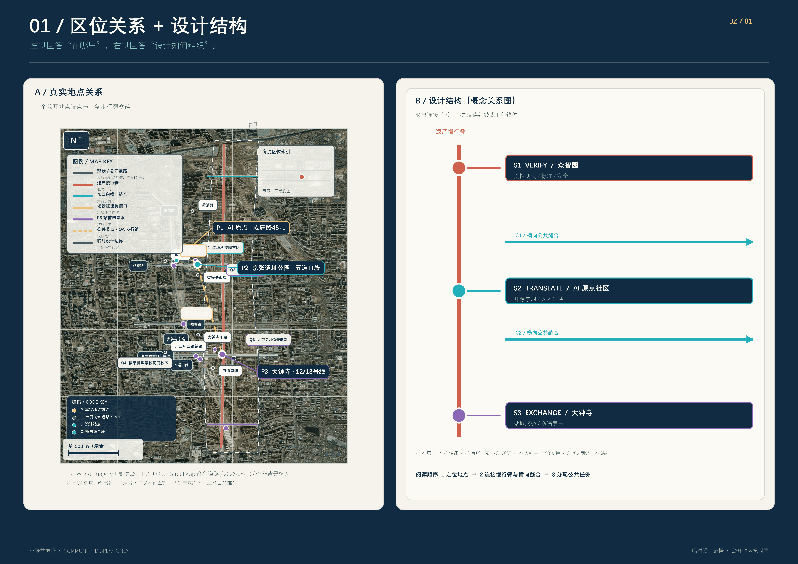
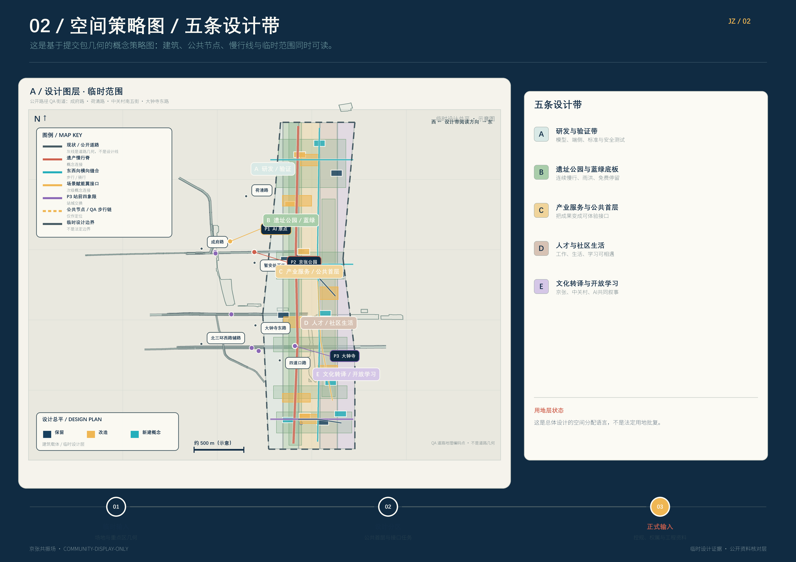
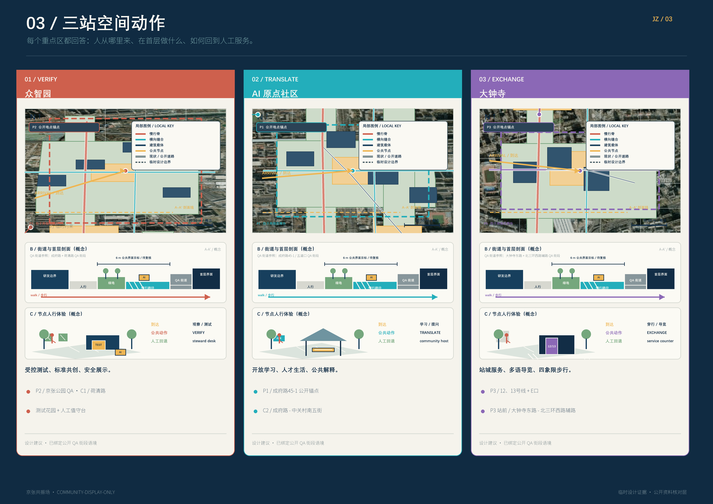
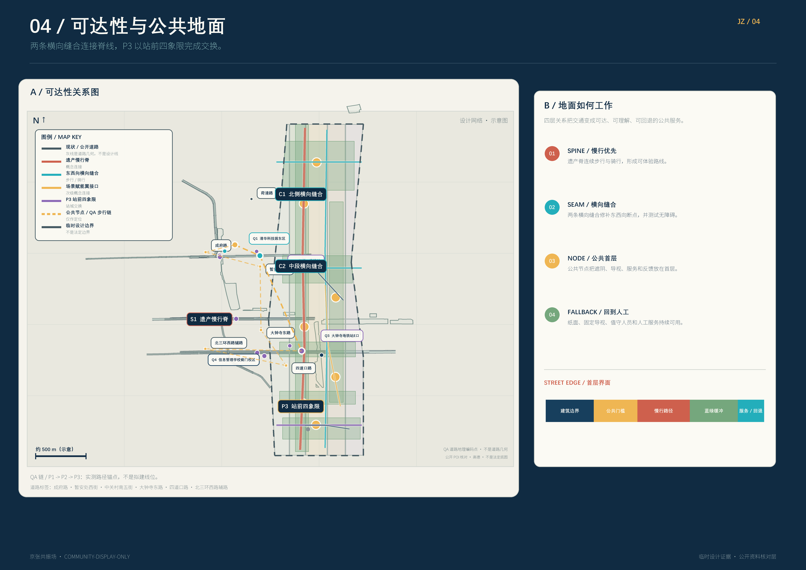
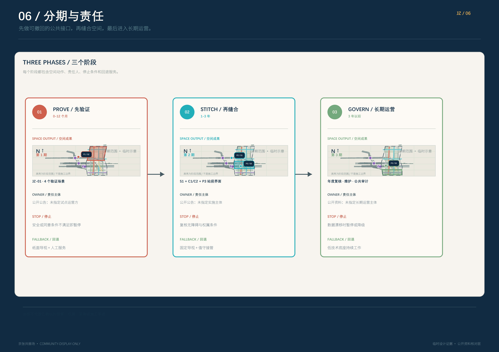
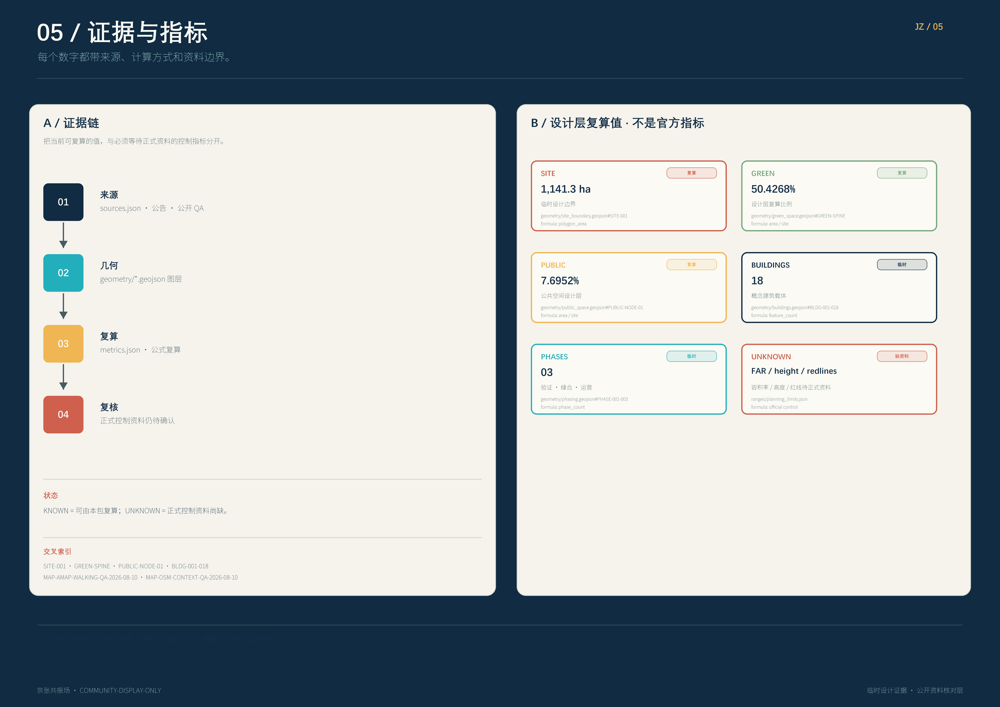

# 京张共振场 / JINGZHANG LOOP

## 设计依据与资料清单

“京张共振场”把 AI 城市理解为一组面向公众的空间接口，而不是叠加在城市之上的技术涂层。接口要能被看见、被质疑、被退出，并由人负责暂停和回退。方案以官方公告和智能体任务书为任务边界 [source:OFFICIAL-ANNOUNCEMENT] [source:AGENT-TASKBOOK]，以场地包、来源登记和事实包建立可追溯的研究入口 [source:SITE-PACKAGE] [source:SOURCE-REGISTRY] [source:PROCESSED-FACT-PACK]。

公告给出的工作尺度是：统筹研究范围约 43.6 平方公里，总体设计范围约 11.4 平方公里，三处重点片区合计约 368.4 公顷。这里的公告值分别记录为 [metric:overall_design_announced_area_sqm] 和 [metric:key_detailed_design_announced_area_sqm]；本包的临时边界复算值为 [metric:site_area_sqm]。后者来自 [data:geometry/site_boundary.geojson#SITE-001]，不是官方红线。

当前包使用公开资料和仓库提供的 provisional geometry。site_boundary、key_areas、constraints 的 official_boundary 均为 false；设计层的用途是比较空间关系、生成图件、复算拓扑和支持专业团队继续深化 [source:BOUNDARY-SOURCE] [source:KEY-AREA-SOURCE] [source:SRC-PROVISIONAL-BOUNDARIES-2026]。任何正式控规、土地权属、道路红线、建筑高度、容积率、文保范围、市政管线、消防和防洪条件，都必须以正式资料替换并触发全包重算 [depth:existing_conditions_diagnosis] [depth:risk_missing_data]。

研究方法分四步：先读公告、任务书、允许设计空间和标准；再把产业、空间、交通、蓝绿和 AI 场景拆成结构化对象；随后由统一坐标和共享边界生成设计图层；最后用面积、比例、数量、图面和人工边界声明共同校核。任务书的人类复核边界在每一层都有效 [source:SRC-2026-0518-AGENT-OPEN-CALL-TASKBOOK] [source:SRC-2026-BJ-GH-QUAL-PREANNOUNCEMENT]。

本轮地图 QA 将公开 POI 作为地点锚点：AI 原点社区返回成府路 45-1、邻近五道口；京张铁路遗址公园返回五道口段及“清华东路至大钟寺”的多段 POI；大钟寺站返回 12 号线、13 号线。图面把这些锚点与 provisional key-area polygon 分开显示，因为它们不用于修正边界 [source:MAP-AMAP-POI-QA-2026-08-10]。

以五道口段公园 POI 作为代表锚点，高德步行观察为原点社区至公园约 636 米、公园至大钟寺站约 3,451 米；由于公园是线性、多段 POI，这些是当前路径观察，不是设计指标或无障碍审计。它们只支持“先校核近邻、再缝合长廊”的叙事，不改变提交几何 [source:MAP-AMAP-WALKING-QA-2026-08-10]。对“众智园”的搜索出现天津同名 POI，因此本包不使用该结果定义众智园边界，继续以任务书和 provisional key area 为准 [source:MAP-AMAP-POI-QA-2026-08-10] [source:KEY-AREA-SOURCE]。

本轮同时查阅了官方征集公告、京张铁路遗址公园沿线控规草案公示采信通告和一期公共空间改造批复：官方公告明确三处重点区域合计约 368.4 公顷、总体设计范围约 11.4 平方公里；发改批复确认清华东路—知春路之间一期公共空间约 2.5 公里、16.8 万平方米 [source:SRC-2026-BJ-GH-QUAL-PREANNOUNCEMENT] [source:SRC-2025-BJ-HAIDIAN-JZ-CONTROL-PLAN-NOTICE] [source:SRC-2021-BJ-DRC-JZ-PUBLIC-SPACE-APPROVAL]。

园林绿化局公开信息记录一期已开放、二期向北延伸。01 图因此改用带版权标注的 Esri World Imagery 公开影像，并叠加高德 POI、OpenStreetMap 命名道路和提案图层，让读者先认出真实城市，再读设计线 [source:SRC-2026-BJ-GARDEN-JZ-PHASE2] [source:MAP-ESRI-WORLD-IMAGERY-QA-2026-08-10] [source:MAP-OSM-CONTEXT-QA-2026-08-10]。

## 三层范围工作框架

三层范围形成一条工作链，而不是三套孤立图纸。统筹研究范围回答“京张带为何需要新的 AI 公共接口”；总体设计范围回答“接口落在哪里、如何连起来”；重点区域回答“人在一个具体街角如何使用、拒绝、投诉或暂停一个 AI 服务” [depth:three_level_scope_framework] [depth:overall_spatial_structure]。

| 层级 | 主要问题 | 京张共振场的回答 | 交付证据 |
| --- | --- | --- | --- |
| 统筹研究范围 | 产业、人才、文化和未来城市如何协同 | 用“策源—转化—体验—校验—传播”构成创新链和公共价值链 | [source:SRC-2026-BJ-KW-THREE-AREAS-WINGS]、[depth:existing_conditions_diagnosis] |
| 总体设计范围 | 更新空间、交通市政和风貌如何形成连续系统 | 一条遗产慢行脊、两条跨区缝合带、三类接口站点 | 官方约 11.4 平方公里范围 [source:SRC-2026-BJ-GH-QUAL-PREANNOUNCEMENT]；[data:geometry/land_use.geojson#LU-001]、[data:geometry/roads.geojson#ROAD-RAIL-SPINE] |
| 三处重点片区 | 如何从宏观愿景进入可运营的城市体验 | 众智园做校验，北京 AI 原点社区做转译，大钟寺做交换 | [data:geometry/key_areas.geojson#PROV-KEY-001]、[data:geometry/key_areas.geojson#PROV-KEY-002]、[data:geometry/key_areas.geojson#PROV-KEY-003] |

空间结构是“一脊、两缝、三站、四道保险”。一脊是京张铁路遗产与京张遗址公园慢行脊；两缝是中关村科技服务翼与小月河场景赋能翼；三站是校验接口站、转译接口站、交换接口站；四道保险是可解释、可选择退出、人工值守、低技术回退。总体概念借用了任务书中的三处重点区和两翼结构 [source:SRC-2026-BJ-KW-THREE-AREAS-WINGS]，但不新增任何法定范围。

## 统筹研究范围产业与未来城市研究

统筹研究范围的产业策略不是把企业名单画成点，而是把创新链转成城市日常：高校和研究机构提供问题与方法，开源社群提供协作，企业提供可验证产品，社区和访客提供真实反馈，公共部门与专业团队提供安全、权利和实施把关。三处接口站点承担不同的“开放程度”：众智园允许受控试验，北京 AI 原点社区强调知识转译，大钟寺把成熟服务放进高频公共生活。

命名与识别系统建议使用“京张共振场 / JINGZHANG LOOP”。标志不使用现成企业图形：两条平行线表示铁路与数据流，一个打开的方框表示公共接口，短横线表示人可以接入也可以退出。主色是深蓝、米白、青绿、琥珀和珊瑚红，分别对应历史连续性、开放阅读、蓝绿网络、实验信号和风险提示。品牌属于本提案的概念方向，不构成商标、字体、肖像或官方视觉识别授权 [source:AGENT-TASKBOOK] [source:SRC-2026-HAIDIAN-1X1]。

五项统筹功能：

1. 策源与校验：开放模型、传感器、标准和安全工作坊，但所有测试均有可见的测试状态与人工暂停位。
2. 转译与学习：把研究成果变成普通人能理解的导视、短课、展陈和街区服务。
3. 企业服务与人才生活：提供可预约的合规、算力、知识产权、招聘、居住和社交接口。
4. 绿色公共体验：让步行、骑行、河岸、公园和慢行站点成为 AI 服务的日常入口。
5. 传播与贡献：以年度开放日、贡献墙、可复现案例和国际交流形成长期叙事。

国际案例只作为机制参照，不作为北京事实或照搬方案。赫尔辛基和阿姆斯特丹的 AI/算法登记启发“每个公共 AI 接口都有一张可读说明卡” [source:CASE-HELSINKI-AI-REGISTER] [source:CASE-AMSTERDAM-ALGORITHM-REGISTER]；Decidim 启发可追踪提案、意见和响应链 [source:CASE-BARCELONA-DECIDIM]；新加坡 Open Government Products 启发小型、可复用、以公共价值为目标的数字产品 [source:CASE-SINGAPORE-OGP]；首尔 S-Map 与 Virtual Singapore 启发在动工前先做空间情景和证据视图 [source:CASE-SEOUL-S-MAP] [source:CASE-VIRTUAL-SINGAPORE]；巴塞罗那超级街区启发可逆试点、街道再分配和公开复盘 [source:CASE-BARCELONA-SUPERBLOCK]。

## 总体设计范围城市更新与控规深度城市设计

总体设计把“一脊、两缝、三站”落成五条用地界面带，并保持共享切线，保证土地用途图层无缝无叠：

| 图层 | 设计代码 | 角色 | 空间策略 |
| --- | --- | --- | --- |
| LU-001 | 0802 | 研究与创新服务 | 组织校验接口、开放实验、企业服务和小尺度发布 |
| LU-002 | 1401 | 遗产公园与蓝绿界面 | 连接历史线索、河岸、公园、慢行和生态体验 |
| LU-003 | 05 | 产业服务与公共首层 | 把研发、转化、展示、商业和服务压到可步行首层 |
| LU-004 | 0702 | 人才与社区生活 | 提供居住、学习、运动、托育、便利服务和夜间安全 |
| LU-005 | 0803 | 文化转译与开放学习 | 提供展览、档案、讲述、开源工作台和公共课程 |

五条带不是地块法定用途结论，而是总体设计的空间分配工具 [standard:MNR-LAND-USE-CLASSIFICATION-GUIDE] [depth:land_use_layout] [data:geometry/land_use.geojson#LU-001]。建筑层只表达 18 个概念性建筑载体 [metric:building_carrier_count]，分别标记保留、改造、新建概念三类；每一类都需要在权属、结构、消防、文保和控规复核后才可继续深化 [data:geometry/buildings.geojson#BLDG-001] [depth:retain_renovate_demolish]。

空间控制采用“先关系、后数值”的方法：先锁定界面、步行连续、公共首层、蓝绿缓冲和视线。本轮已用官方征集公告、控规草案公示采信通告和一期/二期项目公开信息核对范围、道路语境与公园建设状态；这些公开页面没有发布可直接读取的完整地块红线、权属、建筑高度、容积率、地下管线、消防和防洪控制图层，因此本包不编造数值 [source:SRC-2025-BJ-HAIDIAN-JZ-CONTROL-PLAN-NOTICE] [source:SRC-2021-BJ-DRC-JZ-PUBLIC-SPACE-APPROVAL] [source:SRC-2026-BJ-GARDEN-JZ-PHASE2]。

本包也不把临时几何伪装成审批依据。相关控制对象已拆成约束清单，后续接入正式图层即可按同一坐标与拓扑规则重算 [depth:development_intensity_controls] [depth:height_massing_character] [standard:MOHURD-CONTROL-DETAILED-PLANNING]。

总体风貌以“铁路构架、校园尺度、AI 透明界面、河岸低碳底色”为四条设计语法：大体量退到背景，公共首层和跨街连廊形成连续可读界面；新增建筑使用可拆卸、可维修、可复用的构造表达；夜景减少屏幕泛光，把信号灯、导视和安全照明集中在节点。城市设计的公共性、整体性和风貌协同回到专业依据 [standard:MOHURD-URBAN-DESIGN-MEASURES] [depth:overall_spatial_structure]。

## 重点区域详细设计

三处重点区按“同一套接口协议、三种空间性格”深化。它们的边界均为 provisional constraint，分别对应 [data:geometry/key_areas.geojson#PROV-KEY-001]、[data:geometry/key_areas.geojson#PROV-KEY-002]、[data:geometry/key_areas.geojson#PROV-KEY-003]，数量由 [metric:key_area_count] 复核。

### 众智园：校验接口 / VERIFY

定位是花园型全栈自主创新街区。空间动作包括：在清河一侧设置可见的低碳创新界面；把开放测试台、标准工作坊和安全治理展廊沿绿色空间布置；将对外交通、园区入口和公共服务合成一个可暂停的接口前场。这里的 AI 不在后台静默运行，而是以“正在测试、由谁值守、怎样退出”的界面直接面对访客。

保留建筑优先进入改造清单，新概念建筑仅补足小体量实验、设备和首层公共服务。公共空间采用可移动遮阳、可更换展台、低耗能照明和可拆卸座椅，让测试场景可以在活动后恢复为普通公园。产业验证场景包括模型安全红队、边缘设备互操作测试、绿色算力展示和标准共创工作坊；每个场景必须有人工主持人和纸面/人工服务替代 [depth:three_key_area_detailed_design] [depth:municipal_new_infrastructure]。

### 北京 AI 原点社区：转译接口 / TRANSLATE

定位是近校型成果转化与人才社区。空间动作包括：用一条“成果转化街”缝合校区、园区和社区；把发布厅、开源工作台、人才服务、共享学习和生活配套压到步行可达的首层；在不确定权属的情况下先以轻介入、临时展陈和公共活动验证需求，不预设拆迁。

这里的核心不是科技展览，而是把研究变成日常可以理解的服务：一块模型说明墙、一间可预约的法律与知识产权咨询室、一个面向儿童和老人友好的 AI 解释台，以及一个允许居民提交“看不懂、用不了、想退出”反馈的公共入口。改造与新建都必须经过结构、产权、无障碍和消防复核 [depth:retain_renovate_demolish] [source:SRC-2026-BJ-KW-THREE-AREAS-WINGS]。

### 大钟寺：交换接口 / EXCHANGE

定位是城市型智能经济与国际交往街区。空间动作包括：以大钟寺站一体化为核心重做四象限步行连续；把智能终端、内容消费、商业服务、数据要素和企业展示分成可进入的小尺度公共界面；利用地铁站、公园、街角和首层商业形成“到站即交换”的城市会客厅。

这里的 AI+ 场景要对高频城市生活负责：实时无障碍路径、站城客流提醒、公共空间冲突调解、内容消费的版权提示和面向访客的多语言导览。所有自动化服务都要显示数据新鲜度、责任主体和人工求助入口；在模型或传感器异常时，现场工作人员可以一键降级为固定导视和人工引导 [depth:traffic_rail_slow_parking] [depth:blue_green_public_space]。

## AI 创新生态、人才画像与 AI+ 场景

六类人才画像覆盖“做模型的人、把模型变成产品的人、检查模型的人、把知识讲给公众的人、维护城市的人、使用或拒绝服务的人”：研究者/工程师需要算力、实验和安静协作；创业团队需要合规、试点和融资接口；运营者需要可观测工具和人工接管；学生与创客需要开放学习和低门槛设备；居民与老年人需要清晰、可退出、有人接待的服务；访客与国际团队需要多语种、可复现、可带走的城市故事。这里的“人才”是设计画像，不是人口统计结论 [metric:persona_count] [depth:existing_conditions_diagnosis]。

每个 AI 场景卡必须回答六件事：谁使用、在哪里使用、用什么公开或合成数据、谁人工复核、何时停止、如何回退。数据只使用公开、获得授权或合成数据；不建立个人轨迹档案，不以摄像头推断身份、情绪或信用，不把一次匿名反馈转成个体画像 [source:AGENT-TASKBOOK] [source:SRC-2026-0518-AGENT-OPEN-CALL-TASKBOOK]。

| 场景卡 | 位置与用户 | 公开/合成数据 | 人工复核与回退 | 类型 |
| --- | --- | --- | --- | --- |
| AI-01 安全模型校验台 | 众智园，工程师与公众观察者 | 合成冲突样本、公开标准 | 安全主持人可暂停；回退为纸面流程 | 产业验证 |
| AI-02 绿色算力观察窗 | 众智园，访客与运维者 | 公共能耗区间、合成负荷 | 运维人员核对；回退为固定看板 | 产业验证 |
| AI-03 端侧设备互操作 | 众智园，企业与标准团队 | 设备自报能力、授权测试数据 | 专业测试员签字；回退为人工登记 | 产业验证 |
| AI-04 标准共创工作坊 | 众智园，研究者与监管协作者 | 公开标准、匿名问题集 | 主持人逐条确认；回退为线下会议 | 产业验证 |
| AI-05 成果转译台 | 原点社区，居民与学生 | 公开论文、授权摘要 | 讲解员复核；回退为人工问答 | 公共学习 |
| AI-06 开源贡献墙 | 原点社区，开发者与访客 | 公开代码与贡献记录 | 社群管理员审核；回退为实体展板 | 公共参与 |
| AI-07 人才服务导航 | 原点社区，新来者与照护者 | 公开服务目录 | 社区服务员确认；回退为前台咨询 | 生活服务 |
| AI-08 无障碍学习路径 | 原点社区，行动不便者 | 公共道路、无障碍设施自报 | 人工试走；回退为固定无障碍导视 | 包容出行 |
| AI-09 四象限步行助手 | 大钟寺，通勤者与访客 | 路网、站点、公开活动 | 现场引导员接管；回退为路牌 | 交通步行 |
| AI-10 站城拥挤提醒 | 大钟寺，站务与公众 | 匿名聚合计数、时间窗 | 站务确认后发布；回退为人工广播 | 公共安全 |
| AI-11 版权清晰导览 | 大钟寺，国际访客与商户 | 授权内容目录、公开地图 | 内容编辑复核；回退为纸质导览 | 内容消费 |
| AI-12 公共空间冲突调解 | 三站公共节点，居民与活动组织者 | 预约信息、匿名反馈 | 值守人员调解；回退为取消自动推荐 | 城市治理 |

12 张场景卡由 [metric:scenario_card_count] 复核，其中前四张构成 [metric:industry_validation_scenario_count] 个产业验证场景。场景节点落在公共空间、道路和绿地对象上 [data:geometry/public_space.geojson#PUBLIC-NODE-01] [data:geometry/roads.geojson#ROAD-RAIL-SPINE] [data:geometry/green_space.geojson#GREEN-SPINE]。参考案例只提供登记、参与、空间模拟和可逆试点的机制，不替代本地数据、制度和专业责任 [source:CASE-HELSINKI-AI-REGISTER] [source:CASE-BARCELONA-DECIDIM]。

## 用地、建筑规模与拆改留方案

用地层采用 5 条共享切线分区，目标是让每个多边形都能追溯到界面角色、代码和设计备注。面积只用于本次概念方案的结构比较；它们不是地块面积，也不构成用地审批。绿地、公共空间和建筑基底的空间值由提交图层复算，分别对应 [metric:green_space_area_sqm] [metric:public_space_area_sqm] [metric:building_footprint_area_sqm]。

建筑采用三种状态：

- 保留：保留可继续使用的结构和记忆，优先做首层开放、节能、无障碍和导视改造。
- 改造：在不预判产权和结构安全的前提下，作为可逆、分阶段更新的候选载体。
- 新建概念：只表达体量关系和公共接口位置，不声明最终建筑面积、层数或高度。

本包生成 18 个概念建筑载体，建筑基底复算为 [metric:building_footprint_area_sqm]，建筑覆盖率为 [metric:building_coverage_ratio]。总建筑面积、容积率、建筑高度、建筑密度和退线均为 unknown，因为规划限值、现状建筑、权属、结构、消防和文保材料尚未形成可审定输入 [depth:development_intensity_controls] [depth:height_massing_character] [standard:MOHURD-ARCH-DESIGN-DEPTH-2016]。建筑设计深度标准在场地包中属于资料缺口，不能被本提案假造为已满足。

## 交通、轨道、市政与公共服务设施

交通方案把京张慢行脊作为第一层，把轨道站点和公交接驳作为第二层，把支路微循环和后勤服务作为第三层。道路图层中的 8 条线是概念性中心线，不是道路红线；总长度为 [metric:road_centerline_length_m]。大钟寺站重点做四象限连续过街，原点社区重点做校区—园区—社区慢行缝合，众智园重点做清河界面和对外交通的低碳接驳 [data:geometry/roads.geojson#ROAD-RAIL-SPINE] [depth:traffic_rail_slow_parking]。本轮另加入了 OpenStreetMap 的命名道路、轨道站点、京张铁路遗址公园和学校背景核对层，使图件能对照真实城市纹理；该层只作公开地图 QA，不替代法定红线 [data:visual/assets/context_osm_qa.json] [source:MAP-OSM-CONTEXT-QA-2026-08-10]。

慢行优先不等于取消机动车和消防通行。每个公共节点设置服务车辆、急救、无障碍、骑行停车和临时装卸的时间窗；具体断面、交叉口、停车配建和轨道站城工程必须由交通专业团队与运营方复核。先用可移动设施和标线试点，复盘后再进入永久工程，参考可逆街道试点的机制 [source:CASE-BARCELONA-SUPERBLOCK]。

市政与 AI 新基建采用“低技术底座 + 可替换设备”：预留通信、电力、雨洪、垃圾、饮水、照明和公共厕所的正常维护路径；端侧算力、传感器、电子墨水导视和开放数据接口均可更换；关键服务必须提供人工窗口、纸面地图和固定广播。能源、排水、防洪、消防、管线、网络安全和设备运维仍是实施前置条件 [data:geometry/constraints.geojson#CONSTRAINT-WATER-DATA-GAP] [depth:municipal_new_infrastructure]。

## 蓝绿空间、公共空间与城市风貌

蓝绿系统以京张遗址公园和河岸线索为主脊，形成南北连续、东西可穿越的步行和骑行网络。7 个绿地对象提供公园、花园、雨洪缓冲、树荫和生态教育的复合载体；8 个公共空间对象提供站点前场、活动广场、社区客厅、展示和服务节点。绿地面积与比例由 [metric:green_space_area_sqm] [metric:green_ratio] 复核，公共空间面积与比例由 [metric:public_space_area_sqm] [metric:public_space_ratio] 复核 [data:geometry/green_space.geojson#GREEN-SPINE] [data:geometry/public_space.geojson#PUBLIC-NODE-01]。

四个概念地标不是高耸的单体建筑，而是可读的公共接口：AI Interface Gate 作为三站统一入口；Evidence Garden 把模型说明、数据新鲜度和人工值守做成花园展廊；Translation Lantern 作为原点社区的夜间低亮导视；Open Studio 作为可预约的开放工作台与贡献墙。四个地标由 [metric:landmark_count] 复核。设计语言融合京张铁路构架、中关村创新文化、清河与小月河的水岸记忆和 AI 的透明接口；文化资源和文保范围仍待核实，不把识别线索写成正式文保结论 [source:SRC-2026-BJ-GH-QUAL-PREANNOUNCEMENT] [depth:blue_green_public_space]。

城市风貌以“可读而不过度刺激”为原则：导视用高对比、低亮度、可触摸和多语种版本；屏幕默认不播放个性化广告；公共艺术不使用未清权的肖像、品牌或训练数据；夜间保持居民窗前的暗环境。公共空间设计、城市风貌和建筑布局的统筹依据 [standard:MOHURD-URBAN-DESIGN-MEASURES]。

## 更新项目清单、实施政策与分期计划

九项更新项目把空间、服务和运营连接起来。每项都应在正式深化时补充权属、资金、主体、审批、消防、工程和评估条件：

| 编号 | 项目 | 类型 | 近期动作 |
| --- | --- | --- | --- |
| JZ-01 | 京张慢行脊断点缝合 | 公共空间/交通 | 先用标线、临时座椅和无障碍导视做可逆试点 |
| JZ-02 | 众智园清河创新界面 | 蓝绿/产业展示 | 建立低碳测试花园和安全解释站 |
| JZ-03 | 众智园标准共创廊 | 产业/治理 | 把标准、风险、人工接管流程做成可参观展陈 |
| JZ-04 | 原点社区成果转化街 | 更新/产业服务 | 以空置或可共享首层启动小型发布和咨询 |
| JZ-05 | 原点社区人才生活客厅 | 社区/公共服务 | 先开放学习、照护、运动和多语服务 |
| JZ-06 | 大钟寺四象限步行环 | 轨道/慢行 | 先做过街冲突观察与站务协同 |
| JZ-07 | 大钟寺智能终端首层界面 | 商业/展示 | 以授权内容和可退出导览验证商业公共性 |
| JZ-08 | AI 公共接口低技术底座 | 市政/新基建 | 预留电力、通信、固定导视、人工窗口 |
| JZ-09 | 京张开放周与贡献机制 | 运营/传播 | 建立年度开放日、开发者社区和公开复盘 |

项目清单由 [metric:renewal_project_count] 和 [depth:renewal_project_list] 复核；空间项目分别回到建筑、公共空间、道路和分期图层 [data:geometry/buildings.geojson#BLDG-001] [data:geometry/public_space.geojson#PUBLIC-NODE-01] [data:geometry/phasing.geojson#PHASE-001]。

三期推进把“先证明、再缝合、后治理”作为节奏：

| 阶段 | 内容 | 退出条件 |
| --- | --- | --- |
| Phase 01 / 0—12 个月 | 三站接口协议、低技术导视、慢行断点、4 个产业验证场景、公共参与台账 | 安全、隐私、无障碍、消防和公众反馈通过人工复核 |
| Phase 02 / 1—3 年 | 重点区更新项目、首层公共服务、蓝绿节点、站城慢行改造和数据登记 | 权属、工程、资金、运营主体和服务指标明确 |
| Phase 03 / 3 年以后 | 跨区网络、国际交流、年度活动和持续评估 | 每个自动化服务拥有公开说明、申诉、暂停和替代方案 |

三期空间覆盖由 [metric:phase_count]、[metric:phasing_area_sqm] 和 [data:geometry/phasing.geojson#PHASE-001] 复核。年度开放周不等于短期宣传活动：它应包含场景演示、公众质询、开发者贡献、专业评审和下一年度的暂停/淘汰清单。政策建议包括公共接口登记、可逆试点采购、低技术替代预算、数据最小化、跨部门人工值守和居民反馈闭环；但不预设政府承诺或资金来源 [depth:phasing_implementation]。

## 指标体系、面积复算与合规矩阵

指标分为三类。第一类是能从本包 GeoJSON 直接复算的空间指标；第二类是必须等待正式规划、权属或工程资料的 unknown 控制指标；第三类是需要运营数据持续观测的绩效指标。这样可以区分“设计包已经算出的值”和“专业团队未来需要测量的值” [depth:metrics_recalculation] [depth:risk_missing_data]。

| 指标 | 本包值 | 解释 |
| --- | ---: | --- |
| 临时设计边界面积 | 11,412,825.386 平方米 [metric:site_area_sqm] | 由 provisional site polygon 复算，不是官方红线 |
| 公告总体设计范围 | 11,400,000 平方米 [metric:overall_design_announced_area_sqm] | 公告尺度，用于范围对照 |
| 公告重点区域合计 | 3,684,000 平方米 [metric:key_detailed_design_announced_area_sqm] | 公告尺度，用于任务对照 |
| 绿地面积 / 比例 | 5,755,121.757 平方米 / 50.4268% [metric:green_space_area_sqm] [metric:green_ratio] | 设计层复算值 |
| 公共空间面积 / 比例 | 878,239.994 平方米 / 7.6952% [metric:public_space_area_sqm] [metric:public_space_ratio] | 设计层复算值 |
| 建筑基底面积 / 覆盖率 | 588,381.765 平方米 / 5.1554% [metric:building_footprint_area_sqm] [metric:building_coverage_ratio] | 概念建筑载体基底 |
| 道路概念中心线长度 | 27,903 米 [metric:road_centerline_length_m] | 不是道路红线或工程量 |
| 分期覆盖面积 | 11,412,809.820 平方米 [metric:phasing_area_sqm] | 设计分期图层覆盖 |

包内数量指标包括 3 个重点区 [metric:key_area_count]、8 个公共空间 [metric:public_space_count]、18 个建筑载体 [metric:building_carrier_count] 和 3 期 [metric:phase_count]。这些数值分别可由 key_areas、public_space、buildings 和 phasing 图层复核。

场景与运营数量包括 12 张场景卡 [metric:scenario_card_count]、4 个产业验证场景 [metric:industry_validation_scenario_count]、6 类人才画像 [metric:persona_count]、4 个概念地标 [metric:landmark_count] 和 9 项更新项目 [metric:renewal_project_count]，可由场景表、人才画像、地标和项目清单复核。

合规矩阵将官方任务 1.3.1—1.5.3.3 与 agent.1—agent.6 连接到章节、图层、指标、图纸、来源、假设和自检。专业标准覆盖公告 [standard:PROJECT-OFFICIAL-ANNOUNCEMENT]、智能体任务书 [standard:PROJECT-AGENT-OPEN-CALL-TASKBOOK]、城市设计管理 [standard:MOHURD-URBAN-DESIGN-MEASURES]、控规编制 [standard:MOHURD-CONTROL-DETAILED-PLANNING]、用地分类 [standard:MNR-LAND-USE-CLASSIFICATION-GUIDE] 和建筑设计深度资料缺口 [standard:MOHURD-ARCH-DESIGN-DEPTH-2016]。

## 风险、版权与合规说明

本轮已对官方征集公告、海淀控规草案公示采信通告、发改批复、园林绿化局一期开放信息和二期进展进行检索，并把能确认的范围、道路节点、公园建设状态写入来源登记；这些页面仍未公开完整的地块权属、全覆盖建筑调查、工程管线、消防、防洪、文保控制和审批级道路红线数据。它们不是一句泛化的“待确认”，而是当前证据审计的具体结果；约束层逐项记录了对象、状态和替换触发条件 [data:geometry/constraints.geojson#CONSTRAINT-PROVISIONAL-SITE]。相关官方页面与项目记录见 [source:SRC-2025-BJ-HAIDIAN-JZ-CONTROL-PLAN-NOTICE] [source:SRC-2021-BJ-DRC-JZ-PUBLIC-SPACE-APPROVAL] [source:SRC-2026-BJ-GARDEN-JZ-PHASE2]。

因此，现阶段面积、位置和数量仍是概念设计证据；公开影像、地图背景、路线 QA 和设计几何已分别标注，控制图层接入后按同一坐标和拓扑规则重算 [depth:risk_missing_data]。

AI 治理风险采用四道保险：每个接口显示用途、数据新鲜度、责任人和停止方式；公众可选择退出并获得人工替代；值守人员可暂停、降级和回滚；低技术底座在网络、电力、模型或传感器故障时继续工作。对个人数据只做最小化、聚合化或合成化处理；场景评估不把人识别为风险标签。实施阶段还要补齐公平性、无障碍、网络安全、供应商锁定、模型偏差、运维成本和公众接受度评估。

本包的文字、GeoJSON、指标、HTML、PDF 和图件由 g1331 使用 Codex 生成并由提交者负责声明；图件不加载远程地图、脚本、字体或图片，不使用未清权的品牌、肖像和企业标识。国际案例只作为机制参考，原始案例链接和用途边界记录在 sources.json [source:CASE-SEOUL-S-MAP] [source:CASE-VIRTUAL-SINGAPORE]。提交许可为 COMMUNITY-DISPLAY-ONLY：允许征集方用于评审、展示和开源讨论，不代表政府批准、正式规划、工程承诺或商业授权。

本节同时回应专业设计深度、风险和资料证据链要求 [depth:height_massing_character]、[depth:traffic_rail_slow_parking]、[depth:municipal_new_infrastructure]。下一阶段的控制图层清单为：官方边界与重点区 polygon、现状地形与建筑、土地和权属、规划限值、道路红线和交通调查、轨道站城工程、河道蓝线与防洪、地下管线、消防、文保、公共服务、能源网络、资金和实施主体；本包已把每项对象落到约束和来源入口，而不是用占位词替代。

## 参考资料

- 官方公告与本地阅读副本：[source:OFFICIAL-ANNOUNCEMENT]、[source:SRC-2026-BJ-GH-QUAL-PREANNOUNCEMENT]。
- 智能体任务书与人类复核边界：[source:AGENT-TASKBOOK]、[source:SRC-2026-0518-AGENT-OPEN-CALL-TASKBOOK]。
- 三处重点区、两翼和场地包：[source:SRC-2026-BJ-KW-THREE-AREAS-WINGS]、[source:SRC-2026-HAIDIAN-1X1]、[source:SITE-PACKAGE]。
- 来源登记与事实导航：[source:SOURCE-REGISTRY]、[source:PROCESSED-FACT-PACK]。
- 官方控规、公园建设与项目批复：[source:SRC-2025-BJ-HAIDIAN-JZ-CONTROL-PLAN-NOTICE]、[source:SRC-2021-BJ-DRC-JZ-PUBLIC-SPACE-APPROVAL]、[source:SRC-2026-BJ-GARDEN-JZ-PHASE2]。
- 影像与地图背景 QA：[source:MAP-ESRI-WORLD-IMAGERY-QA-2026-08-10]、[source:MAP-OSM-CONTEXT-QA-2026-08-10]。
- 临时空间数据：[source:BOUNDARY-SOURCE]、[source:KEY-AREA-SOURCE]、[source:SRC-PROVISIONAL-BOUNDARIES-2026]。
- 城市设计、控规和用地分类参考：[source:SRC-2017-MOHURD-URBAN-DESIGN-MEASURES]、[source:SRC-MOHURD-CONTROL-DETAILED-PLANNING]、[source:SRC-2023-MNR-LAND-USE-CLASSIFICATION]。
- 专业标准与资料缺口：[standard:MOHURD-URBAN-DESIGN-MEASURES]、[standard:MOHURD-CONTROL-DETAILED-PLANNING]、[standard:MNR-LAND-USE-CLASSIFICATION-GUIDE]。
- 建筑设计深度资料缺口：[standard:MOHURD-ARCH-DESIGN-DEPTH-2016]。
- 地图工具交叉核对：[source:MAP-AMAP-POI-QA-2026-08-10]、[source:MAP-AMAP-WALKING-QA-2026-08-10]；仅作背景 QA，不进入正式边界、面积或工程结论。
- 国际机制案例（一）：[source:CASE-HELSINKI-AI-REGISTER]、[source:CASE-AMSTERDAM-ALGORITHM-REGISTER]、[source:CASE-BARCELONA-DECIDIM]。
- 国际机制案例（二）：[source:CASE-SINGAPORE-OGP]、[source:CASE-SEOUL-S-MAP]、[source:CASE-VIRTUAL-SINGAPORE]。
- 国际机制案例（三）：[source:CASE-BARCELONA-SUPERBLOCK]。
- 结构化设计证据（一）：[data:geometry/site_boundary.geojson#SITE-001]、[data:geometry/key_areas.geojson#PROV-KEY-001]、[data:geometry/land_use.geojson#LU-001]。
- 结构化设计证据（二）：[data:geometry/buildings.geojson#BLDG-001]、[data:geometry/roads.geojson#ROAD-RAIL-SPINE]、[data:geometry/green_space.geojson#GREEN-SPINE]。
- 结构化设计证据（三）：[data:geometry/public_space.geojson#PUBLIC-NODE-01]、[data:geometry/constraints.geojson#CONSTRAINT-PROVISIONAL-SITE]、[data:geometry/phasing.geojson#PHASE-001]。

深度覆盖入口（一）：[depth:existing_conditions_diagnosis]、[depth:three_level_scope_framework]、[depth:overall_spatial_structure]。
- 深度覆盖入口（二）：[depth:land_use_layout]、[depth:development_intensity_controls]、[depth:height_massing_character]。
- 深度覆盖入口（三）：[depth:retain_renovate_demolish]、[depth:traffic_rail_slow_parking]、[depth:municipal_new_infrastructure]。
- 深度覆盖入口（四）：[depth:blue_green_public_space]、[depth:three_key_area_detailed_design]、[depth:renewal_project_list]。
- 深度覆盖入口（五）：[depth:phasing_implementation]、[depth:metrics_recalculation]、[depth:risk_missing_data]。
