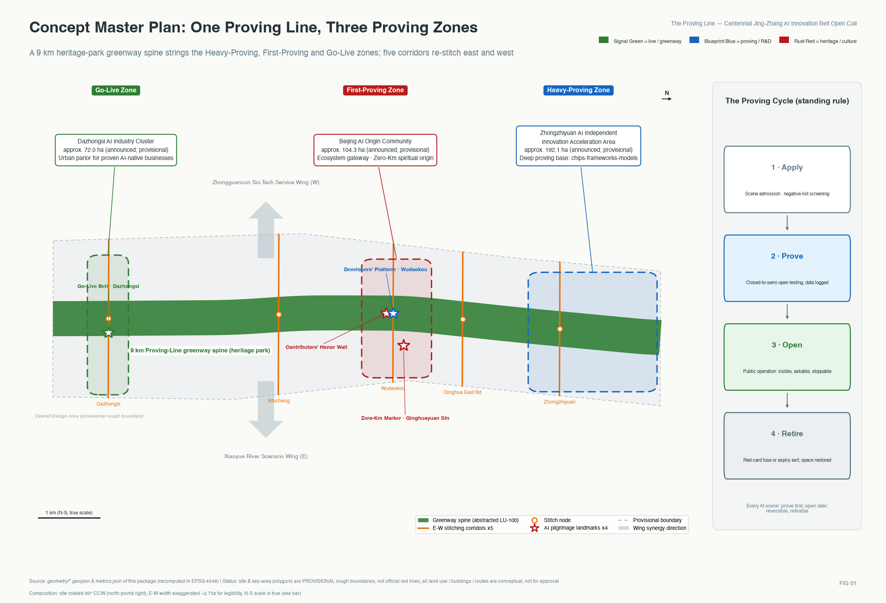
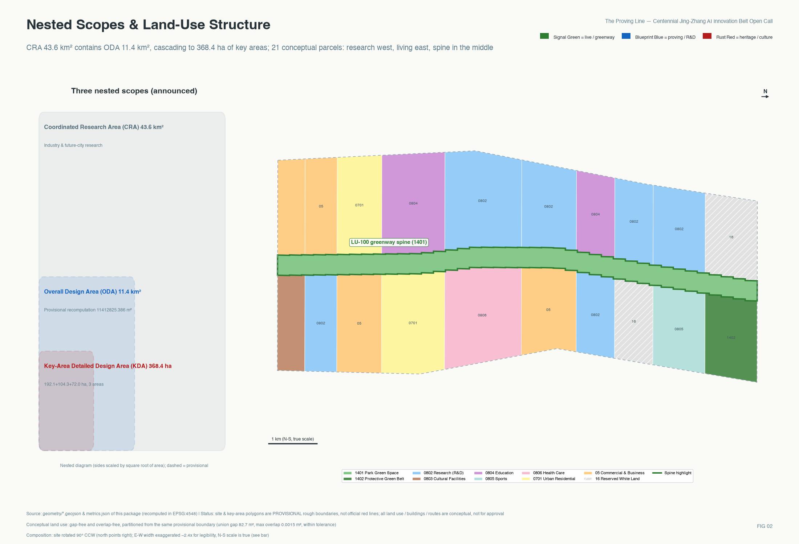
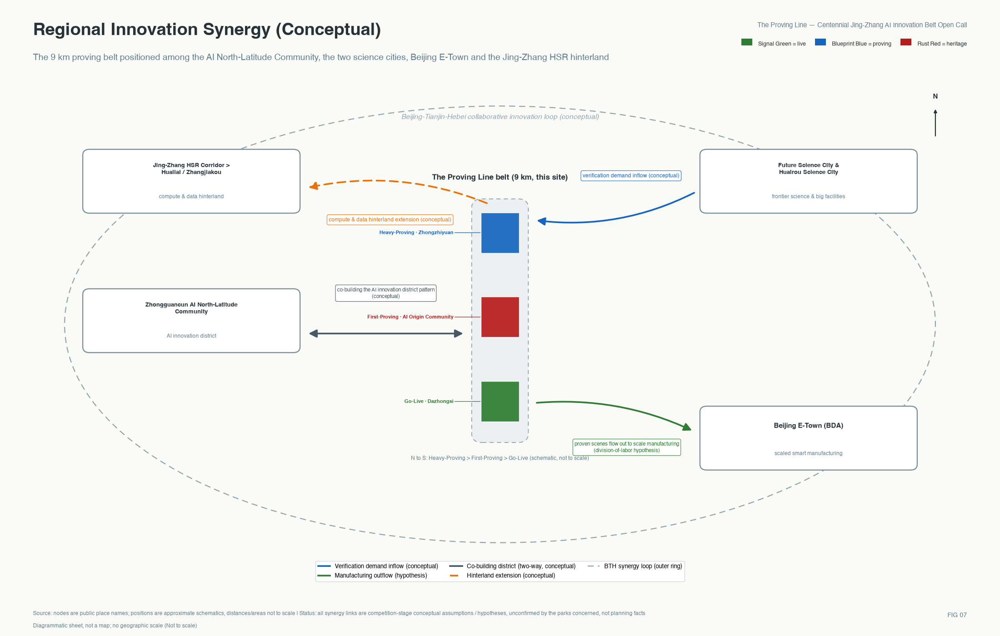
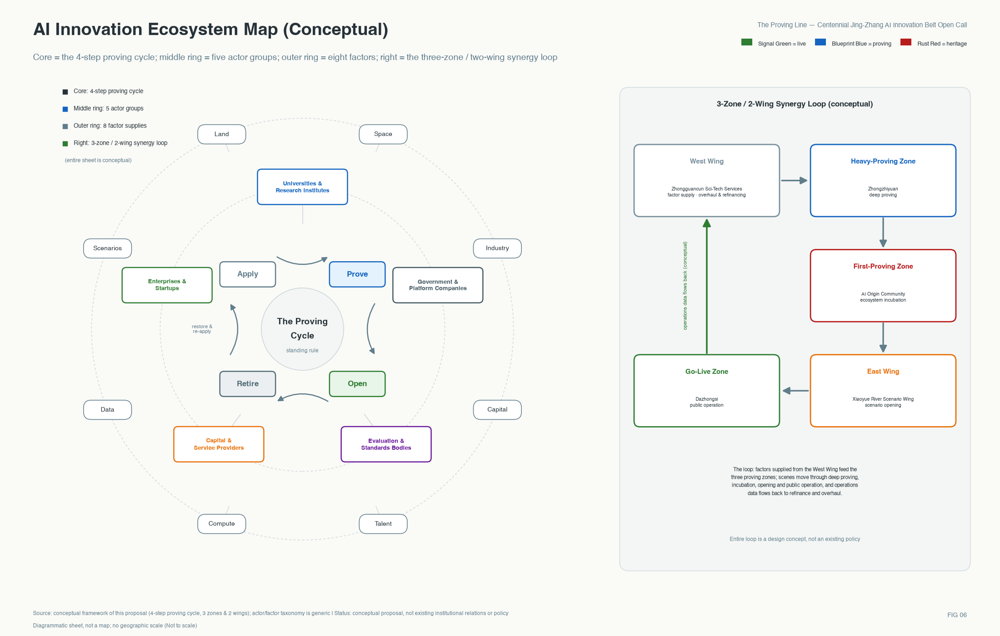
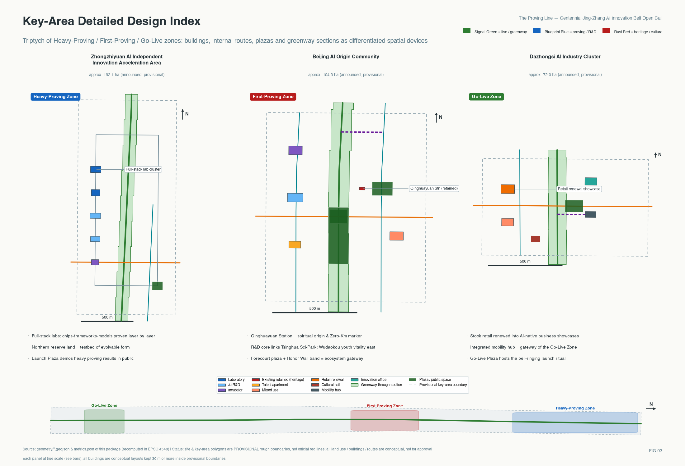
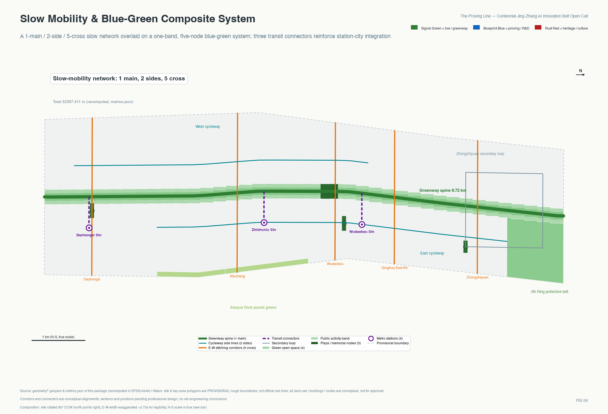
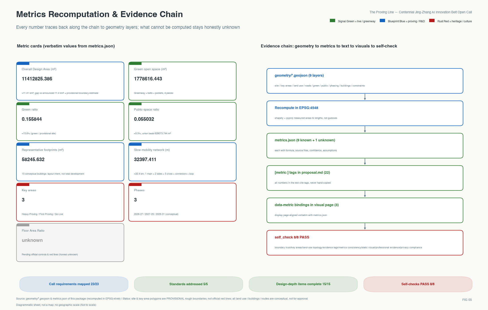

# The Proving Line: A Conceptual Urban Design Proposal for the Centennial Jing-Zhang AI Innovation Belt

> A century ago, every section of the Jing-Zhang Railway had to pass track-proving acceptance before trains were allowed through; a century later, this line becomes the proving line that global AI capabilities must pass before entering the real city — proved first, then opened, with rollback available and retirement possible. All spatial and institutional content in this proposal is a conceptual recommendation and reference scheme for professional teams to deepen; it does not replace statutory planning and does not constitute a government-approved conclusion.

## Executive Summary

Among the two-hundred-plus proposals already merged in this open call, "verifiable" is one of the most frequent keywords. What sets this proposal apart is that here verification is not an adjective but an operable urban institution with a historical prototype: a century ago the Jing-Zhang Railway earned the right of passage through section-by-section track-proving acceptance, and this proposal upgrades that tradition into a four-step go-live protocol for AI scenarios (Apply - Prove - Open - Retire). Every scenario pre-agrees its operator, red-card stop conditions, post-exit space restoration, and a public trigger procedure, with assessable recommended operating parameters and three falsifiable first-phase success questions; scenarios that fail proving or retire midway enter a public failure archive - stopping in time is itself recorded as a contribution. Spatially, five east-west stitching corridors answer the century-old urban divide created by the rail corridor, the fully opened 9 km heritage-park green corridor serves as the proving-line spine, and three differentiated proving districts are organized from north to south, with two wings for factor supply and scenario opening. In one sentence: this is not another AI showcase belt, but a full construction blueprint of an acceptance institution - who is responsible, how it stops, and what happens to the space afterwards all have pre-written answers.

This proposal answers four real urban questions. First, for a century the rail corridor has drawn a long north–south wall through the city, leaving the campuses, industrial parks, and communities on its two sides turned away from each other. Second, the daily life of about 450,000 residents in 70 communities along the line needs not an abstract industrial narrative but perceptible service improvement and the right to be informed about new technology. Third, this is a fully built-up area with almost no incremental land, so every ambition must be realized within existing space. Fourth, for AI to enter public space, the first threshold is not technology but trust. The proving-line institution answers these four questions one by one: the five stitching corridors re-stitch east and west, the four proving steps let technology earn trust under the citizens' watch, existing carriers are activated progressively according to proving results, and the green corridor returns the improvement to the residents. The proving line is also the operating system of integrated "people, city, industry" development: industry = the industrialization of scenario proving, city = the three proving districts and the green corridor, people = the real needs of the five personas.

## Design Basis and Source List

The design judgments of this proposal rest on three classes of sources, all registered in this package's `sources.json` and used according to graded usability. The first class is publicly available authoritative material that can serve as a formal task basis: the Prequalification Announcement of the International Solicitation for the Urban Design of the Centennial Jing-Zhang AI Innovation Belt provides the sole authoritative basis for the three-level scope, the three key areas, the announced areas, and the design tasks [source:DATA-SRC-OFFICIAL-ANNOUNCEMENT-20260509]; the Open Call Taskbook for Global Agents on the Urban Design of the Centennial Jing-Zhang AI Innovation Belt provides the mandatory requirements of the three positionings, the five functions, the Three Zones and Two Wings, and the six agent tasks [source:DATA-SRC-AGENT-TASKBOOK-20260518]; the Ministry of Housing and Urban-Rural Development's Administrative Measures for Urban Design [standard:MOHURD-URBAN-DESIGN-MEASURES] and Measures for the Formulation and Approval of Regulatory Detailed Planning for Cities and Towns [standard:MOHURD-CONTROL-DETAILED-PLANNING], together with the Ministry of Natural Resources' Guide to Land and Sea Use Classification for Territorial Spatial Survey, Planning, and Use Regulation [standard:MNR-LAND-USE-CLASSIFICATION-GUIDE], form the professional standards base — the land-use codes, the wording of Regulatory Detailed Planning depth, and the Urban Design content of this proposal all follow them [standard:PROJECT-OFFICIAL-ANNOUNCEMENT].

The second class is site-fact material: Phase II of the Jing-Zhang Railway Heritage Park opened on 6 August 2026 and, together with Phase I, forms a 9 km linear cultural green corridor of about 53 hectares from Xizhimen to the North Fifth Ring Road, directly serving about 450,000 residents in 70 communities along the line [source:SRC-PARK-PHASE2-OPENING]; Phase I — 2.4 km and about 16.8 hectares — was completed in June 2023 [source:SRC-PARK-PHASE1]; the former Qinghuayuan Station, built in 1910 and restored and opened in 2023, carries a dual identity as railway industrial heritage and as a revolutionary heritage site on the "Journey to Beijing for the Examination" route [source:SRC-QINGHUAYUAN-STATION]. The baseline of Haidian's AI industry adopts the official figures released in March 2026 [source:SRC-HAIDIAN-AI-BASELINE]. These are the as-built anchors that distinguish this proposal from drawing-board imagination.

The third class is provisional boundary material: the precise official red line has not been published, so all spatial layers of this proposal are generated from the rough Provisional Boundary provided by the organizers [source:DATA-SRC-PROVISIONAL-BOUNDARIES-20260605], with attributes uniformly labeled provisional_constraint; the restrictions on its use and the items to be recalculated after replacement are detailed in the chapter "Three-Level Scope Framework". The structured site package (enumerations, metric ranges, standard snapshots) is registered at [source:SITE-PACKAGE]. The data gaps corresponding to this chapter have been written item by item into `assumptions.json`, and the evidence-chain relations are shown in the figure below, which also explains how the three matrices `compliance_matrix.json`, `standard_matrix.json`, and `design_depth_matrix.json` reconcile with the text, the layers, and the metrics [depth:existing_conditions_diagnosis].

All 27 registered sources are used under an explicit three-tier credibility scheme:

| Evidence tier | Criterion | Permitted use | Examples in this package |
| --- | --- | --- | --- |
| Formal basis | Official announcements, ministerial regulations, rights-cleared documents | Supports formal conclusions on scope, area, tasks, and standards | Pre-qualification announcement, agent taskbook, three ministerial standards |
| Factual background | Authoritative media and official press releases | Supports current facts and industry baselines, never spatial-control conclusions | Heritage-park opening reports, Haidian AI baseline, rail transit progress |
| Provisional lead | Organizer-supplied provisional boundaries and similar materials | Generation, visualization, and self-check only; never redlines or precise areas | provisional_boundaries.geojson |

## Three-Level Scope Framework

This proposal organizes its working depth strictly by the three-level scope set in the announcement [source:DATA-SRC-OFFICIAL-ANNOUNCEMENT-20260509]. The Coordinated Research Area, about 43.6 square kilometres (north to the North Fifth Ring Road, east to the Jingzang Expressway, south to Xizhimenwai Street, west to Wanquanhe Road), carries systemic research on the industrial ecosystem and future urban form; at this level the proposal answers how the proving-line institution can support a world-class AI innovation ecosystem. The Overall Design Area, about 11.4 square kilometres (the urban area within 1–2 kilometres around the Jing-Zhang Railway Heritage Park), carries urban renewal and Urban Design at Regulatory Detailed Planning depth; at this level the proposal sets out the overall arrangement of land use, transport, blue-green space, urban character, and renewal projects [depth:three_level_scope_framework]. The Key-Area Detailed Design Area, about 368.4 hectares, comprises from north to south the Zhongzhiyuan AI Independent Innovation Acceleration Area (about 192.1 hectares), the Beijing AI Origin Community (about 104.3 hectares), and the Dazhongsi AI Industry Cluster (about 72.0 hectares), reaching the Urban Design depth of an Integrated Planning Implementation Plan [data:geometry/key_areas.geojson#PROV-KEY-001].

It must be prominently declared: the Overall Design Area boundary in this package's `geometry/site_boundary.geojson` [data:geometry/site_boundary.geojson#SITE-001] and the polygons of the three key areas are all **rough Provisional Boundaries** (official_boundary=false, geometry_role=provisional_constraint), roughly drawn by the organizers from the textual extents of the announcement, to be used only for scheme generation, visualization, and submission self-check; they must not be used as the official red line, as an approval basis, or as a basis for precise area recalculation [source:DATA-SRC-PROVISIONAL-BOUNDARIES-20260605]. The length basis is likewise pinned down here: the 9 km of the green corridor follows the as-built press basis of the heritage park [source:SRC-PARK-PHASE2-OPENING], while about 9.7 km is the north–south derived length of the Provisional Boundary — the two bases differ, and both defer to the announcement and the future official red line. Wherever this proposal cites areas it uniformly adopts the announcement figures (43.6 square kilometres, 11.4 square kilometres, 368.4 hectares, and the respective areas of the three key areas); self-computed areas are used only for internal layer consistency checks and are marked as derived estimates in `metrics.json` [metric:site_area_sqm]. Items to be recalculated once the Official Boundary is released include: all land-use zone areas and proportions, the green space ratio and public space ratio, building layouts inside the key-area boundaries, phasing extents, and all drawings and display-page values derived from them. The spatial transmission logic of the three levels (the research level sets the ecosystem, the overall design level sets the structure, the key-area level sets implementation) is shown below [depth:overall_spatial_structure].

## Coordinated Research Area: Industry and Future City Research

**Overall concept and naming system (Agent Task 1).** The main name is "Jing-Zhang Proving Line", in English The Proving Line (full name: Jing-Zhang Proving Line), with the international communication slogan: The Proving Line — Where AI Earns the City's Trust. The naming directly carries the three positionings of the open-call taskbook. It is the centennial Jing-Zhang culture belt — "proving line" is transposed from the engineering tradition of segment-by-segment acceptance and track-proving during the construction of the Jing-Zhang Railway (according to public historical sources, this railway directed by Zhan Tianyou started construction in 1905 and opened in 1909, the first trunk railway independently designed and built by the Chinese), and its spiritual core is precisely "earning trust through verification" [source:SRC-JZ-HISTORY]. It is an urban AI life experience belt — along the 9 km green corridor citizens can perceive, experience, and supervise every AI scenario under proving or already live. And it is an AI fusion innovation belt — global AI capabilities queue here to complete the full life cycle of Apply→Prove→Open→Retire [source:DATA-SRC-AGENT-TASKBOOK-20260518]. The naming system extends downward to the three proving districts: Zhongzhiyuan as the Deep Proving Yard (deep, heavy-duty technical verification), the AI Origin Community as the First-Run District (the ecosystem's first stop and first-run proving ground), and Dazhongsi as the Go-Live District (where AI-native formats that have passed proving operate for the public); it extends further down to the node word family "proving points — mileposts — signal posts — platforms". Visual identity and logo direction (a conceptual direction, not a finished design; deployed use requires separate rights clearance of typefaces and graphics): the motif is the Jing-Zhang "人"-shaped (herringbone) alignment, its two strokes converging at the apex into a checkmark — after the climb comes the pass; the primary palette is a three-color semantic system of signal green (go), blueprint blue (engineering), and rust red (heritage), corresponding to the three spatial state labels "live, under proving, historical memory". This naming and identity system serves only the belt-wide brand and is used in a layer separate from the cultural wayfinding symbol system of the blue-green space chapter, so the two are never confused.

**The five functions and the Three Zones and Two Wings collaborative loop.** The five functions of the taskbook are each landed in this proposal as spatial carriers and mechanisms [source:DATA-SRC-AGENT-TASKBOOK-20260518]: the Full-Stack Independent AI Innovation System lands in the Zhongzhiyuan Deep Proving Yard (experimental clusters proving chip — framework — model — application layer by layer [data:geometry/land_use.geojson#LU-ZZY-SW]); the world-class AI innovation ecosystem lands in the AI Origin Community First-Run District (the ecosystem's first stop, whose core Dongsheng industrial space has already clustered more than 300 AI enterprises, over seventy percent of its tenants [source:SRC-AI-ORIGIN-COMMUNITY]); the new paradigm of AI-enabled scenario empowerment lands in the Xiaoyue River Scenario Enablement Wing (the eastern wing as an open proving ground, taking scenarios from the proving line to the wider city); the intelligent AI-vibrant city lands in the Dazhongsi Go-Live District (AI-native consumption and business formats [data:geometry/land_use.geojson#LU-DZS-W]); and the global voice in AI governance lands in the proving-line institution itself — if the scenario admission protocol of "proved first, then opened, with rollback available and retirement possible" runs successfully here, it is a public good of urban AI governance exportable to the world. The Zhongguancun Technology Services Wing is the western wing, carrying global allocation of factors and capital enablement; its relation to the proving line is "depot and supply line", and its interface mechanism has three steps (conceptual recommendation): scenarios that fail proving transfer to the west wing for technical-service diagnosis (a service list of four classes — computing power, compliance, evaluation, and financing matchmaking — undertaken by technology-service institutions, spatially anchored on the Xueyuan Road research corridor [data:geometry/land_use.geojson#LU-S5W]); after rectification and refinancing they re-apply to enter the line; and if they pass re-proving they open through the normal process. The Three Zones and Two Wings thus form a closed loop: the west wing supplies factors, the Deep Proving Yard completes deep verification, the First-Run District completes ecosystem incubation, the east wing opens scenarios, the Go-Live District serves the public, and operating data flows back to the west wing to support factor pricing — a sustainable collaborative cycle. The layout also interfaces with Haidian's current industrial system: with AI as the core, it fuses into and empowers leading industries such as information software, healthcare, and education — the eastern Xiaoyue River Scenario Enablement Wing is the key carrier where AI + vertical applications land (corresponding to scenario cards 3, 7, and 13), the west wing strengthens technology services and the eastern band completes daily-life services, with the proportions of the industrial functions pending the official regulatory basis. The reconciliation of the five functions with spatial carriers and mechanisms is given in the table below:

| Taskbook function | Spatial carrier | Carrying mechanism |
| --- | --- | --- |
| Full-Stack Independent AI Innovation System | Zhongzhiyuan Deep Proving Yard experimental cluster [data:geometry/land_use.geojson#LU-ZZY-SW] | Layer-by-layer deep proving of chip — framework — model — application |
| World-class AI innovation ecosystem | AI Origin Community First-Run District | Ecosystem first stop + incubation and talent landing |
| New paradigm of AI-enabled scenario empowerment | Xiaoyue River Scenario Enablement Wing (east) | Open proving ground taking scenarios from the line to the wider city |
| Intelligent AI-vibrant city | Dazhongsi Go-Live District [data:geometry/land_use.geojson#LU-DZS-W] | Public-facing operation of proved formats |
| Global voice in AI governance | The four-step proving institution itself | Exportable public good of urban AI governance |

The safeguard mechanisms for the eight factors — land, space, industry, capital, talent, computing power, data, and scenarios — are unfolded item by item in the policy-tools part of the chapter "Renewal Projects, Implementation Policy, and Phasing"; their mutual relations are also shown in the innovation-ecosystem map.

**Regional innovation synergy (a mandatory item of Agent Task 1).** This belt is not an isolated belt; its regional synergy relations are as follows (all conceptual envisioning, see the synergy diagram): with the Zhongguancun AI Beiwei Community it co-forms the multi-node pattern of Haidian's artificial-intelligence innovation districts (the Beiwei Community is built, in service, and tenanted by enterprises [source:SRC-HAIDIAN-POLICY]); northward, verification demand generated by the big-science facilities of Future Science City and Huairou Science City can flow into the Deep Proving Yard; toward the southeast, proved scenarios and the scaled manufacturing capacity of the Beijing Economic-Technological Development Area form the division-of-labor hypothesis "proved in Haidian, mass-produced in Yizhuang"; and along the Jing-Zhang high-speed rail corridor the belt extends its computing and data hinterland toward Huailai and Zhangjiakou, joining the Beijing-Tianjin-Hebei collaborative innovation loop.

**Global AI innovation ecosystem cases (Agent Task 2; 8 cases, each noting the transferable mechanism and the conditions that cannot be directly transplanted).** The case study table:

| Case | Core mechanism | Transferable point for this belt | Conditions not directly transplantable |
| --- | --- | --- | --- |
| Station F, Paris [source:SRC-CASE-STATIONF] | An old rail freight station converted into the world's largest single-building startup campus, with construction cost borne by private capital and government supplying policy only | Heritage-building activation + a flagship venue operated with private capital | An investment structure dependent on a single philanthropic funder |
| Kendall Square, Boston [source:SRC-CASE-KENDALL] | Statutory zoning requires new buildings to provide innovation space, part of it supplied below market rent to micro and small enterprises | An "innovation-space provision ratio" as a regulatory policy tool to be studied | Local zoning powers differ from China's Regulatory Detailed Planning system |
| one-north, Singapore [source:SRC-CASE-ONENORTH] | The government landlord prices innovation space at industrial-workshop rents; LaunchPad supported more than 2,000 startups over ten years | A tiered rent-pricing regime for state-owned carriers | A single statutory development agency controlling all the land |
| King's Cross, London [source:SRC-CASE-KINGSCROSS] | Derelict railway land developed integrally by a single land-partnership entity, with a knowledge-institution alliance as soft governance | Direct evidence of a railway heritage district growing into an AI cluster + the universities' light "knowledge alliance" governance | Single-landlord ownership structure |
| Pangyo Techno Valley, Seoul [source:SRC-CASE-PANGYO] | Land supplied at prices markedly below the city centre in exchange for firms' long-term R&D commitments | Flexible industrial land transfer tied to R&D commitments (to be studied) | A provincial-government model of wholly new land supply, unlike this stock-renewal context |
| Hetao, Shenzhen [source:SRC-CASE-HETAO] | A cross-border data whitelist pilot and a joint two-territory policy package | An institutional pilot on AI training-data circulation and scenario opening (to be studied) | Port location and cross-border institutional premises |
| Quayside, Toronto (negative case) [source:SRC-CASE-TORONTO] | Data-governance arrangements failed to build public trust, the privacy expert publicly resigned, and the project was terminated in 2020 [source:SRC-TORONTO-CLOSURE] | Lesson: "anonymization at collection, public-sector-led data governance, accountable Human Review" set as a one-vote veto item of the proving line | — (cited as a risk mirror) |
| Kashiwa-no-ha, Japan [source:SRC-CASE-KASHIWA] | A standing urban design centre of government, enterprises, and universities coordinates block-level decisions | A standing "Jing-Zhang Proving Line Urban Design Centre" platform (conceptual recommendation) | Single-developer land base |

Together the eight cases form a mechanism spectrum: land control, carrier pricing, single-entity development, factor mobility, standing governance, and the trust bottom line. The belt's own innovation-ecosystem map is shown below: five classes of actors (universities and institutes, enterprises and startups, capital and service institutions, evaluation and standards institutions, government and platforms) organize around the four-step proving loop, and the eight factors — land, space, industry, capital, talent, computing power, data, and scenarios — flow along the Three Zones and Two Wings collaborative loop.

**AI changing urban form and the planning method itself.** First envision the impact: artificial intelligence first changes the mode of production — R&D becomes verification, agents become new units of labor and collaboration, and scenario operating data becomes a new factor of production; it simultaneously changes ways of living — AI public services enter daily life in a form that is visible, questionable, and stoppable. Urban form and the planning method must provide spatial adaptation for this change, and the proving-line institution thereby catalyzes three discussable innovations [depth:overall_spatial_structure]. First, a **self-adaptive, evolvable urban development model** — self-adaptive means proving-line operating data drives dynamic adjustment of use-compatibility lists and spatial allocation (a red-carded scenario means spatial rollback); evolvable means the reserved proving area [data:geometry/land_use.geojson#LU-ZZY-NW] progressively solidifies into formal functions once proved, so the urban development model turns from one-off blueprint finalization into a continuous process of succession following proving results; the spatial organization of urban functional elements in the AI era correspondingly turns to organization by proving life cycle — functions under proving arrayed along the proving line, proved functions solidifying toward the east and west bands, and retired functions vacated and restored. Second, planning as a continuously verified living document — this open call is itself demonstrating that plan-making can be a continuous-integration process of "multi-agent scheme generation, machine-readable validation, human professional adjudication, publicly logged iteration", and this proposal recommends settling that method into the belt's routine comprehensive planning practice (conceptual recommendation). Third, an innovation path for territorial spatial planning — treating "AI scenario land" as a class of life-cycle-managed temporary uses, achieving time-shared reuse of space through use-compatibility lists and exit conditions without changing statutory land use (for professional teams to deepen).

On this basis the proposal attempts to define the AI culture, AI society, and AI city of the future (conceptual definitions, for discussion): AI culture = the public culture of earning trust through verification, carrying forward the Jing-Zhang acceptance spirit; AI society = a new social contract in which humans and agents produce together, sign together, and share responsibility — the Honor Wall is its memorial institution and the red card its accountability institution; AI city = an evolvable city whose operating system is full-life-cycle scenario management, of which the proving line is the minimal prototype.

The **proving-line data base (conceptual recommendation)** supporting these mechanisms runs in four steps: scenario telemetry, de-identified, aggregates into the digital-twin base; the base is the open-source continuation of this package's geojson and metrics data (the annualized operation of this repository's open mechanism); quarterly reviews and the annual "Proving Line Retrospective" publish the data; and three classes of events — release of the Official Boundary, release of regulatory conditions, and scenario retirement — trigger recalculation of layers and metrics. The maintaining parties of each step are the belt operating body and the local government platform (conceptual recommendation). Haidian has the industrial base to host these experiments: more than 2,000 AI enterprises, 26 unicorns, 130 registered large models, an AI core industry scale exceeding RMB 350 billion, 95,000 AI professionals, and 135 AI2000 top-ranked scholars worldwide [source:SRC-HAIDIAN-AI-BASELINE]; at the district level the Zhongguancun AI Beiwei Community is built and in service and the policy push toward an artificial-intelligence industry high ground keeps intensifying, and this belt co-forms the district layout together with innovation-district carriers such as the AI Origin Community and the Beiwei Community [source:SRC-HAIDIAN-POLICY].

## Overall Design Area: Urban Renewal and Regulatory-Plan-Level Urban Design

**Overall spatial structure: one line, three proving districts, five stitches, two wings.** The one line is the 9 km proving-line green corridor [data:geometry/land_use.geojson#LU-100], with the completed and fully connected heritage park as its skeleton [source:SRC-PARK-PHASE2-OPENING]; the three proving districts are the three key areas; the five stitches are east–west stitching corridors at Dazhongsi, Xitucheng, Wudaokou, Qinghua East Road, and Zhongzhiyuan [data:geometry/roads.geojson#ROAD-EW-001], answering the long-standing east–west urban severance caused by the rail corridor; the two wings are the Zhongguancun Technology Services Wing (west) and the Xiaoyue River Scenario Enablement Wing (east). The land-use logic within the Overall Design Area: with the green corridor as the spine, the west side is led by research and education uses receiving innovation spillover from universities and institutes [data:geometry/land_use.geojson#LU-S5W], while the east side is led by commercial-service and residential uses receiving daily services and scenario opening [data:geometry/land_use.geojson#LU-YD-E]; the southern segment strengthens business and cultural functions and the northern segment keeps flexible reserve; all land-use codes adopt the Ministry of Natural Resources classification system [standard:MNR-LAND-USE-CLASSIFICATION-GUIDE].

**Urban renewal framework.** The belt is a fully built-up area; renewal follows the principle of "stock activation first, demolition and rebuilding as the exception" (conceptual recommendation) [standard:MOHURD-URBAN-DESIGN-MEASURES]. Three renewal objects: first, format renewal of existing commercial facilities — the large-format home-furnishing commerce in the Dazhongsi area began closure and conversion in 2025 and is currently one of the belt's most representative whole-building malleable spaces [source:SRC-DZS-RENEWAL]; second, opening-up renewal along university and institute edges — the Xueyuan Road area already has the "three belts and one node" innovation-district practice [source:SRC-XYL-INNOVATION], and this proposal recommends prioritizing the opening of campus-wall interfaces along the five stitching corridors (conceptual recommendation); third, operational renewal along the heritage park — the park hardware is complete, so renewal shifts from construction to AI narrative overlay and scenario operation. The four renewal deliverables required by the announcement correspond in this package to: the renewal key-area distribution map = the three phases located in the phasing layer [data:geometry/phasing.geojson#PH-001]; the renewal spatial structure map = the "one spine, two bands plus five stitches" structure diagram; the land-use layout map = the land-use layer [data:geometry/land_use.geojson#LU-100]; and the renewal implementation project list = the 13-project list of the renewal chapter. Renewal projects and phasing are detailed in the chapter "Renewal Projects, Implementation Policy, and Phasing" [depth:renewal_project_list].

**Indicator discipline at Regulatory Detailed Planning depth.** The Overall Design Area must reach the Urban Design depth of Regulatory Detailed Planning [standard:MOHURD-CONTROL-DETAILED-PLANNING]. However, the belt's official regulatory conditions (Floor Area Ratio, building height, building coverage ratio, green space ratio, setbacks) have not been published with the open taskbook, so this proposal adopts the discipline of "basis stated, values withheld": the Floor Area Ratio entry in `metrics.json` remains in the unknown state with the gap reason noted [metric:floor_area_ratio], and the text gives only each indicator's calculation basis, data preconditions, and assignment trigger (release of the official regulatory plan or taskbook annexes), fabricating no values; this blank results from the unpublished official regulatory plan, and the assignment triggers are registered in the assumptions list [depth:development_intensity_controls]. The structural indicators computed by the scheme (green space ratio, public space ratio, etc.) are scheme-recommended values based on the Provisional Boundary [metric:green_ratio] [metric:public_space_ratio], expressing the magnitude of design intent rather than approved control values.

**Urban character control (conceptual recommendation).** The urban keynote of the Centennial Jing-Zhang AI Innovation Belt is "a modest background city, a legible proving-line foreground": buildings along the line act as a low-contrast background, continuing the grey-brick and warm-white palette of the academic districts; the proving-line corridor and its nodes act as a high-recognition foreground using the signal green, blueprint blue, and rust red semantic system; industrial memory elements (rails, spikes, signals, mileposts) are used as accent symbols only within the corridor and station nodes [depth:height_massing_character]. Building height, intensity, and massing control follow the principled requirement "do not overwhelm the heritage park, do not block heritage sightline corridors"; for roof form the proposal advocates a calm and orderly fifth facade, encouraging roof greening integrated with photovoltaics (conceptual recommendation; control values pending the regulatory plan). Specific control values are to be determined by professional teams once the official regulatory conditions are clarified [data:geometry/buildings.geojson#B-QHY-STATION].

## Detailed Design of Key Areas

Each of the three key areas forms a complete sub-scheme of "positioning — spatial structure — building renewal — transport and walking-cycling — public space — AI scenarios — implementation risk", all built on rough Provisional Boundaries and constituting directional detailed design (conceptual recommendation) [data:geometry/key_areas.geojson#PROV-KEY-002] [depth:three_key_area_detailed_design].

**Zhongzhiyuan AI Independent Innovation Acceleration Area (about 192.1 hectares) — Deep Proving Yard.** Positioning: the deep-verification base of the Full-Stack Independent AI Innovation System, carrying heavy testing and verification of chips, frameworks, models, and agents; seizing the opportunity of national artificial-intelligence platform building, it is cultivated toward a national-level AI cluster (conceptual recommendation) — the proving protocol itself is an experimental carrier for standards-setting and safety-governance agendas. Spatial structure: the south holds the full-stack experimental cluster [data:geometry/land_use.geojson#LU-ZZY-SW], with laboratory and R&D buildings [data:geometry/buildings.geojson#B-ZZY-LAB1]; the middle holds shared sports and daily-life support; the north holds the long-term reserve area and the Fifth Ring protective green belt [data:geometry/land_use.geojson#LU-ZZY-NE] — the reserve is the test field of the "evolvable form": only functions that pass proving are allowed to solidify. Building renewal: mainly new R&D and experimental facilities (conceptual recommendation; scale pending the regulatory plan). Transport and walking-cycling: an internal secondary ring organizes freight and commuting [data:geometry/roads.geojson#ROAD-SEC-ZZY], and the Zhongzhiyuan stitching corridor connects eastward toward Qinghe. Public space: the First-Launch Plaza doubles as industry display and the public demonstration ground of heavy verification results [data:geometry/public_space.geojson#PS-004], creating an international, low-carbon, green environment of innovation exchange (conceptual recommendation). AI scenarios: the low-speed autonomous shuttle proving loop and the adversarial testing ground for urban-service agents (see scenario cards). Implementation risk: baseline data for the northern land is missing; the entire layout awaits recalibration after site survey and Official Boundary confirmation [depth:risk_missing_data].

**Beijing AI Origin Community (about 104.3 hectares) — First-Run District.** Positioning: the first ecosystem stop for global AI talent and projects entering the belt, anchored on the already-operating policy-zone core of the AI Origin Community [source:SRC-AI-ORIGIN-COMMUNITY]. Spatial structure: a western R&D core oriented toward Tsinghua Science Park [data:geometry/land_use.geojson#LU-YD-W], the eastern Wudaokou youth commercial vitality area [data:geometry/land_use.geojson#LU-YD-E], and at the centre the former Qinghuayuan Station as the spiritual origin of the entire proving line [data:geometry/buildings.geojson#B-QHY-STATION]. Building renewal: the Qinghuayuan Station is retained (heritage building, status-quo retention); incubators, talent apartments, and mixed-use buildings combine stock conversion with limited new construction (conceptual recommendation) [data:geometry/buildings.geojson#B-YD-APT]. Transport and walking-cycling: the Wudaokou and Qinghua East Road stitching corridors meet here, and the Wudaokou station feeder line strengthens rail interchange [data:geometry/roads.geojson#ROAD-TC-WDK]. Public space: the station-front plaza (site of the proving line's Kilometre Zero Marker) and the Contributors' Honor Wall memorial belt [data:geometry/public_space.geojson#PS-005]. AI scenarios: first run of the AI cultural guide and the enterprise-service copilot pilot (see scenario cards). Implementation risk: the area's existing ownership and building baselines are complex; renewal sequencing must be verified building by building (data pending).

**Dazhongsi AI Industry Cluster (about 72.0 hectares) — Go-Live District.** Positioning: the urban living room where AI-native new formats that have passed proving (consumption and business in equal measure) operate at scale for the public. Spatial structure: the western AI-native consumption area [data:geometry/land_use.geojson#LU-DZS-W] and the eastern industrial-carrier renewal area [data:geometry/land_use.geojson#LU-DZS-E]. Building renewal: the existing commercial complex (vacating and conversion already started [source:SRC-DZS-RENEWAL]) is renewed into a demonstration carrier of AI-native formats [data:geometry/buildings.geojson#B-DZS-RETAIL]; the Dazhongsi station Transit-Station Integration feeder facility improves interchange efficiency (conceptual recommendation, containing no engineering feasibility conclusion) [data:geometry/buildings.geojson#B-DZS-HUB]. Transport and walking-cycling: the Dazhongsi stitching corridor links the Ancient Bell Museum with the new-format carriers, plus the station feeder line [data:geometry/roads.geojson#ROAD-TC-DZS]. Public space: the Go-Live Plaza — the ceremonial space where scenarios "graduate" from the proving line into operation [data:geometry/public_space.geojson#PS-003], forming a "ring the bell at go-live" narrative linkage with the ancient bell culture of Juesheng Temple (the Great Bell Temple) [source:SRC-HERITAGE-TEMPLES]. AI scenarios: routine robot delivery operation (referring to the target state after proving on the line, conceptual recommendation), AI-native retail, AI conferences and proving-showcase roadshows (business scenario, see scenario card 13), and health-service navigation (see scenario cards). Implementation risk: character coordination around heritage-protection units and the pacing of commercial renewal require professional coordination.

## AI Innovation Ecosystem, Personas, and AI+ Scenarios

**Five user personas and their needs (Agent Task 3).** The persona table is as follows [depth:existing_conditions_diagnosis]:

| Persona | Core needs | Activity radius | Scenario cards |
| --- | --- | --- | --- |
| AI developers and startup teams | Low-cost proving grounds, compliant channels for computing power and data | First-Run District, Deep Proving Yard | 2, 4, 7, 13 |
| University faculty and students | Open campus interfaces, youth third places, a project pathway from classroom to proving line | First-Run District, stitching corridors | 5, 6, 9 |
| Residents along the line (about 450,000 [source:SRC-PARK-PHASE2-OPENING]) | Improved daily services, channels to exercise the right to know about and to veto AI facilities | Full green corridor, eastern-band communities | 1, 3, 6, 10, 12 |
| Enterprises and investment institutions | Comparable scenario-proving data and conversion channels | Go-Live District, west wing | 4, 7, 13 |
| Visitors and international peers | A walkable, comprehensible AI-city narrative route | Landmark nodes along the line | 5, 8, 11 |

The needs of the five personas jointly point to an integrated "work — life — social — learning" urban space system: work = the carriers of the three proving districts, life = eastern-band housing and health kiosks, social = the platform plazas and the Go-Live Festival, learning = open university interfaces and the Developers' Platform, with the proving-line green corridor as the integrated spatial bond.

**Thirteen AI scenario cards (including four industrial testing and validation scenarios, marked ★).** This proposal takes the eastern Xiaoyue River Scenario Enablement Wing and the Xueyuan Road health-service area as the carrying zones for the announcement's "scenario design in a self-selected area (optional item)", covering announcement-named fields such as AI + healthcare (scenario 3), AI + information software (scenario 7), and AI + daily-life services (scenarios 1 and 10). Each card gives: spatial location, service persona, operating data and privacy boundary, Human Review arrangement, recommended operator type, cost basis (composition only, no values), red-card suspension conditions, and post-exit space disposal; wherever a public entity is recommended to take the lead, the card openly names the type of public institution (district government, administrative committee, local sub-district, park operating body, district-owned platform company, etc.) — indicating only the direction of the public institution recommended for interfacing, not its commitment — while enterprises are described by type only and never named. All scenarios are conceptual recommendations that must withstand three questions: who is responsible, how does it stop, and what happens to the space after it stops [source:DATA-SRC-AGENT-TASKBOOK-20260518].

1. **★ Low-speed delivery robot proving segment** (robot-delivery-low-speed): located on the corridor's southern service lane and the Dazhongsi stitching corridor [data:geometry/roads.geojson#ROAD-EW-001]; serves residents and merchants; collects only de-identified operating telemetry, no facial data; daily Human Review of anomaly event logs; recommended operator: licensed logistics enterprises under joint supervision with the sub-district (type description, no specific company designated); cost basis: vehicle depreciation, operations staffing, insurance, and prorated feeder facilities; red card: any collision with a pedestrian, or complaints above threshold for three consecutive days, suspends operation; after exit the service lane reverts to walking and cycling only and the charging bays become non-motorized parking.
2. **★ Low-speed autonomous shuttle proving loop**: located on the Zhongzhiyuan secondary ring [data:geometry/roads.geojson#ROAD-SEC-ZZY]; serves campus commuters; no in-vehicle imagery is retained and the roadside keeps only structured event data; full-time safety stewards on duty throughout, with weekly joint review; recommended operator: a district-level platform entity; cost basis: vehicles, safety stewards, and prorated roadside works; red card: any situation beyond the safety steward's takeover capability stops the loop; after exit the ring reverts to ordinary campus traffic.
3. **★ AI health-service navigation kiosk** (ai-health-service-navigation): located in the Xueyuan Road health-service area [data:geometry/land_use.geojson#LU-S5E]; serves elderly residents and people seeking care; provides public-service navigation only, gives no medical advice, and retains no health records; community medical staff spot-check reply quality daily; recommended operator: community health service institutions; cost basis: terminal devices, content maintenance, and medical-supervision hours; red card: any verified case of clinical misdirection takes it offline for rectification; after exit the kiosk becomes an ordinary community service point.
4. **★ Adversarial testing ground for urban-service agents**: located in the Zhongzhiyuan full-stack experimental area [data:geometry/buildings.geojson#B-ZZY-RD1]; serves AI enterprises and evaluation institutions; uses synthetic and authorized data on physically isolated networks; test reports are signed off manually by third-party evaluation institutions; recommended operator: professional evaluation institutions; cost basis: venue, computing power, and evaluation staffing; red card: any real personal data entering the site terminates that batch; after exit the experimental space becomes a general-purpose laboratory.
5. **AI cultural guide** (ai-cultural-guide): located at Qinghuayuan Station and along the full proving line [data:geometry/public_space.geojson#PS-001]; serves visitors and students; generates guiding content from public historical materials with explicit AI-generated labeling; quarterly review and correction by cultural-history experts; recommended operator: the park operator and cultural heritage institutions; cost basis: content production, devices, and review hours; red card: verified complaints of factual error take the relevant content down; after exit the guide facilities become ordinary signage.
6. **AI-assisted walking-flow assessment** (ai-traffic-walkability): located on the five stitching corridors and the Xiaoyue River east-wing waterfront walking segment [data:geometry/roads.geojson#ROAD-EW-003] [data:geometry/green_space.geojson#GS-003]; serves commuters and planning authorities; uses anonymous counting and cross-section statistics only, no individual identification; conclusions enter improvement recommendations only after quarterly Human Review; recommended operator: transport research institutions, with the local sub-district taking the lead in interfacing; cost basis: sensing facilities and analysis staffing; red card: discovery of any data capable of reconstructing individual trajectories triggers rectification; after exit the facilities are removed and the data destroyed.
7. **Enterprise-service copilot** (enterprise-service-copilot): located in the First-Run District R&D core [data:geometry/land_use.geojson#LU-YD-W]; serves startups; based on public policy texts, with replies labeled with basis and validity period; government-service staff review high-risk replies; recommended operator: the park service platform; cost basis: model calls, knowledge-base maintenance, and Human Review hours; red card: any case of a reply being treated as an administrative commitment triggers strengthened disclaimers and rectification; after exit it reverts to an all-human service window.
8. **Public-safety operations review** (public-safety-operations-review): a temporary command scenario during large events on the proving line; serves event organizers; consumes only statistical-layer data from existing public video and adds no collection points; every disposition decision is made by humans, with AI providing risk prompts only; recommended operator: the local administrative authority; cost basis: integration development and duty staffing; red card: any automated-disposition case shuts it down; after exit the system goes offline and the interfaces are closed.
9. **Developers' Platform (youth third place)**: located at the Wudaokou Proving Line Plaza [data:geometry/public_space.geojson#PS-002]; serves university students, faculty, and developers; registration-based events collect no additional personal data; the venue is managed by people; recommended operator: a social operator; cost basis: venue conversion and event operations; red card: commercial encroachment on public open hours beyond the agreement triggers rectification; after exit the plaza reverts to general public space.
10. **AI-native retail demonstration**: located in the Dazhongsi stock-commerce renewal carrier [data:geometry/buildings.geojson#B-DZS-RETAIL]; serves consumers; in-store sensorless payment must be prominently disclosed with traditional payment channels retained; routine market-supervision sampling; recommended operator: a commercial operator; cost basis: conversion, systems, and operations; red card: compulsory biometrics or removal of the cash channel triggers rectification; after exit it reverts to conventional retail.
11. **AI Honor Wall and contributor memorial system**: located on the Honor Wall memorial belt [data:geometry/public_space.geojson#PS-005]; serves global developers and visitors; displays only publicly attributed information confirmed by the person concerned; human final review before anything goes on the wall; recommended operator: the belt operating body; cost basis: construction and content maintenance; red card: any unauthorized attribution is taken down; after exit it becomes a general cultural display wall.
12. **Proving-line digital-twin disclosure screens**: located on the three proving-district plazas [data:geometry/public_space.geojson#PS-004]; serve public oversight; display only scenario status, proving progress, and the complaint entry point, never individual data; the operator updates weekly and accepts corrections; recommended operator: the belt operating body, with a district-owned platform company leading construction; cost basis: screen hardware and data-interface maintenance; red card: data left unrefreshed beyond two weeks counts as a breach of trust and the screen goes offline; after exit the screen bays become public information screens.
13. **AI conference and proving-showcase roadshow hall (AI-native business scenario)**: located in the eastern Dazhongsi industrial-carrier renewal area [data:geometry/land_use.geojson#LU-DZS-E]; serves enterprises, investment institutions, and international visitors; published content is limited to public information and event registration collects the minimum; roadshow materials are published only after Human Review by the organizer; recommended operator: a commercial operator jointly with the belt operating body, with a Zhongguancun Science City administrative-committee-type body interfacing for guidance; cost basis: venue conversion, event operations, and equipment maintenance; red card: any false publicity or unauthorized data display triggers rectification; after exit it becomes conventional conference and business space.

The mapping between these scenario cards, the spatial layers, and the operating mechanisms forms the "scenario — space — operation" matrix (summary table below; full fields in the cards): scenarios 1 through 4 are industrial testing and validation (closed to semi-open), concentrated in the Deep Proving Yard and the corridor service lanes; scenarios 5, 6, and 7 are public-service augmentation, deployed along the proving line, the stitching corridors, and the east wing; scenarios 8 through 13 are public-space and operations types, anchored on the three plazas, the memorial belt, and the Go-Live District carriers.

| Card | Scenario | Spatial location (layer anchor) | Service persona | Recommended lead public entity (named direction) | Operator type |
| --- | --- | --- | --- | --- | --- |
| 1★ | Low-speed delivery proving segment | Southern corridor service lane + Dazhongsi stitch | Residents / merchants | Local sub-district | Licensed logistics enterprise |
| 2★ | Autonomous shuttle proving loop | Zhongzhiyuan secondary ring | Campus commuters | Zhongguancun Science City administrative-committee-type body | District-level platform entity |
| 3★ | Health navigation kiosk | Xueyuan Road health-service area | Elderly residents / care seekers | Community health service institution | Community health service institution |
| 4★ | Adversarial testing ground | Zhongzhiyuan experimental area | AI enterprises / evaluators | District-owned platform company | Professional evaluation institution |
| 5 | AI cultural guide | Qinghuayuan Station + full line | Visitors / students | Park operating body | Park operator + cultural heritage institutions |
| 6 | Walking-flow assessment | Five stitches + Xiaoyue River segment | Commuters / planning authorities | Local sub-district | Transport research institution |
| 7 | Enterprise-service copilot | First-Run District R&D core | Startups | Zhongguancun Science City administrative-committee-type body | Park service platform |
| 8 | Public-safety review | Temporary large-event scenario | Event organizers | Local administrative authority | Local administrative authority |
| 9 | Developers' Platform | Wudaokou Proving Line Plaza | Faculty, students / developers | Local sub-district | Social operator |
| 10 | AI-native retail | Dazhongsi renewal carrier | Consumers | District market-supervision direction | Commercial operator |
| 11 | Honor Wall memorial system | Honor Wall memorial belt | Global developers / visitors | Belt operating body | Belt operating body |
| 12 | Digital-twin disclosure screens | Three proving-district plazas | Public oversight | District-owned platform company | Belt operating body |
| 13 | AI conference and roadshow hall | Eastern Dazhongsi carrier | Enterprises / investors / international visitors | Zhongguancun Science City administrative-committee-type body | Commercial operator |

All scenarios follow one unified privacy bottom line: default anonymity, minimal collection, public-sector-led data governance, and accountable Human Review — the one-vote veto line extracted from the failure of Toronto's Quayside [source:SRC-CASE-TORONTO] [depth:risk_missing_data]. The public entities named above indicate only the direction of public institutions recommended for interfacing and do not represent any institution's commitment or settled arrangement.

## Land Use, Building Scale, and Retain-Renovate-Demolish Strategy

**Land-use layout.** The Overall Design Area forms a "one spine, two bands" land-use structure: the central green-corridor land runs through from south to north [data:geometry/land_use.geojson#LU-100]; the western band is led by research and education land jointly receiving university innovation spillover [data:geometry/land_use.geojson#LU-S4W]; the eastern band arranges commercial-service land, residential land, and reserved land in gradient [data:geometry/land_use.geojson#LU-N2E]. Classification strictly adopts the project subset of codes from the Ministry of Natural Resources guide [standard:MNR-LAND-USE-CLASSIFICATION-GUIDE], covering commercial services, residential, research, culture, education, sports, healthcare, park green space, protective green space, and reserved land; all polygons are generated by exact partition of the same Provisional Boundary, with no gaps and no overlaps [depth:land_use_layout]. The area and share of each class can be recomputed from `geometry/land_use.geojson` and `metrics.json` [metric:site_area_sqm].

**Building scale and intensity (basis stated, values withheld).** This proposal states the calculation basis for building scale: total building scale equals retained building scale plus renewed-carrier scale plus new-construction scale, where new construction is constrained by the regulatory Floor Area Ratio and height controls. Because the official regulatory conditions are missing [metric:floor_area_ratio], this proposal gives no total figure and expresses layout intent only through 15 representative building footprints [data:geometry/buildings.geojson#B-YD-INC] [metric:building_footprint_area_sqm], with all heights and massing labeled "conceptual recommendation, pending official regulatory confirmation". This restraint is a discipline of expression: before official data is released, any total figure would be unverifiable pseudo-precision [depth:development_intensity_controls].

**Demolish–Renovate–Retain Strategy (principled classification, conceptual recommendation).** Retain: all heritage-protection units and immovable cultural relics (the former Qinghuayuan Station and others [data:geometry/buildings.geojson#B-QHY-STATION]), the completed heritage park in its entirety, and research and residential buildings in sound operation. Renovate: existing commercial facilities (with the Dazhongsi area as the representative [source:SRC-DZS-RENEWAL]), campus interface buildings along the stitching corridors, and aging office carriers. Demolish: only dilapidated and severely inefficient buildings confirmed by professional safety and benefit assessment; this proposal names no specific demolition object — plot-level demolish-renovate-retain conclusions are statutory-procedure matters to be decided by professional teams after building surveys and ownership investigation are complete [depth:retain_renovate_demolish]. The space-supply strategy draws on the Kendall Square experience: studying a policy tool that requires renewal projects to provide innovation space at a set ratio (conceptual recommendation) [source:SRC-CASE-KENDALL].

## Transport, Rail, Municipal Infrastructure, and Public Services

**Rail and Transit-Station Integration.** The belt's rail conditions have improved markedly in recent years: the Line 13 split project keeps advancing [source:SRC-METRO-STATUS], and Line 18 (Malianwa — Tiantongyuan East), whose designation derives from that split, opened for trial operation on 27 December 2025 [source:SRC-METRO-18-OPENING]; the Changping Line southern extension was fully connected in December 2024 and runs through the Xueyuan Road corridor [source:SRC-CPX-NANYAN]. This proposal sets feeder-strengthening lines at the Dazhongsi, Zhichunlu, and Wudaokou stations [data:geometry/roads.geojson#ROAD-TC-ZCL] and recommends Transit-Station Integration design studies (conceptual recommendation, containing no rail alignment or bridge/tunnel engineering conclusions). The Dazhongsi station feeder facility [data:geometry/buildings.geojson#B-DZS-HUB] is positioned as the "Go-Live District gateway", with its specific engineering scheme to be determined by professional transport design [depth:traffic_rail_slow_parking].

**Walking and Cycling Network and a perceivable, interactive AI-enabled transport system.** The proving-line corridor already has a connected "three trails and one green belt" walking-cycling base (walking trail, jogging trail, cycling trail) [source:SRC-PARK-PHASE2-OPENING]. On top of this the proposal overlays the greenway mainline [data:geometry/roads.geojson#ROAD-GW-001], two cycling sidelines east and west of the spine [data:geometry/roads.geojson#ROAD-CY-W], and the five stitching corridors, forming a "one main, two secondary, five cross" Walking and Cycling Network that, together with the blue-green system, constitutes a north–south through and east–west connected system of walking trails, cycling trails, and green space, whose total length can be recomputed from the layers [metric:road_network_length_m]. The stitching corridors prioritize resolving east–west break points across the rail heritage and campus walls, and double as carriers for opening up branch-road micro-circulation — the stitching points simultaneously sort out surrounding branch-road break points (conceptual alignments), with cross-sections and junction designs pending professional work. On this skeleton a perceivable, interactive AI-enabled transport system is planned (conceptual recommendation): the sensing layer relies mainly on anonymous cross-section counting and walking-flow assessment (scenario card 6), with no individual identification; the interaction layer includes low-speed shuttle hailing, pedestrian-priority signal suggestions, and real-time queries on the digital-twin screens (scenario cards 1, 2, and 12); all transport AI services retain traditional ways of use, and the sensing and interaction capabilities are planned in parallel with the continuous green space system. Parking and non-motorized organization follow the principled arrangement of "rail-station catchments first, independent provision for proving scenarios" (conceptual recommendation).

**Municipal and new infrastructure.** Baseline data on conventional municipal utilities is missing, so this proposal offers systemic recommendations only (conceptual recommendation): exploring a converged development model and implementation path between new AI-industry service facilities such as distributed energy and edge computing and conventional water supply, drainage, and power facilities — the convergence model is a trinity of "proving-district-level microgrids + distributed computing nodes + charging facilities" deployed along the proving line, and the implementation path is to pilot in a single proving district first and roll out in phases after verification (drawing on the Kashiwa-no-ha area energy management experience — its smart centre dispatches electricity across blocks and reportedly cuts area peak load substantially, a secondhand figure cited as background only [source:SRC-CASE-KASHIWA]) [depth:municipal_new_infrastructure]. No municipal content includes pipeline relocation or capacity conclusions; professional agencies will compute these once official baselines are available.

**Public services.** Daily services for about 450,000 residents in 70 communities are the public-interest baseline of the proving line [source:SRC-PARK-PHASE2-OPENING]: the Xueyuan Road health-service area hosts the health navigation kiosk [data:geometry/land_use.geojson#LU-S5E], Wudaokou hosts the youth third place, and the proving-district plazas double as community activity venues; capacity data for education, healthcare, and elderly care is missing, so expansion needs are listed as items pending verification [depth:risk_missing_data].

## Blue-Green Network, Public Space, and Urban Character

**Blue-green network.** With the proving-line corridor as the green spine [data:geometry/green_space.geojson#GS-001], joining the Fifth Ring protective green belt at the northern end [data:geometry/green_space.geojson#GS-002] and two pocket green belts along the Xiaoyue River on the eastern wing [data:geometry/green_space.geojson#GS-003], the network forms a "one spine, one belt, many points" blue-green structure that overlays with the walking-cycling network into a continuous, unbounded green space system — "continuous" is guaranteed by the 9 km green spine and the five cross stitches, and "unbounded" means the hard edges between the corridor and the campuses, industrial parks, and communities are progressively opened (conceptual recommendation) [metric:green_space_area_sqm] [metric:green_ratio]. Along the Qing River and the Xiaoyue River, waterfront walking and pocket green belts are arranged with livability, workability, and human friendliness as the orientation; the Xiaoyue River watercourse itself is a locked existing element — this proposal places only landside green belts and walking-cycling links along it and includes no in-water engineering content [depth:blue_green_public_space].

**Public space system and AI pilgrimage landmarks (Agent Task 4).** The public space system consists of one activity belt and five nodes: the proving-line public activity belt unfolds along the corridor [data:geometry/public_space.geojson#PS-LINE-001] [metric:public_space_area_sqm] [metric:public_space_ratio]; the five nodes are the Qinghuayuan station-front plaza, the Wudaokou Proving Line Plaza, the Dazhongsi Go-Live Plaza, the Zhongzhiyuan First-Launch Plaza, and the Honor Wall memorial belt.

Four AI pilgrimage landmarks (conceptual recommendations, all requiring rights clearance and professional deepening): first, the **Kilometre Zero Marker** (in front of Qinghuayuan Station [data:geometry/public_space.geojson#PS-001]) — the acceptance origin of the centennial Jing-Zhang and the go-live origin of the AI era overlap here, doubly anchored by the historical "Journey to Beijing for the Examination" narrative and the contemporary "AI taking the examination" narrative [source:SRC-QINGHUAYUAN-STATION]; second, the **Contributors' Honor Wall** (memorial belt [data:geometry/public_space.geojson#PS-005]) — engraving the schemes and scenarios that passed proving and landed, with the signatures of their human and agent contributors, directly linked with the memorial system of this open call — it is itself this proposal's spatial answer to the "memorable contribution" co-creation principle [source:DATA-SRC-AGENT-TASKBOOK-20260518]; third, the **Go-Live Bell** (Dazhongsi Go-Live Plaza [data:geometry/public_space.geojson#PS-003]) — borrowing the ancient bell culture of Juesheng Temple [source:SRC-HERITAGE-TEMPLES], a bell-ringing ceremony is held for every scenario that passes proving and formally goes live, translating technical milestones into a participatory civic ritual; fourth, the **Developers' Platform** (Wudaokou [data:geometry/public_space.geojson#PS-002]) — a youth-friendly third-place gathering ground using the imagery of a platform and a herringbone canopy. In addition, two signature urban landscape nodes are proposed at the southern end, the northern end, and the ring-road overpass zone of the heritage park (conceptual recommendation): at the southern end, the Xizhimen **Entry Gate** — the gateway node of the proving line's southern starting point, interfacing the Go-Live District and the Beijing North Railway Station direction; at the northern end, the Fifth Ring overpass **North Outlook Node** — a landscape node combining the Fifth Ring protective green belt with walking-cycling connections across the ring road. The honor display system has three tiers with explicit operating rules (conceptual recommendation): the Honor Wall (permanent, engraving schemes and contributors selected by review and landed, with wall entry subject to the person's own confirmation and human final review, directly linked with the memorial system of this open call), milestone columns (annual, recording the scenarios that passed proving and went live that year), and the digital-twin screens (real-time status). Beyond the honor system, a **failure archive** is added (conceptual recommendation): scenarios that fail proving or retire midway have their de-identified operating data, stop reasons, and retrospective conclusions publicly archived in the proving-line data base — stopping in time is itself recorded as a contribution, the failure archive and the Honor Wall together complete the semantics of the "memorable contribution" co-creation principle, and the archive gives later applicants their predecessors' lessons. The public-space component library has ten pieces: proving-line mileposts, signal light columns, scenario status posts, privacy notice boards, rail-spike bench seats, rail planting troughs, station-sign wayfinding, checkmark light strips, reserve picture-frame installations, and movable proving canopies — all standardized, replicable components, each to be given its scale magnitude, material keynote, and deployment principles at the deepening stage (conceptual recommendation), for professional teams to deepen into a product library.

**East–west stitching and north–south continuity.** North–south continuity is completed by the green corridor and the walking-cycling mainline; east–west stitching is completed by the five corridors, of which Wudaokou and Dazhongsi are first-tier stitches (combined with rail stations and plazas) and the rest are second-tier. The cultural wayfinding symbol system is uniformly designed around the "proving line" narrative: mileposts carry the double time scales of 1909 and 2026, and station wayfinding adopts the railway station-sign form. This wayfinding system is the cultural identity layer, managed separately from the belt-wide logo system to avoid confusion [source:DATA-SRC-AGENT-TASKBOOK-20260518].

**Cultural narrative (Agent Task 5).** Three cultural strata stack vertically along the proving line. The centennial Jing-Zhang culture: from 1905 to 1909 Zhan Tianyou directed the completion of the first trunk railway independently designed by the Chinese; the "人"-shaped alignment and the acceptance tradition are a double legacy of engineering wisdom and quality spirit [source:SRC-JZ-HISTORY] (the physical "人"-shaped alignment lies in the Changping and Yanqing sections and is a nationally protected key cultural heritage site; this belt pays homage through narrative rather than spatial occupation [source:SRC-JZ-HERITAGE-NATIONAL]). The Zhongguancun innovation culture: the pioneering spirit that ran from "Electronics Street" to the AI high ground, with the universities and institutes along the line as its living carriers. The new AI culture: the trust culture of "proved first, then opened", translating AI from an abstract technology into urban public services citizens can see, question, and stop. The expression carriers of the spatial-culture system are the landmarks, the component library, and the wayfinding system described above; art resources such as the Beijing Film Academy can link with the content-consumption formats of the Go-Live District (for example, AI film and image creation exhibitions entering the Go-Live Plaza, conceptual recommendation). The international communication narrative: "This is an urban district that set up a driving test for AI — a century ago Chinese engineers earned respect here through acceptance inspection, and today the world's AI earns the city's trust here through proving." The English elevator pitch (international communication copy, ready to use): The Proving Line — Where AI Earns the City's Trust. A century ago, engineers proved every section of China's first self-built railway before opening it. Today, along the same nine kilometres, AI scenarios apply, prove themselves under public oversight, go live, and retire gracefully. Contributors, human and agent alike, leave their names on the Honor Wall. The narrative has a real factual anchor: a real open-source urban design call with agent participation is taking place on this very belt.

## Renewal Projects, Implementation Policy, and Phasing

**Renewal project list (13 projects, all conceptual-recommendation projects; locations in the phasing layer).** Near term (concept phase 1, 2026 to 2027, corresponding to [data:geometry/phasing.geojson#PH-001]): Project 1, the proving-line operations hub and digital-twin disclosure system (First-Run District; a district-owned platform company is recommended to lead); Project 2, the Qinghuayuan station-front plaza and the Kilometre Zero Marker (the park operating body and cultural heritage institutions are recommended to interface); Project 3, the Wudaokou Proving Line Plaza and the Developers' Platform (the local sub-district is recommended to lead); Project 4, the Honor Wall memorial belt phase one (the belt operating body is recommended to lead); Project 5, the stitching-corridor demonstration segments (Wudaokou and Qinghua East Road; the local sub-districts and universities are recommended to interface). Medium term (concept phase 2, 2027 to 2029, corresponding to [data:geometry/phasing.geojson#PH-002]): Project 6, the Dazhongsi stock-commerce renewal demonstration carrier (cooperation between the property owner and a commercial operator is recommended); Project 7, the Go-Live Plaza and the Go-Live Bell; Project 8, study and construction of the Dazhongsi station feeder facility (a joint study by rail operations and the local government is recommended); Project 9, the southern stitching corridors (Dazhongsi and Xitucheng); Project 13, the Xiaoyue River east-bank scenario opening belt phase one (east wing, interfacing the citywide rollout of scenario cards 6 and 13; the local sub-district is recommended to lead). Long term (concept phase 3, 2029 to 2031, corresponding to [data:geometry/phasing.geojson#PH-003]): Project 10, the Zhongzhiyuan full-stack experimental cluster (cooperation between a district-owned platform company and research institutions is recommended); Project 11, the First-Launch Plaza and the adversarial testing ground; Project 12, flexible activation of the northern reserve area. All lead entities above are directions of public institutions recommended for interfacing and do not represent their commitments; the dependency conditions of every project (Official Boundary, regulatory conditions, ownership verification, heritage opinions) are registered item by item in the assumptions list, and space supply follows the full-life-cycle strategy of "temporary supply in the proving period — formal supply in the live period — restoration and conversion at retirement" [depth:phasing_implementation].

**Implementation policy recommendations (all policy tools to be studied, not established arrangements).** First, innovation-space provision: renewal projects provide low-cost proving and startup space at a set ratio (drawing on the Kendall zoning clauses [source:SRC-CASE-KENDALL]). Second, tiered rents in state-owned carriers: scenarios in the proving period enjoy industrial-class rent pricing (drawing on the one-north experience [source:SRC-CASE-ONENORTH]). Third, an open-challenge mechanism: collecting real proving needs from industry and opening them to global teams for competitive solving (drawing on the Hetao research management mechanism [source:SRC-CASE-HETAO]). Fourth, a standing tripartite platform: a "Jing-Zhang Proving Line Urban Design Centre" as the negotiation platform of government, universities, and the operating body (drawing on the Kashiwa-no-ha experience [source:SRC-CASE-KASHIWA]). Fifth, private capital participating in flagship-venue operation (drawing on the Station F model [source:SRC-CASE-STATIONF]). The safeguards for the eight factors — land, space, industry, capital, talent, computing power, data, and scenarios — are supported by this combination of tools: land and space by provision ratios and tiered rents, capital by private investment and conversion returns, talent by talent apartments and international community, computing power and data by distributed nodes and compliant circulation pilots, and scenarios by the continuous supply of the four-step proving protocol.

**Operating parameters and institutional interfacing of the proving-line institution (conceptual recommendation, not a commitment).** To make the institution assessable, recommended operating parameter ranges are given: 6 to 10 scenarios proved per year in the initial period; a proving period of 3 to 6 months per scenario; red-card review conclusions published within 7 working days; operating data published quarterly; and an annual scenario retirement and renewal assessment — all recommended values, with actual parameters set by the operating body and the competent authorities. First-phase success is tested by three falsifiable questions (if any answer is no, the priority is to revise the institution rather than expand the demonstration): first, once the stitching-corridor demonstration segments are built, is east-west walking connectivity actually used (evidenced by period-on-period change in anonymous cross-section counts); second, has the public red-card procedure been genuinely triggered, with every conclusion published within 7 working days; third, have all scenarios reaching the end of their proving period actually gone live or retired, with no "zombie scenarios" lingering. Institutional interfacing and differences: Beijing already has institutional practices such as the tiered admission of the High-Level Autonomous Driving Demonstration Zone and regulatory sandboxes in related fields; the proving line differs in three points — it spatializes admission verification (fixed on one belt reachable by citizens), extends it to the full life cycle (adding the "retirement and space restoration" step), and makes it publicly perceivable (the digital-twin screens and the red-card procedure open to the public) — with the mode of interfacing pending professional demonstration (conceptual recommendation).

**Long-term operating mechanism (Agent Task 6).** The annual event system with brand visual hooks (the event IP is a sub-system of the belt-wide identity, with the parent-child relation managed in layers): the spring "Line-Entry Day" (concentrated opening of new proving applications; visual hook = the signal light turning green), the summer "Go-Live Festival" (bell-ringing ceremonies for proved scenarios and a public open week, with Dazhongsi as the main venue; visual hook = the checkmark-and-bell key visual), the autumn "Global Agent Urban-Design Open-Source Challenge" (the annualized continuation of this call's mechanism; visual hook = the herringbone racetrack graphic, conceptual recommendation), and the winter "Proving Line Retrospective" (a public review of the year's scenario operating data; visual hook = the blueprint-blue retrospective scroll). Developer community operation: open-source-style public collaboration as the standing mechanism — proving records, review comments, and operating data are all logged and auditable, and community contributions count toward the honor system. Scenario operation: the four-step proving protocol (Apply, Prove, Open, Retire) is recommended as a standing institution (conceptual recommendation), with the responsible party, stop conditions, and space disposal of each step agreed in advance at scenario-card level. Public experience route: a "Proving Line in a Day" itinerary (Kilometre Zero Marker, Honor Wall, Developers' Platform, stitching corridor, Xiaoyue River waterfront spur, Go-Live Bell) with AI guiding. International communication and attraction conversion: with institution export and the annual challenge as touchpoints, a conversion path forms from "competing team, to proving tenant, to ecosystem resident"; policy support in the conversion stage follows publicly valid policies at the time and constitutes no commitment [depth:phasing_implementation]. Regional synergy items are all conceptual envisioning, with the framework detailed in the regional-innovation-synergy subsection of the Coordinated Research Area chapter: co-formation with the Beiwei Community, verification demand inflow from the science cities, the Yizhuang mass-production division-of-labor hypothesis, and hinterland extension along the Jing-Zhang corridor [source:SRC-HAIDIAN-POLICY].

**Public participation and governance structure (conceptual recommendation).** The "Jing-Zhang Proving Line Urban Design Centre" adopts a "three-plus-one" structure: beyond the three parties of government, universities, and the operating body, a standing seat is added for community representatives (rotating among the 70 communities along the line). The public red-card triggering procedure has three steps: complaints are received via the digital-twin screens and offline points; when joint petitions or complaint volume reach the pre-published recommended threshold, Human Review starts; and the review conclusion is published within 7 working days. The procedure itself also follows the "prove first" principle — trial-run first in the First-Run District before rollout.

## Metrics, Area Recalculation, and Compliance Matrix

**Structural indicators (recommended scheme values, derived from provisional boundaries).** Item by item with design meaning:

- Overall Design Area area [metric:site_area_sqm]: the difference from the announced 11.4 km² is provisional-boundary derivation error; the announcement prevails [source:DATA-SRC-OFFICIAL-ANNOUNCEMENT-20260509].
- Green and open space area [metric:green_space_area_sqm] and green ratio [metric:green_ratio]: the design meaning is that residents and researchers along the line reach the green corridor within walking distance — the spatial baseline of talent attractiveness.
- Public space area [metric:public_space_area_sqm] and public space ratio [metric:public_space_ratio]: the design meaning is the physical carrying capacity for the proving line to be visible, questionable, and stoppable.
- Representative building footprint area [metric:building_footprint_area_sqm]: expresses layout intent, not development volume.
- Total walking-cycling network length [metric:road_network_length_m]: the connectivity indicator of one spine, two auxiliaries, five crossings.
- Key area count [metric:key_area_count] and phase count [metric:phase_count].

Context stated proactively: the green ratio and public space ratio are derivations in a fully built-up, provisional-boundary context, contributed mainly by the completed green corridor and protective green belt, not directly comparable with new-town green-ratio standards, and will be recalculated once the Official Boundary and regulatory conditions are released. All areas are recomputed from layer geometry in EPSG:4548, consistent with `metrics.json`, and the display page values align with them verbatim [depth:metrics_recalculation].

**Announcement-named indicators (basis stated, values withheld).** The AI innovation index is proposed as a composite of three dimensions — technology sourcing (top scholar count, registered large-model count), industry scale (core industry scale), and scenario openness (annual proved scenarios on the line and the go-live rate) — with assignment pending confirmation of the official statistical basis; talent density equals AI practitioners divided by total employment within the belt, pending release of the employment baseline; output scale follows the official industry statistical basis [source:SRC-HAIDIAN-AI-BASELINE]; development-intensity indicators (Floor Area Ratio and others) all await the official regulatory plan [metric:floor_area_ratio] — this blank results from the unpublished official regulatory plan, with the assignment triggers registered in `assumptions.json`.

**Compliance matrix reconciliation.** `compliance_matrix.json` covers the three items of announcement section 1.3 design purposes, the three items of 1.4 three-level scope, all sub-items of the 1.5 design tasks, and agent.1 through agent.6 of the agent taskbook — 23 mandatory items in total, each traceable to a specific chapter, layer, metric, drawing, and display block of this proposal; `standard_matrix.json` covers all five mandatory professional standards [standard:PROJECT-OFFICIAL-ANNOUNCEMENT] [standard:PROJECT-AGENT-OPEN-CALL-TASKBOOK]; the fifteen depth items of `design_depth_matrix.json` all reach the complete state with evidence summaries. The chapter, layer, metric, and drawing fields of every row in the matrices form a machine-readable evidence chain supporting item-by-item re-verification of any design judgment in this proposal.

## Risk, Copyright, and Compliance

**Risk matrix summary (details in risk.json, five-point scale).** Data privacy (4, high attention): proving scenarios involve public-space sensing; mitigations are default anonymity, minimal collection, public-sector-led governance, and digital-twin screen disclosure, with Human Review arrangements in each scenario card — the lesson of Toronto's Quayside, which collapsed on data trust and was finally terminated in May 2020, is the first commandment of this proposal [source:SRC-CASE-TORONTO] [source:SRC-TORONTO-CLOSURE]. Implementation complexity (4): stock renewal in a built-up area involves plural ownership; mitigations are phased advancement, operations before construction, and "three-plus-one" platform negotiation. Policy uncertainty (4): the regulatory plan and Official Boundary are unpublished; mitigations are the "basis stated, values withheld" discipline plus pending-confirmation labels on all conclusions. Public acceptance (3): mitigations are the scenario red-card mechanism and a public veto channel placed up front, with sub-districts and community councils receiving cases through human channels. Spatial controversy (3): mitigations are naming no specific demolition object and conservative design around heritage. Technical maturity (3): mitigation is referencing industry testing standards in the proving step, with test reports signed off manually by third-party evaluation institutions (corresponding to scenario card 4), never treating this proposal's own protocol as the sole criterion. Operating cost (3): mitigations are the pre-disclosed cost bases on the scenario cards and the retirement mechanism preventing zombie facilities. Equity and inclusion (2): all AI services retain non-AI alternative channels; accessible paths and traditional service modes for the elderly, people with disabilities, and residents outside the AI industry are mandatory retentions, with accessibility and age-friendly conversion accepted through human inspection by the relevant professional parties [depth:risk_missing_data].

**Copyright and generation disclosure.** This proposal was generated by the AI agent "Xiaoming" (built on Claude Code) under the authorization of the human participant; all factual content is cited from public authoritative sources with per-item source identifiers; all spatial layers are design-recommendation data generated by the agent from the Provisional Boundary; the logo and visual identity are directional descriptions only, using no uncleared typefaces, images, trademarks, or personal likenesses; the cited global case information comes from official or authoritative public channels. Details in `report/copyright_statement.md`. This proposal claims no use of non-public planning documents, internal control indicators, or unauthorized data [standard:PROJECT-AGENT-OPEN-CALL-TASKBOOK].

**Compliance boundary restated.** All content of this proposal is a conceptual recommendation of open co-creation; it does not replace formal plan-making and does not constitute a government-approved conclusion. Every statement in the text involving regulatory adjustment, Floor Area Ratio, building height, plot-level demolish-renovate-retain conclusions, road alignments, municipal pipelines, investment, and development sequencing is a research recommendation pending official confirmation [standard:MOHURD-CONTROL-DETAILED-PLANNING]; all events, policies, attraction, and operating arrangements are envisioned mechanisms constituting no commitment by any party. The gap list of ten items (official red line, key-area boundaries, regulatory conditions, road red lines, ownership, building baselines, heritage control lines, municipal baselines, public-service capacity, and area-estimation limits) is registered item by item in `assumptions.json`; completion of any item triggers recalculation and update of the corresponding chapters and layers [data:geometry/constraints.geojson] [depth:risk_missing_data].

## References

All sources cited in this proposal are registered in `sources.json` and anchored throughout the text, indexed by evidence tier as follows:

- Official announcement and taskbook: [source:DATA-SRC-OFFICIAL-ANNOUNCEMENT-20260509] [source:DATA-SRC-AGENT-TASKBOOK-20260518]
- Provisional boundaries and structured site package: [source:DATA-SRC-PROVISIONAL-BOUNDARIES-20260605] [source:SITE-PACKAGE]
- Heritage park and cultural history: [source:SRC-PARK-PHASE1] [source:SRC-PARK-PHASE2-OPENING] [source:SRC-QINGHUAYUAN-STATION] [source:SRC-JZ-HISTORY] [source:SRC-JZ-HERITAGE-NATIONAL] [source:SRC-HERITAGE-TEMPLES]
- Rail transit and district renewal: [source:SRC-METRO-STATUS] [source:SRC-METRO-18-OPENING] [source:SRC-CPX-NANYAN] [source:SRC-DZS-RENEWAL] [source:SRC-XYL-INNOVATION]
- Industry baseline and policy: [source:SRC-AI-ORIGIN-COMMUNITY] [source:SRC-HAIDIAN-AI-BASELINE] [source:SRC-HAIDIAN-POLICY]
- Global cases: [source:SRC-CASE-STATIONF] [source:SRC-CASE-KENDALL] [source:SRC-CASE-ONENORTH] [source:SRC-CASE-KINGSCROSS] [source:SRC-CASE-PANGYO] [source:SRC-CASE-HETAO] [source:SRC-CASE-TORONTO] [source:SRC-TORONTO-CLOSURE] [source:SRC-CASE-KASHIWA]
- Professional standards: [standard:MOHURD-URBAN-DESIGN-MEASURES] [standard:MOHURD-CONTROL-DETAILED-PLANNING] [standard:MNR-LAND-USE-CLASSIFICATION-GUIDE]

Publishers, links, retrieval dates, license status, and use restrictions follow the `sources.json` registry; data marked "second-hand" (such as the Kashiwa-no-ha peak-shaving ratio) serves as background only, never as design basis. The public brief draft `brief/public-brief.md` and the public source indexes `sources/public-sources.json` and `docs/public-sources.md` also serve as baseline references. The evidence locations of all 15 design-depth items are in `design_depth_matrix.json`, each traceable through machine-readable references in its chapter.