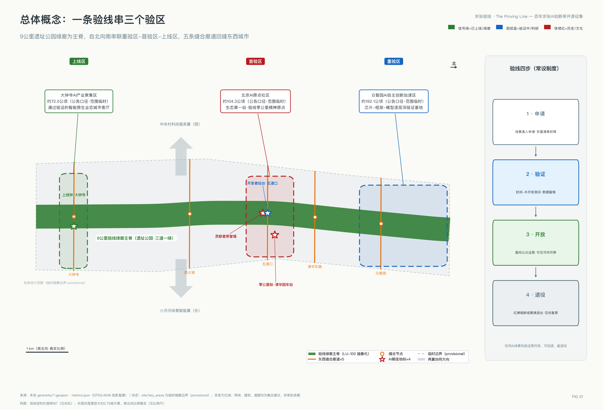
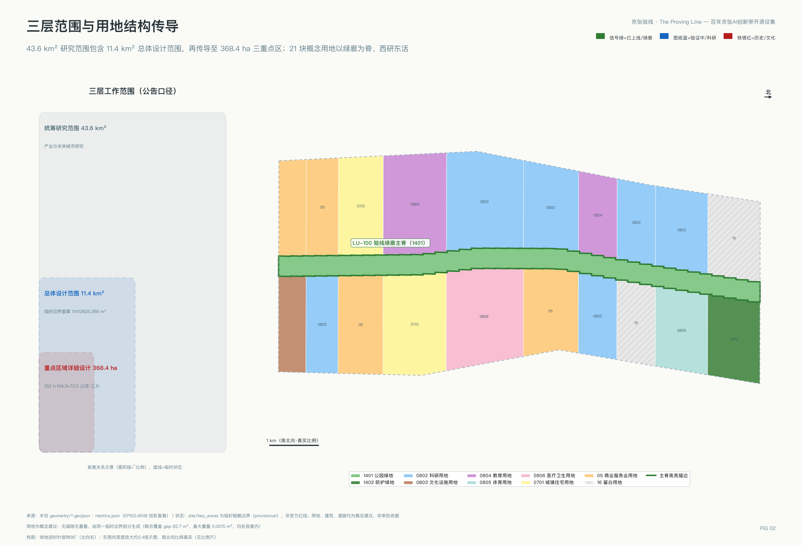
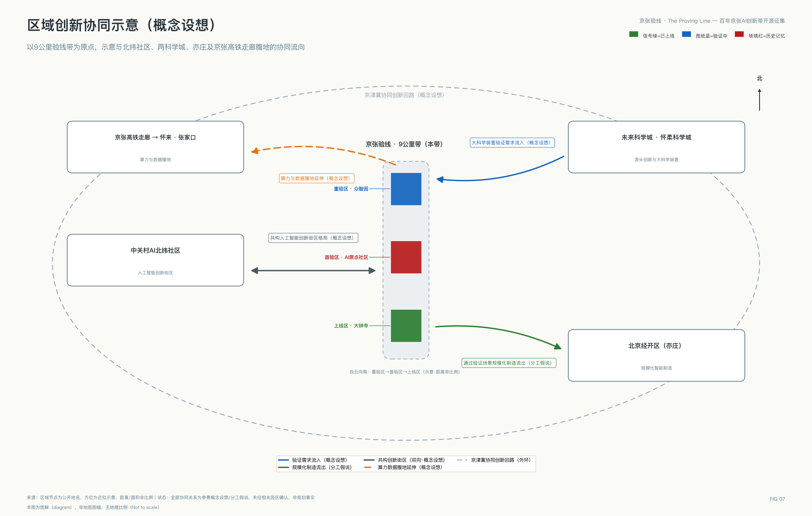
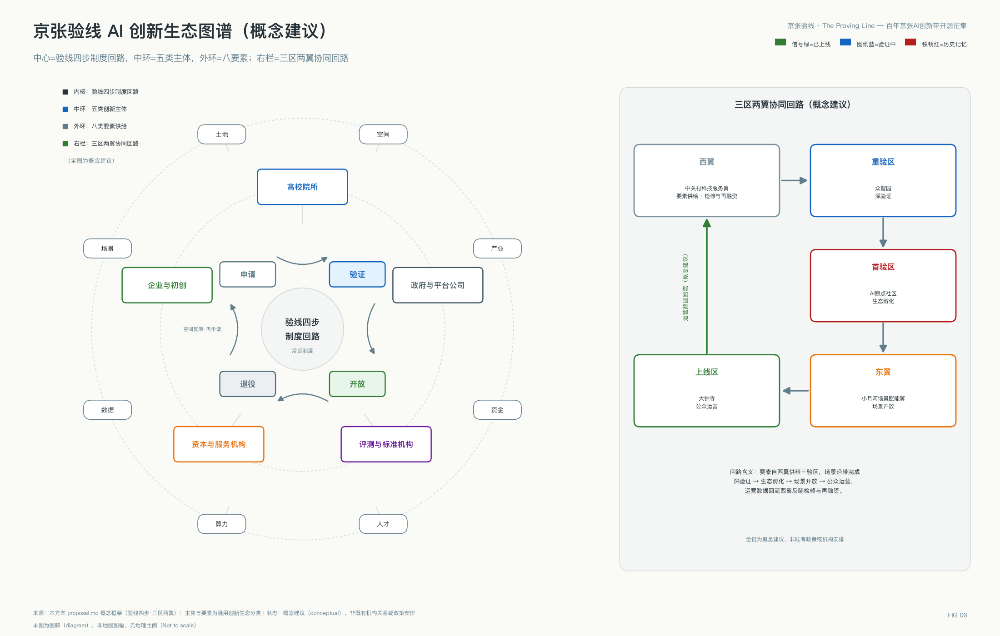
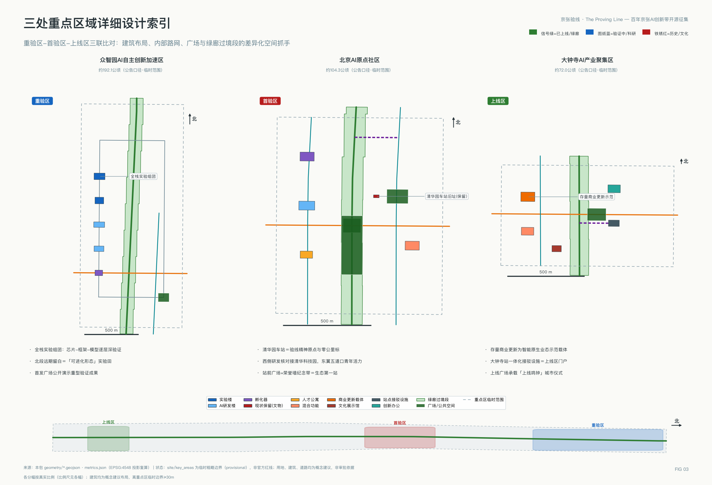
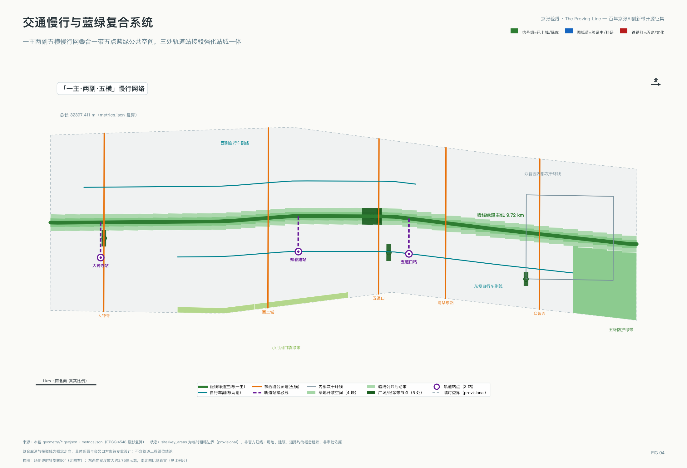
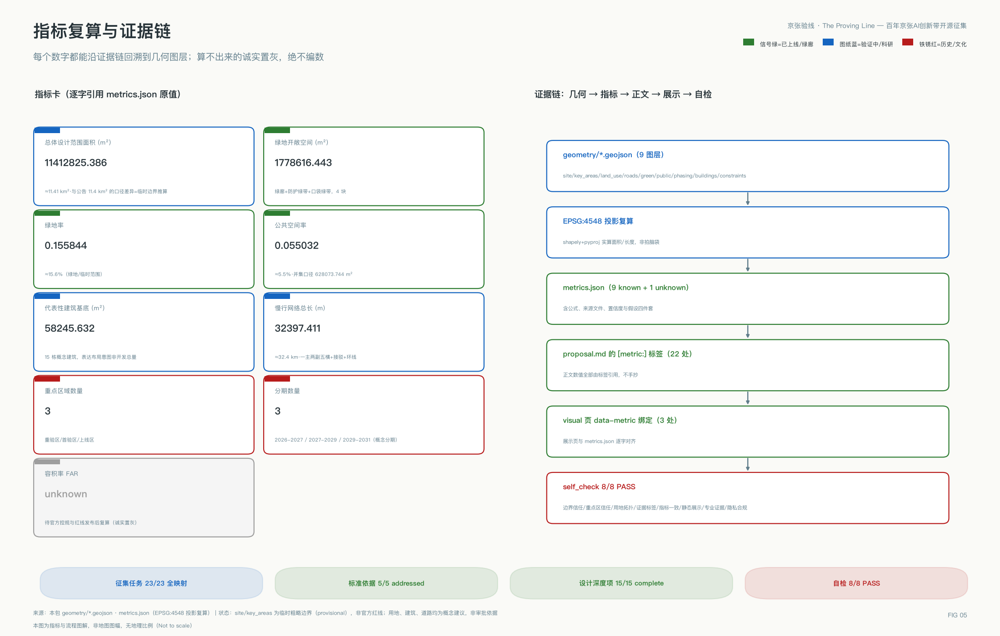

# 京张验线：百年京张AI创新带城市设计概念方案

> 一百年前，京张铁路每一段线路都要经过验道验收方可通行；一百年后，这条线成为全球AI能力进入真实城市前的验线——先验证、再开放、可回退、能退役。本方案全部空间与机制内容均为概念建议、参考方案，可供专业团队深化研究，不替代法定规划，不构成政府审定结论。

## 执行摘要

在本次开源征集已合入的两百多个方案中，"可验证"是出现频率很高的关键词。本方案的不同之处在于：验证在这里不是形容词，而是一套有历史原型、可落到操作层的城市制度——百年前京张铁路以逐段验道验收赢得通行信任，本方案将其升级为AI场景的四步上线规程（申请—验证—开放—退役）：每个场景事先约定运营主体、红牌暂停条件、退出后空间处置与公众触发程序，并给出可评估的建议运行参数与首期可证伪的成败三问；验证未通过与中途退役的场景进入公开的失败档案，及时停止同样被记录为贡献。空间上，方案以五条东西缝合廊道回应铁路廊道百年造成的城市割裂，以9公里已全线贯通的遗址公园绿廊为验线主脊，自北向南组织重验区、首验区、上线区三个差异化验区，两翼分别承担要素补给与场景开放。一句话：这不是又一条AI展示带，而是一份验收制度的完整施工图——谁负责、怎么停、停了之后空间怎么办，每一问都有预先写好的答案。

本方案回应四个真实的城市问题。其一，铁路廊道百年来在城市中划出一道南北长墙，东西两侧的校区、园区与社区长期互相背对；其二，沿线70个社区约45万居民的日常生活，需要的不是抽象的产业叙事，而是可感知的服务改善与对新技术的知情权；其三，这里是完全建成区，几乎没有增量土地，一切雄心都必须在存量空间里实现；其四，AI要进入公共空间，第一道门槛不是技术而是信任。验线制度对应回答这四问：五道缝合廊道回缝东西，验线四步让技术在市民注视下赢得信任，存量载体按验证结果渐进激活，绿廊把改善还给居民。验线也是"人、城、产"融合发展的操作系统：产=场景验证产业化，城=三验区与绿廊，人=五类画像的真实需求。

## 设计依据与资料清单

本方案的设计判断建立在三类资料之上，全部登记于本包 `sources.json`，并按可用等级分级使用。第一级是可作为正式任务依据的公开权威资料：《百年京张AI创新带城市设计国际方案征集资格预审公告》提供了三层范围、三处重点区域、公告面积与设计任务的唯一权威口径 [source:DATA-SRC-OFFICIAL-ANNOUNCEMENT-20260509]；《面向全球智能体开展百年京张AI创新带城市设计开源征集任务书》提供了三大定位、五大功能、三区两翼与六项智能体任务的必答要求 [source:DATA-SRC-AGENT-TASKBOOK-20260518]；住房和城乡建设部《城市设计管理办法》[standard:MOHURD-URBAN-DESIGN-MEASURES]、《城市、镇控制性详细规划编制审批办法》[standard:MOHURD-CONTROL-DETAILED-PLANNING] 与自然资源部《国土空间调查、规划、用途管制用地用海分类指南》[standard:MNR-LAND-USE-CLASSIFICATION-GUIDE] 构成专业标准底座，本方案的用地代码、控规深度表述与城市设计内容均以其为纲 [standard:PROJECT-OFFICIAL-ANNOUNCEMENT]。

第二级是场地事实资料：京张铁路遗址公园二期已于2026年8月6日建成开放，与一期共同形成西直门至北五环全长9公里、总用地约53公顷的带状文化绿廊，直接服务沿线70个社区约45万居民 [source:SRC-PARK-PHASE2-OPENING]；一期2.4公里、约16.8公顷于2023年6月建成 [source:SRC-PARK-PHASE1]；清华园车站旧址1910年建成、2023年修缮开放，兼具铁路工业遗产与"进京赶考之路"革命文物双重身份 [source:SRC-QINGHUAYUAN-STATION]。海淀AI产业底数采用2026年3月官方发布口径 [source:SRC-HAIDIAN-AI-BASELINE]。这些是本方案区别于图纸想象的现状锚点。

第三级是临时边界资料：官方精确红线尚未公开，本方案全部空间图层基于组织方提供的临时粗略边界生成 [source:DATA-SRC-PROVISIONAL-BOUNDARIES-20260605]，属性统一标注 provisional_constraint，其用途限制与替换后需重算的内容详见"三层范围工作框架"章。结构化场地资料包（含枚举、指标区间、标准快照）见 [source:SITE-PACKAGE]。本章对应的资料缺口已逐条写入 `assumptions.json`，证据链关系如下图。图中同时说明了 `compliance_matrix.json`、`standard_matrix.json`、`design_depth_matrix.json` 三个矩阵与正文、图层、指标之间的对账关系 [depth:existing_conditions_diagnosis]。

全部27项登记来源按可信度分三级使用，分级规则显性如下：

| 证据级别 | 判据 | 允许用途 | 本包实例 |
| --- | --- | --- | --- |
| 正式依据级 | 官方公告/部委规章/清权文件 | 支撑范围、面积、任务、标准等正式结论 | 资格预审公告、智能体任务书、三部委规章 |
| 事实背景级 | 权威媒体与官方新闻发布 | 支撑现状事实与产业底数，不支撑空间控制结论 | 遗址公园建成报道、海淀AI底数、轨道进展 |
| 临时线索级 | 组织方临时边界等 provisional 资料 | 仅供生成、可视化与自检，禁作红线与精确面积 | provisional_boundaries.geojson |

## 三层范围工作框架

本方案严格按公告设定的三层范围组织工作深度 [source:DATA-SRC-OFFICIAL-ANNOUNCEMENT-20260509]。统筹研究范围约43.6平方公里（北至北五环路、东至京藏高速、南至西直门外大街、西至万泉河路），承担产业生态体系与未来城市形态的系统研究，本方案在此层回答"验线制度如何支撑世界级AI创新生态"；总体设计范围约11.4平方公里（京张铁路遗址公园周边1—2公里城市地区），承担城市更新与控规深度的城市设计，本方案在此层给出用地、交通、蓝绿、风貌与更新项目的整体安排 [depth:three_level_scope_framework]；重点区域范围约368.4公顷，自北向南为众智园AI自主创新加速区（约192.1公顷）、北京AI原点社区（约104.3公顷）、大钟寺AI产业集聚区（约72.0公顷），达到规划综合实施方案的城市设计深度 [data:geometry/key_areas.geojson#PROV-KEY-001]。

必须醒目声明：本包 `geometry/site_boundary.geojson` 中的总体设计范围边界 [data:geometry/site_boundary.geojson#SITE-001] 与三处重点区域多边形均为**临时粗略边界**（official_boundary=false、geometry_role=provisional_constraint），依据公告文字四至由组织方粗略绘制，仅用于方案生成、可视化与提交自检，不得作为官方红线、审批依据或精确面积复算依据 [source:DATA-SRC-PROVISIONAL-BOUNDARIES-20260605]。长度口径同样在此钉死：绿廊9公里为遗址公园建成报道口径 [source:SRC-PARK-PHASE2-OPENING]，约9.7公里为临时边界的南北向推算长度，两者口径不同，均以公告与未来官方红线为准。本方案引用面积时一律采用公告口径（43.6平方公里、11.4平方公里、368.4公顷及三区各自面积），自算面积仅用于图层内部一致性校核并在 `metrics.json` 中注明推算属性 [metric:site_area_sqm]。官方红线发布后需重算的内容包括：全部用地分区面积与比例、绿地率与公共空间率、重点区域边界内的建筑布局、分期范围，以及据此派生的全部图纸与展示页数值。三层范围的空间传导逻辑（研究层定生态、总设层定结构、重点层定实施）如下图 [depth:overall_spatial_structure]。

## 统筹研究范围产业与未来城市研究

**总体概念与命名体系（智能体任务一）。**主名称"京张验线"，英文名 The Proving Line（全称 Jing-Zhang Proving Line），国际传播主口号：The Proving Line — Where AI Earns the City's Trust。命名直接承接征集任务书三大定位：它是百年京张文化带——"验线"一词转译自京张铁路修建期间逐段验收、验道通行的工程传统（据公开史料，詹天佑主持的这条铁路1905年开工、1909年通车，是中国人自主设计建造的第一条干线铁路），其精神内核正是"用验证赢得信任" [source:SRC-JZ-HISTORY]；它是都市AI生活体验带——市民在9公里绿廊上可感知、可体验、可监督每一个正在验证或已经上线的AI场景；它是AI融合创新带——全球AI能力在这里排队完成"申请—验证—开放—退役"的完整生命周期 [source:DATA-SRC-AGENT-TASKBOOK-20260518]。命名体系向下延展为三个验区：众智园"重验区"（深技术重型验证）、AI原点社区"首验区"（生态第一站与首发验证）、大钟寺"上线区"（通过验证的智能原生业态面向公众运营）；再向下延展为节点词族"验点—里程碑—信号柱—站台"。视觉识别与Logo方向（概念方向，非成品，落地使用需另行清权字体与图形）：以京张"人字形"线路为母题，人字两笔在顶点收束为一枚对勾，寓意"爬坡之后即是验证通过"；主色采用信号绿（通行）、图纸蓝（工程）、铁锈红（遗产）三色语义系统，分别对应"已上线、验证中、历史记忆"三种空间状态标识。此命名与标识系统仅服务一带整体品牌，与"蓝绿空间"章的文化导视符号系统分层使用、不相混淆。

**五大功能与三区两翼协同回路。**任务书五大功能在本方案中逐项落为空间载体与机制 [source:DATA-SRC-AGENT-TASKBOOK-20260518]：AI全栈自主创新体系落在众智园重验区（芯片—框架—模型—应用逐层验证的实验组团 [data:geometry/land_use.geojson#LU-ZZY-SW]）；世界级AI创新生态落在AI原点社区首验区（生态第一站，其核心的东升产业空间已集聚人工智能企业300余家、占比超七成 [source:SRC-AI-ORIGIN-COMMUNITY]）；AI+场景赋能新范式落在小月河场景赋能翼（东翼开放验场，承接场景从验线走向城市面）；智能化AI活力城市落在大钟寺上线区（智能原生消费与商务业态 [data:geometry/land_use.geojson#LU-DZS-W]）；AI治理全球话语权落在验线制度本身——"先验证、再开放、可回退、能退役"的场景准入规程若能在此跑通，即是可向全球输出的城市AI治理公共产品。中关村科技服务翼为西翼，承担要素全球化配置与资本赋能，与验线的关系是"检修库与补给线"，其接口机制分三步（概念建议）：验证未通过的场景转入西翼接受技术服务诊断（服务清单含算力、合规、评测、融资对接四类，由科技服务机构类主体承接，空间依托学院路科研走廊 [data:geometry/land_use.geojson#LU-S5W]）；完成整改与再融资后重新申请进线；再验证通过则按正常流程开放。三区两翼由此构成闭环回路：西翼供给要素、重验区完成深验证、首验区完成生态孵化、东翼开放场景、上线区面向公众、运营数据回流西翼支撑要素定价，形成可持续的协同循环。该布局同时衔接海淀现行产业体系：AI为核心向信软、医疗、教育等主导产业融合赋能，东翼小月河场景赋能翼即AI+垂直应用落地的重点承载（对应场景卡三、七、十三），西翼强化科技服务业、东带完善生活服务业，各类产业功能比例待官方控规口径确认。五大功能与空间载体、机制的对账如下表：

| 任务书五大功能 | 空间载体 | 承载机制 |
| --- | --- | --- |
| AI全栈自主创新体系 | 众智园重验区实验组团 [data:geometry/land_use.geojson#LU-ZZY-SW] | 芯片—框架—模型—应用逐层深验证 |
| 世界级AI创新生态 | AI原点社区首验区 | 生态第一站+孵化与人才落地 |
| AI+场景赋能新范式 | 小月河场景赋能翼（东） | 场景从验线走向城市面的开放验场 |
| 智能化AI活力城市 | 大钟寺上线区 [data:geometry/land_use.geojson#LU-DZS-W] | 通过验证业态的公众化运营 |
| AI治理全球话语权 | 验线四步制度本身 | 可对外输出的城市AI治理公共产品 |

土地、空间、产业、资金、人才、算力、数据、场景八要素的保障机制在"更新项目清单"章的政策工具部分逐项展开，其相互关系另见创新生态图谱。

**区域创新协同（智能体任务一必答项）。**本带不是孤立带，区域协同关系如下（均为概念设想，见协同示意图）：与中关村AI北纬社区共构海淀人工智能创新街区的多点格局（北纬社区已建成投用并入驻企业 [source:SRC-HAIDIAN-POLICY]）；向北，未来科学城与怀柔科学城的大科学装置产生的验证需求可流入重验区；向东南，通过验证的场景与北京经开区的规模化制造能力形成"验证在海淀、量产在亦庄"的分工假说；沿京张高铁走廊向怀来、张家口延伸算力与数据腹地，参与京津冀协同创新回路。

**全球AI创新生态案例（智能体任务二，8例，每例注明可转化机制与不可直接移植的条件）。**案例研究表如下：

| 案例 | 核心机制 | 对本带的可转化点 | 不可直接移植的条件 |
| --- | --- | --- | --- |
| 巴黎Station F [source:SRC-CASE-STATIONF] | 老火车货运站改造为全球最大单体创业园区，建设成本由社会资本承担、政府仅配政策 | 遗产建筑活化+社会资本运营旗舰载体 | 依赖单一出资人的公益型投入结构 |
| 波士顿Kendall Square [source:SRC-CASE-KENDALL] | 法定分区要求新建楼宇配建创新空间，部分面积低于市场租金供给小微企业 | "创新空间配建比例"作为待研究的控规政策工具 | 地方分区法权限与我国控规体系不同 |
| 新加坡one-north [source:SRC-CASE-ONENORTH] | 政府地主以工业厂房租金定价创新空间，LaunchPad十年支持两千余家初创 | 国资载体的租金分级定价制度 | 单一法定开发机构统筹全部土地 |
| 伦敦King's Cross [source:SRC-CASE-KINGSCROSS] | 铁路废弃地由单一土地合伙制主体整体开发，知识机构联盟作软治理 | 铁路遗产街区长成AI集聚地的直接实证+高校"知识联盟"轻治理 | 单一地主产权结构 |
| 首尔板桥Techno Valley [source:SRC-CASE-PANGYO] | 以显著低于市中心的供地价格换取企业长期研发承诺 | 产业用地弹性出让与研发承诺挂钩（待研究） | 省级政府整体新供地模式，与存量更新语境不同 |
| 深圳河套 [source:SRC-CASE-HETAO] | 数据跨境白名单试点与两地联合政策包 | AI训练数据流通与场景开放的制度试点（待研究） | 口岸区位与跨境制度前提 |
| 多伦多Quayside（反面）[source:SRC-CASE-TORONTO] | 数据治理安排未能建立公众信任，隐私专家公开退出，项目2020年终止 [source:SRC-TORONTO-CLOSURE] | 教训："采集即匿名、公共部门主导数据治理、人工复核可追责"设为验线一票否决项 | ——（作为风险镜鉴引用） |
| 日本柏之叶 [source:SRC-CASE-KASHIWA] | 政府、企业、大学三方常设城市设计中心协调街区级决策 | "京张验线城市设计中心"常设平台（概念建议） | 单一开发商主导的土地基础 |

八个案例共同构成机制光谱：土地管控、载体定价、单一主体开发、要素流动、常设治理与信任底线。本带自身的创新生态图谱见下图：五类主体（高校院所、企业与初创、资本与服务机构、评测与标准机构、政府与平台）围绕验线四步回路组织，土地、空间、产业、资金、人才、算力、数据、场景八要素沿三区两翼协同回路流动。

**AI改变城市形态与规划方法本身。**先畅想影响：人工智能首先改变生产方式——研发即验证、智能体成为新的劳动与协作单元、场景运营数据成为新的生产要素；同时改变生活方式——AI公共服务以可见、可问、可停的形态进入日常。城市形态与规划方法必须为这一变化提供空间适配，验线制度由此催生三项可讨论的创新 [depth:overall_spatial_structure]：其一，**自适应、可进化的城市发展模式**——自适应指验线运营数据驱动用途兼容清单与空间配比的动态调整（场景红牌即空间回退），可进化指留白验证区 [data:geometry/land_use.geojson#LU-ZZY-NW] 经验证渐进固化为正式功能，城市发展模式由一次性蓝图定型转为随验证结果演替的持续过程；人工智能时代城市功能要素的空间组织方式相应转为按验证生命周期组织——验证中功能沿验线布置、通过验证功能向东西两带固化、退役功能腾退复原。其二，规划作为持续验证的活文档——本次开源征集正在示范：规划编制可以是"多智能体生成方案、机器可读校验、人类专业裁决、公开留痕迭代"的持续集成过程，本方案建议将该方法沉淀为一带综合规划的常态工作方式（概念建议）。其三，国土空间规划创新思路——把"AI场景用地"作为一类按生命周期管理的临时用途，在不改变法定用地性质的前提下，通过用途兼容清单与退出条件实现空间的分时复用（可供专业团队深化研究）。

在此基础上尝试定义面向未来的AI文化、AI社会、AI城市（概念定义，供讨论）：AI文化=用验证赢得信任的公共文化，承接京张验收精神；AI社会=人与智能体共同生产、共同署名、共担责任的新型社会契约——荣誉墙是它的纪念制度，红牌是它的问责制度；AI城市=以场景全生命周期管理为操作系统的可进化城市，验线即其最小原型。

支撑上述机制的**验线数据底座（概念建议）**分四步：场景遥测经脱敏汇聚进入数字孪生底座；底座即本包 geojson 与 metrics 数据的开源延续（本仓库的开放机制年度化运营）；季度复盘与年度"验线复盘会"公开数据；官方红线发布、控规条件发布、场景退役三类事件触发图层与指标重算。每步维护主体为一带运营机构类主体与属地政府平台（概念建议）。海淀具备承载上述实验的产业底座：AI企业超2000家、独角兽26家、备案大模型130款、AI核心产业规模超3500亿元、AI专业人才9.5万名、AI2000全球顶尖学者135位 [source:SRC-HAIDIAN-AI-BASELINE]；区级层面已建成投用中关村AI北纬社区并持续加码人工智能产业高地政策，本带与AI原点社区、北纬社区等创新街区载体共构区域布局 [source:SRC-HAIDIAN-POLICY]。

## 总体设计范围城市更新与控规深度城市设计

**空间总体结构：一线、三验区、五缝合、两翼。**一线即9公里验线绿廊 [data:geometry/land_use.geojson#LU-100]，以已建成贯通的遗址公园为骨架 [source:SRC-PARK-PHASE2-OPENING]；三验区即三处重点区域；五缝合即在大钟寺、西土城、五道口、清华东路、众智园五处设置东西向缝合廊道 [data:geometry/roads.geojson#ROAD-EW-001]，回应铁路廊道长期造成的东西城市割裂；两翼即中关村科技服务翼（西）与小月河场景赋能翼（东）。总体设计范围内的用地组织逻辑：以绿廊为脊，西侧以科研教育用地为主承接高校院所创新外溢 [data:geometry/land_use.geojson#LU-S5W]，东侧以商业服务与居住用地为主承接生活服务与场景开放 [data:geometry/land_use.geojson#LU-YD-E]，南段强化商务与文化功能、北段预留弹性留白，全部用地代码采用自然资源部分类体系 [standard:MNR-LAND-USE-CLASSIFICATION-GUIDE]。

**城市更新总体框架。**本带为完全建成区，更新以"存量激活为主、拆除新建为例外"为原则（概念建议）[standard:MOHURD-URBAN-DESIGN-MEASURES]。三类更新对象：一是存量商业设施的业态更新，大钟寺片区大体量家居商业已于2025年启动闭店改造，是本带当前最具代表性的整栋可塑空间之一 [source:SRC-DZS-RENEWAL]；二是高校院所边界的开放更新，学院路片区已有"三带一节"创新街区实践 [source:SRC-XYL-INNOVATION]，本方案建议沿五条缝合廊道优先打开院墙界面（概念建议）；三是遗址公园沿线的运营更新，公园硬件已贯通，更新重点从建设转向AI叙事叠加与场景运营。公告要求的更新成果四件套在本包中的对应物：更新重点地区分布图=分期图层三期落位 [data:geometry/phasing.geojson#PH-001]、更新空间结构图=一脊两带加五缝合结构图、用地布局图=用地图层 [data:geometry/land_use.geojson#LU-100]、更新实施项目清单=第十章13项清单。更新实施项目与分期详见"更新项目清单"章 [depth:renewal_project_list]。

**控规深度的指标表述纪律。**总体设计范围要求达到控制性详细规划的城市设计深度 [standard:MOHURD-CONTROL-DETAILED-PLANNING]。但本带官方控规条件（容积率、建筑高度、建筑密度、绿地率、退线）尚未随公开任务书发布，本方案据此采取"有口径、无数值"的表述纪律：`metrics.json` 中容积率项保持未知状态并注明缺口原因 [metric:floor_area_ratio]，正文只给出指标的计算口径、数据前置条件与赋值触发条件（官方控规或任务书附件发布），不编造任何数值；该留白系官方控规未发布所致，赋值触发条件已登记于假设清单 [depth:development_intensity_controls]。方案自算的结构性指标（绿地率、公共空间率等）均为基于临时边界的方案建议值 [metric:green_ratio] [metric:public_space_ratio]，用于表达设计意图的量级而非审定控制值。

**城市风貌控制（概念建议）。**百年京张AI创新带的城市基调为"谦逊的背景城市、清晰的验线前景"：沿线建筑作为低对比度背景，色彩延续学院区灰砖与暖白基调；验线绿廊及其节点作为高识别度前景，采用信号绿、图纸蓝、铁锈红三色语义系统；工业记忆元素（钢轨、道钉、信号机、里程碑）作为点缀性符号仅在绿廊与站点节点使用 [depth:height_massing_character]。建筑高度、强度、体量控制以"不压遗址公园、不遮文保视廊"为原则性要求；屋顶形态提倡平缓有序的第五立面，鼓励屋顶绿化与光伏一体化（概念建议，管控值待控规）。具体控制值待官方控规条件明确后由专业团队确定 [data:geometry/buildings.geojson#B-QHY-STATION]。

## 重点区域详细设计

三处重点区域各自形成"定位—空间结构—建筑更新—交通慢行—公共空间—AI场景—实施风险"的完整小方案，全部建立在临时粗略边界上，属方向性详细设计（概念建议）[data:geometry/key_areas.geojson#PROV-KEY-002] [depth:three_key_area_detailed_design]。

**众智园AI自主创新加速区（约192.1公顷）——重验区。**定位：AI全栈自主创新体系的深验证基地，承担芯片、框架、模型、智能体的重型测试验证功能；抓住国家人工智能平台建设契机，向国家级人工智能集聚区方向培育（概念建议）——验线规程本身即标准制定与安全治理议题的实验载体。空间结构：南部为全栈实验组团 [data:geometry/land_use.geojson#LU-ZZY-SW]，布置实验室与研发建筑 [data:geometry/buildings.geojson#B-ZZY-LAB1]；中部为体育共享与生活配套；北部为远期留白区与五环防护绿带 [data:geometry/land_use.geojson#LU-ZZY-NE]，留白区即"可进化形态"的实验田——只有通过验证的功能才被允许固化。建筑更新：以新建研发与实验设施为主（概念建议，规模待控规）。交通慢行：内部次干环线组织货运与通勤 [data:geometry/roads.geojson#ROAD-SEC-ZZY]，众智园缝合廊道向东联系清河方向。公共空间：首发广场兼作产业展示与重型验证成果的公开演示场 [data:geometry/public_space.geojson#PS-004]，营造国际化、低碳绿色的创新交往环境（概念建议）。AI场景：自动驾驶低速接驳验证环、城市服务智能体对抗测试场（详见场景卡）。实施风险：北段用地现状底数缺失，全部布局待现状调查与官方边界确认后重校 [depth:risk_missing_data]。

**北京AI原点社区（约104.3公顷）——首验区。**定位：全球AI人才与项目进入本带的生态第一站，依托现状已运行的AI原点社区政策区核心 [source:SRC-AI-ORIGIN-COMMUNITY]。空间结构：西侧研发核对接清华科技园方向 [data:geometry/land_use.geojson#LU-YD-W]，东侧五道口青年商业活力区 [data:geometry/land_use.geojson#LU-YD-E]，中部清华园车站旧址为整个验线的精神原点 [data:geometry/buildings.geojson#B-QHY-STATION]。建筑更新：保留清华园车站（文物建筑，现状保留），孵化器、人才公寓、混合功能建筑以存量改造与少量新建结合（概念建议）[data:geometry/buildings.geojson#B-YD-APT]。交通慢行：五道口与清华东路两条缝合廊道在此交汇，五道口站接驳线强化轨道换乘 [data:geometry/roads.geojson#ROAD-TC-WDK]。公共空间：站前广场（验线零公里标所在）与荣誉墙纪念带 [data:geometry/public_space.geojson#PS-005]。AI场景：AI文化导览首验、企业服务Copilot试点（详见场景卡）。实施风险：片区现状产权与楼宇底数复杂，更新时序须逐栋核实（待补资料）。

**大钟寺AI产业集聚区（约72.0公顷）——上线区。**定位：通过验证的智能原生新业态（消费与商务并重）面向公众规模化运营的城市客厅。空间结构：西侧智能原生消费区 [data:geometry/land_use.geojson#LU-DZS-W]，东侧产业载体更新区 [data:geometry/land_use.geojson#LU-DZS-E]。建筑更新：存量商业体（已启动腾退改造 [source:SRC-DZS-RENEWAL]）更新为智能原生业态示范载体 [data:geometry/buildings.geojson#B-DZS-RETAIL]；大钟寺站一体化接驳设施提升换乘效率（概念建议，不含工程可行性结论）[data:geometry/buildings.geojson#B-DZS-HUB]。交通慢行：大钟寺缝合廊道联系古钟博物馆与新业态载体，站点接驳线 [data:geometry/roads.geojson#ROAD-TC-DZS]。公共空间：上线广场——场景从验线"毕业上线"的仪式空间 [data:geometry/public_space.geojson#PS-003]，与觉生寺（大钟寺）古钟文化形成"上线鸣钟"的叙事联动 [source:SRC-HERITAGE-TEMPLES]。AI场景：机器人配送常态运营（指通过验线验证后的目标状态，概念建议）、智能原生零售、AI会展与验证成果路演（商务场景，见场景卡十三）、健康服务导航（详见场景卡）。实施风险：文保单位周边风貌协调与商业更新节奏需专业统筹。

## AI 创新生态、人才画像与 AI+ 场景

**五类用户画像与需求（智能体任务三）。**画像表如下 [depth:existing_conditions_diagnosis]：

| 画像 | 核心需求 | 活动半径 | 对应场景卡 |
| --- | --- | --- | --- |
| AI研发者与创业团队 | 低成本验证场地、算力与数据合规通道 | 首验区、重验区 | 二、四、七、十三 |
| 高校师生 | 开放院墙界面、青年第三空间、课堂到验线的项目通道 | 首验区、缝合廊道 | 五、六、九 |
| 沿线居民（约45万人 [source:SRC-PARK-PHASE2-OPENING]） | 生活服务改善、对AI设施的知情权与否决权表达渠道 | 全线绿廊、东带社区 | 一、三、六、十、十二 |
| 企业与投资机构 | 可比较的场景验证数据与转化通道 | 上线区、西翼 | 四、七、十三 |
| 访客与国际同行 | 可游览、可理解的AI城市叙事动线 | 全线地标节点 | 五、八、十一 |

五类画像的需求共同指向"工作—生活—社交—学习"一体化的城市空间系统：工作=三验区载体，生活=东带居住与健康驿站，社交=站台广场与上线节，学习=高校开放界面与开发者站台，验线绿廊即一体化的空间纽带。

**十三张AI场景卡（含四个产业测试验证场景，标注★）。**本方案以东翼小月河场景赋能翼及学院路健康服务区作为公告"自选区域范围场景设计（可选项）"的承载区，覆盖AI+医疗（场景三）、AI+信软（场景七）、AI+生活服务（场景一、十）等公告点名领域。每张卡给出：空间落位、服务画像、运行数据与隐私边界、人工复核安排、建议运营主体类型、成本口径（只给构成不给数值）、红牌暂停条件、退出后空间处置；其中建议牵头的公共主体一律点名公开机构类型（区政府、管委会、属地街道、公园运营主体、区属平台公司等），仅表示建议对接的公开机构方向、不代表其承诺，企业侧一律只写类型不点名。全部场景为概念建议，接受"谁负责、怎么停、停了之后空间怎么办"三问检验 [source:DATA-SRC-AGENT-TASKBOOK-20260518]。

1. **★低速配送机器人验证段**（robot-delivery-low-speed）：落位验线绿廊南段辅道与大钟寺缝合廊道 [data:geometry/roads.geojson#ROAD-EW-001]；服务居民与商户；仅采集脱敏运行遥测，不采集人脸；每日人工复核异常事件日志；运营主体建议为持证物流企业与街道联合监管（类型描述，不指定企业）；成本口径为车辆折旧、运维人力、保险与接驳设施分摊；红牌条件为任一起与行人碰撞或连续三日投诉超阈值即暂停；退出后辅道恢复纯慢行功能，充电桩位转为非机动车停车。
2. **★自动驾驶低速接驳验证环**：落位众智园次干环线 [data:geometry/roads.geojson#ROAD-SEC-ZZY]；服务园区通勤者；车内不留存影像、路侧仅保留结构化事件数据；专职安全员全程值守并每周联席复核；运营主体建议为区级平台类主体；成本口径为车辆、安全员与路侧改造分摊；红牌条件为出现任何超出安全员接管能力的场景即停；退出后环线恢复常规园区交通。
3. **★AI健康服务导航驿站**（ai-health-service-navigation）：落位学院路健康服务区 [data:geometry/land_use.geojson#LU-S5E]；服务老年居民与就医人群；仅提供公共服务导航不做诊疗建议，不留存健康档案；社区医务人员每日抽检答复质量；运营主体建议为社区卫生服务机构；成本口径为终端设备、内容运维与医务督导工时；红牌条件为出现诊疗性误导个案即下线整改；退出后驿站转为普通社区服务点。
4. **★城市服务智能体对抗测试场**：落位众智园全栈实验区 [data:geometry/buildings.geojson#B-ZZY-RD1]；服务AI企业与评测机构；使用合成数据与授权数据，物理隔离网络；测试报告由第三方评测机构人工签发；运营主体建议为专业评测机构；成本口径为场地、算力与评测人力；红牌条件为任何真实个人数据进场即终止该批次；退出后实验空间转为通用实验室。
5. **AI文化导览**（ai-cultural-guide）：落位清华园车站与验线全线 [data:geometry/public_space.geojson#PS-001]；服务访客与学生；基于公开史料生成导览并明确标注AI生成属性；文史专家季度审校纠错；运营主体建议为公园运营方与文博机构；成本口径为内容制作、设备与审校工时；红牌条件为史实错误投诉经核实即下线对应内容；退出后导览设施转为常规标识。
6. **AI辅助慢行流线评估**（ai-traffic-walkability）：落位五条缝合廊道及小月河东翼滨水慢行段 [data:geometry/roads.geojson#ROAD-EW-003] [data:geometry/green_space.geojson#GS-003]；服务通勤者与规划部门；仅用匿名计数与断面统计，不做个体识别；评估结论经季度人工复核后才进入改造建议；运营主体建议为交通研究机构、属地街道牵头对接；成本口径为传感设施与分析人力；红牌条件为发现可还原个体轨迹的数据即整改；退出后设施拆除、数据销毁。
7. **企业服务Copilot**（enterprise-service-copilot）：落位首验区研发核 [data:geometry/land_use.geojson#LU-YD-W]；服务初创企业；基于公开政策文本，答复标注依据与时效；政务服务人员对高风险答复复核；运营主体建议为园区服务平台；成本口径为模型调用、知识库维护与人工复核工时；红牌条件为答复被当作行政承诺使用的个案出现即强化免责提示并整改；退出后转为纯人工服务窗口。
8. **公共安全运营复核**（public-safety-operations-review）：落位验线大型活动期间的临时指挥场景；服务活动组织方；只调用既有公共视频的统计层数据，不新增采集点；任何处置决定由人工作出，AI仅提供风险提示；运营主体建议为属地管理部门；成本口径为接入开发与值守人力；红牌条件为出现自动化处置个案即停用；退出后系统下线、接口关闭。
9. **开发者站台（青年第三空间）**：落位五道口验线广场 [data:geometry/public_space.geojson#PS-002]；服务高校师生与开发者；报名制活动不采集额外个人数据；场地方人工管理；运营主体建议为社会化运营商；成本口径为场地改造与活动运营；红牌条件为商业化侵占公共开放时段超约定即整改；退出后广场恢复通用公共空间。
10. **智能原生零售示范**：落位大钟寺存量商业更新载体 [data:geometry/buildings.geojson#B-DZS-RETAIL]；服务消费者；店内无感支付须显著告知并保留传统支付通道；市场监管常规抽检；运营主体建议为商业运营商；成本口径为改造、系统与运维；红牌条件为强制生物识别或取消现金通道即整改；退出后转常规商业。
11. **AI荣誉墙与贡献者纪念系统**：落位荣誉墙纪念带 [data:geometry/public_space.geojson#PS-005]；服务全球开发者与访客；仅展示公开署名信息且经本人确认；内容上墙前人工终审；运营主体建议为一带运营机构；成本口径为建设与内容运维；红牌条件为出现未授权署名即撤下；退出后转为通用文化展示墙。
12. **验线数字孪生公示屏**：落位三个验区广场 [data:geometry/public_space.geojson#PS-004]；服务公众监督；只展示场景状态、验证进度与投诉入口，不展示个体数据；运营方每周更新并接受纠错；运营主体建议为一带运营机构、区属平台公司牵头建设；成本口径为屏体与数据接口维护；红牌条件为数据超过两周未更新即视为失信下线；退出后屏位转为公共信息屏。
13. **AI会展与验证成果路演厅（智能原生商务场景）**：落位大钟寺东侧产业载体更新区 [data:geometry/land_use.geojson#LU-DZS-E]；服务企业、投资机构与国际访客；发布内容限公开信息、参会登记最小化采集；路演项目材料经主办方人工审核后发布；运营主体建议为商业运营商联合一带运营机构、中关村科学城管委会类机构对接指导；成本口径为场地改造、活动运营与设备维护；红牌条件为出现虚假宣传或未经授权的数据展示即整改；退出后转为常规会展与商务空间。

上述场景卡与空间图层、运营机制的映射构成"场景—空间—运营"矩阵（摘要表如下，完整字段见各卡）：场景一至四为产业测试验证（封闭到半开放），集中在重验区与绿廊辅道；场景五、六、七为公共服务增强型，沿验线、缝合廊道与东翼展开；场景八至十三为公共空间与运营型，锚定三个广场、纪念带与上线区载体。

| 卡号 | 场景 | 空间落位（图层锚点） | 服务画像 | 建议牵头公共主体（点名方向） | 运营主体类型 |
| --- | --- | --- | --- | --- | --- |
| 一★ | 低速配送验证段 | 绿廊南段辅道+大钟寺缝合 | 居民/商户 | 属地街道 | 持证物流企业 |
| 二★ | 自动驾驶接驳环 | 众智园次干环线 | 园区通勤者 | 中关村科学城管委会类机构 | 区级平台类主体 |
| 三★ | 健康导航驿站 | 学院路健康服务区 | 老年居民/就医人群 | 社区卫生服务机构 | 社区卫生服务机构 |
| 四★ | 对抗测试场 | 众智园实验区 | AI企业/评测机构 | 区属平台公司 | 专业评测机构 |
| 五 | AI文化导览 | 清华园车站+全线 | 访客/学生 | 公园运营主体 | 公园运营方+文博机构 |
| 六 | 慢行流线评估 | 五缝合+小月河段 | 通勤者/规划部门 | 属地街道 | 交通研究机构 |
| 七 | 企业服务Copilot | 首验区研发核 | 初创企业 | 中关村科学城管委会类机构 | 园区服务平台 |
| 八 | 公共安全复核 | 大型活动临时场景 | 活动组织方 | 属地管理部门 | 属地管理部门 |
| 九 | 开发者站台 | 五道口验线广场 | 高校师生/开发者 | 属地街道 | 社会化运营商 |
| 十 | 智能原生零售 | 大钟寺更新载体 | 消费者 | 区市场监管方向 | 商业运营商 |
| 十一 | 荣誉墙纪念系统 | 荣誉墙纪念带 | 全球开发者/访客 | 一带运营机构 | 一带运营机构 |
| 十二 | 数字孪生公示屏 | 三个验区广场 | 公众监督 | 区属平台公司 | 一带运营机构 |
| 十三 | AI会展路演厅 | 大钟寺东侧载体 | 企业/投资/国际访客 | 中关村科学城管委会类机构 | 商业运营商 |

全部场景的隐私边界遵循统一底线：默认匿名、最小采集、公共部门主导数据治理、人工复核可追责——这是从多伦多Quayside失败中提取的一票否决线 [source:SRC-CASE-TORONTO] [depth:risk_missing_data]。以上公共主体点名仅表示建议对接的公开机构方向，不代表任何机构的承诺或既定安排。

## 用地、建筑规模与拆改留方案

**用地布局。**总体设计范围内形成"一脊两带"的用地结构：中部绿廊用地贯通南北 [data:geometry/land_use.geojson#LU-100]；西带以科研用地与教育用地为主，共同承接高校创新外溢 [data:geometry/land_use.geojson#LU-S4W]；东带以商业服务业用地、居住用地与留白用地梯度布置 [data:geometry/land_use.geojson#LU-N2E]。用地分类严格采用自然资源部指南的项目子集代码 [standard:MNR-LAND-USE-CLASSIFICATION-GUIDE]，共使用商业服务业、居住、科研、文化、教育、体育、医疗卫生、公园绿地、防护绿地、留白等类别，全部多边形由同一临时边界精确剖分生成、无缝隙无重叠 [depth:land_use_layout]。各类用地面积与占比可由 `geometry/land_use.geojson` 与 `metrics.json` 复算 [metric:site_area_sqm]。

**建筑规模与强度（有口径、无数值）。**本方案给出建筑规模的计算口径：总建筑规模等于保留建筑规模加更新载体规模加新建规模，其中新建规模受控规容积率与高度控制约束。因官方控规条件缺失 [metric:floor_area_ratio]，本方案不给出总量数值，仅以15处代表性建筑基底表达布局意图 [data:geometry/buildings.geojson#B-YD-INC] [metric:building_footprint_area_sqm]，其高度体量均标注"概念建议，待官方控规确认"。这一留白是表述纪律：在官方数据发布前，任何总量数值都是不可复核的伪精度 [depth:development_intensity_controls]。

**拆改留方案（原则分类，概念建议）。**保留类：全部文保单位与不可移动文物（清华园车站旧址等 [data:geometry/buildings.geojson#B-QHY-STATION]）、已建成的遗址公园全线、运行良好的科研与居住建筑；改造类：存量商业设施（大钟寺片区为代表 [source:SRC-DZS-RENEWAL]）、高校院所沿缝合廊道的界面建筑、老旧办公载体；拆除类：仅限经专业安全与效益评估确认的危旧与严重低效建筑，本方案不指认任何具体拆除对象——具体地块的拆改留结论属法定程序事项，须待现状建筑底数与权属调查完成后由专业团队作出 [depth:retain_renovate_demolish]。空间供给策略借鉴Kendall Square经验，建议研究"更新项目按比例配建创新空间"的政策工具（概念建议）[source:SRC-CASE-KENDALL]。

## 交通、轨道、市政与公共服务设施

**轨道与站城一体。**本带轨道条件在近年显著改善：13号线拆分工程持续推进 [source:SRC-METRO-STATUS]，由其派生命名的18号线（马连洼—天通苑东）已于2025年12月27日开通试运营 [source:SRC-METRO-18-OPENING]；昌平线南延于2024年12月全线贯通、纵贯学院路走廊 [source:SRC-CPX-NANYAN]。本方案在大钟寺、知春路、五道口三站设置接驳强化线 [data:geometry/roads.geojson#ROAD-TC-ZCL]，建议开展站城一体化设计研究（概念建议，不含轨道工程线位与桥隧工程结论）。大钟寺站接驳设施 [data:geometry/buildings.geojson#B-DZS-HUB] 定位为"上线区门户"，其具体工程方案待专业交通设计确定 [depth:traffic_rail_slow_parking]。

**慢行系统与可感知、可交互的AI+交通系统。**验线绿廊已具备贯通的"三道一绿"慢行基础（步行道、慢跑道、自行车道）[source:SRC-PARK-PHASE2-OPENING]，本方案在此之上叠加：绿道主线 [data:geometry/roads.geojson#ROAD-GW-001]、东西两条自行车副线 [data:geometry/roads.geojson#ROAD-CY-W]、五条缝合廊道，形成"一主两副五横"的慢行网络，与蓝绿系统共同构成南北贯通、东西连通的步道、骑行道和绿色空间体系，网络总长可由图层复算 [metric:road_network_length_m]。缝合廊道优先解决跨铁路遗址、跨高校院墙的东西向断点，兼作打通支路微循环的载体——缝合点位同步梳理周边支路断点（概念走向），具体断面与交叉口方案待专业设计。在此骨架上规划可感知、可交互的AI+交通系统（概念建议）：感知层以匿名断面计数与慢行流线评估为主（场景卡六），不做个体识别；交互层包括低速接驳呼叫、行人优先信号建议与数字孪生屏实时查询（场景卡一、二、十二）；全部交通AI服务保留传统使用方式，感知与交互能力与连续绿色空间体系并行规划。停车与非机动车组织遵循"轨道站点周边优先、验证场景独立配建"的原则性安排（概念建议）。

**市政与新型基础设施。**传统市政管线现状底数缺失，本方案仅提出体系性建议（概念建议）：探索分布式能源、端侧算力等AI产业新型服务设施与给水、排水、电力等传统设施的融合发展模式与实施路径——融合模式为"验区级微网+分布式算力节点+充电设施"三位一体沿验线布点，实施路径为先在单一验区试点、经验证后分期推广（借鉴柏之叶区域能源管理经验，其智能中心跨街区调度电力，据报道可显著削减区域峰值用电，转引数据仅作背景 [source:SRC-CASE-KASHIWA]）[depth:municipal_new_infrastructure]。全部市政内容不含管线迁改与容量测算结论，待官方底数补齐后由专业机构测算。

**公共服务设施。**沿线70个社区约45万居民的生活服务是验线的公共利益基本盘 [source:SRC-PARK-PHASE2-OPENING]：学院路健康服务区布置健康导航驿站 [data:geometry/land_use.geojson#LU-S5E]，五道口布置青年第三空间，各验区广场兼作社区活动场地；教育、医疗、养老设施容量现状缺数，扩容需求列为待核事项 [depth:risk_missing_data]。

## 蓝绿空间、公共空间与城市风貌

**蓝绿网络。**以验线绿廊为绿脊 [data:geometry/green_space.geojson#GS-001]，北端衔接五环防护绿带 [data:geometry/green_space.geojson#GS-002]，东翼沿小月河布置两段口袋绿带 [data:geometry/green_space.geojson#GS-003]，共同构成"一脊一带多点"的蓝绿结构，与慢行网络叠合为连续无界的绿色空间体系——"连续"由9公里绿脊与五横缝合保证，"无界"指绿廊与校园、园区、社区之间逐步打开硬质边界（概念建议）[metric:green_space_area_sqm] [metric:green_ratio]。清河、小月河沿线以宜居宜业宜人为导向布置滨水慢行与口袋绿带；小月河水系本体为锁定的现状要素，本方案仅在其陆侧布置绿带与慢行联系，不含任何涉水工程内容 [depth:blue_green_public_space]。

**公共空间体系与AI朝圣地标（智能体任务四）。**公共空间由一条活动带与五处节点构成：验线公共活动带沿绿廊展开 [data:geometry/public_space.geojson#PS-LINE-001] [metric:public_space_area_sqm] [metric:public_space_ratio]；五处节点为清华园车站站前广场、五道口验线广场、大钟寺上线广场、众智园首发广场与荣誉墙纪念带。

四个AI朝圣地标（概念建议，均需清权与专业深化）：其一，**验线零公里标**（清华园车站站前 [data:geometry/public_space.geojson#PS-001]）：百年京张的验收原点与AI时代的上线原点在此重叠，"进京赶考"的历史叙事与"AI赶考"的当代叙事双重锚定 [source:SRC-QINGHUAYUAN-STATION]；其二，**贡献者荣誉墙**（纪念带 [data:geometry/public_space.geojson#PS-005]）：镌刻通过验证并落地的方案、场景及其人类与智能体贡献者署名，与本次开源征集的纪念体系直接衔接——它本身就是本方案对"贡献可记忆"共创原则的空间回应 [source:DATA-SRC-AGENT-TASKBOOK-20260518]；其三，**上线钟**（大钟寺上线广场 [data:geometry/public_space.geojson#PS-003]）：借觉生寺古钟文化 [source:SRC-HERITAGE-TEMPLES]，为每个通过验证正式上线的场景举行鸣钟仪式，把技术里程碑转译为可参与的城市仪式；其四，**开发者站台**（五道口 [data:geometry/public_space.geojson#PS-002]）：以站台与人字形雨棚为意象、面向青年友好的第三空间聚场。此外，聚焦遗址公园南端、北端及上跨环路区域打造两处标志性城市景观节点（概念建议）：南端西直门"进线门"——验线南起点的门户节点，衔接上线区与北京北站方向；北端五环上跨区"北望节点"——结合五环防护绿带与上跨环路慢行衔接的景观节点。荣誉展示体系分三级并明确运行规则（概念建议）：荣誉墙（永久，镌刻经评审入选并落地的方案与贡献者，上墙经本人确认与人工终审，与本次开源征集的纪念体系直接衔接）、里程碑柱（年度，记录当年通过验证上线的场景）、数字孪生屏（实时状态）。荣誉体系之外增设**失败档案**（概念建议）：验证未通过与中途退役的场景，其脱敏后的运行数据、停止原因与复盘结论公开归档于验线数据底座——及时停止同样被记录为贡献，失败档案与荣誉墙共同构成"贡献可记忆"共创原则的完整语义，也为后来的申请者提供前车之鉴。公共空间组件库十件：验线里程碑、信号灯柱、场景状态桩、隐私告示牌、道钉座凳、钢轨种植槽、站牌导视、对勾灯带、留白画框装置、可移动验证棚——全部为标准化可复制构件，每件在深化阶段给出尺度量级、材质基调与布点原则（概念建议），供专业团队深化为产品库。

**东西缝合与南北贯通。**南北贯通由绿廊与慢行主线完成；东西缝合由五条廊道完成，其中五道口与大钟寺两处为一级缝合（结合轨道站点与广场），其余为二级缝合。文化导视符号系统沿"验线"叙事统一设计：里程标以1909与2026的时间刻度双标注，站点导视采用铁路站牌形制。本导视系统为文化标识层，与一带整体Logo系统分层管理、避免混淆 [source:DATA-SRC-AGENT-TASKBOOK-20260518]。

**文化叙事（智能体任务五）。**三层文化在验线上纵向叠合：百年京张文化——詹天佑于1905至1909年主持建成中国人自主设计的第一条干线铁路，"人字形"线路与验收传统是工程智慧与质量精神的双重遗产 [source:SRC-JZ-HISTORY]（人字形线路本体位于昌平、延庆段，属全国重点文物保护单位，本带以叙事方式致敬而非空间占用 [source:SRC-JZ-HERITAGE-NATIONAL]）；中关村创新文化——从电子一条街到AI高地的敢为人先精神，沿线高校院所是其活载体；AI新文化——"先验证、再开放"的信任文化，把AI从抽象技术转译为市民可见、可问、可停的城市公共服务。空间文化系统的表达载体即前述地标、组件库与导视系统；北影等艺术资源可与上线区内容消费业态联动（如AI影像创作展映进入上线广场，概念建议）。国际传播叙事主线："这是一条为AI设立驾照考场的城市街区——一百年前中国工程师在这里用验收赢得尊重，今天全球的AI在这里用验证赢得城市的信任。"英文电梯稿（国际传播文案，可直接使用）：The Proving Line — Where AI Earns the City's Trust. A century ago, engineers proved every section of China's first self-built railway before opening it. Today, along the same nine kilometres, AI scenarios apply, prove themselves under public oversight, go live, and retire gracefully. Contributors, human and agent alike, leave their names on the Honor Wall. 该叙事具备真实事实支点：由智能体参与的真实城市设计开源征集正在本带发生。

## 更新项目清单、实施政策与分期计划

**更新项目清单（13项，全部为概念建议项目，落位见分期图层）。**近期（概念分期一，2026至2027年，对应 [data:geometry/phasing.geojson#PH-001]）：一号项目验线运营中枢与数字孪生公示系统（首验区，建议区属平台公司牵头）；二号项目清华园车站站前广场与零公里标（建议公园运营主体与文博机构对接）；三号项目五道口验线广场与开发者站台（建议属地街道牵头）；四号项目荣誉墙纪念带一期（建议一带运营机构牵头）；五号项目缝合廊道示范段（五道口、清华东路两条，建议属地街道与高校对接）。中期（概念分期二，2027至2029年，对应 [data:geometry/phasing.geojson#PH-002]）：六号项目大钟寺存量商业更新示范载体（建议产权方与商业运营商合作）；七号项目上线广场与上线钟；八号项目大钟寺站接驳设施研究与建设（建议轨道运营与属地政府联合研究）；九号项目南段缝合廊道（大钟寺、西土城）；十三号项目小月河东岸场景开放带一期（东翼，衔接场景卡六、十三的城市面推广，建议属地街道牵头）。远期（概念分期三，2029至2031年，对应 [data:geometry/phasing.geojson#PH-003]）：十号项目众智园全栈实验组团（建议区属平台公司与科研机构合作）；十一号项目首发广场与对抗测试场；十二号项目北段留白区弹性启动。以上牵头主体均为建议对接的公开机构方向，不代表其承诺；每个项目的依赖条件（官方边界、控规条件、权属核实、文保意见）已在假设清单中逐项登记，空间供给按"验证期临时供给—上线期正式供给—退役期复原转换"的全生命周期策略安排 [depth:phasing_implementation]。

**实施政策建议（全部为待研究政策工具，非既定安排）。**其一，创新空间配建：更新项目按比例配建低成本验证与创业空间（借鉴Kendall分区条款 [source:SRC-CASE-KENDALL]）；其二，国资载体租金分级：验证期场景享工业类租金定价（借鉴one-north经验 [source:SRC-CASE-ONENORTH]）；其三，征题揭榜机制：面向产业界征集真实验证需求、面向全球团队揭榜攻关（借鉴河套科研管理机制 [source:SRC-CASE-HETAO]）；其四，三方常设平台：设"京张验线城市设计中心"作为政府、高校、运营主体的协商平台（借鉴柏之叶经验 [source:SRC-CASE-KASHIWA]）；其五，社会资本参与旗舰载体运营（借鉴Station F模式 [source:SRC-CASE-STATIONF]）。土地、空间、产业、资金、人才、算力、数据、场景八要素保障即由上述工具组合支撑：土地与空间靠配建与租金分级，资金靠社会资本与转化收益，人才靠人才公寓与国际社区，算力与数据靠分布式节点与合规流通试点，场景靠验线四步规程持续供给。

**验线制度的运行参数与制度衔接（概念建议，非承诺）。**为使制度可被评估，给出建议运行参数区间：首期年验证场景6至10个、单场景验证期3至6个月、红牌复核在7个工作日内公示结论、每季度一次运营数据公开、每年一次场景退役与续期评估——全部为建议值，实际参数由运营主体与主管部门确定。首期成败以三个可证伪的问题检验（任一为否即优先修订制度而非扩大示范）：其一，缝合廊道示范段建成后，东西向步行连通是否被真实使用（以匿名断面计数的环比变化为据）；其二，公众红牌程序是否被真实触发、且全部在7个工作日内公示了结论；其三，验证期满的场景是否全部执行了上线或退役、无"僵尸场景"滞留。制度衔接与差异：北京已有高级别自动驾驶示范区的分级准入与相关领域监管沙盒等制度实践，验线与其差异在于三点——把准入验证空间化（固定在一条市民可达的带上）、全生命周期化（补上"退役与空间复原"环节）、公众可感知化（数字孪生屏与红牌程序向公众开放），衔接方式待专业论证（概念建议）。

**长期运营机制（智能体任务六）。**年度活动体系与品牌视觉钩子（活动IP为一带整体标识的子系统，母子关系分层管理）：春季"进线日"（新场景验证申请集中开放，视觉钩子=信号灯变绿）、夏季"上线节"（通过验证场景的鸣钟仪式与公众开放周，主会场大钟寺，视觉钩子=对勾×钟形主视觉）、秋季"全球智能体城市设计开源赛"（本次征集机制的年度化延续，视觉钩子=人字形赛道图形，概念建议）、冬季"验线复盘会"（全年场景运营数据公开复盘，视觉钩子=图纸蓝复盘长卷）。开发者社区运营：以开源社区式公开协作为常态机制——场景验证记录、评审意见、运营数据全部留痕可查，社区贡献计入荣誉体系。场景开放运营：建议将验线四步规程（申请、验证、开放、退役）设为常设制度（概念建议），每一步的责任主体、停止条件与空间处置在场景卡层面事先约定。公共体验路线：设计"验线一日"动线（零公里标、荣誉墙、开发者站台、缝合廊道、小月河滨水支线、上线钟），配AI导览。国际传播与招引转化：以验线制度输出与年度赛事为触点，形成"参赛团队到验证入驻再到生态落户"的转化路径，转化环节的政策支持以届时有效的公开政策为准，不构成承诺 [depth:phasing_implementation]。区域协同均为概念设想，框架详见"统筹研究范围"章区域创新协同小节：北纬社区共构、科学城验证需求流入、亦庄量产分工假说、京张走廊腹地延伸 [source:SRC-HAIDIAN-POLICY]。

**公众参与与治理结构（概念建议）。**"京张验线城市设计中心"采用"三加一"结构：政府、高校、运营主体三方之外，增设社区代表固定席位（沿线70个社区轮值）。公众红牌触发程序分三步：数字孪生屏与线下点位受理投诉；联名或投诉量达到事先公示的建议阈值即启动人工复核；7个工作日内公示复核结论。该程序本身也遵循"先验证"原则，在首验区先行试运行后再推广。

## 指标体系、面积复算与合规矩阵

**结构性指标（方案建议值，基于临时边界推算）。**逐项及其设计含义如下：

- 总体设计范围面积 [metric:site_area_sqm]：与公告11.4平方公里口径的差异属临时边界推算误差，以公告为准 [source:DATA-SRC-OFFICIAL-ANNOUNCEMENT-20260509]。
- 绿地开敞空间面积 [metric:green_space_area_sqm] 与绿地率 [metric:green_ratio]：设计含义是让沿线居民与研发者在步行可达范围内接触绿廊，这是人才吸引力的空间基本盘。
- 公共空间面积 [metric:public_space_area_sqm] 与公共空间率 [metric:public_space_ratio]：设计含义是保障验线"可见、可问、可停"具备物理承载。
- 代表性建筑基底面积 [metric:building_footprint_area_sqm]：表达布局意图而非开发总量。
- 慢行网络总长 [metric:road_network_length_m]：一主两副五横的贯通度指标。
- 重点区域数量 [metric:key_area_count] 与分期数量 [metric:phase_count]。

需要主动交代的语境：绿地率与公共空间率为完全建成区存量语境下、基于临时边界的推算值，主要由已建成绿廊与防护绿带贡献，不与新区绿地率指标直接可比，官方红线与控规发布后重算。全部面积在EPSG:4548投影下由图层几何复算，与 `metrics.json` 数值一致，展示页数值与其逐字对齐 [depth:metrics_recalculation]。

**公告点名指标（有口径、无数值）。**AI创新指数建议由技术策源（顶尖学者数、大模型备案数）、产业规模（核心产业规模）、场景开放度（验线年验证场景数与上线率）三维合成，赋值待官方统计口径确认；人才密度等于AI从业人数除以带内就业总人数，待就业底数发布；产值规模沿用官方产业统计口径 [source:SRC-HAIDIAN-AI-BASELINE]；开发强度类指标（容积率等）全部待官方控规 [metric:floor_area_ratio]，该项留白系因官方控规未发布，赋值触发条件已登记于 `assumptions.json`。

**合规矩阵对账。**`compliance_matrix.json` 覆盖公告1.3设计目的三项、1.4三层范围三项、1.5设计任务全部子项与智能体任务书agent.1至agent.6，共23项必答任务，每项均可定位到本文具体章节、图层、指标、图纸与展示页区块；`standard_matrix.json` 覆盖全部五项强制专业标准 [standard:PROJECT-OFFICIAL-ANNOUNCEMENT] [standard:PROJECT-AGENT-OPEN-CALL-TASKBOOK]；`design_depth_matrix.json` 十五个深度项全部达到完成状态并给出证据摘要。矩阵中每一条的章节、图层、指标、图纸字段构成可机读的证据链，支持对本方案任一设计判断的逐项复核。

## 风险、版权与合规说明

**风险矩阵摘要（详见 risk.json，五分制）。**数据隐私（4分，高关注）：验线场景涉及公共空间传感，缓解措施为默认匿名、最小采集、公共部门主导治理、数字孪生屏公示，人工复核安排见各场景卡——多伦多Quayside因数据信任崩塌、最终于2020年5月终止的教训是本方案的第一戒律 [source:SRC-CASE-TORONTO] [source:SRC-TORONTO-CLOSURE]；实施复杂度（4分）：建成区存量更新涉及多元权属，缓解措施为分期推进、先运营后建设、"三加一"平台协商；政策不确定性（4分）：控规与官方边界未发布，缓解措施为"有口径无数值"纪律加全部结论标注待确认条件；公众接受度（3分）：缓解措施为场景红牌机制与公众否决渠道前置，街道与社区议事会人工受理；空间争议（3分）：缓解措施为不指认具体拆除对象、文保周边保守设计；技术成熟度（3分）：缓解措施为验证环节参照行业测试标准并由第三方评测机构人工签发报告（对应场景卡四），不以本方案自设流程为唯一判据；运维成本（3分）：缓解措施为场景卡成本口径事先披露、退役机制防止僵尸设施；公平包容（2分）：全部AI服务保留非AI替代通道，老年人、残障人士与非AI从业居民的无障碍路径与传统服务方式为强制保留项，无障碍与适老化改造由相关专业方人工验收 [depth:risk_missing_data]。

**版权与生成方式披露。**本方案由AI智能体「小鸣」（基于 Claude Code）在人类参赛者授权下生成，全部事实性内容引自公开权威来源并逐条挂接来源标识，全部空间图层为智能体基于临时边界生成的设计建议数据；Logo与视觉识别仅为方向描述，未使用任何未清权字体、图片、商标或人物肖像；引用的全球案例信息均来自其官方或权威公开渠道。详见 `report/copyright_statement.md`。本方案不声称使用任何非公开规划图件、内部控制指标或未授权数据 [standard:PROJECT-AGENT-OPEN-CALL-TASKBOOK]。

**合规边界重申。**本方案全部内容为开放共创的概念建议，不替代正式规划编制，不构成政府审定结论；文中一切涉及控规调整、容积率、建筑高度、具体地块拆改留、道路线位、市政管线、投资与开发时序的表述均为待官方条件确认的研究建议 [standard:MOHURD-CONTROL-DETAILED-PLANNING]；一切活动、政策、招引与运营安排均为设想机制，不构成任何主体的承诺。缺口资料清单共10项（官方红线、重点区边界、控规条件、道路红线、权属、建筑底数、文保控制线、市政底数、公服容量、面积推算限制）已逐项登记于 `assumptions.json`，任何一项补齐都将触发对应章节与图层的重算更新 [data:geometry/constraints.geojson] [depth:risk_missing_data]。

## 参考资料

本方案全部引用来源登记于 `sources.json` 并在正文逐处挂接，按证据级别分组索引如下：

- 官方公告与任务书：[source:DATA-SRC-OFFICIAL-ANNOUNCEMENT-20260509] [source:DATA-SRC-AGENT-TASKBOOK-20260518]
- 临时边界与结构化场地资料包：[source:DATA-SRC-PROVISIONAL-BOUNDARIES-20260605] [source:SITE-PACKAGE]
- 遗址公园与文化史实：[source:SRC-PARK-PHASE1] [source:SRC-PARK-PHASE2-OPENING] [source:SRC-QINGHUAYUAN-STATION] [source:SRC-JZ-HISTORY] [source:SRC-JZ-HERITAGE-NATIONAL] [source:SRC-HERITAGE-TEMPLES]
- 轨道交通与片区更新：[source:SRC-METRO-STATUS] [source:SRC-METRO-18-OPENING] [source:SRC-CPX-NANYAN] [source:SRC-DZS-RENEWAL] [source:SRC-XYL-INNOVATION]
- 产业底数与政策：[source:SRC-AI-ORIGIN-COMMUNITY] [source:SRC-HAIDIAN-AI-BASELINE] [source:SRC-HAIDIAN-POLICY]
- 全球案例：[source:SRC-CASE-STATIONF] [source:SRC-CASE-KENDALL] [source:SRC-CASE-ONENORTH] [source:SRC-CASE-KINGSCROSS] [source:SRC-CASE-PANGYO] [source:SRC-CASE-HETAO] [source:SRC-CASE-TORONTO] [source:SRC-TORONTO-CLOSURE] [source:SRC-CASE-KASHIWA]
- 专业标准：[standard:MOHURD-URBAN-DESIGN-MEASURES] [standard:MOHURD-CONTROL-DETAILED-PLANNING] [standard:MNR-LAND-USE-CLASSIFICATION-GUIDE]

各来源的发布机构、链接、获取日期、许可状态与用途限制以 `sources.json` 登记为准；标注"转引"的数据（如柏之叶能源削峰比例）仅作背景参考，不作为设计依据。公开任务书草案 `brief/public-brief.md` 与公开资料索引 `sources/public-sources.json`、`docs/public-sources.md` 亦为本方案的基础参照。全部15个设计深度项的证据定位见 `design_depth_matrix.json`，各项在对应章节均有机读引用可回溯。