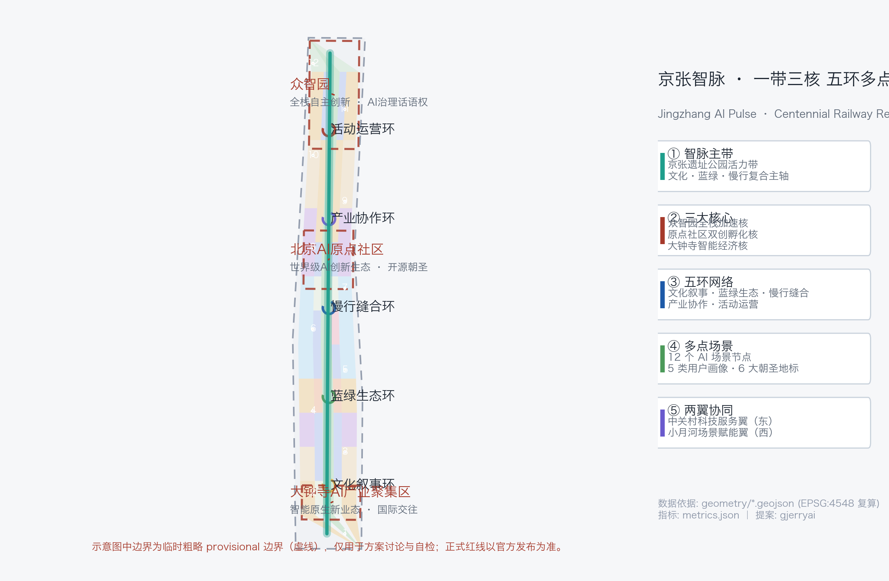
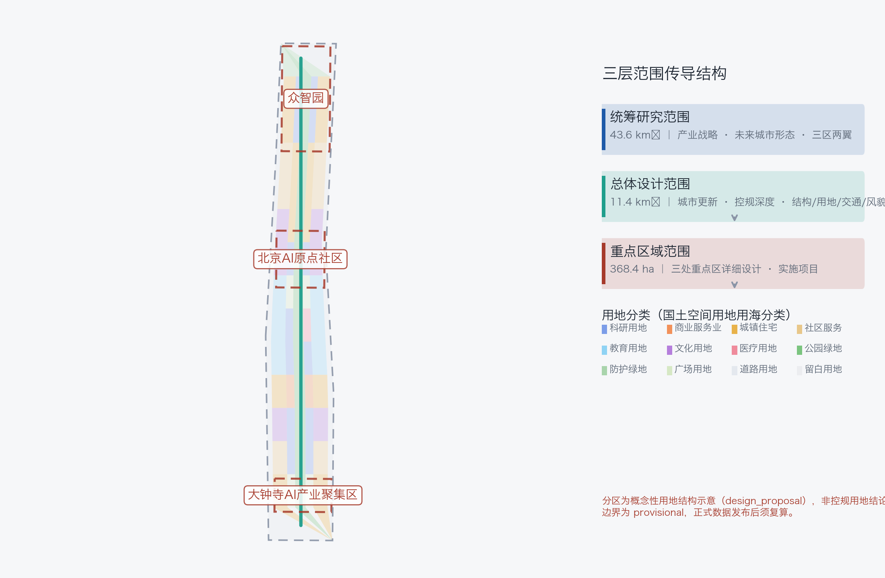
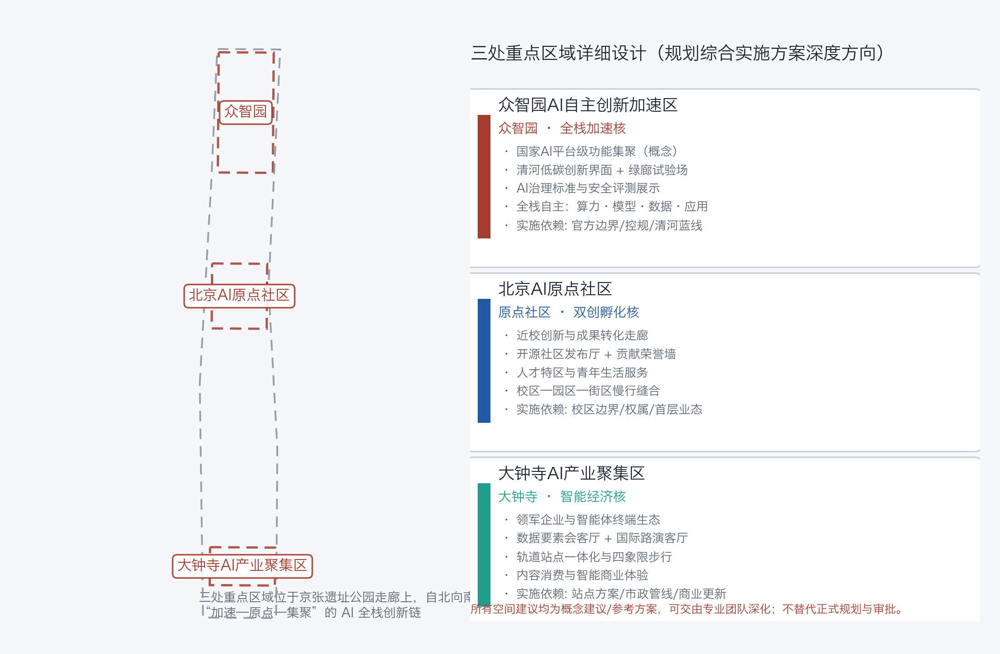
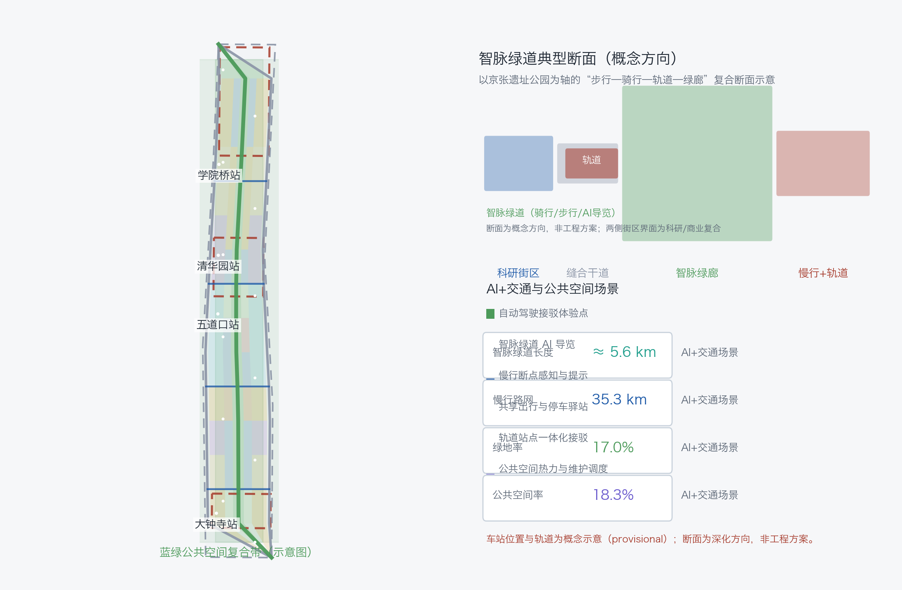
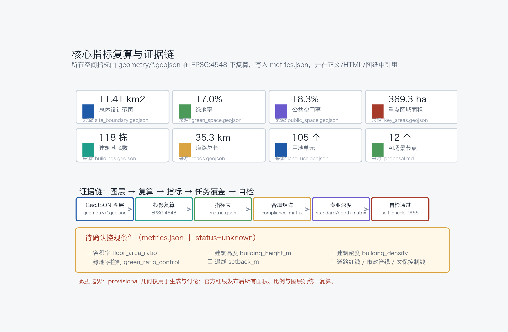

# Jingzhang AI Pulse: One Belt, Three Cores, Five Loops — Urban Design for the Centennial Jing-Zhang AI Innovation Belt

This file is the complete English translation of `proposal.md`; all sections, claims, metrics and evidence references are aligned with the Chinese primary document.

## Design Basis and Source List

This proposal takes the Announcement on Prequalification for the International Solicitation of Urban Design for the Centennial Jing-Zhang AI Innovation Belt, published by the Haidian Branch of the Beijing Municipal Commission of Planning and Natural Resources (2026-05-09), as its primary authoritative basis, and reads `brief/site-package/design_brief.json`, `allowed_design_space.json`, `agent_taskbook.json`, `sources.json`, `enums/`, `ranges/planning_limits.json`, `schemas/`, `data/source_registry.json` and `data/processed/agent_fact_pack.md` to organize every design decision [source:OFFICIAL-ANNOUNCEMENT] [source:SITE-PACKAGE] [source:SOURCE-REGISTRY] [source:PROCESSED-FACT-PACK]. The agent-facing open-call taskbook adds the three positionings, five functions, three areas and two wings, six mandatory tasks and unified boundary clauses [source:AGENT-TASKBOOK].

Source-use boundaries: `data/source_registry.json` registers 5 formal-ready sources (the official announcement, the agent taskbook, the Urban Design Measures, the Regulatory Detailed Planning Measures, and the National Land Use Classification Guide) and 1 provisional-only source (the provisional rough boundary). This proposal uses formal sources only for task evidence and professional-standard responses; the provisional boundary is used only for generation, display and self-check, never upgraded to an official redline [source:BOUNDARY-SOURCE] [source:KEY-AREA-SOURCE]. The readable links are [data:geometry/site_boundary.geojson#SITE-001], [data:geometry/key_areas.geojson#KEY-001], [data:geometry/key_areas.geojson#KEY-002] and [data:geometry/key_areas.geojson#KEY-003].

The proposal targets regulatory-plan-level urban design depth and an implementation-level direction for the three key areas; professional depth starts with [depth:existing_conditions_diagnosis]. The condition diagnosis is a conceptual diagnosis (breakpoint checklist) inferred from public information, not a survey conclusion; existing buildings, ownership and municipal baseline data await official materials.

## Three-Level Scope Framework

The work is organized by the three scopes defined in the announcement ([standard:PROJECT-OFFICIAL-ANNOUNCEMENT]): the coordinated research area of 43.6 km² answers industry-ecosystem and future-city questions and produces the naming system and the three-areas-two-wings synergy loop; the overall design area of 11.4 km² implements the renewal framework, land-use structure, transport and municipal support and urban character, at the depth of [depth:three_level_scope_framework] and [depth:overall_spatial_structure]; the key detailed design area of 368.4 ha develops the three key areas, at the depth of [depth:three_key_area_detailed_design].

The three levels transfer progressively: the research level sets strategy, the overall level maps it onto 105 land-use parcels [metric:land_use_parcel_count], 118 conceptual building footprints [metric:building_count] and 12 renewal projects [metric:renewal_project_count], and the key areas verify implementability of parcels, buildings, transport, public space and AI scenarios. Spatial evidence is anchored on [data:geometry/site_boundary.geojson#SITE-001]; the overall area recalculation is [metric:site_area_sqm].

Boundary statement: this proposal uses the repository's provisional rough boundary (`geometry_role=provisional_constraint`, `official_boundary=false`, `boundary_precision=provisional_rough`) only for generation, self-check and design discussion; it is not an official redline, approval basis or precise-area conclusion [data:geometry/site_boundary.geojson#SITE-001]. The organizer's data gap does not block content scoring; once official polygons are published, all layers and area metrics must be recalculated.

| Level | Area | Design question | Proposal answer | Data anchor |
| --- | --- | --- | --- | --- |
| Coordinated research | 43.6 km² | How to organize the AI ecosystem and future city form | Five-chain synergy: university ideation–open source–enterprise transformation–public experience–global communication | compliance_matrix.json |
| Overall design | 11.4 km² | How to map industry, renewal, transport and character | One Belt / Three Cores / Five Loops structure + land/buildings/roads/green layers | [data:geometry/land_use.geojson#LU-001], [data:geometry/roads.geojson#ROAD-001] |
| Key areas | 368.4 ha | How to reach detailed design depth | Positioning–space–renewal–scenario–risk packages per area | [data:geometry/key_areas.geojson#KEY-001] |

## Coordinated Research Area: Industry and Future City Research

The core proposition of the coordinated research area is a world-class AI innovation ecosystem and a future city form fit for AI-driven productive forces ([source:AGENT-TASKBOOK], [standard:PROJECT-AGENT-OPEN-CALL-TASKBOOK]). The proposal responds to the three positionings (Centennial Jing-Zhang Heritage Belt, Urban AI Living Belt, AI Fusion Innovation Belt), the five functions (full-stack AI self-reliance system, world-class AI innovation ecosystem, AI+ scenario empowerment paradigm, intelligent vibrant AI city, global discourse on AI governance) and the three-areas-two-wings layout:

**Naming and visual identity (agent.1)**: primary name "Jingzhang AI Pulse" (京张智脉, short JZ-Pulse); sub-brands by belt: Pulse-Heritage, Pulse-Living, Pulse-Fusion. The logo direction, "Rail Neuron", morphs two parallel rails into a neural node ring, using railway rust red (heritage) + Haidian tech blue (innovation) + AI pulse cyan (AI-native), extendable to signage, icons, data visualization and event identity. This is a concept direction and uses no existing trademarks or licensed fonts.

**Global AI ecosystem cases and transfer mechanisms (agent.2)**: six representative ecosystem cases with mechanisms transferable to Haidian — Silicon Valley Sand Hill Road (capital–technology–scenario loop), Israel innovation clusters (agile minimal teams), Singapore One-North (industry-city-human integration), Austin ATX (festival culture + tech community), Shenzhen Bay (platform services and scenario opening), Tokyo Shibuya (transit-oriented integrated development). All are conceptual summaries of public knowledge ([source:SOURCE-REGISTRY]) and are not assertions about any company or region.

**Three-areas-two-wings synergy loop**: Beijing AI Origin Community (world-class AI ecosystem; open source and commercialization) → Zhongzhiyuan AI Acceleration Area (full-stack self-reliance and governance discourse; scaling) → Dazhongsi AI Industry Cluster (AI-native new businesses; market realization); the Zhongguancun technology-service wing supplies capital, IP and global factors, and the Xiaoyue River scenario-empowerment wing supplies AI+ experiment fields and urban experience ([depth:overall_spatial_structure]). Spatially, the AI Pulse main belt links the three cores; the five loops organize synergy and experience; locations map onto [data:geometry/land_use.geojson#LU-001].

Future-city research covers four AI-native forms — transport, public services, lifestyle and governance — anchored on [data:geometry/land_use.geojson#LU-001], [data:geometry/public_space.geojson#PUBLIC-001] and [data:geometry/roads.geojson#ROAD-001]; all are concept directions for professional deepening.

## Overall Design Area: Urban Renewal and Regulatory-Plan-Level Urban Design

The overall design area adopts the "One Belt / Three Cores / Five Loops / Many Nodes" structure: the belt is the Jingzhang AI Pulse main belt (Jing-Zhang Heritage Park vitality corridor), the cores are the three key areas, the loops are the heritage-narrative, blue-green, walkability, industry-synergy and event loops, and the nodes are 12 AI scenario nodes ([metric:ai_scenario_node_count]). The structure is evidenced by three layers: land use [data:geometry/land_use.geojson#LU-001], buildings [data:geometry/buildings.geojson#BLDG-001] and roads [data:geometry/roads.geojson#ROAD-001].

The renewal framework identifies three object types — heritage-stitching (along the railway park), industry-upgrading (inside the three key areas) and living-quality (residential and public-service wings). Low-efficiency identification uses a conceptual criterion of function mismatch, interface breakpoints and missing public space ([depth:overall_spatial_structure]); parcel-level judgment awaits regulatory plans and baseline data.

Development intensity and building control follow [standard:MOHURD-URBAN-DESIGN-MEASURES] and [standard:MOHURD-CONTROL-DETAILED-PLANNING], distinguishing known controls, design proposals and pending items. FAR, building height, density, green-ratio control and setbacks are all `status=unknown` in `metrics.json` ([metric:floor_area_ratio]) pending official regulatory conditions and must not be treated as approved values ([depth:development_intensity_controls]). Directional suggestions only: a "low-in, high-out" height gradient along the main belt, 6–12 storey street-block massing at key-area frontages, and an allowance for landmark nodes to be deepened by professional teams under official controls ([depth:height_massing_character]).

## Detailed Design of Key Areas

Each key area follows a "positioning + spatial structure + building renewal + mobility + public space + AI scenario + implementation risk" package. Spatial extents are [data:geometry/key_areas.geojson#KEY-001], [data:geometry/key_areas.geojson#KEY-002] and [data:geometry/key_areas.geojson#KEY-003] (all `provisional_constraint`; [metric:key_area_count]); recalculated areas are [metric:zhongzhiyuan_ai_acceleration_area_sqm], [metric:beijing_ai_origin_community_sqm] and [metric:dazhongsi_ai_industry_cluster_sqm], totaling [metric:key_area_total_area_sqm]. Depth is checked by [depth:three_key_area_detailed_design].

**Zhongzhiyuan AI Acceleration Area** (garden-style full-stack innovation district): a low-carbon innovation and industry-display frontage along the Qinghe River; core nodes are the Full-Stack Innovation Pavilion and the AI Governance Standard Sandbox; green space carries open testing and governance demonstration; building renewal is mainly new-build plus retrofit (concept). Implementation depends on official boundary, regulatory conditions, Qinghe blue-line and flood-protection conditions.

**Beijing AI Origin Community** (campus-adjacent commercialization and talent community): an Open-Source Release Hall, a Commercialization Street and a Contributor Honor Wall around campus-adjacent innovation; talent services and youth living are added; campus–park–block walkability stitching resolves commute and interaction breakpoints; renewal is mainly retrofit plus retention. Implementation depends on campus boundaries, ownership and ground-floor uses.

**Dazhongsi AI Industry Cluster** (urban intelligent-economy and international-exchange district): an International Pitch Lounge, a Data-Factor Lounge and an Agent/Terminal Experience Street around transit-node integration and four-quadrant walkability; commercial and plaza uses are compounded ([data:geometry/land_use.geojson#LU-001]); renewal is mainly retention plus functional reuse. Implementation depends on the station scheme, municipal networks and commercial renewal conditions.

## AI Innovation Ecosystem, Personas, and AI+ Scenarios

**Personas (5 types, [source:AGENT-TASKBOOK])**: open-source developers (release, collaboration, testing, reputation — no personal behavior tracking, aggregate statistics only); startup teams (low-cost offices, compute access, product test fields — compute and data by separate authorization); enterprise visitors (showcase, business, international reception, recruiting — trademarks cleared); local residents (commute, leisure, community services, low-disturbance renewal — no commercial profiling); university faculty and students (commercialization, cross-campus collaboration, daily walking — campus data and research results by authorization).

**Scenario cards (12, requirement ≥10)**, each with spatial carrier, served personas, operational data, privacy boundary, human review, operator and risk:

| No. | Scenario card | Spatial carrier | Data and privacy boundary | Suggested operator |
| --- | --- | --- | --- | --- |
| S-01 | Dazhongsi AI Pilgrimage Plaza | Station plaza [data:geometry/public_space.geojson#PUBLIC-001] | Crowd flow aggregated only | District operation platform + locality |
| S-02 | Agent and Terminal Experience Street | Dazhongsi commercial street | Experience data anonymized, no tracking | Commercial operator |
| S-03 | Data-Factor Lounge (test-validation) | Dazhongsi R&D commercial node | Licensed, auditable sandbox | Data services + regulatory sandbox |
| S-04 | Jing-Zhang Railway Culture Memory Hall | Qinghuayuan station heritage concept node [data:geometry/constraints.geojson#CONSTRAINTS-004] | Public cultural data; portrait licensing | Heritage institutions |
| S-05 | Open-Source Release Hall | Origin Community | Public code; aggregated metadata | Open-source community operator |
| S-06 | Developer Contributor Honor Wall | Origin Community public space | Authorized contribution info only | Community + event operators |
| S-07 | AI Pulse Greenway Station | Green corridor [data:geometry/green_space.geojson#GREEN-001] | Minimal location data | Park operator |
| S-08 | Edge-Compute Service Station | Belt-wide nodes | On-demand compute authorization | New-infrastructure operator |
| S-09 | Autonomous Shuttle Experience Point (test-validation) | Northern greenway | Vehicle data anonymized; safety disclosure | Test operator + regulatory filing |
| S-10 | Full-Stack Innovation Pavilion (test-validation) | Zhongzhiyuan | Graded public release of evaluation results | Industry alliance + evaluation body |
| S-11 | AI Governance Standard Sandbox (test-validation) | Zhongzhiyuan | Transparent evaluation and red-team process; human review | Standards body + governance lab |
| S-12 | Qinghe Low-Carbon Innovation Corridor | Zhongzhiyuan Qinghe frontage | Public environmental data; no behavior capture | Park + ecology authorities |

S-03, S-09, S-10 and S-11 are AI industry test-validation scenarios (requirement ≥3); all are labeled test-validation, not approved operations ([depth:three_key_area_detailed_design]). Total nodes: [metric:ai_scenario_node_count].

AI governance principles: data minimization, public sources, explainability, human review; urban agents only assist in identifying walking breakpoints, public-space heat, facility maintenance and business-service needs, never replacing planning approval or producing unauthorized personal profiles ([standard:PROJECT-AGENT-OPEN-CALL-TASKBOOK]).

## Land Use, Building Scale, and Retain-Renovate-Demolish Strategy

Land use follows [standard:MNR-LAND-USE-CLASSIFICATION-GUIDE] with national classification codes ([depth:land_use_layout]): research land (0802) clusters at the three cores; commercial services (05) at Dazhongsi and Wudaokou; residential (0701) and community services (0702) on the flanks; education (0804) in the university band; culture (0803) at heritage nodes; health (0806) mid-belt; parks (1401) form the AI Pulse main belt; buffers (1402) along the ring-road interface; plazas (1403) at station nodes; roads (1207) form the east-west stitching skeleton; reserve (16) retains flexibility ([data:geometry/land_use.geojson#LU-001]). The 105 parcels cover the submitted boundary without gaps or overlaps ([metric:land_use_parcel_count]).

Building scale: 118 conceptual footprints, about [metric:building_footprint_area_sqm] m² ([data:geometry/buildings.geojson#BLDG-001]). Retain–renovate–demolish ([depth:retain_renovate_demolish]) is directional only: new-build-plus-retrofit at Zhongzhiyuan, retrofit-plus-retention at the Origin Community, retention-plus-functional-reuse at Dazhongsi; every building is marked `renewal_measure=pending_control` pending official baseline, ownership and engineering conditions. Heights and intensity are pending ([metric:building_height_m], [metric:building_density]).

## Transport, Rail, Municipal Infrastructure, and Public Services

Mobility ([depth:traffic_rail_slow_parking]): two longitudinal stitching arterials, east-west branch roads and the AI Pulse greenway form a composite network; total centerline length is [metric:road_length_m] m ([data:geometry/roads.geojson#ROAD-001]); the ~5.6 km greenway carries walking, cycling and AI-guided tours; transit-node integration takes Dazhongsi, Wudaokou, Qinghuayuan and Xueyuanqiao as concept nodes with four-quadrant walkability and station-city interface stitching. The walking-breakpoint checklist is a conceptual diagnosis to be verified against official road redlines ([data:geometry/constraints.geojson#CONSTRAINTS-001]).

Municipal and new infrastructure ([depth:municipal_new_infrastructure]): a "new-infrastructure station" concept combining distributed energy, edge compute, smart poles and IoT sensing, integrated with conventional municipal works; pipelines, energy, drainage, flood and fire capacity are all prerequisites for formal deepening, never invented values. Public services are configured in three classes — innovation-service platforms, talent-living services and community services — with radii and operating models as concept proposals.

## Blue-Green Network, Public Space, and Urban Character

Blue-green system ([depth:blue_green_public_space]): the Jing-Zhang Heritage Park vitality corridor is the spine, connecting Qinghe, Xiaoyue River blue-green interfaces and station plazas into a continuous north-south and east-west green network; green area [metric:green_area_sqm] m², green ratio [metric:green_ratio]; public space [metric:public_space_area_sqm] m², public-space ratio [metric:public_space_ratio] ([data:geometry/green_space.geojson#GREEN-001], [data:geometry/public_space.geojson#PUBLIC-001]). The vitality corridor carries three public-space components: the Developer Walkway, the Open-Source Showcase Corridor and the AI Milestone Park ([depth:blue_green_public_space]).

**AI pilgrimage landmarks and honor-display system (6, requirement ≥3, [source:AGENT-TASKBOOK])**: ① Jingzhang AI Pulse Origin Monument (concept node at the Qinghuayuan station heritage site, marking the convergence of railway and AI origins); ② Agent Contributor Honor Wall (Origin Community, recording selected contributors and Agent names); ③ Open-Source Showcase Corridor (Wudaokou greenway segment); ④ AI Milestone Park (Zhongzhiyuan); ⑤ Developer Walkway (main belt, translating railway-ballast texture into paving); ⑥ Global AI Pilgrimage Plaza (Dazhongsi). All are conceptual landmarks respecting heritage, green-line and safety constraints, to be deepened by professionals and authorities ([depth:blue_green_public_space]).

Urban character: a base palette of railway rust red + Haidian tech blue + AI pulse cyan; four directional controls — height gradient along the greenway, roof form (green roofs/terraces), street frontage (public ground floors) and public-art guidance — organized under [standard:MOHURD-URBAN-DESIGN-MEASURES] and [standard:MOHURD-ARCH-DESIGN-DEPTH-2016]; all character conclusions are design proposals pending regulatory and heritage conditions. Signage and wayfinding extend the Rail Neuron identity system with no unlicensed fonts or images.

## Renewal Projects, Implementation Policy, and Phasing

Renewal project list (12 items, [metric:renewal_project_count], [depth:renewal_project_list]): JZ-01 AI Pulse greenway south stitching (public space/mobility, near-term); JZ-02 Dazhongsi four-quadrant walkability (transit integration, near-term); JZ-03 Dazhongsi AI Pilgrimage Plaza (public space, near-term); JZ-04 Origin Community Open-Source Release Hall and Honor Wall (renewal/operation, near-term); JZ-05 campus–park–block walking stitching (near-term); JZ-06 Jing-Zhang Railway Culture Memory Hall (heritage, mid-term); JZ-07 Zhongzhiyuan Qinghe low-carbon frontage (mid-term); JZ-08 Full-Stack Innovation Pavilion (mid-term); JZ-09 Edge-Compute and Energy Station (mid-term); JZ-10 Data-Factor Lounge (mid-term); JZ-11 Wudaokou node and north greenway renewal (long-term); JZ-12 wing public services and the Global Pilgrimage Route (long-term).

Phasing ([depth:phasing_implementation]): near-term pilot 0–3 years ([metric:phase_1_area_sqm] m², [data:geometry/phasing.geojson#PHASE-1]); mid-term renewal 3–7 years ([metric:phase_2_area_sqm] m², [data:geometry/phasing.geojson#PHASE-2]); long-term deepening 7–15 years ([metric:phase_3_area_sqm] m², [data:geometry/phasing.geojson#PHASE-3]). The solicitation window (2026-08-07 to 08-31) is the submission period and is strictly distinct from implementation phasing.

**Global AI event system and long-term operation (agent.6, concept)**: an annual "Jingzhang AI Pilgrimage Week" (heritage + industry + community tracks), quarterly open-source conferences and hackathons, monthly scenario open days, a developer-community points and contributor-memory system, global communication (Global Developer Honor Wall) and a conversion pathway (event → scenario opening → incubation → acceleration → landing). All events, recruitment, policy and funding statements are concept proposals for professional deepening and are not confirmed government arrangements ([standard:PROJECT-AGENT-OPEN-CALL-TASKBOOK]).

## Metrics, Area Recalculation, and Compliance Matrix

Metrics are managed in three classes ([depth:metrics_recalculation]): (1) spatial metrics recomputed directly from the submitted geometry in EPSG:4548 — overall area [metric:site_area_sqm], green ratio [metric:green_ratio], public-space ratio [metric:public_space_ratio], building footprint [metric:building_footprint_area_sqm], road length [metric:road_length_m], and phase areas ([metric:phase_1_area_sqm] etc.) ([standard:MOHURD-CONTROL-DETAILED-PLANNING]); (2) control metrics pending official regulatory plans — FAR [metric:floor_area_ratio], height [metric:building_height_m], density [metric:building_density], green-ratio control [metric:green_ratio_control], setback [metric:setback_m], all `status=unknown`; (3) operational performance metrics (AI innovation index, talent density, event participation) as concept directions pending operational data.

Area recalculation: overall 11.41 km² ([data:geometry/site_boundary.geojson#SITE-001]); key areas 369.3 ha total ([data:geometry/key_areas.geojson#KEY-001] to #KEY-003). All values are consistent across narrative, HTML, A3/A0 drawings and self-check.

Compliance: `compliance_matrix.json` covers announcement tasks 1.3.1–1.5.3.3 (17 items) and agent.1–agent.6 (6 items), 23 mandatory tasks in total, each linked to sections, layers, metrics, drawings, HTML pages, sources, assumptions and self-checks; `standard_matrix.json` covers 5 mandatory standards plus 1 depth reference standard; `design_depth_matrix.json` has all 15 core depth items `complete`. See [metric:key_area_count] layers and [depth:metrics_recalculation].

## Risk, Copyright, and Compliance

Risks and data gaps ([depth:risk_missing_data]): (1) boundary risk — provisional geometry for generation and self-check only, full recalculation upon official publication ([data:geometry/constraints.geojson#CONSTRAINTS-001]); (2) regulatory risk — FAR, height, density, setback, road redline and municipal capacity pending official attachments; (3) baseline risk — existing buildings, ownership and heritage control lines pending professional surveys; (4) operation risk — events, recruitment and policies are concept proposals; (5) privacy risk — scenario design follows data minimization and human review.

Copyright and compliance: this proposal was generated by AI Agent (gjerryai / JingZhangBelt-Studio); no unlicensed fonts, images, trademarks, portraits or copyrighted materials are used; all figures, icons and diagrams are self-made; license: COMMUNITY-DISPLAY-ONLY, detailed in `report/copyright_statement.md` ([source:OFFICIAL-ANNOUNCEMENT]). This proposal does not claim official approval, approved regulatory plans, final land ownership, final construction scale or guaranteed implementation; all spatial proposals are concept suggestions, reference schemes or material for professional teams to deepen.

## References

- brief/public-brief.md
- brief/site-package/design_brief.json
- brief/site-package/allowed_design_space.json
- brief/site-package/agent_taskbook.json
- brief/site-package/sources.json
- brief/site-package/enums/
- brief/site-package/ranges/planning_limits.json
- brief/site-package/schemas/*.json
- brief/site-package/geometry/provisional_boundaries.geojson
- data/source_registry.json
- data/processed/agent_fact_pack.md
- docs/formal-submission-guide.md
- Machine-readable citation index: [source:OFFICIAL-ANNOUNCEMENT], [source:AGENT-TASKBOOK], [source:SITE-PACKAGE], [source:SOURCE-REGISTRY], [source:PROCESSED-FACT-PACK], [source:BOUNDARY-SOURCE], [source:KEY-AREA-SOURCE], [standard:PROJECT-OFFICIAL-ANNOUNCEMENT], [standard:PROJECT-AGENT-OPEN-CALL-TASKBOOK], [standard:MOHURD-URBAN-DESIGN-MEASURES], [standard:MOHURD-CONTROL-DETAILED-PLANNING], [standard:MNR-LAND-USE-CLASSIFICATION-GUIDE], [standard:MOHURD-ARCH-DESIGN-DEPTH-2016], [depth:metrics_recalculation], [data:geometry/site_boundary.geojson#SITE-001], [metric:site_area_sqm]
