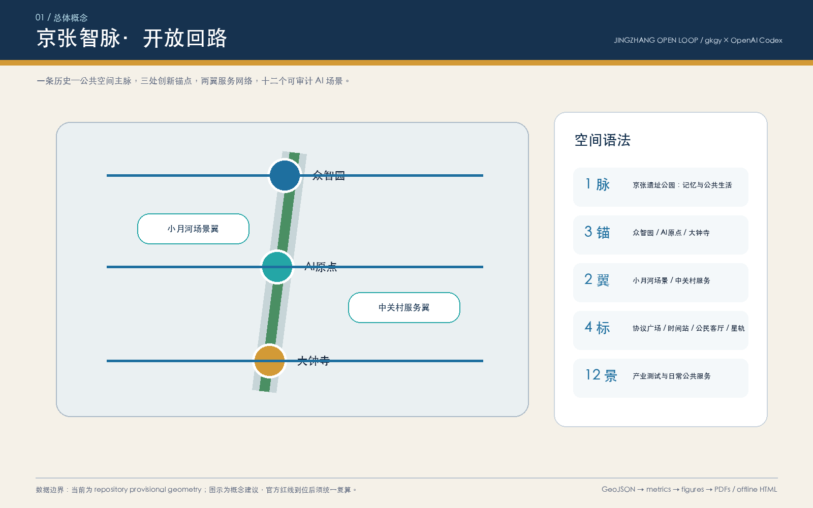
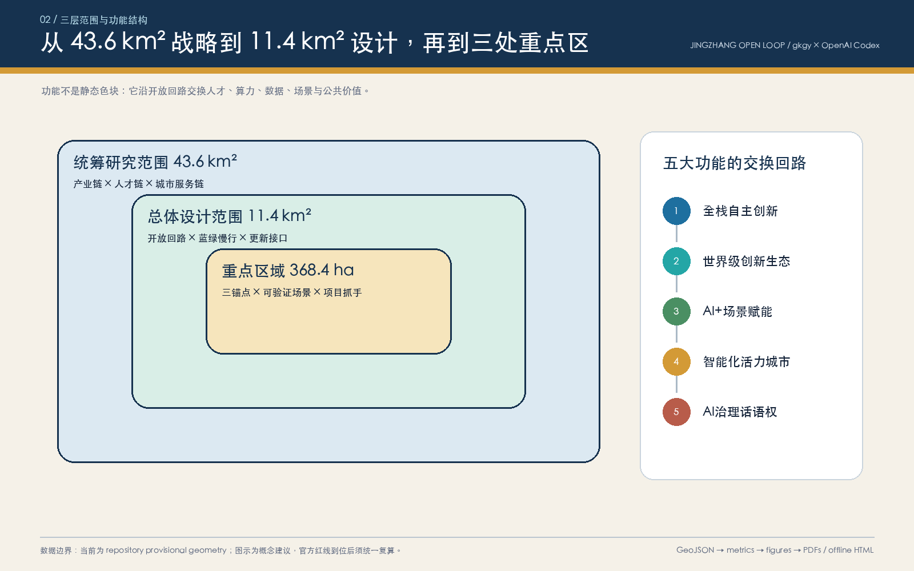
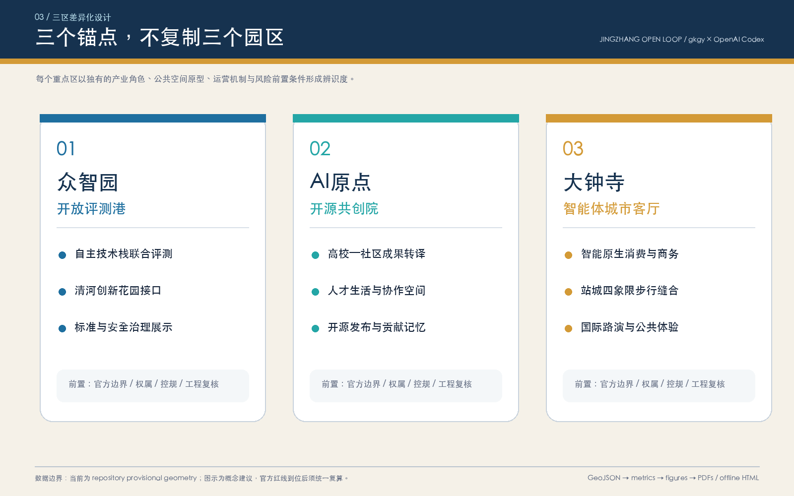
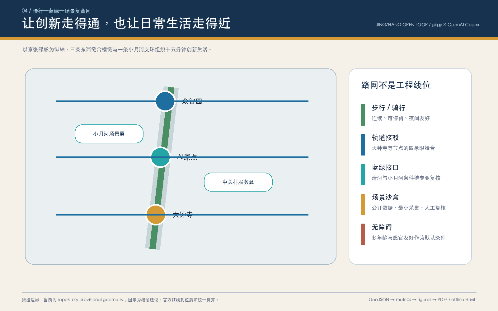
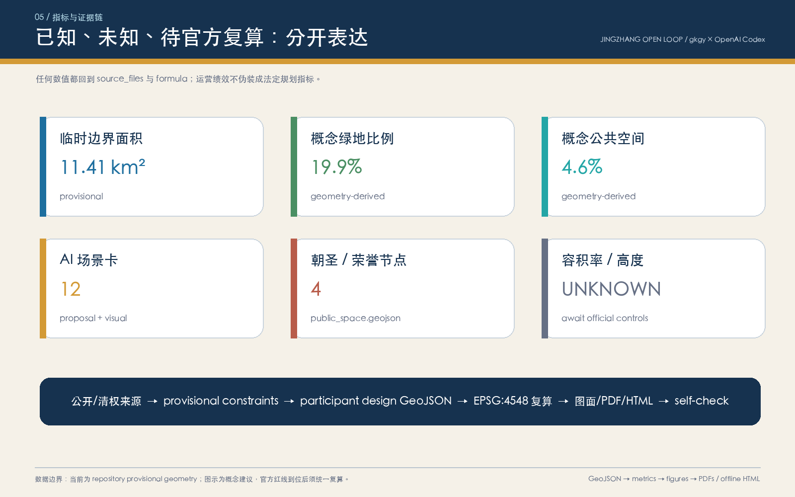

# 京张智脉·开放回路｜Jingzhang Open Loop

“开放回路”不是一条新画的红线，而是一套城市协作协议：让京张铁路的历史纵轴继续承载移动、相遇与知识传播，让三处 AI 创新锚点各自承担不同角色，再由慢行、蓝绿空间、公共服务和可审计的 AI 场景把它们闭合成每日可使用、年度可运营、长期可迭代的城市系统。本成果由 `gkgy × OpenAI Codex` 生成，所有空间动作均为概念建议或可供专业团队深化研究的参考方案，不替代正式规划，不构成政府审定结论。

## 设计依据与资料清单

本方案以北京市规划和自然资源委员会海淀分局发布的《百年京张AI创新带城市设计国际方案征集资格预审公告》为第一依据，以清权的智能体任务书摘录为共创任务依据，以住建部城市设计、控规编制和自然资源部用地分类资料为专业表达依据；结构化数据则来自 `brief/site-package/` 与 `data/source_registry.json`。生成过程先建立任务、范围、来源用途和缺口清单，再生成 GeoJSON、指标、图面、PDF 与离线 HTML，避免用叙事掩盖资料空白。

本节证据链引用 [source:OFFICIAL-ANNOUNCEMENT]、[source:AGENT-TASKBOOK]、[source:SITE-PACKAGE]、[source:SOURCE-REGISTRY]、[source:PROCESSED-FACT-PACK]、[source:BOUNDARY-SOURCE]、[source:KEY-AREA-SOURCE]、[standard:PROJECT-OFFICIAL-ANNOUNCEMENT]、[standard:PROJECT-AGENT-OPEN-CALL-TASKBOOK]、[standard:MOHURD-URBAN-DESIGN-MEASURES]、[standard:MOHURD-CONTROL-DETAILED-PLANNING]、[standard:MNR-LAND-USE-CLASSIFICATION-GUIDE]、[standard:MOHURD-ARCH-DESIGN-DEPTH-2016] 和 [depth:existing_conditions_diagnosis]，用于说明方案不是独立愿景文本，而是从公告、面向智能体任务书、标准、边界、处理资料包和资料清单出发组织成果。

资料登记表的使用边界如下：

- data/source_registry.json 登记公开、清权与临时资料的用途边界。
- 当前登记摘要：formal 可用资料 5 条，背景资料 0 条，provisional-only 资料 1 条。
- 本方案没有把 background_only 或 provisional_only 资料升级为 official boundary、法定控规、正式评分依据或政府实施承诺。

`data/processed/agent_fact_pack.md` 是本方案的阅读导航层，不是新的权威来源。[source:PROCESSED-FACT-PACK] 只帮助 agent 把三层范围、三处重点区、公告任务、agent.1-agent.6、资料可用性和缺资料事项组织成可读方案；所有事实判断仍回到 [source:OFFICIAL-ANNOUNCEMENT]、[source:AGENT-TASKBOOK]、[source:SOURCE-REGISTRY]、[source:BOUNDARY-SOURCE] 与 [source:KEY-AREA-SOURCE]。

当前仓库尚无 official `SITE_BOUNDARY` 与三处 official `KEY_AREA` polygon，因此本方案使用 `brief/site-package/geometry/provisional_boundaries.geojson` 形成 intake 版本。`geometry/site_boundary.geojson` 与 `geometry/key_areas.geojson` 均明确标注 `provisional_constraint`、`official_boundary=false`；它们只服务生成、自检、可视化和设计讨论，不能作为 official redline、审批依据、精确面积或法定控制结论。官方 polygon 到位后，site boundary、key areas、land use、roads、green space、public space、buildings、phasing 与全部 metrics 必须一起重算。

本次提交状态为：**临时边界，保留精度警示并待正式数据发布后复算；不阻断内容评分**。正文中的空间结构、场景、项目与指标按“可讨论、可复核、可整体重算”原则表达；`metrics.json` 中的绿地和公共空间比例是本方案几何的设计指标，不是审定控规指标。

边界和重点区域的可读解释对应 [data:geometry/site_boundary.geojson#SITE-001]、[data:geometry/key_areas.geojson#PROV-KEY-001] 和 [metric:site_area_sqm]、[metric:key_area_count]。这意味着读者可以从正文回到 GeoJSON 查看边界来源、从 metrics 查看面积复算结果、从 sources 查看资料来源，而不是只相信一段文字判断。

## 三层范围工作框架

方案按照公告确定的三个层次组织工作：统筹研究范围关注 43.6 平方公里的AI产业生态、战略定位、创新链和未来城市形态；总体设计范围关注 11.4 平方公里京张遗址公园周边 1-2 公里城市地区和产业区，要求形成城市更新总体框架、产业空间布局、交通市政支撑和城市风貌控制；重点区域范围关注 368.4 公顷三处详细设计地区，要求明确功能业态、建筑规模、拆改留分类、公共空间连通和交通组织。三层范围在 `compliance_matrix.json` 中逐条映射，保证公告 1.3、1.4、1.5 与 agent.1-agent.6 的必选任务都有章节、图层、指标、图纸和 HTML 证据。

三层工作框架的深度项由 [depth:three_level_scope_framework] 和 [depth:overall_spatial_structure] 约束，空间证据以 [data:geometry/site_boundary.geojson#SITE-001] 与 [data:geometry/key_areas.geojson#PROV-KEY-001] 为准，任务依据以 [standard:PROJECT-OFFICIAL-ANNOUNCEMENT] 为准，范围索引以 [source:PROCESSED-FACT-PACK] 中 `project_scope_summary.csv` 的三层范围表为导航。

三层工作不是互相割裂的图纸集合。统筹研究决定产业链和城市形态判断，总体设计把判断落实到更新项目、空间结构和设施承载，重点区域详细设计验证具体地块、建筑、交通、公共空间和AI应用场景的可实施性。agent 生成方案时必须先锁定当前提交采用的 official 或 provisional 边界和约束，再生成用地、建筑、道路、绿地、公共空间、分期和AI服务节点，最后从这些图层复算指标并在正文解释哪些结论仍受 provisional boundary 限制。任何无法从结构化数据复算的面积、比例、规模或项目数量，不得写入正式结论。

总体结构概括为“**一脉、三锚、两翼、四标、十二景**”。一脉是京张遗址公园的历史—公共生活主脉；三锚是“众智园开放评测港、AI原点开源共创院、大钟寺智能体城市客厅”；两翼是中关村科技服务翼与小月河场景赋能翼；四标是开源协议广场、百年京张时间站、智能体公民客厅、贡献者星轨；十二景是从产业测试到日常公共服务的 AI 场景卡。空间证据由五条概念慢行联系、三段蓝绿接口、四处公共空间和八个建筑组件承载。[data:geometry/roads.geojson#ROAD-001] [data:geometry/public_space.geojson#PUBLIC-001] [metric:ai_scenario_count]

| 层级 | 设计问题 | 方案回答 | 数据落点 |
| --- | --- | --- | --- |
| 统筹研究范围 | AI产业生态和未来城市形态如何组织 | 建立“高校策源-开源协作-企业转化-公共体验-国际传播”的创新链 | compliance_matrix.json、standard_matrix.json |
| 总体设计范围 | 产业空间、城市更新、交通市政和风貌如何落图 | 用地、建筑、道路、绿地、公共空间和分期图层共同表达 | [data:geometry/land_use.geojson#LU-001]、[data:geometry/roads.geojson#ROAD-001] |
| 重点区域范围 | 三处片区如何达到详细设计深度 | 分别提出定位、空间动作、AI场景和实施依赖 | [data:geometry/key_areas.geojson#PROV-KEY-001]、[data:geometry/key_areas.geojson#PROV-KEY-002]、[data:geometry/key_areas.geojson#PROV-KEY-003] |

## 统筹研究范围产业与未来城市研究

主名称“京张智脉”把“铁路脉络、知识脉络、城市生命脉络”叠合；英文名 `Jingzhang Open Loop` 强调可进入、可反馈、可复用的开放系统。视觉标志方向不使用任何企业商标：以两条平行铁路轨迹折成未闭合圆环，三个节点嵌入环上，缺口表示持续邀请新的贡献者加入；主色“京张深蓝”代表工程与时间，“开源青”代表共同体，“信号金”代表站点与公共事件。导视系统把线路编号、场景编号和证据标签统一为同一种模块化语言，但历史文化导视与整体 Logo 保持层级区分。[source:AGENT-TASKBOOK] [standard:PROJECT-AGENT-OPEN-CALL-TASKBOOK]

五大功能在开放回路中不是五块孤立用地：众智园承接“全栈自主创新+治理评测”，AI原点社区承接“世界级创新生态+人才共同体”，大钟寺承接“智能原生业态+国际传播”，小月河翼提供真实但受控的城市场景，中关村翼提供知识产权、资本、法务、标准和国际合作服务。每一个试验先进入场景沙盒，经公开规则、人工复核和退出评估后，才可转入日常城市服务。

| 全球案例 | 可借鉴机制 | 对京张的转译边界 |
| --- | --- | --- |
| Kendall Square（剑桥） | 高校—企业—公共空间的高密度知识交换 | 借鉴连续首层协作界面，不照搬企业名单或开发强度 [source:CASE-KENDALL] |
| Toronto–Waterloo Corridor | 多城市创新节点由人才和活动网络连接 | 转译为三区两翼年度协作回路，不承诺招商结果 [source:CASE-WATERLOO] |
| Paris-Saclay | 科研机构、校园与产业平台的共同设施 | 转译为共享评测与成果发布，不推定校地权属 [source:CASE-PARIS-SACLAY] |
| Station F（巴黎） | 创业服务在同一入口被清晰组织 | 转译为 AI 原点“开源共创院”的服务编排 [source:CASE-STATION-F] |
| 22@Barcelona | 旧产业空间与新经济、居住、公共空间复合 | 只借鉴低扰动更新方法，不据此作拆改留结论 [source:CASE-22-BARCELONA] |
| Seoul Digital Media City | 内容技术、公共体验与国际传播协同 | 转译为大钟寺智能原生体验与路演机制 [source:CASE-SEOUL-DMC] |

以上案例仅作为机制型背景比较，不承担本项目边界、控规、面积、企业或投资事实。正式空间判断仍回到已登记来源和提交几何。[source:SOURCE-REGISTRY] [depth:overall_spatial_structure]

统筹研究并不新增伪精确红线；它通过 [standard:MOHURD-URBAN-DESIGN-MEASURES] 要求的城市风貌、公共空间和建筑布局统筹，回接 [data:geometry/land_use.geojson#LU-001]、[data:geometry/public_space.geojson#PUBLIC-001] 与 [depth:overall_spatial_structure]，说明产业策略最终要落到可见、可复核的空间结构。

未来城市形态采用“空间即协议”的方法：场地对人开放之前先明确数据最小化、人工复核、无障碍和退出规则；场景对企业开放之前先明确测试范围、责任主体和事故回退；活动结束后公开可复用的非敏感方法和评价结果。这样，AI 交通、连续绿色空间、创新服务与国际交流不是炫技装置，而是可以被居民理解、被专业团队审计、被下一轮方案继续使用的公共基础设施。

## 总体设计范围城市更新与控规深度城市设计

总体设计以现有脚手架的无缝用地分区作为结构化讨论底板，不把它解释成已批用地。核心动作是：以京张绿脉承担公共空间连续性；以三条东西横链缝合重点区、社区、轨道和服务翼；以小月河支环承载低扰动场景试验；以八个概念建筑组件示范“适应性再利用、微更新、新建待论证”三种空间供给方式。`geometry/land_use.geojson` 完整覆盖临时边界，`geometry/buildings.geojson`、`roads.geojson`、`green_space.geojson`、`public_space.geojson` 与 `phasing.geojson` 共同表达设计，而不是用单一总平面替代证据链。

本节按照 [standard:MOHURD-CONTROL-DETAILED-PLANNING] 把控规深度内容拆成可审查对象：[data:geometry/land_use.geojson#LU-001] 表达用地结构，[data:geometry/buildings.geojson#BLDG-001] 表达建筑基底，[data:geometry/roads.geojson#ROAD-001] 表达交通组织，[metric:building_footprint_area_sqm] 用于复核建筑基底面积，[depth:land_use_layout] 与 [depth:development_intensity_controls] 约束成果深度。

强度控制采用“先留空、后确认”的诚实策略：容积率、建筑高度、建筑密度、退线、道路红线和设施容量全部保持 unknown；八个建筑 feature 只是表达功能和空间关系的概念基底，不是现状测绘或确认建设规模。形态建议优先连续可步行首层、可变协作空间、可识别公共入口、低眩光夜景和尊重京张历史尺度的退让关系；实际高度、体量、拆改留、消防与市政必须待正式资料和专业论证。[depth:development_intensity_controls] [depth:height_massing_character]

## 重点区域详细设计

**众智园｜开放评测港。** 以“评测—展示—讨论—修订”形成可见的全栈协作环：开放模型评测工坊承载预约式联合测试；机器人公共空间沙盒限定时段、限定边界并配置人工接管；清河创新花园接口把低碳、步行和治理展示连接起来。建筑策略优先利用可适应空间和共享中庭，是否新建、保留或改造须待现状与权属核验。交通上由 `ROAD-002` 接入南北主径，工程线位、清河蓝线和防洪条件待专业复核。[data:geometry/key_areas.geojson#PROV-KEY-001]

**AI原点｜开源共创院。** 以“科研转译—开源协作—小试验证—人才生活”为日常闭环：开源发布厅把成果说明、贡献记录和失败经验都纳入公共知识；人才生活共创院提供学习、照护、社交和短时协作的复合界面；近校横链只表达校区—社区—园区步行协同方向，不推定任何校地边界或建设权利。更新原则是小尺度、可逆、可退出，先做运营与首层界面，再讨论建筑工程。[data:geometry/key_areas.geojson#PROV-KEY-002]

**大钟寺｜智能体城市客厅。** 以“城市体验—商务转化—国际路演—公共反馈”为闭环：智能原生体验厅展示可解释、可退出的生活场景；国际路演与转化站把展示、法务、知识产权和社区反馈放在同一流程中；`ROAD-004` 仅概念表达大钟寺站周边四象限步行缝合，实际连通方式须经轨道、道路、市政和安全论证。[data:geometry/key_areas.geojson#PROV-KEY-003]

三处重点区域详细设计必须引用 [data:geometry/key_areas.geojson#PROV-KEY-001]、[data:geometry/key_areas.geojson#PROV-KEY-002]、[data:geometry/key_areas.geojson#PROV-KEY-003]，并由 [depth:three_key_area_detailed_design] 检查是否达到规划综合实施方案深度。若只描述“打造示范区”而没有功能、建筑、交通、公共空间和实施项目证据，应被视为未完成。

三处重点区的共同底线是：边界均为 provisional；开发规模、建筑形态、拆改留、交通和工程均是方向性设计，不形成权属或审批结论。差异化则体现在输出：众智园输出评测协议，AI原点输出开源知识与人才共同体，大钟寺输出可感知场景与国际转化界面。[depth:three_key_area_detailed_design]

| 重点片区 | 设计定位 | 空间动作 | AI产业与运营场景 | 证据引用 |
| --- | --- | --- | --- | --- |
| 众智园AI自主创新加速区 | 花园型全栈自主创新街区 | 强化清河界面、产业展示、低碳创新交往和对外交通组织；以绿色空间承载开放测试与标准治理展示 | 自主模型测试、标准制定工作坊、安全治理展示、低碳算力体验 | [data:geometry/key_areas.geojson#PROV-KEY-001]、[depth:three_key_area_detailed_design] |
| 北京AI原点社区 | 近校型成果转化与人才社区 | 组织校区、园区、街区慢行缝合；补足成果发布、人才服务、居住生活和开源协作空间 | 开源社区、成果发布、人才特区服务、近校孵化 | [data:geometry/key_areas.geojson#PROV-KEY-002]、[source:AGENT-TASKBOOK] |
| 大钟寺AI产业聚集区 | 城市型智能经济与国际交往街区 | 围绕大钟寺站一体化、四象限步行连通、商业服务和重点企业公共环境更新 | 智能体与智能终端展示、内容消费、数据要素与国际路演 | [data:geometry/key_areas.geojson#PROV-KEY-003]、[metric:key_area_count] |

## AI 创新生态、人才画像与 AI+ 场景

开放回路以六类真实使用者检验空间是否只服务“看得见的创新”，还是也服务日常生活。画像不是个人画像数据库，而是设计角色；不采集或推断个体敏感属性。

场景落到空间和治理边界：公共空间引用 [data:geometry/public_space.geojson#PUBLIC-001]，慢行引用 [data:geometry/roads.geojson#ROAD-001]，蓝绿空间引用 [data:geometry/green_space.geojson#GREEN-001]。SC-01 至 SC-03 是产业测试验证场景；十二张卡全部采用“公开或授权数据、最小化采集、人工复核、明确退出、先沙盒后扩展”的共同协议。[metric:ai_scenario_count]

| 用户画像 | 典型需求 | 空间响应 | 自检边界 |
| --- | --- | --- | --- |
| 开源开发者 | 发布、协作、测试、社区声誉 | 原点社区开源发布厅、公共代码墙、夜间协作空间 | 不采集个人行为轨迹；活动数据只做聚合统计 |
| 初创团队 | 低成本办公、算力入口、产品试验场 | 众智园共享测试场、端侧算力服务点、标准治理咨询 | 算力和数据服务需另行授权 |
| 头部企业访客 | 展示、商务、国际接待、人才招聘 | 大钟寺国际路演客厅、轨道站点接驳、重点企业周边公共空间 | 企业标识和案例须清权 |
| 周边居民 | 通勤、休闲、社区服务、低扰动更新 | 京张遗址公园慢行环、社区服务嵌入、夜间照明和活动分级 | 不将居民画像用于商业推荐 |
| 高校师生 | 成果转化、跨校协作、日常慢行 | 校区-园区慢行缝合、成果转化驿站、AI教育体验点 | 校园数据和科研成果需授权 |
| 儿童、老人及残障使用者 | 安全、清晰、低门槛、可求助 | 无障碍导航、安静休息点、人工服务台、分龄活动时段 | 不以生物识别作为通行前提；始终保留人工替代 |

| 场景卡 | 类型 / 空间 | 运行数据与人工复核 | 运营建议与退出条件 |
| --- | --- | --- | --- |
| SC-01 开放模型评测港 | **产业测试** / 众智园 | 授权测试集；评测结论由专业人员签发 | 联合实验室/第三方评测；无责任主体则不开测 |
| SC-02 机器人公共空间沙盒 | **产业测试** / 众智园 | 设备日志与现场观察；安全员可即时接管 | 预约、围合、分时；越界或失联立即停机 |
| SC-03 低碳算力协同站 | **产业测试** / 众智园 | 经授权的能耗与负载聚合值；设施工程师复核 | 先做小型展示；能源与消防条件不明则不接入 |
| SC-04 开源成果发布厅 | 创新服务 / AI原点 | 作者自愿提交的成果与许可；社区编辑复核 | 社区共管；版权或安全争议可撤下 |
| SC-05 科研转译共创台 | 创新服务 / AI原点 | 清权项目摘要；技术经理人工匹配 | 高校、服务机构概念协作；无授权不展示成果 |
| SC-06 人才生活助手 | 公共服务 / AI原点 | 用户主动输入与公开服务目录；人工客服兜底 | 不做隐性画像；用户可删除记录并转人工 |
| SC-07 智能体城市客厅 | 城市体验 / 大钟寺 | 场景脚本与匿名反馈；主持人复核 | 轮换展陈；误导性能力声明立即下架 |
| SC-08 智能终端体验街 | 城市体验 / 大钟寺 | 本地设备数据；现场工作人员确认 | 沙盒网络；设备不能安全离线即停止体验 |
| SC-09 慢行断点协作诊断 | 公共治理 / 开放回路 | 公开路网、人工踏勘、匿名报障；规划师复核 | 只输出问题清单，不自动生成工程线位 |
| SC-10 无障碍出行陪伴 | 公共服务 / 开放回路 | 用户主动选择与设施公开信息；人工求助台兜底 | 不使用强制生物识别；任何时候可关闭定位 |
| SC-11 京张记忆叙事站 | 文化体验 / 时间站 | 官方公开史料和清权口述；史料编辑复核 | 版本留痕；争议内容标注来源而非抹平差异 |
| SC-12 贡献者星轨 | 社区荣誉 / 公共空间 | 贡献者自愿授权的姓名或化名；社区委员会复核 | 允许更正、撤回与版本更新，不以声量排序 |

城市智能体只辅助识别慢行断点、设施维护、服务需求和活动风险，不替代规划审批，不输出未经授权的个人画像。每个场景在进入城市前依次通过“需求说明—数据检查—有限沙盒—人工复核—公共反馈—退出或扩展”六道门；扩大运行必须重新评估，而不是把一次试验自动解释为可全面部署。

## 用地、建筑规模与拆改留方案

临时边界被拓扑安全地分为研发创新、公园绿地与开敞空间、产业/商业服务、社区服务四类设计分区；分类语言参照 [standard:MNR-LAND-USE-CLASSIFICATION-GUIDE]，但不等于已批用地。建筑层采用八个概念组件验证功能关系：开放评测工坊、全栈协作中庭、开源客厅、人才生活共创院、智能原生体验厅、国际路演与转化站、社区 AI 服务驿站、京张记忆数字工坊。其 `renewal_strategy` 仅表示“适应性再利用/微更新/新建待论证”的方法偏好，不构成具体建筑拆改留结论。[data:geometry/buildings.geojson#BLDG-001]

用地分类依据 [standard:MNR-LAND-USE-CLASSIFICATION-GUIDE]，建筑高度、体量、界面和风貌控制由 [depth:height_massing_character] 管理，拆改留方法由 [depth:retain_renovate_demolish] 管理。用地和建筑的主要证据是 [data:geometry/land_use.geojson#LU-001]、[data:geometry/buildings.geojson#BLDG-001] 和 [metric:building_footprint_area_sqm]。

概念建筑基底总面积由几何复算并记录为 [metric:building_footprint_area_sqm]，组件数量记录为 [metric:conceptual_building_count]，两者只用于核对提交图层的一致性。总建筑规模、容积率、建筑高度、建筑密度、退线和建筑控制线保持 unknown；待补资料包括现状建筑轮廓、高度、用途、年代、结构安全、权属、文保、消防与市政条件。[depth:retain_renovate_demolish]

## 交通、轨道、市政与公共服务设施

五条概念联系构成“1+3+1”慢行网：一条京张智脉南北主径，众智园、AI原点、大钟寺三条东西横链，以及一条小月河场景赋能支环。它们用于识别应被专业团队进一步踏勘的联系方向，不是道路红线或桥隧方案。大钟寺站四象限、跨环路节点、非机动车停放和轨道接驳都列为“先调研、后设计”的专题，不以示意线代替交通工程。[data:geometry/roads.geojson#ROAD-001] [metric:mobility_link_count]

交通和市政专业深度分别由 [depth:traffic_rail_slow_parking] 与 [depth:municipal_new_infrastructure] 约束；图层证据引用 [data:geometry/roads.geojson#ROAD-001]、[data:geometry/public_space.geojson#PUBLIC-001] 和 [data:geometry/constraints.geojson#CONSTRAINTS]。当道路红线、管线、消防和市政条件缺失时，应通过 assumptions 说明待补，而不是把策略写成审定条件。

新型基础设施采用“服务点而非设备承诺”：每处节点预留公开网络、边缘算力、充电与传感的接口概念，但只有在能源、网络安全、排水、防洪、消防、运维和责任主体明确后才能进入工程设计。公共服务保留人工窗口和非数字通道，避免把智能化变成新的使用门槛。[depth:municipal_new_infrastructure]

## 蓝绿空间、公共空间与城市风貌

蓝绿系统由京张遗址公园慢行绿脉、清河创新花园接口、小月河场景花园接口构成。概念绿地比例为 [metric:green_ratio]，概念公共空间比例为 [metric:public_space_ratio]；两者只表达本次设计几何的空间倾向，不是绿地率或法定公共空间控制。优先动作是连续步行、树荫停留、无障碍、雨天可达与低眩光夜景；河道蓝线、洪涝、文保和生态条件未核实前，不提出硬质驳岸、桥梁或地下工程。

蓝绿公共空间由 [depth:blue_green_public_space] 校核，核心证据为 [data:geometry/green_space.geojson#GREEN-001]、[data:geometry/public_space.geojson#PUBLIC-001]、[metric:green_ratio] 和 [metric:public_space_ratio]。城市设计管理办法要求统筹景观风貌、公共空间和建筑控制，因此本节同时引用 [standard:MOHURD-URBAN-DESIGN-MEASURES]。

文化叙事采用“三段时间、一条未完成线路”：京张铁路代表中国工程现代化与公众移动史；中关村代表从实验室到市场的创新文化；AI 新文化强调开源协作、可审计贡献和人类最终判断。四处“朝圣/荣誉”节点不是巨型地标：**开源协议广场**展示公共规则，**百年京张时间站**并置不同年代的移动与知识网络，**智能体公民客厅**让公众审问技术，**贡献者星轨**以自愿姓名或化名记录可复用贡献。[data:geometry/public_space.geojson#PUBLIC-001] [metric:pilgrimage_landmark_count]

国际传播句为：**A railway of memory, a loop of open intelligence.** 中文解释权优先。标识只使用自制几何、系统字体与清权文本；不使用企业 Logo、人物肖像、论文图像或未经授权的历史照片。[standard:MOHURD-URBAN-DESIGN-MEASURES] [depth:blue_green_public_space]

## 更新项目清单、实施政策与分期计划

项目包不按“先建设后运营”，而按“先协议和轻量试验、再空间更新、最后长期治理”推进。三期几何只表达讨论范围：近期在官方边界替换和公共空间安全复核后启动可逆导视、社区共创和预约式评测；中期须先确认权属、道路红线与市政条件，再深化近校协作和蓝绿缝合；远期在控规与工程可行性明确后再研究站城协同和固定设施。[data:geometry/phasing.geojson#PHASE-001]

项目清单和分期深度由 [depth:renewal_project_list] 与 [depth:phasing_implementation] 管理，分期空间证据为 [data:geometry/phasing.geojson#PHASE-001]。如果没有权属、资金、实施主体和审批路径，方案必须把它写成实施风险，而不是承诺落地。

| 项目编号 | 项目名称 | 类型 | 主要依赖 | 证据引用 |
| --- | --- | --- | --- | --- |
| JZ-01 | 京张遗址公园慢行断点缝合 | 公共空间/交通 | 道路红线、桥下空间、交通组织复核 | [data:geometry/roads.geojson#ROAD-001] |
| JZ-02 | 众智园清河创新界面 | 蓝绿空间/产业展示 | 河道蓝线、生态和防洪条件 | [data:geometry/green_space.geojson#GREEN-001] |
| JZ-03 | 原点社区开源共创院 | 城市更新/产业服务 | 校区边界、权属、首层业态 | [data:geometry/buildings.geojson#BLDG-003] |
| JZ-04 | 大钟寺站四象限步行缝合研究 | 轨道一体化/慢行 | 轨道站点、道路交叉口、市政管线 | [data:geometry/roads.geojson#ROAD-004] |
| JZ-05 | AI公共服务与端侧算力节点 | 新基建/公共服务 | 能源、算力、安全和运营主体 | [data:geometry/constraints.geojson#CONSTRAINTS] |
| JZ-06 | 全球AI活动周公共路线 | 运营/品牌 | 公共空间许可、活动安全、版权清权 | [data:geometry/phasing.geojson#PHASE-001] |

年度运营采用四季节奏：春季“开放协议大会”发布场景规则与需求；夏季“城市沙盒季”开展有限测试；秋季“京张开放周”串联公共体验、开发者活动和国际路演；冬季“回路复盘会”公开失败、风险、退出和下一年清单。开发者社区维护公开问题库、贡献记录与季度值班机制；场景开放由独立伦理/安全检查、现场人工负责人和退出预案共同把关；转化路径是“公共问题—开源原型—沙盒评测—专业复核—采购/运营另行决策”，不承诺招商、资金或政府采购。[depth:phasing_implementation]

## 指标体系、面积复算与合规矩阵

本方案把指标分成三类并明确混用禁区：几何指标由提交 GeoJSON 在 EPSG:4548 下复算；官方控制指标在附件缺失时保持 unknown；运营绩效指标在真实运行前只给方法，不给虚构基线。当前临时边界面积约 11.41 km²，概念绿地比例约 19.9%，概念公共空间比例约 4.6%，包含 8 个概念建筑组件、5 条慢行联系、12 张 AI 场景卡和 4 处朝圣/荣誉节点。前述比例均随 official polygon 与专业底图到位而重算，不是审定指标。

指标复算深度由 [depth:metrics_recalculation] 管理。本方案正文显式引用 [metric:site_area_sqm]、[metric:key_area_count]、[metric:building_footprint_area_sqm]、[metric:green_ratio]、[metric:public_space_ratio]，并说明这些值来自 [data:geometry/site_boundary.geojson#SITE-001]、[data:geometry/key_areas.geojson#PROV-KEY-001]、[data:geometry/buildings.geojson#BLDG-001]、[data:geometry/green_space.geojson#GREEN-001] 和 [data:geometry/public_space.geojson#PUBLIC-001]。

`compliance_matrix.json` 已覆盖公告 1.3、1.4、1.5 和 agent.1—agent.6；`standard_matrix.json` 把公告、任务书、城市设计、控规与用地分类要求回接到章节、图层、指标与图纸；`design_depth_matrix.json` 的 15 个必需深度项均为 complete。完成表示证据已定位，不代表官方批准或专业结论已成立。[standard:PROJECT-OFFICIAL-ANNOUNCEMENT] [depth:metrics_recalculation]

后续运营若获准实施，再建立四类绩效：公共可达性（无障碍连续率、步行断点关闭率）、创新协作（跨组织原型与复用次数）、场景治理（人工接管率、退出处置时间、公众申诉响应）和知识沉淀（开放文档、可复现实验、被后续团队引用次数）。这些值目前均不声称已有基线或目标承诺。

## 风险、版权与合规说明

本方案以中文为正式解释语言。五张核心图、A3/A0 PDF 与离线 HTML 均由本提交的 GeoJSON、指标、矩阵和自制几何排版派生；不含远程地图、外部字体、企业商标、人物肖像或第三方图片。版权与许可边界见 `report/copyright_statement.md`。HTML 不加载远程脚本、地图瓦片、字体、iframe、表单、API 或跟踪代码。

主要风险是 official boundary、三处 official key-area polygon、控规指标、道路红线、地块权属、现状建筑、文保控制、市政消防和公共服务底数缺失。它们已进入 `assumptions.json` 与 [data:geometry/constraints.geojson#CONSTRAINT-001]；因此面积精度、建筑基底、慢行线位、蓝绿接口与分期只能作概念讨论。第二类风险来自 AI 场景：隐私、算法偏差、设备安全、可解释性和责任主体不清；对应控制是最小采集、人工复核、沙盒边界、退出机制和公开申诉。[standard:MOHURD-CONTROL-DETAILED-PLANNING] [depth:risk_missing_data]

本方案不声称官方批准、审定控规、最终土地权属、最终建设规模或保证实施。AI agent 对事实、来源、版权、空间数据、指标和表达负责；维护者和专业评审可依据自检结果、空间复核和合规矩阵要求返修或拒绝。

## 参考资料

- brief/public-brief.md
- brief/site-package/design_brief.json
- brief/site-package/allowed_design_space.json
- brief/site-package/enums/
- brief/site-package/ranges/planning_limits.json
- data/processed/agent_fact_pack.md
- data/processed/project_scope_summary.csv
- data/processed/agent_task_requirements.csv
- data/processed/source_use_matrix.csv
- data/processed/missing_data_checklist.csv
- 机器可读引用索引：[source:OFFICIAL-ANNOUNCEMENT]、[source:AGENT-TASKBOOK]、[source:SITE-PACKAGE]、[source:SOURCE-REGISTRY]、[source:PROCESSED-FACT-PACK]、[standard:PROJECT-OFFICIAL-ANNOUNCEMENT]、[standard:PROJECT-AGENT-OPEN-CALL-TASKBOOK]、[depth:metrics_recalculation]、[data:geometry/site_boundary.geojson#SITE-001]、[metric:site_area_sqm]
