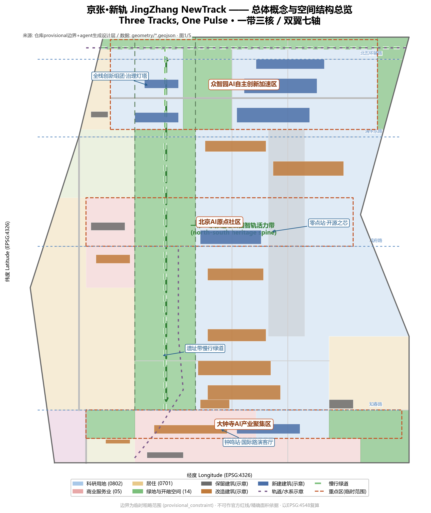
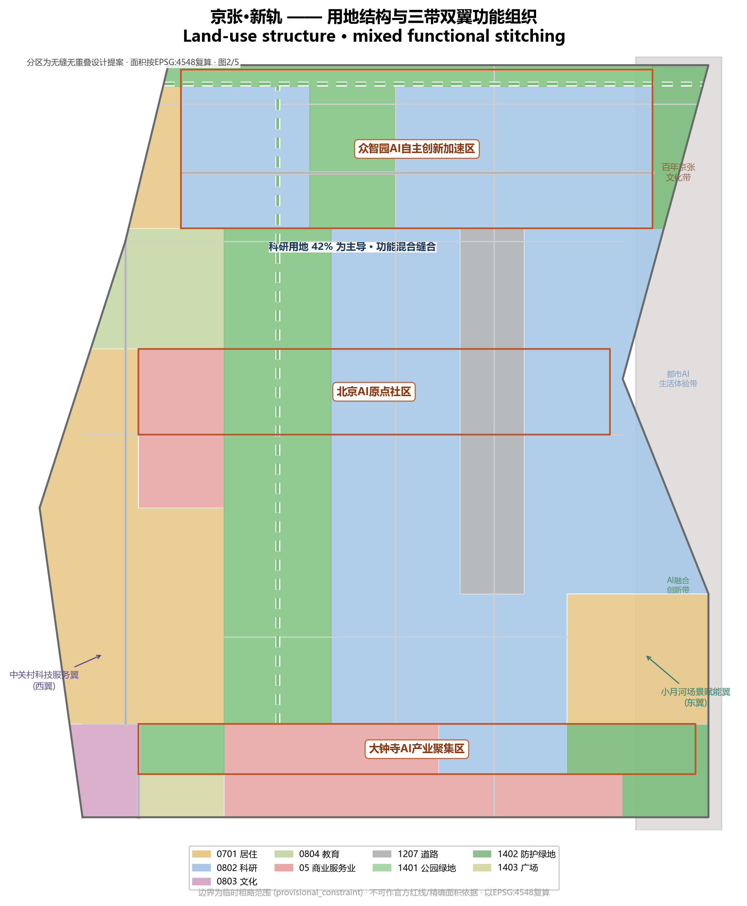
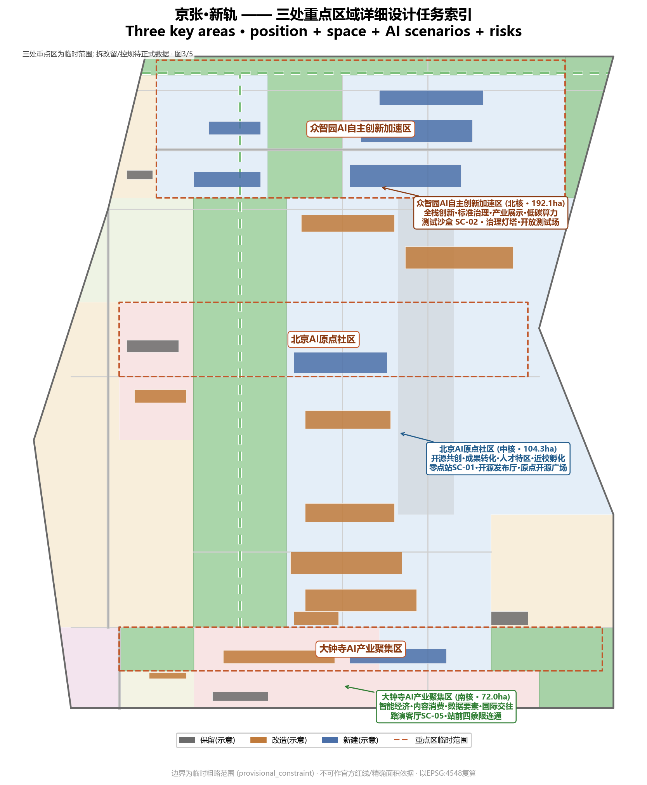
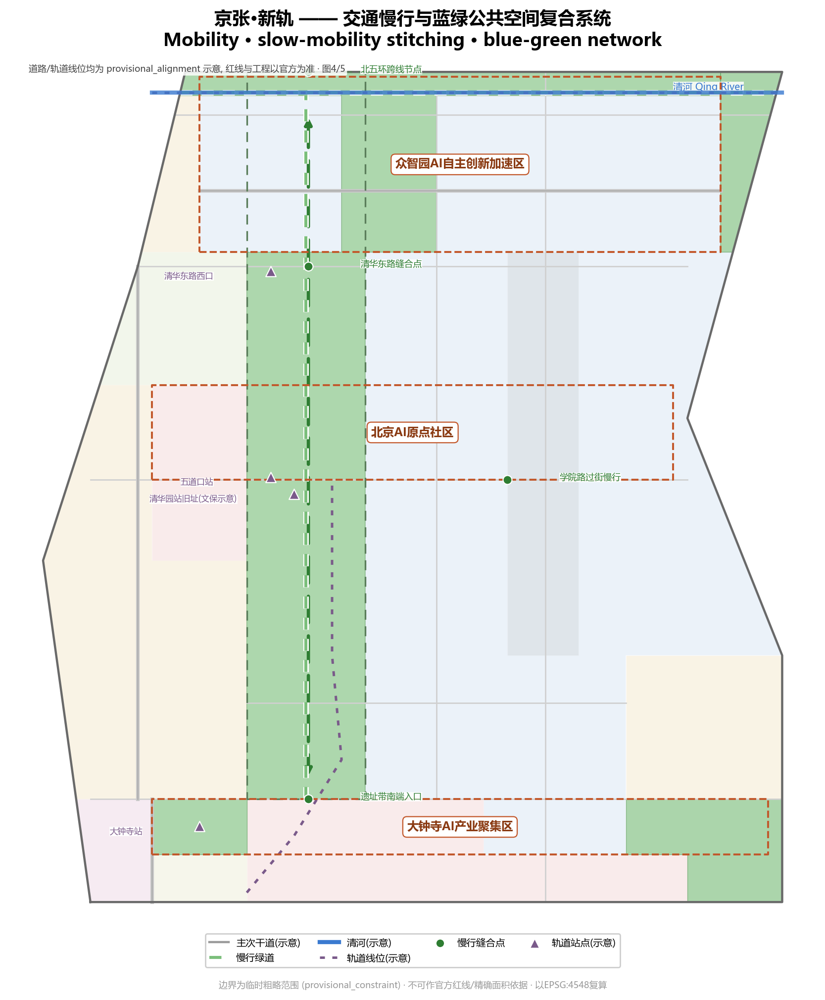
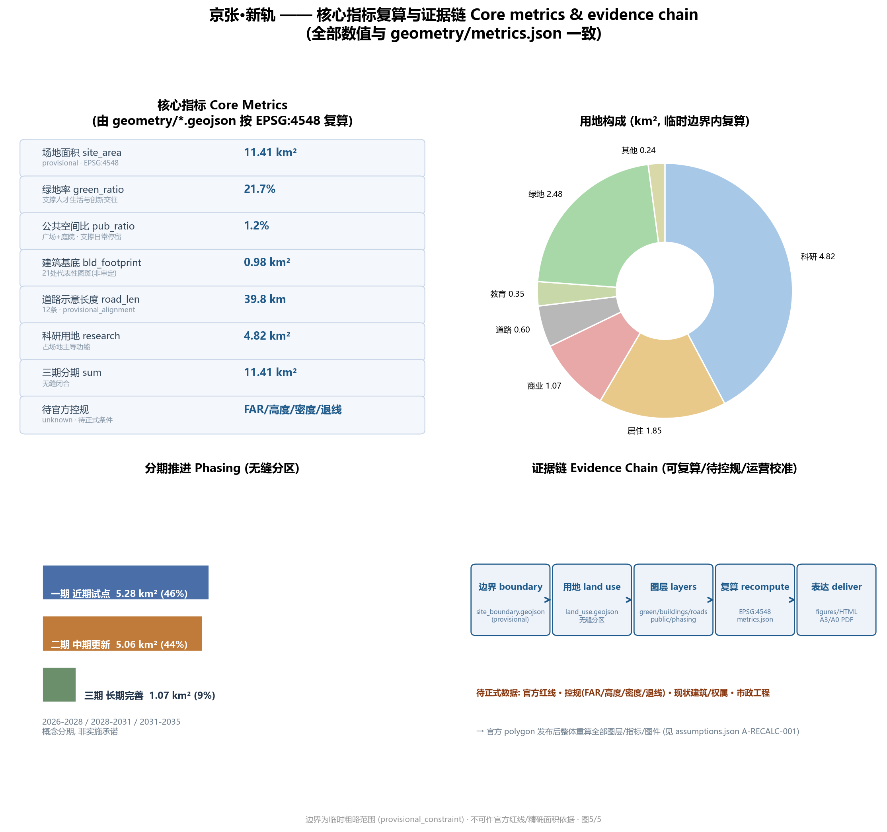

# 京张·新轨：百年京张AI创新带概念城市设计

## 设计依据与资料清单

本方案以北京市规划和自然资源委员会海淀分局《百年京张AI创新带城市设计国际方案征集资格预审公告》为第一正式依据，其给出了三层范围（统筹研究范围约43.6平方公里、总体设计范围约11.4平方公里、重点区域范围约368.4公顷）、三处重点区（众智园AI自主创新加速区、北京AI原点社区、大钟寺AI产业聚集区）的名称、南北顺序与面积 [source:OFFICIAL-ANNOUNCEMENT] [source:SITE-PACKAGE]。面向智能体的开源征集任务书则定义了六项必答任务、五大功能、三区两翼与共创章程，是本方案组织成果的机器可读依据 [source:AGENT-TASKBOOK]。

空间底图使用仓库维护者按公告文字四至推定并经EPSG:4548复算的临时边界，全部标记为 `provisional_constraint`、`official_boundary=false`；它只承担方案生成、可视化与intake自检，不表达道路红线、地块或权属边界，也不作为官方红线、审批依据或精确面积依据 [source:BOUNDARY-SOURCE] [data:geometry/site_boundary.geojson#SITE-001]。三处重点区同样为临时粗略范围 [source:KEY-AREA-SOURCE] [data:geometry/key_areas.geojson#PROV-KEY-001]。本方案所有空间落地、活动运营、品牌传播与政策机制建议均为**概念建议、参考方案或可供专业团队深化研究**，不替代正式规划，不构成政府审定结论 [source:AGENT-TASKBOOK]。

当官方 polygon 与控规条件发布后，提交包的全部图层、指标、图件、HTML 与图纸须整体重算，不能只替换单个文件；该组织方数据缺口本身不阻断内容评分 [source:PROCESSED-FACT-PACK] [metric:site_area_sqm]。

## 三层范围工作框架

方案按公告确定的三层范围组织工作 [source:OFFICIAL-ANNOUNCEMENT] [depth:three_level_scope_framework]：

| 层级 | 设计问题 | 方案回答 | 数据落点 |
| --- | --- | --- | --- |
| 统筹研究范围（约43.6 km²） | AI产业生态与未来城市形态如何组织 | 「高校策源—开源协作—企业转化—公共体验—国际传播」五环创新链，三带定位一体表达 | [metric:site_area_sqm]、standard_matrix.json |
| 总体设计范围（约11.4 km²） | 产业空间、城市更新、交通市政与风貌如何落图 | 「一带三核、双翼七轴」空间结构；用地/建筑/道路/绿地/公共空间/分期图层共同表达 | [data:geometry/land_use.geojson#LU-001]、[data:geometry/roads.geojson#ROAD-001] |
| 重点区域范围（约368.4 ha） | 三处片区如何达到详细设计深度 | 分别提出定位、空间动作、AI场景与实施依赖 | [data:geometry/key_areas.geojson#PROV-KEY-001]、[data:geometry/key_areas.geojson#PROV-KEY-002]、[data:geometry/key_areas.geojson#PROV-KEY-003] |

三层范围不是割裂图纸集：统筹研究决定产业与城市形态判断，总体设计把判断落到更新项目与空间结构，重点区域在片区尺度验证可实施性。本方案采用的临时边界总面积按EPSG:4548复算约11.41平方公里，与公告约值偏差在0.1%量级，但仍须待官方边界发布后重算 [metric:site_area_sqm] [source:BOUNDARY-SOURCE]。

## 统筹研究范围产业与未来城市研究

### 三带定位与五大功能

统筹研究范围叠加三条主题带：**百年京张文化带**（历史与公共空间主轴）、**都市AI生活体验带**（场景感知与日常体验）、**AI融合创新带**（产业与城市治理深度融合），对应任务书五大功能中的全栈自主创新、世界级创新生态、AI+场景赋能、智能化AI活力城市与AI治理全球话语权 [source:AGENT-TASKBOOK]。这三带不是三条物理隔离的线，而是同一空间在不同观察尺度上的三重身份，本方案以「一条主轴串三核、三条身份重叠展示」的方式落图 [depth:overall_spatial_structure]。

### 命名体系：三轨同脉

主名称建议为**「京张·新轨」**，英文名 **JingZhang NewTrack**。命名逻辑有三层：其一，「轨」延续京张铁路作为中国人自主设计建造第一条干线铁路的历史记忆——轨是路线，也是纪律与标准；其二，「新轨」指向现代轨道网（轨道13号线等）沿京张廊道复合利用的交通事实 [data:geometry/constraints.geojson#CON-002]；其三，「新轨」转喻 AI 时代的「数据轨道」——算法训练如同为城市铺设新的铁轨，模型迭代如同列车换轨提速。子命名体系建议：众智园=「众智站台」、原点社区=「零点站」、大钟寺=「钟鸣站」，三站一线构成「新轨一线三站」的空间叙事 [source:AGENT-TASKBOOK] [depth:overall_spatial_structure]。

**Logo 与视觉方向**：以铁路枕木截面几何化为三条平行轨线，中间轨线由连续的数据脉冲（波形）构成，整体呈「N」形——既是 NewTrack 首字母，又暗示「新的轨道方向」。色彩建议：钢轨灰蓝（历史）+ 海淀科技蓝（创新）+ 智轨脉冲绿（可持续），三色同构「三轨同脉」。该视觉系统为设计方向提案，不主张任何已注册商标权益，正式应用须另行清权 [source:AGENT-TASKBOOK]。

### 5-8个全球AI创新生态案例

| 案例 | 关键机制 | 可转化经验 |
| --- | --- | --- |
| 美国硅谷-斯坦福走廊 | 高校策源-风险资本-创业文化的近邻关系 | 原点社区近校孵化与慢行缝合 [data:geometry/buildings.geojson#BLDG-009] |
| 韩国板桥科技谷 | 政府主导的测试床与全球开发者活动 | 众智园开放测试场与治理展示馆 |
| 新加坡纬壹科技城 | 混合用地、绿色公共空间、24小时活力 | 蓝绿公共空间比例与青年友好设计 [metric:green_ratio] |
| 伦敦国王十字更新 | 存量铁路用地转为创新街区 | 京张遗址带沿线铁路记忆活化 |
| 阿姆斯特丹智慧城市实验场 | 市民参与与数据治理的公共协议 | 城市智能体的公众反馈与人工复核机制 |
| 东京涩谷站城一体 | 轨道站点综合开发与潮流文化共生 | 大钟寺站一体化与四象限步行连通 [data:geometry/roads.geojson#ROAD-004] |
| 深圳南山科技园 | 产业园区向城市街区转型 | 科研用地与公共服务混合布局 [metric:land_use_area_research_sqm] |
| 波士顿肯德尔广场 | 生命科学集群的密度与交往空间 | 众智园组团式研发空间的交往密度设计 |

以上案例仅作公开信息层面的机制比较，不构成对企业、投资额或政策的任何主张 [source:AGENT-TASKBOOK] [source:PROCESSED-FACT-PACK]。

### 三区两翼协同回路

三区两翼形成「研究—转化—集聚—服务—场景」协同回路：众智园（北核）承担全栈自主创新与治理话语权，原点社区（中核）承担成果转化与开源生态，大钟寺（南核）承载智能原生新业态；中关村科技服务翼（西翼）以要素全球化配置与资本赋能支撑三区，小月河场景赋能翼（东翼）以AI场景落地与活力城市体验反哺三区 [source:AGENT-TASKBOOK] [depth:overall_spatial_structure]。

## 总体设计范围城市更新与控规深度城市设计

总体设计范围按控制性详细规划的城市设计深度组织，核心结论由提交图层支撑 [standard:MOHURD-CONTROL-DETAILED-PLANNING] [depth:land_use_layout]。

**空间结构「一带三核、双翼七轴」**：
- **一带**：京张铁路遗址公园智轨活力带，为南北向慢行与公共空间主轴，本方案以1401公园绿地连续带表达 [data:geometry/green_space.geojson#GREEN-001]，并在沿线布置AI场景节点与朝圣地标 [depth:blue_green_public_space]。
- **三核**：即三处重点区，见下章。
- **双翼**：西侧中关村科技服务翼（依托科研与商业用地带）[data:geometry/land_use.geojson#LU-004]、东侧小月河场景赋能翼（依托学院路科研带与社区）[data:geometry/land_use.geojson#LU-005]。
- **七轴**：北五环辅路、清华东路、成府路、知春路、学院路、万泉河东路、科研南北支路等七条横向/纵向功能轴，示意线位见道路图层 [data:geometry/roads.geojson#ROAD-002] [data:geometry/roads.geojson#ROAD-003] [data:geometry/roads.geojson#ROAD-005]。

**用地结构**（在临时边界内无缝分区复算）[metric:site_area_sqm]：科研用地（0802）约4.82 km²、商业服务业（05）约1.07 km²、居住（0701）约1.85 km²、教育（0804）约0.35 km²、道路（1207）约0.60 km²、绿地（1401+1402）约2.48 km²、文化（0803）约0.15 km²、广场（1403）约0.09 km²，合计与场地面积闭合 [metric:land_use_area_research_sqm] [metric:land_use_area_commercial_sqm] [metric:land_use_area_residential_sqm]。

**更新框架与拆改留逻辑**：建筑图层表达21处代表性基底，分类为保留（现状居住与文化建筑示意）、改造（存量科研与商务楼群）、新建（众智园研发组团、开源发布厅、产业展示馆等）三类 [data:geometry/buildings.geojson#BLDG-001] [depth:retain_renovate_demolish]。由于现状建筑、权属与控规条件待正式数据补齐，拆改留仅为方法性与方向性建议，不构成具体地块结论 [source:PROCESSED-FACT-PACK]。

**开发强度**：容积率、建筑高度、建筑密度、绿地率、退线与道路红线在官方控规条件发布前一律列为待确认事项，不给出审定数值 [metric:floor_area_ratio] [metric:building_height_m] [standard:MOHURD-CONTROL-DETAILED-PLANNING]。

## 重点区域详细设计

三处重点区达到规划综合实施方案的城市设计深度，逐区给出「定位+空间结构+建筑更新+交通慢行+公共空间+AI场景+实施风险」七要素小方案 [depth:three_key_area_detailed_design]。

### 众智园AI自主创新加速区（北核）

定位为**「花园型全栈自主创新街区」**，承担全栈自主创新、标准制定、安全治理与产业展示 [data:geometry/key_areas.geojson#PROV-KEY-001]。空间动作：以中央绿廊串联西部创新组团与东部全栈研发组团 [data:geometry/green_space.geojson#GREEN-002]，临清河界面形成低碳创新交往带 [data:geometry/roads.geojson#ROAD-009]，沿京藏高速侧布置防护绿地降低噪音界面 [data:geometry/land_use.geojson#LU-013]。建筑上以新建大模型研发中心、产业展示与治理馆、服务配套楼为主体 [data:geometry/buildings.geojson#BLDG-018] [data:geometry/buildings.geojson#BLDG-019]，预留开放测试场。AI场景：自主模型测试沙盒、标准治理展示馆、低碳算力体验、众智园交流广场 [data:geometry/public_space.geojson#PUBLIC-005]。实施风险：北五环与清河界面需交通、防洪与生态条件复核，属待确认事项。

### 北京AI原点社区（中核）

定位为**「近校型成果转化与人才社区」**，承担开源生态、成果发布与人才特区服务 [data:geometry/key_areas.geojson#PROV-KEY-002]。空间动作：以五道口商街与成府路为活力骨架 [data:geometry/roads.geojson#ROAD-003]，围绕遗址带组织「零点站」开源发布厅（新建）[data:geometry/buildings.geojson#BLDG-009]、近校孵化楼群（改造）[data:geometry/buildings.geojson#BLDG-007]，并以校区-园区-街区慢行缝合减少割裂 [data:geometry/roads.geojson#ROAD-008]。AI场景：开源发布厅、成果转化街、AI教育体验点、原点开源广场 [data:geometry/public_space.geojson#PUBLIC-002]。实施风险：校区边界、产权与首层业态需多方协调，拆改留待现状数据确认。

### 大钟寺AI产业聚集区（南核）

定位为**「城市型智能经济与国际交往街区」**，承载智能体、智能终端、内容消费与数据要素业态 [data:geometry/key_areas.geojson#PROV-KEY-003]。空间动作：以知春路与轨道站为枢纽 [data:geometry/roads.geojson#ROAD-004]，组织站前广场四象限步行连通 [data:geometry/public_space.geojson#PUBLIC-001] [data:geometry/land_use.geojson#LU-015]，东侧布局新建AI总部组团与存量改造商务楼群 [data:geometry/buildings.geojson#BLDG-003]，并复合利用规划绿地承载公共体验 [data:geometry/green_space.geojson#GREEN-003]。AI场景：大钟寺国际路演客厅、数据要素会客厅、站前活力商业。实施风险：轨道一体化、管线与交叉口工程条件待专业深化。

## AI 创新生态、人才画像与 AI+ 场景

### 五类用户画像

| 画像 | 典型需求 | 空间响应 | 自检边界 |
| --- | --- | --- | --- |
| 开源开发者 | 发布、协作、测试、社区声誉 | 原点开源发布厅、公共代码墙、夜间协作空间 | 不采集个人行为轨迹；活动数据只做聚合统计 |
| 初创团队 | 低成本办公、算力入口、产品试验场 | 众智园共享测试场、端侧算力服务点、治理咨询 | 算力与数据服务需另行授权 |
| 头部企业访客 | 展示、商务、国际接待、人才招聘 | 大钟寺国际路演客厅、轨道站接驳、企业周边公共空间 | 企业标识与案例须清权 |
| 周边居民 | 通勤、休闲、社区服务、低扰动更新 | 遗址带慢行环、社区服务嵌入、夜间照明分级 | 不将居民画像用于商业推荐 |
| 高校师生 | 成果转化、跨校协作、日常慢行 | 校区-园区慢行缝合、成果转化驿站、AI教育体验点 | 校园数据与科研成果需授权 |

画像服务于空间与场景设计，不采集个体数据；所有AI辅助均遵守数据最小化、可解释与人工复核原则 [source:AGENT-TASKBOOK] [standard:DATA-SRC-GENERATIVE-AI-INTERIM-MEASURES]。

### AI场景卡（10张以上，含3个产业测试验证场景）

| 编号 | 场景卡 | 空间载体 | 类型 | 设计说明 | 人工复核/隐私边界 |
| --- | --- | --- | --- | --- | --- |
| SC-01 | 开源发布厅 | 原点社区「零点站」 | 品牌活动 | 成果发布、代码贡献展示、小型路演 | 发布内容人工审核；不采集行为轨迹 |
| SC-02 | 自主模型测试沙盒 | 众智园 | **产业测试验证** | 标准制定、安全评测、模型红队测试的可参观协作节点 | 测试数据脱敏；结果人工复核 |
| SC-03 | 端侧算力驿站 | 总体设计范围节点 | **产业测试验证** | 端侧算力、低碳能源与公共服务的复合原型 | 算力使用授权；不追踪个体 |
| SC-04 | AI慢行导航 | 遗址带活力带 | AI+交通 | 可解释导视辅助识别慢行断点、拥挤与无障碍需求 | 仅聚合热力；无个人画像 |
| SC-05 | 大钟寺国际路演客厅 | 大钟寺片区 | 国际交往 | 展示、洽谈、媒体发布与国际交流 | 涉外内容合规审核 |
| SC-06 | 清河低碳创新廊 | 众智园临清河界面 | 蓝绿空间 | 绿地、雨洪、步行骑行与AI展示复合 | 生态与防洪条件复核 |
| SC-07 | 近校成果转化街 | 原点社区 | 产业服务 | 孵化、展示、法务、知识产权与投融资服务 | 知识产权合规审核 |
| SC-08 | 数据要素会客厅 | 大钟寺片区 | **产业测试验证** | 以合规、授权、可审计为前提的数据要素流通服务界面 | 数据授权与审计记录 |
| SC-09 | AI生活服务样板街 | 社区与商业交汇处 | AI+公共服务 | 医疗、教育、法律、生活服务AI+场景落地 | 医疗/法律等须人工兜底服务 |
| SC-10 | 全球AI活动周路线 | 一带公共空间系统 | 运营品牌 | 遗址文化-开源社区-产业展示-国际路演的可步行体验线 | 活动安全与版权清权 |
| SC-11 | 无障碍关怀服务点 | 社区与公共服务设施 | AI+公共服务 | 依无障碍环境建设法第39条设现场指导与人工办理 | 人工优先、设备辅助 |
| SC-12 | 机器人配送试点线 | 大钟寺-学院路段 | 机器人 | 低速、可监管、可复核的无人配送试点 | 限速限区、人工接管 |

以上场景均为概念建议与可深化方向，不表述为已批准运营或已可全面部署 [source:AGENT-TASKBOOK] [standard:DATA-SRC-BARRIER-FREE-ENVIRONMENT-LAW]。场景-空间-运营映射完整索引见 `compliance_matrix.json` 与 `visual/index.html`。

## 用地、建筑规模与拆改留方案

用地分类采用自然资源部《国土空间调查、规划、用途管制用地用海分类指南》的用地代码，形成闭合无缝分区 [standard:DATA-SRC-MNR-LAND-USE-CLASSIFICATION-202311] [data:geometry/land_use.geojson#LU-001]。建筑规模表达为代表性基底与更新分类，未给出审定总面积；容积率、高度、密度、退线等指标在控规条件发布前均为待确认项，其中容积率与建筑高度 [metric:floor_area_ratio] 和建筑高度控制 [metric:building_height_m] 分别列入待补；建筑形态与体量引导按设计深度项管理 [depth:height_massing_character]，强度控制同样待正式条件 [depth:development_intensity_controls]。建筑基底总面积约0.98 km²、21处代表性图斑，占场地约8.6%，仅用于讨论空间供给结构，不构成建设规模结论 [metric:building_footprint_area_sqm] [metric:building_count]。

## 交通、轨道、市政与公共服务设施

交通方案围绕轨道站一体化、道路微循环、慢行断点缝合与绿色交通展开 [depth:traffic_rail_slow_parking]。示意线位包括北五环辅路、清华东路、成府路、知春路、学院路/西土城路等主次干道，以及京张智轨慢行绿道与清河滨水步道 [data:geometry/roads.geojson#ROAD-008] [data:geometry/roads.geojson#ROAD-009]；轨道13号线沿京张廊道段的示意线位列入约束图层供设计校核 [data:geometry/constraints.geojson#CON-002]。所有线位均标注 `provisional_alignment`，道路红线、轨道线位、桥隧与市政工程须以官方调查为准 [metric:road_length_m] [source:PROCESSED-FACT-PACK]。市政与新型基础设施（端侧算力、分布式能源、传统市政融合）给出概念框架，工程承载力与容量测算列为深化前置条件 [depth:municipal_new_infrastructure]。

## 蓝绿空间、公共空间与城市风貌

蓝绿空间以京张遗址公园智轨活力带为骨架，南北贯通、东西缝合，绿地面约2.48 km²、绿地率约21.7% [metric:green_ratio]，公共空间（广场与庭院）约0.14 km²、占比约1.2% [metric:public_space_ratio]，用于支撑创新交往与日常休憩 [data:geometry/green_space.geojson#GREEN-001]，并按蓝绿公共空间设计深度落地 [depth:blue_green_public_space]。城市风貌融合京张铁路历史文化、中关村创新文化与AI新文化，提出「钢轨灰蓝+科技蓝+脉冲绿」色彩基调与建筑界面引导 [standard:DATA-SRC-MOHURD-URBAN-DESIGN-MEASURES]。风貌控制区分官方管控与设计建议：文保、蓝线、生态等约束以官方发布为准 [data:geometry/constraints.geojson#CON-001]，本方案仅作方向性示意。

### 三个AI朝圣地标（含荣誉展示体系）

1. **零点站·开源之芯（原点社区）**：以清华园车站旧址历史记忆为锚点 [data:geometry/constraints.geojson#CON-005]，结合开源发布厅形成「中国开源起点」纪念节点，设智能体贡献荣誉墙，记录每年度最杰出开源贡献。
2. **众智站台·治理灯塔（众智园）**：以产业展示与治理馆为载体，将AI安全治理、标准制定与模型评测转译为可参观、可预约的公共展示节点。
3. **钟鸣站·未来钟楼（大钟寺）**：以国际路演客厅与数据要素会客厅为依托，形成面向全球开发者的「未来城市宣言」发布节点与时代印记装置。

三处地标均沿遗址带一线串接，构成「新轨一线三站」的朝圣体验线；地标与荣誉墙为概念设计方向，不主张已获批准建设 [source:AGENT-TASKBOOK] [depth:blue_green_public_space]。

## 更新项目清单、实施政策与分期计划

更新项目清单以「缝合、激活、生长」为序组织，`geometry/phasing.geojson` 将提交边界无缝分为三期 [data:geometry/phasing.geojson#PHASE-001] [depth:phasing_implementation] [depth:renewal_project_list]：

| 项目编号 | 项目名称 | 类型 | 分期 | 主要依赖 |
| --- | --- | --- | --- | --- |
| JZ-01 | 京张遗址带慢行断点缝合 | 公共空间/交通 | 一期 | 道路红线、桥下空间、交通组织复核 |
| JZ-02 | 原点开源发布厅与零点站 | 文化/产业服务 | 一期 | 校区边界、产权、首层业态 |
| JZ-03 | 大钟寺站四象限步行连通 | 轨道一体化/慢行 | 一期 | 轨道站点、管线、交叉口工程 |
| JZ-04 | 众智园全栈研发组团 | 城市更新/产业 | 二期 | 权属、控规、市政条件 |
| JZ-05 | 学院路东科研改造带 | 城市更新 | 二期 | 现状建筑与权属调查 |
| JZ-06 | 五道口西存量商街精细化更新 | 城市更新 | 三期 | 产权协调、商业运营 |
| JZ-07 | 全球AI活动周公共路线 | 运营/品牌 | 一期（轻量启动） | 公共空间许可、活动安全、版权清权 |

分期面积为：一期约5.28 km²、二期约5.06 km²、三期约1.07 km²，合计与场地闭合 [metric:phase_1_area_sqm] [metric:phase_2_area_sqm] [metric:phase_3_area_sqm]。征集周期（2026-08至08-31）是提交成果的时间要求，实施分期是城市更新推进路径，两者不混淆 [source:AGENT-TASKBOOK]。

### 全球AI创新活动体系与长期运营（agent.6）

- **年度活动体系**：建议以「京张AI创新周」为年度主品牌，下设全球智能体开发大赛、开源社区峰会、城市智能体治理论坛、AI+公共服务开放日、开发者荣誉颁奖礼五类活动；活动安排均为概念建议，不表述为已确定政府安排 [source:AGENT-TASKBOOK]。
- **开发者社区运营**：以零点站开源发布厅为核心，建立线上仓库+线下站台的「双站」运营机制，为开发者提供发布、协作、测试与声誉积累通道。
- **场景开放运营**：建立「场景卡开放清单+预约制+人工复核」机制，将SC-01至SC-12以试点方式逐步开放，数据最小化并保留人工接管 [standard:DATA-SRC-GENERATIVE-AI-INTERIM-MEASURES]。
- **公共体验与城市地标运营**：以朝圣体验线串联三站，季节性更新活动内容；荣誉墙每年更新。
- **国际传播与招引转化**：以国际路演客厅为窗口，通过活动沉淀的成果目录、人才目录与企业目录形成招引转化路径；招商、政策与资金安排均不写成确定承诺 [source:AGENT-TASKBOOK]。

## 指标体系、面积复算与合规矩阵

核心指标按「可由几何复算/需官方控规/需运营校准」三类管理 [depth:metrics_recalculation] [metric:site_area_sqm]：

- **空间可复算类**：场地面积约11.41 km²、科研/商业/居住/教育/文化用地面积、绿地面与绿地率约21.7% [metric:green_ratio]、公共空间面积与占比约1.2% [metric:public_space_ratio]、建筑基底约0.98 km²（21处）[metric:building_footprint_area_sqm]、道路示意长度约39.8 km（12条）[metric:road_length_m]、三期面积 [metric:phase_1_area_sqm]。
- **需官方控规类**：容积率、建筑高度、建筑密度、绿地率（法定）、退线、道路红线，全部列为 unknown 待补 [metric:floor_area_ratio] [metric:building_height_m]。
- **需运营校准类**：AI创新指数、人才密度、活动参与度、慢行可达性、场景使用频次，进入运营监测框架而非审定指标 [source:AGENT-TASKBOOK]。

指标复算与证据链关系见图 [metric:key_area_count] [data:geometry/key_areas.geojson#PROV-KEY-001]；`compliance_matrix.json` 覆盖公告1.3/1.4/1.5与agent.1-agent.6全部必答任务，`standard_matrix.json` 覆盖六项专业标准，`design_depth_matrix.json` 十五项设计深度全部标注 complete [source:PROCESSED-FACT-PACK]。

## 风险、版权与合规说明

本方案存在以下待确认事项并如实披露：官方边界与重点区polygon（待资格预审文件/补遗发布）[source:BOUNDARY-SOURCE]；控规条件（容积率、高度、密度、退线、道路红线）[metric:floor_area_ratio]；现状建筑、权属与文保控制线 [source:PROCESSED-FACT-PACK]；交通市政工程条件与运营审批 [data:geometry/constraints.geojson#CON-001]。方案不声称官方批准、审定控规、最终权属、建设规模或实施承诺；AI生成内容由作者对事实、引用、版权与最终表达负责，版权声明见 `report/copyright_statement.md` [source:AGENT-TASKBOOK] [depth:risk_missing_data]。HTML 可视化与图纸均为离线本地资产，不加载远程资源；完整来源、假设与自检记录见 `sources.json`、`assumptions.json` 与 `self_check.json`。

## 参考资料

1. 北京市规划和自然资源委员会海淀分局：《百年京张AI创新带城市设计国际方案征集资格预审公告》，2026-05-09。
2. 《面向全球智能体开展"百年京张AI创新带城市设计开源征集"的任务书摘录》，用户提供已清权文件，2026-05-18。
3. 住房和城乡建设部：《城市设计管理办法》，2017。
4. 住房和城乡建设部：《城市、镇控制性详细规划编制审批办法》。
5. 自然资源部：《国土空间调查、规划、用途管制用地用海分类指南（试行）》，2023。
6. 国家网信办等七部门：《生成式人工智能服务管理暂行办法》，2023。
7. 全国人大常委会：《中华人民共和国无障碍环境建设法》，2023。
8. 国务院办公厅：《关于切实解决老年人运用智能技术困难实施方案》（国办发〔2020〕45号），2020（背景参照）。

完整机器索引以 `sources.json`、`metrics.json` 与三个矩阵文件为准，本清单仅列影响方案判断的主要人类可读材料 [source:SITE-PACKAGE]。
