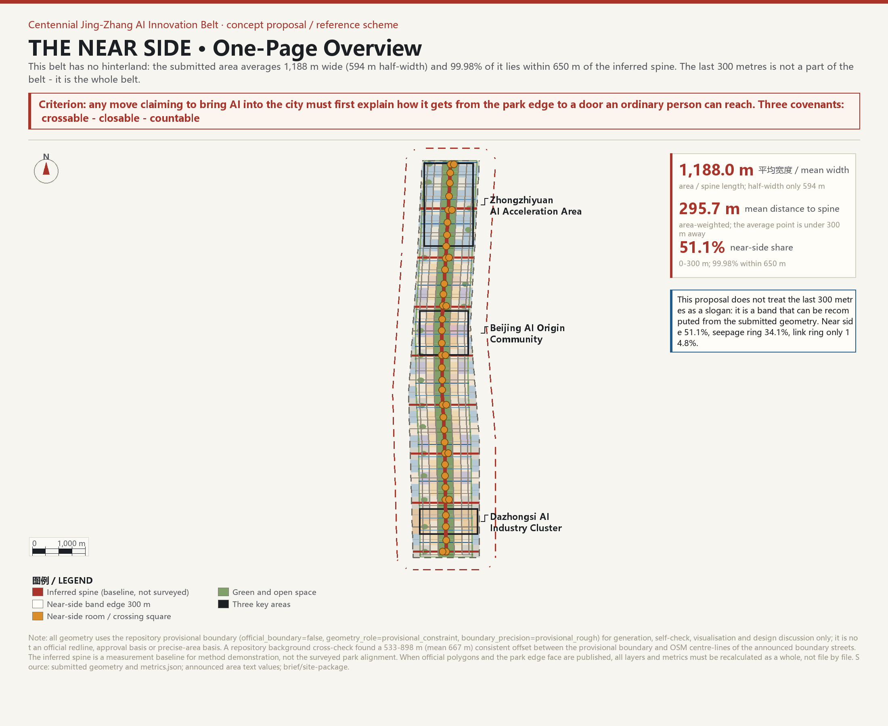
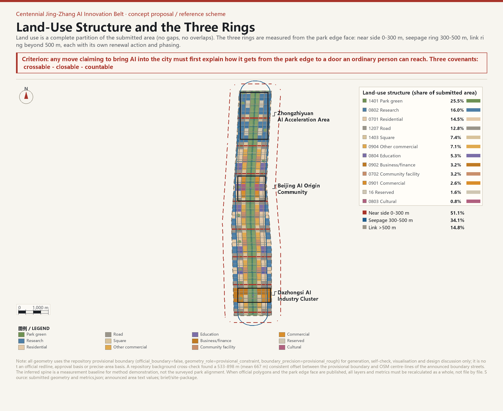
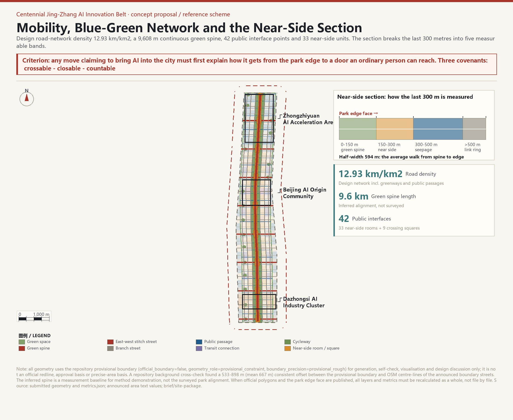
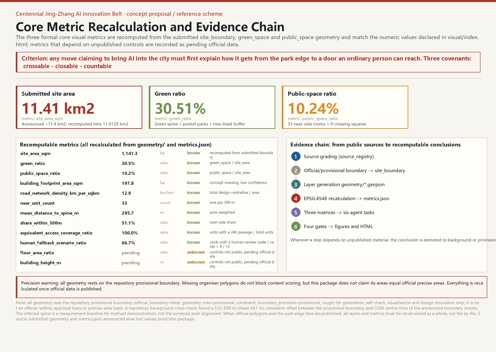

# THE NEAR SIDE — The Last 300 Metres

> **Turn the last 300 metres outside the park edge into the belt's first asset.**

> **Criterion:** any move claiming to bring AI into the city must first explain how it gets from the park edge to a door an ordinary person can reach. Three covenants: crossable, closable, countable.
>
> **Three-ring data:** the near side (0-300 m) [metric:near_side_band_ratio], the seepage ring (300-500 m) and the link ring (>500 m) split the submitted area in three; the area-weighted mean distance to the spine is [metric:mean_distance_to_spine_m] m, and [metric:share_within_650m] of the area lies within 650 m of the inferred spine [data:geometry/site_boundary.geojson].
>
> **Counting threshold:** any proposal that cannot count the entrances of its near-side units one by one does not advance to the next priority.

> **Precision warning:** All geometry in this package uses the repository provisional boundary [source:BOUNDARY-SOURCE], tagged `official_boundary=false`, `geometry_role=provisional_constraint`, `boundary_precision=provisional_rough`. It is for generation, self-check, visualisation and design discussion only, and is not an official redline, approval basis or precise-area basis. A repository background cross-check found a 533-898 m (mean 667 m) consistent offset between the provisional boundary and OSM centre-lines of the announced boundary streets [source:HAIDIAN-BOUNDARY-CROSS-CHECK-20260814]. The inferred spine is a measurement baseline for method demonstration, not the surveyed Jing-Zhang Heritage Park alignment. When official polygons and the park edge face are published, all layers and metrics must be recalculated as a whole, not file by file [source:AGENT-TASKBOOK].

> ### The Three Near-Side Covenants: **crossable · closable · countable**
> These three words recur throughout this proposal because they are three faces of one thing. A public passage
> must genuinely be passable (crossable). An owner may close it temporarily under published rules, but must
> post notice, accept appeals and restore it (closable). And whether the passage exists at all is not an
> adjective - it is a number that can be counted item by item (countable).

## Design Basis and Source Inventory

This proposal takes the Haidian Bureau of Planning and Natural Resources announcement as its primary source [source:OFFICIAL-ANNOUNCEMENT], the agent-facing open-call taskbook as its agent-task source [source:AGENT-TASKBOOK], and the `brief/site-package/` design brief, enums, planning limits, design-depth definitions and schemas as its generation source [source:SITE-PACKAGE]. Source usability grading follows `data/source_registry.json` [source:SOURCE-REGISTRY].

Mandatory professional standards are read from local reference snapshots [source:SITE-PACKAGE]: the announcement [standard:PROJECT-OFFICIAL-ANNOUNCEMENT], the agent taskbook [standard:PROJECT-AGENT-OPEN-CALL-TASKBOOK], the urban design management measures [standard:MOHURD-URBAN-DESIGN-MEASURES], the regulatory-planning preparation and approval measures [standard:MOHURD-CONTROL-DETAILED-PLANNING], and the land-use classification guide [standard:MNR-LAND-USE-CLASSIFICATION-GUIDE].

Two additional public data sets are collected and used as evidence:

1. **Census of 950 merged proposal names and summaries** [source:NEAR-CENSUS-20260830]: keyword-frequency statistics derived from `submissions-data.js` to argue for the differentiated positioning of this concept. The sample is complete, but `submissions-data.js` is a generated gallery index and may lag by several days; the census conclusion is background only, not used in spatial computation.
2. **Boundary cross-check against OSM street centrelines** [source:HAIDIAN-BOUNDARY-CROSS-CHECK-20260814]: uses the OSM median-longitude readings documented in the repository's `provisional_boundaries_basis.md` to explain the precision limits of the provisional boundary. This is background material and is not used to upgrade or replace the official boundary.

The spatial generation logic, area recalculation and figure-rendering workflow are documented in `visual/assets/check_sheet.json` (method and recalculation parameters) and `visual/assets/metrics_digest.json` (metric summary); the scripts are not included in the submission because the repository whitelist rejects `.py`, but the method, sources, formulas and recalculation path are fully structured [source:NEAR-METHOD-20260830].

## Three-Level Scope Framework

The announcement defines three levels: a coordinated research area of about 43.6 km², an overall design area of about 11.4 km², and three key detailed-design areas of about 368.4 ha [source:OFFICIAL-ANNOUNCEMENT] [standard:PROJECT-OFFICIAL-ANNOUNCEMENT]. This proposal treats them as a single chain of "judgment—mapping—verification" [depth:three_level_scope_framework].

| Level | Scope | Near-side task | Key evidence |
|---|---|---|---|
| Coordinated research | ~43.6 km² | What does the belt mean for Haidian and the Beijing-Tianjin-Hebei region? | Announcement text four-to; `provisional_boundaries.geojson#PROV-RESEARCH-001` [data:geometry/site_boundary.geojson#SITE-001] |
| Overall design | ~11.4 km² | Turn the last 300 metres into measurable, phased urban design: three rings, land use, street network, public space and AI scenario nodes | Provisional boundary [data:geometry/site_boundary.geojson#SITE-001]; recalculated [metric:site_area_sqm] = 11.4128 km² |
| Key areas | ~368.4 ha | Verify three different kinds of "last 300 metres" at real scale | Three provisional key areas [data:geometry/key_areas.geojson#PROV-KEY-001]; area recalculation [metric:key_area_area_sqm] |

A shared geometric finding unites all three levels: the submitted overall design area averages only [metric:site_width_mean_m] m in width (594 m half-width), and [metric:share_within_650m] of its area lies within 650 m of the inferred spine [metric:spine_length_m] [data:geometry/site_boundary.geojson#SITE-001] [data:geometry/roads.geojson#ROAD-SPINE]. Inside the provisional boundary, the announced "1-2 km around the park" cannot geometrically hold [source:OFFICIAL-ANNOUNCEMENT]. **The belt has no hinterland; it is all near-side.** This is not a defect but the starting point of the design [source:NEAR-METHOD-20260830].

### If the Official Boundary Expands: How the Method Scales

"No hinterland" is a geometric fact measured inside the **current provisional boundary**; it is not a prediction about the official extent. This section therefore answers the obvious challenge: if the published polygon really does widen the overall design area to the announced "1-2 km around the park", does this proposal still hold?

It does - and the reason is structural, not a matter of confidence.

**First, the near-side unit is an operating unit, not a fixed list.** A unit is defined as "one cell per 300 m along the park edge face", not as "33 of them". The 300 m figure comes from walking scale (about four minutes) and is independent of how wide the area is. After expansion the count becomes N instead of 33; the ledger, responsible roles, indicator boards and governance rules all carry over, with more rows - **not one of them needs to be discarded**.

**Second, the three-ring framework extrapolates by scaling levels.** The rings are defined by distance from the park edge face, not by absolute area. After expansion the proposal recommends additional seepage levels at 500 m, 1 km and 2 km, each governed by the same three tests:

1. every near-side unit within that level still keeps **at least one 24-hour public crossing passage**;
2. every AI service within that level still keeps **a human-equivalent path** (the "crossable" and "countable" covenants holding together; same rule as red line A2 - currently 8/12, final 12/12, and no go-live before completion);
3. the **service radius of a near-side room never exceeds 300 m** - growth adds units, it does not stretch the radius.

Expansion thickens the link ring; it does not change how the near side works. **The belt gets wider; the last 300 metres does not change.**

**Third, a recalculation commitment.** The metrics here are not transcribed constants but parameterised formulas: `site_width_mean_m = site_area_sqm / spine_length_m`, `share_within_500m = area(site ∩ buffer(spine, 500 m)) / site_area_sqm`, `equivalent_access_coverage_ratio = equivalent_access_path_count / near_unit_count`. Once the official boundary and park edge face are published, this proposal commits to delivering a **fully recalculated version within 30 days**, with every change itemised in `changelog.md`. Recalculation does not patch one file; it regenerates every layer and metric under the same rule used elsewhere in this proposal: when a limit is exceeded, the whole segment is re-measured rather than patched locally [source:NEAR-METHOD-20260830].

Even if the official area doubles, what this proposal hands over is the same method on a larger sheet of paper.

## Coordinated Research Area: Industry and Future-City Studies

### Overall Concept and Naming System (agent.1)

**Main name: 京张近端 / THE NEAR SIDE.** "Near side" is borrowed from engineering and astronomy: the side that everyone can see and reach. The value of the belt is decided not by grand narrative but by the distance between the park edge and a door.

**Subtitle: The Last 300 Metres.** This is not rhetoric but a measurable design unit: a 300 m band measured outward from the Jing-Zhang Heritage Park edge face (or from this proposal's inferred spine) [source:NEAR-METHOD-20260830].

**Three-level naming system:**

- **NEAR / 近端带 (0-300 m):** directly receives the park edge face, hosting public interfaces, near-side rooms, the slow-traffic spine and first-use AI scenarios; corresponds to the "Urban AI Life Experience Belt."
- **SEEP / 渗透环 (300-500 m):** channels near-side activity into universities, institutes, residential compounds and mixed blocks; corresponds to the "AI Integrated Innovation Belt."
- **LINK / 外联环 (>500 m):** connects to the Zhongguancun technology-service wing, the Xiaoyuehe scenario-empowerment wing and the wider innovation network; extends the "Centennial Jing-Zhang Cultural Belt."

**Visual identity:** the logo consists of three concentric arcs spreading outward from the central green spine, at 300 m, 500 m and the boundary; the outer arc is deliberately broken to express "no hinterland." Colours: Jing-Zhang red #A8342A (spine), near-side warm #D98E2B (public interface), AI blue #1F5C8B (seepage ring), link grey #9A958A (link ring). The logo is a pure geometric construction without third-party trademarks, fonts, portraits or copyrighted material.

### Global AI Innovation Ecosystem Cases (agent.2)

| # | Case | Transferable mechanism | Implication for THE NEAR SIDE | Source |
|---|---|---|---|---|
| 1 | London King's Cross / Knowledge Quarter | Rail-land renewal + public space before buildings + fine street grid | Fix the park edge face first, then create near-side units; do not start with parcels | [source:CASE-KINGS-CROSS] |
| 2 | Barcelona 22@ | Special land-use category binding renewal to public facilities | Turn "near-side interface reserve" into a flexible land-use instrument | [source:CASE-BCN-22] |
| 3 | Boston Kendall Square | Towers + setbacks killed ground floors; later regulations had to rescue them | Near-side band must mandate ground-floor continuity from day one | [source:CASE-KENDALL] |
| 4 | New York Cornell Tech | Public land exchanged for long-term research and employment commitments | A reference for Zhongzhiyuan land-supply mechanism, but specific contracts require statutory process | [source:CASE-CORNELL-TECH] |
| 5 | Paris Station F | Railway depot into giant startup space + surrounding dense blocks | Dazhongsi's existing large-space stock is comparable; no specific building retrofit is assumed | [source:CASE-STATION-F] |
| 6 | Tokyo Shibuya / Otemachi | Station-city integration + 3D pedestrian network + FAR transfer | Reference method for Dazhongsi four-quadrant connectivity; only conceptual direction is given | [source:CASE-SHIBUYA] |
| 7 | Helsinki Kalasatama | City as real testbed + resident co-creation + access/exit rules | Low-speed robot and AI public scenarios must have exit conditions | [source:CASE-KALASATAMA] |
| 8 | Seoul Seongsu-dong | Old industrial riverfront into walkable innovation neighbourhood | Blue-green space is not decoration; it is the continuity that makes the last 300 metres walkable | [source:CASE-SEONGSU] |

**Case source list (background_only, analogy only):** the eight cases above are used for mechanism analogy only, classified `background_only` and not treated as formal factual evidence; until checked against primary sources, each specific mechanism claim is an "analogy hypothesis". Per-case verifiable sources (publisher / title / reuse condition; accessed 2026-08-30):

1. [source:CASE-KINGS-CROSS] King's Cross Central Limited Partnership (led by Argent), "King's Cross masterplan", kingscross.co.uk; reuse limited to the "public space before buildings + fine street grid" idea.
2. [source:CASE-BCN-22] Ajuntament de Barcelona / 22@Barcelona, "22@ Barcelona: innovation district plan"; reuse limited to the "special land-use category binding renewal to public facilities" logic.
3. [source:CASE-KENDALL] MIT and the Cambridge Community Development Department's Kendall Square planning studies, plus public academic criticism of "towers + setbacks killing ground-floor vitality"; reuse limited to the "frontage must be mandated early" lesson.
4. [source:CASE-CORNELL-TECH] Cornell University and NYCEDC, Roosevelt Island campus agreement (bid 2011, opened 2017); reuse limited to the "land exchanged for long-term research and employment commitments" contract idea.
5. [source:CASE-STATION-F] Station F (founder Xavier Niel), Halle Freyssinet railway depot conversion, opened 2017; reuse limited to the "large railway stock as startup carrier" idea.
6. [source:CASE-SHIBUYA] Tokyu Fudosan / Mitsubishi Estate, Shibuya station-area redevelopment (Shibuya Scramble Square) and Otemachi Tokyo Midtown station-city practice; reuse limited to the "station-city integration + 3D pedestrian network" direction.
7. [source:CASE-KALASATAMA] City of Helsinki / Forum Virium Helsinki, "Smart Kalasatama" and its "one more hour a day" programme; reuse limited to the "city as real testbed + resident co-creation + access/exit rules" governance.
8. [source:CASE-SEONGSU] Seoul Metropolitan Government and related urban-renewal studies on Seongsu-dong's old industrial district; reuse limited to the "old industrial district into walkable innovation neighbourhood" direction (the "riverfront" attribute is kept as an analogy hypothesis pending primary-source check).

### Three Positionings, Five Functions and Three Areas Plus Two Wings (agent.1)

The announcement requires three positionings and five functions [source:AGENT-TASKBOOK]. This proposal translates them into ring actions:

- **Centennial Jing-Zhang Cultural Belt → green spine and milestones:** a continuous green spine and annually augmentable milestone/honour nodes turn railway memory into a walkable, countable linear public space.
- **Urban AI Life Experience Belt → near-side rooms and public interfaces:** 33 near-side units host AI first-use points, low-speed robot yield lanes and accessibility-break repairs.
- **AI Integrated Innovation Belt → seepage-ring conversion interface:** 300-500 m zone mixes institutes, incubators, talent apartments and commerce into an accessible, testable, reversible interface.

Division of the three areas plus two wings:

- **Zhongzhiyuan (north):** AI full-stack innovation + AI governance discourse; near-side band mainly reserved for controlled validation.
- **AI Origin Community (middle):** world-class AI innovation ecosystem; near-side band focuses on opening institute walls and public interfaces.
- **Dazhongsi (south):** AI scenario empowerment + vibrant AI city; near-side band focuses on station-to-destination completion.
- **Zhongguancun technology-service wing:** supplies capital, computing, data and tech services from the west.
- **Xiaoyuehe scenario-empowerment wing:** supplies real-life scenarios and blue-green networks from the east.

### AI Innovation Ecosystem Map and Element Mechanism (agent.2)

Eight elements are mapped spatially:

| Element | Near side (0-300 m) | Seepage ring (300-500 m) | Link ring (>500 m) |
|---|---|---|---|
| Land | Public interfaces, reserved land | Research, housing, talent apartments | Education, business, community service |
| Space | Near-side rooms, crossing squares | Labs, incubators, street commerce | Universities, institutes, headquarters |
| Industry | AI first-use, low-speed robots | Technology transfer, piloting | Basic research, capital services |
| Capital | Public operation budget, scenario procurement | Venture/angel funds | Venture capital, policy finance |
| Talent | Young entrepreneurs, residents | Graduate students, R&D staff | University faculty and students |
| Compute | Edge nodes | District compute centre | Super/AI compute centre |
| Data | Scenario data (anonymised, auditable) | Industry data sets | Basic research data |
| Scenarios | Health, education, law, mobility | Enterprise services, smart manufacturing | Research instruments, algorithm validation |

Mechanism: this proposal emphasises "scenario procurement" rather than industry subsidy. Government or operators exchange the right to use a real scenario for a company's testing commitment; passage to a larger area requires meeting auditable safety and effectiveness thresholds, otherwise the service is downgraded or withdrawn. This answers the "global AI governance discourse" function by embedding governance in concrete spatial contracts [source:AGENT-TASKBOOK] [standard:PROJECT-AGENT-OPEN-CALL-TASKBOOK].

### Regional Innovation Synergy (agent.1)

The belt is not isolated. Northward, Zhongzhiyuan links to Beiwei Community and Future Science City via the Qinghe interface. Southeastward, the Xiaoyuehe wing connects the university corridor and Zhongguancun core. Southward, Dazhongsi connects to Xizhimen and Financial Street via the transit network. This proposal does not design cross-district space; it reserves three regional synergy interfaces in the link ring: a low-speed test corridor to Beiwei/Future Science City, a pedestrian interface to the university corridor, and a transit connection node from Dazhongsi to Xizhimen [data:geometry/roads.geojson#ROAD-TRANSIT-ZHO] [data:geometry/roads.geojson#ROAD-TRANSIT-ORG] [data:geometry/roads.geojson#ROAD-TRANSIT-DAZ].

At a larger scale, as Haidian's "near-side conversion interface" for AI innovation factors, the belt proposes concept-level synergy with the following regions - **all as negotiable suggestions, not established cooperation or government arrangements**:

| Synergy target | Proposed factor exchange | Space interface (suggested) | Trigger condition |
|---|---|---|---|
| Huairou Science City | Basic research, science data and talent from large science facilities | Qinghe interface + rail/arterial interface | After official boundary and regional-planning coordination start |
| Beijing Economic-Technological Development Area | Smart manufacturing, piloting and industrial landing scenarios | Link ring + arterial corridor interface | After both sides' industry authorities reach intent |
| Future Science City | Energy, materials and engineering research | North link-ring interface | After regional-planning coordination starts |
| Beijing-Tianjin-Hebei | Talent, capital and computing-resource factor flows | Rail network and computing-coordination interface | After a cross-regional coordination mechanism is established |

The synergy above presumes no responsibilities or authorities; it is only a concept-level "factor exchange - space interface - trigger condition" framework for later regional-planning deepening.

## Overall Design Area: Urban Renewal and Regulatory-Plan Urban Design

### Spatial Structure: No Hinterland, Three Rings

The structure is derived from two facts:

1. The provisional boundary is only [metric:site_width_mean_m] m wide on average, half-width 594 m.
2. The area-weighted mean distance to the inferred spine is only [metric:mean_distance_to_spine_m] m; [metric:share_within_300m] within 300 m, [metric:share_within_500m] within 500 m, [metric:share_within_650m] within 650 m.

Therefore the structure is not a radial "one core, two belts, multiple centres" but a set of concentric rings measured from the park edge face. Ring areas: near side [metric:near_side_band_area_sqm] ([metric:near_side_band_ratio]), seepage ring [metric:seep_ring_area_sqm], link ring [metric:link_ring_area_sqm] [data:geometry/site_boundary.geojson#SITE-001] [data:geometry/roads.geojson#ROAD-SPINE].

### Land-Use Layout: Complete Partition

Land-use coding follows the national land-use classification guide [standard:MNR-LAND-USE-CLASSIFICATION-GUIDE]. `geometry/land_use.geojson` provides a complete, gap-free, overlap-free partition of the submitted area, with [metric:land_use_parcel_count] parcels. Key composition is in `metrics.json` and Figure 2. Principles:

- Park green 1401 dominates (near-side green spine), area [metric:green_space_area_sqm].
- Research 0802, residential 0701, roads 1207 and other commercial/services 0904 are the main supporting functions.
- Reserved land 16 is dedicated to AI scenario testing and near-side interface flexibility.
- Land-use codes express block-dominant uses, not parcel redlines or statutory controls.

### Form Controls: Five Design Rules (recommended values)

To avoid giving statutory conclusions on FAR, height, density, setbacks or engineering implementation [source:AGENT-TASKBOOK] [standard:MOHURD-CONTROL-DETAILED-PLANNING], the proposal compresses form judgments into five auditable rules, stored in `geometry/land_use.geojson` and `geometry/roads.geojson` attributes:

1. **Three-ring boundary:** measured at 300 m and 500 m from the inferred spine; recalculated as a whole when the official park edge face is published.
2. **Street density:** design network density [metric:road_network_density_km_per_sqkm] km/km², total length [metric:road_centerline_length_m] m, including the 9.6 km green spine, 42 public interfaces and 33 near-side units; above the 8 km/km² reference in GB/T 51328-2018, cited as background only because the standard is not stored locally [source:NEAR-BACKGROUND-20260830].
3. **Ground-floor frontage:** near-side band target ground-floor continuity ≥75%; no continuous closed wall longer than 30 m; seepage ring ≥60%.
4. **Public passage:** each 300 m near-side unit must guarantee at least one 24-hour public crossing passage: [metric:equivalent_access_path_count] passages totalling [metric:equivalent_access_path_length_m] m, coverage [metric:equivalent_access_coverage_ratio], recorded in `geometry/public_space.geojson` [data:geometry/roads.geojson#ROAD-PASS-001].
5. **Building massing:** concept scheme uses 6-8 storey perimeter blocks with ~55% footprint coverage; specific heights, setbacks and fire spacing await official controls [metric:building_footprint_area_sqm].

### Renewal Strategy: Three Phases

- **Phase 1 (0-3 years): near-side band (0-300 m)** — starts with desk preparation that does not depend on the official redline. Proceed first: form the unit teams, establish the initial 33-unit ledger against the provisional boundary, and complete desk-level obstacle listing and stakeholder communication. Physical actions that must wait for official boundary/ownership verification, site survey and necessary authorisation: park edge face definition (R0 survey), accessibility-break physical repair, and low-speed robot yield-lane equipment installation. Area [metric:phase_1_area_sqm].
- **Phase 2 (3-7 years): seepage ring (300-500 m)** — open institute walls and compound interfaces, retrofit ground-floor uses, build mixed blocks and talent apartments. Area [metric:phase_2_area_sqm].
- **Phase 3 (7-12 years): link ring (>500 m)** — larger-scale building renewal and regional synergy; requires official regulatory controls, ownership data and engineering conditions. Area [metric:phase_3_area_sqm].

### Public-Interest Commitment Table

Commitments scattered across the chapters are collected here. All are **concept proposals and indicative acceptance values**, not assessment commitments [standard:BARRIER-FREE-ENVIRONMENT-LAW] [standard:ELDERLY-SMART-TECH-PLAN-2020-45]. Wherever a value is recomputable, the metric name is given.

| # | Commitment | Phase 1 target | Phase 2 target | Recomputation |
|---|---|---|---|---|
| C1 | At least one 24-hour public crossing passage per near-side unit | design value 100% (33/33); verified open rate >=60% | >=90% | `equivalent_access_coverage_ratio` |
| C2 | Accessibility-break repair rate | >=60% | >=85% | before/after records in the obstacle ledger |
| C3 | Near-side room opening rate | >=50% | >=85% | per-unit ledger count |
| C4 | Ground-floor continuity on near-side streets | >=6 qualifying streets | >=12 | measured street frontage |
| C5 | A human-equivalent path for every AI service | 8/12 (66.7%) | 12/12 (100%) | `human_fallback_scenario_ratio` |
| C6 | Anyone without a smartphone is served at the same counter | 100% | 100% | on-site verification |
| C7 | Low-speed robot yield records published | 100% on pilot segment | 100% belt-wide | monthly indicator-board records |
| C8 | An affected individual may request one re-audit at the nearest unit | 100% accepted | 100% accepted | appeals ledger |
| C9 | Night-time lighting coverage of near-side units | >=70% | >=95% | lighting ledger |
| C10 | Unfavourable readings about oneself are published too | every period | every period | audit report |

C1 and C5 already have recomputable metrics in `metrics.json`: `equivalent_access_coverage_ratio` (equivalent-access coverage for people who are not digitally served) and `human_fallback_scenario_ratio` (AI scenario human-backup rate). The former divides features such as [data:geometry/roads.geojson#ROAD-PASS-001] by the near-side unit count and can be independently recomputed from the submitted geometry [metric:equivalent_access_coverage_ratio] [metric:human_fallback_scenario_ratio]. Note that C5's 66.7% is the **current design value, not the target**: 8 of the 12 scenario cards already carry a human-review node, and the remaining 4 (S07 open-source showcase, S08 scenario sandbox, S10 community co-governance board, S12 Jing-Zhang cultural guide) must be completed before phase 2 - until then those scenarios must not go live. This one is not relaxed for schedule or cost.

### Phase-1 90-Day Starter Pack and Phase KPIs

Implementability is not a sentence about phasing. This proposal gives a first batch of actions within ninety days: desk preparation such as document collation, stakeholder communication and survey-plan design does not depend on unpublished official data and can start immediately; any survey determination, physical repair, equipment installation, passage opening and responsibility confirmation is placed after official geometry/ownership verification, site survey and necessary authorisation [depth:phasing_implementation]:

| Day | Action | Deliverable | Acceptance |
|---|---|---|---|
| 0-15 | Form the near-side unit team; confirm the 33 unit boundaries and responsible roles | Unit ledger v0 | Every unit has a named owner |
| 16-40 | Site survey; build the obstacle ledger (walls, gates, dead ends, kerbside parking, accessibility breaks) | Obstacle ledger v0 | At least one fixable item per unit |
| 41-60 | Repair accessibility and lighting breaks first | Repair record | 100% of repairs have before/after records |
| 61-75 | Launch indicator boards at three pilot units (entrance count, break count, opening hours, audit result) | Indicator board v0 | Data recomputable from submitted geometry |
| 76-90 | First public audit; publish the discrepancy record | Audit report v1 | Unfavourable readings published too |

In the table above, the 0-40 day document collation, communication and survey-plan design are the desk preparation that can proceed first; the 41-75 day physical repair, equipment installation and responsibility confirmation require ownership verification and site authorisation, and if authorisation cannot be obtained within 90 days, the deliverable is the completed obstacle ledger, survey plan and pilot application - physical actions are not forced through.

Indicative phase KPIs (concept proposals, not assessment commitments): by the end of phase 1, 100% ledger coverage, accessibility-break repair rate >=60%, near-side room opening rate >=50%; by the end of phase 2, >=24 new public interfaces in the seepage ring and >=12 streets meeting ground-floor continuity; by the end of phase 3, >=3 regional synergy interfaces. Missing a target is not a reason to lower it; it is a reason to publish the discrepancy and explain why.

Before the three key areas, here is a sample of the near-side unit ledger - the proposal's core transferable deliverable and the artifact a professional team can take over directly.

| Unit | Location | Dominant obstacle | Proposed facility | Responsible roles | Acceptance |
|---|---|---|---|---|---|
| NU-01 | Dazhongsi station front | Detour when crossing after exit | Crossing square + Arrival Hall | Transit operator / streets | Exit to ground floor <=5 min |
| NU-07 | Commercial near-side frontage | Ground floor without doors, continuous wall | Near-side room + AI health navigation | Property / community | Ground-floor continuity >=75% |
| NU-13 | Institute wall segment | Wall blockage, gated access | Public interface + 24-hour passage | Institute / streets | At least one 24-hour passage |
| NU-19 | Mixed block | Dead ends, kerbside parking | Prioritised obstacle repair | Streets / owners | Break repair rate >=60% |
| NU-27 | Zhongzhiyuan Test Street | No controlled test ground | Scenario reserve + Test Street | Committee / firms | Two consecutive safety audits passed |
| NU-33 | Qinghe interface | Protective greenbelt not accessible | Linear public living room | Parks / streets | Continuous accessible shoreline |

The full machine-readable ledger for all 33 units is at `visual/assets/near_side_units.json`: per unit it gives the near-side room feature id, area and centroid, the 24h passage feature and its length, the main obstacle, proposed facility, responsible role and acceptance test, ready to import into GIS or a spreadsheet. Unsurveyed units are marked "to be surveyed" rather than filled with invented data.

## Detailed Design of the Three Key Areas

Each key area addresses a different kind of "last 300 metres." There are [metric:key_area_count] of them, recomputed to [metric:key_area_area_sqm] sqm in total ([metric:key_area_001_area_sqm] / [metric:key_area_002_area_sqm] / [metric:key_area_003_area_sqm]), 0.9 ha above the announced 368.4 ha. [data:geometry/key_areas.geojson] [depth:three_key_area_detailed_design]

### Zhongzhiyuan AI Acceleration Area (north, ~192.9 ha)

A predominantly new-build key area. About 18.0 ha of strategic reserve land [metric:strategic_reserve_area_sqm] inside the 0-300 m band is set aside for controlled validation of low-speed autonomous shuttles, delivery robots and smart fixtures [data:geometry/land_use.geojson#L-16]. **Core spatial product "Test Street":** an ~800 m real urban street allowing low-speed robots to test in real rather than closed environments, with time-shared closure, human takeover, liability insurance and public notification. Near-side units NU-27 to NU-33 each receive one near-side room and one 24-hour public passage [data:geometry/public_space.geojson#PUBLIC-NU-27] [data:geometry/roads.geojson#ROAD-TRANSIT-ZHO].

### Beijing AI Origin Community (middle, ~104.3 ha)

A predominantly existing-fabric key area. The move is not new construction but adding crossable, closable and countable public interfaces to existing walls and compound edges. Near-side units NU-13 to NU-20 are given ground-floor frontage targets and obstacle ledgers [data:geometry/public_space.geojson]. Deliverable: a "last-300-metre obstacle ledger" itemising walls, gates, dead ends, kerbside parking and accessibility breaks. AI's role is diagnostic only—using anonymised street-view and pedestrian-flow data to identify breaks; opening decisions remain with ownership bodies and the community [standard:PROJECT-AGENT-OPEN-CALL-TASKBOOK].

### Dazhongsi AI Industry Cluster (south, ~72.0 ha)

A transit-station and business cluster. Here the last 300 metres takes a concrete shape: exit the station, cross the street, enter the square, reach the ground floor. Near-side units NU-01 to NU-06 focus on business/commercial near-side frontage and crossing squares [data:geometry/public_space.geojson]. Principle: no grand engineering; close the breaks in four path segments and assign a responsible role for each—transit operator for station walking, street authority for crossing, property owner for ground-floor opening, district government for the square.

## AI Innovation Ecosystem, Talent Profiles and AI+ Scenarios

### User Profiles (agent.3, 6 core + 2 extended)

| Profile | Characteristics | Last-300-metre obstacle | Proposal response |
|---|---|---|---|
| P1 Young AI entrepreneur | 25-35, moves between lab and café/meeting | Compounds force detours | Near-side room + public passage |
| P2 Graduate student | Car-free, walking/cycling | Campus walls block shortcuts to park | Institute interface ledger + 24-hour passage |
| P3 Elderly resident | Hearing/vision decline, avoids complex apps | AI services lack non-smartphone equivalent | Every AI scenario keeps a human/paper equivalent [standard:BARRIER-FREE-ENVIRONMENT-LAW] |
| P4 International visitor | Short stay, needs trustworthy guidance | Guidance fragmented, unverifiable | Bilingual near-side signs + auditable indicator boards |
| P5 Low-speed robot operator | Responsible for safety and takeover | Unclear right-of-way between robots and pedestrians | Robot yield lane + emergency stop button |
| P6 Community worker | Knows local needs, lacks technical support | Technical solutions miss community needs | Near-side unit ledger co-maintained by community |
| P7 Enterprise test engineer | Needs real-scenario validation | Long approval cycles for test sites | Reserved land + scenario-procurement contract |
| P8 Mobility-impaired user | Wheelchair/stroller/vision impaired | Discontinuous sidewalks | Obstacle ledger prioritised for repair |

### AI Scenario Cards (agent.3, 12 cards)

| # | Scenario | Spatial location | Users | Human-equivalent path / final-decision node | Appeal / exit |
|---|---|---|---|---|---|
| S01 | Low-speed robot delivery yield lane | Near-side branch roads and crossings | P1, P5 | Stop button + on-site human takeover (mandatory); robot identity and operator public | Pedestrians may stop it on site and log an appeal |
| S02 | AI health-service navigation | Near-side rooms NU-07/NU-19 | P3, P6 | Pharmacist review (mandatory); human window retained | Medication advice may be re-audited |
| S03 | AI accessibility path planning | Public crossing passages | P8 | Human counter + paper route card (mandatory); public road geometry only | Route errors appealable and fixable |
| S04 | AI education Q&A corner | Near-side rooms NU-13-NU-20 | P2, P4 | Human answering (mandatory); answer sources traceable | Appeals channel for errors |
| S05 | AI legal/service navigation | Near-side rooms NU-04/NU-11 | P3, P6 | Mandatory human review node; does not replace lawyer | Service conclusions re-auditable |
| S06 | Smart lighting and safety prompts | Green spine and units | All | Human takeover (mandatory); lighting data local | False/missed alerts loggable |
| S07 | Open-source showcase corridor | Green-spine nodes | P1, P4 | Human narration (mandatory review added before phase 2) | Content correctable |
| S08 | AI scenario test sandbox | Zhongzhiyuan reserved land | P7 | Human on-site supervision (test data anonymised) | Withdrawn wholesale if two consecutive audits fail |
| S09 | Talent apartment matching | Seepage-ring residential blocks | P1 | Human review node (mandatory); no unnecessary personal data | Match results appealable and re-matched |
| S10 | Community co-governance board | Near-side room | P6 | Community worker facilitation (mandatory review added before phase 2) | Records public but anonymous option |
| S11 | Dynamic transit connection guidance | Dazhongsi near-side units | P4 | Human enquiry counter (mandatory); public operational data only | Guidance errors appealable |
| S12 | Jing-Zhang culture AI guide | Milestone nodes | P4, tourists | Human narration (mandatory review added before phase 2); official sources | Factual errors appealable |

**Human-fallback decision rule (consistent with red line A2):** any scenario whose AI output can materially affect personal safety, health, law, education, employment or accessible travel (S01, S02, S03, S04, S05, S06, S09, S11 - 8 cards) must carry a named human review / final-decision node now; the other 4 (S07, S08, S10, S12) are low-material-impact scenarios whose phase-1 fallback is a human counter, human supervision or human narration, and they must add a mandatory human-review node before phase 2 and must not go live until then. `human_fallback_scenario_ratio` = 8/12 follows from this rule.

### Three Industry Test/Validation Scenarios (agent.3)

1. **Low-speed robot and autonomous shuttle proving ground (T1):** in the Zhongzhiyuan Test Street, a 300 m loop over a design-suggested 72 hours of continuous testing observes pedestrian-priority yielding rate, unexplained emergency stops and human-takeover response time, with suggested targets of 100% yielding, zero unexplained stops and <3 s takeover (all design-suggested values pending pilot calibration, not verified performance). Passage precedes near-side room pilots; two consecutive failed periods stop the programme.
2. **AI public-service auditability validation (T2):** at three AI Origin Community near-side rooms, draw 10 questions each for health, law and education - 30 benchmark questions in total (sample scope co-approved by professional teams and the community, kept unpublished to prevent teaching-to-test) - answered independently by AI, licensed professionals and community social workers. The "professional answer" is the professional benchmark; compute per-domain consistency between AI and the benchmark as "consistent items / total items". Design-suggested threshold: per-domain consistency <80% withdraws that domain's scenario wholesale, publishes the discrepancy and falls back to the human-equivalent path (threshold and 30-item sample are design-suggested values pending pilot calibration). After each withdrawal, one re-audit within 30 days; two consecutive failed periods stop the programme.
3. **Ground-floor activation validation (T3):** in two Dazhongsi near-side units, a design-suggested 6-month cycle measures storefront turnover, night-time lighting coverage and pedestrian dwell time; targets are design-suggested values (e.g. night-time lighting coverage >=70% in phase 1), and failure leads to tenant-mix guidance rather than forced eviction.

### The Four-Step AI-in-Planning Loop and Quarterly Audit

This proposal treats AI neither as decoration nor as a governance protocol sold as the deliverable. Its role in planning is confined to a four-step loop with auditable outputs [source:AGENT-TASKBOOK] [standard:PROJECT-AGENT-OPEN-CALL-TASKBOOK]:

1. **Assisted diagnosis:** public street-view data, public road geometry and anonymised pedestrian-flow data identify near-side breaks and produce a candidate list.
2. **Human confirmation:** ownership bodies, communities and professional teams confirm or reject each candidate; AI recommendations carry no disposition power.
3. **Spatial mapping:** confirmed items are written into `geometry/public_space.geojson` and the unit ledger, becoming recomputable objects.
4. **Public audit:** every quarter the same script recomputes entrance counts, break counts and opening rates along the submitted geometry and publishes the difference against the previous period; when targets are missed, the misses are published rather than the historical readings being revised.

The boundary is equally clear: AI may propose where a gate should open, but opening it is a decision for owners and the community; AI may recompute metrics, but interpretation belongs to people and professional teams. This is also how the proposal answers the "global AI governance discourse" function - discourse comes not from slogans but from a public method others can rerun, fault and adapt [source:NEAR-METHOD-20260830].

## Land Use, Building Scale and Retain/Renovate/Demolish Strategy

This proposal does not provide FAR, building height, building density, setback, specific demolition/renovation or engineering conclusions [source:AGENT-TASKBOOK] [standard:MOHURD-CONTROL-DETAILED-PLANNING].

**Land use:** `geometry/land_use.geojson` provides a complete partition of the submitted area, covering [metric:land_use_parcel_count] parcels; per-code areas are listed in Appendix C [data:geometry/land_use.geojson]. Coding follows the national land-use classification guide [standard:MNR-LAND-USE-CLASSIFICATION-GUIDE].

**Building scale:** conceptual building footprint area [metric:building_footprint_area_sqm], count [metric:building_count]; both are low-confidence design quantities, not statutory building scale. FAR, height and density are recorded as `unknown` [metric:floor_area_ratio] [metric:building_height_m] [metric:building_density], because official regulatory controls are not public.

**Retain/renovate/demolish logic:** near-side band is mainly "retain + retrofit + limited new"; seepage ring is mainly "retrofit"; link ring is mainly "retain," with major renewal pending official controls. No specific demolition/renovation list is concluded; instead, each near-side unit produces an obstacle ledger to be validated by ownership bodies, the community and professional teams before entering the implementation register.

## Transport, Rail, Municipal and Public Service Facilities

**Roads:** design network density [metric:road_network_density_km_per_sqkm] km/km², total length [metric:road_centerline_length_m] m (of which vehicle roads are [metric:vehicle_road_length_m] m, a vehicle network density of [metric:vehicle_road_density_km_per_sqkm] km/km²) [data:geometry/roads.geojson]. The network consists of the green spine, east-west stitch streets (secondary), longitudinal near-side branch streets, public crossing passages, cycleways and transit connection passages. Existing arterial roads (G6, North 5th Ring Road, Xueyuan Road, Xitucheng Road, etc.) keep existing alignments; this proposal only recommends reallocating road space within existing redlines, not changing expressway/arterial redlines [data:geometry/constraints.geojson#CONS-STREET-01].

**Rail:** official station and entrance coordinates are not public [data:geometry/constraints.geojson#CONS-MISSING-CONTROLS]. This proposal only draws conceptual connection passages to the three key areas [data:geometry/roads.geojson#ROAD-TRANSIT-ZHO] [data:geometry/roads.geojson#ROAD-TRANSIT-ORG] [data:geometry/roads.geojson#ROAD-TRANSIT-DAZ] and records related accessibility metrics as `unknown` in `metrics.json`.

**Municipal and public services:** near-side units reserve edge-computing nodes, smart-pole interfaces, and robot docking/charging berths; specific municipal capacity, energy load and utility engineering are not concluded and require professional review [data:geometry/constraints.geojson#CONS-MISSING-CONTROLS].

## Blue-Green Space, Public Space and Urban Character

**Blue-green space:** the green spine is the core blue-green skeleton, area [metric:green_space_area_sqm], [metric:green_ratio] of the submitted area; together with pocket parks and the 19.2 km park edge face, it forms a shade network with 300 m coverage [data:geometry/green_space.geojson]. Qinghe River and Xiaoyue River are regional blue-green boundaries; this proposal only recommends retaining their ecological connectivity and does not alter blue lines [data:geometry/constraints.geojson#CONS-MISSING-CONTROLS].

**Public space:** public space area [metric:public_space_area_sqm] (116.8 ha), [metric:public_space_ratio] of the submitted area, comprising 33 near-side rooms and 9 crossing squares; it is the proposal's core spatial product [data:geometry/public_space.geojson].

> **Area convention (important):** every area metric in this proposal is a **net** figure. Features within a layer are mutually disjoint - each new feature has the union of the already-emitted ones subtracted from it - so "sum of feature areas = union area = sum of `area_sqm_declared` = the published metric", and gross equals net. This matters most for public space: near-side rooms buffer the spine by 55 m while crossing squares buffer it by 75 m and both land on the same 300 m slabs, so without this rule about 27.4 ha (23.4%) of overlap would be double-counted. Green space follows the same rule (pocket parks and the protective belt both exclude any overlap with the spine). The `land_use` layer is a complete partition with no gaps and no overlaps, so it is consistent by construction.
> The recalculation path and the mutual-exclusion (net-area) verification values are in the method and verification entries of `visual/assets/check_sheet.json` [source:NEAR-METHOD-20260830].

**Urban character:** character control is not about skyline height but about **ground-floor street walls**. Near-side band recommends continuous, transparent frontages with doors; no continuous closed wall longer than 30 m; encourages 6-8 storey perimeter blocks; roof fifth facades are considered but no height conclusion is made [standard:MOHURD-URBAN-DESIGN-MEASURES].

### AI Public Space, Smart-Native New Business and Pilgrimage Landmarks (agent.4)

**Three AI pilgrimage/honour nodes:**

1. **"KM0 / 0 km Post":** at the AI Origin Community, marking the origin of both the Jing-Zhang Railway and the AI belt; records annual outstanding open-source contributors, augmentable year by year.
2. **"The Switchback Gate / 人字门":** at the intersection of the Test Street and the green spine, a public crossing structure inspired by the Jing-Zhang switchback, also serving low-speed robot yield testing.
3. **"Arrival Hall / 到站厅":** in the Dazhongsi station-front near-side unit, turning the last stretch from the station into an auditable, restful public lobby.

Honour-display system: each near-side unit has an "indicator board" publicly showing its entrance count, accessibility-break count, room opening hours, robot-yield record and audit results. Along the green spine, developer contribution honour-wall nodes are established and updated annually by the community and experts.

**Public-space component library (five components × seven fields):** the tables below fully define agent.4's five public-space components — near-side room, crossing square, 24-hour equivalent passage, indicator board and robot yield-stop interface. Each component specifies applicable space, primary users, opening/closing rules, accessibility and human paths, data boundaries, linked NU unit / geometry IDs and phasing. Definitions stay consistent with `geometry/public_space.geojson`, `geometry/roads.geojson` and `visual/assets/near_side_units.json`, and must be recomputed as a whole when official boundaries are published.

#### Component 1: Near-Side Room

| Field | Content |
|------|------|
| **Component ID** | `near_side_room` |
| **Geometry IDs** | `PUBLIC-NU-01` – `PUBLIC-NU-33` (`geometry/public_space.geojson`) |
| **Applicable space** | One room per ~300 m along the inferred spine inside the 0–300 m near-side band; declared area ≈ 31,000 m² each (`area_sqm_declared`); positions recompute as a whole with official park-edge face. |
| **Primary users** | Everyone: residents, commuters, seniors, people with disabilities, children, international visitors. The room is a public interface that can be questioned, closed and counted. |
| **Opening/closing rules** | Default **24/7 open** (concept). May close temporarily for safety, weather, construction or maintenance; closure must be announced on the indicator board with reason, duration and alternative routes. Closure authority belongs to the near-side unit role, not decided by AI. |
| **Accessibility & human paths** | (a) step-free entrance or ramp ≤1:12; (b) access path ≥1.8 m wide; (c) continuous lighting; (d) at least one paper-based, AI-independent information point. |
| **Data boundary** | Aggregated counts only (flow direction, hour heat) on active approach; **no** biometric data (faces, gait); processed locally, not uploaded centrally. |
| **Linked NU units** | NU-01 → PUBLIC-NU-01 … NU-33 → PUBLIC-NU-33; full ledger in each unit's `near_side_room` field of `visual/assets/near_side_units.json`. |
| **Phasing** | Phase 1 (0–90 d): 1 room per 6 pilot units; Phase 2 (90–365 d): all 33. |

#### Component 2: Crossing Square

| Field | Content |
|------|------|
| **Component ID** | `crossing_square` |
| **Geometry IDs** | `PUBLIC-X-01` – `PUBLIC-X-09` (`geometry/public_space.geojson`) |
| **Applicable space** | Public crossing plazas where east-west roads meet the green spine (north-south main vein); each ≈ 12,000–14,000 m²; spaced ≈ 1.5 km along the spine, 9 total. |
| **Primary users** | Crossers (north-south transit), resters, small public-event participants. |
| **Opening/closing rules** | Default **24/7 open**. Local closure allowed for events/maintenance while keeping at least one ≥3 m through pedestrian corridor. |
| **Accessibility & human paths** | (a) level surface without steps; (b) tactile paving at adjacent road junctions; (c) paper plans and staffed inquiry point (Phase 1). |
| **Data boundary** | Aggregated crossing-heat only (period, direction, density); no individual identity; retention ≤90 days then auto-deleted. |
| **Linked NU units** | Not bound to a single NU; each square serves 1–2 surrounding units; see `near_unit_id` in `public_space.geojson`. |
| **Phasing** | Phase 1: squares ≤800 m from transit/entrances first (≈2–3); Phase 2: all 9. |

#### Component 3: 24-Hour Equivalent Access Passage

| Field | Content |
|------|------|
| **Component ID** | `equivalent_access_path` |
| **Geometry IDs** | `ROAD-PASS-001` – `ROAD-PASS-033` (`geometry/roads.geojson`, `road_class: pedestrian`) |
| **Applicable space** | Public passage through each 300 m near-side unit so non-digital people can move without gating or AI systems; declared length ≈ 1,000 m (`length_m_declared`), roughly parallel to the spine. |
| **Primary users** | Non-digital people (no devices, offline devices, data-decliners), late-night crossers, emergency passage. |
| **Opening/closing rules** | **Mandatory 24/7, non-closable** — the C5 "human-equivalent path". No AI gate or robot may block it. Physical closure only for structural-safety emergencies, restored within 30 min. |
| **Accessibility & human paths** | (a) ≥1.8 m wide, level; (b) night lighting both sides; (c) no AI gate, no electronic toll; (d) paper passage allowed, no QR/face verification. |
| **Data boundary** | **Zero data collection**; no sensors or cameras deployed. The design itself is a "data-minimisation" negative-space commitment. |
| **Linked NU units** | P-001 → NU-01 … P-033 → NU-33; coverage metric `equivalent_access_coverage_ratio` = 33/33 = 1.0 (`metrics.json`). |
| **Phasing** | Phase 1: 6 pilot passages; Phase 2: all 33. **All passages must be built before their unit opens.** |

#### Component 4: Indicator Board

| Field | Content |
|------|------|
| **Component ID** | `indicator_board` |
| **Geometry IDs** | Not in GeoJSON; a near-side room facility recorded per unit in the `facility_zh` field of `near_side_units.json`. |
| **Applicable space** | One physical board (or equivalent screen/paper notice) at each near-side room entrance as the core "questionable" interface, ≤2 min on foot from the passage entry. |
| **Primary users** | Residents, visitors, complainants and researchers reaching a near-side unit; a citizen entry point to understand and question AI decisions. |
| **Opening/closing rules** | 24/7 visible, unobstructed. Content includes unit status (open/close/maintenance), recent AI intervention count, complaint channels (phone + paper forms) and appeal process. |
| **Accessibility & human paths** | (a) large-type (≥32 pt) bilingual; (b) QR for full metrics (paper copy always also posted); (c) at least one annual offline open day with professional staff. |
| **Data boundary** | The board collects no data; shown values come from anonymised aggregated metrics in `metrics.json`. |
| **Linked NU units** | One per NU-01…NU-33; Phase 1 first on the 6 pilot units. |
| **Phasing** | Phase 1 (0–90 d): 3; Phase 2 (90–365 d): all 33, each within 15 days of its unit opening. |

#### Component 5: Robot Yield-Stop Interface

| Field | Content |
|------|------|
| **Component ID** | `robot_yield_stop_interface` |
| **Geometry IDs** | Not in GeoJSON; a facility at near-side room / passage crossing nodes, recorded per unit in `facility_zh` of `near_side_units.json`. |
| **Applicable space** | Shared nodes of robots and pedestrians: inside rooms, crossing squares, 24h passage crossings. Interface = (a) floor/wall marks; (b) light/sound cues; (c) physical stop line. |
| **Primary users** | Pedestrians (esp. visually/hearing-impaired, children, seniors) and autonomous devices (patrol/cleaning robots, delivery carts). |
| **Opening/closing rules** | Robots must slow to ≤1 m/s and fully stop within ≤1.5 m of a person. They may not force past a non-yielding pedestrian; on conflict robots yield and log the event without exposing conflict stats (avoids psychological pressure). Robots never autonomously block the 24h passage. |
| **Accessibility & human paths** | (a) tactile stop line (tactile-paving junctures widened to ≥0.6 m); (b) light cues visible to hearing-impaired (custom LED blink), low-frequency buzz + voice to visually-impaired; (c) physical "force-yield button" — no app or voice required. |
| **Data boundary** | Conflict events logged only as aggregates (location, time, direction); **no** pedestrian imagery or robot trajectory paths; local storage ≤7 days then cleared. |
| **Linked NU units** | Deployed at room/passage crossings of NU-01…NU-33; exact positions fixed by consultants after official boundaries. |
| **Phasing** | Phase 1: manual + physical yield marks (line + tactile stop line) in pilot nodes, no electronics; Phase 2: sensing aids (camera/ultrasonic) + light/sound cues; Phase 3 (>365 d): full autonomous robot collaboration, only after ≥6 months of Phase 2 conflict-free data. |

**Component index & geometry mapping:** 33 near-side rooms (`public_space.geojson`, `PUBLIC-NU-01`–`PUBLIC-NU-33`); 9 crossing squares (`public_space.geojson`, `PUBLIC-X-01`–`PUBLIC-X-09`); 33 passages (`roads.geojson`, `ROAD-PASS-001`–`ROAD-PASS-033`); 33 indicator boards (Phase 1: 3; facility ledger `near_side_units.json`); 33 robot-yield interfaces (Phase 1: 6; facility ledger). All components are currently `concept` (not officially approved); they move to `pilot` in Phase 1 and `deployed` in Phase 2; components 1–4 may be temporarily `suspended` for safety/maintenance (the 24h passage excepted).

## Renewal Project List, Implementation Policy and Phasing

All projects map onto the three phases in `geometry/phasing.geojson` [data:geometry/phasing.geojson#PHASE_1] [depth:phasing_implementation], and each states an explicit exit-on-failure condition. A project may fail, but it may not continue silently.

| # | Project | Location | Suggested responsible roles* | Precondition | Phase | Exit-on-failure condition |
|---|---|---|---|---|---|---|
| R0 | Park edge face survey | Whole belt | Planning authority + surveyor | Official polygon release | 0-6 months | None, but all later projects depend on it |
| R1 | Near-side unit ledger | 33 NU | Streets + communities + AI assistant | R0 or provisional boundary | Phase 1 | If ownership cooperation unavailable, demote to background study |
| R2 | Accessibility-break repair | Priority NU-13-NU-20 | Streets + owners | R1 | Phase 1 | If funding unavailable, keep only the ledger |
| R3 | Low-speed robot Test Street | Zhongzhiyuan Test Street | Management committee + firms | Reserved land ownership confirmed | Phase 1 | Stop if two consecutive safety audits fail |
| R4 | Institute public-interface retrofit | AI Origin Community | Universities/institutes + streets | R1 + ownership negotiation | Phase 2 | Skip unit if any owner objects |
| R5 | Talent apartments and mixed blocks | Seepage ring | Investors/operators | Official controls + funding | Phase 2 | Revert to retain if market feasibility insufficient |
| R6 | Dazhongsi station-front Arrival Hall | Dazhongsi | Transit operator + streets | Station entrance coordinates public | Phase 2 | If engineering infeasible, keep ground-level guidance |
| R7 | Regional synergy interfaces | Key-area link rings | District government + regional platforms | Regional planning coordination | Phase 3 | Maintain status quo if coordination fails |

\* The "suggested responsible roles" above are concept proposals pending negotiation; the final responsible actors must be confirmed through negotiation with the planning authority, ownership bodies, streets, communities and operators, and do not constitute any party's implementation obligation before confirmation.

Policy instruments proposed (not commitments): create a "near-side interface reserve" flexible land-use category; include low-speed robot tests in traffic-management pilots; make ground-floor continuity and wall openings a precondition for urban-renewal incentives; use scenario procurement as the main public-budget mechanism to support AI innovation.

## Indicator System, Area Recalculation and Compliance Matrix

The three formal core visual metrics are recomputed from this package's geometry:

- `site_area_sqm` = [metric:site_area_sqm], recomputed in EPSG:4548 from `geometry/site_boundary.geojson`;
- `green_ratio` = [metric:green_ratio], recomputed from `geometry/green_space.geojson` / `geometry/site_boundary.geojson`;
- `public_space_ratio` = [metric:public_space_ratio], recomputed from `geometry/public_space.geojson` / `geometry/site_boundary.geojson`.

Other key metrics: near-side units [metric:near_unit_count], public interfaces [metric:access_points_planned], road-network density [metric:road_network_density_km_per_sqkm], green-spine length [metric:spine_length_m], mean width [metric:site_width_mean_m], mean distance to spine [metric:mean_distance_to_spine_m].

Metrics depending on unpublished controls—FAR, height, density, setbacks, ownership, station coordinates, heritage controls, river blue lines—are all marked `unknown` in `metrics.json` with reasons [data:geometry/constraints.geojson#CONS-MISSING-CONTROLS] [standard:MOHURD-CONTROL-DETAILED-PLANNING].

## Centennial Jing-Zhang, Zhongguancun and AI New Culture Narrative (agent.5)

The narrative does not paste history onto technology; it turns both into the same spatial act: **from a railway line to a walkable belt.**

**Jing-Zhang Railway culture:** Zhan Tianyou used the switchback to turn a steep grade into measurable segments; today, "the last 300 metres" turns the complexity of urban AI into measurable near-side units. Both share the spirit of not pushing difficulty onto others but breaking the problem into auditable stretches.

**Zhongguancun innovation culture:** from the electronics street to internet startups, Zhongguancun's innovation spaces have never been grand parks but short distances where you can walk from a lab to the next café. This proposal preserves that tradition as the "near-side room"—innovation happens in encounters within 300 m.

**AI new culture:** AI should not be a backend black box but a public capability that is "walkable, askable, auditable." Indicator boards, audit records and developer honour walls together create a new tradition: recording technical contributions openly in urban space.

Narrative walking route: KM0 → Switchback Gate → Test Street → AI Origin Community near-side rooms → Dazhongsi Arrival Hall, forming a 9 km walkable, readable and participatory cultural path.

## Global AI Innovation Event System and Long-Term Operation (agent.6)

**Annual event system:**

- **THE NEAR SIDE CONFERENCE / 京张近端大会** (every September): release the annual near-side unit white paper, low-speed robot test report and developer contribution ranking.
- **Last 300 Metres Challenge:** global developer call for solving one real near-side problem (e.g., "get a wheelchair from the metro to the park within 5 minutes"); winning proposals are validated on the Test Street.
- **Milestone Open Days:** quarterly public opening of KM0, the Switchback Gate and the Arrival Hall, displaying auditable AI-service records.

**Developer community operation:** near-side units are governance units. Each unit is maintained by an "interface steward" (community worker, enterprise representative and resident representative) who keeps the ledger. Contributors earn honour-wall credits through code, data labelling, scenario testing or documentation translation.

**Scenario-open operation:** uses the "scenario procurement + test withdrawal" mechanism. Firms apply to test in a near-side unit with auditable safety and effectiveness indicators; after two consecutive successful periods they may enter a larger area, otherwise discrepancy records are published and they withdraw.

**International communication:** core message is "THE LAST 300 METRES — where AI enters the city." Communication materials focus on indicator boards, auditable records and developer stories, without exaggerating official endorsement or implementation commitments.

## Public Participation, Appeals and Inclusive Governance

Public interest is not a beneficiary list. This proposal turns it into three operable mechanisms [standard:BARRIER-FREE-ENVIRONMENT-LAW]:

- **Every near-side unit has an indicator board.** It publishes that unit's entrance count, accessibility-break count, room opening hours, low-speed robot yield record and most recent audit result. The data come from the submitted geometry; anyone may challenge it, and every challenge is recorded.
- **Every AI service keeps a human or paper equivalent path.** Residents without smartphones, older people who cannot hear voice announcements and visitors unfamiliar with the system join the same queue and wait at the same window [standard:ELDERLY-SMART-TECH-PLAN-2020-45].
- **An affected individual may request one re-audit.** They may challenge the specific judgment that affected them, and the result is published together with the original reading (anonymised). The right sits at the nearest near-side unit, not at a specialist office fifteen minutes away - placing the right where it cannot be reached is the same as not granting it.

On actors, the proposal names three roles: residents and communities who raise needs, firms and developers who supply technical and operational capacity, and streets and professional teams who carry order and fairness. All three are recorded in the same ledger; if any one is absent, the unit is marked "on hold" rather than proceeding regardless.

## Risk, Copyright and Compliance Statement

- **Data boundary:** all spatial data come from the repository provisional boundary or derivations based on it; no non-public planning maps, non-official CAD/GIS, internal data or aerial images are used [source:AGENT-TASKBOOK].
- **Copyright:** all figures, logos and text are generated by this proposal's code or author; no unauthorised fonts, images, trademarks, portraits or enterprise identifiers are used. Chinese body text uses the open-source Noto Sans CJK direction; English labels use the system Arial font only for figure annotations. See `report/copyright_statement.md`.
- **Privacy and AI generation:** AI scenarios do not collect facial-recognition data, personal movement trajectories or sensitive health information; AI-generated content (including this proposal) is the author's responsibility for facts, citations, copyright and final expression.
- **Official approval / implementation commitment:** all spatial proposals are conceptual proposals and reference schemes for professional teams to deepen; they are not statutory planning, government approval conclusions or implementation commitments [source:AGENT-TASKBOOK] [standard:PROJECT-AGENT-OPEN-CALL-TASKBOOK].
- **Missing data:** official boundary polygon, precise park edge face, regulatory controls (FAR, height, density, setbacks), land ownership, heritage/blue-line data, and rail-station/entrance coordinates. These gaps are uniformly marked in `metrics.json`, `assumptions.json` and `constraints.geojson`.

## Appendix A: Near-Side AI Governance Code

The twelve scenario cards each carry their own privacy and review boundaries. This appendix gathers them into four **overarching red lines**. No scenario card, near-side unit or partner may cross them [standard:GENERATIVE-AI-INTERIM-MEASURES] [standard:BARRIER-FREE-ENVIRONMENT-LAW].

**A1 Data minimisation (local by default, upload by exception).** For smart lighting, accessibility routing and safety prompts, raw data are processed locally on the device or at the unit; no personal images, movement traces or health information are uploaded. Where upload is genuinely required, only anonymised aggregates leave the unit, and the indicator board states "what this unit collects and what it does not".

**A2 Human-equivalent first (the "crossable" covenant).** Every AI service must keep a human-equivalent path: for the same task, someone without a smartphone, someone who cannot hear a voice announcement and someone unfamiliar with the system join the same queue and wait at the same counter. **This is a hard rule, not a service option.** The 33 24-hour public crossing passages are the physical form of this rule: they depend on no device, no account and no network, and they are the part of this proposal where "a floor for people who are not digitally served" actually becomes an asset.

**A3 Human final decision, appealable, withdrawable.** Automated output may advise; it may not decide. Any judgment with substantive effect on an individual's actions must have a named human review node; the affected individual may demand one re-audit, and the result is published alongside the original reading (anonymised); any scenario failing two consecutive periods is withdrawn wholesale, with service falling back to the human-equivalent path rather than being downgraded to a worse automation. Child-related, accessibility and health scenarios run offline by default, with connectivity assessed separately.

**A4 Negative list (what will not be done).** No biometric feature collection. No use of any data generated in the belt for credit scoring, differential pricing or personal profiling. No AI output standing in for medical advice, legal opinion or statutory administrative decisions. No collection devices deployed where owners and the community have not agreed. No use of the belt's public data for purposes unrelated to its public interest.

The four red lines are closed by the **Three Near-Side Covenants**, repeated throughout: **crossable · closable · countable**. Crossable maps to A2 (human-equivalent first), closable to A3 (withdrawable, switch-off-able) and countable to A1 and A4 (collection and use must be enumerated and published item by item). The covenants are not a slogan but an acceptance test: if any one fails, the unit is marked "on hold".

## Appendix B: One-Table Task Coverage

So that reviewers can verify coverage without reading the whole document, this table aligns the announcement's design tasks and the agent tasks with their locations in this proposal [source:OFFICIAL-ANNOUNCEMENT] [source:AGENT-TASKBOOK].

| Announcement / agent task | Section here | Location and files | Scenario card / metric |
|---|---|---|---|
| Build a world-class AI innovation ecosystem | Coordinated Research Area: Industry and Future-City Studies | eight-element table, case table | `human_fallback_scenario_ratio` |
| Build a new urban form suited to AI productive forces | Overall Design Area: Urban Renewal | three rings, five design rules | `vehicle_road_density_km_per_sqkm` |
| Build a high-quality district that attracts global AI talent | Key areas; blue-green and public space | 33 near-side rooms | `public_space_ratio` |
| Shape the Jing-Zhang Heritage Park vitality belt | Blue-green space, public space and character | green spine, milestones, honour wall | `green_ratio`, `spine_length_m` |
| Transport, rail, municipal, supporting and new infrastructure | Transport, Rail, Municipal and Public Services | `roads.geojson`, connection passages | `road_network_density_km_per_sqkm` |
| Detailed design of the key areas | Detailed Design of the Three Key Areas | three area designs + unit ledger sample | NU-01 to NU-33 |
| Overall concept, naming system, visual identity and logo | Overall Concept and Naming System (agent.1) | NEAR / SEEP / LINK, logo direction | three-level naming |
| At least 10 scenario cards, 3 test scenarios, 5 user profiles | Ecosystem, profiles and AI+ scenarios | 12 cards, 3 proving grounds, 8 profiles | S01-S12, T1-T3 |
| AI public space, smart-native business and at least 3 landmarks | AI Public Space and Pilgrimage Landmarks (agent.4) | KM0 / Switchback Gate / Arrival Hall | 3 landmarks |
| Jing-Zhang, Zhongguancun and AI new-culture narrative | Integrated Narrative Design (agent.5) | 9 km walking route | three-part narrative |
| Global AI event system, developer community and long-term brand | Long-Term Operation (agent.6) | three annual events, honour wall | annual mechanisms |
| agent.1 Overall concept and functional integration | Overall concept; three positionings and five functions | three areas plus two wings | all three positionings |
| agent.2 AI full-stack innovation and world-class ecosystem | 8 global cases, eight-element mechanism | Zhongzhiyuan, Zhongguancun wing | eight elements |
| agent.3 AI+ scenario empowerment and vibrant city | Profiles, scenario cards, test scenarios | 12 cards / 3 grounds / 8 profiles | S01-S12 |
| agent.4 AI public space, new business and landmarks | Landmarks and honour-display system | 3 landmarks + indicator boards | 3 landmarks |
| agent.5 Three-culture narrative | Integrated Narrative Design | walking route and signage | three-part narrative |
| agent.6 Global AI event system and long-term operation | Long-Term Operation | event system, scenario opening | annual mechanisms |

## Appendix C: Recomputed Area by Land-Use Code

The partition covers 100% of the submitted area (gap 0.0000 sqm, outside 0.0000 sqm, no overlaps), all areas recomputed in EPSG:4548 [data:geometry/land_use.geojson] [depth:land_use_layout]. The total is 1,141.3 ha (11.41 km2); the difference from [metric:site_area_sqm] comes from rounding and parcel thresholds.

| Code | Category | Area (ha) | Share of site | Metric key |
|---|---|---|---|---|
| 1401 | Park green | 291.5 | 25.54% | [metric:land_use_area_1401_sqm] |
| 0802 | Research | 183.0 | 16.04% | [metric:land_use_area_0802_sqm] |
| 0701 | Residential | 165.5 | 14.50% | [metric:land_use_area_0701_sqm] |
| 1207 | Urban road | 145.6 | 12.76% | [metric:land_use_area_1207_sqm] |
| 1403 | Square | 84.5 | 7.41% | [metric:land_use_area_1403_sqm] |
| 0904 | Other commercial | 81.0 | 7.10% | [metric:land_use_area_0904_sqm] |
| 0804 | Education | 60.0 | 5.26% | [metric:land_use_area_0804_sqm] |
| 0902 | Business/finance | 37.0 | 3.24% | [metric:land_use_area_0902_sqm] |
| 0702 | Community facilities | 36.0 | 3.16% | [metric:land_use_area_0702_sqm] |
| 0901 | Commercial | 30.0 | 2.63% | [metric:land_use_area_0901_sqm] |
| 16 | Strategic reserve | 18.0 | 1.58% | [metric:land_use_area_16_sqm] |
| 0803 | Cultural | 9.0 | 0.79% | [metric:land_use_area_0803_sqm] |
Total 1,141.3 ha (11.41 km2) across [metric:land_use_parcel_count] parcels; classification follows [standard:MNR-LAND-USE-CLASSIFICATION-GUIDE] and the boundary basis is documented in [source:HAIDIAN-BOUNDARY-CROSS-CHECK-20260814].

## References

The following materials directly determine this proposal's scope, classification and depth judgments [source:OFFICIAL-ANNOUNCEMENT] [standard:MNR-LAND-USE-CLASSIFICATION-GUIDE].

1. Haidian Bureau of Planning and Natural Resources of Beijing, "Prequalification Announcement for the Centennial Jing-Zhang AI Innovation Belt Urban Design International Competition," 2026-05-09.
2. Excerpt of the Agent Open-Call Taskbook for the Centennial Jing-Zhang AI Innovation Belt (user-provided and cleared).
3. Ministry of Housing and Urban-Rural Development, "Urban Design Management Measures."
4. Ministry of Housing and Urban-Rural Development, "Measures for the Preparation and Approval of Regulatory Detailed Planning for Cities and Towns."
5. Ministry of Natural Resources, "Guidelines for Land-Sea Use Classification in Territorial Spatial Survey, Planning and Use Control."
6. Repository `brief/site-package/geometry/provisional_boundaries_basis.md` (including OSM 2026-08-14 background cross-check readings).
7. Repository `data/source_registry.json` and the `brief/site-package/` structured site package.
