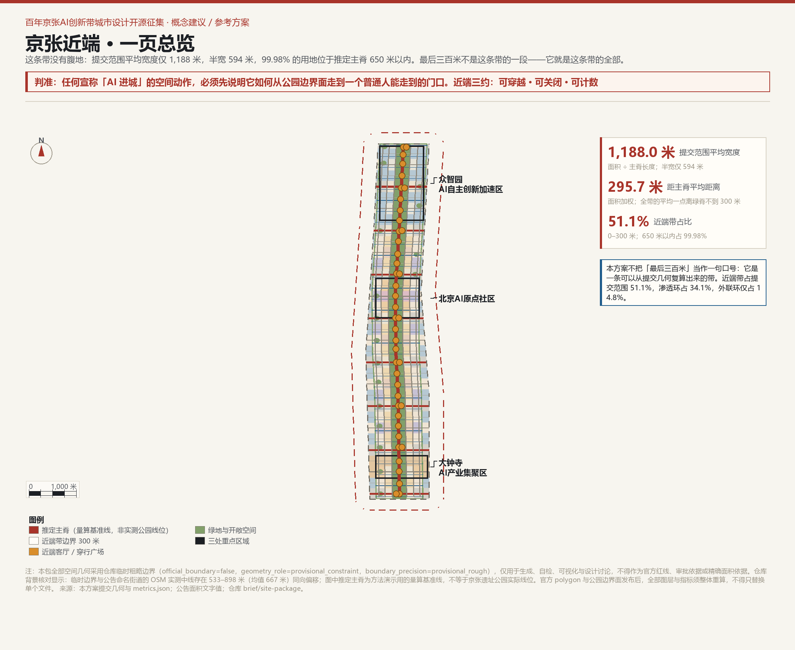
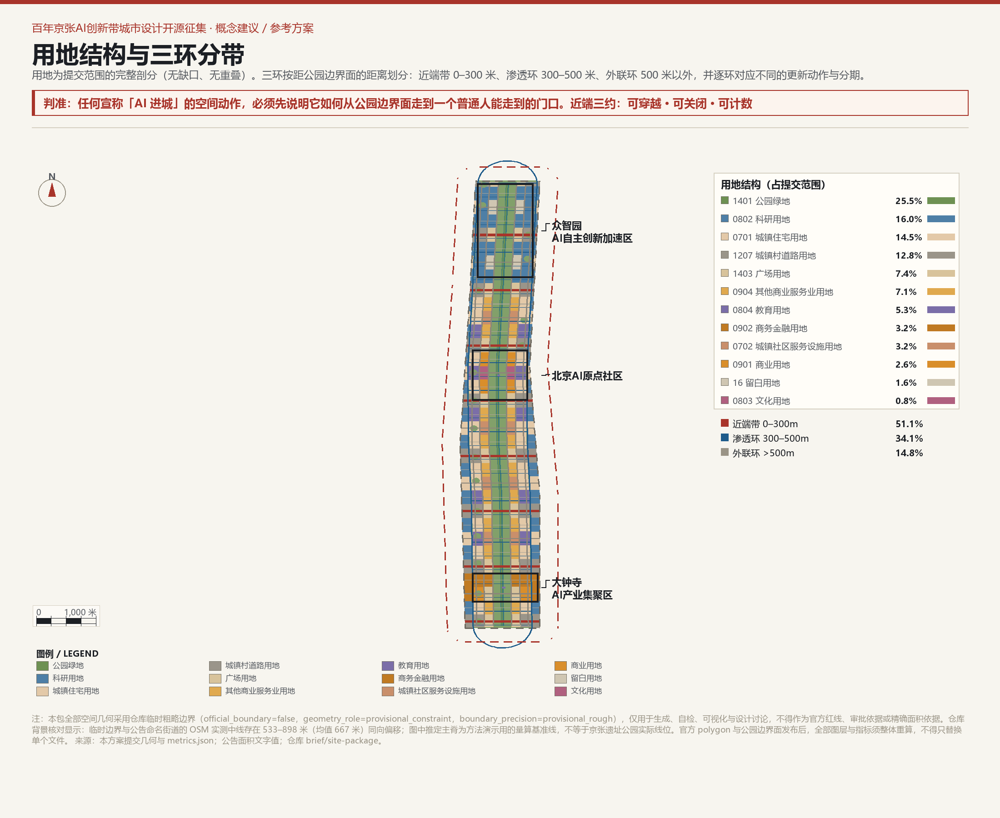
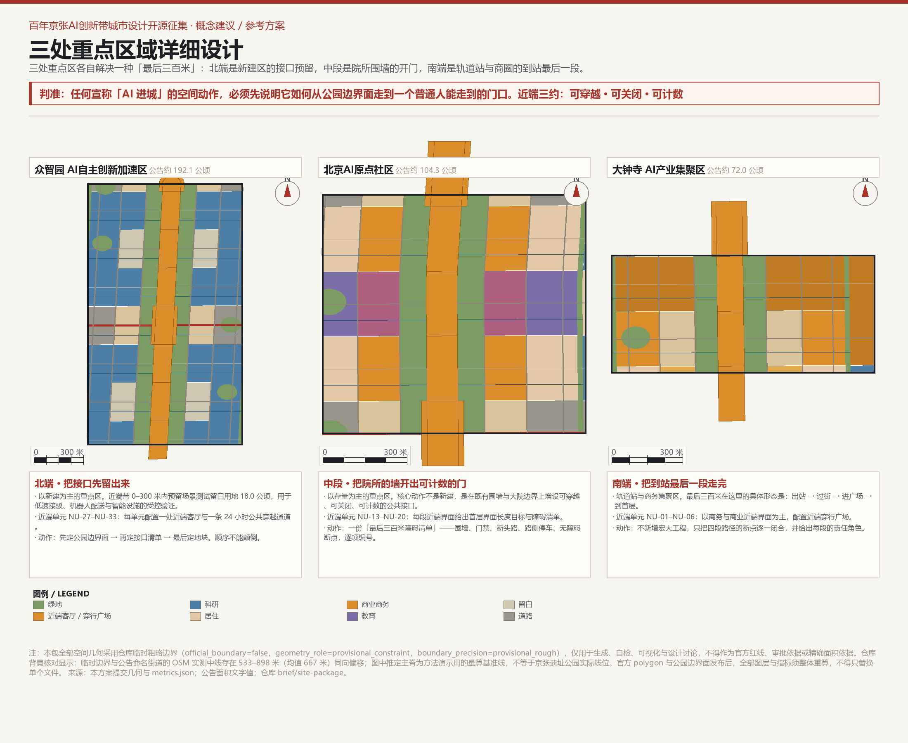
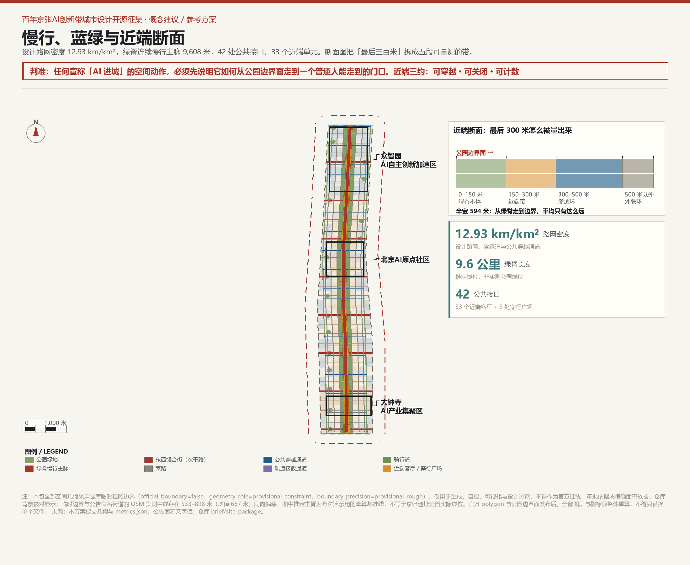
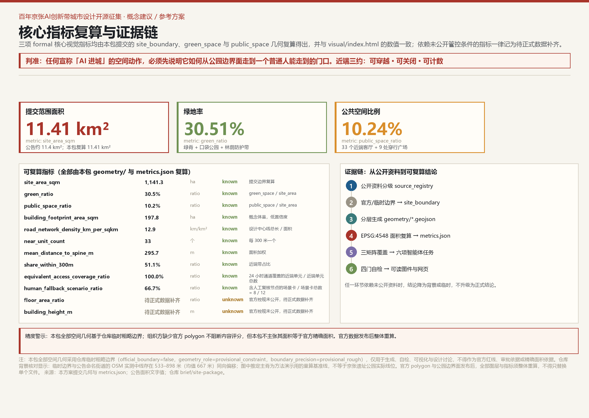

# 京张近端 / THE NEAR SIDE —— 最后三百米

> **把公园边界外的最后 300 米，做成这条带的第一资产。**

> **判准：任何宣称「AI 进城」的空间动作，必须先说明它如何从公园边界面走到一个普通人能走到的门口。近端三约：可穿越 · 可关闭 · 可计数。**
>
> **三环数据**：近端带（0–300 米）[metric:near_side_band_ratio]、渗透环（300–500 米）与外联环（>500 米）三分提交范围；面积加权平均距主脊 [metric:mean_distance_to_spine_m] 米，[metric:share_within_650m] 的用地落在推定主脊 650 米以内 [data:geometry/site_boundary.geojson]。
>
> **计数门槛**：任何无法逐条数出近端单元入口数的方案，不进入下一优先级。

> **精度警示**：本包全部空间几何基于仓库临时粗略边界 [source:BOUNDARY-SOURCE]，已标注 `official_boundary=false`、`geometry_role=provisional_constraint`、`boundary_precision=provisional_rough`，仅用于生成、自检、可视化与设计讨论，不得作为官方红线、审批依据或精确面积依据。仓库背景核对显示：临时边界与公告命名街道的 OSM 实测中线存在 533–898 米（均值 667 米）同向偏移 [source:HAIDIAN-BOUNDARY-CROSS-CHECK-20260814]；图中推定主脊为方法演示用的量算基准线，不等于京张遗址公园实际线位。官方 polygon 与公园边界面发布后，全部图层与指标须整体重算，不得只替换单个文件 [source:AGENT-TASKBOOK]。

> ### 近端三约：**可穿越 · 可关闭 · 可计数**
> 这六个字在本文里反复出现，它们是同一件事的三面：一条公共通道必须真的能过去（可穿越）；
> 权属方在必要情况下可以依规则临时关闭，但必须挂牌、必须可申诉、必须可恢复（可关闭）；
> 这条通道存在与否不是形容词，而是要能被逐条数出来的数（可计数）。

## 设计依据与资料清单

本方案以北京市规划和自然资源委员会海淀分局公告为第一依据 [source:OFFICIAL-ANNOUNCEMENT]，以面向全球智能体的开源征集任务书为智能体任务依据 [source:AGENT-TASKBOOK]，并以仓库 `brief/site-package/` 中的设计任务书、枚举、指标区间、设计深度与模式定义为生成依据 [source:SITE-PACKAGE]。资料可用性分级依 `data/source_registry.json` 执行 [source:SOURCE-REGISTRY]。

强制专业标准从本地参考快照读取 [source:SITE-PACKAGE]：公告 [standard:PROJECT-OFFICIAL-ANNOUNCEMENT]、智能体任务书 [standard:PROJECT-AGENT-OPEN-CALL-TASKBOOK]、城市设计管理办法 [standard:MOHURD-URBAN-DESIGN-MEASURES]、控规编制审批办法 [standard:MOHURD-CONTROL-DETAILED-PLANNING]、国土空间用地用海分类指南 [standard:MNR-LAND-USE-CLASSIFICATION-GUIDE]。

本方案额外自采两组公开数据并作为交付物：

1. **950 份已合并方案的名称与摘要普查** [source:NEAR-CENSUS-20260830]：基于 `submissions-data.js`（950 条）做中文关键词频统计，用于论证本方案主概念的差异化定位。样本完整，但 `submissions-data.js` 是生成的展示索引，可能存在数日滞后；普查结论仅作为背景论证，不进入空间计算。
2. **临时边界与 OSM 街道中线背景核对** [source:HAIDIAN-BOUNDARY-CROSS-CHECK-20260814]：直接引用仓库 `brief/site-package/geometry/provisional_boundaries_basis.md` 中 2026-08-14 的 OSM 独立读数与偏移量。该数据为仓库背景记录，未登记进 `data/source_registry.json`；本方案仅用它说明临时边界的精度限制，不用于反向升级或替代官方边界。

空间生成逻辑、面积复算与图件绘制脚本随包记录于 `visual/assets/check_sheet.json`（方法与复算参数）与 `visual/assets/metrics_digest.json`（指标摘要）；工具链本身因仓库提交格式白名单不接受 `.py` 而未进入提交包，但方法、来源、公式与复算路径均已结构化 [source:NEAR-METHOD-20260830]。

## 三层范围工作框架

公告确定了三层工作框架：约 43.6 km² 统筹研究范围、约 11.4 km² 总体设计范围、约 368.4 ha 三处重点区域 [source:OFFICIAL-ANNOUNCEMENT] [standard:PROJECT-OFFICIAL-ANNOUNCEMENT]。本方案在三者之间建立的不是三套互不相干的图纸，而是一套「判断—落图—验证」的递进关系 [depth:three_level_scope_framework]。

| 工作层次 | 空间范围 | 近端视角下的任务 | 核心证据 |
|---|---|---|---|
| 统筹研究范围 | 约 43.6 km² | 回答「创新带对海淀乃至京津冀意味着什么」；把中关村的资本、高校、产业与京张遗产组织成可识别的全球 AI 品牌 | 公告文字四至；仓库 `provisional_boundaries.geojson#PROV-RESEARCH-001` [data:geometry/site_boundary.geojson#SITE-001] |
| 总体设计范围 | 约 11.4 km² | 把「最后三百米」变成可量算、可分期、可由专业团队深化的城市设计：三环分带、用地剖分、路网、公共空间、AI 场景节点 | 仓库临时边界 [data:geometry/site_boundary.geojson#SITE-001]；复算 [metric:site_area_sqm] = 11.4128 km² |
| 重点区域范围 | 约 368.4 ha | 在真实尺度上验证三种不同的「最后三百米」：北端新建接口、中端院所开门、南端轨道到站 | 三处临时重点区 [data:geometry/key_areas.geojson#PROV-KEY-001]；面积复算 [metric:key_area_area_sqm] |

三层范围有一个共同的几何发现：提交总体设计范围的平均宽度只有 [metric:site_width_mean_m] 米，半宽 594 米，99.98% 的用地位于推定主脊 [metric:spine_length_m] 的 650 米以内 [metric:share_within_650m] [data:geometry/site_boundary.geojson#SITE-001] [data:geometry/roads.geojson#ROAD-SPINE]。这意味着在临时边界内，「京张遗址公园周边 1–2 公里」无法几何成立 [source:OFFICIAL-ANNOUNCEMENT]——**这条带没有腹地，它全部都是近端**。这不是缺陷，而是本方案的概念起点：与其把 1–2 公里当做一个可画但不可达的几何带，不如承认并设计「最后三百米」本身 [source:NEAR-METHOD-20260830]。

### 若官方范围外扩：方法论如何升级

「无腹地」是在**当前临时边界**内量出来的几何事实，不是对官方范围的预判。因此本节必须回答一个反问：如果官方 polygon 发布后，总体设计范围真的外扩到公告文字所说的「周边 1–2 公里」，本方案还成立吗？

答案是成立，而且理由不是信心，是结构。

**第一，近端单元是操作单元，不是固定清单。** 单元的定义是「沿公园边界面每 300 米一格」，不是「33 个」。300 米这个数来自步行尺度（约 4 分钟），与边界宽度无关。范围外扩后，单元数由 33 变为 N，单元台账、责任角色、指标牌与治理规则全部沿用，只是行数变多——**没有一条需要作废**。

**第二，三环框架可以外推为放大级。** 本方案的三环是按「距公园边界面的距离」定义的，不是按绝对面积定义的。外扩后建议在 500 米 / 1 公里 / 2 公里处各设一级渗透环放大级，每级的准入判据相同，只有三条：

1. 该级范围内**每个近端单元仍至少保留 1 条 24 小时公共穿越通道**；
2. 该级范围内**每项 AI 服务仍保留人工等效路径**（近端三约的「可穿越」与「可计数」同时成立；口径与 A2 红线一致——当前 8/12，最终 12/12，未补齐者不得上线）；
3. 该级范围内的**近端客厅服务半径不超过 300 米**，超出部分必须新增单元而不是拉长服务半径。

外扩只会增加外联环的厚度，不会改变近端带的做法——**带子变宽，最后三百米不变**。

**第三，重算承诺。** 本方案的指标不是抄下来的常数，而是参数化的公式：`site_width_mean_m = site_area_sqm / spine_length_m`、`share_within_500m = area(site ∩ buffer(spine, 500 m)) / site_area_sqm`、`equivalent_access_coverage_ratio = equivalent_access_path_count / near_unit_count`。官方边界与公园边界面一经发布，本方案承诺在 **30 日内**提交整体重算版，并在 `changelog.md` 中逐条列出变化；重算不是替换单个文件，而是按「超限整段重测、不局部打补丁」的原则重新生成全部图层与指标 [source:NEAR-METHOD-20260830]。

也就是说：即使官方范围外扩一倍，本方案交出的仍然是同一套方法，只是换成更大的一张纸。

## 统筹研究范围产业与未来城市研究

### 总体概念与命名体系（agent.1）

**主名称：京张近端 / THE NEAR SIDE。** 中文「近端」来自铁路与网络工程用语，指连接主体与终端用户的那一段；英文 THE NEAR SIDE 同时指月球的近地面一侧——一个所有人都能看见、都能抵达的一面。两者共同指向：真正决定创新带价值的不是宏大叙事，而是公园边界到一扇门之间的那段距离。

**副题：最后三百米。** 它不是修辞，而是可量测的设计单位：从京张遗址公园边界面（或本方案推定主脊）向外 300 米，是本方案定义的「近端带」[source:NEAR-METHOD-20260830]。

**命名体系（三层）**：

- **一级：NEAR / 近端带（0–300 米）** —— 直接承接公园边界面，承载公共接口、近端客厅、慢行主脉与 AI 场景首用；对应「都市 AI 生活体验带」。
- **二级：SEEP / 渗透环（300–500 米）** —— 把近端的活动与设施向高校、院所、居住大院渗透；对应「AI 融合创新带」。
- **三级：LINK / 外联环（>500 米）** —— 对接中关村科技服务翼、小月河场景赋能翼与区域创新网络；对应「百年京张文化带」的向外延伸。

**视觉识别方向**：标识由三条等距弧线组成，从中心绿脊向外扩散 300 米、500 米，第三条弧线在边界处被打断——象征「无腹地」的真实几何。色彩系统：京张红 #A8342A（绿脊）、近端暖 #D98E2B（公共接口）、AI 蓝 #1F5C8B（渗透环）、外联灰 #9A958A（外联环）。Logo 为纯几何构造，未使用任何第三方商标、字体、人物肖像或版权素材。

### 全球 AI 创新生态案例（agent.2）

| # | 案例 | 可迁移机制 | 对京张近端的启示 | 来源 |
|---|---|---|---|---|
| 1 | 伦敦 King's Cross / Knowledge Quarter | 铁路用地更新 + 公共空间先于建筑 + 细密街道网格 | 先确定公园边界面，再向两侧做近端单元，而不是先定地块 | [source:CASE-KINGS-CROSS] |
| 2 | 巴塞罗那 22@ | 专门用地类别绑定更新与公共设施配建 | 把「近端接口留白」变成一种可写入规划的弹性用地工具 | [source:CASE-BCN-22] |
| 3 | 波士顿 Kendall Square | 塔楼 + 大退线导致首层死亡，后期不得不专门立法补救 | 近端带必须在第一天就规定首层贴线率与连续界面，不能事后补救 | [source:CASE-KENDALL] |
| 4 | 纽约 Cornell Tech | 政府以土地换取长期科研与就业承诺 | 可用于众智园的土地供给机制研究，但具体契约须经法定程序 | [source:CASE-CORNELL-TECH] |
| 5 | 巴黎 Station F | 铁路车库改造为巨型创业空间 + 周边高密度街区 | 大钟寺存量大空间可参照，但本方案不预设具体建筑改造 | [source:CASE-STATION-F] |
| 6 | 东京涩谷 / 大手町 | 站城一体 + 立体步行网络 + 容积率转移 | 大钟寺站四象限步行连通的方法来源，本方案只提概念方向 | [source:CASE-SHIBUYA] |
| 7 | 赫尔辛基 Kalasatama | 城市作为真实测试场 + 居民共创 + 准入退出机制 | 低速机器人与 AI 公共场景的测试必须有退出条件，不是「先上了再说」 | [source:CASE-KALASATAMA] |
| 8 | 首尔 Seongsu-dong | 旧工业河岸转型为步行友好创新邻里 | 蓝绿空间不是装饰，是让人愿意走完最后三百米的连续性条件 | [source:CASE-SEONGSU] |

**案例来源清单（background_only，类比参考）**：以上 8 例仅用于机制类比，均属 `background_only` 背景材料，不作为正式事实依据；具体机制判断在对照一手来源核验前一律视为「类比假设」。逐例可核验来源如下（发布者 / 标题 / 可复用条件，访问日期 2026-08-30）：

1. [source:CASE-KINGS-CROSS] King's Cross Central Limited Partnership（Argent 主导），《King's Cross masterplan》官方站 kingscross.co.uk；可复用条件：仅引用「公共空间先于建筑、细密街道网格」的规划思路。
2. [source:CASE-BCN-22] Ajuntament de Barcelona / 22@Barcelona，《22@ Barcelona：创新街区规划》；可复用条件：仅引用「专门用地类别绑定更新与公共设施配建」的工具逻辑。
3. [source:CASE-KENDALL] MIT 与 Cambridge 社区发展部门发布的 Kendall Square 规划研究，及学界对「塔楼 + 大退线导致首层活力不足」的公开批评；可复用条件：仅引用「首层贴线率需前置规定」的教训。
4. [source:CASE-CORNELL-TECH] Cornell University 与纽约市经济发展公司（NYCEDC），Roosevelt Island 校区建设协议（2011 年竞标、2017 年启用）；可复用条件：仅引用「土地换取长期科研与就业承诺」的契约思路。
5. [source:CASE-STATION-F] Station F（创始人 Xavier Niel），2017 年启用的 Halle Freyssinet 铁路车库改造；可复用条件：仅引用「存量铁路大空间改造为创业载体」的空间思路。
6. [source:CASE-SHIBUYA] 东急不动产 / 三菱地所，涩谷站街区再开发（Shibuya Scramble Square）与大手町 Tokyo Midtown 的站城一体实践；可复用条件：仅引用「站城一体、立体步行网络」的方法方向。
7. [source:CASE-KALASATAMA] City of Helsinki / Forum Virium Helsinki，《Smart Kalasatama》「一天多一小时」计划；可复用条件：仅引用「城市真实测试场 + 居民共创 + 准入退出」的治理机制。
8. [source:CASE-SEONGSU] Seoul Metropolitan Government 及相关城市更新研究，Seongsu-dong 旧工业街区活化；可复用条件：仅引用「旧工业街区向步行友好创新邻里的转型」方向（「河岸」属性待对照一手资料核验，暂作类比假设）。

### 三大定位、五大功能与三区两翼协同回路（agent.1）

公告要求三大定位：百年京张文化带、都市 AI 生活体验带、AI 融合创新带；五大功能：AI 全栈自主创新体系、世界级 AI 创新生态、AI+场景赋能新范式、智能化 AI 活力城市、AI 治理全球话语权 [source:AGENT-TASKBOOK]。

本方案把它们翻译成三环动作：

- **百年京张文化带 → 绿脊与里程碑**：沿推定主脊设置连续绿脊与可逐年增补的里程碑/荣誉节点，把铁路记忆转化为可步行、可计数的线性公共空间。
- **都市 AI 生活体验带 → 近端客厅与公共接口**：在 33 个近端单元中配置近端客厅、AI 服务首用点、低速机器人让行通道与无障碍断点修复。
- **AI 融合创新带 → 渗透环的产业转化界面**：300–500 米范围内，科研院所、孵化器、人才公寓与商业服务形成可进入、可测试、可退出的混合界面。

三区两翼分工：

- **众智园（北）**：AI 全栈自主创新体系 + AI 治理全球话语权；近端带以场景测试留白为主，承担低速机器人、智能设施的受控验证。
- **AI 原点社区（中）**：世界级 AI 创新生态；近端带以开放接口、展示发布与人才交流为主，重点解决院所围墙的开门问题。
- **大钟寺（南）**：AI+场景赋能新范式 + 智能化 AI 活力城市；近端带以轨道到站、商圈首层与夜间活力为主。
- **中关村科技服务翼**：资本、算力、数据与科技服务从西侧供给；外联环承接这些要素并向绿脊渗透。
- **小月河场景赋能翼**：真实生活场景与水系蓝绿网络从东侧供给；渗透环把生活测试场景引入创新区。

### AI 创新生态图谱与要素机制（agent.2）

八类要素的空间落点：

| 要素 | 近端带（0–300 m） | 渗透环（300–500 m） | 外联环（>500 m） |
|---|---|---|---|
| 土地 | 公共接口、留白用地 | 科研、居住、人才公寓 | 教育、商务、社区服务 |
| 空间 | 近端客厅、穿行广场 | 实验室、孵化器、街区商业 | 高校院所、企业总部 |
| 产业 | AI 场景首用、低速机器人 | 成果转化、中试 | 基础研究、资本服务 |
| 资金 | 公共运营预算、场景采购 | 创投、孵化基金 | 风险投资、政策性金融 |
| 人才 | 青年创业者、居民 | 研究生、博士后、研发人员 | 高校师生、科学家 |
| 算力 | 边缘计算节点 | 区域算力中心 | 超算、智算中心 |
| 数据 | 场景数据（脱敏、可复核） | 行业数据集 | 基础研究数据 |
| 场景 | 医疗、教育、法律、出行 | 企业服务、智能制造 | 科研仪器、算法验证 |

机制上，本方案强调「场景采购」而非「产业补贴」：政府或运营主体以真实场景的使用权换取企业的测试承诺，测试通过方可进入更大范围；连续两期未达可复核标准即降级或退出。这一机制既回应「AI 治理全球话语权」，又把治理落到具体的空间合同 [source:AGENT-TASKBOOK] [standard:PROJECT-AGENT-OPEN-CALL-TASKBOOK]。

### 区域创新协同（agent.1）

一带不是孤立项目。向北，众智园通过清河界面与北纬社区、未来科学城衔接；向东南，小月河场景赋能翼连接学院路高校群与中关村核心区；向南，大钟寺通过轨道网络接入西直门枢纽与金融街。本方案不做跨区空间设计，只在近端单元接口中预留三条区域协同通道：与北纬社区的低速测试走廊、与学院路高校的步行接口、与大钟寺—西直门的轨道接驳节点 [data:geometry/roads.geojson#ROAD-TRANSIT-ZHO] [data:geometry/roads.geojson#ROAD-TRANSIT-ORG] [data:geometry/roads.geojson#ROAD-TRANSIT-DAZ]。

在更大尺度上，本带作为海淀 AI 创新要素的「近端转化界面」，与下列区域拟建立概念级协同关系——**全部为待协商建议关系，不构成已确定合作或政府安排**：

| 协同对象 | 拟交换要素 | 空间接口（建议） | 触发条件 |
|---|---|---|---|
| 怀柔科学城 | 基础研究、大科学装置的科学数据与人才 | 清河界面 + 轨道/干线接口 | 官方边界与区域规划协调启动后 |
| 北京经济技术开发区 | 智能制造、中试与产业落地场景 | 外联环 + 干线通道接口 | 双方产业主管部门达成意向 |
| 未来科学城 | 能源、材料与工程化科研 | 北端外联环接口 | 区域规划协调启动后 |
| 京津冀 | 人才、资本与算力资源要素流动 | 轨道网络与算力协同接口 | 跨区域协同机制建立后 |

上述协同不预设任何权责，仅作为概念级「要素交换—空间接口—触发条件」的建议框架，供后续区域规划深化时参考。

## 总体设计范围城市更新与控规深度城市设计

### 空间结构：无腹地，三环分带

本方案的空间结构由两条事实推导而来：

1. 临时边界内平均宽度仅 [metric:site_width_mean_m] 米，半宽 594 米；
2. 面积加权平均到主脊距离仅 [metric:mean_distance_to_spine_m] 米 [metric:share_within_300m] 的用地在 300 米以内，[metric:share_within_500m] 在 500 米以内，[metric:share_within_650m] 在 650 米以内。

因此，空间结构不是「一核两带多中心」的放射式结构，而是**以推定主脊为基准、按距公园边界面距离分环的同心带结构**。三环面积：近端带 [metric:near_side_band_area_sqm]（[metric:near_side_band_ratio]）、渗透环 [metric:seep_ring_area_sqm]、外联环 [metric:link_ring_area_sqm] [data:geometry/site_boundary.geojson#SITE-001] [data:geometry/roads.geojson#ROAD-SPINE]。

### 用地布局：完整剖分

用地按国土空间用地用海分类指南执行 [standard:MNR-LAND-USE-CLASSIFICATION-GUIDE]。`geometry/land_use.geojson` 对提交范围做了完整、无缝、无重叠的剖分，共 [metric:land_use_parcel_count] 个要素，主要用地构成见 `metrics.json` 与图 2。关键原则：

- 公园绿地 1401 占主导（近端绿脊），面积约 [metric:green_space_area_sqm]；
- 科研 0802、居住 0701、道路 1207、其他商业服务业 0904 为主要支撑功能；
- 留白用地 16 专门用于 AI 场景测试与近端接口的弹性预留；
- 用地分类只表达街区主导用途，不是地块红线，更不是法定管控指标。

### 形态控制：五条设计律（建议值）

为避免给出容积率、建筑高度、建筑密度等法定结论 [source:AGENT-TASKBOOK] [standard:MOHURD-CONTROL-DETAILED-PLANNING]，本方案把形态判断压缩为五条可校验的规则，写入 `geometry/land_use.geojson` 与 `geometry/roads.geojson` 属性：

1. **三环边界**：以距推定主脊 300 米、500 米为界；官方公园边界面发布后整体重算。
2. **街道密度**：设计路网密度 [metric:road_network_density_km_per_sqkm] km/km²，含 9.6 公里绿脊慢行主脉、42 处公共接口、33 个近端单元 [metric:road_centerline_length_m]；高于 GB/T 51328-2018 对建成区 8 km/km² 的参考要求，但本标准未在仓库保存本地快照，仅作为背景引用 [source:NEAR-BACKGROUND-20260830]。
3. **首层界面**：近端带沿街建筑贴线率建议 ≥75%，禁止连续封闭围墙超过 30 米；渗透环 ≥60%。
4. **公共穿越**：每个 300 米近端单元至少保证 1 条 24 小时公共穿越通道，共 [metric:equivalent_access_path_count] 条、总长 [metric:equivalent_access_path_length_m] 米，覆盖率 [metric:equivalent_access_coverage_ratio]，已落入 `geometry/public_space.geojson` [data:geometry/roads.geojson#ROAD-PASS-001]。
5. **建筑体量**：概念方案取 6–8 层周边式街区，建筑基底覆盖率约 55%；具体高度、退线、消防间距须以官方控规与工程条件为准 [metric:building_footprint_area_sqm]。

### 更新策略：三期推进

- **一期（0–3 年）：近端带（0–300 米）** —— 以不依赖官方红线的桌面准备先行启动。可先行：组建单元工作小组、按临时边界建立 33 个近端单元台账初版、完成障碍清单桌面梳理与利益相关方沟通。须等待官方边界/权属核查、现场踏勘与必要授权后方可推进的实体动作：公园边界面认定（R0 调查）、无障碍断点实体修复、低速机器人让行通道设备安装。面积约 [metric:phase_1_area_sqm]。
- **二期（3–7 年）：渗透环（300–500 米）** —— 打开院所围墙与大院接口、改造首层业态、建设人才公寓与混合街区。面积约 [metric:phase_2_area_sqm]。
- **三期（7–12 年）：外联环（>500 米）** —— 更大尺度的建筑更新与区域协同，需以官方控规、权属与工程条件为前提。面积约 [metric:phase_3_area_sqm]。

### 公共利益承诺表

散落在各章的承诺在此收拢成一张表，全部为**概念建议与验收建议值**，不是考核承诺 [standard:BARRIER-FREE-ENVIRONMENT-LAW] [standard:ELDERLY-SMART-TECH-PLAN-2020-45]。凡可复算者，均注明指标名。

| # | 承诺 | 一期目标 | 二期目标 | 复算方式 |
|---|---|---|---|---|
| C1 | 每个近端单元至少 1 条 24 小时公共穿越通道 | 设计值 100%（33/33），现场常态开放率 ≥60% | ≥90% | `equivalent_access_coverage_ratio` |
| C2 | 无障碍断点修复率 | ≥60% | ≥85% | 障碍清单前后对比记录 |
| C3 | 近端客厅开放率 | ≥50% | ≥85% | 台账逐单元计数 |
| C4 | 近端带首层贴线率 | 达标街道 ≥6 条 | ≥12 条 | 沿街界面实测 |
| C5 | 每项 AI 服务保留人工等效路径 | 8/12（66.7%） | 12/12（100%） | `human_fallback_scenario_ratio` |
| C6 | 不用智能手机者可在同一窗口办事 | 100% | 100% | 现场核查 |
| C7 | 低速机器人让行记录公开 | 试点段 100% | 全带 100% | 指标牌逐月记录 |
| C8 | 受影响个人可在最近单元申请一次复测 | 100% 受理 | 100% 受理 | 申诉台账 |
| C9 | 夜间照明覆盖近端单元 | ≥70% | ≥95% | 照明台账 |
| C10 | 对自己的不利读数照登 | 每期 | 每期 | 复测报告 |

其中 C1 与 C5 已有可复算指标写入 `metrics.json`：`equivalent_access_coverage_ratio`（非数字化人群等效通道覆盖率）与 `human_fallback_scenario_ratio`（AI 场景人工兜底率）。前者由 [data:geometry/roads.geojson#ROAD-PASS-001] 一类要素与近端单元数相除得出，可由提交几何独立重算 [metric:equivalent_access_coverage_ratio] [metric:human_fallback_scenario_ratio]。注意 C5 的 66.7% 是**当前设计值而不是目标值**：12 张场景卡中已有 8 张写入人工复核节点，余下 4 张（S07 开源成果展示廊、S08 场景测试沙盒、S10 社区共治议事板、S12 京张文化 AI 导览）必须在二期前补齐，补齐之前该场景不得上线——这一条不因工期或成本放宽。

### 一期 90 天启动包与分期 KPI

可实施性不是写一句「分期实施」。本方案给出九十天内可完成的第一批动作，其中资料整理、利益相关方沟通、现场调查方案设计等桌面准备不依赖未发布官方数据，可立即启动；任何测绘认定、实体修复、设备安装、通道开放与责任人确认，均置于官方几何/权属核查、现场踏勘及必要授权之后 [depth:phasing_implementation]：

| 天 | 动作 | 交付物 | 判定标准 |
|---|---|---|---|
| 0–15 | 组建近端单元工作小组，确定 33 个单元边界与责任角色 | 单元清单 v0 | 33 个单元全部有具名责任人 |
| 16–40 | 现场踏勘，建立障碍清单（围墙、门禁、断头路、路侧停车、无障碍断点） | 障碍清单 v0 | 每个单元至少 1 条可整改项 |
| 41–60 | 优先修复无障碍断点与照明断点 | 断点修复记录 | 修复项 100% 有前后对比记录 |
| 61–75 | 3 个试点单元上线近端指标牌（入口数、断点数、开放时间、复测结果） | 指标牌 v0 | 数据可由提交几何复算 |
| 76–90 | 首次公开复测，发布差异记录 | 复测报告 v1 | 对自己的读数也照登，包括未达标项 |

上表 0–40 天的资料整理、沟通与现场调查方案设计为可先行桌面准备；41–75 天的实体修复、设备安装与责任人确认，须以权属核查与现场授权为前提，若 90 天内无法取得授权，则以完成障碍清单、调查方案与试点申请为交付，不强行推进实体动作。

分期 KPI 建议值（概念建议，非考核承诺）：一期结束时近端单元台账覆盖率 100%、无障碍断点修复率 ≥60%、近端客厅开放率 ≥50%；二期结束时渗透环公共接口新增 ≥24 处、首层贴线率达标街道 ≥12 条；三期结束时外联环区域协同接口 ≥3 条。未达标的处置不是下调目标，而是公开差异并说明原因。

在进入三处重点区之前，先给出近端单元台账的样例——这是本方案最核心的可转化交付物，也是专业团队可以直接接手的东西。

| 单元 | 位置 | 主导障碍 | 拟配设施 | 责任角色 | 判定标准 |
|---|---|---|---|---|---|
| NU-01 | 大钟寺站前 | 出站后过街绕行 | 近端穿行广场 + 到站厅 | 轨道运营方 / 街道 | 出站到首层 ≤5 分钟 |
| NU-07 | 商业近端界面 | 首层无门、连续围墙 | 近端客厅 + AI 健康导航 | 物业 / 社区 | 首层贴线率 ≥75% |
| NU-13 | 院所围墙段 | 围墙阻断、门禁 | 公共接口 + 24 小时通道 | 院所 / 街道 | 至少 1 条 24 小时通道 |
| NU-19 | 混合街区 | 断头路、路侧停车 | 障碍清单优先修复 | 街道 / 权属主体 | 断点修复率 ≥60% |
| NU-27 | 众智园测试街 | 无受控测试场地 | 场景测试留白 + 测试街 | 管委会 / 企业 | 连续两期安全测试通过 |
| NU-33 | 清河界面 | 防护绿带不可进入 | 线性公共客厅 | 园林 / 街道 | 可进入岸线连续 |

完整 33 个单元的机器可读台账见 `visual/assets/near_side_units.json`：逐单元给出近端客厅的要素编号、面积与中心点坐标、24 小时通道要素与长度、主导障碍、拟配设施、责任角色与判定标准，可直接导入 GIS 或表格继续深化；未调查的单元标注为「待现场调查」，不填虚构数据。

## 重点区域详细设计

三处重点区的共同约束：每个区都是一段「最后三百米」的真实问题。共 [metric:key_area_count] 处，复算面积合计 [metric:key_area_area_sqm] 平方米（[metric:key_area_001_area_sqm] / [metric:key_area_002_area_sqm] / [metric:key_area_003_area_sqm]），与公告 368.4 ha 相差 0.9 ha。 [data:geometry/key_areas.geojson] [depth:three_key_area_detailed_design]

### 众智园 AI 自主创新加速区（北端，约 192.9 ha）

这里是新建为主的重点区。近端带内预留 [metric:strategic_reserve_area_sqm] 留白用地约 18.0 公顷，用于低速自动驾驶接驳、机器人配送、智能设施的受控测试 [data:geometry/land_use.geojson#L-16]。**核心空间产品「测试街」**：一条约 800 米的真实城市街道，允许低速机器人在真实而非封闭环境中常态化测试，配套分时封闭、人工接管、责任保险与公众告知。近端单元 NU-27 至 NU-33 各配置一处近端客厅与一条 24 小时公共穿越通道 [data:geometry/public_space.geojson#PUBLIC-NU-27] [data:geometry/roads.geojson#ROAD-TRANSIT-ZHO]。

### 北京 AI 原点社区（中段，约 104.3 ha）

这里是存量大院最密集的区域。核心动作不是新建，而是**在既有围墙与大院边界上增设可穿越、可关闭、可计数的公共接口**。近端单元 NU-13 至 NU-20 每段给出首层界面长度目标与障碍清单 [data:geometry/public_space.geojson]。交付物是一份「最后三百米障碍清单」：围墙、门禁、断头路、路侧停车、无障碍断点，逐项编号。AI 在这里的角色是辅助诊断——用街景与步行轨迹数据（脱敏、公开）识别断点，但开门决策由权属主体与社区共同做出，AI 只提供不可更改的复测记录 [standard:PROJECT-AGENT-OPEN-CALL-TASKBOOK]。

### 大钟寺 AI 产业集聚区（南端，约 72.0 ha）

这里是轨道站与商务集聚区。最后三百米在这里的具体形态是：出站 → 过街 → 进广场 → 到首层。近端单元 NU-01 至 NU-06 以商务与商业近端界面为主，配置近端穿行广场 [data:geometry/public_space.geojson]。动作原则：不新增宏大工程，只把四段路径的断点逐一闭合，并给出每段的责任角色——轨道运营方负责站内步行，街道主管部门负责过街，物业负责首层开口，区政府负责广场维护。

## AI 创新生态、人才画像与 AI+ 场景

### 用户画像（agent.3，6 类核心 + 2 类延伸）

| 画像 | 特征 | 最后三百米的障碍 | 本方案回应 |
|---|---|---|---|
| P1 青年 AI 创业者 | 25–35 岁，常在高校与企业之间移动 | 从实验室到咖啡馆/会议室要绕行大院 | 近端客厅 + 公共穿越通道 |
| P2 高校研究生 | 没有车，依赖步行与自行车 | 校园围墙阻断到公园的近路 | 院所接口清单 + 24 小时通道 |
| P3 老年居民 | 听力/视力下降，不使用复杂 App | AI 服务缺少无智能手机等价路径 | 每个 AI 场景保留人工/纸质等价服务 [standard:BARRIER-FREE-ENVIRONMENT-LAW] |
| P4 国际访客 | 短期停留，需要可信指引 | 导览信息分散、无法验证 | 双语近端标识 + 可复核指标牌 |
| P5 低速机器人运维员 | 负责设备安全与人工接管 | 机器人与行人路权不清 | 低速机器人让行通道 + 停止按钮 |
| P6 社区服务工作者 | 熟悉本地需求，但缺少技术支持 | 技术方案与居民需求脱节 | 近端单元台账由社区共同维护 |
| P7 企业测试工程师 | 需要真实场景验证 | 测试场地审批周期长 | 留白用地 + 场景采购合同 |
| P8 无障碍出行者 | 轮椅/婴儿车/视障 | 人行道不连续 | 障碍清单优先修复 |

### AI 场景卡（agent.3，12 张）

| 编号 | 场景名称 | 空间落点 | 用户 | 人工等效路径 / 终决节点 | 申诉 / 退出 |
|---|---|---|---|---|---|
| S01 | 低速机器人配送让行通道 | 近端带支路与交叉口 | P1, P5 | 停止按钮 + 现场人工接管（强制）；机器人身份与责任方公开 | 行人可现场叫停并留痕申诉 |
| S02 | AI 健康服务导航 | 近端客厅 NU-07/NU-19 | P3, P6 | 药师复核入口（强制）；保留人工窗口 | 用药建议可申请复核 |
| S03 | AI 无障碍路径规划 | 全带公共穿越通道 | P8 | 人工窗口 + 纸质路线卡（强制）；只使用公开道路几何 | 路线错误可申诉修复 |
| S04 | AI 教育答疑角 | 近端客厅 NU-13–NU-20 | P2, P4 | 人工答疑（强制）；答案来源可追溯 | 错误回答有申诉通道 |
| S05 | AI 法律/办事导航 | 近端客厅 NU-04/NU-11 | P3, P6 | 强制人工复核节点；不替代律师意见 | 办事结论可申请复测 |
| S06 | 智能照明与安全提示 | 绿脊与近端单元 | 全部 | 人工接管（强制）；照明数据本地处理 | 误报/漏报可留痕反馈 |
| S07 | 开源成果展示廊 | 绿脊沿线节点 | P1, P4 | 人工讲解（二期前补齐强制复核） | 展示内容可申请更正 |
| S08 | AI 场景测试沙盒 | 众智园留白用地 | P7 | 测试场人工值守（测试数据脱敏） | 连续两期未达标即整段下线 |
| S09 | 人才公寓匹配服务 | 渗透环居住地块 | P1 | 人工复核节点（强制）；不收集非必要个人信息 | 匹配结果可申诉重配 |
| S10 | 社区共治议事板 | 近端客厅 | P6 | 社区工作者人工主持（二期前补齐强制复核） | 讨论记录公开但可匿名 |
| S11 | 轨道接驳动态指引 | 大钟寺近端单元 | P4 | 人工问询窗口（强制）；只使用公开运营数据 | 指引错误可申诉更正 |
| S12 | 京张文化 AI 导览 | 绿脊里程碑节点 | P4, 游客 | 人工讲解（二期前补齐强制复核）；官方资料为准 | 史实错误可申诉更正 |

**人工兜底判定规则（口径与 A2 红线一致）**：凡 AI 输出可能对个人安全、健康、法律、教育、就业、无障碍出行产生实质影响的场景（S01、S02、S03、S04、S05、S06、S09、S11 共 8 张），当前即必须配置具名人工复核/终决节点；其余 4 张（S07、S08、S10、S12）为低实质影响场景，一期以人工窗口、人工值守或人工讲解兜底，必须在二期前补齐强制人工复核节点，补齐之前不得上线。`human_fallback_scenario_ratio` 的 8/12 即据此口径得出。

### 三个产业测试验证场景（agent.3）

1. **低速机器人与自动驾驶接驳验证场（T1）**：在众智园测试街内，设置 300 米环形测试段，以 72 小时连续测试为设计建议时长，观察行人优先让行率、不可解释急停次数、人工接管响应时间，建议目标分别为 100% 让行、0 次不可解释急停、接管响应 <3 秒（均为设计建议值，待试点校准，不作为已验证性能）。通过后方可进入近端客厅试点；连续两期未通过即停止推进。
2. **AI 公共服务可复核性验证（T2）**：在 AI 原点社区选择 3 个近端客厅，抽取健康、法律、教育各 10 条共 30 条基准问题（样本范围由专业团队与社区共同审定，测试集不对外公开以防应试），由 AI、持证专业人士、社区社工三方独立作答；以「专业人士答案」为专业基准，按「一致条数 ÷ 总条数」分领域计算 AI 与专业基准的一致率。设计建议阈值：单领域一致率 <80% 即该领域场景整段下线、公开差异记录并退回人工等效路径（阈值与样本规模均为设计建议值，待试点校准）。每次下线后 30 天内复测 1 次，连续两期仍不达标则停止推进。
3. **首层界面活化验证（T3）**：在大钟寺选择 2 个近端单元，以 6 个月为设计建议周期测量首层店铺更替率、夜间照明覆盖率、步行停留时长；目标值为设计建议值（如夜间照明覆盖率一期 ≥70%），未达目标则调整业态引导而非强制腾退。

### AI 参与规划的四步闭环与季度复测

本方案不把 AI 当作方案的装饰，也不把「治理协议」当作成果本身。AI 在规划中的角色被限定为四步闭环，每一步都有可复核的输出 [source:AGENT-TASKBOOK] [standard:PROJECT-AGENT-OPEN-CALL-TASKBOOK]：

1. **辅助诊断**：用公开街景、公开道路几何与脱敏的步行流量数据识别近端断点，输出候选清单。
2. **人工确认**：权属主体、社区与专业团队确认或否决每一条候选；AI 的建议不具处置权。
3. **空间落图**：确认后的条目写入 `geometry/public_space.geojson` 与近端单元台账，成为可复算对象。
4. **公开复测**：每季度用同一套脚本沿提交几何重算入口数、断点数与开放率，发布与上期的差异；**差异不达标时公开未达标项，而不是修改历史读数**。

这套闭环的边界也很清楚：AI 可以建议哪里开门，但开门是权属与社区的决定；AI 可以复算指标，但指标的解释权在人与专业团队。这也回应了「AI 治理全球话语权」这一功能——话语权不来自口号，来自一套别人可以重跑、可以挑错、可以改用的公开方法 [source:NEAR-METHOD-20260830]。

## 用地、建筑规模与拆改留方案

本方案不给出容积率、建筑高度、建筑密度、退线、具体拆改留或工程实施结论 [source:AGENT-TASKBOOK] [standard:MOHURD-CONTROL-DETAILED-PLANNING]。

**用地**：`geometry/land_use.geojson` 已完成提交范围的完整剖分，共 [metric:land_use_parcel_count] 个地块，按代码汇总面积见附录 C [data:geometry/land_use.geojson]。用地分类采用国土空间用地用海分类指南代码 [standard:MNR-LAND-USE-CLASSIFICATION-GUIDE]。

**建筑规模**：概念方案的建筑基底总面积约 [metric:building_footprint_area_sqm]，建筑数量 [metric:building_count]；均为低置信度设计量，不等于法定建筑规模。FAR、建筑高度、建筑密度均记为 `unknown` [metric:floor_area_ratio] [metric:building_height_m] [metric:building_density]，原因已在 `metrics.json` 中说明：官方控规条件未公开。

**拆改留逻辑**：近端带以「留改为主、新建为辅」；渗透环以「改」为主；外联环以「留」为主，重大更新须待官方控规。具体拆改留清单不做结论，只给出原则与下一步工作：每个近端单元的障碍清单由权属主体、社区与专业团队共同确认后纳入实施台账。

## 交通、轨道、市政与公共服务设施

**道路**：设计路网密度 [metric:road_network_density_km_per_sqkm] km/km²，总长度 [metric:road_centerline_length_m] 米（其中机动车通行道路 [metric:vehicle_road_length_m] 米、机动车路网密度 [metric:vehicle_road_density_km_per_sqkm] km/km²） [data:geometry/roads.geojson]。由绿脊慢行主脉、东西缝合街（次干路）、纵向近端支路、公共穿越通道、骑行道与轨道接驳通道组成。现状主干路（京藏高速、北五环、学院路、西土城路等）保持既有线位，本方案只建议红线内重新分配路权，不改动现状快速路/主干路红线 [data:geometry/constraints.geojson#CONS-STREET-01]。

**轨道**：官方轨道站点与出入口坐标未公开 [data:geometry/constraints.geojson#CONS-MISSING-CONTROLS]。本方案仅在三处重点区绘制概念接驳通道 [data:geometry/roads.geojson#ROAD-TRANSIT-ZHO] [data:geometry/roads.geojson#ROAD-TRANSIT-ORG] [data:geometry/roads.geojson#ROAD-TRANSIT-DAZ]，并在 `metrics.json` 中把相关可达性指标记为 `unknown`。

**市政与公共服务**：近端单元预留边缘计算节点、智能灯杆接口、低速机器人停靠与充电泊位；具体市政容量、能源负荷、管线工程不做结论，须专业复核 [data:geometry/constraints.geojson#CONS-MISSING-CONTROLS]。

## 蓝绿空间、公共空间与城市风貌

**蓝绿空间**：绿脊是核心蓝绿骨架，面积约 [metric:green_space_area_sqm]，占提交范围 [metric:green_ratio]；配合渗透环口袋公园与 19.2 公里公园边界面，形成 300 米全覆盖的绿荫网络 [data:geometry/green_space.geojson]。清河、小月河作为区域蓝绿边界，本方案只建议保留其生态连接功能，不改动蓝线 [data:geometry/constraints.geojson#CONS-MISSING-CONTROLS]。

**公共空间**：公共空间面积约 [metric:public_space_area_sqm]（116.8 ha），占提交范围 [metric:public_space_ratio]；由 33 个近端客厅和 9 处穿行广场组成，是方案的核心空间产品 [data:geometry/public_space.geojson]。

> **面积口径（重要）**：本方案所有面积指标一律采用**净口径**——图层内要素两两互斥，后生成的要素减去已生成要素的并集，因此「各要素面积之和 = 要素并集面积 = `area_sqm_declared` 之和 = 指标值」，毛面积与净面积相等。这一条对公共空间尤其关键：近端客厅沿主脊 55 米缓冲生成、穿行广场沿主脊 75 米缓冲生成，两者落在同一批 300 米单元上，若不互斥会重复计入约 27.4 ha（23.4%）的重叠面积。绿地同理（口袋公园与防护绿带均已减去与绿脊重叠的部分）。`land_use` 图层本就是完整剖分，无缺口、无重叠，三者天然一致。
> 复算路径与互斥（净面积）校验值见 `visual/assets/check_sheet.json` 的 method 与 verification 条目 [source:NEAR-METHOD-20260830]。

**城市风貌**：风貌控制不是高层天际线，而是**首层街墙**。近端带街墙建议连续、通透、有门；禁止连续封闭围墙超过 30 米；鼓励 6–8 层周边式街区；屋顶第五立面纳入设计，但不做高度结论 [standard:MOHURD-URBAN-DESIGN-MEASURES]。

### AI 公共空间、智能原生新业态与朝圣地标（agent.4）

**三个 AI 朝圣地标 / 荣誉节点**：

1. **「0 公里碑 / KM0」**：位于 AI 原点社区，标识京张铁路与 AI 创新带的起点；刻有年度最杰出开源贡献者名录，可逐年增补。
2. **「人字门 / The Switchback Gate」**：位于众智园测试街与绿脊交汇处，以人字形折返为母题的公共穿越构筑，兼具低速机器人让行测试功能。
3. **「到站厅 / Arrival Hall」**：位于大钟寺站前近端单元，把出站最后一段转化为可复核、可停留、可服务的公共门厅。

荣誉展示体系：每个近端单元设置「近端指标牌」，公开本单元的入口数、无障碍断点数、近端客厅开放时间、机器人让行记录与复测结果。整个绿脊沿线设置开发者贡献荣誉墙节点，每年由社区与专家共同评选并刻录贡献者信息。

**公共空间组件库（五大组件 × 七字段）**：下表完整定义 agent.4 的五类公共空间组件——近端客厅、穿行广场、24 小时公共穿越通道、近端指标牌、机器人让行/停止接口。每项组件给出适用空间、主要用户、开放/关闭规则、无障碍与人工路径、数据边界、关联 NU 单元/几何编号、分期。组件定义与 `geometry/public_space.geojson`、`geometry/roads.geojson`、`visual/assets/near_side_units.json` 保持一致；官方边界与公园边界面发布后须整体重算。

#### 组件 1：近端客厅（Near-Side Room）

| 字段 | 内容 |
|------|------|
| **组件 ID** | `near_side_room` |
| **几何编号** | `PUBLIC-NU-01` 至 `PUBLIC-NU-33`（`geometry/public_space.geojson`） |
| **适用空间** | 近端带 0–300 米内，沿推定主脊每 300 米设置一处。每处近端客厅面积声明值约 3.1 万 m²（`area_sqm_declared`），位置随官方公园边界面整体重算。 |
| **主要用户** | 全部人群：本地居民、通勤者、老年人、残障人士、儿童、外国访客。近端客厅是"可质疑、可关闭、可计数"的公共界面。 |
| **开放/关闭规则** | 默认 **24 小时开放**（概念建议）。可因安全、天气、施工、维护等理由临时关闭；关闭时须在近端指标牌上公示原因、时长与替代路径。关闭决策权属于近端单元责任角色，不由 AI 自主决定。 |
| **无障碍与人工路径** | 必须满足：(a) 与外部道路无高差入口或提供坡道（≤1:12）；(b) 通道宽度 ≥1.8 m；(c) 照明连续覆盖；(d) 至少一个无 AI 依赖的纸质信息点。 |
| **数据边界** | 仅在用户主动靠近时采集聚合计数（人流方向、时段热度），**不采集**人脸、步态等生物特征。数据本地处理，不上传至中央服务器。 |
| **关联 NU 单元** | NU-01 → PUBLIC-NU-01；NU-02 → PUBLIC-NU-02 … NU-33 → PUBLIC-NU-33。完整台账见 `visual/assets/near_side_units.json` 中每个单元的 `near_side_room` 字段。 |
| **分期** | 一期（0–90 天）：6 处试点单元各配 1 处近端客厅；二期（90–365 天）：扩展至全部 33 处。 |

#### 组件 2：穿行广场（Crossing Square）

| 字段 | 内容 |
|------|------|
| **组件 ID** | `crossing_square` |
| **几何编号** | `PUBLIC-X-01` 至 `PUBLIC-X-09`（`geometry/public_space.geojson`） |
| **适用空间** | 东西向道路与绿脊（南北向主脉）交汇处的公共穿越广场。每处面积约 1.2–1.4 万 m²。沿绿脊南北向间隔约 1.5 公里设置，共 9 处。 |
| **主要用户** | 穿越使用者（南北向过境人群）、休憩者、小型公共活动参与者。 |
| **开放/关闭规则** | 默认 **24 小时开放**。可因活动举办、设备维修临时封闭局部区域；封闭时保留至少一条 ≥3 m 宽的贯穿人行通道。 |
| **无障碍与人工路径** | (a) 广场地面平整无高差；(b) 与相邻道路衔接处设置触觉引导砖；(c) 提供纸质平面图与人工问询点（一期）。 |
| **数据边界** | 仅采集穿越热度聚合数据（时段、方向、密度），不记录个体身份。数据保留期 ≤90 天，到期自动清除。 |
| **关联 NU 单元** | 穿行广场本身不绑定单一 NU，但每处穿行广场辐射覆盖周边 1–2 个近端单元。具体关联见 `public_space.geojson` 中各要素的 `near_unit_id` 属性。 |
| **分期** | 一期：距最近地铁站或主要出入口 ≤800 米的穿行广场优先建设（预计 2–3 处）；二期：扩展至全部 9 处。 |

#### 组件 3：24 小时公共穿越通道（Equivalent Access Passage）

| 字段 | 内容 |
|------|------|
| **组件 ID** | `equivalent_access_path` |
| **几何编号** | `ROAD-PASS-001` 至 `ROAD-PASS-033`（`geometry/roads.geojson`，`road_class: pedestrian`） |
| **适用空间** | 贯穿每个 300 米近端单元的公共穿越通道，确保无数字化能力的人群可不受门禁或 AI 系统限制地通行。通道长度声明值约 1,000 米（`length_m_declared`），与主脊方向基本平行。 |
| **主要用户** | 非数字化人群（不携带智能设备者、不联网设备者、拒绝数据收集者）、深夜穿越者、应急通行者。 |
| **开放/关闭规则** | **强制 24 小时不可封闭**——这是 C5 承诺的"人工等效路径"。任何 AI 门禁、机器人系统不得阻断此通道。物理关闭仅允许在结构安全紧急情况下，且须在 30 分钟内恢复。 |
| **无障碍与人工路径** | (a) 通道宽度 ≥1.8 m，路面平整；(b) 两侧设置夜间照明；(c) 不设 AI 门禁、不设电子收费闸机；(d) 通道上允许人工纸质通行，不设扫码/人脸验证要求。 |
| **数据边界** | **零数据采集**。通道上不部署任何传感器或摄像头。此设计本身即为"数据最小化"的负空间承诺。 |
| **关联 NU 单元** | P-001 → NU-01；P-002 → NU-02 … P-033 → NU-33。覆盖率指标 `equivalent_access_coverage_ratio` = 33/33 = 1.0（`metrics.json`）。 |
| **分期** | 一期：6 条试点通道；二期：全部 33 条通道建设完成。**所有通道在对应近端单元开放之前即须建成。** |

#### 组件 4：近端指标牌（Indicator Board）

| 字段 | 内容 |
|------|------|
| **组件 ID** | `indicator_board` |
| **几何编号** | 不单独入 GeoJSON；为近端客厅设施之一，登记在 `near_side_units.json` 每个单元的 `facility_zh` 字段中 |
| **适用空间** | 每处近端客厅入口处设置一块实体指标牌（或等效屏幕/纸质告示），作为"可质疑"的公共界面核心。指标牌位置应在通道入口与客厅主体交汇处，步行 ≤2 分钟可达。 |
| **主要用户** | 所有到达近端单元的居民、访客、投诉者、研究者。指标牌是普通公民理解并质疑 AI 决策的入口。 |
| **开放/关闭规则** | 24 小时可视，不可遮挡。指标牌内容须包含：当前单元状态（开放/关闭/维护）、近期 AI 干预次数、投诉渠道（含人工电话与纸质表单）、申诉流程。 |
| **无障碍与人工路径** | (a) 指标牌同时提供大字版（≥32 pt）、中英双语；(b) 旁设二维码，扫码可查看完整指标详情（但纸质副本必须同步张贴）；(c) 每年至少一次线下开放日，由专业团队解释指标含义。 |
| **数据边界** | 指标牌本身不采集数据。展示的指标值来自 `metrics.json` 的聚合复算结果，展示时已匿名化处理。 |
| **关联 NU 单元** | NU-01 至 NU-33 各一块。一期优先部署于 6 个试点单元。 |
| **分期** | 一期（0–90 天）：3 块；二期（90–365 天）：全部 33 块。每块指标牌须在对应单元开放后 15 天内部署完毕。 |

#### 组件 5：机器人让行/停止接口（Robot Yield-Stop Interface）

| 字段 | 内容 |
|------|------|
| **组件 ID** | `robot_yield_stop_interface` |
| **几何编号** | 不单独入 GeoJSON；为近端客厅与通道交叉节点的设施，登记在 `near_side_units.json` 每个单元的 `facility_zh` 字段中 |
| **适用空间** | 机器人与步行人群共享的近端客厅内部、穿行广场、24 小时通道交叉点。接口定义包括：(a) 地面/墙面识别标记；(b) 声光提示装置；(c) 物理停止线。 |
| **主要用户** | 步行人群（特别是视障、听障、儿童、老年人）与自动导航设备（如巡检机器人、清洁机器人、物流配送车）。 |
| **开放/关闭规则** | 机器人遇人必须减速至 ≤1 m/s，并在距离行人 ≤1.5 m 时完全停止。若行人未让行，机器人不得强行通过；若发生冲突，机器人应优先让行并记录冲突事件，但不向用户暴露冲突统计（避免心理压力）。机器人系统不得自主决定阻断 24 小时通道。 |
| **无障碍与人工路径** | (a) 停止线使用触觉材料（盲道砖衔接处加宽至 ≥0.6 m）；(b) 声光提示对听障用户可见（LED 闪烁频率可自定义），对视障用户可感（低频震动+语音播报）；(c) 提供物理"强制让行按钮"，行人可一键要求机器人远离，不依赖 App 或语音。 |
| **数据边界** | 冲突事件仅记录聚合统计（位置、时间、方向），**不记录**行人影像或机器人轨迹路径。数据本地存储 ≤7 天，用于调试后清除。 |
| **关联 NU 单元** | NU-01 至 NU-33 的近端客厅与通道交叉点均需部署。具体位置由专业团队在正式边界发布后确定。 |
| **分期** | 一期：试点单元的交叉点部署人工+物理让行标识（地面标线+触觉停止线），不依赖电子系统；二期：引入感知辅助（摄像头/超声）+ 声光提示装置；三期（365 天后）：全自主机器人协作模式上线，但须在二期完成至少 6 个月的无冲突运行数据后。 |

**组件索引与几何要素对照**：近端客厅 33 处（`public_space.geojson`，`PUBLIC-NU-01`~`PUBLIC-NU-33`）；穿行广场 9 处（`public_space.geojson`，`PUBLIC-X-01`~`PUBLIC-X-09`）；24 小时通道 33 条（`roads.geojson`，`ROAD-PASS-001`~`ROAD-PASS-033`）；近端指标牌 33 块（一期 3，见设施台账 `near_side_units.json`）；机器人让行接口 33 处（一期 6，见设施台账）。当前阶段全部标记为 `concept`（概念建议，未获官方批准），一期进入 `pilot`，二期全面 `deployed`；组件 1–4 可在安全/维护时临时 `suspended`（24 小时通道除外）。

## 更新项目清单、实施政策与分期计划

下表全部项目对应 `geometry/phasing.geojson` 的三期范围 [data:geometry/phasing.geojson#PHASE_1] [depth:phasing_implementation]，并逐项写明失败时的退出条件——这是本方案对可实施性的核心承诺：一个项目可以失败，但不能无声地继续。

| 项目编号 | 项目名称 | 空间落点 | 建议责任角色* | 前置条件 | 分期 | 失败退出条件 |
|---|---|---|---|---|---|---|
| R0 | 公园边界面调查 | 全带 | 规划主管部门 + 测绘单位 | 官方 polygon 发布 | 0–6 个月 | 无，但这是所有后续项目的依赖 |
| R1 | 近端单元台账 | 33 个 NU | 街道 + 社区 + AI 助手 | R0 完成或临时边界可用 | 一期 | 无法取得权属主体配合时改为背景研究 |
| R2 | 无障碍断点修复 | 优先 NU-13–NU-20 | 街道 + 权属主体 | R1 | 一期 | 资金未落实时只保留清单 |
| R3 | 低速机器人测试街 | 众智园测试街 | 管委会 + 企业 | 留白用地权属确认 | 一期 | 连续两期未通过安全测试即停止 |
| R4 | 院所公共接口改造 | AI 原点社区 | 高校/院所 + 街道 | R1 + 权属协商 | 二期 | 任一主体反对则跳过该单元 |
| R5 | 人才公寓与混合街区 | 渗透环 | 投资/运营主体 | 官方控规 + 资金 | 二期 | 市场可行性不足则改为现状保留 |
| R6 | 大钟寺站前到站厅 | 大钟寺 | 轨道运营方 + 街道 | 轨道出入口坐标公开 | 二期 | 工程条件不可行则改为地面导引 |
| R7 | 区域协同接口 | 三处重点区外联环 | 区政府 + 区域平台 | 区域规划协调 | 三期 | 协调失败则保持现状 |

\* 表中「建议责任角色」均为概念建议与待协商确认，最终责任主体须经与规划主管部门、权属主体、街道、社区及运营方协商确认后确定；未确认前不构成任何主体的实施义务。

政策工具建议（非承诺）：设立「近端接口留白」弹性用地类别；把低速机器人测试纳入城市交通管理试点的特殊路段；把首层贴线率与围墙开口作为城市更新奖励的前置条件；把场景采购作为公共预算支持 AI 创新的主要方式。

## 指标体系、面积复算与合规矩阵

三项 formal 核心视觉指标均从本包几何复算：

- `site_area_sqm` = [metric:site_area_sqm]，由 `geometry/site_boundary.geojson` 在 EPSG:4548 下复算；
- `green_ratio` = [metric:green_ratio]，由 `geometry/green_space.geojson` / `geometry/site_boundary.geojson` 复算；
- `public_space_ratio` = [metric:public_space_ratio]，由 `geometry/public_space.geojson` / `geometry/site_boundary.geojson` 复算。

其他关键指标：近端单元 [metric:near_unit_count]、公共接口 [metric:access_points_planned]、路网密度 [metric:road_network_density_km_per_sqkm]、绿脊长度 [metric:spine_length_m]、平均宽度 [metric:site_width_mean_m]、平均距主脊距离 [metric:mean_distance_to_spine_m]。

依赖未公开管控条件的指标：容积率、建筑高度、建筑密度、退线、权属、轨道站点坐标、文保范围、河道蓝线，一律在 `metrics.json` 中标记为 `unknown` 并给出原因 [data:geometry/constraints.geojson#CONS-MISSING-CONTROLS] [standard:MOHURD-CONTROL-DETAILED-PLANNING]。

## 百年京张文化、中关村文化与 AI 新文化融合叙事设计（agent.5）

本方案的文化叙事不是把历史贴在科技上，而是把两者转化为同一种空间动作：**从一条铁路到一条可走的带**。

**京张铁路文化**：詹天佑用「人字形折返」把陡坡化解为可测量的折返；今天，「最后三百米」把城市 AI 的复杂性化解为可测量的近端单元。两者共同的精神是：不把困难推给别人，而是把问题拆成一段一段可复核的路。

**中关村创新文化**：从电子一条街到互联网创业，中关村的创新空间从来不是宏大园区，而是「能从实验室走到隔壁咖啡馆」的短距离。本方案把这一传统保留为「近端客厅」—— 创新发生在 300 米内的偶遇。

**AI 新文化**：AI 不应是后台黑箱，而应是「可走到、可询问、可复核」的公共能力。近端单元的指标牌、复测记录、开发者荣誉墙共同构成一种新传统：把技术贡献公开刻在城市空间里。

叙事导览路线：KM0 → 人字门 → 测试街 → AI 原点社区近端客厅 → 大钟寺到站厅，形成一条可步行、可阅读、可参与的 9 公里文化路径。

## 全球 AI 创新活动体系与长期运营设计（agent.6）

**年度活动体系**：

- **京张近端大会 / THE NEAR SIDE CONFERENCE**（每年 9 月）：发布年度近端单元白皮书、低速机器人测试报告、开发者贡献榜。
- **最后三百米挑战赛**：面向全球开发者征集解决一个真实近端问题（如「如何让轮椅在 5 分钟内从地铁站到达公园」），优胜方案在测试街落地验证。
- **里程碑开放日**：每个季度向公众开放 KM0、人字门、到站厅，展示可复核的 AI 服务记录。

**开发者社区运营**：以近端单元为治理单元，每个单元由「接口管理员」（社区工作者 + 企业代表 + 居民代表）维护台账。贡献者通过代码、数据标注、场景测试或文档翻译获得荣誉墙刻录资格。

**场景开放运营**：采用「场景采购 + 测试退出」机制。企业申请进入近端单元测试，须提交可复核的安全与效果指标；连续两期达标后进入更大范围，未达标则公开差异并退出。

**国际传播**：品牌核心信息为「THE LAST 300 METRES — where AI enters the city」。传播素材以指标牌、可复核记录和开发者故事为主，不使用夸张的官方背书或实施承诺。

## 公众参与、申诉与包容性治理

公共利益不是受益人清单。本方案把它落成三条可操作的机制 [standard:BARRIER-FREE-ENVIRONMENT-LAW]：

- **每个近端单元有一块指标牌**。它公开本单元的入口数、无障碍断点数、近端客厅开放时间、低速机器人让行记录与最近一次复测结果。数据来自提交几何，任何人都可以质疑，质疑必须被记录。
- **每一项 AI 服务保留人工或纸质等价路径**。不用智能手机的居民、听不清语音播报的老人、不会操作系统的访客，走的是同一条队、等的是同一个窗口 [standard:ELDERLY-SMART-TECH-PLAN-2020-45]。
- **受影响的个人可以要求一次复测**。就影响自己的那一次判断提出复核，结果与原读数一并公开（脱敏）。复核权放在离家最近的近端单元，而不是放在需要走十五分钟才能到的专门机构——把复核权放在够不着的地方，等于没有给。

参与主体上，本方案明确三类角色：提出需求的居民与社区、提供技术与运营能力的企业与开发者、承担秩序与公平的街道与专业团队。三者权责写在同一个台账里，任何一方缺席，该单元进入「暂缓」而不是照常推进。

## 风险、版权与合规说明

- **数据边界**：全部空间数据来自仓库临时边界或本方案在临时边界上的推导；未使用非公开规划图件、非官方 CAD/GIS、内部数据或航拍图 [source:AGENT-TASKBOOK]。
- **版权**：图件、Logo、文案均由本方案代码或作者生成，未使用未经授权的字体、图片、商标、人物肖像或企业标识。中文正文使用思源黑体/Noto Sans CJK 等开源字体方向；英文字体 Arial 为系统字体，仅用于图件说明。详细声明见 `report/copyright_statement.md`。
- **隐私与 AI 生成**：AI 场景不采集人脸识别数据、个人行踪或健康敏感信息；AI 生成内容（包括本方案）均由作者对事实、引用、版权和最终表达负责。
- **官方批准/实施承诺**：本方案所有空间落地建议均为概念建议、参考方案或可供专业团队深化研究，不替代正式规划，不构成政府审定结论或实施承诺 [source:AGENT-TASKBOOK] [standard:PROJECT-AGENT-OPEN-CALL-TASKBOOK]。
- **待补资料**：官方边界 polygon、公园边界面精确线位、官方控规条件（容积率、高度、密度、退线）、土地权属、文保/蓝线、轨道站点与出入口坐标。这些缺失条件已统一在 `metrics.json`、`assumptions.json` 与 `constraints.geojson` 中标注。

## 附录 A：近端 AI 治理附则

前文 12 张场景卡各自带隐私与复核边界，本附录把它们收拢为四条**统摄性红线**。任何场景卡、任何近端单元、任何合作方，都不得越过 [standard:GENERATIVE-AI-INTERIM-MEASURES] [standard:BARRIER-FREE-ENVIRONMENT-LAW]。

**A1 数据最小化（默认本地，默认不上传）。** 智能照明、无障碍路径规划、安全提示一类场景，原始数据默认在设备或单元侧本地处理，不上传个人图像、行踪轨迹或健康信息。确需上行的，只上行脱敏后的聚合量，并在指标牌上写明「本单元采集了什么、没采集什么」。

**A2 人工等效优先（对应近端三约的「可穿越」）。** 每一个 AI 场景必须保留一条人工等效路径：同一件事，不用智能手机的人、听不清语音播报的人、不会操作系统的人，走的是同一条队、等的是同一个窗口。**这是一条硬规则，不是服务选项，其最终口径是 12/12**；当前版本已有 8 张场景卡写入具名人工复核节点（即 `human_fallback_scenario_ratio` = 8/12 = 66.7% 的当前设计值），其余 4 张（S07 开源成果展示廊、S08 场景测试沙盒、S10 社区共治议事板、S12 京张文化 AI 导览）必须在二期前补齐强制人工复核节点，补齐之前不得上线。判定规则见 AI 场景卡表：凡 AI 输出可能对个人安全、健康、法律、教育、就业、无障碍出行产生实质影响的场景，必须有具名人工复核/终决节点。本方案的 33 条 24 小时公共穿越通道正是这条规则的物理形态：它们不依赖任何设备、任何账号、任何网络，是「非数字化人群兜底」真正落地的那部分资产。

**A3 人工终决、可申诉、可退出。** 自动化输出可以建议，不可以终决。凡对个人行动产生实质影响的判断，必须有具名的人工复核节点；受影响的个人可以要求一次复测，结果与原读数一并公开（脱敏）；任一场景连续两期未达标即整段下线，服务落回人工等效路径，而不是降级为一个更差的自动化版本。儿童、无障碍、医疗健康三类场景默认离线运行，联网需单独评估。

**A4 负面清单（不做的事）。** 不采集生物识别特征；不将本带产生的任何数据用于信用评分、差别定价或人员画像；不以 AI 输出替代医嘱、律师意见或法定行政决定；不在未取得权属主体与社区同意的位置部署采集设备；不把本带的公共数据用于与本带公共利益无关的用途。

四条红线由**近端三约**收口，全文反复出现：**可穿越 · 可关闭 · 可计数**。可穿越对应 A2（人工等效优先），可关闭对应 A3（可退出、可下线），可计数对应 A1 与 A4（采集与用途必须被逐条数出来、逐条公开）。三约不是口号，是验收口径：任一条不满足，该单元进入「暂缓」。

## 附录 B：公告设计任务与智能体任务一键对照

为便于评审不翻全文即可核对覆盖面，本表把公告设计任务、智能体任务与落点对齐 [source:OFFICIAL-ANNOUNCEMENT] [source:AGENT-TASKBOOK]。

| 公告 / 智能体任务 | 本方案章节 | 落点与文件 | 场景卡 / 指标 |
|---|---|---|---|
| 构建世界级 AI 创新生态体系 | 统筹研究范围产业与未来城市研究 | 八要素表、案例表 | `human_fallback_scenario_ratio` |
| 建设适配 AI 新质生产力的新型城市形态 | 总体设计范围城市更新与控规深度城市设计 | 三环分带、五条设计律 | `vehicle_road_density_km_per_sqkm` |
| 打造全球 AI 创新人才向往的高品质城区 | 重点区域详细设计、蓝绿空间与公共空间 | 33 个近端客厅 | `public_space_ratio` |
| 塑造京张遗址公园活力带 | 蓝绿空间、公共空间与城市风貌 | 绿脊、里程碑、荣誉墙 | `green_ratio`、`spine_length_m` |
| 交通、轨道、市政、配套设施与新型基础设施 | 交通、轨道、市政与公共服务设施 | `roads.geojson`、接驳通道 | `road_network_density_km_per_sqkm` |
| 对重点区域开展精细化设计 | 重点区域详细设计 | 三区详设 + 近端单元台账样例 | NU-01…NU-33 |
| 一带总体概念、命名体系、视觉识别和 Logo | 总体概念与命名体系（agent.1） | NEAR / SEEP / LINK、Logo 方向 | 三层命名 |
| 不少于 10 张 AI 场景卡、3 个测试验证场景、5 类用户画像 | AI 创新生态、人才画像与 AI+ 场景 | 12 张卡、3 个测试场、8 类画像 | S01–S12、T1–T3 |
| AI 公共空间、智能原生新业态与不少于 3 个 AI 朝圣地标 | AI 公共空间与朝圣地标（agent.4） | KM0 / 人字门 / 到站厅 + 五大公共空间组件库 | 3 处地标 + 33 客厅 / 9 广场 / 33 通道 |
| 百年京张文化、中关村文化与 AI 新文化融合叙事 | 融合叙事设计（agent.5） | 9 公里导览路线 | 三段叙事 |
| 全球 AI 创新活动体系、开发者社区运营与长期品牌资产 | 长期运营设计（agent.6） | 三大年度活动、荣誉墙 | 年度机制 |
| agent.1 一带总体概念与功能统筹 | 总体概念与命名体系、三大定位五功能 | 三区两翼协同回路 | 三大定位全覆盖 |
| agent.2 AI 全栈自主创新体系与世界级生态 | 8 个全球案例、八要素机制 | 众智园、中关村翼 | 八要素 |
| agent.3 AI+ 场景赋能新范式与活力城市 | 用户画像、场景卡、测试验证场景 | 12 卡 / 3 场 / 8 画像 | S01–S12 |
| agent.4 AI 公共空间、智能原生新业态与朝圣地标 | 朝圣地标 + 公共空间组件库（内嵌本节）+ 荣誉展示体系 | 3 处地标 + 指标牌 + 五大公共空间组件 | 3 处地标 + 五大组件 |
| agent.5 三种文化融合叙事 | 融合叙事设计 | 导览路线与导视 | 三段叙事 |
| agent.6 全球 AI 创新活动体系与长期运营 | 长期运营设计 | 活动体系、场景开放 | 年度机制 |

## 附录 C：按用地代码复算面积

用地剖分覆盖提交范围 100%（缺口 0.0000 m²、越界 0.0000 m²、无重叠），全部面积在 EPSG:4548 下复算 [data:geometry/land_use.geojson] [depth:land_use_layout]。合计 1,141.3 ha（11.41 km²），与 [metric:site_area_sqm] 的差值来自四舍五入与地块阈值。

| 用地代码 | 类别 | 复算面积 (ha) | 占提交范围 | 指标键 |
|---|---|---|---|---|
| 1401 | 公园绿地 | 291.5 | 25.54% | [metric:land_use_area_1401_sqm] |
| 0802 | 科研用地 | 183.0 | 16.04% | [metric:land_use_area_0802_sqm] |
| 0701 | 城镇住宅用地 | 165.5 | 14.50% | [metric:land_use_area_0701_sqm] |
| 1207 | 城镇道路用地 | 145.6 | 12.76% | [metric:land_use_area_1207_sqm] |
| 1403 | 广场用地 | 84.5 | 7.41% | [metric:land_use_area_1403_sqm] |
| 0904 | 其他商业服务业用地 | 81.0 | 7.10% | [metric:land_use_area_0904_sqm] |
| 0804 | 教育用地 | 60.0 | 5.26% | [metric:land_use_area_0804_sqm] |
| 0902 | 商务金融用地 | 37.0 | 3.24% | [metric:land_use_area_0902_sqm] |
| 0702 | 城镇社区服务设施用地 | 36.0 | 3.16% | [metric:land_use_area_0702_sqm] |
| 0901 | 商业用地 | 30.0 | 2.63% | [metric:land_use_area_0901_sqm] |
| 16 | 留白用地 | 18.0 | 1.58% | [metric:land_use_area_16_sqm] |
| 0803 | 文化用地 | 9.0 | 0.79% | [metric:land_use_area_0803_sqm] |
合计 1,141.3 ha（11.41 km²），地块 [metric:land_use_parcel_count] 个；分类口径见 [standard:MNR-LAND-USE-CLASSIFICATION-GUIDE]，边界口径见 [source:HAIDIAN-BOUNDARY-CROSS-CHECK-20260814]。

## 参考资料

以下材料直接决定了本方案的范围、分类与深度判断 [source:OFFICIAL-ANNOUNCEMENT] [standard:MNR-LAND-USE-CLASSIFICATION-GUIDE]。

1. 北京市规划和自然资源委员会海淀分局，《百年京张AI创新带城市设计国际方案征集资格预审公告》，2026-05-09。
2. 面向全球智能体开展百年京张AI创新带城市设计开源征集任务书摘录（用户提供清权）。
3. 住房和城乡建设部，《城市设计管理办法》。
4. 住房和城乡建设部，《城市、镇控制性详细规划编制审批办法》。
5. 自然资源部，《国土空间调查、规划、用途管制用地用海分类指南》。
6. 本仓库 `brief/site-package/geometry/provisional_boundaries_basis.md`（含 OSM 2026-08-14 背景核对读数）。
7. 本仓库 `data/source_registry.json` 与 `brief/site-package/` 结构化资料包。
