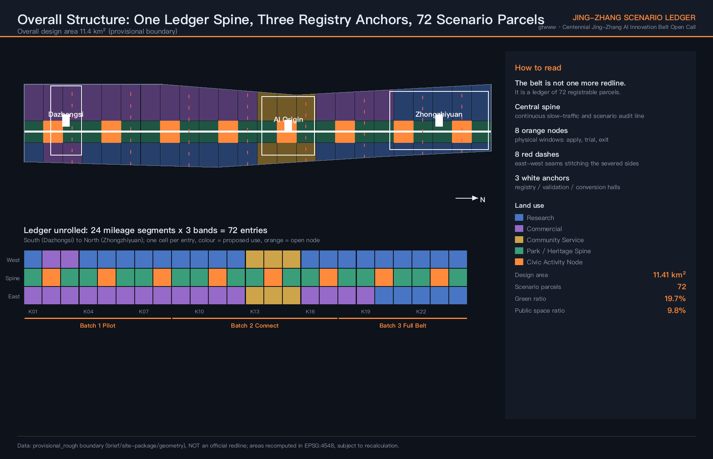
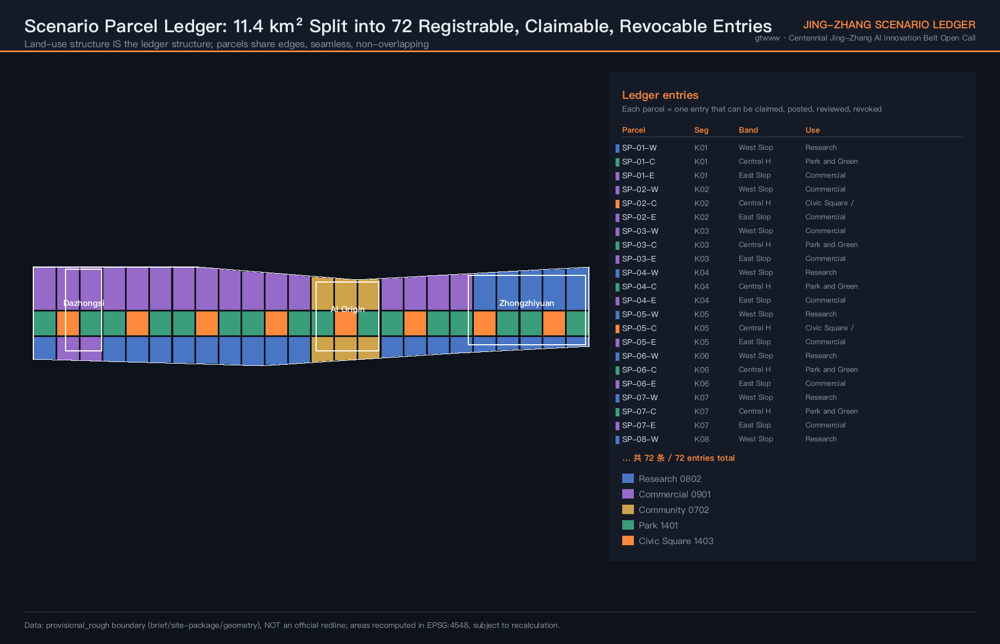
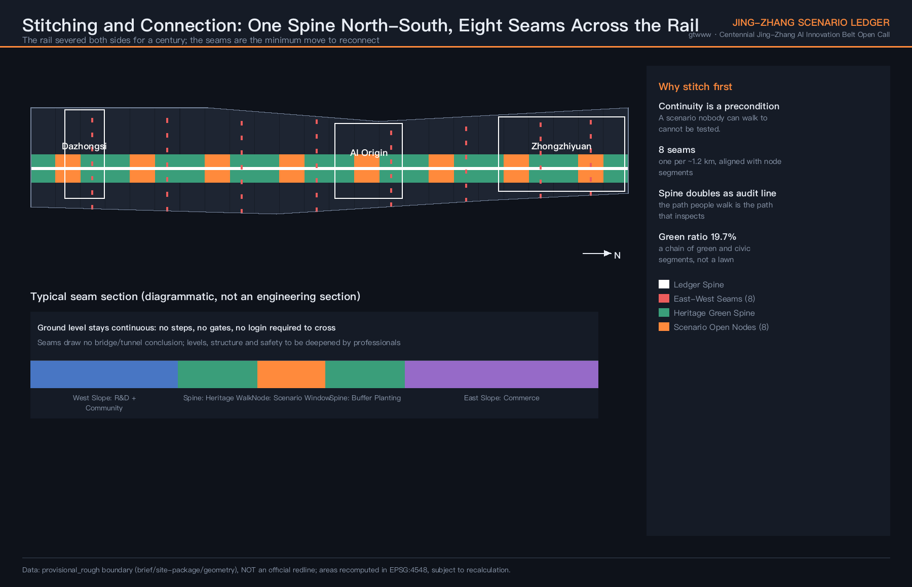
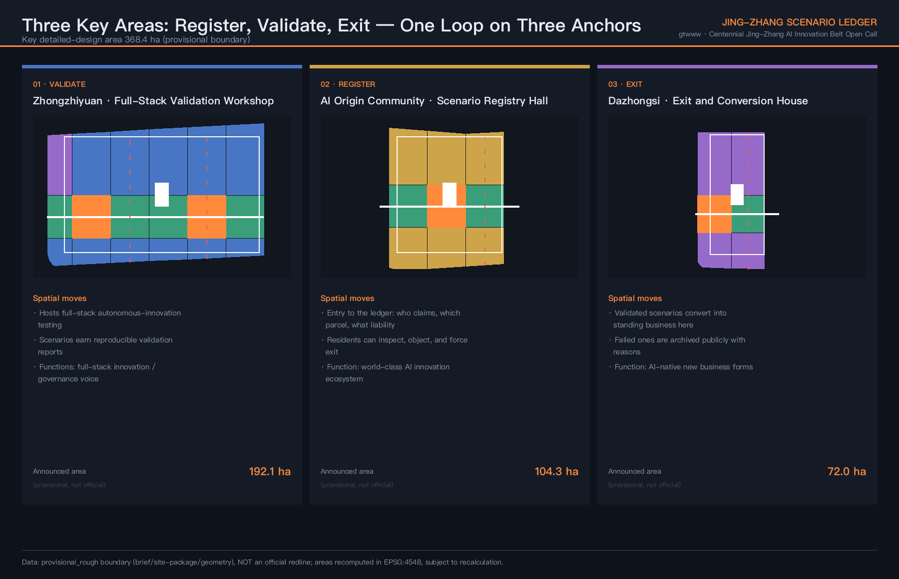
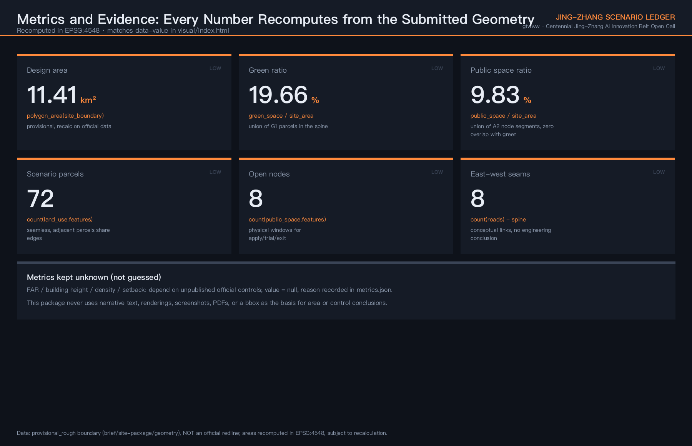

# 京张场景台账 / JING-ZHANG SCENARIO LEDGER

> AI does not fail to enter the city because the technology is immature. It fails because the city has no ledger of where anything may be tried.

This proposal adds no new redline and bets on no single technology. It proposes one operable spatial mechanism: split the overall design area into **72 scenario parcels**, each one a ledger entry that can be claimed, publicly posted, measured, reviewed and revoked; served by **8 scenario open nodes** as physical windows for application and exit, **1 ledger spine** as a continuous slow-traffic and audit line, **8 east-west seams** reconnecting two sides severed by the railway for a century, and **3 anchors** carrying registration, validation and exit conversion. [metric:scenario_parcel_count] [metric:scenario_open_node_count] [depth:overall_spatial_structure]

| Review dimension | This proposal's direct answer | Verifiable evidence |
| --- | --- | --- |
| Objective alignment | Three positionings, five functions, three areas and two wings each attach to the ledger mechanism, not to parallel slogans | Compliance matrix, Ch.7 |
| Planning innovation | Land-use structure IS the ledger structure: 72 parcels, seamless, edge-sharing, zero overlap | land_use.geojson, spatial self-check |
| Industry support | Scenario opening is not a policy statement but a channel with application, pricing, acceptance and exit clauses | Ch.4, Ch.9 |
| Scenario perceptibility | 12 scenario cards, 3 industry validation scenarios, 6 personas each landing on named parcels | Ch.5 |
| Spatial clarity | Every claim points to an `SP-xx-x` parcel id, never to "along the line" or "nearby" | All GeoJSON layers |
| Risk and compliance | FAR, height, density and setback all kept pending official data — not guessed | metrics.json, Ch.11 |
| Expression completeness | Bilingual text, 10 drawings, A3 booklet, A0 boards, offline interactive page | drawings/, visual/ |

## 1. Design Basis and Source List

This proposal takes the prequalification announcement for the Centennial Jing-Zhang AI Innovation Belt urban design open call and the agent-facing open-call taskbook as its task basis [source:OFFICIAL-ANNOUNCEMENT] [source:AGENT-TASKBOOK], and the maintainer-registered provisional geometry, enums, metric ranges and source registry under `brief/site-package/` as its machine-readable basis [source:SITE-PACKAGE].

**An honest statement about the boundary.** The official `SITE_BOUNDARY` and the three `KEY_AREA` redlines are not public. This package uses the repository-registered provisional rough extent, with every geometry marked `official_boundary=false`, `geometry_role=provisional_constraint`, `boundary_precision=provisional_rough` [source:BOUNDARY-SOURCE] [source:KEY-AREA-SOURCE]. This means the areas, ratios and parcel divisions here are **design-model outputs, not statutory conclusions**. Once official data is released, the boundary, land use, green space, public space, metrics and all drawings must be recomputed as a whole rather than patched file by file. [depth:existing_conditions_diagnosis]

Source usage follows the public source registry [source:SOURCE-REGISTRY]: background-only and provisional-only material is never promoted into official boundaries, statutory controls, formal scoring evidence or government commitments. This package uses no non-public planning drawings, internal control indicators or personal data.

## 2. Three-Level Scope Framework

The three levels carry different jobs here — they are not three zoom levels of one drawing [depth:three_level_scope_framework]:

| Level | Area | Question it answers | Role in the ledger |
| --- | --- | --- | --- |
| Coordinated research area | 43.6 km² | How the AI innovation ecosystem organises and allocates resources | **Demand side**: who applies for scenarios |
| Overall design area | 11.4 km² | Spatial structure, land use, mobility, blue-green, renewal sequence | **The ledger itself**: 72 registrable parcels |
| Key detailed-design area | 368.4 ha | Detailed design depth for three districts | **Three service counters**: register, validate, exit |

These are not parallel. The research area determines how many real AI scenarios need to land; the design area determines which cell each one lands on; the key areas determine who receives, who accepts, and who can stop it. [data:geometry/site_boundary.geojson#SITE-001] [metric:site_area_sqm]

## 3. Coordinated Research Area: Industry and Future City Research

### 3.1 The diagnosis

Haidian is short of neither AI companies, nor universities, nor policy statements about opening up scenarios. What is missing is more basic: **a public record that states which parcel, who may test, for how long, and who is liable when something goes wrong**. Without that record, scenario opening degrades in three familiar ways — a framework agreement is signed but never lands on a specific parcel; it lands but has no exit clause, so a pilot becomes permanent occupation; something goes wrong and nobody is accountable, so nobody approves the next one.

### 3.2 Six global cases: borrow the mechanism, not the form

| Case | Verifiable facts (date and source) | Mechanism borrowed | Explicitly not borrowed |
| --- | --- | --- | --- |
| Sidewalk Toronto | In May 2020 the developer announced it would no longer pursue the 12-acre Quayside project; the stated public reason was that pandemic-driven economic uncertainty made the project hard to deliver financially without sacrificing core parts of the plan. The project was accompanied throughout by public controversy over data collection and surveillance [source:CASE-SIDEWALK-TORONTO] | Put data rules and liability boundaries into the same publicly reviewable document as development rights | A single company leading whole-district development |
| Helsinki Kalasatama | Agile pilots coordinated by the city's own innovation unit: roughly EUR 8,000 cap per pilot, up to about six months of real-world testing, around 25 pilots in total [source:CASE-KALASATAMA] | A small-budget, time-boxed, repeatable pilot procurement process | Nordic density and population scale |
| Barcelona Superilles and DECODE | The same city government advanced street-level spatial change from 2016 and separately participated in the EU DECODE citizen data-sovereignty project; the city describes data as part of public infrastructure [source:CASE-BARCELONA] | Spatial change and data rights advancing on the same level of government agenda | The grid-block geometric premise |
| Singapore Punggol Digital District | About 50 hectares, Singapore's first enterprise district; the master developer swaps industry and academia space uses across plots and integrates the Singapore Institute of Technology campus [source:CASE-PUNGGOL] | Validation and conversion space within walking distance, with plot uses kept swappable | Wholly new development land conditions |
| London King's Cross | In August 2019 media disclosed live facial recognition deployed across the 67-acre site; the UK Information Commissioner's Office opened an investigation, and in September 2019 the developer said it was pausing deployment [source:CASE-KINGS-CROSS] | **A negative lesson**: recognition technology in publicly accessible development must be disclosed and accountable before deployment, or it loses both regulator and public trust | Its facial recognition practice |
| Beijing and Haidian incremental renewal | The Beijing Urban Renewal Action Plan (2021-2025) and the Haidian Urban Renewal Guidelines (2025 edition) establish a renewal path centred on existing stock, covering old factories, low-efficiency buildings and industrial parks [source:CASE-ZHONGGUANCUN-RENEWAL] | Retrofit-first renewal, connected to existing funding-support mechanisms | Reducing an innovation district to property leasing |

**Two causal claims this proposal deliberately does not make.** Sidewalk Toronto's stated termination reason was financial and pandemic-related, not a data-governance failure; the data controversy is a documented parallel fact, and this proposal does not assert a causal link between the two. What is borrowed is the judgement that *rules should be public before deployment*, not the claim that *data problems caused the project to fail*. King's Cross is cited solely for the 2019 facial-recognition episode and is not an assessment of that developer today.

**Case sources and usage boundary.** All six sources are registered item by item in `sources.json` with publisher, title, publication or access date, stable link, the specific fact each supports, licence note and limitation. Media-reporting sources are marked `background_only`; institutional and government materials are marked `needs_review`. Until the repository source registry formally reviews them, **none may serve as evidence of official approval, performance, planning fact, or implementation basis for this project** — they support mechanism-level comparison only [source:SOURCE-REGISTRY].

### 3.4 Regional Innovation Synergy: Five Counterparts, Two-Way Flows, Ledger Interfaces

Regional synergy does not stop at the two wings. The table lists five counterparts, the two-way resource flows, and where each attaches to the ledger. **Every relationship below is a conceptual suggestion and represents no established cooperation, confirmed mechanism, or inter-governmental arrangement** [standard:PROJECT-AGENT-OPEN-CALL-TASKBOOK].

| Counterpart | Flows into the belt | Flows out of the belt | Ledger interface (conceptual) |
| --- | --- | --- | --- |
| Beiwei Community | Everyday service demand, real community-side users | Validated community-scale AI service modules and their exit records | Registers as a "neighbouring applicant", sharing the registry hall's posting and objection process |
| Future Science City | Engineering-validation demand in energy, materials and similar fields | Validation methods and acceptance standards produced here | Mutual recognition of validation report formats, so one scenario need not prove itself twice |
| Huairou Science City | Long-cycle research demand from large scientific facilities | City-scale real-operation methods, excluding individual identity | Applies as a research institution for long-cycle parcels, under longer terms and stricter ethics review |
| Beijing E-Town | Volume production and pilot-line capability, low-speed vehicle industrialisation | Validated scenarios ready for production | The exit house hands over to its industrialisation intake; the destination is written into the archived entry |
| Beijing-Tianjin-Hebei | Cross-regional application scenarios and demand for scale trials | The ledger institution template itself | Ledger format and acceptance standards published openly for other regions to adopt |

The purpose of this table is not to announce cooperation but to state **where the interfaces are** when the mechanism extends outward: every external link runs through the existing register-validate-exit loop rather than opening a new channel. Whether any of it is established, who authorises it, and in what form, must be confirmed by the competent authorities and each counterpart.

### 3.3 Innovation ecosystem: eight resources, each with a deliverable object

Land, space, industry, capital, talent, compute, data, scenarios — the eight resources the taskbook requires each map to **an object that can be delivered and inspected**, not to a sentence of assurance:

- **Scenarios**: 72 ledger entries (the core output of this proposal)
- **Space**: physical intake windows at 8 open nodes
- **Data**: each entry's public posting record, review report and exit archive
- **Compute**: shared test environments in the validation workshop, application-based, non-exclusive
- **Land and industry**: land-use suggestions favour retrofit; no demolition conclusion is drawn
- **Capital and talent**: to be determined by professional teams and authorities in later deepening; no commitment made here

**Three things this proposal will not write**: fabricated company lists, investment figures or output values; investment promotion, policy or funding written as settled; unpublished policy written as fact. [standard:PROJECT-OFFICIAL-ANNOUNCEMENT]

## 4. Overall Design Area: Urban Renewal and Regulatory-Plan-Level Urban Design

### 4.1 Structure: 24 mileage segments × 3 bands

Along the Jing-Zhang corridor, the north-south direction is divided into **24 mileage segments** (K01–K24, from Dazhongsi in the south to Zhongzhiyuan in the north) and the east-west direction into **3 bands** (west slope, central heritage green spine, east slope), producing 72 scenario parcels [data:geometry/land_use.geojson#LU-001] [metric:scenario_parcel_count].

Using mileage rather than administrative edges has a concrete reason: the Jing-Zhang railway is itself managed by mileage, and public spaces, crossings and station relationships along it are already ordered that way. Registering scenarios in the same coordinate system aligns the spatial ledger with existing linear management instead of inventing a second numbering system.

The division satisfies three hard requirements, all recomputable from the submitted geometry: **seamless coverage** (zero difference), **shared boundary coordinates** between adjacent parcels, and **zero overlap** between layers. [depth:land_use_layout]

### 4.2 Land-use suggestions

| Band | Suggested use | Parcels | Design intent |
| --- | --- | --- | --- |
| Central heritage green spine | Park 1401 and civic square 1403 | 24 | Heritage corridor and the public interface of scenario opening |
| West slope band | Research 0802 dominant | 24 | Interface to university and institute R&D and validation |
| East slope band | Commercial 0901 dominant | 24 | Interface to conversion, consumption and new business forms |

Parcels inside the key areas adjust by role: Zhongzhiyuan is research-dominant, the AI Origin Community is community-service dominant so that resident services are not squeezed out by industry, and Dazhongsi is commercial-dominant. [data:geometry/land_use.geojson#LU-036]

### 4.3 Retain, renovate, demolish: this proposal says retain and renovate only

All three anchor buildings are proposed as **retrofit-first**. No demolition conclusion is drawn and no specific land-ownership parcel is touched [depth:retain_renovate_demolish]. The reason is not caution: the value of a scenario ledger is fast onboarding and fast exit, and retrofit costs far less time and sunk capital than new build. A mechanism with a two-to-three-year trial cycle does not deserve a building that takes five years to complete.

### 4.4 Intensity and height: pending official data

FAR, building height, density and setback are given **no values**. They stay pending in `metrics.json` with the reason recorded: they depend on official control conditions that are not public [depth:development_intensity_controls] [depth:height_massing_character]. Producing numbers without statutory control conditions would be packaging a guess as a conclusion. The metric stays pending in the table [metric:floor_area_ratio].

## 5. AI Innovation Ecosystem, Personas, and AI+ Scenarios

### 5.1 Six personas

| Persona | Actual situation | What the ledger solves |
| --- | --- | --- |
| Graduate researcher | Has an algorithm, no site, no legal place to test | A public list of claimable parcels and low-threshold intake |
| Startup technical lead | Six months of talks, stuck because nobody will sign | A named receiving body, a term, and acceptance clauses |
| Resident along the line (incl. older adults) | "Smartened" without being asked | Posting, objection and forced-exit channels; non-digital equivalents |
| Frontline district or park manager | Liable if it fails, so inclined not to approve | Liability written on the entry: traceable and defensible |
| Corporate scenario partnership lead | Needs a reproducible validation report to get budget | Standardised assessment from the validation workshop |
| Visiting developer or researcher | Wants to see urban AI running, only finds showrooms | Live scenarios reachable on foot along the spine |

### 5.2 Twelve scenario cards

Scenario cards use one eight-field structure: host parcel or space type, applicant and responsible body type, input and output, human review point, non-digital equivalent path, data minimisation and retention rule, stop or exit trigger, and acceptance indicator. It is split into two tables for readability; the same number maps across both. **All scenarios are conceptual suggestions and do not represent approved operations; body types are role categories and name no supplier.**

**Table A — Scenario, space and responsibility**

| No. | Scenario | Host parcel / space type | Applicant and responsible body type | Input → Output |
| --- | --- | --- | --- | --- |
| S01 | Accessible wayfinding on the heritage walk | Spine K03–K08 park segments | Public service operator with an accessibility organisation | Public network and facility status → voice and physical signage dual channel |
| S02 | Low-speed delivery robot right-of-way trial | East slope K10–K13 commercial parcels | Company applicant, operator jointly liable | Bounded time-space conditions → delivery paths and safety event records |
| S03 | Community health service navigation | AI Origin Community service parcels | Local medical institution | Public booking and department data → booking guidance and routing, no diagnosis |
| S04 | After-the-fact operational review | Whole spine (audit line) | Public space operator | Aggregated retrospective records → periodic operations review report |
| S05 | Enterprise service copilot | Zhongzhiyuan research parcels | Government service intake body | Public policy texts and filings → search results and pre-check drafts |
| S06 | Jing-Zhang cultural guide | Whole spine and square nodes | Cultural operator with a historical review body | Vetted historical text → layered guide content |
| S07 | Adaptive night lighting | 8 civic square node segments | Municipal facility operator | Anonymous density and illuminance readings → lighting level suggestions |
| S08 | Open compute and test environment booking | Zhongzhiyuan validation workshop | Ledger operator, open to all applicants | Capacity and queue → time-slot allocation |
| S09 | Accessibility repair and work-order loop | Whole area including staffed counters | Facility maintenance body | Multi-channel repair reports → work orders and response-time records |
| S10 | Heritage structure inspection assistance | Spine structures | Heritage protection authority | Inspection imagery and human records → anomaly alerts, no structural conclusion |
| S11 | Micro-retail siting assistance | East slope commercial parcels | Commercial operator | Public business and footfall distribution → advisory siting reference |
| S12 | Public ledger query and objection filing | 8 nodes, online, and paper counters | Ledger operator | Entry status and postings → query results and objection receipts |

**Table B — Review, data, exit and acceptance**

| No. | Human review point | Non-digital equivalent | Data minimisation and retention | Stop / exit trigger | Acceptance indicator |
| --- | --- | --- | --- | --- | --- |
| S01 | Content and routes signed off by an accessibility officer | Physical signage and tactile paving suffice alone | No identity captured; anonymous path counts, retention ≤90 days | Error rate over threshold, or signage failure | Completion and error rate with real visually impaired and older participants |
| S02 | A named steward per shift who can take over instantly | Pedestrian and cycle passage unaffected | Path and event logs only; no individual features retained | Any personal-injury event stops the whole line | Zero safety events and reproducible yielding behaviour |
| S03 | Clinical staff can override every guidance result | Human triage desk and phone booking are equivalent | No health data retained; anonymous session counts only | Any medical-sounding statement appears | Guidance accuracy, and the staffed counter not displaced |
| S04 | Report signed by the operations lead before release | Paper patrol and log books run in parallel | Aggregates only, no individual tracks; raw records ≤30 days | Any output that identifies an individual | Reproducible review with no individual inferable |
| S05 | A person still signs; drafts carry no legal effect | Counter service and paper filing equally accepted | Filings never enter model training; sessions ≤30 days | Drafts treated as an intake decision | First-pass filing rate, with human sign-off kept at 100% |
| S06 | Historical content vetted before publication | Physical interpretation boards and printed guides | No visitor identity; anonymous view counts | Any unvetted historical statement | 100% vetting coverage and a public correction loop |
| S07 | Baseline lighting set by people and not algorithm-overridable | A physical switch restoring fixed mode | Anonymous density values only, no imagery, ≤7 days | Illuminance below baseline, or switch failure | 100% baseline illuminance compliance |
| S08 | Allocation appealable and re-reviewed by the operator | Counter and phone booking are equivalent | Application and occupancy records only | Exclusive holding or non-release | Turnover rate and appeal response time |
| S09 | Overdue orders escalate to a named owner | Phone and paper orders fully equivalent | Location and status only | Closure rate below the agreed level | Closure rate and mean handling time |
| S10 | Every alert read by heritage professionals | Routine human inspection is not reduced | Imagery of structures only, ≤180 days | Alerts cited as a safety conclusion | Alert precision, with human inspection not displaced |
| S11 | Output marked advisory and barred from approvals | Public data can be consulted directly | Public statistics only; no merchant business data | Cited as an approval or entry basis | User awareness rate and zero misuse |
| S12 | Every objection answered by a named person, on the clock | Paper filing and on-site registration equivalent | Filer details used only to reply, then de-identified | Any objection past its deadline | On-time objection reply rate and archive completeness |

**Privacy and human-review boundary (applies to every card)**: no live facial recognition or individual profiling; no face scan, registration or app install as a precondition for using public space; every scenario must have an equivalent path completable without a digital device; every scenario must have a named human reviewer and a working stop switch. [standard:PROJECT-AGENT-OPEN-CALL-TASKBOOK]

### 5.3 Three industry validation scenarios

1. **Low-speed autonomous delivery validation segment** (east slope K10–K13): enclosed trial with limited right-of-way, hours and speed, producing a reproducible safety and efficiency report.
2. **Accessible navigation validation loop** (spine K03–K08): tested with real older and visually impaired users, verifying consistency between voice guidance and physical signage.
3. **Public-space operations data validation bench** (8 nodes): verifying whether lighting, cleaning and safety dispatch decisions can be supported without collecting individual identity.

All three share one acceptance standard: **reproducible, revocable, and understandable by non-specialists**. Anything failing the third is not published.

## 6. Detailed Design of Key Areas

The three key areas are not three parallel functional zones but three stages of one operating loop [depth:three_key_area_detailed_design].

**Zhongzhiyuan AI Acceleration Area · Full-Stack Validation Workshop** (announced area approx. 192.1 ha) [data:geometry/key_areas.geojson#PROV-KEY-001]

Hosts the testing stage of the full-stack autonomous innovation system. Spatial move: research-dominant parcels organise shared test environments, with an outward-facing display interface for the validation process along the spine — **the validation process itself is visitable**, which is the cheapest way to turn "autonomous innovation" from a slogan into something witnessable.

**Beijing AI Origin Community · Scenario Registry Hall** (announced area approx. 104.3 ha) [data:geometry/key_areas.geojson#PROV-KEY-002]

The entrance to the ledger. Any AI scenario entering this belt must first register here: applicant, target parcel, responsible body, term, exit condition, objection channel. Placing the hall in a **community** rather than a park is deliberate: when residents and applicants transact in the same room, an objection stops being an email nobody reads. Parcels here are community-service dominant so that daily resident services are not squeezed out.

**Dazhongsi AI Industry Cluster · Exit and Conversion House** (announced area approx. 72.0 ha) [data:geometry/key_areas.geojson#PROV-KEY-003]

The exit. Validated scenarios convert into standing business here; failed ones are **publicly archived with reasons stated**. Publishing failure records is the most uncomfortable and most essential part of this mechanism: a pilot list without a failure archive is a marketing document.

## 7. Land Use, Building Scale, and Retain-Renovate-Demolish Strategy

Land-use suggestions are in 4.2 (the three-band structure); building scale stays pending official control conditions; the retain-renovate-demolish position is in 4.3 — all three anchor buildings are proposed as retrofit-first with no demolition conclusion [depth:retain_renovate_demolish]. What follows is where the six taskbook requirements land.

### 7.1 Naming, logo and identity system (agent.1)

**Chinese name: 京张场景台账. English name: Jing-Zhang Scenario Ledger.**

The name takes an action, not an image. A ledger is the standard term in asset and liability management for a continuously updated, checkable record with a named owner. It is used here because a record of exactly that kind is what this proposal delivers — not a vision.

Identity direction (for professional teams to deepen; not a final visual):

- **Base figure**: a horizontal strip of equal-width cells, variable in count, corresponding to registrable parcels; extensible as the shared motif for signage, wayfinding, boards and page headers.
- **Colour**: dark ground, ledger orange (open nodes), heritage green (spine), seam red (east-west links). The dark ground is a functional choice — the corridor is used heavily at night, and dark signage reads better in low light.
- **Application**: each parcel's physical sign shows the parcel id, current entry status and a query entry point. The sign is the ledger's offline terminal.
- **Copyright**: no unlicensed fonts, trademarks, images or corporate marks; all graphics generated by this proposal.

### 7.2 Three positionings, five functions, three areas and two wings (agent.1)

| Taskbook element | Position in the ledger mechanism |
| --- | --- |
| Centennial Jing-Zhang Culture Belt | Cultural narrative and guiding carrier across 24 spine parcels |
| Urban AI Life Experience Belt | Perceptible scenario interface at 8 node segments |
| AI Integrated Innovation Belt | Industrial interface: west-slope R&D and east-slope conversion |
| Full-stack autonomous AI innovation system | Zhongzhiyuan validation workshop |
| World-class AI innovation ecosystem | AI Origin Community registry hall |
| New paradigm of AI+ scenario empowerment | 12 scenario cards and the opening channel |
| Intelligent, vibrant AI city | Spine continuity and 8 seams |
| Global voice in AI governance | The public ledger itself: a citable, copyable governance sample |
| Zhongguancun technology service wing | Demand side: applicant sources and resource allocation |
| Xiaoyuehe scenario empowerment wing | Diffusion channel for scenario spillover and validation results |

**Both wings lie inside the coordinated research area and outside the overall design area**; they are described as coordination relationships, with no spatial design conclusion drawn for them.

### 7.3 Three AI pilgrimage landmarks and the honour display system (agent.4)

1. **Registry Stele** (AI Origin Community): physically records the first batch of scenarios entering the ledger with their contributor identifiers, including GitHub IDs and Agent names. The stele extends as entries accumulate.
2. **Validation Gallery** (Zhongzhiyuan): a continuous interface along the spine showing validations in progress and their reproducible results, including those that failed.
3. **Exit Archive Wall** (Dazhongsi): publicly displays retired scenarios and the reasons. **Keeping failure in the most visible position** is what separates this belt from any achievement showroom.

All three are conceptual public-space structures. They involve no alteration of protected heritage fabric and draw no structural, bridge, tunnel or engineering feasibility conclusion [depth:blue_green_public_space].

### 7.4 Cultural narrative (agent.5)

The Jing-Zhang railway was the first trunk line designed and built by Chinese engineers. This proposal holds to one line culturally: **tell the engineering decisions, not the legend.** Zhan Tianyou faced real gradient, funding and schedule constraints and left a checkable record of technical choices. The AI scenarios on this belt should leave a checkable record of their decisions too. What the three cultural layers — railway engineering, Zhongguancun innovation, and new AI culture — actually share is **keeping records**, not any particular temperament.

Wayfinding direction: a unified format of parcel id, status and query entry, bilingual, designed for low light and accessible reading. The cultural sign system is kept separate from the belt's overall logo system. Historical content requires expert review before publication; this proposal asserts no historical detail.

### 7.5 Event system and long-term operation (agent.6)

Events are only the ledger's public interface; the substance of operation is the continuous updating of entry status. If events stop, the ledger still stands; if the ledger stops updating, events are only scenery. So the operating rules come first here, the events second.

**⚠️ Every role, deadline, gate and indicator below is a conceptual operating suggestion. Intake-body eligibility, stop authority, liability relief, funding and staffing all require authorisation by the competent authorities. Nothing here constitutes a settled government arrangement, funding commitment or allocation of duties.**

**RACI across seven stages (R execute / A accountable / C consulted / I informed)**

| Stage | Applicant | Ledger operator | Community and public | Technical review | Competent authority | Third-party audit |
| --- | --- | --- | --- | --- | --- | --- |
| Intake | R | A | I | C | I | — |
| Public posting | I | R/A | C | I | I | I |
| Objection reply | C | R | R (raises) | C | A | I |
| Technical review | C | C | I | R | A | I |
| Stop | I | R | C (may initiate) | C | A | I |
| Archive | C | R/A | I | C | I | C |
| Conversion | R | C | I | C | A | I |

The public is R rather than I on objections: objections are raised by the public and must be answered. That is a design premise of this mechanism, not a consultation step.

**Suggested service deadlines and stage gates**

| Stage | Suggested deadline | Stage gate (no passage without it) |
| --- | --- | --- |
| Intake | Accept or return for correction within 10 working days | Responsible body, target parcel, term, exit condition and reviewer all present |
| Public posting | Posted on wall and online within 5 working days; posting period at least 15 days | Posting includes the non-digital path and the data rule |
| Objection reply | Named reply within 10 working days of receipt | No trial may begin while an objection is unanswered |
| Technical review | Report within 20 working days of trial end | Report is reproducible and intelligible to non-specialists |
| Stop | Immediate on trigger; reason posted within 48 hours | Stop is recorded in the entry; no quiet restart |
| Archive | Public archive within 15 working days of exit | Failures state the reason; "ended" alone is not accepted |
| Conversion | Applied for separately; never an automatic continuation of a trial | Conversion re-enters intake and posting |

**Suggested indicators (KPI)**

| Indicator | Definition | Why measure it |
| --- | --- | --- |
| On-time objection reply rate | Named replies on time ÷ total objections | Whether the public can actually constrain a scenario is the floor this mechanism stands on |
| Archive completeness | Archives stating a reason ÷ total exits | A list reporting only successes carries no information |
| Non-digital path availability | Audited scenarios completable without a device ÷ total scenarios | Prevents public service being gated behind a digital threshold |
| Parcel turnover | Parcels completing enter-and-exit in the period ÷ total parcels | The ledger's value is that things can leave, not that it is full |
| Stop response time | Median time from trigger to actual stop | A mechanism that cannot stop is not under control |
| Conversion retention | Conversions still running after one year ÷ total conversions | Separates real business from one-off demonstrations |

**Rollback rules**

- Once a scenario is stopped, its parcel returns to claimable status, and the same applicant may not re-apply for the same scenario for six months.
- If on-time objection reply falls below the agreed level for two consecutive batches, new intake pauses until the process is repaired.
- If the ledger system itself is unavailable, intake and objections fall back to paper counters with deadlines unchanged — **the mechanism's availability does not depend on its information system**.
- The competent authority may halt any scenario at any time without giving a technical reason, but must post that decision.

**Annual event system**

- **Ledger Open Day**: publish every entry added, under validation and exited this year, and take public questions.
- **Scenario Opening Season**: open a batch of parcels for application on a predictable rhythm.
- **Validation Results Release**: publish only reproducible results, including failures.
- **Developer and Agent contributor mechanism**: contributions recorded, citable, traceable to specific entries.

Funding, host and frequency for these events are likewise unconfirmed and constitute no settled arrangement.

## 8. Transport, Rail, Municipal Infrastructure, and Public Services

The spine is a continuous slow-traffic and scenario audit line running the full length of the design area; 8 east-west seams sit roughly every 1.2 km, aligned with node segments [data:geometry/roads.geojson#ROAD-001] [metric:east_west_seam_count]. **The seams draw no bridge or tunnel form, level, structure or engineering feasibility conclusion**; methods are for professional teams to deepen once rail, municipal and safety conditions are available [depth:traffic_rail_slow_parking].

Continuous ground-level access is a hard requirement: no steps, no gates, no login needed to cross. Municipal and new infrastructure follow the node segments in shared rather than exclusive configuration [depth:municipal_new_infrastructure]. Public service facilities are secured through community-service land in the AI Origin Community segment and are not displaced by industrial functions.

## 8.5 Blue-Green Network, Public Space, and Urban Character

The central heritage spine is not one continuous lawn but a sequence alternating 16 park parcels with 8 civic square parcels [depth:blue_green_public_space]. There is an operational reason for this: a continuous lawn has only one management state, maintenance. Once green and square segments alternate, the square segments can carry scenario trials, public postings, markets and temporary events while the green segments carry rest and ecology — each with a clear owner and its own rules, so neither crowds the other out.

Green ratio is 19.66% and public space ratio 9.83%. Both recompute directly from the submitted geometry, and because the two layers have zero geometric overlap they can be added without double counting [metric:green_ratio] [metric:public_space_ratio]. The limit must be stated: both numbers rest on a provisional rough boundary and are design-model outputs, not statutory indicators. Once the official boundary and green line are released they must be recomputed as a whole, and this proposal does not use them as compliance conclusions.

Urban character here does not rest on facade control but on one visible fact: **roughly every 1.2 km along the spine there is a scenario running that you can walk into**. The character of a belt is set by the state it is usually in, not by a materials schedule or a colour chart. This proposal therefore sets no facade, material, colour or height control — those depend on unpublished official conditions and are not the real variable in this mechanism. Character management rests on three things instead: the alternating rhythm of green and square along the spine, whether the open state of node segments is visible, and whether signage consistently shows parcel id and entry status.

## 9. Renewal Projects, Implementation Policy, and Phasing

| Batch | Segments | Content | Basis |
| --- | --- | --- | --- |
| Batch 1 · Pilot | K01–K08 | Registry hall, exit house, 2 nodes, 2 seams | Prove "can register, can exit" before discussing scale |
| Batch 2 · Connect | K09–K17 | Spine continuity, 3 nodes, 3 seams, validation workshop | Scenarios only get real use once continuity exists |
| Batch 3 · Full belt | K18–K24 | Remaining nodes and seams, three landmarks built | Fix things in place only after the mechanism is stable |

Phasing layer at [data:geometry/phasing.geojson#PHASE-001]; implementation and project-list depth at [depth:phasing_implementation] [depth:renewal_project_list].

Phasing follows **mechanism maturity**, not investment scale: if Batch 1 fails to prove the apply-and-exit loop, spatial investment in the later batches becomes sunk cost. This list is a conceptual sequence suggestion and constitutes neither an investment commitment nor an approved construction schedule.

## 10. Metrics, Area Recalculation, and Compliance Matrix

| Metric | Value | Formula | Confidence |
| --- | --- | --- | --- |
| Overall design area | 11,412,825.386 m² | `polygon_area(site_boundary)` | low (provisional boundary) |
| Green ratio | 19.66% | `green_space / site_area` | low |
| Public space ratio | 9.83% | `public_space / site_area` | low |
| Scenario parcels | 72 | `count(land_use.features)` | low |
| Scenario open nodes | 8 | `count(public_space.features)` | low |
| East-west seams | 8 | `count(roads) − spine` | low |
| FAR, height, density, setback | **pending official data** | Depend on unpublished official controls | — |

All areas are recomputed in EPSG:4548 and match the `data-value` declarations in `visual/index.html` [metric:site_area_sqm] [metric:green_ratio] [metric:public_space_ratio]. Recomputation method at [depth:metrics_recalculation]. Green space and public space have **zero geometric overlap**, so the two ratios can be added directly with no double counting.

## 11. Risk, Copyright, and Compliance

**Nature of this proposal**: an open co-creation suggestion. It does not replace professional planning and does not bypass government review or statutory approval [standard:MOHURD-URBAN-DESIGN-MEASURES] [standard:MOHURD-CONTROL-DETAILED-PLANNING].

**Known risks and data gaps** [depth:risk_missing_data]:

- Official boundaries and the three key-area redlines are not public; all spatial conclusions are provisional model outputs and must be recomputed as a whole.
- Official control conditions (FAR, height, density, setback) are not public; this proposal neither guesses nor fills them.
- Rail, municipal, ownership and heritage-protection data were not obtained; seam and anchor positions are diagrammatic and draw no engineering conclusion.
- Feasibility of the ledger mechanism depends on the authorisation of a receiving body and a division of liability. That is institutional design and requires confirmation by the competent authorities.

**Copyright and generation disclosure**: all text, geometry, drawings and web pages in this package were generated by Claude Opus 5 running through Claude Code, contributed under the GitHub account gtwww. Drawings were plotted with Pillow directly from the submitted GeoJSON, using no third-party images, out-of-licence font resources, trademarks, likenesses or corporate marks. Case information is drawn from public reporting and public research material and is used only for mechanism-level reference.

**Not asserted anywhere**: company lists, investment amounts, output values, fiscal or investment-promotion commitments, policy arrangements, engineering feasibility, ownership disposition, demolition conclusions, approval outcomes.

## 12. References

- Prequalification announcement, Centennial Jing-Zhang AI Innovation Belt urban design international open call [source:OFFICIAL-ANNOUNCEMENT]
- Agent-facing open-call taskbook extract [source:AGENT-TASKBOOK]
- Repository site package and public source registry [source:SITE-PACKAGE] [source:SOURCE-REGISTRY]
- Provisional boundary and key-area geometry [source:BOUNDARY-SOURCE] [source:KEY-AREA-SOURCE]
- Professional standard responses in `standard_matrix.json`, design depth in `design_depth_matrix.json`, task coverage in `compliance_matrix.json`
