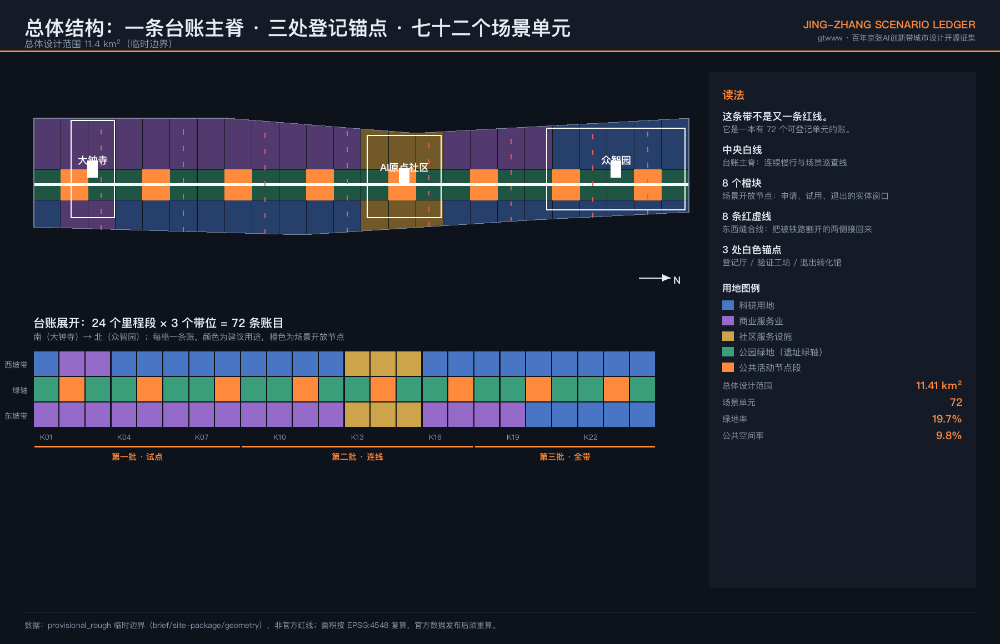
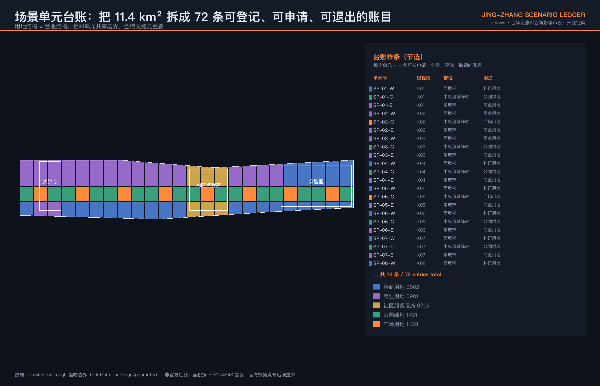
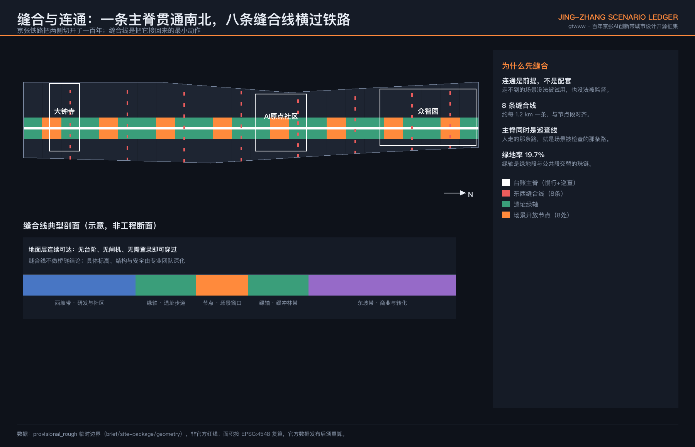
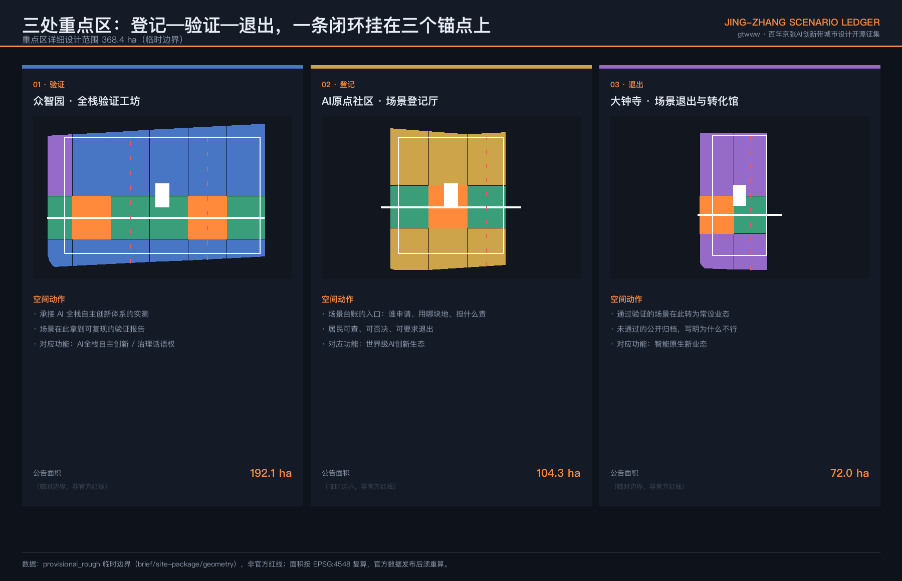
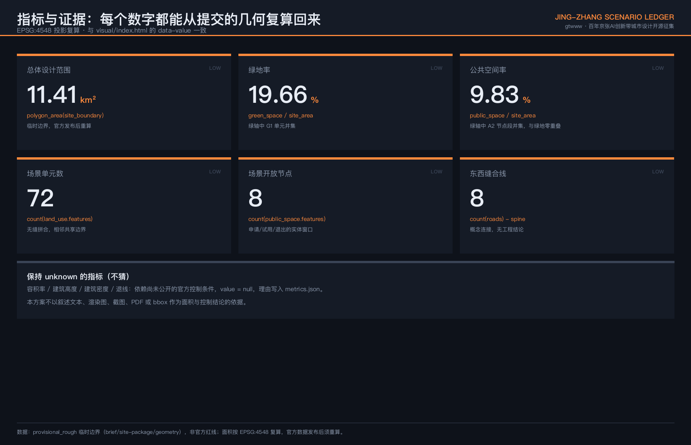

# 京张场景台账 / JING-ZHANG SCENARIO LEDGER

> AI 进不了城市，不是技术不成熟，是城市没有一张「哪里可以试」的账。

本方案不新增一条红线，也不押注某项技术。它提出一个可运行的空间机制：把总体设计范围拆成 **72 个场景单元**，每个单元是一条可被申请、公示、计量、评估和撤销的账目；配 **8 处场景开放节点**作为申请与退出的实体窗口、**1 条台账主脊**作为连续慢行与巡查线、**8 条东西缝合线**把被铁路割开一百年的两侧接回来、**3 处锚点**分别承担登记、验证与退出转化。[metric:scenario_parcel_count] [metric:scenario_open_node_count] [depth:overall_spatial_structure]

| 评审维度 | 本方案的直接回答 | 可核验证据 |
| --- | --- | --- |
| 目标契合度 | 三大定位、五大功能、三区两翼逐条挂到台账机制上，不做并列口号 | 合规矩阵、第 7 章 |
| 规划创新性 | 用地结构即台账结构：72 单元无缝拼合、相邻共享边界、全域零重叠 | land_use.geojson、空间自检 |
| 产业支撑度 | 场景开放不是政策表态，而是一条有申请、计价、验收和退出条款的通道 | 第 4 章、第 9 章 |
| 场景可感知度 | 12 张场景卡、3 个产业测试验证场景、6 类用户画像各自落到具体单元 | 第 5 章 |
| 空间明确性 | 每个主张都指向一个 `SP-xx-x` 单元号，不停留在"沿线""周边" | 全部 GeoJSON 图层 |
| 风险与合规 | 容积率、建筑高度、密度、退线一律保持待补齐状态，不猜 | metrics.json、第 11 章 |
| 表达完整度 | 中英双语正文、10 张图纸、A3 文册、A0 展板、离线交互页 | drawings/、visual/ |

## 1. 设计依据与资料清单

本方案以《百年京张AI创新带城市设计国际方案征集资格预审公告》和面向智能体的开源征集任务书为任务依据 [source:OFFICIAL-ANNOUNCEMENT] [source:AGENT-TASKBOOK]，以 `brief/site-package/` 中经维护者登记的临时几何、枚举、指标范围和来源清单为机器可读依据 [source:SITE-PACKAGE]。

**关于边界的诚实交代。** 官方 `SITE_BOUNDARY` 与三处 `KEY_AREA` 红线尚未公开。本包使用仓库登记的临时粗略范围，所有几何标注 `official_boundary=false`、`geometry_role=provisional_constraint`、`boundary_precision=provisional_rough` [source:BOUNDARY-SOURCE] [source:KEY-AREA-SOURCE]。这意味着：本方案的面积、比例和单元划分是**设计模型输出**，不是法定结论；官方数据发布后，边界、用地、绿地、公共空间、指标和全部图纸必须整体重算，而不是替换单个文件。[depth:existing_conditions_diagnosis]

资料使用边界遵循公开来源登记表 [source:SOURCE-REGISTRY]：不把背景资料或临时资料升级为官方边界、法定控规、正式评分依据或政府实施承诺。本包未使用任何非公开规划图件、内部控制指标或个人数据。

## 2. 三层范围工作框架

公告确定的三层范围在本方案中承担不同职责，不是同一张图的三种比例 [depth:three_level_scope_framework]：

| 层级 | 面积 | 本方案承担的问题 | 台账中的角色 |
| --- | --- | --- | --- |
| 统筹研究范围 | 43.6 km² | AI 创新生态如何组织、要素如何配置 | **台账的需求侧**：谁来申请场景 |
| 总体设计范围 | 11.4 km² | 空间结构、用地、交通、蓝绿、更新时序 | **台账本体**：72 个可登记单元 |
| 重点区域范围 | 368.4 ha | 三处片区的详细设计深度 | **台账的三个办事窗口**：登记、验证、退出 |

三层不是并列关系。统筹研究范围决定有多少真实的 AI 场景需要落地，总体设计范围决定这些场景落在哪一格上，重点区域决定这件事由谁受理、谁验收、谁叫停。[data:geometry/site_boundary.geojson#SITE-001] [metric:site_area_sqm]

## 3. 统筹研究范围产业与未来城市研究

### 3.1 问题判断

海淀不缺 AI 企业，不缺高校院所，也不缺开放场景的政策表态。缺的是一件更基础的东西：**一份说得清"哪块地、谁能试、试多久、出了事谁负责"的公开记录**。没有这份记录时，场景开放会退化成三种常见形态——签了框架协议但落不到具体地块；落到地块但没有退出条款，试点变成永久占用；出了问题无人可问责，于是下一次没人敢批。

### 3.2 六个全球案例：只借机制，不搬形象

| 案例 | 可查事实（时间与出处） | 借用的机制 | 明确不借 |
| --- | --- | --- | --- |
| 多伦多 Sidewalk Toronto | 2020 年 5 月开发方宣布不再推进 12 英亩 Quayside 项目，其公开理由是疫情下的经济不确定性使项目难以在不牺牲核心内容的前提下实现财务可行；该项目全程伴随数据采集与监控的公开争议 [source:CASE-SIDEWALK-TORONTO] | 把数据规则与责任边界，和空间开发权写进同一份可公开审阅的文件 | 由单一企业主导整片街区开发 |
| 赫尔辛基 Kalasatama | 由市属创新单位协调的敏捷试点：单个试点经费上限约 8000 欧元，实地试验期最长约 6 个月，累计约 25 个试点 [source:CASE-KALASATAMA] | 小额、限期、可复制的试点采购流程 | 北欧的密度与人口规模 |
| 巴塞罗那 Superilles 与 DECODE | 同一市政府自 2016 年起推进街区空间改造，并另行参与欧盟 DECODE 市民数据主权项目；市政府将数据表述为公共基础设施的一部分 [source:CASE-BARCELONA] | 空间改造与数据权利在同一层级政府议程上并行推进 | 棋盘格街区的几何前提 |
| 新加坡 Punggol Digital District | 约 50 公顷，新加坡首个 enterprise district；总开发商在不同地块间调换产业与学术空间用途，并与新加坡理工大学校园整合 [source:CASE-PUNGGOL] | 验证空间与转化空间步行可达，且地块用途保留可调换的弹性 | 全新开发的用地条件 |
| 伦敦 King's Cross | 2019 年 8 月经媒体披露该 67 英亩场地部署实时人脸识别，英国信息专员办公室展开调查，同年 9 月开发方表示暂停部署 [source:CASE-KINGS-CROSS] | **反面教训**：公共可达的开发区部署识别类技术，必须先有公开告知与问责，否则监管与信任双失 | 其人脸识别做法 |
| 北京与海淀存量更新 | 《北京市城市更新行动计划（2021—2025年）》与《海淀区城市更新导则（2025年版）》确立以存量更新为主的政策路径，含老旧厂房、低效楼宇与产业园区改造提升方向 [source:CASE-ZHONGGUANCUN-RENEWAL] | 存量改造优先，并与既有资金支持机制衔接 | 把创新街区简化为物业招商 |

**关于两处容易说错的因果，本方案的表述边界如下。** Sidewalk Toronto 的公开终止理由是财务与疫情，不是数据治理失败；数据争议是全程伴随的公共事实，两者不构成本方案断言的因果关系。本方案从中借用的是"规则应当先于部署公开"这一判断，而不是"因为数据问题所以项目失败"这一论断。King's Cross 作为反面案例引用，仅针对 2019 年该次人脸识别部署事件，不构成对该开发主体现状的评价。

**案例来源与用途边界。** 六条来源已逐项登记进 `sources.json`，含发布者、标题、发布或访问日期、稳定链接、所支持的具体事实、许可说明与限制。其中媒体报道类标注为 `background_only`，机构与政府公开材料标注为 `needs_review`——在仓库来源登记表正式审核前，**均不得作为官方批准、绩效、规划事实或本项目实施依据**，仅用于机制层面的比较与借鉴 [source:SOURCE-REGISTRY]。

### 3.4 区域创新协同：五个对象、双向要素流与台账接口

任务书要求的区域协同不止于两翼。下表列出五类协同对象的双向要素流与其在台账机制中的接口。**表中所有协同关系均为概念建议，不代表已建立的合作、已确认的机制或任何政府间安排** [standard:PROJECT-AGENT-OPEN-CALL-TASKBOOK]。

| 协同对象 | 流向本带 | 流出本带 | 台账接口（概念建议） |
| --- | --- | --- | --- |
| 北纬社区 | 生活性服务场景需求、社区侧真实使用者 | 已验证的社区级 AI 服务模块与其退出记录 | 以"邻近社区申请人"身份登记，共用登记厅的公示与异议流程 |
| 未来科学城 | 能源、材料等领域的工程化验证需求 | 本带产出的场景验证方法与验收口径 | 互认验证报告格式，避免同一场景在两地重复举证 |
| 怀柔科学城 | 大科学装置侧的长周期研究需求 | 城市尺度的真实运行数据方法（不含个体身份） | 以研究机构身份申请长周期单元，适用更长的期限与更严的伦理复核 |
| 北京经开区 | 量产与中试能力、低速载具等产业化通道 | 通过验证、具备量产条件的场景清单 | 退出转化馆对接其产业化受理，转化去向写入账目归档 |
| 京津冀 | 跨区域应用场景与规模化试用需求 | 可复制的台账制度模板本身 | 台账格式与验收口径开源发布，供其他区域自行采用 |

这张表的作用不是宣告合作，而是说明**台账机制向外扩展时的接口在哪里**：所有对外协同都通过"登记—验证—退出"这条既有闭环发生，不新设通道。是否成立、由谁授权、以何种形式落地，须由主管部门与各方确认。

### 3.3 创新生态：八类要素，各自有一个可交付对象

土地、空间、产业、资金、人才、算力、数据、场景——任务书要求的八类要素，在本方案中各自对应一个**可以交付、可以被检查的对象**，而不是一句保障承诺：

- **场景**：72 条台账账目（本方案核心产出）
- **空间**：8 处开放节点的实体受理窗口
- **数据**：每条账目的公示记录、评估报告与退出归档
- **算力**：验证工坊内的共享测试环境，申请制、非独占
- **土地与产业**：用地建议以存量改造为主，不提出拆除结论
- **资金与人才**：由专业团队与主管部门在后续深化中确定，本方案不作承诺

**这三条本方案不写**：不编造企业名单、投资额或产值；不把招商、政策、资金写成已确定事项；不把未公开政策写成事实。[standard:PROJECT-OFFICIAL-ANNOUNCEMENT]

## 4. 总体设计范围城市更新与控规深度城市设计

### 4.1 结构：24 个里程段 × 3 个带位

沿京张铁路走廊南北方向划分 **24 个里程段**（K01–K24，南起大钟寺、北至众智园），东西方向划分 **3 个带位**（西坡带、中央遗址绿轴、东坡带），交叉得到 72 个场景单元 [data:geometry/land_use.geojson#LU-001] [metric:scenario_parcel_count]。

采用里程段而非行政边界分格，有一个具体理由：京张铁路本身按里程管理，沿线的公共空间、跨越点和站点关系都以里程为序；用同一套坐标登记场景，可以让空间账目与既有的线性管理逻辑对齐，而不是再造一套编号。

单元划分满足三个硬性要求，均可由提交几何复算：全域**无缝覆盖**（差集为零）、相邻单元**共享边界坐标**、图层间**零重叠**。[depth:land_use_layout]

### 4.2 用地建议

| 带位 | 建议用途 | 单元数 | 设计意图 |
| --- | --- | --- | --- |
| 中央遗址绿轴 | 公园绿地 1401 与广场用地 1403 | 24 | 遗产廊道与场景开放的公共界面 |
| 西坡带 | 科研用地 0802 为主 | 24 | 对接高校院所侧的研发与验证 |
| 东坡带 | 商业用地 0901 为主 | 24 | 对接转化、消费与新业态 |

重点区内的单元按其职责调整：众智园段以科研用地为主，AI 原点社区段以社区服务设施用地为主，保证居民日常服务不被产业挤占；大钟寺段以商业服务业用地为主。[data:geometry/land_use.geojson#LU-036]

### 4.3 拆改留：本方案只说留改，不说拆

三处锚点建筑全部按**优先存量改造**提出，不提出任何拆除结论，也不涉及具体权属地块 [depth:retain_renovate_demolish]。理由不是保守：场景台账的价值在于快速上线和快速退出，存量改造的时间成本和沉没成本都远低于新建，一个试错周期两三年的机制配不上一栋要建五年的房子。

### 4.4 强度与高度：待正式数据补齐

容积率、建筑高度、建筑密度、退线四项**一律不给数值**，在 `metrics.json` 中保持待补齐状态并写明原因：这些指标依赖尚未公开的官方控制条件 [depth:development_intensity_controls] [depth:height_massing_character]。在没有法定控制条件的前提下给出具体数字，是把猜测包装成结论。该项在指标表中保持待补齐 [metric:floor_area_ratio]。

## 5. AI 创新生态、人才画像与 AI+ 场景

### 5.1 六类用户画像

| 画像 | 真实处境 | 台账为其解决什么 |
| --- | --- | --- |
| 高校在读研究生 | 有算法没场地，找不到可合法测试的真实环境 | 可申请单元的公开清单与低门槛受理 |
| 初创公司技术负责人 | 谈了半年落地，卡在没人敢签字 | 明确的受理主体、期限与验收条款 |
| 沿线社区居民（含老年人） | 被智慧化改造，但没人问过愿不愿意 | 公示、异议与强制退出通道，非数字等价路径 |
| 街道与园区一线管理者 | 出了事要担责，所以倾向于不批 | 责任边界写在账目上，可追溯、可免责 |
| 大企业场景合作负责人 | 需要可复现的验证报告才能立项 | 验证工坊出具的标准化评估结果 |
| 到访的开发者与研究者 | 想看真实运行的城市 AI，只看到展厅 | 沿主脊可步行抵达的在运行场景 |

### 5.2 十二张场景卡

场景卡采用统一的八字段结构：落位单元或空间类型、申请与责任主体类型、输入与输出、人工复核点、非数字等价路径、数据最小化与保存规则、停止或退出触发器、验收指标。为便于阅读拆为两张表，同一编号跨表对应。**所有场景均为概念建议，不代表已批准运营；主体类型为角色类别，不指定任何具体供应商。**

**表 A — 场景、空间与责任**

| 编号 | 场景 | 落位单元 / 空间类型 | 申请与责任主体类型 | 输入 → 输出 |
| --- | --- | --- | --- | --- |
| S01 | 遗址步道无障碍导航 | 绿轴 K03–K08 公园绿地段 | 公共服务运营方 + 无障碍机构联合申请 | 公开路网与设施状态 → 语音与实体标识双通道指引 |
| S02 | 低速配送机器人限定路权试验 | 东坡带 K10–K13 商业用地段 | 企业申请人，运营方共同担责 | 限定路段时空条件 → 配送路径与安全事件记录 |
| S03 | 社区健康服务导航 | AI 原点社区段社区服务设施用地 | 属地医疗卫生机构 | 公开挂号与科室信息 → 挂号引导与路径指引（不含诊断） |
| S04 | 沿线安全运行事后复盘 | 主脊全线（巡查线） | 公共空间运营方 | 事后聚合运行记录 → 周期性运行复盘报告 |
| S05 | 企业服务副驾 | 众智园段科研用地 | 政务服务受理机构 | 公开政策文本与申报材料 → 检索结果与材料预检草稿 |
| S06 | 京张文化导览 | 绿轴全线与广场用地节点 | 文化运营方 + 文史审定机构 | 经审定的史实文本 → 分层导览内容 |
| S07 | 夜间照明与人流自适应 | 8 处广场用地节点段 | 市政设施运营方 | 匿名密度与照度读数 → 照明档位建议 |
| S08 | 开放算力与测试环境预约 | 众智园验证工坊 | 台账运营方（面向全体申请人） | 资源余量与申请队列 → 时段分配结果 |
| S09 | 无障碍设施报修与工单闭环 | 全域（含线下窗口） | 设施维护方 | 多渠道报修信息 → 工单与处理时限记录 |
| S10 | 遗产结构状态巡检辅助 | 绿轴构筑物 | 文物保护管理机构 | 巡检影像与人工记录 → 异常提示（不出结构结论） |
| S11 | 沿线小微商业选址辅助 | 东坡带商业用地 | 商业运营方 | 公开业态与人流分布 → 参考性选址建议 |
| S12 | 台账公开查询与异议提交 | 8 处节点 + 线上 + 纸质窗口 | 台账运营方 | 账目状态与公示信息 → 查询结果与异议回执 |

**表 B — 复核、数据、退出与验收**

| 编号 | 人工复核点 | 非数字等价路径 | 数据最小化与保存 | 停止 / 退出触发器 | 验收指标 |
| --- | --- | --- | --- | --- | --- |
| S01 | 导览内容与路径由无障碍专员签署 | 全程实体标识与盲道，可独立完成 | 不采集身份，仅存匿名路径计数，保存期建议 ≤90 天 | 导航错误率超阈值，或实体标识失效 | 真实使用者完成率与错误率，含视障与老年参与者 |
| S02 | 每班次有具名值守人，可即时接管 | 该段人行与非机动车通行不受影响 | 仅存路径与事件日志，影像不留存个体特征 | 任何人身安全事件即全线停用 | 安全事件为零，且让行行为可复现 |
| S03 | 医护人员窗口对全部引导结果可覆盖 | 人工分诊台与电话挂号等价可用 | 不留存健康信息，仅存匿名会话计数 | 出现任何医疗性表述即下线 | 引导准确率，以及人工窗口未被替代 |
| S04 | 复盘报告由运营负责人签署后发布 | 纸质巡查与登记簿并行 | 仅聚合统计，无个体轨迹，原始记录 ≤30 天 | 出现可识别个体的输出即停用 | 复盘可复现，且无个体可被反推 |
| S05 | 受理仍由人签字，草稿不产生效力 | 线下窗口与纸质材料等价受理 | 申报材料不进入模型训练，会话 ≤30 天 | 出现被当作受理结论使用的情形 | 材料一次通过率，且人工签字率保持 100% |
| S06 | 史实内容须经文史机构审定后上线 | 实体导览牌与纸质手册 | 不采集访客身份，仅存匿名点击计数 | 出现未经审定的史实表述 | 内容审定覆盖率 100%，公众史实纠错闭环 |
| S07 | 保底照明档位由人工设定且不可被算法覆盖 | 一键恢复固定模式的实体开关 | 仅存匿名密度值，不存影像，≤7 天 | 照度低于保底值，或恢复开关失效 | 保底照度达标率 100% |
| S08 | 分配结果可申诉，由运营方复核 | 线下预约与电话预约等价 | 仅存申请与占用记录，不涉业务数据 | 出现独占或长期不释放 | 资源周转率与申诉响应时限 |
| S09 | 超时工单自动升级至具名负责人 | 电话与纸质工单完全等价 | 仅存报修位置与处理状态 | 工单闭环率低于约定值 | 闭环率与平均处理时长 |
| S10 | 全部提示须经文保专业人员判读 | 常规人工巡检不减少 | 影像仅存构筑物，≤180 天 | 出现被当作安全结论引用的情形 | 提示查准率，且人工巡检未被替代 |
| S11 | 结论标注为参考，不进入任何审批 | 公开数据可自行查阅 | 仅用公开统计，不采集商户经营数据 | 被作为审批或准入依据引用 | 使用方知情率与误用为零 |
| S12 | 每条异议须具名回复并计时 | 纸质提交与现场登记等价 | 提交人信息仅用于回复，回复后脱敏 | 异议超时未回复 | 异议回复及时率与公开归档完整率 |

**隐私与人工复核边界（贯穿全部场景卡）**：不做实时人脸识别与个体画像；不以刷脸、注册或安装 App 作为使用公共空间的前提；每个场景必须存在无需数字设备也能完成的等价路径；每个场景必须有具名的人工复核责任人和可执行的停用开关。[standard:PROJECT-AGENT-OPEN-CALL-TASKBOOK]

### 5.3 三个产业测试验证场景

1. **低速自动配送验证段**（东坡带 K10–K13）：限定路权、限定时段、限定车速的封闭化试验，出具可复现的安全与效率报告。
2. **无障碍导航验证环**（绿轴 K03–K08）：以真实老年与视障使用者参与测试，验证语音导航与实体标识的双通道一致性。
3. **公共空间运行数据验证台**（8 处节点）：验证在不采集个体身份的前提下，能否支撑照明、清洁与安防的调度决策。

三个场景共用一套验收口径：**可复现、可退出、可被非专业人士理解**。达不到第三条的，不予公示。

## 6. 重点区域详细设计

三处重点区不是三个功能分区的并列，而是同一条业务闭环的三个环节 [depth:three_key_area_detailed_design]。

**众智园 AI 自主创新加速区 · 全栈验证工坊**（公告面积约 192.1 ha）[data:geometry/key_areas.geojson#PROV-KEY-001]

承接 AI 全栈自主创新体系的实测环节。空间动作：以科研用地为主的单元组织共享测试环境，沿主脊设置对外可见的验证过程展示界面——**验证过程本身是可参观的**，这是把自主创新从口号变成可目击事实的最低成本做法。

**北京 AI 原点社区 · 场景登记厅**（公告面积约 104.3 ha）[data:geometry/key_areas.geojson#PROV-KEY-002]

台账的入口。任何一个 AI 场景要进入这条带，都必须先在这里登记：申请人、目标单元、责任主体、期限、退出条件、异议渠道。把登记厅放在**社区**而不是园区，是一个刻意的选择：让居民与申请人在同一个空间里办同一件事，异议才不是一封没人看的邮件。该片区单元以社区服务设施用地为主，保证居民日常服务不被产业功能挤占。

**大钟寺 AI 产业集聚区 · 场景退出与转化馆**（公告面积约 72.0 ha）[data:geometry/key_areas.geojson#PROV-KEY-003]

台账的出口。通过验证的场景在此转为常设业态，未通过的**公开归档并写明原因**。公开失败记录是这套机制里最不舒服、也最关键的一环：没有失败归档的试点清单，本质上是宣传材料。

## 7. 用地、建筑规模与拆改留方案

用地建议见 4.2 节的三带结构，建筑规模保持待补齐（依赖未公开官方控制条件），拆改留策略见 4.3 节：三处锚点建筑全部按优先存量改造提出，不作任何拆除结论 [depth:retain_renovate_demolish]。以下为任务书六项要求的具体落点。

### 7.1 命名、Logo 与识别系统（agent.1）

**中文名：京张场景台账；英文名：Jing-Zhang Scenario Ledger。**

命名不取意象，取动作。台账是资产与责任管理的行业通用词，指一份持续更新、可核对、有责任人的明细记录——用它命名，是因为本方案要交付的正是这样一份记录，而不是一个愿景。

识别系统方向（供专业团队深化，非最终视觉稿）：

- **基本图形**：一个由若干等宽格构成的横向条带，格数可变，对应可登记单元；条带可延展为标识、导视、展板和网页页眉的统一母题。
- **色彩**：深色底、台账橙（开放节点）、遗址绿（绿轴）、缝合红（东西连接）。深色底是功能选择——沿线夜间使用时间长，深色导视在低照度下更易读。
- **应用**：每个单元的实体标识牌显示单元号、当前账目状态和查询入口，标识牌本身就是台账的线下终端。
- **版权**：不使用任何未授权字体、商标、图片或企业标识，所有图形由本方案自行生成。

### 7.2 三大定位、五大功能、三区两翼（agent.1）

| 任务书要素 | 在台账机制中的位置 |
| --- | --- |
| 百年京张文化带 | 绿轴 24 个单元的文化叙事与导览载体 |
| 都市 AI 生活体验带 | 8 处节点段的可感知场景界面 |
| AI 融合创新带 | 西坡带研发与东坡带转化的产业接口 |
| AI 全栈自主创新体系 | 众智园验证工坊 |
| 世界级 AI 创新生态 | AI 原点社区登记厅 |
| AI+ 场景赋能新范式 | 12 张场景卡与开放通道 |
| 智能化 AI 活力城市 | 主脊连续性与 8 条缝合线 |
| AI 治理全球话语权 | 公开台账本身：可被引用、可被复制的治理样本 |
| 中关村科技服务翼 | 需求侧：申请人来源与要素配置 |
| 小月河场景赋能翼 | 场景外溢与验证结果的扩散通道 |

**两翼位于统筹研究范围内、总体设计范围之外**，本方案以协同关系表述，不对其提出空间设计结论。

### 7.3 三处 AI 朝圣地标与荣誉展示（agent.4）

1. **登记碑**（AI 原点社区）：实体记录第一批进入台账的场景与其贡献者标识（含 GitHub ID 与 Agent 名称），账目增加则碑体延展。
2. **验证廊**（众智园）：沿主脊的连续界面，展示正在进行的验证及其可复现结果，包括未通过的。
3. **退出档案墙**（大钟寺）：公开陈列已退出场景及其原因。**把失败留在最显眼的位置**，是这条带区别于任何一个成果展厅的地方。

三处地标均为公共空间构筑物概念建议，不涉及文保本体改动，不提出结构、桥隧或工程可行性结论 [depth:blue_green_public_space]。

### 7.4 文化叙事（agent.5）

京张铁路是中国人自主设计建造的第一条干线铁路。本方案在文化表达上只坚持一条：**讲工程决策，不讲传奇**。詹天佑当年面对的是真实的坡度、资金与工期约束，留下的是可查的技术选择记录；今天这条带上的 AI 场景同样应该留下可查的决策记录。三层文化——铁路工程文化、中关村创新文化、AI 新文化——的共同点是**记录留存**，不是任何一种气质或情怀。

导视与标识系统方向：单元号、状态、查询入口的统一格式，中英双语，兼顾低照度与无障碍阅读；文化标识系统与一带整体 Logo 系统分列，不混用。史实内容须经文史专业审定后上线，本方案不对史实细节作断言。

### 7.5 活动体系与长期运营（agent.6）

活动只是台账的对外界面，运营的实体是账目状态的持续更新。活动停办，台账仍然成立；台账停更，活动只是布景。因此本节先给运营规则，再给活动。

**⚠️ 以下角色、时限、阶段门与指标全部为概念性运营建议。受理主体资格、停用权限、责任豁免、经费与人员配置均须由主管部门授权确认，本方案不构成任何已确定的政府安排、经费承诺或职责划分。**

**七个环节的 RACI（R 执行 / A 最终负责 / C 须咨询 / I 须知会）**

| 环节 | 申请人 | 台账运营方 | 社区与公众 | 技术评审 | 主管部门 | 第三方审计 |
| --- | --- | --- | --- | --- | --- | --- |
| 受理 | R | A | I | C | I | — |
| 公示 | I | R/A | C | I | I | I |
| 异议回复 | C | R | R（提出） | C | A | I |
| 技术复核 | C | C | I | R | A | I |
| 停用 | I | R | C（可发起） | C | A | I |
| 归档 | C | R/A | I | C | I | C |
| 转化 | R | C | I | C | A | I |

社区与公众在"异议"一栏是 R 而非 I：异议由公众提出并要求答复，这是本机制的设计前提，不是征询环节。

**建议服务时限与阶段门**

| 环节 | 建议时限 | 阶段门（不通过则不得进入下一环节） |
| --- | --- | --- |
| 受理 | 收件起 10 个工作日内给出受理或补正意见 | 责任主体、目标单元、期限、退出条件、复核人五项齐备 |
| 公示 | 受理后 5 个工作日内上墙与上线，公示期不少于 15 日 | 公示内容包含非数字等价路径与数据规则 |
| 异议回复 | 收到异议起 10 个工作日内具名答复 | 异议未答复不得开始试用 |
| 技术复核 | 试用期满 20 个工作日内出具报告 | 报告可复现，且可被非专业人士理解 |
| 停用 | 触发条件成立即时停用，48 小时内公示原因 | 停用记录进入账目，不得私下恢复 |
| 归档 | 退出后 15 个工作日内完成公开归档 | 未通过的须写明原因，不得只标"结束" |
| 转化 | 转化申请另行受理，不得由试用自动延续 | 转化须重新走受理与公示 |

**建议衡量指标（KPI）**

| 指标 | 口径 | 为什么衡量它 |
| --- | --- | --- |
| 异议回复及时率 | 按期具名答复数 ÷ 异议总数 | 公众能否真正制约场景，是这套机制成立的底线 |
| 公开归档完整率 | 含原因的归档数 ÷ 退出总数 | 只报成功的清单没有信息量 |
| 非数字路径可用率 | 抽查中不依赖设备即可完成的场景数 ÷ 场景数 | 防止公共服务被数字化门槛排除 |
| 单元周转率 | 期内完成"进入并退出"的单元数 ÷ 单元总数 | 台账的价值在于能退出，不在于占满 |
| 停用响应时长 | 从触发到实际停用的中位时长 | 停不下来的机制不叫可控 |
| 转化留存率 | 转化满一年仍在运行数 ÷ 转化总数 | 区分真实业态与一次性演示 |

**回退规则**

- 任一场景触发停用条件后，该单元回到"可申请"状态，原申请人 6 个月内不得就同一场景重复申请。
- 连续两批次异议回复及时率低于约定值时，暂停新受理，先修复流程再开放。
- 台账系统本身不可用时，受理与异议改由纸质窗口承接，时限照常计算——**机制的可用性不依赖它的信息系统**。
- 主管部门可随时叫停任一场景，无需说明技术理由，但须公示该决定。

**年度活动体系**

- **台账开放日**：公布本年度新增、在验、退出的全部账目，接受公开质询。
- **场景开放季**：定期开放一批单元接受申请，形成可预期的节奏。
- **验证结果发布会**：只发布可复现结果，包括未通过的。
- **开发者与 Agent 贡献者机制**：贡献可被记录、可被引用、可被追溯到具体账目。

以上活动的经费、主办方与举办频次同样待确认，不构成已定安排。

## 8. 交通、轨道、市政与公共服务设施

主脊为连续慢行与场景巡查线，贯穿设计范围全长；8 条东西缝合线约每 1.2 km 一条，与节点段对齐 [data:geometry/roads.geojson#ROAD-001] [metric:east_west_seam_count]。**缝合线不提出桥隧形式、标高、结构或工程可行性结论**，具体方式由专业团队在取得轨道、市政与安全条件后深化 [depth:traffic_rail_slow_parking]。

地面层连续可达是硬要求：无台阶、无闸机、无需登录即可穿过。市政与新型基础设施随节点段布置，采用共享而非专属配置 [depth:municipal_new_infrastructure]。公共服务设施在 AI 原点社区段以社区服务设施用地保障，不被产业功能挤占。

## 8.5 蓝绿空间、公共空间与城市风貌

中央遗址绿轴不是一条连续草坪，而是 16 个公园绿地单元与 8 个广场用地单元交替构成的序列 [depth:blue_green_public_space]。这样安排有一个操作上的理由：连续草坪在管理上只有"养护"一种状态，而绿地与广场交替之后，广场段可以承担场景试用、公示、集市和临时活动，绿地段承担休憩与生态，两类空间各自有明确的责任人和使用规则，不会互相挤占。

绿地率 19.66%、公共空间率 9.83%，两项均可由提交几何直接复算，且二者在几何上零重叠，可以直接相加而不重复计算 [metric:green_ratio] [metric:public_space_ratio]。需要说明的限制：这两个数字基于临时粗略边界，是设计模型输出而非法定指标；官方边界与绿线发布后必须整体重算，本方案不把它们当作达标结论使用。

城市风貌不靠立面控制，靠一件可被看见的事：**沿主脊每隔约 1.2 km 就有一处正在运行、可以走进去看的场景**。一条带的气质由它日常处于什么使用状态决定，不由材质清单和色卡决定。因此本方案不提出建筑立面、材质、色彩或高度的控制要求——那些依赖尚未公开的官方控制条件，也不是这套机制真正的变量。风貌管理的抓手放在三处：绿轴的绿地与广场交替节奏、节点段的开放状态是否可见、以及标识系统是否统一显示单元号与账目状态。

## 9. 更新项目清单、实施政策与分期计划

| 批次 | 里程段 | 内容 | 判断依据 |
| --- | --- | --- | --- |
| 第一批 · 试点 | K01–K08 | 登记厅、退出转化馆、2 处节点、2 条缝合线 | 先把能登记、能退出跑通，再谈规模 |
| 第二批 · 连线 | K09–K17 | 主脊连通、3 处节点、3 条缝合线、验证工坊 | 连续性达成后场景才能被真实使用 |
| 第三批 · 全带 | K18–K24 | 剩余节点与缝合线、三处地标建成 | 机制稳定后再固化实体 |

分期图层见 [data:geometry/phasing.geojson#PHASE-001]，实施与项目清单深度见 [depth:phasing_implementation] [depth:renewal_project_list]。

分期依据是**机制成熟度**而非投资规模：第一批不跑通申请与退出的闭环，后两批的空间投入都会变成沉没成本。本清单为概念时序建议，不构成投资承诺或建设时序审定结论。

## 10. 指标体系、面积复算与合规矩阵

| 指标 | 值 | 复算公式 | 置信度 |
| --- | --- | --- | --- |
| 总体设计范围面积 | 11,412,825.386 ㎡ | `polygon_area(site_boundary)` | 低（临时边界） |
| 绿地率 | 19.66% | `green_space / site_area` | 低 |
| 公共空间率 | 9.83% | `public_space / site_area` | 低 |
| 场景单元数 | 72 | `count(land_use.features)` | 低 |
| 场景开放节点 | 8 | `count(public_space.features)` | 低 |
| 东西缝合线 | 8 | `count(roads) − spine` | 低 |
| 容积率、建筑高度、密度、退线 | **待正式数据补齐** | 依赖未公开官方控制条件 | — |

全部面积在 EPSG:4548 下复算，与 `visual/index.html` 的 `data-value` 一致 [metric:site_area_sqm] [metric:green_ratio] [metric:public_space_ratio]。复算方法见 [depth:metrics_recalculation]。绿地与公共空间在几何上**零重叠**，两项比例可直接相加，不存在重复计算。

## 11. 风险、版权与合规说明

**本方案的性质**：开放共创的概念建议，不替代专业规划，不越过政府审定和法定审批 [standard:MOHURD-URBAN-DESIGN-MEASURES] [standard:MOHURD-CONTROL-DETAILED-PLANNING]。

**已知风险与数据缺口** [depth:risk_missing_data]：

- 官方边界与三处重点区红线未公开，全部空间结论为临时模型输出，须整体重算。
- 官方控制条件（容积率、高度、密度、退线）未公开，本方案不猜测、不填充。
- 轨道、市政、权属、文保范围数据未获取，缝合线与锚点位置为示意，不作工程结论。
- 台账机制的实际可行性依赖受理主体授权与责任划分，这属于制度设计，需主管部门确认。

**版权与生成方式披露**：本方案全部文字、几何、图纸与网页由 Claude Opus 5（经 Claude Code 运行）生成，贡献者 GitHub 账号 gtwww。图纸由 Pillow 从提交的 GeoJSON 直接绘制，未使用任何第三方图片、授权外字体资源、商标、肖像或企业标识。案例信息引自公开报道与公开研究材料，仅用于机制层面借鉴。

**不作断言的事项**：企业名单、投资额、产值、财政或招商承诺、政策安排、工程可行性、权属处置、拆除结论、审批结果。

## 12. 参考资料

- 《百年京张AI创新带城市设计国际方案征集资格预审公告》[source:OFFICIAL-ANNOUNCEMENT]
- 面向全球智能体开展百年京张AI创新带城市设计开源征集任务书摘录 [source:AGENT-TASKBOOK]
- 仓库站点资料包与公开来源登记表 [source:SITE-PACKAGE] [source:SOURCE-REGISTRY]
- 临时边界与重点区几何 [source:BOUNDARY-SOURCE] [source:KEY-AREA-SOURCE]
- 专业标准响应见 `standard_matrix.json`，设计深度见 `design_depth_matrix.json`，任务覆盖见 `compliance_matrix.json`
