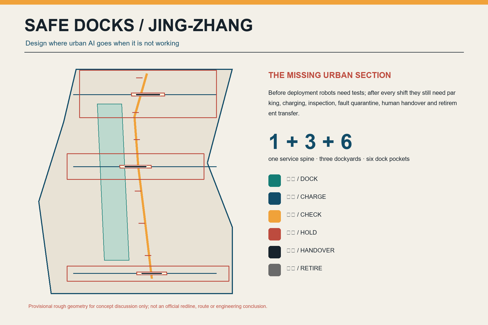
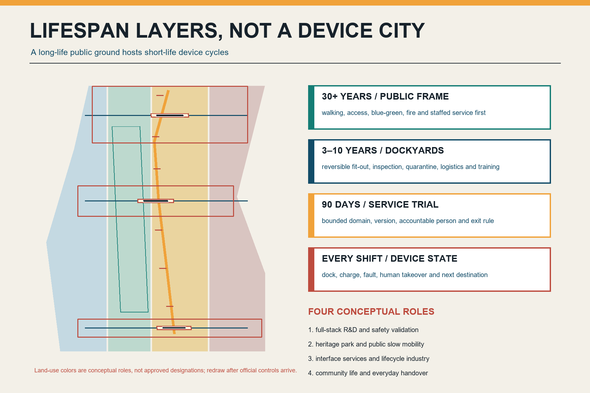
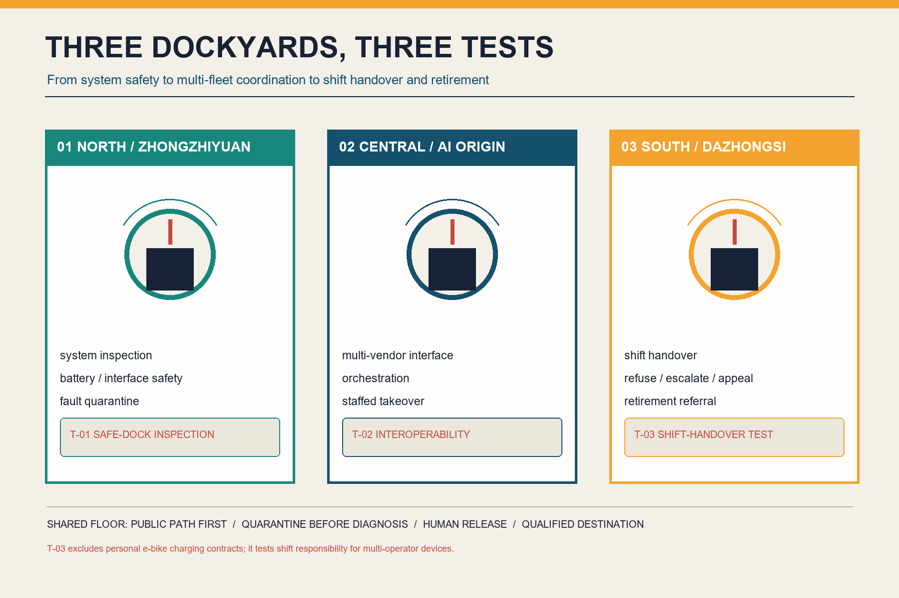
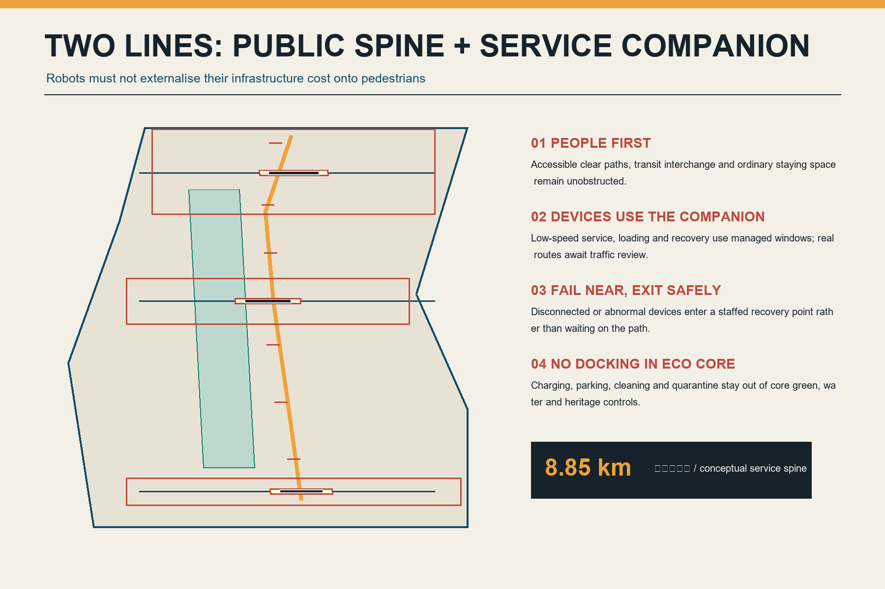
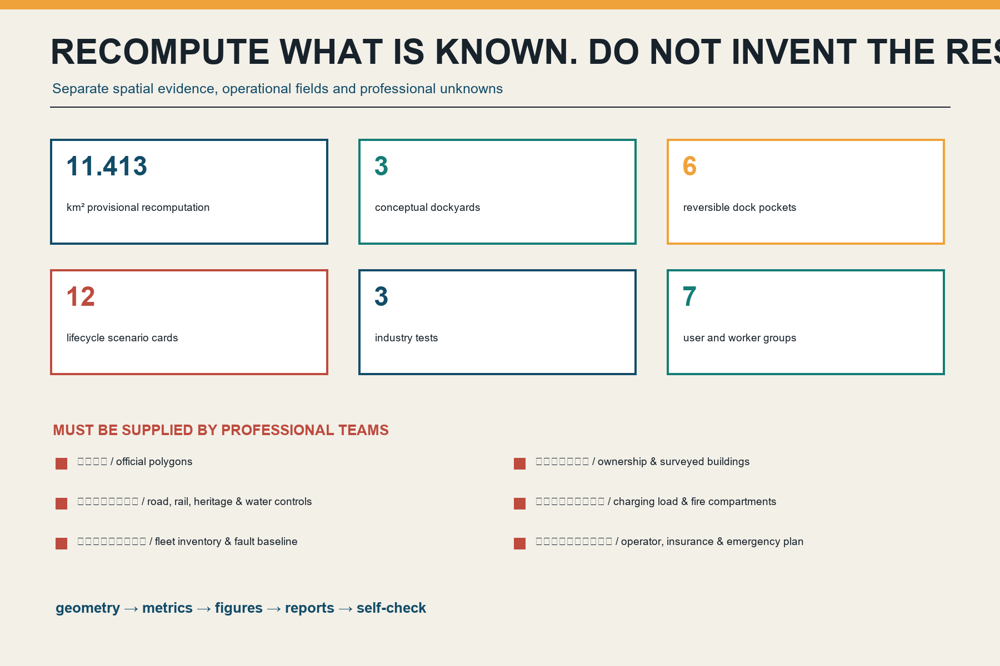

# Jing-Zhang Safe Docks

> **Give urban AI a safe place to return.** This proposal is an open, conceptual contribution. It is not a statutory plan, government approval, engineering feasibility statement, investment commitment, procurement offer, or operating commitment. The overall boundary and three key-area envelopes are provisional coarse geometries. Every location, area, route, and capacity must be redrawn and recalculated after official data and professional review become available.

## Design basis and data inventory

The announcement and agent taskbook ask for a full-stack AI innovation ecosystem, open scenarios, public space, cultural narrative, and a long-term operating system [source:OFFICIAL-ANNOUNCEMENT] [source:AGENT-TASKBOOK]. Beijing's embodied-intelligence action plan also calls for simulation, data collection, pilot validation, open testing, core components, and industrial-space support [source:BEIJING-EMBODIED-AI-PLAN]. Yet proposals commonly begin with what a robot can do. This proposal begins with the neglected physical back-of-house: where does a device park, charge, receive inspection, enter quarantine, transfer to a human, or leave service after its shift?

A deduplication audit covered the titles and summaries of 507 merged entries in `submissions-data.js`, open Issues, PRs in every state, recent commits, and full-text reading of the nearest proposals [source:PEER-CATALOG-AUDIT]. A final review explicitly compared closed PR #1868, Safe Charge Line, and #2025, Repair Line. The former contracts personal e-bike parking, charging/swapping, abnormal shutdown, and battery exit; the latter builds in-field repair, retest, and material-circulation infrastructure. After syncing through upstream commit `1cc274c7`, Pilot Line addresses evidence gates before product delivery, while Noonline SLA addresses human lunchtime mobility and offline public-service levels; neither supplies the shared physical back-of-house after a device's shift. Safe Docks therefore excludes personal e-bike charging contracts, on-site repair, product-entry gates, and lunchtime public-service SLAs as primary themes. The South Yard is narrowed to multi-operator shift handover and qualified retirement referral. Charging is one device state, not the original claim or a standalone public-charging project. No peer text, geometry, image, or mechanism was copied.

All formal spatial claims return to the local standards snapshot and structured evidence. `SITE-001` and all three `KEY_AREA` records are provisional repository polygons [data:geometry/site_boundary.geojson#SITE-001] [source:BOUNDARY-SOURCE]. They are not official red lines, parcels, roads, or survey evidence. Urban design, regulatory planning, and land-use classification are read against [standard:MOHURD-URBAN-DESIGN-MEASURES], [standard:MOHURD-CONTROL-DETAILED-PLANNING], and [standard:MNR-LAND-USE-CLASSIFICATION-GUIDE]. Missing controls remain registered gaps.

## Three-level scope framework

At the roughly 43.6-square-kilometre strategic level, the proposal studies an embodied-AI lifecycle service chain connecting research, testing, operations, maintenance, insurance, energy, data, components, and compliance. At the roughly 11.4-square-kilometre overall-design level, it arranges one safe-dock service spine, three dockyards, six removable pockets, and paired public/back-of-house paths. At the three provisional key areas, it tests system inspection, multi-vendor interoperability, and shift-to-shift handover with qualified retirement referral [depth:three_level_scope_framework].

The submitted boundary recalculates in EPSG:4548 to [metric:site_area_sqm]. This demonstrates internal consistency, not a surveyed or announced area. The number of provisional key areas is [metric:key_area_count]. Each rectangular envelope expresses a task, not ownership, block morphology, or a construction boundary.

The structure is **one spine, three yards, six pockets, two paths, and six states**:

- **One spine:** a conceptual [metric:conceptual_service_spine_length_m] safe-dock service relation along the Jing-Zhang corridor, not an approved alignment.
- **Three yards:** North at Zhongzhiyuan, Central at AI Origin, and South at Dazhongsi.
- **Six pockets:** removable points for human handover, waiting, and fault recovery, without permanent charging capacity.
- **Two paths:** a public-first walking/cycling/accessibility line and a licensed back-of-house companion for supply, loading, recovery, and human rescue.
- **Six states:** `DOCK -> CHARGE -> CHECK -> HOLD -> HANDOVER -> RETIRE`.

## Strategic industry and future-city research

Seven cases are used only to compare mechanisms. Foreign rules are not presented as Beijing law: Beijing's embodied-AI platform and industrial-space agenda; Beijing's maintenance, testing, takeover, safe-stop, and event-management provisions for vehicles within scope; Singapore Punggol Digital District's multi-operator public-path testbed; the IMDA AMR Playbook's clearance, charging, interoperability, cybersecurity, and maintenance checklist; New York City's worker-tested public e-bike charging pilot; the EU Battery Regulation's lifecycle-information and battery-passport mechanism for covered categories; and MIIT's 2024 traceability and qualified-destination approach for retired traction batteries [source:BEIJING-AUTONOMOUS-VEHICLE-REGULATION] [source:IMDA-PDD-PHYSICAL-AI] [source:EU-BATTERY-REGULATION].

| Case mechanism | Transferable Jing-Zhang question | Explicit boundary |
| --- | --- | --- |
| Beijing embodied-AI action plan | Extend simulation, pilot validation, and open scenarios into after-shift infrastructure | No inference of funding or implementation |
| Beijing autonomous-vehicle regulation | Maintenance, inspection, takeover, safe stopping, data, and incident handling | Functional unmanned vehicles remain subject to separate rules |
| PDD multi-operator testbed | Shared public paths and infrastructure across operators | Singapore governance is not transplanted into Beijing planning |
| IMDA AMR Playbook | Doors, lifts, clearance, charging, interoperability, cybersecurity, and maintenance | Deployment checklist, not a Chinese standard |
| NYC public charging pilot | Co-test safer public charging with frontline workers | Results are not extrapolated to Haidian |
| EU battery passport | Track condition, repair, second life, and destination | Not represented as a Chinese legal duty |
| MIIT comprehensive-use rules | Traceability and qualified retirement destinations | Dockyards do not dismantle or recycle cells |

The ecosystem is an interface chain, not another closed platform: interface qualification, open test, human release, fault transfer, and qualified retirement. Land supplies only authorised reversible interfaces; public paths and fault isolation lead spatial design; industry covers bodies, components, energy, maintenance, insurance, and recovery; finance follows stoppable milestones; talent includes safety officers, maintainers, and field dispatchers as well as researchers; compute records versions and supports simulation but never replaces field judgement; data is minimised and access-tiered; every scenario retains takeover and exit. Zhongguancun services provide standards, legal, insurance, and interface support. Xiaoyue River's scenario wing carries only authorised low-risk public-path trials [depth:overall_spatial_structure].

## Overall urban renewal and regulatory-plan-depth urban design

The design replaces a device-first urbanism with **lifecycle layers**. A 30-plus-year public substrate protects slow mobility, accessibility, blue-green continuity, fire access, human service, and heritage continuity. Five-to-ten-year dockyards use reversible fit-outs for inspection, quarantine, training, and loading. Ninety-day pilots have fixed operating domains, versions, responsible people, and exit conditions. Device status updates every shift. Short-lived equipment must not lock long-lived public space [depth:overall_spatial_structure].

`land_use.geojson` completely partitions the provisional boundary into four conceptual roles: full-stack R&D and safe validation; heritage park and public slow mobility; interface services and lifecycle industries; and community life and everyday handover [data:geometry/land_use.geojson#LU-001] [depth:land_use_layout]. They are not approved uses. `buildings.geojson` contains only three reversible dockyard capacity envelopes with total footprint [metric:building_footprint_area_sqm]. They do not represent existing buildings and support no conclusion on floor area, FAR, height, storeys, or investment.

The visual language comes from the legibility of a railway depot, not a futuristic shell. Deep navy marks the public substrate, amber means inspection, red means quarantine, and teal means safe return to service. Interfaces, fasteners, inspection doors, and emergency stops remain visible. New components are low, demountable, and repairable, with a readable historical distance from heritage. Exact height, structure, fire performance, materials, and conservation relationships require professional review [depth:height_massing_character].

Retention precedes adaptation; light conversion precedes any discussion of new construction. No real building is marked for demolition before ownership, structural, fire, heritage, contamination, and current-user surveys. Safe-dock functions should first compare existing service rooms, parking edges, and removable courtyards without displacing small businesses or public use [depth:retain_renovate_demolish].

## Detailed design for key areas

### Zhongzhiyuan: North Dockyard

The North Yard asks whether a system is fit to enter a public scenario. It combines arrival inspection, an interface-compatibility bench, fault quarantine, human-takeover drills, and a loading edge for return to R&D. Missing battery, charger, software-version, sensor, responsibility, or mechanical-safety information blocks release. Industry test **T-01 Safe-Dock Inspection** validates anomaly recognition, emergency stop, offline human removal, and quarantine workflow; it does not authorise public-road operation [data:geometry/buildings.geojson#BLDG-001] [depth:three_key_area_detailed_design].

### AI Origin: Central Dockyard

The Central Yard asks whether devices from different vendors can share civic interfaces without platform lock-in. Replaceable adapters test charging communication, task handoff, geofenced maps, identity credentials, log export, and human consoles. Failure returns to vendor-owned equipment rather than disabling public space. Industry test **T-02 Multi-Vendor Interoperability** uses synthetic tasks and controlled routes, collects no passer-by identity, and never represents a result as safety certification [data:geometry/buildings.geojson#BLDG-002].

### Dazhongsi: South Dockyard

The South Yard asks whether different operators and shifts can transfer responsibility for a device to the next person without ambiguity. Arrival status, staffed acceptance, fault recovery, signed responsibility transfer, complaints, and retirement referral share one visible interface. Queues, loading, and devices may not occupy subway access or accessibility clearance. Industry test **T-03 Shift-Handover Stress Test** injects late arrival, lost connection, missing responsible staff, network loss, and no-phone users. It tests route clearance, takeover, refusal, escalation, and closure rather than creating another personal e-bike public-charging project [data:geometry/buildings.geojson#BLDG-003].

All yards share one rule: **isolate before diagnosis; a person releases high-risk states; do not dismantle anything without a qualified destination.** Dockyards provide inspection, short controlled charging, light maintenance, human takeover, and referral. Cell dismantling, cascade use, and material recovery belong only in qualified industrial systems [source:MIIT-BATTERY-RECYCLING-2024].

## AI innovation ecosystem, personas, and AI+ scenarios

Seven user groups cross the complete flow: robot and low-speed-device developers need reproducible faults; multi-vendor operators need neutral interfaces; safety officers and remote supervisors need a takeover console; maintainers and recovery workers need safe work and destination receipts; field dispatchers and delivery-device coordinators need time-bounded, rejectable shift handoffs; residents and merchants need quiet, transparent, appealable operations; and pedestrians, children, older people, and disabled users need public right-of-way to come first. Personas are not individual tracking schemes, and frontline workers are not treated as free training-data sources.

Twelve scenario cards use the shortest auditable loop: `request -> dock -> human check -> bounded action -> result card -> return / hold / retire` [metric:scenario_count].

| Card | Scenario | Space and operators | Data, human, and exit boundary |
| --- | --- | --- | --- |
| SC-01 * | Safe-dock inspection | North Yard; system, safety, maintenance staff | Missing version/battery/responsibility enters HOLD; human release |
| SC-02 * | Multi-vendor interface test | Central Yard; vendors and independent reviewer | Synthetic task; failure returns to vendor system |
| SC-03 * | Shift-handover stress test | South Yard; dispatcher, maintainer, resident, and operator | Late/lost/unclaimed devices are refused or escalated; signed handoff |
| SC-04 | Pre-shift status card | All yards; duty safety officer | Device, version, operating domain, and contact only |
| SC-05 | Offline human removal | Six pockets; frontline maintainer | Clear the public route before cloud recovery |
| SC-06 | Fault quarantine and transfer | All yards; safety/maintenance leads | Unknown battery or heat anomaly stops charging |
| SC-07 | Accessibility clearance watch | Every pocket; disabled-user co-test | Stop on queue encroachment; no facial enforcement |
| SC-08 | Fair staffed-handover queue | South Yard; field workers and people reporting faults | Paper ticket, public rules, and appeal path |
| SC-09 | Robot water-power service box | North/Central; cleaning-robot operator | Professional management of dirty water, power, and chemicals |
| SC-10 | Battery/component destination receipt | All yards; qualified repair/recovery party | Minimum asset record; no on-site dismantling |
| SC-11 | Quiet night return | Residential interface; resident and operator | Light/noise limits and staffed escalation |
| SC-12 | Retirement open class | AI Origin; students, developers, frontline workers | Show failures and destinations, not personal or trade-secret data |

AI is limited to clustering fault records, suggesting return windows, simulating interfaces, and multilingual explanation. It cannot decide safety, fire compliance, scrap grade, road permission, or recovery qualification. A complete responsibility contract for personal e-bike parking, charging/swapping, tariffs, and battery exit is already the subject of an adjacent proposal and is outside this industry's tests. Any robot energy interface still requires product-specific review; GB 43854-2024 is not generalised to every robot battery [source:SAMR-GB43854] [source:PEER-CATALOG-AUDIT].

## Land use, building capacity, retention, and adaptation

Four land-use roles cover the provisional extent only to ask where lifecycle interfaces should sit. R&D validation is closest to Zhongzhiyuan; interoperability, education, and open challenges sit around AI Origin; shift handover, complaints, and retirement referral sit near Dazhongsi; the heritage park remains a continuous public spine. A public visitor should encounter service rules and a staffed window before an equipment store [depth:development_intensity_controls].

Total floor area, FAR [metric:floor_area_ratio], building density, height, setbacks, and parking remain unknown until official data arrive. The three footprints only state that some work needs controlled back-of-house space. A real next stage must compare light adaptation of existing service space, a reversible box at a parking edge, and an independent removable yard against public right-of-way, fire access, noise, loading, worker safety, energy capacity, and restoration at exit.

## Transport, rail, municipal, and public-service infrastructure

Transport uses a public-first line and a back-of-house companion. The first supports walking, cycling, accessibility, public transport transfer, and ordinary staying. The second, only under permission and operating windows, supports low-speed devices, loading, recovery, and human rescue. Three east-west handover stitches show a needed relationship, not a conclusion about bridges, crossings, or road geometry [data:geometry/roads.geojson#ROAD-001] [depth:traffic_rail_slow_parking].

A failed device may not use a public route as a waiting room. Loss of connection, geofence breach, thermal anomaly, mechanical damage, or public discomfort triggers clear-route, human takeover, short isolation, and professional referral. Beijing's autonomous-vehicle regulation requires takeover, warning, and safe stopping for vehicles within its scope. This proposal translates only the public-risk-reduction principle into spatial performance; it does not claim that functional unmanned vehicles are already authorised [source:BEIJING-AUTONOMOUS-VEHICLE-REGULATION].

No charging-point count or power is assumed. Electrical capacity, charging protocols, battery chemistry, fire compartments, ventilation, drainage, wash water, hazardous waste, emergency isolation, rescue access, and cybersecurity remain [assumption:A-ENERGY-FIRE-001]. Until specialist studies are complete, [metric:charging_capacity_kw] remains unknown. Public service retains staffed, printed, and no-phone access, with operator, price, hours, complaint, and exit status visible [depth:municipal_new_infrastructure].

## Blue-green space, public space, and townscape

The green companion strip has area [metric:green_space_area_sqm] and conceptual ratio [metric:green_ratio]. Dock aprons and pockets have area [metric:public_space_area_sqm] and conceptual ratio [metric:public_space_ratio]. These are internal recalculations, not statutory green-space ratios, confirmed public-space ratios, or ownership claims [data:geometry/green_space.geojson#GREEN-001] [depth:blue_green_public_space].

Credible geometries for ecological cores, waterways, heritage control, and construction control zones are absent, so `constraints.geojson` records a locked gap instead of drawing invented lines. The principle is **no docking in ecological cores**: parking, charging, washing, loading, and quarantine retreat to verified building or service interfaces; public green space retains walking, low-impact wayfinding, and necessary human rescue only.

Three conceptual landmarks are not giant robots. The **Return Clock** displays in-service, returning, quarantined, and retired status. The **Human Relay Bench** makes safety, maintenance, and device-coordinator handoffs visible work. The **Last Battery Ledger** traces a component from commissioning and repair to qualified destination. Civic recognition rewards responsible stops, successful takeover, repair and retest, and accountable retirement, never uptime, orders, or funding rank.

The narrative connects railway-depot disciplines--return, inspection, shift handover, and safe release--with Zhongguancun iteration and the lifecycle responsibility of embodied AI. The logo is an open rail enclosing a returning arrow. The international line is **Every intelligent city needs a safe place to return.**

## Renewal projects, implementation policy, and phasing

| Project | Conceptual 12-month output | Gate to the next stage |
| --- | --- | --- |
| P1 After-shift infrastructure census | Baseline of devices, shifts, parking, charging, faults, maintainers, and complaints | Data authorisation, worker participation, no deployment through surveying |
| P2 One 90-day removable pocket | Human handoff, printed status, offline removal, and restoration drill | Ownership, accessibility, traffic, fire, electrical, and insurance review |
| P3 North inspection prototype | T-01 and quarantine workflow | Independent safety review; reject if no qualified destination |
| P4 Central interoperability prototype | T-02, multi-vendor interface, and export | No platform lock-in; public service not dependent on one vendor |
| P5 South handover prototype | T-03, printed queue, refusal/escalation, and complaint desk | Named responsibility, staffed service, offline exit, and specialist safety review |
| P6 Retirement referral directory | Verifiable repair, transport, and recovery destinations | Source, qualification, responsibility, and receipt verification |
| P7 Global Safe Dock Week | Failure open class, maintenance challenge, interface trial | Audience volume never substitutes for safety or public value |

Three phases [metric:phase_count] begin with census, a safety baseline, and one removable pocket; proceed to one independent prototype in each key area; and replicate only interfaces proven to protect public right-of-way, support takeover, enable repair, and restore at exit [data:geometry/phasing.geojson#PHASE-001] [depth:phasing_implementation]. These are not confirmed construction dates.

Policy tools include after-shift infrastructure impact assessment, public-path priority, vendor-neutral interfaces, a minimum device/battery passport, maintainer attribution and training, fault quarantine and destination receipts, sunset review, and an exit bond. In the RACI, the site operator owns public paths and open status; the device operator owns the device, duty staff, and incidents; qualified specialists decide fire, electrical, repair, and recovery matters; independent reviewers and real users participate in Go/No-Go.

The annual cycle is a spring device/labour baseline, summer interoperability tests, autumn Safe Dock Week, and winter retirement/incident review. Talent and enterprise conversion follows open problem, controlled validation, maintenance/safety evidence, partner matching, and sunset review. Every partner, budget, event, and policy is proposed rather than confirmed [depth:renewal_project_list].

## Metrics, area recalculation, and compliance matrix

Only values directly counted from submitted geometry or text are `known`: provisional boundary, three dockyards, six pockets, three industry tests, twelve scenario cards, seven persona groups, three landmarks, and three phases [metric:dockyard_count] [metric:micro_dock_count] [metric:industry_test_count]. Operating outcomes have no baseline. First-round census fields include dock-return rate, time to clear a failed device, takeover-drill completion, accessibility encroachment, charging anomalies, maintainer near misses, destination-receipt completeness, complaint closure time, and exit restoration. No attractive target is prefilled.

Geometry, metrics, figures, bilingual HTML/PDF, and self-check use one evidence chain [depth:metrics_recalculation]. `compliance_matrix.json` covers the announcement and agent.1-agent.6. `standard_matrix.json` records standards and gaps. `design_depth_matrix.json` demonstrates fifteen professional-depth items. Structured completeness is not engineering, safety, or operational approval.

## Risk, copyright, and compliance statement

The largest risk is misreading Safe Docks as a programme to build charging sheds everywhere. With no official boundary, ownership, existing-building survey, road/rail controls, utilities, fire strategy, heritage/blue-green controls, or device baseline, this proposal makes no claim about charger count, power, storage, fire separation, route, demolition, cost, or operator [depth:risk_missing_data]. When official data arrive, work must restart at the earliest uncertainty: verify boundary and context, co-survey the site, complete specialist safety/capacity studies, redraw nine layers, recalculate metrics, regenerate figures/PDF/HTML, and rerun self-check.

Every device scenario retains human takeover, offline service, complaints, and reversible exit. It collects no unnecessary identity and does not convert passer-by imagery, field-worker traces, or maintainer performance into training data. Charging and retirement must follow applicable law, product standards, fire, electrical, environmental, transport, and qualification requirements. Foreign cases are mechanism references only.

OpenAI Codex generated the text, original marks, geometry, charts, HTML, and PDFs for this submission. Figures are deterministically drawn with Python/Pillow and use no third-party photo, corporate logo, remote map tile, external font, or peer asset. External sources are narrowly paraphrased near the relevant claim; publisher, URL, retrieval date, use, and limitations are in `sources.json`. Generation and rights boundaries are recorded in `report/copyright_statement.md`.

## References

Evidence is separated into four levels. The announcement, taskbook, and local standards snapshot calibrate coverage, deliverable depth, and professional gaps [source:OFFICIAL-ANNOUNCEMENT] [source:AGENT-TASKBOOK] [standard:MOHURD-URBAN-DESIGN-MEASURES]. Beijing policy, vehicle regulation, battery safety, and comprehensive-use rules support only bounded testing, takeover, safe stopping, and qualified-destination mechanisms; they do not approve this project. Singapore, New York, and EU cases compare multi-operator interfaces, user co-testing, and lifecycle information without transplanting foreign governance. The catalogue/all-state-PR audit uses #1868 to exclude personal e-bike charging responsibility and #2025 to exclude on-site repair and material circulation, retaining only the shared docking, quarantine, handover, and retirement interface for multi-operator devices when they are not working [source:PEER-CATALOG-AUDIT].

Every spatial claim returns to provisional evidence. The boundary, key areas, land use, capacity envelopes, route relations, green strip, and public interfaces are recorded in nine GeoJSON files [data:geometry/site_boundary.geojson#SITE-001]. Areas, ratios, length, and counts are recalculated in `metrics.json`, including formula, unit, confidence, and linked assumptions [metric:site_area_sqm] [metric:green_ratio]. They test internal consistency. They do not turn provisional geometry into a survey or convert a conceptual footprint into FAR, height, or investment.

Publisher, URL, retrieval date, intended use, and limitation for the official task basis, standards, provisional geometry, and seven cases are registered in `sources.json` as retrieved on 2026-08-13. A changed page, policy, standard, or scope requires downgrading and reverifying the claim. New official boundaries, existing-building data, road/rail controls, utilities, fire strategy, heritage/blue-green controls, or operating baselines require redrawing, recalculation, regeneration, and a new self-check from the earliest uncertainty [depth:risk_missing_data].
