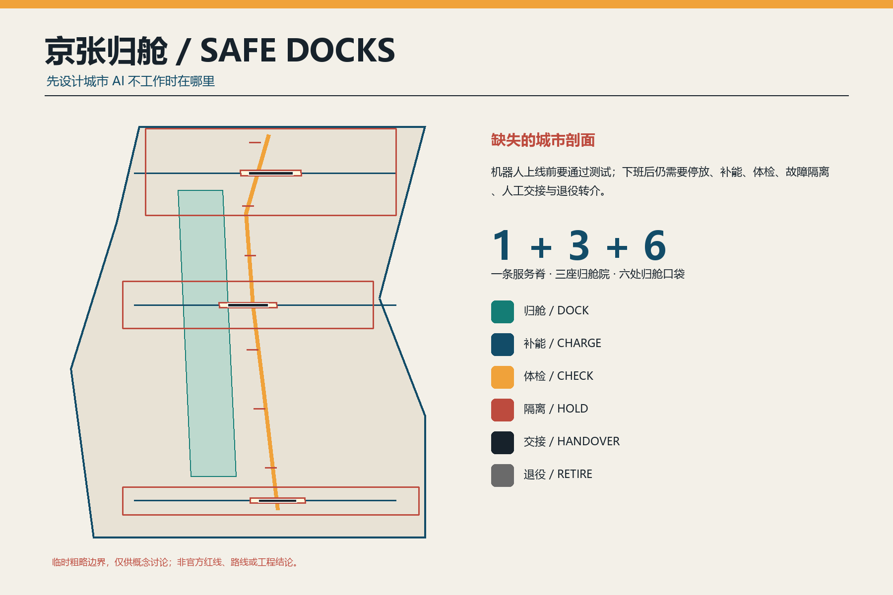
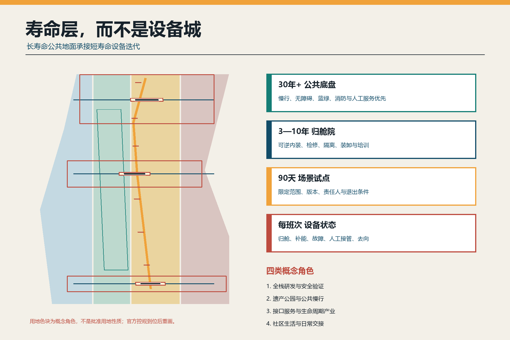
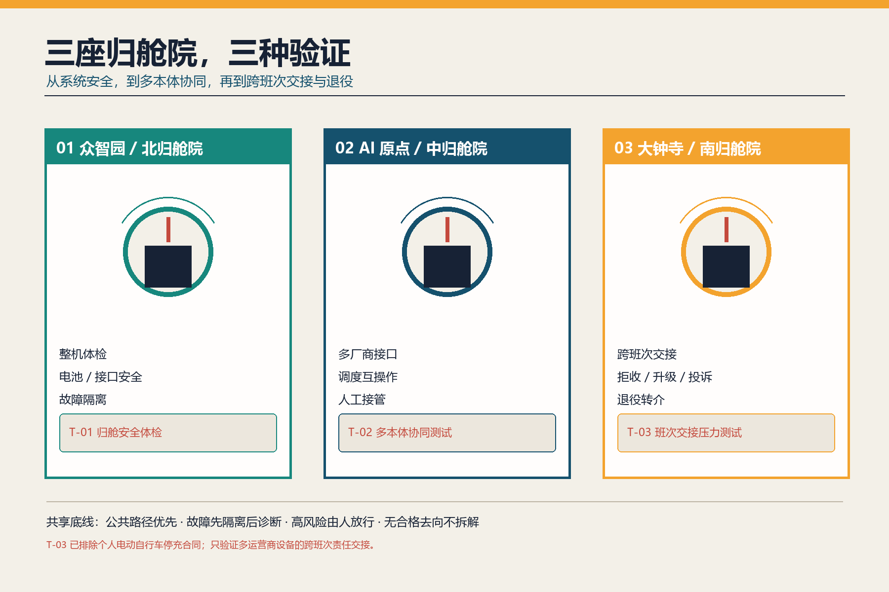
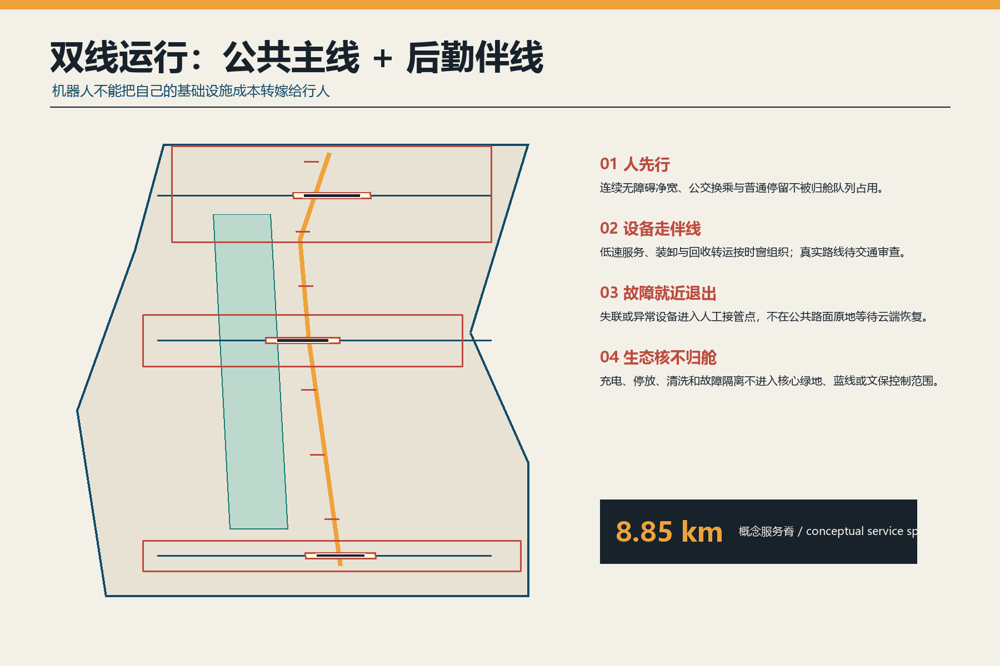
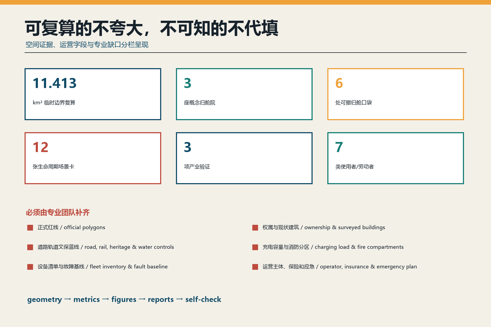

# 京张归舱 SAFE DOCKS

> **让城市 AI 安全回家。** 本方案是开放共创的概念建议，不替代正式规划，不构成政府审定、工程可行性、投资、采购或运营承诺。提交的总体边界与三处重点区均为临时粗略几何；任何位置、面积、路径和设施容量必须在官方资料与专业审查到位后重画重算。

## 设计依据与资料清单

公告和智能体任务书要求构建 AI 全栈自主创新、场景开放、公共空间、文化叙事与长期运营体系 [source:OFFICIAL-ANNOUNCEMENT] [source:AGENT-TASKBOOK]。北京具身智能行动计划进一步提出仿真、数据采集、中试验证、场景开放测试、核心零部件和产业空间支撑，但现有方案讨论通常从“机器人能做什么”开始，忽略其不工作时的物理后场 [source:BEIJING-EMBODIED-AI-PLAN]。本方案把这个缺口定义为城市设计问题：设备下线后要去哪里停放、补能、体检、隔离、交接和退役？

去重审计覆盖 `submissions-data.js` 中 507 个已合并方案的标题与摘要、开放 Issue、全部状态 PR、近期提交，并按需阅读全文比较“候场线”“暖线”“巡线”“常新”“再生编组场”“一米”等相邻方案 [source:PEER-CATALOG-AUDIT]。提交前又专项复核已关闭 PR #1868“京张安心充”和 #2025“京张可修线”：前者把个人电动自行车停车、充换电、异常停机与电池退出写成责任合同，后者建立现场维修、复验和材料循环基础设施。同步到上游提交 `1cc274c7` 后，新增“京张中试线”解决产品交付前的证据闸门，“京张午间服务线”解决人群午间出行与离线公共服务等级，仍未覆盖设备下班后的共同后场。为避免重叠，本方案明确排除个人电动自行车停充合同、现场拆修、产品准入闸门和人群午间 SLA 母题；南院由“公共补能”收窄为**多运营商设备跨班次人工交接与合格退役转介**。补能只是六个设备状态之一，不是原创主张或独立公共充电项目。审计只用于差异化判断，没有复制同伴文字、图件、几何或机制。

所有正式空间判断回到本地标准快照和结构化证据。`SITE-001` 与三处 `KEY_AREA` 仅来自仓库临时粗略 polygon [data:geometry/site_boundary.geojson#SITE-001] [source:BOUNDARY-SOURCE]；它们不是官方红线、地块、道路或精确面积依据。城市设计、控规和用地分类分别响应 [standard:MOHURD-URBAN-DESIGN-MEASURES]、[standard:MOHURD-CONTROL-DETAILED-PLANNING] 和 [standard:MNR-LAND-USE-CLASSIFICATION-GUIDE]，缺失的官方控制一律登记为待补条件。

## 三层范围工作框架

统筹研究范围约 43.6 平方公里，研究的是“具身 AI 生命周期服务链”：研发、测试、运营、维修、保险、能源、数据、部件和合规怎样形成跨区接口。总体设计范围约 11.4 平方公里，组织一条归舱服务脊、三座归舱院、六处可撤归舱口袋及公共主线—后勤伴线。三处重点区域约 368.4 公顷，分别验证系统体检、多本体协同和跨班次交接—退役转介 [depth:three_level_scope_framework]。

提交边界在 EPSG:4548 下复算为 [metric:site_area_sqm]，只证明机器包内几何和指标一致，不替代公告约值或正式测绘。三处临时重点区数量为 [metric:key_area_count]；每个矩形边界都只承担任务定位，不表达真实权属、街区形态或建设范围。

总体结构是 **“一脊、三院、六袋、双线、六状态”**：

- **一脊**：沿京张遗址公园关系组织的归舱服务脊，概念线长 [metric:conceptual_service_spine_length_m]；它不是批准路线。
- **三院**：众智园北归舱院、AI 原点中归舱院、大钟寺南归舱院。
- **六袋**：沿线可撤的人工交接、等待与故障回收口袋，不设置永久充电容量。
- **双线**：人行、骑行、无障碍和普通停留优先的公共主线；设备补给、装卸、回收和人工救援使用的后勤伴线。
- **六状态**：`DOCK 归舱 → CHARGE 补能 → CHECK 体检 → HOLD 隔离 → HANDOVER 交接 → RETIRE 退役`。

## 统筹研究范围产业与未来城市研究

七个案例只用于比较机制，不把境外规则写成本地法定要求：北京具身智能行动计划的测试平台和产业空间；北京市自动驾驶汽车条例的维护、检测、人工接管、安全停放和事件管理；新加坡 Punggol Digital District 的多运营商公共路径测试；新加坡 AMR Playbook 的充电站兼容、净空、网络安全与维护清单；纽约公共电动自行车补能试点的使用者共测；欧盟电池法规的生命周期信息与电池护照；工信部 2024 版废旧动力电池综合利用规范的追溯与合格去向 [source:BEIJING-AUTONOMOUS-VEHICLE-REGULATION] [source:IMDA-PDD-PHYSICAL-AI] [source:EU-BATTERY-REGULATION]。

| 案例机制 | 可转化的京张问题 | 明确边界 |
| --- | --- | --- |
| 北京具身智能行动计划 | 从仿真、中试、场景开放延伸到班后基础设施 | 不推导项目落地或政策资金 |
| 北京自动驾驶法规 | 日常维护、检测、接管、安全停放、数据与应急 | 功能型无人车仍按专门规则；不泛化适用 |
| PDD 多运营商测试床 | 不同运营商共享公共路径和基础设施的协调 | 新加坡制度不移植为北京规则 |
| IMDA AMR Playbook | 门、电梯、净空、充电、互操作和网络安全清单 | 只作部署问题表，不作中国标准 |
| NYC 公共补能试点 | 与一线劳动者共同测试安全公共补能 | 绩效数据不外推至海淀 |
| 欧盟电池护照 | 记录电池状态、维修、第二生命和去向 | 不写成中国法律义务 |
| 工信部综合利用规范 | 退役电池追溯、责任与合格产业去向 | 归舱院不做拆解或再生处理 |

AI 创新生态不是再造一个封闭平台，而是以**接口认证—开放试验—人工放行—故障转介—退役去向**连接八类要素：土地只提供经授权的可逆界面；空间保证公共通行与故障隔离；产业覆盖本体、零部件、能源、维修、保险与回收；资金按可停止里程碑投入；人才包含研发者也包含安全员、维护工和现场调度员；算力用于版本记录和仿真而不替代现场判断；数据坚持最小必要与访问分级；场景必须有人工接管和退出。中关村科技服务翼支撑标准、法务、保险和接口服务，小月河场景赋能翼只承担经授权的低风险公共路径测试 [depth:overall_spatial_structure]。

## 总体设计范围城市更新与控规深度城市设计

设计以**寿命层**代替“智能设备越多越先进”的城市形态。30 年以上的公共底盘先保证慢行、无障碍、蓝绿、消防、人工服务和遗产连续；3—10 年的归舱院采用可逆内装承载检修、隔离、培训与装卸；90 天的场景试点限定运营域、版本、责任人和退出；每个班次更新设备状态。短寿命设备不得锁定长寿命公共空间 [depth:overall_spatial_structure]。

`land_use.geojson` 将临时边界拓扑完整分为全栈研发与安全验证、遗产公园与公共慢行、接口服务与生命周期产业、社区生活与日常交接四类概念角色 [data:geometry/land_use.geojson#LU-001] [depth:land_use_layout]。它们不是批准用途。`buildings.geojson` 只表达三座可逆归舱院的容量包络，总基底 [metric:building_footprint_area_sqm]；不对应现状建筑，也不推导层数、总建筑面积、容积率、建筑高度或投资。

风貌来自铁路站场的工程可读性，而不是霓虹外壳：深蓝表示公共底盘，琥珀表示待检状态，红色表示隔离，绿色表示可安全返回服务；接口、紧固件、检修门和人工急停保持可见。新增构件低矮、可拆、可修，与遗产保持可辨识时代距离；具体高度、材料耐火等级、结构、消防和文保关系必须由专业团队确认 [depth:height_massing_character]。

拆改留遵循“先盘点、再利用、轻改造、最后才讨论新建”。任何真实建筑在完成权属、结构、消防、文保、污染和在用人群调查前都不贴拆除标签；归舱功能优先研究既有后勤房、停车空间边缘或可撤院落，且不能挤出原有小微服务和公共使用 [depth:retain_renovate_demolish]。

## 重点区域详细设计

### 众智园：北归舱院 / North Dockyard

北院回答“一个系统是否配进入公共场景”。建议设置整机到站检查、接口兼容台、故障隔离间、人工接管演练位和退回研发的装卸边界；任何电池、充电器、软件版本、传感器或机械安全信息缺失即不放行。产业测试 **T-01 归舱安全体检**验证异常识别、急停、断网人工拖离和故障隔离流程，不验证未经授权的公开道路能力 [data:geometry/buildings.geojson#BLDG-001] [depth:three_key_area_detailed_design]。

### AI 原点：中归舱院 / Central Dockyard

中院回答“不同厂商设备能否共享城市接口而不制造平台锁定”。建议用可替换适配层测试充电通信、任务交接、地图边界、身份凭证、日志导出和人工控制台，失败必须回到供应商自有设备而不瘫痪公共空间。产业测试 **T-02 多本体协同测试**只用合成任务和受控路径，不收集路人身份，不把互操作结果冒充安全认证 [data:geometry/buildings.geojson#BLDG-002]。

### 大钟寺：南归舱院 / South Dockyard

南院回答“不同运营商和班次能否把设备责任清楚地交给下一位人”。建议把到站状态卡、人工接件、故障回收、责任签转、投诉与退役转介放在同一可见界面；等待、装卸与设备不得占用地铁接驳或无障碍净宽。产业测试 **T-03 班次交接压力测试**同时注入晚到、失联、责任人缺席、断网和无手机使用者，验证清路、人工接管、拒收、升级与结束，而不是另设个人电动自行车公共充电项目 [data:geometry/buildings.geojson#BLDG-003]。

三院共享一条底线：**先隔离后诊断，高风险由人放行，无合格去向不拆解。** 归舱院只做检查、短时受控补能、轻维修、人工接管和合格去向转介；电池拆解、梯次利用和再生处理必须进入有资质、有场地和有环境安全条件的产业系统 [source:MIIT-BATTERY-RECYCLING-2024]。

## AI 创新生态、人才画像与 AI+ 场景

七类使用者贯穿全流程：机器人/低速设备研发者需要可复现故障；多厂商运营者需要中立接口；安全员与远程监控员需要可接管控制台；维护工与回收人员需要安全作业和去向凭证；现场调度员与配送设备协管员需要有时限、可拒收的班次交接；沿线居民与商户需要安静、透明、可投诉；行人、儿童、老人和无障碍用户需要公共路权优先。画像不做个体追踪，尤其不把一线劳动者变成训练数据来源。

十二张场景卡都采用“请求 → 归舱 → 人工核验 → 限定动作 → 结果卡 → 返回/隔离/退役”的最短闭环 [metric:scenario_count]：

| 卡 | 场景 | 空间与运营 | 数据、人工与退出边界 |
| --- | --- | --- | --- |
| SC-01 ★ | 归舱安全体检 | 北院；系统、安全与维护人员 | 缺版本/电池/责任信息即 HOLD；人工签放 |
| SC-02 ★ | 多本体接口测试 | 中院；多厂商与独立评审 | 合成任务；失败回自有接口，不锁公共系统 |
| SC-03 ★ | 班次交接压力测试 | 南院；调度员、维护工、居民与运营者 | 晚到/失联/无人接件即拒收或升级；人工签转 |
| SC-04 | 班前状态卡 | 三院；当班安全员 | 只记录设备、版本、运营域和联系人 |
| SC-05 | 断网人工拖离 | 六袋；一线维护工 | 不等云端恢复；先释放公共通道 |
| SC-06 | 故障隔离与转介 | 三院；安全/维修主体 | 不明电池或热异常停止补能并专业转介 |
| SC-07 | 无障碍净宽守门 | 所有口袋；真实无障碍用户共测 | 队列越界即停用；不做人脸执法 |
| SC-08 | 公平人工交接队列 | 南院；现场工人与普通报障者 | 可纸面取号；规则公开、可申诉 |
| SC-09 | 机器人水电服务盒 | 北/中院；清洁机器人运营 | 脏水、电力和清洁剂由专业接口管理 |
| SC-10 | 电池/部件去向凭证 | 三院；维修与合格回收主体 | 只记录必要资产信息；不现场拆解 |
| SC-11 | 夜间静默归舱 | 邻近社区界面；居民与运营者 | 限光限声、人工值守；投诉触发降级 |
| SC-12 | 退役公开课 | AI 原点；学生、开发者、一线工人 | 展示失败与去向，不展示商业秘密或个人数据 |

这里的 AI 只用于故障记录聚类、设备回仓时段建议、接口仿真和多语言解释。它不能自行判定安全、消防合格、报废等级、道路许可或回收资质。个人电动自行车停车、充换电、费率和电池退出的完整责任合同已由相邻方案专门讨论，不纳入本方案产业测试；任何机器人能源接口仍须按实际产品类别和适用标准另行核验，不能把 GB 43854-2024 泛化成所有机器人电池标准 [source:SAMR-GB43854] [source:PEER-CATALOG-AUDIT]。

## 用地、建筑规模与拆改留方案

四类用地角色完整覆盖临时范围，但只回答“生命周期接口应靠近哪类城市功能”，不改变法定用地。研发验证靠近众智园；互操作、教育与开放课题靠近 AI 原点；跨班次交接、投诉和退役转介靠近大钟寺；遗产公园维持连续公共脊。归舱院必须退到公共主界面之后，让公众先看见服务规则和人工窗口，而不是先遇到设备库 [depth:development_intensity_controls]。

总建筑面积、容积率 [metric:floor_area_ratio]、建筑密度、高度、退线和停车均待正式数据补齐。三座 footprint 只说明“功能需要受控后场”，不能视为批准规模。真实方案深化应比较三种载体：存量后勤房轻改、停车空间边缘可逆盒、独立可撤院；比较标准是公共路权、消防、噪声、装卸、维修工安全、能源容量和退出复原，而非视觉冲击力。

## 交通、轨道、市政与公共服务设施

交通采用“公共主线 + 后勤伴线”。公共主线服务步行、骑行、无障碍、公交换乘和普通停留；后勤伴线在许可时窗内承接低速设备、装卸、回收和人工救援。三条东西交接缝只表达需要建立人工接管关系，不给桥隧、过街或道路线形结论 [data:geometry/roads.geojson#ROAD-001] [depth:traffic_rail_slow_parking]。

故障设备不得把公共道路当等待区：失联、越界、热异常、机械损伤或公众不适触发“就近清路—人工接管—短时隔离—专业转介”。北京市自动驾驶汽车条例对适用车辆提出故障后人工接管、安全警示和不妨碍交通停放等要求，本方案只把这种“先降低公共风险”的思想转译为空间绩效；功能型无人车仍按专门规范，不冒充已经获准 [source:BEIJING-AUTONOMOUS-VEHICLE-REGULATION]。

市政不预设充电桩数量或功率。电气容量、充电协议、电池化学体系、消防分区、通风、排水、清洗水、危废、应急断电、救援通道和网络安全全部登记为 [assumption:A-ENERGY-FIRE-001]，在专项论证前 [metric:charging_capacity_kw] 保持未知。公共服务必须同时有人工、纸面和无手机通道，并公开责任人、价格、开放时间、投诉与退出状态 [depth:municipal_new_infrastructure]。

## 蓝绿空间、公共空间与城市风貌

绿色伴行带面积 [metric:green_space_area_sqm]、概念比例 [metric:green_ratio]；归舱月台与口袋面积 [metric:public_space_area_sqm]、概念比例 [metric:public_space_ratio]。这些都是提交图层内部复算，不是法定绿地率、公共空间率或已确认公共权属 [data:geometry/green_space.geojson#GREEN-001] [depth:blue_green_public_space]。

核心绿地、蓝线、文保范围与建设控制地带在公开包中没有可信几何，因此 `constraints.geojson` 保持锁定缺口而不画假线。原则是“生态核不归舱”：停放、补能、清洗、装卸和故障隔离退到经核验的建设或后勤界面；公共绿地只保留人行、低扰动导视和必要人工救援。

三处概念地标不是巨型机器人：**归舱钟**显示设备在岗、回仓、隔离与退出的公共状态；**人工接力台**把安全员、维护工和设备协管员的交接变成可见劳动；**最后一块电池牌**记录部件从上线、维修到合格去向的生命周期。荣誉系统表彰“主动停机、成功人工接管、修复后复测、负责退役”，不按运行时长、订单数或融资排名。

文化叙事把京张铁路“列车入段整备、交接班、检修后再出发”的工程纪律，与中关村的迭代文化和具身 AI 的生命周期责任相连。Logo 是一段开放轨道包住一个向内返回的箭头；国际传播语为 **Every intelligent city needs a safe place to return.**

## 更新项目清单、实施政策与分期计划

| 项目 | 12 个月概念交付 | 进入下一阶段的门槛 |
| --- | --- | --- |
| P1 班后基础设施普查 | 设备类型、班次、停放、补能、故障、维护工与投诉基线 | 数据授权、劳动者参与、不得借普查部署设备 |
| P2 一处 90 天可撤归舱口袋 | 人工交接、纸面状态、断网拖离和复原演练 | 权属、无障碍、交通、消防、电气和保险审查 |
| P3 北院安全体检原型 | T-01 与故障隔离流程 | 独立安全复核；无合格去向不接收 |
| P4 中院互操作原型 | T-02、多厂商接口和数据导出 | 无平台锁定；公共服务不依赖单一厂商 |
| P5 南院交接原型 | T-03、纸面队列、拒收/升级和投诉台 | 责任人具名、人工值守、断网退出与专业安全论证 |
| P6 退役转介目录 | 合格维修、运输与综合利用去向 | 来源、资质、责任和收据可核验 |
| P7 全球 Safe Dock Week | 故障公开课、维护竞赛、互操作测试 | 不把展演流量替代安全和公共价值 |

分三期推进 [metric:phase_count]：一期只做普查、安全基线和一处可撤口袋；二期在三个重点区各做一个独立原型；三期只复制经公开评估证明不挤占公共路权、可人工接管、可维修和可退出的接口 [data:geometry/phasing.geojson#PHASE-001] [depth:phasing_implementation]。分期不代表确定建设时序。

政策工具建议包括：班后基础设施影响评估、公共路径优先条款、供应商中立接口、设备与电池最小护照、维护工署名与安全培训、故障隔离和去向凭证、到期复核与退出保证金。运营责任采用 RACI：场地运营者对公共路径与开放状态负责；设备运营者对设备、值守和事故负责；专业主体对消防、电气、维修和回收判断负责；独立评审与真实使用者参与 Go/No-Go。

年度活动为春季设备/劳动基线、夏季互操作试验、秋季 Safe Dock Week、冬季退役与事故复盘。人才和企业转化不是招商口号，而是“公开问题 → 受控验证 → 维护/安全凭证 → 合作撮合 → 到期复核”。所有伙伴、预算、活动和政策均是建议，不表示已确认安排 [depth:renewal_project_list]。

## 指标体系、面积复算与合规矩阵

本包只把可从提交几何或正文记录直接计数的值标为 known：临时边界、三座归舱院、六处口袋、三项产业测试、十二张场景卡、七类人物、三座地标和三期框架 [metric:dockyard_count] [metric:micro_dock_count] [metric:industry_test_count]。运营成效没有基线，以下只作为首轮普查字段：设备归舱率、故障清路时间、人工接管演练完成率、无障碍越界次数、充电异常、维护工近失事件、去向凭证完整率、投诉关闭时间和退出复原完成率；不得预填漂亮目标。

几何 → 指标 → 图件 → 双语 HTML/PDF → 自检采用同一证据链 [depth:metrics_recalculation]。`compliance_matrix.json` 覆盖公告和 agent.1—agent.6；`standard_matrix.json` 记录标准与缺口；`design_depth_matrix.json` 证明十五项设计深度。结构化完整不等于工程、安全或运营获批。

## 风险、版权与合规说明

最大风险是把归舱基础设施误读为“到处建充电仓”。本方案没有正式边界、权属、现状建筑、道路轨道、市政、消防、文保蓝绿或设备基线，因此不提出桩数、功率、储量、消防距离、路线、拆建、造价和运营承诺 [depth:risk_missing_data]。官方资料到位后，必须从最早不确定环节重新开始：核验边界与现状 → 现场共测 → 专项安全和容量 → 重画九个图层 → 重算指标 → 重出图/PDF/HTML → 重新自检。

所有设备场景保留人工接管、离线服务、投诉和可恢复退出；不收集非必要身份，不把路人影像、现场工人轨迹或维修工绩效用于训练。补能和退役必须遵循适用法律、产品标准、消防、电气、环保、运输和资质要求；境外案例只作机制启发。

文本、原创标识、几何、图表、HTML 与 PDF 由 OpenAI Codex 为本投稿生成；图件由确定性 Python/Pillow 绘制，没有使用第三方照片、企业 Logo、远程地图瓦片、外部字体或同伴资产。外部来源只转述与主张相邻的少量机制，完整发布者、URL、时间、用途和限制见 `sources.json`；生成方式与权利边界见 `report/copyright_statement.md`。

## 参考资料

证据分为四级并保持用途边界。第一层是公告、任务书与本地标准快照，用来校准任务覆盖、成果深度和专业缺口 [source:OFFICIAL-ANNOUNCEMENT] [source:AGENT-TASKBOOK] [standard:MOHURD-URBAN-DESIGN-MEASURES]；第二层是北京具身智能政策、自动驾驶法规以及电池和综合利用标准，只支撑“测试—接管—安全停放—合格去向”的机制判断，不代表本项目已获准；第三层是新加坡、纽约和欧盟案例，仅用于比较多运营商接口、使用者共测和生命周期信息，不移植境外制度；第四层是同伴目录与全部状态 PR 审计，特别用 #1868 排除个人电动自行车停充责任、用 #2025 排除现场维修与材料循环，只保留多运营商设备不工作时的共同归舱、隔离、交接和退役接口 [source:PEER-CATALOG-AUDIT]。

所有空间证据都回到临时几何：总体边界、重点区、用地、建筑包络、道路关系、绿地和公共空间分别在九个 GeoJSON 文件中记录 [data:geometry/site_boundary.geojson#SITE-001]。面积、比例、长度和计数由这些文件复算并在 `metrics.json` 标明公式、单位、置信度与关联假设 [metric:site_area_sqm] [metric:green_ratio]。这些数字用于验证包内一致性，不把临时边界伪装成测绘成果，也不把概念建筑 footprint 推导为容积率、建筑高度或投资。

正式任务依据、本地专业标准、临时几何与七个机制案例的发布者、URL、检索日期、用途和限制均登记在 `sources.json`。来源有效性按 2026-08-13 检索状态记录。若页面、政策、标准或适用范围变化，必须降级旧主张并重新核验；若官方红线、现状建筑、道路轨道、市政、消防、文保蓝绿或运营基线补齐，则须从最早不确定环节重画图层、重算指标并重新出图，而不能用历史链接或现有版式维持过期结论 [depth:risk_missing_data]。
