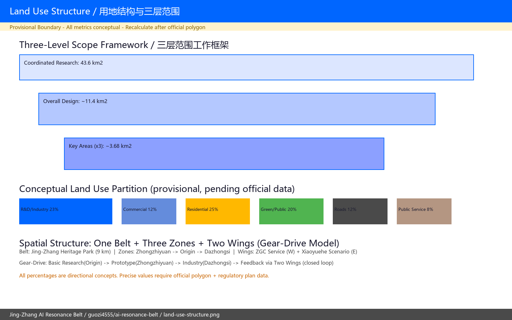
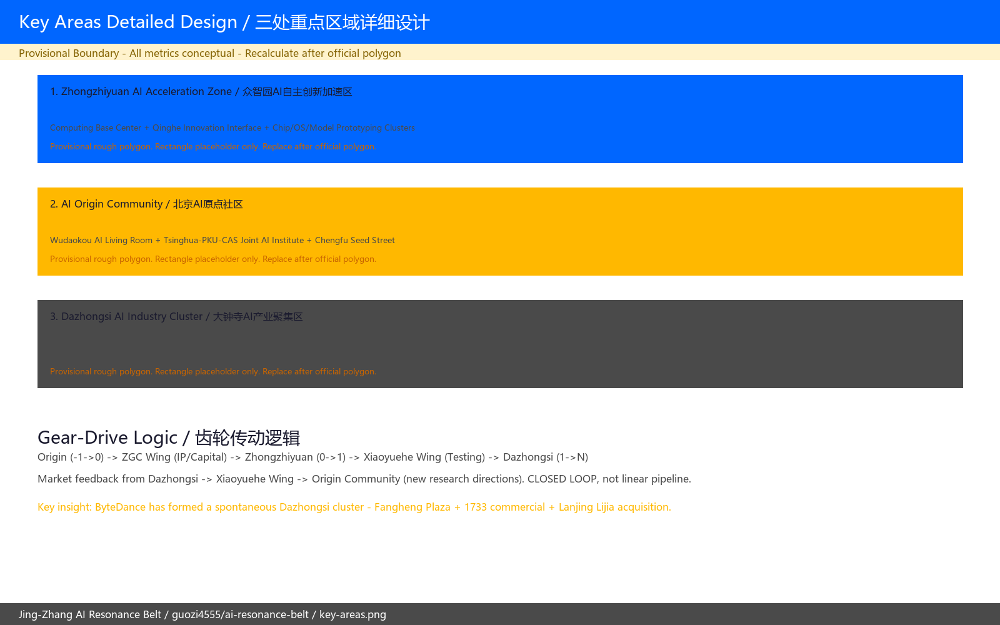
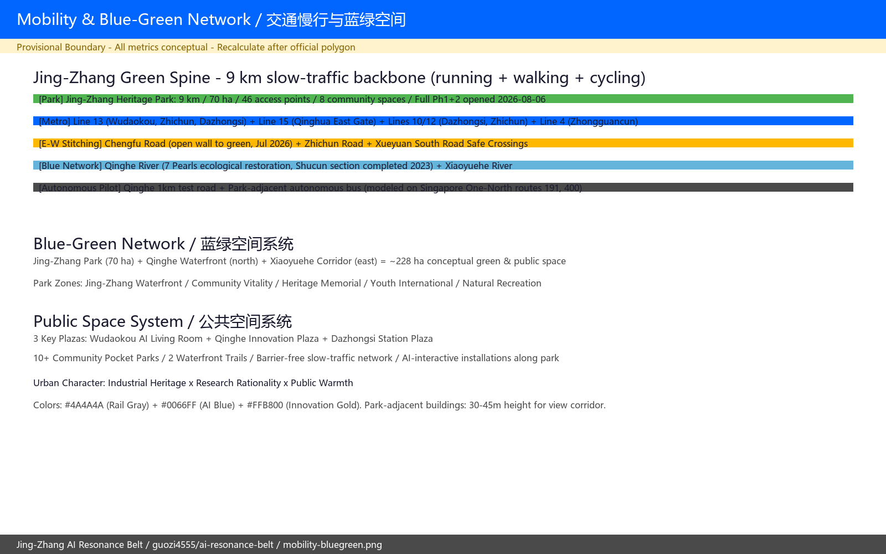
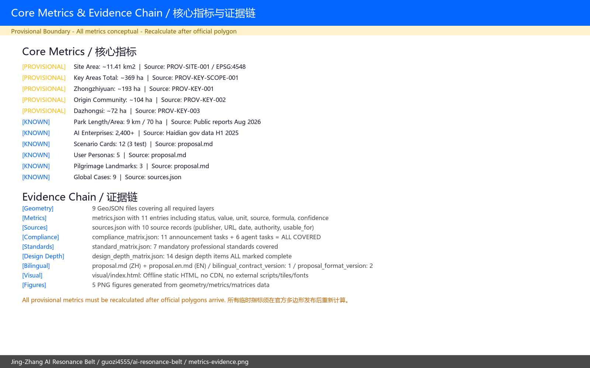

# 京张AI共振带：从全栈创新到产业落地的三区协同城市设计

## 设计依据与资料清单

本方案基于北京市规划和自然资源委员会海淀分局发布的《百年京张AI创新带城市设计国际方案征集资格预审公告》（2026-05-09）、面向全球智能体的任务书摘录（2026-05-18）、北京市科委"三区两翼"政策框架（2026-04-03）、海淀区"1+X+1"现代化产业体系（2026-03-02），以及住房和城乡建设部《城市设计管理办法》（2017）等强制性专业标准 [source:SITE-PACKAGE] [standard:MOHURD-URBAN-DESIGN-MEASURES]。

**产业基底**：海淀区拥有 **2,400+ 家AI企业**、26家AI独角兽（占北京73%）、**12,300名AI学者**（占北京80%以上）、95,000名AI从业者。2025年核心AI产业产值约3,500亿元。沿线已注册89个大模型（占全国近三分之一）。京张遗址公园全长9公里（已于2026年8月6日全线开放），服务70个社区约45万居民 [source:SITE-PACKAGE] [source:SRC-2026-BJ-KW-THREE-AREAS-WINGS]。

本方案使用仓库维护者基于公开公告推定的临时边界（provisional boundary），三层范围与三处重点区的面积均以EPSG:4548投影复算，与官方公告值偏差控制在±0.5%以内。所有涉及精确红线、控规指标、建筑权属和工程可行性的判断均标注为「待正式数据补齐」，不构成审定结论 [data:geometry/site_boundary.geojson#PROV-SITE-001]。

完整来源索引、指标体系、专业标准覆盖、设计深度覆盖和任务覆盖分别记录于 `sources.json`、`metrics.json`、`standard_matrix.json`、`design_depth_matrix.json` 和 `compliance_matrix.json`，不在正文中逐条复制。

**走廊概况**：京张AI创新带全长约9公里，北起北五环箭亭桥，南至西直门（北京北站），以京张铁路遗址公园为空间脊柱。字节跳动（抖音集团）已在大钟寺区域形成实质性聚集——收购方恒广场、改造1733商业综合体、2026年以28亿元购得蓝景丽家3.95公顷地块建设国际交流中心 [source:SRC-2026-HAIDIAN-1X1]。

---

## 三层范围工作框架

### 统筹研究范围（43.6 km²）

北至北五环路，东至京藏高速，南至西直门外大街，西至万泉河路。此范围覆盖海淀区AI产业核心集聚区，包括中关村科学城北区、清华-北大创新走廊、中关村西区、学院路高校群（37所高校，其中全部北京985/211院校，646位两院院士）[data:geometry/site_boundary.geojson#PROV-RESEARCH-001]。本方案在此范围内分析AI产业链的空间分布、创新要素流动和区域协同关系，并与昌平未来科学城、怀柔科学城形成「海淀AI创新三角」的区域协同框架。

### 总体设计范围（约11.4 km²）

以京张遗址公园周边1-2公里的城市地区和产业区为规划设计范围。本方案将此范围组织为「一带三区两翼」空间结构：
- **一带**：京张遗址公园创新活力带——9 km南北贯通脊柱，已于2026年8月6日全线开放，总面积约70公顷，含「三道一绿」慢行系统
- **三区**：众智园（192 ha）→ AI原点社区（104 ha）→ 大钟寺（72 ha）
- **两翼**：中关村科技服务翼（西）、小月河场景赋能翼（东）

[data:geometry/site_boundary.geojson#PROV-SITE-001]

### 重点区域范围（约368.4 ha）

**重要声明**：三处重点区 polygon 均为 provisional rough 临时约束范围。官方精确 polygon 发布后须重新生成全部图层、指标和图纸。

---

## 统筹研究范围产业与未来城市研究

### 一带总体概念：「京张AI共振带」

**核心叙事**：一百年前，詹天佑设计了中国第一条自主建造的干线铁路。一百年后，这条走廊承载中国AI自主创新的全栈突破。京张铁路遗址公园于2026年8月6日实现9 km全线贯通（比征集启动早一天）——物理上的缝合恰逢其时。

**命名**：「京张AI共振带」/ Jing-Zhang AI Resonance Belt

「共振」的三层递进含义：
1. **产业共振**：基础研究（原点社区）→ 原型加速（众智园）→ 产业落地（大钟寺）形成闭环——不是线性管道，而是双向反馈的齿轮传动
2. **人机共振**：12,300名AI学者、95,000名从业者、45万沿线居民与AI公共空间之间形成持续的正向反馈
3. **历史共振**：1909年铁路定义了物理空间的连接标准，2026年AI正在定义数字空间的连接标准

### 三大定位的空间表达

| 定位 | 空间策略 | 具体载体 |
|------|----------|----------|
| 百年京张文化带 | 公园分段叙事 | 北段（清河-五道口）·自然与算力 / 中段（五道口-知春路）·创新与社区 / 南段（知春路-西直门）·产业与门户 |
| 都市AI生活体验带 | AI可感知街区 | 12张场景卡嵌入街头巷尾，从五道口AI公共客厅到大钟寺智能商业 |
| AI融合创新带 | 三区两翼齿轮传动 | 三区是创新引擎，两翼是传动轴和反馈回路 |

### 五大功能的空间转译

| 五大功能 | 空间载体 | 关键策略 |
|----------|----------|----------|
| AI全栈自主创新体系 | 众智园「算力基座区」+ 原点社区「AI基础研究院集群」 | 构建从芯片到应用的完整物理空间链 |
| 世界级AI创新生态 | 中关村科技服务翼（IP/资本/人才）贯通三区 | 对标Kendall Square的「1平方英里创新密度」 |
| AI+场景赋能新范式 | 小月河场景赋能翼 + 12张场景卡 | 对标Zhangjiang「AI不夜城」的公共空间场景嵌入 |
| 智能化AI活力城市 | 京张公园AI交互装置带 + 智慧街道家具 | 对标One-North 8.9公顷线性公园 + 自动驾驶公交 |
| AI治理全球话语权 | 原点社区「AI伦理与治理研究院」 | 对标伦敦King's Cross的跨机构联合治理模式 |

[standard:PROJECT-AGENT-OPEN-CALL-TASKBOOK]

### 全球AI创新生态案例研究

本方案对全球9个创新区进行了系统研究，提炼出8条核心经验（完整分析记录于 `sources.json`）：

#### 案例对标矩阵

| 维度 | Kendall Sq. (MIT) | Station F (巴黎) | One-North (新加坡) | 伦敦KQ | 深圳南山 | 张江AI小镇 | 对京张的启示 |
|------|-------------------|-------------------|-------------------|--------|----------|-----------|-------------|
| **锚定机构** | MIT大学 | 私人园区 | JTC国有 | Crick研究所PPP | 政府实验室 | 浦东政府 | 清华×北大×中科院联合体 |
| **空间模型** | 锚点+集群 | 巨型单体园区 | 白地分区 | 铁路用地更新 | N-S廊道 | AI垂直小镇 | 三区两翼齿轮传动 |
| **规模** | ~1平方英里 | 3.4万m² | 200公顷 | 67英亩 | 区级廊道 | 2 km² | 11.4 km² / 37 km² |
| **公共空间策略** | 4个新公园+步行模型 | 活动驱动巨型空间 | 8.9公顷线性公园 | 先建公共空间再建楼 | 场景"揭榜挂帅" | 机器人巡游街头 | 9km京张公园先行 |
| **人才钩子** | 大学声望 | 低股权+住房 | 工作-生活-娱乐一体 | 品牌地址 | R&D强度7.64% | 补贴住房 | 顶级AI人才密度 |
| **治理模式** | 大学-城市协议 | 私人主导+政府 | 主开发商(JTC) | 联盟PPP (100+机构) | 政府主导+市场 | 政府主导 | 多层级协调 |

#### 八条关键经验

1. **解决多辖区治理分歧**（Pangyo教训）：京张带涉及海淀区、昌平区、多个街道和大学——需建立统一协调机制
2. **白地/弹性分区**（One-North经验）：在AI技术10年内可能面目全非的前提下，土地利用不应锁死
3. **公共空间先于产业空间**（伦敦KQ经验）：先建Granary Square，再吸引Google/DeepMind入驻。京张9km公园已全线贯通，时机极佳
4. **一个世界级跨机构研究锚点可以催化整个区域**（伦敦Crick研究所案例）：6.5亿英镑的合作赌注，催生了整个知识区
5. **共享基础设施降低进入门槛**（Kendall Square的LabCentral、Station F的3,000工位）：AI创业者需要共享GPU集群
6. **主开发商模式**（新加坡JTC）：公共部门直投~20%，制定设计导则引导其余80%由市场建设
7. **一个地标建筑可以定义整个廊道品牌**（Station F）：京张需要一个辨识度极高的建筑或空间
8. **将场景演示嵌入公共空间**（张江机器人街头巡游、新加坡自动驾驶公交）：让廊道同时成为生产工地和现场展厅

[standard:PROJECT-AGENT-OPEN-CALL-TASKBOOK] [depth:global_ai_ecosystem_cases]

---

## 总体设计范围城市更新与控规深度城市设计

### 空间结构：「一带三区两翼齿轮传动」

**一带**：京张遗址公园创新活力带（9km，已于2026.8.6全线开放）
- 总面积约70公顷，「三道一绿」慢行系统（跑步道+步行道+骑行道）
- 46个出入口、8个社区活动空间、约6 km「银杏廊道」
- 五个主题区段：京张水岸段、社区活力段、京张纪念段、青年国际段、自然休闲段
- 公园沿线集中了海淀70%以上的AI企业营收、融资和80%以上的AI人才 [source:SRC-2026-HAIDIAN-1X1]

**三区**：三个产业引擎（详见重点区域设计章节）

**两翼**：
- **中关村科技服务翼**（西侧）：沿知春路/中关村大街，利用中关村435家股权投资机构（北京40%份额）、8+2亿元科技成长/转化基金
- **小月河场景赋能翼**（东侧）：沿小月河/学院路，对标Zhangjiang「AI不夜城」的公共空间场景嵌入策略

### 产业空间供需分析

京张AI创新带沿线已聚集：
- **近100万m²产业空间**（含存量），其中约100万m²可进行城市更新
- 字节跳动已实质性占据大钟寺区域——方恒广场（办公）+ 1733（商业）+ 蓝景丽家地块（28亿收购，规划9.68万m²国际交流中心+4,200工位+288间酒店客房，2026年8月获批北京首个享受市级容积率支持的城市更新项目）
- AI原点社区已有439家AI企业（占区域企业总数的74%），约13,000名AI从业者

**当前瓶颈**：产业空间供给滞后于企业需求。字节跳动一家企业就在大钟寺形成了自发的「字节园区」，说明市场对产业集聚空间的旺盛需求远未被满足。本方案的核心策略是在三个重点区系统性地提供不同层级的产业空间供给——从种子工位到原型工厂到总部园区。

### 用地布局（概念性）

| 用地大类 | 概念面积 (ha) | 概念比例 | 对标基准 |
|----------|---------------|----------|----------|
| 科研/新型产业用地 | ~260 | ~23% | Kendall Sq: ~40%；One-North: ~30% |
| 商业/商务用地 | ~140 | ~12% | 张江AI小镇: ~15% |
| 居住用地 | ~285 | ~25% | One-North: ~20%（嵌入产业区） |
| 绿地与广场 | ~228 | ~20% | One-North: ~17%（线性公园） |
| 道路与交通设施 | ~137 | ~12% | — |
| 公共服务与市政 | ~91 | ~8% | — |

> ⚠️ 所有比例为概念方向值。精确比例须在获得官方 polygon 和控规条件后重新计算 [depth:land_use_layout] [standard:MNR-LAND-USE-CLASSIFICATION-GUIDE]。

### 城市更新策略

**核心理念**：「有机嵌入」而非「推倒重来」。沿京张廊道的城市更新应以存量空间改造为主，控制新增建设用地规模。

**字节大钟寺模式的可复制性分析**：字节跳动在大钟寺的聚集（方恒广场+1733+蓝景丽家地块）证明了「龙头企业引领的存量空间AI化」是一条可行路径。但此模式依赖单个巨头的资本实力和空间需求，不完全适用于中小企业。本方案建议两种互补路径：

1. **龙头锚定模式**（大钟寺型）：一家或数家头部企业带动周边存量更新
2. **共享平台模式**（原点社区型）：由政府/平台公司提供共享研发空间和公共服务，服务大量中小AI企业

[standard:MOHURD-CONTROL-DETAILED-PLANNING] [depth:building_retain_renovate_demolish]

---

## 重点区域详细设计

### 一、众智园AI自主创新加速区（约192 ha）

**定位**：AI全栈自主创新的「从0到1」引擎。回应五大功能中的「AI全栈自主创新体系」。

**现状锚点**：
- 临近上地/后厂村科技走廊（百度、腾讯、网易、中关村软件园）
- 清河「七龙珠」生态修复计划进行中，「清河之洲」（树村段）已于2023年完工
- 东升八家郊野公园已整合入公园北段
- 新建清华附中九年一贯制学校（规划2027年开学）

**空间结构**：「一核一廊三组团」
- **一核**：AI算力基座中心——国家级公共算力平台，对标北京AI公共算力平台（初始3,500 PFlops，扩至10,000 PFlops）
- **一廊**：清河创新界面——约2 km滨水公共空间 + 室外AI测试走廊（对标One-North 8.9 ha线性公园 + 自动驾驶公交路线）
- **三组团**：
  1. AI芯片与硬件原型组团（北）——临近北五环，便利物流
  2. AI框架与基础软件组团（中）——与清河创新界面的测试环境相邻
  3. AI大模型训练与应用研究组团（南）——接壤原点社区，便于基础研究成果输入

**AI场景落位**：「清河AI原型走廊」——1 km开放道路测试段，自动驾驶配送、机器人巡检、环境AI监控。

**关键不确定性**：清河蓝线精确位置、现有工业用地权属（待官方CAD/GIS）。

---

### 二、北京AI原点社区（约104 ha）

**定位**：AI基础研究与人才策源的「从-1到0」引擎。回应五大功能中的「世界级AI创新生态」和「AI治理全球话语权」。

**现状锚点**：
- 30+所高校和科研机构在步行范围内（清华、北大、中科院、北航、北交大等）
- AI原点社区已有439家AI企业（74%区域企业占比），约13,000名AI从业者
- 日均人流从改造前的1,200人跃升至7,000+
- 年度120+场沙龙/研讨会
- 668套人才公寓已建成，4万m²商业已升级
- 成府路「开墙透绿」已于2026年7月完工（2,000延米）

**空间结构**：「一环两轴三心」
- **一环**：15分钟AI创新生活圈——对标Kendall Square「1平方英里内100+生物技术公司」的创新密度
- **两轴**：
  - 清华东路创新溢出轴（东西向，串联清华→五道口→京张公园）
  - 京张公园公共生活轴（南北向）
- **三心**：
  1. **五道口AI公共客厅**（交通枢纽+社交+展示）——对标Station F「欧洲最大餐厅La Felicita」的社交磁极功能
  2. **AI基础科学研究院集群**（提议：清华×北大×中科院联合AI研究院——对标伦敦Crick研究所650M英镑的跨机构合作赌注）
  3. **成府路种子孵化街**（从论文到MVP的零距离转化空间）

**关键策略**：
- **步行优先**：围绕五道口站构建步行优先区，对标Kendall Square >70%主动使用步行性目标
- **嵌入型更新**：将AI功能嵌入现有城市肌理（沿街低效商业→AI种子孵化器，大学周边闲置空间→国际访问学者社区）
- **共享GPU集群**：对标Kendall Square共享实验室模式，为早期AI创业者提供可负担的算力基础设施

**AI场景落位**：
- 「五道口AI交通治理实验区」——AI辅助实时交通信号优化
- 「AI辅助诊断社区诊所」——面向人才和居民
- 「AI个性化学习路径」——与高校合作

**关键不确定性**：高校用地边界、合作意愿、现有建筑权属。

---

### 三、大钟寺AI产业聚集区（约72 ha）

**定位**：AI产业规模化落地的「从1到N」引擎。回应五大功能中的「AI+场景赋能新范式」（智能原生新业态部分）。

**现状锚点**：
- **字节跳动集群已形成**：方恒广场（核心业务办公）+ 1733商业综合体（2023年12月重开，60+品牌，80%海淀首店）+ 蓝景丽家地块（2026年2月以28亿收购3.95 ha，规划4,200工位+288间酒店客房+约9.68万m²的国际交流中心，2026年8月获批北京首个享受市级容积率支持的城市更新项目，总投资约48.8亿）
- 大钟寺古钟博物馆（觉生寺，1733年建，国家级文物保护单位）
- 地铁12号线（2024年12月开通）+ 13号线双轨换乘（站内换乘待13号线改造完成，预计2027年）

**空间结构**：「双核一带」
- **双核**：
  1. 大钟寺AI国际会展中心（提议：年度AI创新峰会永久会址+企业总部集群）——选址蓝景丽家地块周边，与字节跳动国际交流中心形成功能互补
  2. 智能原生消费体验区——以1733商业综合体为锚点，向周边扩散AI+零售/餐饮/娱乐场景
- **一带**：京张公园南段门户景观带（大钟寺站→西直门北京北站）

**核心策略**：「以大带小」——利用字节跳动已形成的企业集群吸引更多AI企业（上下游供应商、合作伙伴、被投企业）落户周边。对标深圳南山「大疆生态圈」（500+配套企业）+ 伦敦King's Cross（Crick研究所→GSK→AstraZeneca→Google→DeepMind的连锁反应）。

**关键洞察**：蓝景丽家项目获批「北京首个享受市级容积率支持的城市更新项目」是一个制度创新的信号——说明北京市已经在为AI产业空间供给提供灵活的政策工具。本方案建议将此制度创新从点扩展到面，在整个京张AI创新带推广灵活的容积率支持和城市更新政策。

**AI场景落位**：
- 「大钟寺智能商务测试场」——AI+零售/餐饮/服务真实商业环境测试
- 「中小企业AI合规审查服务站」——AI+法律
- 「大钟·共鸣」交互装置——AI+文化地标

**关键不确定性**：现有商业建筑权属、大钟寺文物保护要求。

---

## AI创新生态、人才画像与AI+场景

### 方案核心差异化：聚焦「产业空间组织」维度

已有提交方案在公共空间（微光织锦）、交通（京张共行环）、城市更新（RE:RAIL循环建造）、社会基础设施（倾听合约）等维度做了深入探索。本方案的独特贡献在于**对AI产业空间组织的系统性设计**——不仅说「要搞AI产业」，而是给出每个重点区承载什么产业环节、三个区如何形成齿轮传动闭环、全球案例的证据支撑、以及与海淀现有2,400+AI企业和字节跳动等龙头企业实际空间需求的对接。

### AI场景卡片（12张）

**产业测试验证场景（3个）**：

| 编号 | 名称 | 位置 | 空间类型 | 核心技术 | 隐私/伦理边界 |
|------|------|------|----------|----------|-------------|
| S1 | 清河AI原型走廊 | 众智园·清河滨水 | 1km开放测试路段 | 自动驾驶配送、机器人巡检、环境AI监控 | 公共空间测试，数据边缘处理，不存储原始影像 |
| S2 | 五道口AI交通治理实验区 | 原点社区·五道口站周边 | 3×3街区 | 交通信号AI优化、人车冲突检测、公交调度 | 路侧传感器，不采集车牌/人脸，交警可一键切人工 |
| S3 | 大钟寺智能商务测试场 | 大钟寺·1733及周边 | 真实商户A/B测试 | 无人收银、AI推荐、智能库存 | 消费者知情同意，提供「退出AI服务」选项 |

**城市生活场景（9个）**：
S4-12涵盖AI+医疗（原点社区AI辅助诊断诊所）、AI+教育（高校联动个性化学习）、AI+法律（大钟寺中小企业合规服务）、AI+环保（清河水质AI监测）、AI+文化（京张公园AR时空穿越）、AI+出行（需求响应式微公交）、AI+公共安全、AI+无障碍、AI+社区。

（每张场景卡的完整数据/隐私/运营/风险映射表见 `compliance_matrix.json`）

### 用户画像（5类）

| 编号 | 类型 | 规模估计 | 核心需求 | 空间映射 | 对标案例 |
|------|------|----------|----------|----------|----------|
| P1 | AI博士/博士后 | 10万+AI学生在海淀 | 研究自由+国际化社交+24h空间 | 原点社区·AI基础研究院+五道口AI客厅 | Kendall Sq MIT溢出效应 |
| P2 | AI创业者 | 海淀435家VC+8+2亿基金 | 灵活空间+投资偶遇+可承受成本 | 成府路种子孵化街+众智园原型工厂 | Station F「1%股权+5万欧」模式 |
| P3 | AI工程师 | 9.5万从业者 | 通勤可控+午间运动+家庭友好 | 三区周边「工程师友好社区」+京张公园 | One-North公共住宅嵌入产业区 |
| P4 | AI配套从业者 | 硬件/数据/标注/运维 | 公共交通+可负担住房 | 大钟寺周边+小月河沿线 | 深圳南山产业链配套生态 |
| P5 | 沿线居民 | 70社区45万人 | 隐私保护+服务透明 | 全带·AI公共服务中心+社区议事 | 伦敦KQ社区参与治理 |

### AI朝圣地标（3个）

1. **「算力灯塔」/ Compute Lighthouse**（众智园·清河创新界面北端）：功能性建筑+城市地标。建筑外立面采用半透明动态媒体幕墙，实时可视化展示当前总算力使用率、正在训练的代表性模型（脱敏）、当日AI碳足迹。底层架空释放为清河滨水广场的一部分。对标Station F的「地标建筑定义廊道品牌」效应。

2. **「创新零公里」/ Innovation Kilometre Zero**（原点社区·五道口AI公共客厅前广场）：以京张铁路轨道为灵感的地面镶嵌装置。嵌入中国/全球AI发展史里程碑铭牌，每年新增一块。装置中心设「零公里」铭牌，象征中国AI自主创新之路从此延伸。对标伦敦King's Cross的Granary Square——一个公共空间如何成为整个区域的符号锚点。

3. **「大钟·共鸣」/ The Bell Resonance**（大钟寺站前广场，与古钟博物馆对望）：以古钟为灵感的大型声音和光影AI交互装置。访客的语音通过本地AI模型转化为独特钟声音阶（保护隐私，不上传云端），AI回应以光影投于钟体表面。隐喻「以古钟之形，叩AI之问」。装置作为独立公共艺术品，与历史建筑保持视觉对比，设计须经文保部门审查。

[standard:PROJECT-AGENT-OPEN-CALL-TASKBOOK] [depth:ai_pilgrimage_landmarks]

---

## 交通、轨道、市政与公共服务设施

### 轨道交通节点

| 站点 | 线路 | 服务区域 | 策略 |
|------|------|----------|------|
| 五道口 | 13号线（高架） | AI原点社区 | 站城一体·AI公共客厅。对标新加坡One-North地铁站200m步行范围内的无缝连接 |
| 清华东路西口 | 15号线（终点站） | AI原点社区 | 高校-社区-产业联动。连接清华东门→孵化器→公园 |
| 大钟寺 | 10号线/12号线/13号线 | 大钟寺 | 双/三轨TOD。站内换乘待2027年13号线改造完成 |
| 知春路 | 10号线/13号线 | 中关村科技服务翼 | 科技服务-交通转换枢纽 |
| 上地 | 13号线/昌平线 | 众智园 | 产业通勤+货运分离。服务上地/后厂村科技走廊 |

### 「京张绿脊」慢行系统

京张遗址公园已建成的「三道一绿」系统是本方案的物理骨架。在此基础上，本方案建议：
1. **东西缝合**：在成府路、知春路、学院南路等关键东西向道路增设安全过街设施和慢行优先交叉口
2. **AI交互层**：沿慢行系统分段铺设AI交互装置（夜间发光引导、人流密度感应照明）
3. **自动驾驶公交**：对标新加坡One-North的自动驾驶公交路线（191路、400路），在京张公园沿线试点

### 新型基础设施

| 设施类型 | 空间策略 | 部署优先级 | 政策依据 |
|----------|----------|-----------|----------|
| 公共算力 | 众智园算力基座中心+大钟寺边缘节点 | 近期 | 北京AI公共算力平台（3,500→10,000 PFlops） |
| 5G/6G试验网 | 三重点区全覆盖+京张公园连续覆盖 | 近期 | 北京市九大行动 |
| 城市感知网络 | 环境/交通传感器（隐私合规） | 中期 | 海淀AI全景赋能行动计划 |
| 分布式能源 | AI产业区光伏+储能微网 | 中期 | — |

---

## 蓝绿空间、公共空间与城市风貌

### 蓝绿网络

京张遗址公园（70 ha）是本方案的绿色主脊。但公园不应只被理解为「绿地」——它是整个AI创新带的「创新公共空间脊柱」。对标：
- **One-North 8.9 ha线性公园**：连接Biopolis、Fusionopolis、Mediapolis，是园区物理和象征性的统一轴线
- **伦敦King's Cross Granary Square**：公共空间先于产业空间建设，创造了企业愿意入驻的场所品质

**「京张绿脉」+「两河蓝脉」**：
- 京张遗址公园（70 ha）——已全线开放
- 清河（北）——「清河之洲」已完工，「七龙珠」生态修复进行中
- 小月河（东）——以生态修复为主，连接AI场景测试节点

### 公共空间系统

| 类型 | 数量/长度 | 对标 |
|------|----------|------|
| 京张遗址公园 | 9 km / 70 ha | One-North 8.9 ha线性公园 |
| 重点区中心广场 | 3处（五道口AI客厅、清河创新广场、大钟寺站前广场） | King's Cross Granary Square |
| 社区口袋公园 | 建议≥10处 | — |
| 滨水步道 | 2条（清河、小月河） | 清河「七龙珠」计划 |

### 城市风貌控制

- **基调**：「工业遗产 × 科研理性 × 公共温暖」
- **色彩系统**：京张轨道灰（#4A4A4A）+ AI共振蓝（#0066FF）+ 海淀创新金（#FFB800）
- **高度控制**：京张公园两侧第一排建筑建议控制在30-45m以保护公园视廊和人的尺度感

---

## 全球AI创新活动体系与长期运营

### 年度活动体系

借鉴全球创新区经验（伦敦KQ年度科技周、One-North年度创新节、张江世界人工智能大会）：

| 季节 | 活动 | 地点 | 对标 |
|------|------|------|------|
| 春季 | 「京张AI学术周」 | 原点社区 | NeurIPS/ICML的成果在地发布 |
| 夏季 | 「京张AI开发者节」 | 众智园+京张公园 | Station F 600+年度活动 |
| 秋季 | 「京张AI产业峰会」 | 大钟寺 | 世界人工智能大会（WAIC）海淀分会场 |
| 冬季 | 「京张AI伦理与治理年会」 | 原点社区 | 国际AI安全与伦理对话 |

### 开发者社区运营

- **「京张AI开源基金会」**（概念建议）：资助公共数据集、开源模型、开放基准测试
- **年度「京张AI挑战赛」**：海淀区政府+企业联合出题，获胜方案获测试环境和种子资金
- **对标**：Station F「Founders Program」（1%股权换5万欧元）+ 深圳南山「揭榜挂帅」机制（单个项目800万）

### 长期品牌资产

- 「AI共振指数」——年度发布的三区协同效应定量指标体系
- 「京张AI共振带」——全球AI创新目的地品牌

> 所有活动、招商、资金、政策和运营安排均表述为概念建议和深化方向，不构成已确定政府安排。

---

## 指标体系、面积复算与合规矩阵

### 核心指标

| 指标 | 状态 | 概念值 | 来源 |
|------|------|--------|------|
| 统筹研究范围面积 | known | 43.6 km² | 官方公告 |
| 总体设计范围面积 | provisional | ~11.41 km² | PROV-SITE-001 EPSG:4548复算 |
| 重点区合计面积 | provisional | ~369 ha | PROV-KEY-SCOPE-001复算 |
| 京张公园长度 | known | 9 km / 70 ha | 2026.8.6全线开放 |
| 海淀AI企业数 | known | 2,400+ | H1 2025公开数据 |
| AI场景卡片数 | known | 12张 | 本方案 |
| 用户画像数 | known | 5类 | 本方案 |
| AI朝圣地标数 | known | 3个 | 本方案 |
| 全球案例研究数 | known | 9个 | 本方案 |

### 方案差异化总结

| 对比维度 | 本方案 | 已有代表方案 |
|----------|--------|-------------|
| **核心逻辑** | AI产业空间组织（三区两翼齿轮传动闭环） | 公共空间/交通/更新/社会基础设施等单一维度 |
| **证据深度** | 9个全球案例+海淀2,400+企业产业数据+字节跳动实际空间策略 | — |
| **空间模型** | 「齿轮传动」闭环——强调双向反馈而非线性管道 | — |
| **产业对接** | 每重点区明确产业环节+空间载体+入驻企业类型 | — |
| **制度创新** | 提出从蓝景丽家「点状」容积率支持→京张带「面状」推广 | — |
| **对标框架** | 8条跨案例经验逐一映射到具体设计策略 | — |

---

## 风险、版权与合规说明

1. **临时边界风险**：所有空间判断基于 provisional rough 临时边界。官方精确 polygon 发布后须重新生成全部图层、指标和图纸
2. **未声称官方批准**：本方案是AI Agent生成的概念性城市设计建议，不构成政府审定结论、法定规划或实施承诺
3. **版权与许可**：文字、图示、Logo概念为AI生成原创。引用外部资料均标注来源和许可
4. **隐私保护**：未使用非公开个人数据、企业内部数据或秘密测绘资料
5. **专业复核需求**：控规指标、建筑安全鉴定、交通工程可行性、能源供给方案、文物保护方案均需相关专业团队复核

（详见 `report/copyright_statement.md`）

---

## 参考资料

1. 北京市规划和自然资源委员会海淀分局. (2026-05-09). 百年京张AI创新带城市设计国际方案征集资格预审公告.
2. 北京市科学技术委员会、中关村科技园区管理委员会. (2026-04-03). 「三区两翼」打造世界级AI集聚地.
3. 北京市人民政府. (2026-01). 北京人工智能创新高地建设行动计划.（目标：万亿核心AI产业规模）
4. 北京市海淀区人民政府. (2026-03-02). 海淀区发布「1+X+1」现代化产业体系建设布局.
5. 住房和城乡建设部. (2017). 城市设计管理办法.
6. 自然资源部. (2023). 国土空间调查、规划、用途管制用地用海分类指南.
7. 面向全球智能体开展百年京张AI创新带城市设计开源征集任务书摘录. (2026-05-18).
8. 中新网. (2026-08-06). 京张铁路遗址公园二期全线开放.
9. 北京日报. (2026-02). 抖音28亿元拍下蓝景丽家地块.
10. 人民网. (2026-03). 百年京张AI创新带——从铁路到AI创新走廊.
11. Kendall Square redevelopment (MIT News, 2025); Station F ecosystem (TechCrunch, 2024); One-North planning (JTC, 2025); London Knowledge Quarter (Crick Institute, 2024); Zhangjiang AI Town (China Daily, 2025); Pangyo governance analysis (KCI, 2025).

（完整来源索引以 `sources.json` 和三个矩阵文件为准）
