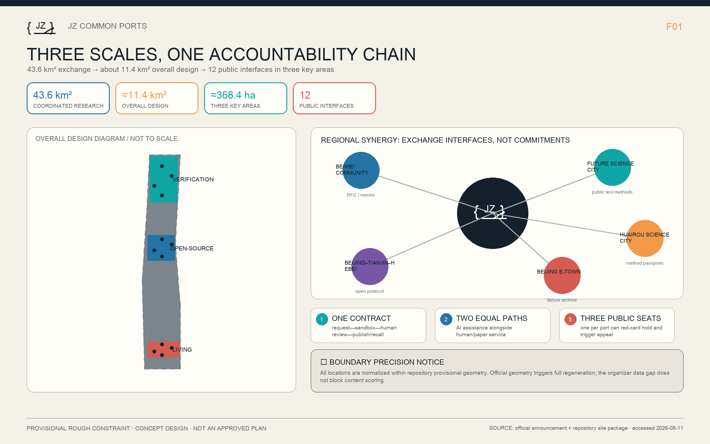
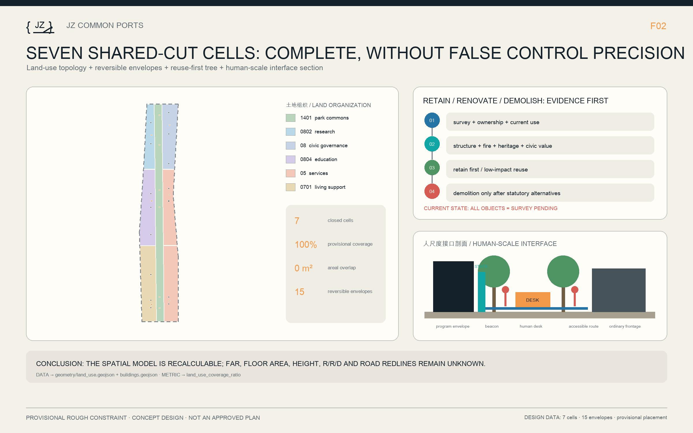
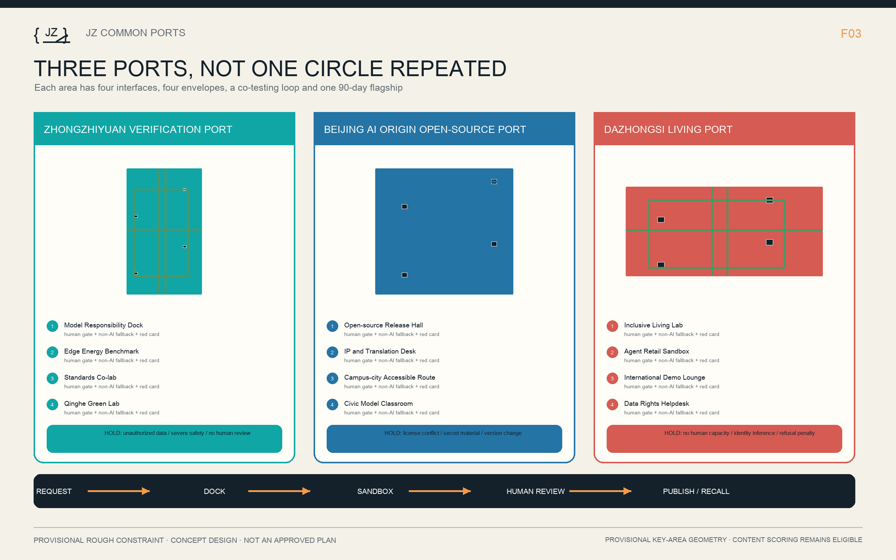
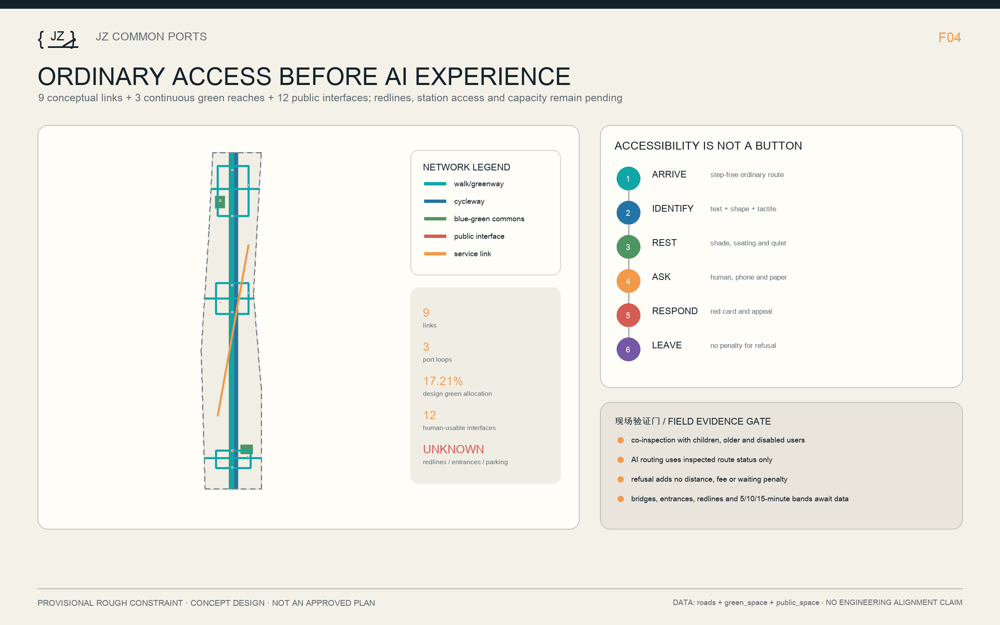
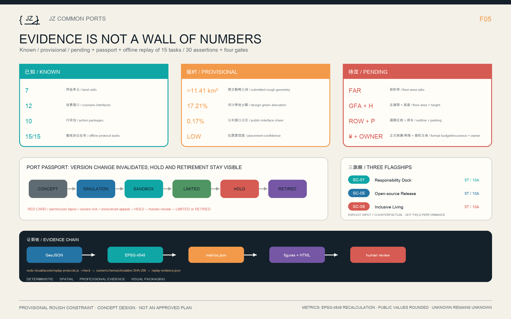

# JZ COMMON PORTS / Jingzhang Interface Commons

> v0.2 conceptual urban design; provisional rough geometry; neither an approved plan nor an implementation commitment. Every AI scenario retains an equivalent human and non-digital service by default. Any state upgrade requires human judgment by professionals, affected-group representatives and an authorized sponsor.

## Design Basis and Source List

The proposal treats the public announcement, the repository's latest Agent taskbook and the site package as its controlling references, while separating facts, design proposals and unknown conditions. The announcement establishes a 43.6 km² coordinated-research scale, an approximately 11.4 km² overall-design scale and three key areas totalling about 368.4 hectares. The repository does not yet contain statutory site polygons, parcels, road redlines, surveyed buildings, ownership, utilities, heritage or fire-safety data. `SITE-001` and the three `PROV-KEY-*` objects therefore support normalization, calculation and discussion only; they are never described as official redlines. [source:OFFICIAL-ANNOUNCEMENT]

| Evidence layer | What v0.2 can do | What it cannot do | Update trigger |
| --- | --- | --- | --- |
| Announcement and taskbook | Verify three scopes, three positions, five functions and six Agent tasks | Infer approval or implementation authority | Upstream brief change |
| Provisional GeoJSON | Generate topologically closed design cells, nodes and consistent metrics | Represent parcels, roads, heritage or ownership boundaries | Official polygons released |
| Public cases | Compare operating mechanisms, exchange interfaces and governance | Transfer boundaries, performance, controls or commitments | Source validity or intended use changes |
| Synthetic protocol fixtures | Check minimum data, human gates, hold and retirement rules | Prove field accuracy, safety, satisfaction or service performance | Model, schema or protocol version changes |

The machine retains `11,412,825.386 m²` solely for geometric consistency, while public-facing material says “about 11.41 km² (provisional geometry).” The announced scale is separately recorded as “about 11.4 km²”; the two values are not conflated. FAR, gross floor area, building height, road area, parking, municipal capacity, formal heritage controls, investment and actual delivery bodies remain unknown. Sources record publisher, link, access date, permitted use and limitation; eight assumptions, an eight-dimension risk register, a rights chain and a change log are separately structured.

## Three-Level Scope Framework

The three levels are one decision chain rather than three unrelated sets of drawings. Coordinated research asks what knowledge Jingzhang may exchange, with whom and within which boundary. Overall design asks how a public spine, three ports and two wings make a continuous urban system. Key-area design asks who reviews each interface, when it pauses and how it exits. This transmission appears in the narrative, five figures, GeoJSON, metrics, ten action packages and the offline HTML. [depth:three_level_scope_framework]

| Level | Decision object | v0.2 delivery | Treatment of uncertainty |
| --- | --- | --- | --- |
| Coordinated research, about 43.6 km² | Industry ecology, future city and regional coordination | Five-node regional interface, six case mechanisms and an eight-factor loop | No fake regional boundary and no assumed partnership |
| Overall design, about 11.4 km² | Renewal structure, industry-space relation, mobility, infrastructure and character | 7 land-use cells, 15 program envelopes, 9 links, 5 green objects and 12 public interfaces | All normalized to provisional geometry and regenerated when official data arrives |
| Three key areas, about 368.4 ha | Uses, public realm, scenarios and delivery | Four interfaces, one 90-day flagship, four program envelopes and a local co-testing loop per port | Concept locations only; no demolition or engineering conclusion |

### Core proposition and alternatives

“AI Innovation Boulevard” was rejected because a display corridor lacks rights, pause and retirement grammar. “Three AI Campuses” was rejected because institutional islands weaken the continuous commons and two-wing feedback. “JZ Common Ports” was selected because one Common Port Contract can connect spatial thresholds, AI states, identity, operations and public governance. The proposition fails—and an interface must stop—if non-AI parity cannot be maintained, affected groups cannot pause or appeal, official evidence invalidates placement, or operations and qualified human review are unavailable.

### One spine, three ports, two wings and twelve interfaces

The spine is a continuous railway-heritage commons with an accessible walking and cycling backbone. The ports are responsibilities rather than estate brands: Zhongzhiyuan Verification Port handles testing, energy, standards and public review; Beijing AI Origin Open-source Port handles licensed release, translation, learning and accessibility; Dazhongsi Living Port handles daily services, agent-native activity, international exchange and data rights. The wings supply Zhongguancun technology services and Xiaoyue River scenario feedback. Each interface is a free public threshold, a human-help point, a protocol display and a removable spatial component—not merely a corporate showcase.

The Common Port Contract is fixed as Request → Dock → Sandbox → Human Review → Publish/Recall. A port passport has six states: concept, simulation, sandbox, limited, hold and retired. A model or protocol version change invalidates previous tests. A public red card, expired permission, severe incident or unresolved appeal moves the interface to hold. Expiry never means automatic renewal: the interface is reviewed publicly, scoped data is deleted and a non-personal change record remains.

### Identity and regional coordination

The `{JZ}` mark combines API braces with a railway switch: braces express open access and a boundary; the switch expresses urban choice and human final judgment; the central void is the right to leave without AI. Ink and paper colors carry the evidence layer, teal identifies Verification, blue identifies Open-source, coral identifies Living, orange marks design proposals and purple is reserved for clearly labelled conceptual experience. The mark, sub-colors, status beacon, wayfinding, scenario cards and contribution archive share one grammar without unauthorized enterprise logos or portraits.

Regional coordination registers topic, exchange interface, spatial carrier and non-commitment boundary instead of drawing arrows that imply agreements. Beiwei Community may connect to the Open-source Port through public RFCs and mentor exchange; Future Science City may exchange public energy, life-science or frontier-research test methods; Huairou Science City may exchange public method passports for large science facilities; Beijing E-Town may exchange engineering verification specifications and failure archives; Beijing–Tianjin–Hebei may compare interoperable public-service and responsible-AI protocols. Membership, data, procurement, investment and administrative coordination still require separate authorization.

## Coordinated Research Area: Industry and Future City Research

International cases contribute mechanisms, not visual forms. one-north suggests mixing research, work, life and public space; STATION F makes shared founder services visible; Maria 01 demonstrates continuous community operations in adaptive reuse; Vector Institute links cross-institution talent with responsible-AI research; MIT Kendall Square couples campus-city translation with public-realm investment; Knowledge Quarter London coordinates culture, research and civic institutions through a network. Jingzhang translates these into paired wings, visible service desks, low-impact heritage components, mentors and responsibility passports, a near-campus translation street and joint public curation. [source:CASE-ONE-NORTH]

| Case mechanism | Jingzhang translation | Explicit limitation |
| --- | --- | --- |
| Research-life mixture | Seven cells plus a continuous public spine | No density, boundary or development model copied |
| Shared incubation service | Human referral desks in the service wing | No assumed policy, funding or tenant |
| Adaptive reuse | Removable envelopes and a reuse-first decision tree | No retain/renovate/demolish decision without survey |
| Talent and responsibility network | Mentor and review roles at two ports | No transfer of authority or institutional data |
| Campus-city translation | Accessible route, release hall and civic learning | No entry into campuses or use of research secrets |
| Culture-research collaboration | Four-season Common Port Week and contribution archive | No activity represented as confirmed |

The ecology links eight factors. Land remains a provisional design container. Space supplies reversible, affordable and shared public thresholds. Industry moves through a test–release–daily-feedback loop. Finance is represented only by three gates—operations reserve, independent audit fund and public-service quota—not by fiscal promises. Talent participates through mentors, learning and credited contribution. Compute begins with low-power simulation and waits for energy capacity. Data defaults to public, synthetic or user-supplied minimum inputs. Scenarios are capped at 90 days, a declared space and user group, and automatic retirement.

The future-city innovation is not “AI everywhere” but a changed responsibility structure for planning and operations: visible passports replace black-box deployment; failure and recall records replace success-only showcases; affected-group seats replace post-hoc satisfaction surveys; non-AI parity replaces digital compulsion; and official data invalidates and regenerates the full package instead of lending false precision. A public-value ledger records who benefits, who bears risk, how feedback changes space or protocol and why suggestions are not adopted.

## Overall Design Area: Urban Renewal and Regulatory-Plan-Level Urban Design

Seven shared-cut cells completely cover the provisional site with zero areal overlap. `LU-SPINE-01` is the heritage park and open-space spine. The northern wings host autonomous-innovation verification and standards/public governance; the middle wings host near-campus learning/translation and technology services; the southern wings host living support and agent-native services. Codes come from the site-package land-use enumeration, but the cells are design allocations rather than current-condition or statutory land-use changes. [metric:land_use_coverage_ratio]

The fifteen `BUILDING_FOOTPRINT` objects total 22,535.708 m² only as machine-readable reversible program envelopes, placing testing cabins, open-source halls, human desks and co-testing stations where their relationships can be discussed. They are not surveyed buildings, architectural designs, gross floor area or demolition decisions. Nine conceptual links comprise an accessible north–south walk, a continuous cycleway, three cross-stitches, three port loops and a two-wing link. Five blue-green objects comprise three continuous reaches and two reversible gardens. Twelve public interfaces occupy about 19,667 m², approximately 0.17% of the provisional area, expressing a small-and-reversible threshold strategy.

Five spatial rules apply. Ordinary walking and human service always precede the AI experience. Each port has four interfaces and at least one quiet public face. Program envelopes stay outside the central commons and express programs only. Every design object carries placement basis, precision limit, recalculation trigger and non-statutory status. Any conflict with official geometry, ownership, heritage, traffic, municipal or fire-safety evidence invalidates the location rather than changing the interpretation of facts.

Regulatory-plan-level depth is organized in three columns. Topology, object counts and conceptual lengths are recalculable. Public thresholds, links and program envelopes are design proposals. FAR, gross floor area, height, density, setbacks, road redlines, parking, utilities, energy, fire, waterways and ownership remain pending. This delivers reviewable urban design without dressing data gaps as confirmed controls.

## Detailed Design of Key Areas

The three key areas share the passport but differ in spatial task and failure condition. The rectangles in the figure remain repository provisional polygons, used only to normalize four interfaces, four envelopes, a co-testing loop and a flagship. The package must be regenerated when official polygons arrive. [data:geometry/key_areas.geojson#PROV-KEY-001]

### Zhongzhiyuan Verification Port: make testing responsibility visible

Its four interfaces are Model Responsibility Dock, Edge Energy Benchmark, Standards Co-lab and Qinghe Green Lab. Spatial actions bring internal testing to a public threshold, show status on a responsibility beacon, separate inspectable and data-isolated parts of a co-testing loop and make low power and ecological maintenance release prerequisites. Flagship `SC-01` uses synthetic model cards and logs to test minimum fields, severe-risk interception, human sign-off, red-card hold and retirement records over 90 days. Unauthorized data, a critical safety event, an unexplainable high-risk conclusion or absent human review pauses it.

### Beijing AI Origin Open-source Port: remember contribution and exit equally

Its four interfaces are Open-source Release Hall, IP and Translation Desk, Campus-city Accessible Route and Civic Model Classroom. Release becomes a public process with license and accessibility checks; legal, IP, talent and translation services become warm human referrals; the campus-city route remains non-digital; Open-source Rings record cleared contributions and withdrawal. Flagship `SC-05` reads only cleared repository metadata, license, tests and accessibility statements. A license conflict, secret material, a missing accessibility statement or a version change returns the process to a human release clinic.

### Dazhongsi Living Port: let residents refuse and small operators participate fairly

Its four interfaces are Inclusive Living Lab, Agent Retail Sandbox, International Demo Lounge and Data Rights Helpdesk. Spatial actions create public thresholds that do not require consumption, a quiet garden and human desk; behavioral profiling and discriminatory pricing are prohibited; the Echo Ledger shows how resident feedback changes product and space. Flagship `SC-09` uses synthetic service tasks, public directories and a voluntarily declared minimum need. High-stakes health, legal or welfare choices go to qualified people. Missing human capacity, identity inference or a service penalty for refusing AI pauses the pilot.

## AI Innovation Ecosystem, Personas, and AI+ Scenarios

The nine personas are interests, risks and governance seats—not marketing segments. Open-source developers need reproducibility and credit. Startups and SMEs need low-cost tests without pay-to-play exclusion. Residents need quiet daily life and real influence. Universities need translation and learning without research-data capture. Older and disabled people need access and human help. Small operators and frontline workers need affordability without automation displacement. Children and caregivers need untracked safe use. International users need bilingual transparent rules. Public-service staff need assistance without responsibility transfer. Parallel traditional and smart services are used as a design reference; the 2020–2022 phased targets are not represented as a continuing 2026 legal duty or proof of local implementation. [metric:persona_count] [standard:ELDERLY-SMART-TECH-PLAN-2020-45]

Every card declares an exact interface ID, personas, public purpose, minimum input, retention, forbidden data, AI role, non-AI fallback, accountable role, human gate, output, baseline, KPI, failure, pause, appeal, phase and retirement. The offline site expands the full cards; this table preserves the same decisions:

| ID / interface | Minimum data and AI role | Human and non-AI parity | Hold / acceptance |
| --- | --- | --- | --- |
| SC-01 Model Responsibility Dock | Model card and synthetic logs; check completeness and thresholds | Assurance reviewer, public steward and paper desk | Version/severe risk; fields and interception at 100% |
| SC-02 Edge Energy Benchmark | Device declaration and synthetic workload; compare a public envelope | Manual meter and calculation sheet | Excess budget/heat; method public and within envelope |
| SC-03 Standards Co-lab | Public standards and proposals; cluster conflicts | Professional facilitation and paper issue wall | Non-public/uncredited text; conflict closed or held |
| SC-04 Qinghe Green Lab | Non-personal observations; prioritize inspection | Manual board and hotline | Flood/ecology uncertainty; zero personal identifiers |
| SC-05 Open-source Release Hall | Cleared metadata and license; check release passport | License reviewer and human clinic | License/secret conflict; complete fields and visible appeal |
| SC-06 IP and Translation Desk | Non-confidential question and public guide; route only | Qualified service and printed directory | Legal conclusion/conflict; no retained confidential content |
| SC-07 Accessible Route | Voluntary need and inspected route status; explain options | Tactile map, signage and human help | Uninspected/unclosed barrier; ordinary route always works |
| SC-08 Civic Model Classroom | Synthetic cases and public docs; show alternatives | Educator-led device-free cards | Minor profiling/persuasion; users identify limits and appeal |
| SC-09 Inclusive Living Lab | Synthetic task and public directory; draft options | Professional, phone and paper desk | High-stakes/no human; refusing AI causes no downgrade |
| SC-10 Agent Retail Sandbox | Synthetic catalog and explicit query; no profiling | Ordinary labels and merchant service | Biometrics/discriminatory price; zero prohibited targeting |
| SC-11 International Demo Lounge | Cleared demo and language preference; uncertain translation | Bilingual host and printed guide | Uncleared IP/safety mistranslation; corrections logged |
| SC-12 Data Rights Helpdesk | User-chosen minimum case; explain and draft request | Independent human, phone, paper and mailbox | Legal judgment/excess identity; human response and deletion proof |

### Three replayable protocol pilots

`SC-01`, `SC-05` and `SC-09` each have five deterministic synthetic fixtures: minimum data, non-AI parity, red-card hold, human final judgment, and expiry/audit. Every task ships an explicit input, paired counterfactual, canonical hash, expected control, machine-derived control, schema result, tiny energy envelope and audit state. The dependency-free command `node visual/assets/replay-protocols.js --check` re-derives 15 primary and 15 counterfactual assertions, checks runner/schema/simulation hashes and compares persisted evidence; any drift exits non-zero. The current 15/15 result proves only that the v0.2 public-interest control logic is reproducible for these synthetic inputs, never model or field performance. Commands, schema and failure boundaries are in `assets/media/replay-protocol.md`. [metric:simulation_task_count]

If a field pilot is later authorized, each follows days 0–30 preparation and manual baseline, 31–60 closed testing, 61–90 capped public co-testing and independent expiry review. It cannot automatically expand its people, area or duration. One affected-group steward seat per port has a red-card hold. Independent appeal works in person, by phone and on paper; refusing AI never affects ordinary service, and a responsible human makes the final decision.

Field co-testing is pre-registered, not fabricated. A future minimum of 24 participant sessions covers older/disabled users with chosen supporters, residents and caregivers, small merchants and frontline workers, and developers/students/Chinese- and English-speaking visitors. No session begins without an authorized sponsor, accessible venue, staffed parity desk, informed consent, independent affected-group steward, privacy/insurance/safeguarding and emergency provisions. Pre-registered thresholds include a non-AI completion gap no greater than 10 percentage points; median non-AI wait no more than 1.20 times the digital path and no more than five extra minutes; no extra fee or off-site trip for refusing AI; zero critical access barriers; and a red card effective before the next public session. Nothing is marked passed without independently reviewed real observations.

## Land Use, Building Scale, and Retain-Renovate-Demolish Strategy

The seven conceptual cells use permitted codes including `1401 / 0802 / 08 / 0804 / 05 / 0701`, making the public spine, verification R&D, learning/translation, technology services and living support a verifiable spatial relation. Their union matches the provisional site and overlap is zero, but the codes organize v0.2 functions and do not alter current or statutory land use. [data:geometry/land_use.geojson#LU-SPINE-01]

Fifteen program envelopes sit within the ports and wings as small reversible co-testing, service or learning carriers. Each states `existing_status=unknown_pending_survey`, `intervention_class=reversible_program_envelope`, `not_demolition_decision=true`, with null floor area and height. They allow spatial-capacity comparison without becoming a construction total.

Retain–renovate–demolish follows evidence before decision. Ownership, survey, structure, fire, heritage, current use and community value are checked first. A valuable and safe building is retained and lightly reused; a repairable one with clear public benefit may be renovated; demolition may be discussed by professionals only after statutory process, alternative comparison and impact remedy. Current evidence leaves every object at “survey pending,” so FAR, gross floor area, height, statutory density, setback and retain/renovate/demolish counts remain unknown.

Character is a three-layer removable kit rather than a technological skin over heritage. The base layer provides access, shade, seating, lighting and human service. The interface layer provides status beacons, paper protocols, tactile information and contribution records. The event layer hosts time-limited displays and sandbox devices. Permanent architecture or structural intervention begins only after statutory planning, heritage, fire, structure and ownership confirmation.

## Transport, Rail, Municipal Infrastructure, and Public Services

Nine conceptual lines form a public-first network: the accessible north–south commons walk and continuous cycleway, three cross-stitches, three co-testing loops and a two-wing service link. Machine length describes design lines within the provisional container, not road mileage, redlines or engineering alignments. Station entrances, bridges/tunnels, junctions, parking and rail interfaces require professional investigation. [metric:conceptual_road_length_m]

An accessible journey is designed as arrive–identify–rest–ask–respond–leave. Every interface has phone-free wayfinding, a continuous step-free route, seated-reach information, quiet rest, human help and paper feedback. AI routing offers explainable alternatives only when a route has been inspected. Children, users with visual/hearing/mobility disabilities and caregivers must co-test the real route; opening requires evidence that refusing digital service adds no distance, fee or waiting penalty. Article 39 of the accessibility law is read only for its enumerated public-service matters; human parity at all twelve interfaces is a broader voluntary design baseline, not a claimed legal duty for every public space. [standard:BARRIER-FREE-ENVIRONMENT-LAW]

Municipal and new infrastructure use capacity gates, not a device catalogue. Edge compute starts as a low-power simulator; permanent equipment must verify power, heat, noise, fire, cybersecurity, maintenance and lifecycle carbon. Blue-green work must verify soils, trees, hydrology, waterways and flood control. Public services require qualified people, accessibility and operating funds first. `municipal_capacity_index` remains unknown so an AI scenario cannot manufacture engineering capacity.

## Blue-Green Network, Public Space, and Urban Character

Three continuous reaches serve Living, Learning and Verification and together allocate about 17.21% of the provisional area. Qinghe Low-carbon Test Garden and Dazhongsi Quiet Rest Garden add local ecology and respite. The ratio is a design allocation, not existing green rate or ecological performance. Twelve public interfaces occupy about 0.17%; each supports staying, walking and help without AI, and separates ordinary service time from events. [data:geometry/public_space.geojson#PUBLIC-SC-09]

The component library has six types: `THRESHOLD` free public entry, `BEACON` status and hold signal, `BENCH` shaded seat and power, `DESK` human/paper service, `KIT` removable co-testing device, and `LEDGER` contribution/feedback/exit record. Port colors aid recognition, but text, shape and tactile cues also carry state. Every experience image is watermarked “conceptual experience, not observed or approved.”

Four contribution landmarks avoid celebrity and corporate capture. The Responsibility Beacon shows open, held or reviewed status. Open-source Rings record cleared contribution and version. The Echo Ledger pairs comments, changes and non-adoption reasons. The Century Switchboard relates railway engineering, computational culture and public maintainers. All are removable, correctable and de-nameable, subject to heritage, structure, fire, accessibility and copyright review.

Three spatial covenants protect public value. Anti-exclusion prevents flagships from reducing ordinary routes, service or quiet space. Affordability reserves transparent quotas for small teams, operators and community activity; technology service cannot become an admission fee. Anti-displacement lets public stewards pause expansion if a pilot indicates rent pressure, operator replacement, staff burden or increased waiting for a group. Feedback is not merely collected: the Echo Ledger shows adoption, modification, rejection and reason.

The cultural story has three chapters: railway connection, Zhongguancun's open experimentation, and AI public responsibility. Rail is a historical technology of public connection, not nostalgic decoration. Zhongguancun is a method of contribution, challenge and translation, not a company directory. AI culture acknowledges failure and recall while humans keep final judgment. International copy: **A century-old railway becomes a civic interface for the next century of AI—open to enter, question, appeal and leave.**

## Renewal Projects, Implementation Policy, and Phasing

Implementation starts with a non-spatial Gate 0: official geometry, ownership, buildings, transport/rail, heritage/ecology, utilities/fire, accessibility baseline, data governance, operating mandate and funding are registered. Any missing critical permission blocks movement from simulation to field sandbox. Ten packages use role types rather than invented institutional commitment, with permission, resource band, acceptance, stop and operations-funding gates. [data:geometry/phasing.geojson#PHASE-P1]

For audit and stop-loss comparison, resource bands are participant-authored low-confidence planning envelopes: XS CNY 150–300k, S CNY 300–900k and M CNY 900k–2.5m. They include a 90-day reversible fit-out, accessibility, staffed shifts, audit, deinstallation and a 15% exit reserve; they exclude land, permanent works, utility upgrades and statutory fees. They are not budgets, quotes, funding commitments or procurement approvals. A future authorized owner must select a lawful route, obtain at least three qualified quotes, arrange applicable public-liability/professional/worker/data-cyber/event cover and replace the envelope with formal evidence. Start, hold, resume and retire decision rights are recorded per package in `port-protocols.json`.

| Package | Proposed lead / resource | Delivery and prerequisites | Acceptance and mandatory exit |
| --- | --- | --- | --- |
| JZ-01 Public Thresholds | Public-space sponsor / S · CNY 300–900k | Three pads, human desks and beacons; ownership/heritage/fire/access | Step-free, parity and red-card drill pass; expired permission exits |
| JZ-02 Responsibility Dock | AI assurance / XS · CNY 150–300k | Synthetic passport clinic; data and operator mandate | Five fixtures and severe-risk hold pass; version mismatch stops |
| JZ-03 Release Hall | Open-source community / XS · CNY 150–300k | Cleared metadata release; rights and venue | License/source/access complete; conflict returns to human clinic |
| JZ-04 Inclusive Living Lab | Community service / XS · CNY 150–300k | Synthetic navigation; professional and human desk first | High-stakes routed, refusal equal; no human capacity stops |
| JZ-05 Shared Service Desk | Technology-service coordinator / S · CNY 300–900k | Warm IP/talent/enterprise referral; qualifications/conflict rule | No unauthorized legal/financial output; pay-to-play stops |
| JZ-06 Feedback Route | Public-realm operator / S · CNY 300–900k | Manual feedback, barrier closure and green maintenance | Barriers assigned; unresolved traffic/ecology issue stops |
| JZ-07 Access/Parity Kit | Universal-design role / S · CNY 300–900k | Tactile, paper, seating and human-help components | Affected users co-test and all cards keep parity; new barrier removes it |
| JZ-08 Passport Ledger | Public-interest governance / S · CNY 300–900k | State, version, reviewer, hold, deletion and retirement record | Current passport for every live interface; missing role/permission closes |
| JZ-09 Four Landmarks | Culture/public-art role / M · CNY 900k–2.5m | Removable beacon, rings, ledger and switchboard; five reviews | Rights clear, removable and public rules; brand/personality capture stops |
| JZ-10 Common Port Week | Programming consortium / M · CNY 900k–2.5m | Spring RFC, summer sandbox, autumn review, winter retirement archive | Daily use protected; safety/noise/copyright failure cancels |

Spatial phases cover reversible interface footprints rather than broad construction zones. P1 is three 90-day flagships and occupies only a tiny fraction of the provisional site. P2 extends six interfaces and parity components after P1 public review. P3 completes the remaining interface, landmarks and seasonal network only after professional spatial review, operating reserve and public sign-off. Every phase may enter hold or retired; sunk cost is not a reason to continue.

Four-season operations close the conversion loop: Spring public RFCs publish non-adoption reasons; Summer conducts capped sandboxes; Autumn brings international, resident and professional review; Winter publishes failure, recall, deletion and retirement archives. A team's route is public problem → synthetic test → human review → limited co-test → service referral or retirement, not an investment promise. Core public-service funds remain separate from event revenue so human fallback survives a weak event year.

## Metrics, Area Recalculation, and Compliance Matrix

Metrics have three columns. Known covers recalculable topology and counts: provisional site area, 7 cells, 15 envelopes, 9 links, 5 green objects, 12 public interfaces, 12 scenarios, 3 service zones, 3 flagships, 9 personas, 10 actions, 3 phases, 4 landmarks and 15 synthetic tests. Provisional covers values whose position and meaning depend on rough geometry: green 17.21%, public interfaces 0.17% and about 11.41 km²; XS/S/M planning-cost envelopes are also low-confidence participant assumptions. Pending covers FAR, floor area, height, road area, parking, utility capacity, formal budgets/quotes, insurance limits, authorized ownership and delivery authority. [metric:site_area_sqm]

Area and length use EPSG:4548. Shared cuts partition land in the review CRS, so union equals the provisional site and gap/overlap remain within tolerance. Green, public and envelope values use union to avoid double count; roads use conceptual centerline length. Public display is reasonably rounded, while machine precision exists only for hash and consistency checking—not survey precision.

`simulation_success_rate=1.0`, schema pass, audit completeness and zero energy violations come from 15 synthetic policy-unit tests and are always labelled “not field performance.” Human-review, non-digital fallback and red-card coverage are 1.0 because every card includes them; any later missing field invalidates the ratio.

The 23 announcement/taskbook rows, 15 design-depth rows and 9 professional-standard rows no longer repeat one evidence bundle. Each row points only to claim-relevant narrative, layer, metric, source, assumption and visual, with an independent evidence summary. A data gap may remain `data_gap`; it must not be hidden to make every row complete. Before submission, deterministic, spatial, professional and visual gates must all pass, followed by finalize and self-check after any edit.

## Risk, Copyright, and Compliance

The eight-dimension register covers privacy, implementation complexity, public acceptance, operations cost, policy uncertainty, spatial dispute, technology maturity and equity. Residual implementation, policy and spatial risks remain high because real ownership, controls, surveys, authorized bodies and budgets do not exist. Gate 0 blocks an upgrade rather than lowering the written risk. No passport state bypasses statutory approval, procurement, professional sign-off or public appeal. [data:risk.json#dimensions]

Data governance uses minimization and purpose limitation. The default is public, synthetic or voluntarily supplied necessary information. Facial recognition, continuous location history, inferred health/disability status, profiling of minors, secrets and uncleared material are prohibited. Content is deleted after a session by default; non-personal operations logs last no more than 90 days, and an appeal record is retained only by user choice. AI produces options, flags or referral drafts. Qualified humans decide health, legal, welfare, safety, planning and other high-risk matters. The Interim Measures are used only within Article 2's scope; Article 14 is not generalized into an ordinary exit right, Article 15 supplies no invented numeric response time, and Article 17 is not treated as an automatic filing or security-assessment duty for every interface. [standard:GENERATIVE-AI-INTERIM-MEASURES]

Public governance has three checks: operators run service, professionals make domain judgments, and affected-group stewards hold a public-interest red card. An independent appeal role cannot be the appealed operator. During hold, human service continues, scoped data freezes or deletes, and the trigger, impact and recovery condition are published. Recovery needs evidence that the trigger is resolved, professional review and steward sign-off; otherwise expiry becomes retirement with a non-personal summary.

The rights chain is itemized. Participants and Codex co-author text and protocols. The `{JZ}` mark, figures, maps, GeoJSON, HTML/CSS/JS and PDFs are deterministically produced for the project. A system font is embedded in PDFs but no font file is distributed. International cases cite mechanism-level text on official pages without copying imagery, maps or brand assets. The conceptual cover is generated through OpenAI image generation from a project prompt without reference images or personal data and is permanently labelled conceptual, non-observed and non-approved. `sources.json` and the copyright statement record method, rights, limits and access dates. [source:GEN-AI-COVER]

Chinese and English narrative, report HTML, interactive HTML, A3/A0 and five text-bearing figures are delivered in pairs with equivalent sections, counts, metrics, risks, states and image positions. HTML works offline without CDN, remote tiles, external fonts, iframe, form, remote API or tracking; it provides skip links, visible keyboard focus, semantic landmarks, descriptive alt text, reduced motion and a no-script five-figure fallback. PDF is not authoritative; accessible equivalent reading is provided in HTML and Markdown.

The proposal does not claim approval, selection, construction, authorized partnership or funding. The Agent is accountable for sources, generation, structured consistency and self-check. Professional and public decisions remain human. An independent Agent blind review and user approval are mandatory before submission; no revision is pushed and no PR is opened without explicit user approval.

## References

- Competition announcement and Agent taskbook: `OFFICIAL-ANNOUNCEMENT` and `AGENT-TASKBOOK` in `sources.json`. [source:SITE-PACKAGE]
- Site package, enums, ranges, schemas and provisional geometry: `brief/site-package/`.
- Mechanism cases: JTC one-north, STATION F, Maria 01, Vector Institute, MIT Kendall Square and Knowledge Quarter London; mechanism comparison only.
- Regional context: official public pages for the Beijing International Science and Technology Innovation Center and Beijing E-Town; topics only.
- Machine evidence: `metrics.json`, `assumptions.json`, `risk.json`, `simulation.json`, `spatial.json`, three matrices, nine GeoJSON layers, `visual/assets/port-protocols.json`, the offline runner/schema/evidence, and `assets/media/replay-protocol.md`.
- Generation and rights: `report/copyright_statement.md`; changes: `changelog.md`; final gates: `self_check.json`.
