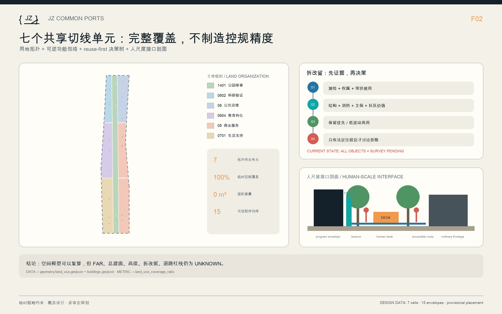
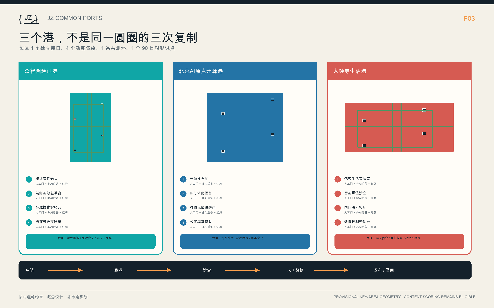
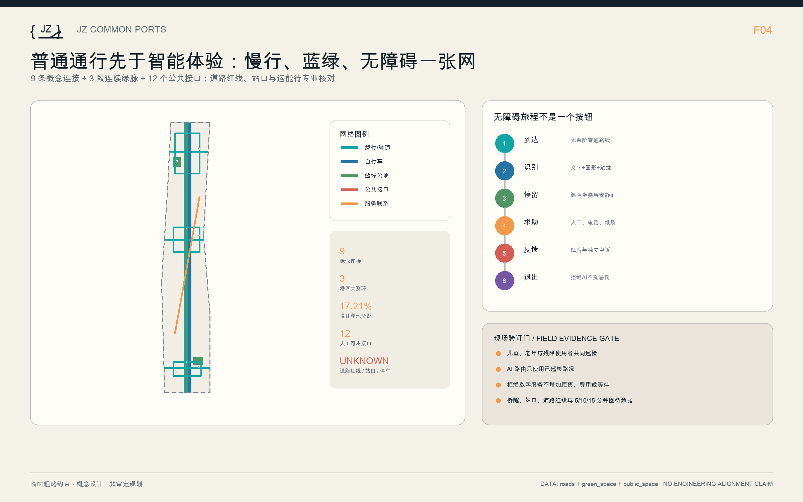

# 京张接口公地 / JZ COMMON PORTS

> v0.2 概念城市设计；临时粗略边界；非审定规划、非实施承诺。所有 AI 场景默认保留人工与非数字等价服务，任何升级都须经过专业人员、受影响群体代表与授权主体的人工判断。

## 设计依据与资料清单

本方案以公开征集公告、仓库最新版智能体任务书和场地包为主控依据，将事实、设计建议与未知条件分开记录。公告给出 43.6 平方公里统筹研究、约 11.4 平方公里总体设计和约 368.4 公顷三处重点区的任务尺度；仓库尚未提供可作为法定依据的正式范围、地块、道路红线、现状建筑、权属、市政、文保与消防数据。因此，`SITE-001` 与三个 `PROV-KEY-*` 只用于归一化构图、复算和讨论，不被称为官方红线。[source:OFFICIAL-ANNOUNCEMENT]

| 证据层 | 本轮可做 | 明确不能做 | 更新触发 |
| --- | --- | --- | --- |
| 公告与任务书 | 核对三层范围、三大定位、五大功能、六项 Agent 任务 | 推导审批结论或实施授权 | 上游任务书变更 |
| 临时 GeoJSON | 生成拓扑闭合用地、设计节点与一致指标 | 解释为地块、道路、文保或产权边界 | 正式 polygon 发布 |
| 公开案例 | 比较运营机制、协作界面与治理方法 | 移植案例边界、绩效、指标或承诺 | 来源失效或用途复核 |
| 合成协议夹具 | 检查最小数据、人工门、暂停和退役规则是否一致 | 证明现场准确率、安全性、满意度或运营绩效 | 模型、协议或版本变化 |

机器复算保留 `11,412,825.386 m²` 以保证几何一致性，但面对公众只显示“约 11.41 km²（临时几何）”；公告尺度另记为“约 11.4 km²”，二者不混用。容积率、总建面、建筑高度、道路面积、停车、市政容量、正式文保范围、投资和真实实施主体全部保持 unknown。来源逐条登记发布者、链接、访问日、用途和限制；八项资料假设、八维风险、权利链和变更记录分别保存在结构化文件中。

## 三层范围工作框架

三层不是三套彼此独立的图，而是从区域交换、总体空间到重点区试点逐层收敛的同一协议。统筹研究层回答“京张与谁交换何种知识、通过什么边界”；总体设计层回答“公共脊、三港、两翼如何组成连续城市结构”；重点区层回答“每个接口由谁复核、何时暂停、怎样退出”。该传导关系同时进入正文、五张图、GeoJSON、指标、十个行动包和离线 HTML。[depth:three_level_scope_framework]

| 层级 | 决策对象 | v0.2 交付 | 不确定性处理 |
| --- | --- | --- | --- |
| 统筹研究约 43.6 km² | 产业生态、未来城市、区域协同 | 五节点区域协同接口、六案例机制转化、八要素回路 | 不画伪边界，不假设合作已成立 |
| 总体设计约 11.4 km² | 更新结构、产业空间、交通市政、风貌 | 7 用地单元、15 功能包络、9 连接、5 绿地对象、12 公共接口 | 全部归一化于临时几何，官方数据到来后整体重算 |
| 三重点区约 368.4 ha | 功能业态、公共空间、场景与实施 | 三港各 4 接口、1 个 90 日旗舰试点、4 个功能包络与局部共测环 | 只表达概念位置，不作拆改留或工程判断 |

### 核心命题与比选

“AI 创新大道”被淘汰，因为展示廊道没有权利、暂停与退役语法；“三个 AI 校园”被淘汰，因为机构孤岛削弱公共连续性和两翼反馈；最终选择“京张接口公地”，因为同一套 Common Port Contract 能贯通空间门槛、AI 状态、品牌、运营和公众治理。若任一接口不能保留非 AI 等价服务、受影响群体不能暂停申诉、正式数据否定位置、运营与人工复核资源不足，核心命题即被反证，接口必须停止而非自动扩张。

### 一脊三港两翼十二接口

“一脊”是连续的铁路遗产公共空间、无障碍步行和骑行骨架；“三港”不是园区品牌，而是三类城市责任：众智园验证港负责测试、能效、标准和公开复盘，北京 AI 原点开源港负责许可清楚的发布、转化、学习和无障碍，大钟寺生活港负责日常服务、智能原生业态、国际交流和数据权利；“两翼”分别是中关村科技服务供给翼与小月河场景反馈翼。十二接口每个都是免费公共门槛、人工服务点、协议公示面与可撤除空间组件，而非只供企业展示的节点。

Common Port Contract 固定为“申请 Request → 靠港 Dock → 沙盒 Sandbox → 人工复核 Human Review → 发布或召回 Publish/Recall”。接口护照有六种状态：概念、模拟、沙盒、限时、暂停、退役。模型或协议版本变化自动使既有测试失效；公众红牌、许可失效、高风险事件或申诉未决会进入暂停；到期不默认续期，须公开复盘、删除约定数据并保留不含个人内容的变更记录。

### 品牌与区域协同

`{JZ}` 标志把 API 花括号与铁路道岔组合：花括号表示开放接入与边界，道岔表示城市选择和人工终决，中央空隙表示任何人可拒绝 AI 的退出通道。墨色与纸色承担证据层，青色为验证港、蓝色为开源港、珊瑚色为生活港、橙色为设计建议、紫色只用于明确标注的概念体验。标志、三港子色、状态信标、导视、场景卡和贡献档案使用同一语法，但不使用未经授权的企业标识或人物肖像。

区域协同不是画箭头宣称合作，而是登记议题、交换接口、空间载体和非承诺边界：北纬社区可通过开源 RFC 与导师交流连接开源港；未来科学城可交换公开的能效、生命科学或前沿研究测试方法；怀柔科学城可交换大科学装置的公开方法护照；经开区可交换工程验证规范与失败档案；京津冀可比较可互操作的公共服务与负责任 AI 协议。所有数据、成员、采购、投资或行政协同仍需另行授权。

## 统筹研究范围产业与未来城市研究

全球案例只提取机制，不复制形象。新加坡 one-north 提醒科研、工作、生活与公共空间要混合；STATION F 提醒共享服务应成为可见的低门槛基础设施；Maria 01 提醒旧建筑再利用需要持续社区运营；Vector Institute 提醒跨机构人才网络与负责任 AI 研究应并行；MIT Kendall Square 提醒高校—城市转化界面必须同时投资公共空间；Knowledge Quarter London 提醒文化、科研和公众机构可通过网络而非单一园区协作。京张的转化分别是两翼混合、共享服务柜台、遗产低扰动组件、导师与责任护照、近校转化街和联合公共策展。[source:CASE-ONE-NORTH]

| 案例机制 | 京张转译 | 明确限制 |
| --- | --- | --- |
| 科研—生活混合 | 七个用地单元与连续公共脊 | 不复制密度、边界或开发模式 |
| 共享孵化服务 | 科技服务翼的人工转介柜台 | 不假设政策、资金或机构入驻 |
| 适应性再利用 | 可撤除功能包络与 reuse-first 决策树 | 未勘察建筑不作拆改留 |
| 人才与责任网络 | 开源港、验证港的导师和复核角色 | 不转移机构授权或数据 |
| 校城转化界面 | 无障碍路由、发布厅和公共学习 | 不进入校园或使用科研秘密 |
| 文化科研协作 | 四季公共接口周与贡献档案 | 不冒充已确定活动 |

产业生态以八个要素构成循环：土地只登记临时空间容器；空间提供可逆、可负担、可共享的公共门槛；产业通过三港测试—发布—生活反馈；资金只设计“运营准备金、独立审计金、公共服务配额”三类门，不声称财政支持；人才通过导师、学习和贡献记录参与；算力先用低功耗模拟界面并等待能源容量；数据默认公开、合成或用户主动提供的最小集；场景以 90 日、时间/空间/人群上限和自动退役避免无界扩张。

未来城市的创新不在“遍布 AI”，而在“AI 是否改变规划与运营的责任结构”。本方案用公众可见的状态护照替代黑箱部署；用失败档案和召回替代只展示成功；用受影响群体席位替代事后满意度调查；用非 AI 服务等价替代数字强制；用官方数据触发全包失效重算替代伪精确图纸。公共价值账本记录谁得到便利、谁承担风险、意见如何改动空间或协议，以及未采纳原因。

## 总体设计范围城市更新与控规深度城市设计

总体模型由七个共享切线用地单元完整覆盖临时范围，零面积重叠：中央 `LU-SPINE-01` 为遗产公园与开放空间脊；北段两翼承载自主创新验证与标准公共治理；中段两翼承载近校学习转化与科技服务；南段两翼承载生活支持与智能原生服务。分类使用场地包允许的国土空间用途代码，但这些单元是概念分配，不是现状认定或法定用地调整。[metric:land_use_coverage_ratio]

十五个 `BUILDING_FOOTPRINT` 仅为 22,535.708 平方米的“可逆功能包络”机器总量，用于将测试舱、开源厅、人工柜台、共测站等放到可讨论的位置；它们不是现状建筑识别、建筑方案、总建面或拆除决定。九条概念连接包括南北无障碍主径、连续骑行线、三条横向缝合、三港共测环和两翼联系；五个蓝绿对象包括三段连续绿脉与两处可逆绿庭；十二个公共接口总面积约 19,667 平方米，约占临时范围 0.17%，体现“小而可退”的门槛策略。

空间语法遵循五条规则：第一，普通步行和人工服务永远先于 AI 体验；第二，三港每港四接口且至少一个公共安静面；第三，建筑包络避开中央公地脊并只表达程序需求；第四，所有设计对象都携带 placement_basis、precision_limit、recompute_trigger 与 not_statutory；第五，正式边界、权属、文保、交通、市政或消防数据一旦与位置冲突，位置失效而不是调整事实解释。

控规与工程深度采用“已知—设计—待定”三栏：用地拓扑、节点数量和概念长度可复算；公共空间门槛、连接意图、程序包络属于设计建议；容积率、总建面、高度、建筑密度、退线、道路红线、停车、管线、能源、消防、河道和权属保持待定。这样既提交可审查城市设计，也不把资料缺口包装成确定控制。

## 重点区域详细设计

三处重点区共享护照规则，但空间任务和失败条件不同。图中矩形范围仍是仓库临时粗略多边形，只用于把四接口、四功能包络、共测环和旗舰试点归一化放置；正式 polygon 到来后须重新生成。[data:geometry/key_areas.geojson#PROV-KEY-001]

### 众智园验证港：让测试责任可见

四接口为模型责任码头、端侧能效基准台、标准协作实验台、清河绿色实验窗。空间动作是把内部测试外翻到公共门槛、以责任信标显示当前状态、设置可参观但数据隔离的共测环，并让低功耗与生态维护成为发布前置条件。旗舰 `SC-01` 只使用合成模型卡与测试日志，90 日内验证最小字段、严重风险拦截、人工签字、红牌暂停和退役记录；任何越权取数、关键安全事件、无法解释的高风险结论或人工复核缺席都会暂停。

### 北京 AI 原点开源港：让贡献与退出同样被记住

四接口为开源发布厅、IP 与转化柜台、校城无障碍路由、公民模型课堂。空间动作是把发布从舞台改成带许可和可访问性检查的公共过程，把法务、IP、人才与转化作为人工温暖转介，把校园—城市路线设置为非数字可用，并以开源年轮记录经授权贡献及撤回。旗舰 `SC-05` 只读取清权仓库元数据、许可、测试和可访问性声明；许可冲突、秘密材料、缺失可访问性说明或版本变化都会退回人工发布诊所。

### 大钟寺生活港：让居民能拒绝、商户能公平参与

四接口为包容生活实验室、智能零售沙盒、国际演示客厅、数据权利帮助台。空间动作是设置不消费也可进入的公共门槛、安静休息庭和人工服务台，禁止行为画像与差别定价，把居民意见如何改变产品与空间写入城市回声账本。旗舰 `SC-09` 使用合成服务任务、公开目录和用户主动声明的最小需求；高风险医疗、法律或福利决定必须交给有资质人员，若人工容量不足、发生身份推断或拒绝 AI 导致服务降级，试点立即暂停。

## AI 创新生态、人才画像与 AI+ 场景

九类人物不是营销画像，而是利益、风险和治理席位：开源开发者需要可复现与署名；初创和中小团队需要低成本测试但可能被付费门槛排斥；居民需要安静日常与真实影响力；高校师生需要转化与学习但科研数据不能被挪用；老年人和残障使用者需要无障碍与人工帮助；小商户和一线服务者需要可负担参与并避免自动化挤出；儿童与照护者需要不被追踪的安全使用；国际访客需要双语透明规则；公共服务一线人员需要辅助而非责任转移。传统与智能服务并行只作为设计参照，不把 2020—2022 阶段目标写成 2026 持续法定义务或本地落实事实。[metric:persona_count] [standard:ELDERLY-SMART-TECH-PLAN-2020-45]

每张场景卡均有精确接口 ID、人物、公共目的、最小输入、保留期、禁用数据、AI 角色、非 AI 后备、责任角色、人工门、输出、基线、KPI、失败模式、暂停、申诉、阶段和退役。以下是十二接口的决策摘要，完整协议可在离线页面逐卡展开：

| ID / 接口 | 最小数据与 AI 角色 | 人工与非 AI 等价 | 暂停 / 验收 |
| --- | --- | --- | --- |
| SC-01 模型责任码头 | 模型卡、合成日志；检查完整性和阈值 | 评测人员+公众席位；纸质检查台 | 版本变化/严重风险；必填项与拦截均 100% |
| SC-02 端侧能效基准台 | 设备声明与合成负载；比较公开能耗包络 | 人工表计与计算表 | 超预算/热风险；方法公开且不越界 |
| SC-03 标准协作实验台 | 公开标准与提案；聚类冲突 | 专业主持与纸质议题墙 | 非公开或未署名文本；冲突闭环或暂停 |
| SC-04 清河绿色实验窗 | 非个人环境观察；提示巡检 | 人工观察板与热线 | 洪涝/生态不确定；个人标识为零 |
| SC-05 开源发布厅 | 清权元数据和许可；检查发布护照 | 许可人员+人工发布诊所 | 许可冲突/秘密；字段完整、申诉可见 |
| SC-06 IP 与转化柜台 | 非保密问题和公开指南；只做转介 | 有资质服务人员与纸质目录 | 法律结论/利益冲突；不保留保密内容 |
| SC-07 校城无障碍路由 | 用户主动偏好和已巡检路况；给可解释备选 | 触觉图、导视和人工帮助 | 未巡检/障碍未闭环；普通路线始终可用 |
| SC-08 公民模型课堂 | 合成案例和公开文档；展示差异与不确定 | 教师主持的无设备卡片课 | 未成年人画像/劝服；能识别边界和申诉 |
| SC-09 包容生活实验室 | 合成任务和公开目录；起草选项 | 服务专业人员+电话/纸质柜台 | 高风险决定/无人值守；拒绝 AI 不降级 |
| SC-10 智能零售沙盒 | 合成目录和明确查询；无行为画像比较 | 普通价签和商户人工服务 | 生物识别/差价歧视；禁用定向为零 |
| SC-11 国际演示客厅 | 清权演示和语言偏好；翻译并标不确定 | 双语主持和印刷指南 | 未清权 IP/安全误译；实质错误有更正记录 |
| SC-12 数据权利帮助台 | 用户自选案情摘要；解释流程、起草请求 | 独立人工、电话、纸质和信箱 | 法律结论/过量身份；人工答复和删除证据 |

### 三项可复跑协议试点

`SC-01`、`SC-05`、`SC-09` 各配五个确定性合成夹具：最小数据、非 AI 等价、红牌暂停、人工终决、到期审计，共 15 项。每项都提交显式输入、配对反事实、规范哈希、期望控制、机器独立推导控制、schema、极小能耗包络和审计状态。无依赖离线命令 `node visual/assets/replay-protocols.js --check` 会从输入重新推导 15 个主断言和 15 个反事实断言，并核对 runner、schema、simulation 三类哈希和持久化证据；任一漂移非零退出。当前 15/15 通过，只能证明 v0.2 公开利益控制逻辑对这些合成输入可复现，不能证明模型或现场绩效。完整命令、规范与失败边界见 `assets/media/replay-protocol.md`。[metric:simulation_task_count]

现场试点若获授权，统一采用 0—30 日准备与人工基线、31—60 日封闭测试、61—90 日限量公众共测、到期独立复盘；不得自动扩大人群、空间或期限。三港各有一个受影响群体 steward 席位，拥有红牌暂停权；独立申诉提供现场、电话和纸质渠道，拒绝 AI 不影响普通服务，最终决定由有责任资格的人类角色作出。

现场共测只做预登记，不伪造结果：未来至少 24 个参与者场次覆盖老年/残障使用者及其自选支持者、居民与照护者、小商户与一线服务者、开发者/学生/中英文访客。授权主体、无障碍场地、人工等价台、知情同意、独立公众席位、隐私/保险/未成年人保护和应急方案缺一即不得开始。预登记阈值包括非 AI 完成率差不超过 10 个百分点、等待中位数不高于数字路径 1.20 倍且额外不超过 5 分钟、拒绝 AI 不增加费用或异地行程、关键无障碍障碍为零、红牌在下一公众场次前生效。未经独立复核的真实观察，不得标记为通过。

## 用地、建筑规模与拆改留方案

七个概念用地单元采用 `1401 / 0802 / 08 / 0804 / 05 / 0701` 等任务包允许代码，使“公共脊—研发验证—学习转化—科技服务—生活支持”成为可校验空间关系。用地总量与临时范围一致，重叠面积为零；但代码只表达 v0.2 功能组织，不改变现状性质或法定用途。[data:geometry/land_use.geojson#LU-SPINE-01]

十五个功能包络分布于三港和两翼，单个约为可逆小型共测、服务或学习载体。属性统一声明 `existing_status=unknown_pending_survey`、`intervention_class=reversible_program_envelope`、`not_demolition_decision=true`、楼面面积和高度为空。它们帮助比较空间承载关系，但不能被加总成建设规模。

拆改留采用“先证据、再决策”树：先核对权属、测绘、结构、消防、文保、现状使用和社区价值；具备价值且安全则优先保留与低扰动再用；可修复且公共收益明确时才提出改造；只有经法定程序、替代方案比较和影响补偿后，专业团队才可讨论拆除。当前资料不足，所有对象停在“待调查”，因此容积率、总建面、高度、法定建筑密度、退线和拆改留数量均为 unknown。

风貌不以统一科技外皮覆盖遗产，而以三层可撤除组件叠加：基础层是无障碍、遮阴、坐凳、照明和人工服务；接口层是状态信标、纸质协议、触觉信息和贡献记录；活动层是限时展示与沙盒设备。永久建筑或结构改造只有在正式控规、文保、消防、结构和权属确认后才进入专业设计。

## 交通、轨道、市政与公共服务设施

九条概念线形成一个公共优先网络：南北无障碍公地主径和连续骑行线为骨架，众智园、原点、大钟寺三条横向缝合连接两翼，三港各有一条共测环，最后由两翼服务联络线连接资源供给和场景反馈。机器长度仅描述当前临时几何中的设计线，不是道路里程、红线或工程线位；站口、桥隧、交叉口、停车和轨道接口必须另做专业调查。[metric:conceptual_road_length_m]

无障碍旅程按“到达—识别—停留—求助—反馈—退出”设计：每个接口有不依赖手机的导视、连续无台阶路线、坐姿可达信息、安静休息、人工帮助和纸质反馈；AI 路由只在路况已巡检时给出解释性备选，不能把未验证路线标为可用。儿童、视觉/听觉/行动障碍使用者与照护者应参与现场共测，正式开放前须证明拒绝数字服务不会增加距离、费用或等待惩罚。无障碍法第39条只按其列举的公共服务事项理解；十二接口全部保留人工路径是本方案更广的自愿设计基线，不被写成所有公共空间的法定义务。[standard:BARRIER-FREE-ENVIRONMENT-LAW]

市政与新基建采用容量门而非设备清单。端侧算力先以低功耗模拟器验证服务流程，永久设备须核对电力、散热、噪声、消防、网络安全、维修和生命周期碳；蓝绿设施须核对土壤、树木、水文、河道和防洪；公共服务须先保证有资质人员、无障碍和运营资金。`municipal_capacity_index` 保持 unknown，防止用 AI 场景倒推未经核实的工程能力。

## 蓝绿空间、公共空间与城市风貌

三段连续绿脉对应南段生活、中段学习和北段验证，合并后约占临时范围 17.21%；众智园低碳试验庭与大钟寺安静休息庭补足局部生态与休息需求。该比例是设计分配，不是现状绿地率或生态绩效。十二公共接口约占 0.17%，每个空间都允许“不使用 AI 也能停留、通行、求助”，并通过普通服务与事件模式分时，避免活动侵占日常。[data:geometry/public_space.geojson#PUBLIC-SC-09]

组件库包含六类：`THRESHOLD` 免费公共门槛、`BEACON` 状态与暂停信标、`BENCH` 遮阴坐凳与电源、`DESK` 人工/纸质服务台、`KIT` 可撤除共测设备、`LEDGER` 贡献/反馈/退出记录。组件按三港子色识别，但状态同时使用文字、图形与触觉，不靠颜色单独表达；概念体验图固定标注“非现状记录、非批准方案”。

四个贡献型地标拒绝“名人崇拜”和企业冠名：验证港“责任信标”显示是否开放、暂停或复盘；开源港“开源年轮”记录经授权贡献与版本；生活港“城市回声账本”并列意见、修改与未采纳理由；中段“百年接口台”把铁路工程、计算文化和公共维护者放在一张可更新关系图上。它们全部可拆、可纠错、可撤名，须经文保、结构、消防、无障碍和版权复核。

公共利益由三项空间契约保障：一是反排斥，旗舰项目不得导致日常公共路线、服务或安静空间缩水；二是可负担，小团队、小商户和社区活动保留公开配额，科技服务不得成为付费入场券；三是反挤出，若试点观察到租金压力、商户替代、服务人员负担或特定群体等待增加，公众席位可暂停扩张并要求影响评估。反馈不是“收集完毕”，而必须在 Echo Ledger 中显示采纳、修改、拒绝及理由。

文化叙事遵循“铁路连接—中关村开放试错—AI 公共责任”三章：轨道不是怀旧装饰，而是公共接入的历史技术；中关村不是企业名录，而是持续贡献、质疑与转化的方法；AI 新文化不是自动化崇拜，而是承认失败、允许召回、让人类保有最终判断。国际传播语为：**A century-old railway becomes a civic interface for the next century of AI—open to enter, question, appeal and leave.**

## 更新项目清单、实施政策与分期计划

实施先经过不带建设范围的 Gate 0：正式空间数据、权属、现状建筑、交通轨道、文保生态、市政消防、无障碍基线、数据治理、运营授权与资金全部登记；任一关键权限缺失，就不能从模拟进入现场沙盒。十个行动包使用“角色类型”而非虚构机构承诺，并逐项设置许可、资源等级、验收、停损与运营资金门。[data:geometry/phasing.geojson#PHASE-P1]

为便于比较和停损，资源带进一步登记为参与者编制的低置信规划包络：XS 为 15–30 万元、S 为 30–90 万元、M 为 90–250 万元。包络含 90 日可逆搭建、无障碍、当班人员、审计、拆除及 15% 退出准备金，不含土地、永久工程、市政增容或法定费用；它不是预算、报价、资金承诺或采购批准。未来授权主体须选择合法采购路径、取得至少三份合格报价、配置适用的公众责任/专业/用工/数据网络/活动保险，并用正式结果替换本包络；启动、暂停、恢复、退役的决策权已逐项写入 `port-protocols.json`。

| 项目 | 建议牵头角色 / 资源 | 关键交付与前置 | 验收与强制退出 |
| --- | --- | --- | --- |
| JZ-01 三港公共门槛 | 公共空间发起角色 / S·30–90万元 | 三处可逆垫、人工台、状态信标；权属/文保/消防/无障碍 | 无台阶、服务等价、红牌演练通过；许可失效即退 |
| JZ-02 模型责任码头 | AI 保障角色 / XS·15–30万元 | 合成护照诊所；数据治理与运营授权 | 5 项夹具和严重风险暂停通过；版本不匹配即停 |
| JZ-03 开源发布厅 | 开源社区角色 / XS·15–30万元 | 清权元数据发布；内容权利和场地许可 | 许可/来源/可访问性完整；许可冲突即退回人工 |
| JZ-04 包容生活实验室 | 社区服务角色 / XS·15–30万元 | 合成服务导航；有资质人员和人工柜台先到位 | 高风险全部转人工、拒绝不降级；无人值守即停 |
| JZ-05 科技服务共享柜台 | 科技服务协调角色 / S·30–90万元 | IP、人才、企业服务温暖转介；资格与冲突规则 | 不输出未经授权的法律金融结论；付费排斥即停 |
| JZ-06 场景反馈共测路线 | 公共空间运营角色 / S·30–90万元 | 人工反馈、障碍闭环和蓝绿维护 | 路障有责任闭环；交通生态问题未决即停 |
| JZ-07 无障碍/非AI组件包 | 通用设计角色 / S·30–90万元 | 触觉、纸质、坐凳、人工帮助组件 | 受影响群体共测且 12 卡等价；造成新障碍即撤 |
| JZ-08 接口护照与审计账本 | 公共利益治理角色 / S·30–90万元 | 状态、版本、复核、暂停、删除和退役记录 | 每个活动接口护照有效；责任/许可缺失默认关闭 |
| JZ-09 四座贡献地标 | 文化公共艺术角色 / M·90–250万元 | 可撤除信标、年轮、账本、接口台；五类专业复核 | 权利清楚、可拆、规则公开；企业/人格占领即停 |
| JZ-10 公共接口周 | 运营协作体角色 / M·90–250万元 | 春 RFC、夏沙盒、秋公众评审、冬退役档案 | 日常使用不缩水；安全、噪声或版权不合格即取消 |

空间分期只覆盖可逆接口足迹，而非大范围建设：P1 是三个旗舰 90 日试点，约占临时总体范围的极小部分；P2 在 P1 通过公共复盘后扩展六接口和等价服务组件；P3 仅在专业空间审查、运营准备金和公众签字通过后完善其余接口、地标与四季网络。每一期均可进入 hold 或 retired，不以已投入成本作为继续理由。

年度运营用“四季接口”把活动与转化闭环：春季公共 RFC 收集问题并公布未采纳理由；夏季仅在限量沙盒中共测；秋季由国际访客、居民和专业人员共同评审；冬季公开失败、召回、删除与退役档案。开发者或团队的转化路径是“公开问题—合成测试—人工复核—限时共测—服务转介或退役”，不是招商承诺。核心公共服务经费与活动收入分离，避免活动不景气导致人工后备消失。

## 指标体系、面积复算与合规矩阵

指标分三栏。Known 是可从提交文件逐项复算的数量或拓扑：临时范围面积、7 用地、15 功能包络、9 连接、5 绿地、12 公共接口、12 场景、3 服务区、3 试点、9 人物、10 行动、3 分期、4 地标与 15 合成测试。Provisional 是数值可复算但位置和含义受临时边界影响，如绿地 17.21%、公共接口 0.17% 和约 11.41 km²；XS/S/M 规划成本包络也属低置信参与者假设。Pending 是必须等待专业资料的容积率、总建面、高度、道路面积、停车、市政容量、正式预算/报价、保险限额、权属主体和实施授权。[metric:site_area_sqm]

面积和长度统一在 EPSG:4548 计算；用地由同一批共享切线在复核坐标系中切割，union 等于临时 site、gap 与 overlap 均在允许阈值内。绿地、公共空间和功能包络使用 union 避免重复计算；道路只求概念中心线长度。指标公开展示使用合理精度，机器精值只为验证哈希和一致性，不被解释为调查精度。

`simulation_success_rate=1.0`、schema 通过率、审计完整率和能耗违规 0 均来自 15 项合成政策单元测试，旁边固定显示“非现场绩效”。场景人审、非数字后备和红牌暂停覆盖率均为 1.0，因为 12 张协议逐卡具备这些字段；若任何卡在后续修改中缺失，指标自动失效。

23 条公告/任务书合规、15 项设计深度与 9 项专业标准响应不再复制同一证据组合。每一行只指向与该判断直接相关的章节、图层、指标、来源、假设和图面，并用独立摘要解释证据；数据缺口可以标为 data_gap，不能为了“全 complete”隐去。最终进入提交前必须让 deterministic、spatial、professional、visual 四道门同时通过，并在任何文件修改后重新 finalize 和 self-check。

## 风险、版权与合规说明

八维风险登记覆盖数据隐私、实施复杂度、公众接受、运维成本、政策不确定、空间争议、技术成熟与公平包容。残余高风险集中在实施、政策和空间，因为没有真实权属、控规、专业调查、授权主体与预算；缓解方式不是降低文字评级，而是由 Gate 0 阻止空间和服务升级。任何护照状态都不能绕过法定审批、采购、专业签字或公众申诉。[data:risk.json#dimensions]

数据治理采用最小化和目的限定：默认只用公开、合成或用户主动提供的必要信息；禁止人脸识别、连续位置轨迹、推断健康/残障、未成年人画像、秘密或未清权材料；会话结束默认删除内容，非个人运行日志最长保留 90 日，申诉记录由用户明确选择。AI 只生成选项、标记或转介草案；医疗、法律、福利、安全、规划审批及其他高风险决定由有责任资格的人类作出。暂行办法仅在其第2条适用范围内作为背景；第14条不被泛化为一般退出权，第15条不虚构数字响应时限，第17条不被泛化为所有接口的备案或安全评估义务。[standard:GENERATIVE-AI-INTERIM-MEASURES]

公共治理有三层制衡：运营角色负责日常服务，专业角色负责领域判断，受影响群体 steward 负责公共利益红牌；独立申诉角色不能由被申诉的运营者兼任。暂停后人工服务继续，数据冻结或删除，公开说明触发、影响和恢复条件。恢复至少需要原触发已解决、专业复核和公众席位签字；到期不续则进入退役并公布非个人总结。

权利链逐项记录：文字与协议由参与者和 Codex 协作创作；`{JZ}` 标志、图件、地图、GeoJSON、HTML/CSS/JS 与 PDF 由本项目确定性生成；系统字体只嵌入 PDF，不分发字体文件；国际案例仅引用官方网页文字机制，不复制图像、地图或品牌资产；概念封面由 OpenAI 图像生成工具按无参考图、无个人数据的项目提示生成，并固定标注“概念体验、非现状、非批准”。完整生成方法、许可、限制与访问日期见 `sources.json` 和版权声明。[source:GEN-AI-COVER]

中英文正文、报告 HTML、交互 HTML、A3/A0 和五张含文字图件成对提交，章节、数量、指标、风险、状态和图件位置保持等义。HTML 离线运行，不含 CDN、远程瓦片、外部字体、iframe、表单、远程 API 或跟踪；提供跳转链接、键盘焦点、语义 landmark、描述性 alt、减弱动态与无脚本五图后备。PDF 不是权威数据源；无障碍等价阅读以 HTML 和 Markdown 为主。

本方案不声称已批准、已入选、已建设、已授权合作或已获得资金。AI Agent 对来源、生成、结构化一致性和自检负责；专业与公共判断属于人类。提交前还需独立 Agent 盲评和用户审核，获用户明确批准前不推送修订或发起 PR。

## 参考资料

- 征集公告与面向智能体任务书：见 `sources.json` 中 `OFFICIAL-ANNOUNCEMENT`、`AGENT-TASKBOOK`。[source:SITE-PACKAGE]
- 场地包、枚举、范围、schema 与临时边界：`brief/site-package/`。
- 国际机制案例：JTC one-north、STATION F、Maria 01、Vector Institute、MIT Kendall Square、Knowledge Quarter London；仅作机制比较。
- 区域协同背景：北京国际科技创新中心公开入口及北京经开区公开信息；只说明可讨论议题。
- 机器证据：`metrics.json`、`assumptions.json`、`risk.json`、`simulation.json`、`spatial.json`、三类矩阵、九个 GeoJSON、`visual/assets/port-protocols.json`、离线 runner/schema/evidence 与 `assets/media/replay-protocol.md`。
- 生成与权利：`report/copyright_statement.md`；迭代变化：`changelog.md`；最终门禁：`self_check.json`。
