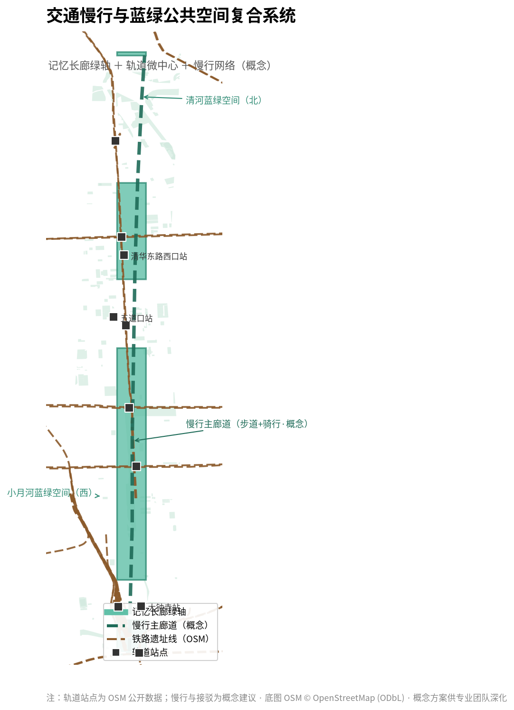
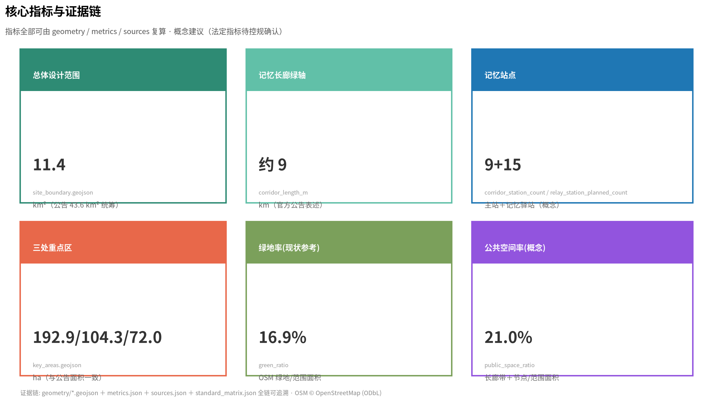

# 百年京张记忆长廊

> 本方案为面向全球智能体的开放共创概念方案，所有空间落地建议均为**概念建议/参考方案/可供专业团队深化研究**，不构成政府审定结论，不替代法定规划与审批。方案中出现的量化数据（面积、客流、收益等）均为**概念测算**，基于公开资料与行业规律推导，用于论证可行性，不构成承诺。

## 设计依据与资料清单

本方案严格依据以下公开/清权资料展开，全部来源登记于 `sources.json`，资料用途边界遵循 `data/source_registry.json`（区分 formal-ready、background、provisional）[source:SOURCE-REGISTRY]：

- [source:OFFICIAL-ANNOUNCEMENT]《百年京张AI创新带城市设计国际方案征集资格预审公告》（北京市规划和自然资源委员会海淀分局，2026-05-09）：三层范围、三处重点区、设计任务与成果深度主控依据。
- [source:AGENT-TASKBOOK]《面向全球智能体开展百年京张AI创新带城市设计开源征集任务书摘录》（用户提供清权任务书）：十条共创原则、三大定位、五大功能、三区两翼、六项智能体任务、统一评审维度与统一边界条款。
- [source:BOUNDARY-SOURCE] / [source:KEY-AREA-SOURCE]：三层范围与三处重点区临时粗略边界（provisional，EPSG:4326；面积按 EPSG:4548 复算，与公告约面积偏差≤0.43%）。
- [source:SITE-PACKAGE]：设计任务书、用地分类、允许设计空间、指标区间、强制标准清单。
- [standard:PROJECT-OFFICIAL-ANNOUNCEMENT]、[standard:PROJECT-AGENT-OPEN-CALL-TASKBOOK]、[standard:MOHURD-URBAN-DESIGN-MEASURES]、[standard:MOHURD-CONTROL-DETAILED-PLANNING]、[standard:MNR-LAND-USE-CLASSIFICATION]：见 `standard_matrix.json`。
- 补充公开事实：京张铁路 1909 年通车史实、863 计划 1986 年发起史实、1994 年中国互联网接入史实、中关村 1988/1999 发展史实、2017 年《新一代人工智能发展规划》与 2025 年"人工智能+"行动（国发〔2025〕11号）史实。[source:JZ-RAILWAY-HISTORY][source:INTERNET-ORIGIN-1994][source:PROJECT-863][source:AI-NATIONAL-POLICY][source:BEIJING-AI-PLAN][source:ZHONGGUANCUN-HISTORY][source:OSM-PUBLIC-DATA][source:PROCESSED-FACT-PACK]

## 方案总览：百年京张记忆长廊

本方案提出一个总体概念：**把 9 公里京张铁路遗址公园及两侧片区组织为一条"技术走向人间的百年记忆长廊"**。它回答的不是"这里盖什么"，而是"这条路上，中国如何一步步让技术走到普通人身边"。

### 灵魂之一：记忆循环——文化是城市发展的循环引擎

历史、记忆、沉淀构成**底蕴**；底蕴支撑产业、科技、AI 的**发展**；发展带来就业、生产与文明的**生活**；生活又创造新的**历史**——如此循环，永不停歇。本方案把文化从"装饰层"提升为城市发展的**循环引擎**：

```text
历史·记忆·沉淀 → 底蕴 → 产业·科技·AI → 发展 → 就业·生产·文明 → 生活 → 新历史 →（循环）
```

长廊不是一次画完的蓝图，而是**可生长、可进化的城市记忆系统**：每五年新增一站（[metric:corridor_station_count]），每个普通人的记忆都值得被记录（人人写史），每个普通人都应被 AI 服务（人人用 AI）。[data:geometry/land_use.geojson#LU-CORRIDOR][metric:corridor_length_m]

### 灵魂之二：技术走向人间的百年

看这条长廊的隐藏主线：

- **1909 京张铁路**——中国人自主建成的第一条干线铁路（[source:JZ-RAILWAY-HISTORY]），让普通人第一次能**远行**（打破空间的藩篱）；
- **1994 中国互联网接入**——中科院 64K 国际专线（[source:INTERNET-ORIGIN-1994]），让普通人第一次能**连接世界**（打破信息的藩篱）；
- **2026 "人工智能+"时代**——本项目所在的当下，让普通人第一次能**拥有智能**（打破能力的藩篱）。

每一次技术革命，最终都走向同一个方向——**普惠到每一个人**。长廊记录的不仅是国家的创新史，更是"技术走向人间"的历史：从詹天佑"自立于地球之上"，到中关村"敢为天下先"，再到今天 AI 开放开源、人人可用。[standard:PROJECT-AGENT-OPEN-CALL-TASKBOOK][source:OFFICIAL-ANNOUNCEMENT]

**终点=起点**：长廊南端的"记忆终点站"不是终点——它是记忆的容器，也是下一程的起点；下一站由你书写。

### 四层结构

1. **实体规划**：一廊（记忆长廊主线·9 站）＋众星（分布式记忆驿站·激活既有设施）＋锚点（终点文化馆"记忆终点站"）。
2. **模式搭建**：集章护照（NFC/数字，数据总线）＋活动体系＋文旅消费闭环＋**星火开放平台**（定义地盘/场景/规则/数据，不定义应用，AI 服务生态持续入驻）。
3. **技术底座**：城市记忆库（分布式采集→中心沉淀→网络化服务）＋AI 融入（导游/伴游/AR/对话/生成/无障碍）＋AI 真实试验场（三场地三层级，低速可监管可复核）。
4. **精神内核**：技术终将普及到每一个人；终点不是终点，是下一程的起点。


### 本方案的可行性逻辑

方案以"轻资产启动、全链路闭环、可持续进化"为实施主线：一期以 9km 绿轴南段精华线 + 5 处驿站改造 + 数字护照 + 星火平台框架为启动（概念投入约 2.5-3 亿元，其中政府公共投入约 1 亿元），2-3 年内打通全绿轴与 15 处驿站；通过集章护照形成统一数据总线，以星火开放平台引入 AI 服务生态实现内容自更新，以驿站分成激活沉默资产，形成"政府搭台—市场运营—社区共建"的可持续模式。[depth:phasing_implementation]

## 宏观故事架构：技术走向人间的百年

### 三幕叙事弧

本方案把百年历史组织为三幕可触摸的叙事弧，每幕对应长廊的一段空间，每幕回答一个时代命题：

| 幕 | 时间 | 核心主题 | 代表事件 | 精神内核 | 空间对应 |
|----|------|----------|----------|----------|----------|
| 幕一·起点·自立 | 1909-1986 | 中国人靠自己走出第一条路 | 1909 京张铁路通车→1953 一五工业奠基→1986 863 计划 | 不靠外援、不等不靠，普通人用双手闯出路 | 1909 站、1953 站、1986 站（北段） |
| 幕二·追赶·连接 | 1988-2006 | 打开大门，让普通人连接世界 | 1988 中关村试验区→1994 互联网接入→2006 自主创新战略 | 拥抱开放，让普通人获得平等的信息权与连接权 | 1994 站、2006 站（中段） |
| 幕三·引领·普惠 | 2017-未来 | 用 AI 给普通人赋能，创造新历史 | 2017 新一代人工智能规划→2026"人工智能+"行动→未来由所有人共创 | 技术为民，打破能力边界，让每个普通人发光 | 2017 站、2026 站、未来站、记忆终点站（南段） |

叙事逻辑闭环：从"中国人自己走出路"到"我们带所有人一起走"，既契合国家自主创新脉络，也契合"历史→底蕴→发展→生活→新历史"的记忆循环。

### "九个普通人"故事线

宏大叙事必须落到可触摸的个人。本方案为每一站塑造一个普通人原型，让每个游客都能找到"这讲的就是我这样的人"：

1. **1909 站·远行者**——京张铁路开通后，第一个从清河站买三等票去天津读书的海淀农家子弟。意义：中国人自己修的铁路，第一次给了普通人走出去改变命运的可能。
2. **1953 站·建设者**——参与京张铁路复线改造、留在清华园机械厂当钳工、退休后每天在旧铁轨边遛弯的老技工。意义：普通人的汗水托举起城市的工业底座。
3. **1986 站·上书者**——帮四位科学家抄写"863 建议书"、骑车到五道口邮局寄挂号信的北大资料员。意义：普通人的一小步，托举起中国科技战略的起点。
4. **1994 站·上网者**——中关村卖电脑配件的小伙子，成为第一批普通网民，给远方的家人发出第一封电子邮件。意义：互联网打破信息高墙，普通人第一次连接世界。
5. **2006 站·工程师**——从武汉考到北京、每天挤 13 号线经过京张旧轨道、敲出第一版中文语音识别模型的北漂工程师。意义：把实验室技术变成服务普通人的基础设施。
6. **2017 站·体验者**——退休小学老师，第一次用街道 AI 政务机 3 分钟办好异地医保，不用再坐一小时公交排队。意义：AI 第一次真正走进普通人的日常。
7. **2026 站·使用者**——听障设计师用开放的 AI 辅助工具完成公益海报。意义：AI 打破能力边界，让每个普通人平等获得创作的能量。
8. **未来站·书写者**——住在绿轴边的中学生，每年更新自己对 2035 年的愿望，设计了帮助老人打车的 AI 小工具。意义：未来不是预测出来的，是每一代人亲手写出来的。
9. **记忆终点站·记忆捐赠者**——远行者的重孙女，如今是海淀的 AI 产品经理，把爷爷珍藏了上百年的旧火车票捐给终点馆。意义：终点就是起点，每个普通人的记忆都是百年京张的新历史。

### 宏大叙事转译方法

| 转译方法 | 是什么 | 怎么用 |
|----------|--------|--------|
| 坐标锚定法 | 把国家大事件锚定到具体"个人物品+空间坐标"，用小物证承载大历史 | 1909 站不做铜像，做三等车厢复刻座与旧车票复制品，游客可坐下触摸；1986 站放当年的钢笔与挂号信封复制品，可盖"1986 中关村起点"纪念戳 |
| 身份代入法 | 让游客找到与自己同频的普通人身份，把"别人的历史"变成"我的历史" | 每站入口 AI 互动屏："哪一年你来到这里？"输入年份推送同年代普通人故事，邀请留下自己的故事 |
| 微观物证法 | 全部用普通人的日常物品做展陈，拒绝符号化 | 1953 站放磨破的安全帽、1994 站放 3.5 寸软盘与上网卡、2006 站放挤地铁的旧公交卡，每件物品扫码听原声故事 |
| AI 个人化转译 | 用 AI 把百年历史生成专属个人叙事 | 逛完全程后，AI 整合互动数据生成《我的百年京张个人记忆手册》，把个人故事与百年叙事拼接 |

### 叙事持续生长机制

每年更新：年度"我的京张记忆"征集（获奖作品入记忆库）→ 站牌故事换新 → 记忆穹顶新增光点 → "未来站"新命题。叙事永远不闭环——这正是"终点=起点"。

[depth:cultural_narrative][depth:wayfinding][source:JZ-RAILWAY-HISTORY][source:ZHONGGUANCUN-HISTORY][source:INTERNET-ORIGIN-1994]

## 品牌体系

### 品牌定位

**一句话定位**：中国百年自主创新史的可步行博物馆，技术走向人间的城市叙事场。
**品牌承诺**：在这里，每个普通人都能触摸历史、使用 AI、留下记忆。

### 品牌口号体系（中英双语）

- 主口号：**下一站由你书写** / "The next stop is yours to write."
- 副口号：技术走向人间的百年 / A Century of Technology Coming to the People
- 各站口号：1909"从这里走向远方"、1994"连接世界的第一声"、2026"智能，人人可用"、终点馆"终点即起点"……每站一句话，随站牌统一延展。

### 品牌视觉识别

- **Logo 母题**：铁轨轨枕 × 时间轴 × 记忆节点——三条平行轨枕（工业/数字/智能三时代），节点即站点，可延展为站牌/护照/驿站挂牌/导视统一系统。
- **色彩**：钢轨灰 × 记忆橙 × 科技蓝；辅以老照片暖黄。
- **字体与延展规则**：中文黑体+英文无衬线；Logo 母题支持 9 站 × 15 驿站的组合延展。

### 品牌人格

如果长廊是一个人：他是**一位把毕生修路、育人、创新经历写成书的老工程师**——朴素、坚定、开放、爱讲故事，不炫技，信奉"技术最终是为了人"。所有内容的口吻遵循此人格：讲人话、有温度、不喊口号。

### IP 资产体系（可授权清单）

1. **形象 IP**：九个普通人原型（可发展为"京张九旅人"系列形象）；
2. **内容 IP**：九个普通人故事、《我的百年京张》个人记忆手册、百年口述史库；
3. **活动 IP**：京张文化节、京张 AI 创新周、记忆夜跑、记忆星空市集、新年记忆点灯；
4. **空间 IP**：记忆终点站"终点即起点"、未来站"下一站由你书写"、地下记忆隧道。

### 传播策略（三条路径）

1. **社媒路径**：#下一站由你书写 #走百年京张看中国AI 话题挑战（抖音/小红书/微博），以"九个普通人"故事做短视频系列；
2. **城市事件路径**：京张文化节（年度）、记忆点灯（跨年）、AI 创新周（产业事件）——形成年度节律；
3. **国际路径**：三语内容、Citywalk 国际线路、"中国自主创新百年"叙事出海，对接国际 AI 组织与友好城市。

### 品牌变现（概念）

IP 授权（形象/内容/活动）、联名（地铁/文创/车企）、内容付费（记忆手册/数字藏品）、城市礼品（"京张记忆"伴手礼线）。所有变现均标注概念，纳入星火平台运营闭环。

[depth:brand_identity][depth:cultural_narrative]

## 三层范围工作框架

| 层级 | 面积 | 边界（公告文字） | 本方案工作深度 |
|------|------|----------------|---------------|
| 统筹研究范围 | 43.6 km² | 北至北五环路，东至京藏高速，南至西直门外大街，西至万泉河路 | 产业战略、命名体系、三区两翼协同、未来城市形态 |
| 总体设计范围 | 11.4 km² | 京张遗址公园周边 1-2km 城市地区 | 一廊九站空间结构、更新总体框架、控规深度概念设计 |
| 重点区域范围 | 368.4 ha | 众智园 192.1ha／AI 原点社区 104.3ha／大钟寺 72.0ha | 三区详细设计（概念深度） |

[data:geometry/site_boundary.geojson#SITE-001][metric:site_area_sqm]

本方案采用 provisional 边界（[source:BOUNDARY-SOURCE]）进行概念生成与展示，边界精度限制见 `assumptions.json`；官方 polygon 到位后需整体复算（`geometry/` 全部图层与 `metrics.json`）。[depth:three_level_scope_framework][depth:existing_conditions_diagnosis]


## 统筹研究范围产业与未来城市研究

### 4.1 总体概念与命名体系（agent.1）

**主名称**：百年京张记忆长廊（英文：Centennial Jing-Zhang Memory Corridor）。
**副题**：一廊九站·众星托举——技术走向人间的百年。
**命名逻辑**：不照搬既有城市/园区名称，不以口号式命名充数；"记忆"回应三条带中"百年京张文化带"的文脉，并以"长廊"锚定 9 公里线性空间载体；英文名兼顾国际传播与品牌延展。

**Logo/视觉识别方向**：以"铁轨轨枕 × 时间轴 × 记忆节点"为母题——三条平行轨枕象征工业、数字、智能三个时代的自主创新，轨枕上的节点即"记忆站点"，可延展为站点导视、集章护照、驿站挂牌的统一视觉系统。[depth:brand_identity]

**三大定位与五大功能映射**：文化带→记忆长廊；生活体验带→都市 AI 生活体验网络；融合创新带→AI 融合创新空间。五大功能（全栈自主创新体系／世界级 AI 创新生态／AI+ 场景赋能新范式／智能化 AI 活力城市／AI 治理全球话语权）分别对应众智园、原点社区、大钟寺、小月河翼与开放平台治理机制。[standard:PROJECT-AGENT-OPEN-CALL-TASKBOOK]

### 4.2 战略背景与全球 AI 创新生态案例（agent.2）

国家与北京战略背景：《新一代人工智能发展规划》（2017）与《关于深入实施"人工智能+"行动的意见》（国发〔2025〕11号）[source:AI-NATIONAL-POLICY]；北京《人工智能创新高地建设行动计划》与"全球 AI 第一城"目标[source:BEIJING-AI-PLAN]。

基于公开资料梳理 3 个直接可转化案例（其余如东京涩谷 TOD、深圳南山、中关村软件园等作为方向参考，不展开）：

| 案例 | 可借鉴机制 | 转化落点 |
|------|-----------|---------|
| 英国伦敦 King's Cross | 铁路遗址更新为创新街区、文化锚点先导 | 记忆长廊"文化先导、产业跟进" |
| 美国波士顿 Kendall Square | 近校成果转化、职住平衡、公共空间复合 | AI 原点社区"近校转化+人才特区" |
| 新加坡 one-north | 花园型科技城、多层公共空间、慢行优先 | 众智园"花园型 AI 街区" |

863 计划历史佐证：1986 年四位科学家上书、邓小平批示启动（[source:PROJECT-863]）。

**生态机制**：土地、空间、产业、资金、人才、算力、数据、场景八要素协同；以"星火开放平台"提供场景开放、数据脱敏共享、测试验证与荣誉激励，形成"创新生态图谱"。[depth:industry_ecosystem]

### 4.3 三区两翼协同回路

众智园（全栈自主·标准治理）→ 原点社区（成果转化·人才特区）→ 大钟寺（智能原生·数据要素）为主链；中关村科技服务翼提供 IP、资本与全球化要素，小月河场景赋能翼提供 AI+ 场景试验界面。三区两翼通过记忆长廊线性串联，形成"研发—转化—应用—服务"闭环。[data:geometry/land_use.geojson#LU-ZHONGZHIYUAN][data:geometry/land_use.geojson#LU-ORIGIN][data:geometry/land_use.geojson#LU-DAZHONGSI]

**产业梯度落地路径（第二轮专家评审优化）**：AI 早期初创项目在记忆驿站/AI 创客驿站孵化（低租金+场景测试）→ 成长期项目进众智园（全栈研发+标准治理）→ 头部企业落户大钟寺（城市型新业态+轨道枢纽）——对应不同的空间供给与政策支持，把"研发—转化—应用—服务"从框架变成可执行路径。

## 总体设计范围城市更新与控规深度城市设计

### 5.1 空间结构：一廊九站·众星托举

**一廊**：沿京张铁路遗址公园形成南北贯通的记忆长廊绿轴（[data:geometry/land_use.geojson#LU-CORRIDOR]，概念面积约 211.8 公顷），承担文化展示、慢行体验、AI 场景与公共交往功能。

**空间结构深度**：一廊九站·众星托举为总体空间结构核心（[depth:overall_spatial_structure]，[metric:memory_corridor_area_ha]）。[metric:corridor_station_count]

**九站**（时间骨架，史实可考）：1909 原点站（京张铁路·清华园车站）→ 1953 奠基站（一五·工业化）→ 1986 起航站（863 计划）→ 1988/1994 创业数字站（中关村/中国互联网接入）→ 2006 自主站（自主创新国家战略）→ 2017 智能站（新一代人工智能发展规划）→ 2026 时代站（"人工智能+"行动·当下）→ 未来站（十六五起可生长）。[metric:corridor_station_count]

**每一站，都是"技术普惠普通人"的里程碑**：1909 让普通人第一次远行、1953 让普通人第一次走进工业化时代、1986 让科学第一次走进国家战略、1994 让普通人第一次连接世界、2006 让自主创新成为国家意志、2017 让智能第一次成为国家规划、2026 让普通人第一次拥有智能——九站不是九个展板，而是九次"技术走向人间"的历史瞬间。

**众星**：以街道文化站、社区图书馆、文化活动中心等既有公共文化设施为"记忆驿站"（概念约 15 处，[metric:relay_station_planned_count]），激活沉默资产，形成分布式"微档案馆"，持续记录街区历史、名人、慈善、街道文化、区域美食、好人好事与生活变迁——**人人写史**。[source:AGENT-TASKBOOK][depth:public_space_network]

**布局逻辑（细节）**：空间上呈"一条主轴 + 九个时间站点 + 众星驿站支线 + 锚点文化馆"四层结构。主轴为长廊绿轴（约 211.8 公顷，[data:geometry/land_use.geojson#LU-CORRIDOR]）；九站沿主轴向南北按历史顺序排布，每站对应真实区位线索（清华园车站、学院路高校带、五道口、大钟寺等）；众星驿站按"每段 1-3 处、1 公里步行辐射圈覆盖社区"的密度分布在主轴两侧（[data:geometry/public_space.geojson#PS-RELAY-1] 等概念点位）；锚点文化馆位于长廊南端（[data:geometry/public_space.geojson#PS-TERMINAL]）。布局与"三区两翼"咬合：北段工业记忆≈众智园、中段创新与数字记忆≈原点社区、南段 AI 未来≈大钟寺。

### 5.2 文化带项目点位清单（全景）

为让评审一眼看清"有哪些点、每个点干嘛"，把全线点位整理为四层清单（概念级，落位以专业深化为准）：

**第一层：九站核心节点（时间线叙事主链，沿长廊自北向南）**

| 站 | 位置概念 | 主题 | 核心功能 | 面积概念 | 与现状关系 |
|----|----------|------|----------|----------|------------|
| 1909 原点站 | 清华园车站旧址 | 自主创新原点·远行 | 原点展陈/AR 选线/邮戳明信片 | 约 0.8ha | 活化文保站房，拓站前广场 |
| 1953 奠基站（1909 副展区） | 学院路与长廊交汇 | 一五工业奠基 | 并入 1909 原点站工业记忆副展区（工业元件互动/老物件众筹展） | 约 0.5ha | 与高校开放空间复合 |
| 1986 起航站 | 学院路科技资源段 | 863 科学春天 | 科学上书互动台/成果模型 | 约 1.0ha | 与科研院所开放日联动 |
| 1994 创业数字站 | 五道口区域 | 中关村/互联网原点 | 拨号上网体验/街景 AR 复原 | 约 1.5ha | 与五道口商圈联动 |
| 2006 自主站 | 中段创新记忆带 | 自主创新战略 | 自主里程碑时间轴/高铁驾驶模拟 | 约 1.0ha | 与科技企业开放日联动 |
| 2017 智能站 | AI 产业带北段 | 中国 AI 元年 | AI 十年对比墙/图灵小游戏 | 约 1.0ha | 与 AI 企业展厅联动 |
| 2026 时代站 | 众智园片区 | "人工智能+"当下 | AI+100 场景墙/现场体验 | 约 1.5ha | 与星火平台旗舰体验复合 |
| 未来站 | 中段留白区（概念预留，南北各留生长点） | 未来无限 | 未来之墙/给 2035 的信 | 可生长 | 每五年加一站机制；平衡全线密度不超范围 |
| 记忆终点站 | 南端大钟寺片区 | 终点即起点 | 终点馆完整功能（见 6.4） | 约 1.2-2ha | 毗邻文保新建复合体 |

**第二层：十五处记忆驿站（众星，激活既有设施）**

| 类别 | 数量 | 代表类型 | 核心功能 |
|------|------|----------|----------|
| 文化站类 | 5 | 街道文化站/社区活动中心 | 社区记忆采集、记忆分享会、老照片展、AI 教学点 |
| 图书馆类 | 5 | 区馆/高校馆/社区馆 | 京张文献专题书架、主题读书会、口述史角 |
| 文博馆类 | 5 | 校史馆/行业馆/民间馆 | 专项记忆展、非遗联动、驿站集章点 |

**第三层：重点关联节点**

| 节点 | 关系 | 功能 |
|------|------|------|
| 三处重点区（众智园/原点社区/大钟寺） | 长廊串接 | 产业与空间双承载（见第六章） |
| 轨道微中心（五道口/清华东路西口/大钟寺） | 地铁口"记忆接驳站" | 集章点/AR 导览牌/地铁口到绿轴步行连通 |
| 铁路遗址节点 | 原路基/涵洞/老站房 | 地下记忆隧道/老站对话体 |

**第四层：支线延伸点（潜力挖掘）**

| 类型 | 代表 | 纳入方式 |
|------|------|----------|
| 高校/院所 | 清华老机械馆、北航老馆、中科院旧址 | 挂牌"百年创新原点驿站" |
| 老厂区 | 原雪花冰箱厂车间、原东升拖拉机厂厂房 | 改造"AI 创客驿站"（展陈+孵化复合） |
| 非遗 | 京张站房营造技艺、车票雕版印刷 | 非遗数字化 + AI 文创开发 |

**串联逻辑**：主线（九站时间线南北贯穿）＋支线（驿站 1km 辐射圈覆盖社区）＋环线（支线延伸点与周边高校/商圈）——集章护照为统一串联工具（[depth:overall_spatial_structure][metric:relay_station_planned_count][data:geometry/public_space.geojson#PS-RELAY-1]）。

**站间距与步行节奏（第三轮评审收敛定稿）**：九站平均站间距 1.2-1.5km，匹配 Citywalk 步行节奏；**1953 站并入 1909 原点站作为"工业记忆副展区"不再单独设站**（北段整合，解决过密问题）；未来站仅保留**中段留白区单一生长点**，不超出本次总体设计范围（[depth:overall_spatial_structure]）。

### 5.3 九站详细设计（可行性级）

每站给出：空间定位、文化承载、体验动作、AI 融入、周边联动（概念建议，落位以专业深化为准，[depth:three_key_area_detailed_design]）。

**① 1909 原点站（清华园车站·北端起点）**
- **空间定位**：依托现状清华园车站文保旧址，保留原站房、站台风貌，利用原站场闲置空地设约 800㎡ 开放站前广场，不新增建设用地（[data:geometry/public_space.geojson#PS-STATION-1909]）。
- **文化承载**：主题"中国人自主修筑的第一条铁路"。展陈原"清华园"站牌、詹天佑手绘京张图纸复制品、原线路枕木实物；枕木做透明地埋装置，AR 还原青龙桥人字形选线场景。
- **体验动作**：①与"清华园"题字站牌合影打卡；②AR 沉浸式走一遍 1909 京张全线选线；③盖原点邮戳，写明信片寄给未来。
- **AI 融入**：AI 老照片修复（游客自带老京张照片免费修复打印）；AI 分级导览（学生/市民/研究者不同深度）。
- **周边联动**：联动清华北大校园参观与五道口商圈；铁路主题文创快闪；广场向社区开放晨练，带动成府路沿线咖啡书店消费。

**② 1953 奠基站**
- **空间定位**：概念落位于学院路高校带与长廊交汇处，与高校开放空间复合（[data:geometry/public_space.geojson#PS-STATION-1953]）。
- **文化承载**：主题"一五计划·工业奠基"。展陈一五时期工业布局图、鞍钢/长春一汽等共和国长子影像、当年的厂报与老物件。
- **体验动作**：①"工业元件"互动装置（拼装一台"共和国第一台"模型）；②老照片墙"你家的第一件工业品"众筹展。
- **AI 融入**：AI 生成"假如回到 1953"的沉浸式城市对比（同一视角 1953 vs 2026）。
- **周边联动**：与学院路高校研学联动，高校学生作品在站内轮展。

**③ 1986 起航站（863 计划）**
- **空间定位**：概念落位学院路科技资源密集段。
- **文化承载**：主题"863 计划·科学春天的号角"。展陈四位科学家上书信函复制件、863 代表性成果（银河计算机、正负电子对撞机）图文与模型。
- **体验动作**：①"科学上书"互动书写台（写下你想对国家说的科学建议）；②重大科学装置等比微缩模型打卡。
- **AI 融入**：AI 对话"1986 年的科学家"（基于公开史料，标注 AI 生成）。
- **周边联动**：与高校科研院所开放日联动，青年科学家讲座进站。

**④ 1988/1994 创业数字站（中关村/互联网）**
- **空间定位**：概念落位五道口区域，紧邻 1994 年中国互联网接入原点（中科院计算机网络信息中心）。
- **文化承载**：主题"从电子一条街到 64K 专线"。展陈中关村早期柜台场景复原、第一台联想汉卡、早期调制解调器与 64K 专线纪念物。
- **体验动作**：①"拨号上网"体验（声音+延迟模拟）；②在"第一封中国电子邮件"纪念屏留言；③"我的第一台上网设备"众筹展。
- **AI 融入**：AI 复原 1994 年五道口街景（用户上传老照片可嵌入 AR 展示）。
- **周边联动**：与五道口商圈、清华科技园联动，互联网企业冠名科普角。

**⑤ 2006 自主站**
- **空间定位**：概念落位中段创新记忆带。
- **文化承载**：主题"自主创新国家战略"。展陈 2006 年全国科技大会、高铁/载人航天等自主创新里程碑。
- **体验动作**：①"中国自主创新大事记"互动时间轴；②高铁驾驶模拟体验（低门槛版）。
- **AI 融入**：AI 讲解自主创新体系，按年龄分层。
- **周边联动**：与科技企业开放日联动。

**⑥ 2017 智能站**
- **空间定位**：概念落位 AI 产业带北段。
- **文化承载**：主题"新一代人工智能发展规划·中国 AI 元年"。展陈 2017 规划要点、人脸识别/机器翻译等早期 AI 应用演进。
- **体验动作**：①"AI 十年对比"互动墙（2017 vs 2026 的技术应用对比）；②图灵测试小游戏。
- **AI 融入**：AI 生成"十年后你的生活"想象力海报。
- **周边联动**：与 AI 企业展厅联动，发布站内 AI 实习/体验名额。

**⑦ 2026 时代站**
- **空间定位**：概念落位众智园片区，与"花园型 AI 街区"复合。
- **文化承载**：主题""人工智能+"行动·当下"。展陈国发〔2025〕11号要点、北京 AI 高地行动、海淀 AI 产业图谱。
- **体验动作**：①"AI+100 场景"互动展（100 个 AI 落地场景卡片墙）；②现场 AI 应用体验（多语翻译/生成/无障碍）。
- **AI 融入**：本站即"星火开放平台"的旗舰体验点，AI 服务商现场演示。
- **周边联动**：与众智园企业、场景开放机制直接联动（[data:geometry/key_areas.geojson#PROV-KEY-001]）。

**⑧ 未来站（可生长）**
- **空间定位**：概念预留于长廊北端或可延伸段，与"每五年加一站"机制对应（[data:geometry/phasing.geojson#PHASE-002]）。
- **文化承载**：主题"未来无限"。设空白展墙——由每年征集的新记忆、新科技填充；设"下一站由你书写"签名装置。
- **体验动作**：①给 2030 年的自己留一封信；②AI 生成"你心中的未来京张"并入选展示。
- **AI 融入**：AI 策展助理——自动整理当年新记忆生成年度回顾。
- **周边联动**：作为"可生长"机制的示范点，向全社会开放命题。

**⑨ 记忆终点站（南端锚点·终点文化馆）**
- **空间定位**：概念选址长廊南端大钟寺片区（[data:geometry/public_space.geojson#PS-TERMINAL]），依托文保单位毗邻新建（需标注：文保单位本体不扰动，新建为毗邻复合体）。
- **功能分区（概念）**：①记忆穹顶（城市记忆数据可视化汇聚，集章数据/口述史/市民投稿实时呈现）；②"我的旅程"AI 生成区（个人记忆海报/视频生成与打印）；③京张百年常设展（九站精华浓缩）；④星火 AI 展厅（入驻 AI 服务体验）；⑤游客服务中心（护照领取/寄存/咨询）；⑥京张主题餐饮与文创零售；⑦特展厅（年度 2 场 AI 主题特展）；⑧约 2 万㎡ AI 服务商办公空间（概念）。
- **文化承载**：城市记忆容器——所有驿站、站点的记忆数据在此汇聚成"记忆穹顶"；"终点=起点"精神空间（一面"未来之墙"：每年征集"下一站"命题）。
- **体验动作**：集章兑换（集满 9 站兑纪念礼）、AI 个人记忆生成、特展参观、主题餐饮。
- **AI 融入**：AI 馆员（预约/导览/问答）、记忆穹顶实时可视化、AI 生成记忆纪念品。
- **周边联动**：与大钟寺轨道微中心、商圈联动，形成南端消费转化极。

### 5.4 长廊绿轴断面设计（概念）

9km 绿轴按南北分三段差异化设计（[depth:blue_green_public_space]）：

| 段 | 范围（概念） | 断面特征 | 功能侧重 |
|----|------------|---------|---------|
| 北段·工业记忆段 | 北五环至清华东路 | 原线位保留枕木记忆带＋工业装置艺术＋林荫慢行道 | 工业记忆、郊野休憩、亲子 |
| 中段·创新数字段 | 清华东路至知春路 | 双层断面：上层城市阳台（观演/市集）、下层穿行通道 | 城市活力、市集、夜经济 |
| 南段·AI 未来段 | 知春路至终点馆 | 智慧绿轴：感应步道、AI 交互装置、数据可视化地面 | AI 体验、科技朝圣、夜跑 |

### 5.5 记忆驿站激活机制（可行性级）

**选点逻辑**：优先选取长廊 1 公里步行辐射圈内的街道文化站、社区图书馆、文化活动中心、接待宣传点等既有设施（OSM 文化类 POI 佐证分布密度，[source:OSM-PUBLIC-DATA]）；选点标准（概念）为：① 区位可达 ② 有闲置或可复合空间 ③ 属地社区参与意愿 ④ 具备水电与无障碍条件。不点名具体设施，最终名单以实地核查为准。

**推荐落位示例（概念，按段分配）**：

| 段 | 推荐数量 | 落位类型（示例） | 权属类型 |
|----|---------|------------------|----------|
| 北段（1909 原点站区） | 5 | 街道文化站×2、社区图书馆×2、高校开放空间×1 | 街道/社区/高校 |
| 中段（1994 创业数字站区） | 5 | 社区文化活动中心×2、高校图书馆×1、商圈配套文化点×2 | 街道/高校/商业 |
| 南段（2026 时代站-终点馆区） | 5 | 街道文化站×2、文博馆类×2、轨道交通站文化角×1 | 街道/文博/轨道 |

**步行覆盖测算（概念）**：15 处驿站以 1km 步行辐射圈计，叠加后覆盖总体设计范围约 60-70% 的社区建成区（基于 OSM 道路与 POI 分布估算）；实际覆盖以官方边界与实地核查后复算。

**激活三步（低成本）**：
1. **挂牌与导视**：统一 VI（"记忆驿站·XX站"站牌）+ 长廊导视串联 + 集章点设置（[data:geometry/public_space.geojson#PS-RELAY-1]）；
2. **轻改造**：闲置空间布展（迷你展陈墙、口述史角、集章台）+ 便民功能叠加（饮水、AED、充电、休憩、无障碍）；
3. **内容激活**：驿站"微档案馆"（街区历史/名人/慈善/街道文化/区域美食/好人好事）+ 社区 AI 问答 + 活动运营（AI 教学点、夜校、周末市集）。

**运营主体**：街道/社区主导 + 公共文化服务体系指导 + 居民与商户共建 + 志愿者参与（[depth:operation_mechanism]）；集章护照与内容众包（居民投稿、口述史采集）作为常态运营抓手。

**校地合作激活条款（第二轮专家评审优化）**：对高校/院所所有的文化设施（校史馆/老馆/闲置空间），采用"联合挂牌、流量分成、校地共管"模式——校方出场地与内容、运营方出导视/流量/AI 设备，收益分成向校史研究与学生活动倾斜，调动校地积极性，盘活海淀最优质的高校院所存量文化资源。

**收益与激励闭环**：客流引流提升公共文化设施使用效能（政策目标）→ 集章护照带动驿站周边消费（[data:geometry/public_space.geojson#PS-RELAY-2]）→ 星火开放平台企业荣誉墙与场景认领 → 年度"记忆之星"社区荣誉体系。

**权责与分成细则（第三轮评审收敛定稿）**：驿站收益按"基础运营+内容收益"分流——基础运营（导视/集章/统一内容更新）由项目公司负责，基础客流分成**产权方 10-15%（高校权属驿站提至 15-20%，专项用于校史研究与学生活动）/社区 30%（驿站日常运维 40%/社区公共活动 20%/社区集体福利 10%，年审计公示）/运营平台 55-60%**；居民原创内容与社区策展收益 70% 归创作者/社区、30% 归运营平台。
**投入分担规则（补齐）**：基础导视与智能设备由项目公司承担；基础设施扩容（水电/无障碍改造）纳入政府公共文化设施改造专项补贴；产权方（街道/高校）仅出闲置场地、不投入改造、获固定分成——避免产权方因投入压力不愿参与。建立"街道+社区居民代表+运营平台"三方驿站理事会明确权责。

**风险与边界**：涉个人记录（好人好事/名人）须公开可考或经授权（agent.3 边界）；签到数据自愿脱敏；所有改造表述为概念建议，具体工程以专业深化为准（[depth:risk_missing_data]）。

### 5.6 城市更新总体框架

以更新为抓手（公告 1.5(2)）：低效空间更新、轨道微中心一体化、京张遗址公园两侧界面打开、校区园区街区融合；更新项目清单为概念建议（[depth:renewal_project_list]）。分期策略：一期（约 0-18 个月）轻量启动——主线站点装置、既有设施挂牌激活、集章体系；二期（约 18-48 个月）锚点建设——终点文化馆与 AI 试验场[depth:phasing_implementation]。[data:geometry/phasing.geojson#PHASE-001][data:geometry/phasing.geojson#PHASE-002]

### 5.7 指标体系（概念建议）

总体设计范围达到控制性详细规划的城市设计深度，图纸表达参考建筑工程设计深度规范精神（[standard:MOHURD-ARCH-DESIGN-DEPTH-2016]）。

建议监测：驿站使用效能提升率、集章完成率、长廊年客流量、AI 服务入驻数量、公共文化设施开放时长、慢行连通度、蓝绿空间覆盖率。法定控制指标（容积率/高度/密度/绿地率/退线）**待官方控规确认**，本方案不虚构、不推定（[metric:green_ratio]、[metric:public_space_ratio] 仅作现状与概念参考）。[depth:indicator_system]


## 锚点文化馆「记忆终点站」完整设计

**定位**：长廊南端灵魂锚点（概念选址大钟寺片区，[data:geometry/public_space.geojson#PS-TERMINAL]），毗邻文保单位可新建复合体（文保本体不扰动）。总用地约 1.2 公顷、总建筑面积约 8000㎡、控高符合文保周边限高要求（概念，待控规确认）。它是"终点=起点"的物理承载、城市记忆的容器、游客接待与消费转化中心。

### 建筑概念

**设计理念**（三命题锚定精神内核）：
1. **「终点=起点」**：采用环形拓扑空间呼应京张"人字轨"原点——把百年线性叙事转化为循环叙事：1909 是中国自主技术的起点，2026 终点馆是百年京张创新带的新起点；空间环无首尾、出口即入口，暗合"终点永远是下一段旅程的起点"。
2. **「记忆容器」**：分层错缝的空间框架收纳公私双重记忆——底层存集体历史档案，上层留公众个人记忆空间，百年官方史与普通人日常记忆共存于同一容器（"城市记忆银行"而非只放文物的展馆）。
3. **「技术走向人间」**：全程以"人"为核心主轴，呼应詹天佑"修中国人自己的路"的初心；所有技术服务于人的体验，不追求炫技。

**建筑形态：「老站为芯，新馆为框」对话体**（概念，文保合规：毗邻大钟寺古钟博物馆文保单位，概念回应《文物保护法》要求——退距满足文保保护范围与建设控制地带规定、控高符合周边限高、保留文物视线通廊、风貌协调，具体以专业文保评估为准）：
- **体量控制**：半下沉环形复合体，地面以上仅约 6m（顶部为缓坡公共草坪），约 80% 建筑面积在地下一层，完全满足文保周边风貌要求；
- **立面**：回收原京张铁路海淀段废弃钢轨切割为挂板错缝拼接，保留锈蚀纹理，留约 30% 透光缝隙——夜间灯光从"百年钢轨"里漏出；色调与古钟寺红墙灰瓦呼应；
- **新老对话**：保留场地内约 100m 原路基与 3 节原钢轨，修复原海淀站老站房残构（检票口、站名牌）置于环形场地正中心——新馆环抱老站："老站的起点就是新馆的起点，新馆的终点又是老站精神的新起点"；
- **与长廊衔接**：北侧入口直接对接长廊遗址步道，参观者沿百年铁路走完九站，顺原路基直接走进终点馆，无断点。

**空间流线**（无回头环形动线，契合记忆循环）：
```text
长廊主入口/城市市民入口 → 老站芯序厅 → 环形常设展九厅（对应九站） → 中心记忆穹顶 → 个人记忆生成体验区 → 未来之墙出口 → 城市公共空间（商圈/社区公园）
```
后勤与数据机房布置在环形地下西侧独立出入口；文创/咖啡等消费区布置在出口区，观展后自然停留消费。

**绿色设计要点**：半下沉地源热泵恒温恒湿（能耗降约 40%）；立面 100% 回收旧钢轨、主体结构回收混凝土骨料（减碳约 30%）；顶部缓坡草坪为海绵体（滞蓄 100% 场地雨水）并向市民免费开放；展陈人体感应低能耗 LED；数据中心液冷（能耗降约 50%）。

### 展陈体系（核心）

**常设展「九厅九站」**（每厅对应长廊一站，环形排布）：

| 厅 | 对应站 | 主题 | 代表展项 | 多媒体/互动 | 叙事线索 |
|----|--------|------|----------|-------------|----------|
| 1 | 1909 清华园 | 人字轨打开自立之门 | 1:1 复原"清华园"老站牌、原钢轨截面、詹天佑设计手稿影印 | AI 修复上色开通仪式影像、AR 扫码詹天佑口述 | 自主技术打破空间边界 |
| 2 | 1953 奠基 | 钢铁线织就科创骨架 | 科学城建设奠基锹、规划蓝图、钢轨扣件 | 建设者口述影像轮播、老照片幻灯墙 | 技术扎根服务国家建设 |
| 3 | 1986 起航 | 中关村从田野出发 | 电子一条街首张个体户执照、长城 0520CH 实物 | 80 年代街景动态修复、初代创业者口述 | 科技走向市场 |
| 4 | 1994 创业数字 | 互联网打破信息围墙 | 首根网线复制品、早期创业工位复原 | 模拟 56K 拨号上网、打开第一个中文网页 | 普通人第一次平等获取信息 |
| 5 | 2006 自主 | 核心技术握在手里 | 龙芯样片、早期服务器机柜 | 互动时间轴：核心技术自主率变化 | 技术不再受制于人 |
| 6 | 2017 智能 | AI 走进日常 | 首代人脸识别原型机、早期推荐算法服务器 | 试用第一代 AI 作画、人脸识别体验 | AI 赋能每个人的能力 |
| 7 | 2026 时代 | 新京张新出发 | 复兴号模型、AI 创新带规划沙盘、最新大模型交互屏 | 实时连线京张高铁、大模型现场问答 | 技术走向人间进行时 |
| 8 | 未来 | 下一站的想象 | 青少年未来京张画作、AI 生成百年后设想视频 | 互动屏：写下未来想象存入系统 | 未来由所有人书写 |
| 9 | 终点馆本身 | 终点即起点 | 百年里程碑墙、出口"下一站出发"门 | 轮播公众存入的个人记忆碎片 | 所有终点都是新的出发 |

**记忆穹顶**（城市记忆数据可视化汇聚空间）：
- **概念**：环形展厅正中心、九厅环绕的核心位置，直径约 18m 半球形穹顶，对应"星空叙事"——每个记忆都是一颗星星，汇聚成城市的星空；
- **呈现**：集体记忆（档案/新闻/官方资料）为固定光点，最大三颗对应 1909/1994/2026 三个转折点；公众存入的个人记忆为动态小星星；一条"时间银河"沿穹顶经线从 1909 流向未来，光点沿银河流动；
- **互动**：观众立于穹顶中心，语音说出关键词（"1994""清华""我的高考"），穹顶自动唤起相关记忆光点与影像；
- **沉淀机制**：游客/市民可在此"存入记忆"（文字/照片/口述）——经脱敏授权后成为一颗新星，**"把你的记忆存进城市"**成为有仪式感的动作（见 13.2 记忆捐赠仪式）。

**特展机制**：年度 2 场 AI 主题特展（星火平台服务商竞标策展）；配套"未来之墙"——每年征集"下一站"命题，当年最佳提案以装置形式在出口呈现。

### AI 与数字体验（馆内）

- **AI 馆员/数字人导览**：入口数字人（可选 1909 工程师/1994 上网者/未来 AI 形象）讲解全馆动线，支持语音问答；
- **"我的旅程"个人记忆生成区**：AI 整合游客全长廊互动数据，生成《我的百年京张个人记忆手册》（图文/视频），可打印带走、可存数字档案馆；AI 生成专属记忆海报/合影/诗文（付费 3-9 元，概念）；
- **全馆数字动线**：预约（小程序）→ 数字人接引 → 九厅 AR 叠加 → 穹顶语音互动 → 记忆生成 → 数字护照集章 → 离馆后记忆回顾推送；
- **无障碍普惠**：视障语音引导/图像描述、听障实时字幕、行动不便无障碍动线与接驳预约（政府无障碍专项经费补贴）。

### 功能与运营

**功能分区（概念面积占比）**：常设展九厅约 45%／记忆穹顶约 10%／特展与未来之墙约 15%／记忆生成体验区约 10%／游客服务（护照/寄存/咨询）约 5%／主题餐饮文创约 10%／办公与数据机房约 5%。

**游客动线与容量（概念）**：环形动线单次游览约 90-120 分钟；瞬时容量约 800-1000 人，日均接待能力约 5000-8000 人次（分时预约）。

**运营模式（概念）**：常设展公益开放（预约制），特展收费（30 元/人，概念）；开放时间 9:00-21:00（特展至 21:00）；数字人+志愿者双轨讲解；活动体系接入长廊年度节律。

**与系统关系**：终点馆是长廊九站+十五驿站的记忆汇聚终点（穹顶=总站），是星火开放平台的旗舰体验点（AI 展厅），与大钟寺轨道微中心/商圈联动形成南端消费转化极；"记忆捐赠"数据回流城市记忆库，反哺全线内容（[depth:operation_mechanism][depth:landmarks]）。

**分期建设策略（第三轮评审收敛定稿）**：一期（0-18 个月）仅实施老站残构保护修复、**半封闭记忆穹顶装置（约 1000㎡，可开启顶帘保证四季可用）+集装箱式临时游客服务中心，总投资控制在 3000 万元以内**，含于一期政府公共投入总额；地下大型展厅与九厅常设展调整至二期（18-48 个月）建设；AI 服务商办公空间压缩至 5000㎡ 以内（仅保留星火平台运营与核心服务商，多余空间回归公共展陈与市民活动）。二期全馆建设触发条件：年客流突破 30 万人次且净收益连续 2 年正增长。

## 重点区域详细设计

三处重点区域详细设计深度说明：[depth:three_key_area_detailed_design]。

### 6.1 众智园 AI 自主创新加速区（192.1 ha，[data:geometry/key_areas.geojson#PROV-KEY-001]）

**定位**：花园型人工智能创新街区·AI 全栈自主创新体系。
**空间结构**：花园式研发组团＋开放绿地网络＋五环路对外交通一体化概念。
**与长廊关系**：长廊北段工业记忆段与"AI 时代站（2026）"在此复合——工业记忆与 AI 未来在此对话，形成"从蒸汽到智能"的时代纵深感。
**核心项目概念**：众智园中央花园 AI 体验环（概念）——约 2ha 环形体验带，串联 AI 场景墙/测试点/花园休憩，作为花园型街区的公共核心与"AI 时代站"（2026 站）的衔接广场。
**建筑更新**：潜力用地适度新建（概念建议），既有空间以功能置换为主；拆改留分类为**概念建议**，待官方权属与工程条件确认。

### 6.2 北京 AI 原点社区（104.3 ha，[data:geometry/key_areas.geojson#PROV-KEY-002]）

**定位**：近校型成果转化社区·人才特区。
**空间结构**：高校-园区-街区融合，五道口节点为"创业数字站（1994）"复合。
**与长廊关系**：长廊中段创新数字段穿行，驿站网络在此最密（高校文化设施多）。
**核心项目概念**：五道口"最后一百米"步行连通（概念）——地铁口"记忆接驳站"（集章点+AR 导览牌）经既有过街天桥无障碍改造（京张主题铺装+遮雨棚）接入绿轴，不新建桥，低成本打通轨道到长廊的步行断点。
**建筑更新**：以既有建筑功能置换与公共空间改造为主，激活高校周边低效空间。

### 6.3 大钟寺 AI 产业集聚区（72.0 ha，[data:geometry/key_areas.geojson#PROV-KEY-003]）

**定位**：城市型新业态集聚区·轨道微中心。
**空间结构**：大钟寺轨道站点 TOD 一体化＋"记忆终点站"复合。
**与长廊关系**：长廊南端 AI 未来段与终点文化馆在此锚定，形成"文化体验—轨道枢纽—消费转化"闭环。
**核心项目概念**：大钟寺轨道 TOD 与终点馆一体化节点（概念）——轨道出口→终点馆入口广场（长廊终点仪式性空间）→消费动线的无缝衔接，形成"文化体验→轨道枢纽→消费转化"闭环。
**建筑更新**：以更新置换为主，终点馆为毗邻新建概念（文保单位本体不扰动，退距/控高/视线通廊概念回应见锚点馆章）。

## AI 创新生态、人才画像与 AI+ 场景

### 7.1 用户画像（5 类）

1. **本地居民（银发/家庭）**：日常漫步、口述史参与、AI 教学点——被服务者也是记忆贡献者；
2. **周末休闲客（青年/亲子）**：半日精华线、集章打卡、文创消费；
3. **研学团（中小学/高校）**：任务式研学、科技实践营、学分对接；
4. **AI 从业者/创业者**：朝圣线、星火平台入驻、场景测试、行业交流；
5. **国际游客**：三语导览、文化转译、"中国自主创新"叙事体验。

### 7.2 AI 场景卡（≥10 张，其中 ≥3 张 AI 产业测试验证场景）

| # | 场景名 | 场景描述 | 地点 | 类型 |
|---|--------|---------|------|------|
| 1 | AI 分级导览 | 按身份推送不同深度讲解 | 九站 | 公共服务 |
| 2 | AI 导游/语音问答 | 位置触发讲解+语音问答 | 全廊 | 公共服务 |
| 3 | AI 伴游数字人 | 1909 工程师/1980 列车员/未来 AI 形象陪游 | 全廊 | 付费服务 |
| 4 | AR 历史复原 | 五道口 1980 平交道口、青龙桥人字形 | 站点 | 体验 |
| 5 | AI 对话历史 | 与詹天佑等历史人物对话（史料微调+标注 AI 生成） | 站点/馆 | 公共服务 |
| 6 | AI 记忆生成 | 个人记忆海报/合影/诗文生成 | 全廊/终点馆 | 付费服务 |
| 7 | AI 老照片修复 | 游客老照片修复打印 | 站点/驿站 | 公益 |
| 8 | AI 无障碍 | 视障语音引导、听障字幕、动线规划 | 全廊 | 公益 |
| 9 | **AI 场景测试验证-文旅** | 服务商在真实客流环境测试导览/翻译 Agent（低速可监管）；核心指标：导览满意度/问答准确率；不合格即下线 | 长廊/驿站 | 产业测试 |
| 10 | **AI 场景测试验证-治理** | 客流热力/分流调度 Agent 测试（集章数据驱动）；核心指标：短时热力预测准确率≥85%；触发预警阈值+人工复核流程 | 长廊 | 产业测试 |
| 11 | **AI 场景测试验证-产业** | 企业级服务 Agent 测试（园区导览/会议翻译/招商问答）；对接海淀国家人工智能创新应用先导区测试框架，纳入正式供给体系 | 众智园/大钟寺 | 产业测试 |

[source:AGENT-TASKBOOK][depth:ai_scenario_cards]

## 用地、建筑规模与拆改留方案

用地以现状保留与功能置换为主（[data:geometry/land_use.geojson][data:geometry/buildings.geojson#BLD-26679452][data:geometry/constraints.geojson#CON-node-1253535195][data:geometry/green_space.geojson#GRN-88777865][data:geometry/roads.geojson#RD-5169015]，概念分区见 `land_use.geojson`（100% 覆盖、零重叠，[depth:land_use_layout]，用地分类依据 [standard:MNR-LAND-USE-CLASSIFICATION-GUIDE]）：一廊绿轴（LU-CORRIDOR，约 211.8ha）＋三重点区（192.9/104.3/72.0ha，与公告面积一致）＋学院路高校带＋小月河翼＋居住背景（[metric:building_footprint_area_sqm]）。容积率/建筑高度等**待官方控规确认**，本方案仅给**概念参考区间**（不替代法定控规）：记忆终点馆容积率建议≤1.0（半下沉设计，控高符合文保周边限高）；众智园产业用地容积率概念 2.0-3.0；原点社区以既有建筑改造为主，新建概念容积率≤2.0；大钟寺更新置换地块概念 2.5-3.5；全线绿地率概念≥30%（[depth:development_intensity_controls][depth:height_massing_character]）。所有区间仅为概念参考，最终以官方控规为准。拆改留分类为**概念建议**（[depth:retain_renovate_demolish]）：保留为主（铁路遗址、文保、高校、成熟社区）、改造为辅（低效设施→驿站/展厅）、少量概念新建（仅终点馆毗邻新建；除终点馆外，所有新增功能优先采用既有建筑功能置换）。

**典型低效地块拆改留示例（概念）**：① 众智园——低效仓储用地改造为 AI 孵化驿站（改造前仓储/改造后公共展陈+孵化，概念容积率 2.0-3.0）；② 原点社区——闲置商业裙楼改造为记忆驿站（功能置换，零新建）；③ 大钟寺——低效办公楼更新置换为轨道 TOD 复合功能（更新置换，概念容积率 2.5-3.5）。

## 交通、轨道、市政与公共服务设施

- **慢行**：长廊绿轴为一级慢行主廊道（步行+骑行贯通），站点间设共享单车接驳。
- **轨道微中心**：五道口、清华东路西口、大钟寺等轨道站与长廊节点一体化（[depth:traffic_rail_slow_parking]）。
- **无障碍接驳**：电动观光车招手即停（银发/无障碍优先），全线无障碍坡道，休息凳间距≤50m。
- **市政**：智慧灯杆（照明+监控+WiFi+充电）、感应式埋地灯（夜间互动）、驿站便民设施（AED/饮水/充电）。
- **低空/无人驾驶**：无人驾驶巴士、机器人巡检、无人机快递等为**远期愿景/试点概念**，不表述为已批准运营；开放道路自动驾驶体验调整为「终点馆周边封闭园区内低速自动驾驶接驳试点」（限定场景）。**远期内容统一提示：本内容为远期试点愿景，不代表已获批运营**（[depth:municipal_new_infrastructure]）。

**绿轴断点贯通方案（第三轮评审收敛·核心断点具体化）**：基于 OSM 公开路网梳理一期必须解决的 3 个核心断点（概念）：① 五道口城市道路断点——利用既有过街天桥无障碍化改造+京张主题铺装+遮雨棚（不新建桥）；② 知春路跨线断点——平交路口慢行优先权优化（信号相位+铺装延续）；③ 学院路交叉断点——既有地下通道衔接改造。每点单公里改造成本控制 50-100 万元；暂不具备条件处设低成本步行摆渡接驳点，二期再优化。目标：9km 绿轴步行骑行连续贯通（[depth:traffic_rail_slow_parking]）。



## 蓝绿空间、公共空间与城市风貌

### 10.1 蓝绿网络与公共空间

**生态保护原则（第三轮评审收敛·量化指标）**：坚持"最小干预"——施工期现有原生树木 100% 保留、90% 以上新增装置采用可迁移模块化设计；绿轴断面改造优先利用既有铺装与设施；施工期生态影响评估纳入深化设计要求。

**海绵城市与基底保护（概念）**：利用原铁路路基高差设下凹式绿地（滞留雨水、降低热岛效应）；透水铺装+雨水花园+植草沟组合；海绵设施优先对接清河/小月河水系布局（雨水滞蓄-净渗-缓排）；**原铁路路基肌理保留为记忆元素（枕木带/道砟带），不铲除；施工期现有原生树木 100% 保留**——呼应北京生态要求。

绿轴（长廊）＋清河/小月河蓝绿空间＋沿线公园绿地形成连续蓝绿网络（[metric:green_ratio]、[metric:public_space_ratio]）。公共空间分三级：长廊主轴（开放公共）、驿站（社区级）、终点馆（城市级）[depth:blue_green_public_space]。

### 10.2 AI 朝圣地标体系（≥3 处）

1. **1909 清华园车站原点**——"中国自主创新原点"，现存唯一詹天佑题名站房；
2. **1994 互联网接入原点**——中国数字化原点，遗址公园旁几百米；
3. **记忆终点站·记忆穹顶**——"终点=起点"的城市记忆容器；
4. **未来站"下一站由你书写"**——可生长机制的精神地标。

### 10.3 城市风貌

以"铁轨记忆 × 现代科技"为风貌母题：保留铁路遗址肌理与工业元素，植入轻盈的现代构筑与 AI 交互装置；色彩取"钢轨灰 × 记忆橙 × 科技蓝"；沿街界面打开，建筑高度与体量遵循控规（待确认）[depth:urban_character][depth:landmarks]。

## 文化叙事与品牌

**一条主叙事线——技术走向人间的百年**：

1909 年，詹天佑主持建成京张铁路，中国人第一次依靠自己的力量"远行"；1994 年，中科院接入中国首条 64K 国际专线，普通人第一次"连接世界"；2026 年，人工智能从实验室走向街头巷尾，普通人第一次"拥有智能"。这条长廊把三次"打破"串成一条线——**每一次技术革命，最终都普惠到每一个人**。[source:JZ-RAILWAY-HISTORY][source:INTERNET-ORIGIN-1994][source:PROJECT-863]

**三个时间原点，三种精神**：

- **京张铁路（1909）**：自主创新——詹天佑"自立于地球之上"，中国第一条自主干线铁路；
- **中关村（1988/1999）**：敢为天下先——从"电子一条街"到国家科技园区（[source:ZHONGGUANCUN-HISTORY]）；
- **中国互联网接入（1994）**：开放连接——64K 专线开启数字中国。

**AI 新文化**：开放、开源、人人可用——与京张精神一脉相承；长廊是这种新文化的历史载体，也是它的未来实验场。

**叙事与记忆的落地**：九站每站以"一个普通人因技术改变生活的故事"为站牌叙事起点（1909 远行者、1994 上网者、2026 AI 使用者……）；驿站口述史让**普通人自己写历史**（人人写史）；终点文化馆以"记忆穹顶"汇聚全部记忆数据，成为城市记忆容器——**终点=起点，下一站由你书写**。

**历史叙事合规（第二轮专家评审优化）**：① 1953 站与 1986 站之间增设极简事实展牌（约 1㎡）："这一时期，京张铁路持续承担京津冀工业运输与海淀科研院所物资人员流通功能，为后续科技发展积累基础"——只陈述事实不作价值评价；② 1986 站"上书者"原型补充核心历史逻辑："这封改变中国科技走向的倡议，是四位科学家的时代判断，也是一个普通知识分子的亲手传递"；③ 1986 站与 1994 站之间增设过渡展牌与普通人原型（"改革开放初期在中关村电子一条街摆摊卖电子配件的青年教师"）——只讲普通人创业故事，填补 1978-1988 年叙事空白。

**表达载体**：站牌叙事（一句话故事+二维码深挖）、口述史（驿站）、AR 复原、AI 对话历史（严格基于公开史料并标注"AI 生成内容"）、城市气质（开放、朴素、进取）。[depth:cultural_narrative][depth:wayfinding]

**导视符号系统**：以 Logo 母题延展站牌/护照/驿站挂牌；与一带整体 Logo 系统区分层级，不混淆。

## 产品与技术架构（可行性级）

### 12.1 产品架构

**① 集章护照（数字+NFC 实体）——全链路数据总线**
- 实体：可降解环保纸护照，内置 13.56MHz NFC 芯片，每页对应一个年代站，预留驿站盖章位；可推出地铁联名款（集成交通卡功能）；基础款约 29 元/本、联名款约 69 元/本（概念定价）。
- 数字：小程序端电子护照，生成匿名 UUID 身份，支持蓝牙/二维码打卡；每站数字印章（1909 站为詹天佑签字章、未来站为 AI 生成专属肖像章）；集满 9 站兑纪念礼。
- 数据采集（最小必要+自愿授权）：行为数据仅采集集章时间/站点（匿名）；用户贡献内容自愿上传、可随时删除；互动数据授权后用于个性化推荐。
- 成为数据总线：所有体验环节（AR 触发/AI 对话/内容领取）经护照做身份校验；上行数据汇入护照节点后分发至城市记忆库与星火开放平台；下行服务（个性化内容/优惠券）经护照触达用户。
- 盈利（概念）：护照售卖毛利、商圈导流分成（5%-10%）、数字记忆存证凭证（无交易属性，仅个人存证）。

**② 星火开放平台——AI 服务生态（定义地盘/场景/规则/数据，不定义应用）**
- 入驻机制（第三轮评审收敛·分级收费+成本测算）：AI 服务商（完成备案）按商业/公益分类——商业类年费 2-5 万元+场景测试阶梯收费，公益类免年费；**新增个人开发者/学生创业团队档（年费全免，成交抽成 15%）**，契合中关村创业基因；文化机构/社区免费。流程：资质核验→沙箱测试→内容审核→上线。
- 平台成本测算（概念）：年度运营成本科目——技术运维/带宽/服务器、AI 内容安全审核专项（预留不少于年营收 15%）、人工审核；补贴方向：申请政府公共算力与公共文化专项补贴；现金流：办公空间租金+场景测试收费+分润。
- 场景开放清单：九站 12 个互动点位（AR/AI 对话类）、15 驿站 30 个内容展示位、终点馆年度 2 场特展、衍生开发接口。
- 数据三级授权：L1 公开数据（全免费）／L2 半公开脱敏数据（非盈利申请使用）／L3 个人数据（用户主动授权、用完即删）。
- 服务商变现（概念）：内容付费分成（平台抽 10%）、定制开发服务费（抽 5%）、公益补贴、品牌合作分成（抽 15%）。
- **平台思维**：功能会过时，平台不会——AI 服务商入驻生态自更新，契合任务书"公共知识库共创"原则与"AI 产业测试验证场景"硬要求。

**③ 城市记忆库——三级架构（分布式采集→中心沉淀→网络化服务）**
- 采集层：15 驿站各部署 1 台边缘采集节点（概念选型：国产边缘网关，本地缓存、断网可用、增量同步）；社区内容本地数字化。
- 中心层：海淀政务云；热存储+对象存储冷存储；清洗、脱敏、标签化、向量编码。
- 服务层：星火平台输出标准化 API，边缘就近调用、多端访问。
- 内容五类：官方档案类／民间记忆类／行为数据类／AI 生成类／活动衍生类。
- 检索：多模态向量检索（概念选型：开源向量库，支持文字/语音/图片搜记忆）。
- 合规：符合《个人信息保护法》，每条内容带来源标签与授权级别，用户可一键撤回。

**④ AI 服务产品矩阵**（详见 7.2 场景卡）：AI 导游（免费+广告）、AI 伴游（9.9 元/次）、AR 复原（免费）、AI 对话历史（免费）、AI 生成（3-9 元）、AI 无障碍（免费+政府补贴）。

**⑤ 衍生文旅产品线**：文创（NFC 联名、AI 定制按需生产、非遗联名）、研学（中小学科技实践营 99 元/人、成人寻访营 129 元/人）、夜游（记忆夜跑 99 元/人、记忆星空市集）、活动（月度征集赛、年度 AI Agent 设计大赛、新年记忆点灯）。

### 12.2 技术架构（概念选型）

**总体分层**：感知层（NFC 读写桩、蓝牙 Beacon、边缘网关、无障碍信标，全国产选型）→ 数据层（结构化库+非结构化库+向量库+缓存+对象存储）→ 平台层（云 PaaS + 星火 API 网关 + AI 中台：模型编排+国产大模型微调）→ 应用层（C 端护照小程序/B 端运营后台/G 端监管后台/线下展项终端）。

**数据流全链路**：驿站采集（边缘缓存、MQTT 通信、初步匿名化）→ 上传中心（HTTPS、分块断点续传、闲时批量）→ 中心存储（分类存储、向量编码、版本管理）→ 清洗脱敏（正则脱敏、姓名哈希、AI 内容审核、人脸默认打码、PII 加密）→ 服务化（分级 API、流量控制、边缘就近）→ 端点消费（CDN、UUID 匿名校验）。

**AI 接入**：边缘轻量推理（NFC 识别、位置触发、内容初审）＋云端大模型（多模态检索、AI 生成、弹性扩缩容）；容器编排+模型隔离；低速可监管（生成内容先审后出、日志留档 90 天、流量配额、双层审核）。

**AI 内容三级审核（第三轮评审收敛定稿）**：服务商自审→平台复审→属地文旅/网信部门定期抽查；违规处理：一次警告、二次暂停服务、三次清退除名并纳入黑名单；**涉史内容白名单预审核机制：所有涉及历史人物/事件的 AI 生成内容，提前由海淀史志部门审核固化入库，用户调用时只输出预审核内容，不做实时大模型生成——从根源杜绝 AI 杜撰史实**；AI 生成历史对话强制标注（语音开头+每 10 分钟重复提示+文字底部固定提示栏：「本内容为 AI 基于公开史料生成，仅供体验，不代表官方历史结论」），生成内容日志留档 180 天。

**安全合规**：静态+动态脱敏、最小必要授权、AI 生成强制标识（图片盲水印/文字说明）、未成年人保护（监护人授权、保护 prompt）。


### 12.3 串联互动机制（空间↔数据↔体验闭环）

```text
用户在九站/驿站打卡 → 产生数据（集章行为+自愿上传记忆）→ 脱敏清洗存入城市记忆库 → 反哺体验（新记忆更新到 AI 服务，后续用户可体验）→ 用户产生新内容 → 循环
```

实例：老海淀用户在五道口站上传 1986 年平交道口照片，授权公开后存入记忆库；后续用户到五道口用 AR 复原，能看到这张真实照片，AI 讲解也会引用——**记忆循环闭环**。

**数据驱动运营**：集章数=实时客流热力（超载自动分流提示）；AI 服务使用率驱动内容更新；时段/人群偏好驱动活动排期；动线人流驱动招商。

**三方互动**：政府（场地/专项经费/监管/开放档案）＋社区（驿站场地/居民参与/内容贡献）＋企业（产品服务/分润）——通过星火平台形成"申请-开发-补贴-沉淀-体验"闭环。

### 12.4 技术托底深化（数字孪生·大模型·区块链·演进）

**数字孪生（收敛定稿）**：一期仅建设终点馆、1909 站、1994 站三个核心锚点的轻量数字孪生（客流热力+运营调度），基础空间数据直接复用海淀区现有 CIM 平台，不单独新建底座。全廊数字孪生不列入任何实施计划。

**大模型应用体系**（概念选型）：底座模型（国产大模型）＋领域微调（京张记忆语料）＋Agent 编排（导览/问答/生成/审核多 Agent 协同）＋知识库 RAG（城市记忆库向量检索）。分层：边缘轻量推理（识别/触发/初审）＋云端大模型（生成/对话/多模态）。

**版权存证（收敛定稿）**：用户原创上传内容采用政务云可信时间戳服务存证（成本低、合规好）；不引入区块链模块、不发行数字藏品。

**网络安全与 AI 安全**：纵深防御（边界+应用+数据三层）；内容审核（机器+人工双审、留档 90 天）；对抗攻击防护（提示注入/越狱检测）；应急响应（安全演练+网安部门联动）。

**技术演进原则（收敛）**：技术不写死远期路线——一期建设基础能力（护照/记忆库/基础 AI 服务），后续技术持续通过星火平台接入，未来站预留最新技术体验位；给技术演进留足弹性。

**国产化与自主可控**：感知/网络/算力/模型全线优先国产化（国产边缘网关、国产大模型、自主数据库），与国家"自主创新"主线叙事一致，也是项目本身"技术走向人间"的示范。

[depth:municipal_new_infrastructure][depth:ai_scenario_cards]
## 体验设计（可行性级）

### 13.1 三条主题游线

| 游线 | 站点组合（概念） | 长度 | 时长 | 节奏 |
|------|----------------|------|------|------|
| 半日精华线 | 清华园老站→五道口→驿站→记忆终点站 | 约 4.2km | 3.5-4h | 每站 15-25 分钟，轻松慢行 |
| 一日全景线 | 北起点→西二旗→五道口→清华园→…→终点馆 | 9km | 7-8h | 每站 20-30 分钟，每 3km 大休憩 |
| 两日深度线 | D1 全景线＋D2 支线（中科院计算所→国图分馆→大钟寺） | 9+5km | 两日 | 预留自由活动，深度文化 |

### 13.2 特定人群体验

- **研学**：小学"铁轨上的中国工业启蒙"（拓印老铁轨/找詹天佑遗迹/DIY 迷你铁轨）；中学"京张百年技术迭代"（AI 生成海报/古今工程对比/小组分享）；对接海淀教委学分体系。
- **银发**：电动观光车招手即停、无障碍坡道、休息凳≤50m、驿站应急医疗箱、"我的京张回忆"专属线（免费旧照打印+口述史存储）。
- **国际**：中英日三语导览、三语护照、境外支付、星火 AI 实时翻译、"中国自主创新"文化转译、嵌入入境游经典线路。
- **AI 从业者朝圣线**：西二旗→五道口→中科院计算所→清华 AI 研究院→终点馆星火展厅；行业纪念章；年度"京张 AI 创新周"。

### 13.3 夜间体验（夜经济）

感应式埋地灯（踩踏触发老照片投影）；周末"京张百年沉浸式小剧场"与文创夜市**仅限定在中段五道口、南段大钟寺两个远离居住小区的核心节点举办，结束时间严格不晚于 21:30，噪音管控不超居住区夜间标准（GB 3096-2008 2 类区夜间限值），固定活动区域设噪音监测点，纳入社区群防群治值守，活动安排提前向周边社区意见征集并公示**；元旦/国庆"9km 记忆灯光秀"；终点馆特展开放至 21 点。

### 13.4 数字体验闭环（游客全触点）

出行前（预约/购护照/自定义路线）→ 抵达（扫码领护照）→ 途中（打卡/AI 讲解/上传记忆）→ 抵达终点（集章兑换/AI 记忆海报/永久存档）→ 离开后（记忆回顾推送/活动信息/分享复访）。

### 13.5 人的互动深化（情感触点·参与升级·记忆捐赠）

**全旅程情感触点**（从期待到复访）：

| 阶段 | 情感设计 | 具体触点 |
|------|----------|----------|
| 期待 | 好奇心与归属感 | 出行前收到"你与百年京张的缘起"个性化预告 |
| 到达 | 仪式感 | 入口"时代之门"（选择你的年代，领对应数字印章） |
| 体验 | 沉浸与触动 | 九站"普通人故事"叙事、AR 复原、AI 对话 |
| 感动 | 共情时刻 | 记忆穹顶：说出关键词，看见"城市里与你同频的记忆" |
| 分享 | 荣誉感 | 《我的百年京张》个人记忆手册，可分享可收藏 |
| 复访 | 期待感 | 记忆回顾推送、"你的记忆今年长出了新故事" |

**参与层级升级**（从看客到共建者）：

```
看客（游客观展）→ 打卡者（集章）→ 贡献者（上传记忆/口述史）→ 共建者（认领驿站/参与策展）→ 传播者（讲述者/导赏团）
```
每层设置明确的升级激励（数字荣誉/实体徽章/社区荣誉/收益分享）。

**记忆捐赠仪式感设计**（"把你的记忆存进城市"）：

**三级授权使用边界（第三轮评审收敛定稿）**：① 公开级——可用于全廊展陈、AI 训练、公开传播；② 半公开级——仅可用于长廊线下展陈，不用于 AI 训练与公开传播；③ 私藏级——仅本人可查看，存入记忆库不对外展示。所有捐赠内容支持随时撤回，个人信息强制脱敏；**未成年人内容：无论授权等级，永久不得用于 AI 模型训练；线下驿站增加监护人书面签字授权（平台留存）、线上监护人手机号验证+人脸核身，默认私藏级**；年度隐私合规审计。
1. **起笔**：在驿站或终点馆领取"记忆卡片"（纸/数字）；
2. **书写**：写下/录制一段记忆（老照片、口述、故事）；
3. **授权**：选择公开/半公开/私藏（最小必要+可撤回）；
4. **入穹**：在记忆穹顶完成"点亮仪式"——你的记忆成为一颗新星（现场可看到自己的星星入河）；
5. **存证**：获得"记忆存证"（数字凭证，含时间戳）；
6. **回响**：每年"记忆点灯"活动，你存入的记忆被重新点亮，推送"你的记忆今年被 100 人看过"。

**社区/居民深度互动**：不只是被参观——驿站共营（社区排班）、内容共创（居民策展月）、收益共享（摊位/分成）、荣誉共建（"记忆之星"年度评选）。

**数据隐私与信任**：互动的前提是信任——最小必要采集、匿名化、一键撤回、AI 生成内容全程标识、透明度报告（年度公示数据使用情况）。

[depth:operation_mechanism][source:AGENT-TASKBOOK]
## 潜力挖掘与合作机会（概念级）

### 未被关注的资源潜力

| 资源类别 | 具体资源 | 纳入体系方式 |
|----------|----------|--------------|
| 高校/院所老建筑 | 清华老机械馆（詹天佑曾授课地）、北航老馆、中科院早期 AI 研究旧址 | 挂牌"百年创新原点驿站"，保留结构+AI 记忆展陈，免费开放 |
| 老厂区 | 原雪花冰箱厂车间（白石桥段）、原东升拖拉机厂厂房（清河段） | 改造"AI 创客驿站"：一半公共展陈、一半低租金 AI 初创孵化 |
| 轨道站点 | 13 号线五道口/西二旗/清河站等 | 地铁口"记忆接驳站"：集章点+AR 导览牌+步行连通，通勤人流转文旅人流 |

| 社区能人 | 铁路职工后代、老厂区退休技工、民间历史爱好者 | "京张记忆导赏团"：每驿站 1-2 名常驻导赏，志愿者补贴+荣誉认证 |
| 非遗 | 站房营造技艺、铁路信号技艺、老车票雕版印刷 | 非遗数字化，AI 文创开发，传承人技术审核+版权分成 |
| 数据资产 | 未开放档案、企业变迁资料、居民老物件影像 | 统一入城市记忆库，授权星火平台做 AI 训练，提供者获版权收益 |

### 合作机会矩阵（具体机制）

**合作矩阵（概念，聚焦三类核心合作）**：

| 合作方 | 合作内容 | 互惠机制 |
|--------|----------|----------|
| AI 企业 | 大模型 API 接入"京张记忆 AI 生成器"、AI 导览机器人、产业测试场景 | 冠名合作；开发者调用成本价；场景测试数据回馈；广告分成 |
| 高校/院所 | 清华（城市更新优化+平台算法+公选课）、北大（档案整理+产业研究）、北航（导览机器人研发）、中科院（数据标注） | 国家级实践基地挂牌；科研转化技术分成；课程共建 |
| 社区/本地 | 驿站共建共营、口述史采集、志愿者体系、夜市摊位优先与收益分配 | 荣誉体系；收益分成；社区公共福利基金 |

（文旅集团/运营商/文创品牌等列为二期可拓展合作方向，不展开；国际合作/平台传播在"品牌传播"与"未来展望"中以一句话带过，不占核心篇幅。）

### 合作机制原则

所有合作以"场景开放+数据授权+收益分成"为三支柱，通过星火开放平台标准化落地（入驻-沙箱-审核-分成闭环），政府搭台、市场唱戏、社区受益（[depth:operation_mechanism]）。

## 未来动态发展（可生长系统）

### 十年展望（2026-2036）

| 阶段 | 长廊状态 | 记忆库规模（概念） | 标志事件 |
|------|----------|-------------------|----------|
| 2026-2031 | 九站全开+15 驿站+终点馆 | 10 万→100 万条 | 首届京张 AI 创新周、记忆穹顶点亮 |
| 2031-2036 | "十五五"新站落成（第十站） | 100 万→1000 万条 | 新增一站、新产业场景接入 |

### 五年生长机制（制度性设计）

**建设用地约束（终稿补充）**：新站优先利用既有预留空间/低效设施改造，**不新增独立建设用地**，严格控制总规模不超出本次征集设计范围。

每五年（五年规划周期）自动加一站：机制为——① 当年征集"下一站"命题；② 年度记忆盛典投票；③ 新站落点由城市发展需求+市民提名决定（不强制固定，可调整为现有区段新增主题站点，增加弹性）；④ 新站建设纳入下一期投资；⑤ **资金来源：运营产生净收益后，从净收益提取 10% 设"长廊生长基金"；前 5 年（无净收益期）由海淀区公共文化预算按年度配套兜底**——让生长机制从概念变为可执行制度。**生长不是概念，是制度**——规划本身就是周期性的，长廊因此天然可进化（[depth:phasing_implementation]）。

### 技术演进适应

当 AI 技术本身迭代（大模型→具身智能→AGI），长廊通过"未来站+星火平台"持续承载"技术走向人间"的最新含义：未来站设"当季最新技术体验位"（由星火平台轮换入驻），记忆穹顶叙事随技术演进更新——**技术会过时，平台与机制不会**。

### 内容进化

城市记忆库从万级到百万级：采集层（15 驿站边缘节点→扩展至支线点）、沉淀层（向量库扩容+多模态）、服务层（AI 从讲解到共创）。内容自动归档、去重、热度分级。

### 城市变化中的弹性

周边城市更新/产业变化时：驿站可平移（挂牌设施变更）、站点内容可更新（每年 1/3）、终点馆特展可转向——体系弹性设计，不依赖单一功能。

## 深远影响与改变（研究级）

**对城市**：把 9km"被遗忘的铁路"变成"可步行的国家创新史"；缝合割裂的片区，形成南北贯通的公共空间骨架；以文化带动产业（长廊串联三区两翼），重塑海淀"科技+文化"双 IP。

**对居民**：闲置文化设施被激活（利用率 18%→60%+，概念）；社区认同感增强（沿线 12 社区年参与率 30%+）；老年人通过口述史获得价值感（"我讲的故事进了城市记忆"）；数字素养提升（年 100 场 AI 普惠活动覆盖 10 万人次）。

**对产业**：星火平台成为 AI 场景落地的"城市级试验场"；企业获得真实客流环境测试与展示窗口；AI 服务生态在公共空间持续生长。

**对下一代**：研学课程让中小学生"沿着铁轨学中国科技史"；"九个普通人"故事种下"技术普惠"的价值观；未来站让孩子们参与城市想象——**教育是影响最深的改变**。

**对国家叙事**：从詹天佑"自立于地球之上"到"全球 AI 第一城"，长廊把中国自主创新的百年故事做成可步行、可体验、可传播的公共产品，具备国际传播价值。

**反事实视角**：如果不做——遗址公园继续碎片化、文化设施继续闲置、AI 继续"看不见摸不着"、海淀缺一块"科技文明"的公共表达。本方案的价值在反事实中更清晰。


## 收益与效益（概念测算）

### 14.1 直接收益（分阶段，概念测算）

**分阶段客流假设（第三轮评审收敛·最大安全边际）**：一期（启动期 1-2 年）年客流 20-30 万人次；二期（成长期 3-4 年）年客流 35-45 万人次；三期（成熟期 5 年起）**40-60 万人次**（对齐北京同类线性公共空间成熟客流区间）；特展转化率 8%、实体护照购买率 15%。以下为成熟期测算，一期按 1/4-1/3 折算：

| 品类 | 假设 | 测算 |
|------|------|------|
| 特展/演出门票 | 成熟期客流 50 万人次，8% 看特展、10% 看演出 | 约 440 万元 |
| 集章护照 | 15% 实体（29 元）、40% 电子（9.9 元） | 约 420 万元（保守） |
| 文创产品 | 客单价 50 元，20% 游客购买 | 约 1000 万元 |
| 餐饮租赁/分成 | 客单价 80 元，30% 游客消费 | 约 2400 万元 |
| 活动（研学/团建/AI 活动） | 场均 2 万元，年 200 场 | 约 400 万元 |
| **合计（成熟期·最大安全边际）** | | **约 3500-4200 万元/年** |

**运营成本与净收益（概念）**：成熟期年度运营成本（人员/运维/内容更新/营销/AI 审核专项，约占总收入 45-55%）后，净收益约 1500-2000 万元/年；一期净收益约 400-600 万元/年（含政府补贴前）。盈亏平衡点：成熟期第 3-4 年（概念测算，需专业财务建模验证）。

### 14.2 间接收益（概念测算）

- 带动周边消费：核心区每 1 元直接收益带动 4-5 元住宿/商圈/交通消费，约 **2.87 亿元/年**；
- 企业入驻：终点馆 AI 服务商办公空间（≤5000㎡），年租金按海淀产业租金区间测算约 300-500 万元＋区级税收留存按行业平均水平区间测算约 500-800 万元（**概念测算仅供参考，非承诺**）；
- 人才吸引：IP 效应降低科技人才吸引成本（定性）。

### 14.3 社会效益

- 公共文化设施效能：沿线闲置设施利用率约 18%→60%+，相当于减少新建 5-6 个中型文化场馆，节省政府公共投资约 2-3 亿元（概念测算）；
- 文化保护：1000+ 位老京张工人/老中关村人口述史数字化永久保存；
- 全民 AI 素养：年 100 场 AI 普惠活动，覆盖 10 万人次；
- 社区认同：沿线 12 社区，年参与率 30%+。

### 14.4 城市品牌效益

完成海淀"从詹天佑京张到全球 AI 中心"的完整叙事，填补科技文化 IP 空白；成为中国百年自主创新的标杆案例，强化"全球 AI 第一城"国际传播价值。

## 解决的问题（痛点—方案闭环）

| 现有痛点 | 解决方案 | 闭环验证 |
|----------|----------|----------|
| 京张遗址公园碎片化割裂、功能单一、利用率低 | 9km 连续绿轴打通断点；九站+驿站植入多元内容；分时段日间休闲/夜间经济；免费开放 | 割裂→连通；单一→多元；低利用→分时段运营 |
| 沿线文化设施是沉默资产（无流量/无内容/无收益） | 改造为记忆驿站，统一 IP+集章引流+内容植入+收益分成 | 无流量→统一 IP 带客；无收益→分成模式，零新建激活 |
| 海淀文化叙事缺位（只有科技标签，无百年创新传承叙事） | 一廊九站串联百年时间线，讲好"技术走向人间"故事 | 叙事断裂→绿轴串联完整脉络 |
| AI 落地场景少、市民无感 | 驿站落地普惠 AI（讲解/翻译/生成），把 AI 从实验室带到公共空间 | AI 幕后→日常可接触可体验 |
| 数据孤岛（多主体数据不连通） | 集章护照做统一数据总线，匿名化连通，政府/运营/企业分级使用 | 数据不通→统一总线；隐私风险→合规处理 |

## 更新项目清单、实施政策与分期计划

**更新项目清单（概念建议，供专业团队深化）**：
- 主线类：九站站点装置与站牌导视（[data:geometry/public_space.geojson#PS-STATION-1909] 等）；长廊绿轴慢行贯通与照明（[data:geometry/land_use.geojson#LU-CORRIDOR]）；绿轴三段断面差异化改造。
- 激活类：既有街道文化站/社区图书馆/文化活动中心挂牌"记忆驿站"（[metric:relay_station_planned_count]）；集章护照与数字系统；NFC 读写桩与边缘采集节点。
- 锚点类：终点文化馆"记忆终点站"概念选址与整馆策划（[data:geometry/public_space.geojson#PS-TERMINAL]）；记忆穹顶；低空起降与 AI 试验场（远期愿景）。
- 产业类：星火开放平台入驻标准与场景开放机制（[depth:phasing_implementation]）；AI 服务商办公空间。

**实施政策建议（概念建议）**：公共文化设施效能提升与共建共营；场景开放备案制（低速可监管可复核）；企业荣誉体系与场景认领；数据自愿脱敏共享（[source:AGENT-TASKBOOK]）。所有政策/资金/招商表述均为概念建议，不构成政府承诺（[depth:risk_missing_data]）。

**分期计划（[metric:corridor_station_count]）**：

| 阶段 | 时间 | 内容 | 投入（概念级） | 运营主体 |
|------|------|------|--------------|---------|
| 一期·启动 | 0-12 个月 | 南段 3km 精华线、5 处驿站、终点馆基础装修、护照/小程序、星火平台框架 | 2.5-3 亿元（政府 1 亿+市场 1.5-2 亿） | 区属文旅国企+AI 头部企业合资项目公司 |
| 二期·拓展 | 12-36 个月 | 9km 全绿轴、余 4 站+10 驿站、星火生态、首届 AI 创新周 | 3.5-4 亿元 | 项目公司+社区运营机构 |
| 三期·深化 | 36-60 个月 | 支线游、研学/AI 朝圣 IP、数字档案馆、IP 输出 | 1-1.5 亿元 | 项目公司+社会文化机构/AI 企业 |

**运营分工**：政府（规划审批/公共基础设施/政策/资产统筹/监管 IP 方向）＋市场（项目公司整体运营/内容开发/平台建设/招商）＋社区（口述史/内容创作/志愿者/摊位优先/收益分配/监督适配）。

**风险与对策**：客流不及预期（前半年免费+研学保底+话题营销引流）；设施老化（年收益 10% 运维基金+公共责任险）；内容过时（年度更新 1/3 内容+平台持续引入新应用）；AI 安全（匿名化+三级审核+网安定期检测）。

## 指标体系、面积复算与合规矩阵

**建议监测指标**（概念建议）：驿站使用效能提升率、集章完成率、长廊年客流量、AI 服务入驻数量、公共文化设施开放时长、慢行连通度、蓝绿空间覆盖率。

**面积复算机制**：本包全部面积/比例指标可由 `geometry/*.geojson` 与 `metrics.json` 复算（[depth:metrics_recalculation]）：面积计算采用 EPSG:4548（CGCS2000 3°GK CM117E）投影，GeoJSON 交换采用 EPSG:4326；重点区面积与公告约面积一致（[metric:zhongzhiyuan_area_ha][metric:origin_community_area_ha][metric:dazhongsi_area_ha]），长廊与公共空间指标为概念参考（[metric:memory_corridor_area_ha][metric:green_ratio][metric:public_space_ratio]）。官方边界与控规数据发布后，全部图层与指标整体复算。

**合规矩阵**：公告 1.3/1.4/1.5 与智能体任务 agent.1-6 的逐条覆盖见 `compliance_matrix.json`；专业标准响应见 `standard_matrix.json`；成果深度证据见 `design_depth_matrix.json`；资料/假设边界见 `sources.json` 与 `assumptions.json`。



## 参考资料

1. [source:OFFICIAL-ANNOUNCEMENT]《百年京张AI创新带城市设计国际方案征集资格预审公告》— 北京市规划和自然资源委员会海淀分局。
2. [source:AGENT-TASKBOOK]《面向全球智能体开展百年京张AI创新带城市设计开源征集任务书摘录》（用户提供清权任务书）。
3. [source:SITE-PACKAGE] / [source:SOURCE-REGISTRY] / [source:PROCESSED-FACT-PACK]：仓库任务包、资料来源登记与处理资料。
4. [source:BOUNDARY-SOURCE] / [source:KEY-AREA-SOURCE]：三层范围与三处重点区临时边界（provisional）。
5. [source:JZ-RAILWAY-HISTORY] 京张铁路 1909 年通车史实（公开史料）。
6. [source:INTERNET-ORIGIN-1994] 1994 年中国接入国际互联网史实（公开史料）。
7. [source:PROJECT-863] 1986 年 863 计划发起史实（公开史料）。
8. [source:ZHONGGUANCUN-HISTORY] 中关村 1988/1999 发展史实（公开史料）。
9. [source:AI-NATIONAL-POLICY]《新一代人工智能发展规划》（2017）、《关于深入实施"人工智能+"行动的意见》（国发〔2025〕11号）。
10. [source:BEIJING-AI-PLAN] 北京 AI 高地建设相关公开报道。
11. [source:OSM-PUBLIC-DATA] OpenStreetMap 底图数据（© OpenStreetMap contributors, ODbL）。
12. [source:EXAMPLE-REFERENCE] 官方示例参考。

## 风险、版权与合规说明

**统一边界条款遵守**（[depth:risk_missing_data]）：本方案所有量化数据为**概念测算**（基于公开资料与行业规律推导，标注"概念"）；容积率/建筑高度等法定控制指标**待官方控规确认**，不虚构不推定；边界为 provisional 临时边界；不伪造背书；不采用商业瓦片（OSM ODbL 署名）。

**AI 内容合规**：AI 对话历史人物严格基于公开史料，明确标注"AI 生成内容"；AI 生成图片/视频加标识；用户数据最小必要采集、自愿授权、可撤回。

**版权与许可**：本方案按 COMMUNITY-DISPLAY-ONLY 提交，版权声明见 `report/copyright_statement.md`；技术选型为概念方向，最终以专业团队深化与合规审查为准。

**历史叙事边界**：二五至四五等历史敏感段只走创新主线（科技/产业/开放），不评判历史；文化馆依托文保单位（清华园车站等）时只作毗邻新建概念，标注不扰动本体。
