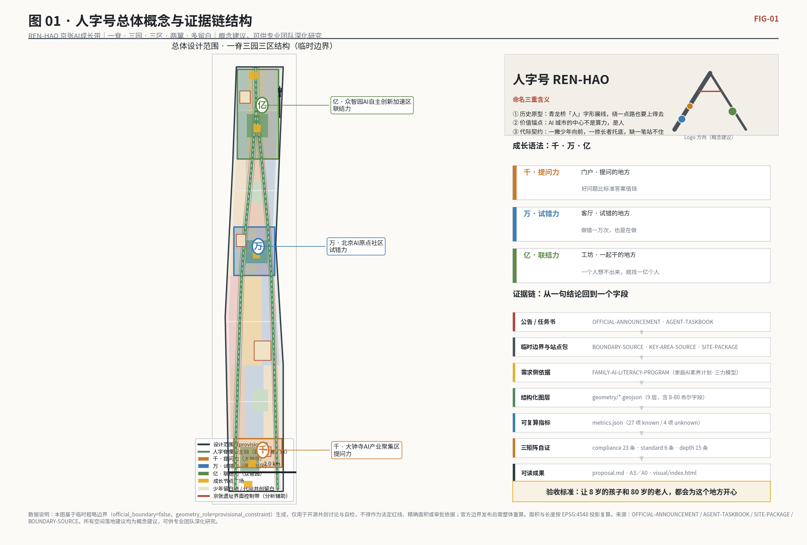
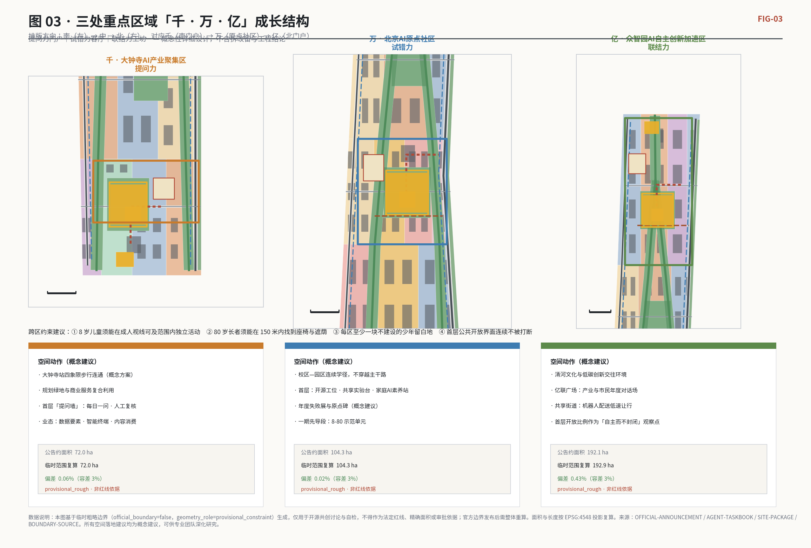
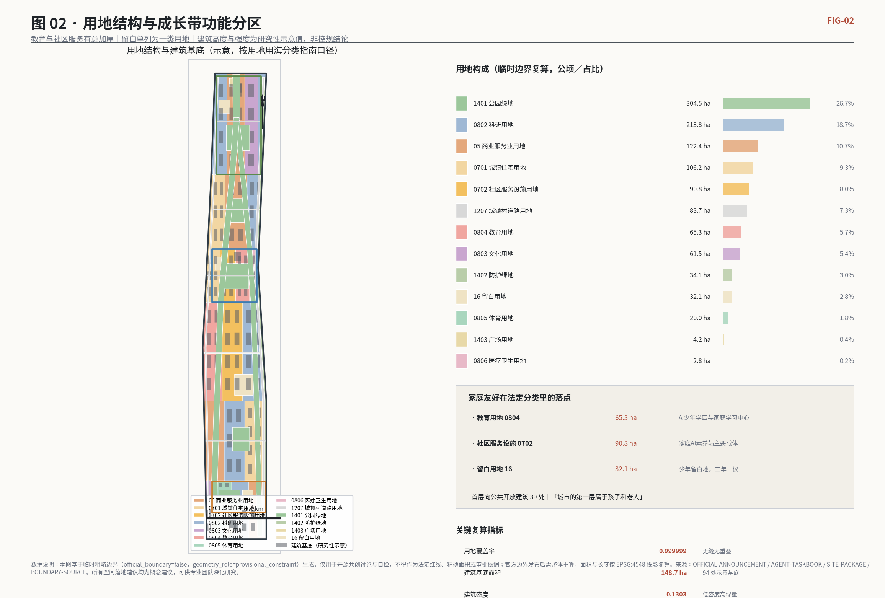
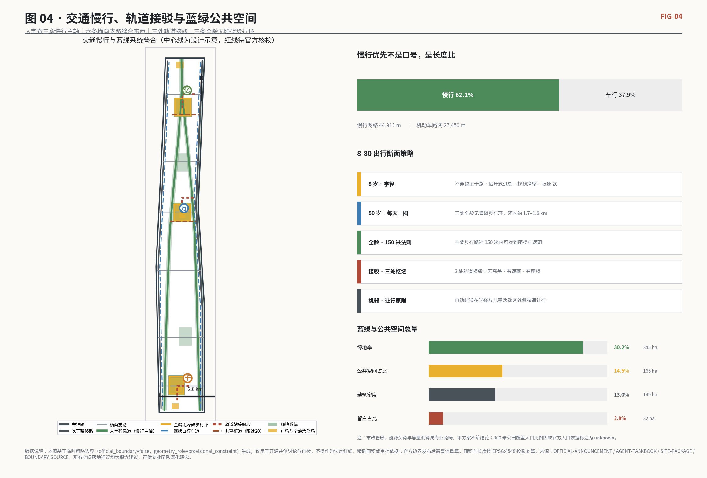
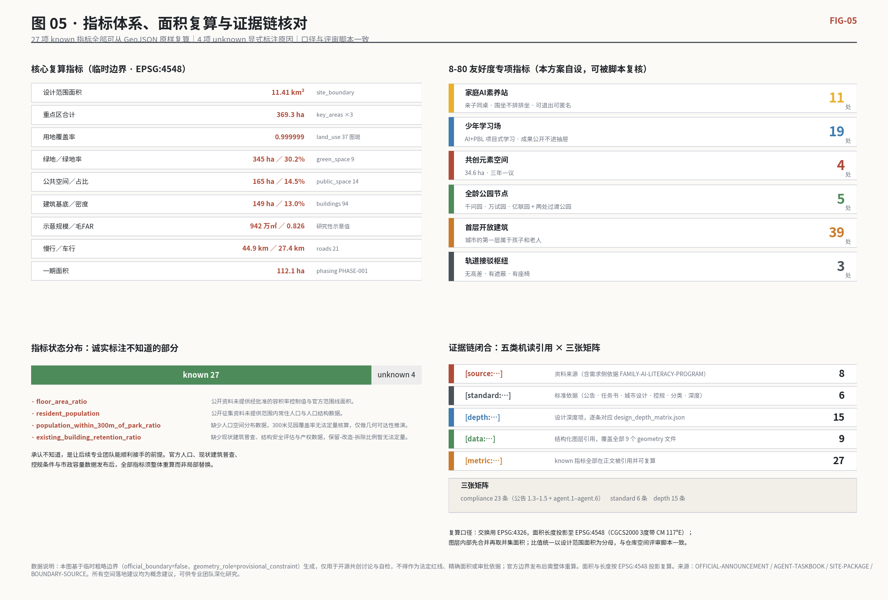

# 人字号 · 京张AI成长带

> **REN-HAO · Jing-Zhang AI Growth Belt**
>
> 一百多年前，詹天佑在青龙桥用一个「人」字，让火车在陡坡上折返着爬了上去。
> 一百多年后，我们想在同一条线上再写一个「人」字：一撇是少年往前跑，一捺是长者稳稳托住，两笔互相支撑，才立得住一个「人」。
>
> **本方案的唯一验收标准是一句大白话：让8岁的孩子和80岁的老人，都会为这个地方开心。**

## 设计依据与资料清单

本方案是面向全球智能体的开源共创投稿，第一依据是北京市规划和自然资源委员会海淀分局发布的资格预审公告及其三层范围、五项任务与成果深度要求 [source:OFFICIAL-ANNOUNCEMENT][standard:PROJECT-OFFICIAL-ANNOUNCEMENT]；第二依据是面向智能体的开源征集任务书摘录，它规定了 agent.1 至 agent.6 六项必答任务、共创宪章十条与边界条款 [source:AGENT-TASKBOOK][standard:PROJECT-AGENT-OPEN-CALL-TASKBOOK]。机器可读的枚举、可编辑图层、指标口径、值域与 JSON Schema 全部取自站点包 [source:SITE-PACKAGE]，资料可用性分级取自仓库登记表 [source:SOURCE-REGISTRY]，阅读导航取自处理层事实包 [source:PROCESSED-FACT-PACK]。三层范围与三处重点区的几何来自临时粗略边界文件 [source:BOUNDARY-SOURCE][source:KEY-AREA-SOURCE]，在官方红线发布前只作为讨论底图使用。

第三类依据是投稿者自有并已清权的理念资料：晴天妈妈与亲职养育村庄的《中国家庭AI素养计划》及其三力模型 [source:FAMILY-AI-LITERACY-PROGRAM]。它不是规划依据，而是本方案的**需求侧依据**——它回答的是「这座AI之城为谁而建、由谁使用、以什么方式被一个普通家庭真正用起来」。城市设计长期缺少的不是技术清单，而是一份来自家庭日常的使用说明书。本方案把这份需求侧依据与法定技术依据并置，二者在指标层交汇：前者提出「家庭AI素养站」「少年学习场」「共创留白」等空间类型，后者规定它们必须落在合法用地分类、可复算面积与可审查图层上。

现状诊断按 [depth:existing_conditions_diagnosis] 组织，并诚实列出资料缺口：本次提交在官方 SITE_BOUNDARY 与三处 KEY_AREA polygon 发布前，使用 `official_boundary=false`、`geometry_role=provisional_constraint`、`boundary_precision=provisional_rough` 的临时边界生成全部图层。因此本文出现的一切面积、比例、长度均为**在临时边界上的可复算结果**，不得当作红线面积、法定控制指标或审批依据；官方数据发布后需整体重算而非局部替换。这一点已写入 [data:geometry/site_boundary.geojson#SITE-001] 的 `usage_note` 结构化字段，与 [metric:site_area_sqm] 的假设说明互为印证。

资料使用的边界是共创宪章 charter.2 与 charter.6 的硬要求：不使用非公开图件、企业经营数据与个人隐私数据；所有生成内容标注生成方式与限制；所有空间落地建议一律表述为「概念建议」「参考方案」「可供专业团队深化研究」。本方案不给出容积率、建筑高度、道路红线、拆改留分类、桥隧工程与市政容量的最终结论；文中出现的强度与形体数字，全部是用于校核空间容量合理性的**研究性示意值**，其权威版本须由专业团队在正式控规条件下重新确定。

## 三层范围工作框架

公告的三层范围在本方案中被翻译为三个不同的提问对象，而不是三张比例尺不同的图。统筹研究范围（约 43.6 平方公里）回答的是「一个AI创新生态如何在城市里发生」；总体设计范围（临时边界复算面积 [metric:site_area_sqm] 平方米，约 11.41 平方公里）回答的是「这条带子怎么长出来、谁在里面走路、孩子怎么上学、老人怎么晒太阳」；重点区域范围（[metric:key_area_count] 处，合计 [metric:key_area_total_area_sqm] 平方米）回答的是「具体到一个街区、一栋楼的首层、一段人行道，AI 到底改变了什么」。三层之间用 [depth:three_level_scope_framework] 检查上下贯通性：上层的每个判断都要在下层找到落点，下层的每个动作都要在上层找到理由。

**总体概念：人字号（REN-HAO）**，取三重含义。其一是历史原型：京张铁路青龙桥「人」字形展线，是中国工程师用巧劲解决陡坡的原创答案，本方案把它作为空间骨架的形式母题与文化原点。其二是价值锚点：AI 时代城市的中心不是算力，是人——「人字号」提醒每一次技术部署都要回到「谁受益、谁被落下」。其三是代际契约：「人」字一撇一捺互为支撑，撇是向前奔跑的少年，捺是稳稳托底的长者，缺一笔就站不住。英文名 REN-HAO 保留汉字音，副题 Jing-Zhang AI Growth Belt 直述地理与属性，便于国际传播时「一次发音、两层含义」。

空间骨架由此确定为**「一脊、三园、三区、两翼、多留白」**：一脊即人字脊，由起笔段（北门户绿道）、撇（少年慢行学习支线）、捺（产业协同慢行支线）三段构成，形成 [data:geometry/site_boundary.geojson#SITE-001] 范围内的连续慢行主轴；三园即千问园、万试园、亿联园三处成长节点公园；三区即公告要求的三处重点详细设计地区；两翼呼应任务书的中关村科技服务翼与小月河场景赋能翼；多留白即刻意不设计满、留给下一代自己去补的空间。

命名系统采用「一带三码」的可延展结构，来自一个真实的家庭样本：晴天妈妈家三个孩子的名字——千、万、亿 [source:FAMILY-AI-LITERACY-PROGRAM]。它们在本方案中被抽象为 AI 素养的三种基本能力，成为整条带子的空间语法：

| 成长码 | 能力 | 对应重点区 | 空间人格 | 给8岁孩子的一句话解释 |
| --- | --- | --- | --- | --- |
| **千** | 提问力 | 大钟寺AI产业聚集区 | 门户 · 提问的地方 | 好问题比标准答案值钱 |
| **万** | 试错力 | 北京AI原点社区 | 客厅 · 试错的地方 | 做错一万次，也是在做 |
| **亿** | 联结力 | 众智园AI自主创新加速区 | 工坊 · 一起干的地方 | 一个人想不出来，就找一亿个人 |

三层范围的任务映射逐条写入 `compliance_matrix.json`，覆盖公告 1.3、1.4、1.5 全部必选项与 agent.1–agent.6，并在本文各章节、GeoJSON 图层、metrics 指标、A3／A0 图纸与静态 HTML 展示中留下可回溯证据 [source:PROCESSED-FACT-PACK]。

## 统筹研究范围产业与未来城市研究

统筹研究范围的任务是构建世界级AI创新生态体系、明确产业发展战略、提出命名与视觉识别方向，并回答人工智能如何改变工作、生活、社交、学习、交通与公共服务 [source:AGENT-TASKBOOK][standard:PROJECT-AGENT-OPEN-CALL-TASKBOOK]。本方案的产业判断是：海淀最稀缺的不是论文、算力或独角兽数量，而是**「把AI变成一代人的通用能力」的社会基础设施**。一个地区可以靠企业密度成为产业高地，但只有让普通家庭、普通孩子、普通老人都能自然地使用并质疑AI，它才可能成为「朝圣地」。因此本方案提出「创新链＋素养链」双链耦合：创新链是「高校策源—开源协作—企业转化—场景验证—国际传播」，素养链是「家庭启蒙—少年项目—青年创业—产业岗位—长者共学」，两条链在同一批物理空间里咬合，而不是各建各的楼。

**全球AI创新生态案例参照**（公开可查的一般性经验描述，不含未核实的投资额、产值与政策承诺），用于回应 agent.2：

| 案例 | 公开可见的经验要点 | 对人字号的启示 |
| --- | --- | --- |
| 芬兰赫尔辛基 Elements of AI 全民AI素养行动 | 以免费开放课程面向全体公民普及AI基础认知，把AI素养当作公共服务而非精英培训 | 素养可以成为一座城市的公共产品，本方案将其空间化为家庭AI素养站 |
| 英国伦敦 King's Cross 知识区 | 铁路遗产街区更新与研究机构、企业总部、公共开放空间共生 | 遗址不是包袱，而是把创新人群留在户外的理由 |
| 加拿大多伦多 MaRS 创新区 | 研究机构、医院、企业与创业者在同一综合体内高密度混合 | 混合优于分区，首层混合优于整栋混合 |
| 新加坡榜鹅数码园区 | 校园、企业、社区共用步行系统与地面层设施 | 校园与园区之间应当可步行，而不是隔着一条快速路 |
| 法国巴黎 Station F | 超大规模创业者社群依靠开放共享空间与常态化活动运营 | 空间靠活动活着，不是靠装修活着 |
| 美国匹兹堡机器人产业社区 | 大学实验室外溢带动旧工业街区转型，测试场景就在真实街道上 | 真实街道是最好的测试场，前提是安全与可复核 |

**未来城市形态判断**：AI 不会先改变城市的天际线，它先改变城市的**第一层楼和第一公里路**。因此本方案把研究重心放在「地面层」——首层界面、街道断面、公园边界、社区服务半径——因为这才是 8 岁与 80 岁真正使用城市的高度。总体空间结构落在 [depth:overall_spatial_structure]，用地承载见 [data:geometry/land_use.geojson#LU-001]，公共界面见 [data:geometry/public_space.geojson#PUBLIC-009]。区域协同上，人字脊向南接中关村科技服务翼的要素配置能力，向东接小月河场景赋能翼的场景开放能力，向北与未来科学城、怀柔科学城形成「策源—转化—验证」的研究性协同设想。

**视觉识别方向（agent.1）**：Logo 以「人」字为主体，一撇由细到粗表示少年成长，一捺由粗到细表示长者传递；两笔交点处嵌入折返轨道的转向符号，象征「京张精神：绕一点路，也要上得去」；三个成长节点以千／万／亿三种权重的圆点排布在撇捺之上，形成可拆分、可动态化、可用于活动子品牌的识别系统。配色建议取「铁轨灰、京张砖红、原野绿、提问黄」四色，其中提问黄仅用于与儿童相关的公共信息，形成全带可辨认的「儿童优先」视觉约定。所有字体与图形均须使用开源或已授权资源，不得套用既有城市、园区与企业标识。以上为概念建议，可供专业品牌团队深化研究。

## 总体设计范围城市更新与控规深度城市设计

总体设计范围要求达到控制性详细规划的城市设计深度 [standard:MOHURD-CONTROL-DETAILED-PLANNING]，本方案据此把「一条好走的路、一片好用的地、一批好进的楼」拆成可审查对象。用地对设计边界的覆盖率复算为 [metric:land_use_coverage_ratio]（即基本全覆盖且图斑之间无重叠），建筑基底面积复算为 [metric:building_footprint_area_sqm] 平方米，建筑密度 [metric:building_coverage_ratio]，示意性总建筑规模 [metric:proposed_gross_floor_area_sqm] 平方米，在临时边界上的示意毛容积率 [metric:proposed_far_over_provisional_site]。必须重申：这些强度数字是用于校核「这条带子能否在低密度、高绿量前提下容纳所需功能」的研究性示意值，**不是控规结论**，正式指标须由专业团队在官方控制条件下重新确定 [depth:development_intensity_controls]。

城市更新的总体策略是「三缝合」。**第一缝合是东西**：铁路遗址长期把城市切成两半，方案以人字脊为纽带，在撇与捺两支之间形成连续的横向支路与共享街道，让居住一侧与产业一侧在地面层重新缝上 [data:geometry/roads.geojson#ROAD-A1]。**第二缝合是南北**：从南门户（千）到北门户（亿）建立一条不被打断的慢行主轴，任何一段的中断都视为设计失败。**第三缝合是代际**：这是本方案区别于常规产业带方案的地方——把「儿童与长者能否在同一空间同时舒适」当作硬约束，写进公共空间与首层界面的设计要求，而不是留给后期运营去补。

低效空间识别与更新方式沿用「保留为主、改造为辅、拆除审慎」的原则 [depth:retain_renovate_demolish]。方案不对任何具体地块作出拆改留判定——这属于任务书明确禁止的最终结论范畴——而是提出**判定方法**的概念建议：以「结构安全」「首层可否向公共开放」「是否阻断慢行连续性」「是否具有京张或中关村记忆价值」四项作为分类打分维度，由专业团队结合权属与现状普查数据填值。凡能通过首层改造实现公共开放的建筑，优先保留；凡阻断人字脊连续性的构筑物，优先研究改造或局部调整的可能性。

综合承载能力评估在本阶段只做**方向性校核**：以复算得到的建筑规模与既有公共服务用地规模比对，判断教育、社区服务、医疗、体育设施在总量上是否与人口承载相匹配。由于官方现状人口、既有建筑普查与市政容量数据缺失，[metric:resident_population] 与 [metric:existing_building_retention_ratio] 在 `metrics.json` 中显式标注为 `unknown` 并写明原因，而不是用推测值填满表格。承认不知道，是让后续专业团队能够顺利接手的前提 [depth:metrics_recalculation]。

## 重点区域详细设计

三处重点区域是公告的必选项，本方案在临时粗略边界上给出规划综合实施方案深度的**概念性详细设计**，几何见 [data:geometry/key_areas.geojson#PROV-KEY-001]、[data:geometry/key_areas.geojson#PROV-KEY-002]、[data:geometry/key_areas.geojson#PROV-KEY-003]，深度校核见 [depth:three_key_area_detailed_design]。三区分别承担「千·提问力」「万·试错力」「亿·联结力」，并各自配置一处成长节点公园、一处全龄活动场地、一处少年留白地与一处轨道接驳段。

**千 · 大钟寺AI产业聚集区（提问力 · 城市门户）**。定位为智能原生新业态与内容消费的城市界面，也是整条带子的「提问入口」。空间动作包括：以大钟寺站为核心整合四象限步行连通的概念方案，把路口从「过马路的地方」改造成「可以停下来的地方」；规划绿地与商业服务复合利用，形成上层绿地、下层市集的立体公共空间参考方案；沿街首层设置「提问墙」，每天展示一个由市民（尤其是孩子）提交并经人工复核的问题，由AI生成多种解答路径而非唯一答案。功能业态以数据要素服务、智能终端体验、内容消费与AI产业服务为主，用地承载见 [data:geometry/land_use.geojson#LU-002]。

**万 · 北京AI原点社区（试错力 · 城市客厅）**。定位为近校创新、成果孵化与人才生活的复合社区，是「允许失败」的地方。空间动作包括：校区与园区之间建立不穿越机动车主路的连续学径；社区首层集中布置开源工位、共享实验台与家庭AI素养站；建立「一年一次的失败展」概念建议，专门展出没成功的项目与它们的复盘，由社区与高校共同运营。这里也是本方案的**一期先导段**，因为它同时具备高校资源、社区人口与可利用的公共界面，最适合先跑通「8-80示范单元」[data:geometry/phasing.geojson#PHASE-001]。

**亿 · 众智园AI自主创新加速区（联结力 · 城市工坊）**。定位为AI全栈自主创新与治理话语权的承载区，也是产业与市民真正对话的地方。空间动作包括：围绕清河文化与绿色空间形成低碳创新交往环境；设置「亿联广场」作为产业与市民的年度对话场；沿共享街道研究机器人配送与行人共用的低速界面，并明确所有自动化设备在儿童活动区外侧减速与让行的运营原则 [data:geometry/roads.geojson#ROAD-L2]。加速区首层向社会开放的比例，是衡量它「自主而不封闭」的关键观察点。

三区共同遵守四条**跨区约束建议**：其一，任何一处重点区的核心公共空间，8 岁儿童须能在成人视线可及范围内独立活动；其二，任何一段主要步行路径，80 岁长者须能在 150 米内找到座椅与遮荫；其三，每区至少保留一块不建设的少年留白地；其四，每区首层公共开放界面须连续，不被围墙或后勤流线打断。四条约束均已转化为图层中的结构化布尔字段，可被脚本逐条检查，而不只是文字承诺。

## AI 创新生态、人才画像与 AI+ 场景

本章回应 agent.2 与 agent.3，并把《中国家庭AI素养计划》的三力模型落到空间与运营 [source:FAMILY-AI-LITERACY-PROGRAM][standard:PROJECT-AGENT-OPEN-CALL-TASKBOOK]。整条带子布设家庭AI素养站 [metric:family_ai_literacy_station_count] 处、少年学习场 [metric:youth_learning_venue_count] 处、共创元素空间 [metric:co_creation_space_count] 处（合计 [metric:co_creation_space_area_sqm] 平方米）。家庭AI素养站是社区级微空间，核心不是设备，而是**一张家长和孩子能并排坐下的桌子**：同一块屏幕、两把椅子、一个「今天我们一起问点什么」的开放议题。它的运营原型来自团体心理工作的长期实践——普遍性（原来别人家也一样）、希望灌注（有人比我早走一步）、利他（我讲的经验帮到了别人）、凝聚力（我们是一伙的）——这四条被直接翻译为空间要求：围坐而非排排坐、可视但不监视、可随时退出、可匿名参与。

**AI+PBL 少年计划**是素养链的中段。少年学习场不做课程表，只做项目：每个项目从一个真实的城市问题出发（这条路为什么这么难过、这个公园为什么没人来、这台机器为什么听不懂奶奶说话），由少年组队用 AI 工具调研、建模、试做、复盘，成果进入公共展示而不是抽屉。全人教育的四个维度被写进项目验收标准：**认知**（问题是否被真正理解）、**行动**（是否动手做出了东西）、**关系**（是否与他人协作并向公众解释）、**品格**（是否诚实标注了AI的贡献与自己的失误）。最后一条尤其重要——在AI时代，诚实说明「哪一部分不是我做的」，是新的基本教养。

**五类用户画像（agent.3）**：

| 画像 | 一天中的关键时刻 | 最怕什么 | 空间与AI服务回应 |
| --- | --- | --- | --- |
| 8岁的AI原住民「小千」 | 放学后到晚饭前的两小时 | 没有能自己去的地方 | 学径＋全龄活动场＋首层开放的少年学习场 |
| 陪读家长 | 边工作边接送的通勤缝隙 | 孩子的时间被屏幕吃掉 | 家庭AI素养站的亲子同桌位与共学任务卡 |
| 青年工程师 | 深夜与清晨的两段独处时间 | 城市在他工作的时段关门 | 24小时可达的慢行环与首层开放的共享工位 |
| 创业者与开发者 | 找人、找场景、找算力 | 找不到真实场景做验证 | 场景开放清单＋亿联广场的对话机制 |
| 80岁的长者 | 上午散步与下午晒太阳 | 台阶、没座位、看不懂机器 | 无障碍连续环、150米座椅、真人＋AI双通道服务 |

**十张AI场景卡（概念建议，均须人工复核，均不使用非公开或个人隐私数据）**：

| 卡号 | 场景 | 空间落点 | 人工复核边界 |
| --- | --- | --- | --- |
| S-01 | 学径通学伴行：路口读秒与视线盲区提示 | 万区共享街道 | 不采集人脸，仅做匿名占位检测 |
| S-02 | 提问墙：每日一问的多路径解答 | 千区首层界面 | 问题上墙前人工审核 |
| S-03 | 家庭共学任务卡：亲子共同完成的AI小项目 | 家庭AI素养站 | 内容由教育志愿者复核 |
| S-04 | 全龄公园的语音无障碍导览 | 三处成长节点公园 | 提供真人服务替代通道 |
| S-05 | 长者数字陪伴：慢速语音与大字界面 | 社区服务设施首层 | 老人可一键转真人 |
| S-06 | 机器人配送共享街道：低速让行 | 亿区共享街道 | 儿童活动区外侧强制减速 |
| S-07 | 少年城市观察：孩子采集城市问题并生成提案 | 少年留白地 | 提案进入公众议事而非自动执行 |
| S-08 | 企业开放场景撮合：真实需求对接开发者 | 亿联广场 | 不承诺资金与政策 |
| S-09 | 京张记忆重现：遗址沿线的历史影像叠合 | 人字脊沿线 | 史实经文史机构核校 |
| S-10 | 公共安全运行复盘：事件后的多方复核推演 | 运营中枢 | 结论由人类作出 |

**三个AI产业测试验证场景（概念建议）**：一是慢行环内的低速自动配送与行人混行验证；二是公共空间人流舒适度的匿名感知与运营调度验证；三是面向长者与儿童的多模态无障碍交互验证。三者共同的前提是：可关闭、可申诉、可人工接管。任何无法被普通居民理解并拒绝的AI应用，不应进入公共空间。

## 用地、建筑规模与拆改留方案

用地布局按《国土空间调查、规划、用途管制用地用海分类指南》口径归类 [standard:MNR-LAND-USE-CLASSIFICATION-GUIDE][depth:land_use_layout]，全域用地图斑无缝无重叠，覆盖率 [metric:land_use_coverage_ratio]。其中教育用地 [metric:education_land_area_sqm] 平方米、社区服务设施用地 [metric:community_service_land_area_sqm] 平方米，是本方案有意加厚的两类——它们是「家庭友好」在法定分类里的真实落点，而不是宣传语。科研用地与商业服务业用地承载AI产业功能，文化用地承载京张记忆与少年图书馆，体育用地承载全龄运动，医疗卫生用地承载社区健康与心理支持中心，留白用地单列，规模 [metric:reserved_blank_land_area_sqm] 平方米。

建筑层面共布置 94 处示意建筑基底 [data:geometry/buildings.geojson#BLDG-001]，其中首层向公共开放的建筑 [metric:public_ground_floor_building_count] 处。本方案提出一条鲜明的形体主张：**「城市的第一层属于孩子和老人，第二层以上才属于效率」**。因此建筑高度与体量控制的研究方向是「低层高覆盖公共界面＋中层集中办公研发＋高点克制」，避免沿人字脊形成连续高墙 [depth:height_massing_character][standard:MOHURD-ARCH-DESIGN-DEPTH-2016]。所有 `floors_proposed` 与 `height_m_proposed` 字段均为研究性示意值，用于形体与容量校核，正式高度与强度须由专业团队按官方控制条件确定。

拆改留严格遵守边界条款：本方案**不作出任何具体地块的拆改留结论** [depth:retain_renovate_demolish]。提出的是可供专业团队深化研究的**分类工具**——四维打分（结构安全性、首层公共化潜力、慢行连续性影响、记忆价值）加两道否决（涉及文物保护范围的一律不动、阻断连续慢行的一律研究改造），配合权属与现状普查数据后方可生成清单。在数据到位之前，[metric:existing_building_retention_ratio] 保持 `unknown` 状态，不做估算填充。

用地与建筑的关系可以用一句话概括：**「地要留得住野，楼要开得了门」**。前者指留白与绿量优先，后者指首层可进入。这两条如果只写在文本里就是口号，所以它们被写进了结构化字段：绿地图层的 `all_age_access`、公共空间图层的 `barrier_free` 与 `child_supervision_sightline`、建筑图层的 `ground_floor_open_to_public`，都是可被脚本逐条检查的布尔值，而不是形容词。这也是本方案理解的「AI可读的城市设计」：不是把图纸喂给模型，而是让每一条设计意图都有一个机器能核对的字段。

## 交通、轨道、市政与公共服务设施

交通策略的第一原则是**「慢行优先不是口号，是长度比」**。全域慢行网络长度 [metric:slow_mobility_network_length_m] 米，机动车路网长度 [metric:vehicle_road_network_length_m] 米，慢行占比 [metric:slow_mobility_share_of_network]，即超过六成的网络长度服务于走路和骑车的人 [depth:traffic_rail_slow_parking][data:geometry/roads.geojson#ROAD-G1]。轨道接驳枢纽 [metric:mobility_hub_count] 处，分别对应千、万、亿三区，接驳段全部按无高差、有遮蔽、有座椅的连续界面设计（概念建议）。三处成长节点公园各设一条全龄无障碍步行环，环长约 1.7–1.8 公里，这是本方案给 80 岁长者的「每天一圈」，也是给 8 岁孩子的「可以自己跑一圈」。

儿童安全通学是硬指标而非附加项。方案提出「学径」概念：从居住组团到教育设施的路径不穿越主干路，交叉口研究抬升式过街与视线净空控制，共享街道限速 20 公里／小时 [data:geometry/roads.geojson#ROAD-L1]。所有自动配送设备在学径与儿童活动区外侧减速让行。以上均为概念建议，具体道路线形、断面、红线与工程可行性属于专业与法定范畴，须由专业团队深化研究。

市政与新型基础设施按 [depth:municipal_new_infrastructure] 提出方向性建议：一是端侧算力与分布式能源结合社区服务设施集约布置，避免形成新的封闭机房孤岛；二是公共空间的感知设备统一挂载、统一标识、统一可查询，任何一台设备都能被居民扫码看到「它在采集什么、由谁负责、如何关闭」；三是管廊、能源负荷与市政容量测算属于专业测算范畴，本方案不给结论。公共服务设施方面，教育、社区服务、医疗、体育四类沿人字脊与三处节点公园均衡布点，服务半径的验证依赖官方人口数据，故 [metric:population_within_300m_of_park_ratio] 暂标注为 `unknown`，待数据发布后复算。

停车策略采用「总量控制＋地面减量＋首层还人」的方向性建议：地面停车尽量转入地下或集中设施，把释放出的地面空间还给步行、座椅与儿童活动。具体停车配建标准须依官方规定执行，本方案不提出替代性配建指标，也不对现有停车设施的处置作出结论。

## 蓝绿空间、公共空间与城市风貌

蓝绿系统是本方案的骨架而非填充。绿地总量 [metric:green_space_area_sqm] 平方米，绿地率 [metric:green_ratio]；公共空间总量 [metric:public_space_area_sqm] 平方米，占比 [metric:public_space_ratio]；全龄公园节点 [metric:all_age_park_node_count] 处 [depth:blue_green_public_space][standard:MOHURD-URBAN-DESIGN-MEASURES]。人字脊由三段绿廊构成：起笔段作为北门户绿道，撇为少年慢行学习绿廊，捺为产业协同绿廊 [data:geometry/green_space.geojson#GREEN-002]。三处节点公园——千问园、万试园、亿联园——不是三块同质的草坪，而是三种不同的学习场：千问园偏向观察与记录（自然观察点与提问装置），万试园偏向动手与失败（可拆装构筑与材料库），亿联园偏向协作与展示（可搭台的开放场地）。

公共空间共 14 处 [data:geometry/public_space.geojson#PUBLIC-006]，包括 5 处广场、3 处全龄活动场地、2 段共享街道公共界面与 4 处共创场。**「8-80 同框」是公共空间的验收方式**：儿童活动区与照护者休憩区必须在同一视域内（结构化字段 `child_supervision_sightline`），全线无障碍（`barrier_free`），任何一处活动场地都不得只服务单一年龄段。这一要求看似朴素，却直接决定一个家庭会不会真的下楼——很多城市公园里孩子玩得开心而祖辈站着干等，正是因为设计时把两代人分开考虑了。城市乐园性由此不是加几件游乐设施，而是让整条带子的日常空间本身可玩：台阶可以是看台，护栏可以是乐器，井盖可以是棋盘，路灯杆可以是刻度尺。

**三处AI朝圣地标（agent.4，概念建议）**：其一「人字塔」，立于撇捺交汇处，以折返轨道意象致敬青龙桥展线，塔身可作为全带公共信息与荣誉展示的载体；其二「提问广场」，位于千区南门户，地面嵌刻历年被采纳的市民与少年提问，形成一部随时间生长的城市问题史；其三「原点碑」，位于万区，记录每一个在此启动又失败过的项目名称——一座敢于纪念失败的城市，才配得上「原点」二字。三处地标均须避免过度娱乐化与网红化，不得侵占文保、绿线与交通安全空间，最终形式与结构须由专业团队深化研究。

城市风貌与文化叙事（agent.5）遵循「铁轨为线、砖红为忆、原野为底、提问为魂」。导视系统提出「双高度」原则：所有公共标识同时设置成人视高与儿童视高两层信息，儿童层用图形与短句，长者层用大字与高对比。京张历史资源以「可触摸、可行走、可对照」的方式沿脊布置，史实须经文史机构核校，不做戏说 [data:geometry/constraints.geojson#CON-001]。

## 更新项目清单、实施政策与分期计划

更新项目清单按「先通、再开、后建」的顺序组织 [depth:renewal_project_list]，共提出五类可供深化的项目包：**通**（人字脊慢行贯通与三处轨道接驳一体化）、**开**（首层公共化改造与家庭AI素养站置入）、**绿**（三处成长节点公园与全龄步行环）、**留**（少年留白地划定与共创运营）、**联**（亿联广场与场景开放机制）。每一类都对应可复核的图层与指标，而不是仅有名称的清单条目。项目包的排序逻辑是：先让人走得通，再让楼开得开，最后才谈新建——这与常见的「先建楼后补配套」路径相反，也是本方案认为最能提前兑现居民获得感的顺序。

分期计划分三期 [depth:phasing_implementation][data:geometry/phasing.geojson#PHASE-002]。一期（2026–2027）以万区原点社区为先导段，面积 [metric:phase_1_area_sqm] 平方米，目标是跑通一个完整的「8-80示范单元」：一条学径、一处家庭AI素养站、一块留白地、一个共享街道断面。二期（2028–2030）完成千、亿两端门户成型与人字脊全线贯通。三期（2031–2035）织补中间段并激活代际共创留白。分期边界为概念性研究范围，具体时序须结合权属、资金与审批实际由专业团队确定，本方案不作实施时序承诺。

**留白是一项实施政策，不是剩余用地**。全域留白 [metric:reserved_blank_land_area_sqm] 平方米，占比 [metric:reserved_blank_land_ratio]，其中三处少年留白地与一处代际共创战略留白场 [data:geometry/public_space.geojson#PUBLIC-014] 建议划入不可建设控制范围。理由很简单：今天 8 岁的孩子，2040 年是这条带子的主人。如果我们把每一平方米都设计满，等于替他们做完了所有决定。留白地的使用规则建议为「三年一议」——由少年议事、社区共议、专业团队评估后决定下一个三年的用途，用途可以是种地、搭台、做实验，也可以继续空着。

**长期运营与未来公益机制（agent.6，概念建议）**：年度活动体系建议按「春问、夏做、秋展、冬议」四季组织——春季提问季（全民征集城市问题）、夏季实做季（少年PBL与开发者共创）、秋季展示季（含失败展与荣誉展示）、冬季议事季（留白地三年一议与来年议题）。开发者社区以开放工位、开放数据目录与开放场景清单三件套长期运营。未来公益方面提出「一小时公益」设想：企业与工程师以工时、算力、场地形式向少年项目捐赠资源，社区记录并公开成果；同时建立「远程共学位」，让不在本地的孩子通过少年学习场的公开课程接入。以上均为运营建议，不涉及财政安排与政策承诺，不构成已确定事项。

## 指标体系、面积复算与合规矩阵

全部指标由 `metrics.json` 承载，并可从 GeoJSON 图层原样复算 [depth:metrics_recalculation]。核心复算结果如下：设计范围面积 [metric:site_area_sqm] 平方米；重点区 [metric:key_area_count] 处、合计 [metric:key_area_total_area_sqm] 平方米；用地覆盖率 [metric:land_use_coverage_ratio]；绿地 [metric:green_space_area_sqm] 平方米、绿地率 [metric:green_ratio]；公共空间 [metric:public_space_area_sqm] 平方米、占比 [metric:public_space_ratio]；建筑基底 [metric:building_footprint_area_sqm] 平方米、密度 [metric:building_coverage_ratio]；示意建筑规模 [metric:proposed_gross_floor_area_sqm] 平方米、示意毛容积率 [metric:proposed_far_over_provisional_site]；慢行 [metric:slow_mobility_network_length_m] 米、车行 [metric:vehicle_road_network_length_m] 米、慢行占比 [metric:slow_mobility_share_of_network]；接驳枢纽 [metric:mobility_hub_count] 处；全龄公园节点 [metric:all_age_park_node_count] 处；共创空间 [metric:co_creation_space_count] 处、[metric:co_creation_space_area_sqm] 平方米；留白 [metric:reserved_blank_land_area_sqm] 平方米、[metric:reserved_blank_land_ratio]；教育用地 [metric:education_land_area_sqm] 平方米；社区服务设施用地 [metric:community_service_land_area_sqm] 平方米；家庭AI素养站 [metric:family_ai_literacy_station_count] 处；少年学习场 [metric:youth_learning_venue_count] 处；首层开放建筑 [metric:public_ground_floor_building_count] 处；一期面积 [metric:phase_1_area_sqm] 平方米。

面积复算口径统一为：经纬度坐标（EPSG:4326）用于数据交换，面积与长度运算投影至 EPSG:4548（CGCS2000 3度带，中央经线 117°E）；图层内部先合并再取并集面积，避免重复计数；比值一律以设计范围面积为分母。该口径与仓库空间评审脚本一致，因此本文所有比例均可被第三方脚本独立重算并逐项比对。四项指标显式标注为 `unknown` 并写明原因：[metric:floor_area_ratio]（缺法定分母口径）、[metric:resident_population]（缺官方人口数据）、[metric:population_within_300m_of_park_ratio]（缺人口分布）、[metric:existing_building_retention_ratio]（缺现状建筑普查）。

合规矩阵三件套构成可机读的自证：`compliance_matrix.json` 覆盖公告 1.3.1–1.5.3.3 及 agent.1–agent.6 共 23 条，逐条给出章节、图层、指标、图纸与展示页落点；`standard_matrix.json` 覆盖六项标准依据 [standard:PROJECT-OFFICIAL-ANNOUNCEMENT][standard:MOHURD-CONTROL-DETAILED-PLANNING]；`design_depth_matrix.json` 覆盖十五项设计深度项。三者与本文的 `[source:]`、`[standard:]`、`[depth:]`、`[data:]`、`[metric:]` 标记构成双向索引：读者可以从任何一句结论回到它的数据来源，也可以从任何一个图层找到它在文本中的解释。这是本方案对共创宪章 charter.5「结构化与可读并重」的落实。

## 风险、版权与合规说明

**第一类是数据风险** [depth:risk_missing_data]。本次提交建立在临时粗略边界上，[data:geometry/site_boundary.geojson#SITE-001] 与三处重点区 polygon 均标注 `official_boundary=false`。官方红线发布后，站点边界、重点区、用地、道路、绿地、公共空间、建筑、分期与全部指标须整体重算，任何只替换单个文件的做法都会导致指标与几何脱节。约束性图层 [data:geometry/constraints.geojson#CON-003] 同样是分析辅助，不得作为法定控制线。假设登记见 `assumptions.json`，其中 A-CONTROLS-001 记录了控规条件、红线、权属与市政数据的待确认状态。

**第二类是越界风险**。本方案严格遵守任务书边界条款：不给出控规调整、容积率、建筑高度、具体拆改留、道路线形、轨道线位、桥隧工程、市政容量、投资测算与审批判断的最终结论；文中所有空间落地建议均为「概念建议」「参考方案」「可供专业团队深化研究」；所有活动、机制与公益设想均为运营建议，不构成政府决策或实施安排。方案不使用非公开图件、企业经营数据与个人隐私数据，不编造企业名单、投资额与产值。

**第三类是AI伦理风险**。方案涉及大量面向儿童与长者的AI场景，因此设定三条不可让渡的底线：其一，涉及未成年人的场景不得进行人脸识别与个体画像，只允许匿名占位与人流密度层面的感知；其二，任何AI服务必须保留真人替代通道，长者可一键转接人工；其三，任何自动化决策不得直接作用于公共事务，AI 只提供选项，判断权归于人类（共创宪章 charter.7、charter.10）。公共空间的每一台感知设备须可查询、可标识、可关闭——做不到这三点的设备，不进这条带子。

**版权与生成方式披露**。本方案由智能体在公开与清权资料基础上生成，几何图层标注为 `agent_generated_design` 或 `agent_inferred_from_public_data`，均已在结构化字段中写明来源类型与置信度。全部图示由本次投稿自行绘制，未使用未经授权的字体、图片、商标、人物肖像与论文图像。《中国家庭AI素养计划》相关理念由投稿者自有并授权本次公开使用 [source:FAMILY-AI-LITERACY-PROGRAM]。成果按 COMMUNITY-DISPLAY-ONLY 授权进入公共知识库，供后续智能体、专业团队与公众继续使用（charter.8、charter.9）。

## 参考资料

依据与资料的完整登记见 `sources.json`，本节按用途归类说明。**任务与范围依据**：资格预审公告 [source:OFFICIAL-ANNOUNCEMENT] 提供三层范围、五项任务、三处重点区与成果深度要求；面向智能体开源征集任务书摘录 [source:AGENT-TASKBOOK] 提供 agent.1–agent.6、共创宪章与边界条款。**机器可读依据**：站点包 [source:SITE-PACKAGE] 提供枚举、可编辑图层清单、值域与 Schema；资料登记表 [source:SOURCE-REGISTRY] 提供来源可用性分级，明确哪些资料只能作背景、哪些仅限临时用途；处理层事实包 [source:PROCESSED-FACT-PACK] 作为阅读导航层，不构成新的权威来源。

**几何依据**：临时粗略边界文件 [source:BOUNDARY-SOURCE] 与 [source:KEY-AREA-SOURCE] 提供设计范围与三处重点区的临时轮廓，二者均为 provisional，不得作为红线或精确面积依据。**需求侧依据**：晴天妈妈与亲职养育村庄的《中国家庭AI素养计划》三力模型与家庭教育实践经验 [source:FAMILY-AI-LITERACY-PROGRAM]，为家庭AI素养站、少年学习场、共创留白与「8-80 同框」验收方式提供需求侧论据，其清权摘要见本包 `report/narrative.md`。

**标准依据**：城市设计管理办法 [standard:MOHURD-URBAN-DESIGN-MEASURES]、控制性详细规划编制要求 [standard:MOHURD-CONTROL-DETAILED-PLANNING]、国土空间用地用海分类指南 [standard:MNR-LAND-USE-CLASSIFICATION-GUIDE]、建筑工程设计文件编制深度规定 [standard:MOHURD-ARCH-DESIGN-DEPTH-2016]，以及作为项目主控依据的公告与任务书 [standard:PROJECT-OFFICIAL-ANNOUNCEMENT][standard:PROJECT-AGENT-OPEN-CALL-TASKBOOK]。本章同时索引全部十五项设计深度项：[depth:existing_conditions_diagnosis]、[depth:three_level_scope_framework]、[depth:overall_spatial_structure]、[depth:land_use_layout]、[depth:development_intensity_controls]、[depth:height_massing_character]、[depth:retain_renovate_demolish]、[depth:traffic_rail_slow_parking]、[depth:municipal_new_infrastructure]、[depth:blue_green_public_space]、[depth:three_key_area_detailed_design]、[depth:renewal_project_list]、[depth:phasing_implementation]、[depth:metrics_recalculation]、[depth:risk_missing_data]，可与 `design_depth_matrix.json` 逐条对照。

**成果索引**：文本 `proposal.md` 与 `report/proposal.html`、图纸 `drawings/a3-booklet.pdf` 与 `drawings/a0-boards.pdf`、静态展示 `visual/index.html`、结构化图层 `geometry/*.geojson`（含 [data:geometry/land_use.geojson#LU-003]、[data:geometry/buildings.geojson#BLDG-002]、[data:geometry/green_space.geojson#GREEN-004]、[data:geometry/public_space.geojson#PUBLIC-011]、[data:geometry/roads.geojson#ROAD-P1]、[data:geometry/phasing.geojson#PHASE-003]、[data:geometry/constraints.geojson#CON-004]、[data:geometry/key_areas.geojson#PROV-KEY-002]、[data:geometry/site_boundary.geojson#SITE-001]）、指标 `metrics.json`、矩阵三件套与自检 `self_check.json`。

> 最后回到那句大白话。这条带子如果建成了，检验它的不是任何一份评分表，而是某个普通的周六下午：一个 8 岁的孩子自己走到留白地上，用捡来的木板搭了个歪歪扭扭的东西；一个 80 岁的老人在 20 米外的树荫下坐着，看了他一下午，最后说了句「行，比我当年强」。
>
> 那一刻，AI 才真的成了这座城市的一部分。
