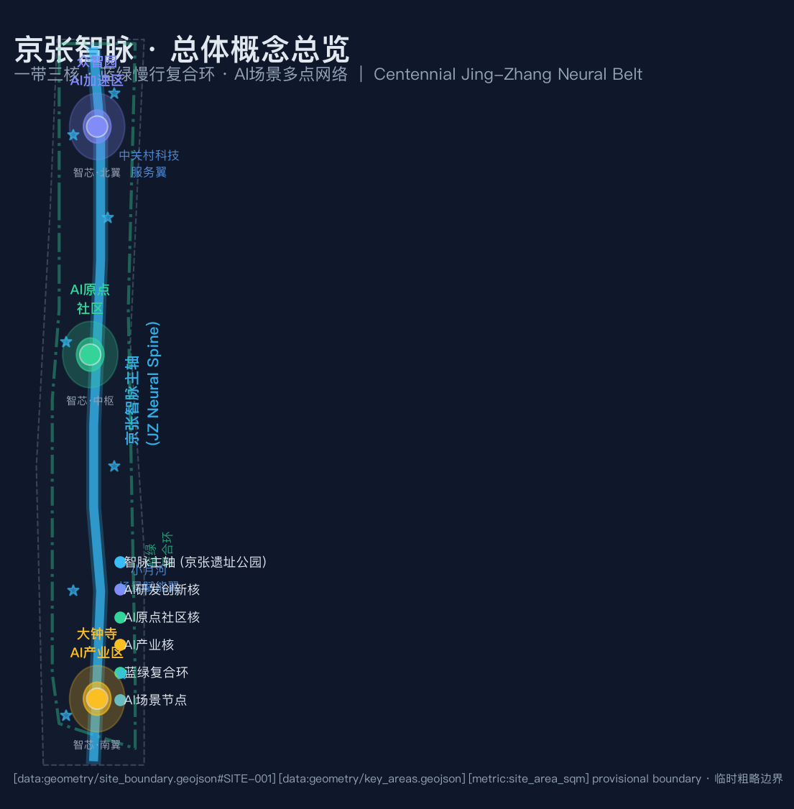
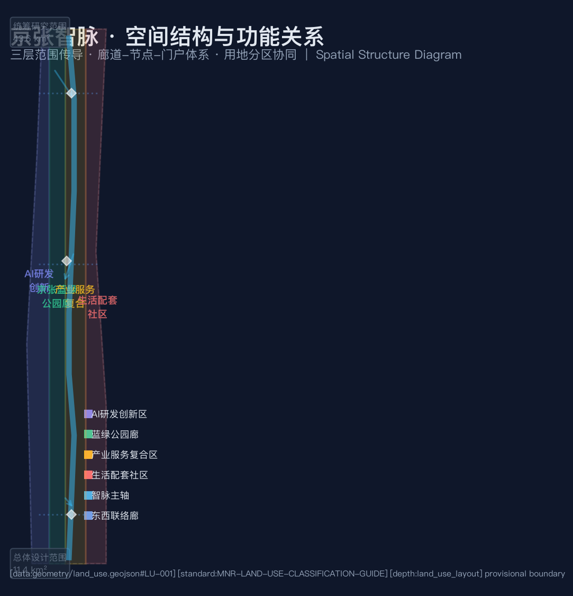
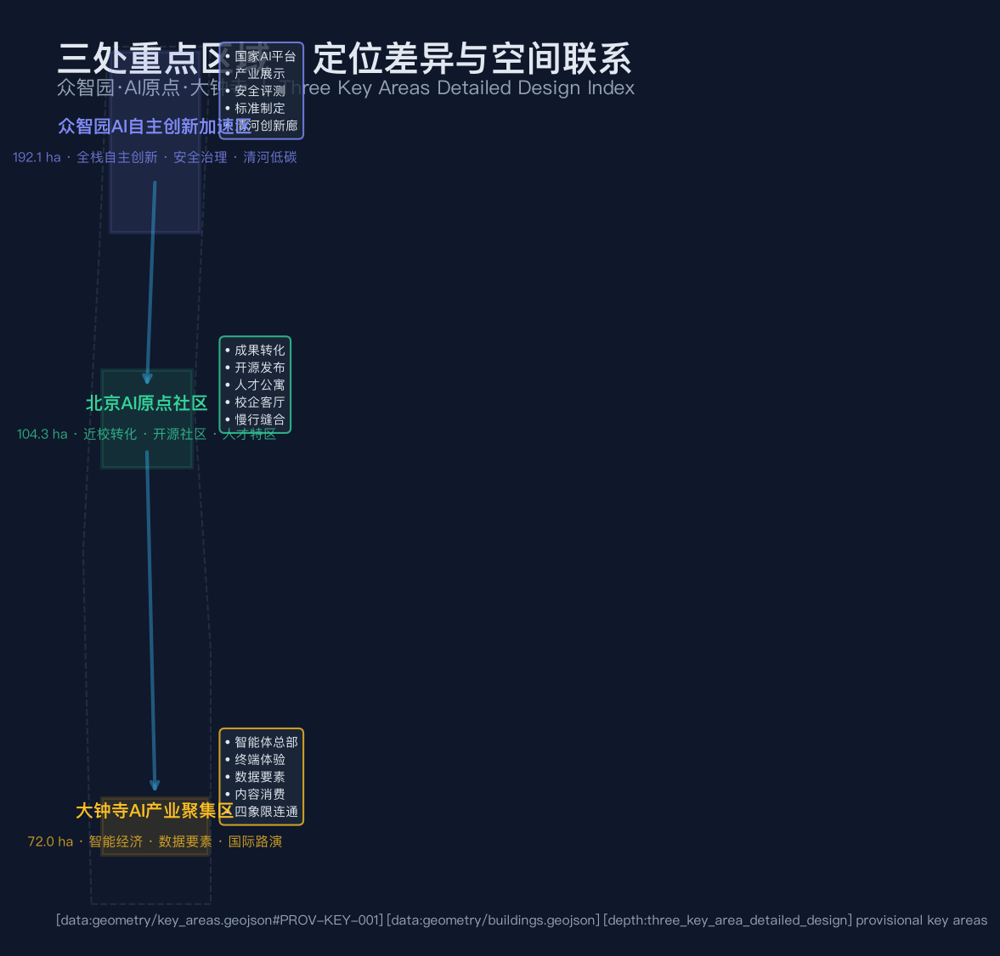
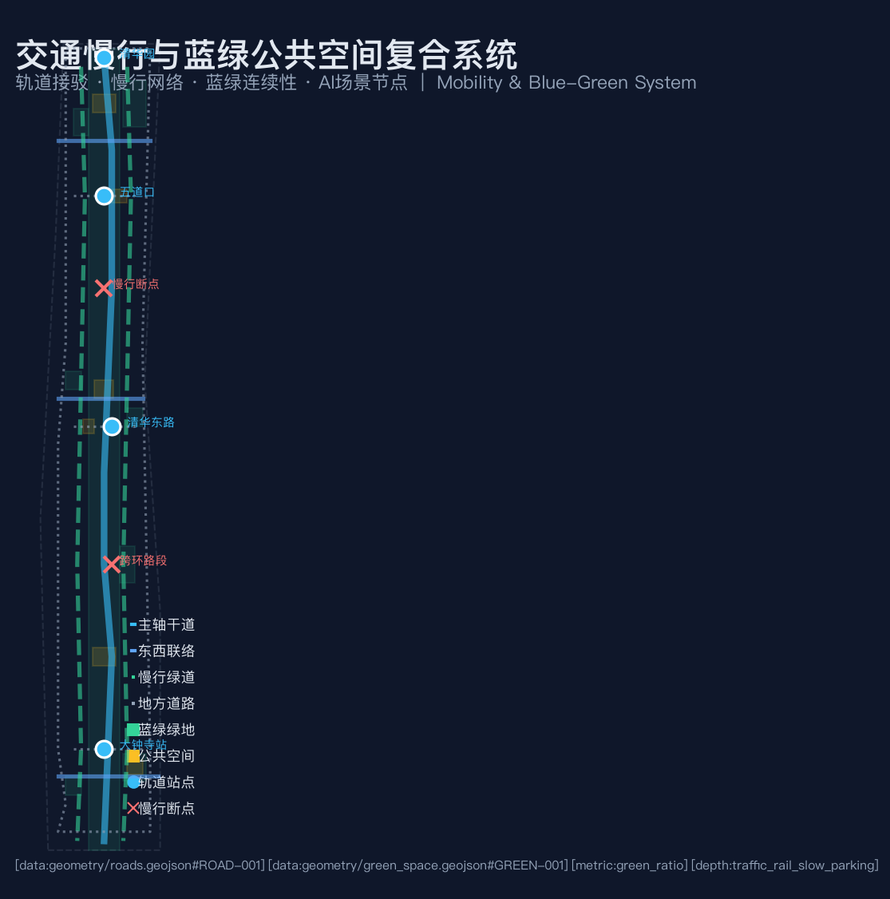
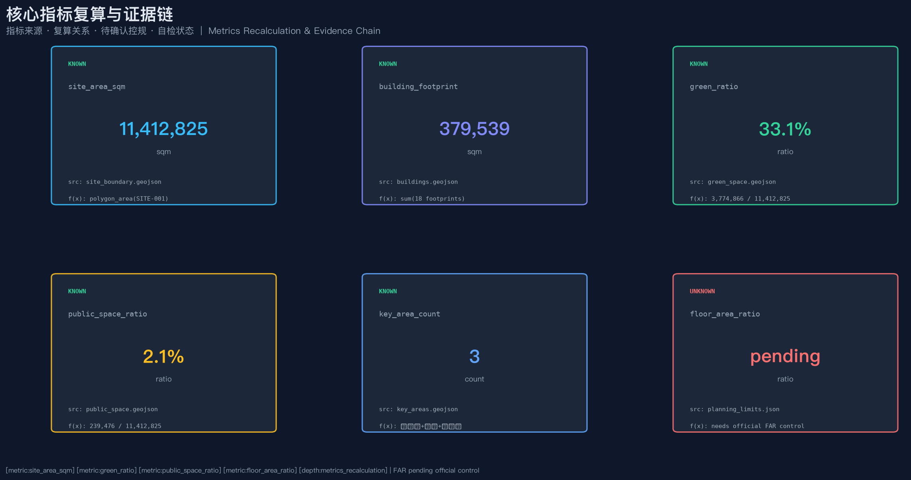

# 京张智脉·百年铁路与AI未来的城市缝合

## 设计依据与资料清单

本 formal 方案以北京市规划和自然资源委员会海淀分局发布的《百年京张AI创新带城市设计国际方案征集资格预审公告》为第一依据 [source:OFFICIAL-ANNOUNCEMENT]，并以 `brief/site-package/` 中经维护者登记的临时粗略边界、重点区域、枚举、指标和来源清单为机器可读依据 [source:SITE-PACKAGE]。AI agent 在生成方案前读取了 `design_brief.json`、`allowed_design_space.json`、`sources.json`、`enums/`、`ranges/`、`schemas/`、`data/source_registry.json` 和 `data/processed/agent_fact_pack.md` [source:SOURCE-REGISTRY]、[source:PROCESSED-FACT-PACK]，并用 `project_scope_summary.csv`、`agent_task_requirements.csv`、`source_use_matrix.csv`、`missing_data_checklist.csv` 建立任务、范围、资料用途和缺口清单。

公告要求方案达到控制性详细规划的城市设计深度，因此文本叙述不能替代 GeoJSON、指标表、A3 文册、A0 展板和 HTML 电子展示成果。方案覆盖 [standard:PROJECT-OFFICIAL-ANNOUNCEMENT]、[standard:PROJECT-AGENT-OPEN-CALL-TASKBOOK]、[standard:MOHURD-URBAN-DESIGN-MEASURES]、[standard:MOHURD-CONTROL-DETAILED-PLANNING]、[standard:MNR-LAND-USE-CLASSIFICATION-GUIDE] 和 [standard:MOHURD-ARCH-DESIGN-DEPTH-2016]，成果深度由 [depth:existing_conditions_diagnosis] 约束。

资料登记表的使用边界如下：当前登记摘要为 formal 可用资料 5 条、provisional-only 资料 1 条。agent 不得把 background_only 或 provisional_only 资料升级为 official boundary、法定控规、正式评分依据或政府实施承诺 [source:BOUNDARY-SOURCE]、[source:KEY-AREA-SOURCE]。

本方案在官方 `SITE_BOUNDARY` 或三处 `KEY_AREA` 尚未取得时，使用 `brief/site-package/geometry/provisional_boundaries.geojson` 生成临时 formal 包。提交包中的 `geometry/site_boundary.geojson` 与 `geometry/key_areas.geojson` 均标注为 `provisional_constraint`、`official_boundary=false`，只能用于方案生成、自检、可视化和设计讨论，不能作为 official redline、审批依据、精确面积依据或法定控制结论。该组织方数据缺口本身不阻断内容评分；替换 official polygons 后需重新复算。

边界和重点区域的可读解释对应 [data:geometry/site_boundary.geojson#SITE-001]、[data:geometry/key_areas.geojson#PROV-KEY-001] 和 [metric:site_area_sqm]、[metric:key_area_count]。

## 三层范围工作框架

方案按照公告确定的三个层次组织工作 [source:AGENT-TASKBOOK]：

- **统筹研究范围（43.6 km²）**：关注 AI 产业生态、战略定位、创新链和未来城市形态。北至北五环路，东至京藏高速，南至西直门外大街，西至万泉河路 [source:OFFICIAL-ANNOUNCEMENT]。
- **总体设计范围（11.4 km²）**：以京张遗址公园周边 1-2 公里城市地区和产业区为规划设计范围，要求形成城市更新总体框架、产业空间布局、交通市政支撑和城市风貌控制。
- **重点区域范围（368.4 公顷）**：自北向南包括众智园AI自主创新加速区（192.1 ha）、北京AI原点社区（104.3 ha）、大钟寺AI产业集聚区（72.0 ha）。

三层范围在 `compliance_matrix.json` 中逐条映射，保证公告 1.3、1.4、1.5 与 agent.1-agent.6 的必选任务都有章节、图层、指标、图纸和 HTML 证据。三层工作框架深度项由 [depth:three_level_scope_framework] 和 [depth:overall_spatial_structure] 约束，空间证据以 [data:geometry/site_boundary.geojson#SITE-001] 与 [data:geometry/key_areas.geojson#PROV-KEY-001] 为准。

| 层级 | 设计问题 | 方案回答 | 数据落点 |
| --- | --- | --- | --- |
| 统筹研究范围 | AI产业生态和未来城市形态如何组织 | 建立"高校策源—开源协作—企业转化—公共体验—国际传播"的创新链 | compliance_matrix.json、standard_matrix.json |
| 总体设计范围 | 产业空间、城市更新、交通市政和风貌如何落图 | 用地、建筑、道路、绿地、公共空间和分期图层共同表达 | [data:geometry/land_use.geojson#LU-001]、[data:geometry/roads.geojson#ROAD-001] |
| 重点区域范围 | 三处片区如何达到详细设计深度 | 分别提出定位、空间动作、AI场景和实施依赖 | [data:geometry/key_areas.geojson#PROV-KEY-001]、[data:geometry/key_areas.geojson#PROV-KEY-002]、[data:geometry/key_areas.geojson#PROV-KEY-003] |

## 总体概念：京张智脉共生带

### 命名体系与品牌识别（回应 agent.1）

本方案建议的总体概念为 **"京张智脉"（Jing-Zhang Neural Belt，简称 JZ Neural Belt）**。命名取意三层：

1. **京张**——锚定百年京张铁路的工业文明遗产与文化记忆，让创新带的空间叙事与詹天佑精神一脉相承。
2. **智脉**——"智"指向人工智能时代的创新生产力，"脉"将铁路遗址公园升华为城市的中枢神经与公共生活动脉。
3. **共生带**——强调文化遗产、创新生态与城市生活的共生关系，回应"百年京张文化带、都市AI生活体验带、AI融合创新带"三条定位。

**英文名称**：Jing-Zhang Neural Belt（JZ Neural Belt）。

**Logo/视觉识别方向**：以铁路铁轨的平行双线为骨架，融入神经元突触的分支节点图形，形成"轨道即神经、站点即突触"的视觉隐喻。主色调建议为深蓝（#0f172a，象征科技深邃）+ 琥珀金（#c79838，呼应百年铁路铜质质感）+ 青色（#38bdf8，代表AI活力）。所有品牌设计均为概念建议方向，正式实施需专业团队深化和清权 [agent.1]。

### 总体空间结构：一带三核·蓝绿复合环

方案空间组织为 **"一带三核、多点场景、蓝绿慢行复合环"**：

- **一带**——京张智脉主轴（JZ Neural Spine），沿铁路遗址公园形成的南北贯通公共空间主轴，既是文化叙事线，也是慢行连续线和AI场景体验线 [data:geometry/roads.geojson#ROAD-001]。
- **三核**——众智园AI自主创新加速区（北核）、北京AI原点社区（中枢核）、大钟寺AI产业聚集区（南核），三处重点区域承担差异化的创新功能 [data:geometry/key_areas.geojson#PROV-KEY-001]。
- **多点场景**——沿主轴和环线分布的 AI+ 公共服务、产业服务和城市生活节点，每个场景对应具体的空间载体和运营机制。
- **蓝绿复合环**——连接三核的蓝绿慢行环线（[data:geometry/roads.geojson#ROAD-010]），将绿地系统、公共空间、慢行网络和AI场景编织为连续体验。

三区两翼协同关系 [source:AGENT-TASKBOOK]：

| 区域 | 角色定位 | 空间落点 |
| --- | --- | --- |
| AI原点社区 | 世界级AI创新生态 | [data:geometry/key_areas.geojson#PROV-KEY-002] |
| 众智园 | AI全栈自主创新体系与AI治理全球话语权 | [data:geometry/key_areas.geojson#PROV-KEY-001] |
| 大钟寺 | 智能原生新业态 | [data:geometry/key_areas.geojson#PROV-KEY-003] |
| 中关村科技服务翼 | 要素全球化配置、中关村IP与资本赋能 | 总体设计范围东侧 |
| 小月河场景赋能翼 | AI场景赋能与智能化AI活力城市 | [data:geometry/green_space.geojson#GREEN-008] |

## 统筹研究范围产业与未来城市研究

### 全球AI创新生态案例与转化机制

方案研究了 5-8 个全球领先案例，提取可转化的空间与运营策略 [agent.2]：

| 案例 | 核心经验 | 海淀转化建议 | 来源属性 |
| --- | --- | --- | --- |
| 硅谷 Sand Hill Road | 风险资本与大学策源的空间共生 | 中关村科技服务翼设资本服务集聚带 | 公开资料参考 |
| 芝加哥 1871 孵化器 | 城市级孵化器品牌运营 | AI原点社区设开源发布厅 | 公开资料参考 |
| 肯德尔广场（MIT） | 校区-园区-街区慢行缝合 | 近校成果转化街与校区慢行联系 | 公开资料参考 |
| 伦敦 King's Cross | 铁路遗产再开发与公共空间激活 | 京张遗址公园公共空间活化 | 公开资料参考 |
| 莫斯科斯科尔科沃 | 国家级创新城安全治理 | 众智园设安全治理沙盒 | 公开资料参考 |
| 深圳南山科技园 | 产业集聚与城市服务融合 | 大钟寺智能经济复合 | 公开资料参考 |
| 赫尔辛基 Kalasatama | 智慧城市试验区开放运营 | 端侧算力驿站与场景开放日 | 公开资料参考 |

以上案例为公开资料参考，非海淀特定承诺；转化建议均为概念建议，可供专业团队深化研究。

### AI创新生态图谱

方案构建"四链一体系"的创新生态图谱：

- **创新链**：高校策源 → 开源协作 → 企业转化 → 公共体验 → 国际传播
- **产业链**：基础研究 → 技术孵化 → 产品验证 → 市场推广 → 国际路演
- **人才链**：学生培养 → 创业支持 → 职业发展 → 国际引进 → 社区归属
- **服务链**：算力入口 → 数据要素 → 标准治理 → 知识产权 → 投融资对接

要素保障机制覆盖土地、空间、产业、资金、人才、算力、数据和场景八个维度，每项均标注为概念建议 [source:AGENT-TASKBOOK]。

## 总体设计范围城市更新与控规深度城市设计

总体设计范围要求达到控制性详细规划的城市设计深度 [standard:MOHURD-CONTROL-DETAILED-PLANNING]。方案提出城市更新总体空间结构、低效空间识别、更新项目清单和实施政策建议。`geometry/land_use.geojson` 完整覆盖设计边界且无重叠 [data:geometry/land_use.geojson#LU-001]；共 18 个建筑基底（[metric:building_count]），总基底面积 379,539 sqm [metric:building_footprint_area_sqm]；10 条道路中心线 [metric:road_count]；3 个分期实施范围 [metric:phase_count]。8 块绿地总面积 3,774,866 sqm [metric:green_space_area_sqm]，6 块公共空间总面积 239,476 sqm [metric:public_space_area_sqm]。建筑高度、体量、界面和风貌控制由 [depth:height_massing_character] 管理；开发强度由 [depth:development_intensity_controls] 管理，FAR 因缺少官方控规条件标为 pending [metric:floor_area_ratio]。约束条件包括京张铁路遗址文化保护廊 [data:geometry/constraints.geojson#CONSTRAINT-001] 和既有道路参考 [data:geometry/constraints.geojson#CONSTRAINT-002]。

## 重点区域详细设计

### 众智园AI自主创新加速区（192.1 ha）

**设计定位**：花园型全栈自主创新街区 [data:geometry/key_areas.geojson#PROV-KEY-001]。

**空间动作**（均为概念建议）：
- 强化清河界面，形成"清河低碳创新廊"（[data:geometry/green_space.geojson#GREEN-002]），把绿色空间、雨洪管理、步行骑行和AI展示结合。
- 以国家AI平台中心（[data:geometry/buildings.geojson#BLDG-001]）为锚点，周边布局自主创新孵化器、产业展示馆和安全治理评测中心。
- 绿色空间承载开放测试与标准治理展示，形成可参观、可预约、可监管的协作节点。

**AI产业与运营场景**：自主模型测试、标准制定工作坊、安全治理展示、低碳算力体验 [agent.2]、[agent.4]。

### 北京AI原点社区（104.3 ha）

**设计定位**：近校型成果转化与人才社区 [data:geometry/key_areas.geojson#PROV-KEY-002]。

**空间动作**（均为概念建议）：
- 组织校区、园区、街区慢行缝合，打通清华、北大等高校与园区的步行和骑行联系。
- 近校成果转化街（[data:geometry/buildings.geojson#BLDG-006]）组织孵化、展示、法务、知识产权和投融资服务。
- 开源发布厅与路演空间（[data:geometry/buildings.geojson#BLDG-010]）服务高校、开源社区和初创团队的成果发布。

**AI产业与运营场景**：开源社区、成果发布、人才特区服务、近校孵化 [agent.3]、[agent.5]。

### 大钟寺AI产业聚集区（72.0 ha）

**设计定位**：城市型智能经济与国际交往街区 [data:geometry/key_areas.geojson#PROV-KEY-003]。

**空间动作**（均为概念建议）：
- 围绕大钟寺站一体化，推动路口四象限步行连通 [data:geometry/public_space.geojson#PUBLIC-006]。
- 智能体企业总部（[data:geometry/buildings.geojson#BLDG-011]）和数据要素服务中心（[data:geometry/buildings.geojson#BLDG-013]）承载智能经济。
- 国际路演展示中心（[data:geometry/buildings.geojson#BLDG-015]）服务智能体、智能终端和内容消费企业。

**AI产业与运营场景**：智能体与智能终端展示、内容消费、数据要素与国际路演 [agent.2]、[agent.4]。

## AI 创新生态、人才画像与 AI+ 场景

### 10张AI场景卡

| 场景卡 | 空间载体 | 服务对象 | 隐私/复核边界 | 证据引用 |
| --- | --- | --- | --- | --- |
| 01 开源发布厅 | 北京AI原点社区 | 开发者、高校、初创 | 不采集个人行为；聚合统计 | [data:geometry/buildings.geojson#BLDG-010] |
| 02 安全治理沙盒 | 众智园 | 企业、监管者 | 模型评测需授权；可审计 | [data:geometry/buildings.geojson#BLDG-004] |
| 03 端侧算力驿站 | 总体设计范围节点 | 公众、企业 | 算力服务需另行授权 | [data:geometry/buildings.geojson#BLDG-016] |
| 04 AI慢行导航 | 京张遗址公园活力带 | 慢行者、居民 | 公开数据；人工复核断点 | [data:geometry/roads.geojson#ROAD-005] |
| 05 大钟寺国际路演客厅 | 大钟寺AI产业聚集区 | 企业访客、国际嘉宾 | 企业标识须清权 | [data:geometry/buildings.geojson#BLDG-015] |
| 06 清河低碳创新廊 | 众智园临清河界面 | 园区员工、居民 | 环境监测公开数据 | [data:geometry/green_space.geojson#GREEN-002] |
| 07 近校成果转化街 | 北京AI原点社区 | 高校师生、初创 | 校园数据需授权 | [data:geometry/buildings.geojson#BLDG-006] |
| 08 数据要素会客厅 | 大钟寺片区 | 企业、数据提供方 | 合规、授权、可审计 | [data:geometry/buildings.geojson#BLDG-013] |
| 09 AI生活服务样板街 | 社区与商业交汇处 | 居民 | 不做商业推荐画像 | [data:geometry/public_space.geojson#PUBLIC-003] |
| 10 全球AI活动周路线 | 一带公共空间系统 | 全体公众 | 活动安全分级管理 | [data:geometry/phasing.geojson#PHASE-003] |

其中场景 02（安全治理沙盒）、03（端侧算力驿站）、08（数据要素会客厅）为 **3个AI产业测试验证场景** [agent.3]。

### 5类用户画像

| 用户画像 | 典型需求 | 空间响应 | 自检边界 |
| --- | --- | --- | --- |
| 开源开发者 | 发布、协作、测试、社区声誉 | 原点社区开源发布厅、公共代码墙、夜间协作空间 | 不采集个人行为轨迹；活动数据聚合统计 |
| 初创团队 | 低成本办公、算力入口、产品试验场 | 众智园共享测试场、端侧算力服务点、标准治理咨询 | 算力和数据服务需另行授权 |
| 头部企业访客 | 展示、商务、国际接待、人才招聘 | 大钟寺国际路演客厅、轨道站点接驳 | 企业标识和案例须清权 |
| 周边居民 | 通勤、休闲、社区服务、低扰动更新 | 京张遗址公园慢行环、社区服务嵌入 | 不将居民画像用于商业推荐 |
| 高校师生 | 成果转化、跨校协作、日常慢行 | 校区-园区慢行缝合、成果转化驿站 | 校园数据和科研成果需授权 |

场景-空间-运营映射：每个场景均标注了空间载体（GeoJSON feature）、服务对象、隐私边界和人工复核机制 [agent.3]。

## AI公共空间、朝圣地标与荣誉展示（回应 agent.4）

### 3个AI朝圣地标（均为概念建议）

1. **智轨之门（JZ Neural Gate）**：位于众智园主入口 [data:geometry/public_space.geojson#PUBLIC-001]，以铁路道岔与神经元突触为造型语言，是创新带的北部门户地标。
2. **开源星图墙（Open-Source Star Map Wall）**：位于AI原点社区 [data:geometry/public_space.geojson#PUBLIC-002]，展示开源贡献者与AI里程碑，呼应征集的"贡献可记忆"原则 [source:AGENT-TASKBOOK charter.9]。
3. **京张时空站（JZ Time-Space Station）**：位于大钟寺片区 [data:geometry/public_space.geojson#PUBLIC-003]，以火车车厢与AI工作站模块化组合，承载路演、展示和公共体验。

### 荣誉展示体系

方案建议的荣誉展示体系包括：智能体贡献荣誉墙、人工智能里程碑碑刻、开源成果展示节点和全球开发者荣誉墙。这些均为概念建议，最终形式、位置和实物建设以最终评选、审批及实际落成为准 [agent.4]。

### 东西缝合与南北贯通策略

京张遗址公园作为公共空间主轴，方案建议通过慢行断点缝合、跨环路节点和南北端景观节点实现东西缝合和南北贯通 [data:geometry/roads.geojson#ROAD-005]、[data:geometry/roads.geojson#ROAD-006]。蓝绿复合环（[data:geometry/roads.geojson#ROAD-010]）连接三核，把分散的公共空间编织为连续体验网络 [agent.4]。

## 百年京张文化、中关村文化与AI新文化融合叙事（回应 agent.5）

### 文化叙事主线

方案提出"三脉融合"的文化叙事 [agent.5]：

1. **百年铁路文脉**——以京张铁路遗址公园为主线，串联清华园火车站旧址等历史资源 [source:OFFICIAL-ANNOUNCEMENT]。智脉主轴本身即是文化叙事线。
2. **中关村创新文脉**——从电子一条街到AI创新高地的四十年创新精神，以开源星图墙和近校成果转化街为空间载体。
3. **AI新文化**——以智能体协作、开源共享和可信治理为核心的新文化符号，以安全治理沙盒和数据要素会客厅为体验节点。

### 导视与符号系统方向

方案建议的导视标识方向（均为概念建议）：
- 以"轨道+突触"为母题的统一标识系统，区分文化节点、AI场景和公共服务
- 中英双语标识，服务国际传播
- 文化路线标识嵌入慢行系统，形成可步行的文化导览

不得将文化标识系统与一带整体Logo系统混淆 [source:AGENT-TASKBOOK agent.5 forbidden_claims]。

### 国际传播叙事

国际传播文案方向：以"Where China's AI Meets Its Railway Heritage"为核心叙事，向全球开发者、研究者和企业家传递"在百年铁路上构建AI未来"的独特城市意象 [agent.5]。

## 全球AI创新活动体系与长期运营（回应 agent.6）

### 年度活动体系

方案建议的年度活动体系（均为概念建议，非已确定安排）[agent.6]：

| 活动 | 时间 | 空间载体 | 运营主体建议 |
| --- | --- | --- | --- |
| 全球AI创新周 | 每年秋季 | 智脉主轴全线 | 开放式联盟 |
| 开源贡献者大会 | 每年春季 | AI原点社区 | 开发者社区理事会 |
| AI安全治理论坛 | 每年夏季 | 众智园 | 产学研联合 |
| 大钟寺国际路演日 | 每季度 | 大钟寺片区 | 企业+投资机构 |
| 场景开放日 | 每月 | 各AI场景节点 | 运营联盟 |

### 开发者社区运营机制

建议建立"开发者社区理事会"机制，由高校、企业、开源社区和居民代表共同参与，负责场景开放、贡献记录和公共反馈。贡献者名称和方案记录可纳入永久纪念体系 [source:AGENT-TASKBOOK charter.9]。

### 转化路径

方案设计了人才→企业→开发者→投资的转化路径：开源发布厅→孵化器→加速器→总部→国际路演。每个环节均有对应的空间载体和服务机制 [agent.6]。所有活动安排均为概念建议，不构成已确定政府承诺。

## 用地、建筑规模与拆改留方案

用地方案依据国土空间调查、规划、用途管制分类等公开标准表达 [standard:MNR-LAND-USE-CLASSIFICATION-GUIDE]，形成完整、闭合、无缝的用地分区 [data:geometry/land_use.geojson#LU-001]。四类用地（AI研发创新、京张蓝绿公园廊、产业服务复合、生活配套）完整覆盖设计边界且无重叠。

建筑方案区分保留、改造、更新、新建对象，共 18 个建筑基底（[data:geometry/buildings.geojson#BLDG-001] 至 [BLDG-018]），总基底面积 379,539 sqm [metric:building_footprint_area_sqm]。建筑高度、体量、界面和风貌控制由 [depth:height_massing_character] 管理；拆改留方法由 [depth:retain_renovate_demolish] 管理。

若缺少现状建筑、权属、控规和工程条件，方案只提出方法和待校准清单，不编造拆改留结论。容积率（FAR）因缺少官方控规条件而标为 `pending`（[metric:floor_area_ratio]），不得用固定数值制造精确感 [depth:development_intensity_controls]。

## 交通、轨道、市政与公共服务设施

交通方案回应公告对轨道站点一体化、道路微循环、慢行断点、对外交通和绿色交通系统的要求。共 10 条道路特征（[data:geometry/roads.geojson#ROAD-001] 至 [ROAD-010]），包括主轴干道、东西联络、慢行绿道和地方道路，覆盖五道口、清华东路西口、大钟寺站等重点节点 [depth:traffic_rail_slow_parking]。

市政和公共服务设施覆盖AI产业服务设施、创新服务平台、人才生活服务设施、新型基础设施、分布式能源和端侧算力融合。缺少管线、能源、排水、防洪、消防等工程资料时，列为正式深化前置条件 [depth:municipal_new_infrastructure]。所有道路线形为概念建议，需正式道路红线确认。

## 蓝绿空间、公共空间与城市风貌

蓝绿空间方案以京张遗址公园活力带为骨架，共 8 块绿地（[data:geometry/green_space.geojson#GREEN-001] 至 [GREEN-008]），绿地率 33.1%（[metric:green_ratio]）。6 块公共空间（[data:geometry/public_space.geojson#PUBLIC-001] 至 [PUBLIC-006]），公共空间率 2.1%（[metric:public_space_ratio]）。

蓝绿公共空间由 [depth:blue_green_public_space] 校核，城市风貌控制由 [standard:MOHURD-URBAN-DESIGN-MEASURES] 约束。风貌方案融合京张铁路历史文化、中关村创新文化和AI创新文化，提出城市基调、建筑风貌、屋顶形态、体量、界面和公共艺术引导方向。所有品牌、字体、图像、肖像和企业标识须有清权来源。

## 更新项目清单、实施政策与分期计划

### 更新项目清单

| 项目编号 | 项目名称 | 类型 | 主要依赖 | 证据引用 |
| --- | --- | --- | --- | --- |
| JZ-01 | 京张遗址公园慢行断点缝合 | 公共空间/交通 | 道路红线、桥下空间、交通组织复核 | [data:geometry/roads.geojson#ROAD-005] |
| JZ-02 | 众智园清河创新界面 | 蓝绿空间/产业展示 | 河道蓝线、生态和防洪条件 | [data:geometry/green_space.geojson#GREEN-002] |
| JZ-03 | 原点社区近校成果转化街 | 城市更新/产业服务 | 校区边界、权属、首层业态 | [data:geometry/buildings.geojson#BLDG-006] |
| JZ-04 | 大钟寺站四象限步行连通 | 轨道一体化/慢行 | 轨道站点、道路交叉口、市政管线 | [data:geometry/public_space.geojson#PUBLIC-006] |
| JZ-05 | AI公共服务与端侧算力节点 | 新基建/公共服务 | 能源、算力、安全和运营主体 | [data:geometry/buildings.geojson#BLDG-016] |
| JZ-06 | 全球AI活动周公共路线 | 运营/品牌 | 公共空间许可、活动安全、版权清权 | [data:geometry/phasing.geojson#PHASE-003] |

### 三期实施计划

- **近期试点（第1-3年）**：众智园片区 + 智脉主轴（[data:geometry/phasing.geojson#PHASE-001]），8个项目，以轻量设施和运营活动启动。
- **中期更新（第4-6年）**：AI原点社区 + 连接网络（[data:geometry/phasing.geojson#PHASE-002]），10个项目，推动校区-园区缝合和成果转化。
- **长期治理（第7-10年）**：大钟寺片区 + 全域网络（[data:geometry/phasing.geojson#PHASE-003]），7个项目，完成智能经济生态闭环。

分期深度由 [depth:renewal_project_list] 与 [depth:phasing_implementation] 管理。如果没有权属、资金、实施主体和审批路径，方案把它写成实施风险，不承诺落地。

## 指标体系、面积复算与合规矩阵

| 指标 | 值 | 单位 | 来源 | 状态 |
| --- | --- | --- | --- | --- |
| site_area_sqm | 11,412,825 | sqm | [data:geometry/site_boundary.geojson#SITE-001] | known [metric:site_area_sqm] |
| building_footprint_area_sqm | 379,539 | sqm | [data:geometry/buildings.geojson] | known [metric:building_footprint_area_sqm] |
| green_ratio | 33.1% | ratio | [data:geometry/green_space.geojson] | known [metric:green_ratio] |
| public_space_ratio | 2.1% | ratio | [data:geometry/public_space.geojson] | known [metric:public_space_ratio] |
| key_area_count | 3 | count | [data:geometry/key_areas.geojson] | known [metric:key_area_count] |
| floor_area_ratio | pending | ratio | planning_limits.json | unknown [metric:floor_area_ratio] |

指标复算深度由 [depth:metrics_recalculation] 管理。FAR 因缺少官方控规条件标为 `unknown`，在 `metrics.json` 中说明了原因和前置条件。

合规矩阵覆盖公告 1.3.1-1.3.3、1.4.1-1.4.3、1.5.1.1-1.5.3.3 以及 agent.1-agent.6 全部必选任务，每条均有报告章节、GeoJSON 图层、指标、图纸和 HTML 证据 [standard:PROJECT-AGENT-OPEN-CALL-TASKBOOK]。

## 风险、版权与合规说明

### 边界条款

所有空间落地建议均表述为"概念建议""参考方案"或"可供专业团队深化研究"。不替代正式规划，不构成政府审定结论 [source:AGENT-TASKBOOK boundary_clause]。本方案不声称官方批准、审定控规、最终土地权属、最终建设规模或保证实施。

### 资料缺口清单

以下缺口需在正式数据发布后补齐 [depth:risk_missing_data]：
- 官方精确红线和三处重点区域 polygon（当前使用 provisional boundary）
- 控规容积率、建筑高度、退线和道路红线条件
- 地块权属、建筑现状和拆改留详细数据
- 市政管线、能源、排水、防洪和消防工程资料
- 文物保护精确范围和控制要求

### 版权声明

所有图片、图纸、数据和代码资产在 `sources.json` 和 `report/copyright_statement.md` 中说明来源、许可和授权状态。HTML 页面不加载远程脚本、远程地图瓦片、远程字体、iframe、表单或外部 API。

## 参考资料

- [source:OFFICIAL-ANNOUNCEMENT] 资格预审公告
- [source:AGENT-TASKBOOK] 面向智能体任务书摘录
- [source:SITE-PACKAGE] brief/site-package/ 结构化任务包
- [source:SOURCE-REGISTRY] data/source_registry.json 公开资料登记表
- [source:PROCESSED-FACT-PACK] data/processed/agent_fact_pack.md
- [source:BOUNDARY-SOURCE] provisional_boundaries.geojson
- [source:KEY-AREA-SOURCE] 三处重点区域 provisional polygons
- [standard:PROJECT-OFFICIAL-ANNOUNCEMENT] 公告标准
- [standard:PROJECT-AGENT-OPEN-CALL-TASKBOOK] 智能体任务书标准
- [standard:MOHURD-URBAN-DESIGN-MEASURES] 城市设计管理办法
- [standard:MOHURD-CONTROL-DETAILED-PLANNING] 控规深度城市设计
- [standard:MNR-LAND-USE-CLASSIFICATION-GUIDE] 国土空间用途分类
- [standard:MOHURD-ARCH-DESIGN-DEPTH-2016] 建筑设计文件编制深度
- [depth:existing_conditions_diagnosis]、[depth:three_level_scope_framework]、[depth:overall_spatial_structure]、[depth:land_use_layout]、[depth:three_key_area_detailed_design]、[depth:traffic_rail_slow_parking]、[depth:blue_green_public_space]、[depth:metrics_recalculation]、[depth:risk_missing_data]
- [data:geometry/site_boundary.geojson#SITE-001]、[data:geometry/key_areas.geojson#PROV-KEY-001]、[data:geometry/land_use.geojson#LU-001]、[data:geometry/buildings.geojson#BLDG-001]、[data:geometry/roads.geojson#ROAD-001]、[data:geometry/green_space.geojson#GREEN-001]、[data:geometry/public_space.geojson#PUBLIC-001]、[data:geometry/phasing.geojson#PHASE-001]
- [metric:site_area_sqm]、[metric:building_footprint_area_sqm]、[metric:green_ratio]、[metric:public_space_ratio]、[metric:key_area_count]、[metric:floor_area_ratio]
