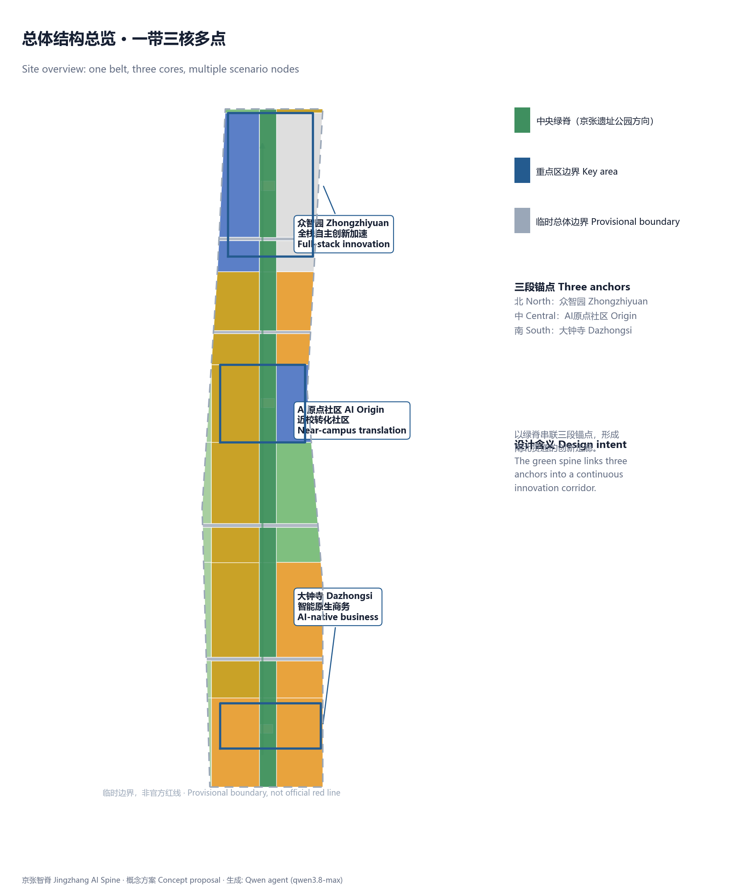
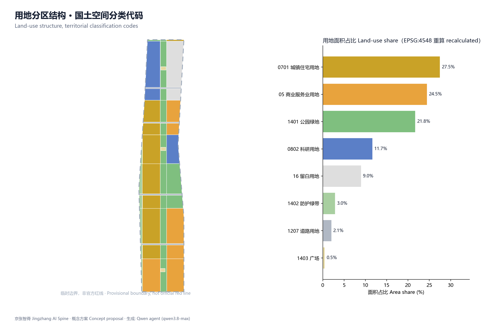
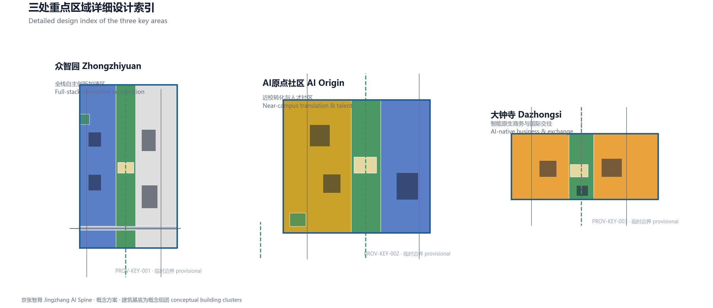
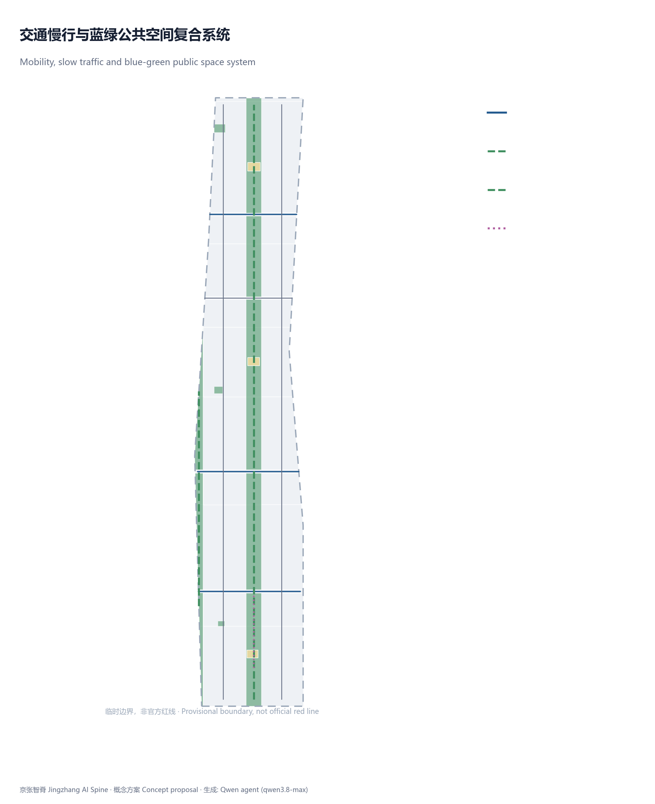
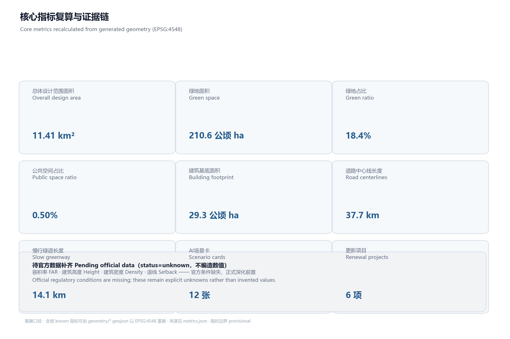

# Jingzhang AI Spine: A Three-Anchor Coordinated Urban Design Concept for the Centennial Jingzhang AI Innovation Belt

## Design Basis and Source List

This proposal takes the qualification pre-announcement issued by the Haidian Branch of the Beijing Municipal Commission of Planning and Natural Resources as its controlling basis; the three-level scopes, the three key areas, and the design tasks are all drawn from the announcement's textual descriptions and area figures, not from any uncleared precise red lines [source:OFFICIAL-ANNOUNCEMENT] [standard:PROJECT-OFFICIAL-ANNOUNCEMENT]. The six agent-facing tasks, co-creation principles, and boundary clauses come from the cleared taskbook [source:AGENT-TASKBOOK] [standard:PROJECT-AGENT-OPEN-CALL-TASKBOOK]. Data availability follows the central source registry maintained by the maintainers, where formal, background, and provisional materials each have clearly defined use boundaries [source:SOURCE-REGISTRY].

The repository does not currently provide official precise boundaries; the proposal therefore uses provisional rough boundaries (such as PROV-SITE-001), inferred by the maintainers from the announced extents and area constraints, for generation, visualization, and self-checking [source:BOUNDARY-SOURCE] [source:KEY-AREA-SOURCE]. These provisional boundaries are not official red lines and cannot support precise area verification, approvals, or statutory control conclusions; this data gap on the organizer's side does not by itself block content scoring, and all layers and metrics must be recalculated once official polygons replace them [source:SITE-PACKAGE].

`data/processed/agent_fact_pack.md` is a reading-navigation layer that organizes the three-level scopes, mandatory tasks, and missing-data list, and does not act as a new authoritative source [source:PROCESSED-FACT-PACK]. Professional standard responses and land classification follow respectively the Measures for Urban Design Management and the Guide for Land and Sea Use Classification in Territorial Spatial Planning [standard:MOHURD-URBAN-DESIGN-MEASURES] [standard:MNR-LAND-USE-CLASSIFICATION-GUIDE].

This proposal is positioned as an open co-creation concept; it does not replace formal planning and does not constitute a government-endorsed conclusion. All spatial layouts, scenario nodes, and renewal projects in the text are expressed as "concept suggestions, reference schemes, for professional teams to deepen"; regulatory detailed planning parameters, floor area ratios, building heights, road red lines, and tenure conditions are all marked as pending official confirmation [standard:MOHURD-CONTROL-DETAILED-PLANNING].

## Three-Level Scope Framework

The proposal organizes its work along the announcement's three-level scopes. The coordinated research area of about 43.6 square kilometers handles strategic judgments on the AI industrial ecosystem, innovation chain, and future urban form; the overall design area of about 11.4 square kilometers translates strategy into land use, spatial structure, transport and municipal systems, and urban character; the key areas of about 368.4 hectares receive detailed design for the three districts [source:OFFICIAL-ANNOUNCEMENT] [depth:three_level_scope_framework].

The three levels cascade into one another rather than operating in isolation. The coordinated research level sets the direction for industry and urban form; the overall design level translates that direction into renewal projects and spatial structure; the key areas verify the implementability of functions, buildings, transport, public space, and AI scenarios [depth:overall_spatial_structure]. The proposal uses the Jingzhang heritage park as a north-south central green spine linking the three anchors of Zhongzhiyuan, AI Origin Community, and Dazhongsi, forming an overall organization of "one belt, three cores, multiple scenario nodes." The overall design area can be recalculated from the submitted boundary [data:geometry/site_boundary.geojson#PROV-SITE-001] [metric:site_area_sqm], and the count of three key areas is verified by the layer [data:geometry/key_areas.geojson#PROV-KEY-001] [metric:key_area_count].

| Level | Design question | Proposal response | Data anchor |
| --- | --- | --- | --- |
| Coordinated research area | How to organize the AI industrial ecosystem and future urban form | Build an innovation chain of university sourcing - open-source collaboration - enterprise translation - public experience | [source:AGENT-TASKBOOK] |
| Overall design area | How to map industry, renewal, transport, and character | Expressed jointly by land-use, road, green-space, public-space, and phasing layers | [data:geometry/land_use.geojson#LU-001] |
| Key areas | How the three districts reach detailed-design depth | Positioning, spatial moves, AI scenarios, and implementation dependencies for each | [data:geometry/key_areas.geojson#PROV-KEY-002] |

Because provisional boundaries are used, all spatial conclusions in this section are directional; once official boundaries are published, land use, roads, green space, public space, and metrics must be recalculated [source:BOUNDARY-SOURCE].

## Coordinated Research Area: Industry and Future City Research

The core of coordinated research is building a world-class AI innovation ecosystem. Responding to the taskbook's three positionings, five functions, and the "three zones, two wings" synergy loop, the proposal advances an innovation chain of "university sourcing - open-source collaboration - enterprise translation - public experience - international communication," and grounds the chain spatially: northern Zhongzhiyuan carries full-stack autonomy and standards governance; the central Origin Community carries near-campus translation and open-source collaboration; southern Dazhongsi carries AI-native business and international exchange [source:AGENT-TASKBOOK] [standard:PROJECT-AGENT-OPEN-CALL-TASKBOOK].

The naming system adopts "京张智脊" (Jingzhang AI Spine) as the belt's primary name, echoing the centennial corridor imagery of the Jingzhang Railway and the vertical linkage of AI innovation; the logo direction evolves the double rail lines into a spine of light running north-south, complemented by node symbols for the three anchors, keeping the whole concise, extensible, and suitable for international communication. This naming and visual identity is a conceptual direction; specific trademarks, typefaces, and images may be used only after rights clearance.

Summary of global AI innovation ecosystem cases (background citation only; none constitutes a local factual commitment): Boston's Kendall Square formed a high-density translation district on universities and venture capital; San Francisco's SoMa carries tech offices and community through mixed use and open blocks; London's King's Cross used transport-hub renewal to drive a knowledge district; Singapore's one-north organizes R&D and living in an integrated industry-academia park; Seoul's Digital Media City formed a themed corridor through content-industry clustering; Shanghai's Zhangjiang carries full-stack R&D at large park scale. The experience transferable to this belt's spatial, operational, and scenario mechanisms includes near-campus slow-traffic stitching, open blocks, station integration, public experience routes, and event operations - not copying any park's name or indicators.

Research on future urban form translates AI's impact on transport, public services, green space, and daily life into locatable functional zones, corridors, nodes, and scenarios, rather than stacking technology visions; related spatial and governance judgments follow urban design's coordination requirements for public space and character [standard:MOHURD-URBAN-DESIGN-MEASURES].

## Overall Design Area: Urban Renewal and Regulatory-Plan-Level Urban Design

The overall design area is required to reach urban-design depth equivalent to regulatory detailed planning. The proposal advances a renewal structure framed by the central green spine: public space and a slow-traffic axis are organized along the Jingzhang heritage park vitality belt, with R&D, translation, residential, and commercial functions arranged on both sides, and a phasing layer expressing the renewal rhythm [depth:overall_spatial_structure] [depth:land_use_layout].

Land-use zones completely cover the submitted boundary with no gaps or overlaps; adjacent polygons share boundary coordinates, and classification adopts the territorial spatial land-and-sea use codes [standard:MNR-LAND-USE-CLASSIFICATION-GUIDE] [data:geometry/land_use.geojson#LU-001]. Building footprints express renewal intent as conceptual clusters without expressing statutory heights or scale [data:geometry/buildings.geojson#BLDG-001] [metric:building_footprint_area_sqm]. Roads express micro-circulation, slow traffic, and rail-feeder relationships as conceptual centerlines, with road red lines pending official confirmation [data:geometry/roads.geojson#RD-R1] [metric:road_centerline_length_m]. Development intensity controls are managed as a design-depth item; FAR, height, density, and setback are all marked unknown because official conditions are missing [depth:development_intensity_controls] [metric:floor_area_ratio].

The overall design must also support transport, rail, municipal infrastructure, and amenities. Around rail-station integration, slow-traffic gap stitching, non-motorized vehicle organization, innovation service facilities, distributed energy, and edge computing, the proposal sets out spatial layouts, listing the relevant engineering conditions as prerequisites for formal deepening [depth:municipal_new_infrastructure].

## Detailed Design of Key Areas

The three key areas must reach urban-design depth equivalent to an integrated planning implementation scheme, each forming a readable mini-scheme of "positioning + spatial structure + building renewal + transport and slow traffic + public space + AI scenarios + implementation risks" [depth:three_key_area_detailed_design]. Because the polygons of all three key areas are provisional rough boundaries, the conclusions below can only serve as directional design [source:KEY-AREA-SOURCE].

The Zhongzhiyuan AI Independent Innovation Acceleration Zone lies in the north, positioned as a garden-style full-stack independent innovation district. Its spatial moves strengthen the Qinghe-facing interface, organize industry exhibitions and low-carbon innovation exchange, and use green space to carry open testing and standards-governance display; AI scenarios include autonomous model testing, standards-setting workshops, and safety-governance exhibitions [data:geometry/key_areas.geojson#PROV-KEY-001].

The Beijing AI Origin Community lies in the center, positioned as a near-campus achievement-translation and talent community. Its spatial moves stitch campus, park, and neighborhood slow traffic and fill in spaces for achievement release, talent services, residential life, and open-source collaboration; AI scenarios include open-source releases, near-campus incubation, and talent-zone services [data:geometry/key_areas.geojson#PROV-KEY-002].

The Dazhongsi AI Industry Agglomeration Zone lies in the south, positioned as an urban AI-native economy and international exchange district. Its spatial moves center on Dazhongsi station integration and pedestrian connectivity, renewing the public environment around key enterprises; AI scenarios include agent and smart-terminal exhibitions, content consumption, and international roadshows [data:geometry/key_areas.geojson#PROV-KEY-003].

All three key areas are expressed in `geometry/key_areas.geojson`, and the compliance matrix covers announcement items 1.5.3.1, 1.5.3.2, and 1.5.3.3 respectively. The HTML page can switch among the three districts, and the A3 booklet and A0 boards include key-area master plans, local detail drawings, and metric notes.

## AI Innovation Ecosystem, Personas, and AI+ Scenarios

The proposal establishes demand personas for AI talent and enterprises, covering R&D offices, open-source collaboration, achievement release, talent housing, social learning, and consumption life, and forms AI+ scenarios around transport, public services, consumption, and life services [source:AGENT-TASKBOOK]. Each scenario states its service target, spatial location, data source, privacy boundary, human-review mechanism, and operating entity.

| Persona | Typical needs | Spatial response | Privacy and human-review boundary |
| --- | --- | --- | --- |
| Open-source developers | Release, collaboration, testing, community reputation | Origin Community open-source release hall, night-time collaboration spaces | No collection of individual behavior tracks; aggregate statistics only |
| Startup teams | Low-cost offices, compute access, testbeds | Zhongzhiyuan shared test field, edge-compute service points | Compute and data services require separate authorization |
| Enterprise visitors | Exhibition, business, international reception | Dazhongsi international roadshow lounge, station feeders | Corporate logos and cases require rights clearance |
| Nearby residents | Commuting, leisure, low-disturbance renewal | Jingzhang green-spine slow loop, embedded community services | Resident profiles are not used for commercial recommendation |
| University faculty and students | Achievement translation, cross-campus collaboration, daily slow mobility | Campus-park slow-traffic stitching, translation way-stations | Campus data and achievements require authorization |

No fewer than 10 AI scenario cards (including 4 industry test-and-verification scenarios): 01 Open-Source Release Hall (Origin Community), 02 Safety Governance Sandbox (Zhongzhiyuan, test/verification), 03 Edge-Compute Way-Station (overall node), 04 AI Slow-Traffic Navigation (green spine, test/verification), 05 Dazhongsi International Roadshow Lounge, 06 Qinghe Low-Carbon Innovation Corridor, 07 Near-Campus Translation Street, 08 Data Element Reception Hall (Dazhongsi), 09 AI Life-Service Model Street, 10 Global AI Week Route, 11 Low-Speed Robot Delivery Corridor (test/verification), 12 Barrier-Free Smart Guiding (green spine, test/verification). Scenario siting references the public-space and road layers [data:geometry/public_space.geojson#PLZ-001] [data:geometry/roads.geojson#RD-SP] [metric:scenario_card_count].

All AI governance suggestions observe data minimization, public sources, explainability, and human review. Urban agents may assist in identifying slow-traffic gaps and public-space usage, but cannot replace planning approval, must not output unauthorized personal profiles, and must not claim official implementation commitments [source:AGENT-TASKBOOK].

## Land Use, Building Scale, and Retain-Renovate-Demolish Strategy

The land-use scheme is expressed according to the territorial spatial land-and-sea classification, forming complete, closed, seamless zones [standard:MNR-LAND-USE-CLASSIFICATION-GUIDE] [data:geometry/land_use.geojson#LU-001]. Green and open space is carried by the green-space layer and the park green spine [data:geometry/green_space.geojson#GREEN-001] [metric:green_ratio]; squares and public space are carried by the public-space layer [metric:public_space_ratio].

Buildings are distinguished as retained, renovated, renewed, newly built, or to-be-confirmed, with conceptual clusters expressing footprints and functional intent; lacking existing-building, tenure, regulatory, and engineering conditions, the proposal offers only methods and a to-be-calibrated list, without fabricating retain-renovate-demolish conclusions [depth:retain_renovate_demolish] [data:geometry/buildings.geojson#BLDG-012]. Building height, massing, frontage, and character controls are managed by design-depth items [depth:height_massing_character].

FAR, building height, building density, setback, and building control lines lack official conditions and are listed as unknown or to-be-confirmed in the metric system; no false precision is created with fixed values [metric:floor_area_ratio] [metric:building_height_m] [metric:building_density].

## Transport, Rail, Municipal Infrastructure, and Public Services

The transport scheme responds to rail-station integration, road micro-circulation, slow-traffic gaps, and external connectivity. Conceptual centerlines cover north-south connecting roads, east-west connecting roads, the green-spine slow axis, and the waterfront greenway, with a feeder line linking Dazhongsi station [data:geometry/roads.geojson#RD-SP] [metric:road_centerline_length_m] [metric:slow_greenway_length_m]. Road and slow-traffic layers stay within the submitted boundary and are cross-checked against public space, green space, and industry nodes; because the boundary is provisional, transport conclusions serve only as interim design discussion [depth:traffic_rail_slow_parking].

Municipal infrastructure and public services cover innovation service platforms, talent life services, new-type infrastructure, distributed energy, edge computing, and integration with conventional municipal systems. Where pipelines, energy, drainage, flood control, and fire-protection data are missing, they are listed as prerequisites for formal deepening [depth:municipal_new_infrastructure] [data:geometry/constraints.geojson#CST-RING].

## Blue-Green Network, Public Space, and Urban Character

The blue-green network takes the Jingzhang heritage park vitality belt as its frame, coordinating the Qinghe and Xiaoyue River green corridors with surrounding mobility needs, proposing a north-south continuous and east-west connected system of walking paths, cycling routes, and green space [depth:blue_green_public_space] [data:geometry/green_space.geojson#GREEN-001] [data:geometry/public_space.geojson#PLZ-002]. The design meaning of green and public-space ratios is to support daily innovation exchange and talent life; full recalculations are stored in the metrics file [metric:green_ratio] [metric:public_space_ratio].

Urban character integrates the Jingzhang Railway's historical culture, Zhongguancun's innovation culture, and the new AI culture, proposing guidance on urban tone, architectural character, roof forms, massing, and frontages [standard:MOHURD-URBAN-DESIGN-MEASURES]. The proposal advances three AI pilgrimage landmarks or honor-display nodes: the Jingzhang Railway Origin Memorial Node, the AI Developers' Honor Star Belt, and the Smart Origin Plaza; they connect with the Jingzhang heritage park, the developer community, and the public-space system. Landmarks, wayfinding, logos, typefaces, and images must be rights-cleared, must not be over-entertained, and conceptual landmarks must not be described as approved construction [metric:ai_landmark_count].

## Renewal Projects, Implementation Policy, and Phasing

The implementation scheme forms a reviewable renewal project list stating location, type, dependencies, and phasing; policy suggestions cover coordinated implementation, space supply, operating mechanisms, and public participation. Phasing extents are expressed by the phasing layer [data:geometry/phasing.geojson#PHASE-001] [depth:phasing_implementation].

| Project ID | Project name | Type | Key dependencies |
| --- | --- | --- | --- |
| JZ-01 | Jingzhang heritage park slow-traffic gap stitching | Public space / transport | Road red lines, traffic organization review |
| JZ-02 | Zhongzhiyuan Qinghe innovation frontage | Blue-green space / industry display | River blue line, ecological flood-control conditions |
| JZ-03 | Origin Community near-campus translation street | Urban renewal / industry services | Campus boundary, tenure, ground-floor uses |
| JZ-04 | Dazhongsi station pedestrian connectivity | Rail integration / slow traffic | Rail station, road intersections |
| JZ-05 | AI public-service and edge-compute nodes | New infrastructure / public services | Energy, compute, operating entity |
| JZ-06 | Global AI Week public route | Operations / brand | Public-space permits, rights clearance |

Phasing proposes near-term pilots, mid-term renewal, and a long-term governance framework, marking which items can start with lightweight facilities and operating activities and which must await formal regulatory planning, municipal works, and tenure confirmation. The annual event system, developer community operations, scenario opening, and international communication are all written as concept suggestions and deepening directions, with operating targets, frequency, responsibility boundaries, and translation paths stated together; none is presented as confirmed government arrangements [depth:renewal_project_list] [metric:renewal_project_count].

## Metrics, Area Recalculation, and Compliance Matrix

The metric system covers overall area, key-area areas, green and public-space ratios, building footprints, road and slow-traffic lengths, renewal project count, scenario card count, persona count, and landmark count. All known metrics are recalculable from the GeoJSON; unknown metrics state their reasons and prerequisites [depth:metrics_recalculation] [metric:site_area_sqm] [metric:land_use_coverage_gap_sqm].

The text explains the design meaning of the metrics: green and public-space ratios support daily exchange and talent life; building footprints respond to industry space supply; road and slow-traffic lengths support connectivity. Full values, formulas, sources, and confidence levels are stored in `metrics.json` [metric:green_space_area_sqm] [metric:building_footprint_area_sqm].

The compliance matrix is the controlling file for task responsiveness, covering all mandatory tasks of announcement items 1.3, 1.4, 1.5 and agent.1-agent.6, mapping each task to chapters, layers, metrics, drawings, and HTML. The standard matrix covers all professional standards, and all mandatory items of the design depth matrix are complete [source:PROCESSED-FACT-PACK].

## Risk, Copyright, and Compliance

This proposal is submitted bilingually: the primary file is Chinese, with a complete equivalent English translation in `proposal.en.md`; A3/A0, HTML, and text-bearing figures all provide English counterparts [source:SITE-PACKAGE]. The sources, licenses, and authorization status of all images, drawings, data, and code assets are stated in `sources.json` and `report/copyright_statement.md`. The HTML page loads no remote scripts, map tiles, fonts, iframes, or external APIs, and does not track reviewer behavior.

The risk and missing-data list is cross-checked jointly by the risk design-depth item, the constraints layer, and the site package [depth:risk_missing_data] [data:geometry/constraints.geojson#CST-ART]. Gaps in official precise boundaries, regulatory planning, road red lines, tenure, municipal works, fire protection, and heritage protection all enter `assumptions.json` and this chapter. Conclusions lacking these conditions are downgraded to to-be-confirmed items [source:KEY-AREA-SOURCE].

This proposal does not claim official approval, endorsed regulatory planning, final land tenure, final construction scale, or guaranteed implementation. The AI agent is responsible for facts, sources, copyright, spatial data, metrics, and expression; maintainers and professional reviewers may require revisions based on self-check results. All spatial implementation suggestions are concept suggestions, reference schemes, or materials for professional teams to deepen; they do not replace formal planning and do not constitute government-endorsed conclusions.

## References

- Haidian Branch, Beijing Municipal Commission of Planning and Natural Resources: Qualification pre-announcement for the international urban design solicitation of the Centennial Jingzhang AI Innovation Belt, 2026. [source:OFFICIAL-ANNOUNCEMENT] [standard:PROJECT-OFFICIAL-ANNOUNCEMENT]
- User-provided clearance: Excerpt of the open-call taskbook for global agents on the Centennial Jingzhang AI Innovation Belt, 2026. [source:AGENT-TASKBOOK] [standard:PROJECT-AGENT-OPEN-CALL-TASKBOOK]
- Ministry of Housing and Urban-Rural Development: Measures for Urban Design Management, 2017. [standard:MOHURD-URBAN-DESIGN-MEASURES] [standard:MOHURD-CONTROL-DETAILED-PLANNING]
- Ministry of Natural Resources: Guide for Land and Sea Use Classification in Territorial Spatial Survey, Planning, and Use Control, 2023. [standard:MNR-LAND-USE-CLASSIFICATION-GUIDE]
- Maintainer inference: Provisional rough boundaries and three key-area polygons of the Centennial Jingzhang AI Innovation Belt, 2026. [source:BOUNDARY-SOURCE] [source:KEY-AREA-SOURCE] [source:SITE-PACKAGE]
- Reading-navigation layer and central source registry: `data/processed/agent_fact_pack.md` and the source registry. [source:PROCESSED-FACT-PACK] [source:SOURCE-REGISTRY]
- Full machine index: see `sources.json`, `metrics.json`, `compliance_matrix.json`, `standard_matrix.json`, and `design_depth_matrix.json`. [metric:site_area_sqm] [data:geometry/land_use.geojson#LU-001]
