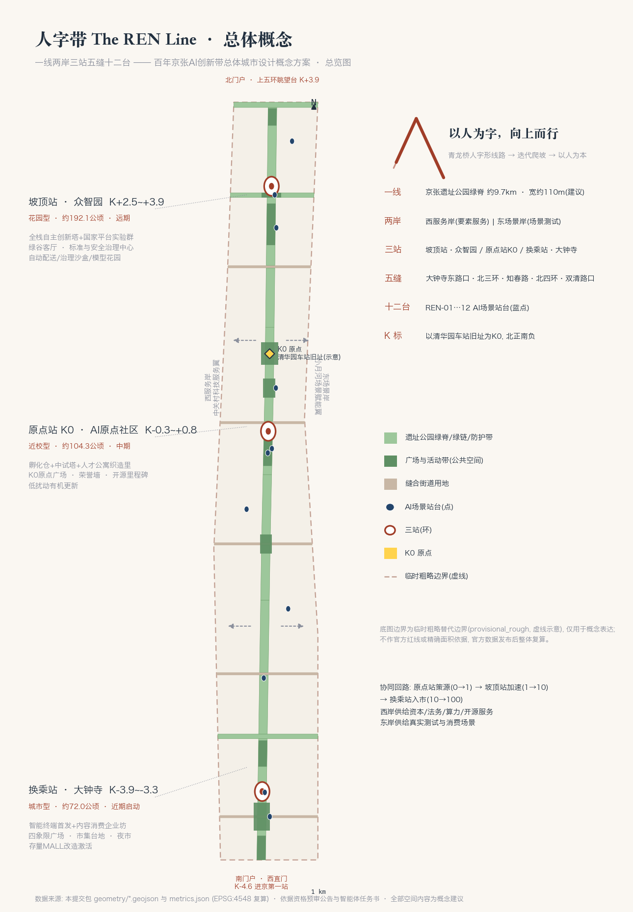
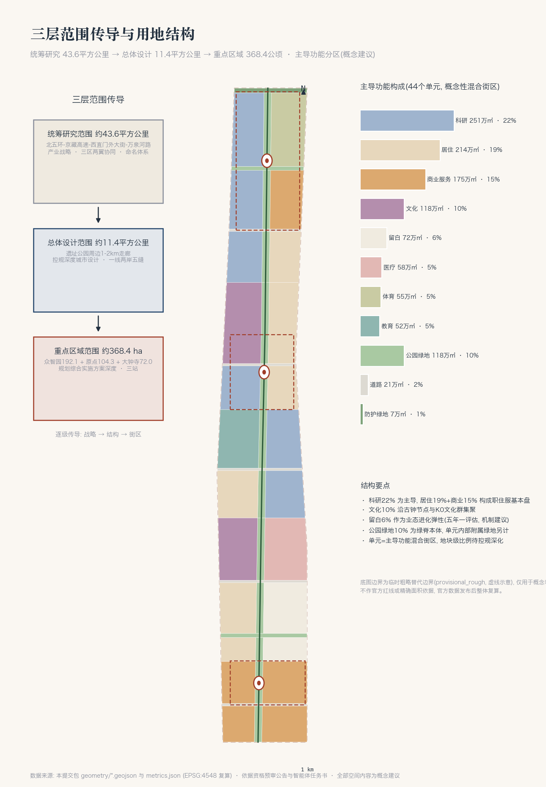
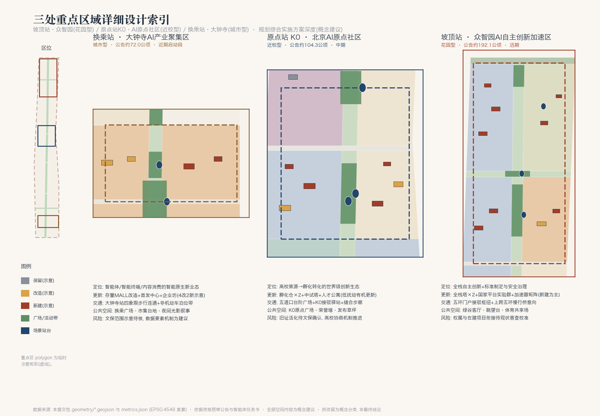
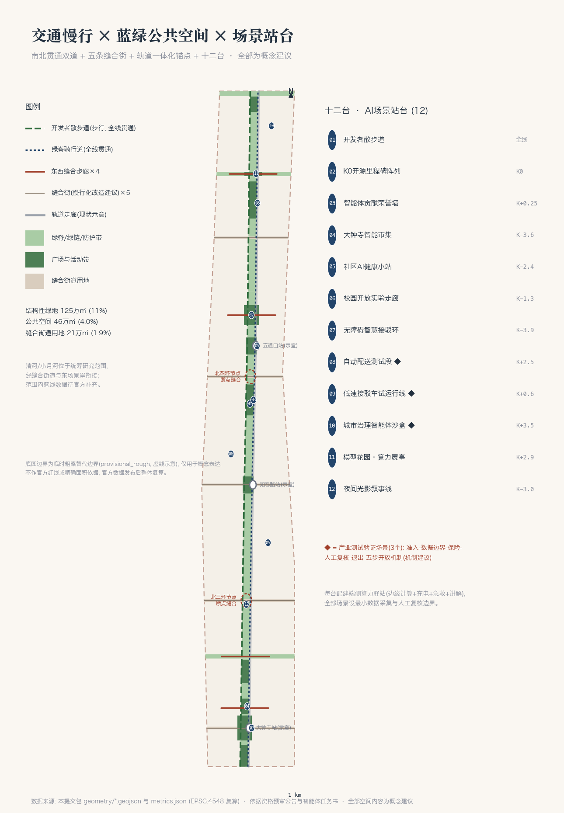
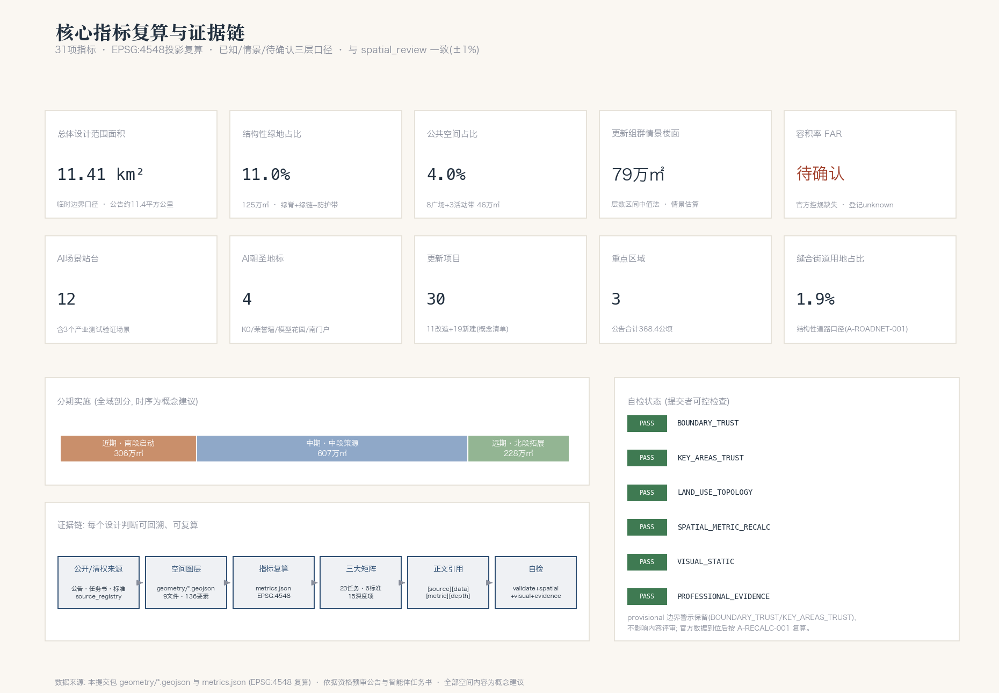

# The REN Line——Centennial Jing-Zhang AI Innovation Belt Overall Urban Design Conceptual Scheme

> In 1909, the Jing-Zhang Railway crossed the seemingly insurmountable Guan-Gou pass at Qinglong Bridge using a 'person' character-shaped track—without brute force, but through iterative ascent. Today, machine learning similarly approaches its goals through repeated iterations, but the distinction in smart cities lies in the purpose of these iterations: are they for computational power, or for people? This proposal takes the 'person' character as the central concept for the Centennial Jing-Zhang AI Innovation Belt: **with people as the character, ascending upwards**. All the spatial implementation contents below are Conceptual Recommendations and reference solutions, intended for further research by professional teams. They do not replace formal planning nor constitute government approval conclusions.

## Design Basis and Source List

This proposal is the result of an open call for global intelligent agents, generated based on publicly available or cleared data. The Evidence Chain is organized in three layers: "original source → registration form → submission package." The main control is based on the pre-qualification announcement [source:OFFICIAL-ANNOUNCEMENT] [standard:PROJECT-OFFICIAL-ANNOUNCEMENT], which fully responds to its three-tier scope, three key areas, design tasks and depth constraints of 1.3/1.4/1.5; it also adheres to the ten co-creation principles for intelligent agents, three positioning statements, five functions, the Three Zones and Two Wings (three zones, two wings), and the agent.1–agent.6 tasks, all based on excerpts from the task book [source:AGENT-TASKBOOK] [standard:PROJECT-AGENT-OPEN-CALL-TASKBOOK]. The site package [source:SITE-PACKAGE] provides enumeration, design space, performance indicators, and schema. The scope of use of public materials is based on the registration form [source:SOURCE-REGISTRY]. This plan only uses the materials with `usable_for_formal="yes"` for formal evaluation, while provisional materials are only used for temporary generation and are fully labeled; the processed data package [source:PROCESSED-FACT-PACK] is used for task lists and gap verification, while the main text still refers back to the original source_id (such as [source:DATA-SRC-OFFICIAL-ANNOUNCEMENT-20260509] and [source:DATA-SRC-AGENT-TASKBOOK-20260518]).

In terms of spatial baseline, official precise redlines have not yet been released. This plan adopts the temporary rough boundaries of the warehouse [source:BOUNDARY-SOURCE] [source:KEY-AREA-SOURCE] [source:DATA-SRC-PROVISIONAL-BOUNDARIES-20260605], whose precision limitations and recalculation obligations are detailed in the "Three-Layer Scope Work Framework" section and assumptions.json (A-BOUNDARY-001, A-RECALC-001). Professional standards are based on local reference snapshots: Urban Design Integration Requirements [standard:MOHURD-URBAN-DESIGN-MEASURES] [source:DATA-SRC-MOHURD-URBAN-DESIGN-MEASURES], depth and expression boundaries of control detailed planning [standard:MOHURD-CONTROL-DETAILED-PLANNING] [source:DATA-SRC-MOHURD-CONTROL-DETAILED-PLANNING], and land use classification codes [standard:MNR-LAND-USE-CLASSIFICATION-GUIDE] [source:DATA-SRC-MNR-LAND-USE-CLASSIFICATION-202311]. The official clearing authority document for the "Architectural Engineering Design Document Preparation Depth Regulations (2016 Edition)" is not in the database and is registered as pending supplementary materials. This plan does not consider it as a satisfied authoritative reference [standard:MOHURD-ARCH-DESIGN-DEPTH-2016].

Results Correspondence: `geometry/*.geojson` and `metrics.json` are authoritative data layers; `compliance_matrix.json` covers announcements 1.3/1.4/1.5 and includes 23 tasks for agents 1–6; `standard_matrix.json` responds to all mandatory standards above; `design_depth_matrix.json` includes 15 optional depth items, all of which are complete and are individually linked to layers, metrics, and assumptions; the main text is structured with `[source:]` `[standard:]` `[depth:]` `[data:]` `[metric:]` tags to establish verifiable references. The following diagram provides an overview of the overall concept and the Evidence Chain.

## Three-Level Scope Framework

This scheme follows the three-level scope framework as outlined in Section 1.4 of the announcement [depth:three_level_scope_framework]. **Coordinated Research Area** is approximately 43.6 square kilometers [metric:coordinated_research_area_sqm] (north to the North Fifth Ring Road, east to the Jingzhang Expressway, south to West Straight Street, west to Wanquan River Road), tasked with strategic industrial research and the 'Three Zones and Two Wings' coordinated study. At this level, the scheme addresses the ecological system, naming system, and future urban form. **Overall Design Area** is approximately 11.4 square kilometers, with the projected area of the site boundary submitted as 11,412,825 square meters [metric:site_area_sqm] [data:geometry/site_boundary.geojson#SITE-001], with a deviation of approximately 0.1% from the announced value. This area is responsible for the overall Urban Design at the detailed planning level. **Key-Area Detailed Design Area** announcement covers a total of approximately 368.4 hectares [metric:key_area_total_announced_sqm], extending from north to south as follows: the Zhongzhiyuan AI Independent Innovation Acceleration Area covering about 192.1 hectares [data:geometry/key_areas.geojson#KEY-001], the Beijing AI Origin Community covering about 104.3 hectares [data:geometry/key_areas.geojson#KEY-002], and the Dazhongsi AI Industry Cluster covering about 72.0 hectares [data:geometry/key_areas.geojson#KEY-003]. These three areas together [metric:key_area_count] will undertake the detailed design for the depth of the Integrated Planning Implementation Plan.

**Provisional Boundary Disclosure ( )**: All spatial layers in this scheme are derived from the temporary rough boundaries of the warehouse [source:BOUNDARY-SOURCE]. This boundary is based on the approximate boundaries and area inferred from the announcement text, with `geometry_role="provisional_constraint"`, `official_boundary=false`, and a precision of `provisional_rough`. Three key areas are indicated by demonstration rectangles. It can be used for the current generation, display, and entrance self-check, but **must not be used as an Official Planning Boundary, approval basis, precise area recalculation basis, or legal control line**; the boundaries and areas inferred from the text and news illustrations shall not be upgraded to official bases. Once the official polygon is released, the land division, green space/Public Space/road areas and ratios, building clusters, phased scope, five maps, A3/A0 drawings, and display pages must be recalculated in their entirety according to the assumptions.json (A-RECALC-001). The organization's data gaps shall not affect the Content Review of this scheme, nor shall they alter the level of any conclusion's wording: all spatial recommendations should remain in the "Conceptual Recommendation" expression.

The spatial logic of three-tiered transmission is shown below: the research layer defines strategy and collaboration, the design layer defines structure and land use, the focus layer defines blocks and projects, with metrics becoming increasingly detailed at each tier and recalculable in `metrics.json` [depth:metrics_recalculation].

## Coordinated Research Area: Industry and Future City Research

### Current Assessment: A corridor defined three times

The Coordinated Research Area is the core bearing zone for the 'Three Zones and Two Wings' in Haidian [source:OFFICIAL-ANNOUNCEMENT]. Based on an analysis of publicly available data, this corridor faces four categories of structural issues [depth:existing_conditions_diagnosis]: First, **fragmentation** — the century-old railway used to be a gap in the city. While the heritage park segment has initially bridged this gap, pedestrian connectivity between the east and west banks remains primarily through a few overpass nodes. Slow travel disruptions are concentrated around the Third and Fourth Ring Roads and major intersections (current elements are indicated by the sketch lines in [data:geometry/constraints.geojson#CON-XR-02], with precision noted in A-EXIST-001); Second, **inefficiency** — the existing buildings and courtyard spaces along the corridor do not align with the needs of AI industry carriers; Third, **dormancy** — cultural resources such as the old Qinghua Garden Station and the Dazhongsi Ancient Bell have not been integrated into the daily urban life [data:geometry/constraints.geojson#CON-HER-01]. Its four, **gap** —— there is a lack of dedicated space for the intermediate stages between university original innovation and industrial scaling, including pilot testing, validation, and demonstration.

### Overall Concept: The REN Line

**Main Name: "Renzi," English Name: The REN Line**. Naming System (agent.1):

| Level | Name | Meaning |
| --- | --- | --- |
| Line | The REN Line | Jing-Zhang Relic Park Green Spine, Main Axis and Brand Matrix |
| Both Banks | West Service Bank / East Scenario Bank | Corresponding to the corridor interface of Zhongguancun Technology Services Wing and Xiaoyue River Scenario Enablement Wing |
| Three Stations | Peak Station (Zhongzhiyuan) / AI Origin Station K0 (AI Origin Community) / Transfer Station (Dazhongsi) | Name the brand layer of the three key areas using the railway station naming method, without replacing the official district names |
| Five Stitches | Stitched Streets R1–R5 | A Slow-Travel Interface Stitching Together Five East-West Streets |
| Twelve Stations | Scene Platforms REN-01…REN-12 | Twelve Spatial Anchors for AI Scenarios |
| Mileage | K-Marking System | With the old Qinghua Garden Station as K0, positive values are for northward and negative values for southward, running through the signposts and activities. |

**Logo and Visual Identity Direction**: The design is inspired by the person-shaped track at Qinglong Bridge, where two rails converge at the top of the slope to form the character 'person', with the negative space representing the green ridge; the same graphic can be read as an upward arrow and an iterative curve of a training track. A three-color system is suggested, with the colors being rust red for the ties, deep space blue for the rails, and moss green for the greenery; the auxiliary graphics include the K-line milestone grid and the person-shaped pattern. All fonts and image materials should be authorized, and no unauthorized trademarks, fonts, images, or logos should be used [source:AGENT-TASKBOOK]. The above is a directional design, and the final visual system will require a professional team to refine. **Slogan**: A person as the word, moving upward (the English slogan is discussed in the cultural narrative section).

**Three Key Positions, Five Major Functions, and the Synergistic Loop of Three Zones and Two Wings**: The century-old Jing-Zhang Cultural Belt carries the cultural narrative through the "memory layer" spatial system (as described in the Cultural Narrative section), the Urban AI Life Experience Belt carries the scenarios through the "Twelve Platforms" scenario system (as detailed in the Scenarios section), and the AI Convergence Innovation Belt carries the industries through the "Three Stations and Two Shores" industrial space (as elaborated in the Key Areas section). The spatial alignment for the five major functions is as follows: the Full-Stack Independent AI Innovation System and the global governance discourse of AI are positioned at the Zhongzhiyuan at the Slope Top Station [data:geometry/land_use.geojson#LU-038]; the world-class AI Innovation Ecosystem is positioned at the Origin Station K0; the AI-Enabled Scenario empowerment new paradigm unfolds along the Eastern Scenario Shore and the Twelve Platforms; the intelligent AI vibrant city is supported by the entire line's pedestrian and Public Space system. The synergistic loop is the "climbing logic": the Origin Station is the source of innovation (0→1) → the Slope Top Station accelerates development (1→10) → the Transfer Station enters the market (10→100), with the Western Service Shore providing capital, legal, computing, and open-source services, and the Eastern Scenario Shore providing real testing and consumption scenarios, forming a closed loop along the line. Preserve the external economic north of the Fifth Ring Road portal to connect Qinghe with the Future Science City direction, and the southern portal to connect the central urban area, in response to the coordinated linkage of the 'two zones and one belt' and the coordinated development of the Beijing-Tianjin-Hebei region [source:OFFICIAL-ANNOUNCEMENT].

### Future Urban Form: Evolvable Linear City

Adapting to the new quality productivity brought by AI, this proposal presents three actionable propositions [depth:overall_spatial_structure]: First, **linear organization replacing concentric organization** — with the green spine as the main axis for public life, functions are arranged along the line in a 'platform' configuration, ensuring that any innovative space is within a walking distance of approximately 300 meters to the Public Space (conceptual target); Second, **leaving space for evolution** — retaining approximately 71.6 million square meters of blank land [metric:land_use_area_sqm_16] [data:geometry/land_use.geojson#LU-010], using a 'blank start box' light construction approach to respond to the unpredictability of AI industries, with a five-year assessment and conversion based on demand (mechanism suggestion); Third, **scenarios as infrastructure** — incorporating Testing and Validation Scenarios (three out of twelve) into the urban accessory list, planning and operating them concurrently with municipal facilities (system suggestion). AI+Transportation and Continuous Green Space System are detailed in the Transportation and Blue-Green Spaces sections [depth:traffic_rail_slow_parking] [depth:blue_green_public_space].

## Overall Design Area: Urban Renewal and Regulatory-Plan-Level Urban Design

### Industrial Goals and Functional Layout

With a focus on AI development, the Overall Design Area forms a "one spine, two banks, three stations, five seams" structure: the green spine serves as the axis [data:geometry/land_use.geojson#LU-026], with 44 primary functional units covering the entire area (without gaps or overlaps, topological verification can be found in the indicators section). The three stations each undertake the functions of ideation, acceleration, and market entry, while the five seam streets organize east-west connections [data:geometry/land_use.geojson#LU-022]. The Land-Use Layout is a **conceptual primary functional zoning**: each unit is a mixed-use district, indicating the primary use, with the internal functional proportions to be calibrated in the detailed planning phase [standard:MOHURD-CONTROL-DETAILED-PLANNING]. Research and development land covers approximately 251.1 hectares [metric:land_use_area_sqm_0802], residential land covers about 214.1 hectares [metric:land_use_area_sqm_0701], and commercial and service land covers about 175.2 hectares [metric:land_use_area_sqm_05], which together account for approximately 56% of the total land use composition; cultural land covers about 118.1 hectares [metric:land_use_area_sqm_0803] along the ancient clock cultural node and the K0 cultural cluster. Educational land covers about 51.8 hectares [metric:land_use_area_sqm_0804], medical and health land covers about 57.7 hectares [metric:land_use_area_sqm_0806], and sports land covers about 55.5 hectares [metric:land_use_area_sqm_0805], respectively supporting the academic road science and education belt, the AI+ medical node, and the fifth ring sports shared venue. Planning indicator framework (AI innovation index, talent density, scale of output value, etc.) This plan provides a framework and suggested statistical approach (as outlined in the indicators section). Specific target values must be based on official industrial data and should not be fabricated.

### Urban Renewal Overall Framework

Update strategy as **Seamless Update** rather than wholesale demolition and reconstruction [depth:retain_renovate_demolish]: leverage the Green Spine as a lever for public investment to drive the transformation of existing spaces on both sides of the spine into three categories: **preserve**, **renovate**, and **new build**. The plan includes 33 update scenarios as shown in Figure 33 [data:geometry/buildings.geojson#BLDG-001], with 3 preserved and restored sites (current residential clusters, university teaching clusters, and the old Tsinghua Station narrative museum), 11 renovated sites, and 19 new build sites, totaling 30 update projects [metric:renewal_project_count]; the total base area of the indicative clusters is approximately 96,000 square meters [metric:building_footprint_area_sqm], representing about 0.84% [metric:building_density] (scope: only the indicative clusters in this plan, see A-BLDG-001). Based on an estimate of the median floor area ratio, the updated group scenario floor area is approximately 79.3 million square meters [metric:estimated_new_floor_area_sqm]; **the total building scale of the area and the scale of the AI industry space are dependent on official control plan conditions and the current building inventory; this plan is registered as pending confirmation** [metric:floor_area_ratio] [depth:development_intensity_controls]. The update path for the inefficient spaces adjacent to the Jing-Zhang Heritage Park is: first, to complete the public interface by stitching streets and platforms, and then to update in a rolling manner through a "small plots, multiple stakeholders" approach; the key areas for the integration of campus, park, and street zones are the academic road science and education belt and the original point station (mechanism recommendation).

### Traffic, Utilities, and Accompaniments (General Provisions)

Integrated capacity enhancement follows the principles of 'track anchoring, slow-moving seam integration, and micro-circulation relief': Integrated functional layout recommendations are proposed around the Dazhongsi, Wodao Kou, and Qinghua Donglu Xi Kou stations. Five seam streets bear the micro-circulation and primary slow-moving interface [metric:road_land_area_sqm], as detailed in the traffic section [depth:traffic_rail_slow_parking] [depth:municipal_new_infrastructure].

### Jing-Zhang Relic Park Vitality Corridor and Urban Character (General Principles)

Public Space along the Green Spine is approximately 110 meters wide (Conceptual Recommendation), covering an area of about 117.9 million square meters [metric:land_use_area_sqm_1401], together forming a continuous green system with two green chains and the North Fifth Ring Road Green Belt [metric:land_use_area_sqm_1402]. The public spaces, landmarks, and guidelines for managing the character of the vitality belt are detailed in the Blue-Green section [standard:MOHURD-URBAN-DESIGN-MEASURES] [depth:height_massing_character].

## Detailed Design of Key Areas

Three key areas cover a total of approximately 368.4 hectares [metric:key_area_total_announced_sqm] [depth:three_key_area_detailed_design]. The polygon for the key areas is a temporary indicative rectangle [source:KEY-AREA-SOURCE], and the spatial conclusions of the detailed design are directionally Conceptual Recommendations. The block boundaries, plot ratios, and the demolish–renovate–retain strategy will be based on the Official Planning Boundary and control plan conditions. (Demolish–Renovate–Retain Strategy)

### Zhongzhiyuan AI Independent Innovation Acceleration Area —— Sloping Roof Station (Garden Type)

**Location**: Core carrier of a national-level artificial intelligence cluster area, focusing on the Full-Stack Independent AI Innovation System and standard setting, as well as the construction of safety governance to create a more intelligent and futuristic garden-type innovative district [source:OFFICIAL-ANNOUNCEMENT] [data:geometry/key_areas.geojson#KEY-001]. **Spatial Structure**: With the "Zhongzhiyuan Green Valley" as the central living room, running east-west [data:geometry/land_use.geojson#LU-040], the two research and development clusters are located on either side: the southern cluster for full-stack R&D and industrial display [data:geometry/land_use.geojson#LU-038], and the northern cluster for national platform experimental clusters and shared sports fields [data:geometry/land_use.geojson#LU-042]. **Building Renovation**: New construction as the main approach (10 new, 4 renovated), including two full-stack self-innovative towers, a national AI platform joint experimental cluster, an accelerator matrix, a standards and safety governance center, and an international exchange lounge [data:geometry/buildings.geojson#BLDG-023]. The architectural form is suggested to be "labs in a garden" — mid to low-rise large floor plan experimental bodies with a few high-rise towers, and a rooftop research garden (the height and volume are suggested ranges, subject to confirmation by the control plan). **Transportation**: Integrate the concept direction for optimizing external transportation in the area around the Fifth Ring Road: a Fifth Ring gateway connection hub is proposed at the northern end [data:geometry/buildings.geojson#BLDG-031], with the observation deck connecting to the intention of an overpass pedestrian bridge over the Fifth Ring Road [data:geometry/public_space.geojson#PUB-08] (the feasibility of the bridge and tunnel engineering requires professional argumentation, and this plan does not draw a conclusion). **Public Space**: Green Valley Living Room + Observation Deck + Activity Belt North Segment [data:geometry/public_space.geojson#PUB-07]. **AI Scenarios**: Autonomous Delivery Test Segment, Governance AI Sandbox, Model Garden Pavilion (REN-08/10/11). **Implementation and Risks**: Included in the long-term phased implementation [metric:phase_3_area_sqm]; the main risk is the alignment with existing property rights and ongoing projects, which will require calibration after a current condition survey.

### Beijing AI Origin Community —— Origin Station K0 (Near School Type)

**Location**: Anchored by Tsinghua, Peking, and the Chinese Academy of Sciences' original innovation, the project aims to build a "more attractive to talent, innovative, and capable of technology transfer near-campus innovation district." This district will serve as the home for the world-leading AI Innovation Ecosystem, talent special zone, open-source system, and brand events [data:geometry/key_areas.geojson#KEY-002]. **Spatial Structure**: The west shore will feature the Incubation and Transformation Belt [data:geometry/land_use.geojson#LU-027] (incubation warehouses on the north and south sides, plus the Technology Transfer Pilot Tower), while the east shore will include the Talent Living Belt [data:geometry/land_use.geojson#LU-028] (talent apartments 'Weaving Lane', Shexinqianyuan renovation and updates, and a 24-hour developer canteen). **Building Update**: Organic updates with minimal disturbance (5 new, 4 renovated, 3 retained as a guideline) [depth:retain_renovate_demolish], with the exhibition and release functions of the results arranged along the activity belt. **Transportation**: An integrated design approach around Wudaokou and the Tsinghua East Road West Station—Wudaokou Staircase Square directly connects to the station interface [data:geometry/public_space.geojson#PUB-06], with a pedestrian corridor stitching the campus and park areas [data:geometry/roads.geojson#ROAD-ST-K0]. **Public Space**: K0 Origin Square (site of the former Tsinghua University Station) [data:geometry/public_space.geojson#PUB-05], and the activity strip's original segment (Open Source Market/Release Lawn). **AI Scenarios**: Developer Walkway, Open Source Milestone Array, Intelligent Agent Contribution Honor Wall, and test runs of low-speed shuttle lines (REN-01/02/03/09). **Implementation and Risks**: Listed for mid-term phased implementation [metric:phase_2_area_sqm]; the revitalization of the site must await confirmation of preservation requirements by the cultural heritage department (A-EXIST-001), with updates around the university driven by a negotiation mechanism (mechanism proposal).

### Dazhongsi AI Industry Cluster —— Transfer Station (City Type)

**Location**: Leverage leading enterprises to drive development around new smart-native industries such as smart bodies, smart terminals, and content consumption. Construct a「city-type innovative district with greater global influence and urban dynamism」[data:geometry/key_areas.geojson#KEY-003], exploring mechanisms for the circulation of data elements and digital assets(mechanism suggestions, not definitive statements). **Spatial Structure**: Green spine with dual business interfaces on both banks [data:geometry/land_use.geojson#LU-006] [data:geometry/land_use.geojson#LU-007], connecting to the Xizhimen gateway [data:geometry/land_use.geojson#LU-002]. **Building Revitalization**: Focus on activating existing assets(4 existing to 2 new indicative plan): smart consumption MALL renovation, corporate lounges, smart terminal launch center, and content consumption enterprise quarters [data:geometry/buildings.geojson#BLDG-003].  **Transportation**: Track Dazhongsi station four-quadrant pedestrian connection square [data:geometry/public_space.geojson#PUB-02], responding to the announcement's requirements for four-quadrant pedestrian connectivity and non-motorized static transportation at the intersection — along the seam street R1, arrange non-motorized parking strips and an accessible smart transfer loop (REN-07) [data:geometry/roads.geojson#ROAD-RL1]. **Public Space**: Market platform (developer's night market) [data:geometry/public_space.geojson#PUB-03] and activity belt segment of Dazhongsi. **AI Scenarios**: Smart market, transfer loop, and nighttime light show narrative lines (REN-04/07/12). **Implementation and Risks**: Included in the recent start-up segment [metric:phase_1_area_sqm]; the cultural heritage protection area of Dazhongsi (Juesheng Temple) is indicated [data:geometry/constraints.geojson#CON-HER-02], with all facade renovations subject to legal protection requirements.

## AI Innovation Ecosystem, Personas, and AI+ Scenarios

### Global AI Innovation Ecosystem Case (agent.2)

Select six public case studies, focusing on their mechanisms rather than their forms (the case studies are public, common reviews, do not cite unverified data, and all transformation suggestions are mechanism-based):

| Case | Core Mechanism | Transformation of the Pedestrian Path |
| --- | --- | --- |
| Paris Station F | Single-Body Gigantic Incubator Housing Investors, Companies, and Service Desks Under One Roof | Sloped Roof Station "Accelerator Matrix + Full-Stack Tower" Vertical Ecosystem; Service Desks Integrated into West Service Pier |
| Cambridge (US) Kendall Square | Top Campus Right Next Door, Labs and Pharmas Share the Street | Origin Station Near School Type: Incubator Adjacent to Campus, Results "One Street Over" for Conversion |
| London Old Street Silicon Roundabout | Self-organized Agglomeration in Existing Blocks with Low Rents, Government Only Provides Interface and Transportation | Transfer Station City-Type: Start with Public Interface and Station Connectivity, Let the Business Forms Grow on Their Own |
| Shenzhen Nan Mountain Technology Park Cluster | Building Economic Density + High-Density Iteration with Nearby Supply Chain Integration | East Scenari Shore Building Carrier Operations and "Upstairs Downstairs as Upstream Downstream" Industrial Organization |
| High Line, New York | Linear Park Revitalizing the Surrounding Real Estate and Culture | Green Spine Entity: Public Investment Leading, Street Sewing Following, Rolling Update on Both Sides |
| Singapore One-North | Theme Park Cluster + Comprehensive Testbed Policy (testbed) | Twelve Scenario Access Mechanisms: Integrating Testing and Validation into Urban Accompaniment Lists |

**Elements Mechanism** (land/space/industry/funds/talent/computing power/data/scenario): Land and space will be supplied through "blank space transformation + small plot rolling"; funds and services will be supported by the West Service Shore Integration (mechanisms for capital, legal, financial, and overseas services); computing power will be distributed through "edge-side computing power stations" and centralized computing power will be reserved through municipal integration corridors (capacity calculations await professional confirmation); data element circulation mechanisms will be piloted at transfer stations (mechanism suggestions); and scenarios will be opened through the "Twelve Platforms." The innovation ecosystem map and the mapping to the three stations and two wings are available in the "Task Coverage" module of visual/index.html.

### User Profile (agent.3, one of six categories)

| Image | Core Needs | Spatial Response |
| --- | --- | --- |
| Model Researcher (Academic Institution) | Located Near School Pilot Sites, Release Sites, and Short Commute | Incubation Hub + Release Lawn + Talent Apartments [data:geometry/buildings.geojson#BLDG-016] |
| Open Source Developers / Independent Developers | Low-Cost Workstations, 24-Hour Space, High Density of Peers | 24-Hour Developer Kitchen, Blank Slate Startup Box, Developer Night Market |
| AI Startup Team | Accelerating Access to Services and Computing Power, Scene Validation Entry Point | Acceleration Station Matrix for Startups + Twelve Testing Scenario Access Points |
| College Students | Accessible Experimental Corridors, Internship Interfaces, and Affordable Vital Spaces | Open Experimental Corridor on College Road [data:geometry/buildings.geojson#BLDG-012], Steps Square |
| Residents of Longstanding Communities Along the Line | Ensure that living services are not displaced, enhance park accessibility, and control noise | Stitch in residential units [data:geometry/land_use.geojson#LU-009], community AI health kiosks, and activity strips |
| International Visitors / Business Representatives | One-stop Access Path, International Interaction Spaces, Readable Urban Narratives | International Interaction Foyer, K0 Narrative Clusters, Full-Line Guided Tour |

### Twelve AI Scenario Cards (Including 3 Industrial Testing and Validation Scenarios)

All twelve scenarios are anchored at the `SCENARIO_NODE` element [metric:scenario_node_count] [data:geometry/public_space.geojson#SC-01], with privacy boundaries and Human Review as mandatory fields for each card. All scenarios are Conceptual Recommendations, and test scenarios are not expressed as approved operations [source:AGENT-TASKBOOK].

| ID | Scenario | Location (K Tag) | Service Target | Operational Data and Privacy Boundaries | Human Review | Recommended Operating Entity |
| --- | --- | --- | --- | --- | --- | --- |
| REN-01 | Developer Stroll Path: Alongline Intelligent Navigation and Serendipity Tips | Throughout the Line (Anchor Point K+0.2) | Developers, Visitors | Anonymous Foot Traffic Counting Only; No Face Recognition | Content and Push Notifications Require Manual Review | Park Operator |
| REN-02 | K0 Open Source Milestone Array: Annual Open Source Achievements Engraved | K0 | Public, Developers | Static Display; No Data Collection | Inclusion in Registry Reviewed by Manual Process | Community Governance Committee |
| REN-03 | Intelligent Entity Contribution Honor Wall: Human × Intelligent Entity Co-Creation Registry | K+0.25 | Co-Creators | Only Voluntary Signatory Information Displayed | Registry Manual Verification | Community Governance Committee |
| REN-04 | Dazhongsi Smart Market: Combining Autonomous Retail + Maker Stalls | K-3.6 | residents, visitors | Aggregate anonymized transaction data | Merchant Admission Manual Review | Street Block Operating Company |
| REN-05 | Community AI Health Kiosk: Health Self-Assessment and Referral Recommendations | K-2.4 | Residents (especially seniors) | Local Processing of Health Data, Informed Consent, No Data Leaving the Kiosk | Physician Review of All Recommendations | Community Health Institution |
| REN-06 | Open Experiment Corridor for the Campus: Public Access to Course-Level AI Experiments | K-1.3 | Students, Public | Minimal Collection of Registration Information | On-Site Supervision by Teachers | Higher Education Institution (Collaboration Suggested) |
| REN-07 | Barrier-Free Smart Shuttle Ring: Prioritize Rides for Wheelchairs/Baby Strollers | K-3.9 | Mobility Impaired | Encrypted Trip Data, Deleted After Use | Customer Service as Backup | Transportation Operator |
| REN-08 | Autonomous Delivery Test Section (Testing Validation) | K+2.5 | Logistics Enterprise | Restricted Route, Restricted Time Period, Displayed Test License Plate | Safety Officer on Board/Remote Monitoring | Testing Management Authority (Recommended) |
| REN-09 | Low-Speed Shuttle Trial Operation Line (Testing Validation) | K+0.6→K-0.9 | Commuters | Speed Limit and Road Rights Announcement; Anonymous Passenger Data | Driver Safety Officer Present Throughout | Traffic Operator |
| REN-10 | Smart City Governance Agent Sandbox (Testing and Validation) | K+3.5 | Government, Researchers | Only uses public/synthetic data; results are not directly executable | All outputs are subject to human decision-making | Governance Research Institution (Recommended) |
| REN-11 | Model Garden: Outdoor Interactive Model Pavilion | K+2.9 | Public | Interactive anonymous, no image retention | Exhibit content curated manually | Exhibit Hall Operator |
| REN-12 | Nighttime Light and Shadow Narrative Line: Bell Sounds × Frequency Light and Sound Installation | K-3.0 | Public | No Data Collection; Lighting Meets Environmental Standards | Scene Script Hand-Approved | District Operation Company |

**Scenario—Space—Operation Mapping** with the Xiaoyue River Scenario Enablement Wing: East Scenario Shore as the urban hinterland of twelve terraces, Testing and Validation Scenario (REN-08/09/10)Establish an "Entry—Data Boundary—Insurance—Human Review—Exit" five-step open mechanism (mechanism proposal); coordinate research-level recommendations to extend Xiaoyuehe River corridor as an extension test strip for the scenario empowerment wing, with the two strips connected by stitched streets.[source:AGENT-TASKBOOK].

## Land Use, Building Scale, and Retain-Renovate-Demolish Strategy

**Land-Use Layout** [depth:land_use_layout]: The 44 dominant functional units achieve a seamless and non-overlapping complete partitioning (EPSG:4548 review shows gaps less than 16 square meters, far below the tolerance level) of the Overall Design Area. All land use classifications are based on the [standard:MNR-LAND-USE-CLASSIFICATION-GUIDE]: Commercial and service land use (05) approximately 175.2 hectares, urban residential land use (0701) approximately 214.1 hectares, research and development land use (0802) approximately 251.1 hectares, cultural land use (0803) approximately 118.1 hectares, educational land use (0804) approximately 51.8 hectares, sports land use (0805) approximately 55.5 hectares, health and medical land use (0806) approximately 57.7 hectares, urban village road land use (1207) approximately 21.2 hectares [metric:land_use_area_sqm_1207], park and green space (1401) approximately 117.9 hectares. Protective green spaces (1402) covering approximately 7.2 hectares, and blank spaces (16) covering about 71.6 hectares. The coded areas can all be recalculated from the layers starting at [data:geometry/land_use.geojson#LU-001] (as detailed in the section on indicators). The primary functional expression of the mixed-use districts is outlined, with block-level sub-zoning and compatibility ratios to be controlled in the detailed plan.

**Building Scale and Intensity**: Official Floor Area Ratio, Building Height, density, green space ratio, and setback conditions are missing in the clearance documents [depth:development_intensity_controls]. This plan accurately records the `floor_area_ratio` as unknown [metric:floor_area_ratio]; no statutory indicators are fabricated [standard:MOHURD-CONTROL-DETAILED-PLANNING]; the only provided scale number is an estimated scenario for the updated indicative cluster—basement area of approximately 96,000 square meters, and scenario floor area of about 793,000 square meters (median floor count method, A-BLDG-001), which is only intended to give the reviewers an understanding of the magnitude of the update volume.

**Demolish–Renovate–Retain Classification (Conceptual Recommendation, Not Final Conclusion) [depth:retain_renovate_demolish]**: In the 33 indicative clusters, **retain** 3 clusters — the Tsinghua Garden Station Heritage Site Narrative Pavilion [data:geometry/buildings.geojson#BLDG-019], the current residential cluster, and the university teaching cluster, with the principle that cultural heritage buildings and mature communities remain unchanged; **renovate** 11 clusters — the existing commercial stock in Dazhongsi, the fabric addition in Xueqingyuan, the industrial display lobby, etc., with the principle that existing structures with usable frames are prioritized for renovation; **new build** 19 clusters — incubation warehouses, full-stack towers, experimental clusters, etc., concentrated in areas of blank space conversion and inefficient spaces. All classifications are based on a current building inventory and due diligence on ownership, and this plan does not provide any specific conclusions regarding the demolition of any particular plot [source:AGENT-TASKBOOK]. Spatial supply and operational strategy: New R&D carriers are designed with the flexibility of "large floor plans that can be divided or combined" (recommended), with the principle that renovated carriers prioritize early-stage teams, and retained clusters focus on maintenance and enhancement. (Demolish–Renovate–Retain Strategy)

## Transport, Rail, Municipal Infrastructure, and Public Services

**Micro-Circulation and Slow-Travel Integration** [depth:traffic_rail_slow_parking]: Five east-west streets serve as the micro-circulation organization and slow-travel main interface—Dazhongsi East Intersection Street [data:geometry/roads.geojson#ROAD-RL1], North Third Ring Road auxiliary road interface, Zhi Chun Road Street [data:geometry/roads.geojson#ROAD-RL3], North Fourth Ring Road auxiliary road interface, and Shuang Qing Intersection Street. The structural road land area is approximately 21.2 million square meters [metric:road_land_area_sqm], accounting for about 1.9% [metric:road_area_ratio] (scope: only the land area of the streets that are integrated, the north-south vehicular roads rely on the existing arterial roads outside the scope of the current street, and the internal branch roads within the blocks are not separately plotted, see A-ROADNET-001). The transformation direction is "narrow lanes, wide slow-travel, continuous cycling," which are all suggestions for the slow-travel transformation of the current streets, without involving any conclusions on the adjustment of the road red line. **North-South Through-Connection for Slow Travel**: Developers' pedestrian path (Green Spine West Edge) is fully connected with the Jing-Zhang Green Spine cycling path (East Edge) [data:geometry/roads.geojson#ROAD-GW-W] [data:geometry/roads.geojson#ROAD-CY-E]. Four east-west stitching walkways cross the Green Spine [data:geometry/roads.geojson#ROAD-ST-F1]. For the announced slow travel breakpoints, the concept direction of low-clearance underpasses or gentle slope crossings is proposed at the Third Ring and Fourth Ring nodes (the engineering form is pending professional argumentation, and this plan does not make a conclusion on bridges or tunnels).

**Transit-Station Integration**: The current rail corridor is indicated by a placeholder line [data:geometry/constraints.geojson#CON-RAIL-02]. Dazhongsi station, together with the Four Quadrants Pedestrian Connection Square, Wudaokou Stairway Square, and K0 Slow-Travel Transfer Station [data:geometry/buildings.geojson#BLDG-021], forms three integration anchor points (Conceptual Recommendation); static traffic management adopts a strategy of "non-motorized parking lanes along the seam of the connected street + shuttle rings replacing short-distance driving", with the scale of parking spaces to be determined based on demand calculations.

**Municipal and New Infrastructure** [depth:municipal_new_infrastructure]: Propose an integrated system that merges traditional major facilities with AI-enabled new service facilities—each set of twelve stations equipped with edge-side computational power kiosks (a composite small facility for edge computing, charging, emergency services, and interpretation); pilot the distributed energy and research load coordination in Zhongzhiyuan (pilot suggestion); reserve conditions for a municipal integration corridor beneath the Green Spine (energy load, pipeline capacity, and underground space feasibility are all subject to professional calculations, and this plan only proposes the reservation principle [standard:MOHURD-CONTROL-DETAILED-PLANNING]). **Public Service Facilities**: AI industry service facilities are arranged along the western service shore, while talent living service facilities (cafeteria, health stations, shared sports fields [data:geometry/land_use.geojson#LU-043]) are arranged around the station platform, forming an integrated system that is walkable and connects work, life, social activities, and learning [source:OFFICIAL-ANNOUNCEMENT].

## Blue-Green Network, Public Space, and Urban Character

**Blue-Green System** [depth:blue_green_public_space]: The total area of structural green spaces is approximately 125.1 million square meters [metric:green_space_area_sqm], accounting for about 11.0% [metric:green_ratio] (the metric refers to structural green spaces, excluding plot accessory green spaces, A-GREEN-001): A green spine runs through the entire line [data:geometry/green_space.geojson#GRN-001], with two east-west green chains, the Dazhongsi North Green Chain and the Zhongzhiyuan Green Valley, serving as anchor nodes. The northern Fifth Ring Road green buffer zone completes the edge. At the strategic level, it connects with the Blue-Green Space of Qinghe and Xiaoyuehe (there are no major water systems within this range, and blue line data are pending official supplementation, A-EXIST-001). **Public Space System**: 8 squares and 3 segments of park activity belts totaling approximately 45.7 million square meters [metric:public_space_area_sqm], accounting for about 4.0% [metric:public_space_ratio] (node-type metric, A-PUBLIC-001), forming a sequence of public life from south to north: "portal—marketplace—integration—origin—steps—green valley—viewing" [data:geometry/public_space.geojson#PUB-01]. The park vitality belt complements parking, sports, and innovative interaction facilities, and integrates technology testing and application displays into the activity belt (REN-08/09/11), responding to the requirements for the southern and northern ends of the park and the iconic nodes at the overpass: the southern portal square and the upper fifth ring viewing platform are the concept schemes for the end nodes.

**AI Pilgrimage Landmarks and Honor Display System (agent.4)**: Establish 4 landmark nodes [metric:ai_landmark_count] — one of which is **K0 Origin Square and Open Source Milestone Array** [data:geometry/public_space.geojson#PUB-05]: set the old Qinghua Garden railway station square as the zero point of the full track mileage, and annually inscribe significant events in the open source and AI fields as milestones, forming an annually growing 'Open Source Pilgrimage Path'; the second is **Agent Contribution Honor Wall** [data:geometry/public_space.geojson#PUB-10]: establish a permanent 'Human × Agent Co-Creation Registry', with all intelligent body proposals submitted in this open source call (including this proposal) recommended to become the first exhibition materials, fulfilling the 'Contributions Are Memorable' co-creation principle [source:AGENT-TASKBOOK]. Its third **Model Garden·Green Valley Living Room** [data:geometry/public_space.geojson#PUB-07]: a garden-type science popularization landmark featuring outdoor computational power exhibition pavilions and interactive model installations; its fourth **South Portal 'First Station into Beijing'**: an image gateway in the direction of Xizhimen. All landmarks are Conceptual Recommendations and are not expressed as approved construction projects; names, logos, and images involved in the exhibition must be cleared beforehand. **Public Space Component Library (REN Kit)**: modular components such as seating, lamp posts, wayfinding, exhibition pavilions, and computational power station shells, unified with a zigzag pattern and K brand visual identity, forming replicable construction standards (directional recommendations).

**Urban Character** [depth:height_massing_character]: The urban tone is suggested to be "Industrial Memory × Digital Interface" — a material tone of rust-red ties and deep space indigo, preserving the rough texture of the railway remnants, and overlaying a restrained digital display interface [standard:MOHURD-URBAN-DESIGN-MEASURES]. Height order is suggested to be "South low, North high, with setbacks on either side of the spine": Transfer stations should respect the scale of the old city and the cultural heritage environment, while sloped roof stations allow for relatively taller research and development towers; along the green spine, buildings are to be set back to reduce the sense of oppression, and roof forms are encouraged to promote integrated design of research gardens and equipment. All height, intensity, and massing values are suggested ranges for control and guidance, subject to confirmation by official control plans [depth:development_intensity_controls]. Cultural resources are to be fully utilized through the old site of Tsinghua Garden Station and other artistic resources (collaborative mechanisms are suggested).

### Cultural Narrative: Three Departures of a Single Line (agent.5)

**Narrative Axis**: This corridor is defined three times—**1909 Independence** (the Jing-Zhang Railway, built under Zhan Tianyou, became a symbol of self-reliance for Chinese engineering; historical facts are publicly known, but exhibit details await archival verification, A-HIST-001); **Innovation in the 1980s** (from Electronic Street to Zhongguancun Science City, the garage spirit of "pioneering the way"); **Intelligence in the 2020s** (the Jing-Zhang High-Speed Railway underground, the growth of the site park, and the naming of the AI Origin community—where the source of innovation returns to its origin). All three departures share the same verb: **climbing the hill**. The engineering wisdom of the zigzag line (through iteration to achieve height) is a metaphor for machine learning (through iteration to approach the goal), and also a metaphor for the innovation ecosystem (through repeated trial and error to achieve breakthroughs)—this is why the "Zigzag Line" can carry the century-old Jing-Zhang culture, Zhongguancun culture, and AI new culture: **they are all part of the same story**.

**Spatial Cultural System**: Memory Layer (Old Site Narrative Pavilion of Tsinghua Garden Station, Ancient Bells of Dazhongsi, Display Segment of Remnants of Rail Tracks [data:geometry/constraints.geojson#CON-RAIL-01]), Innovation Layer (Oral History of Zhongguancun Embedded in Platform Guide, Honor Wall), Smart Layer (Open Source Milestone, Model Garden, Light and Shadow Narrative Line). **Signage and Symbol System**: K-Tag Mileage System + Ziggurat Ground Markings + Three-color Signage (Inheriting the Same Hierarchical System as the Overall Logo System, Cultural Markers as a Subsystem, Not Mixed). **Cultural Tour Route**: Main Route "Ziggurat Ascending Line" — a 9.7 km hiking/biking narrative line from K-4.6 South Portal to K+3.9 Observation Deck, consisting of twelve stages; Side Route "Chime and Frequency" — an auditory theme line from the Ancient Bells of Dazhongsi (the oldest sound device) to the Light and Shadow Narrative Line (the latest sound device). **International Communication Narrative** (Copywriting Direction): "A century ago, China's first self-built railway climbed the mountains switchback by switchback. Today, machines learn the same way — iteration by iteration. The REN Line is where the two stories meet, and people — is how both are written."

## Renewal Projects, Implementation Policy, and Phasing

**Update Project List** [depth:renewal_project_list]: 30 renewal projects (11 renovations + 19 new constructions) are all aligned with architectural cluster elements, and can be located one by one from [data:geometry/buildings.geojson#BLDG-002]. The types cover research and development (8), incubation acceleration (4), culture (4), residential and talent apartments (5), commercial consumption (4), community services (3), and transportation connections (2): in the near term, the focus is on the renovation of Dazhongsi and the southern portal; in the medium term, the original station incubation transformation cluster is the main focus; in the long term, the new R&D cluster in Zhongzhiyuan is the main focus. Each project is registered with 'preconditions': the project will not enter implementation until the four prerequisite matters—property rights verification, current condition survey, control plan conditions, and cultural heritage requirements—are met (refer to the layer attributes for more details).

**Implementation Policy Recommendations** (mechanism suggestions, not policy commitments): First, "Green Spine First" — Public Space investment precedes land development to drive social investment with certainty; Second, "Standardized Conversion of Vacant Sites" — establish a standardized conversion process and a five-year assessment for vacant sites; Third, "Scene Vouchers" — make the right to use twelve test scenes a publicly-applied-for public resource; Fourth, "Stakeholder Governance Committee" — form a governance mechanism for the vibrant corridor involving universities, enterprises, residents, developers, and operators, with public participation throughout the design, construction, and operation phases.

**Phasing Plan** [depth:phasing_implementation] [data:geometry/phasing.geojson#PH-1]: In the near term (1–3 years), Phase 1 will activate the southern segment covering approximately 306.3 hectares [metric:phase_1_area_sqm]—Dazhongsi activation + Green Ridge in the southern segment + southern portal; in the mid-term (3–5 years), Phase 2 will originate the central segment covering approximately 607.2 hectares [metric:phase_2_area_sqm]—Dazhongsi Origin Point Community + K0 Cultural Cluster + Zhi Chun/Sihuan Seam; in the long term (5–10 years), Phase 3 will expand the northern segment covering approximately 227.8 hectares [metric:phase_3_area_sqm]—Zhongzhiyuan + Green Valley + Fifth Ring Portal. The sequence is a Conceptual Recommendation, subject to the official implementation plan.

### Global AI Innovation Ecosystem and Long-Term Operations (agent.6)

**Annual Activity Framework**: Spring "Model Garden Open Day" (publicly accessible touchable AI); Summer "Global Smart Agent Urban Design Open Call" (regularized as an annual mechanism, with results incorporated into the public knowledge base); Autumn "Jing-Zhang Innovation Marathon" — a 9.7 km linear venue as the race course, hackathon and urban walking on the same platform; Winter "End-of-Year Lighting" Light Narrative Season. Annual main event " Summit" focuses on global dialogues on AI governance and open-source ecosystems (all activities are conceptual plans, not definitive arrangements). **Activity Brand and Communication Visuals**: REN logo + K-mileage system extended into activity VI, forming accumulative brand assets. **Developer Community Operations**: REN Developer Program (registration—contribution—points—honors wall display closed loop), Developer Night Market monthly mechanism, 24-hour space membership system (operational mechanism suggestions). **Scenario Access Operations**: Twelve stations have a unified "Scenario Access Application Channel", with a five-step process of admission review—data boundary agreement—insurance and responsibility—Human Review—public report (mechanism suggestions). **Public Engagement and Landmark Operations**: The tour routes and landmarks are maintained uniformly by the district operation company, with the milestones and honor walls updated annually to create a "growing commemorative" effect. **International Promotion and Conversion**: Attract global teams through summits and calls for submissions → scenario validation → service connection for implementation on the West Service Shore → application connection for talent stations and apartments (all as mechanism suggestions for conversion paths, not constituting a commitment to recruitment, funding, or policy [source:AGENT-TASKBOOK]).

## Metrics, Area Recalculation, and Compliance Matrix

The metric system is divided into three layers [depth:metrics_recalculation]: **Known Layer** (announced values and recalculated layer values), **Scenario Layer** (explicitly stated assumptions for estimates), and **Pending Confirmation Layer** (unknowns due to missing official conditions, marked as unknown). All 31 metrics are provided with formulas, source files, confidence levels, and assumptions in the `metrics.json`. The spatial class metrics are recalculated using the EPSG:4548 projection, and are consistent with the `spatial_review` repository (within a ±1% tolerance). The core metrics and their design implications are as follows:

| Indicator | Value | Design Implication |
| --- | --- | --- |
| Overall Design Area Area [metric:site_area_sqm] | Approximately 1,141.3 hectares | A deviation of about 0.1% from the announced 11.4 km² (Provisional Boundary) |
| Coordinated Research Area [metric:coordinated_research_area_sqm] | Approximately 43.6 km² (Announced Value) | Strategic Research Layer Area Benchmark |
| Number of Key Areas/Announced Area [metric:key_area_count] [metric:key_area_total_announced_sqm] | 3 / Approximately 368.4 hectares | Detailed Design Layer Basis, Polygon as Temporary Indication |
| Structural Green Space Area/Proportion [metric:green_space_area_sqm] [metric:green_ratio] | Approximately 125.1 million m² / 11.0% | Green Spine + Green Chain + Buffer Belts Support a Continuous Boundless Green Space Enhancing Talent Living Quality |
| Public Space Area/Proportion [metric:public_space_area_sqm] [metric:public_space_ratio] | Approximately 45.7 million m² / 4.0% | Node-type Public Space Density, Supporting Innovative Interaction |
| Update Group Footprint/Density [metric:building_footprint_area_sqm] [metric:building_density] | Approximately 96,000 m² / 0.84% | Updated Spatial Footprint of the Building Mass (Indicative Group Scale) |
| Update Group Scenario Floor Area [metric:estimated_new_floor_area_sqm] | Approximately 79.3 million m² | Scale of Industrial Space Supply (Scenario Estimate) |
| Floor Area Ratio [metric:floor_area_ratio] | To Be Confirmed (unknown) | Official Control Plan Missing, Do Not Fabricate |
| Stitched Street Land Use/Proportion [metric:road_land_area_sqm] [metric:road_area_ratio] | Approximately 21.2 million m² / 1.9% | Structural Stitched Street Network (A-ROADNET-001) |
| Number of Scenario Nodes [metric:scenario_node_count] | 12 | Meets the Task Statement Requirement of "At Least 10 Scenario Cards" |
| AI Landmark Count [metric:ai_landmark_count] | 4 | Task Statement Met with at Least 3 Sacred Landmarks |
| Number of Update Projects [metric:renewal_project_count] | 30 | Size of Update List |
| Phase Areas [metric:phase_1_area_sqm] [metric:phase_2_area_sqm] [metric:phase_3_area_sqm] | 306/607/228 million m² | Proximity, Mid-term, and Long-term Spatial Proportions |

The area for each land use code (11 items `land_use_area_sqm_*`) is detailed in the land use section. **AI Innovation Class Indicator Framework Proposal** (AI Innovation Index, Talent Density, Scale of Output): Provide suggestions for statistical metrics—Innovation Index = Open Source Contribution + Patent + Model Release Composite Index, Talent Density = Number of AI Practitioners per Hectare, Scale of Output by local jurisdiction, target values must be based on official industrial data, and this plan does not fabricate numbers [source:OFFICIAL-ANNOUNCEMENT]. **Compliance Matrix**: `compliance_matrix.json` covers 23 mandatory tasks across 1.3 (3 items), 1.4 (3 items), 1.5 (11 items), and agent.1–6 (6 items), linking each item to sections, layers, indicators, drawings, display modules, sources, assumptions, and self-check items; `standard_matrix.json` addresses all five mandatory standards and truthfully records data gaps for one reference standard. `design_depth_matrix.json` all fifteen mandatory depth items are complete.

## Risk, Copyright, and Compliance

**Eight-Dimensional Risk Matrix** [depth:risk_missing_data]: Data Privacy — all scenarios set with minimum data collection and Human Review boundaries, with health-related data processed locally (REN-05); Implementation Complexity — university, cultural heritage, and land ownership multi-stakeholder collaboration, mitigated with co-governance mechanisms and low-disruption updates; Public Acceptance — testing scenario disclosure and exit mechanisms; Operational Costs — component library standardization balanced with scenario coupons revenue (mechanism suggested); Policy Uncertainty — planning conditions not yet determined, all intensity-related conclusions are registered for confirmation; Spatial Controversy — provisional boundaries may conflict with actual ownership, recalculated after official planning boundaries are released; Technical Maturity — Testing and Validation Scenarios set with safety officers and human fallbacks; Fairness and Inclusivity — barrier-free access loops, community weaving in older neighborhoods, and 24-hour affordable spaces to ensure accessibility for non-elite groups. (Provisional Boundary) (Official Planning Boundary)

**Missing Documentation List and Recalculation Obligations**: Official Planning Boundary, three key area polygons, statutory control plan conditions (Floor Area Ratio/floor height/density/green space ratio/ setbacks), cultural heritage protection boundary, blue line, and municipal capacity data are all missing; upon availability, recalculate all spatial layers and area metrics according to A-RECALC-001. **Copyright and Generation Disclosure**: This plan was generated by an AI agent (Claude Fable 5, driven by a deterministic script via Claude Code), with all graphics, drawings, and display pages being original generated outputs, and no unauthorized fonts, images, trademarks, or celebrity images or paper images have been used; historical and case descriptions are general overviews of public knowledge, without any non-public data; for detailed statements, see `report/copyright_statement.md`. **Official Statement of Boundaries**: This plan is an Open Co-Creation proposal and does not replace formal planning, does not exceed government review and statutory approval, and does not constitute any business attraction, funding, policy, or implementation commitment. This repository is also not the official registration channel of the government or the organizing authority [source:OFFICIAL-ANNOUNCEMENT] [source:AGENT-TASKBOOK].

## References

- `brief/site-package/design_brief.json`, `brief/site-package/agent_taskbook.json`, `brief/site-package/allowed_design_space.json`, `brief/site-package/ranges/planning_limits.json`([source:SITE-PACKAGE])
- `brief/site-package/standards/references/project-official-announcement.md`([source:DATA-SRC-OFFICIAL-ANNOUNCEMENT-20260509])
- `brief/site-package/standards/references/agent-open-call-taskbook-0518.md`([source:DATA-SRC-AGENT-TASKBOOK-20260518])
- `brief/site-package/standards/standards.json` with local snapshots of references ([source:DATA-SRC-MOHURD-URBAN-DESIGN-MEASURES], [source:DATA-SRC-MOHURD-CONTROL-DETAILED-PLANNING], [source:DATA-SRC-MNR-LAND-USE-CLASSIFICATION-202311])
- `brief/site-package/geometry/provisional_boundaries.geojson`([source:DATA-SRC-PROVISIONAL-BOUNDARIES-20260605])
- `data/source_registry.json`, `data/processed/agent_fact_pack.md`([source:SOURCE-REGISTRY], [source:PROCESSED-FACT-PACK])
- This submission package includes: `geometry/*.geojson`, `metrics.json`, `compliance_matrix.json`, `standard_matrix.json`, `design_depth_matrix.json`, `sources.json`, `assumptions.json`, `self_check.json`
