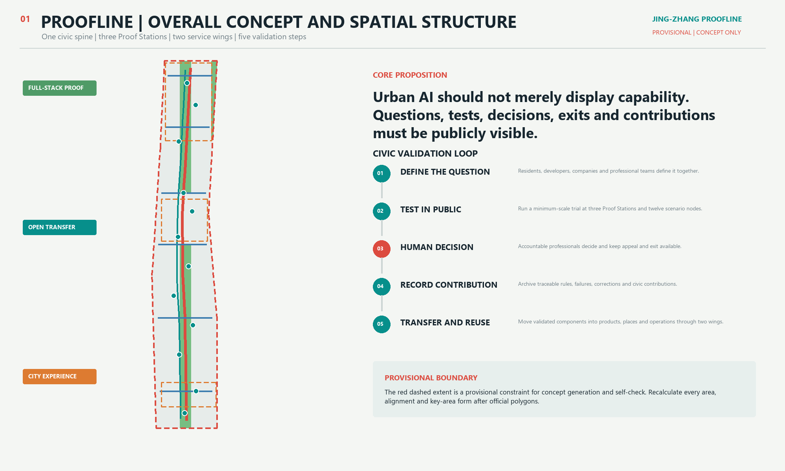
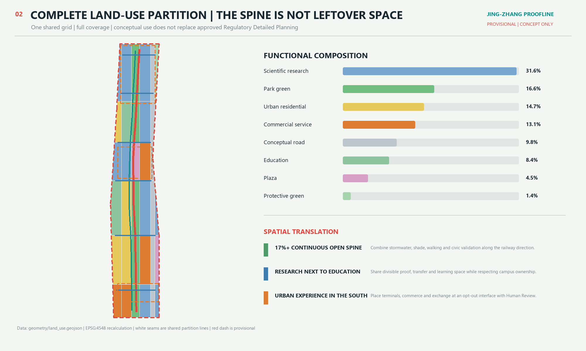
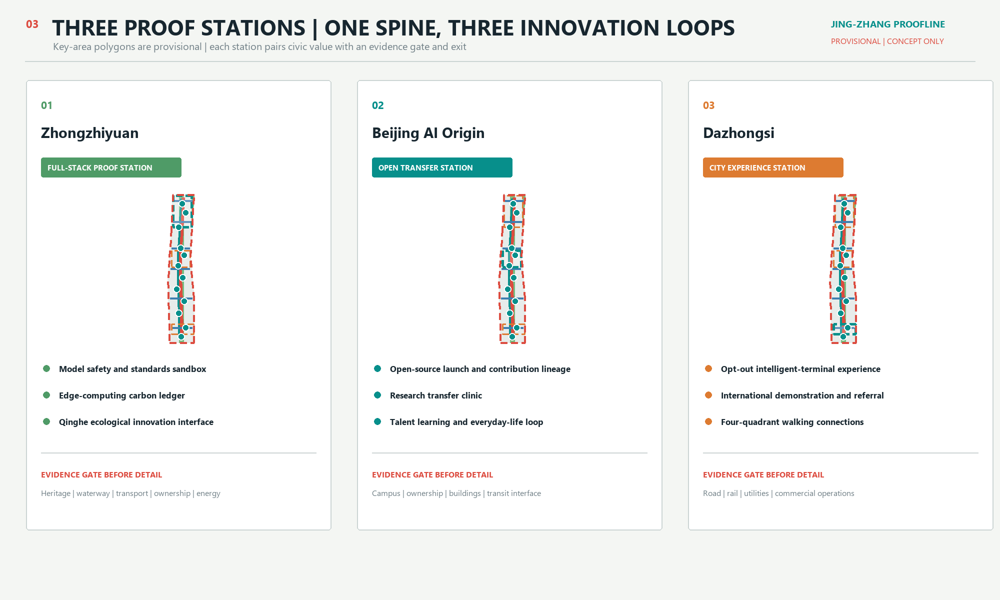
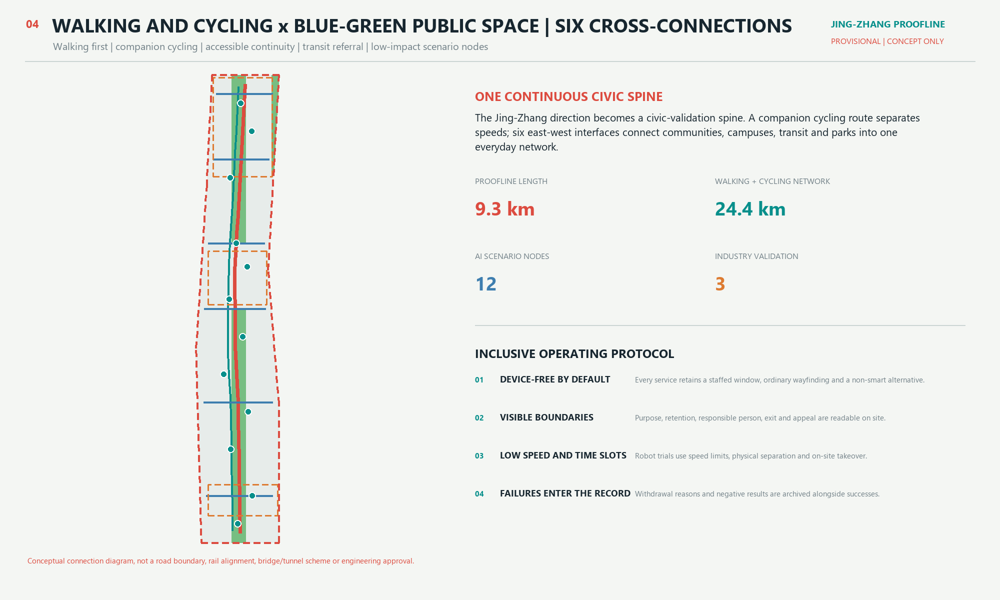
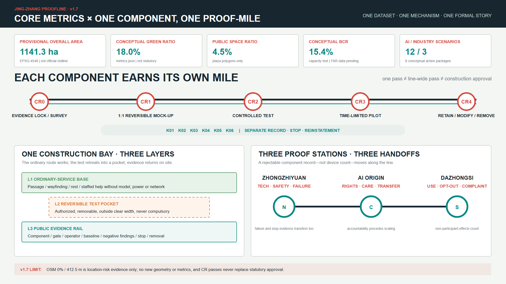

# Jing-Zhang Proofline: Verifiable, Shared and Evolvable Civic AI Infrastructure

> **BOUNDARY STATUS: PROVISIONAL CONSTRAINT.** This proposal uses a rough temporary extent compiled by repository maintainers from the public announcement. It is suitable only for concept generation, display and submission self-check. It is not an Official Planning Boundary and does not establish parcel, ownership, road, heritage or engineering limits. All layers, metrics, figures, PDFs and HTML must be recalculated when rights-cleared official polygons become available. [source:BOUNDARY-SOURCE] [data:geometry/site_boundary.geojson#SITE-001] [assumption:A-BOUNDARY-001]

An independent OSM / Overpass check rerun on 9 August 2026 found zero intersection and a 412.5 m nearest distance between the OSM-mapped Jing-Zhang Railway Heritage Park and the provisional Overall Design Area, while the mapped park sits within the provisional Coordinated Research Area. This proves a spatial discrepancy requiring adjudication; it does not prove that either OSM or the provisional polygon is correct. Geometry therefore remains unchanged and an official polygon triggers full-package recalculation. [source:DATA-SRC-OSM-BOUNDARY-CROSSCHECK-20260808]

Jing-Zhang Proofline does not add another layer of smart devices to the city. It turns AI from a back-office capability into a civic process that people can see, question, leave and improve together. The historic Jing-Zhang Railway established a spatial grammar of track, station and mile. Proofline translates it into a loop of question definition, public testing, human decision, contribution memory and reusable transfer. Zhongzhiyuan undertakes full-stack validation; Beijing AI Origin Community enables open transfer; Dazhongsi supports urban experience. The Zhongguancun Technology Services Wing and Xiaoyue River Scenario Enablement Wing provide professional resources and real-world contexts. Public interest is the test of value and accountable people retain final responsibility. [source:AGENT-TASKBOOK] [standard:PROJECT-AGENT-OPEN-CALL-TASKBOOK]

v1.7 retains One Component, One Proof-Mile while separating evidence that can directly calculate a metric, evidence that can support context only, and evidence that can only define a hypothesis for later verification. New data completes the scale ladder, tests boundary risk and defines future collection; it does not change GeoJSON, `metrics.json`, siting or phasing.

## Executive Brief

| Review question | Proofline response | Verifiable output |
| --- | --- | --- |
| Core proposition | Shift AI from device display to a civic validation process that can be questioned, exited and reviewed | A six-field scenario protocol and twelve scenario cards |
| Spatial response | Connect R&D, transfer, urban experience and everyday services through one spine, three Proof Stations, two wings, six cross-connections and twelve Proof Points | Nine GeoJSON layers, five evidence figures, A3/A0 PDFs and an offline page |
| Starting point | Begin with protocols, wayfinding, a problem clinic and a low-impact pilot; collect five corridor baselines before transport expansion | Eight action packages, three phases, conceptual responsibilities, evidence gates and service targets |
| Public value | High-risk scenarios require final human responsibility; basic services retain non-digital paths; people can opt out, appeal and correct records | Privacy and human-review check [self_check:PRIVACY_HUMAN_REVIEW] |
| Evidence status | Geometry and metrics are reproducible; district, national and citywide statistics calibrate questions but do not establish corridor demand | Assumptions, self-checks, risk register and a complete evidence index |
| Decision boundary | Every spatial move, brand, event, timetable and role is a conceptual recommendation, not statutory planning, government action or an investment commitment | Risk chapter, stop conditions and iteration log |

## Design Basis and Source List

### 1. Evidence tiers

The proposal first asks what each source can support, then asks what spatial response is defensible. The project title, three scope descriptions, approximate areas, three key-area names and design tasks come from the official announcement. The six Agent tasks, scenario counts, identity and operations requirements come from the rights-cleared taskbook supplied by the user. [source:OFFICIAL-ANNOUNCEMENT] [source:AGENT-TASKBOOK]

Urban-design, regulatory-plan boundaries and land-use terms use official snapshots stored in the repository. Exact spatial boundaries are not public, so geometry uses only an explicitly marked provisional constraint. [source:URBAN-DESIGN-MEASURES] [source:CONTROL-DETAILED-PLANNING] [source:LAND-USE-CLASSIFICATION]

`data/source_registry.json` controls source classification; `data/processed/agent_fact_pack.md` is reading navigation and creates no new authoritative fact. This proposal does not use commercial map tiles, news screenshots, an OSM-derived Official Planning Boundary, uncleared planning images, unauthorized company material or personal data. OSM appears only as an independent background check with ODbL attribution. [source:SOURCE-REGISTRY] [source:PROCESSED-FACT-PACK]

| Evidence category | Use in this proposal | Can support | Cannot support |
| --- | --- | --- | --- |
| Official task basis | Announcement and local standard snapshots | Tasks, scope descriptions, approximate areas, deliverable depth and professional principles | Exact polygons, statutory controls or engineering conditions |
| Rights-cleared task basis | Agent taskbook excerpt | Brand, cases, scenarios, landmarks, culture and operations tasks | Statutory planning, government action or investment commitments |
| Temporary spatial basis | Repository provisional boundaries | Generation, topology checks, relative relationships and offline visualization | Official Planning Boundary, ownership, exact area or approval |
| Agent-designed data | Submitted GeoJSON and metrics | Conceptual zoning, capacity tests, networks, scenario nodes and phasing | Surveyed existing conditions, engineering alignments or settled DRR decisions |
| Public administrative statistics | National, Beijing, Haidian and central-area annual releases | Calibrate industry, transfer, Public Services, green mobility and city-logistics questions | Corridor flow, station OD, capacity, siting or project performance |
| Official open-data catalogue | Haidian school-bus catalogue metadata | Define a future route-school-station-accessibility verification entry | Corridor route coverage, student demand, station flow or road engineering |
| Open-licensed background mapping | Independently rerun OSM / Overpass check | Detect a reproducible spatial discrepancy in the provisional boundary | Official polygon, statutory control, boundary translation or formal area |
| Background cases | Six institutions' official sites | Compare mechanisms and inform design | Haidian performance analogies, spatial controls or delivery guarantees |

The authority order is GeoJSON, metrics, the three matrices, sources and assumptions, `proposal.md`, then figures, PDFs and HTML. Every established metric records its formula, source files, confidence and assumptions. Statutory Floor Area Ratio remains pending official data; conceptual capacity does not substitute for an official control. [standard:MOHURD-CONTROL-DETAILED-PLANNING] [depth:existing_conditions_diagnosis] [metric:site_area_sqm]

### 2. Data baseline and decision translation

This iteration includes only observations traceable to an original publication page, open-licensed data or a reproducible method. Every record states its scale, resulting design action and prohibited inference. Administrative and catalogue values are not spatially allocable; OSM readings are prohibited from formal boundary use. All are `background_only`; none enters `metrics.json` or changes GeoJSON, area, alignment or phasing. [source:SOURCE-REGISTRY] [assumption:A-BOUNDARY-001]

The four existing administrative and transport sources were checked on 8 August 2026; the Beijing bulletin, school-bus catalogue and OSM query were checked on 9 August. `sources.json` records collection method, spatiotemporal coverage, locator, license status, conversion, cross-check and limitation. Statistical pages without an explicit open-data license are used only for attributed facts. The school-bus platform permits attributed reuse, but its file requires login, so this iteration records catalogue metadata only. OSM retains ODbL attribution and only derived readings. The bulletin's 3.57 billion rail trips agree with the transport report's 3.576 billion within publication rounding.

| Source scale | Verifiable observation | Design action changed | What it does not prove |
| --- | --- | --- | --- |
| China, 2025 | 16 high-value invention patents per 10,000 people and CNY 7.5734 trillion in technology-contract value; comparison with Haidian remains administrative-scale context only [source:NBS-2025-STATISTICAL-COMMUNIQUE] [source:HAIDIAN-2025-STATISTICAL-BULLETIN] | Shift Proofline's value test from more quantity to validation quality, clear responsibility, negative results and reuse | Full institutional comparability, corridor targets, rankings or causal conclusions |
| Beijing, 2025 | 209 filed and launched large models, 180.7 high-value invention patents per 10,000 people and CNY 986.5 billion in technology contracts; 30 rail lines spanning 909 km carried 3.57 billion trips, with 848,000 shared bikes and 2.74 billion express parcels [source:BEIJING-2025-STATISTICAL-BULLETIN] | Complete a China-Beijing-Haidian scale ladder and turn rail, cycling and parcel logistics into corridor measurement interfaces rather than direct allocations | Corridor models, patents, passengers, vehicles, orders, loading conflict or facility demand |
| Haidian District, 2025 | 92 national key laboratories in the district, 123 filed and launched large models, 599 high-value invention patents per 10,000 people; 57,900 technology contracts worth CNY 405.31 billion [source:HAIDIAN-2025-STATISTICAL-BULLETIN] | Replace generic incubation with five auditable services: standards validation, failure records, IP, product validation and research transfer | That these resources sit in the corridor, will participate, create flows or produce stated outcomes |
| Haidian university-service case, 2026 | A public event covered 37 district universities and named existing assets, laboratory and special-equipment safety, IP and research transfer as service needs [source:HAIDIAN-37-UNIVERSITIES-SERVICE-NEEDS] | Establish four booking routes at the Origin Clinic: asset compliance, laboratory safety, IP, and research/product validation | Identical needs, existing partnerships, campus siting or service volume |
| Haidian school-bus catalogue, 2024 | The official catalogue lists 60 records with route, origin, destination school, place and departure-time fields; it gives no temporal or geographic range and the CSV required login during this pass [source:BEIJING-OPEN-DATA-HAIDIAN-SCHOOL-BUS-ROUTES] | Define a future route-school-station-accessibility verification workflow while Scenario 08 remains small, teacher-in-the-loop and non-profiling | That 60 routes cross the project, school demand, student count, station flow or service performance |
| Central Beijing / Beijing, 2025 | Central-area weekday trips totaled 39.24 million; green modes accounted for 76.5%, including rail 15.0%, bus 8.9% and bicycle 22.3% [source:BJTRC-2026-TRANSPORT-REPORT] | Keep walking, cycling and transit referral first, but pilot only by time and at small, stoppable scale; collect corridor gates before expansion | Corridor, Wudaokou, Qinghuadongluxikou or Dazhongsi flows, OD, congestion or parking demand |
| Haidian District, 2025 | 1,456 medical and health institutions, including 239 community health-service centers or stations [source:HAIDIAN-2025-STATISTICAL-BULLETIN] | Scenario 09 provides verified facility information, human referral and a non-digital fallback, not an AI medical conclusion | Corridor distribution, accessibility, service capacity, appointment supply or demand for new facilities |
| OSM background check, 9 August 2026 | The mapped heritage park covers 17.49 ha, has zero intersection and a 412.5 m nearest distance to PROV-SITE-001, and is fully covered by PROV-RESEARCH-001; an independent rerun matches Issue #846 [source:DATA-SRC-OSM-BOUNDARY-CROSSCHECK-20260808] | Freeze current geometry, disclose location uncertainty and make an official polygon the full-package recalculation trigger | That OSM maps the official planned park, the provisional boundary is certainly wrong, or geometry may be translated and redrawn from this check |

Beijing's 2.74 billion express parcels show only that city logistics belongs on the problem list; they do not establish corridor loading conflict, short stay or nighttime demand. [source:BEIJING-2025-STATISTICAL-BULLETIN] Rider, ride-hailing, parcel-order and commercial-heat data still lack a source that simultaneously provides public permission, aggregate anonymity, corridor coverage, sampling method and bias disclosure, so they remain pending. Future analysis requires registered license, time window, spatial aggregation, sample coverage, missingness and bias, privacy suppression and retention. Individual traces, exact addresses, order records and unauthorized raw platform data cannot enter the package.

### 3. Generation and review method

Temporary boundaries use EPSG:4326 for exchange and EPSG:4548 for area and length recalculation. Land use is generated by intersecting one set of dividing lines with the site polygon, ensuring complete coverage without gaps or overlap. Green space, public space, conceptual buildings, roads, scenario nodes and phasing derive from the same boundary and land-use partition. Five figures, offline pages and PDFs explain structured data; they do not generate metrics in reverse. [data:geometry/land_use.geojson#LU-001] [depth:metrics_recalculation] [self_check:METRIC_RECALCULATION]

Official polygons for the three scopes and key areas, statutory planning controls, road boundaries, ownership, surveyed buildings, heritage, waterways, utilities and public facilities are not yet available. These gaps are registered in `assumptions.json` and the metadata of `geometry/constraints.geojson`. The method therefore separates what can be recalculated, what remains pending official data and what requires an evidence gate, rather than using polished graphics to imply certainty. [data:geometry/constraints.geojson] [standard:MOHURD-ARCH-DESIGN-DEPTH-2016]

The OSM check adds one item—location discrepancy—to the risk ledger; it does not enter boundary, land-use, road or area calculations. PR #850, now merged into `upstream/main`, likewise classifies it as `background_only` and leaves `PROV-SITE-001` unchanged. This package keeps the same boundary until an official polygon arrives. [source:DATA-SRC-OSM-BOUNDARY-CROSSCHECK-20260808] [assumption:A-BOUNDARY-001]

## Three-Level Scope Framework

The official announcement defines a Coordinated Research Area, an Overall Design Area and a Key-Area Detailed Design Area. One civic-validation logic links all three, but each level answers only questions appropriate to its source quality and required depth. [source:OFFICIAL-ANNOUNCEMENT] [standard:PROJECT-OFFICIAL-ANNOUNCEMENT]

| Level | Official approximate scale and task | Proofline response | Outputs and evidence |
| --- | --- | --- | --- |
| Coordinated Research Area | About 43.6 km2; industrial ecosystem, Three Zones and Two Wings, future-city form | Six global mechanism comparisons; five validation loops; resource and scenario wings; annual operations | Case table, ecosystem map, identity system and compliance matrix |
| Overall Design Area | About 11.4 km2; Urban Renewal, land use, transport, utilities, activity belt and character | One civic-validation spine, six cross-connections, complete conceptual land-use partition, twelve scenario nodes and eight action packages | Nine GeoJSON layers, metrics, A3/A0 and offline HTML |
| Key-Area Detailed Design Area | About 368.4 ha in the announcement; detailed design for three areas | Zhongzhiyuan as a Full-Stack Proof Station, AI Origin as an Open Transfer Station, Dazhongsi as a City Experience Station | Three temporary key-area schemes, evidence gates and stop conditions |

The coordinated level explains why and who might operate over time; the overall level explains how spatial systems support the mechanism; the key-area level tests differentiated responses. Five loops connect them: full-stack independent innovation becomes public testing; a world-class ecosystem becomes reusable transfer; AI-enabled scenarios begin with real problems; an intelligent and lively city requires accessible everyday space; and AI governance influence requires human judgment and contribution memory. [source:AGENT-TASKBOOK] [depth:three_level_scope_framework]

The overall structure is **one Proofline, three Proof Stations, two wings, six cross-connections and twelve Proof Points**. The line is a civic-validation spine along the Jing-Zhang direction; the stations are the three key areas; the wings are the Zhongguancun Technology Services Wing and Xiaoyue River Scenario Enablement Wing; six cross-connections stitch the park to communities, campuses, workplaces and transit; twelve nodes distribute testing, service, cultural contribution and experience along everyday paths. These are conceptual relationships, not new administrative or engineering boundaries. [data:geometry/roads.geojson#ROAD-001] [depth:overall_spatial_structure]

When official polygons arrive, replacement follows constraint first, design second, metrics last: replace site and key areas; rebuild land use; derive buildings, roads, green/public space and phasing; recalculate metrics; redraw all five figures; and regenerate PDFs and HTML. Changing only the outline while retaining old areas or nodes is prohibited. [source:KEY-AREA-SOURCE] [metric:key_area_count]

## Coordinated Research Area: Industry and Future City Research

### 1. Identity: from smart display to civic proof

The Chinese name Jing-Zhang Zhizheng Line retains place memory; `zhizheng` combines verified evidence and public witnessing. The English name `Jing-Zhang Proofline` uses `proof`, not `smart`, to make verifiability precede spectacle. The naming hierarchy is Proofline for the whole belt, Proof Station for three key areas, Proof Mile for distributed contribution nodes and Proof Protocol for scenario rules. It can organize space, events, wayfinding and archives, but remains a conceptual recommendation. [source:AGENT-TASKBOOK] [standard:PROJECT-AGENT-OPEN-CALL-TASKBOOK]

The logo combines two parallel rails, three verification nodes and an open bracket. Rails denote a century of continuity; nodes denote the three key areas; the bracket means that every conclusion remains open to extension and review. The palette uses mineral gray, railway signal red, public-service teal and ecological green. Wayfinding communicates direction and risk; the logo establishes identity. Only system fonts are rasterized in outputs and no font file is distributed. [depth:height_massing_character]

With node diameter `x` as the reference, the mark keeps at least `1x` clear space. The horizontal bilingual lockup has a suggested minimum width of 36 mm and the digital symbol 24 px. Signal red `#C7463B` marks risk, stop and validation; service teal `#167C80` marks accessible services; ecological green `#4E7A55` marks the blue-green system. No gradients or glow are used. The mark must not be stretched, rotated, sponsored, given a different node count or presented as a government identifier. Trademark review, font licensing, accessible contrast and production applications require later brand and legal work. [source:AGENT-TASKBOOK]

### 2. Six global cases: transfer mechanisms, not numbers

All cases come from institutional public sites and are `background_only` mechanism comparisons. The proposal does not import investment, company, output or unverified performance figures, and does not assume another city's governance conditions apply to Haidian. [source:SOURCE-REGISTRY]

| Case | Verifiable institutional role | Transferable mechanism | Proofline filter |
| --- | --- | --- | --- |
| Singapore one-north | JTC publishes information on the innovation district and business space [source:CASE-ONE-NORTH] | A place operator coordinates space, industry services and public realm | Do not import intensity; create a cross-area catalog of spatial products |
| Toronto MaRS | Urban innovation hub supporting startups across fields [source:CASE-MARS] | An intermediary links research, companies, professional services and urban questions | Do not copy the institution; translate it into a research-transfer clinic |
| Kendall Square | A district association organizes community collaboration [source:CASE-KENDALL] | A standing civic organization maintains shared issues and programming | Do not assume company participation; use an open charter and annual public review |
| Cornell Tech | A university technology campus with applied-innovation space [source:CASE-CORNELL-TECH] | Education, entrepreneurship and public space meet in an everyday setting | Do not cross campus ownership; use bookable collaboration nodes near campus edges |
| Paris STATION F | A concentrated startup campus [source:CASE-STATION-F] | Dispersed services become a clear one-stop path and community entrance | Do not pursue one-building scale; distribute launch halls and transfer clinics |
| Berlin Adlershof / WISTA | A professional operator manages a science park and incubators [source:CASE-ADLERSHOF] | Development, incubation, services and continuous operations have explicit handoffs | Do not preassign government or corporate actors; define roles, data and exit first |

Four principles recur: space requires a durable operator; research needs a legible service entrance; public space is a low-threshold interface for cross-organizational work, not leftover landscape; and an innovation district needs continuous review and exit, not one-time completion. Proofline encodes these as an open question register, scenario permits, Human Review, contribution records and phased evaluation.

### 3. AI innovation ecosystem map

The ecosystem begins with problems, not an unverified company list. Haidian's administrative statistics show concentrated innovation supply and technology exchange, so Proofline prioritizes standards validation, failure records, IP, product validation and translation of public questions over adding more generic showcases. [source:HAIDIAN-2025-STATISTICAL-BULLETIN] Residents, developers, companies, universities and professional teams define questions. The Zhongguancun wing refers legal, IP, capital, talent, standards and international-communication services. Zhongzhiyuan supports model safety, edge computing and a standards sandbox. AI Origin supports open launch, near-campus transfer and talent services. The Xiaoyue River wing and Proofline supply real-world contexts. Dazhongsi receives only sufficiently mature, reversible products for urban experience and exchange. Each validation produces a public protocol, human decision, negative-result record and reusable component rather than a publicity case. [depth:overall_spatial_structure]

Regional coordination is expressed through exchangeable validation outputs, not an unverified enterprise inventory. Every role, collaboration route and output below is a research direction; none claims an existing partnership, resource or policy arrangement. [source:AGENT-TASKBOOK] [assumption:A-OPERATIONS-001]

| Coordination node | Suggested capability | Proofline interface | Public output returned | Entry condition |
| --- | --- | --- | --- | --- |
| Beiwei Community | Developer community, content co-creation and everyday-experience questions | Open question register, memory contribution station and a Proofline Week community unit | Authorized needs list, experience feedback and versioned open content | Community authorization, rights check and anonymous or aggregated feedback |
| Future Science City | Fundamental research and engineering-validation needs | Remote assessment through Zhongzhiyuan model-safety, edge-computing and standards interfaces | Reusable test protocols, failure records and transfer-question lists | Clear ownership, data tier and testing responsibility |
| Huairou Science City | Algorithms, instruments and cross-disciplinary questions related to scientific facilities | Open launch and professional referral through AI Origin | Public explanations, reproducibility catalog and talent-exchange questions | Confirm disclosure scope item by item; exclude non-public research |
| Beijing E-Town | Intelligent terminals, robotics and scaled engineering feedback | A validation-to-engineering-feedback interface at Dazhongsi and the robot right-of-way sandbox | Urban-use issues, human takeover records and product-improvement evidence | Product safety, consumer rights, right-of-way and procurement boundaries confirmed |
| Beijing-Tianjin-Hebei | Cross-city application contexts and governance experience | Common Proof Protocol fields and remote-review format | Comparable positive and negative results, mutual-recognition research samples and cross-city question register | Relevant parties negotiate rules; no automatic recognition or deployment |

Coordination value is measured by protocol reuse, disclosure of negative results, response to needs and improvement of basic local services, not contracts or exposure. Computing, data, funding, investment attraction and policy are never guaranteed. Any cross-jurisdiction trial requires separate confirmation by competent authorities, rights holders and professional teams.

## Overall Design Area: Urban Renewal and Regulatory-Plan-Level Urban Design

### 1. Spatial judgment

The design does not distribute AI functions evenly across 11.4 km2. It creates a continuous public spine, differentiated innovation stations and a replaceable functional grid. The spine first supports walking, cycling, shade, stormwater, cultural interpretation, contribution display and public service. Research, education, housing, commerce and open space form a complementary sequence. Conceptual road land supports cross-organization. Building prototypes prioritize shared ground floors, divisible R&D space and retain-first adaptation. [data:geometry/land_use.geojson#LU-001] [standard:MNR-LAND-USE-CLASSIFICATION-GUIDE]

Land-use codes use a subset of the Ministry of Natural Resources classification and express conceptual capacity and functional relationships only. Within the provisional extent, scientific-research land is about 31.6%, park green 16.6%, urban residential 14.7%, commercial service 13.1%, conceptual roads 9.8%, education 8.4%, plazas 4.5% and protective green 1.4%. These are recalculated from submitted geometry and are not statutory planning controls; each must be compared, rebuilt and explained when formal controls arrive. [metric:land_use_0802_sqm] [metric:land_use_1401_sqm]

### 2. Renewal method: survey, classify, act

Without rights-cleared existing-building and ownership data, the proposal makes no parcel-specific demolish, retain or build decision. Urban Renewal uses four gates. Gate A checks ownership, use, age, structure and fire safety. Gate B identifies heritage, social, public-service, affordable-space and mature-tree value. Gate C compares life-cycle impacts of retention, repair, adaptive reuse and partial replacement. Gate D reaches a conclusion through public participation and statutory procedures. Only then may a site enter a professional Demolish-Renovate-Retain Strategy. [data:geometry/buildings.geojson#BLDG-001] [depth:retain_renovate_demolish]

The 24 approximate masses in `buildings.geojson` are conceptual capacity prototypes, not surveyed buildings. They test coexistence between shared ground floors, research courtyards, talent housing, education collaboration, community services and open space. Conceptual footprints total about 175.4 ha, Building Coverage Ratio about 15.4%, floor-area capacity about 859.4 ha and a capacity ratio about 0.75. All are low confidence; statutory `floor_area_ratio` is pending official data. [metric:building_density] [metric:concept_floor_area_ratio]

### 3. Regulatory-plan-level expression

Regulatory-plan-level urban design does not mean inventing statutory values. This package addresses land use, spatial structure, massing method, transport and walking/cycling, utility interfaces, public space, character, action packages, phasing, metrics and risk, with evidence chains in `standard_matrix.json` and `design_depth_matrix.json`. FAR, building height, coverage controls, green-space controls, setbacks, statutory control lines, facility capacity and road boundaries all remain to be confirmed. [standard:MOHURD-CONTROL-DETAILED-PLANNING] [depth:development_intensity_controls] [assumption:A-CONTROLS-001]

Three interface rules are proposed: visible ground floors, technology that can be switched off, and reversible space. Bookable shared interfaces face the spine; screens, sensors and robot tests do not occupy continuous accessible routes; light components should be demountable, repairable and reusable. Height, roofs and massing are expressed only through adjacency, skyline continuity and heritage-interface retreat. Values await official controls and view analysis. [standard:MOHURD-URBAN-DESIGN-MEASURES]

## Detailed Design of Key Areas

The announcement gives approximate areas of 192.1 ha for Zhongzhiyuan, 104.3 ha for Beijing AI Origin Community and 72.0 ha for Dazhongsi. The rectangular polygons in this package are rough substitutes organized by repository maintainers from names, north-south order and approximate areas. They cannot support parcel, ownership, DRR or exact-area decisions. [source:KEY-AREA-SOURCE] [data:geometry/key_areas.geojson#PROV-KEY-001] [self_check:KEY_AREAS_TRUST]

### 1. Zhongzhiyuan: Full-Stack Proof Station / Safety Proof Garden

**Position.** Translate full-stack independence from a closed R&D chain into an auditable validation chain: models, edge devices, energy, standards and safety governance each have a test context, an accountable person and public results. Three spatial layers connect controlled research courtyards, a bookable shared proof garden and a low-threshold Qinghe ecological interface.

**Space and buildings.** The conceptual spine crosses the public interface and east-west links connect the campus to external transport. R&D prototypes use divisible floors, shared pilot-production levels and public proof galleries at ground. DRR begins with structural survey and retain-first adaptation and identifies no current building. An ecological buffer and low-impact observation nodes face Qinghe; access to water, crossings and equipment await waterway, heritage, flood and ecological evidence.

**Scenarios and operations.** Scenario 01, Public Model Safety Proving Ground, supports red-team tests, dispute decisions and versioned results. Scenario 02, Edge Computing Carbon Ledger, records aggregate device-level energy only. Scenario 03, Shared Robot Right-of-Way Sandbox, uses low speed, time slots, physical separation and on-site takeover. All three are Testing and Validation Scenarios, not direct-deployment permissions. [metric:industry_test_scenario_count]

**Evidence gate.** Heritage, waterway, road, ownership, energy and fire-safety data must precede detailed work. References to national-level or standards-making ambitions describe task directions only and do not establish an institution or policy. [data:geometry/key_areas.geojson#PROV-KEY-001]

### 2. Beijing AI Origin Community: Open Transfer Station

**Position.** Research transfer is not one-way investment attraction. The proposal creates a near-campus loop of open launch, professional clinic, small-scale validation, licensed transfer and talent life. A public case covering 37 Haidian universities identifies interfaces around existing assets, laboratory and special-equipment safety, IP and research transfer. The clinic therefore offers four routes: asset compliance, laboratory safety, IP, and research/product validation. [source:HAIDIAN-37-UNIVERSITIES-SERVICE-NEEDS] A contribution-lineage node records open-source projects, public questions, failures and authorization boundaries.

**Space and buildings.** A Near-Campus Collaboration Street concept links campuses, workplaces and communities. Ground floors provide an open launch hall, four booking desks, isolatable product-validation bays, night learning and talent-life services. They share intake but separate material, responsible people and archive access. Upper uses and capacity await statutory planning and building surveys. Walking and Cycling Network routes must be continuous, legible and replaceable without crossing campus or ownership boundaries. Transit work addresses walking referral and information continuity, not station engineering.

**Scenarios and operations.** Scenario 04 records authorization and withdrawal for open launches. Scenario 05 first sorts asset compliance, laboratory safety, IP, product maturity and intended validation context; professionals then route the case, while AI structures questions and issues no legal, safety or investment conclusion. Scenario 08 avoids profiling minors and keeps teachers in the loop. Developer residencies address public questions first; only authorized contributions may proceed to enterprise service.

**Evidence gate.** Campus boundaries, existing buildings, ownership, transit interfaces, housing and public-service baselines must be completed first. Each booking route needs a qualified human owner, data minimization, authorization and confidentiality limits, a referral directory, conflict-of-interest rules and retention periods. Without any one element, only ordinary information navigation opens; no professional judgment or product test begins. A talent community is not a designated housing project or confirmed facility. [data:geometry/key_areas.geojson#PROV-KEY-002]

### 3. Dazhongsi: City Experience Station

**Position.** Urban experience with agents, terminals and content consumption takes place at a public interface that permits exit, appeal and accountability, avoiding collect first, explain later. A station-city referral forecourt, opt-out experience street, international demonstration and professional-service salon, and everyday community services share one ethical and safety framework.

**Space and buildings.** Four-quadrant walking connections are a design question, not an engineering conclusion. Road boundaries, signals, station entrances, accessibility, utilities and pedestrian flow must first be surveyed; transport professionals can then compare at-grade crossings, upgrades to existing facilities and alternatives. Commercial prototypes use small units, replaceable interfaces, separated logistics and pedestrian flow, and a device-free path. No existing company building receives a renewal decision.

**Scenarios and operations.** Scenario 11, Opt-Out Intelligent Terminal Experience Street, defaults to anonymity, clear notice and immediate exit. Scenario 09 refers users to health institutions and never diagnoses. Scenario 10 provides legal-service navigation and requires professional review. International demonstrations are measured by problem matching, validation records and follow-on transfer routes, not exposure.

**Evidence gate.** Roads, rail, utilities, commercial operations, fire safety and ownership must be complete before detailed design. Station-city connection, static transport and underground-space questions receive no engineering conclusion here. [data:geometry/key_areas.geojson#PROV-KEY-003] [depth:three_key_area_detailed_design]

## AI Innovation Ecosystem, Personas, and AI+ Scenarios

### 1. Six personas

Personas identify needs and are not inferred from personal traces or private data. Each records a task, a spatial/service requirement and a prohibited practice, so attracting talent is not reduced to an interior style. [source:AGENT-TASKBOOK]

| Persona | Core task | Space and service | Data and equity boundary |
| --- | --- | --- | --- |
| Open-source developer | Release, collaborate, test and retain a durable contribution record | Launch hall, night collaboration desk, lineage gallery and professional clinic | No behavioral ranking; contributions can be corrected or withdrawn |
| Startup or small team | Run affordable trials, access computing and compliance help, find a first context | Divisible R&D space, validation sandbox, edge-computing station and scenario permit | No promise of funding, orders or computing; failure does not bar another application |
| Enterprise product team and visitor | Safety testing, demonstration, recruitment and urban experience | Zhongzhiyuan validation, Dazhongsi demonstration, transit referral and public salon | Company cases and marks require permission; brand does not buy priority in Public Space |
| Resident, older adult or caregiver | Commute, rest, seek help and receive service without a smart device | Continuous shade, accessible rest, staffed window and community referral | Device-free path by default; no commercial recommendation profile |
| University student, teacher or researcher | Cross-campus work, licensed transfer and public-question research | Near-campus collaboration street, launch hall, short-term workspace and open course | Campus data and research require authorization; no profiling of minors |
| Operator or professional | Review scenarios, manage risk, maintain facilities and answer appeals | Responsibility desk, review room, stop switch and version archive | Decision logs are auditable; AI does not replace planning, health, legal or safety responsibility |

### 2. Shared scenario protocol

Every scenario uses six fields: service user, minimum necessary data, spatial boundary, human reviewer, exit/appeal method, and evaluation/stop condition. No scenario defaults to area-wide collection, presents immature technology as universally available or locks the city to one supplier. Twelve `SCENARIO_NODE` features are stored in `public_space.geojson`, three of them industry Testing and Validation Scenarios. [data:geometry/public_space.geojson#SCN-01] [metric:scenario_node_count]

### 3. Twelve scenario cards

| Card | Type and location | User / minimum data | Human Review, exit and operations |
| --- | --- | --- | --- |
| 01 Public Model Safety Proving Ground | **Industry test**; Zhongzhiyuan proof garden | Development and governance teams; test sample, model version and risk label | Assessment lead decides; appeal is available and failed versions retain reasons; quarterly open validation |
| 02 Edge Computing Carbon Ledger | **Industry test**; Zhongzhiyuan computing station | Device developers and operators; aggregate device energy, unrelated to individuals | Energy professional checks; display stops below threshold; monthly review |
| 03 Shared Robot Right-of-Way Sandbox | **Industry test**; Xiaoyue River wing / spine pilot | Robot teams, pedestrians and cyclists; events and anonymous counts only | On-site safety officer can take over; low speed, time slots and separation; complaints pause testing |
| 04 Open-Source Launch Hall | Innovation; Beijing AI Origin Community | Developers, universities and public; licensed code, description and voluntary contributor credit | Content review and rights-holder withdrawal; community committee launches monthly |
| 05 Research Transfer Clinic | Enterprise service; AI Origin | Teams and professionals; minimum material routed among asset compliance, laboratory safety, IP, research and product validation | Relevant professionals give final views; access is separated and material can be withdrawn; no approval or investment promise |
| 06 Accessible Walking Companion | Public service; Proofline spine | Blind and mobility-impaired people and visitors; edge obstacle recognition deleted immediately | Staffed help remains; smart function can be off; daily operator inspection |
| 07 Public-Space Maintenance Co-Review | Civic governance; spine nodes | Residents and maintenance teams; public work order, aggregate location and state | Human dispatch, resident correction and overdue escalation; no personal trace collection |
| 08 Trustworthy AI Education Experience | Education; near-campus interface | Students, teachers and families; course choice and anonymous feedback | Teacher in the loop; no profiling minors; disputed content can be removed |
| 09 Health-Service Navigation | Health; community-service point | Residents and visitors; actively entered service need | Institution referral only; no diagnosis or medical record; staffed alternative |
| 10 Legal-Service Referral Desk | Legal; community-service point | Residents and startups; actively described issue type | Lawyer or legal-service professional reviews; model text is not legal advice |
| 11 Opt-Out Intelligent Terminal Experience Street | Urban experience; Dazhongsi | Consumers, companies and researchers; anonymous experience feedback | Clear notice, immediate exit and staffed complaint desk; products rotate |
| 12 Urban Memory Contribution Station | Culture; Proofline spine | Residents, railway-memory contributors and developers; authorized text and image metadata | Attribution, disputed-content removal and rights-holder withdrawal; no invented history |

The shared decision sequence is problem first, minimum-scale trial second, and expansion only after Human Review. Privacy, safety, equity or Public Space conflict can stop a scenario immediately. `PRIVACY_HUMAN_REVIEW` in `self_check.json` verifies this boundary. [depth:risk_missing_data] [self_check:PRIVACY_HUMAN_REVIEW]

## Land Use, Building Scale, and Retain-Renovate-Demolish Strategy

### 1. Complete land-use partition

A 6 by 6 conceptual grid intersects the provisional site polygon and produces more than 30 valid polygons with shared coordinates. Research, commercial, residential, education, roads, parks, protective green and plazas sum exactly to site area; no blank is hidden as undecided. The structured land use is a replaceable test model, not a statement of current or statutory use. [data:geometry/land_use.geojson#LU-001] [depth:land_use_layout] [self_check:LAND_USE_TOPOLOGY]

Recalculated areas are approximately 360.31 ha scientific research, 149.49 ha commercial service, 168.08 ha residential, 95.30 ha education, 111.34 ha conceptual roads, 189.28 ha park green, 15.69 ha protective green and 51.79 ha plaza. Every value is affected by the provisional boundary; complete classes remain in `metrics.json`. [metric:land_use_0804_sqm] [metric:land_use_1402_sqm]

### 2. Building prototypes and scale boundary

Five prototypes test spatial relationships and conceptual capacity: divisible research courtyard, mixed-service base with an open ground floor, talent-housing prototype with shared facilities, community-service and Human Review node, and near-campus collaboration / lifelong-learning space. They establish no floor count, height, structure, title or construction quantity. [data:geometry/buildings.geojson#BLDG-001]

Massing uses relative controls. The spine forms a continuous but permeable street wall; key nodes retain civic forecourts; heritage and Blue-Green Space interfaces stay lower, set back and visually continuous; large masses break into courtyards, passages and public ground floors. Roofs prioritize equipment integration, stormwater and maintainability rather than spectacle as an AI expression. [depth:height_massing_character]

### 3. DRR decision tree

Detailed work asks in sequence whether a building has historic, social or public-service value; whether structure, fire and energy renewal are feasible; how retention and replacement compare across the life cycle; how current users are housed and involved; and whether the outcome complies with statutory planning and ownership. Only then can an asset be classified for retain and repair, adaptive reuse, partial replacement or lawful renewal. This package marks no demolition target because missing data must not be disguised as decisive design. [standard:MOHURD-ARCH-DESIGN-DEPTH-2016] [assumption:A-BUILDINGS-001]

## Transport, Rail, Municipal Infrastructure, and Public Services

### 1. Walking first: two longitudinal routes and six cross-connections

`ROAD-001` is the civic-validation spine in the Jing-Zhang direction, with a conceptual length of about 9.33 km. A companion cycling route, six cross-connections and transit-referral links total about 24.41 km. The values describe submitted geometry, not engineering mileage. [data:geometry/roads.geojson#ROAD-001] [metric:proofline_length_m] [metric:slow_mobility_length_m]

The six cross-connections address northern ecology and external access, Zhongzhiyuan, near-campus collaboration, AI Origin, southern community services and Dazhongsi station-city access. They are problem lists, not a uniform bridge program: locate breaks, test ordinary at-grade improvement, verify accessible continuity, resolve walking/cycling conflict and consider time management. Any crossing of the Fifth Ring Road, rail or arterial awaits road boundaries, traffic volumes, structure, utilities, fire and heritage evidence. [depth:traffic_rail_slow_parking] [assumption:A-TRANSPORT-001]

Transit work prioritizes information and walking continuity. At Wudaokou, Qinghuadongluxikou and Dazhongsi nodes named in the announcement, the proposal studies referral from exits to the spine, wayfinding, accessibility, bicycle parking and ground-floor relationships. It does not alter stations, lines or entrances. Parking remains a demand-management, sharing and time-use research direction; quantities remain pending official data.

### 2. Transport pilot data gates

The Beijing transport report establishes the importance of green mobility in the central city, but citywide and central-area statistics cannot be allocated to the Jing-Zhang corridor. Action P02, P05 and P06 and robot Scenario 03 cannot expand until all five corridor baselines exist. Every dataset must state date, time, weather and event conditions, sampling method, coverage, missingness and bias. [source:BJTRC-2026-TRANSPORT-REPORT] [assumption:A-TRANSPORT-001]

The school-bus catalogue is not a sixth known baseline. Once its 60 actual records are obtained, the workflow first checks version and school names, then joins routes, endpoints and departure times to rail stations, spine entrances and the surveyed accessible chain. Until then, Scenario 08 adds no stop, estimates no student flow and treats no catalogue count as a service target. [source:BEIJING-OPEN-DATA-HAIDIAN-SCHOOL-BUS-ROUTES] [assumption:A-TRANSPORT-001]

| Required baseline | Minimum observation | Decision changed | When absent |
| --- | --- | --- | --- |
| Station-exit and section counts | Fifteen-minute walking, cycling and necessary motor-vehicle classes on weekdays and rest days, with abnormal events marked | Pilot hours, interface capacity and need for separation | Do not expand points or occupy through space |
| Transfer OD and paths | Licensed aggregate OD, anonymous intercept survey or manual path observation, with refusal and sample bias disclosed | Transit referral, wayfinding and cross-connection priority | Make no claim that a station or direction has greater demand |
| Bicycle parking | Time-based occupancy, turnover, spillover, loading and conflict with accessible routes | Parking organization, timed loading and demountable facilities | Add no fixed facility and remove no ordinary path |
| Accessibility continuity | Slope, steps, clear width, crossings, rest and staffed help from station to spine, reviewed with representative users | First repair and whether smart functions have a non-technical alternative | Do not enable the companion scenario while a severe break remains |
| Complaints, conflicts and events | Classified public work orders, conflicts, near misses and human-takeover records | Stop conditions and before/after comparison | Claim no improvement without baseline |

Courier, ride-hailing, delivery and commercial heat-map data are optional supplements only. They require public permission or explicit authorization, aggregation, anonymity and disclosure of platform coverage and sample bias. They may identify loading, short-stay and temporal conflict, never profile individuals, support enforcement or exclude an occupation. Without platform data, field observation and stakeholder interviews define the problem. Guessed heat cannot replace measurement or deny anyone basic service.

### 3. Municipal and AI New Infrastructure interfaces

New Infrastructure is embedded in conventional utility capacity and safety review, not separated as a device corridor. Edge-computing stations require power, cooling, noise, carbon and information-security interfaces. Scenario nodes need network tiers, offline degradation and human takeover. Rain gardens need drainage, soil, underground-space and maintenance interfaces. Robot tests need right-of-way, charging, fire safety and a stop switch. Without capacity data, only system relationships are shown; no load or utility-relocation quantity is stated. [data:geometry/constraints.geojson] [depth:municipal_new_infrastructure] [assumption:A-MUNICIPAL-001]

### 4. Public services

The service structure is two-layered: basic Public Services do not depend on AI, while AI may assist referral to optional professional services. Staffed windows, ordinary wayfinding, accessible toilets, rest, water and emergency help form the base. Legal, IP, research transfer, health and legal navigation, education and enterprise services are enhancements. Haidian's 1,456 medical institutions and 239 community health centers or stations describe an administrative network only. Scenario 09 must verify a public directory, opening time and referral rules; it does not diagnose, retain medical records or infer corridor capacity. [source:HAIDIAN-2025-STATISTICAL-BULLETIN] Facility location and service radius await official inventories and professional review; scenario nodes do not replace statutory schools, healthcare or eldercare facilities.

## Blue-Green Network, Public Space, and Urban Character

### 1. Jing-Zhang civic-validation spine

Conceptual green space totals about 204.97 ha, or 17.96%, derived from park and northern protective-green parcels. [data:geometry/green_space.geojson#GREEN-001] [metric:green_space_area_sqm] [metric:green_ratio] Plaza-type Public Space totals about 51.79 ha, or 4.54%, derived from conceptual plazas. The two support ecological continuity and intensive civic use separately and are not double-counted. [data:geometry/public_space.geojson#PUBLIC-001] [metric:public_space_area_sqm] [metric:public_space_ratio]

The spine section is a kit of six components rather than one fixed template: a railway-material memory strip, continuous accessible path, separable cycling band, stormwater-and-shade band, switchable information interface, and staffed service/emergency point. Robots and terminals never occupy accessible clear width; night interfaces remain low brightness; equipment renewal should not trigger repeated major construction. [standard:MOHURD-URBAN-DESIGN-MEASURES] [depth:blue_green_public_space]

### 2. Three AI pilgrimage and recognition nodes

1. **Proof Mile**: physical and digital mileposts record authorized and traceable civic contributions, rule versions and repair records, never rank by commercial influence.
2. **Model Lineage Gallery**: at Beijing AI Origin Community, it presents lineages of open models, tools, data governance and collaboration, including withdrawal, dispute and provenance marks.
3. **Museum of Unfinished Tests**: at the Dazhongsi City Experience Station, it presents failed, paused and rejected scenarios and their reasons, recognizing that stopping an unsuitable technology is also a civic contribution.

All three are Conceptual Recommendations and do not presume new buildings. Exhibitions, wayfinding, events and digital archives can pilot first; heritage, ownership, fire, footfall and operational review determine permanence. Contribution records remain correctable, withdrawable and attributable and do not permit personality cults or corporate sponsorship to occupy civic space. [source:AGENT-TASKBOOK]

### 3. Cultural narrative and wayfinding

Three timelines interweave: the Jing-Zhang Railway represents engineering, connection and a century of urban change; Zhongguancun represents open experimentation, knowledge transfer and entrepreneurship; a new AI culture requires evidence, explanation and accountable people. Wayfinding uses miles, branches, stations and proof stamps without reducing railway history to ornament. Historical facts and images require provenance and permission; specific protected assets such as Qinghuayuan Station await official heritage layers before siting. [depth:risk_missing_data] [assumption:A-HERITAGE-001]

Urban Character remains restrained, maintainable and human-scaled. Brick, steel, stone, timber and repairable components are preferred. AI interfaces stay small, dim and switchable. Signal red identifies risk and verification, teal identifies public service and green identifies ecology; cyber-neon and large screens do not manufacture a future aesthetic. The AI-generated public-space image is an experience illustration only, not evidence of current or planned conditions. [source:IMAGEGEN-CONCEPT]

## Renewal Projects, Implementation Policy, and Phasing

### 1. Eight action packages

| ID | Conceptual action package | Main output | Prior evidence and stop condition |
| --- | --- | --- | --- |
| P01 | Civic Proof Protocol and wayfinding | Six-field protocol, risk marks, exit/appeal templates and contribution-version rules | Do not enable without legal, ethical, accessibility and public review |
| P02 | Lightweight Proofline spine pilot | Shade and rest, ordinary wayfinding, staffed service and demountable information | Adjust, limit or stop if heritage, ownership, green, fire or five transport baselines are incomplete |
| P03 | Zhongzhiyuan Safety Proof Garden | Three industry tests, standards sandbox and Qinghe ecological-interface study | Do not expand without energy, waterway, transport, data-safety and human-stop responsibility |
| P04 | AI Origin Research Transfer Clinic | Four booking routes, open launch, contribution lineage and professional referral | If ownership, safety, authorization, responsible people or material governance is unclear, provide ordinary information only |
| P05 | Dazhongsi Opt-Out Experience Street | Rotating terminal experience, staffed complaint desk, international demonstration and referral | Pause if five transport baselines, fire, consumer-rights or privacy conditions fail |
| P06 | Accessibility repair at six connections | Break audit, temporary improvement and professional option comparison | Keep existing condition and disclose the gap if continuity audit or representative-user review fails |
| P07 | Three contribution and recognition nodes | Proof Mile, Model Lineage Gallery and Museum of Unfinished Tests | Do not display permanently without provenance, rights and dispute process |
| P08 | Annual Proofline operations | Open validation, residency, public route, annual review and transfer | Scale down or cancel without actor, budget, permit or safety responsibility |

The eight packages are a metric and do not represent government project approval. [metric:renewal_project_count] [depth:renewal_project_list]

#### Conceptual responsibility, public-value KPIs and service targets

Each package uses a conceptual RACI. `A` is a future, authorized and singular accountable lead, with no department or institution preassigned. `R` covers required professional and operating teams. `C` includes rights holders, public participants and regulatory professions before decisions. `I` covers users continuously informed through public records. KPIs and service-level objectives below are calibration targets for pilots, not existing standards, procurement terms, funding promises or government timelines. [assumption:A-OPERATIONS-001]

| Package | Conceptual A / R / C-I | Suggested public-value KPI | Suggested pilot SLO |
| --- | --- | --- | --- |
| P01 + P08 protocol and annual operations | A: authorized operations lead; R: legal, ethics, data and event operations; C-I: public representatives, professionals and all users | Six fields completed for 100% of enabled scenarios; positive and negative results and rule versions enter the public archive | Publish a reviewed rule change within 5 working days; quarterly continue/change/stop conclusion |
| P02 + P06 spine and accessible connections | A: authorized Public Space manager; R: planning, landscape, transport, accessibility and maintenance; C-I: adjacent rights holders and disabled/older users | Five corridor baselines 100% complete; continuous accessible path audited 100% before opening; ordinary route device-independent | Isolate severe safety gaps immediately; respond within 1 working day and publish a disposition route within 5 |
| P03 Zhongzhiyuan safety validation | A: authorized test owner; R: model safety, energy, robotics and on-site safety; C-I: experts and affected groups | Human stop coverage 100% for high-risk tests; failure and termination reasons recorded 100% | Stop severe risk immediately; preliminary event record within 24 hours and professional review initiated |
| P04 Origin transfer clinic | A: authorized service operator; R: asset compliance, laboratory safety, law, IP, product, ethics and talent service; C-I: university rights holders, developers and startups | Every booking route states responsible person and material boundary; service quality is not reduced to funding or contract count | Confirm intake within 2 working days and referral route within 5; promise no certification, funding, order or approval |
| P05 + P07 experience street and recognition nodes | A: authorized venue operator; R: consumer rights, copyright, exhibition and community service; C-I: residents, visitors and contribution rights holders | Non-digital alternatives cover 100%; provenance and withdrawal entrances cover 100% | Confirm complaint or ownership dispute within 1 working day; hide or stop pending material before Human Review |

One open cycle should calibrate work-order volume, staff capacity, public satisfaction and maintenance cost before changing targets or scale. If the `A` role, durable budget, permission, data responsibility or exit mechanism is unclear, the action cannot enter normal operations.

### 2. Three phases

Phasing geometry fully partitions the provisional site into Lightweight Proof, Three-Station Connection and Adaptive Renewal. [data:geometry/phasing.geojson#PHASE-001] Near term covers about 60.67 ha or 5.3% and prioritizes protocols, events, wayfinding and low-impact nodes. [metric:phase_001_area_sqm] Medium term covers about 353.93 ha or 31.0% and details three stations and cross-connections after official evidence. [metric:phase_002_area_sqm] Long term covers about 726.68 ha or 63.7% and advances adaptive renewal through operations evaluation and statutory procedures. [metric:phase_003_area_sqm]

The sequence is conceptual, not a construction program, investment schedule or approval commitment. Each phase ends with public continue, change or stop findings. Near term tests whether public problems are real and exit works; medium term tests coordination and professional conditions; long term tests whether renewal performs better than retaining existing conditions. Only a passed evaluation leads onward. [depth:phasing_implementation]

### 3. Long-term operations and events

Four cadences are proposed: a monthly open problem clinic; a quarterly industry and public-scenario validation day; a semiannual developer/designer residency and public accessibility audit; and an annual `Proofline Week` connecting test releases, failure archives, contribution recognition and international mechanism dialogue across the three stations. Names, frequency and actors are conceptual; event permits, safety, budget and responsibility require confirmation. [source:AGENT-TASKBOOK] [assumption:A-OPERATIONS-001]

The developer path is problem call, transparent selection, small trial, Human Review, open retrospective and transfer referral. The enterprise path is problem matching, validation record, professional clinic, spatial product and continuing service. The public path is an ordinary usable route, voluntary smart scenario, clear exit and visible feedback. International communication presents bilingual protocols, reproducible metrics, failure cases and contribution lineages rather than successes alone.

Policy suggestions are to establish civic scenario permits and exit clauses; require non-technical alternatives, Human Review, version records and negative results; provide time-share products for short R&D, shared experiments, launches and community service; and extend participation from one consultation to problem definition, test observation and annual review. Competent authorities and professional teams must deepen all suggestions.

### 4. Continuous participation and open review

Following the repository README's continuous-participation loop, this pass rebuilt the v1.7 evidence baseline from `upstream/main@4bc0049`: reread the README, submission skill, public brief, agent taskbook, source register and formal guide; inspect Issue #846, merged PR #850, PR #842's native Markdown rendering, formal-readiness evidence and tooling changes; and edit only material whose provenance, use, limitation, decision and validation can be explained. [source:REPOSITORY-README] [source:PUBLIC-BRIEF] [source:AGENT-TASKBOOK]

Proofline's internal participation record follows trigger, evidence, decision and output. A source change first identifies affected layers and metrics. Field observation fixes the geometry version, environmental conditions, actual accessible route, unobserved cases and professional acceptance criteria in advance. Every trial records positive, negative and aborted outcomes. The three-station evidence chain closes each handoff with a non-AI baseline and a retain, modify or remove decision. These rules directly support Proofline's spatial, component and operating design without changing any unverified site fact.

Repository collaboration is also evidence. The Issue #485 public-call index defect is fixed; this package continues to separate the complete source register from lightweight term matching and adds no irrelevant entry. The Issue #446 table-rendering fix has regenerated both reports with 13 semantic GFM tables in each language. The Issue #430 bilingual-figure metadata repair and Issue #420 Windows UTF-8 repair are now upstream, and this package rechecks its manifest and preflight results directly. Issue #588 affects post-merge website deployment timing only, not proposal content or local validation. `visual/assets/participation.json` records links, actions, rejected options and next-check commands.

The next pass does not claim a fictional scheduled task. It is event-triggered: recalculate everything when official polygons, controls, roads, rail, ownership, heritage, utilities or waterway evidence changes; reopen a data gate when corridor or platform data has permission, method, coverage and bias documentation; pause before Human Review when residents, accessibility users, operators or rights holders identify material risk; and sync upstream before a scoped update when repository guidance, schemas, rendering, Issues or review changes. Every pass preserves adopt, revise and stop outcomes and reruns self-check plus participant preflight. [depth:phasing_implementation]

### 5. One Component, One Proof-Mile: from concept to reversible delivery

Construction optimization begins by making the ordinary route work—not by installing more devices. Every technology must be able to leave and every component must have a maintainer. To keep five gates from becoming a generic process transferable to any project, Proofline translates the railway grammar of station, mile and handoff into its own **One Component, One Proof-Mile** rule. Each K01–K06 component carries its own mile record; evidence that is not attached to a specific component, authorized location and public problem cannot advance the whole line by assertion. `visual/assets/construction-readiness.json` is a handoff framework for professional design development, not a construction drawing, bill of quantities, procurement specification, schedule or approval.

Each construction bay has three layers. The **ordinary-service base** keeps passage, wayfinding, rest or staffed help working without a model, power or network. The **reversible test pocket** holds removable mock-ups only inside an authorized extent; it cannot occupy accessible clear width or turn the ordinary route into compulsory participation. The **public evidence rail** identifies the component, current CR gate, operator, non-AI baseline, negative results, stop condition and removal route on site. Proof therefore becomes a spatial interface that the public can read and professional teams can hand off—not only a back-office record.

Each Proof-Mile still passes through five delivery gates:

- **CR0 Evidence lock and site survey:** obtain official polygons, ownership, topographic and condition surveys, heritage, road and rail, accessibility, trees, soil, drainage, utilities, fire and operations constraints, and preregister pedestrian wind, heat and shade observations tied to the actual accessible route. A material conflict or absent accountable party prevents mock-up entry.
- **CR1 Authorized 1:1 reversible mock-up:** wheelchair, low-vision, older-user and maintenance walkthroughs use full-scale passive, offline and removable components while recording the geometry version, observation conditions and unobserved cases. Trip, glare, ponding, wind or heat, fire, heritage or maintenance risk sends the component back or stops it.
- **CR2 Controlled or off-street test:** smart functions are tested only with a physical boundary, manual takeover, emergency stop, minimum data and incident record. Failure must return to a safe non-AI state.
- **CR3 Permitted time-limited public pilot:** opening fixes a start and end, accountable operator, evaluation baseline, notice and opt-out, staffed alternative and daily close-down check. A serious incident, repeated accessibility failure, unauthorized collection or loss of staffing stops the test.
- **CR4 Retain, modify or remove:** publish comparison with the pre-pilot baseline, positive and negative results, distributional effects and maintenance cost. Only professional sign-off, statutory procedures, funding and procurement can later convert a retained item into permanent design; otherwise reinstate the site and record material recovery and data deletion. [depth:phasing_implementation]

Six low-impact components connect directly to the existing action packages. K01 ordinary wayfinding and staffed help plus K02 accessible shaded rest and service bays establish the basic public service for P01, P02 and P06. K02 shade and pedestrian wind-heat conditions must be observed against a geometry version, season or leaf state, actual route and professional acceptance criteria; one comfortable visit or a tree count proves nothing. K03 blue-green rainwater edge mock-ups test soil, infiltration, contamination, overflow and maintenance for P02 and P03. K04 switchable evidence kiosks use passive information as the baseline for P01, P03 and P05. K05 robot boundaries and emergency-stop kits are restricted to P03's authorized controlled site. K06 contribution-lineage and railway-memory frames are free-standing and reversible for P07 and cannot attach to heritage fabric without heritage and rights clearance. [depth:municipal_new_infrastructure] [depth:blue_green_public_space]

The three Proof Stations are not repeated display nodes; they are differentiated evidence handoffs. Zhongzhiyuan receives technical, safety and failure evidence. AI Origin receives rights, maintenance, accountability and transfer evidence. Dazhongsi receives real-use, non-participant impact, opt-out and complaint evidence. At minimum, every component records its ID, action packages, current gate, public problem, non-AI baseline, geometry version, authorized location, accountable operator, positive and negative evidence, stop owner, removal and reinstatement state, and retain / modify / remove decision. Eight professional domains must each say proceed, revise or do not proceed before advancement. One component's pass cannot stand in for another component or for statutory approval. [depth:phasing_implementation]

Without an official base and site survey, this pass adds no component quantity, fixed dimension, material strength, building volume, alignment, schedule or cost; conceptual deliverability does not masquerade as engineering feasibility. [assumption:A-OPERATIONS-001]

## Metrics, Area Recalculation, and Compliance Matrix

### 1. Core reproducible metrics

| Metric | Package value | Interpretive boundary |
| --- | ---: | --- |
| Provisional Overall Design Area | 11,412,825.386 m2 [metric:site_area_sqm] | Recalculated from the provisional site in EPSG:4548; not an official exact area |
| Green space | 2,049,697.831 m2 / 17.9596% [metric:green_space_area_sqm] [metric:green_ratio] | Conceptual partition, not a statutory green-space ratio or green line |
| Public Space | 517,893.121 m2 / 4.5378% [metric:public_space_area_sqm] [metric:public_space_ratio] | Plaza polygons only; scenario points carry no area |
| Conceptual building footprint | 1,753,582.297 m2 / 15.365% [metric:building_footprint_area_sqm] [metric:building_density] | Capacity prototype, not current or approved BCR |
| Conceptual floor-area capacity | 8,593,930.819 m2 / 0.753 [metric:concept_floor_area_sqm] [metric:concept_floor_area_ratio] | `footprint x conceptual_floors`; statutory FAR remains pending official data |
| Key areas / scenarios | 3 / 12 [metric:key_area_count] [metric:scenario_node_count] | Key polygons are provisional; scenario nodes are proposals |
| Industry Testing and Validation Scenarios | 3 [metric:industry_test_scenario_count] | Model safety, edge computing and robot right-of-way require permission and Human Review |
| Spine / Walking and Cycling Network | 9,331.8 m / 24,413.8 m [metric:proofline_length_m] [metric:slow_mobility_length_m] | Conceptual alignments, not engineering mileage |
| Conceptual action packages | 8 [metric:renewal_project_count] | Proposal work packages, not approved projects |

Complete land-class areas, formulas and source files remain in `metrics.json`. Research land and park green space are representative classes calculated from the same closed partition as site area. [metric:land_use_05_sqm] [metric:land_use_1401_sqm]

### 2. Background observations are not spatial metrics

National, Beijing, Haidian and central-area observations are recorded in `sources.json` with their scales and non-allocability. The 60 school-bus records are a catalogue count only; the 412.5 m OSM reading is a provisional-boundary cross-check only. They select validation, transfer, active travel, school-commute verification and a boundary-recalculation trigger; they do not enter core metrics or pilot targets. [source:BEIJING-2025-STATISTICAL-BULLETIN] [source:BEIJING-OPEN-DATA-HAIDIAN-SCHOOL-BUS-ROUTES] [source:DATA-SRC-OSM-BOUNDARY-CROSSCHECK-20260808]

Corridor flow, station OD, bicycle occupancy, accessible continuity, complaint baselines and aggregate rider, ride-hailing and parcel data remain pending official data. When permission, sampling and bias cannot be explained, a value is not filled by a district or city average. [assumption:A-TRANSPORT-001]

### 3. AI Innovation Index: a framework, not false precision

The taskbook asks for research on an innovation index, talent density and industry performance. Without baselines this proposal gives no score. It defines five dimensions: response to public problems, open contribution and reuse, test safety and exit, everyday talent experience, and spatial/resource efficiency. A dimension is calculated only with a responsible data owner, anonymous or aggregate method, evaluation period and appeal. Output, talent and enterprise data must come from statutory statistics or rights-cleared operations; they cannot be inferred from scenario use.

### 4. Task, standard and depth coverage

`compliance_matrix.json` covers 17 announcement tasks in 1.3, 1.4 and 1.5 plus agent.1-agent.6, totaling 23. `standard_matrix.json` covers five mandatory standards and one architectural-depth reference awaiting an official file. `design_depth_matrix.json` covers 15 formal-depth items. Every row points to narrative, layers, metrics, drawings, sources, assumptions and self-checks. [standard:PROJECT-OFFICIAL-ANNOUNCEMENT] [standard:MOHURD-URBAN-DESIGN-MEASURES] [self_check:PROFESSIONAL_EVIDENCE]

Four checks are deterministic validation of files, schemas, references and hashes; spatial validation of geometry, containment, coverage, overlap and area; visual packaging validation of offline safety and three core metrics; and professional-evidence validation of standards, depth, layers and known-metric references. PASS means the package can enter machine and Content Review. It does not mean official approval, an exact boundary or engineering feasibility. [self_check:VISUAL_STATIC]

The complete design-depth mapping remains in `design_depth_matrix.json`; prose keeps only representative claim-adjacent entries instead of turning the machine index into a reading burden. [depth:metrics_recalculation] [depth:risk_missing_data]

## Risk, Copyright, and Compliance

### 1. Data and professional risk

| Risk | Current treatment | Required action before detailed work |
| --- | --- | --- |
| Provisional boundary or OSM read as official | Provisional labels throughout; record zero intersection and 412.5 m discrepancy without moving geometry | Adjudicate scope and recalculate the package after a rights-cleared official polygon |
| Conceptual land use and capacity read as statutory | Every value is a low-confidence proposal and statutory FAR remains pending official data | Reconcile official controls, planning conditions and technical review |
| Conceptual buildings read as DRR decisions | Capacity prototypes only; no demolition object | Building, ownership, structure, fire and social-impact survey |
| Walking/cycling line read as engineering alignment | Explicit connection intent only | Road, rail, volume, utility, accessibility and structural evidence |
| Administrative statistics or school-bus catalogue assigned to corridor | Scale is recorded; 60 is an unverified catalogue count and does not enter metrics | Obtain route records and collect five corridor baselines before time, place or expansion decisions |
| Platform heat or order data breaches privacy or hides bias | No unclear-license or unaggregated data; personal traces and order records prohibited | Review permission, aggregation, coverage, bias, suppression and retention |
| Cultural node conflicts with heritage | No protected boundary or permanent-building promise | Official heritage extent, requirements, sources and specialist review |
| AI scenario harms privacy or excludes non-digital users | Minimum data, Human Review, exit/appeal and ordinary parallel path | Privacy, algorithmic, equity and accessibility impact assessments |
| Event or investment attraction read as government promise | Reversible conceptual pilot language throughout | Establish actor, permit, budget, procurement and performance responsibility |

Every spatial implementation suggestion is a Conceptual Recommendation, reference scheme or material for professional study. It does not replace statutory planning or constitute a government-approved conclusion. Accountable human professionals retain final responsibility for planning, architecture, transport, utilities, heritage, ecology, fire, accessibility, data, law and operations. [standard:MOHURD-CONTROL-DETAILED-PLANNING]

### 2. AI governance and public interest

Risk includes not only accuracy but inability to exit, unclear responsibility, digital exclusion, commercialization of Public Space, overcollection and trials that never end. Every scenario permit must name an end date and accountable person. Positive and negative results precede expansion. A resident complaint or a professional finding of severe risk can pause operations. A person without a smart device receives equivalent basic service. Enterprise brand or ability to pay cannot be the sole basis for allocating Public Space, computing or display resources.

### 3. Copyright and generation disclosure

Narrative, GeoJSON, JSON, HTML, logo, five evidence figures and PDFs are original outputs for this submission. The logo uses basic vector geometry and original typesetting; the five figures are deterministically drawn from structured data. `visual/assets/proofline-commons-concept.png` was made with the Codex built-in image-generation tool as a non-evidence experience illustration. `report/copyright_statement.md` records its prompt, method, use and limits. No external reference image, corporate mark, portrait asset, commercial map or paper figure is used. [source:IMAGEGEN-CONCEPT] [self_check:COPYRIGHT_TRACE]

Offline `visual/index.html` loads no CDN, remote font, remote map, external script, iframe, form, API or tracker. Global cases use only names and mechanisms from institutional public pages, not protected images, charts or copied prose. If provenance, authorization or dispute handling cannot be confirmed, content does not enter permanent display. [self_check:VISUAL_STATIC]

## References

Prose keeps only evidence adjacent to a design judgment. `sources.json` carries the complete publisher, date, permission, collection method, spatiotemporal coverage, transformation, limitation and observation record for all 25 sources. The official announcement and rights-cleared taskbook define the task; README defines participation and artifact-status boundaries. [source:OFFICIAL-ANNOUNCEMENT] [source:AGENT-TASKBOOK] [source:REPOSITORY-README]

National, Beijing and Haidian statistics form an administrative-scale ladder only; they establish no corridor quota or ranking. [source:NBS-2025-STATISTICAL-COMMUNIQUE] [source:BEIJING-2025-STATISTICAL-BULLETIN] [source:HAIDIAN-2025-STATISTICAL-BULLETIN]

The university-service case, school-bus catalogue and transport report respectively define service interfaces, a pending school-commute verification workflow and five mobility data gates. A catalogue count cannot replace route records. [source:HAIDIAN-37-UNIVERSITIES-SERVICE-NEEDS] [source:BEIJING-OPEN-DATA-HAIDIAN-SCHOOL-BUS-ROUTES] [source:BJTRC-2026-TRANSPORT-REPORT]

The OSM / Overpass check retains ODbL attribution and proves only a reproducible discrepancy in the provisional extent; it supplies no official polygon. [source:DATA-SRC-OSM-BOUNDARY-CROSSCHECK-20260808]

The complete machine-audit layer is GeoJSON, `metrics.json`, three matrices, source, assumption and risk registers. The provisional site, three key areas and complete land-use partition are representative entries; figures, PDFs and HTML only explain them. [data:geometry/site_boundary.geojson#SITE-001] [data:geometry/key_areas.geojson#PROV-KEY-001] [data:geometry/land_use.geojson#LU-001]

Professional standards and design depth remain fully mapped in structured matrices. Official or rights-cleared data updates them through constraints first, then design, then metrics—not by appending an identifier list to prose. [standard:MOHURD-URBAN-DESIGN-MEASURES] [depth:risk_missing_data]
