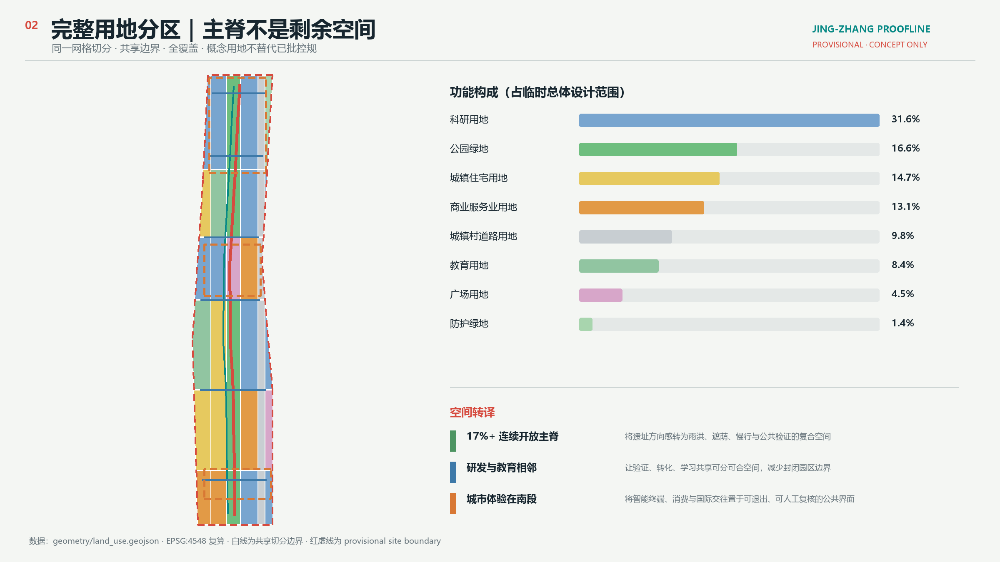
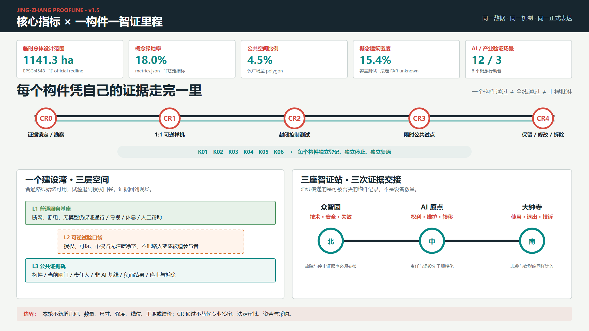

# 京张智证线：一条可验证、可共享、可进化的城市AI公共基础设施

> **边界状态：PROVISIONAL CONSTRAINT。** 本方案使用仓库维护者依据公开公告整理的临时粗略范围，只能用于概念生成、展示和投稿自检。它不是 official redline，不表达地块、权属、道路、文保或工程边界；取得清权 official polygons 后，全部图层、指标、图片、PDF 与 HTML 必须同步重算。[source:BOUNDARY-SOURCE] [data:geometry/site_boundary.geojson#SITE-001] [assumption:A-BOUNDARY-001] [self_check:BOUNDARY_TRUST]

“京张智证线 / Jing-Zhang Proofline”不是在城市里多放一批智能设备，而是把 AI 从后台能力变成公众可以看见、质疑、退出和共同改进的城市过程。百年京张铁路留下“轨迹—站点—里程”的空间秩序；本方案将其转译为“问题提出—公开测试—人工裁决—贡献记忆—复用转化”的公共智证回路。众智园负责全栈验证，AI 原点社区负责开放转化，大钟寺负责城市体验；中关村科技服务翼与小月河场景赋能翼分别提供专业要素和真实场景，最终形成一条以公共利益为判断标准、以人工最终负责为底线的创新带。[source:AGENT-TASKBOOK] [standard:PROJECT-AGENT-OPEN-CALL-TASKBOOK]

v1.5 又把“里程”从叙事推进为建设交付规则：一构件一智证里程。普通服务基座、可逆试验口袋和公共证据轨组成一个建设湾；K01—K06 每个构件只能凭自己的现场、问题和正负证据通过 CR0—CR4，再由三座智证站分别交接技术安全、权利维护与真实使用证据。它让“可实施”同时包含可停止、可拆除和可恢复，而不是设备越多越先进。

## 一页执行摘要 / Executive Brief

| 评审问题 | 京张智证线的回答 | 可核验成果 |
| --- | --- | --- |
| 核心命题 | 把 AI 从设备展示转为可质疑、可退出、可复盘的城市公共验证过程 | 一套六字段场景协议与十二张场景卡 |
| 空间响应 | 以“一线三站、双翼六接口、十二智证点”连接研发、转化、城市体验与日常公共服务 | 9 类 GeoJSON、5 张证据图、A3/A0 与离线页面 |
| 实施起点 | 先做协议、导视、问题门诊和低扰动试验段；交通扩展前补齐五类走廊基线 | 8 个行动包、3 段分期、概念责任、数据门与服务目标 |
| 公共价值 | 高风险场景必须人工最终负责，基本服务保留非数字路径，公众拥有退出、申诉和纠错入口 | 隐私与人工复核自检 [self_check:PRIVACY_HUMAN_REVIEW] |
| 证据状态 | 几何与指标可复算；行政尺度公开统计只校准问题，不能替代走廊实测 | 假设、自检、风险矩阵与完整可点击证据索引 |
| 决策边界 | 全部空间、品牌、活动、时限和角色安排均为概念建议，不是法定规划、政府安排或投资承诺 | 风险章节、停止条件与迭代记录 |

**English brief.** Jing-Zhang Proofline turns the historic railway logic of track, station and mile into civic AI infrastructure for public testing, human review, opt-out and reusable evidence. One public spine links three differentiated Proof Stations, two service wings, six cross-connections and twelve governed scenarios. District, national and citywide statistics calibrate priorities but do not establish corridor demand; mobility expansion requires five corridor-level baselines. Implementation begins with reversible protocols, wayfinding, service clinics and a low-impact pilot segment. This is a conceptual reference for further professional work, not an approved plan, delivery commitment or government endorsement.

## 设计依据与资料清单

### 1. 证据等级

本方案先判断“资料能支持什么”，再判断“空间可以怎么设计”。项目名称、三层范围文字、约面积、三处重点区名称与设计任务来自官方公告，可作为 formal 任务依据；智能体六项任务、场景数量、品牌与运营要求来自用户提供且已清权的任务书摘录；城市设计、控规边界和用地术语使用仓库保存的官方标准快照；精确空间边界尚未公开，因此几何只采用明确标注的 provisional constraint。[source:OFFICIAL-ANNOUNCEMENT] [source:AGENT-TASKBOOK] [source:URBAN-DESIGN-MEASURES] [source:CONTROL-DETAILED-PLANNING] [source:LAND-USE-CLASSIFICATION]

`data/source_registry.json` 是资料分级的主控表，`data/processed/agent_fact_pack.md` 只是阅读导航，不产生新的权威事实。方案没有使用商业地图瓦片、新闻截图、OSM 推断红线、未获公开授权的规划图、企业未授权材料或个人数据。[source:SOURCE-REGISTRY] [source:PROCESSED-FACT-PACK]

| 证据类别 | 本方案采用方式 | 可以支持 | 不能支持 |
| --- | --- | --- | --- |
| 官方任务依据 | 公告、标准本地快照 | 任务、范围文字、约面积、成果深度、专业原则 | 精确 polygon、控规指标、工程条件 |
| 清权任务依据 | 智能体任务书摘录 | 品牌、案例、场景、地标、文化、运营任务 | 法定规划、政府行动或投资承诺 |
| 临时空间依据 | 仓库 provisional boundaries | 生成、拓扑自检、相对关系、离线可视化 | official redline、地块权属、精确面积、审批依据 |
| 智能体设计数据 | 本包 GeoJSON / metrics | 概念分区、容量测试、网络、场景节点、分期 | 现状测绘、工程线位、已确定拆改留 |
| 行政尺度公开统计 | 海淀、全国及北京市年度公开材料 | 校准产业、转化、公共服务与绿色出行问题 | 走廊客流、站点 OD、设施容量、空间落位或项目绩效 |
| 背景案例 | 六个机构公开官网 | 机制对照与设计启发 | 海淀绩效类比、空间控制或实施保证 |

本包的权威顺序是 GeoJSON、metrics、三类矩阵、来源与假设、`proposal.md`，再到图片、PDF 和 HTML。每项 known 指标都包含公式、源文件、置信度与假设；法定容积率保持 unknown，不用概念容量代替官方控制。[standard:MOHURD-CONTROL-DETAILED-PLANNING] [depth:existing_conditions_diagnosis] [metric:site_area_sqm]

### 2. 数据基线与决策翻译

本轮只纳入能够追溯到官方公开页面或可信公开报告的观察值，并为每条数据标明统计尺度、设计动作与不可推导事项。以下数字均是 `background_only`，在 `sources.json` 中设置 `not_spatially_allocable=true`；它们不进入 `metrics.json`，也不改变任何 GeoJSON、面积、线位或分期。[source:HAIDIAN-2025-STATISTICAL-BULLETIN] [source:NBS-2025-STATISTICAL-COMMUNIQUE] [source:HAIDIAN-37-UNIVERSITIES-SERVICE-NEEDS] [source:BJTRC-2026-TRANSPORT-REPORT]

四组来源均在 2026-08-08 通过可见浏览器从发布机构原始页面复核；`sources.json` 记录采集方法、时空覆盖、原文定位、许可状态、单位换算、交叉核验与限制。公开页面和报告未发现明确开放数据许可，因此本包只摘录并归属事实数值，不复制原文或再分发附件；交通报告另记录 129 页 PDF 下载件的 SHA-256。比例统一从百分数除以 100，`3924 万人次` 转为 `39.24 million_person_trips`，`35.76 / 11.27 亿人次` 转为 `3.576 / 1.127 billion_person_trips`，展示文字仍保留中文原单位，避免无痕换算。

| 来源尺度 | 可核验发现 | 改变的设计动作 | 不能证明什么 |
| --- | --- | --- | --- |
| 海淀区，2025 | 92 家在区全国重点实验室、123 款备案上线大模型、每万人 599 件高价值发明专利；5.79 万项技术合同、成交额 4053.1 亿元 [source:HAIDIAN-2025-STATISTICAL-BULLETIN] | 将“泛孵化”收敛为标准验证、失败记录、知识产权、产品验证和成果转化五类可审计服务 | 这些资源位于京张走廊、愿意参与、形成多少客流或能带来多少绩效 |
| 全国，2025 | 每万人高价值发明专利 16 件、技术合同成交额 75734 亿元；按两份公报数值作行政尺度背景对照，海淀前者约为 37.4 倍，后者数值相当于全国总额约 5.35% [source:NBS-2025-STATISTICAL-COMMUNIQUE] | 把 Proofline 的价值判断从“数量再增长”转向验证质量、权责清晰、负面结果和复用率 | 两级统计在机构归属上完全可比，或比值可以作为走廊目标、排名与因果结论 |
| 海淀高校服务案例，2026 | 公开活动覆盖 37 所驻区高校；材料明确列出存量资产、实验室及特种设备安全、知识产权与成果转化等现实服务需求 [source:HAIDIAN-37-UNIVERSITIES-SERVICE-NEEDS] | AI 原点门诊设置资产合规、实验室安全、知识产权、成果与产品验证四个预约接口 | 37 所高校需求相同、已经合作，或能够据此确定校区空间和服务量 |
| 中心城区 / 北京市，2025 | 中心城区工作日出行 3924 万人次、绿色出行比例 76.5%；轨道、公交、自行车分别占 15.0%、8.9%、22.3% [source:BJTRC-2026-TRANSPORT-REPORT] | 保持步行、骑行、轨道转介优先，但只做分时、小规模、可停止试点；扩展前补齐走廊数据门 | 京张走廊、五道口、清华东路西口或大钟寺的客流、OD、拥堵和停车需求 |
| 海淀区，2025 | 1456 个医疗卫生机构，其中社区卫生服务中心（站）239 个 [source:HAIDIAN-2025-STATISTICAL-BULLETIN] | 场景 09 只做经核验的既有机构信息导航、人工转介和非数字兜底，不自建“AI 医疗”结论 | 走廊内设施分布、可达性、服务能力、号源或新增设施需求 |

骑手、网约车、快递和商业热力图可以补充装卸冲突、短停与夜间需求，但本轮未找到同时具备公开许可、聚合匿名、走廊覆盖、采样方法和偏差说明的数据，因此保持 unknown。后续资料只有在记录来源许可、时间窗口、空间聚合规则、样本覆盖、缺失与偏差、隐私抑制和保存期限后才能进入分析；个人轨迹、精确住址、订单明细和未获公开许可或明确授权的原始平台资料不得进入投稿。缺少这类平台数据不会阻止基础公共服务，也不能用全市热力替代现场观察。

### 3. 生成与复核方法

临时边界统一使用 EPSG:4326 交换，在 EPSG:4548 中复算面积与长度。用地由同一组切分线与 site polygon 相交生成，保证完整覆盖、无缝、无重叠；绿地、公共空间、概念建筑、道路、场景节点和分期都从同一边界与用地分区派生。五张图、离线页面和 PDF 只解释结构化数据，不反向产生指标。[data:geometry/land_use.geojson#LU-001] [depth:metrics_recalculation] [self_check:METRIC_RECALCULATION]

当前缺少官方三层范围 polygon、重点区 polygon、控规、道路红线、权属、现状建筑、文保、河道、市政和公共服务设施底数。它们分别登记在 `assumptions.json` 与 `geometry/constraints.geojson` 的 metadata 中；设计采用“能复算的明确复算、不能确认的保持未知、需要深化的设置证据门”三类处理，不以视觉精细度制造确定感。[data:geometry/constraints.geojson] [standard:MOHURD-ARCH-DESIGN-DEPTH-2016]

## 三层范围工作框架

官方公告将任务分成统筹研究、总体设计和重点区域三个层次。本方案用同一“公共智证”逻辑贯穿三层，但每层只回答与其资料和深度相匹配的问题。[source:OFFICIAL-ANNOUNCEMENT] [standard:PROJECT-OFFICIAL-ANNOUNCEMENT]

| 层级 | 官方约规模与任务 | 京张智证线的回答 | 成果与证据 |
| --- | --- | --- | --- |
| 统筹研究范围 | 约 43.6 km²；产业生态、三区两翼、未来城市形态 | 六个全球机制对照；五类智证闭环；要素与场景双翼；年度运营体系 | 案例表、生态图谱、品牌系统、合规矩阵 |
| 总体设计范围 | 约 11.4 km²；城市更新、用地、交通、市政、活力带、风貌 | 一条公共验证主脊、六个横向接口、完整概念用地分区、十二个场景节点、八个行动包 | 九类 GeoJSON、metrics、A3/A0、离线 HTML |
| 重点区域范围 | 公告约 368.4 ha；三处精细化设计 | 众智园“全栈验证站”、AI 原点“开放转化站”、大钟寺“城市体验站” | 三个临时重点区小方案、数据门与停止条件 |

统筹层提出“为什么”和“由谁持续运营”，总体设计层回答“空间系统如何支撑”，重点区层检验“不同位置如何形成差异”。三层之间以五个闭环传导：全栈自主创新对应公开测试，世界级创新生态对应复用转化，AI+ 场景对应真实问题，智能化活力城市对应可进入的日常空间，AI 治理话语权对应人工裁决与贡献记忆。[source:AGENT-TASKBOOK] [depth:three_level_scope_framework]

总体空间结构概括为“**一线三站、双翼六接口、十二智证点**”：一线是京张公共验证主脊；三站是三个重点区；双翼是中关村科技服务翼与小月河场景赋能翼；六接口是把公园与两侧社区、园区、轨道接驳的横向缝合；十二智证点把技术测试、公共服务、文化贡献和城市体验分散到日常路径。这里的线、站、翼与接口均为概念关系，不是新增行政范围或工程红线。[data:geometry/roads.geojson#ROAD-001] [depth:overall_spatial_structure]

替换 official polygons 时遵循“先约束、后设计、再指标”的顺序：先替换 site 与 key areas，再重新切分 land use，继而派生 buildings、roads、green/public space 与 phasing，最后重算 metrics、重绘五图、重排 PDF 与 HTML。禁止只改边界外观而保留旧面积或旧节点位置。[source:KEY-AREA-SOURCE] [metric:key_area_count]

## 统筹研究范围产业与未来城市研究

### 1. 品牌：从“智能展示”转向“公共智证”

中文主名称“京张智证线”保留京张的地域记忆，“智证”同时指验证证据与公共见证，“线”对应历史铁路、创新链和公众体验路径。英文名 `Jing-Zhang Proofline` 采用 `proof` 而非 `smart`，把可验证性置于技术炫技之前。命名层级为：Proofline（全带）— Proof Station（三处重点区）— Proof Mile（分布式贡献节点）— Proof Protocol（场景治理规则）。这套层级可覆盖空间、活动、导视与数字档案，但所有名称仍是概念建议。[source:AGENT-TASKBOOK] [standard:PROJECT-AGENT-OPEN-CALL-TASKBOOK]

Logo 方向由“两条平行轨道 + 三个校验节点 + 一组开放括号”构成：轨道代表百年延续，节点代表三个重点区，开放括号表示任何结论都可以被补充和复核。视觉系统不用企业商标或现成园区符号，使用矿物灰、铁路信号红、公共服务青、生态绿四类颜色；导视与整体 Logo 分开，导视负责方向与风险，Logo 负责识别。字体仅使用系统字体栅格化输出，不随包分发。[depth:height_massing_character]

概念视觉规范以标志节点直径 `x` 为基准：标志四周至少保留 `1x` 净空；横向中英组合最小建议宽度为 36 mm，数字界面符号最小建议宽度为 24 px；浅色背景使用矿物灰字组，深色背景使用白色单色版。铁路信号红 `#C7463B` 只标记风险、停止与验证状态，公共服务青 `#167C80` 标记可进入服务，生态绿 `#4E7A55` 标记蓝绿系统，三者不作渐变或发光效果。不得拉伸、旋转、添加企业冠名、替换节点数量或把概念标志误作政府机构标识。中英文标准组合用于国际传播，`Proof Station / Proof Mile / Proof Protocol` 可作为下级命名；具体商标检索、字体授权、无障碍对比度和应用物料仍须由品牌与法律专业团队深化。[source:AGENT-TASKBOOK]

### 2. 六个全球案例，只取机制、不搬数字

案例均来自机构公开官网，只作为 background-only 机制对照。方案不引用其投资额、企业数量、产值或未经核实绩效，也不把外地治理条件直接套入海淀。[source:SOURCE-REGISTRY]

| 案例 | 可核对的机构属性 | 可转化机制 | 京张过滤条件 |
| --- | --- | --- | --- |
| 新加坡 one-north | JTC 提供创新片区与产业空间信息 [source:CASE-ONE-NORTH] | 以片区运营者协调空间供给、产业服务与公共环境 | 不移植用地强度；转化为跨重点区的空间产品目录 |
| 多伦多 MaRS | 城市创新枢纽，为初创企业提供多领域支持 [source:CASE-MARS] | 中介平台把科研、企业、专业服务和城市问题连接起来 | 不复制机构模式；转化为“成果转化门诊” |
| Kendall Square | 由片区协会组织社区协作 [source:CASE-KENDALL] | 用常设社区组织维护创新区的公共议题和活动 | 不假定企业参与；采用开放章程与年度公开复盘 |
| Cornell Tech | 高校技术校区与应用创新空间 [source:CASE-CORNELL-TECH] | 教研、创业和公共空间在同一日常环境中相遇 | 不越过校园权属；转化为近校界面的可预约协作节点 |
| 巴黎 STATION F | 集中式创业校园 [source:CASE-STATION-F] | 将分散服务做成清晰的一站式路径与社区入口 | 不追求单体规模；转化为分布式“首发厅 + 转化门诊” |
| 柏林 Adlershof / WISTA | 运营科技园与孵化器的专业机构 [source:CASE-ADLERSHOF] | 开发、孵化、服务和持续运营由明确主体衔接 | 不预设政府或企业主体；先定义角色、数据和退出责任 |

六案共同指向四个可转化原则：第一，空间之外必须有稳定运营者；第二，科研成果需要可理解的服务入口；第三，公共空间不是景观余量，而是跨组织合作的低门槛界面；第四，创新区需要持续评估和退出，而不是一次建成。京张智证线把这四点编码为“公开问题库、场景许可、人工复核、贡献档案和阶段评估”。

### 3. AI 创新生态图谱

生态图谱以“问题”而非“机构名单”为起点。海淀行政统计显示创新供给与技术交易已经高度集聚，因此 Proofline 不把增加展示数量作为首要目标，而补上标准验证、失败记录、知识产权、产品验证与公共问题转译的接口。[source:HAIDIAN-2025-STATISTICAL-BULLETIN] 居民、开发者、企业、高校和专业团队提出公共或产业问题；中关村科技服务翼提供法务、知识产权、资本、人才、标准与国际传播转介；众智园提供模型安全、端侧算力与标准沙盒；AI 原点社区提供开源首发、近校转化和人才服务；小月河翼与京张主脊提供真实场景；大钟寺把成熟度足够且可退出的产品带到城市体验与国际交流。每次验证都产出公开协议、人工裁决、负面结果和可复用组件，而不是只形成宣传案例。[depth:overall_spatial_structure]

区域协同不以未经核实的企业清单表示，而以“可交换的验证成果”作为接口。下表中的节点角色、合作方式和产出均为建议研究方向，不声称已有合作、资源或政策安排。[source:AGENT-TASKBOOK] [assumption:A-OPERATIONS-001]

| 协同节点 | 建议对接能力 | Proofline 接口 | 可回流的公共成果 | 进入条件 |
| --- | --- | --- | --- | --- |
| 北纬社区 | 开发者社群、内容共创与日常体验议题 | 开放问题库、城市记忆贡献站、Proofline Week 社群单元 | 经授权的需求清单、体验反馈与开源内容版本 | 社群授权、版权核验、匿名或聚合反馈 |
| 未来科学城 | 基础研究成果与工程验证需求 | 众智园模型安全、端侧算力和标准沙盒的远程评测接口 | 可复用测试协议、失败记录与转化问题清单 | 成果权属、数据分级、测试责任主体明确 |
| 怀柔科学城 | 科学设施相关的算法、仪器与交叉研究议题 | AI 原点社区开放首发与专业转介接口 | 面向公众可理解的成果说明、复现实验目录与人才交流议题 | 不触及非公开科研资料，公开范围逐项确认 |
| 经开区 | 智能终端、机器人与规模化工程反馈 | 大钟寺城市体验站与机器人路权沙盒的“验证—工程反馈”接口 | 城市使用问题、人工接管记录与产品改进证据 | 产品安全、消费者权益、路权和采购边界确认 |
| 京津冀 | 跨城市应用环境与治理经验 | 统一的 Proof Protocol、验证记录字段和远程复核格式 | 可比较的正负结果、互认研究样本与跨城问题库 | 由相关主体另行协商规则，不自动互认或复制部署 |

协同价值不以签约数或曝光量衡量，而看协议能否复用、负面结果是否公开、需求是否得到回应以及本地基本服务是否改善。算力、数据、资金、招商和政策均不写成确定承诺；任何跨区试点都须由相应主管主体、权利主体和专业团队另行确认。

## 总体设计范围城市更新与控规深度城市设计

### 1. 空间判断

总体设计不是把 AI 功能均匀铺满 11.4 km²，而是形成“连续公共主脊 + 差异化创新站 + 可替换功能网格”。主脊优先承担步行、骑行、遮荫、雨洪、文化解释、贡献展示和公共服务；研发、教育、居住、商业和开放空间沿主脊形成互补序列；概念道路用地提供基本横向组织；建筑原型以共享首层、可分可合研发空间和保留改造优先为原则。[data:geometry/land_use.geojson#LU-001] [standard:MNR-LAND-USE-CLASSIFICATION-GUIDE]

用地代码采用自然资源部分类子集，只表达概念容量和功能关系。科研用地约占临时边界 31.6%，公园绿地约 16.6%，城镇住宅约 14.7%，商业服务约 13.1%，概念道路约 9.8%，教育约 8.4%，广场约 4.5%，防护绿地约 1.4%。这些比例由提交几何复算，不是控规指标；取得正式控规后必须逐项比对、重构和说明差异。[metric:land_use_0802_sqm] [metric:land_use_1401_sqm] [metric:land_use_0701_sqm] [metric:land_use_05_sqm]

### 2. 更新方法：先调查、后分类、再行动

由于没有清权现状建筑和权属底数，本方案不对具体建筑作拆除、保留或新建判断。城市更新采用四道门：A 门核对权属、用途、建成年代、结构和消防；B 门识别历史文化、社区服务、可负担空间和成熟树木等公共价值；C 门比较保留、修缮、适应性改造、局部替换的全生命周期影响；D 门经公众参与和法定程序形成结论。只有通过四门，具体地块才可进入专业拆改留分类。[data:geometry/buildings.geojson#BLDG-001] [depth:retain_renovate_demolish]

`buildings.geojson` 中的 24 个左右体量是概念容量原型，不是现状建筑。它们用于检验共享首层、研发院落、人才居住、教育协作和社区服务能否与开放空间共存。概念建筑基底约 175.4 ha、密度约 15.4%，概念计容式楼面面积约 859.4 ha、容量比约 0.75；以上均以 low confidence 标记，法定 `floor_area_ratio` 保持 unknown。[metric:building_footprint_area_sqm] [metric:building_density] [metric:concept_floor_area_sqm] [metric:concept_floor_area_ratio]

### 3. 控规深度的表达方式

达到控规城市设计深度，不等于由智能体编造控规数值。本包完整表达用地、空间结构、建筑体量方法、交通慢行、市政接口、公共空间、风貌、更新项目、分期、指标与风险，并通过 `standard_matrix.json` 和 `design_depth_matrix.json` 建立证据链；容积率、高度、密度控制、绿地率控制、退线、四线、设施容量和道路红线全部列为待确认。[standard:MOHURD-CONTROL-DETAILED-PLANNING] [depth:development_intensity_controls] [assumption:A-CONTROLS-001]

公共界面采取“首层可见、技术可关、空间可逆”三条控制建议：研发与服务空间面向主脊设置可预约共享界面；信息屏、传感器和机器人测试不占据连续无障碍通道；轻量构件优先可拆卸、可维修和重复使用。高度、屋顶和体量只给出相邻关系、天际线连续性和遗产界面退让的设计原则，具体数值等待官方控制与视线分析。[standard:MOHURD-URBAN-DESIGN-MEASURES]

## 重点区域详细设计

三处重点区的公告约面积分别为众智园 192.1 ha、AI 原点社区 104.3 ha、大钟寺 72.0 ha；本包中的矩形 polygon 只是维护者依据名称、南北顺序和约面积整理的粗略替代，不能用于地块、权属、拆改留或精确面积判断。[source:KEY-AREA-SOURCE] [data:geometry/key_areas.geojson#PROV-KEY-001] [self_check:KEY_AREAS_TRUST]

### 1. 众智园：全栈验证站 / Safety Proof Garden

**定位。** 把“全栈自主”从封闭研发链转译为可审计的验证链：模型、端侧设备、能耗、标准和安全治理分别有测试环境、人工责任人与公开结果。空间采用“研发院落—验证共享庭—清河生态界面”三级关系，研发空间可控，验证过程可预约，面向公众的解释与贡献展示保持低门槛。

**空间与建筑。** 概念主脊穿过片区公共界面，东西向接口连接园区与外围交通；研发建筑原型采用可分可合层、共享中试层和首层公共验证廊。拆改留只提出“结构调查后保留改造优先”，不指定任何现状建筑。清河方向设置生态缓冲与低扰动观察节点，任何亲水、跨越或设备布置都必须等待河道、文保、防洪和生态资料。

**场景与运营。** 场景 01“模型安全公开验证场”提供红队测试、争议裁决和结果版本记录；场景 02“端侧算力碳账本”仅记录设备级聚合能耗；场景 03“机器人共融路权沙盒”实行低速、分时、物理隔离和现场接管。三项均为产业测试验证场景，不代表可以直接部署。[metric:industry_test_scenario_count]

**证据门。** 进入深化前必须取得文保、河道蓝线、道路、权属、能源和消防资料；任何“国家级”“标准制定”相关表达只对应公告任务方向，不构成机构设立或政策承诺。[data:geometry/key_areas.geojson#PROV-KEY-001]

### 2. AI 原点社区：开放转化站 / Open Transfer Station

**定位。** 不把高校成果转化理解为单向招商，而是建立“开放首发—专业门诊—小规模验证—授权转化—人才生活”的近校循环。海淀 37 所驻区高校服务案例明确暴露了存量资产、实验室及特种设备安全、知识产权与成果转化等现实接口，因此门诊从泛咨询细化为“资产合规、实验室安全、知识产权、成果与产品验证”四条预约路径。[source:HAIDIAN-37-UNIVERSITIES-SERVICE-NEEDS] 主脊在此形成贡献谱系节点，展示开源项目、公共问题、失败经验和授权边界。

**空间与建筑。** “近校协作街”作为概念公共界面连接校区、园区和社区，首层提供开放首发厅、四类门诊预约台、可隔离的产品验证位、夜间学习和人才生活服务；不同接口共享受理前台，但材料、责任人和档案权限分开。上部空间的用途与容量等待控规和建筑调查。慢行强调连续、清晰、可替代，不能擅自跨越校园或权属边界；轨道接驳只提出步行转介与信息连续性，不作站体工程判断。

**场景与运营。** 场景 04“开源首发厅”记录贡献授权和撤回；场景 05“成果转化门诊”先判断资产与成果权属、实验室安全、知识产权、产品成熟度和拟验证场景，再由相应专业人员分流，AI 只整理问题而不出具法律、安全或投资结论；场景 08“AI 教育可信体验”不对未成年人画像并保持教师在环。年度开发者驻留优先解决公共问题，成果进入贡献档案后才可转向企业服务。

**证据门。** 校区边界、建筑现状、权属、轨道接口、居住与公共服务设施底数必须先补齐；四类预约接口还需分别明确有资质的人工责任人、材料最小化、授权与保密边界、转介目录、冲突回避和记录保存期限。缺任一项只开放普通信息导航，不进入专业判断或产品测试；“人才社区”不等于指定住宅项目或已确定配套。[data:geometry/key_areas.geojson#PROV-KEY-002]

### 3. 大钟寺：城市体验站 / City Experience Station

**定位。** 把智能体、智能终端和内容消费的城市体验放在可退出、可申诉、有人负责的公共界面中，避免“先采集、后解释”。空间组织为“站城转介前场—可退出体验街—国际路演与专业服务客厅—社区日常服务”，让产业展示与居民使用共享同一套伦理和安全规则。

**空间与建筑。** 以四象限慢行缝合作为设计问题，而非工程结论：先核查道路红线、信号、站口、无障碍、市政管线和人流，再由交通专业团队比较平面过街、既有设施优化或其他方案。商业建筑原型强调小单元、可更换界面、物流与人流分离、无设备替代路径；不对具体企业建筑作改造判断。

**场景与运营。** 场景 11“可退出智能终端体验街”默认匿名、清晰告知、随时退出；场景 09“健康服务导航”只做机构转介，不进行诊断；场景 10“法律服务转介台”只提供信息导航，专业人员最终复核。国际路演不以曝光量为目标，而以问题匹配、验证记录和后续转化路径衡量。

**证据门。** 道路、轨道、市政、商业运营、消防和权属资料齐备后方可深化；站城连通、静态交通和地下空间均不得由本方案直接下工程结论。[data:geometry/key_areas.geojson#PROV-KEY-003] [depth:three_key_area_detailed_design]

## AI 创新生态、人才画像与 AI+ 场景

### 1. 六类用户画像

用户画像只用于识别需求，不由个人轨迹或隐私数据生成。每类画像都同时列出“想完成什么”“空间需要什么”和“不能做什么”，避免把人才吸引简化为装修风格。[source:AGENT-TASKBOOK]

| 用户 | 核心任务 | 空间与服务 | 数据与公平边界 |
| --- | --- | --- | --- |
| 开源开发者 | 发布、协作、测试、获得可持续贡献记录 | 首发厅、夜间协作位、模型谱系廊、专业门诊 | 不用行为轨迹排名；贡献可更正、可撤回 |
| 初创与小团队 | 低成本试验、算力入口、合规咨询、找到首个场景 | 可分研发空间、验证沙盒、端侧算力驿站、场景许可 | 不承诺资金、订单或算力；失败不影响下一次申请 |
| 企业产品与访客 | 安全测试、路演、人才交流、城市体验 | 众智园验证、大钟寺路演、轨道转介、公共会客 | 企业案例与标识必须授权；不以品牌换取公共空间优先权 |
| 居民、老人、照护者 | 通勤、休闲、求助、获得不依赖智能设备的服务 | 连续树荫、无障碍休息、人工窗口、社区转介 | 默认无技术路径；不做商业推荐画像 |
| 高校师生与研究人员 | 跨校协作、成果授权、公共问题研究 | 近校协作街、首发厅、短期工作位、开放课程 | 校园数据和科研成果需授权；未成年人不画像 |
| 运营者与专业人员 | 审核场景、处置风险、维护设施、回应申诉 | 现场责任台、审核室、停止开关、版本档案 | 决策日志可审计；AI 不替代规划、医疗、法律与安全责任 |

### 2. 场景共同协议

所有场景均使用六字段协议：服务对象、最小必要数据、空间边界、人工复核者、退出/申诉方式、评估与停止条件。任何场景不得默认全域采集，不得把未成熟技术写成全面可用，不得将供应商锁定为必要条件。场景点位以 `SCENARIO_NODE` 写入 `public_space.geojson`，共 12 个，其中 3 个为产业测试验证场景。[data:geometry/public_space.geojson#SCN-01] [metric:scenario_node_count]

### 3. 十二张场景卡

| 卡片 | 类型与空间 | 服务对象 / 最小数据 | 人工复核、退出与运营 |
| --- | --- | --- | --- |
| 01 模型安全公开验证场 | **产业测试**；众智园验证庭 | 开发团队与治理研究者；测试样本、模型版本、风险标签 | 评测负责人裁决；争议可申诉，失败版本保留原因；季度开放验证 |
| 02 端侧算力碳账本 | **产业测试**；众智园算力驿站 | 设备研发者与运营者；设备级聚合能耗，不关联个人 | 能源专业人员核对；未达阈值停止展示；月度复盘 |
| 03 机器人共融路权沙盒 | **产业测试**；小月河翼 / 主脊试验段 | 机器人团队、行人和骑行者；只记录事件与匿名流量 | 现场安全员随时接管；低速、分时、隔离；投诉触发暂停 |
| 04 开源首发厅 | 创新；AI 原点社区 | 开发者、高校与公众；授权代码、说明、贡献人自愿署名 | 内容审核与权利人撤回；社区委员会月度首发 |
| 05 成果转化门诊 | 企业服务；AI 原点社区 | 团队与专业机构；按资产合规、实验室安全、IP、成果与产品验证分流，只收最小必要材料 | 对应专业人员最终意见；材料分权、可撤回，不作审批或投资承诺 |
| 06 无障碍慢行伴行 | 公共服务；京张主脊 | 视障、行动不便者和访客；端侧障碍识别即时删除 | 人工求助兜底；可关闭智能功能；运营者每日巡检 |
| 07 公共空间维护共审 | 公共治理；主脊节点 | 居民与维护团队；公开工单、聚合位置和处理状态 | 人工派单、居民纠错和超时升级；不采集个人轨迹 |
| 08 AI 教育可信体验 | 教育；近校界面 | 学生、教师和家庭；课程选择与匿名反馈 | 教师在环；未成年人不画像；内容争议可下架 |
| 09 健康服务导航 | 健康；社区服务点 | 居民与访客；用户主动输入的服务需求 | 只转介机构，不诊断、不留病历；人工窗口可替代 |
| 10 法律服务转介台 | 法律；社区服务点 | 居民与初创团队；用户主动描述的问题类型 | 律师或法律服务人员复核；模型答案不作为法律意见 |
| 11 可退出智能终端体验街 | 城市体验；大钟寺 | 消费者、企业与研究者；匿名体验反馈 | 清晰告知、随时退出、人工投诉台；产品按周期轮换 |
| 12 城市记忆贡献站 | 文化；京张主脊 | 居民、铁路记忆贡献者、开发者；授权文本与图像元数据 | 出处标注、争议下架、权利人撤回；不生成虚构历史 |

场景—空间—运营的共同判断是：先证明公共问题存在，再用最小规模试验验证；通过人工评审后才扩大；出现隐私、安全、公平或公共空间冲突时可以立即停止。`self_check.json` 的 `PRIVACY_HUMAN_REVIEW` 检查对应这一边界。[depth:risk_missing_data] [self_check:PRIVACY_HUMAN_REVIEW]

## 用地、建筑规模与拆改留方案

### 1. 完整用地分区

用地由 6×6 概念网格与临时 site polygon 相交形成，实际输出 30 余个有效多边形，全部共享边界坐标。科研、商业、住宅、教育、道路、公园、防护绿地与广场总和等于 site area；任何空白都不以“待定”逃避分类。结构化用地是可替换的测试模型，不是对现状或法定用途的判断。[data:geometry/land_use.geojson#LU-001] [depth:land_use_layout] [self_check:LAND_USE_TOPOLOGY]

复算面积分别为：科研约 360.31 ha、商业服务约 149.49 ha、住宅约 168.08 ha、教育约 95.30 ha、概念道路约 111.34 ha、公园绿地约 189.28 ha、防护绿地约 15.69 ha、广场约 51.79 ha。其证据标签为 [metric:land_use_0804_sqm]、[metric:land_use_1207_sqm]、[metric:land_use_1402_sqm]、[metric:land_use_1403_sqm]；所有数字均受临时边界影响。

### 2. 建筑原型与规模边界

概念建筑分为五类：可分可合研发院落、首层开放的复合服务基座、共享配套嵌入的人才居住原型、社区服务与人工复核节点、近校协作与终身学习空间。原型只检验不同功能在主脊两侧的空间关系和概念承载，不代表具体层数、高度、结构、产权或建设量。[data:geometry/buildings.geojson#BLDG-001]

体量与风貌采用相对控制：主脊界面形成连续但不过度封闭的街墙；重点节点留出公共前场；遗产与蓝绿界面保持低尺度、可退让、视线连续；大体量通过院落、通廊和首层公共界面分解。屋顶优先设备整合、雨水管理和可维护性，不以造型奇观作为 AI 表达。[depth:height_massing_character]

### 3. 拆改留决策树

具体建筑进入深化后依次判断：是否具有历史、社会或公共服务价值；结构、消防和能源改造是否可行；保留改造与替换的全生命周期成本如何；现有使用者如何安置并参与；是否符合控规和权属。结果才可进入“保留修缮、功能改造、局部替换、依法更新”四类。当前包不在图上标注拆除对象，避免把缺资料伪装为果断设计。[standard:MOHURD-ARCH-DESIGN-DEPTH-2016] [assumption:A-BUILDINGS-001]

## 交通、轨道、市政与公共服务设施

### 1. 步行优先的两纵六横

`ROAD-001` 是沿京张方向的公共验证主脊，概念长度约 9.33 km；伴行骑行线、六个横向接口和轨道转介线合计约 24.41 km。数值只反映提交几何，不是道路工程里程。[data:geometry/roads.geojson#ROAD-001] [metric:proofline_length_m] [metric:slow_mobility_length_m]

六个横向接口分别服务北端生态与对外联系、众智园、近校协作、AI 原点社区、南段社区服务和大钟寺站城联系。接口不是统一造桥，而是问题清单：缺口在哪里、普通平面路径能否优化、无障碍是否连续、骑行与步行是否冲突、是否需要分时管理。任何跨越五环、轨道或干路的方案，均等待道路红线、交通量、结构、市政、消防和文保资料后比较。[depth:traffic_rail_slow_parking] [assumption:A-TRANSPORT-001]

轨道站点采取“信息与步行连续优先”：五道口、清华东路西口和大钟寺等公告涉及节点只研究出口到公共主脊的转介、导视、无障碍、非机动车停放和首层功能关系，不擅自改变站体、线路或出入口。停车策略以需求管理、共享和分时为研究方向，具体泊位数保持未知。

### 2. 交通试点数据门

北京交通年报说明绿色出行在中心城区具有重要背景，但全市与中心城区统计不能下推到京张走廊。P02 主脊试验段、P05 大钟寺体验街、P06 六接口修补和场景 03 机器人路权沙盒，在前五类走廊基线全部形成前不得扩大；每份数据都需记录日期、时段、天气与活动、采样方法、覆盖范围、缺失和偏差。[source:BJTRC-2026-TRANSPORT-REPORT] [assumption:A-TRANSPORT-001]

| 必需基线 | 最小观察内容 | 改变的决策 | 未满足时 |
| --- | --- | --- | --- |
| 站口与断面计数 | 15 分钟粒度的步行、骑行及必要机动车分类计数，覆盖工作日与休息日并标注异常事件 | 判断试点时段、界面容量和是否需要分流 | 不扩展点位或占用通行空间 |
| 换乘 OD 与路径 | 公开许可的聚合 OD、匿名拦访或人工路径观察，并披露拒访和样本偏差 | 判断轨道转介、导视和横向接口优先级 | 不声称某站或某方向需求更高 |
| 非机动车停车 | 分时占用、周转、溢出、装卸与无障碍通道冲突 | 判断停车整理、分时装卸和可拆设施 | 不增加固定设施或减少普通通行空间 |
| 无障碍连续性 | 从站口到主脊的坡度、台阶、净宽、过街、休息与人工求助链，由代表性使用者参与复核 | 判断先修补哪一处、智能功能是否有非技术替代 | 任一严重断点未处理则不开启伴行场景 |
| 投诉、冲突与事件 | 公开工单、现场冲突、近失事件和人工接管记录的分类基线 | 设置停止条件并比较试点前后变化 | 没有基线就不宣称改善 |

骑手、网约车、快递或商业热力图仅作可选补充：只接受公开许可或经明确授权、聚合匿名且说明平台覆盖与抽样偏差的数据，用于识别短停、装卸和时段冲突，不用于个人画像、执法或排除特定职业群体。平台数据缺失时以现场观察和利益相关者访谈补足问题定义，不能以推测热力代替实测，也不能因此拒绝任何人的基础服务。

### 3. 市政与 AI 新基建接口

新型基础设施不单独做设备走廊，而嵌入传统市政的容量与安全审查：端侧算力驿站需要电力、散热、噪声、碳核算和信息安全接口；场景节点需要网络分级、断网降级和人工接管；雨洪花园需要管网、土壤、地下空间和运维接口；机器人测试需要路权、充电、消防和停止开关。缺少容量数据时只画系统关系，不输出负荷和管线迁改。[data:geometry/constraints.geojson] [depth:municipal_new_infrastructure] [assumption:A-MUNICIPAL-001]

### 4. 公共服务设施

服务采用“基础公共服务不依赖 AI、专业服务由 AI 辅助转介”的双层结构。人工窗口、普通导视、无障碍卫生间、休息点、饮水和应急求助是底层；法务、知识产权、成果转化、健康与法律导航、教育体验和企业服务是可选增强层。海淀行政统计中的 1456 个医疗卫生机构和 239 个社区卫生服务中心（站）只说明既有服务网络规模，场景 09 必须核验公开机构目录、服务时间与转介规则后再提供导航，不诊断、不保留病历、不推断走廊内服务能力。[source:HAIDIAN-2025-STATISTICAL-BULLETIN] 设施位置和服务半径需在官方底数补齐后由相应专业团队复核，不以场景节点替代学校、医疗、养老等法定设施。

## 蓝绿空间、公共空间与城市风貌

### 1. 京张公共验证主脊

概念绿地约 204.97 ha、绿地率约 17.96%；广场型公共空间约 51.79 ha、比例约 4.54%。绿地由公园绿地和北端防护绿地派生，公共空间由概念广场派生；两者分别承担生态连续与高强度公共活动，不重复计算。[data:geometry/green_space.geojson#GREEN-001] [data:geometry/public_space.geojson#PUBLIC-001] [metric:green_space_area_sqm] [metric:green_ratio] [metric:public_space_area_sqm] [metric:public_space_ratio]

主脊断面不是固定模板，而是六类组件的组合：保留铁路材料的记忆带、连续无障碍通道、可分流骑行带、雨水与树荫带、可关闭的信息界面、人工服务与应急点。机器人或智能终端不得占据无障碍净宽；夜间界面保持低亮度；设备更新不应造成大规模土建反复。[standard:MOHURD-URBAN-DESIGN-MEASURES] [depth:blue_green_public_space]

### 2. 三个 AI 朝圣与荣誉节点

1. **贡献里程碑 / Proof Mile**：沿主脊分布的实体与数字双重里程标，只记录经授权、可追溯的公共贡献、规则版本和修复记录，不按商业影响力排序。
2. **模型谱系廊 / Model Lineage Gallery**：设于 AI 原点社区，展示开源模型、工具、数据治理与社区协作的谱系，同时保留撤回、争议和来源标记。
3. **未竟试验馆 / Museum of Unfinished Tests**：设于大钟寺城市体验站，公开呈现失败、暂停和被否决的场景以及原因，让“停止一个不合适的技术”也成为值得记录的城市贡献。

三者都是概念建议，不预设建筑新建。它们可以先以展陈、导视、活动和数字档案试运行，再根据文保、权属、消防、客流和运营评估决定是否形成永久空间。荣誉展示坚持贡献可更正、可撤回、来源可核验，避免个人崇拜和企业冠名占据公共空间。[source:AGENT-TASKBOOK]

### 3. 文化叙事与导视

文化叙事由三条时间线交织：京张铁路代表工程、连接与百年城市变迁；中关村代表开放试验、知识转化与持续创业；AI 新文化强调可验证、可解释、有人负责。导视语法使用里程、分岔、站点和校验章，但不把铁路历史简化为装饰纹样。历史事实与图像需经来源核验和授权，清华园车站等具体保护对象需等待官方文保图层后定位。[depth:risk_missing_data] [assumption:A-HERITAGE-001]

城市风貌保持克制、可维护和人本：材料优先砖、钢、石、木与可修复构件；AI 界面以小尺度、低亮度、可关闭为原则；色彩使用信号红标记风险与验证，青色标记公共服务，绿色标记生态，不用大面积赛博霓虹或巨屏制造“未来感”。AI 生成的公共空间图只作体验示意，不是现状或规划证据。[source:IMAGEGEN-CONCEPT]

## 更新项目清单、实施政策与分期计划

### 1. 八个行动包

| 编号 | 概念行动包 | 主要交付 | 前置证据与停止条件 |
| --- | --- | --- | --- |
| P01 | 公共智证协议与导视 | 场景六字段协议、风险标识、退出/申诉模板、贡献版本规则 | 法律、伦理、无障碍和公众评审不通过则不启用 |
| P02 | 京张主脊轻量试验段 | 树荫休息、普通导视、人工服务、可拆信息界面 | 文保、权属、绿地、消防或五类交通基线未齐则调整、限时或停止 |
| P03 | 众智园安全验证园 | 三项产业测试场景、标准沙盒、清河生态界面研究 | 能源、河道、交通、数据安全与人工停止责任未确认则不扩大 |
| P04 | AI 原点成果转化门诊 | 四类预约接口、开源首发、贡献谱系与专业转介 | 权属、安全、授权、责任人或材料治理不清则只做普通信息导航 |
| P05 | 大钟寺可退出体验街 | 终端轮换体验、人工投诉、国际路演与转介 | 五类交通基线、消防、消费者权益或隐私条件不满足则暂停 |
| P06 | 六接口无障碍修补 | 缺口审计、临时改善、专业方案比选 | 连续路径审计或代表性使用者复核未通过则保持现状并公示缺口 |
| P07 | 三个贡献与荣誉节点 | 贡献里程碑、模型谱系廊、未竟试验馆 | 来源、版权或争议处理机制不完备则不永久展示 |
| P08 | Proofline 年度运营 | 开放验证、驻留、公众路线、年度复盘与转化 | 主体、预算、许可和安全未确认则缩小或取消 |

行动包数量为 8，写入指标但不代表政府项目立项。[metric:renewal_project_count] [depth:renewal_project_list]

#### 概念责任、公共价值 KPI 与服务目标

为避免“有项目、无责任人”，行动包采用概念 RACI：`A` 是未来经授权且对结果负责的单一牵头主体，当前不预设具体部门或机构；`R` 是执行所需专业与运营团队；`C` 是必须在决策前参与的权利人、公众和专业监管角色；`I` 是通过公开档案持续获知进展的使用者。下列 KPI 与 SLO 是用于试点校准的设计目标，不是现行服务标准、采购条款、资金承诺或政府时限。[assumption:A-OPERATIONS-001]

| 行动包 | A / R / C-I 概念分工 | 公共价值 KPI（建议） | 试点 SLO（建议校准） |
| --- | --- | --- | --- |
| P01 + P08 协议与年度运营 | A：经授权运营牵头方；R：法律、伦理、数据、活动运营；C-I：公众代表、专业人员、所有使用者 | 启用场景六字段完整率 100%；正负结果与规则版本均进入公开档案 | 规则变更经复核后 5 个工作日内发布；每季度公开一次继续、调整或停止结论 |
| P02 + P06 主脊与无障碍接口 | A：经授权公共空间管理方；R：规划、景观、交通、无障碍与维护团队；C-I：沿线权利人、残障与老年使用者 | 五类走廊基线完整率 100%；开放前连续无障碍路径审计覆盖率 100%；普通路径不依赖智能设备 | 严重安全缺口立即隔离；一般问题 1 个工作日内回应、5 个工作日内给出处置路径 |
| P03 众智园安全验证 | A：经授权测试责任方；R：模型安全、能源、机器人与现场安全团队；C-I：行业专家、测试影响人群 | 高风险测试现场人工停止覆盖率 100%；失败与中止原因记录率 100% | 严重风险立即停测；24 小时内形成初步事件记录并启动专业复核 |
| P04 原点成果转化门诊 | A：经授权服务运营方；R：资产合规、实验室安全、法务、知识产权、产品、伦理与人才服务；C-I：高校权利人、开发者、初创团队 | 四类预约均标注责任人与材料边界；不以投资到账或签约数量替代公共服务质量 | 2 个工作日内确认受理，5 个工作日内给出转介路径；不承诺安全认证、资金、订单或审批结果 |
| P05 + P07 体验街与荣誉节点 | A：经授权场地运营方；R：消费者权益、版权、展陈、社区服务；C-I：居民、访客、贡献权利人 | 非数字替代路径覆盖率 100%；贡献来源与撤回入口覆盖率 100% | 投诉或权属争议 1 个工作日内确认；待核内容先隐藏或停止展示，再完成人工复核 |

建议先用一个开放周期校准工单量、人员容量、公众满意度和维护成本，再决定是否调整时限或扩大范围。若 `A` 角色、持续预算、许可、数据责任和退出机制任一项不清楚，相应行动包不得进入常态运营。

### 2. 三段分期

分期 geometry 以“轻量智证—三站缝合—适应更新”划分并完整覆盖临时 site。近期约 60.67 ha，占 5.3%，优先协议、活动、导视和低扰动节点；中期约 353.93 ha，占 31.0%，在官方数据补齐后深化三站与横向接口；远期约 726.68 ha，占 63.7%，依据运营评估与法定程序推进存量空间适应性更新。[data:geometry/phasing.geojson#PHASE-001] [metric:phase_001_area_sqm] [metric:phase_002_area_sqm] [metric:phase_003_area_sqm]

分期是概念先后关系，不是建设时序、投资安排或审批承诺。每阶段结束都要公开“继续、调整、停止”三种结论：近期看公共问题是否真实、退出机制是否有效；中期看跨区协同和专业条件是否成立；远期看空间更新是否优于保留现状。只有评估通过才进入下一阶段。[depth:phasing_implementation]

### 3. 长期运营与活动体系

运营节奏分四层：每月一次开放问题门诊；每季度一次行业与公共场景验证日；每半年一次开发者 / 设计师驻留和公众无障碍审计；每年一次 `Proofline Week`，串联三站发布测试、失败档案、贡献表彰和国际机制对话。名称、频率和主体均为概念建议，活动许可、安全、预算和责任须另行确认。[source:AGENT-TASKBOOK] [assumption:A-OPERATIONS-001]

开发者社区采用“问题悬赏—透明入选—小规模试验—人工评审—开源复盘—转化转介”路径；企业招引采用“问题匹配—验证记录—专业门诊—空间产品—持续服务”路径；公众体验采用“普通路径可用—自愿进入智能场景—清晰退出—反馈可见”路径。国际传播不只展示成功，而以中英双语协议、可复算指标、失败案例和贡献谱系建立可信度。

政策建议包括：建立公共场景许可与退出条款；将无技术替代路径、人工复核、版本记录和负面结果纳入场景协议；为短期研发、共享实验、首发和社区服务建立可分时空间产品；把公众参与从一次征询扩展为问题定义、测试观察和年度复盘。以上均供主管部门和专业团队深化研究。

### 4. 持续参与与开放复核

本轮不是把已入库成果重新包装，而是按仓库最新 README 的“返回式参与”要求，从 `upstream/main@3cd31ef3` 重新建立证据基线：复读 README、投稿 skill、公开任务说明、智能体任务书、来源登记和正式投稿指南，查看当前 Issues、既往 PR 与同侪方案，再只修改能够说明来源、取舍和验证结果的内容。[source:REPOSITORY-README] [source:PUBLIC-BRIEF] [source:AGENT-TASKBOOK] PR #429 的 Review Agent 得分为 96/100，结论仍只表示 repository intake，不代表画廊发布、奖项、实施批准或政府背书。

同侪阅读采用“发现—采用—拒绝”三栏判断，不复制图像、几何、指标、表格或原文：

- “京张开源脉冲”的状态账本与最新现场协议分别启发了返回式审计和微气候证据门；本案采用“触发—证据—决策—输出”逻辑，并在观察前固定几何版本、环境条件、实际无障碍路线和专业接受标准，不采用其数量模型、协议表结构、阈值、空间方案或视觉资产。[source:PEER-OPEN-PULSE]
- “京张开源带”把负面结果和回滚视为开放过程的一部分；本案据此记录被拒绝的数据与改动，不采用其 Git 空间隐喻、项目命名或设计量。[source:PEER-OPEN-BELT]
- “京张校准场”与本案同样要求 AI 先接受公共检验，因此成为差异化校核：本案进一步把三站证据链、非 AI 基线和“保留—修改—拆除”建设闸门连成一体，不沿用其六项权利命名与节点计划。[source:PEER-CALIBRATION-YARD]

仓库协作也进入方案证据：针对 Issue #485，已提交可复现说明，区分“包内已登记来源”与轻量索引的词面匹配，拒绝为提高建议分数而添加无关登记；Issue #446 已由上游提交 `7964352b` 完成修复，本轮据此用仓库标准渲染器重生成中英文报告，各 13 张 GFM 表均成为语义表格，不保留本地脚本分叉。Issue #430 的语言元数据风险和 Issue #420 的 Windows 编码风险分别以“不重跑 finalizer”和 UTF-8 preflight 规避。具体链接、动作、拒绝项和下一次检查命令写入 `visual/assets/participation.json`。

下一轮不虚构定时任务，而由事件触发：official polygons、控规、道路轨道、权属、文保、市政或河道资料变化时，全量复算；获得有许可、方法、覆盖和偏差说明的走廊或平台数据时，重开相应数据门；居民、无障碍使用者、运营者或权利人报告实质风险时，先暂停再人工复核；仓库规则、schema、渲染器、Issue 或评审变化时，先同步上游再局部更新。每轮都保留“采用、调整、停止”结果并重跑自检与 participant preflight。[depth:phasing_implementation]

### 5. 一构件一智证里程：从概念到可撤回建设

建设优化的起点不是增加设备，而是让普通路径先可用、每项技术可退场、每个构件有人维护。为避免五道闸门沦为任何项目都能套用的流程，本案把京张铁路的“站—里程—交接”语法进一步转译为独有的 **一构件一智证里程（One Component, One Proof-Mile）**：K01—K06 每个构件都拥有自己的里程记录，没有依附某一构件、某一位置和某一公共问题的证据，不得推动整条线路笼统“过关”。`visual/assets/construction-readiness.json` 是专业深化的交接框架，不是施工图、清单计价、采购技术规格、工期或审批结论。

每个建设湾由三层组成：**普通服务基座**在断网、断电和无模型时仍保证通行、导视、休息或人工帮助；**可逆试验口袋**只在授权范围内安放可拆样机，不得侵占无障碍净宽，也不得把普通路线变成被迫参加的测试区；**公共证据轨**在现场标明构件编号、当前 CR 闸门、责任人、非 AI 基线、负面结果、停止条件和拆除入口。这样，“智证”不只是一份后台文档，而成为公众在路径上可读、专业团队在节点间可交接的空间界面。

每个智证里程仍依次经过五道建设闸门：

- **CR0 证据锁定与现场勘察：** 先取得 official polygons、权属、地形与现状、文保、道路轨道、无障碍、树木、土壤、排水、市政、消防和运营约束，并预登记与实际无障碍路线绑定的行人风热、遮荫观察方案；重大冲突或责任人不清时不进入样机。
- **CR1 授权场地 1:1 可逆样机：** 先用离线、被动、可拆的全尺度构件完成轮椅、低视力、老年使用者与维护人员走查，同时记录几何版本、观察条件和未覆盖情形；绊倒、眩光、积水、风热、消防、文保或检修风险未消除就返工或停止。
- **CR2 封闭或离线控制测试：** 智能功能只在有物理边界、人工接管、急停、最小数据和事件记录的环境验证；故障必须回到安全的非 AI 状态。
- **CR3 获许可的限时公共试点：** 开放前固定起止时间、责任人、评价基线、告知退出、人工替代和每日闭场检查；严重事件、反复无障碍失败、未授权采集或无人值守立即停试。
- **CR4 保留、修改或拆除：** 到期公开与试点前基线的比较、正负结果、分布影响和维护成本；只有完成专业签审、法定程序、资金与采购后，保留项才可能另行转为永久设计，否则恢复场地并记录材料回收和数据删除。[depth:phasing_implementation]

六类低扰动构件与既有行动包一一衔接：K01 普通导视与人工帮助点、K02 无障碍树荫休息与服务湾，先保障 P01、P02、P06 的基本公共服务；K02 的遮荫和行人风热须按几何版本、季节 / 叶态、实际路线与专业接受标准观察，不能由一次舒适体验或树木数量推定。K03 蓝绿雨水边缘样机先核验土壤、入渗、污染、溢流和维护，服务 P02、P03；K04 可关闭智证信息亭以被动信息板为基线，服务 P01、P03、P05；K05 机器人边界与急停构件只允许进入 P03 的授权控制场地；K06 贡献谱系与铁路记忆展架采用独立、可逆结构，服务 P07，未经文保和权利清理不得附着遗产本体。[depth:municipal_new_infrastructure] [depth:blue_green_public_space]

三座智证站不是重复的展示节点，而是智证里程的分工交接站：众智园接收技术、安全和失效证据；AI 原点接收权利、维护、责任与成果转移证据；大钟寺接收真实使用、非参与者影响、退出与投诉证据。每个构件最少登记构件编号、行动包、当前闸门、公共问题、非 AI 基线、几何版本、授权位置、责任运营者、正负证据、停止责任人、拆除复原状态以及“保留 / 修改 / 拆除”结论。进入下一闸门前，八个专业域须分别给出“继续、修改或不实施”；一个构件通过不得替代另一构件的证据，也不得替代法定审批。[depth:phasing_implementation]

在缺少官方底板和现场勘察时，本轮不新增构件数量、固定尺寸、材料强度、建筑量、线位、工期或造价，避免把概念可实施性冒充工程可行性。[assumption:A-OPERATIONS-001]

## 指标体系、面积复算与合规矩阵

### 1. 核心复算指标

| 指标 | 本包值 | 解释边界 |
| --- | ---: | --- |
| 临时总体设计范围 | 11,412,825.386 m² [metric:site_area_sqm] | 来自 provisional site，在 EPSG:4548 复算；不等同于官方精确面积 |
| 绿地 | 2,049,697.831 m² / 17.9596% [metric:green_space_area_sqm] [metric:green_ratio] | 概念分区，不是法定绿地率或绿线 |
| 公共空间 | 517,893.121 m² / 4.5378% [metric:public_space_area_sqm] [metric:public_space_ratio] | 仅计算广场型 polygon；场景 Point 不计面积 |
| 概念建筑基底 | 1,753,582.297 m² / 15.365% [metric:building_footprint_area_sqm] [metric:building_density] | 容量原型，不是现状或审定建筑密度 |
| 概念楼面容量 | 8,593,930.819 m² / 0.753 [metric:concept_floor_area_sqm] [metric:concept_floor_area_ratio] | `footprint × conceptual_floors`；法定 FAR 保持 unknown |
| 重点区 / 场景 | 3 / 12 [metric:key_area_count] [metric:scenario_node_count] | 重点区 polygon 临时；场景节点为设计提案 |
| 产业测试场景 | 3 [metric:industry_test_scenario_count] | 模型安全、端侧算力、机器人路权，均需许可和人工复核 |
| 主脊 / 慢行网络 | 9,331.8 m / 24,413.8 m [metric:proofline_length_m] [metric:slow_mobility_length_m] | 概念线位，不是工程里程 |
| 概念更新行动包 | 8 [metric:renewal_project_count] | 方案工作包，不代表立项 |

土地分类的 known 指标还包括 [metric:land_use_05_sqm]、[metric:land_use_0701_sqm]、[metric:land_use_0802_sqm]、[metric:land_use_0804_sqm]、[metric:land_use_1207_sqm]、[metric:land_use_1401_sqm]、[metric:land_use_1402_sqm]、[metric:land_use_1403_sqm]。它们的总和与 site area 一致，公式和源文件可在 `metrics.json` 复核。

### 2. 背景观察不冒充空间指标

海淀创新资源、高校服务需求、全国参照与北京交通数据均记录在 `sources.json` 的 `observations` 中，并逐条标记统计尺度和 `not_spatially_allocable`。它们用于选择“验证、转化、慢行和转介”这些设计动作，不进入本包核心指标，也不设置为试点绩效目标。走廊客流、站点 OD、非机动车占用、无障碍连续性、投诉基线以及骑手 / 网约车 / 快递聚合数据仍是待补证据；在来源许可、采样和偏差不能说明时保持 unknown，而不是用全区或全市平均值填充。

### 3. AI 创新指数：框架而非伪精确分数

任务书要求研究创新指数、人才密度和产业绩效。本方案不在缺少基线时给出分数，而提出五维框架：公共问题响应、开放贡献与复用、测试安全与退出、人才日常体验、空间与资源效率。每维只在明确数据责任、匿名或聚合口径、评估周期和申诉机制后计算；产值、人才和企业数据由法定统计或清权运营资料提供，不能由场景使用量推断。

### 4. 任务、标准与深度覆盖

`compliance_matrix.json` 覆盖公告 1.3、1.4、1.5 的 17 项和 agent.1–agent.6 共 23 项；`standard_matrix.json` 覆盖 5 条 mandatory 标准及 1 条待官方文件的建筑深度参考；`design_depth_matrix.json` 覆盖 15 项 formal 深度。每条记录均指向正文、图层、指标、图纸、来源、假设和自检。[standard:PROJECT-OFFICIAL-ANNOUNCEMENT] [standard:MOHURD-URBAN-DESIGN-MEASURES] [self_check:PROFESSIONAL_EVIDENCE]

四道自检为：确定性校验检查目录、schema、引用与哈希；空间校验检查几何合法性、边界内、用地覆盖与面积；视觉校验检查离线安全和三项核心指标一致；专业证据校验检查标准、设计深度、图层和 known 指标引用。PASS 只表示包具备进入机器与内容评审的基础，不代表官方批准、精确红线或工程可行。[self_check:VISUAL_STATIC]

设计深度证据还包括：[depth:land_use_layout]、[depth:development_intensity_controls]、[depth:height_massing_character]、[depth:retain_renovate_demolish]、[depth:traffic_rail_slow_parking]、[depth:municipal_new_infrastructure]、[depth:blue_green_public_space]、[depth:three_key_area_detailed_design]、[depth:renewal_project_list]、[depth:phasing_implementation]、[depth:metrics_recalculation]、[depth:risk_missing_data]。这些标签对应矩阵条目，不替代正文判断。

## 风险、版权与合规说明

### 1. 数据与专业风险

| 风险 | 当前处理 | 进入深化的必要动作 |
| --- | --- | --- |
| 临时边界误读为正式红线 | 全包反复标注 provisional，图面以低对比虚线表达 | 取得清权 official polygon 后全量重算 |
| 概念用地与容量被误读为控规 | 每项指标标记设计提案和低置信度，法定 FAR 保持 unknown | 对接正式控规、规划条件和技术审查 |
| 概念建筑被误读为拆改留结论 | 明确其为容量原型，不标注拆除对象 | 完成建筑、权属、结构、消防和社会影响调查 |
| 慢行线被误读为工程线位 | 明确为连接意图 | 补充道路、轨道、交通量、市政、无障碍和结构资料 |
| 行政区或全市统计被误配到走廊 | 每条观察标记统计尺度与不可空间分配，不进入 metrics | 完成五类走廊基线后再判断时段、点位和扩展 |
| 平台热力或订单数据侵害隐私、掩盖样本偏差 | 本轮不采用不明许可或未聚合数据，个人轨迹与订单明细禁入 | 逐项审查许可、聚合、覆盖、偏差、抑制和保存期限 |
| 文化节点与文保冲突 | 不定位保护线，不作永久建筑承诺 | 取得文保范围、保护要求和历史资料并专项审查 |
| AI 场景侵害隐私或排斥非数字用户 | 最小数据、人工复核、退出申诉、普通路径并行 | 进行隐私影响、算法影响、公平和可访问性评估 |
| 活动或招商被理解为政府承诺 | 全部写为概念建议和可撤回试点 | 明确主体、许可、预算、采购和绩效责任 |

本方案的所有空间落地建议都是“概念建议、参考方案或可供专业团队深化研究”，不替代正式规划，不构成政府审定结论。规划、建筑、交通、市政、文保、生态、消防、无障碍、数据、法律和运营判断均由有职责的人类专业团队最终负责。[standard:MOHURD-CONTROL-DETAILED-PLANNING]

### 2. AI 治理与公共利益

技术风险不只包括准确率，还包括无法退出、责任不清、数字排斥、公共空间商业化、过度采集和“试点永久化”。场景许可必须给出终止日期和责任人；扩大范围前公开正负结果；居民投诉和专业人员发现严重风险时可以触发暂停；未使用智能设备的人应获得同等基本服务。公共空间、算力与展示资源分配不得以企业品牌或支付能力作为唯一标准。

### 3. 版权与生成披露

正文、GeoJSON、JSON、HTML、概念 Logo、五张证据图和 PDF 为本次投稿原创生成。Logo 由基础矢量几何和原创字组排版生成，五张图由结构化数据确定性绘制；`visual/assets/proofline-commons-concept.png` 使用 Codex 内置图像生成工具制作，仅作非证据性体验示意。完整提示词、生成方式、用途和限制记录在 `report/copyright_statement.md`。没有使用外部参考图片、企业标识、人物肖像素材、商业地图或论文图像。[source:IMAGEGEN-CONCEPT] [self_check:COPYRIGHT_TRACE]

离线 `visual/index.html` 不加载 CDN、远程字体、远程地图、外部脚本、iframe、表单、API 或跟踪代码。国际案例只引用机构公开网页的名称和机制，不复制受版权保护的图片、图表或文本。若来源、授权或争议处理机制不能确认，相应内容不进入永久展示。[self_check:VISUAL_STATIC]

## 参考资料：公开任务索引

- 公开任务书 `brief/public-brief.md`：用于任务背景、发展愿景、重点方向、参与流程和成果状态边界。[source:PUBLIC-BRIEF]
- 公开资料边界 `brief/README.md`：用于区分可公开、不可公开和仍需复核的资料，不替代正式公开性审查。[source:REPOSITORY-README]

以上两项对应 `sources/public-sources.json` 的轻量公开索引；该索引只负责本地建议评分的公开任务匹配，不替代本包 `sources.json` 对正式依据、官方统计、案例、同侪许可与生成资产的完整登记。

这一层索引回答的是“公开任务如何进入设计判断”，而不是把两份仓库文件包装成场地证据。`brief/public-brief.md` 只用于校准百年京张、AI 创新带、持续参与和成果状态等任务方向；`brief/README.md` 只用于约束资料公开边界。两者共同支持本案把智能展示转向可退出、可复核的公共过程，但不证明走廊需求、客流、权属、现状建筑、道路轨道、文保、市政或工程条件。

因此，公开任务索引不会进入面积和长度计算，也不改变 GeoJSON、`metrics.json` 或分期。空间指标仍来自包内 provisional geometry 的 EPSG:4548 复算，并须在 official polygons 到来后整体重算；行业与公共服务背景仍由下节完整来源登记逐项限定统计尺度和不可空间分配属性；所有建设构件仍等待测绘、权属、文保、交通无障碍、景观水务、市政消防和运营维护资料。缺口保持 unknown，不由公开任务书替代。

## 完整来源与证据登记

### 正式任务、标准与数据

- 北京市规划和自然资源委员会海淀分局，《百年京张AI创新带城市设计国际方案征集资格预审公告》：[source:OFFICIAL-ANNOUNCEMENT]
- 用户提供且已清权的智能体任务书摘录：[source:AGENT-TASKBOOK]
- 仓库资料登记与处理导航：[source:SOURCE-REGISTRY] [source:PROCESSED-FACT-PACK]
- 临时总体边界与三处重点区：[source:BOUNDARY-SOURCE] [source:KEY-AREA-SOURCE]
- 城市设计、控规和用地分类官方参考：[source:URBAN-DESIGN-MEASURES] [source:CONTROL-DETAILED-PLANNING] [source:LAND-USE-CLASSIFICATION]
- 海淀区 2025 统计公报与国家统计局 2025 统计公报，仅作行政尺度背景：[source:HAIDIAN-2025-STATISTICAL-BULLETIN] [source:NBS-2025-STATISTICAL-COMMUNIQUE]
- 海淀 37 所驻区高校服务需求案例与北京交通年度报告，仅作服务接口和交通原则背景：[source:HAIDIAN-37-UNIVERSITIES-SERVICE-NEEDS] [source:BJTRC-2026-TRANSPORT-REPORT]
- 本地标准矩阵索引：[standard:PROJECT-OFFICIAL-ANNOUNCEMENT] [standard:PROJECT-AGENT-OPEN-CALL-TASKBOOK] [standard:MOHURD-URBAN-DESIGN-MEASURES] [standard:MOHURD-CONTROL-DETAILED-PLANNING] [standard:MNR-LAND-USE-CLASSIFICATION-GUIDE] [standard:MOHURD-ARCH-DESIGN-DEPTH-2016]

### 背景案例与生成资产

- one-north、MaRS、Kendall Square、Cornell Tech、STATION F、Berlin Adlershof 的机构公开官网只用于机制对照：[source:CASE-ONE-NORTH] [source:CASE-MARS] [source:CASE-KENDALL] [source:CASE-CORNELL-TECH] [source:CASE-STATION-F] [source:CASE-ADLERSHOF]
- 三份仓库同侪方案只用于方法比较与差异化复核，不作为本案空间、指标或工程依据：[source:PEER-OPEN-PULSE] [source:PEER-OPEN-BELT] [source:PEER-CALIBRATION-YARD]
- AI 生成公共空间概念示意：[source:IMAGEGEN-CONCEPT]

### 机器可读数据总索引

本方案逐项引用全部核心数据文件：[data:geometry/site_boundary.geojson#SITE-001]、[data:geometry/key_areas.geojson#PROV-KEY-001]、[data:geometry/land_use.geojson#LU-001]、[data:geometry/buildings.geojson#BLDG-001]、[data:geometry/roads.geojson#ROAD-001]、[data:geometry/green_space.geojson#GREEN-001]、[data:geometry/public_space.geojson#PUBLIC-001]、[data:geometry/constraints.geojson]、[data:geometry/phasing.geojson#PHASE-001]。它们共同构成可替换、可复算、可审计的方案底板；任何图面或叙述与其不一致时，以结构化数据和后续官方资料为准。

设计深度总索引为 [depth:existing_conditions_diagnosis]、[depth:three_level_scope_framework]、[depth:overall_spatial_structure]、[depth:land_use_layout]、[depth:development_intensity_controls]、[depth:height_massing_character]、[depth:retain_renovate_demolish]、[depth:traffic_rail_slow_parking]、[depth:municipal_new_infrastructure]、[depth:blue_green_public_space]、[depth:three_key_area_detailed_design]、[depth:renewal_project_list]、[depth:phasing_implementation]、[depth:metrics_recalculation]、[depth:risk_missing_data]。以上引用使评审者可以从文字回到矩阵、几何、指标、图纸、来源与假设完成复核。
