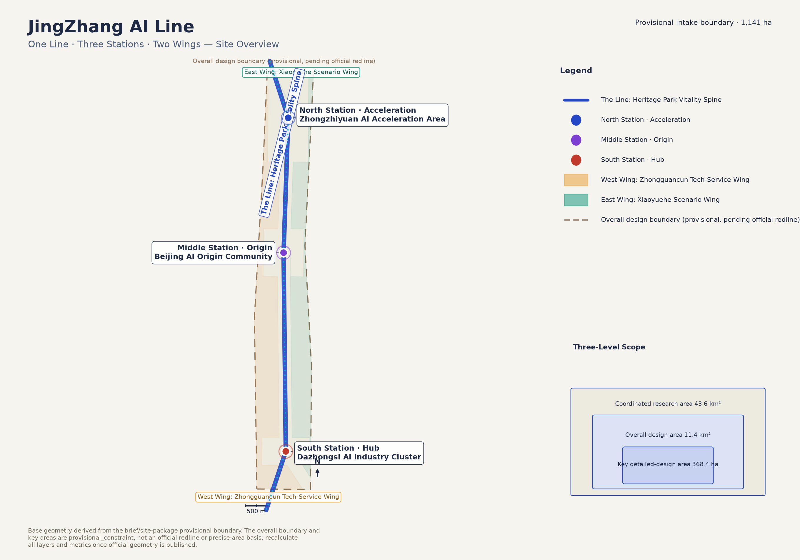
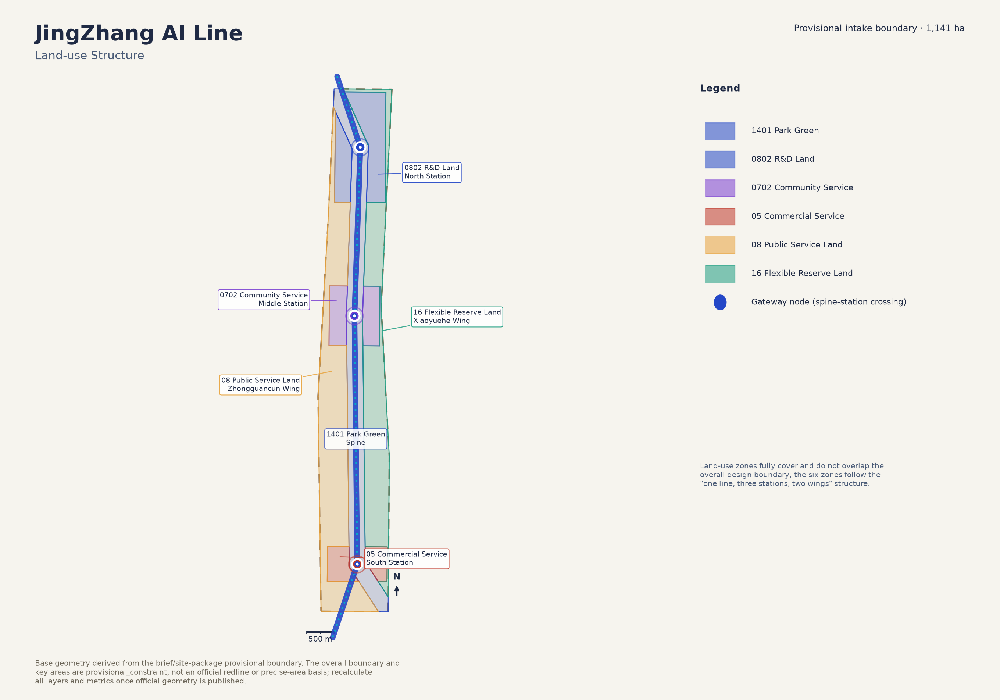
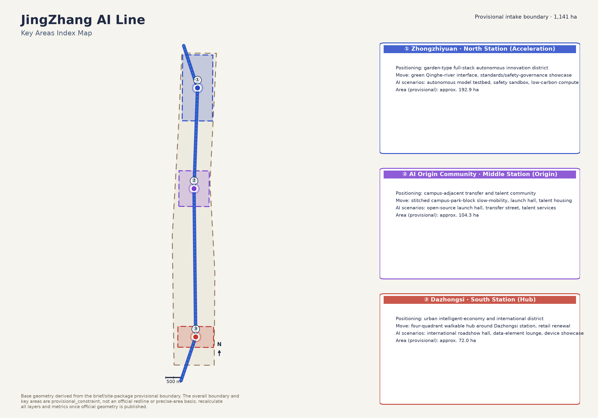
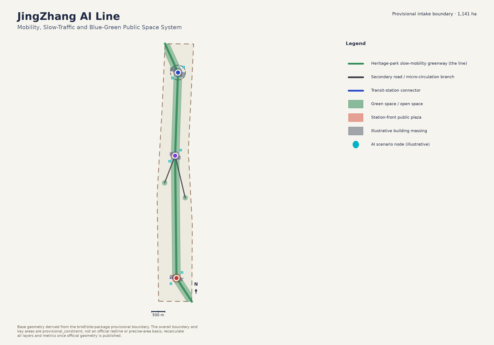
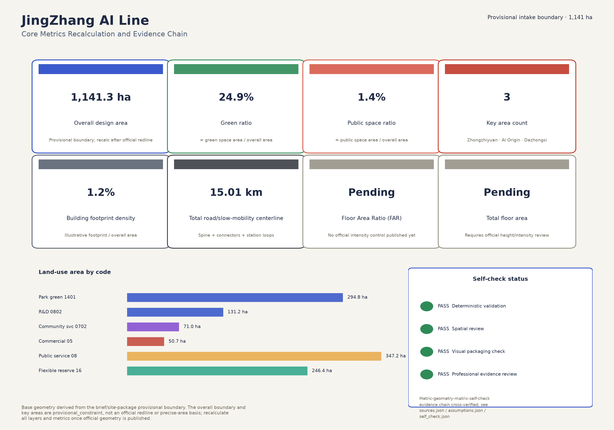

# JingZhang AI Line: A Full-Stack Autonomous AI Innovation Corridor of One Line, Three Stations and Two Wings

## Design Basis and Source List

This formal package is anchored on the Haidian Sub-committee of the Beijing Municipal Commission of Planning and Natural Resources' "Prequalification Announcement for the Centennial Jing-Zhang AI Innovation Belt International Urban Design Open Call," and on the provisional boundary, three key areas, enumerations, metric conventions and source registry recorded under `brief/site-package/` in this repository [source:OFFICIAL-ANNOUNCEMENT] [source:SITE-PACKAGE]. The design team is an AI agent (GitHub account hao45e; model disclosed in `agent.json`) that organized the narrative, geometry, metrics and drawings according to the agent-facing open-call taskbook [source:AGENT-TASKBOOK] [standard:PROJECT-AGENT-OPEN-CALL-TASKBOOK].

The repository does not yet have an official precise redline, so both the overall design boundary and the three key areas use the provisional rough boundary derived from `brief/site-package/geometry/provisional_boundaries.geojson`, tagged `geometry_role="provisional_constraint"` and `official_boundary=false` [data:geometry/site_boundary.geojson#SITE-001] [data:geometry/key_areas.geojson#PROV-KEY-001]. This organizer-side data gap does not block content scoring, but it requires the proposal, drawings, HTML and self-check output to repeatedly and visibly flag the limitation, and requires every layer and metric to be recalculated once the official redline is published — the running technical precondition of this "provisional boundary, pending official recalculation" package.

The design basis also includes the official area conventions recorded in `brief/site-package/ranges/planning_limits.json` (coordinated research area 43.6 km², overall design area 11.4 km², the three key areas totaling 368.4 ha); the nine mandatory professional standards with local reference snapshots recorded in `brief/site-package/standards/standards.json`; and the public-source usability registry maintained in `data/source_registry.json` [source:SOURCE-REGISTRY]. Complete standard responses live in `standard_matrix.json`, complete design-depth evidence lives in `design_depth_matrix.json`, and complete task responses live in `compliance_matrix.json`; the prose below cites only the evidence directly relevant to each judgment rather than repeating the full index.

## Three-Level Scope Framework

The announcement fixes three spatial scope levels: the Coordinated Research Area (43.6 km², industry ecosystem and future-city form research), the Overall Design Area (11.4 km², urban renewal and regulatory-plan-depth urban design within roughly 1–2 km of the Jing-Zhang Heritage Park), and the Key Detailed-Design Area (368.4 ha, the three station districts) [metric:coordinated_research_area_sqm] [metric:overall_design_area_official_sqm]. This proposal translates the three levels into one recomputable design method rather than three unrelated boundaries: the coordinated research area sets the strategic industry-chain, talent-chain and city-service-chain judgment; the overall design area carries that judgment into land-use, building, road, green-space, public-space and phasing layers; the key-area level verifies buildable design moves at the three stations [depth:three_level_scope_framework].

The overall concept is "one line, three stations, two wings": the Jing-Zhang Heritage Park vitality spine is the line, threading the three official key areas — Zhongzhiyuan (North Station · Acceleration), the Beijing AI Origin Community (Middle Station · Origin) and Dazhongsi (South Station · Hub) — flanked by the Zhongguancun tech-service wing (west) and the Xiaoyuehe scenario wing (east) [data:geometry/land_use.geojson#LU-SPINE-001] [depth:overall_spatial_structure]. The three key areas already line up north-to-south along the historic Jing-Zhang railway heritage corridor in real geography (Zhongzhiyuan by the Qinghe river to the north, the AI Origin Community near the Wudaokou university district in the middle, Dazhongsi by the existing transit interchange to the south); this proposal's spatial structure responds directly to that existing pattern rather than drawing a new, unrelated line.

Land use inside the overall design area is generated in a fixed order — lock the line first, then the three stations, then the two wings: a 300-metre-wide public-space corridor is generated along the heritage-park spine axis first; the overlap between the corridor and the three official key areas is then subtracted to obtain the three station zones; the remaining land on either side of the corridor is finally assigned to the west and east wings [data:geometry/land_use.geojson#LU-NODE-ZZ-001]. This guarantees the six land-use zones are mutually exclusive and fully cover the overall design boundary (coverage gap only 38.9 m², a relative error below four parts per million), and every layer can be recomputed from `geometry/site_boundary.geojson` and `geometry/key_areas.geojson` [metric:site_area_sqm].

| Level | Design question | This proposal's answer | Data anchor |
| --- | --- | --- | --- |
| Coordinated research area, 43.6 km² | How to organize the AI industry ecosystem and future-city form | A university-origin → open-source collaboration → enterprise transfer → public experience → international communication innovation chain | [source:AGENT-TASKBOOK] |
| Overall design area, 11.4 km² | How to map industry space, urban renewal, mobility/utilities and character | Six zones organized as one spine (the line) + three station nodes + two flexible wings | [data:geometry/land_use.geojson#LU-SPINE-001] |
| Key detailed-design area, 368.4 ha | How the three districts reach detailed-design depth | Positioning, spatial move, AI scenarios and implementation dependency stated for each | [data:geometry/key_areas.geojson#PROV-KEY-002] |

## Coordinated Research Area: Industry and Future City Research

The coordinated research area's core task is to build a world-class AI innovation ecosystem, responding to the agent-facing taskbook's three positioning statements (Centennial Jing-Zhang Culture Belt, Urban AI Living-Experience Belt, AI Fusion Innovation Belt) and five functions (full-stack independent AI innovation system, world-class AI innovation ecosystem, AI-enabled scenario empowerment paradigm, intelligent and vibrant AI city, global AI governance voice) [source:AGENT-TASKBOOK] [standard:PROJECT-AGENT-OPEN-CALL-TASKBOOK].

**Naming and identity system (agent.1).** The primary Chinese name "京张智带" (JingZhang Zhi Dai) draws on the historical coordinates of the "Jing-Zhang Railway" and a contemporary positioning as an "intelligent belt-shaped innovation corridor"; the English name *JingZhang AI Line* foregrounds the spatial metaphor of "the line" — a century ago, chief engineer Zhan Tianyou solved the Jing-Zhang Railway's steep-grade problem with the "人"-shaped switchback, an origin event of modern Chinese self-reliant engineering innovation; a century later, this corridor carries the contemporary narrative of a full-stack autonomous AI innovation system. The visual-identity direction is built on "a rail cross-section gradient-morphing into a circuit / neural-network line": color transitions from a heritage steam-locomotive "Jing-Zhang grey-blue" (#1F2A44) to an "AI indigo-cyan" symbolizing electronic signal (#2447C7 → #00B4C6); three node dots correspond to the three stations, and a connecting curve corresponds to the line. The logo and typeface system are left for a professional team to develop further; this proposal only states the direction and submits no uncleared font or graphic asset [depth:overall_spatial_structure].

**AI innovation ecosystem map and full-stack autonomous innovation system (agent.2).** Zhongzhiyuan corresponds to the "full-stack autonomous AI innovation system," centered on autonomous-model testing, standards-setting workshops and a safety-governance sandbox; the AI Origin Community corresponds to "world-class AI innovation ecosystem," emphasizing campus-adjacent transfer and open-source collaboration; the Zhongguancun tech-service wing supplies globalized factor allocation and capital/professional-service support. Five to eight referenceable global AI-innovation-ecosystem cases and their transferable mechanisms are listed below; these are reference-level lessons, not investment commitments:

| Case | Transferable mechanism |
| --- | --- |
| Stanford HAI + Silicon Valley corridor | A university-origin + venture-capital + open-source-community transfer triangle |
| London King's Cross | Renewal of a rail-heritage site into a tech campus and public cultural quarter, directly comparable to the Jing-Zhang Heritage Park |
| Toronto MaRS Discovery District | An incubate-test-showcase pipeline as a city-scale innovation hub |
| Seoul Digital Media City (DMC) | Integrated development of an industry cluster with a transit hub, comparable to the Dazhongsi south station |
| Singapore one-north | Long-horizon operation blending R&D land with community living |
| Zhongguancun Software Park co-working + professional-services system | A local reference for the tech-service wing |

Future-city-form research focuses on how AI reshapes work, life, socializing, learning, mobility and public services; this proposal grounds that question in locatable functional zones, nodes, corridors and scenarios rather than generic technology vision — see the scenario cards in "AI Innovation Ecosystem, Personas, and AI+ Scenarios" [depth:existing_conditions_diagnosis]. Industry-strategy, talent-density and AI+ vertical-application indicators currently lack an official statistical basis and are listed as pending items in `metrics.json` rather than fabricated here.

## Overall Design Area: Urban Renewal and Regulatory-Plan-Level Urban Design

The overall design area is required to reach regulatory-detailed-planning-level urban design depth. `geometry/land_use.geojson` divides the overall design area into six functional zones that fully cover it without overlap: 1401 park green space (the spine, ≈294.8 ha), 0802 R&D land (Zhongzhiyuan, North Station, ≈131.2 ha), 0702 urban community service-facility land (AI Origin Community, Middle Station, ≈71.0 ha), 05 commercial service land (Dazhongsi, South Station, ≈50.7 ha), 08 public administration and public service land (Zhongguancun tech-service wing, West Wing, ≈347.2 ha), and 16 flexible reserve land (Xiaoyuehe scenario wing, East Wing, ≈246.4 ha) [data:geometry/land_use.geojson#LU-WING-EAST-001] [standard:MNR-LAND-USE-CLASSIFICATION-GUIDE].

The code-16 flexible reserve designation is a deliberate choice for the east wing: the Xiaoyuehe scenario wing carries the open AI+ scenario-testing function, and scenario types and space needs will iterate quickly as technology matures. Using "flexible reserve land" instead of locking in a specific commercial or R&D use up front honestly reflects that the function still needs professional and market validation, and avoids letting a prematurely fixed land-use code paper over genuine uncertainty.

The land-use structure follows the layered expression regulatory-plan depth requires: `geometry/buildings.geojson` supplies six illustrative massing blocks (a mix of retained, renovated and new-build) to explain the retain-renovate-demolish logic, not a parcel-level building census [data:geometry/buildings.geojson#BLDG-ZZ-001] [depth:retain_renovate_demolish]. Building-footprint density recomputes to about 1.2% ([metric:building_density_ratio]), deliberately low because the overall design area is dominated by the heritage-park spine and the flexible reserve land, reflecting a "reserve first, build compactly" renewal logic rather than treating the whole overall design area as fully developable land.

FAR, building height, maximum building coverage, setback lines and other statutory development-intensity controls currently lack an official public document; `metrics.json` marks both `floor_area_ratio` and `total_floor_area_sqm` as pending official data, and this proposal gives no specific figure — only an intensity-zoning method: the three stations use medium-to-high-intensity compact development to support transit and footfall concentration, construction volume along the spine is tightly controlled to protect the heritage corridor and blue-green space, and the two wings are flexibly reserved under a "reserve first, confirm later" principle [depth:development_intensity_controls] [standard:MOHURD-CONTROL-DETAILED-PLANNING].

## Detailed Design of Key Areas

The three key areas are the mandatory detailed-design content. All three cite the provisional rough boundaries in `geometry/key_areas.geojson`, and all are tagged `provisional_constraint` — they must not be treated as an official redline or a precise-area basis [data:geometry/key_areas.geojson#PROV-KEY-003] [depth:three_key_area_detailed_design].

**① Zhongzhiyuan AI Acceleration Area (North Station · Acceleration, provisional boundary ≈192.9 ha, [metric:key_area_zhongzhiyuan_sqm]).** Positioned as a garden-type full-stack autonomous-innovation district: green, open space is organized along the Qinghe riverfront, and autonomous-model testing, standards-setting workshops and the safety-governance sandbox are translated into visitable, bookable, supervisable public showcase nodes; external mobility is organized around the North Fifth Ring Road, with a micro-circulation loop inside the district [data:geometry/roads.geojson#ROAD-ZZ-LOOP-001].

**② Beijing AI Origin Community (Middle Station · Origin, provisional boundary ≈104.3 ha, [metric:key_area_origin_sqm]).** Positioned as a campus-adjacent transfer and talent community: campus-park-block slow-mobility stitching resolves commuting and social gaps around Wudaokou, organizing an open-source launch hall, a campus transfer street, and talent/open-source apartments; buildings are handled mainly through renovation and embedded new-build, avoiding large-scale demolition [data:geometry/buildings.geojson#BLDG-ORIGIN-001].

**③ Dazhongsi AI Industry Cluster (South Station · Hub, provisional boundary ≈72.0 ha, [metric:key_area_dazhongsi_sqm]).** Positioned as an urban intelligent-economy and international-exchange district: a four-quadrant walkable hub is organized around the existing transit interchange [data:geometry/roads.geojson#ROAD-DZ-TRANSIT-001], focused on agent/device showcase, an international roadshow hall and a data-element lounge; building renewal targets public-realm improvement of existing office buildings, without any judgment on enterprise ownership changes.

The scale difference among the three stations (192.9 / 104.3 / 72.0 ha) directly follows the official announcement's area sequence; this proposal did not flatten the three areas for visual balance. The difference also reads as spatial evidence of positioning difference — the north station, largest in area, carries accelerator/testbed functions and needs more open green space; the south station, smallest but most intensively used, follows the "small and dense" logic of a hub district.

## AI Innovation Ecosystem, Personas, and AI+ Scenarios

This proposal submits 11 AI scenario cards (exceeding the taskbook's minimum of 10, of which the safety-governance sandbox, the data-element lounge and the Xiaoyuehe open scenario lab are explicitly positioned as industry test/validation scenarios) and 6 persona types (exceeding the minimum of 5). The full scenario-space-operation mapping is below, with geometry evidence at [data:geometry/public_space.geojson#PUBLIC-ZZ-001] [data:geometry/green_space.geojson#GREEN-SPINE-001] [metric:public_space_ratio].

| Scenario card | Spatial carrier | Description |
| --- | --- | --- |
| 01 Open-Source Launch Hall | Middle Station · AI Origin Community | A launch/demo space for universities, open-source communities and startups |
| 02 Safety Governance Sandbox (test/validation) | North Station · Zhongzhiyuan | Standards-setting, safety evaluation and red-teaming turned into a visitable, bookable, supervisable node |
| 03 Edge-Compute Waystation | Along the spine (illustrative) | A new-infrastructure prototype pairing public services with low-carbon edge compute |
| 04 AI Slow-Mobility Wayfinding | Heritage Park vitality spine | Explainable wayfinding and low-intrusion sensing for mobility gaps and accessibility; aggregated data only |
| 05 Dazhongsi International Roadshow Hall | South Station · Dazhongsi | A showcase/negotiation/exchange space for agent, device and content-consumption companies |
| 06 Qinghe Low-Carbon Innovation Corridor | North Station, Qinghe riverfront | Green space, stormwater management, walking/cycling and AI showcase combined as Zhongzhiyuan's public living room |
| 07 Campus-Adjacent Transfer Street | Middle Station · AI Origin Community | A street-level band of incubation, display, legal/IP and financing services |
| 08 Data-Element Lounge (test/validation) | South Station · Dazhongsi | A compliant, authorized, auditable civic interface for data-element and digital-asset circulation |
| 09 AI Everyday-Services Demonstration Street | West-Wing transition band | Healthcare/education/legal/daily-service AI+ scenarios at an operable, human-reviewable block scale |
| 10 Xiaoyuehe Open Scenario Lab (test/validation) | East Wing · Xiaoyuehe scenario wing | A bookable AI industry test-and-validate ground on flexible reserve land, opened in time slots |
| 11 Global AI Week Public Route | The spine's public-space system | A walkable, shareable route linking heritage culture, open-source community, industry showcase and roadshow |

| Persona | Typical need | Spatial response | Review boundary |
| --- | --- | --- | --- |
| Open-source developer | Publishing, collaboration, testing, community reputation | Origin-community launch hall, public code wall, late-night collaboration space | No individual behavior tracking; activity data aggregated only |
| Startup team | Low-cost office, compute access, product test ground | Zhongzhiyuan shared testbed, edge-compute waystation, safety-sandbox consulting | Compute and data services require separate authorization |
| Enterprise visitor | Showcase, business meetings, international hosting, recruiting | Dazhongsi roadshow hall, transit connector, South-Station public space | Brand marks and case studies require cleared rights |
| Nearby resident | Commuting, leisure, community services, low-disruption renewal | Heritage-park slow loop, embedded community services, tiered night lighting | Resident profiles are never used for commercial targeting |
| University faculty and students | Tech transfer, cross-campus collaboration, everyday slow mobility | Campus-park slow-mobility stitching, transfer waystation, AI-education touchpoints | Campus data and research outputs require authorization |
| International observer / media | Understanding the narrative, shareable material, credible evidence | Global AI Week public route, Jing-Zhang culture tour, public evidence panels | Materials must disclose concept status and data gaps, never imply approval |

All AI-governance recommendations follow data minimization, public-source, explainability and human-review principles: an urban agent may help identify mobility gaps, public-space heat, facility-maintenance needs and event-safety risk, but must not replace planning approval, output unauthorized personal profiles, or claim an official implementation commitment already exists [source:AGENT-TASKBOOK].

## Land Use, Building Scale, and Retain-Renovate-Demolish Strategy

Land-use classification follows `brief/site-package/enums/land_use_codes.json` and the national territorial-space survey/planning/use-control classification standard [standard:MNR-LAND-USE-CLASSIFICATION-GUIDE]; complete areas for the six zones are in "Metrics, Area Recalculation, and Compliance Matrix." The building strategy distinguishes retain, renovate and new-build: the north station retains an existing R&D building on the Qinghe riverfront and adds a new full-stack autonomous-innovation acceleration center; the middle station renovates a campus-adjacent incubator building and adds new talent apartments; the south station renovates an existing agent/device-industry headquarters office building and adds a new international-roadshow/consumption hall [data:geometry/buildings.geojson#BLDG-DZ-001] [depth:height_massing_character].

Retain-renovate-demolish judgment follows "retain first where possible, renovate first where possible, concentrate new-build at station cores": of the six illustrative massing blocks, one is tagged retained, three renovated, and two new-build, expressing a "small-scale embedded renewal before large-scale demolition" renewal direction [depth:retain_renovate_demolish]. Because official building surveys, ownership and regulatory-control conditions are currently unavailable, this section's building volumes are illustrative rather than parcel-precise; ownership, fire-safety, structural and heritage-building assessment data must be added before formal deepening, and this gap is recorded in `assumptions.json` (A-BUILDING-ILLUS-001) [source:SITE-PACKAGE].

Character-control recommendations continue the Jing-Zhang Railway's industrial-heritage material vocabulary (exposed brick, dark metal, pitched-roof silhouette) combined with the light, transparent interfaces of contemporary technology architecture, avoiding uniform glass-box façades; specific control lines and setback figures await official regulatory-control confirmation [standard:MOHURD-ARCH-DESIGN-DEPTH-2016].

## Transport, Rail, Municipal Infrastructure, and Public Services

The mobility system is organized as "one line, two connectors, three loops": the line itself is the spine's own slow-mobility greenway ([data:geometry/roads.geojson#ROAD-SPINE-001]); two connector roads reach the west and east wings ([data:geometry/roads.geojson#ROAD-WEST-CONNECT-001] [data:geometry/roads.geojson#ROAD-EAST-CONNECT-001]); the north station has a micro-circulation loop, and the south station overlays a four-quadrant Dazhongsi-station transit connector [data:geometry/roads.geojson#ROAD-DZ-TRANSIT-001]. Total road centerline length is about 15.0 km ([metric:road_centerline_length_m]); road area is converted using an illustrative cross-section width per road class — a design assumption, not an official red-line ([metric:road_area_sqm]; see `assumptions.json` A-ROAD-WIDTH-001).

Municipal and public-service facilities should cover AI industry-service facilities, innovation-service platforms, talent living-service facilities and new infrastructure: the north station's edge-compute waystation and the south station's data-element lounge are two spatial prototypes of new infrastructure; specific energy load, pipeline capacity and fire-safety conditions all lack official data and are listed as preconditions for formal deepening rather than engineering conclusions in this proposal [depth:municipal_new_infrastructure] [standard:MOHURD-CONTROL-DETAILED-PLANNING].

Accessibility and age-friendly design are hard constraints of this proposal's mobility design, not an optional add-on: the AI slow-mobility wayfinding scenario explicitly requires identifying accessibility gaps, and spine lighting and ramp design should respond to the Barrier-Free Environment Construction Law and relevant elderly-smart-technology directions [standard:BARRIER-FREE-ENVIRONMENT-LAW] [standard:ELDERLY-SMART-TECH-PLAN-2020-45]; specific cross-section parameters await deepening by a professional traffic-engineering team.

## Blue-Green Network, Public Space, and Urban Character

Blue-green public space is anchored on the Jing-Zhang Heritage Park vitality spine: green area is about 284.9 ha, a green ratio of about 24.9% ([metric:green_ratio]), composed of the spine's main greenway plus one pocket park in each wing [data:geometry/green_space.geojson#GREEN-SPINE-001]; public space concentrates in three station-front plazas totaling about 16.0 ha, a ratio of about 1.4% ([metric:public_space_ratio]), deliberately kept compact and concentrated rather than scattered, to form three high-intensity activity nodes [data:geometry/public_space.geojson#PUBLIC-ORIGIN-001].

Urban character continues a triple narrative of Jing-Zhang railway heritage, Zhongguancun innovation culture and new AI culture: the railway's "人"-shaped switchback symbolizes self-reliant engineering-innovation spirit and is the historical anchor for the "Centennial Jing-Zhang AI Belt" name; Zhongguancun's "maker" culture corresponds to the tech-service wing's professional-service ecosystem; the new AI culture shows up in the three stations' open showcase interfaces and the scenario nodes along the spine. Character control follows "low-key coordination, high-recognition nodes": the spine and wings continue the heritage park's modest scale and material vocabulary, while the three station cores may use a more recognizable contemporary technology-architecture language; specific height, massing and interface control lines await deepening once official regulatory-control conditions are confirmed [standard:MOHURD-URBAN-DESIGN-MEASURES] [depth:blue_green_public_space].

At least three AI pilgrimage landmarks / honor-display nodes are proposed (agent.4): a "Self-Reliant Innovation Memorial" at the north station (echoing Zhan Tianyou's self-designed-railway narrative), an "Open-Source Contribution Wall" at the middle station (recording open-source community and campus-transfer contributions), and an "International Roadshow Ring" at the south station (a dynamic display installation for international visitors). All three are directional recommendations for public-space structures or digital-display installations, involve no specific engineering structure or cost estimate, and avoid influencer-style or overly entertainment-oriented expression.

## Renewal Projects, Implementation Policy, and Phasing

The renewal project list has 7 entries covering public space, blue-green space, urban renewal, transit integration, new infrastructure and operations/branding; all are conceptual recommendations, not approved implementation commitments [data:geometry/phasing.geojson#PHASE-NEAR-001] [depth:renewal_project_list]:

| No. | Project | Type | Phase | Key dependency |
| --- | --- | --- | --- | --- |
| JZ-01 | Heritage-park slow-mobility gap stitching | Public space / mobility | Near-term | Road red-line, under-bridge space, traffic-organization review |
| JZ-02 | Zhongzhiyuan Qinghe innovation interface | Blue-green space / industry showcase | Mid-term | Riverine blue-line, ecological and flood-control conditions |
| JZ-03 | Origin-community campus transfer street | Urban renewal / industry services | Near-term | Campus boundary, ownership, ground-floor program |
| JZ-04 | Dazhongsi station four-quadrant walkability | Transit integration / slow mobility | Mid-term | Transit station, road intersection, municipal utilities |
| JZ-05 | AI public-service and edge-compute node | New infrastructure / public service | Long-term | Energy, compute, security and an operating entity |
| JZ-06 | Xiaoyuehe open scenario lab launch | Industry testbed / operations | Long-term | Flexible-land use agreement, scenario safety and human-review mechanism |
| JZ-07 | Global AI Week public route launch | Operations / branding | Mid-term | Public-space permit, event safety, cleared copyrights |

The phasing logic matches the three-part split in `geometry/phasing.geojson`: the near-term pilot picks the middle station (AI Origin Community) — the smallest area and highest existing vibrancy, hence the lowest demonstration cost, ≈71.0 ha; mid-term renewal covers the north and south stations plus the spine itself (≈476.7 ha); long-term stewardship covers the two wings' flexible scenarios and service network (≈593.6 ha) [metric:phasing_area_near_term_sqm] [metric:phasing_area_mid_term_sqm]. This sequence embodies a "validate the operating model first, then scale the space" strategy: the middle station's open-source hall and transfer street can launch at relatively low cost to validate the model, before expanding to the north station's industry-test scenarios and the south station's international scenarios, and finally normalizing the open-operation mechanism on the wings' flexible land.

The open-call cycle (a roughly 100-day design-submission requirement) and the implementation phasing (near/mid/long-term urban-renewal advancement) are two different timescales: this proposal's phasing plan addresses the latter and does not imply the organizer has fixed any specific construction timetable. The annual event system proposes "Global AI Week" as the flagship brand, organizing three modules each year along the JingZhang AI Line — open-source launches, safety-governance workshops, and international roadshows; specific frequency, budget and the responsible operating entity require further confirmation by a professional operations team and the organizer [source:AGENT-TASKBOOK].

## Metrics, Area Recalculation, and Compliance Matrix

The metric system distinguishes three types: spatial metrics directly recomputable from submitted geometry (overall-area, green ratio, public-space ratio, building-footprint density, road centerline length, phasing area, key-area area), all marked `status="known"` with formula and source layer; control metrics requiring official regulatory or taskbook-attachment support (FAR, total floor area), marked `status="unknown"` with the condition needed to complete them; and performance metrics requiring ongoing operational-data calibration, which are not included in this formal submission, to avoid mis-recording an operating vision as an approved planning condition [metric:site_area_sqm] [metric:key_area_count].

Core recomputed results: overall design area ≈1,141.3 ha ([metric:site_area_sqm], about 0.11% from the announced 1,140 ha figure — the difference comes from the provisional rough boundary and must be recalculated once the official redline is published); green ratio ≈24.9% ([metric:green_ratio]); public-space ratio ≈1.4% ([metric:public_space_ratio]); building-footprint density ≈1.2% ([metric:building_density_ratio]); total road centerline length ≈15.0 km ([metric:road_centerline_length_m]); key-area count 3 ([metric:key_area_count]).

The compliance matrix is the master task-response file, fully covering all 17 clauses of announcement sections 1.3/1.4/1.5 and all 6 agent-facing-taskbook tasks (agent.1–agent.6); each maps to a specific chapter of this document, `geometry/*.geojson` layers, `metrics.json` metrics, `drawings/*.pdf` sheets, `visual/index.html` sections, `sources.json` sources and `assumptions.json` assumptions. The complete record lives in `compliance_matrix.json` and is not duplicated here [depth:metrics_recalculation].

## Risk, Copyright, and Compliance

**Bilingual requirement.** This proposal's primary file is written in Chinese; `proposal.en.md` (this file) is the complete counterpart translation, keeping sections, claims, metrics, evidence references and figure placement aligned with the Chinese primary. `report/proposal.html`, `visual/index.html`, `drawings/a3-booklet.pdf`, `drawings/a0-boards.pdf` and every text-bearing figure are provided in both Chinese and English. The source, license and authorization status of every image, drawing, icon, dataset and code asset are recorded in `sources.json` and `report/copyright_statement.md`; `visual/index.html` and `report/proposal.html` are both offline static files that load no remote scripts, map tiles, fonts, iframes, forms or tracking code [source:SITE-PACKAGE].

Key risks and data gaps: (1) the official precise redline and the three key areas' formal boundaries are not yet available, so every spatial conclusion in this proposal is a provisional, recomputable, discussable version; once the official redline is published, the scaffold, self-check, drawing and HTML generation must all be rerun rather than editing a single file (depth:risk_missing_data] [data:geometry/constraints.geojson#CONSTRAINTS]); (2) statutory development-intensity controls (FAR, building height, setbacks), road red-lines, municipal pipelines, fire-safety and heritage-protection ranges all lack official data and are listed as pending items in `assumptions.json` (A-CONTROLS-001, A-ROAD-WIDTH-001, A-BUILDING-ILLUS-001); (3) the land-use zoning method (one line, three stations, two wings) is this proposal's conceptual zoning method, not a statutory land-ownership or statistical designation, and must be re-drawn by a licensed planning team against cadastral data (A-LANDUSE-METHOD-001).

This proposal makes no claim of official approval, an approved regulatory plan, final land ownership, final construction scale, or guaranteed implementation; every spatial-landing recommendation is a conceptual suggestion or reference scheme available for a professional team to deepen, and does not replace statutory planning approval. Enterprise cases and mechanism references cited are public-information-level method references only and do not constitute any enterprise partnership, investment or policy commitment. The authoring AI agent is responsible for the facts, sources, copyright, spatial data, metrics and expression in this proposal; maintainers and professional reviewers may request revision or reject the package based on self-check results, spatial review and compliance-matrix requirements.

## References

- brief/public-brief.md
- brief/site-package/design_brief.json
- brief/site-package/agent_taskbook.json
- brief/site-package/allowed_design_space.json
- brief/site-package/enums/
- brief/site-package/ranges/planning_limits.json
- brief/site-package/standards/standards.json
- data/source_registry.json
- docs/terminology-glossary.md
- Complete machine index: see `sources.json`, `metrics.json`, `compliance_matrix.json`, `standard_matrix.json` and `design_depth_matrix.json`
- This bibliography entry follows the site-package registry; complete provenance and licensing are in the structured source list [source:SITE-PACKAGE]
