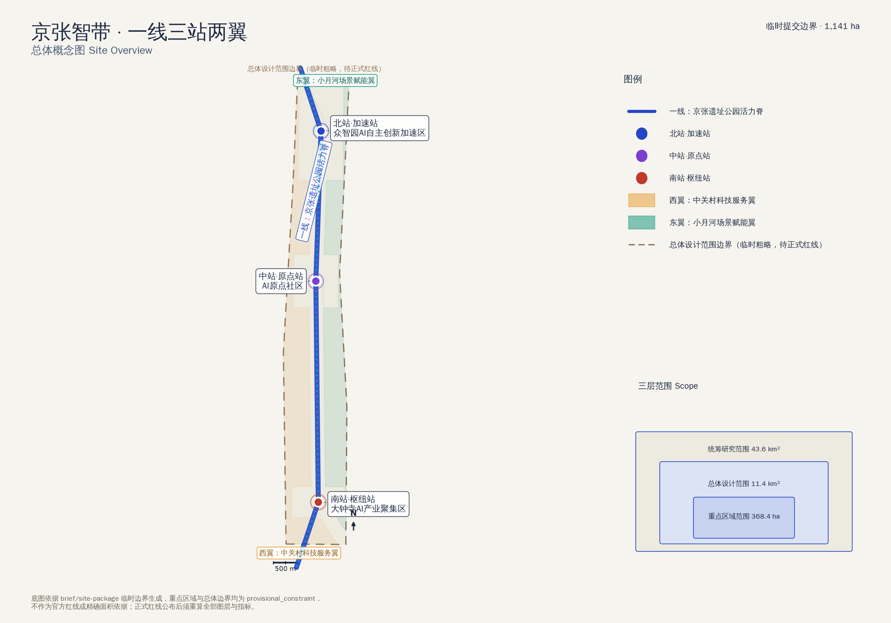
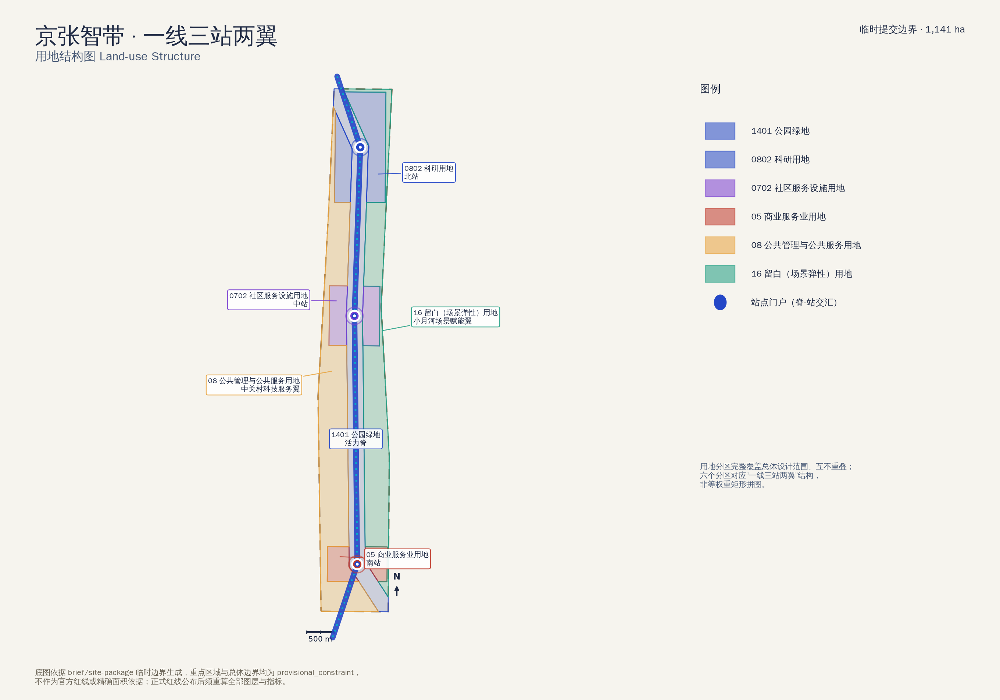
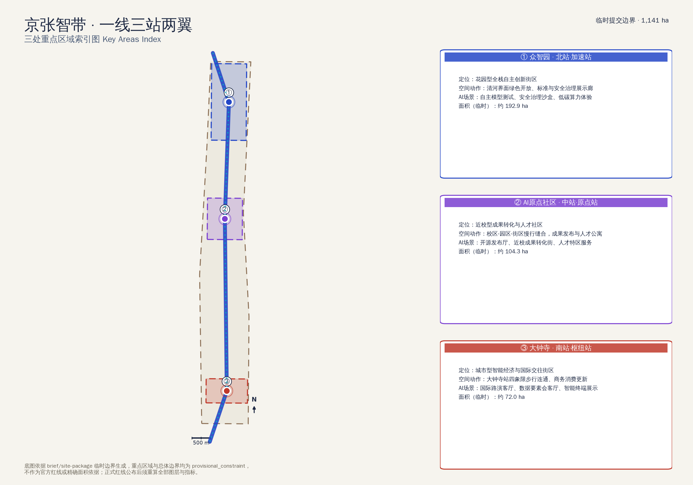
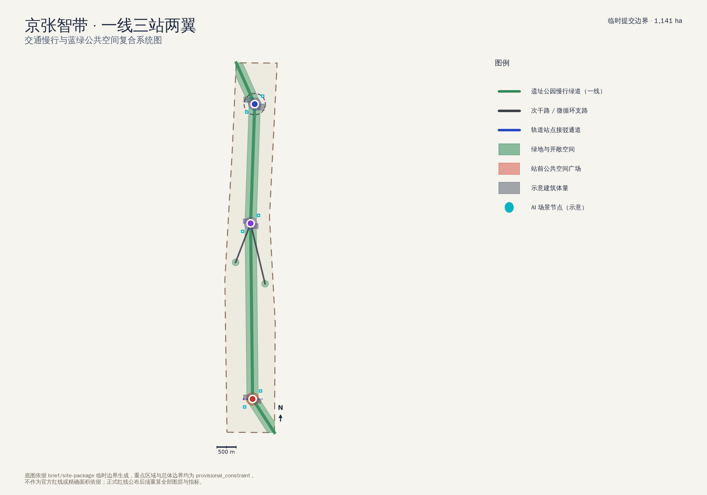
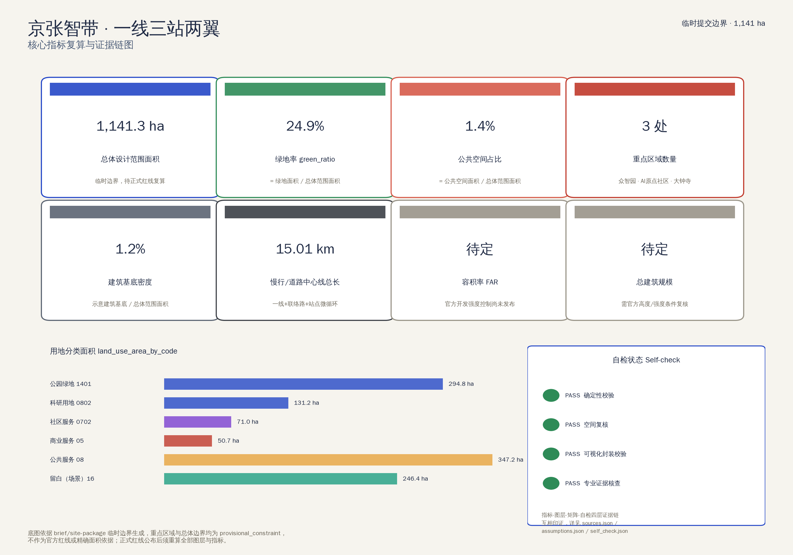

# 京张智带：一线三站两翼的AI全栈自主创新走廊

## 设计依据与资料清单

本方案以北京市规划和自然资源委员会海淀分局发布的《百年京张AI创新带城市设计国际方案征集资格预审公告》为第一依据，并以本仓库 `brief/site-package/` 中登记的临时粗略边界、三处重点区域、枚举、指标口径和来源清单为机器可读依据 [source:OFFICIAL-ANNOUNCEMENT] [source:SITE-PACKAGE]。设计团队为 AI agent（GitHub 账号 hao45e，模型见 `agent.json`），依据面向智能体的开源征集任务书组织正文、图层、指标与图纸 [source:AGENT-TASKBOOK] [standard:PROJECT-AGENT-OPEN-CALL-TASKBOOK]。

当前仓库尚未取得官方精确红线，因此总体设计范围与三处重点区域均使用 `brief/site-package/geometry/provisional_boundaries.geojson` 生成的临时粗略边界，标记为 `geometry_role="provisional_constraint"`、`official_boundary=false` [data:geometry/site_boundary.geojson#SITE-001] [data:geometry/key_areas.geojson#PROV-KEY-001]。这一组织方数据缺口不影响内容评分，但要求本方案在正文、图纸、HTML 与自检结果中反复清晰标注，并在正式红线公布后整体复算全部图层与指标——这是本方案“临时边界，待正式数据复算”的贯穿性技术前提。

设计基础还包括：`brief/site-package/ranges/planning_limits.json` 中登记的官方面积口径（统筹研究范围 43.6 km²、总体设计范围 11.4 km²、三处重点区域合计 368.4 ha）；`brief/site-package/standards/standards.json` 中登记的 9 项强制性专业标准本地参考件；以及 `data/source_registry.json` 维护的公开资料可用性登记表 [source:SOURCE-REGISTRY]。方案中涉及的强制性标准响应完整记录在 `standard_matrix.json`，设计深度证据完整记录在 `design_depth_matrix.json`，任务响应完整记录在 `compliance_matrix.json`；正文只在关键判断处回引直接相关的证据标记，不在此堆砌完整索引。

## 三层范围工作框架

公告确定三层空间范围：统筹研究范围（43.6 km²，产业生态与未来城市形态研究）、总体设计范围（11.4 km²，京张遗址公园周边 1–2 公里城市更新与控规深度城市设计）、重点区域范围（368.4 ha，三处详细设计地区）[metric:coordinated_research_area_sqm] [metric:overall_design_area_official_sqm]。本方案把三层范围转译为一套可复算的空间工作方法，而不是三条互不相关的红线：统筹研究范围决定产业链、人才链与城市服务链的战略判断；总体设计范围把判断落到用地、建筑、道路、绿地、公共空间和分期图层；重点区域范围验证三处站点的可实施设计动作 [depth:three_level_scope_framework]。

本方案的总体概念是“一线三站两翼”：以京张遗址公园活力脊为一线，串联众智园（北站·加速站）、AI原点社区（中站·原点站）、大钟寺（南站·枢纽站）三处官方重点区域，两侧分别衔接中关村科技服务翼（西翼）与小月河场景赋能翼（东翼）[data:geometry/land_use.geojson#LU-SPINE-001] [depth:overall_spatial_structure]。三处重点区域在真实地理上本就沿京张铁路遗址公园自北向南排列（众智园临清河、AI原点社区近五道口高校区、大钟寺邻现状轨道换乘枢纽），本方案的空间结构直接回应这一既有格局，而非另画一条新红线。

总体设计范围内的用地分区采用“先锁一线、再分三站、后分两翼”的生成顺序：先以遗址公园活力脊为轴线生成 300 米宽的公共空间走廊，再从三处官方重点区域中扣除与走廊重叠的部分作为站点用地，最后把走廊两侧的剩余用地按东西两侧分别归入两翼 [data:geometry/land_use.geojson#LU-NODE-ZZ-001]。这保证六个用地分区互不重叠且完整覆盖总体设计范围（覆盖误差仅 38.9 平方米，相对误差低于百万分之四），任何图层都可从 `geometry/site_boundary.geojson` 与 `geometry/key_areas.geojson` 复算 [metric:site_area_sqm]。

| 层级 | 设计问题 | 本方案回答 | 数据落点 |
| --- | --- | --- | --- |
| 统筹研究范围 43.6 km² | AI产业生态和未来城市形态如何组织 | 高校策源—开源协作—企业转化—公共体验—国际传播的创新链 | [source:AGENT-TASKBOOK] |
| 总体设计范围 11.4 km² | 产业空间、城市更新、交通市政和风貌如何落图 | 一线（脊）+ 三站（节点）+ 两翼（弹性区）六分区 | [data:geometry/land_use.geojson#LU-SPINE-001] |
| 重点区域范围 368.4 ha | 三处片区如何达到详细设计深度 | 分别给出定位、空间动作、AI场景和实施依赖 | [data:geometry/key_areas.geojson#PROV-KEY-002] |

## 统筹研究范围产业与未来城市研究

统筹研究范围的核心任务是构建世界级 AI 创新生态体系，并回应面向智能体任务书的三大定位（百年京张文化带、都市AI生活体验带、AI融合创新带）与五大功能（AI全栈自主创新体系、世界级AI创新生态、AI+场景赋能新范式、智能化AI活力城市、AI治理全球话语权）[source:AGENT-TASKBOOK] [standard:PROJECT-AGENT-OPEN-CALL-TASKBOOK]。

**命名与识别系统（agent.1）。** 主名称“京张智带”取自“京张铁路”的历史坐标与“智能带状创新走廊”的当代定位；英文名 *JingZhang AI Line* 强调“线”的空间隐喻——百年前詹天佑用“人”字形折返线解决京张铁路爬坡难题，是中国近代自主工程创新的原点事件；百年后，这条走廊承载的是 AI 全栈自主创新体系的当代叙事。视觉识别方向以“铁轨断面渐变为电路/神经网络线条”为核心图形：色彩从复古蒸汽机车的“京张灰蓝”（#1F2A44）过渡到象征电子信号的“AI靛青”（#2447C7 → #00B4C6），三个节点圆点对应三站，串联的曲线对应一线，Logo 与字体系统留待专业团队深化，本方案只提出方向、不提交任何未清权字体或图形 [depth:overall_spatial_structure]。

**AI创新生态图谱与全栈自主创新体系（agent.2）。** 众智园对应“AI全栈自主创新体系”，以自主模型测试、标准制定工作坊、安全治理沙盒为核心场景；AI原点社区对应“世界级AI创新生态”，强调近校成果转化与开源协作；中关村科技服务翼提供要素全球化配置、资本与专业服务支撑。全球可参考的 5–8 个AI创新生态案例列于下表，均为可转化机制层面的借鉴，不构成招商承诺：

| 案例 | 可转化机制 |
| --- | --- |
| 斯坦福 HAI + 硅谷创新走廊 | 大学策源 + 风险资本 + 开源社区的三角转化机制 |
| 伦敦国王十字车站更新区 | 铁路遗址更新为科技园区与公共文化空间的范式，与京张遗址公园直接可比 |
| 多伦多 MaRS Discovery District | 城市级创新枢纽的孵化-测试-展示一体化机制 |
| 首尔数字媒体城（DMC） | 产业集聚区与轨道枢纽一体化开发经验，对应大钟寺南站 |
| 新加坡 one-north | 科研用地与社区生活复合开发的长期运营机制 |
| 中关村软件园“众创空间+专业服务” | 本地可参照的科技服务翼样板 |

未来城市形态研究聚焦人工智能如何改变工作、生活、社交、学习、交通和公共服务：本方案把这一命题落到可定位的功能区、节点、廊道与场景，而不是泛泛的技术愿景，具体场景卡见“AI 创新生态、人才画像与 AI+ 场景”一节 [depth:existing_conditions_diagnosis]。产业战略、人才密度、AI+垂直应用等指标目前缺少官方统计口径，已在 `metrics.json` 中列为待补事项，不在此处编造精确数值。

## 总体设计范围城市更新与控规深度城市设计

总体设计范围要求达到控制性详细规划的城市设计深度。`geometry/land_use.geojson` 把总体设计范围划分为六个功能分区并完整覆盖、互不重叠：1401 公园绿地（活力脊，约 294.8 ha）、0802 科研用地（北站众智园，约 131.2 ha）、0702 城镇社区服务设施用地（中站AI原点社区，约 71.0 ha）、05 商业服务业用地（南站大钟寺，约 50.7 ha）、08 公共管理与公共服务用地（西翼中关村科技服务翼，约 347.2 ha）、16 留白（场景弹性）用地（东翼小月河场景赋能翼，约 246.4 ha）[data:geometry/land_use.geojson#LU-WING-EAST-001] [standard:MNR-LAND-USE-CLASSIFICATION-GUIDE]。

其中 16 类留白用地是本方案对东翼的刻意选择：小月河场景赋能翼承担 AI+场景开放测试职能，场景种类和空间需求会随技术成熟度快速迭代，用“留白/弹性用地”而非提前锁定具体商业或研发用途，能够诚实地反映当前阶段“功能仍需专业团队和市场验证”这一事实，也避免用一个过早固化的用地代码遮蔽真实的不确定性。

用地结构服从控规深度要求的分层表达：`geometry/buildings.geojson` 提供六处示意建筑体量（现状保留、更新改造与新建各占一部分），用于说明拆改留逻辑，而非地块级建筑普查 [data:geometry/buildings.geojson#BLDG-ZZ-001] [depth:retain_renovate_demolish]。建筑基底密度可复算为约 1.2%（[metric:building_density_ratio]），数值刻意偏低，因为总体设计范围以遗址公园活力脊和留白用地为主体，体现“留白优先、集约建设”的更新逻辑，而不是把整个总体设计范围都当作满铺开发用地。

容积率、建筑高度、建筑密度上限、退线等法定开发强度控制条件目前缺少官方公开文件，`metrics.json` 中 `floor_area_ratio` 与 `total_floor_area_sqm` 均标注为“待正式数据补齐”，本方案不给出任何具体数值，只提出强度分区的方法：三处站点采用中高强度紧凑开发以支撑轨道与人流集聚，活力脊沿线严格控制建设量以保护遗址与蓝绿空间，两翼按“留白优先、分期核实”原则弹性预留 [depth:development_intensity_controls] [standard:MOHURD-CONTROL-DETAILED-PLANNING]。

## 重点区域详细设计

三处重点区域是必选详细设计内容，均引用 `geometry/key_areas.geojson` 中的临时粗略边界，且都标注为 `provisional_constraint`，不得作为官方红线或精确面积依据 [data:geometry/key_areas.geojson#PROV-KEY-003] [depth:three_key_area_detailed_design]。

**① 众智园AI自主创新加速区（北站·加速站，临时边界约 192.9 ha，[metric:key_area_zhongzhiyuan_sqm]）。** 定位为花园型全栈自主创新街区：沿清河界面组织低碳绿色开放空间，把自主模型测试、标准制定工作坊、安全治理沙盒转译为可参观、可预约、可监管的公共展示节点；对外交通结合北五环组织，园区内部设微循环环路 [data:geometry/roads.geojson#ROAD-ZZ-LOOP-001]。

**② 北京AI原点社区（中站·原点站，临时边界约 104.3 ha，[metric:key_area_origin_sqm]）。** 定位为近校型成果转化与人才社区：通过校区—园区—街区慢行缝合解决五道口一带的通勤与交往断点，组织开源发布厅、近校成果转化街、人才公寓与开源公寓，建筑处理以更新改造与嵌入式新建为主，避免大拆大建 [data:geometry/buildings.geojson#BLDG-ORIGIN-001]。

**③ 大钟寺AI产业聚集区（南站·枢纽站，临时边界约 72.0 ha，[metric:key_area_dazhongsi_sqm]）。** 定位为城市型智能经济与国际交往街区：依托现状轨道换乘枢纽组织四象限步行连通 [data:geometry/roads.geojson#ROAD-DZ-TRANSIT-001]，聚焦智能体与智能终端展示、国际路演客厅、数据要素会客厅等商务消费场景，建筑更新聚焦既有商务楼宇的公共环境改善，不涉及企业产权变更判断。

三处站点的规模差异（192.9 / 104.3 / 72.0 公顷）直接对应官方公告面积序列，本方案没有为了视觉均衡而人为拉平三处用地规模；这一差异也被读作定位差异的空间证据——北站体量最大，承担加速器/测试场功能，需要更多开放绿色空间；南站体量最小但站点强度最高，符合枢纽型街区“小而密”的规律。

## AI 创新生态、人才画像与 AI+ 场景

本方案提交 11 张 AI 场景卡（超过任务书要求的不少于 10 张，其中安全治理沙盒、数据要素会客厅、小月河场景开放实验室 3 张明确定位为产业测试验证场景）与 6 类用户画像（超过不少于 5 类的要求），完整场景—空间—运营映射见下表，图层证据见 [data:geometry/public_space.geojson#PUBLIC-ZZ-001] [data:geometry/green_space.geojson#GREEN-SPINE-001] [metric:public_space_ratio]。

| 场景卡 | 空间载体 | 说明 |
| --- | --- | --- |
| 01 开源发布厅 | 中站·AI原点社区 | 面向高校、开源社区与初创团队的成果发布、代码贡献展示与小型路演空间 |
| 02 安全治理沙盒（产业测试验证） | 北站·众智园 | 标准制定、安全评测、模型红队测试的可参观、可预约、可监管协作节点 |
| 03 端侧算力驿站 | 活力脊沿线（示意） | 结合公共服务与低碳能源策略的新型基础设施原型 |
| 04 AI慢行导航 | 京张遗址公园活力脊 | 可解释导视与低侵入传感，识别慢行断点与无障碍需求，数据仅聚合统计 |
| 05 大钟寺国际路演客厅 | 南站·大钟寺 | 服务智能体、智能终端与内容消费企业的展示、洽谈、国际交流空间 |
| 06 清河低碳创新廊 | 北站临清河界面 | 绿色空间、雨洪管理、步行骑行与AI展示结合的园区公共客厅 |
| 07 近校成果转化街 | 中站·AI原点社区 | 面向高校成果转化的孵化、展示、法务、知识产权与投融资服务带 |
| 08 数据要素会客厅（产业测试验证） | 南站·大钟寺 | 以合规、授权、可审计为前提的数据要素与数字资产流通城市服务界面 |
| 09 AI生活服务样板街 | 西翼过渡带 | 医疗、教育、法律、生活服务AI+场景落到可运营的小尺度街区，人工复核可用 |
| 10 小月河场景开放实验室（产业测试验证） | 东翼·小月河场景赋能翼 | 留白弹性用地上的可预约AI产业测试验证场地，分时段向企业与公众开放 |
| 11 全球AI活动周公共路线 | 一线公共空间系统 | 串联遗址文化、开源社区、产业展示与国际路演的可步行可传播路线 |

| 用户画像 | 典型需求 | 空间响应 | 自检边界 |
| --- | --- | --- | --- |
| 开源开发者 | 发布、协作、测试、社区声誉 | 原点社区开源发布厅、公共代码墙、夜间协作空间 | 不采集个人行为轨迹；活动数据只做聚合统计 |
| 初创团队 | 低成本办公、算力入口、产品试验场 | 众智园共享测试场、端侧算力驿站、安全治理沙盒咨询 | 算力和数据服务需另行授权 |
| 头部企业访客 | 展示、商务、国际接待、人才招聘 | 大钟寺国际路演客厅、轨道站点接驳、南站周边公共空间 | 企业标识与案例须清权 |
| 周边居民 | 通勤、休闲、社区服务、低扰动更新 | 遗址公园慢行环、社区服务嵌入、分级夜间照明 | 不将居民画像用于商业推荐 |
| 高校师生 | 成果转化、跨校协作、日常慢行 | 校区-园区慢行缝合、成果转化驿站、AI教育体验点 | 校园数据和科研成果需授权 |
| 国际观察者/媒体 | 理解叙事、可传播素材、可信证据 | 全球AI活动周公共路线、京张文化导览、公开证据面板 | 传播材料须标注方案性质与数据缺口，不得暗示已获批准 |

所有 AI 治理建议遵循数据最小化、公开来源、可解释和人工复核原则：城市智能体可辅助识别慢行断点、公共空间热力、设施维护与活动安全风险，但不得替代规划审批、不得输出未经授权的个人画像、不得声称已获官方实施承诺 [source:AGENT-TASKBOOK]。

## 用地、建筑规模与拆改留方案

用地分类依据 `brief/site-package/enums/land_use_codes.json` 与国土空间调查、规划、用途管制分类标准表达 [standard:MNR-LAND-USE-CLASSIFICATION-GUIDE]，六个分区的完整面积见“指标体系、面积复算与合规矩阵”一节。建筑方案区分现状保留、更新改造与新建三类：北站保留清河界面既有科研楼、新建全栈自主创新加速中心；中站更新近校孵化楼、新建人才公寓；南站更新智能体与终端产业总部办公楼、新建国际路演与消费客厅 [data:geometry/buildings.geojson#BLDG-DZ-001] [depth:height_massing_character]。

拆改留判断遵循“能保留优先保留、能更新优先更新、新建集中在站点核心”的原则：六处示意建筑体量中，1 处标注现状保留、3 处标注更新改造、2 处标注新建，体现“小规模嵌入式更新优先于大拆大建”的城市更新导向 [depth:retain_renovate_demolish]。由于当前缺少官方建筑普查、产权和控规条件，本节的建筑体量为示意性、非地块级精确成果，正式深化前须补充产权、消防、结构和历史建筑评估资料，相关缺口已列入 `assumptions.json`（A-BUILDING-ILLUS-001）[source:SITE-PACKAGE]。

建筑风貌控制建议延续京张铁路工业遗产的材质语汇（清水砖、深色金属、坡屋顶轮廓）与当代科技建筑的轻透界面相结合，避免玻璃盒子式的均质立面，具体控制线和退线指标待官方控规条件确认后深化 [standard:MOHURD-ARCH-DESIGN-DEPTH-2016]。

## 交通、轨道、市政与公共服务设施

交通系统以“一线两连三环”组织：一线是活力脊本身的慢行绿道（[data:geometry/roads.geojson#ROAD-SPINE-001]），向西、向东各引出一条联络路衔接两翼（[data:geometry/roads.geojson#ROAD-WEST-CONNECT-001] [data:geometry/roads.geojson#ROAD-EAST-CONNECT-001]），北站设微循环环路，南站叠加大钟寺站四象限接驳通道 [data:geometry/roads.geojson#ROAD-DZ-TRANSIT-001]。道路中心线总长约 15.0 公里（[metric:road_centerline_length_m]），道路面积按各等级示意性横断面宽度换算，为设计假设而非官方红线（[metric:road_area_sqm]，详见 `assumptions.json` A-ROAD-WIDTH-001）。

市政与公共服务设施应覆盖AI产业服务设施、创新服务平台、人才生活服务设施与新型基础设施：北站的端侧算力驿站、南站的数据要素会客厅是新型基础设施的两个空间原型，具体能源负荷、管线容量和消防条件均缺少官方资料，已列为正式深化前置条件，不在本方案给出工程结论 [depth:municipal_new_infrastructure] [standard:MOHURD-CONTROL-DETAILED-PLANNING]。

无障碍与适老化是本方案交通设计的强制约束而非附加选项：AI慢行导航场景卡明确要求识别无障碍断点，活力脊照明与坡道设计应响应《无障碍环境建设法》与养老智能化相关技术方向 [standard:BARRIER-FREE-ENVIRONMENT-LAW] [standard:ELDERLY-SMART-TECH-PLAN-2020-45]，具体断面参数待专业交通工程团队深化。

## 蓝绿空间、公共空间与城市风貌

蓝绿公共空间以京张遗址公园活力脊为骨架：绿地面积约 284.9 公顷，绿地率约 24.9%（[metric:green_ratio]），由活力脊主体绿廊和西、东两翼各一处口袋公园构成 [data:geometry/green_space.geojson#GREEN-SPINE-001]；公共空间集中在三处站前客厅广场，面积约 16.0 公顷，占比约 1.4%（[metric:public_space_ratio]），刻意保持紧凑集中而非分散布点，以形成三处高强度活力节点 [data:geometry/public_space.geojson#PUBLIC-ORIGIN-001]。

城市风貌延续京张铁路历史文化、中关村创新文化与AI新文化的三重叙事：京张铁路的“人”字形折返线象征自主工程创新精神，是“百年京张AI创新带”命名的历史锚点；中关村的“众创”文化对应科技服务翼的专业服务生态；AI新文化体现在三处站点的开放展示界面和活力脊沿线的场景节点。风貌控制建议以低层次协调、高识别节点为原则：活力脊与两翼延续遗址公园的谦逊尺度和材质语汇，三处站点核心区可采用更高识别度的当代科技建筑语言，具体高度、体量和界面控制线待官方控规条件确认后深化 [standard:MOHURD-URBAN-DESIGN-MEASURES] [depth:blue_green_public_space]。

AI 朝圣地标与荣誉展示体系（agent.4）建议设置不少于 3 处：北站的“自主创新纪念点”（呼应詹天佑自主设计的历史叙事）、中站的“开源贡献墙”（记录开源社区与高校成果转化的持续贡献）、南站的“国际路演之环”（面向国际访客的动态展示装置）。三处地标均为公共空间构筑物或数字展示装置的方向性建议，不涉及任何具体工程结构或造价测算，避免网红化和过度娱乐化表达。

## 更新项目清单、实施政策与分期计划

更新项目清单共 7 项，覆盖公共空间、蓝绿空间、城市更新、轨道一体化、新基建和运营品牌六类，均标注为概念建议，不构成审批实施承诺 [data:geometry/phasing.geojson#PHASE-NEAR-001] [depth:renewal_project_list]：

| 编号 | 项目名称 | 类型 | 分期 | 主要依赖 |
| --- | --- | --- | --- | --- |
| JZ-01 | 遗址公园慢行断点缝合 | 公共空间/交通 | 近期 | 道路红线、桥下空间、交通组织复核 |
| JZ-02 | 众智园清河创新界面 | 蓝绿空间/产业展示 | 中期 | 河道蓝线、生态与防洪条件 |
| JZ-03 | 原点社区近校成果转化街 | 城市更新/产业服务 | 近期 | 校区边界、权属、首层业态 |
| JZ-04 | 大钟寺站四象限步行连通 | 轨道一体化/慢行 | 中期 | 轨道站点、道路交叉口、市政管线 |
| JZ-05 | AI公共服务与端侧算力节点 | 新基建/公共服务 | 长期 | 能源、算力、安全与运营主体 |
| JZ-06 | 小月河场景开放实验室启动 | 产业测试/运营 | 长期 | 留白用地使用协议、场景安全与人工复核机制 |
| JZ-07 | 全球AI活动周公共路线启动 | 运营/品牌 | 中期 | 公共空间许可、活动安全、版权清权 |

分期逻辑与 `geometry/phasing.geojson` 三段划分一致：近期试点选择中站AI原点社区（面积最小、现状活力最高，示范成本最低，约 71.0 ha），中期更新覆盖南北两站与活力脊本体（约 476.7 ha），长期治理覆盖两翼弹性场景与服务网络（约 593.6 ha）[metric:phasing_area_near_term_sqm] [metric:phasing_area_mid_term_sqm]。这一顺序体现“先验证运营模式、再扩展空间规模”的策略：中站的开源发布厅和近校转化街可用较低成本快速启动，验证成功后再向北站的产业测试场景和南站的国际化场景扩展，最后把留白用地的场景开放机制常态化。

征集周期（100 天设计提交要求）与实施分期（近期/中期/长期城市更新推进）是两个不同的时间尺度：本方案的分期计划面向后者，不代表征集组织方已确定任何具体开工时间表。年度活动体系建议以“全球AI活动周”为主品牌，每年在京张智带沿线组织开源发布、安全治理研讨、国际路演三个模块，具体频次、预算和责任主体需专业运营团队和组织方进一步确认 [source:AGENT-TASKBOOK]。

## 指标体系、面积复算与合规矩阵

指标体系区分三类：可由提交几何直接复算的空间指标（如总体范围面积、绿地率、公共空间占比、建筑基底密度、道路中心线长度、分期面积、重点区域面积）均标注 `status="known"` 并给出公式与来源图层；需要官方控规或任务书附件支撑的管控指标（容积率、总建筑规模）标注 `status="unknown"` 并给出补齐条件；需要运营数据持续校准的绩效指标暂未纳入正式提交，避免把运营愿景误写成审定规划条件 [metric:site_area_sqm] [metric:key_area_count]。

核心指标复算结果：总体设计范围面积约 1,141.3 公顷（[metric:site_area_sqm]，与公告 1,140 公顷口径相差约 0.11%，差异来自临时粗略边界，正式红线公布后须重算）；绿地率约 24.9%（[metric:green_ratio]）；公共空间占比约 1.4%（[metric:public_space_ratio]）；建筑基底密度约 1.2%（[metric:building_density_ratio]）；道路中心线总长约 15.0 公里（[metric:road_centerline_length_m]）；三处重点区域数量 3 处（[metric:key_area_count]）。

合规矩阵是任务响应性的主控文件，完整覆盖公告 1.3、1.4、1.5 全部 17 项条款与面向智能体任务书 agent.1 至 agent.6 全部 6 项任务，每条均对应到本文档的具体章节、`geometry/*.geojson` 图层、`metrics.json` 指标、`drawings/*.pdf` 图纸、`visual/index.html` 板块、`sources.json` 来源和 `assumptions.json` 假设，完整记录见 `compliance_matrix.json`，不在正文重复机器索引 [depth:metrics_recalculation]。

## 风险、版权与合规说明

**要求双语言。** 本方案主文件使用中文撰写，`proposal.en.md` 提供完整对照英文译文，两版章节、主张、指标、证据引用与图件位置保持一致；`report/proposal.html`、`visual/index.html`、`drawings/a3-booklet.pdf`、`drawings/a0-boards.pdf` 与全部含文字图件均提供中英文双语版本。全部图片、图纸、图标、数据和代码资产的来源、许可和授权状态记录在 `sources.json` 与 `report/copyright_statement.md`；`visual/index.html` 与 `report/proposal.html` 均为离线静态文件，不加载远程脚本、地图瓦片、字体、iframe、表单或跟踪代码 [source:SITE-PACKAGE]。

主要风险与缺资料清单：（1）官方精确红线与三处重点区域正式边界尚未取得，本方案全部空间结论均为临时可复算、可讨论版本，正式红线公布后须重新运行脚手架、自检、图纸与HTML生成，不能只替换单个文件（[depth:risk_missing_data] [data:geometry/constraints.geojson#CONSTRAINTS]）；（2）容积率、建筑高度、退线等法定开发强度控制条件、道路红线、市政管线、消防和文物保护范围均缺少官方资料，已在 `assumptions.json` 中列为待补事项（A-CONTROLS-001、A-ROAD-WIDTH-001、A-BUILDING-ILLUS-001）；（3）用地分区方法（一线三站两翼）是本方案的概念性分区方法，不是法定用地权属或统计口径，须由专业规划团队结合地籍资料重新划定（A-LANDUSE-METHOD-001）。

本方案不声称官方批准、审定控规、最终土地权属、最终建设规模或保证实施；所有空间落地建议均为概念建议、参考方案，可供专业团队深化研究，不替代法定规划审批。方案中提出的企业案例、机制借鉴均为公开信息层面的方法参考，不构成任何企业合作、投资或政策承诺；AI agent 对本方案的事实、来源、版权、空间数据、指标和表达负责，维护者与专业评审可依据自检结果、空间复核和合规矩阵要求返修或拒绝。

## 参考资料

- brief/public-brief.md
- brief/site-package/design_brief.json
- brief/site-package/agent_taskbook.json
- brief/site-package/allowed_design_space.json
- brief/site-package/enums/
- brief/site-package/ranges/planning_limits.json
- brief/site-package/standards/standards.json
- data/source_registry.json
- docs/terminology-glossary.md
- 完整机器索引：见 `sources.json`、`metrics.json`、`compliance_matrix.json`、`standard_matrix.json` 与 `design_depth_matrix.json`
- 本节书目入口依据场地包登记，完整出处和许可见结构化来源清单 [source:SITE-PACKAGE]
