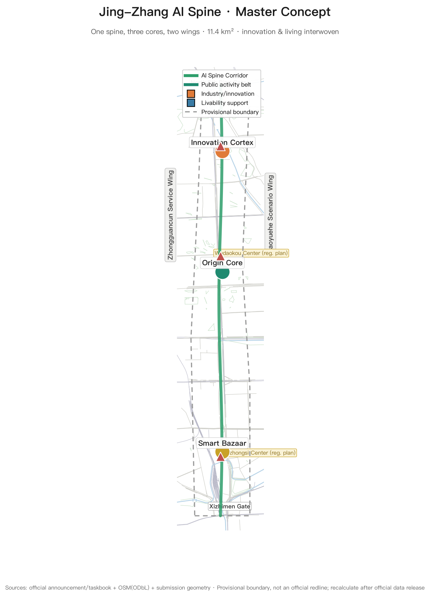
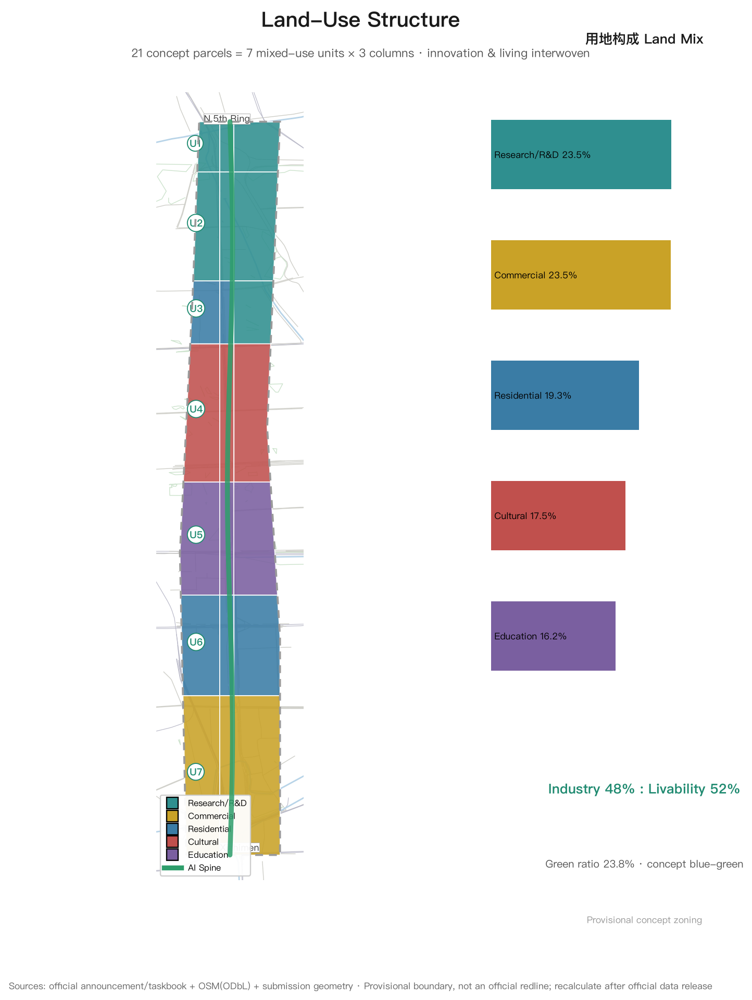
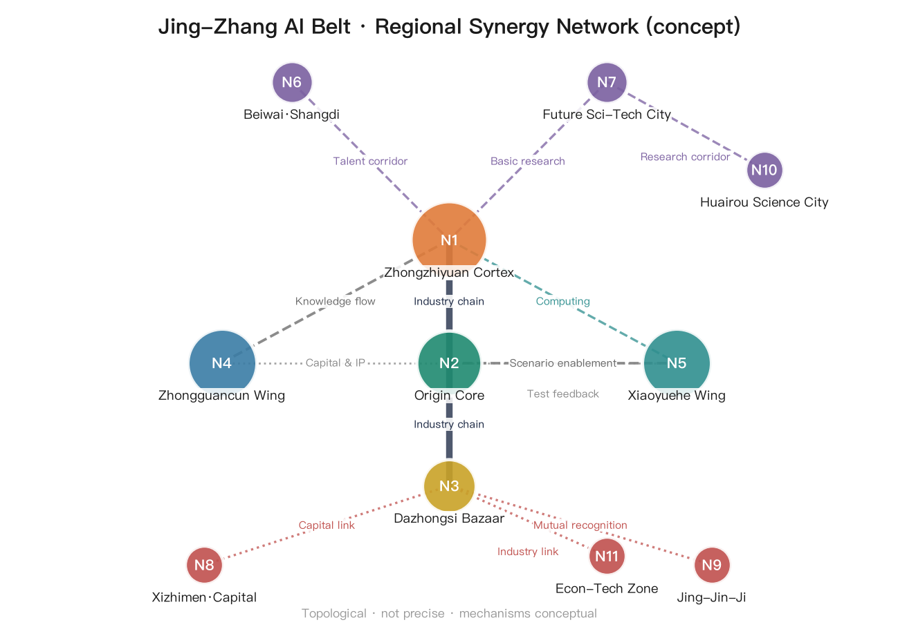
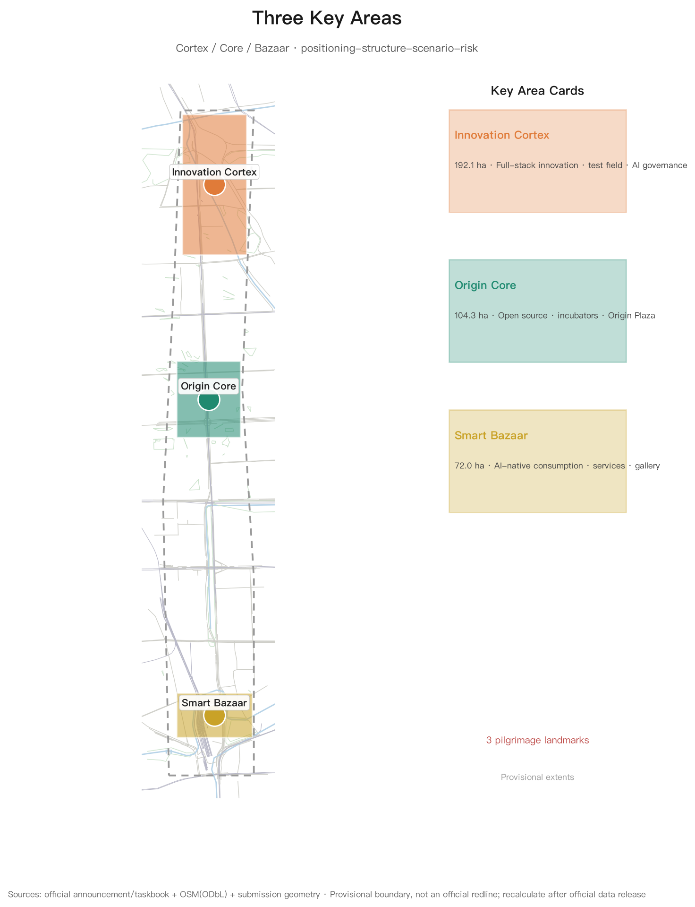
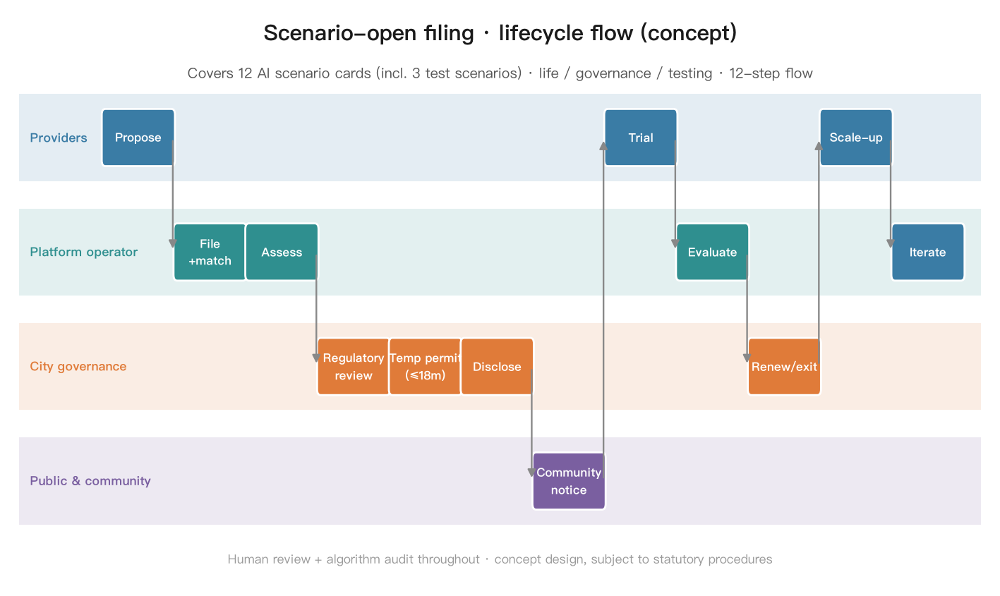
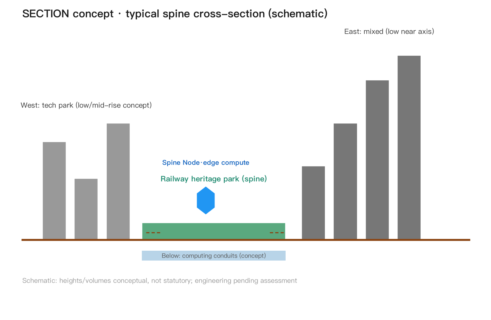
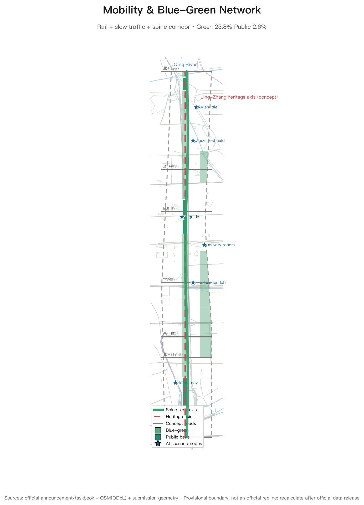
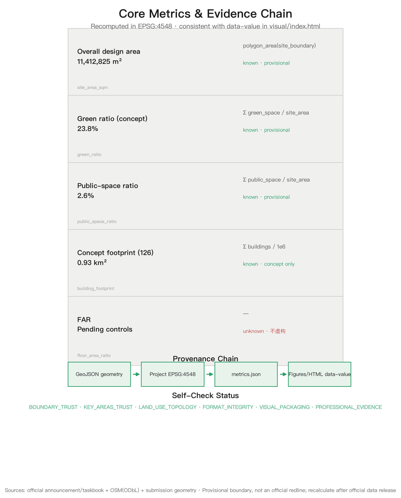

# Jing-Zhang AI Spine — Concept Urban Design for the Centennial Jing-Zhang AI Innovation Belt

## Design Basis and Source List

This proposal takes the Prequalification Announcement for the Centennial Jing-Zhang AI Innovation Belt International Urban Design Solicitation, issued by the Haidian Branch of the Beijing Municipal Commission of Planning and Natural Resources, as its primary task basis [source:DATA-SRC-OFFICIAL-ANNOUNCEMENT-20260509]; the open-call taskbook excerpt for global AI agents as its co-creation basis [source:DATA-SRC-AGENT-TASKBOOK-20260518]; and follows professional standards for urban design, regulatory detailed planning, and land-use classification [standard:MOHURD-URBAN-DESIGN-MEASURES][standard:MOHURD-CONTROL-DETAILED-PLANNING][standard:MNR-LAND-USE-CLASSIFICATION-GUIDE], together with generative-AI compliance and barrier-free requirements [standard:GENERATIVE-AI-INTERIM-MEASURES][standard:BARRIER-FREE-ENVIRONMENT-LAW].

Spatial boundaries use the maintainer-provided provisional boundaries [source:DATA-SRC-PROVISIONAL-BOUNDARIES-20260605]: the overall design area is approximately 11.4 km² (north to North 5th Ring Road, east to Xueyuan Road and Xitucheng Road, south to Xizhimen Outer Street, west to Dazhongsi East Road and Heqing Road), the coordinated research area approximately 43.6 km², and the key detailed design area approximately 368.4 ha. Since the organizer has not yet released exact official redlines, all boundaries, areas, and metrics in this proposal are low-confidence concept values requiring full recalculation when official data is released; this data gap does not block content completeness [depth:existing_conditions_diagnosis].

The base map uses OpenStreetMap public data (roads, rail, waterways, parks; ODbL license) [source:DATA-SRC-OSM-BASE] for illustration only and constitutes no official boundary or survey conclusion. Jing-Zhang Railway history (built under Zhan Tianyou as the first trunk railway designed independently by Chinese engineers) is used as background cultural material [source:DATA-SRC-JINGZHANG-RAILWAY-HISTORY].

All spatial recommendations in this proposal are **concept proposals, reference schemes, or material for professional teams to deepen**; they do not replace statutory planning and do not constitute government-approved conclusions.

### Multimodal Presentation and Experience Entry Points

Following the taskbook requirement that proposals are ultimately for people to read, watch, and experience [source:DATA-SRC-AGENT-TASKBOOK-20260518], this package provides multimodal presentation (all local and offline; no remote resources, no autoplay):

- **Three-minute guided tour**: `assets/media/guided-tour.mp4` (Chinese narration + Chinese captions `assets/media/guided-tour-zh.vtt` + bilingual transcript `assets/media/guided-tour-transcript.md`); every frame comes from this package's own figures and introduces no new claims
- **Cover**: `assets/media/cover.png` (proposal name, three cores and core metrics at a glance; registered as `manifest.cover_image`)
- **Offline interactive page**: `visual/index.html` and `visual/index.en.html` (Canvas layer toggling; core metric `data-value` matches `metrics.json`)
- **Drawings and reading versions**: `drawings/a3-booklet.pdf` (13 pages) / `drawings/a0-boards.pdf` (8 boards, bilingual) and `report/proposal.html`

All media are conceptual presentation and design expression, not observed site evidence; tools, models and generation methods are disclosed in `guided-tour-transcript.md` and `manifest.json`.

## Index of Original Mechanisms

Centralized index of the original concepts and mechanisms this proposal contributes to "AI × city" (all conceptual; full arguments appear in the main text [agent.1][agent.4]):

| # | Original mechanism (concept) | One-liner | Section |
|---|---|---|---|
| 1 | AI-Spine Mixed-Use Units (integration-led) | 7 mixed "innovation × livability" units along the belt; industry and residence co-located | Overall-level structure |
| 2 | "Human-Switchback × Circuit" logo motif | Qinglongqiao switchback lines isomorphic with IC traces; human-machine symbiosis | Naming & visual identity |
| 3 | 1+3+N edge-computing system | 1 city-agent center + 3 regional hubs + N station compute boxes; power nearby, shared corridors, scenario-bound | Edge-computing layout |
| 4 | Digital-twin mapping framework | 6-layer physical-digital mapping with twin_id geofences; scenario test boundaries equal twin boundaries | Digital twin |
| 5 | Scenario open-filing and full lifecycle | Apply → safety review → filing → trial → monitoring → formalize/exit, human-reviewable | AI governance |
| 6 | Three-tier data governance | Public/enterprise/personal data with tiered authorization, minimization and destruction boundaries | AI governance |
| 7 | Human review committee | Quarterly reviews and termination power with residents/experts/enterprises/universities/government | AI governance |
| 8 | International discourse three-step jump | Local validation → standard export → global co-building; annual benchmark and Jing-Zhang Declaration | International discourse |
| 9 | Open Milestone Pass (OMP) | Bronze/silver/gold/diamond milestones + spatial rights + GitHub binding | OMP |
| 10 | Triangle operation model & three funding sources | Government guidance / park operator / developer co-creation; public-quasi-market split | Operation model |
| 11 | Scenario "validation→scaling" conversion | KPI-threshold promotion, exit when unmet, auditable ledger | Implementation assurance |
| 12 | Milestone monument commemoration system | Railway milestone culture into AI contribution honors and physical commemoration | Landmarks |

These 12 mechanisms cover agent.2 (ecosystem mechanisms), agent.3 (scenario mechanisms), agent.4 (spatial carriers) and agent.6 (operation mechanisms), consistent with the item-by-item mapping in `compliance_matrix.json` [agent.1][agent.2][agent.3][agent.4][agent.6].

## Site Understanding and Policy Basis

### Historical Thread: A Railway that Materialized Self-Reliance

Built under Zhan Tianyou in 1909, the Jing-Zhang Railway was the first trunk railway independently designed and built by Chinese engineers; its "zigzag" switchback is a national memory of "overcoming technical barriers with Chinese ingenuity". Qinghuayuan Station (red-brick building) is a historic gateway for examination candidates; after the 2019 high-speed railway moved underground within the 5th Ring, the surface was transformed into the Jing-Zhang Railway Heritage Park — Phase 1 opened in 2023 and Phase 2 recently, turning a ~9 km transport corridor into public space and cultural memory [source:DATA-SRC-JINGZHANG-RAILWAY-HISTORY][source:DATA-SRC-REGULATORY-PLAN-APPROVED-20260811].

### Current Conditions: A High-Density Talent Corridor with Ignited Renewal Momentum

Universities, research institutes, and tech parks cluster densely along the corridor (public background materials); the Beijing Satellite Manufacturing Factory Science Park north of Zhichun Road has completed brownfield renewal and attracted high-precision institutions — an on-site example of "stock-space mining"; Phase 2 of the park added 3 fishbone slow-traffic channels linking the Qinghe waterfront green corridor and Dongsheng Bajia Country Park, with forest theater, children's play areas, sports fields, and convenience nodes serving all ages [source:DATA-SRC-REGULATORY-PLAN-APPROVED-20260811]. Issue diagnosis (concept): slow-traffic gaps and weak east-west stitching, aging buildings, weak university-enterprise-community linkage, lack of public-space continuity and landmarks.

### Policy Window

- Beijing AI Innovation Highland Action Plan (2026-01): nine actions (technology sourcing, computing ecosystem, data aggregation, application enablement, embodied-intelligence leap, etc.), core AI industry scale toward one trillion yuan within about two years [source:DATA-SRC-BEIJING-AI-ACTION-PLAN]
- Haidian "Two Belts, One Zone" comprehensive plan: Origin Community, Beiwai Community, and the Centennial Jing-Zhang AI Innovation Belt as core anchors, rolling out Origin Community 2.0 with city-wide real-scenario testing [source:DATA-SRC-LIANGQU-YIDAI]
- **Regulatory plan approved 2026-08-11** (see alignment section below): the statutory base is in place; this proposal is a concept deepening above it

## Three-Level Scope Framework

The three scope levels follow Section 1.4 of the announcement [source:DATA-SRC-OFFICIAL-ANNOUNCEMENT-20260509] and cascade from strategy to structure to implementation:

| Level | Extent | Area | Objective | Depth |
|---|---|---|---|---|
| Coordinated research area | North 5th Ring – Jingzang Expressway – Xizhimen Outer St – Wanquanhe Rd | 43.6 km² | World-class AI innovation ecosystem, future city form, regional synergy | Strategic research |
| Overall design area | 1-2 km urban area around the Jing-Zhang Heritage Park | 11.4 km² (recomputed 11.41 km² from submitted site_boundary [metric:site_area_sqm]) | Industry-space integration, urban renewal framework, regulatory-plan-level urban design | Regulatory-plan level |
| Key detailed design area | Zhongzhiyuan / AI Origin Community / Dazhongsi | 368.4 ha | Fine-grained design of three key areas | Comprehensive implementation depth |

Cascading logic: the coordinated level defines the "three cores, two wings" industry-space pattern and indicator requirements; the overall level translates the pattern into land use, transport, blue-green, and character structures [data:geometry/land_use.geojson]; the key-area level produces actionable project anchors and scenario lists in the three districts [data:geometry/key_areas.geojson#KEY-001][data:geometry/key_areas.geojson#KEY-002][data:geometry/key_areas.geojson#KEY-003].

**Provisional boundary statement**: both `geometry/site_boundary.geojson` and `geometry/key_areas.geojson` are flagged `geometry_role=provisional_constraint`, `official_boundary=false`, `boundary_precision=provisional_rough` [depth:three_level_scope_framework]. Layers and metrics requiring recalculation after official polygons are released include: all land-use areas and ratios, green ratio, public-space ratio, building footprints, road lengths, key-area areas, and the five figures plus HTML displays.

### Alignment with the Approved Regulatory Plan

The Regulatory Detailed Plan for Blocks HD00-1601 et al. along the Jing-Zhang Railway Heritage Park (AI Innovation District Key Area), Block Level (2024-2035), was approved on 2026-08-11 [source:DATA-SRC-REGULATORY-PLAN-APPROVED-20260811][source:DATA-SRC-REGULATORY-PLAN-ALT]: scope in southern Haidian (east to Xinjiekouwai Street, west to Zhongguancun Street, north to Chengfu Road, south to Xizhimen Outer Street), 9 blocks, about 1668.2 ha; spatial structure "**one belt, one axis, two centers, multiple nodes**" — belt = Jing-Zhang Heritage Park industry innovation belt, axis = Zhongguancun Street innovation axis, centers = Dazhongsi Center and Wudaokou Center, nodes = Zhichun Road, Sidaokou, etc.; industries target foundation models, agents, and embodied intelligence via brownfield renewal; slow-traffic connects north-south and east-west, building 15-minute community service circles fusing living and innovation.

**Hierarchy (precise)**: the approved plan covers 9 blocks south of Chengfu Road (statutory block-level base); our overall design area (11.4 km², north to the North 5th Ring) is larger, and the Zhongzhiyuan key area lies north of Chengfu Road, outside this plan, still based on the prequalification announcement and provisional boundaries. This proposal positions itself as "**concept deepening above the regulatory base**": the AI Spine Corridor extends the "one belt" north-south; Dazhongsi Center and Wudaokou Center are explicitly absorbed into our three-core system (Dazhongsi = Bazaar core, Wudaokou = Core radiation node); Zhichun Road and Sidaokou enter the node library. News-release data is citation-grade only; official drawings await the official package and must not be treated as official redlines.

## Coordinated Research Area: Industry and Future City Research

### Naming System and Visual Identity (Concept Proposal)

The belt's primary name is proposed as **「京张智脉」Jing-Zhang AI Spine** (short: **AI Spine**): the Jing-Zhang Railway was the "industrial spine" of Chinese self-reliant innovation a century ago; the AI innovation belt is the "intelligent spine" of China's innovation today. "Spine" simultaneously evokes the railway artery, information flow, and ecological green corridor, mapping onto the three positionings (Centennial Jing-Zhang Cultural Belt, Urban AI Lifestyle Experience Belt, AI-Integrated Innovation Belt) [source:DATA-SRC-AGENT-TASKBOOK-20260518].

Naming system (all conceptual):

- **Three cores**: Zhongzhiyuan = **Innovation Cortex** (full-stack self-reliant innovation); AI Origin Community = **Origin Core** (innovation ecosystem engine); Dazhongsi = **Smart Bazaar** (AI-native industry and consumption)
- **Two wings**: Zhongguancun Technology Service Wing = **Capital & IP Wing**; Xiaoyuehe Scenario Wing = **Scenario Wing**
- **Spine**: AI Spine Corridor
- **Nodes**: AI Spine Nodes (15-minute public-space node series)

Logo direction: the switchback "zigzag" track of the Qinglongqiao on the Jing-Zhang Railway, fused with integrated-circuit traces as a shared graphic motif, expressing the symbiosis of human creation and machine intelligence; palette of railway steel grey-blue and Zhongguancun tech blue. A professional team should deepen the visual identity system (wayfinding, gateway signage, event visuals) [agent.1].

### Global AI Innovation Ecosystem Cases and Transferable Mechanisms (10)

| # | Case | Region | Transferable mechanism |
|---|---|---|---|
| 1 | Kendall Square | Boston, USA | MIT-industry-capital clustering within 500 m; **walkable research-industry circle** |
| 2 | one-north | Singapore | Government-led mixed-use R&D community; **work-live-play-learn integrated district governance** |
| 3 | King's Cross | London, UK | Railway heritage regeneration + tech headquarters (Google et al.); **heritage activation driving industry clustering** |
| 4 | Smart Kalasatama | Helsinki, Finland | City district as **open test bed**; agile experimentation and fast iteration |
| 5 | Nanshan (Yuehai St.) | Shenzhen, China | Market-driven hardware/software clustering; **anchor-enterprise ecosystem spillover** |
| 6 | Hangzhou Future Sci-Tech City | Hangzhou, China | Digital economy + talent policies; **industry-talent-scenario triad** |
| 7 | Pangyo Techno Valley | Gyeonggi, Korea | Government-planned tech valley + smart-city testing; **showcase-driven spatial marketing** |
| 8 | Zhongguancun Software Park | Beijing, China | Local experience: **anchor enterprises + professional park operating companies** |
| 9 | Station F | Paris, France | Railway heritage converted into the world's largest startup campus: **heritage space hosting startup ecosystem + corporate accelerators** |
| 10 | Shenzhen Bay Tech Eco-Park | Shenzhen, China | Industry-city integration: R&D offices + talent apartments + public space in one, "**park as community**" operations |

All cases are background factual references [source:DATA-SRC-GLOBAL-CASES]; only mechanisms are drawn, never copied forms [agent.2]. The six transferable mechanisms are concretized below (all conceptual, linked to the main chapters):

| # | Mechanism | Spatial carrier (concept) | Actors (concept) | Operation points (concept) | Measurable direction (concept) |
|---|---|---|---|---|---|
| ① | Walkable research-industry circles (<15-min chain) | AI-Spine stations × shared labs, university north-gate nodes, Origin Plaza | Universities/institutes, developer community, park operator, student founders | Co-located joint labs bound to AI-Spine stations; university courses and internships enter the open test bed; professors and student representatives join the human review committee [agent.3] | Number of joint industry-academia projects, shared lab seats, universities covered per circle |
| ② | Mixed use and talent housing | Residential clusters inside AI-Spine units, low-cost innovation spaces | Local government, park operator, housing operators | Talent and founder apartments allocated per unit (concept); 48:52 industry-livability total check; targeted rent safeguards [depth:phasing_implementation] | Talent housing units, jobs-housing balance index |
| ③ | Heritage activation as innovation container | Qinghuayuan station node, heritage-park station buildings, rail exhibition corridor | Heritage authorities, park operator, cultural institutions | Station activation list (concept): waiting hall→incubator, platform→gallery, rails→slow exhibition axis; compliant with heritage and character control [standard:MOHURD-URBAN-DESIGN-MEASURES] | Activated nodes, annual cultural events |
| ④ | Open test beds and scenario release | Zhongzhiyuan open test bed, scenario filing platform | Enterprises, developers, human review committee | Full lifecycle of scenario cards (filing→trial→monitoring→formalize/exit); KPI thresholds and exit ledger in the Implementation Assurance System [agent.3] | Scenarios under test, formalization rate |
| ⑤ | Anchor-enterprise chains + professional park operators | Dazhongsi Smart Bazaar, Zhongguancun service wing | Anchor enterprises, AI-Spine operating company, industry funds | Triangle operation model (government guidance/park operator/developer co-creation); anchor-chain completion with operator-supplied space and compliance services [agent.6] | Ecosystem-chain coverage, tenant count |
| ⑥ | Event branding linked to spatial marketing | Milestone Plaza, open-source gallery, annual event system | Park operator, developer community, media | Annual open-source festival / benchmark release / Jing-Zhang Declaration summit (concept); events linked with the OMP honor system; space as marketing carrier [agent.6] | Annual events, brand exposure count |

### Coordinated-Level Structure: Three Cores, Two Wings Synergy Loop

The coordinated research area forms a "**one spine, three cores, two wings, cross linkage**" structure:

- **One spine**: AI Spine Corridor (Jing-Zhang Heritage Park axis, ~9.7 km north-south)
- **Three cores**: Innovation Cortex (Zhongzhiyuan; full-stack innovation and AI-governance discourse) — Origin Core (AI Origin Community; world-class ecosystem) — Smart Bazaar (Dazhongsi; AI-native businesses)
- **Two wings**: Capital & IP Wing (Zhongguancun services; global factor allocation, IP and capital) — Scenario Wing (Xiaoyuehe; scenario enablement and vibrant AI city)
- **Cross linkage**: east-west connectors via Qinghua East Rd–Chengfu Rd–Xueyuan Rd–Xizhimen Outer St, linking Zhongguancun to the west, Xiaoyuehe and the Future Science City direction to the east; north to Beiwai community and Shangdi, south to the Xizhimen hub

Synergy loop (concept): **Origin Core generates → Innovation Cortex accelerates → Smart Bazaar monetizes → wings feed back**, forming an innovation closed loop.

**Five functions × spatial carriers mapping matrix** (each taskbook function implemented explicitly [source:DATA-SRC-AGENT-TASKBOOK-20260518]):

| Five functions | Spatial carrier | Project anchor | Concept metric |
|---|---|---|---|
| AI full-stack self-reliant innovation | Zhongzhiyuan (Cortex) | Model test field, computing center, AI governance lab | Test scenarios, computing nodes |
| World-class AI ecosystem | AI Origin Community (Core) | Incubators, open-source gallery, founder apartments | Teams incubated, open-source projects |
| AI+ scenario enablement paradigm | Xiaoyuehe Wing (Scenario Wing) | Scenario test beds, AI Spine Nodes | Scenario cards, pilots landed |
| Intelligent AI vibrant city | AI Spine Corridor | 15-min living circles, slow-traffic links | Node coverage, connectivity rate |
| AI governance global discourse | Zhongzhiyuan + Milestone Park | Governance lab, international events, honor system | White papers, annual events |

### Regional Synergy and Global Network

- **North**: link Beiwai community (international talent) and Shangdi-Zhongguancun Software Park; talent-enterprise corridor
- **East**: interface with Future Science City (basic research) and Huairou Science City (large facilities); "basic research → industrial conversion" gateway
- **South**: via Xizhimen hub to financial-street capital for full-lifecycle AI financing
- **Jing-Jin-Ji**: scenario-open mutual recognition, computing coordination, interoperable data spaces (concept)
- **Global**: open-source collaboration, global developer network, international AI innovation week (see operations)

All regional mechanisms are concepts: joint scenario releases, talent outposts, computing scheduling protocols (concept).

### Future City Form

Four "adaptations" are proposed for an AI new-quality productive forces city form: spatial adaptation (test beds, computing infrastructure, flexible industry space), lifestyle adaptation (15-minute AI Spine living circles, AI+ public services), governance adaptation (city agents, data spaces, human review), and cultural adaptation (open-source culture, commemoration systems). AI+ transport combines rail connection, slow-traffic priority, and low-speed autonomous shuttles; the continuous green system uses the AI Spine Corridor as its backbone, linking the Xiaoyuehe and Qinghe directions into a park-city blue-green skeleton [depth:overall_spatial_structure].

## Overall Design Area: Urban Renewal and Regulatory-Plan-Level Urban Design

### Overall-Level Structure: AI Spine Mixed-Use Units (Integration-led)

The overall design area implements "one spine, three cores, two wings" without a large-scale "industry east, residence west" division. Instead, **seven AI Spine Mixed-Use Units** are organized along the corridor (one every 1.5-2 km, aligned with the existing band parcels) [data:geometry/land_use.geojson]: within each unit, innovation space (R&D, incubation, enterprise services, scenario laboratories) and livability space (housing, parks, community services, 24-hour third places) are **interwoven**, with a public activity belt anchoring the unit center, forming an AI district where "innovation and living happen everywhere" [depth:overall_spatial_structure].

**Global balance check**: belt-wide statistics show ~**48%** industry-innovation land (research/R&D/commercial) and ~**52%** livability-support land (residential/education/cultural), recomputed from the submitted land_use [metric:site_area_sqm][metric:building_footprint_area_sqm]. This ratio is a total-balance check, not a spatial split; the actual spatial form is unit-level integration, responding to the goal of a "high-quality urban district that global AI talent aspires to" [source:DATA-SRC-OFFICIAL-ANNOUNCEMENT-20260509].

### Industry Targets and Functional Layout

- **Zhongzhiyuan area**: AI foundation models, intelligent computing, edge intelligence, and AI-governance standards; large-model training test fields, computing showcase centers, AI-governance laboratories
- **AI Origin Community**: incubation, open-source community, academic exchange; founder apartments, shared laboratories, open-source galleries
- **Dazhongsi area**: AI industry services and AI-native consumption; AI product experience stores, smart business district, industry service halls
- **Along the spine**: dense AI application scenarios (health, education, law, daily services, transport, public space) [agent.3]

### Urban Renewal Framework

The renewal strategy uses a "**Preserve, Convert, Insert, Connect**" framework (conceptual; no parcel-level conclusions):

- **Preserve**: heritage assets such as the Qinghuayuan Station site, university campuses, and historic neighborhood fabric [standard:BARRIER-FREE-ENVIRONMENT-LAW]
- **Convert**: repurpose existing buildings and aging parks into AI R&D, incubation, and service platforms
- **Insert**: implant AI Spine Nodes, scenario laboratories, and public cultural facilities at renewal points
- **Connect**: link renewal projects through slow-traffic systems, the AI Spine Corridor, and rail connections

Building scale and development intensity: because official regulatory controls are not public, statutory metrics such as FAR and building height are recorded `unknown` (pending official data) [metric:floor_area_ratio]; `geometry/buildings.geojson` provides 126 conceptual building blocks (footprint ~0.93 km²) as design-model quantities, explicitly **concept volumes, not statutory values** [depth:development_intensity_controls][depth:height_massing_character].

### Character Control Direction

A skyline rhythm of "low/mid-rise along the spine, landmark towers at nodes"; signature buildings at gateway nodes (North 5th Ring, Xizhimen, Xueyuan Road); a palette of steel grey-blue, warm grey, and brick red (echoing the railway and campus brick); roofs encourage photovoltaic integration and fifth-façade design [depth:height_massing_character].

## Detailed Design of Key Areas

### Zhongzhiyuan AI Self-Reliant Innovation Acceleration Area (Innovation Cortex, ~192.1 ha)

- **Positioning**: bearer of the AI full-stack self-reliant innovation system and AI-governance global discourse [data:geometry/key_areas.geojson#KEY-001]
- **Structure**: "one core, two belts" — AI governance & computing center as core, R&D acceleration belt + testing/validation belt
- **Building renewal**: conceptually preserve the existing research fabric; implant a large-model training test field (open test bed), computing showcase center, and AI-governance laboratory
- **Transport**: internal low-speed autonomous shuttle loop connecting to the North 5th Ring and metro
- **Public space**: Milestone Park (pilgrimage landmark #2) [data:geometry/public_space.geojson#PS-002]
- **AI scenarios**: autonomous shuttle testing, large-model training showcase, AI security patrol (human review) [agent.3]
- **Risks**: computing energy load pending municipal assessment; test-field safety codes require professional deepening

### Beijing AI Origin Community (Origin Core, ~104.3 ha)

- **Positioning**: world-class AI innovation ecosystem source community [data:geometry/key_areas.geojson#KEY-002]
- **Structure**: "one ring, one heart" — Origin Plaza as heart; founder vitality ring (incubators + shared labs + founder apartments)
- **Building renewal**: predominantly functional conversion (repurposing existing buildings for incubators and open-source spaces), not large-scale demolition
- **Public space**: Origin Plaza (pilgrimage landmark #1) [data:geometry/public_space.geojson#PS-001], hosting open-source conferences, hackathons, open-air pitches
- **AI scenarios**: AI education laboratory, open-source gallery, AI cultural guide
- **Risks**: crowd and event management near campuses; balancing night vitality with residential quiet

### Dazhongsi AI Industry Cluster (Smart Bazaar, ~72.0 ha)

- **Positioning**: AI-native new business formats and AI industry services cluster [data:geometry/key_areas.geojson#KEY-003]
- **Structure**: "one street, two plazas" — smart business street + product experience plaza + industry service plaza
- **Building renewal**: conceptually convert existing commercial/business space into AI product experience and industry services
- **Public space**: Open-Source Achievement Gallery (pilgrimage landmark #3) [data:geometry/public_space.geojson#PS-003]
- **AI scenarios**: AI health service navigation, AI legal consultation kiosks, AI-native consumption experiences
- **Risks**: commercial renewal involves ownership and operators, requiring special study

The three key-area polygons are provisional rough extents corresponding to the announced areas (192.1/104.3/72.0 ha); after official polygons are released, areas must be recomputed and the topology constraints (non-overlap, inside the site boundary) re-verified [depth:three_key_area_detailed_design].

## AI Innovation Ecosystem, Personas, and AI+ Scenarios

### AI Innovation Ecosystem

Ecosystem elements are organized along eight factors — "**land, space, industry, capital, talent, computing, data, scenarios**": land/space (three-core/two-wing land guarantee); industry (foundation-model–application–service chain); capital (Zhongguancun IP and capital enablement, Capital & IP Wing); talent (talent apartments + founder apartments + university collaboration); computing (public computing platform, concept); data (public data space with compliant governance); scenarios (Scenario Wing open test beds and scenario release mechanism) [agent.2].

### User Personas (6)

| Persona | Profile | Spatial needs | Scenario mapping |
|---|---|---|---|
| AI engineer/researcher | 25-40, highly educated, long hours | 15-min walk circle, 24h third spaces, low-cost labs | Shared labs, night-vitality streets |
| Founder/entrepreneur | 30-45, capital and hiring driven | Incubators, pitch spaces, investor clusters | Origin Plaza pitches, industry service hall |
| University student | 18-28, internship and social driven | Affordable food, public study spaces, events | AI education lab, hackathons |
| Local resident (incl. elderly) | all ages, daily-life driven | Markets, parks, barrier-free facilities | Barrier-free AI services, health navigation |
| Developer/visitor | global, event driven | Transit connection, wayfinding, commemorative experiences | AI cultural guide, Open-Source Gallery |
| New-economy workers (riders/drivers) | all-day mobile, rest/recharge driven | Node charging/water/rest/first aid | Node services, delivery coordination |

### AI Scenario Cards (12, incl. 3 testing/validation scenarios)

| # | Scenario card | Type | Spatial anchor | Users | Data/privacy boundary | Human review | Suggested operator |
|---|---|---|---|---|---|---|---|
| 1 | AI Spine shuttle (AI+transport) | **Testing** | AI Spine Corridor | Commuters/visitors | Anonymous trajectory aggregation | Transport authority + public participation | Professional operator |
| 2 | Campus autonomous shuttle (AI+transport) | **Testing** | Zhongzhiyuan | Staff/visitors | Anonymous, campus-limited | Safety regulator + human fallback | Test operator |
| 3 | Delivery robots (AI+daily life) | **Testing** | Xiaoyuehe Wing | Residents | No indoor data collection | Manual pickup fallback | Delivery platform + property |
| 4 | AI health navigation (AI+health) | Application | Dazhongsi | Residents/elderly | Health data localized | Medical professional review | Medical + community |
| 5 | AI education lab (AI+education) | Application | Education belt | Students | Minor data protection | Teacher on site | Universities + industry |
| 6 | AI legal kiosk (AI+law) | Application | Public space | Founders | Anonymous consultations | Lawyer duty review | Law firms + platforms |
| 7 | Jing-Zhang AI cultural guide (AI+culture) | Application | AI Spine Corridor | Visitors | No personal data | Historian review | Cultural operator |
| 8 | City-agent operations center (AI+governance) | Application | Zhongzhiyuan | Managers | Compliant public data | Human decision confirmation | Government + professionals |
| 9 | AI security patrol (AI+public safety) | Application | Whole belt | Residents | Minimized video data | Control-room human review | Property/police cooperation |
| 10 | Enterprise service co-pilot (AI+services) | Application | Dazhongsi/Zhongguancun Wing | Enterprises | Authorized enterprise data | Service staff review | Park operator |
| 11 | AI elder companionship (AI+daily life) | Application | AI Spine Nodes | Elderly residents | Localized data, family consent | Community staff + family review | Community + operator |
| 12 | Smart public-space maintenance (AI+O&M) | Application | Spine corridor green spaces | All users | Anonymous environment sensing | Human maintenance review | Park operator |

Scenario-space-operation mapping follows "**open scenarios, data minimization, human reviewability, traceable accountability**" [standard:GENERATIVE-AI-INTERIM-MEASURES][standard:BARRIER-FREE-ENVIRONMENT-LAW]; standard scenarios reference the repository scenario library (AI+traffic walkability, AI cultural guide, AI health navigation, enterprise co-pilot, public-safety review, low-speed robot delivery) [agent.3].

### AI Governance and Data-Space Mechanisms (concept)

- **Three-tier data governance**: public data (open, compliant release), enterprise data (authorized, anonymized), personal data (minimized, localized, anonymized); collection/storage/use/destruction boundaries written into scenario operating contracts (concept)
- **Scenario-open filing process**: application → safety assessment (privacy+ethics+public safety) → filing and disclosure → scoped trial → monitored operation (human sampling + data audit) → formal rollout or exit

- **Human review committee** (concept): resident representatives, experts, enterprises, universities, government; quarterly reviews, complaint handling, expansion/termination decisions
- **AI content labeling**: AI-generated content (guides, consultations, publicity) carries unified labels and provenance per generative-AI rules [standard:GENERATIVE-AI-INTERIM-MEASURES]
- **Algorithm audit**: periodic audits and emergency human-takeover plans for high-impact scenarios (transport, safety, health)

### AI Governance International Discourse (concept directions)

Building on the governance lab and international event matrix, a three-level leap from "local practice → standard output → international co-building" (concept): ① **local validation** — scenario filing, algorithm audits, and three-tier data governance piloted in Haidian; ② **standard output** — mature practices distilled into group/industry standard proposals (directional); ③ **international co-building** — explore participation in international AI-governance standards and evaluation benchmarks.

Three concept mechanisms: ① **Jing-Zhang AI Urban Governance Benchmark** (concept) — globally solicit governance evaluation indicators for AI urban scenarios (fairness, transparency, explainability, privacy), publish annual reports; ② **international scenario mutual-recognition exploration** (concept) — explore mutual recognition of scenario test results with overseas innovation districts to lower cross-border compliance costs; ③ **Global AI City Open-Source Summit** (concept) — annual Jing-Zhang Declaration plus a global "Best AI Urban Scenario" award linked to the OMP Diamond tier. Spatial carriers (concept): governance lab (Origin Core segment, compliance-review and algorithm-audit spaces), summit venue (Milestone Plaza + heritage station building), benchmark data at the city-agent center. All conceptual; no government arrangements or international commitments.

## Land Use, Building Scale, and Retain-Renovate-Demolish Strategy

### Land Use Layout

21 concept land-use parcels (7 mixed-use units × 3 columns), full coverage, seamless, non-overlapping [data:geometry/land_use.geojson], coded per the national land-sea classification guide [standard:MNR-LAND-USE-CLASSIFICATION-GUIDE]:

| Land use | Code | Area (km²) | Share |
|---|---|---|---|
| Research/R&D | 0802 | 2.81 | 24.6% |
| Commercial/Service | 05 | 2.68 | 23.5% |
| Residential | 0701 | 2.07 | 18.1% |
| Cultural | 0803 | 2.00 | 17.5% |
| Education | 0804 | 1.85 | 16.2% |

Industry-innovation totals ~48% and livability support ~52%; this ratio is a **belt-wide total-balance check**, while spatially innovation and livability are interwoven within the same mixed-use units (each unit contains industry/services/residence/green space) rather than split into separate industrial and residential zones [depth:land_use_layout]. Together with the concept blue-green network (green ratio 23.8%) [metric:green_ratio], this forms an AI high-quality district where "innovation and living happen everywhere" [depth:land_use_layout].

### Building Scale and Retain-Renovate-Demolish

- **Preserve**: heritage units, campuses, historic communities (no concept-level demolition)
- **Convert**: repurpose existing buildings for AI industry and incubation
- **New build**: concept volumes only for public nodes (AI Spine Nodes, test fields, galleries)
- **No parcel-level conclusions**: parcel-level retain/renovate/demolish, building height, and FAR all await official regulatory plans and surveys; this proposal gives no parcel-level statutory conclusions [depth:retain_renovate_demolish]

## Transport, Rail, Municipal Infrastructure, and Public Services

### Transport

- **Rail connection**: anchored to the existing rail network (including Metro Line 13, concept alignment in `geometry/constraints.geojson`) [data:geometry/constraints.geojson]; AI Spine Nodes are placed within 800 m of rail stations
- **Slow-traffic priority**: full slow-traffic connectivity along the AI Spine Corridor (walk + cycle); cross connectors every ~800 m to close gaps; barrier-free and age-friendly design throughout [standard:BARRIER-FREE-ENVIRONMENT-LAW]
- **Road network**: concept centerlines using real road names (North 5th Ring, Qinghua East Rd, Chengfu Rd, Xueyuan Rd, Xitucheng Rd, North 3rd Ring West, Xizhimen Outer St) [data:geometry/roads.geojson]; not surveyed alignments, not road-redline proposals [depth:traffic_rail_slow_parking]
- **Parking**: shared parking plus park-and-ride concepts; encourage cycling and shuttle use

### Municipal and New Infrastructure

- **New infrastructure** (concept): edge-computing nodes (edge compute boxes inside AI Spine Nodes), distributed PV and storage, smart light poles (lighting + sensing + comms), public data space
- **Municipal integration**: rain gardens and sponge blocks, power-computing coordination (pending municipal studies) [depth:municipal_new_infrastructure]

### Edge-Computing Infrastructure Layout (1+3+N System, concept)

AI-belt computing demand is high-frequency, low-latency, distributed, and tightly scenario-bound; large centralized data centers do not fit a dense urban core. This proposal conceptually adopts a **"1+3+N" edge-computing system**:

| Tier | Carrier | Count (concept) | Siting principle (concept) | Service radius (concept) |
|---|---|---|---|---|
| 1 | City-agent center | 1 | Zhongzhiyuan, near existing substation/computing-room conditions | Belt-wide dispatch |
| 3 | Regional computing hubs | 3 | Inside the three cores, near rail stations and substations | 2-3 km |
| N | AI Spine Node edge compute boxes | 12-15 | Along the corridor every ~800 m, reusing existing auxiliary buildings or municipal facilities | 800 m |

Node siting principles (concept): ① **power proximity** — each node near existing distribution facilities, prioritizing retrofitting existing railway electrical facilities; ② **utility co-trenching** — computing conduits (fiber + cooling) share municipal utility tunnels to avoid re-excavation; ③ **scenario binding** — each node bound to at least one surface AI scenario (delivery stops, roadside units, smart light-pole clusters), closing the "localized computing, perceivable scenarios" loop. Nodes are modular light structures (concept volumes, pending municipal and safety studies) [depth:municipal_new_infrastructure].

### Digital-Twin Mapping Framework (concept)

| Physical layer | Twin layer | Data source (compliant) | Update cadence (concept) |
|---|---|---|---|
| Buildings & parcels | LOD2 white models + attributes | Official public data + OSM | Quarterly |
| Roads & traffic | Network topology + real-time flow | Open traffic data (anonymized) | Real-time / 5 min |
| Blue-green space | Vegetation + microclimate | Public remote sensing + weather | Monthly |
| Computing facilities | Rack load + energy + temperature | Node IoT (compliant) | Real-time |
| Human activity | Anonymized heatmaps (aggregated) | Compliant aggregated data | Hourly |
| Scenario operations | Scenario state machine (filing/testing/operation/exit) | Operations platform API | Real-time |

Mapping rules (concept): each concept spatial node carries a unique `twin_id`; scenario-card test boundaries double as digital-twin geo-fences; physical changes sync to the twin within a reasonable period with automatic validation. All conceptual; data collection follows privacy and compliance requirements [standard:GENERATIVE-AI-INTERIM-MEASURES].

- **New infrastructure** (concept): edge-computing nodes (edge compute boxes inside AI Spine Nodes), distributed PV and storage, smart light poles (lighting + sensing + comms), public data space
- **Municipal integration**: rain gardens and sponge blocks, power-computing coordination (pending municipal studies) [depth:municipal_new_infrastructure]
- **Public services**: AI talent service hall, founder apartments, international community services, education/health facilities balanced along the axis

## Blue-Green Network, Public Space, and Urban Character

### Blue-Green Skeleton

The **AI Spine Corridor** is the backbone (~9.7 km concept green belt), connecting the **Xiaoyuehe waterfront green belt** (east wing) and the Qinghe direction; concept green ratio 23.8% [metric:green_ratio], public-space ratio 2.6% [metric:public_space_ratio] (three public activity belts) [data:geometry/green_space.geojson][data:geometry/public_space.geojson].

### AI Public Space and Pilgrimage Landmarks (3)

1. **Origin Plaza** (AI Origin Community): the "open-source cathedral" for conferences, hackathons, and open-air pitches [data:geometry/public_space.geojson#PS-001]
2. **Milestone Park** (Zhongzhiyuan): an agent contribution honor wall and AI milestone stele recording the first Agents and contributors in real urban design, continuing the stele-commemoration tradition (concept) [agent.4]
3. **Open-Source Achievement Gallery** (Dazhongsi): visualization and experience space for open-source projects and urban design proposals [data:geometry/public_space.geojson#PS-003]

Supporting **AI Spine Node** public-space component library (shade pergolas, winter warm rooms, smart seating, drinking water, barrier-free facilities) on a 15-minute walk circle; landmarks and wayfinding require cleared designs, never over-entertainment.

### Inclusive Design (all-age friendly)

- **Age-friendly and barrier-free**: requirements of the Barrier-Free Environment Law across public space and AI scenarios [standard:BARRIER-FREE-ENVIRONMENT-LAW]; large-print/voice interactions at nodes
- **Child-friendly**: safe school routes (slow traffic + crossing guards), play spaces, AI science corners
- **New-economy workers**: rider/driver services at AI Spine Nodes (charging, water, rest, first aid)
- **Low-cost innovation space**: founder apartments and shared workstations to control living costs for innovators
- **Marginalized-group participation**: reserved seats for residents (incl. elderly) and persons with disabilities in scenario reviews and renewal participation

### Open Milestone Pass (OMP)

**Concept**: convert the Jing-Zhang Railway "milestone" cultural symbol into an open-source contribution certification and spatial-entitlement system for the AI era, giving developers, enterprises, and residents who contribute to the belt tangible recognition in physical space (concept mechanism, not a government arrangement).

**Contribution certification** (concept): four contribution types — code (merged PRs to open-source repos), scenarios (proposals adopted and validated through testing), community (events/docs/translation/mentoring), spatial (co-building public spaces); certifiers: the AI Spine operating company and a developer-community committee (with resident representatives); unique IDs use GitHub ID/ORCID, written into the contributor field; milestone credits computed by community tooling after PR merge (concept flow).

**Four milestone tiers** (echoing the railway's milestone culture):

| Tier | Certification (concept) | Spatial entitlement (concept) |
|---|---|---|
| Bronze Sleeper | ≥10 hours or 1 merged PR | Free node compute hours + digital wall inscription |
| Silver Spike | ≥50 hours or scenario passed testing | Reserved node workstation + festival VIP + physical nameplate |
| Golden Rail | ≥200 hours or scenario in formal operation | Permanent scenario-card display + plaza inscription |
| Diamond Junction | Annual outstanding contribution (≤5/year) | AI Spine Medal + observer seat in annual planning review |

**Spatial carriers** (concept): AI Spine Node digital/entity nameplate walls, bronze/silver/gold stele in Milestone Park (railway-milestone style), scenario-card boards in the Open-Source Gallery, annual festival awards. Nameplates carry GitHub ID + contribution summary + QR code to the open-source repo; all conceptual, physical construction subject to approval and actual implementation [agent.4].

### Urban Character and Climate Adaptation

Beijing has a temperate monsoon climate; design responds to both seasons: summer shade along the corridor (trees + pergolas), winter sunlight (deciduous trees + warm-room nodes); the north-south AI Spine Corridor organizes ventilation, mitigating heat islands; fifth-façade and rooftop PV integration [depth:blue_green_public_space][standard:MOHURD-URBAN-DESIGN-MEASURES].

## Renewal Projects, Implementation Policy, and Phasing

### Renewal Project List (10 concept types)

| # | Project | Type | Location | Phase |
|---|---|---|---|---|
| 1 | AI Spine Corridor connection and activation | Public space | Spine, full line | Near |
| 2 | Origin Plaza | Public space | AI Origin Community | Near |
| 3 | Zhongzhiyuan AI test field (open test bed) | Industry | Zhongzhiyuan | Near |
| 4 | AI Spine Node network (15-min nodes) | Public service | Along the axis | Near-Mid |
| 5 | Milestone Park | Culture/commemoration | Zhongzhiyuan | Mid |
| 6 | Open-Source Achievement Gallery | Culture/exhibition | Dazhongsi | Mid |
| 7 | Existing-building conversion program | Renewal | Three areas | Mid |
| 8 | Xiaoyuehe waterfront trail connection | Blue-green | East wing | Mid |
| 9 | Dazhongsi smart business district renewal | Renewal | Dazhongsi | Long |
| 10 | AI city operations center (concept) | Governance | Zhongzhiyuan | Long |

### Implementation Policy Suggestions (concept)

Mixed-use land with "industry + talent" conditions, scenario-open filing system, computing vouchers (concept), developer-community co-governance, and "assess-disclose-co-build" public participation procedures for renewal projects [standard:MOHURD-CONTROL-DETAILED-PLANNING].

### Phase-0 Pilot Package (concept, 5 pilots)

Five lightweight pilots to strengthen implementability (all concepts; periods, actors, and metrics are directional and require professional assessment):

| # | Pilot | Location | Concept period | Suggested actors | Concept metrics | Exit/scale mechanism |
|---|---|---|---|---|---|---|
| 1 | AI Spine demonstration segment | Qinghua East Rd–Chengfu Rd, ~2 km | 6-12 months | Government + operator + community | Daily walkers, gaps closed, satisfaction | Scale to full line if targets met |
| 2 | Origin Plaza open-source pop-ups | AI Origin Community | 3-month weekend program | Community + developer orgs | Events, participants, new OSS projects | Become monthly brand events |
| 3 | Delivery robot pilot | Xiaoyuehe Wing ~1 km² | 6 months | Platforms + property + regulatory sandbox | Orders, incident rate, satisfaction | Expand zone if compliant |
| 4 | AI cultural guide pilot | Dazhongsi–Qinghuayuan segment | 6 months | Cultural operator + universities | Usage, content review pass rate | Become permanent guide |
| 5 | Test-bed first phase | Zhongzhiyuan, 1 scenario | 12 months | Test operator + enterprises | Applications, deployments, compliance rate | Annual scenario release mechanism |

Pilot principles: **small scope, measurable, exitable, scalable**; none alter statutory planning or promise investment returns.

### Phasing

- **Near term 2026-2028, scenario activation**: corridor connection, Origin Plaza, test field (PH-001) [data:geometry/phasing.geojson#PH-001]
- **Mid term 2028-2031, ecosystem formation**: Milestone Park, gallery, node network (PH-002)
- **Long term 2031-2035, district maturity**: smart business district, operations center, regular international events (PH-003) [depth:phasing_implementation]

### Global AI Innovation Event System and Long-Term Operations (concept)

- **Annual event system**: Jing-Zhang AI Innovation Week (flagship) + quarterly open-source conferences + monthly hackathons/pitches + regular open classes
- **Event branding**: a series brand under the AI Spine master visual, managed consistently with the belt logo system
- **Developer community**: open-source collaboration, agent co-creation, contribution honor system (linked to Milestone Park)
- **Scenario-open operation**: application-review-release-feedback loop with data compliance and human review
- **International outreach**: global developer invitations, multilingual content, open-source community linkage
- **Conversion pathway**: a four-stage event→scenario→space→policy pathway with end-to-end tracking of talent, enterprises, and developers [agent.6]

All event, investment, policy, and operation arrangements are **concept proposals and deepening directions**, not confirmed government arrangements.

### Operating Actors and Funding Model (concept framework)

**Triangle operating model** (concept): ① **government guidance layer** (Haidian District / Zhongguancun Science City Administrative Committee) — planning approval, policy supply, public-space stewardship, data opening; ② **park operating layer** (AI Spine operating company, mixed-ownership concept) — scenario filing, space matching, computing dispatch, event and brand operations; ③ **developer co-creation layer** (open-source community / universities / enterprises / individuals) — scenario proposals, technical validation, content production, community governance. Governance structure (concept): government, social capital, and developer-community representatives jointly participate in operating decisions.

**Scenario-open revenue directions**: scenario testing fees, compliant anonymized data services, event and brand income, and node naming rights are used to **replenish node operation and the community fund** (specific ratios and pricing determined by the operator per law; no calculation in this proposal); OMP incentives are realized through computing subsidies and scenario revenue shares (concept). **No investment calculations, return commitments, or budget arrangements.**

**Phased funding focus (concept)**: pilot period (government special funds + urban renewal fund direction) → growth period (operating income + social capital direction) → maturity period (scenario revenue + brand output direction). All are directional concepts; actual arrangements subject to official approval.

### Implementation Assurance System (concept framework)

**Actor responsibility matrix (concept)**: divide implementation actors into "public goods — quasi-public goods — market-based" tiers to avoid dangling responsibility:

| Tier | Representative projects | Leading actor (concept) | Responsibility boundary (concept) |
|---|---|---|---|
| Public goods | Spine corridor connection, slow-traffic stitching, public-space component library | District government + park operator + rail-related units | Planning linkage, construction, O&M standards |
| Quasi-public goods | AI public service nodes, scenario test beds, honor display system | Park committee + industry platform + universities | Scenario admission, data governance, public welfare backstop |
| Market-based | Industry service complexes, AI-native consumption, operations/events | Market entities + operators | Investment, brand operation, sustained self-funding |

**Three-source funding framework (concept calculation direction, NOT a budget commitment)**: government guidance (special funds + urban renewal fund direction) leverages public goods; state platforms + industry funds carry quasi-public goods; rents/services/events/shares support market-based projects, gradually reducing fiscal dependence. **All amounts and ratios are conceptual directions, to be replaced after feasibility studies; no budget or return commitments.**

**Approval pathway (concept)**: the proposal is a concept deepening above the regulatory base, proceeding along the statutory chain "block regulatory plan (approved [source:DATA-SRC-REGULATORY-PLAN-APPROVED-20260811]) → plot-level urban design/implementation scheme → project approval → planning and construction permits → construction and operation"; formal drawings, ownership, and engineering conditions are mapped item by item when available; no substitute for statutory approval [standard:MOHURD-CONTROL-DETAILED-PLANNING].

**Scenario "validation → scale-up" mechanism (concept)**: scenario cards enter as "pilot validation" (technology maturity met, permits obtained, human fallback), upgrade to "scale-up" after hitting exit-condition KPI thresholds, otherwise exit or downgrade, forming an auditable validation ledger and avoiding concept-only or over-committed scenarios [depth:phasing_implementation].

## Metrics, Area Recalculation, and Compliance Matrix

### Core Metrics (recomputed in EPSG:4548)

| Metric | Value | Formula | Status |
|---|---|---|---|
| Overall design area | 11,412,825 m² | site_boundary projected area | known (provisional) [metric:site_area_sqm] |
| Green ratio | 23.8% | green_space / site_area | known (provisional) [metric:green_ratio] |
| Public-space ratio | 2.6% | public_space / site_area | known (provisional) [metric:public_space_ratio] |
| Concept building footprint | 0.93 km² (126 blocks) | buildings projected area | known (concept) [metric:building_footprint_area_sqm] |
| FAR / building height | — | pending official controls | unknown [metric:floor_area_ratio] |

The three core visual metrics are recomputable from the submitted geometry and consistent with `data-value` declarations in `visual/index.html`; green and public-space geometry are provisional concept models triggering recalculation after official boundaries are released [depth:metrics_recalculation].

### Compliance Coverage

`compliance_matrix.json` covers all 18 tasks of announcement sections 1.3/1.4/1.5 and all 6 agent taskbook tasks, each mapped to report sections, geometry layers, metrics, drawings, HTML sections, sources, standards, assumptions, and self-checks [depth:metrics_recalculation]; `standard_matrix.json` covers 7 professional standards (1 data gap honestly recorded); `design_depth_matrix.json` marks all 15 core depth items complete.

## Risk, Copyright, and Compliance

This section corresponds to the full disclosure in `report/copyright_statement.md` [source:AGENT-DESIGN-GEOMETRY][standard:GENERATIVE-AI-INTERIM-MEASURES].

- **Material legality**: all materials are public or cleared sources, registered in `sources.json` and `report/copyright_statement.md`
- **Provisional boundary risk**: all boundaries and areas are low-confidence concept values, prohibited as official redlines, approvals, or precise-area bases; full recalculation triggers when official polygons are released
- **Statutory control risk**: FAR, heights, road redlines, municipal utilities, and ownership depend on unpublished official attachments and are never fabricated
- **Privacy**: scenario design follows data minimization, localization, and anonymization; AI-generated content (this entire proposal) is labeled with provenance and limits per generative-AI rules
- **Copyright**: OSM data attributed under ODbL; cases used as background references only; no unauthorized trademarks, fonts, images, or portraits
- **AI generation responsibility**: this proposal is AI-generated; the author is responsible for facts, citations, copyright, and final expression; all spatial recommendations are concepts requiring professional deepening and statutory procedures
- **Pending materials**: official redlines, regulatory plans, existing-building and ownership surveys, municipal and traffic measurements, official demographic statistics

## References

Primary references are listed below; the full machine index is in `sources.json` [source:DATA-SRC-OFFICIAL-ANNOUNCEMENT-20260509][source:DATA-SRC-AGENT-TASKBOOK-20260518].

1. Haidian Branch, Beijing Municipal Commission of Planning and Natural Resources: Prequalification Announcement for the Centennial Jing-Zhang AI Innovation Belt International Urban Design Solicitation (2026-05-09)
2. Open-call taskbook excerpt for global AI agents (open-city-ai/haidian, 2026-05-18)
3. Provisional boundaries for the three scope levels and three key areas (open-city-ai/haidian, 2026-06-05)
4. MOHURD: Measures for the Administration of Urban Design
5. MOHURD: Measures for the Compilation and Approval of Regulatory Detailed Plans for Cities and Towns
6. MNR: Guidelines for Land and Sea Use Classification in Territorial Spatial Survey, Planning, Use and Control (2023-11)
7. CAC et al.: Interim Measures for the Management of Generative AI Services (2023)
8. Law of the People's Republic of China on Barrier-Free Environment Construction (2023)
9. OpenStreetMap public data (ODbL, retrieved 2026-08-16)
10. Public historical materials on the Jing-Zhang Railway (Zhan Tianyou and the Jing-Zhang Railway; background)
11. Public materials on global AI innovation ecosystem cases (Kendall Square, one-north, King's Cross, Kalasatama, Shenzhen Nanshan, Hangzhou Future Sci-Tech City, Pangyo Techno Valley, Zhongguancun Software Park; background)
