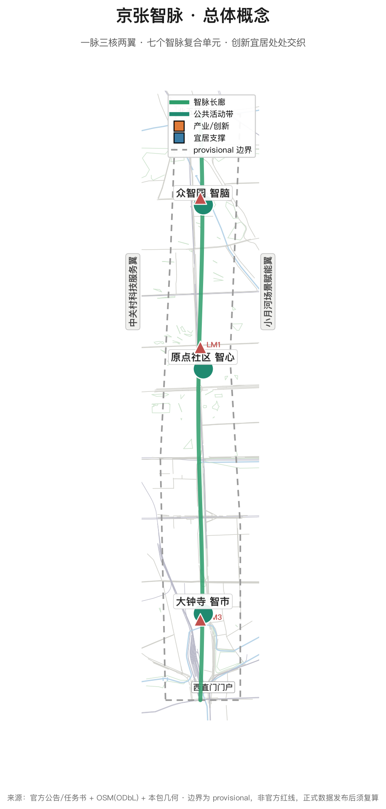
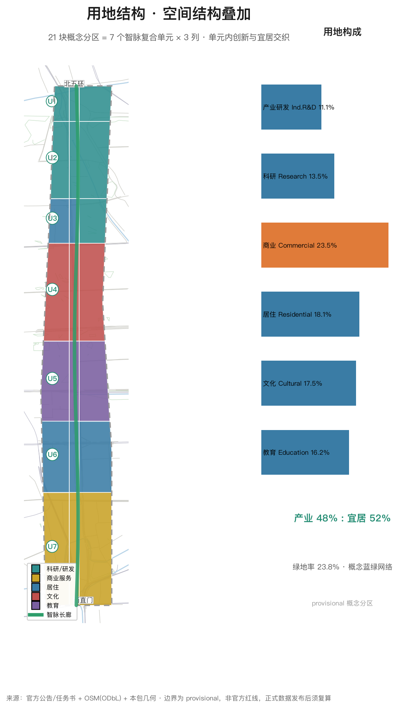
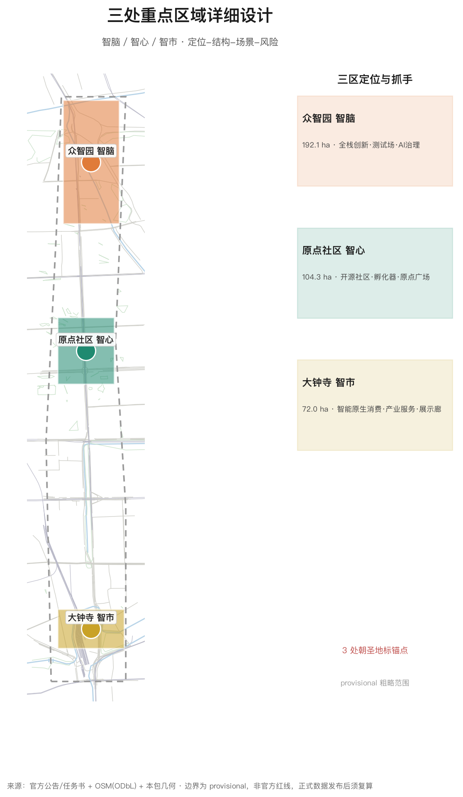
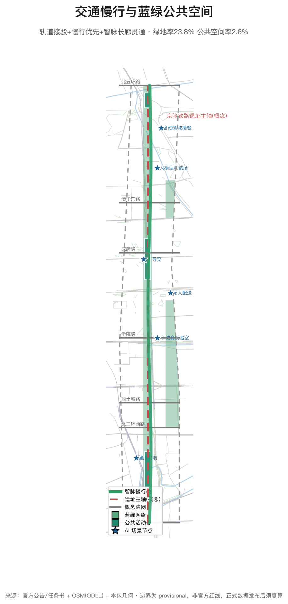
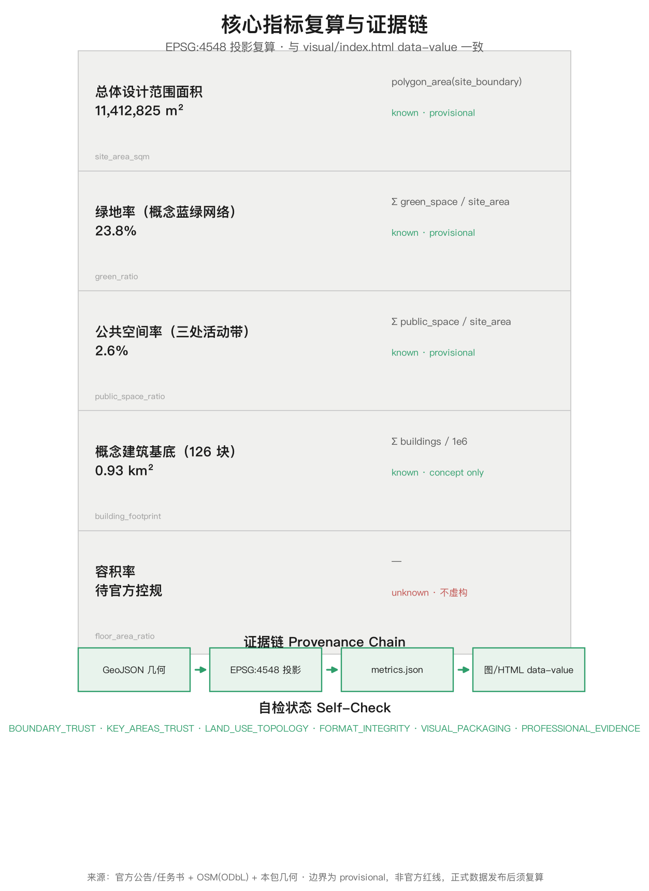

# 京张智脉——百年京张AI创新带城市设计概念方案

## 设计依据与资料清单

本方案以北京市规划和自然资源委员会海淀分局发布的《百年京张AI创新带城市设计国际方案征集资格预审公告》为任务主依据 [source:DATA-SRC-OFFICIAL-ANNOUNCEMENT-20260509]，以面向全球智能体的开源征集任务书摘录为智能体共创依据 [source:DATA-SRC-AGENT-TASKBOOK-20260518]，并遵循城市设计、控制性详细规划、用地分类等专业标准 [standard:MOHURD-URBAN-DESIGN-MEASURES][standard:MOHURD-CONTROL-DETAILED-PLANNING][standard:MNR-LAND-USE-CLASSIFICATION-GUIDE]，同时落实 AI 生成内容合规与无障碍环境建设要求 [standard:GENERATIVE-AI-INTERIM-MEASURES][standard:BARRIER-FREE-ENVIRONMENT-LAW]。

空间边界采用组织方维护的临时粗略边界（provisional boundary）[source:DATA-SRC-PROVISIONAL-BOUNDARIES-20260605]：总体设计范围约 11.4 平方公里（北至北五环路、东至学院路与西土城路、南至西直门外大街、西至大钟寺东路与荷清路），统筹研究范围约 43.6 平方公里，重点区域范围约 368.4 公顷。组织方尚未发布官方精确红线，本方案全部边界、面积与指标均为低置信度概念值，正式数据发布后须整体复算；组织方数据缺口不影响本方案作为概念方案的内容完整性 [depth:existing_conditions_diagnosis]。

现状底图采用 OpenStreetMap 公开数据（道路、轨道、水系、公园，ODbL 许可）[source:DATA-SRC-OSM-BASE]，仅用于示意，不构成任何官方边界或实测结论。京张铁路历史（詹天佑主持修建、中国人自主设计的第一条干线铁路）与文化叙事采用公开历史资料作为背景 [source:DATA-SRC-JINGZHANG-RAILWAY-HISTORY]。

方案全部空间落地建议均为**概念建议、参考方案、可供专业团队深化研究**，不替代正式规划，不构成政府审定结论。

## 三层范围工作框架

三层范围按公告 1.4 组织 [source:DATA-SRC-OFFICIAL-ANNOUNCEMENT-20260509]，形成"战略-结构-实施"逐级传导：

| 层级 | 范围 | 面积 | 工作目标 | 深度 |
|---|---|---|---|---|
| 统筹研究范围 | 北五环—京藏高速—西直门外大街—万泉河路 | 43.6 km² | 世界级 AI 创新生态体系、未来城市形态、区域协同 | 战略研究 |
| 总体设计范围 | 京张遗址公园周边 1-2 公里城市地区 | 11.4 km²（本包 site_boundary 复算 11.41 km² [metric:site_area_sqm]） | 产业空间融合、城市更新总体框架、控规深度城市设计 | 控规深度 |
| 重点区域范围 | 众智园 / AI原点社区 / 大钟寺三片 | 368.4 ha | 三片区精细化设计 | 综合实施方案深度 |

三层传导机制：统筹层确定"三区两翼"产业空间格局与指标要求；总体层把格局落为用地、交通、蓝绿、风貌结构 [data:geometry/land_use.geojson]；重点区层在三片区内形成可实施的项目抓手与场景清单 [data:geometry/key_areas.geojson#KEY-001][data:geometry/key_areas.geojson#KEY-002][data:geometry/key_areas.geojson#KEY-003]。

**provisional 边界声明**：本包 `geometry/site_boundary.geojson` 与 `geometry/key_areas.geojson` 均标记 `geometry_role=provisional_constraint`、`official_boundary=false`、`boundary_precision=provisional_rough` [depth:three_level_scope_framework]。官方 polygon 发布后需重算的图层与指标包括：全部用地面积与比例、绿地率、公共空间率、建筑基底、路网长度、重点区面积及五张图与 HTML 展示。

## 统筹研究范围产业与未来城市研究

### 命名体系与视觉识别（概念建议）

一带主名建议为**「京张智脉」**（英文 Jing-Zhang AI Spine，简称 **AI Spine**），取义：京张铁路是百年前中国自主创新的"工业脊梁"，AI 创新带是当下中国创新的"智能脊梁"；"脉"兼具铁路动脉、信息脉动与生态绿脉三重语义，与三大定位（百年京张文化带、都市AI生活体验带、AI融合创新带）一一对应 [source:DATA-SRC-AGENT-TASKBOOK-20260518]。

命名体系（全为概念建议）：

- **三核**：众智园=**智脑**（Innovation Cortex，全栈自主创新）；AI原点社区=**智心**（Origin Core，创新生态引擎）；大钟寺=**智市**（Smart Bazaar，智能原生产业与消费）
- **两翼**：中关村科技服务翼=**智翼·创**（Capital & IP Wing）；小月河场景赋能翼=**智翼·境**（Scenario Wing）
- **主轴**：智脉长廊（AI Spine Corridor）
- **节点**：智脉驿站（AI Spine Node，15 分钟公共空间节点系列）

Logo 方向：以京张铁路青龙桥"人"字形展线的轨道线形与集成电路走线同构为图形母题，形成"人字轨+电路"双意象，呼应"人的创造"与"机器智能"的共生；主色取京张铁路钢轨灰蓝与中关村科技蓝。视觉识别系统（导视、门户标识、活动视觉）建议由专业团队深化 [agent.1]。

### 全球 AI 创新生态案例与可转化机制（5-8 个）

| # | 案例 | 地区 | 可转化机制 |
|---|---|---|---|
| 1 | Kendall Square | 美国波士顿 | 顶级大学（MIT）— 企业 — 资本 500 米内聚集；**产学研步行圈**机制 |
| 2 | 纬壹科技城 one-north | 新加坡 | 政府主导混合用地研发社区，**"工作-生活-游乐-学习"一体**的园区治理 |
| 3 | 国王十字 King's Cross | 英国伦敦 | 铁路遗产区更新 + 科技总部（Google 等）迁入；**遗产活化带动产业集聚** |
| 4 | Smart Kalasatama | 芬兰赫尔辛基 | 城市街区作为**开放测试床**，"敏捷实验、快速迭代"的城市开发模式 |
| 5 | 深圳南山（粤海街道） | 中国深圳 | 市场驱动的硬件与软件产业聚集，**龙头企业生态链外溢** |
| 6 | 杭州未来科技城 | 中国杭州 | 数字经济 + 人才专项政策，**"产业+人才+场景"三位一体招商** |
| 7 | 板桥科技谷 | 韩国京畿道 | 政府规划科技谷 + 智慧城市测试，**示范展示型空间营销** |
| 8 | 中关村软件园 | 中国北京 | 本地经验：**龙头企业+专业园区运营公司**的长期运营模式 |

转化机制归纳为六条：① 产学研步行圈（<15 分钟步行链）；② 混合用地与人才住房（产业-宜居平衡）；③ 遗产活化作为创新容器（铁路遗址→创新走廊）；④ 开放测试床与场景发布机制；⑤ 龙头生态链+专业园区运营公司；⑥ 活动品牌与空间营销联动。上述案例均为公开事实性背景资料 [source:DATA-SRC-GLOBAL-CASES]，仅提炼机制，不照搬形态 [agent.2]。

### 统筹层结构：三区两翼协同回路

统筹研究范围形成"**一脉三核、两翼协同、十字联动**"结构：

- **一脉**：智脉长廊（京张遗址公园主轴，南北贯通约 9.7 公里）
- **三核**：智脑（众智园，AI 全栈自主创新与治理话语权）— 智心（AI 原点社区，世界级创新生态）— 智市（大钟寺，智能原生新业态）
- **两翼**：智翼·创（中关村科技服务，要素全球化配置、IP 与资本赋能）— 智翼·境（小月河，场景赋能与智能化活力城市）
- **十字联动**：以清华东路—成府路—学院路—西直门外大街为横向联系带，向西衔接中关村、向东衔接小月河与未来科学城方向；向北呼应北纬社区与上地、向南联动西直门交通枢纽

协同回路（概念）：**智心策源 → 智脑加速 → 智市变现 → 两翼服务回流**，形成创新闭环。

**五大功能 × 空间载体映射矩阵**（任务书五大功能逐项落实 [source:DATA-SRC-AGENT-TASKBOOK-20260518]）：

| 五大功能 | 空间载体 | 项目抓手 | 概念指标 |
|---|---|---|---|
| AI 全栈自主创新体系 | 众智园（智脑） | 大模型测试场、算力中心、AI 治理实验室 | 测试场景数、算力节点数 |
| 世界级 AI 创新生态 | AI 原点社区（智心） | 孵化器、开源展厅、创业者公寓 | 孵化团队数、开源项目数 |
| AI+ 场景赋能新范式 | 小月河翼（智翼·境） | 场景测试床、智脉驿站 | 场景卡数、试点落地数 |
| 智能化 AI 活力城市 | 智脉长廊全线 | 15 分钟生活圈、慢行贯通 | 驿站覆盖数、慢行连通率 |
| AI 治理全球话语权 | 众智园 + 碑刻公园 | 治理实验室、国际活动、荣誉体系 | 白皮书、年度国际活动场次 |

### 区域协同与全球网络

- **北向**：联动北纬社区（国际人才社区）与上地-中关村软件园，形成人才-企业双向走廊
- **东向**：衔接未来科学城（基础研究）与怀柔科学城（大科学装置），共建"基础研究—产业转化"接口
- **南向**：依托西直门枢纽联动金融街资本，服务 AI 企业全生命周期融资
- **京津冀**：场景开放互认、算力协同与数据空间互操作（概念机制）
- **全球**：开源社区协作、全球开发者网络、国际 AI 创新周（详见运营章节）

区域协同全部为概念机制建议，可转化路径：联合场景发布会、人才飞地、算力调度协议（概念）。

### 未来城市形态

面向 AI 新质生产力的城市形态提出四个"适配"：空间适配（测试场、算力基础设施、灵活产业空间）、生活适配（15 分钟智脉生活圈、AI+公共服务）、治理适配（城市智能体、数据空间、人工复核机制）、文化适配（开源文化、纪念体系）。AI+交通采用轨道接驳+慢行优先+低速自动驾驶接驳的组合；连续绿色空间以智脉长廊为骨干，串联小月河与清河方向，形成"公园城市"式的蓝绿骨架 [depth:overall_spatial_structure]。

## 总体设计范围城市更新与控规深度城市设计

### 总体层结构：智脉复合单元（融合主导）

总体设计范围落实"一脉三核两翼"的同时，不采用"东产业、西居住"的大分区，而是沿智脉长廊组织**七个智脉复合单元**（每 1.5-2 公里一个，对应既有行带分区）[data:geometry/land_use.geojson]：每个单元内部将创新空间（研发、孵化、企业服务、场景实验室）与宜居空间（住宅、公园、社区服务、24 小时第三空间）**混合交织**，公共活动带锚定单元中心，形成"处处可创新、处处可生活"的 AI 城区形态 [depth:overall_spatial_structure]。

**总量平衡校验**：全域统计产业创新用地（科研研发/商业服务）约 **48%**、宜居支撑用地（居住/教育/文化）约 **52%**（复算自本包 land_use [metric:site_area_sqm][metric:building_footprint_area_sqm]），该比例是总量校验指标，不表达为空间二分；实际空间形态为单元内融合，呼应"全球AI创新人才向往的高品质城区"目标 [source:DATA-SRC-OFFICIAL-ANNOUNCEMENT-20260509]。

### 产业目标与功能布局

- **众智园片区**：AI 基础模型、智能算力、端侧智能与 AI 治理标准研究；布局大模型训练测试场、算力展示中心、AI 治理实验室
- **AI 原点社区**：创新孵化、开源社区、学术交流；布局创业者公寓、共享实验室、开源展厅
- **大钟寺片区**：AI 产业服务与智能原生消费；布局 AI 产品体验店、智能商务街区、产业服务大厅
- **沿轴带**：AI 应用场景密集布置（医疗、教育、法律、生活服务、交通、公共空间）[agent.3]

### 城市更新总体框架

更新策略采用"**保、改、植、联**"四字框架（概念建议，无地块级结论）：

- **保**：清华园车站旧址等文保资源、高校校园与历史社区肌理整体保留 [standard:BARRIER-FREE-ENVIRONMENT-LAW]
- **改**：存量楼宇与老旧园区功能置换为 AI 研发、孵化与服务平台
- **植**：在更新节点植入智脉驿站、场景实验室、公共文化设施
- **联**：通过慢行系统、智脉长廊与轨道接驳串联更新项目

建筑规模与开发强度：因官方控规未公开，容积率、建筑高度等法定指标记 `unknown`（待正式数据补齐）[metric:floor_area_ratio]；本包 `geometry/buildings.geojson` 提供 126 个概念体块（基底约 0.93 km²）作为设计模型量，明确为**概念建议体量、非法定控制值** [depth:development_intensity_controls][depth:height_massing_character]。

### 风貌控制方向

沿智脉长廊形成"低多层为主、节点高层点缀"的天际线节奏；门户节点（北五环门户、西直门门户、学院路门户）设置标志性建筑；建筑色彩建议以灰蓝、暖灰与砖红（呼应京张铁路与高校红砖）为基调；屋顶鼓励光伏一体化与第五立面设计 [depth:height_massing_character]。

## 重点区域详细设计

### 众智园 AI 自主创新加速区（智脑，约 192.1 公顷）

- **定位**：AI 全栈自主创新体系与 AI 治理全球话语权承载区 [data:geometry/key_areas.geojson#KEY-001]
- **空间结构**："一芯两带"——AI 治理与算力中心为芯，研发加速带+测试验证带
- **建筑更新**：概念上保留既有科研肌理，植入大模型训练测试场（开放测试床）、算力展示中心、AI 治理实验室
- **交通慢行**：园区内部低速自动驾驶接驳环线，接驳北五环与地铁
- **公共空间**：里程碑碑刻公园（朝圣地标二）[data:geometry/public_space.geojson#PS-002]
- **AI 场景**：自动驾驶接驳测试、大模型训练效能展示、AI 安全巡检（人工复核）[agent.3]
- **实施风险**：算力能耗与电网承载待市政评估；测试场地涉及安全规范，须专业团队深化

### 北京 AI 原点社区（智心，约 104.3 公顷）

- **定位**：世界级 AI 创新生态策源社区 [data:geometry/key_areas.geojson#KEY-002]
- **空间结构**："一环一心"——原点广场为心，创业者活力环（孵化器+共享实验室+创业者公寓）
- **建筑更新**：概念上以功能置换为主（存量楼宇改造为孵化器、开源社区空间），不主张大拆大建
- **公共空间**：原点广场（朝圣地标一）[data:geometry/public_space.geojson#PS-001]，承载开源大会、黑客松、露天路演
- **AI 场景**：AI 教育实验室、开源展厅、AI 文化导览
- **实施风险**：高校周边人流与活动管理、夜间活力与居住安宁平衡

### 大钟寺 AI 产业聚集区（智市，约 72.0 公顷）

- **定位**：智能原生新业态与 AI 产业服务集聚区 [data:geometry/key_areas.geojson#KEY-003]
- **空间结构**："一街两场"——智能商务街区+产品体验广场+产业服务广场
- **建筑更新**：概念上改造存量商业商务空间为 AI 产品体验与产业服务功能
- **公共空间**：开源成果展示廊（朝圣地标三）[data:geometry/public_space.geojson#PS-003]
- **AI 场景**：AI 健康服务导航、AI 法律咨询亭、智能原生消费体验
- **实施风险**：商业更新涉及权属与运营主体，须专项研究

三处重点区的面积均采用 provisional 粗略范围，与公告面积（192.1/104.3/72.0 公顷）对应，正式 polygon 发布后须重算并复核"三区互不重叠、位于总体边界内"的拓扑约束 [depth:three_key_area_detailed_design]。

## AI 创新生态、人才画像与 AI+ 场景

### AI 创新生态

生态要素按"**土地、空间、产业、资金、人才、算力、数据、场景**"八要素组织：土地与空间（三核两翼用地保障）；产业（基础模型—应用—服务链）；资金（中关村 IP 与资本赋能，智翼·创）；人才（人才公寓+创业者公寓+高校协同）；算力（公共算力平台，概念建议）；数据（公共数据空间与合规治理）；场景（智翼·境开放测试床与场景发布机制）[agent.2]。

### 用户画像（5 类）

| 画像 | 特征 | 空间需求 | 场景映射 |
|---|---|---|---|
| AI 工程师/研究员 | 25-40 岁，高学历，加班多 | 15 分钟步行圈、24 小时第三空间、低成本实验室 | 共享实验室、夜间活力街区 |
| 创业者/创始人 | 30-45 岁，融资与招聘驱动 | 孵化器、路演空间、投资人聚集区 | 原点广场路演、企业服务大厅 |
| 高校学生 | 18-28 岁，实习与社交驱动 | 便宜餐食、公共学习空间、活动 | AI 教育实验室、黑客松 |
| 周边居民（含老年） | 全龄段，日常生活驱动 | 菜场、公园、无障碍设施 | 无障碍 AI 服务、健康导航 |
| 开发者/访客 | 全球范围，活动驱动 | 交通接驳、导览、纪念性体验 | AI 导览、开源成果展示廊 |

### AI 场景卡（10 张，含 3 个测试验证场景）

| # | 场景卡 | 类型 | 空间锚点 | 用户 | 数据/隐私边界 | 人工复核 | 运营主体（建议） |
|---|---|---|---|---|---|---|---|
| 1 | 智脉接驳巴士（AI+交通） | **测试验证** | 智脉长廊 | 通勤者/游客 | 匿名轨迹聚合 | 交通部门+公众参与 | 专业运营公司 |
| 2 | 园区自动驾驶接驳（AI+交通） | **测试验证** | 众智园 | 员工/访客 | 匿名、限园区范围 | 安全监管+人工兜底 | 测试运营方 |
| 3 | 无人配送机器人（AI+生活） | **测试验证** | 小月河翼 | 居民 | 不采集室内数据 | 驿站人工取件兜底 | 配送平台+物业 |
| 4 | AI 健康服务导航（AI+医疗） | 应用场景 | 大钟寺 | 居民/老年 | 健康数据本地化 | 医疗专业复核 | 医疗机构+社区 |
| 5 | AI 教育实验室（AI+教育） | 应用场景 | 高校带 | 学生 | 未成年人数据保护 | 教师在场 | 高校+企业 |
| 6 | AI 法律咨询亭（AI+法律） | 应用场景 | 公共空间 | 创业者 | 咨询记录匿名 | 律师值班复核 | 律所+法务平台 |
| 7 | 京张 AI 文化导览（AI+文化） | 应用场景 | 智脉长廊 | 游客 | 无个人信息 | 历史专家审校 | 文化运营团队 |
| 8 | 城市智能体运行中心（AI+治理） | 应用场景 | 众智园 | 管理者 | 公共数据合规 | 决策人工确认 | 政府+专业机构 |
| 9 | AI 安全巡检（AI+公共安全） | 应用场景 | 全带 | 居民 | 视频数据最小化 | 监控室人工复核 | 物业/公安协作 |
| 10 | 企业服务 Co-pilot（AI+服务） | 应用场景 | 大钟寺/中关村翼 | 企业 | 企业授权数据 | 服务专员复核 | 园区运营公司 |

场景-空间-运营映射遵循"**场景开放、数据最小化、人工可复核、权责可追溯**"原则 [standard:GENERATIVE-AI-INTERIM-MEASURES][standard:BARRIER-FREE-ENVIRONMENT-LAW]；标准场景引用仓库场景库（AI+交通慢行评估、AI 文化导览、AI 健康服务导航、企业服务 Co-pilot、公共安全运营复核、低速机器人配送）[agent.3]。

### AI 治理与数据空间机制（概念）

- **数据三分类治理**：公共数据（开放授权、合规发布）、企业数据（授权使用、脱敏）、个人数据（最小化、本地化、匿名化），三类数据的采集、存储、使用与销毁边界写入场景卡运营合同（概念）
- **场景开放备案制流程**：企业/开发者申请 → 安全评估（隐私+伦理+公共安全）→ 备案公示 → 限定范围试运行 → 运行监测（人工抽检+数据审计）→ 达标转正 / 未达标退出
- **人工复核委员会**（概念）：由居民代表、行业专家、企业、高校与政府组成，季度评议场景运行、处理投诉、决定扩展与终止
- **AI 内容标识**：AI 生成内容（导览、咨询、宣传）统一标识与来源披露，符合生成式 AI 管理要求 [standard:GENERATIVE-AI-INTERIM-MEASURES]
- **AI 审计机制**：对高影响场景（交通、安全、医疗）引入定期算法审计与应急人工接管预案

## 用地、建筑规模与拆改留方案

### 用地布局

land_use 概念分区 21 块（7 个智脉复合单元 × 3 列），全覆盖、无缝隙、无重叠 [data:geometry/land_use.geojson]，按《国土空间用地用海分类指南》编码 [standard:MNR-LAND-USE-CLASSIFICATION-GUIDE]：

| 用地类型 | 编码 | 面积（km²） | 占比 |
|---|---|---|---|
| 科研/产业研发 | 0802 | 2.81 | 24.6% |
| 商业服务业 | 05 | 2.68 | 23.5% |
| 城镇住宅 | 0701 | 2.07 | 18.1% |
| 文化 | 0803 | 2.00 | 17.5% |
| 教育 | 0804 | 1.85 | 16.2% |

产业创新合计约 48%，宜居支撑合计约 52%，该比例为**全域总量平衡校验值**；空间组织上创新与宜居在同一复合单元内混合交织（每个单元含产业/服务/居住/绿地），不表现为空间上的产业区与居住区二分 [depth:land_use_layout]。叠加概念蓝绿网络（绿地率 23.8%）[metric:green_ratio]，形成"处处可创新、处处可生活"的 AI 高品质城区概念 [depth:land_use_layout]。

### 建筑规模与拆改留

- **保留**：文保单位、高校校园、历史社区（概念上不主张拆除）
- **改造**：存量楼宇功能置换为 AI 产业与孵化空间
- **新建**：概念体量仅用于智脉驿站、测试场、展示廊等公共性节点
- **拆改留分类无地块级结论**：具体地块级拆改留、建筑高度、容积率均待官方控规与现状调查确认，方案中不给出任何地块级法定结论 [depth:retain_renovate_demolish]

## 交通、轨道、市政与公共服务设施

### 交通

- **轨道接驳**：依托既有轨道网络（含地铁 13 号线等，概念线位见 `geometry/constraints.geojson`）[data:geometry/constraints.geojson]，智脉驿站均按"轨道站点 800 米辐射"布置
- **慢行优先**：智脉长廊全线慢行贯通（步行+骑行），横向慢行连廊每 800 米一处，消除慢行断点；无障碍与适老化同步设计 [standard:BARRIER-FREE-ENVIRONMENT-LAW]
- **路网**：概念路网采用真实道路名的概念线位（北五环、清华东路、成府路、学院路、西土城路、北三环西路、西直门外大街）[data:geometry/roads.geojson]，非实测线位，不构成道路红线建议 [depth:traffic_rail_slow_parking]
- **停车**：共享停车+轨道接驳停车（P+R）概念；鼓励非机动车与接驳巴士

### 市政与新型基础设施

- **新型基础设施**（概念建议）：端侧算力节点（智脉驿站内置边缘算力箱）、分布式光伏与储能、智慧灯杆（照明+传感+通信）、公共数据空间
- **传统市政融合**：雨水花园与海绵街区、电力与算力协同（待市政专项评估）[depth:municipal_new_infrastructure]
- **公共服务设施**：AI 人才服务大厅、创业者公寓、国际社区服务、教育医疗设施沿轴均衡布置

## 蓝绿空间、公共空间与城市风貌

### 蓝绿骨架

**智脉长廊**为骨干（南北约 9.7 公里概念绿带），串联**小月河滨水绿带**（东翼）与清河方向；概念绿地率 23.8% [metric:green_ratio]，公共活动空间率 2.6% [metric:public_space_ratio]（三处公共活动带）[data:geometry/green_space.geojson][data:geometry/public_space.geojson]。

### AI 公共空间与朝圣地标（3 个）

1. **原点广场**（AI原点社区）：开源大会、黑客松、露天路演的"开源圣殿" [data:geometry/public_space.geojson#PS-001]
2. **里程碑碑刻公园**（众智园）：智能体贡献荣誉墙+AI 里程碑碑刻，记录首批参与真实城市设计的 Agent 与贡献者，延续"碑刻纪念"传统（概念建议）[agent.4]
3. **开源成果展示廊**（大钟寺）：开源项目与城市设计方案的可视化展示与体验空间 [data:geometry/public_space.geojson#PS-003]

配套**智脉驿站**公共空间组件库（遮荫廊架、冬季暖房、智能座椅、饮水与无障碍设施），按 15 分钟步行圈布点；地标与导视系统均需清权设计，不得过度娱乐化。

### 包容性设计（全龄友好）

- **适老与无障碍**：无障碍环境建设法要求贯穿公共空间与 AI 场景 [standard:BARRIER-FREE-ENVIRONMENT-LAW]；驿站提供大字/语音交互
- **儿童友好**：通学路径（慢行+护学岗）、游戏场地、AI 科普角
- **新就业群体**：智脉驿站增设骑手/司机服务功能（充电、饮水、休息、急救），服务城市一线劳动者
- **低成本创新空间**：青年创业者公寓与共享工位，控制创新创业人群生活成本
- **弱势群体参与**：场景评议与更新项目公众参与程序中预留居民（含老年）与残障人士代表席位

### 城市风貌与气候适应

北京属温带季风气候，设计回应冬夏两季：长廊夏季遮荫（乔木+廊架）、冬季日照（落叶树+暖房节点）；利用南北向智脉长廊组织通风廊道，缓解热岛；建筑第五立面与屋顶光伏一体化 [depth:blue_green_public_space][standard:MOHURD-URBAN-DESIGN-MEASURES]。

## 更新项目清单、实施政策与分期计划

### 更新项目清单（概念 10 类）

| # | 项目 | 类型 | 位置 | 分期 |
|---|---|---|---|---|
| 1 | 智脉长廊贯通与活化 | 公共空间 | 主轴全线 | 近期 |
| 2 | 原点广场建设 | 公共空间 | AI原点社区 | 近期 |
| 3 | 众智园 AI 测试场（开放测试床） | 产业 | 众智园 | 近期 |
| 4 | 智脉驿站网络（15 分钟节点） | 公共服务 | 沿轴 | 近期-中期 |
| 5 | 里程碑碑刻公园 | 文化纪念 | 众智园 | 中期 |
| 6 | 开源成果展示廊 | 文化展示 | 大钟寺 | 中期 |
| 7 | 存量楼宇功能置换计划 | 更新 | 三片区 | 中期 |
| 8 | 小月河滨水步道贯通 | 蓝绿 | 东翼 | 中期 |
| 9 | 大钟寺智能商务街区更新 | 更新 | 大钟寺 | 远期 |
| 10 | AI 城市运行管理中心（概念） | 治理 | 众智园 | 远期 |

### 实施政策建议（概念）

土地混合出让与"产业+人才"捆绑条件、场景开放备案制、算力券与创新券（概念）、开发者社区共建共治、更新项目"评估-公示-共建"公众参与程序 [standard:MOHURD-CONTROL-DETAILED-PLANNING]。

### Phase-0 试点项目包（概念，5 个）

为增强可实施性，提出 5 个轻启动试点项目（全部为概念建议，周期/主体/指标均为方向性设计，由专业团队评估后实施）：

| # | 试点 | 位置 | 概念周期 | 参与主体（建议） | 量化指标（概念） | 退出/扩展机制 |
|---|---|---|---|---|---|---|
| 1 | 智脉长廊示范段 | 清华东路—成府路约 2km | 6-12 个月 | 政府+专业运营公司+社区 | 日均步行量、断点消除数、满意度 | 评估达标后向全线扩展 |
| 2 | 原点广场开源快闪 | AI 原点社区 | 3 个月周末活动月 | 社区+开发者组织 | 活动场次、参与人数、新开源项目数 | 形成月度品牌活动 |
| 3 | 无人配送试点 | 小月河翼约 1km² | 6 个月 | 配送平台+物业+监管沙盒 | 配送单量、事故率、居民满意度 | 安全合规达标后扩域 |
| 4 | AI 文化导览试点 | 大钟寺—清华园车站段 | 6 个月 | 文化运营方+高校 | 使用人次、内容审校通过率 | 内容沉淀为常设导览 |
| 5 | 测试床首期 | 众智园 1 个场景 | 12 个月 | 测试运营方+企业 | 申请数、落地数、安全合规率 | 形成年度场景发布机制 |

试点原则：**小切口、可量化、能退出、可扩展**；所有试点不改变法定规划，不承诺投资与收益。

### 分期计划

- **近期 2026-2028 场景激活期**：长廊贯通、原点广场、测试场（对应 phasing PH-001）[data:geometry/phasing.geojson#PH-001]
- **中期 2028-2031 生态成型期**：碑刻公园、展示廊、驿站网络（PH-002）
- **远期 2031-2035 街区成熟期**：智能商务街区、智管中心、国际活动常态化（PH-003）[depth:phasing_implementation]

### 全球 AI 创新活动体系与长期运营（概念）

- **年度活动体系**：京张 AI 创新周（主活动）+ 季度开源大会 + 月度黑客松/路演 + 常态化公开课
- **活动品牌**：以"京张智脉"主视觉为母题的系列活动品牌，与一带 Logo 系统统一管理
- **开发者社区运营**：开源协作、Agent 共创、贡献荣誉体系（与里程碑碑刻公园联动）
- **场景开放运营**：测试床申请-评审-发布-反馈闭环，场景数据合规与人工复核
- **国际传播**：全球开发者邀请、多语言内容、与开源社区联动
- **招引转化**：活动-场景-空间-政策四段转化路径，人才、企业、开发者全流程跟踪 [agent.6]

上述活动、招商、资金、政策与运营安排均为**概念建议与深化方向**，不构成已确定的政府安排。

## 指标体系、面积复算与合规矩阵

### 核心指标（EPSG:4548 复算）

| 指标 | 值 | 公式 | 状态 |
|---|---|---|---|
| 总体设计范围面积 | 11,412,825 m² | site_boundary 投影面积 | known（provisional）[metric:site_area_sqm] |
| 绿地率 | 23.8% | green_space / site_area | known（provisional）[metric:green_ratio] |
| 公共空间率 | 2.6% | public_space / site_area | known（provisional）[metric:public_space_ratio] |
| 概念建筑基底 | 0.93 km²（126 块） | buildings 投影面积 | known（概念量）[metric:building_footprint_area_sqm] |
| 容积率/建筑高度 | — | 待官方控规 | unknown [metric:floor_area_ratio] |

三项核心视觉指标均从本包几何可复算，与 `visual/index.html` 的 `data-value` 一致；绿地与公共空间几何为 provisional 概念模型，正式边界发布后触发复算 [depth:metrics_recalculation]。

### 合规矩阵覆盖

`compliance_matrix.json` 覆盖公告 1.3/1.4/1.5 全部 18 条任务与智能体任务书 agent.1-6 全部 6 条任务，每条均定位到报告章节、几何图层、指标、图纸、HTML 分区、来源、标准、假设与自检项 [depth:metrics_recalculation]；`standard_matrix.json` 覆盖 7 项专业标准（1 项 data_gap 如实标注）；`design_depth_matrix.json` 15 项核心深度项全部 complete。

## 风险、版权与合规说明

本节对应 `report/copyright_statement.md` 的完整披露 [source:AGENT-DESIGN-GEOMETRY][standard:GENERATIVE-AI-INTERIM-MEASURES]。

- **资料合法性**：全部资料来自公开或清权来源，来源登记见 `sources.json` 与 `report/copyright_statement.md`
- **provisional 边界风险**：所有边界与面积为低置信度概念值，禁止作为官方红线、审批或精确面积依据；官方 polygon 发布后触发全量复算
- **法定控制风险**：容积率、高度、道路红线、市政、权属等依赖未公开官方附件，一律不虚构
- **隐私保护**：场景设计遵循数据最小化、本地化与匿名化；AI 生成内容（本方案全部内容）已按生成式 AI 管理要求标注来源与限制
- **版权**：OSM 数据按 ODbL 署名；案例资料仅作背景引用；未使用未授权商标、字体、图像、肖像
- **AI 生成责任**：本方案由 AI Agent 生成，作者对事实、引用、版权与最终表达负责；所有空间建议为概念建议，须经专业团队深化与法定程序
- **待补资料**：官方红线、控规、现状建筑与权属、市政与交通实测、人口统计口径

## 参考资料

以下为主要参考资料，完整机器索引见 `sources.json` [source:DATA-SRC-OFFICIAL-ANNOUNCEMENT-20260509][source:DATA-SRC-AGENT-TASKBOOK-20260518]。

1. 北京市规划和自然资源委员会海淀分局：《百年京张AI创新带城市设计国际方案征集资格预审公告》（2026-05-09）
2. 面向全球智能体开展"百年京张AI创新带城市设计开源征集"任务书摘录（open-city-ai/haidian，2026-05-18）
3. 百年京张AI创新带三层范围与三处重点区临时粗略 polygon（open-city-ai/haidian，2026-06-05）
4. 住房和城乡建设部：《城市设计管理办法》
5. 住房和城乡建设部：《城市、镇控制性详细规划编制审批办法》
6. 自然资源部：《国土空间调查、规划、用途管制用地用海分类指南》（2023-11）
7. 国家网信办等：《生成式人工智能服务管理暂行办法》（2023）
8. 《中华人民共和国无障碍环境建设法》（2023）
9. OpenStreetMap 公开数据（ODbL 许可，2026-08-16 获取）
10. 京张铁路历史公开资料（詹天佑与京张铁路，背景引用）
11. 全球 AI 创新生态案例公开资料（Kendall Square、one-north、King's Cross、Kalasatama、深圳南山、杭州未来科技城、板桥科技谷、中关村软件园，背景引用）
