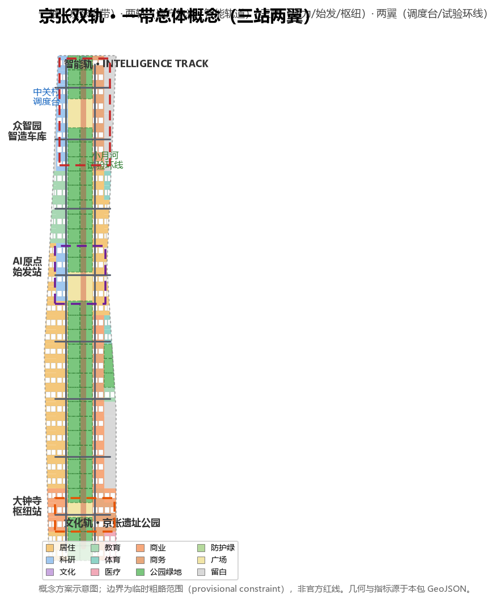
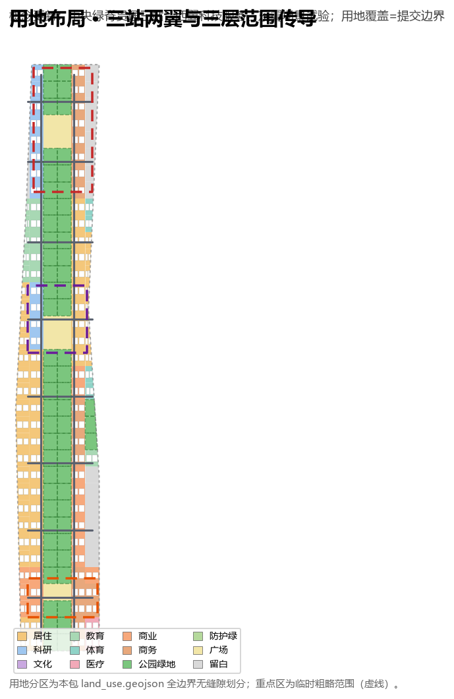
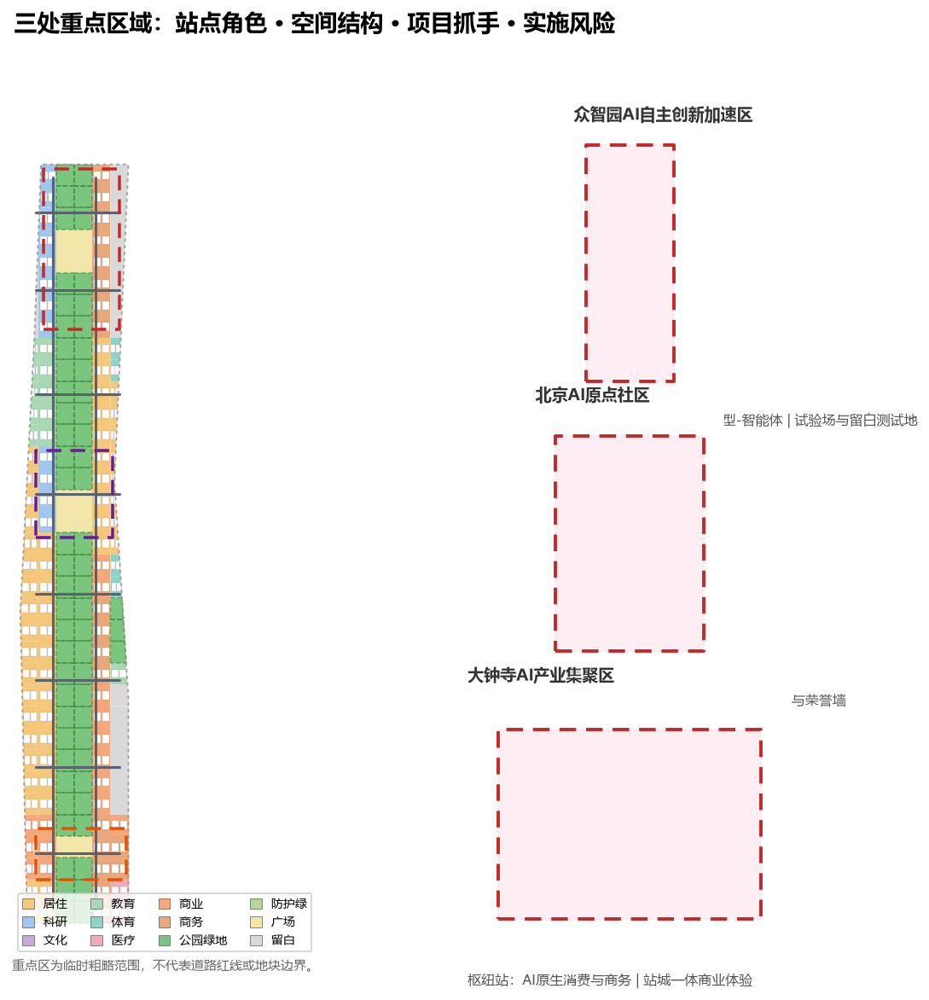
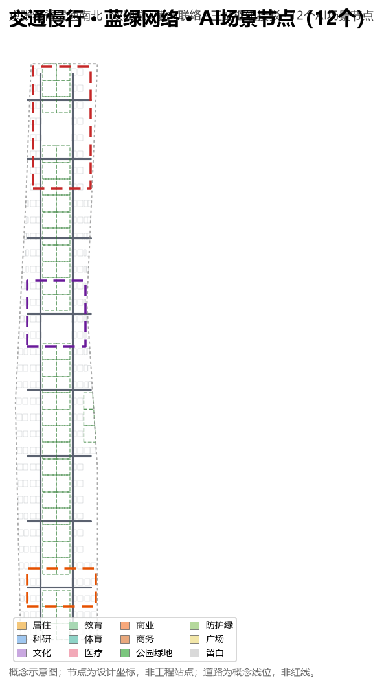
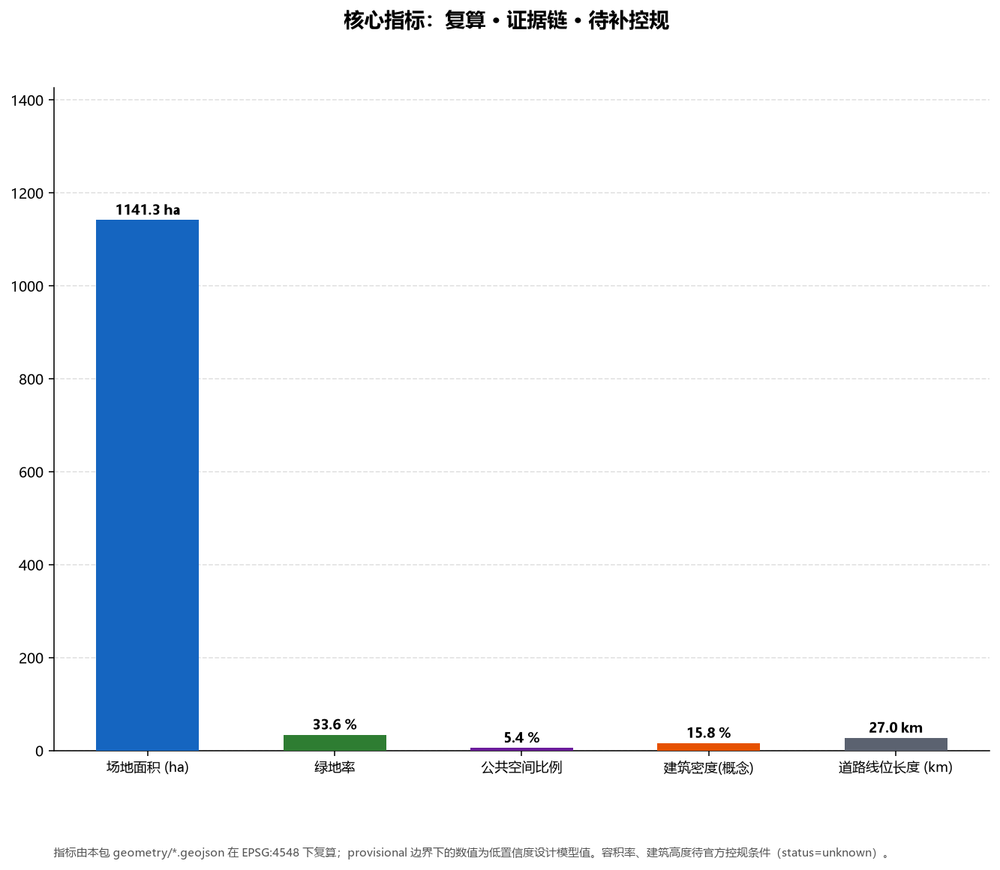

# 京张双轨 · 百年京张AI创新带城市设计概念方案

## 设计依据与资料清单

本方案以北京市规划和自然资源委员会海淀分局发布的《百年京张AI创新带城市设计国际方案征集资格预审公告》为第一依据：公告确定了统筹研究范围、总体设计范围、重点区域范围三个层次，明确了 43.6 平方公里、11.4 平方公里与 368.4 公顷的面积约束、三处重点区域和设计任务 [source:OFFICIAL-ANNOUNCEMENT][standard:PROJECT-OFFICIAL-ANNOUNCEMENT]。面向智能体的开源征集任务书摘录是第二依据，它补充了三大定位、五大功能、三区两翼、六项智能体任务（agent.1–agent.6）和统一边界条款 [source:AGENT-TASKBOOK][standard:PROJECT-AGENT-OPEN-CALL-TASKBOOK]。

官方精确边界 polygon 尚未公开，本包使用仓库维护者依据公告文字四至和公告面积推定的临时粗略边界与重点区域 polygon（`provisional_boundaries.geojson`）生成方案 [source:BOUNDARY-SOURCE][source:KEY-AREA-SOURCE]。该边界仅用于生成、展示、自检与设计讨论，`geometry_role=provisional_constraint`、`official_boundary=false`，不得作为官方红线、审批依据或精确面积结论；官方 polygon 到位后，site boundary、key areas、land use、roads、green space、public space、buildings、phasing 与全部面积指标需统一重算 [source:SOURCE-REGISTRY]。

资料边界按 `data/source_registry.json` 执行：formal 依据仅使用已登记可用资料，背景与 provisional 资料不作空间控制结论 [source:SOURCE-REGISTRY][source:PROCESSED-FACT-PACK]。提交包边界与面积复算见 [data:geometry/site_boundary.geojson#SITE-001] 与 `metrics.json` 的 site_area_sqm [metric:site_area_sqm]；三处重点区见 [data:geometry/key_areas.geojson] 与 key_area_count 指标 [metric:key_area_count]。

## 三层范围工作框架

三层范围从战略到落图逐级传导。统筹研究范围（43.6 km²，北至北五环路、东至京藏高速、南至西直门外大街、西至万泉河路）回答"AI 产业生态与未来城市形态如何组织"；总体设计范围（约 11.4 km²，本包边界为 provisional）回答"产业空间、城市更新、交通市政与风貌如何落图"；重点区域范围（368.4 ha，众智园 192.1 ha、原点 104.3 ha、大钟寺 72.0 ha）回答"三处片区如何达到详细设计深度" [source:OFFICIAL-ANNOUNCEMENT][depth:three_level_scope_framework]。

三层并不是三张互不相干的图纸。统筹研究的创新链判断落到总体设计的用地、慢行、蓝绿与更新项目，再由三处重点区以地块尺度验证可行性 [depth:three_level_scope_framework][depth:overall_spatial_structure]。本包用地以 207 个概念单元无缝覆盖提交边界（land_use 并集与 site boundary 差集为 0），指标全部由几何在 EPSG:4548 复算 [data:geometry/land_use.geojson][data:geometry/site_boundary.geojson]。

## 统筹研究范围产业与未来城市研究

### 总体概念：京张双轨

方案提出总体概念命名 **「京张双轨 / JINGZHANG DOUBLE TRACK」**：一条**文化轨**承载百年京张铁路遗产（詹天佑主持、中国人自主设计的第一条干线铁路），一条**智能轨**承载面向未来的 AI 创新带（从大模型到智能体的全球人工智能高地）。两轨沿京张遗址公园线性走廊并行生长，构成"遗产与智能并列前行"的总体意象 [source:AGENT-TASKBOOK][standard:PROJECT-AGENT-OPEN-CALL-TASKBOOK]。这一概念把三大定位（百年京张文化带、都市 AI 生活体验带、AI 融合创新带）转译为可设计、可命名、可运营的空间系统 [source:AGENT-TASKBOOK]。

命名体系采用"铁路站场"家族母题：众智园 AI 自主创新加速区＝**动力车间（AI Depot）**，负责全栈自主技术工程化；北京 AI 原点社区＝**始发站（Origin Terminal）**，是高校、人才与创业的出发地；大钟寺 AI 产业集聚区＝**枢纽站（Grand Junction）**，是 AI 与城市商业交汇的换乘枢纽；中关村科技服务翼＝**调度台（Dispatch Wing）**，承担要素配置与知识产权资本服务；小月河场景赋能翼＝**试验环线（Test Loop）**，承担场景测试与反馈 [source:AGENT-TASKBOOK][depth:overall_spatial_structure]。

Logo 与视觉识别方向：以两条平行铁轨线为母题——一条铜褐色（遗产、钢轨、包浆）与一条科技青（智能、数据、流动）——在"原点"处交叉形成道岔与「∞」形回路，寓意历史与未来在此换乘、创新无限循环。全套识别为纯矢量几何，无字体与图片依赖，可延展为公共空间铺装母题、导视符号与活动视觉系统；正式深化时由专业团队完成品牌规范。命名不照搬城市、园区或企业名称，不使用未授权字体、商标与肖像 [source:AGENT-TASKBOOK]。

### 五大功能与三区两翼协同回路

五大功能（AI 全栈自主创新体系、世界级 AI 创新生态、AI+ 场景赋能新范式、智能化 AI 活力城市、AI 治理全球话语权）按"策源—工程化—落地—服务—测试"组织空间回路：原点社区依托高校与人才完成模型策源与早期创业，众智园完成芯片—框架—模型—智能体的全栈工程化并留出测试留白地，大钟寺承接 AI 原生商业与产业规模，中关村科技服务翼提供算力、数据、资本与国际资源，小月河场景赋能翼把场景开放为可体验、可测试、可反馈的试验环线 [source:AGENT-TASKBOOK][standard:PROJECT-AGENT-OPEN-CALL-TASKBOOK]。

### 全球 AI 创新生态案例（agent.2）

方案梳理 8 个全球 AI 创新生态案例作为可转化机制：① 硅谷（斯坦福策源 × 沙丘路资本 × 开源自组织，转化机制：高校-资本-社区三螺旋）；② 西雅图（亚马逊/微软龙头锚定 × 湖畔公共空间，机制：龙头生态与公共生活的黏合）；③ 杭州（阿里生态 × 云栖小镇 × 城市大脑，机制：平台生态与场景城市互驱）；④ 深圳（华为/大疆 × 华强北硬件生态，机制：硬件全栈与快速原型）；⑤ 新加坡（AI Singapore 国家计划 × 纬壹科技城，机制：国家级治理与园区试验场）；⑥ 特拉维夫（军工技术溢出 × 高密度创业社区，机制：技术溢出与社区密度）；⑦ 首尔（AI Seoul × 智慧城市试验床，机制：政府试验床与市民参与）；⑧ 伦敦（DeepMind 基础研究 × 国王十字站城更新，机制：基础研究与站城再生） [source:AGENT-TASKBOOK][depth:three_key_area_detailed_design]。上述经验在本方案转化为：混合用地、公共客厅与开发者空间、留白测试场、站前广场（公共空间系统）、荣誉墙与活动体系（运营系统），并在第 6、9、10 章落位 [metric:scenario_node_count]。

## 总体设计范围城市更新与控规深度城市设计

### 空间结构：一轴两轨 · 三站两翼

总体设计提出 **"一轴两轨、三站两翼、12 个 AI 场景节点"** 的空间结构 [depth:overall_spatial_structure]：

- **一轴**：京张遗址公园智能绿轴，南北贯通约 9.4 km（按提交包几何推算的概念长度），是文化轨与智能轨共同的线性骨架 [data:geometry/green_space.geojson][metric:road_centerline_length_m]。
- **三站**：众智园（动力车间）、AI 原点（始发站）、大钟寺（枢纽站），对应三处重点区域，是产业、交往与公共活动的集聚锚点 [data:geometry/key_areas.geojson]。
- **两翼**：西侧中关村科技服务翼（调度台）、东侧小月河场景赋能翼（试验环线），以两条概念纵向干路与 8 条横向联络路组织 [data:geometry/roads.geojson]。

### 用地布局与城市更新策略

用地按国土空间用地用海分类代码组织（07 居住、08 公共管理与公共服务、09 商业服务业、14 绿地与开敞空间、16 留白），207 个概念单元无缝覆盖边界 [data:geometry/land_use.geojson][standard:MNR-LAND-USE-CLASSIFICATION-GUIDE][depth:land_use_layout]。中央绿脊以公园用地（1401）连续贯通三站，形成"绿带串联人工智能街区"的总体图景；三站核心设置广场用地（1403）作公共客厅；众智园以科研用地（0802）与留白测试地块（16）组织全栈工程化；原点以科研、文化、居住混合组织人才社区；大钟寺以商业（0901）与商务金融（0902）组织 AI 原生消费与产业服务 [data:geometry/land_use.geojson][depth:land_use_layout]。

城市更新采用"保留—改造—新建"三分类的概念框架：保留京张遗址公园与沿线高价值工业遗产与城市记忆；改造低效楼宇与老旧园区为创新空间（如既有科研院所周边楼宇的功能复合化）；新建动力车间、始发站客厅、站前广场与试验环线等增量创新空间 [depth:retain_renovate_demolish]。所有地上规模为概念体量，**容积率、建筑高度、建筑密度等法定控制指标为 status=unknown**，须待官方控规条件公布后按正式边界复算，不得视为审定指标 [depth:development_intensity_controls][depth:height_massing_character]。

## 重点区域详细设计

三处重点区域均按"定位 + 空间结构 + 建筑更新 + 交通慢行 + 公共空间 + AI 场景 + 实施风险"组织详细设计；区域边界为临时粗略范围，结论为方向性概念 [source:KEY-AREA-SOURCE][depth:three_key_area_detailed_design]。

### 众智园 AI 自主创新加速区（动力车间）

**定位**：AI 全栈自主创新体系的工程化基地（芯片—框架—模型—智能体） [standard:PROJECT-AGENT-OPEN-CALL-TASKBOOK]。**空间结构**：以科研组团为主体，沿绿轴设置站前广场（1403）与留白测试地（16） [data:geometry/key_areas.geojson#PROV-KEY-001]。**建筑更新**：既有园区楼宇改造为实验室群，新建动力车间标志性组团（概念体量）。**交通慢行**：依托北五环方向入口与绿轴步道组织物流与人员流线。**公共空间**：站前广场 + 全栈测试场边界的公共观察界面。**AI 场景**：全栈测试场、智造车库（场景卡 SC-01/SC-02）。**实施风险**：测试数据脱敏、噪声与安全边界需专业深化，暂不给出工程结论。

### 北京 AI 原点社区（始发站）

**定位**：高校策源—人才—创业闭环的世界级 AI 创新生态起点。**空间结构**：科研与文化用地围绕始发站广场组织，西缘与南缘配置人才居住 [data:geometry/key_areas.geojson#PROV-KEY-002]。**建筑更新**：保留高校周边既有肌理，改造低效楼宇为开发者客厅与共享实验室。**交通慢行**：五道口方向轨道接驳与绿轴慢行贯通。**公共空间**：始发站广场、开发者客厅、智能体贡献荣誉墙（朝圣地标 2）。**AI 场景**：开发者客厅、青年创新社区（场景卡 SC-03/04/05）。**实施风险**：高校与社区权属敏感，公共空间改造需社区参与式深化。

### 大钟寺 AI 产业集聚区（枢纽站）

**定位**：智能原生新业态与产业规模的站城一体枢纽。**空间结构**：站前广场为核，商业街与商务组团环绕 [data:geometry/key_areas.geojson#PROV-KEY-003]。**建筑更新**：站城一体化上盖与沿街界面复合更新（概念方向）。**交通慢行**：轨道枢纽换乘与地下慢行连接作为深化方向，不提供工程线位。**公共空间**：枢纽站广场、AI 原生消费实验街。**AI 场景**：枢纽商业体验街、AI 原生消费实验场（场景卡 SC-08/09）。**实施风险**：站城权属与运营主体复杂，商业测试需人工复核与消费者保护机制。

## AI 创新生态、人才画像与 AI+ 场景

### 五类用户画像

① **AI 科研人员与开发者**：通勤—实验室—交流社区，需要 7×24 共享空间与算力；② **初创团队/OPC 一人公司**：办公—融资—测试一体，需要留白测试场与政策接口；③ **高校学生**：学习—孵化—社交，需要始发站客厅与活动体系；④ **社区居民与老年居民**：生活服务与无障碍优先，需要传统服务与智能服务并行；⑤ **国际访客与媒体**：体验—传播—会展，需要双语导视与公共体验路线 [source:AGENT-TASKBOOK][standard:PROJECT-AGENT-OPEN-CALL-TASKBOOK]。

### 12 张 AI 场景卡（agent.3）

| 编号 | 场景卡 | 类型 | 空间落位 | 用户画像 | 数据与隐私边界 | 人工复核 | 运营主体（概念） |
|---|---|---|---|---|---|---|---|
| SC-01 | 众智园·智造车库（全栈实验室群） | **产业测试验证** | 众智园科研组团 [data:geometry/key_areas.geojson#PROV-KEY-001] | 开发者 | 内部测试数据脱敏 | 准入审查 | 园区运营方 |
| SC-02 | 众智园·全栈测试场 | **产业测试验证** | 众智园留白地（16） | 初创/OPC | 数据不出域 | 测试日志复核 | 园区+第三方检测 |
| SC-03 | 原点·始发站广场 | 公共体验 | 原点广场（1403） [data:geometry/public_space.geojson] | 全体 | 无感采集禁止 | 无 | 街区运营方 |
| SC-04 | 原点·开发者客厅 | 社区运营 | 原点科研组团 | 开发者 | 实名预约制 | 内容审核 | 开发者社区联盟 |
| SC-05 | 原点·青年创新社区 | 居住服务 | 原点南缘居住用地（0701） | 学生/青年 | 居住隐私保护 | 物业复核 | 社区运营方 |
| SC-06 | 公园·智能绿廊步道 | 公共空间 | 绿轴（1401） [data:geometry/green_space.geojson] | 居民/访客 | 只读导览数据 | 无 | 公园运营方 |
| SC-07 | 公园·开源成果展示廊 | 文化展示 | 绿轴中段 | 开发者/公众 | 展示获授权内容 | 版权审核 | 开源社区+公园 |
| SC-08 | 大钟寺·枢纽商业体验街 | 商业消费 | 大钟寺商业街区（0901） | 居民/访客 | 消费数据授权 | 消费者保护 | 商业运营方 |
| SC-09 | 大钟寺·AI 原生消费实验场 | **产业测试验证** | 大钟寺东侧（0902/0901） | 门店/品牌 | 数据最小化 | 试点备案 | 品牌+平台 |
| SC-10 | 小月河·场景试验环线 | **产业测试验证** | 小月河预留带（16） | 企业/开发者 | 逐项授权台账 | 人工巡检 | 场景开放平台 |
| SC-11 | 中关村·科技调度台服务中心 | 企业服务 | 中关村翼（0902） | 企业 | 企业数据隔离 | 服务审核 | 科技服务机构 |
| SC-12 | 公园北端·百年里程碑节点 | 文化纪念 | 绿轴北端 | 公众 | 无 | 无 | 博物馆运营方 |

其中 SC-01、SC-02、SC-09、SC-10 为 AI 产业测试验证场景（不少于 3 个要求，此处提供 4 个），全部测试场景为概念性开放机制设想，不表述为已批准运营 [source:AGENT-TASKBOOK][standard:PROJECT-AGENT-OPEN-CALL-TASKBOOK]。场景-空间-运营映射同时落在 [metric:scenario_node_count]（12 节点）与下方图纸中。

## 用地、建筑规模与拆改留方案

用地复算（EPSG:4548，概念分区）为：居住 266.1 ha、科研 72.4 ha、教育 48.0 ha、体育 13.5 ha、医疗 12.3 ha、商业 87.1 ha、商务金融 117.1 ha、公园绿地 384.0 ha、广场 61.6 ha、留白 79.0 ha，合计等于提交边界 1141.3 ha [data:geometry/land_use.geojson][metric:green_ratio][depth:land_use_layout]。建筑概念体量基底 179.8 ha（建筑密度约 15.8%，仅供体量与密度推演） [data:geometry/buildings.geojson][metric:building_density][depth:retain_renovate_demolish]。

拆改留为概念分类，不代表地块级结论：**保留**——京张遗址公园、沿线高价值工业遗产、高校与科研院所有效肌理；**改造**——低效楼宇、老旧园区功能复合化；**新建**——动力车间、始发站客厅、站前广场与试验环线等增量空间 [depth:retain_renovate_demolish]。**容积率与建筑高度等法定控制：status=unknown**，待官方控规条件补齐后按正式边界重算 [depth:development_intensity_controls]。

## 交通、轨道、市政与公共服务设施

交通慢行以绿轴步道为核心南北贯通（概念路径约 9.4 km），两条概念纵向干路与 8 条横向联络路构成骨架，概念线位总长约 27.0 km [data:geometry/roads.geojson][metric:road_centerline_length_m][depth:traffic_rail_slow_parking]。轨道接驳以三站枢纽为概念节点（五道口/大钟寺及周边轨道站点方向），站城一体化与地下慢行仅作为深化方向，不提供工程线位 [depth:traffic_rail_slow_parking]。

市政与新型基础设施按"端侧算力—分布式能源—场景试验带"提出概念框架：留白测试带优先布局边缘算力与场景感知试验（经脱敏授权），传统市政管网改造与地下空间利用待官方资料补充后深化 [depth:municipal_new_infrastructure]。公共服务按一刻钟生活圈配置教育、医疗、体育与养老设施（概念落位见用地中的 0804/0805/0806 代码），无障碍与适老化要求遵循相关法规边界（见 sources.json 登记的无障碍环境建设法来源）。本包图纸以道路线位 + 绿轴 + 场景节点表达 [data:geometry/roads.geojson]。

## 蓝绿空间、公共空间与城市风貌

蓝绿系统以京张绿轴为脊（公园绿地 384.0 ha，绿地率约 33.6%），故选址上以绿轴串联三站广场与站前公共空间（公共空间 61.6 ha，占比约 5.4%） [data:geometry/green_space.geojson][data:geometry/public_space.geojson][metric:green_ratio]。绿轴提供南北贯通、东西互联的慢行与公共活动骨架，与《城市设计管理办法》要求的"统筹城市空间布局、塑造特色风貌、指导建筑与公共空间控制"相衔接 [metric:public_space_ratio][standard:MOHURD-URBAN-DESIGN-MEASURES]。

**AI 朝圣地标与荣誉展示节点（agent.4，≥3 个）**：① **百年里程碑**（绿轴北端，京张铁路世纪纪念 × AI 时代节点，SC-12）；② **智能体贡献荣誉墙**（原点始发站广场，碑刻式展示首批参与真实城市设计的智能体与贡献者）；③ **开源成果展示廊**（绿轴中段，SC-07）；另有动力车间标志塔与枢纽站站前广场构成地标系统补充 [source:AGENT-TASKBOOK][depth:blue_green_public_space]。地标与公共空间组件为概念化方向，未经授权不采用任何字体、商标、肖像与版权材料，不表述为已批准建设 [source:AGENT-TASKBOOK]。

城市风貌以"双轨"为母题：建筑体量沿绿轴向公园界面退台、降低高度（待控规确认），街道界面强调地面层公共性、首层开放与慢行连续，风貌基调为"遗产工业记忆 × 科技透明灵动" [depth:height_massing_character][standard:MOHURD-URBAN-DESIGN-MEASURES]。

## 更新项目清单、实施政策与分期计划

更新项目清单（概念，位置见 [data:geometry/phasing.geojson]）：

| 编号 | 项目（概念） | 类型 | 分期 | 依赖条件 | 实施主体建议 |
|---|---|---|---|---|---|
| P-01 | 始发站广场与开发者客厅 | 公共空间+楼宇改造 | 近期 | 原点片区权属协调 | 街区运营+社区联盟 |
| P-02 | 智造车库实验室群 | 建筑新建/改造 | 近期 | 科研用地供地 | 园区运营方 |
| P-03 | 大钟寺站前广场与商业街更新 | 站城更新 | 中期 | 站城权属协议 | 轨道集团+商业运营 |
| P-04 | 高校智教带楼宇功能复合化 | 楼宇改造 | 中期 | 高校合作 | 高校+区属平台 |
| P-05 | 众智园全栈测试场 | 留白用地开发 | 远期 | 测试规范与安全边界 | 区属+第三方检测 |
| P-06 | 小月河场景试验环线 | 预留带开发 | 远期 | 水务与生态评估 | 场景开放平台 |

实施分期：**近期（2026–2028）**原点聚能与南段更新（PHASE-1）；**中期（2028–2031）**高校智教带连接（PHASE-2）；**远期（2031–2035）**众智园动力车间与北段、两翼完善（PHASE-3） [data:geometry/phasing.geojson#PHASE-1][depth:phasing_implementation][depth:renewal_project_list]。

**全球 AI 创新活动体系与长期运营（agent.6）**：年度活动体系——春季"京张双轨 AI 创新节"（开园体验+场景开放）、夏季"百年京张开源黑客松"（全球智能体共创）、秋季"AI 原点开发者大会"（技术发布+荣誉颁奖）、冬季"全栈测试开放日"（测试场公众开放）；开发者社区运营——GitHub 协作、PR 评审、荣誉积分与里程碑碑刻名录持续更新；场景开放运营——场景卡预约制、数据脱敏与人工复核台账；国际传播——双语内容、全球邀请与纪念碑名录；招引转化——测试→场景卡→试点→招商→政策对接的转化路径 [source:AGENT-TASKBOOK][depth:renewal_project_list]。全部活动与政策均为概念建议与深化方向，不表述为已确定的政府安排。

## 指标体系、面积复算与合规矩阵

核心指标全部由本包几何在 EPSG:4548 复算：场地面积 11,412,825.4 m²；绿地率 33.646%（绿地 3,839,995.4 m²）；公共空间比例 5.401%（公共空间 616,438.1 m²） [data:geometry/site_boundary.geojson#SITE-001][data:geometry/green_space.geojson][metric:green_ratio]。概念建筑密度 15.757%（概念基底 1,798,277.9 m²）、道路概念线位 26,965.6 m 由相应图层复算 [data:geometry/public_space.geojson][metric:public_space_ratio][metric:building_density]；全包 12 个场景节点按设计深度矩阵的复算口径核对 [depth:metrics_recalculation]。**容积率、建筑高度等依赖官方控规条件的指标保留 status=unknown**，待正式数据补齐后复算 [depth:development_intensity_controls]。

任务覆盖矩阵（compliance_matrix.json）逐条映射公告 1.3.1–1.5.3 与 agent.1–agent.6 共 23 项必选任务的章节、图层、指标、图纸、HTML 与自检证据 [standard:PROJECT-OFFICIAL-ANNOUNCEMENT][standard:PROJECT-AGENT-OPEN-CALL-TASKBOOK]。专业标准矩阵（standard_matrix.json）覆盖 5 项强制正式标准，设计深度矩阵（design_depth_matrix.json）15 个核心项全部 complete，指标复算口径遵循设计深度矩阵要求 [standard:MOHURD-URBAN-DESIGN-MEASURES][standard:MOHURD-CONTROL-DETAILED-PLANNING][depth:metrics_recalculation]；用地分类语义遵循国土空间用地用海分类指南 [standard:MNR-LAND-USE-CLASSIFICATION-GUIDE]。

## 风险、版权与合规说明

主要风险与合规事项：① **边界风险**——本包使用临时粗略 provisional 边界，面积与指标为低置信度设计模型值，官方 polygon 发布后必须统一重算 [source:BOUNDARY-SOURCE][depth:risk_missing_data]；② **控规空缺**——容积率、建筑高度、道路红线、拆改留与工程条件待官方附件确认，本包未作出任何法定规划或工程可行性结论 [source:SOURCE-REGISTRY][depth:risk_missing_data]；③ **数据与隐私**——仅使用公开与清权资料，场景数据遵循脱敏、最小化与人工复核边界，不采用非公开数据或个人隐私作为必要条件；④ **版权**——全部图件、PDF、HTML 与文字由 AI 智能体生成或来自清权资料，字体与素材授权见 `report/copyright_statement.md`，未使用未授权商标、字体、肖像与图片 [source:AGENT-TASKBOOK]；⑤ **声明**——本方案为开放共创概念建议，不替代正式规划、不构成政府审定结论 [source:AGENT-TASKBOOK][standard:PROJECT-AGENT-OPEN-CALL-TASKBOOK]。

## 参考资料

1. 《百年京张AI创新带城市设计国际方案征集资格预审公告》，北京市规划和自然资源委员会海淀分局，2026-05-09。
2. 《面向全球智能体开展"百年京张AI创新带城市设计开源征集"的任务书摘录》，用户提供清权文件，2026-05-18。
3. 《城市设计管理办法》，住房和城乡建设部，2017-03-14。
4. 《城市、镇控制性详细规划编制审批办法》，住房和城乡建设部。
5. 《国土空间调查、规划、用途管制用地用海分类指南》（自然资发〔2023〕234号），自然资源部，2023-11-22。
6. 《百年京张AI创新带临时粗略边界与三处重点区 polygon》及推导说明，open-city-ai/haidian 仓库维护者，2026-06-05。
7. 《北京市关于加快智能体引领发展的若干措施》发布会实录（海淀区发布），北京市人民政府新闻办公室，2026-07-23（背景）。
8. 《生成式人工智能服务管理暂行办法》，国家互联网信息办公室等七部门，2023-07-13。
9. 《中华人民共和国无障碍环境建设法》，全国人民代表大会常务委员会，2023-06-28。

以上书目与 `sources.json` 的正式来源记录一一对应，任务依据以官方公告与智能体任务书为主 [source:OFFICIAL-ANNOUNCEMENT][source:AGENT-TASKBOOK]。