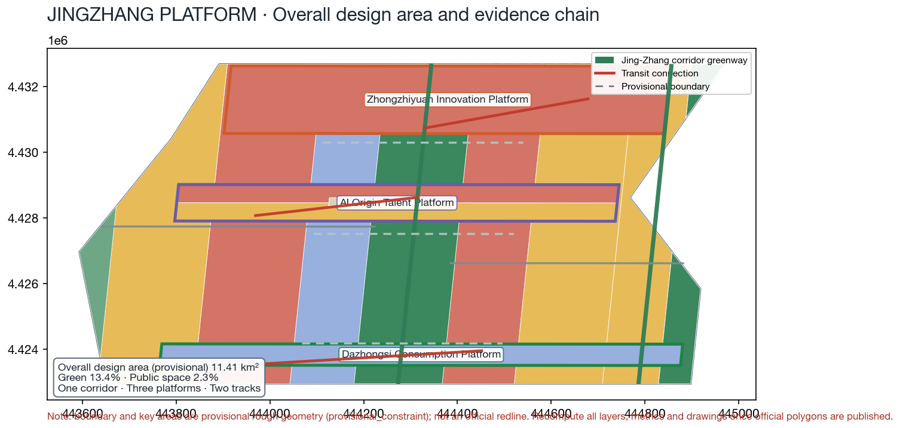
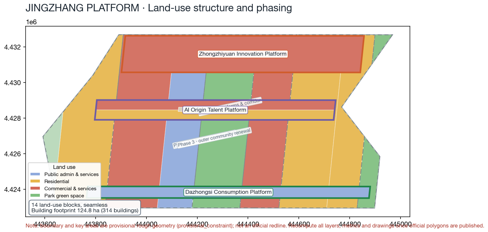
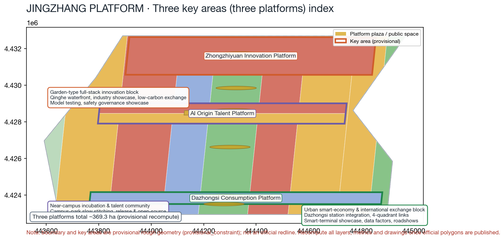
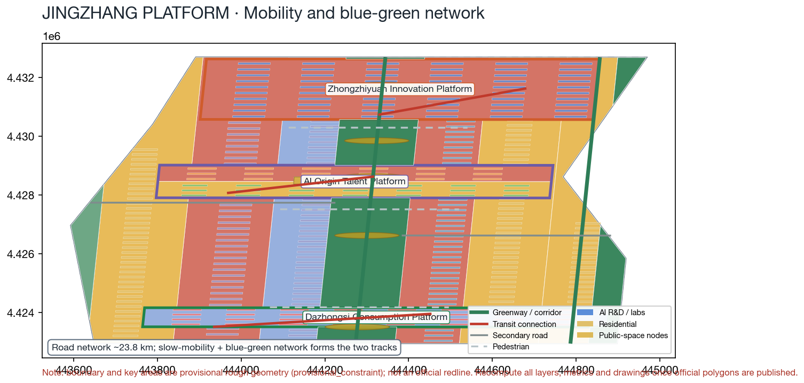
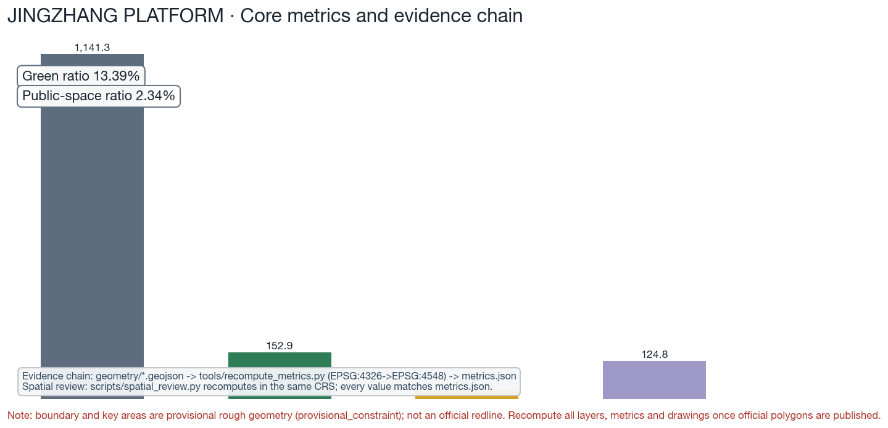

# JINGZHANG PLATFORM: Turning a Centennial Station Platform into an Open Platform for the AI Era — Urban Design Proposal for the Centennial Jingzhang AI Innovation Belt

## Design Basis and Source List

This formal proposal takes the *Announcement on the Prequalification of the International Urban Design Solicitation for the Centennial Jingzhang AI Innovation Belt* issued by the Haidian Sub-bureau of the Beijing Municipal Commission of Planning and Natural Resources as its primary basis, and uses the maintainer-registered provisional coarse boundary, key areas, enumerations, metrics, and source list in `brief/site-package/` as its machine-readable basis. Before generating a proposal, an AI agent must read `design_brief.json`, `allowed_design_space.json`, `sources.json`, `enums/`, `ranges/`, `schemas/`, `data/source_registry.json`, and `data/processed/agent_fact_pack.md`, and must use `project_scope_summary.csv`, `agent_task_requirements.csv`, `source_use_matrix.csv`, and `missing_data_checklist.csv` to build the task, scope, source-usage, and gap checklists. Every design judgment must be decomposed into traceable sources, recalculable metrics, verifiable layers, and manually reviewable assumptions. The announcement requires the proposal to reach the urban-design depth of a regulatory detailed plan and of a comprehensive implementation plan, so narrative text cannot substitute for GeoJSON, metric tables, the A3 booklet, the A0 boards, or the HTML electronic presentation.

This proposal is not a standalone vision document; it organizes deliverables from the announcement, the agent-facing task book, and the site package. This section places only the most critical evidence beside the judgments [source:OFFICIAL-ANNOUNCEMENT] [source:AGENT-TASKBOOK] [depth:existing_conditions_diagnosis]. Full source and standard coverage is stored in `sources.json`, `standard_matrix.json`, and `design_depth_matrix.json`, and is not repeated as a machine index in the text.

The usage boundaries of the source registry are as follows [source:SOURCE-REGISTRY]:

- `data/source_registry.json` registers the usage boundaries of public, cleared, and provisional materials.
- Current registration summary: 5 items formally usable, 0 background items, 1 provisional-only item.
- Agents must not upgrade `background_only` or `provisional_only` materials into official boundaries, statutory regulatory plans, formal scoring bases, or government implementation commitments.

`data/processed/agent_fact_pack.md` is the reading-navigation layer of this proposal, not a new authoritative source [source:PROCESSED-FACT-PACK]. It helps agents organize the three-level scope, the three key areas, the announcement tasks, agent.1–agent.6, data availability, and missing-data items into a readable proposal; factual judgments must still return to the registered primary materials [source:OFFICIAL-ANNOUNCEMENT] [source:AGENT-TASKBOOK], and the full source relationships are kept in `sources.json`.

Because the official `SITE_BOUNDARY` or the three `KEY_AREA` polygons are not yet available, this scaffold uses `brief/site-package/geometry/provisional_boundaries.geojson` to generate the temporary formal package. The `geometry/site_boundary.geojson` and `geometry/key_areas.geojson` files in the submission package must both be labeled `provisional_constraint` with `official_boundary=false`; they may only be used for proposal generation, self-check, visualization, and design discussion, and not as official redlines, approval bases, precise area bases, or statutory control conclusions. This organizer-side data gap does not itself block content scoring; after the official polygons are replaced, site boundary, key areas, land use, roads, green space, public space, buildings, phasing, and metrics must all be recalculated.

The scorable status generated by this scaffold is: **provisional boundary, precision warnings retained, to be recalculated after official data is published; content scoring is not blocked**. Accordingly, the spatial structure, scenarios, projects, and metrics in the text are written under the principle of "discussable, reviewable, recalculable after official boundary replacement"; when the official boundary and key-area polygons are updated, the agent must rerun the scaffold, the self-checks, and the drawing/HTML generation — it must not replace only a single file.

Boundary interpretation can return to the overall scope layer and area recalculation [data:geometry/site_boundary.geojson#SITE-001] [metric:site_area_sqm]. The three key areas are cross-checked by independent layers and count metrics [data:geometry/key_areas.geojson#PROV-KEY-001] [metric:key_area_count]. This means readers can move from the text into the evidence without first reading a string of machine identifiers.

## Three-Level Scope Framework

The proposal organizes work at the three levels defined by the announcement: the coordinated research scope covers the 43.6 km² AI industry ecology, strategic positioning, innovation chain, and future urban form; the overall design scope covers the 11.4 km² urban and industrial areas within 1–2 km around the Jingzhang Heritage Park, requiring an overall urban renewal framework, industrial spatial layout, transport and municipal support, and urban character control; the key-area scope covers the three detailed-design areas announced at about 368.4 hectares (about 369.3 ha recomputed from the submitted provisional geometry, `key_area_total_area_sqm` in `metrics.json`), requiring clear functional programs, building scale, retain/renovate/demolish classification, public space connectivity, and transport organization. The three levels are mapped task by task in `compliance_matrix.json` so that every mandatory task in announcement items 1.3, 1.4, 1.5 and agent.1–agent.6 has chapter, layer, metric, drawing, and HTML evidence.

The depth of the three-level framework is governed by [depth:three_level_scope_framework] and [depth:overall_spatial_structure]; spatial evidence is anchored by [data:geometry/site_boundary.geojson#SITE-001] and [data:geometry/key_areas.geojson#PROV-KEY-001]; task basis follows [standard:PROJECT-OFFICIAL-ANNOUNCEMENT]; and the scope index follows the three-level scope table in `project_scope_summary.csv` in [source:PROCESSED-FACT-PACK].

The three levels are not a set of disconnected drawings. Coordinated research decides the industry chain and urban form judgments; overall design implements those judgments into renewal projects, spatial structure, and facility capacity; key-area detailed design verifies the implementability of specific plots, buildings, transport, public space, and AI application scenarios. When generating a proposal, the agent must first lock the official or provisional boundary and constraints adopted by the current submission, then generate land use, buildings, roads, green space, public space, phasing, and AI service nodes, and finally recalculate metrics from those layers and explain in the text which conclusions remain limited by the provisional boundary. Any area, ratio, scale, or project count that cannot be recalculated from structured data must not be written as a formal conclusion.

The overall concept proposed by this plan is the "JINGZHANG PLATFORM": the semantics of the centennial Jingzhang Railway "station platform" (站台) are translated into the AI-era "open platform" (平台), forming the spatial organization of "one corridor, three platforms, two tracks." The one corridor is an approximately 9 km north–south greenway corridor along the Jingzhang Heritage Park, serving as the historical and public-space spine [depth:overall_spatial_structure]; the three platforms correspond to the three key areas — Zhongzhiyuan Innovation Platform, AI Origin Talent Platform, and Dazhongsi Consumption Platform — each with its own functional program, public space, and rail interchange node [data:geometry/key_areas.geojson#PROV-KEY-001] [data:geometry/key_areas.geojson#PROV-KEY-002] [data:geometry/key_areas.geojson#PROV-KEY-003]; the two tracks are the Zhongguancun Service Rail (western industry-service composite belt) and the Xiaoyue River Scenario Rail (eastern scenario-R&D and living belt), implemented respectively by [data:geometry/land_use.geojson#LU-006] and [data:geometry/land_use.geojson#LU-007], and by [data:geometry/land_use.geojson#LU-010] and [data:geometry/land_use.geojson#LU-011]. The naming and logo visual system uses "Platform" as the identifying symbol: a station platform is a place of waiting, meeting, and departure; an open platform is a place of openness, collaboration, and contribution — both share the single English word *platform*, forming a naming system that can be developed further. The "one corridor" is not an extra redline drawn on top of the plan; it translates the three-level scope of the announcement into a working method. The "three platforms" correspond to the three key areas. The "two tracks" correspond to operable nodes of AI-plus-public services, industry services, and urban life. The three-level imagery of "station-platform – platform – open platform" maps to the linkage of slow traffic, green space, public space, and activity routes.

| Level | Design question | Proposal answer | Data anchor |
| --- | --- | --- | --- |
| Coordinated research scope | How to organize the AI industry ecology and future urban form | Build the innovation chain "university incubation – open-source collaboration – enterprise transformation – public experience – international communication" | compliance_matrix.json, standard_matrix.json |
| Overall design scope | How to map industry space, urban renewal, transport/municipal, and character | Land use, building, road, green space, public space, and phasing layers together | [data:geometry/land_use.geojson#LU-001], [data:geometry/roads.geojson#ROAD-001] |
| Key-area scope | How the three areas reach detailed-design depth | Respective positioning, spatial actions, AI scenarios, and implementation dependencies | [data:geometry/key_areas.geojson#PROV-KEY-001], [data:geometry/key_areas.geojson#PROV-KEY-002], [data:geometry/key_areas.geojson#PROV-KEY-003] |

## Coordinated Research Area: Industry and Future City Research

The core task of the coordinated research scope is to build a world-class AI innovation ecosystem. The proposal should inventory Haidian's universities and institutes, leading enterprises, computing/algorithms/data-element resources, incubation platforms, listed companies, unicorns, and science-and-technology service resources, and propose a spatial coordination framework for the AI innovation chain, industry chain, talent chain, and urban service chain. The naming scheme and logo design should serve the overall recognizability of "the Centennial Jingzhang culture belt, the urban AI-life experience belt, and the AI-integration innovation belt" — not slogan-level, but articulated with the industry ecology, public space, and cultural resources. The agent-facing task book also requires responses to the "five functions" and the "three districts, two wings" coordination, forming a developable naming system, visual identity, overall spatial structure map, scenario opening, and operation mechanism; this section must use [source:AGENT-TASKBOOK] and [standard:PROJECT-AGENT-OPEN-CALL-TASKBOOK] to mark that these requirements come from the agent open-call tasks, not from statutory planning controls.

Coordinated research does not add pseudo-precise redlines; it ties back to the visible, reviewable spatial structure through the coordination of urban character, public space, and building layout required by [standard:MOHURD-URBAN-DESIGN-MEASURES], anchored to [data:geometry/land_use.geojson#LU-001], [data:geometry/public_space.geojson#PUBLIC-001], and [depth:overall_spatial_structure].

The future urban form study should answer how AI changes work, life, social interaction, learning, transport, and public services. The proposal should implement AI transport systems, continuous green space, innovation service facilities, and an international work-life atmosphere as locatable functional zones, nodes, corridors, and scenarios — not as a vague technology vision. The agent should write industry strategy metrics, the AI innovation index, talent density, spatial supply types, and AI-plus-vertical-application key areas into the metrics system, and mark which are official, which are design suggestions, and which still await official data calibration. If global AI innovation events, developer communities, open scenarios, or pilgrimage routes are proposed, they must be written as "conceptual suggestions / reference proposals / for professional teams to develop further," and must not be written as confirmed government activities or implementation arrangements.

### Global case translation mechanism

This proposal extracts transferable mechanisms from three families of global cases — railway-heritage regeneration, university-anchored innovation districts, and smart-city governance sandboxes — as "conceptual suggestions / reference proposals"; case facts are per their respective public sources: railway-heritage regeneration follows the King's Cross Station regeneration [source:CASE-KINGS-CROSS], university-anchored innovation districts follow Kendall Square [source:CASE-KENDALL-SQUARE], and smart-city governance sandboxes follow Jurong Lake District [source:CASE-JURONG-LAKE-DISTRICT]; the remaining cases are sourced row by row in the table below:

| Case | City / Country | Core mechanism | Translation into JINGZHANG PLATFORM | Landing point |
| --- | --- | --- | --- | --- |
| King's Cross Station regeneration | London, UK | Railway-heritage protection combined with knowledge-economy renewal; the station becomes a public living room | The Jingzhang Heritage Park corridor acts as a station-city public spine where heritage display carries innovation exchange | L1 Centennial Platform Memorial Corridor, corridor public space |
| Kendall Square | Cambridge/Boston, USA | University-anchored innovation ecosystem with co-located incubation and talent, linked by transit | AI Origin Community's near-campus transformation street and talent services | Scenario 07, AI Origin Community |
| Station F | Paris, France | Railway depot converted into the world's largest startup campus, run through public events and investor roadshows | Platform waiting pavilion's reuse of station-hall space for mixed display and roadshows | Scenario 11 Platform shared waiting pavilion [source:CASE-STATION-F] |
| Marunouchi | Tokyo, Japan | Station-integrated, district-scale renewal financed by long-term asset operators | Dazhongsi station four-quadrant integration and public-environment renewal around anchor enterprises | JZ-04 Dazhongsi four-quadrant walkability [source:CASE-MARUNOUCHI] |
| Jurong Lake District | Singapore | Phased trial of a smart district plus governance sandbox, evaluated publicly before scaling | Civic-agent sandbox and safety-governance corridor's trial–evaluate–scale path | Scenarios 02, 05; T2 on-device sandbox |
| Pangyo Techno Valley | South Korea | Government-coordinated industry park integrating talent housing and convention functions | Zhongzhiyuan industry showcase, low-carbon exchange, and talent support package | Zhongzhiyuan Innovation Platform [source:CASE-PANGYO] |
| Hetao Shenzhen-Hong Kong cooperation zone | Shenzhen/Hong Kong | Cross-border factor flows and "pilot-then-scale" institutional experimentation | Data-element lounge's compliance, authorization, and auditable demonstration mechanism | Scenario 08 Data-element lounge [source:CASE-HETAO] |

Each translation borrows spatial and operational method only; it neither endorses nor cites the case countries' policies. Operational data, land institutions, and fiscal arrangements of the cases cannot be transplanted directly and require local deepening by professional teams [source:AGENT-TASKBOOK].

### AI ecosystem map and regional coordination

Responding to the task book's "five functions" and "three districts, two wings" requirements [source:AGENT-TASKBOOK], this proposal offers a conceptual AI ecosystem map: a five-stage chain of **university incubation → open-source collaboration → enterprise transformation → public experience → international communication**, anchored respectively to universities such as Tsinghua and PKU, open-source communities and contribution walls, leading enterprises/unicorns/incubation platforms, AI-plus-public-service scenarios, and international roadshow nodes. The map is linked through the agent.2 and agent.5 evidence chains in `compliance_matrix.json` to the text, layers, and HTML, without repeating machine indexes [standard:PROJECT-AGENT-OPEN-CALL-TASKBOOK].

For regional coordination, this proposal positions the following as "conceptual suggestions / reference proposals" describing how the Jingzhang AI Innovation Belt relates to Beijing's and the Jing-Jin-Ji region's innovation plates; none of it is statutory planning or a government commitment:

| Coordinating plate | Relationship to the Jingzhang belt (conceptual) | Coordination mechanism (conceptual) | Data and implementation boundary |
| --- | --- | --- | --- |
| Beiwei Community and other northern Haidian innovation communities | Receives scaled-up R&D spillover from the Jingzhang belt | Shared industry-chain recruitment map and talent-service network; transit commuting links | Depends on statutory district plans and commute surveys; to be deepened |
| Future Science City (Changping) | Large-facility coordination from frontier science toward industrial transformation | Innovation-chain division: incubation–pilot–manufacturing | Depends on Changping district plans and project lists |
| Huairou Science City | Source-node linkage for large-science-facility and basic-research output | High-end talent exchange and mutual roadshows of results | Depends on Huairou district plans and facility-open policies |
| Beijing Economic-Technological Development Area (E-Town) | Scaled transformation of smart terminals and manufacturing | Scenario opening and supply-chain collaboration; mutual recognition of fairs | Depends on E-Town industry catalogs and investment policies |
| Jing-Jin-Ji hinterland | Manufacturing, scenarios, and data-element hinterland | Scenario-open city alliance and industrial-enclave collaboration (conceptual) | Includes no commitment to any cross-province project |

A regional-coordination map is suggested as a separate drawing in the A3 booklet and HTML (this table is its text version); plate boundaries in any such map are illustrative only and must not be read as administrative or planning boundaries [data:geometry/site_boundary.geojson#SITE-001].

## Overall Design Area: Urban Renewal and Regulatory-Plan-Level Urban Design

The overall design area must reach the urban design depth of a regulatory detailed plan. The proposal must provide the overall spatial structure of urban renewal, identification of underutilized space, a renewal project list, implementation policy recommendations, industry functional ratios, spatial organization patterns, total building scale, and comprehensive carrying-capacity assessment. `geometry/land_use.geojson` must completely cover the design boundary with no overlaps, `geometry/buildings.geojson` must express renewed or retained building footprints, `geometry/roads.geojson` must express microcirculation, slow traffic, and rail interchange, and `metrics.json` must recalculate core areas, ratios, and layer counts.

This section decomposes regulatory-plan-level content into reviewable objects per [standard:MOHURD-CONTROL-DETAILED-PLANNING]: [data:geometry/land_use.geojson#LU-001] expresses the land-use structure, [data:geometry/buildings.geojson#BLDG-001] expresses building footprints, [data:geometry/roads.geojson#ROAD-001] expresses transport organization, [metric:building_footprint_area_sqm] verifies building footprint area, and [depth:land_use_layout] and [depth:development_intensity_controls] govern the depth of deliverables.

The overall design must also support transport, rail, municipal, and supporting facilities. The proposal should propose spatial layout and implementation paths for rail-station integration, road microcirculation, bicycle parking, parking supply, innovation service platforms, talent living services, new infrastructure, distributed energy, and on-device computing. Content involving building height, development intensity, road redlines, setbacks, and facility standards, where no official control conditions exist, must be written as "pending official regulatory-plan conditions," and agent-surmised values must not masquerade as approved indicators.

## Detailed Design of Key Areas

Key-area detailed design is mandatory. Zhongzhiyuan AI Self-Innovation Acceleration Area should propose detailed schemes around national AI platforms, full-stack self-innovation, standard setting, safety governance, industry exhibition, external transport, Qinghe culture, low-carbon green innovation environments, and AI scenarios in green space. Beijing AI Origin Community should propose detailed schemes around university-adjacent innovation, achievement incubation and transformation, a talent special zone, the open-source system, brand activities, building retain/renovate/demolish, achievement release and display, living support, campus-park slow-traffic connections, and rail-station integration. Dazhongsi AI Industry Cluster Area should propose detailed schemes around leading enterprises, agents, smart terminals, content consumption, data elements, digital assets, commercial services, composite use of planned green space, Dazhongsi station integration, and four-quadrant pedestrian connectivity at the intersection.

The detailed design of the three key areas must cite [data:geometry/key_areas.geojson#PROV-KEY-001], [data:geometry/key_areas.geojson#PROV-KEY-002], and [data:geometry/key_areas.geojson#PROV-KEY-003], and is checked by [depth:three_key_area_detailed_design] for comprehensive-implementation-plan depth. Descriptions that only say "build a demonstration area" without function, building, transport, public space, and implementation project evidence are treated as incomplete.

The three key areas must appear in `geometry/key_areas.geojson`. If the repository provides official polygons, use them as `official_constraint`; if official polygons are missing, `provisional_constraint` may be used temporarily, but the text, HTML, sources, assumptions, and self-check must state that it cannot serve as a formal scoring or approval basis. `compliance_matrix.json` must separately cover announcement items 1.5.3.1, 1.5.3.2, and 1.5.3.3. The design expression must include functional programs, building scale, building form, retain/renovate/demolish classification, the public space system, transport organization, slow-traffic connectivity, and implementation projects. The HTML page must allow switching between the three key areas, and the A3 booklet and A0 boards must include at least key-area general plans, local details, and metric notes.

| Key area | Design positioning | Spatial actions | AI industry and operation scenarios | Evidence |
| --- | --- | --- | --- | --- |
| Zhongzhiyuan AI Self-Innovation Acceleration Area | Garden-type full-stack self-innovation block | Strengthen the Qinghe interface, industry exhibition, low-carbon innovation exchange, and external transport; carry open testing and standard-governance display in green space | Proprietary model testing, standard-setting workshops, safety governance display, low-carbon computing experience | [data:geometry/key_areas.geojson#PROV-KEY-001], [depth:three_key_area_detailed_design] |
| Beijing AI Origin Community | University-adjacent transformation and talent community | Organize campus-park-block slow-traffic stitching; add achievement release, talent service, living, and open-source collaboration space | Open-source community, achievement release, talent special-zone service, university-adjacent incubation | [data:geometry/key_areas.geojson#PROV-KEY-002], [source:AGENT-TASKBOOK] |
| Dazhongsi AI Industry Cluster Area | Urban smart-economy and international-exchange block | Around Dazhongsi station integration, four-quadrant pedestrian connectivity, commercial services, and public-environment renewal around leading enterprises | Agent and smart-terminal display, content consumption, data elements, international roadshows | [data:geometry/key_areas.geojson#PROV-KEY-003], [metric:key_area_count] |

## AI Innovation Ecosystem, Personas, and AI+ Scenarios

The proposal should build spatial demand personas for AI talent and enterprises, covering R&D offices, open-source collaboration, achievement release, enterprise services, talent housing, social learning, consumption and life, sports and leisure, and international exchange. AI+ scenarios should follow the announcement's directions of transport, services, consumption, healthcare, education, law, and life services, forming both industry-development scenarios and AI-empowered urban-function scenarios. Each scenario must state its service object, spatial location, data sources, privacy boundaries, human-review mechanism, and operating entity.

AI scenarios must land on spatial and governance boundaries: public-space scenarios cite [data:geometry/public_space.geojson#PUBLIC-001], slow-traffic and transport scenarios cite [data:geometry/roads.geojson#ROAD-001], and open-space scenarios cite [data:geometry/green_space.geojson#GREEN-001], [metric:public_space_ratio], and [metric:green_ratio]. These citations let reviewers see that scenarios are design objects in concrete layers and metrics, not slogans. The agent-facing task book requires no fewer than 10 AI scenario cards, no fewer than 3 industry test-and-validation scenarios, and no fewer than 5 persona classes; the scaffold only provides the structure — formal entrants must write the scenario cards, persona tables, privacy boundaries, human review, and operating entities into the text, HTML, A3/A0, and compliance matrix.

| Persona | Typical needs | Spatial response | Self-check boundary |
| --- | --- | --- | --- |
| Open-source developer | Release, collaborate, test, community reputation | Origin Community open-source release hall, public code wall, nighttime collaboration space | No collection of personal behavior trajectories; activity data aggregated only |
| Startup team | Low-cost offices, computing entry, product testbed | Zhongzhiyuan shared test field, on-device computing service points, standard-governance consulting | Computing and data services require separate authorization |
| Leading-enterprise visitor | Exhibition, business, international reception, recruiting | Dazhongsi international roadshow lounge, rail-station interchange, public environment around key enterprises | Enterprise marks and cases require rights clearance |
| Nearby residents | Commuting, leisure, community services, low-disruption renewal | Jingzhang Heritage Park slow-traffic loop, embedded community services, graded night lighting and activities | Resident profiles not used for commercial recommendation |
| University faculty and students | Achievement transformation, cross-campus collaboration, daily slow traffic | Campus-park slow-traffic stitching, transformation service stations, AI education experience points | Campus data and research results require authorization |

| Scenario card | Spatial node and type | Design description | Data governance and privacy boundary | Maturity · pilot period · human review · exit mechanism | Quantified KPI (conceptual) |
| --- | --- | --- | --- | --- | --- |
| 01 Open-source release hall | AI Origin Community · public-building ground floor / community open node | For universities, open-source communities, and startups: achievement release, code-contribution display, and small roadshow space | Release content and attendee lists public; no collection of personal behavior trajectories; activity data aggregated only | Maturity M1 concept; 12-month pilot; offline simultaneous release for equivalent access; exit: adjust schedule after two consecutive quarters of low participation | ≥24 releases/yr, ≥200 participants/mo |
| 02 Safety governance sandbox | Zhongzhiyuan · garden-block open node | Translates standard setting, safety evaluation, and model red-teaming into visitable, bookable, monitorable display and collaboration nodes | Only submitter-authorized evaluation samples; process data auditable and retractable | Maturity M1 concept; 6-month pilot + third-party evaluation; results human-reviewed before release; exit: stop immediately on safety incidents | ≥12 evaluation batches/yr, ≥2 compliance reports/yr |
| 03 On-device computing station | Overall-design scope · public-service facility node | New-infrastructure prototype to be deepened, combined with public services, enterprise services, and low-carbon energy strategy | Only aggregated anonymized energy and load data; no linkage to individuals | Maturity M1 concept; 18-month pilot; rotating operators with manual inspection; exit: remove on energy or safety failure | ≥3 first-phase stations, service availability ≥95% |
| 04 AI slow-traffic navigation | Jingzhang Heritage Park vitality belt · slow-traffic corridor | Uses explainable signage and low-intrusion sensing to identify slow-traffic gaps, congestion nodes, and accessibility needs | No individual trajectories; aggregate gap and congestion hints only | Maturity M1 concept; 12-month pilot + manual inspection review; gap list and accessibility tickets public; exit: suspend on excessive false-alarm rate | Quarterly gap-list update; accessibility tickets closed ≤30 days |
| 05 Dazhongsi international roadshow lounge | Dazhongsi · station-city commercial node | Display, negotiation, press release, and international exchange for agent, smart-terminal, and content-consumption enterprises | Live streams and press events require written guest consent; visitor data minimized | Maturity M1 concept; annual scheduling; content and slots human-reviewed by the operator; exit: downgrade to shared meeting if slots insufficient | ≥20 roadshows/yr, ≥30% international |
| 06 Qinghe low-carbon innovation corridor | Zhongzhiyuan Qinghe interface · waterfront blue-green space | Combines green space, stormwater, walking/cycling, and AI display as the park's public living room | Environmental sensing data aggregated for display only; no individual identification | Maturity M1 concept; piloted in phases with the Qinghe interface project; stormwater and ecology data human-reviewed; exit: stop on ecological disturbance | ≥6 open test days/yr, ≥30 participating firms |
| 07 University-adjacent transformation street | AI Origin Community · campus-park stitching segment | For university achievement transformation: incubation, display, legal, IP, and investment-financing services | Results disclosed by authorization level; campus and research data require authorization | Maturity M1 concept; 24-month pilot; university technology-transfer office joins review; exit: delist on missing authorization | ≥100 transformation matches/yr, ≥20 incubating tenants |
| 08 Data-element parlor | Dazhongsi · commercial and rail composite node | Presumes compliance, authorization, and auditability; the urban service interface for data-element and digital-asset circulation | Compliance, authorization, auditability as preconditions; no unauthorized data displayed | Maturity M1 concept; 12-month pilot + third-party audit; exit: stop on audit violations | ≥10 compliant demos/yr, ≥2 audit reports/yr |
| 09 AI life-service model street | Community-commerce junctions · small-scale block | Lands AI+ scenarios in healthcare, education, law, and life services as operable small-block space | Public-service guidance without collecting health or education privacy data | Maturity M1 concept; 18-month pilot; offline equivalent services run in parallel; exit: adjust when service coverage insufficient | Response ≤15 min, satisfaction ≥85% |
| 10 Global AI activity-week route | Belt public-space system · corridor and plaza nodes | A walkable, communicable experience route from heritage culture, open-source community, and industry display to international roadshows | Registration data minimized and used only for event organization and safety | Maturity M1 concept; annual scheduling + public-security filing; manual safety review; exit: cancel on safety failure | ≥30 events/yr, ≥100k participants/yr |
| 11 Platform shared waiting pavilion | Three platform plazas and corridor nodes · hybrid waiting space | Composes shared work, meetings, flash displays, and rest in a hybrid waiting space using the waiting-platform semantics | Book-use-and-leave; no dwell tracking | Maturity M1 concept; 12-month pilot; waiting-function conflict assessed before adjustment; exit: remove composite functions if they impede waiting | Platform utilization ≥40%; ≥50 flash displays/yr |
| 12 Open-source collaboration contribution wall | AI Origin Community and Dazhongsi intersection quadrants · public interface | Digital contribution wall displaying public participation in open source, standards, datasets, and community governance | Contribution data public only after user authorization; opt-out available anytime | Maturity M1 concept; long-term operation; community governance committee human-reviews content; exit: remove on content violations | ≥60 contributed projects/yr, ≥300 volunteers |

The proposal defines three industry test-and-validation scenarios to satisfy the task book's mandatory "no fewer than 3 industry test-and-validation scenarios"; each states its service object, spatial location, data sources, privacy boundaries, human-review mechanism, and operating entity [source:AGENT-TASKBOOK]:

| Test-and-validation scenario | Spatial carrier | Validated content | Data and privacy boundary | Maturity · pilot period · human review · exit mechanism | Quantified KPI (conceptual) |
| --- | --- | --- | --- | --- | --- |
| T1 Open model evaluation ground | Zhongzhiyuan Innovation Platform · park platform node | Capability evaluation, safety evaluation, and standard-compliance verification of proprietary models | Only submitter-authorized evaluation samples; no collection of personal behavior trajectories | Maturity M2 validation; 12-month pilot; results reviewed by a third-party institution before release; exit: stop on inaccurate evaluation | ≥12 evaluation batches/yr, ≥4 standard workshops/yr |
| T2 On-device AI urban-service sandbox | Overall-design-scope service nodes · road and public-service composite node | Field trials of on-device computing, smart signage, and slow-traffic sensing | Sensor data aggregated and anonymized; personally identifiable information not persisted | Maturity M2 validation; 18-month pilot; authorized by the city-administration department, co-operated with the subdistrict, with manual inspection; exit: stop on authorization withdrawal or safety incident | ≥3 pilot nodes; monthly inspection reports public |
| T3 Smart-terminal consumption experience field | Dazhongsi Consumption Platform · commercial public-space node | Usability and compliance demonstrations of smart terminals, agents, and content consumption | Consumption-experience data only for the demonstration environment; informed consent obtained | Maturity M2 validation; 12-month pilot; joint operation by merchants and platform with periodic purging and human review; exit: stop on failed compliance audit | ≥2 compliance audits/yr, ≥5k demo experiences |

AI governance recommendations generated by the agent must comply with the principles of data minimization, public sources, explainability, and human review. Urban agents may assist in identifying slow-traffic gaps, public-space heat, facility maintenance, enterprise service needs, and event safety risks, but they must not replace planning approval, output unauthorized personal profiles, or claim official implementation commitments. All AI scenario nodes should enter the structured layers or compliance matrix so reviewers can see their relationship to industry, space, and public interest.

Responding to the task book's "no fewer than 5 persona classes" requirement, the proposal supplements the core personas with inclusive ones, all as "conceptual suggestions" [source:AGENT-TASKBOOK]:

| Inclusive persona | Typical needs | Spatial and AI-service response | Offline equivalent service and self-check boundary |
| --- | --- | --- | --- |
| Older adults | Large-print and voice signage, sit-down access, can do business without a smart device | Barrier-free seating bands along the corridor, dual voice/large-print signage, priority human counters | Every AI service keeps window, phone, and home-visit offline equivalents |
| Children | Safe routes, parent-visible activity space, AI science education | Child-friendly slow-traffic loop, speed limits and guardian prompts; no child data collection for education displays | Children's areas staffed manually; AI education content teacher-reviewed |
| People with disabilities | Fully accessible routes, Braille and tactile maps, wheelchair and visual navigation | Tactile maps/Braille signage, ramps and lifts, human-reviewed AI navigation routes | Monthly accessibility inspection reports public; accessibility tickets closed in 30 days |
| Low-income residents | Free public services, affordable commuting and leisure, skills and job opportunities | Free public-service station hours, public skills-training space, affordable dining and events | Paid AI services must keep a free basic tier to avoid a digital paywall |
| Caregivers | Wide paths for strollers/wheelchairs, rest and assistance points | Corridor-wide paths, parent/caregiver rest rooms, help-call points | Care points' human service and call response published |
| Non-smart-device users | Query, book, and give feedback without installing an app | Public terminals, phone, window, and staffed counters forming an equivalent service chain | Public participation and appeal channels must support non-digital entry |

Inclusive mechanisms and algorithmic governance land together (conceptual): **offline equivalent services** — every AI scenario is matched by a window, phone, or staffed-counter equivalent; digital services may augment but never replace them; **public participation channels** — an annual open day, block councils, and online feedback forming a closed participation loop whose records are not used for commercial profiling; **algorithm appeal channel** — appeals against agent suggestions, scoring, or scheduling are reviewed by non-algorithm staff with a deadline; **manual accessibility inspection** — a third party manually inspects public space and interfaces annually per accessibility standards, with the report published [standard:MOHURD-URBAN-DESIGN-MEASURES].

## Land Use, Building Scale, and Retain-Renovate-Demolish Strategy

The land-use plan should follow public standards such as national territorial survey, planning, and use-control classification, forming a complete, closed, seamless land-use partition. The building plan should distinguish retained, renovated, renewed, new, or pending-confirmation objects, and clarify the recommendation hierarchy for building footprint, function, scale, character, roof, massing, and height control. Where existing buildings, ownership, regulatory plans, and engineering conditions are missing, the proposal may only offer methods and a calibration checklist — it must not fabricate retain/renovate/demolish conclusions.

Land-use classification follows [standard:MNR-LAND-USE-CLASSIFICATION-GUIDE]; building height, massing, interface, and character control are governed by [depth:height_massing_character]; the retain/renovate/demolish method is governed by [depth:retain_renovate_demolish]. The primary evidence for land use and buildings is [data:geometry/land_use.geojson#LU-001], [data:geometry/buildings.geojson#BLDG-001], and [metric:building_footprint_area_sqm].

Building scale and intensity metrics must be consistent with `metrics.json` and the layers. Where total building scale, FAR, building height, building density, green ratio, setbacks, and building control lines lack official conditions, they must be listed in the metrics system as `unknown` or `pending_control` — fixed values must not be used to manufacture precision. The A3 booklet should provide the renewal project list and metric verification table, the A0 boards should express the key spatial structure and key areas clearly, and the HTML page should link metrics and layers interactively.

## Transport, Rail, Municipal Infrastructure, and Public Services

The transport plan should respond to the announcement's requirements for rail-station integration, road microcirculation, slow-traffic gaps, external transport, parking, bicycle parking, and green transport systems. It should focus on Beiwuhuan Road, the Jingzhang Heritage Park grade-separation nodes, Wudaokou, the west entrance of Qinghua East Road, Dazhongsi station, and transport connections around key enterprises. The road network is organized as "one ring, one spine, multiple branches," with about 23.8 km of road centerlines in total [metric:road_network_length_m]; the corridor greenway carries the slow-traffic spine, while vehicular roads emphasize microcirculation and rail interchange. Road and slow-traffic layers must stay within the submission boundary and be cross-checked with public space, green space, industry nodes, and key areas; if the submission boundary is provisional, transport conclusions can only serve as interim design discussion.

Transport and municipal depth are governed respectively by [depth:traffic_rail_slow_parking] and [depth:municipal_new_infrastructure]; layer evidence cites [data:geometry/roads.geojson#ROAD-001], [data:geometry/public_space.geojson#PUBLIC-001], and [data:geometry/constraints.geojson#CONSTRAINTS]. Where road redlines, pipelines, fire protection, and municipal conditions are missing, the assumptions should state them as to-be-supplemented rather than writing strategy as approved conditions.

Municipal and public service facilities should cover AI industry service facilities, innovation service platforms, talent living service facilities, new infrastructure, distributed energy, on-device computing, and integration with conventional municipal facilities. The proposal should state facility standards, spatial layout, service radius, operation model, and phasing logic. Where pipeline, energy, drainage, flood, and fire-protection engineering data are missing, they should be listed as prerequisites for formal deepening.

## Blue-Green Network, Public Space, and Urban Character

The blue-green network plan should take the Jingzhang Heritage Park vitality belt as the skeleton, coordinate the Qinghe, the Xiaoyue River, and the travel needs of surrounding universities, enterprises, and communities, and propose a north–south through, east–west connected system of footpaths, cycleways, and green space. The plan should identify slow-traffic gaps, grade-separation nodes over the ring road, and landscape nodes at the south and north ends of the park, and propose composite-use strategies for parking, sports, innovation exchange, technology testing, application display, and public services.

The blue-green and public space are jointly checked by the design-depth items and the green-space and public-space layers [depth:blue_green_public_space] [data:geometry/green_space.geojson#GREEN-001] [data:geometry/public_space.geojson#PUBLIC-001]. Recomputed consistently from the submitted geometry in EPSG:4548, the green ratio is about 13.4% (13.3947%) and the public-space ratio about 2.3% (2.3376%) [metric:green_ratio] [metric:public_space_ratio]; the design meaning of the green and public-space ratios is explained in the text, and the complete recalculation with formulas is kept in `metrics.json`. The coordination of urban character, public space, and building control returns to the professional standard matrix [standard:MOHURD-URBAN-DESIGN-MEASURES].

The urban character plan should blend Jingzhang Railway history and culture, Zhongguancun innovation culture, and AI innovation culture, using cultural resources such as Qinghuayuan Railway Station and the Beijing Film Academy, and propose guidance for urban tone, architectural character, roof forms, massing, interfaces, and public art. The agent should also propose wayfinding signage, cultural symbols, an international communication narrative, AI pilgrimage landmarks, and a contribution wall or honor-display system, but all brands, fonts, images, portraits, and enterprise marks must have cleared sources. Character control must distinguish official regulation, design recommendations, and pending conditions; pseudo-precise control lines must never be given without heritage-protection or regulatory-plan basis.

The proposal defines three AI pilgrimage landmarks, all as "conceptual suggestions / reference proposals," not confirmed government activities or implementation arrangements [source:AGENT-TASKBOOK] [metric:pilgrimage_landmark_count]:

| Pilgrimage landmark | Location | Narrative and function | Rights-clearance and operation boundary |
| --- | --- | --- | --- |
| L1 Centennial Platform Memorial Gallery | North end of the Jingzhang corridor, Zhongzhiyuan entrance | Starts from the history of the Jingzhang station platform, displaying a timeline of railway culture, urban renewal, and AI innovation | Historical images and heritage materials require clearance from the collection institution |
| L2 Open-Source Co-creation Court | Origin Community corridor node | Open-air venue for open source, roadshows, contribution, and honor display for global developers | Open-source logos, enterprise marks, and personal portraits require clearance |
| L3 Smart Bell Plaza | Dazhongsi station-front four-quadrant public space | Translates the "great bell" imagery into a city landmark of smart timekeeping and data visualization | Station property rights and advertising-space management require negotiation with the operator |

### Naming, Logo, and Visual Standards

The naming system continues the bilingual double semantics of "JINGZHANG PLATFORM": **a station platform is the place of waiting, meeting, and departure; a platform is the place of open source, openness, and collaboration.** The shared word "platform" in both languages forms an extensible naming family: JINGZHANG PLATFORM (overall), Zhongzhiyuan Innovation Platform / AI Origin Talent Platform / Dazhongsi Consumption Platform (the three platforms), and the Platform Shared Waiting Pavilion and Open-Source Co-creation Court (node level) [source:AGENT-TASKBOOK].

The logo and visual standards are proposed as **conceptual suggestions** for professional teams to develop further; they constitute no brand authorization:

| Visual element | Conceptual suggestion | Design intent | Rights clearance and use boundary |
| --- | --- | --- | --- |
| Logo primary mark | A "platform canopy + track profile" geometrized into an open-platform glyph whose negative space forms a station-platform awning | Expresses both railway heritage (the platform) and open collaboration (the platform) | This proposal contains no third-party trademarks, badges, or fonts; trademark search and font clearance are required before development |
| Color system | Four-color system: Jingzhang railway grey (primary), AI indigo (digital), corridor green (blue-green space), platform gold (public space) | Consistent with the layer colors of drawings, HTML, and A3/A0 | Colors are this proposal's conceptual definition; no proprietary claim |
| Typography | System font stacks — PingFang/Hiragino for Chinese, Helvetica/Arial for English | Guarantees renderability in offline review environments | No licensed commercial fonts; offline files embed open-license font paths |
| Graphic language | Trestle-style composition: unified line types for rail lines, corridor lines, platform nodes, and digital callouts | One shared graphic language across drawings, charts, and signage | The graphic language is released for reuse with this proposal |

### Wayfinding System and International Communication Narrative

The wayfinding system follows a three-level organization — regional / corridor / node (conceptual): regional level links to the overall-scope map and subway entrances; corridor level uses the "station platform–platform–open platform" three-stage imagery of milestones and distance markers to connect heritage and innovation narratives; node level uses barrier-free multimodal signage (Braille, voice, tactile maps, large print) for inclusive access. All wayfinding content is bilingual, and cultural symbols (platform numbers, gauge lines, milestone stones) require confirmation with heritage authorities before use; historical information must not be invented.

The international communication narrative proposes a "one thesis, three pillars" framework (conceptual): the thesis is "Turning a Centennial Station Platform into an Open Platform for the AI Era"; the three pillars are **heritage** (the world-class heritage narrative of the centennial Jingzhang Railway), **openness** (the platform narrative of open source, scenario openness, and transparent governance), and **life** (the urban narrative of AI with public services, slow traffic, and blue-green living). Audiences span global developers, international enterprises and academic institutions, inbound visitors, and media; content formats include bilingual thematic maps, the Global AI Activity-Week Route, digital boards, and short-video scripts. All communication materials require rights clearance and fact verification, and must not claim any government endorsement [source:AGENT-TASKBOOK].

## Renewal Projects, Implementation Policy, and Phasing

The implementation plan should form a reviewable renewal project list stating project location, type, function, responsible entity, dependencies, implementation stage, risks, and evaluation metrics. Policy recommendations should cover coordinated urban-renewal implementation, spatial supply, operation mechanisms, industry services, public participation, data governance, and property-right coordination. `geometry/phasing.geojson` should express the phasing extents, and `compliance_matrix.json` should link every task to phasing and drawings.

Project-list and phasing depth are governed by [depth:renewal_project_list] and [depth:phasing_implementation]; the phasing spatial evidence is [data:geometry/phasing.geojson#PHASE-001]. Without ownership, funding, implementation entities, and approval paths, the proposal must write these as implementation risks, not committed deliveries.

| Project ID | Project name | Type | Main dependencies | Evidence |
| --- | --- | --- | --- | --- |
| JZ-01 | Jingzhang Heritage Park slow-traffic gap stitching | Public space / transport | Road redlines, under-bridge space, transport-organization review | [data:geometry/roads.geojson#ROAD-001] |
| JZ-02 | Zhongzhiyuan Qinghe innovation interface | Blue-green space / industry display | River blue line, ecological and flood conditions | [data:geometry/green_space.geojson#GREEN-001] |
| JZ-03 | Origin Community university-adjacent transformation street | Urban renewal / industry service | Campus boundary, ownership, ground-floor uses | [data:geometry/buildings.geojson#BLDG-001] |
| JZ-04 | Dazhongsi station four-quadrant pedestrian connectivity | Rail integration / slow traffic | Rail station, road intersection, municipal pipelines | [data:geometry/public_space.geojson#PUBLIC-001] |
| JZ-05 | AI public-service and on-device computing nodes | New infrastructure / public service | Energy, computing, safety, operating entity | [data:geometry/constraints.geojson#CONSTRAINTS] |
| JZ-06 | Global AI activity-week public route | Operation / brand | Public-space permits, event safety, copyright clearance | [data:geometry/phasing.geojson#PHASE-001] |

Phasing must be distinguished from the 100-day solicitation design cycle: the solicitation cycle is the time requirement for submitting deliverables, while implementation phasing is the advancement path of urban renewal and project construction. The proposal should propose near-term pilots, mid-term renewal, and a long-term governance framework, and mark which items can start with lightweight facilities, operational activities, and service platforms, and which must await confirmation of official regulatory plans, municipal, transport, and ownership conditions. For annual event programs, developer-community operation, scenario open days, public experience routes, and international communication mechanisms, the text should state the operating audience, frequency, responsibility boundary, conversion path, and risks — not just promotional slogans.

### Annual Events, Developer Community, and Long-Term Operation-to-Conversion Mechanisms

This proposal writes operation mechanisms as "conceptual suggestions / reference proposals"; audience, frequency, responsibility boundaries, and conversion paths are as follows. All events are premised on public-space permits, event safety filings, and copyright clearance [source:AGENT-TASKBOOK]:

| Operation block | Conceptual activities (examples) | Frequency and audience | Responsibility boundary | Conversion path and quantified KPI (conceptual) |
| --- | --- | --- | --- | --- |
| Annual event program | AI Developer Festival, Scenario Open Day, Agent Competition Roadshows, Jingzhang Memory public experience month | One theme event per quarter plus monthly community events; for developers, enterprises, residents, and visitors | Organizers bear safety, copyright, and data-compliance responsibility; government does not endorse commercial events | Events → scenario opening → pilot intent; ≥30 events/yr, ≥100k participants/yr |
| Developer community | Open-source project collaboration camps, contribution-wall honor rankings, weekly tech talks | Weekly online plus monthly offline; for global developers and university clubs | Community governance committee human-reviews content and honors; honor data can be opted out | Open-source contributions → enterprise adoption → talent attraction; ≥60 contributed projects/yr, ≥300 volunteers |
| Scenario-opening mechanism | Scenario list release, pilot selection, public evaluation of outcomes | Annual scenario-list release and open application; for enterprises and research teams | Pilots require authorization and third-party evaluation; exit mechanisms public | Scenario list → pilot → outcome release; ≥10 opened scenarios/yr, ≥5 pilots converted |
| International communication mechanism | Bilingual thematic maps, Global AI Activity-Week Route, international roadshow season | Two international roadshows/yr plus continuous bilingual content; for global enterprises and media | Fact verification and rights clearance of content; no government-endorsement claims | Communication → international firm visits → landing negotiations; ≥20 international exchanges/yr |

Operation mechanisms map to early-startable items: lightweight facilities and operating activities (waiting pavilions, contribution walls, roadshow lounges, activity routes) can pilot within the public-space permit framework; content involving regulatory plans, ownership, rail, and municipal works remains "pending official condition confirmation." The developer-community honor system (contributor badges, quarterly rankings, annual contribution board) is run by the community governance committee and links to L2 Open-Source Co-creation Court and Scenario 12's contribution wall.

### Public-Space Component Library and Honor System

To support the kit-of-parts implementation of the three platforms and the corridor, this proposal offers a conceptual public-space component library — reusable facility components with design parameters for later design deepening; it constitutes no product list or procurement commitment:

| Component | Design essentials (conceptual) | Reuse scenario |
| --- | --- | --- |
| Platform waiting pavilion | Station-canopy imagery plus composite shared-work/flash-display/rest functions; modular and demountable | Three platform plazas, corridor nodes (Scenario 11) |
| Signage and milestone-stone | Three-level wayfinding plus milestone cultural symbols; bilingual, barrier-free multimodal | Full corridor, stations and node entrances |
| Contribution wall | Digital contribution display plus physical honor board; opt-out available | AI Origin Community, Dazhongsi intersection quadrants (Scenario 12) |
| Green-corridor seating and shade | Barrier-free seating bands plus shade trees and graded lighting | Corridor slow-traffic belt, Qinghe interface, community junctions |
| Accessible ramp and tactile map | Full-route accessibility plus Braille tactile maps; monthly inspection reports public | All public-space nodes |
| Flash and exhibition kit | Movable display frames, roadshow stages, lighting and sound interfaces | Roadshow lounges, activity-week routes, safety-governance sandbox |

The honor system links to the component library: contributor and participant honors (badges, rankings, co-construction plaques) enter the component library as public-space components, with participation data minimized and retractable; co-construction plaques require approval from the public-space manager and must not become de facto advertising [source:AGENT-TASKBOOK].

## Metrics, Area Recalculation, and Compliance Matrix

The metrics system should include at least: overall-design-scope area, key-area areas, green and public-space ratios, building footprint, renewal project count, AI scenario nodes, slow-traffic connectivity metrics, industry-space metrics, talent-service metrics, and self-check status. Every `known` metric must be recalculable from GeoJSON or trusted sources; `unknown` metrics must state the reason and the prerequisites for formal submission. The results of `scripts/spatial_review.py` and `scripts/visual_review.py` are important evidence in the formal self-check.

Metric recalculation follows the unified design-depth requirement [depth:metrics_recalculation]. The text explains the design meaning of key metrics — for example, how the overall scope constrains spatial allocation, and how blue-green and public-space ratios support daily encounter — while the complete values, formulas, source files, and confidence are kept in `metrics.json`. Representative key metrics can be verified by the overall scope and green-space data [metric:site_area_sqm] [data:geometry/green_space.geojson#GREEN-001].

The compliance matrix is the master control for task responsiveness. Every announcement task and agent-taskbook task must map to a report chapter, layer, metric, drawing, HTML page, source, assumption, and self-check item. If any mandatory task of announcement items 1.3, 1.4, 1.5 or agent.1–agent.6 is uncovered, the proposal may not enter formal professional scoring.

During formal deepening, the agent should further classify each metric into three types: first, spatial metrics directly recalculable from the submitted geometry, such as boundary area, green ratio, public-space ratio, building footprint area, and phasing areas; second, control metrics requiring official regulatory plans or task-book annexes, such as FAR, building height, building density, setbacks, road redlines, and facility standards; third, performance metrics requiring sustained calibration with operation or industry data, such as the AI innovation index, talent density, industry-service satisfaction, slow-traffic accessibility, event participation, and scenario usage frequency. The three types should enter `metrics.json`, `assumptions.json`, and `compliance_matrix.json` respectively, avoiding the mistake of writing operational visions as approved planning conditions.

## Risk, Copyright, and Compliance

**Bilingual required.** The primary proposal file may be in Chinese or English, but a complete corresponding translation must be provided through `proposal.en.md` or `proposal.zh.md`; the A3/A0, HTML, and text-bearing figures must also provide corresponding language copies, preferring the terminology recommended by the event's `docs/terminology-glossary.md` where available. A v2 package missing any required translation, language mapping, or valid file will be blocked by finalization and CI. All images, drawings, icons, data, and code assets must state source, license, and authorization status in `sources.json` or `report/copyright_statement.md`. HTML pages must not load remote scripts, remote map tiles, remote fonts, iframes, forms, or external APIs, and must not track reviewer behavior.

The risk and missing-data list is jointly checked by the risk depth item, the constraints layer, and the site package [depth:risk_missing_data] [data:geometry/constraints.geojson#CONSTRAINTS] [source:SITE-PACKAGE]. The gaps listed in `missing_data_checklist.csv` — official boundary, key areas, regulatory plans, roads, plots, buildings, municipal works, heritage protection, and public services — must enter `assumptions.json`, the self-check, and the risk chapter of the text. Any conclusion lacking official regulatory plans, road redlines, ownership, municipal works, fire protection, or heritage-protection conditions must be downgraded to pending confirmation; the full professional cross-check is kept in the standard matrix.

This proposal does not claim official approval, approved regulatory plans, final land ownership, final construction scale, or guaranteed implementation. The AI agent is responsible for facts, sources, copyright, spatial data, metrics, and expression; maintainers and professional reviewers may require revision or rejection based on self-check results, spatial review, and the compliance matrix.

## References

- brief/public-brief.md
- brief/site-package/design_brief.json
- brief/site-package/allowed_design_space.json
- brief/site-package/enums/
- brief/site-package/ranges/planning_limits.json
- data/processed/agent_fact_pack.md
- data/processed/project_scope_summary.csv
- data/processed/agent_task_requirements.csv
- data/processed/source_use_matrix.csv
- data/processed/missing_data_checklist.csv
- Complete machine index: see `sources.json`, `metrics.json`, `compliance_matrix.json`, `standard_matrix.json`, and `design_depth_matrix.json`
- The bibliography entries follow the site-package registry; full provenance and licenses are in the structured source list [source:SITE-PACKAGE]
