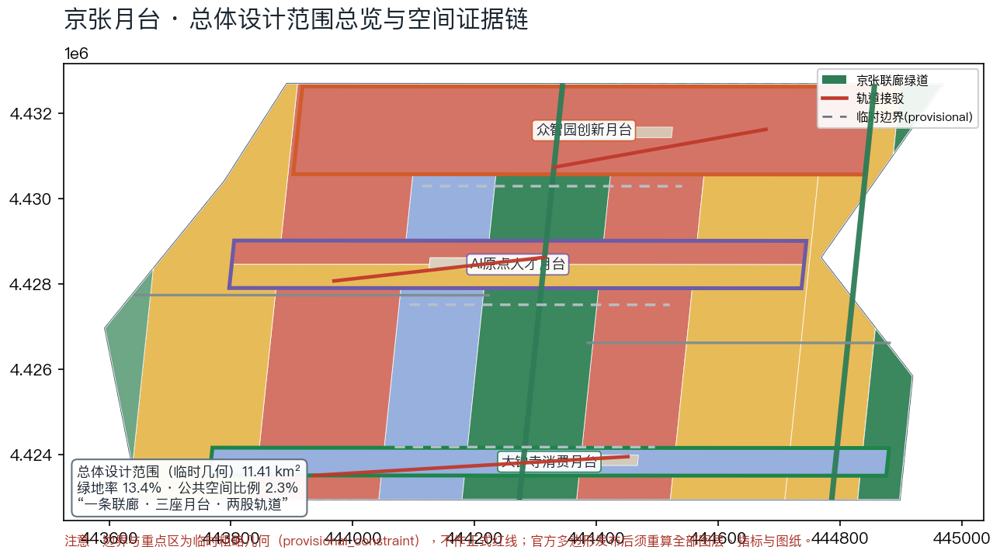
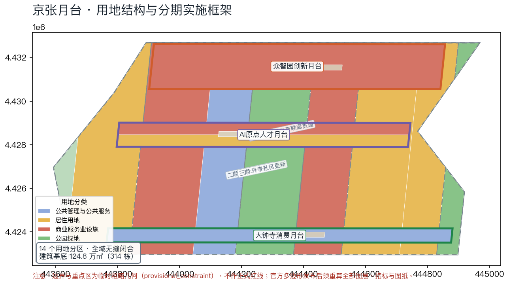
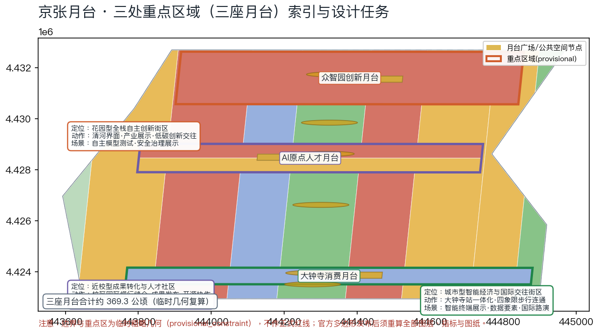
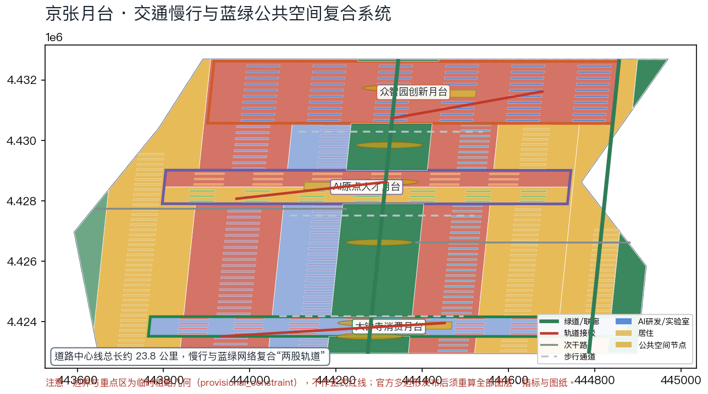
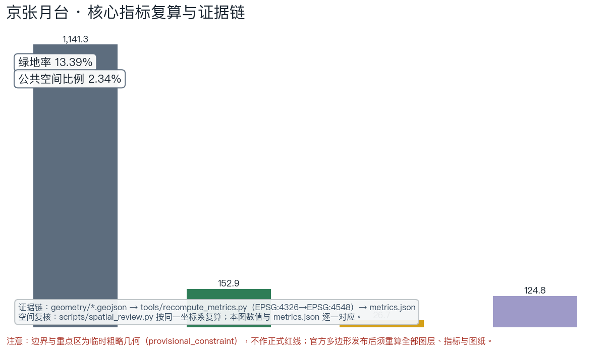

# 京张月台 JINGZHANG PLATFORM:把百年站台变成AI时代开放平台的百年京张AI创新带城市设计方案

## 设计依据与资料清单

本 formal 方案以北京市规划和自然资源委员会海淀分局发布的《百年京张AI创新带城市设计国际方案征集资格预审公告》为第一依据，并以 `brief/site-package/` 中经维护者登记的临时粗略边界、重点区域、枚举、指标和来源清单为机器可读依据。AI agent 在生成方案前必须读取 `design_brief.json`、`allowed_design_space.json`、`sources.json`、`enums/`、`ranges/`、`schemas/`、`data/source_registry.json` 和 `data/processed/agent_fact_pack.md`，并用 `project_scope_summary.csv`、`agent_task_requirements.csv`、`source_use_matrix.csv`、`missing_data_checklist.csv` 建立任务、范围、资料用途和缺口清单。所有设计判断都要拆分为可追溯来源、可复算指标、可校验图层和可人工复核假设。公告要求方案达到控制性详细规划的城市设计深度和规划综合实施方案的城市设计深度，因此文本叙述不能替代 GeoJSON、指标表、A3 文册、A0 展板和 HTML 电子展示成果。

方案不是独立愿景文本，而是从公告、面向智能体任务书和场地资料出发组织成果；本节只把最关键依据放在判断旁边 [source:OFFICIAL-ANNOUNCEMENT] [source:AGENT-TASKBOOK] [depth:existing_conditions_diagnosis]。完整来源和标准覆盖分别保存在 `sources.json`、`standard_matrix.json` 与 `design_depth_matrix.json`，不在正文重复机器索引。

资料登记表的使用边界如下 [source:SOURCE-REGISTRY]：

- data/source_registry.json 登记公开、清权与临时资料的用途边界。
- 当前登记摘要：formal 可用资料 5 条，背景资料 0 条，provisional-only 资料 1 条。
- agent 不得把 background_only 或 provisional_only 资料升级为 official boundary、法定控规、正式评分依据或政府实施承诺。

`data/processed/agent_fact_pack.md` 是本方案的阅读导航层，不是新的权威来源 [source:PROCESSED-FACT-PACK]。它帮助 agent 把三层范围、三处重点区、公告任务、agent.1-agent.6、资料可用性和缺资料事项组织成可读方案；事实判断仍需回到已登记的原始材料 [source:OFFICIAL-ANNOUNCEMENT] [source:AGENT-TASKBOOK]，完整来源关系由 `sources.json` 保存。

本脚手架在官方 `SITE_BOUNDARY` 或三处 `KEY_AREA` 尚未取得时，使用 `brief/site-package/geometry/provisional_boundaries.geojson` 生成临时 formal 包。提交包中的 `geometry/site_boundary.geojson` 与 `geometry/key_areas.geojson` 均必须标注为 `provisional_constraint`、`official_boundary=false`，只能用于方案生成、自检、可视化和设计讨论，不能作为 official redline、审批依据、精确面积依据或法定控制结论。该组织方数据缺口本身不阻断内容评分；替换 official polygons 后，site boundary、key areas、land use、roads、green space、public space、buildings、phasing 和 metrics 均需重算。

本次脚手架生成的可评分状态为：**临时边界，保留精度警示并待正式数据发布后复算；不阻断内容评分**。因此，正文中的空间结构、场景、项目和指标均按“可讨论、可复核、可替换官方边界后重算”的原则写入；当官方边界和重点区 polygon 更新后，agent 必须重新运行脚手架、自检和图纸/HTML生成，不能只替换单个文件。

边界解释可回到总体范围图层和面积复算 [data:geometry/site_boundary.geojson#SITE-001] [metric:site_area_sqm]。三处重点区则由独立图层和数量指标核对 [data:geometry/key_areas.geojson#PROV-KEY-001] [metric:key_area_count]。这意味着读者可以从正文进入证据，但不必先读一串机器编号。

## 三层范围工作框架

方案按照公告确定的三个层次组织工作：统筹研究范围关注 43.6 平方公里的AI产业生态、战略定位、创新链和未来城市形态；总体设计范围关注 11.4 平方公里京张遗址公园周边 1-2 公里城市地区和产业区，要求形成城市更新总体框架、产业空间布局、交通市政支撑和城市风貌控制；重点区域范围关注公告约 368.4 公顷（按提交临时几何复算约 369.3 公顷，`metrics.json` 中的 `key_area_total_area_sqm`）三处详细设计地区，要求明确功能业态、建筑规模、拆改留分类、公共空间连通和交通组织。三层范围在 `compliance_matrix.json` 中逐条映射，保证公告 1.3、1.4、1.5 与 agent.1-agent.6 的必选任务都有章节、图层、指标、图纸和 HTML 证据。

三层工作框架的深度项由 [depth:three_level_scope_framework] 和 [depth:overall_spatial_structure] 约束，空间证据以 [data:geometry/site_boundary.geojson#SITE-001] 与 [data:geometry/key_areas.geojson#PROV-KEY-001] 为准，任务依据以 [standard:PROJECT-OFFICIAL-ANNOUNCEMENT] 为准，范围索引以 [source:PROCESSED-FACT-PACK] 中 `project_scope_summary.csv` 的三层范围表为导航。

三层工作不是互相割裂的图纸集合。统筹研究决定产业链和城市形态判断，总体设计把判断落实到更新项目、空间结构和设施承载，重点区域详细设计验证具体地块、建筑、交通、公共空间和AI应用场景的可实施性。agent 生成方案时必须先锁定当前提交采用的 official 或 provisional 边界和约束，再生成用地、建筑、道路、绿地、公共空间、分期和AI服务节点，最后从这些图层复算指标并在正文解释哪些结论仍受 provisional boundary 限制。任何无法从结构化数据复算的面积、比例、规模或项目数量，不得写入正式结论。

本方案建议的总体概念为“京张月台 JINGZHANG PLATFORM”：把百年京张铁路的“站台”语义转译为AI时代的“开放平台”，形成“一条联廊、三座月台、两股轨道”的空间组织。一条联廊指沿京张遗址公园形成的约 9 公里南北贯通绿道联廊，作为历史与公共空间主轴 [depth:overall_spatial_structure]；三座月台对应三处重点区域——众智园创新月台、AI原点人才月台、大钟寺消费月台，每座月台都有自己的功能业态、公共空间和轨道接驳节点 [data:geometry/key_areas.geojson#PROV-KEY-001] [data:geometry/key_areas.geojson#PROV-KEY-002] [data:geometry/key_areas.geojson#PROV-KEY-003]；两股轨道指中关村服务轨（西侧产业服务复合带，落实为 [data:geometry/land_use.geojson#LU-006] 与 [data:geometry/land_use.geojson#LU-007]）与小月河场景轨（东侧场景研发与生活带，落实为 [data:geometry/land_use.geojson#LU-010] 与 [data:geometry/land_use.geojson#LU-011]）。命名和 logo 视觉以“月台/Platform”为识别符号：站台是等待、会合与出发的场所，平台是开源、开放与协作的场所，两者共用同一个英文词 platform，构成可继续深化的命名系统。这里的“一条联廊”不是额外画出的新红线，而是把公告中的三层范围转译为工作方法；“三座月台”对应三处重点区域；“两股轨道”对应AI+公共服务、产业服务和城市生活的可运营节点；“站台-月台-平台”三级意象对应慢行、绿地、公共空间和活动路线的联动。

| 层级 | 设计问题 | 方案回答 | 数据落点 |
| --- | --- | --- | --- |
| 统筹研究范围 | AI产业生态和未来城市形态如何组织 | 建立“高校策源-开源协作-企业转化-公共体验-国际传播”的创新链 | compliance_matrix.json、standard_matrix.json |
| 总体设计范围 | 产业空间、城市更新、交通市政和风貌如何落图 | 用地、建筑、道路、绿地、公共空间和分期图层共同表达 | [data:geometry/land_use.geojson#LU-001]、[data:geometry/roads.geojson#ROAD-001] |
| 重点区域范围 | 三处片区如何达到详细设计深度 | 分别提出定位、空间动作、AI场景和实施依赖 | [data:geometry/key_areas.geojson#PROV-KEY-001]、[data:geometry/key_areas.geojson#PROV-KEY-002]、[data:geometry/key_areas.geojson#PROV-KEY-003] |

## 统筹研究范围产业与未来城市研究

统筹研究范围的核心任务是构建世界级 AI 创新生态体系。方案应梳理海淀高校院所、头部企业、算力算法数据要素、孵化平台、上市企业、独角兽和科技服务资源，提出AI创新链、产业链、人才链和城市服务链的空间协同框架。命名方案和 logo 设计应服务于“百年京张文化带、都市AI生活体验带、AI融合创新带”的整体辨识度，不能只停留在口号，应说明与产业生态、公共空间和文化资源的关联。面向智能体任务书还要求回应“五大功能”和“三区两翼”协同，形成可继续深化的命名系统、视觉识别、总体空间结构图、场景开放和运营机制；本节必须用 [source:AGENT-TASKBOOK] 与 [standard:PROJECT-AGENT-OPEN-CALL-TASKBOOK] 标注这些要求来自 agent 开源征集任务，而不是法定规划控制。

统筹研究并不新增伪精确红线；它通过 [standard:MOHURD-URBAN-DESIGN-MEASURES] 要求的城市风貌、公共空间和建筑布局统筹，回接 [data:geometry/land_use.geojson#LU-001]、[data:geometry/public_space.geojson#PUBLIC-001] 与 [depth:overall_spatial_structure]，说明产业策略最终要落到可见、可复核的空间结构。

未来城市形态研究应回答人工智能如何改变工作、生活、社交、学习、交通和公共服务。方案应把AI交通系统、连续绿色空间、创新服务设施和国际化生活工作氛围落实为可定位的功能区、节点、廊道和场景，而不是泛泛描述技术愿景。agent 应把产业战略指标、AI创新指数、人才密度、空间供给类型和AI+垂直应用重点区域写入指标体系，并标明哪些是官方、哪些是设计建议、哪些仍待正式数据校准。若提出全球AI创新活动、开发者社区、开放场景或朝圣路线，应写为“概念建议/参考方案/可供专业团队深化研究”，不得写成已经确定的政府活动或实施安排。

### 全球案例转化机制

本方案从全球铁路遗产复兴、大学策源园区和智慧城市治理三类案例中提取可转译机制，作为“概念建议/参考方案”，案例事实以各自公开来源为准：铁路遗产复兴参见国王十字车站更新 [source:CASE-KINGS-CROSS]，大学策源园区参见肯德尔广场 [source:CASE-KENDALL-SQUARE]，智慧城市治理参见裕廊湖区 [source:CASE-JURONG-LAKE-DISTRICT]；其余案例逐条在下方表格中标注来源：

| 案例 | 城市/国家 | 核心机制 | 对京张月台的转译设计 | 转化落点 |
| --- | --- | --- | --- | --- |
| 国王十字车站更新 | 伦敦，英国 | 铁路场站遗产保护与知识经济更新的复合运营，站点成为公共客厅 | 京张遗址公园联廊作为站城一体的公共主轴，以遗产展示承载创新交往 | L1 百年站台纪念廊、联廊公共空间 |
| 肯德尔广场 | 剑桥/波士顿，美国 | 大学策源-企业孵化-人才聚集的紧邻校区创新生态，T 站串联 | AI原点社区围绕高校源头的近校转化街与人才服务 | 场景 07 近校成果转化街、AI原点社区 |
| Station F | 巴黎，法国 | 铁路站房改造为全球最大初创园，以公共活动与投资路演运营 | 月台共享候车亭的站房空间复用逻辑，路演与展示复合 | 场景 11 月台共享候车亭 [source:CASE-STATION-F] |
| 丸之内街区 | 东京，日本 | 轨道站点一体化与街区级城市更新基金，长期资产运营 | 大钟寺站四象限一体化与重点企业周边公共环境更新 | JZ-04 大钟寺站四象限步行连通 [source:CASE-MARUNOUCHI] |
| 裕廊湖区 | 新加坡 | 智慧区试点+治理沙盒的渐进式试验，公开评估后推广 | 城市智能体沙盒与安全治理廊的试点-评估-推广路径 | 场景 02、05，T2 端侧沙盒 |
| 板桥科技谷 | 韩国 | 政府统筹产业园区与人才住房、会展功能的产城一体 | 众智园产业展示、低碳创新交往与人才配套的组合 | 众智园创新月台 [source:CASE-PANGYO] |
| 河套深港合作区 | 深圳/香港 | 跨境要素流动与“试点-推广”制度创新的政策试验空间 | 数据要素会客厅的合规、授权、可审计演示机制 | 场景 08 数据要素会客厅 [source:CASE-HETAO] |

每条机制的转译均只作空间与运营方法的借鉴，不构成对案例所在国政策的引用或背书；案例的运营数据、土地制度和财政安排不可直接移植，需结合海淀现状由专业团队深化 [source:AGENT-TASKBOOK]。

### AI 生态图谱与区域协同

面向智能体任务书的“五大功能”和“三区两翼”要求 [source:AGENT-TASKBOOK]，本方案提出概念版 AI 生态图谱：**高校策源 → 开源协作 → 企业转化 → 公共体验 → 国际传播** 五级链条，分别锚定北大清华等高校院所、开源社区与贡献墙、头部企业/独角兽/孵化平台、AI+公共服务场景和国际路演节点；图谱以 `compliance_matrix.json` 中的 agent.2、agent.5 证据链挂接正文、图层和 HTML，不再重复机器索引 [standard:PROJECT-AGENT-OPEN-CALL-TASKBOOK]。

区域协同层面，本方案以“概念建议/参考方案”定位，说明京张创新带与北京及京津冀创新板块的分工关系，不作为法定规划或政府承诺：

| 协同板块 | 与京张创新带的关系（概念建议） | 协同机制（概念建议） | 数据与实施边界 |
| --- | --- | --- | --- |
| 北纬社区等海淀北部创新社区 | 承接京张创新带的中试放大与规模化研发外溢 | 共享产业链招商图谱与人才服务网络，轨道通勤联系 | 依赖正式分区规划与通勤调查，待深化 |
| 未来科学城（昌平） | 承接前沿科学向产业转化的大科学装置协同 | 创新链上下游分工：策源-中试-制造 | 依赖昌平区规划与项目清单 |
| 怀柔科学城 | 大科学装置与基础研究成果的策源联动 | 高端人才交流与成果路演互访 | 依赖怀柔区规划与装置开放政策 |
| 北京经开区（亦庄） | 承接智能终端与智造环节的规模化转化 | 场景开放与供应链协作、展会互认 | 依赖经开区产业目录与招商政策 |
| 京津冀腹地 | 制造、场景与数据要素的腹地空间 | 场景开放城市联盟与产业飞地协作（概念建议） | 不包含对任何跨省项目的实施承诺 |

区域协同图建议在 A3 文册与 HTML 中作为单独图面表达（当前以本表为文字版）；图中板块边界仅作示意，不得解释为行政或规划边界 [data:geometry/site_boundary.geojson#SITE-001]。

## 总体设计范围城市更新与控规深度城市设计

总体设计范围要求达到控制性详细规划的城市设计深度。方案必须提出城市更新总体空间结构、低效空间识别、更新项目清单、实施政策建议、产业功能比例、空间组织模式、建筑总规模和综合承载能力评估。`geometry/land_use.geojson` 应完整覆盖设计边界且无重叠，`geometry/buildings.geojson` 应表达更新建筑基底或保留建筑基底，`geometry/roads.geojson` 应表达微循环、慢行和轨道接驳关系，`metrics.json` 应复算核心面积、比例和图层数量。

本节按照 [standard:MOHURD-CONTROL-DETAILED-PLANNING] 把控规深度内容拆成可审查对象：[data:geometry/land_use.geojson#LU-001] 表达用地结构，[data:geometry/buildings.geojson#BLDG-001] 表达建筑基底，[data:geometry/roads.geojson#ROAD-001] 表达交通组织，[metric:building_footprint_area_sqm] 用于复核建筑基底面积，[depth:land_use_layout] 与 [depth:development_intensity_controls] 约束成果深度。

总体设计还必须支撑交通、轨道、市政和配套设施。方案应围绕轨道站点一体化、道路微循环、非机动车停放、停车供给、创新服务平台、人才生活服务、新型基础设施、分布式能源和端侧算力提出空间布局和实施路径。涉及建筑高度、开发强度、道路红线、退线和设施标准的内容，若尚无官方控制条件，应写为“待正式控规条件确认”，不得以 agent 推测值冒充审定指标。

## 重点区域详细设计

重点区域详细设计是必选项。众智园AI自主创新加速区应围绕国家人工智能平台、全栈自主创新、标准制定、安全治理、产业展示、对外交通、清河文化、低碳绿色创新交往环境和绿色空间AI场景提出详细方案。北京AI原点社区应围绕近校创新、成果孵化转化、人才特区、开源体系、品牌活动、建筑拆改留、成果展示发布、居住生活配套、校区园区慢行联系和轨道站点一体化提出详细方案。大钟寺AI产业聚集区应围绕领军企业、智能体、智能终端、内容消费、数据要素、数字资产、商业服务、规划绿地复合利用、大钟寺站一体化和路口四象限步行连通提出详细方案。

三处重点区域详细设计必须引用 [data:geometry/key_areas.geojson#PROV-KEY-001]、[data:geometry/key_areas.geojson#PROV-KEY-002]、[data:geometry/key_areas.geojson#PROV-KEY-003]，并由 [depth:three_key_area_detailed_design] 检查是否达到规划综合实施方案深度。若只描述“打造示范区”而没有功能、建筑、交通、公共空间和实施项目证据，应被视为未完成。

三处重点区域必须在 `geometry/key_areas.geojson` 中出现。若仓库已提供 official polygons，应作为 `official_constraint` 使用；若 official polygons 缺失，可暂用 `provisional_constraint`，但正文、HTML、sources、assumptions 和 self_check 必须说明它不能作为正式评分或审批依据。`compliance_matrix.json` 应分别覆盖公告 1.5.3.1、1.5.3.2、1.5.3.3。设计表达应包含功能业态、建筑规模、建筑形态、拆改留分类、公共空间系统、交通组织、慢行连通和实施项目。HTML 页面应能切换查看三处重点区域，A3 文册和 A0 展板应至少包含重点片区总图、局部详图和指标说明。

| 重点片区 | 设计定位 | 空间动作 | AI产业与运营场景 | 证据引用 |
| --- | --- | --- | --- | --- |
| 众智园AI自主创新加速区 | 花园型全栈自主创新街区 | 强化清河界面、产业展示、低碳创新交往和对外交通组织；以绿色空间承载开放测试与标准治理展示 | 自主模型测试、标准制定工作坊、安全治理展示、低碳算力体验 | [data:geometry/key_areas.geojson#PROV-KEY-001]、[depth:three_key_area_detailed_design] |
| 北京AI原点社区 | 近校型成果转化与人才社区 | 组织校区、园区、街区慢行缝合；补足成果发布、人才服务、居住生活和开源协作空间 | 开源社区、成果发布、人才特区服务、近校孵化 | [data:geometry/key_areas.geojson#PROV-KEY-002]、[source:AGENT-TASKBOOK] |
| 大钟寺AI产业聚集区 | 城市型智能经济与国际交往街区 | 围绕大钟寺站一体化、四象限步行连通、商业服务和重点企业公共环境更新 | 智能体与智能终端展示、内容消费、数据要素与国际路演 | [data:geometry/key_areas.geojson#PROV-KEY-003]、[metric:key_area_count] |

## AI 创新生态、人才画像与 AI+ 场景

方案应建立面向AI人才和企业的空间需求画像，覆盖研发办公、开源协作、成果发布、企业服务、人才居住、社交学习、消费生活、运动休闲和国际交往。AI+场景应围绕公告提出的交通、服务、消费、医疗、教育、法律、生活服务等方向，形成产业发展场景和AI赋能城市功能场景。每个场景应说明服务对象、空间位置、数据来源、隐私边界、人工复核机制和运营主体。

AI 场景必须落到空间和治理边界：公共空间场景引用 [data:geometry/public_space.geojson#PUBLIC-001]，慢行与交通场景引用 [data:geometry/roads.geojson#ROAD-001]，开放空间场景引用 [data:geometry/green_space.geojson#GREEN-001] 和 [metric:public_space_ratio]、[metric:green_ratio]。这些引用让评审者知道场景不是口号，而是位于具体图层和指标中的设计对象。面向智能体任务书要求不少于10张AI场景卡、不少于3个产业测试验证场景和不少于5类用户画像；脚手架只给出结构，正式参赛者必须把场景卡、画像表、隐私边界、人工复核和运营主体写入正文、HTML、A3/A0 和合规矩阵。

| 用户画像 | 典型需求 | 空间响应 | 自检边界 |
| --- | --- | --- | --- |
| 开源开发者 | 发布、协作、测试、社区声誉 | 原点社区开源发布厅、公共代码墙、夜间协作空间 | 不采集个人行为轨迹；活动数据只做聚合统计 |
| 初创团队 | 低成本办公、算力入口、产品试验场 | 众智园共享测试场、端侧算力服务点、标准治理咨询 | 算力和数据服务需另行授权 |
| 头部企业访客 | 展示、商务、国际接待、人才招聘 | 大钟寺国际路演客厅、轨道站点接驳、重点企业周边公共空间 | 企业标识和案例须清权 |
| 周边居民 | 通勤、休闲、社区服务、低扰动更新 | 京张遗址公园慢行环、社区服务嵌入、夜间照明和活动分级 | 不将居民画像用于商业推荐 |
| 高校师生 | 成果转化、跨校协作、日常慢行 | 校区-园区慢行缝合、成果转化驿站、AI教育体验点 | 校园数据和科研成果需授权 |

| 场景卡 | 空间节点与类型 | 设计说明 | 数据治理与隐私边界 | 成熟度·试点周期·人工复核·退出机制 | 量化KPI（概念指标） |
| --- | --- | --- | --- | --- | --- |
| 01 开源发布厅 | 北京AI原点社区·公共建筑首层/社区开放节点 | 面向高校、开源社区和初创团队，提供成果发布、代码贡献展示和小型路演空间 | 发布会内容与名单公开；不采集个人行为轨迹，活动数据仅聚合统计 | 成熟度M1概念；试点12个月；线下同步发布保证等价访问；退出：连续两季参与不足即调整档期 | 年发布≥24场，月均参与≥200人次 |
| 02 安全治理沙盒 | 众智园·花园型街区开放节点 | 将标准制定、安全评测、模型红队测试转译为可参观、可预约、可监管的展示和协作节点 | 仅使用提交方授权的评测样本；过程数据可审计、可撤回 | 成熟度M1概念；试点6个月+第三方评估；评测结果人工复核后发布；退出：安全事件即停 | 年评测≥12批次，年发布合规报告≥2份 |
| 03 端侧算力驿站 | 总体设计范围·公共服务设施节点 | 与公共服务、企业服务和低碳能源策略结合，作为待深化的新型基础设施原型 | 仅聚合匿名化能耗与负载数据，不关联个人 | 成熟度M1概念；试点18个月；运营主体轮值并人工巡检；退出：能效或安全不达标即撤 | 首期≥3处，服务可用率≥95% |
| 04 AI慢行导航 | 京张遗址公园活力带·慢行廊道 | 用可解释导视和低侵入传感帮助识别慢行断点、拥挤节点和无障碍需求 | 不采集个体轨迹，仅输出聚合断点与拥堵提示 | 成熟度M1概念；试点12个月+人工巡检复核；断点清单与无障碍工单公开；退出：误报率超标即停用 | 断点清单季度更新，无障碍工单闭环≤30天 |
| 05 大钟寺国际路演客厅 | 大钟寺·站城一体商业节点 | 服务智能体、智能终端和内容消费企业的展示、洽谈、媒体发布和国际交流 | 直播与媒体发布须经嘉宾书面授权；访客数据最小化 | 成熟度M1概念；年度排期制；档期与内容由运营方人工审核；退出：档期不足降级为共享会议 | 年路演≥20场，国际场次占比≥30% |
| 06 清河低碳创新廊 | 众智园临清河界面·滨水蓝绿空间 | 把绿色空间、雨洪、步行骑行和AI展示结合，作为园区公共客厅 | 环境传感数据仅聚合展示，不识别个体 | 成熟度M1概念；随清河界面项目分期试点；雨洪与生态数据人工复核；退出：生态扰动即停 | 年开放测试日≥6次，参与企业≥30家 |
| 07 近校成果转化街 | 北京AI原点社区·校区园区缝合段 | 面向高校成果转化，组织孵化、展示、法务、知识产权和投融资服务 | 成果信息按授权分级公开，校园与科研数据须授权 | 成熟度M1概念；试点24个月；高校成果处参与复核；退出：授权缺失即下线 | 年转化对接≥100项，孵化入驻≥20家 |
| 08 数据要素会客厅 | 大钟寺·商业与轨道复合节点 | 以合规、授权、可审计为前提，展示数据要素和数字资产流通的城市服务界面 | 合规、授权、可审计三前置；不展示未授权数据 | 成熟度M1概念；试点12个月+第三方审计；退出：审计违规即停 | 年合规演示≥10场，审计报告≥2份 |
| 09 AI生活服务样板街 | 社区与商业交汇处·小尺度街区 | 将医疗、教育、法律、生活服务等AI+场景落到可运营的小尺度街区空间 | 公共服务导引不采集健康与教育隐私数据 | 成熟度M1概念；试点18个月；线下等价服务同步运营；退出：服务覆盖不足即调整 | 服务响应≤15分钟，满意度≥85% |
| 10 全球AI活动周路线 | 一带公共空间系统·联廊与广场节点 | 形成从遗址文化、开源社区、产业展示到国际路演的可步行、可传播体验路线 | 报名数据最小化，仅用于活动组织与安全 | 成熟度M1概念；年度排期+公安报备；活动安全人工核验；退出：安全不达标即取消 | 年活动≥30场，年参与≥10万人次 |
| 11 月台共享候车亭 | 三座月台广场与联廊节点·候车复合空间 | 以候车-等待的月台语义组织共享办公、会议、快闪展示和休憩的复合候车空间 | 预约即用即走，不追踪停留行为 | 成熟度M1概念；试点12个月；候车功能冲突评估后调整；退出：影响候车即取消复合功能 | 月台使用率≥40%，快闪展示≥50场/年 |
| 12 开源协作贡献墙 | AI原点社区与大钟寺路口象限·公共界面 | 以数字化贡献墙形式展示开源、标准、数据集与社区治理的公共参与成果 | 贡献数据经用户授权后公开，可随时申请下线 | 成熟度M1概念；长期运营；社区治理委员会人工复核内容；退出：内容违规即撤除 | 年贡献项目≥60个，志愿者≥300人 |

方案设置三个产业测试验证场景，面向任务书对“不少于3个产业测试验证场景”的必选要求，每个场景说明服务对象、空间位置、数据来源、隐私边界、人工复核机制和运营主体 [source:AGENT-TASKBOOK]：

| 测试验证场景 | 空间载体 | 验证内容 | 数据与隐私边界 | 成熟度·试点周期·人工复核·退出机制 | 量化KPI（概念指标） |
| --- | --- | --- | --- | --- | --- |
| T1 开放模型评测场 | 众智园创新月台·园区平台节点 | 自主模型的能力评测、安全评测、标准符合性验证 | 仅使用提交方授权的评测样本；不采集个人行为轨迹 | 成熟度M2验证；试点12个月；评测结果由第三方机构复核后发布；退出：评测失实即停 | 年评测批次≥12，年标准工作坊≥4场 |
| T2 端侧AI城市服务沙盒 | 总体设计范围服务节点·道路与公共服务复合节点 | 端侧算力、智能导视、慢行感知的现场试验 | 传感器数据聚合后匿名化；个人可识别信息不落地 | 成熟度M2验证；试点18个月；城市管理部门授权试点、街道共建并人工巡检；退出：授权撤销或安全事件即停 | 试点节点≥3处，巡检报告月报公开 |
| T3 智能终端消费体验场 | 大钟寺消费月台·商业公共空间节点 | 智能终端、智能体、内容消费的可用性与合规演示 | 消费体验数据仅用于演示环境；明确告知并取得同意 | 成熟度M2验证；试点12个月；商家与平台联合运营、演示数据定期清理并人工复核；退出：合规审计不通过即停 | 年合规审计≥2次，演示体验≥5000人次 |

agent 生成的AI治理建议必须遵守数据最小化、公开来源、可解释和人工复核原则。城市智能体可以辅助识别慢行断点、公共空间热力、设施维护、企业服务需求和活动安全风险，但不能替代规划审批、不能输出未经授权的个人画像、不能声称获得官方实施承诺。所有AI场景节点应进入结构化图层或合规矩阵，便于评审者看到它们与产业、空间和公共利益之间的关系。

面向智能体任务书对“不少于5类用户画像”的要求，本方案在核心画像外补充包容性画像，全部作为“概念建议” [source:AGENT-TASKBOOK]：

| 包容性画像 | 典型需求 | 空间与AI服务响应 | 线下等价服务与自检边界 |
| --- | --- | --- | --- |
| 老年人 | 大字与语音导视、坐下即达、不会用智能终端也能办事 | 联廊无障碍座椅带、语音/大字双模导视、窗口人工优先 | 所有AI服务均保留窗口、电话与上门线下等价服务 |
| 儿童 | 安全路径、家长可见的活动空间、AI科普体验 | 儿童友好慢行环、限速与监护提示、科普展示不采集儿童数据 | 儿童活动区人工值守；教育类AI内容由教师复核 |
| 残障人士 | 全通道无障碍、盲文与触觉地图、轮椅与视障导航 | 触觉地图/盲文导视、坡道与升降设备、AI导航的人工复核路线 | 无障碍设施巡检月报公开；无障碍工单30天闭环 |
| 低收入人群 | 免费公共服务、廉价通勤与休闲、就业与技能机会 | 公共服务驿站免费时段、公益技能培训空间、廉价餐饮与活动 | 收费AI服务必须提供免费基础档，避免数字付费门槛 |
| 照护者 | 推婴儿车/轮椅的宽通道、休息与协助点 | 联廊宽通道与母婴/照护休息室、求助呼叫点 | 照护点人工服务与呼叫响应公示 |
| 非智能终端用户 | 不装APP也能查询、预约、反馈 | 公共终端、电话、窗口与人工柜台等效服务链 | 公众参与与申诉渠道必须支持非数字化入口 |

包容性机制与算法治理共同落地（概念建议）：**线下等价服务**——每个AI场景配窗口、电话或人工柜台等效通道，数字服务不得替代而只能增强；**公众参与渠道**——年度开放日、街区议事会与线上反馈并行的参与闭环，参与记录不用于商业画像；**算法申诉渠道**——对智能体建议、评分或调度结果可人工申诉，由非算法人员复核并限期答复；**人工可访问性检查**——每年由第三方机构按无障碍规范人工检查公共空间与界面，检查报告公开 [standard:MOHURD-URBAN-DESIGN-MEASURES]。

## 用地、建筑规模与拆改留方案

用地方案应依据国土空间调查、规划、用途管制分类等公开标准表达，形成完整、闭合、无缝的用地分区。建筑方案应区分保留、改造、更新、新建或待确认对象，明确建筑基底、功能、规模、风貌、屋顶、体量和高度控制的建议层级。若缺少现状建筑、权属、控规和工程条件，方案只能提出方法和待校准清单，不能编造拆改留结论。

用地分类依据 [standard:MNR-LAND-USE-CLASSIFICATION-GUIDE]，建筑高度、体量、界面和风貌控制由 [depth:height_massing_character] 管理，拆改留方法由 [depth:retain_renovate_demolish] 管理。用地和建筑的主要证据是 [data:geometry/land_use.geojson#LU-001]、[data:geometry/buildings.geojson#BLDG-001] 和 [metric:building_footprint_area_sqm]。

建筑规模和强度指标必须与 `metrics.json` 和图层一致。若总建筑规模、容积率、建筑高度、建筑密度、绿地率、退线和建筑控制线缺少官方条件，应在指标体系中列为 unknown 或 pending_control，不得用固定数值制造精确感。A3 文册应给出更新项目清单和指标复核表，A0 展板应把关键空间结构和重点片区表达清楚，HTML 页面应提供指标和图层联动查看。

## 交通、轨道、市政与公共服务设施

交通方案应回应公告对轨道站点一体化、道路微循环、慢行断点、对外交通、停车、非机动车停放和绿色交通系统的要求。重点应覆盖北五环、京张遗址公园跨环路节点、五道口、清华东路西口、大钟寺站及重点企业周边交通联系。本方案道路网以“一环一脊多支”组织，道路中心线总长约 23.8 公里 [metric:road_network_length_m]，其中联廊绿道承担慢行主轴，机动车道侧重微循环和轨道接驳。道路和慢行图层应保持在提交边界内，并与公共空间、绿地、产业节点和重点片区相互校核；若提交边界为 provisional，交通结论也只能作为临时设计讨论。

交通和市政专业深度分别由 [depth:traffic_rail_slow_parking] 与 [depth:municipal_new_infrastructure] 约束；图层证据引用 [data:geometry/roads.geojson#ROAD-001]、[data:geometry/public_space.geojson#PUBLIC-001] 和 [data:geometry/constraints.geojson#CONSTRAINTS]。当道路红线、管线、消防和市政条件缺失时，应通过 assumptions 说明待补，而不是把策略写成审定条件。

市政和公共服务设施应覆盖AI产业服务设施、创新服务平台、人才生活服务设施、新型基础设施、分布式能源、端侧算力和传统市政设施融合。方案应说明设施标准、空间布局、服务半径、运营模式和分期实施逻辑。缺少管线、能源、排水、防洪、消防等工程资料时，应列为正式深化前置条件。

## 蓝绿空间、公共空间与城市风貌

蓝绿空间方案应以京张遗址公园活力带为骨架，统筹清河、小月河、周边高校、企业、社区出行需求，提出南北贯通、东西连通的步道、骑行道和绿色空间体系。方案应识别慢行断点、上跨环路节点、公园南端和北端景观节点，提出停车、体育、创新交往、科技测试、应用展示和公共服务复合利用策略。

蓝绿公共空间由设计深度项和绿地、公共空间图层共同校核 [depth:blue_green_public_space] [data:geometry/green_space.geojson#GREEN-001] [data:geometry/public_space.geojson#PUBLIC-001]。按提交几何在 EPSG:4548 下统一复算，绿地率约 13.4%（13.3947%）、公共空间比例约 2.3%（2.3376%）[metric:green_ratio] [metric:public_space_ratio]，绿地与公共空间比例的设计意义在正文解释，完整复算与公式保存在 `metrics.json`；城市风貌、公共空间和建筑控制的统筹则回到专业标准矩阵 [standard:MOHURD-URBAN-DESIGN-MEASURES]。

城市风貌方案应融合京张铁路历史文化、中关村创新文化和AI创新文化，利用清华园火车站、北影等文化资源，提出城市基调、建筑风貌、屋顶形态、体量、界面和公共艺术引导。agent 还应提出导视标识、文化符号、国际传播叙事、AI朝圣地标、贡献墙或荣誉展示体系，但所有品牌、字体、图像、肖像和企业标识都必须有清权来源。风貌控制应分清官方管控、设计建议和待确认条件，严禁在没有文保或控规依据时给出伪精确控制线。

方案提出三处 AI 朝圣地标，均作为“概念建议/参考方案”，不作为已确定的政府活动或实施安排 [source:AGENT-TASKBOOK] [metric:pilgrimage_landmark_count]：

| 朝圣地标 | 空间位置 | 叙事与功能 | 清权与运营边界 |
| --- | --- | --- | --- |
| L1 百年站台纪念廊 | 京张联廊北端众智园入口 | 以京张铁路站台历史为起点，展示铁路文化、城市更新与AI创新的时间线 | 历史影像与文物资料须获得馆藏方清权 |
| L2 开源共创庭 | AI原点社区联廊节点 | 面向全球开发者的开源、路演、贡献与荣誉展示的露天场地 | 开源徽标、企业标识与个人肖像须清权 |
| L3 智能钟广场 | 大钟寺站前四象限公共空间 | 以“大钟”意象转译为智能报时与数据可视化的城市地标 | 轨道站点产权与广告位管理须与运营方协商 |

### 命名、Logo 与视觉规范

命名系统延续正文的“京张月台 JINGZHANG PLATFORM”双语义：**站台是等待、会合与出发的场所，平台是开源、开放与协作的场所**，中英文共用“月台/Platform”一词形成可延展的命名族：京张月台（总体）、众智园创新月台/AI原点人才月台/大钟寺消费月台（三座月台）、月台共享候车亭与开源共创庭（节点级）[source:AGENT-TASKBOOK]。

Logo 与视觉规范作为**概念建议**提出，供专业团队深化，不构成品牌授权：

| 视觉要素 | 概念建议 | 设计意图 | 清权与使用边界 |
| --- | --- | --- | --- |
| Logo 主形 | 以“月台檐口+轨道断面”几何化为开放平台图形，负形构成站台雨棚意象 | 同时表达铁路遗产（站台）与开放协作（平台） | 本方案不包含任何第三方商标、徽标或字体；深化前须完成商标查重与字体清权 |
| 色彩系统 | 京张铁路灰（主）、AI靛蓝（数字）、联廊绿（蓝绿空间）、月台金（公共空间）四色体系 | 与图纸、HTML、A3/A0 的图层配色一致 | 色彩仅为本方案概念定义，不主张专有 |
| 字体 | 中文 PingFang/Hiragino、英文 Helvetica/Arial 的系统字体栈 | 保证离线评审环境的可渲染性 | 不使用需授权的商业字体；离线文件全部嵌入开源字体路径 |
| 图形语言 | 台架式构图：轨道线、联廊线、月台节点与数字标引的统一线型 | 让图纸、图表与导视共用同一图形语言 | 图形语言随本方案开放复用 |

### 导视系统与国际传播叙事

导视系统按“区域级-联廊级-节点级”三级组织（概念建议）：区域级以总体范围地图与地铁口导视衔接；联廊级以“站台-月台-平台”三级意象的里程与里程碑导视串联历史与创新叙事；节点级以无障碍多模导视（盲文、语音、触觉地图、大字）保证包容性可达。所有导视内容使用中英双语，文化符号（站台编号、轨距线、里程石）须与文保单位确认后使用，不得臆造历史信息。

国际传播叙事建议采用“一句主张、三根支柱”的框架（概念建议）：主张句为“把百年站台变成AI时代开放平台”；三根支柱为**遗产**（百年京张铁路的世界级遗产叙事）、**开放**（开源协作、场景开放与治理透明的平台叙事）、**生活**（AI与公共服务、慢行与蓝绿生活的城市叙事）。传播对象覆盖全球开发者、国际企业与学术机构、入境游客与媒体；内容形态包括双语主题地图、全球AI活动周路线、数字展板与短视频脚本。全部传播物料需完成版权清权与事实核验，且不宣称任何政府背书 [source:AGENT-TASKBOOK]。

## 更新项目清单、实施政策与分期计划

实施方案应形成可审查的更新项目清单，说明项目位置、类型、功能、责任主体、依赖条件、实施阶段、风险和评估指标。政策建议应覆盖城市更新统筹实施、空间供给、运营机制、产业服务、公共参与、数据治理和产权协同。`geometry/phasing.geojson` 应表达分期范围，`compliance_matrix.json` 应把每个任务与分期和图纸挂接。

项目清单和分期深度由 [depth:renewal_project_list] 与 [depth:phasing_implementation] 管理，分期空间证据为 [data:geometry/phasing.geojson#PHASE-001]。如果没有权属、资金、实施主体和审批路径，方案必须把它写成实施风险，而不是承诺落地。

| 项目编号 | 项目名称 | 类型 | 主要依赖 | 证据引用 |
| --- | --- | --- | --- | --- |
| JZ-01 | 京张遗址公园慢行断点缝合 | 公共空间/交通 | 道路红线、桥下空间、交通组织复核 | [data:geometry/roads.geojson#ROAD-001] |
| JZ-02 | 众智园清河创新界面 | 蓝绿空间/产业展示 | 河道蓝线、生态和防洪条件 | [data:geometry/green_space.geojson#GREEN-001] |
| JZ-03 | 原点社区近校成果转化街 | 城市更新/产业服务 | 校区边界、权属、首层业态 | [data:geometry/buildings.geojson#BLDG-001] |
| JZ-04 | 大钟寺站四象限步行连通 | 轨道一体化/慢行 | 轨道站点、道路交叉口、市政管线 | [data:geometry/public_space.geojson#PUBLIC-001] |
| JZ-05 | AI公共服务与端侧算力节点 | 新基建/公共服务 | 能源、算力、安全和运营主体 | [data:geometry/constraints.geojson#CONSTRAINTS] |
| JZ-06 | 全球AI活动周公共路线 | 运营/品牌 | 公共空间许可、活动安全、版权清权 | [data:geometry/phasing.geojson#PHASE-001] |

分期应与 100 天征集设计周期形成区分：征集周期是提交成果的时间要求，实施分期是城市更新和项目建设的推进路径。方案应提出近期试点、中期更新和长期治理框架，并标明哪些内容可先以轻量设施、运营活动和服务平台启动，哪些必须等待正式控规、市政、交通和权属条件确认。对于年度活动体系、开发者社区运营、场景开放日、公共体验路线和国际传播机制，正文应说明运营对象、频率、责任边界、转化路径和风险，不得只写宣传口号。

### 年度活动、开发者社区与长期运营转化机制

本方案将运营机制作为“概念建议/参考方案”写入，运营对象、频率、责任边界与转化路径如下，任何活动均以取得公共空间许可、活动安全报备和版权清权为前提 [source:AGENT-TASKBOOK]：

| 运营板块 | 概念活动（示例） | 频率与对象 | 责任边界 | 转化路径与量化KPI（概念指标） |
| --- | --- | --- | --- | --- |
| 年度活动体系 | AI开发者节、场景开放日、智能体竞赛路演、京张记忆公共体验月 | 季度1场主题+月度社区活动；面向开发者、企业、居民与游客 | 主办方承担安全、版权与数据合规责任；政府不背书商业活动 | 活动→场景开放→试点意向；年活动≥30场、年参与≥10万人次 |
| 开发者社区 | 开源项目协作营、贡献墙荣誉榜单、每周技术夜谈 | 每周线上+月度线下；面向全球开发者与高校社团 | 社区治理委员会人工审核内容与荣誉；荣誉数据可申请下线 | 开源贡献→企业采用→人才引进；年贡献项目≥60个、志愿者≥300人 |
| 场景开放机制 | 场景清单发布、试点遴选、成果公开评估 | 每年发布场景清单并开放申报；面向企业与科研团队 | 试点须取得授权并接受第三方评估；退出机制公开 | 场景清单→试点→成果发布；年开放场景≥10项、试点转化≥5项 |
| 国际传播机制 | 双语主题地图、全球AI活动周路线、国际路演季 | 年2场国际路演+持续双语内容；面向全球企业与媒体 | 内容事实核验与版权清权；不宣称政府背书 | 传播→国际企业考察→落地接洽；年国际交流≥20场 |

运营机制与前期可启动事项对应：轻量设施与运营活动（候车亭、贡献墙、路演客厅、活动路线）可在公共空间许可框架内先行试点；涉及控规、权属、轨道与市政的内容仍以“待正式条件确认”处理。开发者社区荣誉体系（贡献者徽章、季度榜单、年度贡献榜）由社区治理委员会运营，与 L2 开源共创庭、场景 12 开源协作贡献墙联动。

### 公共空间组件库与荣誉体系

为支撑三座月台与联廊的成套化实施，本方案提出概念版公共空间组件库——由可复用的设施组件与设计参数构成，供后续设计深化引用，不构成任何产品清单或采购承诺：

| 组件 | 设计要点（概念建议） | 复用场景 |
| --- | --- | --- |
| 月台候车亭组件 | 站台檐口意象+共享办公/快闪/休憩复合功能，模块化可拆装 | 三座月台广场、联廊节点（场景 11） |
| 导视与里程石组件 | 三级导视+里程石文化符号，中英双语、无障碍多模 | 联廊全线、站点与节点入口 |
| 贡献墙组件 | 数字化贡献展示+实体荣誉榜，可申请下线 | AI原点社区、大钟寺路口象限（场景 12） |
| 绿廊座椅与遮荫组件 | 无障碍座椅带+遮荫乔木+照明分级 | 联廊慢行带、清河界面、社区交汇处 |
| 无障碍坡道与触觉地图组件 | 全通道无障碍+盲文触觉地图，巡检月报公开 | 全部公共空间节点 |
| 快闪与展陈组件 | 可移动展架、路演台与灯光音响接口 | 路演客厅、活动周路线、安全治理沙盒 |

荣誉体系与组件库联动：贡献者与参与者的荣誉展示（徽章、榜单、共建铭牌）作为公共空间组件入库，参与数据最小化且可撤回；共建铭牌设置须经公共空间管理方批准，不得变相广告化 [source:AGENT-TASKBOOK]。

## 指标体系、面积复算与合规矩阵

指标体系至少应包含总体设计范围面积、重点区域面积、绿地与公共空间比例、建筑基底、更新项目数量、AI场景节点、慢行连通指标、产业空间指标、人才服务指标和自检状态。所有 known 指标必须能从 GeoJSON 或可信来源复算；unknown 指标必须给出原因和正式提交前置条件。`scripts/spatial_review.py` 和 `scripts/visual_review.py` 的结果是 formal 自检的重要证据。

指标复算遵循统一的设计深度要求 [depth:metrics_recalculation]。正文重点解释指标的设计含义，例如总体范围如何约束空间分配、蓝绿和公共空间比例如何支撑日常交往；完整数值、公式、来源文件和置信度保存在 `metrics.json`。示例关键指标可由总体范围和绿地数据复核 [metric:site_area_sqm] [data:geometry/green_space.geojson#GREEN-001]。

合规矩阵是任务响应性的主控文件。每条公告任务和 agent_taskbook 任务必须对应到报告章节、图层、指标、图纸、HTML 页面、来源、假设和自检项。未能覆盖公告 1.3、1.4、1.5 或 agent.1-agent.6 的任一必选任务，方案不得进入 formal professional scoring。

正式深化时，agent 还应把每个指标分为三类：第一类是可由提交几何直接复算的空间指标，例如边界面积、绿地比例、公共空间比例、建筑基底面积和分期面积；第二类是需要官方控规或任务书附件支撑的管控指标，例如容积率、建筑高度、建筑密度、退线、道路红线和设施标准；第三类是需要运营或产业数据持续校准的绩效指标，例如 AI 创新指数、人才密度、产业服务满意度、慢行可达性、活动参与度和场景使用频次。三类指标应分别进入 `metrics.json`、`assumptions.json` 和 `compliance_matrix.json`，避免把运营愿景误写成审定规划条件。

## 风险、版权与合规说明

**要求双语言。** 方案主文件可使用中文或英文，但必须通过 `proposal.en.md` 或 `proposal.zh.md` 提供完整对照译文；A3/A0、HTML 和含文字图件也必须提供对应语言副本，并优先使用 `docs/terminology-glossary.md` 的赛事推荐译法。v2 包缺少任一必需译稿、语言映射或有效文件时，finalize 与 CI 会阻断提交。所有图片、图纸、图标、数据和代码资产必须在 `sources.json` 或 `report/copyright_statement.md` 中说明来源、许可和授权状态。HTML 页面不得加载远程脚本、远程地图瓦片、远程字体、iframe、表单或外部 API，不得跟踪评审者行为。

风险和缺资料清单由风险深度项、约束图层和场地包共同校核 [depth:risk_missing_data] [data:geometry/constraints.geojson#CONSTRAINTS] [source:SITE-PACKAGE]。`missing_data_checklist.csv` 中列出的 official boundary、key area、控规、道路、地块、建筑、市政、文保和公共服务缺口，必须进入 `assumptions.json`、自检和正文风险章节。任何缺少官方控规、道路红线、权属、市政、消防或文保条件的结论，都必须降级为待确认事项；完整专业核对保存在标准矩阵中。

本方案不声称官方批准、审定控规、最终土地权属、最终建设规模或保证实施。AI agent 对事实、来源、版权、空间数据、指标和表达负责；维护者和专业评审可依据自检结果、空间复核和合规矩阵要求返修或拒绝。

## 参考资料

- brief/public-brief.md
- brief/site-package/design_brief.json
- brief/site-package/allowed_design_space.json
- brief/site-package/enums/
- brief/site-package/ranges/planning_limits.json
- data/processed/agent_fact_pack.md
- data/processed/project_scope_summary.csv
- data/processed/agent_task_requirements.csv
- data/processed/source_use_matrix.csv
- data/processed/missing_data_checklist.csv
- 完整机器索引：见 `sources.json`、`metrics.json`、`compliance_matrix.json`、`standard_matrix.json` 与 `design_depth_matrix.json`
- 本节书目入口依据场地包登记，完整出处和许可见结构化来源清单 [source:SITE-PACKAGE]
